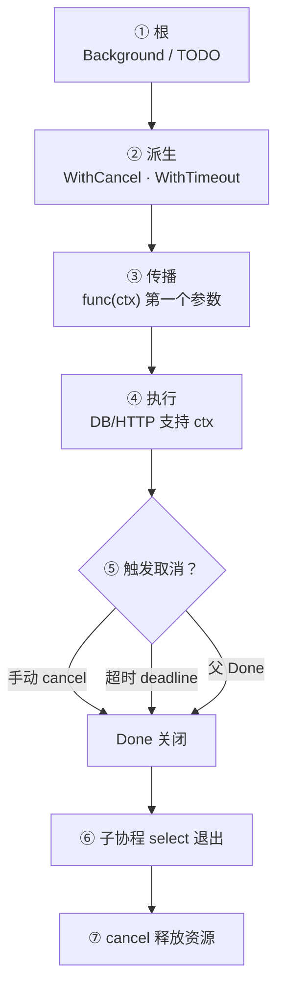
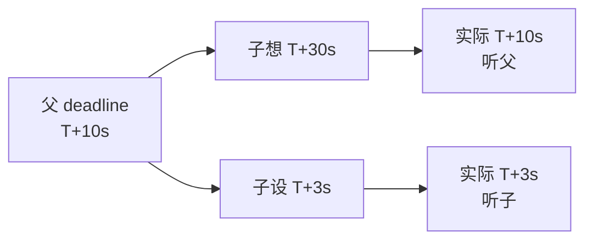
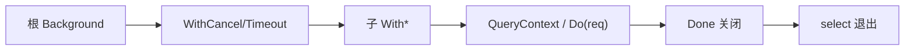
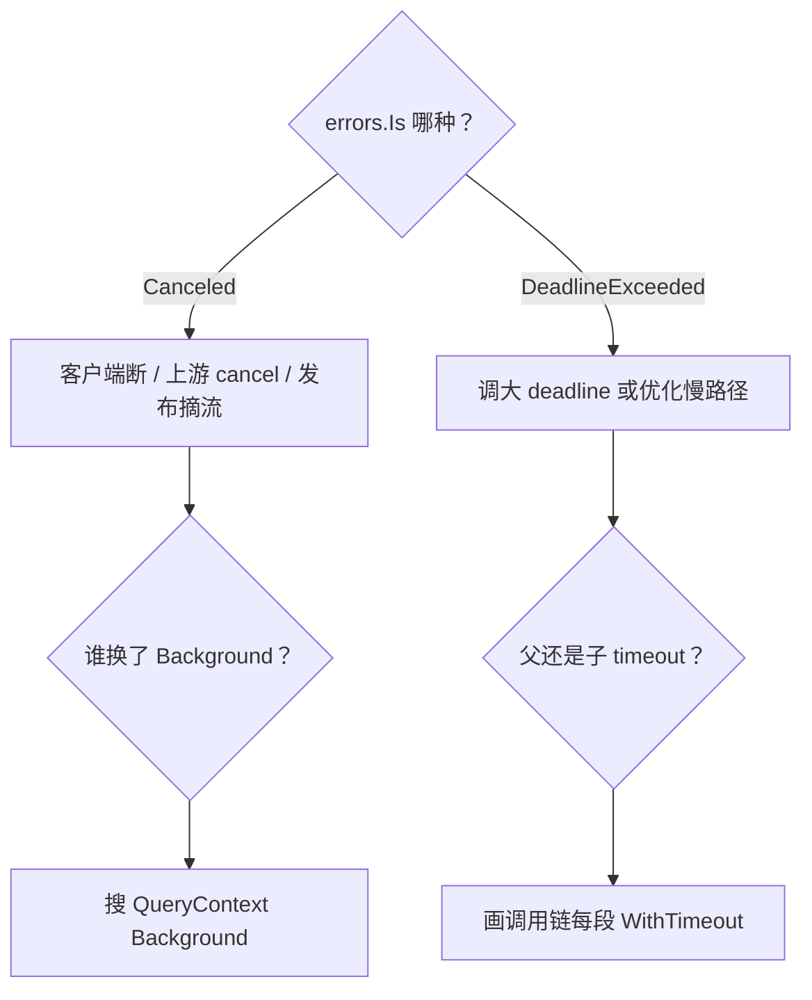

# 08｜context取消与超时传播 · SRE 开发能力

> 滚动发布时旧 Pod 的 RPC 还在跑，新请求已经 504；有人 `context.Background()` 传到底层 DB，取消发布等于 `kill -9`；子任务 `WithTimeout` 5s、父任务 3s，到底听谁的——线上日志一片 `context canceled` 却没人知道谁 cancel 的。
> **本章回答**：一个 **context** 从 `WithCancel`/`WithTimeout` 创建到 `Done` 关闭、沿调用链传播的一生——谁派生、谁负责 `cancel()`、超时怎么叠、值该怎么用。
> **不讲**：goroutine 泄漏总论 → [05](../05-goroutine与调度模型/)；`select` 语法 → [06](../06-channel与select/)；`errgroup` 编排 → [09](../09-errgroup与并发限流/)；HTTP 优雅退出全貌 → [10](../10-HTTP-Server与优雅退出/)。

**标记**：🎯重点 · 🔥难点 · ⭐常考 · 🔧实操

---

## 面试怎么考

| 标记 | 考点 |
|------|------|
| **核心** | 树形派生；父 cancel 子全 cancel；`ctx.Err()` 判因 |
| **必会** | `defer cancel()`；别把 ctx 存 struct；超时用 `WithTimeout` |
| **常用** | `http.Request.Context()`；gRPC metadata 透传 |
| **常考** | `WithValue` 滥用；Background vs TODO；取消不是杀 goroutine |

> 📝 **面试（30 秒）**：`context` 管 **取消信号和截止时间** 沿调用链向下传，不管数据（数据走参数/channel）。根用 `Background()`/`TODO()`；派生 `WithCancel`（手动停）、`WithTimeout`/`WithDeadline`（到时自动 cancel）。**谁派生谁 `defer cancel()`**，否则 timer 泄漏。父 `Done` 关闭，所有子 ctx 的 `Done` 也关——一次取消整棵子树。`ctx` 作函数**第一个参数**，不存成员字段。取消只发信号，**goroutine 要自己 `select ctx.Done()` 退出**。

---

## 能力边界

| 机制 | 管什么 | 不管什么 |
|------|--------|----------|
| `context` | 取消、超时、截止、请求级元数据（慎用 Value） | 数据载荷、错误聚合 |
| `channel` | 数据、任务、所有权 | 跨 API 边界标准取消 |
| `WaitGroup` | 等 goroutine 结束 | 超时、原因传递 |
| `errgroup` | 多任务 + 首错取消（[09](../09-errgroup与并发限流/)） | 单独用时需自己绑 ctx |

- 🔑 **各管一段**
  - `Done` / `Err`：发取消信号、说明原因——**不**杀 goroutine
  - `WithTimeout`：定截止时间——**不**自动拆端到端预算（要自己分层）
  - `WithValue`：请求级诊断元数据——**不**当参数包
  - 标准库 `*Context` API：阻塞点接取消——没有就怀疑库太老

> ⚠️ **别混**：标准库 HTTP、gRPC、database/sql 都把 `ctx` 当取消入口——运维读 trace 时 `context canceled` 要会往上追谁 timeout，而不是当 500 狂重试。

---

## 语言最小集

| 零件 | 示例 | 含义 |
|------|------|------|
| Background / TODO | `context.Background()` | 空根；TODO = 占位意图 |
| WithCancel | `ctx, cancel := context.WithCancel(p)` | 手动关 Done |
| WithTimeout | `WithTimeout(p, 3*time.Second)` | 到点自动 cancel |
| WithDeadline | `WithDeadline(p, t)` | 绝对时间截止 |
| cancel | `defer cancel()` | 释放 timer / 关 Done |
| Done | `<-ctx.Done()` | 只读 channel，关闭即返回 |
| Err | `ctx.Err()` | `Canceled` / `DeadlineExceeded` |
| Deadline | `ctx.Deadline()` | 截止时间 + ok |
| Value | `ctx.Value(key)` | 请求级元数据（慎用） |
| 第一参 | `func f(ctx context.Context, …)` | 传播约定 |

```go
ctx, cancel := context.WithTimeout(parent, 3*time.Second)
defer cancel()
select {
case <-ctx.Done():
    return ctx.Err()
case result := <-ch:
    return handle(result)
}
```

零件认完，上主图。

---

## 一、一张图：context 从派生到传播的一生 ⭐

> 🎯 **一句话**：根 ctx → `With*` 派生子 ctx → 业务层层传参 → `Done` 关闭 → 各层 `select` 退出 → `cancel()` 释放 timer。



- 📖 **读图**
  - 🛤️ 主线七站：根 → 派生 → 传参 → 干活 → 触发 → 退出 → 清理；卡在哪一站就查哪一站
  - 🚨 开篇现场：换 `Background()` = 断在 **③**；子 5s 父 3s 听谁 = **②** deadline 取更紧；`canceled` 泛滥 = 先分 **⑤** 是 Canceled 还是 DeadlineExceeded（Q1、Q14）

本节对应练习题 Q1、Q14。主线有了——先钉根 ctx。

---

## 二、根：Background 与 TODO ⭐

> 🎯 **一句话**：`Background()` 是空根 ctx，永不过期；`TODO()` 占位，语义上「还没定用哪个父 ctx」。

```go
ctx := context.Background()
ctx := context.TODO()
```

- 🌱 **两个根各干什么**
  - `Background()`：`main`、测试根、库函数缺省
  - `TODO()`：重构中、接口尚未接上游 ctx
  - 两者行为几乎相同，**区别是意图**——生产 `main` 用 `Background()` 再 `WithCancel` 派生应用生命周期 ctx

#### ❓ 为什么还要分 Background 和 TODO？

- 🏷️ **意图文档**：静态检查 / Code Review 能扫出「还没接上游」的 TODO
- ❌ **长期 Background**：需要可取消却一直挂空根 → 上游断了下游还跑
- ✅ **可取消任务**：立刻 `WithCancel` / `WithTimeout` 派生一层

> ⚠️ **别混**：需要可取消时别长期用 `Background()`——派生一层 `WithCancel`。

本节对应练习题 Q1、Q2。根清了，看 WithCancel。

---

## 三、派生：WithCancel ⭐🔥

> 🎯 **一句话**：`WithCancel(parent)` 返回 `(ctx, cancel)`；调 `cancel()` 或 parent 取消 → 本 ctx `Done` 关闭。

```go
ctx, cancel := context.WithCancel(context.Background())
defer cancel() // ← 必须，释放子树资源

go worker(ctx)
// 某处
cancel() // 通知 worker 停
```

### 📌 规则三件套

- **谁 `WithCancel` 谁 `defer cancel()`**（在创建派生的那层函数）
- `cancel()` **可多次调用**，幂等
- 不把 `cancel` 传给不熟的控制流——只在本层或明确 owner 调

```go
func run(ctx context.Context) error {
    ctx, cancel := context.WithCancel(ctx)
    defer cancel()
    // ...
}
```

> 💡 **打个比方**：父 ctx 是总闸刀，子 ctx 是分闸——拉总闸，全楼断电；只拉分闸，不影响别的楼层。

#### ❓ 为什么子 cancel 不会停父？

- ⬇️ **只向下**：父取消 → 所有子孙 `Done` 关
- ⬆️ **不向上**：子取消 **不会** 取消父——别的兄弟分闸还亮着
- 🧠 错答「整棵树一起停」= 把「父→子」听成了双向

> 📝 **面试**：`WithCancel` 不杀 goroutine，只关 channel；worker 必须监听 `Done`。口诀：**「谁 WithCancel 谁 defer cancel」**。

本节对应练习题 Q3、Q4。Cancel 懂了，看超时。

---

## 四、派生：WithTimeout 与 WithDeadline ⭐🔥

> 🎯 **一句话**：到时自动 `cancel()`；`WithTimeout` = `WithDeadline(now+d)`。

🔥 大白话：**超时不是「再等一会儿」**，是到点关掉 Done；子超时如果比父松，实际仍听父的——取的是更紧的那把闸。

```go
ctx, cancel := context.WithTimeout(parent, 3*time.Second)
defer cancel()

req, err := http.NewRequestWithContext(ctx, "GET", url, nil)
```

```go
deadline := time.Now().Add(5 * time.Second)
ctx, cancel := context.WithDeadline(parent, deadline)
defer cancel()
```

### ⏱️ 超时叠加 ⭐

子 deadline **不能晚于**父——取**更早**的截止：

```go
parent, _ := context.WithTimeout(bg, 10*time.Second)
child, _ := context.WithTimeout(parent, 30*time.Second)
// child 实际 ~10s 就死，听父的

parent, _ := context.WithTimeout(bg, 10*time.Second)
child, _ := context.WithTimeout(parent, 3*time.Second)
// child ~3s
```



- 📖 **读图**
  - 🧱 父 deadline 是硬顶；子只能更严不能更松
  - 📏 开篇「子 5s 父 3s」→ 实际 ~3s；日志若写「子超时 5s」会误导（Q5、Q6）

#### ❓ 为什么子超时写更长仍听父的？

- 🌳 **一棵树一个时间轴**：子孙共享祖先的截止约束
- ✅ **语义**：`WithTimeout(parent, d)` =「在 parent 仍有效的前提下，再给自己最多 d」——不是另开一条无关时钟
- 🛠️ 现场：画调用链每段 `WithTimeout`，找**最先到期**的那层

### 💸 不 defer cancel 的泄漏

`WithTimeout` 内部有 timer；**不 `cancel()`** 且 ctx 未自然到期 → timer 挂到堆直到触发——高 QPS 下泄漏。

#### ❓ 为什么必须 `defer cancel()`？

- ⏰ **timer 在堆上**：自然到期前不调 `cancel`，timer 一直占着
- ✅ **即使已成功返回也要调**：`cancel` 幂等，提前释放
- 🔍 **现场**：`WithCancel` 同样建议 `defer`——释放子树关联资源

```go
if deadline, ok := ctx.Deadline(); ok {
    log.Printf("deadline=%v remaining=%v", deadline, time.Until(deadline))
}
```

### 📐 超时预算怎么拆 🔧

> 🎯 **一句话**：**端到端 deadline** 在入口设一次，内层用 **剩余时间** 或按比例分配，别每层都满额 `WithTimeout(parent, 5s)`。

```go
func handler(ctx context.Context) error {
    // 入口 middleware 已 WithTimeout(3s)
    return callDownstream(ctx) // 不要再叠 3s，用同一 ctx
}

func callDownstream(ctx context.Context) error {
    if deadline, ok := ctx.Deadline(); ok {
        log.Printf("remaining=%v", time.Until(deadline))
    }
    return rpc(ctx)
}
```

- ❌ **反模式**：每层各 `WithTimeout(5s)`，父只有 3s——内层以为有 5s，实际 3s 就死，日志难读
- ✅ **入口定总预算**，下游透传或只收紧，不另开「满额」时钟

⭐ 面试必考：子超时取更紧的那个。本节对应练习题 Q5、Q6。超时会了，看传播。

---

## 五、传播：函数签名与 HTTP ⭐

> 🎯 **一句话**：`ctx` 放**第一个参数**；`http.Request.Context()` 从入口一路传到底。

```go
func Handle(w http.ResponseWriter, r *http.Request) {
    ctx := r.Context()
    if err := service.Do(ctx, r.URL.Query()); err != nil {
        if errors.Is(err, context.Canceled) {
            // 客户端断开，常打 499 或不记 error
            return
        }
        http.Error(w, err.Error(), 500)
    }
}
```

```go
func (s *Service) Do(ctx context.Context, q url.Values) error {
    return s.repo.Query(ctx, q.Get("id"))
}
```

### 🚫 反模式两连

```go
type Bad struct {
    ctx context.Context // ← 不要
}

func query(ctx context.Context) {
    db.QueryContext(context.Background(), sql) // ← 上游取消传不下去
}
```

#### ❓ 为什么不能把 ctx 存进 struct？

- ⏳ ctx 生命周期绑定**单次请求**；存字段易活到下次请求或泄漏旧 cancel 树
- ✅ **每次调用当参数传入**；结构体只存依赖（client、repo）
- 🔌 换 `Background()`：客户端走了，DB 还查——浪费连接、拖慢发布

### 📚 标准库入口一览 ⭐

> 🎯 **一句话**：凡阻塞/可能慢的 API，找 `XxxContext(ctx, ...)` 变体——没有就怀疑库太老。

- 🗄️ `database/sql`：`QueryContext`、`ExecContext`
- 🌐 `net/http`：`NewRequestWithContext`、`Request.Context()`
- 🔌 `net`：`DialContext`、`ListenConfig`
- 🧰 `os/exec`：`CommandContext`
- 📡 gRPC：每个 RPC 第一个参数 `ctx`

```go
rows, err := db.QueryContext(ctx, "SELECT id FROM users WHERE id=?", id)
if err != nil {
    if errors.Is(err, context.Canceled) {
        return nil // 或特殊处理
    }
    return err
}
```

> 📝 **面试**：`NewRequestWithContext`、`QueryContext`、`DialContext` 族函数是标准传播点。

本节对应练习题 Q7、Q8。签名钉死，看接收端。

---

## 六、接收端：怎么听取消 ⭐🔧

> 🎯 **一句话**：阻塞操作用 `ctx` 版 API；自写循环用 `select` + `Done`。

```go
select {
case <-ctx.Done():
    return ctx.Err()
case result := <-ch:
    return handle(result)
}
```

```go
for {
    if err := ctx.Err(); err != nil {
        return err
    }
    // 短步进工作
}
```

- 🔁 长循环别只开头查一次——每轮或每 N 次查 `ctx.Err()`
- 📡 有现成 `*Context` API 就用，别自己另起一套取消协议

### 🏷️ ctx.Err() 含义

- `context.Canceled`：手动 `cancel()` 或客户端断开
- `context.DeadlineExceeded`：超时到期

```go
if errors.Is(err, context.Canceled) { ... }
if errors.Is(err, context.DeadlineExceeded) { ... }
```

- 📊 日志里区分：**Canceled** 常是正常（用户关页面）；**DeadlineExceeded** 常要告警调超时
- 🔌 客户端断开识别：`errors.Is(err, context.Canceled)`——配合反向代理 `499` 日志

### 🧱 取消不中断正在进行的 syscall

`QueryContext` 会尽量取消网络等待，但**已进内核**或忽略 ctx 的库可能拖到完。graceful 还要配合连接池超时、应用 deadline。

#### ❓ 为什么「取消了」请求还在跑？

- 📡 **信号 ≠ 强杀**：ctx 只关 `Done`；必须有人 `select` / `*Context` API 去听
- 🐢 已进入忽略 ctx 的阻塞调用 → 等到返回才能退出
- ✅ 换支持 ctx 的 API；外层再加硬超时兜底（见九节 Client.Timeout）

本节对应练习题 Q9。怎么听 Done，进 WithValue。

---

## 七、WithValue：能不用就不用 ⭐

> 🎯 **一句话**：`WithValue` 传**请求级元数据**（trace id）；不是泛型 map，键要用**未导出类型**防冲突。

```go
type traceKey struct{}

ctx = context.WithValue(parent, traceKey{}, traceID)
v := ctx.Value(traceKey{})
```

- 🧭 官方建议：优先函数参数；Value 只放跨 API 边界的诊断信息
- 🔭 OpenTelemetry 等会挂 trace——这是合法用途

#### ❓ 为什么 string key 不行、大对象也不行？

- 🔑 **string key 易冲突**：不同包都用 `"user"` → 互相覆盖
- ✅ **未导出类型**作 key：包外碰不到
- 🐘 别用 Value 传 `*User` 大对象——生命周期和可见性都难控；数据走显式参数

> ⚠️ **别混**：Value **不参与**取消树；取消靠 `Done`，元数据靠 Value——两回事。

```go
// 反模式
ctx = context.WithValue(ctx, "user", user) // string key 易冲突
```

口诀：**「WithValue 能不用就不用」**。练习题 Q10。值边界清了，看协作。

---

## 八、与 goroutine、channel 协作 ⭐

> 🎯 **一句话**：`cancel` 后还要 `Wait` goroutine 真退出；`select` 里 `Done` 与业务 channel 并列。

```go
ctx, cancel := context.WithCancel(parent)
defer cancel()

var wg sync.WaitGroup
wg.Add(1)
go func() {
    defer wg.Done()
    for {
        select {
        case <-ctx.Done():
            return
        case job := <-jobs:
            process(job)
        }
    }
}()

cancel()
wg.Wait()
```

#### ❓ 为什么只 cancel 不够？

- 🚪 cancel 只贴告示「该停了」；不 `Wait` → 发布时 goroutine 可能还在写（[05](../05-goroutine与调度模型/) 泄漏/数据损坏）
- ✅ **cancel + Wait**（或 `errgroup`）成对
- 📦 `errgroup.WithContext` 把 cancel+wait+首错 打包 → [09](../09-errgroup与并发限流/)

### 👨‍👩‍👧 父任务等多子任务

```go
ctx, cancel := context.WithTimeout(parent, 5*time.Second)
defer cancel()

errCh := make(chan error, 2)
go func() { errCh <- taskA(ctx) }()
go func() { errCh <- taskB(ctx) }()

for i := 0; i < 2; i++ {
    select {
    case <-ctx.Done():
        return ctx.Err()
    case err := <-errCh:
        if err != nil {
            cancel() // 一脚踩停另一条
            return err
        }
    }
}
```

本节对应练习题 Q11。协作会了——先收束机制，再上生产模板。

---

## 九、收束：context 凭什么能统一取消

> 🎯 **一句话**：树形派生 + `Done` channel + 标准库全族 `*Context` API = 一条取消线拉到底。



- 📖 **读图**
  - 🌱 根只出生一次；每一层 `With*` 挂一节
  - 🔌 阻塞 API 接上 `Done`；关闭后全链退出——缺任一环就「取消无效」

**可背清单**：

- 根：`Background`/`TODO`
- 派生：`WithCancel` / `WithTimeout` / `WithDeadline`
- 规则：`defer cancel()`；ctx 第一参；不存 struct
- 传播：父 cancel → 子全死；子 deadline ≤ 父
- 接收：`select Done` 或 `*Context` API
- Value：仅 trace 类元数据，私有 key

> ⚠️ **别混**：取消 ≠ 杀进程；goroutine 要合作退出。context **线程安全**，可多 goroutine 读 `Done`/`Err`。

> 📝 **面试**：记「树 + Done + 标准 Context API」三件套；再补「谁派生谁 defer」。

本节对应练习题 Q1。收束完，生产模板。

---

**回到开头那个现场**：旧 Pod RPC 还在跑、层层 Background、子 5s 父 3s 听谁的。正确剧本是：请求级 ctx 贯穿到底 → 谁派生谁 defer cancel → 超时预算由外向内拆紧 → 日志带 cause。现在再看那片 `context canceled`，你知道该怎么查了。

## 十、生产模板：HTTP 客户端超时链 🔧

> 🎯 **一句话**：外层请求 ctx 定总预算；内层 `http.Client` 设 `Timeout` 作兜底，两层取更严。

```go
func fetch(ctx context.Context, url string) ([]byte, error) {
    ctx, cancel := context.WithTimeout(ctx, 2*time.Second)
    defer cancel()

    req, err := http.NewRequestWithContext(ctx, http.MethodGet, url, nil)
    if err != nil {
        return nil, err
    }
    client := &http.Client{
        Timeout: 3 * time.Second, // 兜底，应 ≥ 或配合 ctx
    }
    resp, err := client.Do(req)
    if err != nil {
        return nil, err
    }
    defer resp.Body.Close()
    return io.ReadAll(resp.Body)
}
```

#### ❓ 为什么还要设 Client.Timeout？

- 🛡️ **ctx 可能没人听**：下游库忽略 `Request.Context` 时，Client 层硬超时兜底
- ⏱️ **先触发的赢**：`Client.Timeout` 与 ctx deadline 都设时，谁先到谁停
- 🏭 生产倾向 **只信 ctx**，`Client.Timeout` 设略大于 ctx 防 hung

### gRPC

```go
ctx, cancel := context.WithTimeout(ctx, time.Second)
defer cancel()
resp, err := client.Ping(ctx, &pb.Req{})
```

metadata / trace 通过 `metadata.NewOutgoingContext` 挂，不是 Value 乱塞。

本节对应练习题 Q7、Q12。模板拿走，看优雅退出。

---

## 十一、优雅退出：应用级 context 🔧

> 🎯 **一句话**：`main` 派生 `appCtx`，信号 `cancel()`，HTTP `Shutdown` 用同一 ctx 限时。

```go
func main() {
    ctx, cancel := context.WithCancel(context.Background())
    defer cancel()

    srv := &http.Server{Addr: ":8080", Handler: mux}
    go func() {
        sig := make(chan os.Signal, 1)
        signal.Notify(sig, syscall.SIGINT, syscall.SIGTERM)
        <-sig
        cancel()
        shutCtx, shutCancel := context.WithTimeout(context.Background(), 30*time.Second)
        defer shutCancel()
        _ = srv.Shutdown(shutCtx)
    }()
    _ = srv.ListenAndServe()
}
```

- 🛎️ 请求 handler 用 `r.Context()`，与 `appCtx` 在 Shutdown 时一并取消
- 📘 完整剧本 → [10](../10-HTTP-Server与优雅退出/)

### http.Server 与 BaseContext

```go
srv := &http.Server{
    Addr: ":8080",
    BaseContext: func(net.Listener) context.Context {
        return appCtx // 给每个请求的根（少用）
    },
}
```

多数场景 handler 用 `r.Context()` 足够；`BaseContext` 用于注入服务级值（仍慎用 Value）。

本节对应练习题 Q13。退出会了，测试与作战。

---

## 十二、测试里的 context

> 🎯 **一句话**：测试根用 `Background()` + 短 `WithTimeout` 逼 hang；测取消就手动 `cancel()`。

```go
func TestFetch(t *testing.T) {
    ctx, cancel := context.WithTimeout(context.Background(), time.Second)
    defer cancel()
    err := fetch(ctx, server.URL)
    require.NoError(t, err)
}
```

```go
func TestCancel(t *testing.T) {
    ctx, cancel := context.WithCancel(context.Background())
    done := make(chan struct{})
    go func() {
        <-ctx.Done()
        close(done)
    }()
    cancel()
    select {
    case <-done:
    case <-time.After(time.Second):
        t.Fatal("not canceled")
    }
}
```

- ⏱️ 测试超时要 **短**，逼出 hang
- 🌱 `context.Background()` 在测试根 OK；测取消用 `WithCancel` 手动 `cancel()`

本节对应练习题 Q11。测试会了，作战。

---

## 十三、作战：context canceled 泛滥怎么查 ⭐🔥

> 🎯 **一句话**：先分 `Canceled` vs `DeadlineExceeded`，再画调用链找谁设的 timeout、谁换了 Background。



- 📖 **读图**
  - 🔀 第一刀永远是 **Err 类型**；Canceled 别当 500 风暴重试
  - 🧭 DeadlineExceeded → 画父子 deadline；Canceled → 搜 `Background()` 断链

| 现象 | 先做 | 别做 |
|------|------|------|
| 发布时大量 canceled | 查 handler 是否传 ctx 到下游 | 当 500 重试风暴 |
| DB 慢 + canceled | 看 deadline 是否短于 P99 | 无限加大 timeout |
| timer 泄漏 | 搜 `WithTimeout` 缺 `defer cancel` | 只盯 goroutine 不盯 timer |

**60 秒剧本** 🔧：

- **0–10s**：日志里 `Canceled` vs `DeadlineExceeded` 比例
- **10–30s**：trace 找最外层 `WithTimeout` 谁设的
- **30–45s**：搜 `Background()` 在业务路径的滥用
- **45–60s**：核对 `defer cancel()` 与 `Shutdown` 超时

本节对应练习题 Q13、Q14。定责完，收口。

---

## 踩坑清单

| 现象 | 原因 | 修法 |
|------|------|------|
| timer 涨 | 无 defer cancel | 每个 With* defer |
| 取消无效 | Background 调下游 | QueryContext 传原 ctx |
| 子超时更长 | 误解 deadline | 画父子链，取更紧 |
| goroutine 泄漏 | 只 cancel 不 Wait | wg / errgroup |
| Value 冲突 | string key | 私有类型 key |
| Canceled 当 500 | 客户端断开当故障 | 分 Err 类型，499 降噪 |

---

## 必会 · 常考

| 说法 | 对错 | 口径 |
|------|:----:|------|
| 父 cancel 子全 cancel | 对 | 只向下 |
| 子 cancel 会停父 | 错 | 不向上 |
| 必须 defer cancel | 对 | 放 timer |
| 取消自动杀 goroutine | 错 | 要 select Done |
| ctx 可存 struct 字段 | 错 | 按请求传参 |
| 子 timeout 可超过父 | 错 | 父是硬顶 |
| WithValue 传业务大对象 | 错 | 仅元数据 |
| Canceled 都告警 | 错 | 客户端断常正常 |

**易混**：Background vs TODO；Canceled vs DeadlineExceeded；cancel vs Wait；Value vs 函数参数；Client.Timeout vs ctx deadline。

---

## 收口

### 命令速查 🔧

```bash
# 代码审查
rg 'context\.Background\(\)' --glob '*.go'
# 缺 defer cancel 的 WithTimeout / WithCancel
rg 'WithTimeout|WithCancel' -A2 --glob '*.go' | rg -v 'defer cancel'
# string key 嫌疑
rg 'WithValue\(.*,\s*"' --glob '*.go'
```

### 面试锚点

| 问 | 30 秒答 |
|----|---------|
| Background vs TODO | 行为同，意图不同；可取消任务别长期 Background |
| 为何要 defer cancel | 释放 timer；WithCancel 也建议 defer |
| 父 10s 子 30s | 子仍 ~10s，取更早 deadline |
| 取消如何传到 DB | `QueryContext(ctx, ...)` |
| WithValue 怎么用 | 少用；未导出 key；不传业务大对象 |
| 取消为何不杀 G | 只关 Done；要 select / Context API |

### 易错一句话对照

```text
错：cancel 会自动停 goroutine
对：只关 Done，要 select

错：ctx 存全局 / struct 字段
对：按请求当第一参数传递

错：子 timeout 能超过父
对：父是硬顶，取更早 deadline

错：WithValue 当参数包
对：显式函数参数；Value 仅 trace 类

错：Canceled 都当错误告警
对：客户端断开常正常

错：每层都 WithTimeout(5s)
对：入口定总预算，内层透传或收紧
```

### 数字墙

> ctx **第一参数** · 每次 `With*` 都 **`defer cancel`** · 子 deadline **≤** 父 · Shutdown 常用 **30s** grace（见 [10](../10-HTTP-Server与优雅退出/)）· `Done` 关闭后 recv **立即**返回 · `Canceled` vs `DeadlineExceeded` 先分再查。

---

## 合上书

对着第一节主图口述一遍，卡住就回对应小节。开头 Background 断链 / 子超时听父 / 只 cancel 不 Wait——各自错在哪，现在该能说清。

- [ ] **默画** context 一生：根 → 派生 → 传播 → Done → cancel 清理（Q1、Q14）
- [ ] 口述 `WithCancel` 与 `WithTimeout` 区别及 defer 原因（Q3、Q5）
- [ ] 父 10s 子 3s / 父 10s 子 30s 各多少秒死（Q5、Q6）
- [ ] 写 handler 把 `r.Context()` 传到 `QueryContext` 的骨架（Q7、Q8）
- [ ] 说明取消为何不自动杀 goroutine，要怎么写退出（Q9、Q11）
- [ ] `Canceled` 与 `DeadlineExceeded` 各代表什么（Q9、Q14）
- [ ] 列举两个 ctx 反模式（存 struct、换 Background）（Q7、Q8）
- [ ] `WithValue` 正确用途与 string key 为何不好（Q10）
- [ ] HTTP 发布时 context canceled 排查三步（Q13、Q14）
- [ ] 说明 `errgroup.WithContext` 与裸 ctx 的关系（链到 [09](../09-errgroup与并发限流/)）

全部打勾后，找同事十分钟讲清「发布 canceled 泛滥 / 层层 Background 现场怎么查」。讲得下来，你就是下一个能拦住断链的人。

下一章：[09 errgroup与并发限流](../09-errgroup与并发限流/)。
