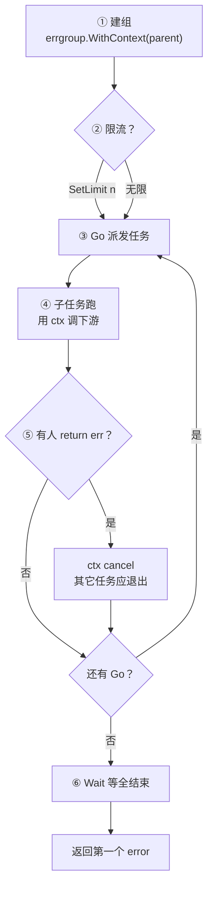
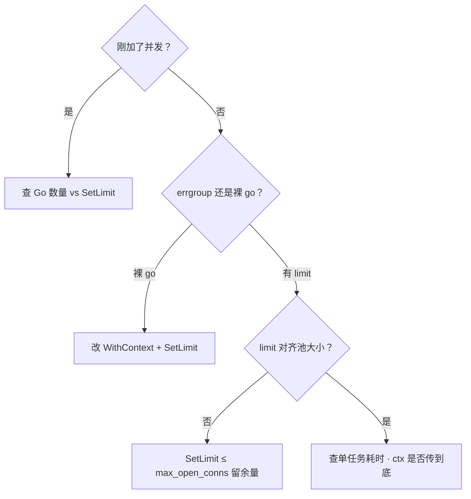

# 09 errgroup与并发限流 · 知识点

> 大家好，欢迎来到这次分享。开讲之前，先带大家回到一个很多值班同学都踩过的现场：
> 批量同步 500 个下游 URL，有人 `for _, u := range urls { go fetch(u) }`，下游 429、内存飙、最后 `WaitGroup` 对不上；有人手写 `errCh` + `cancel` + `wg`，漏一处就泄漏或首错收不住；还有人 `errgroup.Group` 无限 `Go`，以为「并发就是快」，结果 DB 连接池打穿。
> 这一章讲完，你会知道当时那几个人各自错在哪——裸 go 无上限、手写 errCh 漏 cancel、errgroup 无限 Go，都会把下游和自己一起打穿。
> **本章回答**：一组并发任务从 **`errgroup` 创建**、**`Go` 派发**、**首错 cancel**、**`Wait` 收束**到 **semaphore 限流** 的一生——怎么编排、怎么限、怎么和 `context` 绑。
> **不讲**：`context` 取消树 → [08](../08-context取消与超时传播/)；channel/select 语法 → [06](../06-channel与select/)；goroutine 泄漏总论 → [05](../05-goroutine与调度模型/)；HTTP Shutdown → [10](../10-HTTP-Server与优雅退出/)。这些都有专门的章节，本章只在用到时点到为止。

**标记**：🎯重点 · 🔥难点 · ⭐常考 · 🔧实操

**怎么听这场分享**：咱们先看「errgroup 任务组的一生」主图；后面按 WaitGroup+error、WithContext、SetLimit、semaphore、选型一站一站展开；作战节拆 429 与连接池打穿。生产模板代码一字不改。每一节讲完提示对应练习题。

🔥 口诀补一句：**「并发上限对齐下游，不对齐自己人」**——后面 SetLimit / semaphore 节会钉死。


## 面试怎么考

| 标记 | 考点 |
|------|------|
| **核心** | `errgroup.WithContext` 首错 cancel；`Wait()` 返回第一个 error |
| **必会** | `SetLimit(n)` 限并发；semaphore 与 worker pool 选型 |
| **常用** | 批量 RPC/HTTP；fan-out fan-in；与 `WaitGroup` 对比 |
| **常考** | 无限 `Go` 的风险；`Go` 里 panic 行为；限流不是 `GOMAXPROCS` |

**30 秒怎么说**：`golang.org/x/sync/errgroup` 把 **多 goroutine + 首错取消 + Wait** 打包。`g, ctx := errgroup.WithContext(parent)`——任一子任务 `return err != nil`，ctx 自动 cancel，其它任务应 `select ctx.Done()` 退出。`g.Go(fn)` 启动任务，`g.Wait()` 阻塞到全结束，返回**第一个非 nil error**（`errors.Join` 不默认做）。Go 1.20+ `g.SetLimit(n)` 限制**同时运行**的子任务数，是应用层限流；别和 `GOMAXPROCS`（CPU 并行度）混。需要更细队列/backpressure 用 buffered channel worker pool 或 `semaphore.Weighted`。


本节对应练习题目录先扫一眼。

---

## 能力边界

| 机制 | 管什么 | 不管什么 |
|------|--------|----------|
| `errgroup` | 任务编排、首错传播、可选并发上限 | 单个任务内部重试策略 |
| `context` | 取消信号沿调用链 | 并发度、错误聚合 |
| `WaitGroup` | 等 goroutine 结束 | 首错 cancel、error 返回 |
| `GOMAXPROCS` | OS 线程并行度（[12](../12-GOMAXPROCS与容器cgroup/)） | goroutine 数量、下游 QPS |
| semaphore | 同时占用的「槽位」 | 任务优先级、公平性 |

运维场景：活动批处理、多 AZ 探活、K8s 多对象 patch——**要** errgroup + limit；**不要** 裸 `go` 风暴。


本节对应练习题 Q1。边界清了——看主图。

---

## 一、一张图：errgroup 任务组的一生

> 🎯 **一句话**：`WithContext` 建组 → `SetLimit` 定并发 → `Go` 派活 → 首错 cancel ctx → 各任务听 `Done` 退出 → `Wait` 收束返回 err。



**读图**：生命周期 owner 通常是**一次批处理函数**——进去 `WithContext`，出来 `Wait()`。`SetLimit` 在第一个 `Go` 前调。子任务必须用派生 `ctx` 调 HTTP/DB，cancel 后快速失败。`Wait` 之后不要再 `Go`（未定义行为/竞态）。


本节对应练习题 Q1、Q14。主线有了——先看基础 Group。

---

## 二、基础 Group：WaitGroup + error ⭐

> 🎯 **一句话**：零依赖版 errgroup 心智——`Go` = `wg.Add`+`go`，`Wait` = `wg.Wait`+取首 err。

```go
import "golang.org/x/sync/errgroup"

func fetchAll(ctx context.Context, urls []string) error {
    g := new(errgroup.Group)
    for _, u := range urls {
        u := u // 闭包
        g.Go(func() error {
            return fetch(ctx, u)
        })
    }
    return g.Wait()
}
```

| 方法 | 作用 |
|------|------|
| `Go(f func() error)` | 启动 goroutine 跑 f |
| `Wait() error` | 等全部结束，返回**第一个**非 nil error |

**与 WaitGroup**：errgroup 内置 wg，且**收集 error**。没有 `WithContext` 时，**首错不会 cancel**——其它任务照跑，除非自己传共享 err 或 ctx。

> 💡 **打个比方**：Group 像工头登记工人；WithContext 版工头还拉闸断电（cancel）。


本节对应练习题 Q1、Q2。基础会了，看 WithContext。

---

## 三、WithContext：首错取消 ⭐🔥

> 🎯 **一句话**：`g, ctx := errgroup.WithContext(parent)`——任一 `Go` 的 fn 返回 err → **自动 cancel 派生 ctx**。

大家想想：一个分片 replicate 失败，其余分片还该继续狂跑吗？很多人会答「要跑完才知道全貌」——**线上通常错了**。首错 cancel 是为了快速止血、省资源；要全量汇总用别的模式。

```go
func syncShards(ctx context.Context, shards []int) error {
    g, ctx := errgroup.WithContext(ctx)
    for _, id := range shards {
        id := id
        g.Go(func() error {
            return replicate(ctx, id)
        })
    }
    return g.Wait()
}
```

### 规则

- **子任务用 errgroup 派生的 `ctx`**，别偷偷用 parent 绕开 cancel  
- 返回 error 触发 cancel；`return nil` 不影响  
- `Wait()` 返回的 err **就是**某个子任务返回的那个（通常第一个写入的）  
- cancel 后仍在跑的任务应快速 `return ctx.Err()`  

```go
g.Go(func() error {
    req, _ := http.NewRequestWithContext(ctx, "GET", url, nil)
    _, err := client.Do(req)
    return err
})
```

> 📝 **面试**：WithContext = WithCancel + 首 err 时调 cancel。和 [08](../08-context取消与超时传播/) 树形传播一致——兄弟任务共享同一派生 ctx。

### 反模式：混用 parent ctx

```go
g, ctx := errgroup.WithContext(parent)
g.Go(func() error {
    return db.QueryContext(parent, sql) // ← 首错 cancel 传不到这条查询
})
```


⭐ 面试必考：首错自动 cancel 派生 ctx。练习题 Q3、Q4。首错懂了，看 SetLimit。

---

## 四、SetLimit：并发上限 ⭐🔥

> 🎯 **一句话**：Go 1.20+ `g.SetLimit(n)` 限制**同时执行**的 `Go` 任务数；n≤0 表示不限。

```go
g, ctx := errgroup.WithContext(ctx)
g.SetLimit(10) // 最多 10 个 goroutine 同时跑

for _, item := range items {
    item := item
    g.Go(func() error {
        return process(ctx, item)
    })
}
return g.Wait()
```

| n 含义 | 行为 |
|--------|------|
| `SetLimit(0)` 或未设 | 每个 Go 立刻起 goroutine（仅受调度影响） |
| `SetLimit(k)` | 最多 k 个 fn 同时运行，其余排队等槽位 |
| k ≥ len(tasks) | 等价于全并发 |

**读图**：像停车场只有 k 个车位——任务可以很多，**同时在场**的只有 k 个。和 worker pool 区别：errgroup 仍是一任务一 goroutine（排队时 goroutine 可能已创建但阻塞在 limit 上，实现细节以源码为准），语义是**并发度上限**。

> 🔍 **现场**：DB `max_open_conns=20`，errgroup `SetLimit(15)` 留余量给其它路径。

### 与 GOMAXPROCS 别混 ⭐

`GOMAXPROCS` 管 CPU **并行线程数**；`SetLimit` 管**业务并发槽**。1000 个 `Go` + `GOMAXPROCS=4` 仍会有 1000 个 goroutine，只是同时跑在 CPU 上的少——**内存和连接照样爆**。限连接、限 QPS 用 SetLimit / semaphore。


口诀：**「并发不是越快越好，上限对齐下游」**。练习题 Q5、Q6。限流会了，看 semaphore。

---

## 五、semaphore.Weighted：更通用的槽位 ⭐

> 🎯 **一句话**：`golang.org/x/sync/semaphore` 用 `Acquire(ctx, n)` / `Release(n)` 占槽——不限于 errgroup，可嵌在任意循环里。

```go
import "golang.org/x/sync/semaphore"

var sem = semaphore.NewWeighted(10)

func handle(ctx context.Context, jobs []Job) error {
    g, ctx := errgroup.WithContext(ctx)
    for _, j := range jobs {
        j := j
        if err := sem.Acquire(ctx, 1); err != nil {
            return err
        }
        g.Go(func() error {
            defer sem.Release(1)
            return doJob(ctx, j)
        })
    }
    return g.Wait()
}
```

| 场景 | 选型 |
|------|------|
| 同质批任务 + 首错 cancel | errgroup + SetLimit |
| 嵌套多层、动态权重 | Weighted（Acquire 2 表示占 2 槽） |
| 固定 worker 长驻 | buffered channel worker pool（[06](../06-channel与select/)） |

`Acquire` 阻塞时监听 `ctx`——cancel 后返回 `ctx.Err()`，不会死等。


本节对应练习题 Q7。槽位会了，看 worker pool 选型。

---

## 六、worker pool 与 errgroup 选型 🔧

> 🎯 **一句话**：**短平快批处理**用 errgroup；**持续流式任务**用 channel + 固定 N worker。

```go
// 流式：jobs channel + 3 worker
func pool(ctx context.Context, jobs <-chan Job) error {
    g, ctx := errgroup.WithContext(ctx)
    worker := func() error {
        for {
            select {
            case <-ctx.Done():
                return ctx.Err()
            case j, ok := <-jobs:
                if !ok {
                    return nil
                }
                if err := handle(ctx, j); err != nil {
                    return err
                }
            }
        }
    }
    for i := 0; i < 3; i++ {
        g.Go(worker)
    }
    return g.Wait()
}
```

errgroup 里跑 **N 个相同 worker** 消费同一 channel——首错 cancel + 限 worker 数，是生产常见模式。

> ⚠️ **别混**：`for _, x := range xs { g.Go(...) }` 且 len(xs)=10⁵ ——即使 SetLimit(10)，仍可能创建大量 goroutine 对象；**超大**批用 worker pool + 任务队列，不要百万 Go。


本节对应练习题 Q8、Q9。选型清了，看 panic。

---

## 七、panic 与错误处理 ⭐🔥

> 🎯 **一句话**：errgroup 子任务 **panic 会导致 Wait panic**（整个 process 可能挂）——fn 内要 recover 或保证不 panic。

```go
g.Go(func() (err error) {
    defer func() {
        if r := recover(); r != nil {
            err = fmt.Errorf("panic: %v", r)
        }
    }()
    return risky()
})
```

HTTP handler 里 errgroup 更要小心——一个 panic 没 recover 可能拖垮整个请求甚至进程（视 recover 中间件而定）。

**错误包装**：

```go
return fmt.Errorf("shard %d: %w", id, err)
```

`Wait()` 只返回一个 error——要聚合用 `multierror` 或自己收集 `[]error`（那就部分失去 errgroup 首错语义）。


本节对应练习题 Q10。panic 边界清了，叠超时。

---

## 八、与 context 超时叠加 ⭐

> 🎯 **一句话**：入口 `WithTimeout` 定总预算；errgroup 派生 ctx **继承** deadline；子任务别另开 Background。

```go
ctx, cancel := context.WithTimeout(context.Background(), 30*time.Second)
defer cancel()

g, ctx := errgroup.WithContext(ctx)
g.SetLimit(20)
for _, u := range urls {
    u := u
    g.Go(func() error {
        return head(ctx, u)
    })
}
if err := g.Wait(); err != nil {
    if errors.Is(err, context.DeadlineExceeded) {
        // 整批超时
    }
    return err
}
```

任一子任务慢到触发 deadline → ctx cancel → 其它任务应中断。`SetLimit` 不延长 deadline。


本节对应练习题 Q11。超时叠完，看 fan 模板。

---

## 九、fan-out / fan-in 模板 🔧

> 🎯 **一句话**：多路 `Go` 写结果到 channel，单独 `Go` 聚合——或每任务直接写 mutex 保护的结构（简单场景）。

```go
type result struct {
    id  int
    val string
    err error
}

func parallel(ctx context.Context, ids []int) ([]result, error) {
    g, ctx := errgroup.WithContext(ctx)
    g.SetLimit(8)
    ch := make(chan result, len(ids))

    for _, id := range ids {
        id := id
        g.Go(func() error {
            v, err := load(ctx, id)
            ch <- result{id, v, err}
            return err // 首错 cancel
        })
    }

    var wg sync.WaitGroup
    wg.Add(1)
    go func() {
        defer wg.Done()
        wg.Wait() // 等 errgroup — 错，应等 g.Wait
    }()
    // 更简单：先 errgroup.Wait 再 close(ch) — 但 Go 里不能在 Wait 前读满 ch
}
```

**推荐写法**：首错即停时，子任务 `return err` 不写 ch；要全量错误收集则**不用** WithContext，自己 `mutex` + `[]error`。

```go
var mu sync.Mutex
var errs []error

g := new(errgroup.Group)
for _, id := range ids {
    id := id
    g.Go(func() error {
        if err := load(ctx, id); err != nil {
            mu.Lock()
            errs = append(errs, err)
            mu.Unlock()
            return nil // 不触发 cancel，全跑完
        }
        return nil
    })
}
_ = g.Wait()
```

两种语义：**fail-fast** vs **best-effort 全跑**——面试要说清选哪种。


本节对应练习题 Q9。模板看完——生产探活（代码一字不改）。

---

**回到开头那个现场**：裸 go 500 个 URL、手写 errCh 漏一处、errgroup 无限 Go。正确剧本是：WithContext 首错止血 → SetLimit/semaphore 对齐下游 → Wait 收错误 → 429 先限自己再怪对方。现在再看群里那几句，你知道该怎么拦住他们了。

## 十、生产模板：批量 HTTP 探活 🔧

```go
func probeAll(ctx context.Context, hosts []string) error {
    g, ctx := errgroup.WithContext(ctx)
    g.SetLimit(32)

    var failed atomic.Int32
    for _, h := range hosts {
        h := h
        g.Go(func() error {
            ctx, cancel := context.WithTimeout(ctx, 2*time.Second)
            defer cancel()
            if err := ping(ctx, h); err != nil {
                failed.Add(1)
                return fmt.Errorf("%s: %w", h, err)
            }
            return nil
        })
    }
    if err := g.Wait(); err != nil {
        return fmt.Errorf("%d failed, first: %w", failed.Load(), err)
    }
    return nil
}
```

**要点**：外层 ctx 总超时；每 host 可再 `WithTimeout`（子 deadline ≤ 父）；SetLimit 对齐下游承受能力。


本节对应练习题 Q12。探活拿走，作战 429。

---

## 十一、作战：429 / 连接池耗尽怎么查



| 现象 | 先做 | 别做 |
|------|------|------|
| 下游 429 | 降 SetLimit / 加 backoff | 只加 GOMAXPROCS |
| goroutine 暴涨 | 看是否百万 Go | 只盯 CPU 不看 conn |
| 首错后仍慢 | 子任务没用派生 ctx | 以为 cancel 杀 syscall |
| Wait  hung | 某 Go 忽略 ctx | 无限等 channel |

**60 秒剧本** 🔧：

- **0–10s**：`curl_metrics` / 下游 429 时间与发布重合？  
- **10–30s**：代码搜 `errgroup` 有无 `SetLimit`  
- **30–45s**：对 `max_open_conns`、HTTP client `MaxConnsPerHost`  
- **45–60s**：子任务是否 `NewRequestWithContext(ctx,...)`  


本节对应练习题 Q13。定责完，扫变体。

---

## 十二、TryGo 与 errgroup 变体

Go 1.20+ `TryGo`：槽位满时**不阻塞**，返回 false——适合「能跑就跑，否则跳过」的非关键后台。

```go
if !g.TryGo(func() error { return bg(ctx) }) {
    log.Println("skip bg: at limit")
}
```

标准 errgroup **没有**内置 retry——重试用 `cenkalti/backoff` 包在 fn 内或外层 wrapper。


本节对应练习题 Q5。变体扫完，踩坑。

---

## 十三、踩坑清单

| 现象 | 原因 | 修法 |
|------|------|------|
| 首错后其它仍跑 | 用 parent ctx 调下游 | 用 WithContext 的 ctx |
| 连接池打满 | 无限 Go | SetLimit |
| Wait panic | 子任务 panic | defer recover |
| 闭包抓错变量 | `for _, u := range` 未 `u:=u` | 循环内复制 |
| 假并发 | GOMAXPROCS=1 以为限流 | 应用层 limit |
| 全失败才返回一个 | 设计如此 | 要聚合改模式 |


本节对应练习题 Q10。踩坑钉死，收束。

---

## 十四、收束：errgroup 凭什么省样板代码

> 🎯 **一句话**：**WaitGroup + 首 err cancel + 可选 limit** 一个包打完，前提是子任务**合作式**听 ctx。

**可背清单**：

- `WithContext` → 首错 cancel  
- `Go` / `Wait` 配对，Wait 后别 Go  
- `SetLimit(n)` 限同时运行数  
- 子任务 ctx 用派生，HTTP/DB 用 `*Context` API  
- panic 要 recover  
- fail-fast vs collect-all 说清再写  

> ⚠️ **别混**：errgroup 不替代 rate limiter（令牌桶/QPS）；那是另一层。


本节对应练习题 Q1。收束完，对照表。

---

## 十五、标准库与扩展对照 ⭐

| 包 | 用途 |
|----|------|
| `errgroup` | 批任务编排 |
| `semaphore` | 加权槽位 |
| `singleflight` | 同 key 合并请求（防击穿，不是 limit） |
| `golang.org/x/time/rate` | QPS 限流 |

```go
limiter := rate.NewLimiter(rate.Limit(100), 10) // 100/s, burst 10
if err := limiter.Wait(ctx); err != nil {
    return err
}
```

**组合**：errgroup SetLimit 控并发**连接数**；rate.Limiter 控**每秒请求数**——大促两者可能都要。


本节对应练习题 Q2。对照完，测试。

---

## 十六、测试 errgroup

```go
func TestFetchAll(t *testing.T) {
    srv := httptest.NewServer(...)
    defer srv.Close()

    ctx, cancel := context.WithTimeout(context.Background(), 5*time.Second)
    defer cancel()

    err := fetchAll(ctx, []string{srv.URL, srv.URL})
    require.NoError(t, err)
}
```

测首错 cancel：一个 URL 返回 500，断言其它请求 ctx 很快 canceled（mock 或计数器）。

```go
func TestFirstErrorCancels(t *testing.T) {
    var canceled atomic.Bool
    g, ctx := errgroup.WithContext(context.Background())
    g.Go(func() error { return errors.New("fail") })
    g.Go(func() error {
        <-ctx.Done()
        canceled.Store(true)
        return ctx.Err()
    })
    _ = g.Wait()
    require.True(t, canceled.Load())
}
```


本节对应练习题 Q11。测试会了，收口。

---

## 十七、收口

### 命令速查 🔧

```bash
# 找无限 go 风暴
rg '\.Go\(func' --glob '*.go' -B5 | rg -v 'SetLimit'

# 找 errgroup 里 Background
rg 'errgroup\.WithContext' -A20 --glob '*.go' | rg 'Background\(\)'
```

### 面试锚点

遮住右列自问自答，卡壳的行回去重读对应小节——能讲出来才算会：

| 问 | 30 秒答 |
|----|---------|
| errgroup vs WaitGroup | errgroup 收 error；WithContext 首错 cancel |
| SetLimit 管什么 | 同时运行的 Go 任务上限，不是 QPS |
| 首错后其它任务？ | ctx cancel，应快速退出 |
| 和 GOMAXPROCS | 无关；GOMAXPROCS 管 CPU 线程 |
| panic 在 Go 里？ | Wait 可能 panic，要 recover |

### 易错一句话

- 错：errgroup 自动限 goroutine 总数 → 对：SetLimit 限同时运行  
- 错：Wait 返回所有 error → 对：第一个非 nil  
- 错：cancel 杀所有 syscall → 对：合作式，要 `*Context` API  
- 错：SetLimit 替代 rate limit → 对：并发槽 ≠ QPS  
- 错：for range 直接 Go 闭包 → 对：`u := u`  

### 数字墙

```text
SetLimit 对齐连接池 · 子 ctx 来自 WithContext · 首错 fail-fast
批处理入口 WithTimeout · panic 必须 recover · Wait 后不再 Go
```


本节对应练习题 Q1～Q14。现在回开头那个现场。

---

## 合上书

- [ ] **默画** errgroup 一生：WithContext → SetLimit → Go → 首错 cancel → Wait  
- [ ] 口述 WithContext 与裸 Group 区别  
- [ ] SetLimit 与 GOMAXPROCS、rate.Limiter 各管什么  
- [ ] 写批量 HTTP 探活 skeleton（limit + 子 timeout）  
- [ ] 说明 fail-fast 与 collect-all 两种写法  
- [ ] 闭包变量坑怎么避  
- [ ] 首错后任务仍慢的三条排查  
- [ ] semaphore Acquire 为何要传 ctx  
- [ ] worker pool 何时替代纯 errgroup  
- [ ] 与 [08] context 取消如何衔接  
