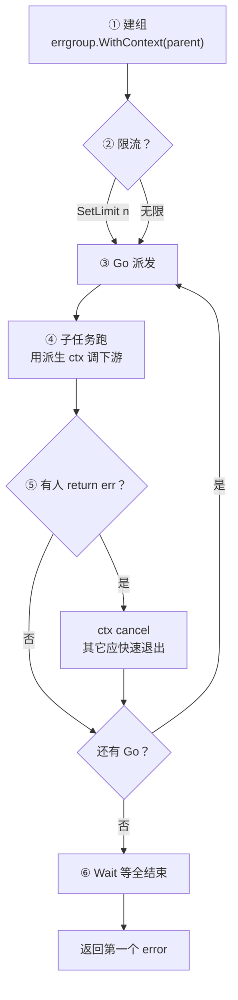
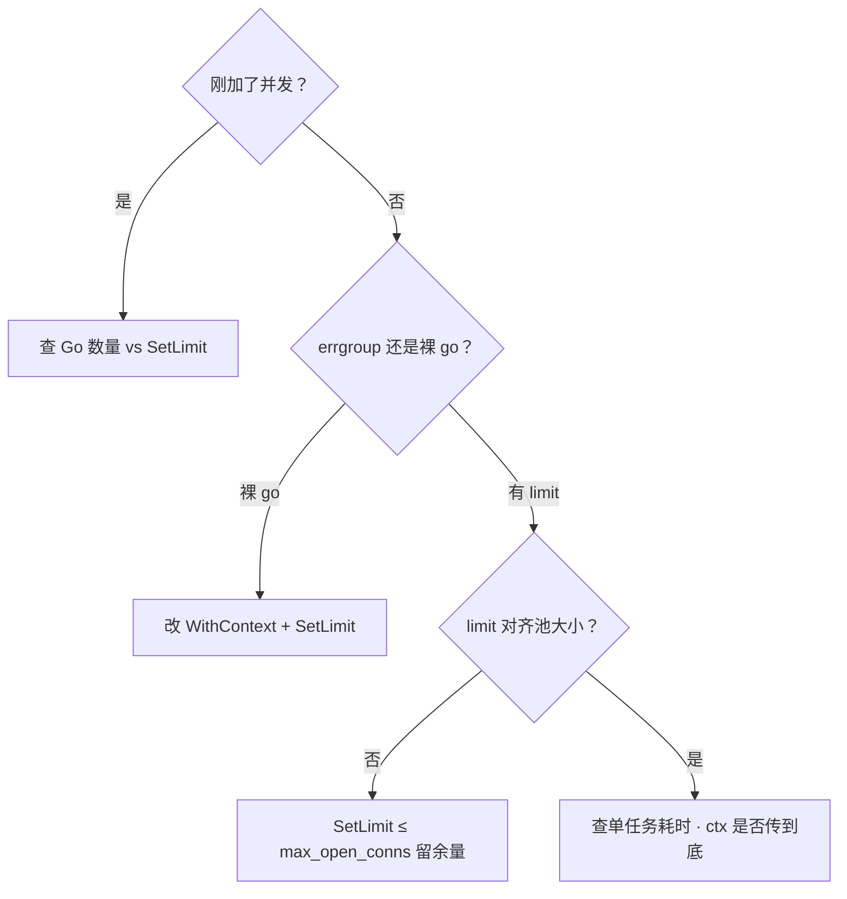
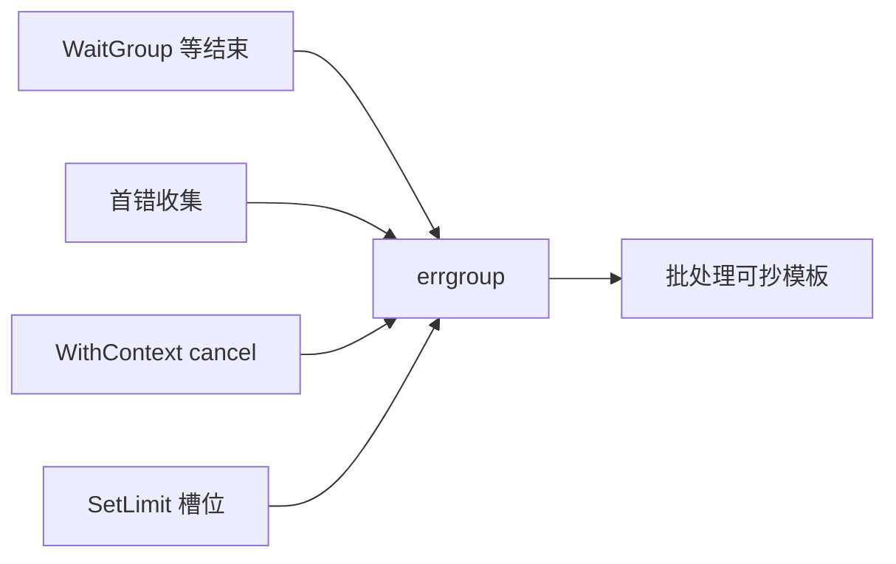

# 09｜errgroup 与并发限流 · SRE 开发能力

> 批量同步 500 个下游 URL：有人 `for _, u := range urls { go fetch(u) }`，下游 429、内存飙、`WaitGroup` 对不上；有人手写 `errCh` + `cancel` + `wg`，漏一处就泄漏；还有人 `errgroup` 无限 `Go`，DB 连接池打穿。三个人分别喊「再开并发」「加重试」「调 GOMAXPROCS」。
> **本章回答**：一组并发任务从 **`errgroup` 创建**、**`Go` 派发**、**首错 cancel**、**`Wait` 收束**到 **semaphore / SetLimit 限流**——怎么编排、怎么限、怎么和 `context` 绑。
> **不讲**：`context` 取消树 → [08](../08-context取消与超时传播/)；channel/select → [06](../06-channel与select/)；goroutine 泄漏总论 → [05](../05-goroutine与调度模型/)；HTTP Shutdown → [10](../10-HTTP-Server与优雅退出/)。

**标记**：🎯重点 · 🔥难点 · ⭐常考 · 🔧实操

---

## 面试怎么考

| 标记 | 考点 |
|------|------|
| **核心** | `errgroup.WithContext` 首错 cancel；`Wait()` 返回第一个 error |
| **必会** | `SetLimit(n)` 限并发；semaphore 与 worker pool 选型 |
| **常用** | 批量 RPC/HTTP；fan-out；与 `WaitGroup` 对比 |
| **常考** | 无限 `Go`；`Go` 里 panic；限流 ≠ `GOMAXPROCS` |

> 📝 **面试（30 秒）**：`golang.org/x/sync/errgroup` 把多 goroutine + 首错取消 + `Wait` 打包。`g, ctx := errgroup.WithContext(parent)`——任一子任务 `return err != nil`，派生 ctx 自动 cancel，其它任务应听 `ctx.Done()` 退出。`g.Wait()` 返回**第一个**非 nil error。Go 1.20+ `SetLimit(n)` 限**同时运行**槽位，不是 `GOMAXPROCS`、也不是 QPS。更细 backpressure 用 `semaphore.Weighted` 或 channel worker pool。

---

## 能力边界

| 机制 | 管什么 | 不管什么 |
|------|--------|----------|
| `errgroup` | 任务编排、首错传播、可选并发上限 | 单任务内部重试 |
| `context` | 取消信号沿调用链 | 并发度、错误聚合 |
| `WaitGroup` | 等 goroutine 结束 | 首错 cancel、error 返回 |
| `GOMAXPROCS` | OS 线程并行度（[12](../12-GOMAXPROCS与容器cgroup/)） | goroutine 数、下游 QPS |
| semaphore | 同时占用的「槽位」 | 优先级、公平调度 |
| `rate.Limiter` | 每秒令牌 / QPS | 同时连接数 |

- 🔑 **各管一段**
  - **errgroup**：批任务生命周期——**不**替代令牌桶
  - **SetLimit / semaphore**：并发槽——**不**管 CPU 并行度
  - **context**：合作式取消——**不**杀 syscall
  - 活动批处理、多 AZ 探活、K8s 多对象 patch → **要** errgroup + limit；**不要**裸 `go` 风暴

> ⚠️ **别混**：并发上限对齐**下游**（连接池 / 对方 QPS），不对齐「自己人觉得快」——口诀：**「并发上限对齐下游，不对齐自己人」**。

---

## 语言最小集

| 零件 | 示例 | 含义 |
|------|------|------|
| Group | `g := new(errgroup.Group)` | 无自动 cancel |
| WithContext | `g, ctx := errgroup.WithContext(parent)` | 首错 cancel 派生 ctx |
| Go | `g.Go(func() error { ... })` | 启动子任务 |
| Wait | `err := g.Wait()` | 等全结束，返回首错 |
| SetLimit | `g.SetLimit(10)` | 同时运行上限（1.20+） |
| TryGo | `g.TryGo(fn)` | 槽满返回 false，不阻塞 |
| Weighted | `sem := semaphore.NewWeighted(10)` | 加权槽位 |
| Acquire/Release | `sem.Acquire(ctx,1)` / `Release(1)` | 占槽 / 还槽 |
| 闭包复制 | `u := u` | 循环变量进闭包必拷 |

```go
g, ctx := errgroup.WithContext(ctx)
g.SetLimit(10)
for _, u := range urls {
    u := u
    g.Go(func() error { return fetch(ctx, u) })
}
return g.Wait()
```

零件认完，上主图。

---

## 一、一张图：errgroup 任务组的一生 ⭐🔥

> 🎯 **一句话**：`WithContext` 建组 → `SetLimit` 定并发 → `Go` 派活 → 首错 cancel → 各任务听 `Done` 退出 → `Wait` 收束返回首 err。



- 📖 **读图**
  - 🛤️ 生命周期 owner 通常是**一次批处理函数**：进去 `WithContext`，出来 `Wait()`；`SetLimit` 在第一个 `Go` 前调
  - 💥 开篇现场落点：裸 go → 跳过①②；手写 errCh 漏 cancel → ⑤⑥残缺；无限 Go → ②选了「无限」（Q1、Q14）
  - ⚠️ `Wait` 之后不要再 `Go`（未定义 / 竞态）

本节对应练习题 Q1、Q14。主线有了——先看基础 Group。

---

## 二、出生：基础 Group = WaitGroup + error ⭐

> 🎯 **一句话**：零依赖心智——`Go` ≈ `wg.Add`+`go`，`Wait` ≈ `wg.Wait`+取首 err。

```go
import "golang.org/x/sync/errgroup"

func fetchAll(ctx context.Context, urls []string) error {
    g := new(errgroup.Group)
    for _, u := range urls {
        u := u // 闭包
        g.Go(func() error {
            return fetch(ctx, u)
        })
    }
    return g.Wait()
}
```

### 🧱 两个方法

- `Go(f func() error)`：起 goroutine 跑 `f`
- `Wait() error`：等全部结束，返回**第一个**非 nil error（不做 `errors.Join`）

#### ❓ 为什么不自己手写 WaitGroup + errCh？

- 🎭 **小剧场**：值班同学写 `errCh` + `cancel` + `wg`，「看起来齐」——漏一次 `wg.Done`、忘关 channel、首错没 cancel，线上泄漏或收不住
- ✅ errgroup 把 **登记工人 + 收首错** 打成一对 API，少写样板就少漏一处
- ⚠️ 基础 `Group`（无 `WithContext`）**首错不会 cancel**——其它任务照跑；要止血必须上三节

> 💡 **打个比方**：基础 Group 像工头只登记下班打卡；WithContext 版工头还拉闸断电（cancel）。

> 📝 **面试**：errgroup vs WaitGroup——前者收 error；加 `WithContext` 才有首错 cancel。⭐（Q1、Q2）

本节对应练习题 Q1、Q2。基础会了，看首错取消。

---

## 三、干活：WithContext 首错取消 ⭐🔥

> 🎯 **一句话**：`g, ctx := errgroup.WithContext(parent)`——任一 `Go` 返回非 nil err → **自动 cancel 派生 ctx**。

大家想想：一个分片 replicate 失败，其余分片还该继续狂跑吗？很多人答「要跑完才知道全貌」——**线上通常错了**。首错 cancel 是为了快速止血、省资源；要全量汇总用别的模式（九节）。

```go
func syncShards(ctx context.Context, shards []int) error {
    g, ctx := errgroup.WithContext(ctx)
    for _, id := range shards {
        id := id
        g.Go(func() error {
            return replicate(ctx, id)
        })
    }
    return g.Wait()
}
```

### 📜 规则

- 子任务用 errgroup 派生的 `ctx`，别偷偷用 parent 绕开 cancel
- `return err != nil` 触发 cancel；`return nil` 不影响
- `Wait()` 返回的就是某个子任务写出的那个 err（通常第一个写入的）
- cancel 后仍在跑的任务应快速 `return ctx.Err()`

```go
g.Go(func() error {
    req, _ := http.NewRequestWithContext(ctx, "GET", url, nil)
    _, err := client.Do(req)
    return err
})
```

#### ❓ 为什么子任务不能继续用 parent ctx？

```go
g, ctx := errgroup.WithContext(parent)
g.Go(func() error {
    return db.QueryContext(parent, sql) // ← 首错 cancel 传不到这条查询
})
```

- 🔥 cancel 只关**派生** ctx 的 `Done`；你若绕开派生、直连 parent，兄弟任务失败时这条查询听不见
- ✅ HTTP/DB 一律 `*Context` API + 派生 `ctx`——和 [08](../08-context取消与超时传播/) 树形传播一致：兄弟共享同一派生 ctx
- 📝 WithContext ≈ WithCancel + 首 err 时调 cancel

> ⚠️ **别混**：首错 cancel ≠ 杀 syscall——合作式退出，调了 `Background()` 或忽略 `Done` 的任务仍会拖到自然结束。

本节对应练习题 Q3、Q4。首错懂了，定并发上限。

---

## 四、限流：SetLimit 并发上限 ⭐🔥

> 🎯 **一句话**：Go 1.20+ `g.SetLimit(n)` 限制**同时执行**的 `Go` 任务数；n≤0 表示不限。

```go
g, ctx := errgroup.WithContext(ctx)
g.SetLimit(10) // 最多 10 个同时跑

for _, item := range items {
    item := item
    g.Go(func() error {
        return process(ctx, item)
    })
}
return g.Wait()
```

### 🅿️ 槽位语义

| n | 行为 |
|---|------|
| `0` / 未设 | 每个 Go 立刻起 goroutine |
| `k` | 最多 k 个 fn 同时跑，其余等槽 |
| `k ≥ len(tasks)` | 等价全并发 |

```text
任务可以很多 → 同时「在场」的只有 k 个
像停车场只有 k 个车位；车可以排队，不能全挤进去
```

- 📖 **读图**：语义是**并发度上限**。实现上排队时 goroutine 可能已创建但阻塞在 limit 上（以源码为准）——和「固定 N 个长驻 worker」仍有差别（六节）

> 🔍 **现场**：DB `max_open_conns=20`，errgroup `SetLimit(15)` 留余量给其它路径。

#### ❓ 为什么 SetLimit 不是 GOMAXPROCS？

- ❌ `GOMAXPROCS` 管 CPU **并行线程数**；`SetLimit` 管**业务并发槽**
- 💥 1000 个 `Go` + `GOMAXPROCS=4`：同时跑在 CPU 上的少，但 **1000 个 goroutine + 连接照样爆**
- ✅ 限连接、限下游并发 → SetLimit / semaphore；限 CPU 占用另议 [12](../12-GOMAXPROCS与容器cgroup/)

> ⚠️ **别混**：`SetLimit` ≠ QPS——并发槽控「同时多少路」，`rate.Limiter` 控「每秒多少次」（十五节）。

口诀：**「并发不是越快越好，上限对齐下游」**。练习题 Q5、Q6。

---

## 五、限流：semaphore.Weighted 更通用槽位 ⭐

> 🎯 **一句话**：`golang.org/x/sync/semaphore` 用 `Acquire(ctx, n)` / `Release(n)` 占槽——不限于 errgroup，可嵌在任意循环。

```go
import "golang.org/x/sync/semaphore"

var sem = semaphore.NewWeighted(10)

func handle(ctx context.Context, jobs []Job) error {
    g, ctx := errgroup.WithContext(ctx)
    for _, j := range jobs {
        j := j
        if err := sem.Acquire(ctx, 1); err != nil {
            return err
        }
        g.Go(func() error {
            defer sem.Release(1)
            return doJob(ctx, j)
        })
    }
    return g.Wait()
}
```

#### ❓ 为什么 Acquire 必须传 ctx？

- 🛑 槽满时 `Acquire` 会阻塞；传 `ctx` → cancel / deadline 到了返回 `ctx.Err()`，不会死等
- ⚖️ `Acquire(ctx, 2)` 表示一次占 2 槽——适合「重任务」动态权重
- 🗺️ **选型**
  - 同质批 + 首错 cancel → errgroup + `SetLimit`
  - 嵌套多层 / 动态权重 → Weighted
  - 固定 worker 长驻 → buffered channel pool（[06](../06-channel与select/)）

本节对应练习题 Q7。槽位会了，看 worker pool。

---

## 六、选型：worker pool 与 errgroup 🔧

> 🎯 **一句话**：**短平快批处理**用 errgroup；**持续流式任务**用 channel + 固定 N worker。

```go
func pool(ctx context.Context, jobs <-chan Job) error {
    g, ctx := errgroup.WithContext(ctx)
    worker := func() error {
        for {
            select {
            case <-ctx.Done():
                return ctx.Err()
            case j, ok := <-jobs:
                if !ok {
                    return nil
                }
                if err := handle(ctx, j); err != nil {
                    return err
                }
            }
        }
    }
    for i := 0; i < 3; i++ {
        g.Go(worker)
    }
    return g.Wait()
}
```

- 🏭 errgroup 里跑 **N 个相同 worker** 消费同一 channel——首错 cancel + 限 worker 数，生产常见

#### ❓ 为什么超大批不能「百万 Go + SetLimit」？

- ⚠️ `for _, x := range xs { g.Go(...) }` 且 `len=10⁵`：即使 `SetLimit(10)`，仍可能创建大量 goroutine 对象（在 limit 上排队）
- ✅ **超大批**用 worker pool + 任务队列，不要百万次 `Go`
- 🔑 判据：任务集有界、短命 → errgroup；任务是流、要长驻 → pool

本节对应练习题 Q8、Q9。选型清了，看 panic。

---

## 七、边界：panic 与错误处理 ⭐🔥

> 🎯 **一句话**：子任务 **panic 会导致 `Wait` panic**（整进程可能挂）——fn 内要 recover 或保证不 panic。

```go
g.Go(func() (err error) {
    defer func() {
        if r := recover(); r != nil {
            err = fmt.Errorf("panic: %v", r)
        }
    }()
    return risky()
})
```

#### ❓ 为什么 errgroup 不帮你吞 panic？

- 🔥 设计选择：panic 是**编程错误**信号，默默吞掉会掩盖 bug（与 [04](../04-错误处理与panic/) 一致）
- ✅ 边界 recover 转成 error，再走首错 cancel；HTTP handler 里更要小心——一个未 recover 的 panic 可能拖垮请求甚至进程
- 📦 错误包装：`return fmt.Errorf("shard %d: %w", id, err)`——`Wait` **只返回一个**；要聚合用 `multierror` / 自建 `[]error`（部分失去 fail-fast 语义）

本节对应练习题 Q10。panic 边界清了，叠超时。

---

## 八、叠加：与 context 超时 ⭐

> 🎯 **一句话**：入口 `WithTimeout` 定总预算；errgroup 派生 ctx **继承** deadline；子任务别另开 `Background`。

```go
ctx, cancel := context.WithTimeout(context.Background(), 30*time.Second)
defer cancel()

g, ctx := errgroup.WithContext(ctx)
g.SetLimit(20)
for _, u := range urls {
    u := u
    g.Go(func() error {
        return head(ctx, u)
    })
}
if err := g.Wait(); err != nil {
    if errors.Is(err, context.DeadlineExceeded) {
        // 整批超时
    }
    return err
}
```

- ⏱️ 任一子任务拖到 deadline → ctx cancel → 其它应中断
- ⚠️ `SetLimit` **不延长** deadline——排队等槽也在吃总预算
- 🔗 取消树细节见 [08](../08-context取消与超时传播/)

本节对应练习题 Q11。超时叠完，看 fan 与两种语义。

---

## 九、模板：fan-out 与 fail-fast / collect-all 🔧

> 🎯 **一句话**：多路 `Go` 要么首错即停，要么全跑收集——**先选语义再写代码**。

### 🚀 fail-fast（WithContext）

- 子任务 `return err` → cancel 兄弟；适合「一批里一个挂就不该继续烧资源」

### 🧺 collect-all（裸 Group + 自收集）

```go
var mu sync.Mutex
var errs []error

g := new(errgroup.Group)
for _, id := range ids {
    id := id
    g.Go(func() error {
        if err := load(ctx, id); err != nil {
            mu.Lock()
            errs = append(errs, err)
            mu.Unlock()
            return nil // 不触发 cancel，全跑完
        }
        return nil
    })
}
_ = g.Wait()
```

#### ❓ 为什么两种语义不能混着写？

- 🎭 想「全量错误报告」却用了 `WithContext`：第一个失败就把兄弟掐掉，报告永远不全
- 🎭 想「快速止血」却 `return nil` 只往 slice 塞：其它分片继续打下游
- ✅ 面试先说清选哪种，再写；channel fan-in 聚合时同样先定 cancel 策略，别边 Wait 边读未关的 ch 把自己绕死

本节对应练习题 Q9。模板看完——生产探活。

---

**回到开头那个现场**：裸 go 500 URL、手写 errCh 漏一处、errgroup 无限 Go。正确剧本：WithContext 首错止血 → SetLimit/semaphore 对齐下游 → Wait 收错误 → 429 先限自己再怪对方。

## 十、生产模板：批量 HTTP 探活 🔧

> 🎯 **一句话**：外层总超时 + `SetLimit` + 每 host 子 timeout；失败计数与首错一并返回。

```go
func probeAll(ctx context.Context, hosts []string) error {
    g, ctx := errgroup.WithContext(ctx)
    g.SetLimit(32)

    var failed atomic.Int32
    for _, h := range hosts {
        h := h
        g.Go(func() error {
            ctx, cancel := context.WithTimeout(ctx, 2*time.Second)
            defer cancel()
            if err := ping(ctx, h); err != nil {
                failed.Add(1)
                return fmt.Errorf("%s: %w", h, err)
            }
            return nil
        })
    }
    if err := g.Wait(); err != nil {
        return fmt.Errorf("%d failed, first: %w", failed.Load(), err)
    }
    return nil
}
```

- 🔑 **要点**
  - 外层 ctx 总预算；每 host 再 `WithTimeout`（子 deadline ≤ 父）
  - `SetLimit` 对齐下游承受能力
  - 注意：这是 fail-fast——第一个失败会 cancel 其余；若要「探完所有 host」改 collect-all（九节）

本节对应练习题 Q12。探活拿走，作战 429。

---

## 十一、作战：429 / 连接池耗尽怎么查 🔧

> 🎯 **一句话**：先问「刚加并发了吗 → 裸 go 还是有 limit → limit 对齐池了吗 → ctx 传到下游了吗」。



- 📖 **读图**：从「变更」进；裸 go / 无限 Go / 池不对齐 / ctx 断链四条分支，现场照代码与池配置，不是先调 `GOMAXPROCS`

| 现象 | 先做 | 别做 |
|------|------|------|
| 下游 429 | 降 SetLimit / 加 backoff | 只加 GOMAXPROCS |
| goroutine 暴涨 | 是否百万 Go | 只盯 CPU 不看 conn |
| 首错后仍慢 | 子任务没用派生 ctx | 以为 cancel 杀 syscall |
| Wait hung | 某 Go 忽略 ctx | 无限等 channel |

### 60 秒剧本 🔧

> 🔍 **现场**：接到 429 / 池耗尽，60 秒走完再下结论。

```text
① 0–10s   下游 429 / 连接打满时间与发布重合？
② 10–30s  rg errgroup：有无 SetLimit；是否裸 go 风暴
③ 30–45s  对 max_open_conns、HTTP MaxConnsPerHost
④ 45–60s  子任务是否 NewRequestWithContext(派生 ctx, ...)
```

本节对应练习题 Q13。定责完，扫变体与对照。

---

## 十二、变体：TryGo 与扩展包 ⭐

> 🎯 **一句话**：`TryGo` 槽满不阻塞；QPS 用 `rate.Limiter`；同 key 合并用 `singleflight`——三者别当一种「限流」。

```go
if !g.TryGo(func() error { return bg(ctx) }) {
    log.Println("skip bg: at limit")
}
```

- 🪂 `TryGo`：适合「能跑就跑，否则跳过」的非关键后台（1.20+）
- 🔁 标准 errgroup **无内置 retry**——重试放 fn 内或 wrapper
- 📦 **对照**
  - `errgroup` → 批任务编排
  - `semaphore` → 加权槽位
  - `singleflight` → 同 key 合并（防击穿，**不是** limit）
  - `golang.org/x/time/rate` → QPS

```go
limiter := rate.NewLimiter(rate.Limit(100), 10) // 100/s, burst 10
if err := limiter.Wait(ctx); err != nil {
    return err
}
```

#### ❓ 为什么大促可能 SetLimit 和 rate.Limiter 都要？

- 🅿️ SetLimit 控**同时连接数**（池不被打穿）
- 🎫 Limiter 控**每秒请求数**（下游 429 / 配额）
- ✅ 只开一边：要么池满，要么 QPS 爆——大促两边对齐

本节对应练习题 Q2、Q5。对照完，测试与踩坑。

---

## 十三、测试与踩坑清单

### 🧪 测首错 cancel

```go
func TestFirstErrorCancels(t *testing.T) {
    var canceled atomic.Bool
    g, ctx := errgroup.WithContext(context.Background())
    g.Go(func() error { return errors.New("fail") })
    g.Go(func() error {
        <-ctx.Done()
        canceled.Store(true)
        return ctx.Err()
    })
    _ = g.Wait()
    require.True(t, canceled.Load())
}
```

- 集成测：一个 URL 500，断言其它请求 ctx 很快 canceled（mock / 计数器）

### 🕳️ 踩坑

| 现象 | 原因 | 修法 |
|------|------|------|
| 首错后其它仍跑 | 用 parent ctx | 用 WithContext 派生 ctx |
| 连接池打满 | 无限 Go | SetLimit |
| Wait panic | 子任务 panic | defer recover |
| 闭包抓错变量 | `for` 未 `u:=u` | 循环内复制 |
| 假并发 | 以为 GOMAXPROCS 限流 | 应用层 limit |
| 只要一个 err | 设计如此 | 要聚合改 collect-all |

本节对应练习题 Q10、Q11。踩坑钉死，收束。

---

## 十四、收束：errgroup 凭什么省样板代码

> 🎯 **一句话**：**WaitGroup + 首 err cancel + 可选 limit** 一个包打完，前提是子任务**合作式**听 ctx。



- 📖 **读图**：四件能力合成一组 API；缺「听 ctx」则 cancel 空转——省的是样板，**不**省合作式退出纪律

**可背清单**：

- `WithContext` → 首错 cancel
- `Go` / `Wait` 配对，Wait 后别 Go
- `SetLimit(n)` 限同时运行数
- 子任务 ctx 用派生，HTTP/DB 用 `*Context` API
- panic 要 recover
- fail-fast vs collect-all 说清再写

> ⚠️ **别混**：errgroup **不替代** rate limiter（令牌桶/QPS）；那是另一层。
> 📝 **面试**：按「登记—首错—限槽—听 ctx」四组记，比背方法名稳。⭐（Q1）

本节对应练习题 Q1。收束完，收口。

---

## 十五、收口

### 命令速查 🔧

```bash
# 找无限 go 风暴：有 Go 附近却不见 SetLimit
rg '\.Go\(func' --glob '*.go' -B5 | rg -v 'SetLimit'

# 找 errgroup 里误用 Background（绕开派生 cancel）
rg 'errgroup\.WithContext' -A20 --glob '*.go' | rg 'Background\(\)'
```

### 面试锚点

遮住右列自问自答，卡壳回对应小节：

| 问 | 30 秒答 |
|----|---------|
| errgroup vs WaitGroup | 收 error；WithContext 首错 cancel |
| SetLimit 管什么 | 同时运行的 Go 上限，不是 QPS |
| 首错后其它任务？ | ctx cancel，应快速退出 |
| 和 GOMAXPROCS | 无关；后者管 CPU 线程 |
| panic 在 Go 里？ | Wait 可能 panic，要 recover |
| fail-fast vs collect-all | WithContext return err vs 裸 Group + 自收集 return nil |
| semaphore 为何传 ctx | Acquire 阻塞时可被 cancel 打断 |

### 易错一句话对照

- errgroup 自动限 goroutine 总数 → `SetLimit` 限**同时运行**
- `Wait` 返回所有 error → 只返回**第一个**非 nil
- cancel 杀所有 syscall → 合作式，要 `*Context` API
- `SetLimit` 替代 rate limit → 并发槽 ≠ QPS
- `for range` 直接 Go 闭包 → 必须 `u := u`
- 调 GOMAXPROCS 治 429 → 先降并发槽、对齐连接池
- 要全量报告却用 WithContext → 首错会掐兄弟，改 collect-all

### 数字墙

> **Go 1.20+** 才有 `SetLimit` / `TryGo` · 探活常见 **SetLimit 32**、单 host **2s** 子超时、整批 **30s** 总预算 · DB 池 eg. **max_open=20 → SetLimit≤15** 留余量 · `rate.Limiter(100, 10)` = 100/s burst 10 · 超大批阈值 **10⁵ Go** 仍可能堆 goroutine 对象——改 worker pool · `Wait` **1** 个 error · panic **0** 容忍（边界 recover）

本节对应练习题 Q1～Q14。现在回开头那个现场。

---

## 合上书

对着第一节主图口述一遍，卡住就回对应小节。开头那个现场——裸 go、手写 errCh、无限 Go——三个人各自错在哪，现在该能说清了。

- [ ] **默画主图**：WithContext → SetLimit → Go → 首错 cancel → Wait（→ Q1 · Q14）
- [ ] **口述** WithContext 与裸 Group 区别；为何不能用 parent ctx（→ Q3 · Q4）
- [ ] **口述** SetLimit vs GOMAXPROCS vs rate.Limiter 各管什么（→ Q5 · Q6）
- [ ] **写** 批量 HTTP 探活 skeleton（limit + 子 timeout）（→ Q12）
- [ ] **说明** fail-fast 与 collect-all 两种写法何时用（→ Q9）
- [ ] **避坑** 闭包 `u:=u`；panic recover（→ Q10）
- [ ] **定责** 429 / 池打穿 60 秒剧本三条刀（→ Q13）
- [ ] **口述** semaphore Acquire 为何传 ctx；何时用 worker pool（→ Q7 · Q8）
- [ ] **衔接** 与 [08] context 取消树如何绑在同一派生 ctx 上
