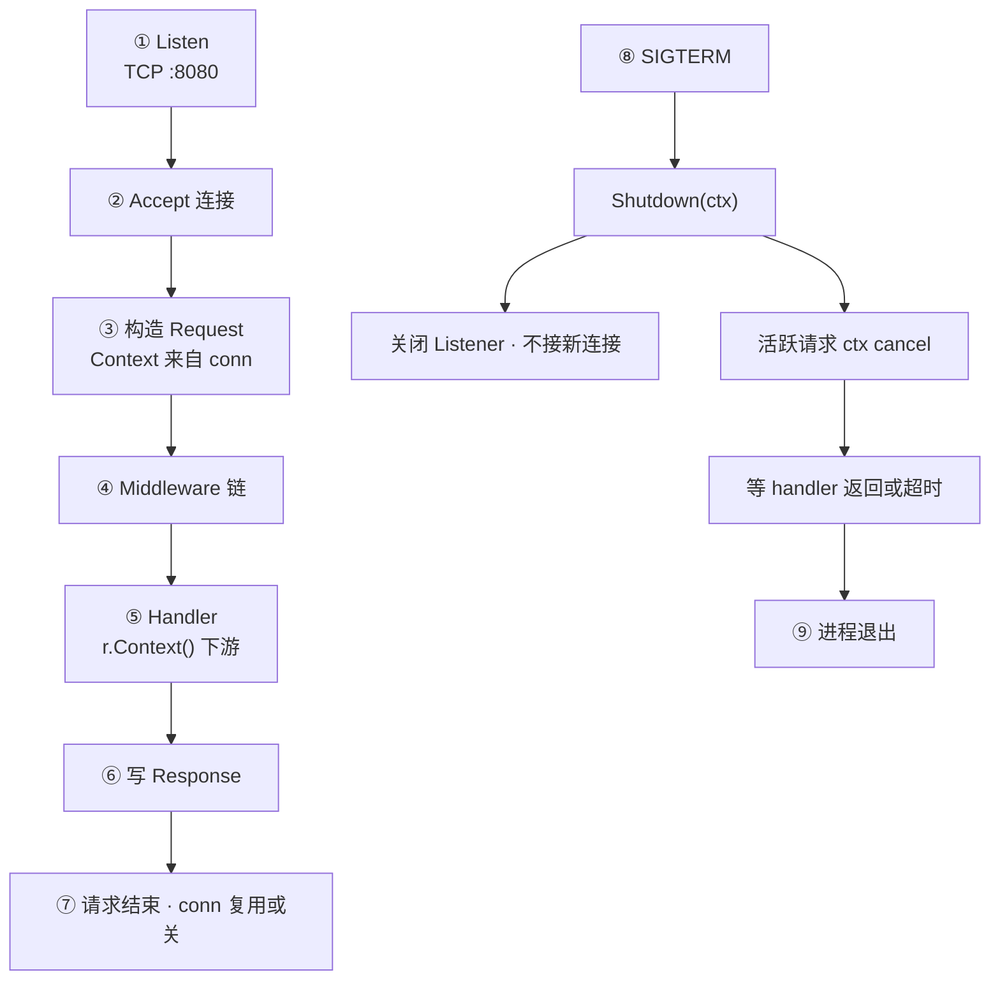
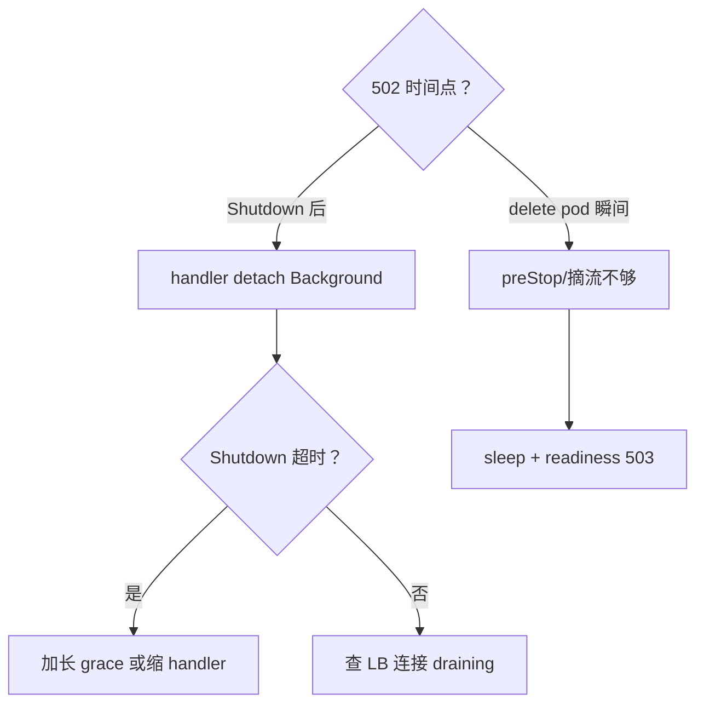

# 10 HTTP Server与优雅退出 · 知识点

> 发版 `kubectl delete pod` 后监控仍见 502 尖峰；有人 `ListenAndServe` 后直接 `os.Exit`，进行中的订单 half-written；有人只 `signal.Notify` 却不 `Shutdown`，grace period 30s 到了被 SIGKILL；还有人 handler 里 `context.Background()` 跑 5 分钟任务，Shutdown 永远等不完。
> **本章回答**：一个 **HTTP 请求** 从 **TCP 接入**、**ServeHTTP**、**context 取消** 到 **Shutdown 收束** 的一生——怎么启服、怎么限、怎么优雅停。
> **不讲**：context 取消树细节 → [08](../08-context取消与超时传播/)；errgroup 批任务 → [09](../09-errgroup与并发限流/)；TLS/mTLS 全貌 → 基础底座 [14-HTTP与TLS](../../../01-基础底座/14-HTTP与TLS/)；pprof 挂 endpoint → [13](../13-pprof与性能排查/)。

**标记**：🎯重点 · 🔥难点 · ⭐常考 · 🔧实操

## 面试怎么考

| 标记 | 考点 |
|------|------|
| **核心** | `ListenAndServe` vs `Serve`；`Shutdown(ctx)` 停新接、等旧请求 |
| **必会** | SIGTERM 处理；Shutdown 超时 ctx；`BaseContext` / `r.Context()` |
| **常用** | 健康检查与摘流；`ReadHeaderTimeout`；中间件链 |
| **常考** | Shutdown 后 ErrServerClosed；K8s preStop + grace |

**30 秒怎么说**：`http.Server` 在独立 goroutine `ListenAndServe`；`main` 监听 **SIGINT/SIGTERM** 后调 **`Shutdown(ctx)`**——**关闭 listener、拒绝新连接、等进行中的 handler 结束**（或 ctx 超时）。Handler 必须用 **`r.Context()`** 传下游，Shutdown 时该 ctx 会 cancel。`Shutdown` 返回后还可能有 **background goroutine**（自己 `WaitGroup`）。K8s：`terminationGracePeriodSeconds` 要 **大于** Shutdown ctx + preStop sleep。别 `ListenAndServe` 的 error 当致命——**`http.ErrServerClosed`** 是正常退出。

---

## 能力边界

| 机制 | 管什么 | 不管什么 |
|------|--------|----------|
| `Server.Shutdown` | 停 listener、等活跃连接上的请求 | handler 里 detach 的 goroutine |
| `r.Context()` | 客户端断连 + Shutdown 取消 | 未传 ctx 的后台任务 |
| `Server.Close` | 立刻关 listener + 空闲连接 | 优雅等 handler |
| `context` app 级 | 全进程生命周期 | 替代 per-request ctx |

---

## 一、一张图：HTTP 请求从进入到优雅 shutdown 的一生

> 🎯 **一句话**：Listen 接入 → 派生 `Request.Context` → 中间件/handler → 响应/断连 → SIGTERM → Shutdown 停新、cancel 进行中的 ctx → Wait 干净退出。



**读图**：每个请求 ctx 在 Go 1.x 由 server 为连接/请求管理；客户端断开会 cancel。Shutdown **不杀** handler——等它返回或 ctx 超时。Handler 里 `go background()` 不跟 ctx 的任务是优雅退出头号敌人。

---

## 二、最小 Server 与 ErrServerClosed ⭐

> 🎯 **一句话**：`ListenAndServe` 阻塞直到 listener 关；正常 Shutdown 返回 **`http.ErrServerClosed`**。

```go
mux := http.NewServeMux()
mux.HandleFunc("/health", func(w http.ResponseWriter, r *http.Request) {
    w.WriteHeader(http.StatusOK)
})

srv := &http.Server{
    Addr:    ":8080",
    Handler: mux,
}

go func() {
    if err := srv.ListenAndServe(); err != nil && !errors.Is(err, http.ErrServerClosed) {
        log.Fatalf("listen: %v", err)
    }
}()
```

| API | 行为 |
|-----|------|
| `ListenAndServe()` | Listen + Serve 一条龙 |
| `Serve(l net.Listener)` | 已有 listener 时用 |
| `ListenAndServeTLS()` | TLS 版本 |

> 📝 **面试**：Fatalf 前必须排除 `ErrServerClosed`，否则优雅退出变 crash 日志。

---

## 三、优雅退出模板 ⭐🔥

> 🎯 **一句话**：信号 → `Shutdown(shutCtx)` → 限时等待 → 超时则 `Close` 或退出。

```go
func main() {
    srv := &http.Server{
        Addr:              ":8080",
        Handler:           mux,
        ReadHeaderTimeout: 5 * time.Second,
        ReadTimeout:       10 * time.Second,
        WriteTimeout:      30 * time.Second,
        IdleTimeout:       60 * time.Second,
    }

    go func() {
        if err := srv.ListenAndServe(); err != nil && !errors.Is(err, http.ErrServerClosed) {
            log.Fatalf("listen: %v", err)
        }
    }()
    log.Println("listening :8080")

    quit := make(chan os.Signal, 1)
    signal.Notify(quit, syscall.SIGINT, syscall.SIGTERM)
    <-quit
    log.Println("shutting down...")

    shutCtx, cancel := context.WithTimeout(context.Background(), 30*time.Second)
    defer cancel()

    if err := srv.Shutdown(shutCtx); err != nil {
        log.Printf("shutdown: %v", err)
        _ = srv.Close() // 兜底
    }
    log.Println("server stopped")
}
```

### Shutdown 做了什么 ⭐

- **关闭 listener**——新 TCP 进不来  
- **关闭 idle 连接**  
- **等待**活跃请求上的 handler 跑完（或 shutCtx 超时）  
- Shutdown 过程中进行中的 **`r.Context()` 会被 cancel**（Go 1.x 行为：通知 handler 该停了）

> 💡 **打个比方**：Shutdown = 关店门牌 + 等店内客人结完账；`Close` = 拉闸赶人。

### 超时链 🔧

| 层级 | 建议 |
|------|------|
| K8s `terminationGracePeriodSeconds` | ≥ preStop + Shutdown + 缓冲（如 60s） |
| `Shutdown` ctx | 30s 常见 |
| `WriteTimeout` | 应 ≤ Shutdown，避免 handler 拖过 Shutdown |

---

## 四、Request.Context 与 Shutdown ⭐🔥

> 🎯 **一句话**：handler 里 **`r.Context()`** 在客户端断开 **和** Server Shutdown 时 cancel——下游必须用它。

```go
func handler(w http.ResponseWriter, r *http.Request) {
    ctx := r.Context()
    if err := svc.Process(ctx, id); err != nil {
        if errors.Is(err, context.Canceled) {
            return // 499 或不记 error
        }
        http.Error(w, err.Error(), 500)
    }
}
```

### 反模式：detach 后台

```go
func handler(w http.ResponseWriter, r *http.Request) {
    go func() {
        longJob(context.Background()) // ← Shutdown 等不到
    }()
    w.WriteHeader(202)
}
```

修法：用 **`context.WithCancel`** 绑 app 生命周期，Shutdown 时 cancel；或 job 队列 + worker 在 Shutdown 前 drain。

### BaseContext

```go
srv := &http.Server{
    BaseContext: func(net.Listener) context.Context {
        return appCtx
    },
}
```

每个请求的 ctx 根来自 `BaseContext`；仍应用 `r.Context()` 取**当前请求** ctx（含 cancel）。少用 Value 塞大对象（[08](../08-context取消与超时传播/)）。

---

## 五、超时与资源保护 ⭐

> 🎯 **一句话**：Server 级 timeout 防 slowloris 和 hung handler；与 handler 内 deadline 叠加取更严。

```go
srv := &http.Server{
    ReadHeaderTimeout: 5 * time.Second,  // 防 slowloris
    ReadTimeout:       10 * time.Second, // 读全 body
    WriteTimeout:      30 * time.Second, // 写响应
    IdleTimeout:       120 * time.Second,
    MaxHeaderBytes:    1 << 20,
}
```

| 字段 | 保护 |
|------|------|
| `ReadHeaderTimeout` | 只等 header，必设（Go 1.8+） |
| `ReadTimeout` | 含 body 读 |
| `WriteTimeout` | 从 accept 后或读完后写（注意长 SSE 要 Disable 或 0） |
| `IdleTimeout` | keep-alive 空闲 |

> ⚠️ **别混**：`WriteTimeout` 对 **WebSocket/SSE** 可能误杀——单独 Server 或 Handler 调 0。

---

## 六、中间件链与 panic recover ⭐

> 🎯 **一句话**：`Handler` 外层包 logging、metrics、recover；顺序：**recover 最外**。

```go
func withRecover(next http.Handler) http.Handler {
    return http.HandlerFunc(func(w http.ResponseWriter, r *http.Request) {
        defer func() {
            if rec := recover(); rec != nil {
                log.Printf("panic: %v\n%s", rec, debug.Stack())
                http.Error(w, "internal error", 500)
            }
        }()
        next.ServeHTTP(w, r)
    })
}

mux := http.NewServeMux()
mux.Handle("/api/", withRecover(withLog(apiHandler)))
```

panic 不 recover 会 **crash 进程**（整 pod 挂）。metrics 中间件别阻塞 Shutdown——用 ctx 感知取消。

---

## 七、K8s 与负载均衡摘流 🔧🔥

> 🎯 **一句话**：**preStop sleep** + **readiness 失败** + **Shutdown** 三步，避免 LB 仍把流量打到 terminating pod。

```yaml
lifecycle:
  preStop:
    exec:
      command: ["/bin/sh", "-c", "sleep 5"]
terminationGracePeriodSeconds: 60
```

```go
// readiness：Shutdown 开始后返回 503
var shuttingDown atomic.Bool

func ready(w http.ResponseWriter, r *http.Request) {
    if shuttingDown.Load() {
        w.WriteHeader(503)
        return
    }
    w.WriteHeader(200)
}

// 收到 SIGTERM 后
shuttingDown.Store(true)
time.Sleep(2 * time.Second) // 等 endpoints 更新
srv.Shutdown(shutCtx)
```

**读图**：Endpoint Controller 摘掉 pod 有延迟——preStop 给 control plane 时间。Ingress 层 502 常是 **pod 已死但 LB 缓存仍指向旧 IP**。

---

## 八、ListenAndServe 与 errgroup / app ctx 🔧

> 🎯 **一句话**：`main` 派生 `appCtx`；HTTP 与别的后台任务共听 SIGTERM。

```go
ctx, stop := signal.NotifyContext(context.Background(), syscall.SIGINT, syscall.SIGTERM)
defer stop()

g, ctx := errgroup.WithContext(ctx)
g.Go(func() error {
    if err := srv.ListenAndServe(); err != nil && !errors.Is(err, http.ErrServerClosed) {
        return err
    }
    return nil
})
g.Go(func() error {
    <-ctx.Done()
    shutCtx, cancel := context.WithTimeout(context.Background(), 30*time.Second)
    defer cancel()
    return srv.Shutdown(shutCtx)
})
if err := g.Wait(); err != nil {
    log.Fatal(err)
}
```

Shutdown 的 ctx 常用 **`context.Background()` 子 timeout**——因为 parent `ctx` 可能已 cancel，仍要给 Shutdown 独立 grace 窗口（[08](../08-context取消与超时传播/)）。

---

## 九、Close vs Shutdown ⭐

| 方法 | 行为 | 何时 |
|------|------|------|
| `Shutdown(ctx)` | 优雅：停新、等旧 | SIGTERM 首选 |
| `Close()` | 粗暴：关 listener 和连接 | Shutdown 超时兜底 |

```go
if err := srv.Shutdown(shutCtx); err != nil {
    log.Printf("graceful failed: %v, forcing close", err)
    _ = srv.Close()
}
```

`Close` 不 wait handler——可能 mid-write 错误到客户端。

---

## 十、HTTP/2 与 TLS 注意点

```go
srv := &http.Server{
    Addr:      ":443",
    Handler:   mux,
    TLSConfig: &tls.Config{MinVersion: tls.VersionTLS12},
}
go srv.ListenAndServeTLS("cert.pem", "key.pem")
```

HTTP/2 长连接 Shutdown 时同样等 stream 结束。TLS 握手慢时 `ReadHeaderTimeout` 仍有效。

---

## 十一、作战：发版 502 怎么查



| 现象 | 先做 | 别做 |
|------|------|------|
| 502 尖峰 | 对齐 preStop 与 grace | 只加副本不摘流 |
| Shutdown hang | 搜 handler 里 `go`+Background | 无限等 |
| ErrServerClosed 告警 | 改日志级别 | 当 crash |
| 慢退出 | pprof goroutine | 直接 SIGKILL |

**60 秒剧本** 🔧：

- **0–10s**：502 与 pod `Terminating` 时间线  
- **10–30s**：`kubectl logs` 看 `shutting down` 到进程退出间隔  
- **30–45s**：grep `context.Background()` in handler  
- **45–60s**：核对 `terminationGracePeriodSeconds` vs Shutdown 30s  

---

## 十二、反向代理后的客户端 IP

```go
func clientIP(r *http.Request) string {
    if xff := r.Header.Get("X-Forwarded-For"); xff != "" {
        return strings.TrimSpace(strings.Split(xff, ",")[0])
    }
    host, _, _ := net.SplitHostPort(r.RemoteAddr)
    return host
}
```

限流/审计用——**要**在网关 strip 伪造头。与优雅退出无直接关系，运维 API 常问。

---

## 十三、测试 Shutdown

```go
func TestGraceful(t *testing.T) {
    srv := httptest.NewServer(slowHandler)
    defer srv.Close()

    // 真实 Shutdown 测法：自建 Server + 短 grace
    // 发 inflight 请求，调 Shutdown，断言 completes
}
```

集成测试用 **短 WriteTimeout** 和 **5s Shutdown ctx**。httptest 默认不测 signal——手动 `Shutdown`。

---

## 十四、踩坑清单

| 现象 | 原因 | 修法 |
|------|------|------|
| Shutdown 永不返回 | handler detach go | 绑 ctx / WaitGroup |
| 发版 502 | 无 preStop | sleep + readiness |
| Fatalf on exit | 未过滤 ErrServerClosed | errors.Is |
| SSE 断 | WriteTimeout | 单独路由 Disable |
| DB 仍跑 | Background 查询 | QueryContext(r.Context()) |
| 双 Shutdown | 信号处理两次 | sync.Once 或 NotifyContext |

---

## 十五、收束

> 🎯 **一句话**：**Listener 生命周期 + 请求 ctx + Shutdown grace** 三条线对齐，发版才不 502。

**可背清单**：

- Listen 在 goroutine；主线程等信号  
- Shutdown + 30s ctx 常见  
- ErrServerClosed 正常  
- handler 用 `r.Context()`  
- K8s grace > Shutdown + preStop  
- 后台 goroutine 要 app 级 cancel + Wait  

---

## 十六、与标准库其它 Server

| 类型 | 优雅退出 |
|------|----------|
| `http.Server` | `Shutdown` |
| `grpc.Server` | `GracefulStop()` / `Stop()` |
| `http.Server` pprof | 同 mux 挂 `/debug/pprof`（[13](../13-pprof与性能排查/)） |

```go
import _ "net/http/pprof"
mux.Handle("/debug/pprof/", http.HandlerFunc(pprof.Index))
```

**生产**：pprof 别裸奔公网——鉴权或 bind admin port。

---

## 十七、收口

### 命令速查 🔧

```bash
# 发版观察
kubectl get pod -w
curl -v http://pod-ip:8080/health

# 代码审查
rg 'context\.Background\(\)' --glob '*handler*'
rg 'ListenAndServe' -A5 --glob 'main.go'
```

### 面试锚点

| 问 | 30 秒答 |
|----|---------|
| Shutdown 做什么 | 关 listener、等活跃 handler、cancel 请求 ctx |
| ErrServerClosed | 正常 Shutdown 结果，别 Fatal |
| Close vs Shutdown | Close 粗暴；Shutdown 优雅 |
| K8s 要注意 | preStop、readiness、grace 大于 Shutdown |
| handler 最长能跑多久 | min(WriteTimeout, Shutdown ctx, 业务 deadline) |

### 易错一句话

- 错：Shutdown 杀所有 goroutine → 对：只 cancel 请求 ctx，detach 不管  
- 错：ListenAndServe error 都是失败 → 对：ErrServerClosed 正常  
- 错：不设 ReadHeaderTimeout → 对：必设防 slowloris  
- 错：SIGTERM 直接 Exit → 对：先 Shutdown  
- 错：grace 30s Shutdown 60s → 对：K8s 要包住 Shutdown  

### 数字墙

```text
ReadHeaderTimeout 5s · Shutdown ctx 30s · K8s grace 60s 常见
preStop sleep 5s · handler 用 r.Context() · ErrServerClosed 正常
```

---

## 十八、ResponseWriter 与 Flush / Hijack

> 🎯 **一句话**：长响应用 **`http.Flusher`**；WebSocket 用 **`Hijacker`**——两者都影响超时策略。

```go
func stream(w http.ResponseWriter, r *http.Request) {
    fl, ok := w.(http.Flusher)
    if !ok {
        http.Error(w, "no flush", 500)
        return
    }
    for _, chunk := range chunks {
        select {
        case <-r.Context().Done():
            return
        default:
            _, _ = fmt.Fprintf(w, "data: %s\n\n", chunk)
            fl.Flush()
        }
    }
}
```

SSE 路由 **单独** 设 `WriteTimeout: 0` 或很长，且 **Shutdown 时** 靠 `r.Context()` 断流。Hijack 后 **Server 不再管理** 该连接——Shutdown **等不到** hijacked conn，要自己关。

---

## 十九、http.Server 字段速查 ⭐

| 字段 | 作用 |
|------|------|
| `Addr` | 监听地址 |
| `Handler` | 根 Handler（常为 mux） |
| `TLSConfig` | TLS 参数 |
| `ReadHeaderTimeout` | header 阶段超时 |
| `ReadTimeout` | 读 body |
| `WriteTimeout` | 写响应 |
| `IdleTimeout` | keep-alive 空闲 |
| `MaxHeaderBytes` | 防大 header 攻击 |
| `BaseContext` | 每连接根 ctx |
| `ConnContext` | 每连接派生 ctx（高级） |
| `ConnState` | 连接状态回调（指标） |

```go
srv.ConnState = func(conn net.Conn, state http.ConnState) {
    metrics.Inc("conn_" + state.String())
}
```

`ConnState` 可用于 **inflight 连接数**，Shutdown 时观察是否归零。

---

## 二十、多 Server 与 admin 端口 🔧

生产常 **业务 :8080** + **admin :9090**（metrics/pprof/ready）——**同一进程两个 Server**，Shutdown **都要调**。

```go
var wg sync.WaitGroup
shutCtx, cancel := context.WithTimeout(context.Background(), 30*time.Second)
defer cancel()

for _, srv := range []*http.Server{apiSrv, adminSrv} {
    srv := srv
    wg.Add(1)
    go func() {
        defer wg.Done()
        _ = srv.Shutdown(shutCtx)
    }()
}
wg.Wait()
```

只 Shutdown API 不停 admin → `/ready` 仍 200 但业务已死，摘流逻辑错。

---

## 二十一、TLS 与 HTTP/2 Shutdown 注意

`ListenAndServeTLS` 路径上 **HTTP/2** 多路复用——Shutdown 等 **所有 stream** 结束。长 stream 同 SSE，要靠 **ctx cancel**。

```go
srv.TLSConfig = &tls.Config{
    MinVersion: tls.VersionTLS12,
    NextProtos: []string{"h2", "http/1.1"},
}
```

证书热更新另话题——graceful 重启常 **新进程 Listen + 旧进程 Shutdown**（fd 传递或 K8s 滚动）。

---

## 二十二、Handler 超时中间件模式 ⭐

```go
func timeoutMiddleware(d time.Duration, next http.Handler) http.Handler {
    return http.HandlerFunc(func(w http.ResponseWriter, r *http.Request) {
        ctx, cancel := context.WithTimeout(r.Context(), d)
        defer cancel()
        r = r.WithContext(ctx)
        done := make(chan struct{})
        go func() {
            next.ServeHTTP(w, r)
            close(done)
        }()
        select {
        case <-done:
        case <-ctx.Done():
            http.Error(w, "timeout", http.StatusGatewayTimeout)
        }
    })
}
```

**注意**：外层 goroutine 在 timeout 后可能 **仍在写**——要用 `http.TimeoutHandler` 或 **ResponseController**（Go 1.20+）更安全。timeout 中间件与 **WriteTimeout** 叠加取更严。

---

## 二十三、与 gRPC 并存时的退出顺序

同进程 **HTTP + gRPC** 时：通常 **先 gRPC GracefulStop**（停新 RPC、等 inflight）→ **再 HTTP Shutdown**——或并行，但总 grace 要包住两者之和。

```go
grpcSrv.GracefulStop() // 阻塞
httpSrv.Shutdown(shutCtx)
```

只停 HTTP 不停 gRPC → 健康检查误报；顺序因架构而异，**文档化**。

---

## 合上书

- [ ] **默画** HTTP 请求 + Shutdown 一生  
- [ ] 写 main 里 signal + Shutdown 骨架  
- [ ] Shutdown 与 Close 区别  
- [ ] 为何 handler 不能 `go`+Background  
- [ ] K8s preStop + grace 怎么配  
- [ ] ErrServerClosed 怎么处理  
- [ ] ReadHeaderTimeout 防什么  
- [ ] 发版 502 排查三步  
- [ ] Shutdown ctx 为何常用 Background 子 timeout  
- [ ] 与 [08] r.Context 取消如何衔接  
- [ ] SSE/Hijack 对 Shutdown 的影响  
- [ ] 双 Server 都要 Shutdown  
