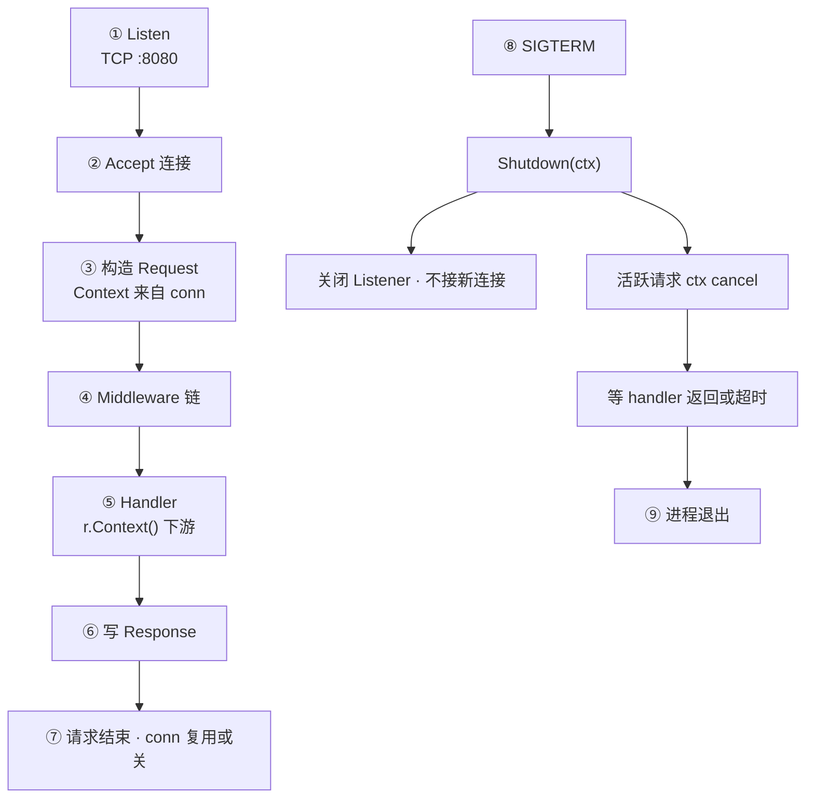
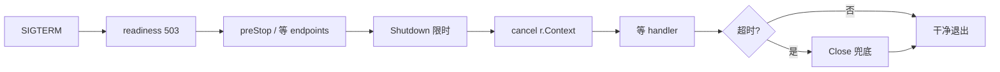
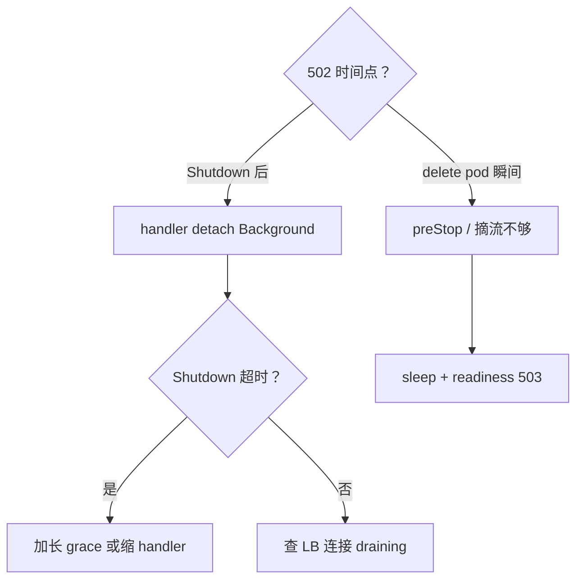

# 10｜HTTP Server 与优雅退出

> 发版 `kubectl delete pod` 后监控仍见 502 尖峰；有人 `ListenAndServe` 后直接 `os.Exit`，进行中的订单 half-written；有人只 `signal.Notify` 却不 `Shutdown`，grace 到点被 SIGKILL；还有人 handler 里 `context.Background()` 跑 5 分钟，Shutdown 永远等不完。
> **本章回答**：一个 HTTP 请求从 TCP 接入、`ServeHTTP`、`context` 取消到 `Shutdown` 收束的一生——怎么启服、怎么限、怎么优雅停。
> **不讲**：context 取消树细节 → [08](../08-context取消与超时传播/)；errgroup 批任务 → [09](../09-errgroup与并发限流/)；TLS/mTLS 全貌 → [14-HTTP与TLS](../../../01-基础底座/14-HTTP与TLS/)；pprof 挂 endpoint → [13](../13-pprof与性能排查/)。

**标记**：🎯重点 · 🔥难点 · ⭐常考 · 🔧实操

---

## 面试怎么考

| 标记 | 考点 |
|------|------|
| **核心** | `ListenAndServe` vs `Serve`；`Shutdown(ctx)` 停新接、等旧请求 |
| **必会** | SIGTERM 处理；Shutdown 超时 ctx；`BaseContext` / `r.Context()` |
| **常用** | 健康检查与摘流；`ReadHeaderTimeout`；中间件链 |
| **常考** | Shutdown 后 `ErrServerClosed`；K8s preStop + grace |

> 📝 **面试（30 秒）**：`http.Server` 在独立 goroutine `ListenAndServe`；`main` 听 **SIGINT/SIGTERM** 后调 **`Shutdown(ctx)`**——关 listener、拒新连接、等进行中 handler（或 ctx 超时）。Handler 必须用 **`r.Context()`** 传下游，Shutdown 时该 ctx 会 cancel。`Shutdown` 返回后还可能有 **detach 的 background goroutine**（自己 `WaitGroup`）。K8s：`terminationGracePeriodSeconds` 要 **大于** Shutdown ctx + preStop。别把 `ListenAndServe` 的 error 当致命——**`http.ErrServerClosed`** 是正常退出。

---

## 能力边界

| 机制 | 管什么 | 不管什么 |
|------|--------|----------|
| `Server.Shutdown` | 停 listener、等活跃连接上的请求 | handler 里 detach 的 goroutine |
| `r.Context()` | 客户端断连 + Shutdown 取消 | 未传 ctx 的后台任务 |
| `Server.Close` | 立刻关 listener + 空闲连接 | 优雅等 handler |
| app 级 `context` | 全进程生命周期 | 替代 per-request ctx |

- 🔑 **三条线要对齐**
  - Listener 生命周期（启 → 摘 → 关）
  - 每个请求的 `r.Context()`（断连 / Shutdown 会 cancel）
  - K8s grace（必须包住 Shutdown + preStop）

> ⚠️ **别混**：`Shutdown` **不杀** goroutine——只 cancel 请求 ctx、等 handler 返回；`go` + `Background` 的任务它看不见。

本节对应练习题 Q1。边界清了——看主图。

---

## 语言最小集

写/读生产 Go HTTP 服务，认这些即可：

| 零件 | 示例 | 含义 |
|------|------|------|
| `http.Server` | `&http.Server{Addr, Handler}` | 监听 + 派发 |
| `ServeMux` | `http.NewServeMux()` | 路由表 |
| `ListenAndServe` | `srv.ListenAndServe()` | Listen + Serve 一条龙 |
| `Shutdown` | `srv.Shutdown(ctx)` | 优雅停 |
| `Close` | `srv.Close()` | 粗暴停 |
| `r.Context()` | `svc.Do(r.Context())` | 请求级取消 |
| `signal.Notify` | `Notify(quit, SIGTERM)` | 收退出信号 |
| `ErrServerClosed` | `errors.Is(err, …)` | 正常 Shutdown 返回值 |

```go
srv := &http.Server{Addr: ":8080", Handler: mux}
go func() {
    if err := srv.ListenAndServe(); err != nil && !errors.Is(err, http.ErrServerClosed) {
        log.Fatalf("listen: %v", err)
    }
}()
```

- 🧩 **四行钉子**
  - Listen 放 goroutine → 主线程等信号
  - 信号后 `Shutdown(限时 ctx)` → 别 `os.Exit`
  - handler 用 `r.Context()` → 别 `Background`
  - Fatalf 前排除 `ErrServerClosed` → 别当 crash

零件认完，上主图。

---

## 一、一张图：请求从进入到优雅 shutdown 的一生

> 🎯 **一句话**：Listen → Accept → 派生 `Request.Context` → 中间件/handler → 响应 → SIGTERM → Shutdown 停新、cancel 进行中 ctx → Wait 干净退出。



- 📖 **读图**
  - 🛤️ 主线 ①→⑦ 是「一个请求的干活」；⑧→⑨ 是「进程的死亡」——两条线共用 `r.Context()` 作为取消通道
  - 🔥 Shutdown **不杀** handler——等它返回或 shutCtx 超时；`go background()` 不跟 ctx 的任务是头号敌人（Q1、Q14）

本节对应练习题 Q1、Q14。主线有了——先看启服。

---

## 二、启服：最小 Server 与 ErrServerClosed ⭐

> 🎯 **一句话**：`ListenAndServe` 阻塞直到 listener 关；正常 Shutdown 返回 **`http.ErrServerClosed`**。

```go
mux := http.NewServeMux()
mux.HandleFunc("/health", func(w http.ResponseWriter, r *http.Request) {
    w.WriteHeader(http.StatusOK)
})

srv := &http.Server{
    Addr:    ":8080",
    Handler: mux,
}

go func() {
    if err := srv.ListenAndServe(); err != nil && !errors.Is(err, http.ErrServerClosed) {
        log.Fatalf("listen: %v", err)
    }
}()
```

- 🧰 **三个入口**
  - `ListenAndServe()` — Listen + Serve 一条龙（最常见）
  - `Serve(l net.Listener)` — 已有 listener（systemd socket / 测试注入）
  - `ListenAndServeTLS()` — TLS 版本

#### ❓ 为什么 ErrServerClosed 不是错误？

- 🚪 **Shutdown 关 listener** → `ListenAndServe` 从阻塞返回，标准库约定用 `ErrServerClosed` 表示「正常关」
- ❌ 若 `log.Fatal` 不排除它 → 优雅退出变成 **crash 日志 / 告警风暴**
- ✅ 写法：`err != nil && !errors.Is(err, http.ErrServerClosed)` 才 Fatal

> 📝 **面试**：Fatalf 前必须排除 `ErrServerClosed`，否则优雅退出变 crash 日志。⭐（Q1、Q2）

本节对应练习题 Q1、Q2。ErrServerClosed 懂了，看请求 ctx。

---

## 三、干活：Request.Context 与下游 ⭐🔥

> 🎯 **一句话**：handler 里 **`r.Context()`** 在客户端断开 **和** Server Shutdown 时 cancel——下游必须用它。

```go
func handler(w http.ResponseWriter, r *http.Request) {
    ctx := r.Context()
    if err := svc.Process(ctx, id); err != nil {
        if errors.Is(err, context.Canceled) {
            return // 499 或不记 error
        }
        http.Error(w, err.Error(), 500)
    }
}
```

- 🔗 **取消从哪来**
  - 客户端断连 / 取消请求 → server 关该请求 ctx
  - `Shutdown` 开始 → 进行中请求的 `r.Context()` 被 cancel（通知 handler 该停了）
  - 下游 DB/HTTP 必须接同一个 ctx，才能跟着停（[08](../08-context取消与超时传播/)）

### ☠️ 反模式：detach 后台

```go
func handler(w http.ResponseWriter, r *http.Request) {
    go func() {
        longJob(context.Background()) // ← Shutdown 等不到
    }()
    w.WriteHeader(202)
}
```

#### ❓ 为什么 go + Background 是头号敌人？

- 🕵️ Shutdown 只等 **活跃连接上的 handler 返回**——handler 已经 `202` 返回了，后台 job 对它不可见
- 🧹 `Background` 永不 cancel → 进程要等 job 自己跑完，或被 K8s SIGKILL 硬切
- ✅ 修法：`context.WithCancel` 绑 **app 生命周期**，Shutdown 前 cancel；或 job 队列 + worker drain；DB 用 `QueryContext(r.Context())`

### 🌱 BaseContext

```go
srv := &http.Server{
    BaseContext: func(net.Listener) context.Context {
        return appCtx // 全进程根
    },
}
```

- 每个请求 ctx 的根来自 `BaseContext`；业务仍用 **`r.Context()`** 取**当前请求**（含 cancel）
- 少用 Value 塞大对象（[08](../08-context取消与超时传播/)）

> 💡 **打个比方**：`r.Context()` = 这桌客人的铃——客人走了或打烊（Shutdown），铃响，服务员该停；你另开一桌用不响的铃（`Background`），打烊也喊不住。

> 📝 **面试**：口诀——**「Shutdown 会取消 Request.Context」**；handler 里 detach 的 `go` 必须另有 app 级 cancel + Wait。⭐🔥（Q5、Q6）

本节对应练习题 Q5、Q6。ctx 懂了，看超时护栏。

---

## 四、护栏：超时与资源保护 ⭐

> 🎯 **一句话**：Server 级 timeout 防 slowloris 和 hung handler；与 handler 内 deadline 叠加取更严。

```go
srv := &http.Server{
    ReadHeaderTimeout: 5 * time.Second,  // 防 slowloris · 必设
    ReadTimeout:       10 * time.Second, // 读全 body
    WriteTimeout:      30 * time.Second, // 写响应
    IdleTimeout:       120 * time.Second,
    MaxHeaderBytes:    1 << 20,
}
```

- 🛡️ **字段各守一段**
  - `ReadHeaderTimeout` — 只等 header（Go 1.8+ **必设**）
  - `ReadTimeout` — 含 body 读
  - `WriteTimeout` — 写响应窗口（长 SSE 要 0 或单独 Server）
  - `IdleTimeout` — keep-alive 空闲
  - `MaxHeaderBytes` — 防大 header 攻击

#### ❓ 为什么 WriteTimeout 会误杀 SSE / WebSocket？

- ⏱️ `WriteTimeout` 从读完请求起算整段写窗口——SSE 推几分钟必然超时断流
- ✅ 长连接路由：**单独 Server** 或该路径 `WriteTimeout: 0`，靠 `r.Context()` 在 Shutdown 时断流
- 🔌 **Hijack** 后 Server **不再管理**该连接——Shutdown 等不到，要自己关（八节）

### ⏳ Handler 超时中间件

```go
func timeoutMiddleware(d time.Duration, next http.Handler) http.Handler {
    return http.HandlerFunc(func(w http.ResponseWriter, r *http.Request) {
        ctx, cancel := context.WithTimeout(r.Context(), d)
        defer cancel()
        r = r.WithContext(ctx)
        done := make(chan struct{})
        go func() {
            next.ServeHTTP(w, r)
            close(done)
        }()
        select {
        case <-done:
        case <-ctx.Done():
            http.Error(w, "timeout", http.StatusGatewayTimeout)
        }
    })
}
```

- ⚠️ 外层 goroutine 在 timeout 后可能 **仍在写**——优先 `http.TimeoutHandler` 或 Go 1.20+ `ResponseController`
- 与 `WriteTimeout` 叠加取更严

> ⚠️ **别混**：Server timeout ≠ 业务 deadline；业务用 `WithTimeout(r.Context(), …)` 拆预算（[08](../08-context取消与超时传播/)）。

本节对应练习题 Q7、Q5。超时会了，看中间件外套。

---

## 五、外套：中间件链与 panic recover ⭐

> 🎯 **一句话**：`Handler` 外层包 logging、metrics、recover；顺序：**recover 最外**。

```go
func withRecover(next http.Handler) http.Handler {
    return http.HandlerFunc(func(w http.ResponseWriter, r *http.Request) {
        defer func() {
            if rec := recover(); rec != nil {
                log.Printf("panic: %v\n%s", rec, debug.Stack())
                http.Error(w, "internal error", 500)
            }
        }()
        next.ServeHTTP(w, r)
    })
}

mux := http.NewServeMux()
mux.Handle("/api/", withRecover(withLog(apiHandler)))
```

- 🧯 **panic 不 recover → crash 整进程**（整 pod 挂）
- 📊 metrics 中间件别阻塞 Shutdown——用 ctx 感知取消
- 📐 常见顺序（外→内）：`recover → log/metrics → auth → timeout → handler`

### 🌊 Flush / Hijack（长响应）

```go
func stream(w http.ResponseWriter, r *http.Request) {
    fl, ok := w.(http.Flusher)
    if !ok {
        http.Error(w, "no flush", 500)
        return
    }
    for _, chunk := range chunks {
        select {
        case <-r.Context().Done():
            return
        default:
            _, _ = fmt.Fprintf(w, "data: %s\n\n", chunk)
            fl.Flush()
        }
    }
}
```

- SSE 路由 **单独** 设 `WriteTimeout: 0`，Shutdown 靠 `r.Context()` 断流
- WebSocket：`Hijacker` 接管后 **自己管生命周期**

本节对应练习题 Q8。recover 懂了，进优雅退出核心。

---

## 六、死亡：优雅退出模板 ⭐🔥

> 🎯 **一句话**：信号 → `Shutdown(shutCtx)` → 限时等待 → 超时则 `Close` 或退出。

🔥 大白话：**Shutdown = 停接新连接 + 等旧请求收尾 + 取消各请求的 ctx**——不是立刻把进程杀掉。

```go
func main() {
    srv := &http.Server{
        Addr:              ":8080",
        Handler:           mux,
        ReadHeaderTimeout: 5 * time.Second,
        ReadTimeout:       10 * time.Second,
        WriteTimeout:      30 * time.Second,
        IdleTimeout:       60 * time.Second,
    }

    go func() {
        if err := srv.ListenAndServe(); err != nil && !errors.Is(err, http.ErrServerClosed) {
            log.Fatalf("listen: %v", err)
        }
    }()
    log.Println("listening :8080")

    quit := make(chan os.Signal, 1)
    signal.Notify(quit, syscall.SIGINT, syscall.SIGTERM)
    <-quit
    log.Println("shutting down...")

    shutCtx, cancel := context.WithTimeout(context.Background(), 30*time.Second)
    defer cancel()

    if err := srv.Shutdown(shutCtx); err != nil {
        log.Printf("shutdown: %v", err)
        _ = srv.Close() // 兜底
    }
    log.Println("server stopped")
}
```

### 🚪 Shutdown 做了什么 ⭐

- **关闭 listener**——新 TCP 进不来
- **关闭 idle 连接**
- **等待**活跃请求上的 handler 跑完（或 shutCtx 超时）
- 进行中的 **`r.Context()` 会被 cancel**

> 💡 **打个比方**：Shutdown = 关店门牌 + 等店内客人结完账；`Close` = 拉闸赶人。

#### ❓ 为什么 Shutdown 的 ctx 要用 Background 子 timeout？

- 📡 收到 SIGTERM 后，`signal.NotifyContext` 的 parent **往往已 cancel**
- ⏱️ 若把已 cancel 的 ctx 传给 `Shutdown` → **立刻超时**，等于没 grace
- ✅ 用 `context.WithTimeout(context.Background(), 30*time.Second)` 给 Shutdown **独立 grace 窗口**（[08](../08-context取消与超时传播/)）

### Close vs Shutdown ⭐

| 方法 | 行为 | 何时 |
|------|------|------|
| `Shutdown(ctx)` | 优雅：停新、等旧 | SIGTERM 首选 |
| `Close()` | 粗暴：关 listener 和连接 | Shutdown 超时兜底 |

```go
if err := srv.Shutdown(shutCtx); err != nil {
    log.Printf("graceful failed: %v, forcing close", err)
    _ = srv.Close()
}
```

#### ❓ 为什么 Close 不能当首选？

- ⚡ `Close` **不等** handler——可能 mid-write，客户端半截响应
- 🩹 只作 Shutdown 超时后的兜底，日志要记「forced close」

### 🔗 与 errgroup / app ctx 🔧

```go
ctx, stop := signal.NotifyContext(context.Background(), syscall.SIGINT, syscall.SIGTERM)
defer stop()

g, ctx := errgroup.WithContext(ctx)
g.Go(func() error {
    if err := srv.ListenAndServe(); err != nil && !errors.Is(err, http.ErrServerClosed) {
        return err
    }
    return nil
})
g.Go(func() error {
    <-ctx.Done()
    shutCtx, cancel := context.WithTimeout(context.Background(), 30*time.Second)
    defer cancel()
    return srv.Shutdown(shutCtx)
})
if err := g.Wait(); err != nil {
    log.Fatal(err)
}
```

- HTTP 与后台任务共听同一 SIGTERM（[09](../09-errgroup与并发限流/)）
- 信号处理用 `sync.Once` 或 `NotifyContext`，防双 Shutdown

### ⏱️ 超时链 🔧

- K8s `terminationGracePeriodSeconds` ≥ preStop + Shutdown + 缓冲（如 **60s**）
- `Shutdown` ctx 常见 **30s**
- `WriteTimeout` 应 ≤ Shutdown，避免 handler 拖过 grace

### 收束：优雅退出凭什么干净 🎯



- 📖 **读图**：摘流（七节）在 Shutdown **之前**；ctx cancel 是通知，不是杀进程；超时才 Close

**可背清单**：

1. Listen 在 goroutine；主线程等信号
2. Shutdown + 独立 30s Background 子 ctx
3. `ErrServerClosed` 正常
4. handler 用 `r.Context()`
5. K8s grace > Shutdown + preStop
6. 后台 goroutine 要 app 级 cancel + Wait
7. 超时才 `Close`

> ⚠️ **别混**：优雅退出 **不保证** detach 任务结束；**不保证** Hijack/SSE 自动收束——那些要自己管。

> 📝 **面试**：信号 → Shutdown(限时) → 超时 Close；记忆分组——**停新 / 等旧 / 兜底**。⭐🔥（Q3、Q4、Q11）

本节对应练习题 Q3、Q4、Q11。模板会了，看 K8s 摘流。

---

## 七、摘流：K8s 与负载均衡 🔧🔥

> 🎯 **一句话**：**preStop sleep** + **readiness 失败** + **Shutdown** 三步，避免 LB 仍把流量打到 terminating pod。

```yaml
lifecycle:
  preStop:
    exec:
      command: ["/bin/sh", "-c", "sleep 5"]
terminationGracePeriodSeconds: 60
```

```go
var shuttingDown atomic.Bool

func ready(w http.ResponseWriter, r *http.Request) {
    if shuttingDown.Load() {
        w.WriteHeader(503)
        return
    }
    w.WriteHeader(200)
}

// 收到 SIGTERM 后
shuttingDown.Store(true)
time.Sleep(2 * time.Second) // 等 endpoints 更新
srv.Shutdown(shutCtx)
```

#### ❓ 为什么要 preStop sleep？

- 📡 Endpoint Controller 把 pod 从 Service endpoints **摘掉有延迟**
- ⏱️ 若立刻 Shutdown → LB/kube-proxy 仍可能把请求打到已停听的 IP → **502 尖峰**
- ✅ preStop sleep（或先 readiness 503 再 sleep）给 control plane **几秒窗口**
- 🌐 Ingress 层 502 常是 **pod 已死但 LB 缓存仍指向旧 IP**

- 🔥 发版 502 常在 **摘流顺序**，不在业务慢查询
- 📐 建议顺序：SIGTERM → readiness 503 → sleep → Shutdown → 退出

本节对应练习题 Q9、Q10。摘流会了，看多 Server 与并存。

---

## 八、变体：双端口 · TLS · gRPC 🔧

> 🎯 **一句话**：生产常多监听；每个 `http.Server` 都要 Shutdown；长连接与 gRPC 另有收束口径。

### 双 Server（业务 + admin）

生产常 **业务 :8080** + **admin :9090**（metrics/pprof/ready）——同一进程两个 Server，Shutdown **都要调**。

```go
var wg sync.WaitGroup
shutCtx, cancel := context.WithTimeout(context.Background(), 30*time.Second)
defer cancel()

for _, srv := range []*http.Server{apiSrv, adminSrv} {
    srv := srv
    wg.Add(1)
    go func() {
        defer wg.Done()
        _ = srv.Shutdown(shutCtx)
    }()
}
wg.Wait()
```

- 只 Shutdown API 不停 admin → `/ready` 仍 200 但业务已死，摘流逻辑错
- pprof 别裸奔公网——鉴权或 bind admin port（[13](../13-pprof与性能排查/)）

### TLS / HTTP/2

```go
srv := &http.Server{
    Addr:    ":443",
    Handler: mux,
    TLSConfig: &tls.Config{
        MinVersion: tls.VersionTLS12,
        NextProtos: []string{"h2", "http/1.1"},
    },
}
go srv.ListenAndServeTLS("cert.pem", "key.pem")
```

- HTTP/2 多路复用——Shutdown 等 **所有 stream** 结束；长 stream 同 SSE，靠 ctx cancel
- TLS 握手慢时 `ReadHeaderTimeout` 仍有效
- 证书热更新：常 **新进程 Listen + 旧进程 Shutdown**（K8s 滚动）

### 与 gRPC 并存

```go
grpcSrv.GracefulStop() // 阻塞：停新 RPC、等 inflight
httpSrv.Shutdown(shutCtx)
```

| 类型 | 优雅退出 |
|------|----------|
| `http.Server` | `Shutdown` |
| `grpc.Server` | `GracefulStop()` / `Stop()` |

- 通常先 gRPC `GracefulStop` 再 HTTP `Shutdown`——或并行，总 grace 包住两者之和
- 只停一边 → 健康检查易误报；**文档化**本服务顺序

### 反向代理后的客户端 IP

```go
func clientIP(r *http.Request) string {
    if xff := r.Header.Get("X-Forwarded-For"); xff != "" {
        return strings.TrimSpace(strings.Split(xff, ",")[0])
    }
    host, _, _ := net.SplitHostPort(r.RemoteAddr)
    return host
}
```

- 限流/审计用——**要**在网关 strip 伪造头

### 常用 Server 字段（速查）

- `Addr` / `Handler` / `TLSConfig` — 基础
- `ReadHeaderTimeout` · `ReadTimeout` · `WriteTimeout` · `IdleTimeout` · `MaxHeaderBytes` — 护栏
- `BaseContext` / `ConnContext` — 每连接根 / 派生 ctx
- `ConnState` — 连接状态回调（inflight 指标，Shutdown 观察是否归零）

```go
srv.ConnState = func(conn net.Conn, state http.ConnState) {
    metrics.Inc("conn_" + state.String())
}
```

本节对应练习题 Q11、Q12、Q14。变体钉死，作战 502。

---

## 九、作战：发版 502 怎么查 🔧

> 🎯 **一句话**：先对时间线（delete / Terminating / shutting down / 退出），再分「没摘流」还是「Shutdown 等不住」。



- 📖 **读图**：左支是「流量还在打已死 pod」；右支是「进程自己没干净退出」——先问时间点再选刀

| 现象 | 先做 | 别做 |
|------|------|------|
| 502 尖峰 | 对齐 preStop 与 grace | 只加副本不摘流 |
| Shutdown hang | 搜 handler 里 `go`+Background | 无限等 |
| ErrServerClosed 告警 | 改日志级别 / 过滤 | 当 crash |
| 慢退出 | pprof goroutine | 直接 SIGKILL |

**60 秒剧本** 🔧：

- **0–10s**：502 与 pod `Terminating` 时间线
- **10–30s**：`kubectl logs` 看 `shutting down` 到进程退出间隔
- **30–45s**：`rg 'context\.Background\(\)'` 扫 handler
- **45–60s**：核对 `terminationGracePeriodSeconds` vs Shutdown 30s

### 测试 Shutdown

```go
func TestGraceful(t *testing.T) {
    // 自建 Server + 短 grace：发 inflight 请求，调 Shutdown，断言 completes
    // httptest.NewServer 默认不测 signal——手动 Shutdown
}
```

- 集成测试用 **短 WriteTimeout** + **5s Shutdown ctx**

### 踩坑清单

| 现象 | 原因 | 修法 |
|------|------|------|
| Shutdown 永不返回 | handler detach go | 绑 ctx / WaitGroup |
| 发版 502 | 无 preStop | sleep + readiness |
| Fatalf on exit | 未过滤 ErrServerClosed | `errors.Is` |
| SSE 断 | WriteTimeout | 单独路由 Disable |
| DB 仍跑 | Background 查询 | `QueryContext(r.Context())` |
| 双 Shutdown | 信号两次 | `sync.Once` / `NotifyContext` |

本节对应练习题 Q13、Q6。定责完，收口。

---

## 十、收口

### 命令速查 🔧

```bash
# 发版观察
kubectl get pod -w
curl -v http://pod-ip:8080/health
curl -v http://pod-ip:8080/ready

# 代码审查
rg 'context\.Background\(\)' --glob '*handler*'
rg 'ListenAndServe' -A5 --glob 'main.go'
rg 'Shutdown\(' --glob '*.go'
```

### 面试锚点

| 问 | 30 秒答 |
|----|---------|
| Shutdown 做什么 | 关 listener、等活跃 handler、cancel 请求 ctx |
| ErrServerClosed | 正常 Shutdown 结果，别 Fatal |
| Close vs Shutdown | Close 粗暴；Shutdown 优雅 |
| K8s 要注意 | preStop、readiness、grace 大于 Shutdown |
| handler 最长能跑多久 | min(WriteTimeout, Shutdown ctx, 业务 deadline) |
| Shutdown ctx 为何 Background | parent 可能已 cancel，要独立 grace |

### 易错一句话

- 错：Shutdown 杀所有 goroutine → 对：只 cancel 请求 ctx，detach 不管
- 错：ListenAndServe error 都是失败 → 对：`ErrServerClosed` 正常
- 错：不设 ReadHeaderTimeout → 对：必设防 slowloris
- 错：SIGTERM 直接 Exit → 对：先 Shutdown
- 错：grace 30s、Shutdown 60s → 对：K8s grace 要包住 Shutdown
- 错：只 Shutdown 业务端口 → 对：admin Server 也要 Shutdown

### 数字墙

```text
ReadHeaderTimeout 5s · Shutdown ctx 30s · K8s grace 60s 常见
preStop sleep 5s · handler 用 r.Context() · ErrServerClosed 正常
WriteTimeout ≤ Shutdown · recover 最外层
```

本节对应练习题 Q7。

---

**回到开头那个现场**：delete pod 502、ListenAndServe 后 `os.Exit`、只 Notify 不 Shutdown、handler 里 Background 跑五分钟。正确剧本是：先摘流（readiness）→ Shutdown(限时) → handler 听 `Request.Context` → 超时 Close。

## 合上书

- [ ] **默画** HTTP 请求 + Shutdown 一生（标出 ctx cancel 发生在哪两步）
- [ ] 写 main 里 signal + Shutdown 骨架（含 `ErrServerClosed` 过滤）
- [ ] Shutdown 与 Close 区别；何时才 Close
- [ ] 为何 handler 不能 `go` + `Background`
- [ ] 为何 Shutdown ctx 常用 Background 子 timeout
- [ ] K8s preStop + readiness + grace 怎么配
- [ ] `ReadHeaderTimeout` 防什么；SSE 为何要关 WriteTimeout
- [ ] 发版 502 排查：时间线 → 摘流 vs detach
- [ ] 双 Server 为何都要 Shutdown
- [ ] 与 [08] `r.Context` 取消如何衔接；与 [09] errgroup 启服如何共听信号
