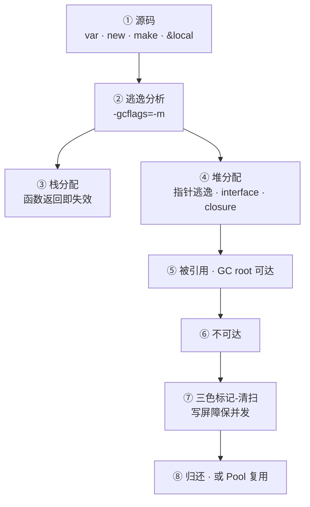
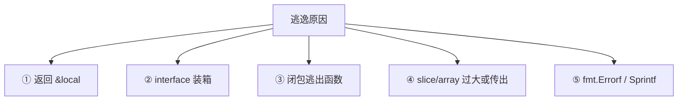
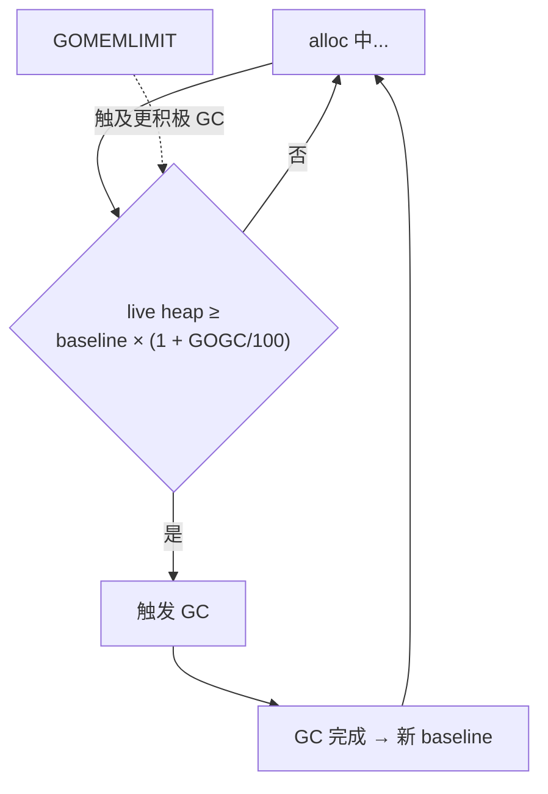
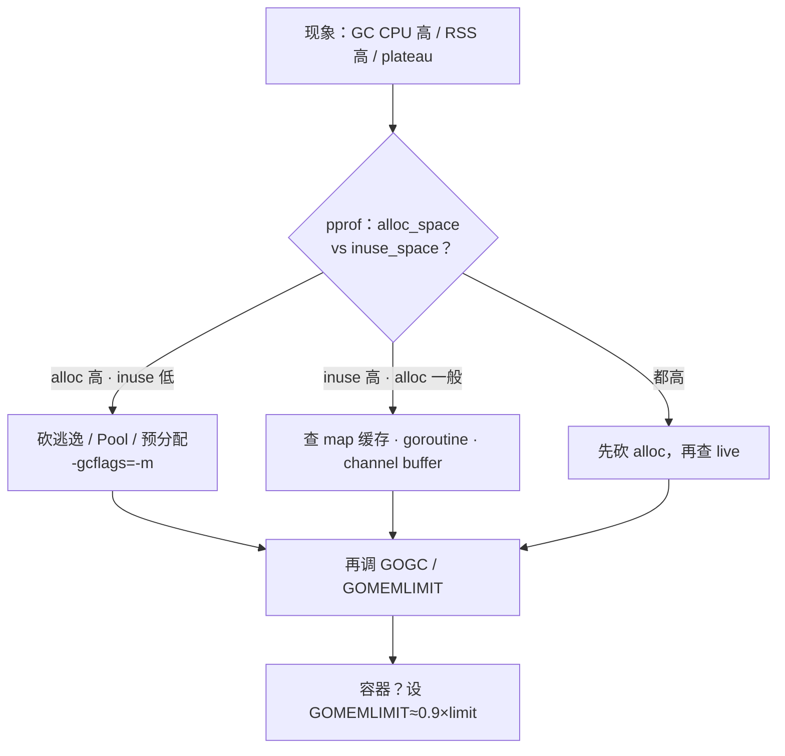

# 11｜GC 内存与逃逸分析

> 线上 heap 曲线 plateau 不下来，GOGC=100 下 GC 每分钟一轮仍占 40% CPU；有人以为「小对象放栈就快」，`go build -gcflags=-m` 满屏 escapes to heap；还有人把 sync.Pool 当缓存，GC 一清池子全空——性能更差。
> **本章回答**：一个对象从编译器分配决策（栈 vs 堆）、逃逸、三色 GC 到调优 GOGC/Pool 的一生——谁该在栈、谁必进堆、怎么证、怎么省。
> **不讲**：pprof 实操与 endpoint → [13](../13-pprof与性能排查/)；GOMAXPROCS 与 cgroup → [12](../12-GOMAXPROCS与容器cgroup/)；slice 零值陷阱 → [03](../03-类型零值与slice-map陷阱/)。

**标记**：🎯重点 · 🔥难点 · ⭐常考 · 🔧实操

---

## 面试怎么考

| 标记 | 考点 |
|------|------|
| **核心** | 逃逸 = 编译器无法证明生命周期在栈内 → 堆分配 |
| **必会** | `-gcflags=-m` 看逃逸；指针返回、interface、闭包捕获 |
| **常用** | GOGC、GOMEMLIMIT；sync.Pool 场景与限制 |
| **常考** | 栈不能手动 free；三色标记；写屏障；STW 已极短但非零 |

> 📝 **面试（30 秒）**：Go **没有**「把对象放栈上」的语法——**逃逸分析**在编译期定生死：生命周期不越函数、不被外部引用 → 可能栈；返回指针、存 map/global、interface 装箱、闭包出栈 → 堆。堆对象由 **GC** 回收：并发三色标记 + 清扫，写屏障保并发正确；`GOGC=100` 表示 live heap 翻倍触发。调优先看 **alloc rate** 与 **live heap**，别盲目 Pool。`GOMEMLIMIT`（1.19+）软限内存。面试让读 `-m` 输出比背 STW 毫秒数更重要。

---

## 能力边界

> 🎯 **一句话**：逃逸管编译期栈/堆，GC 管堆对象回收，Pool 管临时复用——三者各管一段，别混用。

| 概念 | 管什么 | 不管什么 |
|------|--------|----------|
| 逃逸分析 | 编译期栈/堆决策 | 运行期手动移栈 |
| GC | 回收不可达堆对象 | 文件 FD、OS 资源（要 Close） |
| sync.Pool | 复用临时对象降 alloc | 长期缓存、有状态对象 |
| GOGC | GC 触发频率 vs CPU | goroutine 数量 |
| GOMEMLIMIT | 软内存上限 | OOM killer 硬保证 |

- 🔑 **三条线要对齐**
  - 编译期：`-gcflags=-m` 定「放哪」
  - 运行期：GC 收堆上不可达对象；`inuse_space` 才是它管的那截
  - 复用层：Pool 只降短生命周期 alloc，不当缓存

> ⚠️ **别混**：GC 只回收**堆上 Go 对象**；`Close()` 文件、DB conn 仍要人管。RSS 含栈、OS 缓冲，不全是 GC heap。

本节对应练习题 Q1。边界清了——语言最小集。

---

## 语言最小集

> 🎯 **一句话**：Go 没有 `malloc`/`free`——`var` / `new` / `make` 声明对象，编译器决定放哪；资源用 `defer Close`。

```go
var x int                 // ← 值类型，不逃逸时栈上
y := new(int)             // ← *int；证明不逃逸则栈，否则堆
s := make([]byte, 64)     // ← header 可能栈，backing array 看逃逸/大小
m := make(map[string]int) // ← map 内部结构堆分配（含指针）
f, _ := os.Open(path)
defer f.Close()           // ← 资源不归 GC，必须 Close
```

- 🧩 **四行钉子**
  - `new(T)` 返回指针 ≠ 一定堆——以 `-m` 为准
  - slice **header** 与 **backing array** 可能分家：header 栈、数组堆
  - `make(map…)` 内部结构通常堆上
  - `defer Close` 管 OS 资源，GC 帮不上

> 📝 **面试**：Go 没有 `stack`/`heap` 关键字，也没有 `free()`——优化目标是**少逃逸、少 alloc**。问「怎么放栈」→ 改代码让编译器不逃逸。

本节对应练习题 Q2。最小集过了，诊断命令。

---

## 语法必会：三把刀 🔧

> 🎯 **一句话**：`-gcflags=-m` 看逃逸、`GODEBUG=gctrace=1` 看 GC、`-bench -benchmem` 看 alloc。

```bash
go build -gcflags="-m" ./...                   # ← moved to heap / escapes to heap
go build -gcflags="-m -m" ./... 2>&1 | head    # ← 二级 -m 给原因链
GODEBUG=gctrace=1 ./app 2>&1 | head -5         # ← 每次 GC 一行
go test -bench=. -benchmem ./...               # ← allocs/op · B/op · ns/op
```

```text
./main.go:10:2: moved to heap: x              # ← 变量从栈提升到堆
./main.go:15:9: &buf escapes to heap          # ← 取地址导致逃逸
./main.go:20:14: fmt.Sprintf(...) escapes to heap  # ← interface 参数逃逸
./main.go:25:7: argument does not escape      # ← 好信号：参数未逃逸
```

```text
gc 1 @0.015s 2%: 0.12+0.85+0.003 ms clock, 4->4->1 MB
#  ↑   ↑     ↑    ↑  STW+并发标记+STW     ↑ GC前→中→后 live
```

```text
BenchmarkFoo-8    1000000    128 ns/op    16 B/op    1 allocs/op
#                                       ↑          ↑
#                                  每次分配字节   每次分配次数
```

```go
func TestNoAlloc(t *testing.T) {
    if n := testing.AllocsPerRun(100, func() { Foo() }); n != 0 {
        t.Fatalf("allocs=%v, want 0", n) // ← Pool 命中时可为 0
    }
}
```

- 🔍 **现场怎么认**
  - 热路径优化前**先 `-m`**，别凭感觉改
  - `allocs/op` 比 `ns/op` 诚实——ns 受 CPU 频率影响，allocs 是硬指标
  - `b.ReportAllocs()` 必须在 benchmark 循环前；断言用 `AllocsPerRun`

本节对应练习题 Q2、Q3。命令会了——主图。

---

## 一、一张图：对象从分配到回收的一生 ⭐🔥

> 🎯 **一句话**：命运大半在**编译期**定——逃逸分析选栈或堆；堆对象活到不可达，再被三色 GC 清扫（或进 Pool 复用）。



- 📖 **读图**
  - 🛤️ ①→③/④ 是编译期分叉；⑤→⑧ 是运行期。调优是**少逃逸、少 alloc、控 live heap**，不是手写栈
  - 🔦 `-gcflags=-m` 照的是 ②；`gctrace` / pprof heap 照的是 ⑤→⑧（Q1、Q4）

本节对应练习题 Q1。主线有了——逃逸主战场。

---

## 二、出生：逃逸分析决定栈还是堆 ⭐🔥

> 🎯 **一句话**：源码变量 → 编译器逃逸分析 → 栈或堆——运行期没有 `free(x)`。

### 📮 栈 vs 堆：编译器说了算 ⭐

```go
func stackOK() int {
    x := 42
    return x // ← 返回值拷贝，x 可栈分配
}

func heapEscape() *int {
    x := 42
    return &x // ← x escapes to heap：调用方仍持有指针
}
```

```text
stackOK:    x 在栈上 → 帧弹出 → 自动销毁
heapEscape: x 在堆上 → GC 追踪 → 无人引用后才回收
```

> 💡 **打个比方**：栈是工位便签——下班（函数返回）就撕掉；堆是公共储物柜——放进去要编号（指针），没人用了保洁（GC）才收。

| 倾向栈 | 倾向堆 |
|--------|--------|
| 小值、不逃逸的 local | 返回 `&local` |
| 不越过函数边界的值 | 存 global、map、channel |
| 内联后可证明安全 | `interface{}` 装箱未知大小 |
| — | 闭包引用且闭包逃出函数 |
| — | slice 底层数组过大或逃逸 |
| — | `fmt.Sprintf` 等间接分配 |

#### ❓ 为什么「小对象」不一定在栈？

- ❌ **错直觉**：字节数小 → 栈；大 → 堆
- ✅ **真规则**：看**是否被函数外引用**，不是看大小
- 🧪 **反例**：`return &tinyStruct{}`——再小也逃逸；不逃逸的大数组也可能栈上（受栈大小限制，过大仍堆）
- 🔦 **以 `-m` 为准**，别凭感觉

### 🔍 常见逃逸五种模式 ⭐🔥

```go
// ① 返回局部指针
func newUser() *User { u := User{}; return &u } // ← u escapes

// ② interface 装箱
func log(v interface{}) { fmt.Println(v) }
log(123) // ← 123 可能 escape：interface 装箱

// ③ 闭包逃出函数
func counter() func() int {
    n := 0
    return func() int { n++; return n } // ← n escapes
}

// ④ slice 指针传出或过大
func makeSlice(n int) []byte {
    b := make([]byte, n) // ← 大 n 或返回 → backing array 堆
    return b
}

// ⑤ fmt.Errorf 热路径
err := fmt.Errorf("id=%d", id) // ← 每次 alloc
```

- 🧠 **背法**：指针出栈 · 接口装箱 · 闭包捕获 · 大对象传出 · 间接分配
- 🛠️ **修法**：返回值类型 · typed API · 避免闭包逃出 · 预分配 · `strconv` 替代 `Sprintf`

#### ❓ 为什么 `new(T)` 不一定堆分配？

- ❌ **错直觉**：用了 `new` / 取了地址 → 一定堆
- ✅ **真规则**：编译器能证明不逃逸 → 仍可栈；`make([]T,n)` 的 header 可能栈、数组常堆
- 🔦 **以 `-m` 输出为准**，别背关键字

### 🔧 内联会改逃逸结果 ⭐

```go
func add(a, b int) int { return a + b }
func caller() int {
    x := 1
    return add(x, 2) // ← 内联后 x 可能不逃逸
}
```

```bash
go build -gcflags="-m -l" ./...  # ← -l 禁用内联，对比差异
```

#### ❓ 为什么 `go test -m` 和 `go build -m` 结果可能不同？

- 🧩 **内联阈值与调用上下文不同**——测试包与正式 build 优化路径不完全一样
- 🔬 加 `-l` 禁内联对比是深度题：同一段代码「逃不逃」会变

### ✂️ 减少逃逸的手法 🔧

```go
// 差：每次 heap
func labels(id int) string {
    return fmt.Sprintf("id=%d", id)
}

// 较好：复用 []byte，零/少 alloc
func labels(b []byte, id int) []byte {
    return strconv.AppendInt(append(b[:0], "id="...), int64(id), 10)
}
```

```go
// 差：循环 +
s := ""
for _, w := range words { s += w }

// 好：strings.Builder
var b strings.Builder
for _, w := range words { b.WriteString(w) }
```

```go
// 差：json.Marshal 反射 + 临时对象
data, _ := json.Marshal(v)

// 好：codegen（easyjson、protobuf）
data, _ := v.MarshalJSON()
```

> 🔍 **现场**：热路径用 `strconv.AppendInt` + 复用 `[]byte`、`strings.Builder`、codegen 替代反射 JSON。`unsafe.String` 仅懂边界时用。

### 收束：逃逸五种模式 🎯⭐



- 📖 **读图**：五条边对应五种修法——值返回 / typed API / 闭包不逃出 / 预分配 / strconv。面试白板先画这张再展开。

> 📝 **面试**：返回 `&local` **必逃逸**。问「怎么少堆」→ 先 `-m` 定位模式，再改签名/装箱/闭包，别空喊「用栈」。⭐（练习题 Q1、Q4、Q5）

⭐ 逃逸懂了，看三色 GC。

---

## 三、干活：三色标记与写屏障 ⭐🔥

> 🎯 **一句话**：并发**标记**可达 + **清扫**不可达；**写屏障**保并发正确；STW 极短但非零。

### 🎨 三色不变式


- 📖 **读图**
  - 白→灰→黑单向推进；唯一回退是**写屏障**：标记期间 mutator 往黑色对象写入指向白色的指针时，把白标灰（或黑回灰）
  - 否则那个白色会被误清扫——并发标记的正确性靠它

| 色 | 含义 | GC 动作 |
|----|------|---------|
| 白 | 未访问 | 清扫阶段回收 |
| 灰 | 已发现，子引用未扫完 | 继续扫子引用 |
| 黑 | 已扫完 | 保留 |

> 💡 **打个比方**：清洁工大扫除——白=没看过的房间，灰=正在翻的房间，黑=确认有人用。你还在往黑房塞白包裹时，写屏障强制把新塞的标成「灰」，否则会被当垃圾扫走。

### 🚧 写屏障是什么 ⭐

**写屏障（write barrier）** = 编译器在每次**指针写入**处插入的一小段代码。Go 用混合写屏障（Dijkstra + Yuasa），标记期间：

- 往黑色对象写入指向白色的指针 → 把白色标灰，防漏标
- 代价：每次指针写多几条指令，换来 GC 与 mutator **并发**

> ⚠️ **别混**：写屏障**只在 GC 标记阶段开启**，平时不开——正常路径无额外开销。GC 占 CPU 的一部分就来自这段。

#### ❓ 为什么需要写屏障？不能一直 STW 吗？

- 🛑 **全程 STW**：正确但延迟不可接受——业务全停
- ⚡ **并发标记**：业务继续写指针 → 必须有屏障防止「黑指向白」漏标
- 🧮 **trade-off**：写屏障指令税 + 扫描成本，换亚毫秒级 STW

### ⏱️ STW 在哪 🔧

```text
GC 一轮 phases：
  ① STW: 栈扫描准备（极短，~10us 级）
  ② 并发标记: 写屏障开 → 扫灰 → 全黑（大部分时间）
  ③ STW: 标记终止 + 清扫准备（极短）
  ④ 并发清扫: 回收白色对象
```

#### ❓ 为什么说「并发 GC」STW 还非零？

- ✅ **大部分工作并发**（标记、清扫）
- ⚠️ **仍有短 STW**：栈扫描准备、标记终止——亚毫秒级，**不是零**
- ❌ 说「Go GC 完全没有 STW」直接减分
- 📊 GC CPU 高通常不是 STW 长，而是**标记 + 写屏障 + 扫描**成本

### 📟 gctrace 怎么读 🔧

```bash
GODEBUG=gctrace=1 ./app 2>&1 | head -5
```

```text
gc 1 @0.015s 2%: 0.12+0.85+0.003 ms clock, 4->4->1 MB, 0 MB goal, 0 stacks
#  ↑   ↑     ↑    ↑ STW+标记+STW              ↑ 前→中→后 live
```

- 🔍 **现场怎么认**
  - `2%`：GC 占总 CPU——超 10% 就该查
  - `0.12+0.85+0.003`：两端 STW、中间并发标记
  - `4->4->1 MB`：看 alloc→live 差；发布前后对比间隔突变 = 新代码 alloc 猛涨
  - scavenge 行 = 归还 OS；RSS 可能仍高于 heap

> ⚠️ **别混**：`runtime.SetFinalizer` 时机不确定，**不推荐**靠它释放资源——文件/conn 一律 `defer Close()`。

> 📝 **面试**：口诀「写屏障保并发标记」。STW 亚毫秒但非零；CPU 税看标记阶段。⭐（练习题 Q6、Q7）

---

## 四、调优：GOGC 与 GOMEMLIMIT ⭐🔧

> 🎯 **一句话**：`GOGC=100` = live heap 翻倍触发；`GOMEMLIMIT` 软限触及更积极 GC——容器必设后者。



- 📖 **读图**
  - GOGC=100 → 到上次 live 的 **2×** 触发；200 → 3×（更少 GC、更高内存）；50 → 1.5×（更频 GC、更低内存）
  - 两个条件**谁先满足谁触发**——不是互斥，是 OR

```bash
export GOGC=200         # ← 3× 再 GC，CPU 少、内存多
export GOGC=50          # ← 1.5× 就 GC，CPU 多、内存少
export GOGC=off         # ← 关自动 GC（慎用！须配 GOMEMLIMIT）
export GOMEMLIMIT=4GiB  # ← Go 1.19+ 软内存上限
```

| 场景 | 建议 |
|------|------|
| 容器 512Mi limit | `GOMEMLIMIT=460MiB`（留 ~10% 缓冲） |
| 内存紧、可吃 CPU | 降 GOGC 或设 GOMEMLIMIT |
| CPU 紧、内存够 | 略升 GOGC（150–200） |
| 批处理峰值 alloc | 临时降 GOGC 或砍 alloc |
| OOM 前 RSS 平 | 查 live 泄漏，非只调 GOGC |

#### ❓ GOGC 和 GOMEMLIMIT 会不会抢着触发？

- 🤝 **不冲突**：两条触发条件，**谁先到谁跑**
- 📦 **容器**：cgroup memory limit 是**硬杀**；GOMEMLIMIT 是软限，让 GC 更积极——仍可能 OOM 若 live 真泄漏
- 🚫 **GOGC=off**：只在配 GOMEMLIMIT + 监控到位时可以，否则必炸

> ⚠️ **别混**：GOMEMLIMIT **不保证**不被 cgroup OOM kill。与 [12](../12-GOMAXPROCS与容器cgroup/) 配合：CPU limit 与 memory limit 是两回事。

> 📝 **面试**：历史上大 slice **ballast** 撑高 baseline 减 GC 频——Go 1.20+ 已被 GOMEMLIMIT 替代，**不推荐** ballast（还浪费 cgroup 配额）。⭐（练习题 Q8、Q9）

---

## 五、复用：alloc vs live · sync.Pool ⭐🔥

> 🎯 **一句话**：高 alloc → 少 New / Pool / 预分配；高 live → 缩缓存 / 查泄漏——方向不同，别一套药。

### 📊 alloc rate vs live heap

```text
高 alloc、低 live → 少 New · 复用 buffer · Pool     # ← GC CPU 高，RSS 未必大
低 alloc、高 live → 缩缓存 · 查 map/goroutine 泄漏 # ← RSS 高，GC 不频
两者都高         → 先砍 alloc，再查 live
```

> 🔍 **现场**：pprof `alloc_space`（累计）vs `inuse_space`（常驻）——前者看 rate，后者看 live。详 [13](../13-pprof与性能排查/)。

### ♻️ sync.Pool ⭐

```go
var bufPool = sync.Pool{
    New: func() interface{} {
        b := make([]byte, 0, 4096)
        return &b
    },
}

func process() {
    bp := bufPool.Get().(*[]byte)
    buf := (*bp)[:0] // ← 复用前重置长度
    defer func() {
        *bp = buf
        bufPool.Put(bp)
    }()
    // 用 buf 组装...
}
```

- 📏 **三条规则**
  - **Put 前重置**——别泄漏上请求数据到下一个 Get
  - **对象可能随时被 GC 清空**——Get 可能走 `New`
  - **适合临时 buffer / 解码器**——不适合连接池、有状态 session

#### ❓ 为什么 sync.Pool 不能当缓存？

- 🧹 **GC 可整池清空**——命中率不保证，当 session 缓存会逻辑错
- 🔗 **连接池**用 `database/sql` 等专用池；Pool **无 LRU、无长期持有语义**
- 🪪 把带 PII 的 User 放 Pool → 脏读 + 清空后业务错

> ⚠️ **别混**：sync.Pool ≠ 连接池 ≠ 长期缓存。

### 🗺️ map / slice 顶高 live 🔧

```go
cache := map[string][]byte{}
cache[key] = val // ← 永不 delete → live 涨

big := make([]byte, 1<<20)
sub := big[:100] // ← 整段 backing array 仍 live
```

> 💡 **打个比方**：map 只增不删 = 只往房里塞家具；subslice = 你只用书桌，整间房仍算你占用。

- 🛠️ **治理**：TTL/LRU、双 buffer 换 map、subslice 前 **copy** 出小片

### 📡 channel 里的指针

```go
type Big struct{ Data [1 << 20]byte }
ch := make(chan *Big, 10)
ch <- &Big{} // ← Big 堆上，buffer 引用保 live 直到消费方丢弃
```

- 🔥 背压满时对象堆在 channel buffer——与 [05](../05-goroutine与调度模型/) goroutine 泄漏联查

> 📝 **面试**：Pool 不是缓存——GC 可清空。alloc 推 GC CPU，live 推 RSS。⭐（练习题 Q10、Q11）

**回到开头现场**：`-m` 看逃逸 → pprof alloc 看热点 → GOGC/GOMEMLIMIT 控税 → Pool 只复用短生命周期缓冲。

---

## 六、模板：Pool 与 benchmark 🔧

> 🎯 **一句话**：热路径降 alloc 两件套——Pool 复用 buffer + benchmark 验 allocs/op。

### sync.Pool 模板

```go
package util

import "sync"

var bufPool = sync.Pool{
    New: func() interface{} {
        b := make([]byte, 0, 4096)
        return &b
    },
}

func GetBuf() *[]byte {
    bp := bufPool.Get().(*[]byte)
    *bp = (*bp)[:0] // ← 复用前重置，容量保留
    return bp
}

func PutBuf(bp *[]byte) {
    *bp = (*bp)[:0]
    bufPool.Put(bp)
}
```

### benchmark 模板

```go
func BenchmarkProcess(b *testing.B) {
    b.ReportAllocs()
    for i := 0; i < b.N; i++ {
        bp := GetBuf()
        buf := append(*bp, "data"...)
        _ = buf
        PutBuf(bp)
    }
}
```

```text
BenchmarkProcess-8    5000000    240 ns/op      0 B/op    0 allocs/op  # ← 命中
BenchmarkProcess-8    5000000   1200 ns/op   4096 B/op    1 allocs/op  # ← 未命中
```

> 🔍 **现场**：优化前后比 `allocs/op`；`-count=5` 取中位数，别只跑一次。

本节对应练习题 Q12。模板拿走——作战。

---

## 七、作战：heap plateau / GC CPU 高怎么查 🔧

> 🎯 **一句话**：先分清是 **alloc 税** 还是 **live 泄漏**，再选刀——别一上来就开 Pool 或乱调 GOGC。



- 📖 **读图**：左支是「造垃圾太快」；右支是「垃圾收不掉」——先问 pprof 两列再动刀，别盲 Pool

| 现象 | 先做 | 别做 |
|------|------|------|
| GC CPU >10% | gctrace + alloc profile | 先升 GOGC 掩盖 |
| RSS 高、GC 不频 | inuse_space 查泄漏 | 只降 GOGC |
| 满屏 escapes | `-m` 对热路径改签名 | 全局加 Pool |
| 容器 OOM | 设 GOMEMLIMIT≈0.9×limit | GOGC=off 不配 limit |
| Pool「越用越慢」 | 查是否当缓存 / 未 Reset | 再套一层缓存 |

### ⏱️ 60 秒剧本 🔧

- **0–10s**：`GODEBUG=gctrace=1` 看 CPU% 与间隔；对照发布前后
- **10–30s**：pprof heap——`alloc_space` vs `inuse_space` 定性
- **30–45s**：热路径 `-gcflags=-m`；确认是否 interface/闭包/Sprintf
- **45–60s**：容器查 GOMEMLIMIT；Pool 只动短生命周期 buffer，并验 `allocs/op`

本节对应练习题 Q13。作战钉死——踩坑与收口。

---

## 八、踩坑：现象 · 原因 · 修法

| 现象 | 原因 | 修法 |
|------|------|------|
| Pool 脏数据 | Put 前未清零 | Reset 再 Put |
| -m 仍 heap | 接口/闭包逃逸 | 改 API 或返回值类型 |
| GOGC=off 后 OOM | 无 GOMEMLIMIT | 设 limit 或恢复 GOGC |
| 字符串拼接慢 | `+` in loop | strings.Builder |
| map 只增不减 | 缓存无 TTL | 限大小或 LRU |
| RSS 高于 heap | OS 缓冲 + 栈 | 看 inuse_space |
| 以为 return 值栈 | 大 struct 拷贝 | 权衡 copy vs pointer escape |
| 容器 OOM | 未设 GOMEMLIMIT | ≈ limit×0.9 |
| finalizer 不触发 | 时机不确定 | defer Close |
| json Marshal 慢 | 反射 + 临时对象 | codegen |

---

## 九、必会：对错与易混

### 对错表

| 错讲法 | 对讲法 |
|--------|--------|
| 小对象都在栈 | 看是否被函数外引用，不是看大小 |
| Go 有手动 free | 没有；改逃逸减 alloc |
| sync.Pool 当缓存 | 临时复用，GC 可清空 |
| GC 管文件关闭 | 要 Close；GC 只管堆 Go 对象 |
| STW 很长 / 为零 | 亚毫秒级，但非零 |
| new 一定堆分配 | 看逃逸，不逃逸则栈 |
| GOGC 越小越好 | CPU 涨，要 trade-off |
| ballast 仍是最佳实践 | GOMEMLIMIT 替代 |

### 易混一句话

- 逃逸分析 ≠ GC——编译期 vs 运行期
- alloc rate ≠ live heap——推 GC CPU vs 推 RSS
- GOGC ≠ GOMEMLIMIT——增长率 vs 绝对上限
- sync.Pool ≠ 连接池——临时复用 vs 长期持有
- 栈分配 ≠ 手动 free——随帧弹出
- 写屏障 ≠ 全程开——只在标记阶段

本节对应练习题 Q5、Q10。

---

## 十、收口

### 命令速查 🔧

```bash
go build -gcflags="-m" ./cmd/...               # ← 看逃逸
go build -gcflags="-m -m" ./... 2>&1 | head    # ← 原因链
GODEBUG=gctrace=1 ./app                        # ← GC trace
go test -bench=. -benchmem -count=5 ./...      # ← allocs/op
go tool pprof -alloc_space http://localhost:6060/debug/pprof/heap
```

### 面试锚点

| 问 | 30 秒答 |
|----|---------|
| 什么叫逃逸 | 编译器无法证明生命周期在栈内 → 堆分配 |
| 常见逃逸 | 返回指针、interface、闭包、大 slice、Sprintf |
| 怎么看逃逸 | `-gcflags=-m`：`moved to heap` / `escapes to heap` |
| 三色标记 | 白→灰→黑，写屏障防漏标，并发标记+清扫 |
| 写屏障 | 标记期间指针写入把白标灰 |
| GOGC=100 | live 翻倍触发；调大 GC 少、内存高 |
| GOMEMLIMIT | 1.19+ 软限，容器必设 |
| sync.Pool | 临时复用；Put 前 Reset；GC 可清空 |
| GC 管什么 | 堆 Go 对象；不管 FD/conn |
| alloc vs live | alloc→GC CPU，live→RSS |
| STW | 亚毫秒但非零 |
| 内联与逃逸 | 内联后可能不逃逸；`-l` 对比 |
| Pool 当缓存 | 错 |

### 易错一句话对照

- 小对象都在栈 → 看引用边界，不是大小
- 手动 free → GC 自动；改逃逸减 alloc
- Pool 当缓存 → 临时复用，GC 可清空
- GC 管文件 → 要 Close
- STW 很长/为零 → 亚毫秒但非零
- new 一定堆 → 看逃逸
- GOGC 越小越好 → CPU 涨
- ballast 最佳实践 → GOMEMLIMIT 替代
- finalizer 释放资源 → defer Close
- GOGC=off 安全 → 须配 GOMEMLIMIT
- Sprintf 不 alloc → 每次可能 alloc
- 写屏障全程开 → 只在标记阶段

### 数字墙

> GOGC=**100** 默认 · GOMEMLIMIT ≈ 容器 limit×**0.9** · goroutine 栈初始 **~2KB** · 三色：**白灰黑** · 写屏障只在**标记阶段** · STW **亚毫秒级** · Pool Put 前 **Reset** · `-gcflags=-m` 看逃逸 · pprof alloc 先于 blind Pool · 返回 **&local** 必堆 · ballast 已被 **GOMEMLIMIT** 替代 · `AllocsPerRun` 验零 alloc

本节对应练习题 Q1～Q14。

---

## 合上书

- [ ] **默画对象的一生**：源码 → 逃逸分析 → 栈/堆 → 被引用 → 不可达 → 三色清扫 → 归还/Pool。
- [ ] **口述栈 vs 堆**：倾向谁、为什么没有 `free`、编译器说了算；为什么小对象也可以堆。
- [ ] **默画三色 + 写屏障**：白→灰→黑，写屏障何时回灰、为什么要它。
- [ ] **口述逃逸五种模式**与对应修法；`-m` / `-m -m` / `-l` 各看什么。
- [ ] **口述 GOGC 与 GOMEMLIMIT**：100 含义、trade-off、谁先触发、容器怎么设。
- [ ] **口述 sync.Pool**：三条规则、为何不能当缓存、Put 前做什么。
- [ ] **口述 alloc vs live**：谁推 GC CPU、谁推 RSS、作战先看哪。
- [ ] **口述 gctrace**字段与 60 秒剧本第一刀。

下一章：[12](../12-GOMAXPROCS与容器cgroup/) · pprof：[13](../13-pprof与性能排查/)。
