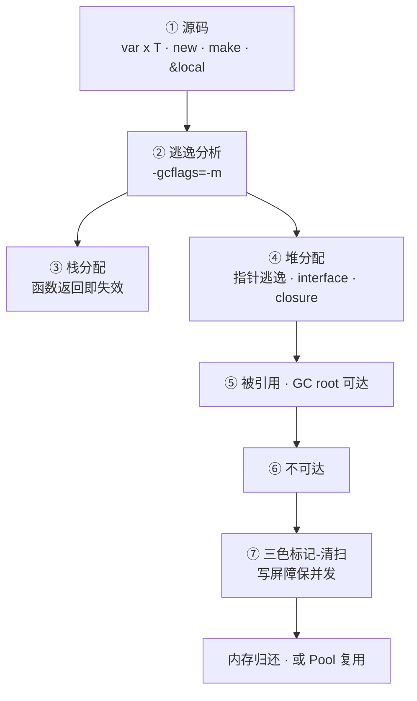
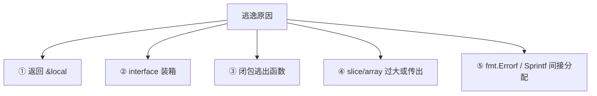
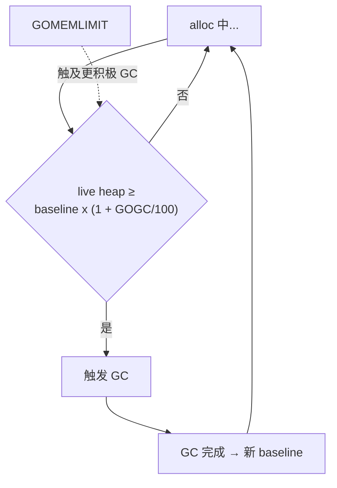

# GC内存与逃逸分析

> 大家好，欢迎来到这次分享。开讲之前，先带大家回到一个很多值班同学都踩过的现场：
> 线上 heap 曲线 plateau 不下来，GOGC=100 下 GC 每分钟一轮仍占 40% CPU；有人以为「小对象放栈就快」，`go build -gcflags=-m` 满屏 escapes to heap；还有人 sync.Pool 当缓存用，GC 一清池子全空——性能更差。
> 这一章讲完，你会知道当时那几个人各自错在哪——逃逸在编译期定生死，GC 调的是 live heap 与 CPU 税，Pool 不是缓存。
> **本章回答**：一个对象从编译器分配决策（栈 vs 堆）、逃逸、GC 三色标记清扫到调优 GOGC/Pool 的一生——谁该在栈、谁必进堆、怎么证、怎么省。
> **不讲**：pprof 实操与 endpoint 挂载 → [13](../13-pprof与性能排查/)；GOMAXPROCS 与 cgroup → [12](../12-GOMAXPROCS与容器cgroup/)；slice 零值陷阱 → [03](../03-类型零值与slice-map陷阱/)。这些都有专门的章节，本章只在用到时点到为止。

**标记**：🎯重点 · 🔥难点 · ⭐常考 · 🔧实操

**怎么听这场分享**：咱们先把能力边界和语言最小集扫过；第四节逃逸分析是主战场，再进三色 GC、GOGC/GOMEMLIMIT、Pool；模板代码一字不改。每一节讲完提示对应练习题。

## 面试怎么考

| 标记 | 考点 |
|------|------|
| **核心** | 逃逸 = 编译器无法证明生命周期在栈内 → 堆分配 |
| **必会** | `-gcflags=-m` 看逃逸；指针返回、interface、闭包捕获 |
| **常用** | GOGC、GOMEMLIMIT；sync.Pool 场景与限制 |
| **常考** | 栈不能手动 free；三色标记；写屏障；STW 已极短但非零 |

**30 秒怎么说**：Go **没有**「把对象放栈上」的语法——编译器**逃逸分析**决定：生命周期不超过函数、不被外部引用 → 可能栈分配；返回指针、存 map/global、interface 动态派发、闭包出栈 → 逃逸堆。堆对象由**GC**回收：并发三色标记 + 清扫，写屏障保并发正确，`GOGC=100` 表示 live heap 翻倍触发 GC。调优先看 **alloc rate** 和 **live heap**，别盲目 Pool。`GOMEMLIMIT`（Go 1.19+）软限内存。面试让读 `-m` 输出比背 STW 毫秒数更重要。


本节对应练习题目录先扫一眼。

---

## 一、能力边界：逃逸、GC、Pool 各管什么

> 🎯 **一句话**：逃逸分析管编译期分配决策，GC 管堆对象回收，Pool 管临时对象复用——三者各管一段，别混用。

| 概念 | 管什么 | 不管什么 |
|------|--------|----------|
| 逃逸分析 | 编译期栈/堆决策 | 运行期手动移栈 |
| GC | 回收不可达堆对象 | 文件 FD、OS 资源（要 Close） |
| sync.Pool | 复用临时对象降 alloc | 长期缓存、有状态对象 |
| GOGC | GC 触发频率 vs CPU | goroutine 数量 |
| GOMEMLIMIT | 软内存上限 | OOM killer 硬保证 |

> ⚠️ **别混**：GC 只回收**堆上 Go 对象**；`Close()` 文件、DB conn 仍要人管。RSS 含栈、OS 缓冲，不全是 GC heap——`inuse_space` 才是 GC 管的那部分。


本节对应练习题 Q1。边界清了——语言最小集。

---

## 二、语言最小集：Go 内存相关语法

> 🎯 **一句话**：Go 没有 `malloc`/`free`——`var` 声明、`new` 返回指针、`make` 建 slice/map/chan，`defer Close` 管资源，编译器决定放哪。

```go
var x int              // ← 值类型声明，可能栈
y := new(int)           // ← 返回 *int，堆或栈取决于逃逸
s := make([]byte, 64)   // ← slice header 可能栈，backing array 看逃逸
m := make(map[string]int) // ← map 本身堆分配（内部指针）
f, _ := os.Open(path)
defer f.Close()         // ← 资源不归 GC，必须 Close
```

```text
var x int        → 值类型，栈上（不逃逸时）
new(int)         → *int，编译器证明不逃逸则栈、否则堆
make([]byte, 64) → slice header 栈/堆，backing array 常堆
make(map[...])   → map 内部结构堆分配（含指针）
defer Close()    → 资源生命周期不归 GC，必须显式释放
```

**读代码**：`new(T)` 返回指针 ≠ 一定堆分配——编译器能证明不逃逸则栈。`make` 的 slice header 可能栈上，但底层数组若被返回或过大则堆。map 本身始终在堆上（内部含指针）。

> 📝 **面试**：Go 没有 `stack`/`heap` 关键字，也没有 `free()`——优化目标是**少逃逸、少 alloc**，不是手写栈。问「怎么放栈」→ 改代码让编译器不逃逸。


本节对应练习题 Q2。最小集过了，诊断命令。

---

## 三、语法必会：诊断命令与 benchmark 🔧

> 🎯 **一句话**：三把刀——`-gcflags=-m` 看逃逸、`GODEBUG=gctrace=1` 看 GC、`-bench -benchmem` 看 alloc。

```bash
go build -gcflags="-m" ./...                   # ← 看逃逸：moved to heap / escapes to heap
go build -gcflags="-m -m" ./... 2>&1 | head    # ← 二级 -m 给原因链
GODEBUG=gctrace=1 ./app 2>&1 | head -5         # ← 每次 GC 一行，看间隔和 pause
go test -bench=. -benchmem ./...               # ← allocs/op 和 ns/op
```

```text
# -gcflags=-m 典型输出
./main.go:10:2: moved to heap: x              # ← 变量从栈提升到堆
./main.go:15:9: &buf escapes to heap          # ← 取地址操作导致逃逸
./main.go:20:14: fmt.Sprintf(...) escapes to heap  # ← interface 参数逃逸
./main.go:25:7: argument does not escape      # ← 好信号：参数未逃逸
```

```text
# gctrace 典型输出
gc 1 @0.015s 2%: 0.12+0.85+0.003 ms clock
#  ↑   ↑     ↑    ↑
#  轮次  距启动  CPU%  STW+并发标记+STW pause
```

```text
# benchmark 典型输出
BenchmarkFoo-8    1000000    128 ns/op    16 B/op    1 allocs/op
#                                       ↑          ↑
#                                  每次分配字节   每次分配次数
```

> 🔍 **现场**：优化热路径前**先 -m**，别凭感觉改。allocs/op 比 ns/op 诚实——ns 受 CPU 频率影响，allocs 是硬指标。

```go
// benchmark 零 alloc 断言
func TestNoAlloc(t *testing.T) {
    if n := testing.AllocsPerRun(100, func() { Foo() }); n != 0 {
        t.Fatalf("allocs=%v, want 0", n) // ← Pool 命中时 0 alloc
    }
}
```

> 📝 **面试**：`b.ReportAllocs()` 开关必须在 benchmark 循环前调。`AllocsPerRun` 比 `ReportAllocs` 更适合写断言——它直接返回浮点数，可以 `t.Fatalf` 判定。


本节对应练习题 Q2、Q3。命令会了——逃逸分析主战场。

---

## 四、出生：编译器逃逸分析决定栈还是堆 ⭐🔥

> 🎯 **一句话**：源码变量 → 编译器逃逸分析 → 栈分配**或**堆分配——命运在**编译期**就定了，运行期没有 `free(x)`。



**读图**：「一生」在**编译期**就定了大部分命运——运行期没有 `free(x)`。调优是**少逃逸**、**少 alloc**、**控 live heap**，不是手写栈。`-gcflags=-m` 是 X 光机，照「这个变量到底放哪了」。

### 栈 vs 堆：编译器说了算 ⭐

```go
func stackOK() int {
    x := 42
    return x // ← 返回值拷贝，x 可栈分配
}

func heapEscape() *int {
    x := 42
    return &x // ← x escapes to heap：调用方仍持有指针
}
```

```text
stackOK:    x 在栈上 → 函数返回栈帧弹出 → x 自动销毁
heapEscape: x 在堆上 → GC 追踪 → 调用方不再引用后才回收
```

> 💡 **打个比方**：栈是工位上的便签纸——下班（函数返回）就撕掉；堆是公共储物柜——放进去要编号（指针），没人用了保洁（GC）才来收。

大家想想：为啥「小对象就一定在栈」？很多人会答「小就栈」——**错了**。逃逸分析看的是**是否被函数外引用**，不是对象字节数。

| 倾向栈 | 倾向堆 |
|--------|--------|
| 小值、不逃逸的 local | 返回 `&local` |
| 不越过函数边界的值 | 存 global、map、channel |
| 内联后可证明安全 | `interface{}` 装箱未知大小 |
| — | 闭包引用且闭包逃出函数 |
| — | slice 底层数组过大或逃逸 |
| — | `fmt.Sprintf` 等间接分配 |

### 逃逸分析实操：-gcflags=-m ⭐🔧

```bash
go build -gcflags="-m" ./cmd/...
# ← 一级 -m：列出逃逸变量和原因
go build -gcflags="-m -m" ./... 2>&1 | tee escape.log
# ← 二级 -m：更啰嗦，给完整分配原因链
go test -gcflags="-m" -run=NONE ./pkg 2>&1 | grep 'escapes to heap'
# ← 只看逃逸行
```

```text
./main.go:10:2: moved to heap: x              # ← 变量从栈提升到堆
./main.go:15:9: &buf escapes to heap          # ← 取地址操作导致逃逸
./main.go:20:14: fmt.Sprintf(...) escapes to heap  # ← interface 参数逃逸
./main.go:25:7: argument does not escape      # ← 好信号：参数未逃逸
```

### 常见逃逸模式 ⭐🔥

```go
// ① 返回局部指针
func newUser() *User { u := User{}; return &u }   // ← u escapes

// ② interface 装箱
func log(v interface{}) { fmt.Println(v) }
log(123) // ← 123 可能 escape：interface 装箱

// ③ 闭包逃出函数
func counter() func() int {
    n := 0
    return func() int { n++; return n } // ← n escapes：闭包引用且逃出
}

// ④ slice 指针传出或过大
func makeSlice(n int) []byte {
    b := make([]byte, n) // ← 大 n 或返回 slice → backing array 堆
    return b
}

// ⑤ fmt.Errorf 热路径
err := fmt.Errorf("id=%d", id) // ← 每次 alloc：Sprintf + error 对象
```

> ⚠️ **别混**：`new(T)` **不一定**堆分配——编译器能证明不逃逸则栈。`make([]T, n)` 的 slice header 可能栈上，但底层数组**往往**在堆。别凭「用了 `new` 就堆」的直觉判逃逸，**以 `-m` 输出为准**。

### 内联与逃逸

小函数**内联**后，调用方可能不再逃逸——`-m` 与 build 优化级别有关：

```go
func add(a, b int) int { return a + b }
func caller() int {
    x := 1
    return add(x, 2) // ← 内联后 x 可能不逃逸
}
```

```bash
go build -gcflags="-m -l" ./...  # ← -l 禁用内联，对比逃逸差异
```

> 📝 **面试**：让解释「为什么同一段代码 `go test -gcflags=-m` 和 `go build -gcflags=-m` 逃逸结果可能不同」——答**内联阈值和调用上下文不同**。加 `-l` 禁内联对比是深度题。

### 减少逃逸的代码手法 🔧

```go
// 差：每次 heap 分配
func labels(id int) string {
    return fmt.Sprintf("id=%d", id) // ← Sprintf 内部 interface + buffer alloc
}

// 较好：栈上 buffer，零 alloc
func labels(b []byte, id int) []byte {
    return append(strconv.AppendInt(b[:0], int64(id), 10), "id="...) // ← 复用 b
}
```

```go
// 差：字符串循环拼接
s := ""
for _, w := range words { s += w } // ← 每次新分配 + 拷贝

// 好：strings.Builder
var b strings.Builder
for _, w := range words { b.WriteString(w) } // ← 内部 buffer 扩容 amortized
```

```go
// 差：json.Marshal 反射 + 大量临时对象
data, _ := json.Marshal(v) // ← 反射 alloc 多，GC 压力常见源

// 好：codegen（easyjson、protobuf）
data, _ := v.MarshalJSON() // ← 生成代码，零反射
```

> 🔍 **现场**：热路径用 `strconv.AppendInt` 到复用 `[]byte`、`strings.Builder` 减少拷贝、codegen 替代 `encoding/json`。`unsafe.String`/`unsafe.StringData` 仅懂边界时用，生产慎用。

### 收束：逃逸五种模式 🎯⭐



**读图**：五种模式背法——**指针出栈、接口装箱、闭包捕获、大对象传出、间接分配**。修法对应：返回值类型、typed API、避免闭包逃出、预分配、strconv 替代 Sprintf。


⭐ 面试必考：返回 &local 必逃逸。练习题 Q1、Q4、Q5。逃逸懂了，看三色 GC。

---

## 五、干活：三色标记与写屏障 ⭐🔥

> 🎯 **一句话**：并发**标记**可达对象 + **清扫**不可达；**写屏障**保并发正确；STW 极短（栈扫描等）但非零。

### 三色不变式


**读图**：白 → 灰 → 黑是单向推进，只有一种情况回退——**写屏障**：标记期间 goroutine 往黑色对象写入指向白色对象的新引用时，把白色标灰（或把黑色标灰），否则那个白色对象会被误清扫。

| 色 | 含义 | GC 动作 |
|----|------|---------|
| 白 | 未访问 | 清扫阶段回收 |
| 灰 | 已发现，子引用未扫完 | 继续扫描子引用 |
| 黑 | 已扫完 | 保留，不回收 |

> 💡 **打个比方**：GC 是清洁工在大扫除——白是还没看的房间，灰是正在翻的房间（翻完里面的柜子才算完），黑是翻完确认有人用的房间（不扫）。问题是清洁工翻房间时你还在往房间里塞东西——写屏障就是强制你把新塞的东西标成「灰」（还没翻完），否则清洁工扫完才发现你偷偷塞了个白色包裹，已经扫走扔了。

### 写屏障是什么 ⭐

**写屏障（write barrier）** 是编译器在每次**指针写入**处插入的一小段代码。Go 用**混合写屏障**（Dijkstra + Yuasa 的混合），在标记期间：

- 往黑色对象写入指向白色对象的指针时，把白色对象标灰——防止漏标
- 代价：每次指针写多几条指令，但让 GC 能与 mutator **并发**跑

> ⚠️ **别混**：写屏障**只在 GC 标记阶段开启**，平时不开——所以正常代码的指针写没有额外开销。但 GC 期间写屏障的代价是真实的，这是 GC 占 CPU 的一部分。

### STW 在哪 🔧

```text
GC 一轮的 phases：
  ① STW: 栈扫描准备（极短，~10us 级）
  ② 并发标记: 写屏障开 → 扫灰 → 全黑（大部分时间在这）
  ③ STW: 标记终止 + 清扫准备（极短）
  ④ 并发清扫: 回收白色对象
```

> 📝 **面试**：Go GC 的 STW 已经是**亚毫秒级**，但**不是零**——栈扫描和标记终止仍需 STW。说「Go GC 完全没有 STW」是错的。GC CPU 占比高不是因为 STW 长，而是**标记阶段写屏障 + 扫描成本**。

### gctrace 怎么读 🔧

```bash
GODEBUG=gctrace=1 ./app 2>&1 | head -5
```

```text
gc 1 @0.015s 2%: 0.12+0.85+0.003 ms clock, 4->4->1 MB, 0 MB goal, 0 stacks
#  ↑   ↑     ↑    ↑              ↑
#  轮次  距启动  CPU%  STW+标记+STW  heap: GC前→GC中→GC后
```

**读输出**：

- `2%`：GC 占总 CPU——超 10% 就该查了
- `0.12+0.85+0.003 ms`：STW + 并发标记 + STW——第一个和第三个是 STW，中间是并发
- `4->4->1 MB`：GC 前 live → GC 中 peak → GC 后 live——看 alloc→live 差

> 🔍 **现场**：发布前后对比 gctrace 的 GC 间隔——突变说明新代码 alloc 猛涨。scavenge 行表示归还 OS 内存，RSS 可能仍高于 heap。

> ⚠️ **别混**：GC 只回收**堆上 Go 对象**；`Close()` 文件、DB conn 仍要人管。`runtime.SetFinalizer` 时机不确定，**不推荐**依赖它释放资源——文件/conn 一律 `defer Close()`。


口诀：**「写屏障保并发标记」**。练习题 Q6、Q7。GC 懂了，看 GOGC。

---

## 六、调优：GOGC 与 GOMEMLIMIT ⭐🔧

> 🎯 **一句话**：`GOGC=100` 表示 live heap 翻倍触发 GC；`GOMEMLIMIT` 软限内存触及更积极 GC——容器必设后者。

### GOGC



**读图**：GOGC=100 → live heap 到上次 GC 后 live 的 2 倍触发。GOGC=200 → 3 倍才触发，GC 更少、内存更高。GOGC=50 → 1.5 倍就触发，GC 更频、内存更低。两个条件谁先满足谁触发。

```bash
export GOGC=200        # ← 堆涨到 3x 再 GC，GC 更少、内存更多
export GOGC=50         # ← 1.5x 就 GC，GC 更频、CPU 更高
export GOGC=off        # ← 关闭自动 GC（慎用！须配 GOMEMLIMIT）
```

### GOMEMLIMIT 🔧

```bash
export GOMEMLIMIT=4GiB  # ← Go 1.19+ 软内存上限
```

`GOMEMLIMIT` 是**软限**——Go 运行时触及上限时更积极触发 GC，不等 live heap 翻倍。与 GOGC 的关系：两个条件**谁先满足谁触发**。

| 场景 | 建议 |
|------|------|
| 容器 512Mi limit | `GOMEMLIMIT=460MiB`（留 10% 缓冲） |
| 内存紧、可吃 CPU | 降 GOGC 或设 GOMEMLIMIT |
| CPU 紧、内存够 | 略升 GOGC（如 150-200） |
| 批处理峰值 alloc | 临时降 GOGC 或优化 alloc |
| OOM 前 RSS 平 | 查 live 泄漏，非只调 GOGC |

> ⚠️ **别混**：GOMEMLIMIT 是**软限**不保证不被 cgroup OOM kill——它让 GC 更积极，但如果 live heap 真的超了（泄漏），GC 也救不了。容器 limit 和 GOMEMLIMIT 是两条线：cgroup OOM kill 是硬限，GOMEMLIMIT 是软限。与 [12](../12-GOMAXPROCS与容器cgroup/) 配合：CPU limit 和 memory limit 是两回事。

> 📝 **面试**：「GOGC=off 行不行？」——只在**配合 GOMEMLIMIT 且监控到位**时可以，否则必 OOM。历史上用大 slice **ballast** 撑高 baseline 减 GC 频——Go 1.20+ GOMEMLIMIT 已替代这个 hack，**不推荐** ballast，还可能浪费 cgroup 配额。


本节对应练习题 Q8、Q9。调优会了，看 Pool。

---

## 七、复用：sync.Pool 与 alloc vs live heap ⭐🔥

> 🎯 **一句话**：**高 alloc → 少 New、Pool、预分配**；**高 live → 缩缓存、查泄漏**——方向不同，别一套药方治两种病。

### alloc rate vs live heap

```text
高 alloc、低 live → 少 New · 复用 buffer · Pool        # ← GC CPU 高但 RSS 不大
低 alloc、高 live → 缩缓存 · 查 map/goroutine 泄漏    # ← RSS 高但 GC 不频
两者都高         → 先砍 alloc，再查 live 泄漏
```

> 🔍 **现场**：pprof `alloc_space`（累计分配）vs `inuse_space`（常驻）——前者看 alloc rate，后者看 live heap。详见 [13](../13-pprof与性能排查/)。

### sync.Pool ⭐

```go
var bufPool = sync.Pool{
    New: func() interface{} {
        b := make([]byte, 0, 4096)
        return &b
    },
}

func process() {
    bp := bufPool.Get().(*[]byte)
    buf := (*bp)[:0]                // ← 复用前重置长度
    defer func() {
        *bp = buf
        bufPool.Put(bp)             // ← 归还前确保已清零
    }()
    // 用 buf 组装...
}
```

**三条规则**：

- **Put 前重置**状态——别泄漏上请求数据到下一个 Get
- **Pool 对象可能随时被 GC 清空**——Get 时要检查，可能走 `New`
- **适合临时 buffer、解码器**——不适合连接池、有状态 session

> ⚠️ **别混**：连接池用 `database/sql` 的 pool；sync.Pool **不保证命中**、不保证 LRU、不能当长期缓存。把带 PII 的 User 对象 Pool 当 session 缓存——脏读 + GC 清空后逻辑错误。

### map/slice 导致 live heap 涨 🔧

```go
// 高 QPS 下 map 只增不减
cache := map[string][]byte{}
cache[key] = val // ← 永不 delete → live heap 涨

// subslice 引用大数组
big := make([]byte, 1<<20)
sub := big[:100] // ← big 的整个 backing array 仍 live
```

> 💡 **打个比方**：cache map 只存不删是「只往房间塞家具从不搬走」——GC 看到有人引用就不收，房间越塞越满。subslice 引用是「你只用了书桌，但整间房子都算你在用」——底层数组整段 live。

**治理手段**：map 带 TTL/LRU、定期换 map（双 buffer）、subslice 前先 copy 出小片。

### channel 发送指针与 GC

```go
type Big struct{ Data [1 << 20]byte }
ch := make(chan *Big, 10)
ch <- &Big{} // ← Big 堆上，channel 引用保 live 直到被消费方丢弃
```

背压 channel **满**时生产者阻塞——live 对象**堆在 channel buffer 里**。与 [05](../05-goroutine与调度模型/) goroutine 泄漏联查。


🔥 Pool 不是缓存——GC 可清空。练习题 Q10、Q11。Pool 懂了——模板（代码一字不改）。

---

**回到开头那个现场**：heap plateau、满屏 escapes to heap、Pool 当缓存。正确剧本是：`-gcflags=-m` 看逃逸 → pprof alloc 看热点 → GOGC/GOMEMLIMIT 控税 → Pool 只复用短生命周期缓冲。现在再看群里那几句，你知道该怎么拦住他们了。

## 八、模板：Pool 与 benchmark 可复制代码 🔧

> 🎯 **一句话**：热路径降 alloc 的两件套——sync.Pool 复用 buffer + benchmark 验证 allocs/op。

### sync.Pool 模板

```go
package util

import "sync"

var bufPool = sync.Pool{
    New: func() interface{} {
        b := make([]byte, 0, 4096)
        return &b
    },
}

func GetBuf() *[]byte {
    bp := bufPool.Get().(*[]byte)
    *bp = (*bp)[:0] // ← 复用前重置长度，容量保留
    return bp
}

func PutBuf(bp *[]byte) {
    *bp = (*bp)[:0] // ← 归还前清零
    bufPool.Put(bp)
}
```

### benchmark 模板

```go
func BenchmarkProcess(b *testing.B) {
    b.ReportAllocs() // ← 必须开：看 allocs/op
    for i := 0; i < b.N; i++ {
        bp := GetBuf()
        buf := append(*bp, "data"...)
        _ = buf
        PutBuf(bp)
    }
}
```

```text
BenchmarkProcess-8    5000000    240 ns/op    0 B/op    0 allocs/op
# ← Pool 命中：0 alloc
BenchmarkProcess-8    5000000   1200 ns/op   4096 B/op  1 allocs/op
# ← Pool 未命中：每次 1 alloc 4096B
```

> 🔍 **现场**：优化前后 allocs/op 对比比只看 ns/op 诚实——ns 受 CPU 频率影响，allocs 是硬指标。`-count=5` 多轮取中位数，别只跑一次。


本节对应练习题 Q12。模板拿走，踩坑。

---

## 九、踩坑：现象 · 原因 · 修法

| 现象 | 原因 | 修法 |
|------|------|------|
| Pool 脏数据 | Put 前未清零 | Reset 再 Put |
| -m 仍 heap | 接口/闭包逃逸 | 改 API 签名或返回值类型 |
| GOGC=off 后 OOM | 无 GOMEMLIMIT | 设 limit 或恢复 GOGC |
| 字符串拼接慢 | `+` in loop | strings.Builder |
| map 只增不减 | 缓存无 TTL | 限大小或 LRU 库 |
| RSS 高于 heap | OS 缓冲 + 栈 | 看 inuse_space，别以为 GC 漏 |
| 以为 return 值栈 | 大 struct 拷贝 | 权衡 copy vs pointer escape |
| 容器 OOM | 未设 GOMEMLIMIT | 设 ≈ limit×0.9 |
| finalizer 不触发 | 时机不确定 | defer Close，别靠 SetFinalizer |
| json Marshal 慢 | 反射 + 大量临时对象 | codegen（easyjson） |


本节对应练习题 Q13。踩坑钉死，对错表。

---

## 十、必会：对错与易混

### 对错表

| 错讲法 | 对讲法 |
|--------|--------|
| 小对象都在栈 | 多数小对象也在堆，只是 alloc 快 |
| Go 有手动 free | 没有；GC 自动，改逃逸减 alloc |
| sync.Pool 当缓存 | 临时对象复用，GC 可清空 |
| GC 管文件关闭 | 要 Close；GC 只管堆 Go 对象 |
| STW 很长 | 亚毫秒级，但非零 |
| new 一定堆分配 | 看逃逸，不逃逸则栈 |
| GOGC 越小越好 | CPU 涨，要 trade-off |
| ballast 还是最佳实践 | Go 1.20+ GOMEMLIMIT 替代 |

### 易混一句话

- 逃逸分析 ≠ GC——一个编译期，一个运行期
- alloc rate ≠ live heap——一个推 GC CPU，一个推 RSS
- GOGC ≠ GOMEMLIMIT——一个按增长率，一个按绝对上限
- sync.Pool ≠ 连接池——一个临时复用，一个长期持有
- 栈分配 ≠ 手动 free——栈随帧弹出，不能 free
- 写屏障 ≠ 全程开——只在 GC 标记阶段


本节对应练习题 Q5、Q10。对错清了，收口。

---

## 十一、收口：命令速查与数字墙

### 命令速查 🔧

```bash
go build -gcflags="-m" ./cmd/...               # ← 看逃逸
go build -gcflags="-m -m" ./... 2>&1 | head    # ← 原因链
GODEBUG=gctrace=1 ./app                        # ← GC trace
go test -bench=. -benchmem -count=5 ./...      # ← benchmark + allocs
go tool pprof -alloc_space http://localhost:6060/debug/pprof/heap  # ← alloc profile
```

### 面试锚点

遮住右列自问自答，卡壳的行回去重读对应小节——能讲出来才算会：

| 问 | 30 秒答 |
|----|---------|
| 什么叫逃逸 | 编译器无法证明生命周期在栈内 → 堆分配 |
| 常见逃逸 | 返回指针、interface、闭包、大 slice、fmt.Sprintf |
| 怎么看逃逸 | `-gcflags=-m`，看 `moved to heap` / `escapes to heap` |
| 三色标记 | 白→灰→黑，写屏障防漏标，并发标记+清扫 |
| 写屏障 | 标记期间指针写入时把白色标灰，防漏标 |
| GOGC=100 | live heap 翻倍触发 GC；调大 GC 少、内存高 |
| GOMEMLIMIT | Go 1.19+ 软限内存，触及更积极 GC，容器必设 |
| sync.Pool | 临时对象复用降 alloc；Put 前 Reset；GC 可清空 |
| GC 管什么 | 堆 Go 对象；不管 FD/conn，要 Close |
| alloc vs live | alloc 推 GC CPU，live 推 RSS；优化方向不同 |
| STW 多长 | 亚毫秒级但非零；栈扫描+标记终止仍 STW |
| 内联影响逃逸 | 内联后调用方可能不逃逸；-l 禁内联对比 |
| Pool 当缓存 | 错；GC 清空后逻辑错误，带 PII 脏读 |

### 易错一句话对照

- 小对象都在栈 → 多数小对象也在堆，只是快
- 手动 free → GC 自动；改逃逸减 alloc
- Pool 当缓存 → 临时复用，GC 可清空
- GC 管文件 → 要 Close
- STW 很长 → 亚毫秒级但非零
- new 一定堆 → 看逃逸
- GOGC 越小越好 → CPU 涨
- ballast 最佳实践 → GOMEMLIMIT 替代
- finalizer 释放资源 → 时机不确定，defer Close
- GOGC=off 安全 → 须配 GOMEMLIMIT
- fmt.Sprintf 不 alloc → 每次 alloc
- 写屏障全程开 → 只在 GC 标记阶段

### 数字墙

> GOGC=**100** 默认 · GOMEMLIMIT ≈ 容器 limit×**0.9** · goroutine 栈初始 **~2KB** · 三色：**白灰黑** · 写屏障只在**标记阶段** · STW **亚毫秒级** · Pool Put 前 **Reset** · -gcflags=-m 看逃逸 · pprof alloc 先于 blind Pool · 返回 **&local** 必堆 · ballast 已被 **GOMEMLIMIT** 替代 · `AllocsPerRun` 验零 alloc


本节对应练习题 Q1～Q14。现在回开头那个现场。

---

## 合上书

- [ ] **默画对象的一生**：源码 → 逃逸分析 → 栈/堆分配 → 被引用 → 不可达 → 三色标记清扫 → 归还/Pool 复用。
- [ ] **口述栈 vs 堆**：什么倾向栈、什么倾向堆、为什么 Go 没有 `free`、编译器说了算。
- [ ] **默画三色标记**：白→灰→黑 + 写屏障回灰，说清为什么需要写屏障。
- [ ] **口述逃逸五种模式**：返回 &local、interface 装箱、闭包逃出、大 slice 传出、fmt.Sprintf 间接分配。
- [ ] **口述 -gcflags=-m**：怎么用、看什么输出、二级 -m 给什么、-l 对比内联。
- [ ] **口述 GOGC 与 GOMEMLIMIT**：GOGC=100 含义、调大调小 trade-off、GOMEMLIMIT 容器必设、两者关系。
- [ ] **口述 sync.Pool**：三条规则、为什么不能当缓存、Put 前做什么。
- [ ] **口述 alloc vs live heap**：哪个推 GC CPU、哪个推 RSS、优化方向各是什么。
- [ ] **口述 gctrace**：每行看什么字段、GC CPU 高怎么查。
- [ ] **口述减少逃逸手法**：strconv 替代 Sprintf、预分配、值类型返回、避免热路径 interface、strings.Builder、codegen 替代 json。
- [ ] **口述 GC 边界**：GC 不管什么、finalizer 为什么不靠谱、与 [13] pprof 怎么衔接。

下一章：[12](../12-GOMAXPROCS与容器cgroup/) · pprof：[13](../13-pprof与性能排查/)。
