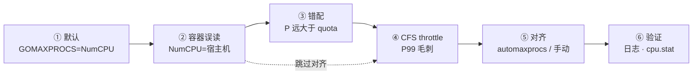
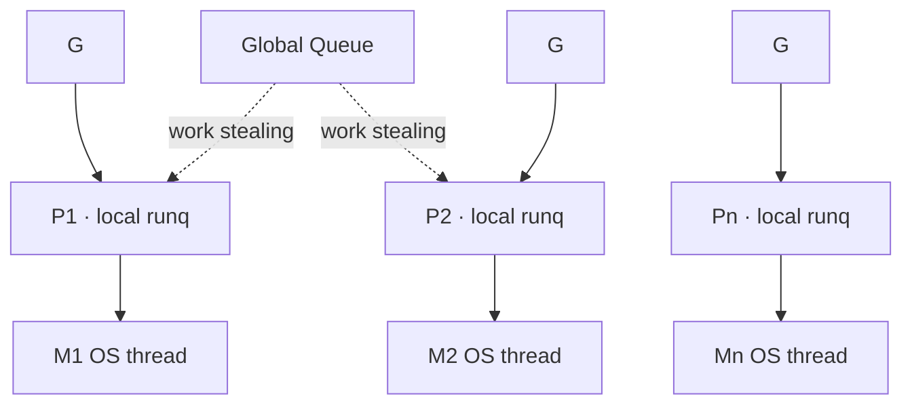
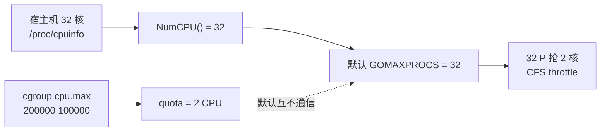
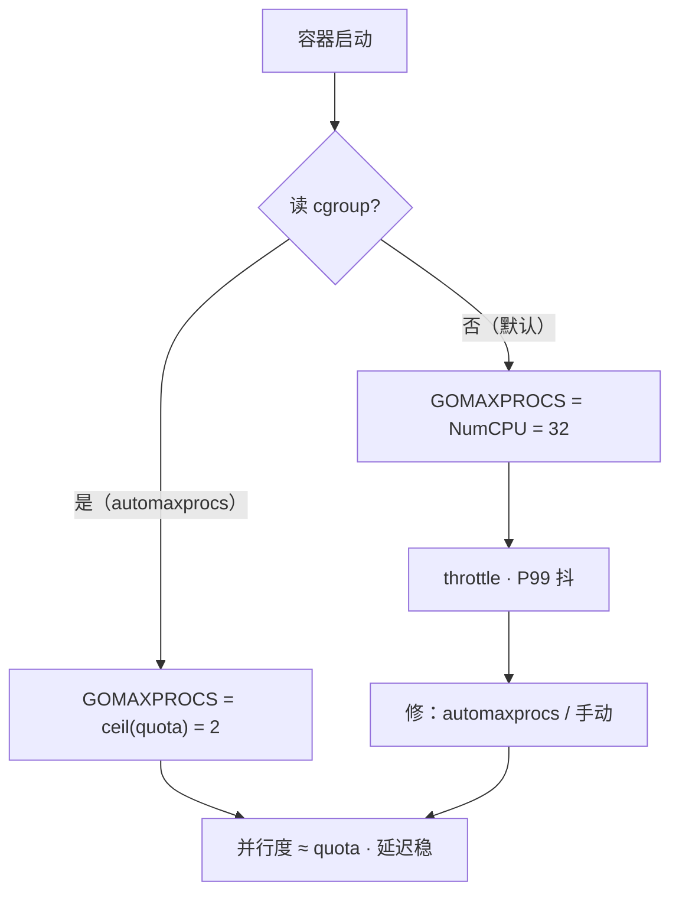
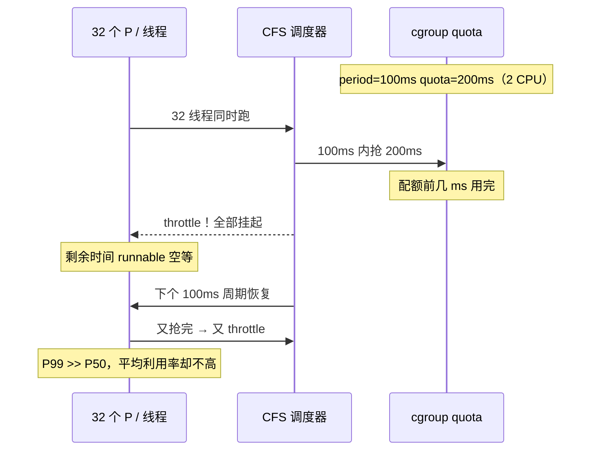
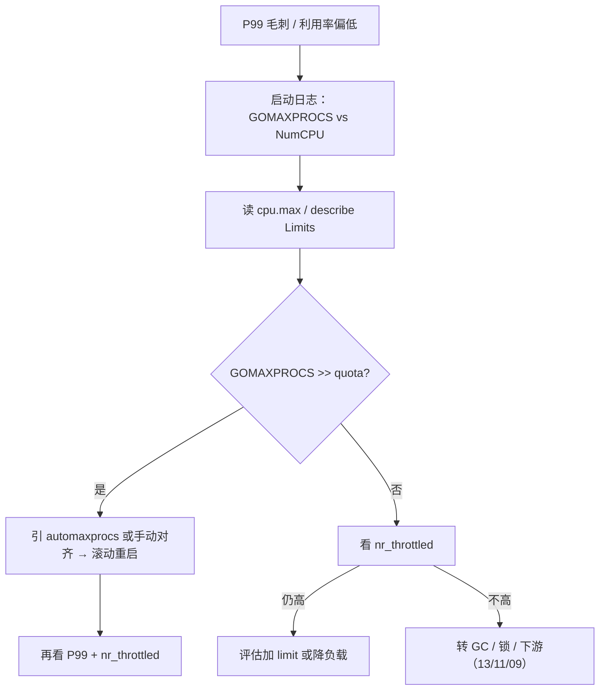

# 12｜GOMAXPROCS 与容器 cgroup · SRE 开发能力

> 容器 limit 2 CPU，`runtime.NumCPU()` 仍报 32，默认 `GOMAXPROCS` 也是 32——32 个 P 抢 2 核，CFS 反复 throttle，P99 毛刺、利用率却不到 2；有人手动 `GOMAXPROCS=2` 却忘了 `GOMEMLIMIT`，改 K8s limit 不重启 Pod，automaxprocs 也没引。
> **本章回答**：`GOMAXPROCS` 从默认值、P-M-G、容器 cgroup 误读、CFS throttling 到 automaxprocs / 手动对齐——该设多少、谁误导、怎么验。
> **不讲**：GMP 调度细节 → [05](../05-goroutine与调度模型/)；GC 与逃逸 → [11](../11-GC内存与逃逸分析/)；errgroup 与并发限流 → [09](../09-errgroup与并发限流/)；pprof 排障 → [13](../13-pprof与性能排查/)。

**标记**：🎯重点 · 🔥难点 · ⭐常考 · 🔧实操

---

## 面试怎么考

| 标记 | 考点 |
|------|------|
| **核心** | GOMAXPROCS = 同时跑在 OS 线程上的 **P 数量上限**，不是 goroutine 个数 |
| **必会** | 容器内 `runtime.NumCPU()` 看宿主机；automaxprocs 读 cgroup CPU quota |
| **常用** | K8s CPU limit/request；CFS throttling 与 P99 毛刺 |
| **常考** | GOMAXPROCS 不限 goroutine；与 errgroup `SetLimit` 不是一回事 |

> 📝 **面试（30 秒）**：`GOMAXPROCS` 是可并行执行 Go 代码的 P 个数上限，默认等于 `runtime.NumCPU()`。容器里 NumCPU 常是宿主机核数，不是 cgroup quota——limit 2 却 GOMAXPROCS=32 → 32 个 P 抢 2 核 → CFS throttling、延迟毛刺。修法：`import _ "go.uber.org/automaxprocs"` 或手动对齐 limit。它不限制 goroutine，也不替代 `SetLimit`。并行度看 **limit**，不是 request。

---

## 能力边界

| 机制 | 管什么 | 不管什么 |
|------|--------|----------|
| `GOMAXPROCS` | CPU 并行度（P 个数） | goroutine 总数、I/O 并发 |
| cgroup CPU quota | 容器可用 CPU 时间片 | Go 调度器内部队列 |
| `runtime.NumCPU()` | 可见逻辑 CPU（常是宿主机） | cgroup limit |
| automaxprocs | 启动时按 quota 设 GOMAXPROCS | 运行中 quota 变更（需重启） |
| errgroup `SetLimit` | 应用层任务并发 | OS 线程数 |
| `GOMEMLIMIT` | GC 堆上限 | CPU 并行度 |

- 🔑 **三层各管各**
  - **GOMAXPROCS**：多少个 P 同时跑 Go 代码
  - **SetLimit**：多少个任务同时干活（[09](../09-errgroup与并发限流/)）
  - **GOMEMLIMIT**：堆长到多少触发更激进 GC（[11](../11-GC内存与逃逸分析/)）
  - 三者**不能互相替代**

> ⚠️ **别混**：`limits.cpu` 是时间片上限；`requests.cpu` 是调度份额——GOMAXPROCS 对齐 **limit**。

---

## 语言最小集

> 🎯 **一句话**：`runtime.GOMAXPROCS(n)` 设 P 上限；传 `0` 只查询不改；环境变量在启动前生效。

```go
import "runtime"

runtime.GOMAXPROCS(4)   // 设 = 4
runtime.GOMAXPROCS(0)   // 传 0 = 查询当前值，不修改
runtime.NumCPU()        // 可见逻辑 CPU；容器里常是宿主机核数
runtime.NumGoroutine()  // goroutine 总数，与 GOMAXPROCS 无关
```

```bash
GOMAXPROCS=2 ./myapp    # 启动前设，等价 runtime.GOMAXPROCS(2)
echo $GOMAXPROCS        # 查 env；运行中改 env 不生效
```

#### ❓ 为什么 `GOMAXPROCS(0)` 不是「设为 0」？

- 📜 API 约定：参数 `n > 0` 才设置；`n == 0` 表示**只读当前值**
- ❌ 想「单线程跑」应写 `GOMAXPROCS(1)`，不是 `0`
- 🔍 启动日志常用 `runtime.GOMAXPROCS(0)` 打当前 P 数

> 📝 **面试**：Go 1.5 起默认 `GOMAXPROCS = NumCPU()`；容器普及后默认值变坑。新版 runtime 可能感知 cgroup（以发行说明为准），镜像仍建议显式 `automaxprocs`，别假设。⭐

本节对应练习题 Q1、Q2。语法会了——先看主线。

---

## 一、一张图：GOMAXPROCS 的一生 ⭐🔥

> 🎯 **一句话**：默认跟 NumCPU → 容器里常误读成宿主机核数 → 超 quota 被 CFS 掐 → 对齐后 P99 才稳。



- 📖 **读图**
  - 🛤️ 主线「默认 → 误读 → 错配 → throttle → 对齐 → 验证」；开篇现场卡在 ②③④
  - 🔧 修法落在 ⑤；改 limit 后要重启才重新走 ⑤（automaxprocs 只在 `init()` 读一次）
  - 🩺 现场第一刀：启动日志 `GOMAXPROCS` vs `cpu.max` / `kubectl describe` Limits

本节对应练习题 Q1～Q3。主线有了——默认值怎么来。

---

## 二、出生：默认值与 P-M-G ⭐🔥

> 🎯 **一句话**：GOMAXPROCS = P 的个数；P 是调度「工位」，G 排队等 P，M 是真正跑在 CPU 上的 OS 线程。



- 📖 **读图**
  - P 夹在 G 与 M 之间：G 进本地 runq，P 绑一个 M 执行；**P 个数 = GOMAXPROCS**
  - P 空了会从全局队列或其他 P **偷** G；M 阻塞 syscall 时可 detach P，所以 **M 可多于 GOMAXPROCS**，但同时跑 Go 代码的 P 仍受它限

| 概念 | 全称 | 是什么 |
|------|------|--------|
| G | goroutine | `go func()` 用户态协程 |
| M | machine | OS 线程 |
| P | processor | 调度上下文 + 本地 runq，**个数 = GOMAXPROCS** |

> 💡 **打个比方**：P 是收银台窗口，M 是收银员，G 是排队顾客。GOMAXPROCS=2 = 开 2 个窗口——顾客可排几百个，同时刻只有 2 个窗口在结账。

#### ❓ 为什么 M 可以多于 GOMAXPROCS？

- 🧱 阻塞 syscall 时 M 卡住，P  detach 给别的 M 接着跑 Go 代码
- ✅ CPU 密集并行度仍 ≈ GOMAXPROCS——只有那么多 P 在跑用户代码
- 📝 `GOMAXPROCS=1` 仍可有百万 G，阻塞 I/O 时 M 让出 P，仍能并发做 I/O（细节 [05](../05-goroutine与调度模型/)）

> ⚠️ **别混**：GOMAXPROCS **不**限 goroutine 个数；限任务并发用 `SetLimit` / semaphore（[09](../09-errgroup与并发限流/)）。

本节对应练习题 Q5。模型懂了——容器怎么设。

---

## 三、干活：容器里怎么设 GOMAXPROCS 🔧⭐

> 🎯 **一句话**：三步——读 cgroup quota、设 GOMAXPROCS 对齐、启动日志验证。

### 🤖 automaxprocs：一行 import

```go
import (
    _ "go.uber.org/automaxprocs" // init() 读 cgroup，设 GOMAXPROCS
    "runtime"
)
```

```bash
go get go.uber.org/automaxprocs
```

- 行为：`init()` 读 CPU quota/period → `runtime.GOMAXPROCS(ceil(quota/period))`
- Pod 启动生效一次；**运行中改 limit 要重启进程**才重新读

### ✋ 手动设置

```bash
export GOMAXPROCS=2    # 已知 limit 2 核
./myapp
```

```go
func main() {
    runtime.GOMAXPROCS(2) // 须在大量创建 goroutine 之前
}
```

### ☸️ K8s：limit 与 Downward API

```yaml
resources:
  limits:
    cpu: "2"          # cgroup quota = 200000/100000 → 2 CPU
  requests:
    cpu: "500m"       # 调度份额，≠ GOMAXPROCS
env:
  - name: GOMAXPROCS
    value: "2"         # 与 limits.cpu 对齐（易忘同步，不如 automaxprocs）
```

> ⚠️ **别混**：`limits.cpu: 2` **不会**自动让 `NumCPU()` 返回 2——除非 runtime / automaxprocs 主动读 cgroup。

### 🐳 非 K8s：Docker / systemd

```bash
docker run --cpus=2 mygoapp          # 写 cgroup → 同样需 automaxprocs
# systemd CPUQuota=200% → 同上
```

- 规则统一：**只要 cgroup 限了 CPU，Go 服务就应引 automaxprocs**（K8s / Docker / systemd 都一样）

### 📂 读 cgroup quota

> 🔍 **现场**：先确认 cgroup 版本，再算可用核数。

```bash
# cgroup v2
cat /sys/fs/cgroup/cpu.max
# 200000 100000          # ← quota=200000, period=100000 → 2 CPU

# cgroup v1
cat /sys/fs/cgroup/cpu/cpu.cfs_quota_us    # ← 200000
cat /sys/fs/cgroup/cpu/cpu.cfs_period_us   # ← 100000
# quota/period = 2.0 → 2 CPU

grep -c ^processor /proc/cpuinfo           # ← 32（常是宿主机，≠ quota）
```

- 算法：`GOMAXPROCS = ceil(quota/period)`（面试记这条即可）

### ✅ 验证是否对齐

```go
func logRuntime() {
    log.Printf("runtime: GOMAXPROCS=%d NumCPU=%d NumGoroutine=%d",
        runtime.GOMAXPROCS(0),
        runtime.NumCPU(),
        runtime.NumGoroutine())
}
```

```text
# 已对齐
runtime: GOMAXPROCS=2 NumCPU=32 NumGoroutine=10
# ← GOMAXPROCS=2 对齐 limit；NumCPU=32 仍是宿主机（正常）

# 未对齐
runtime: GOMAXPROCS=32 NumCPU=32 NumGoroutine=10
# ← automaxprocs 没引或没生效
```

> 🔍 **现场**：`main` 最早、automaxprocs import **之后**打一行——第一屏就能发现 limit=2 却 GOMAXPROCS=32。

本节对应练习题 Q3、Q4。设置会了——误读主战场。

---

## 四、误读：NumCPU 与 cgroup quota ⭐🔥

> 🎯 **一句话**：`NumCPU()` 读可见逻辑 CPU（常是宿主机）；cgroup quota 是时间片上限——默认 `GOMAXPROCS=NumCPU()` 就是「误读」。

大家想想：limit 2 核，利用率不到 2、P99 却炸——很多人喊「再加 limit」。**先错了**：先查是不是 32 个 P 在抢 2 核被 CFS 掐。



- 📖 **读图**
  - 误导在「NumCPU → 默认 GOMAXPROCS」链；cgroup 与 NumCPU **默认无联系**
  - 只有 runtime / automaxprocs **主动读** cgroup 文件，两条链才汇合

- 🔍 **NumCPU 怎么来的**：`sched_getaffinity` 或 `/proc/cpuinfo`——容器不隔离 CPU 视图（除非 cpuset）→ 看到宿主机全部核
- 🔍 **quota 怎么来的**：`limits.cpu: 2` → kubelet 写 cgroup → `cpu.max`（v2）或 `cfs_quota_us`（v1）→ CFS 按 quota/period 发时间片

🔥 **大白话**：quota 是账本上的**时间配额**，不是把 `/proc/cpuinfo` 改成 2 行。`requests.cpu: 500m` 是调度权重，**不影响** GOMAXPROCS。

#### ❓ 为什么 NumCPU 看不到 cgroup limit？

- 📦 容器默认**不**改进程可见的 CPU 集合——只限「用多久」，不限「看见几核」
- ✅ 例外：cpuset 绑核时 `affinity` 可能变少，NumCPU 跟着变——但 **quota 仍可能更小**
- 🎯 规则：以实际可用算力最小值为准——`min(cpuset 数, quota/period)`；automaxprocs 会综合考虑

#### ❓ 为什么对齐 limit 而不是 request？

- `request` = 调度份额（能不能排上 node）
- `limit` = CFS throttle **硬顶**
- GOMAXPROCS 管的是「别开过多 P 去撞硬顶」→ 对齐 **limit**
- request=500m、limit=2 → 仍设 ≈2，不是 1

### 🌍 物理机 / VM / 容器

| 环境 | NumCPU | 建议 |
|------|--------|------|
| 物理机 | 真实核数 | 默认常 OK |
| 虚拟机 | 分配的 vCPU | 通常 OK |
| K8s / Docker / systemd 限 CPU | 常是 host 核数 | **必须 automaxprocs** |

#### ❓ 为什么物理机也建议引 automaxprocs？

- 非容器时 fallback 到 NumCPU——**无害**
- 同一镜像进容器/出容器行为一致，少一套「有无 cgroup」分支

### 收束：凭什么会被误导



- 📖 **读图**：分水岭是「读不读 cgroup」；修正后常是**少被掐、P99 更好**，不是「变慢」

可背清单：

- GOMAXPROCS ≈ P 数，不是 G 数
- NumCPU ≠ cgroup limit（容器重灾区）
- automaxprocs 在 `init()` 读一次
- `GOMAXPROCS >> quota` → CFS throttle → P99 毛刺
- 改 K8s limit 要**重启**才重新读

⭐ 面试必考：NumCPU≠quota。练习题 Q6、Q7、Q8。错位懂了——看 CFS。

---

## 五、生病：CFS throttling 为什么伤 P99 ⭐🔥

> 🎯 **一句话**：P 远大于 quota → 多线程抢光周期内时间片 → CFS **掐停** → G 空等下个周期 → 尾延迟毛刺。



- 📖 **读图**
  - period=100ms、quota=200ms = 每周期最多 2 核×100ms 的 CPU 时间
  - 32 线程一起跑，配额秒空 → 周期剩余时间整组挂起；G 以为在并行，实际大量在排队

> 💡 **打个比方**：两条收费车道（2 CPU），开了三十二个入口（GOMAXPROCS=32）。前几秒全挤过去，车道满了，剩下的被拦到下一拨——平均吞吐没高多少，排最后的人体感（P99）暴涨。

#### ❓ 为什么 CPU 利用率不高但 P99 高？

- throttled 期间线程**被挂起、不耗 CPU** → `kubectl top` 看着不到 limit
- 延迟已经产生：runnable G 空等下个周期 = P99 尖峰来源
- 🔥 口诀：**「CPU 没打满 ≠ 没 throttle」**——恰恰相反，throttle 时利用率常偏低

### 🔭 观测 throttling

> 🔍 **现场**：

```bash
# cgroup v2
cat /sys/fs/cgroup/cpu.stat
# nr_periods 114832
# nr_throttled 87210        # ← 被掐周期数，持续涨 = 严重
# throttled_time 9823410    # ← 累计被掐纳秒，对上 P99

# cgroup v1
cat /sys/fs/cgroup/cpu/cpu.stat
# 同样看 nr_throttled / throttled_time
```

### 🧬 与 GC 写屏障叠加 🔥

- GOMAXPROCS 过高 → GC mark 线程也抢不到 CPU → 写屏障开启时间拉长 → 停顿感知更差
- CPU 少 + P 多 → 对齐 GOMAXPROCS **同时**设 `GOMEMLIMIT`（见生产模板 / [11](../11-GC内存与逃逸分析/)）

### 🧩 Pod 内 sidecar

- 每容器独立 cgroup：app GOMAXPROCS 对齐**本容器** limit，不是 Pod 加总
- sidecar 0.1 核、app 2 核 → app ≈2，sidecar 单独设

### 🧪 压测对比

```text
① baseline：GOMAXPROCS=NumCPU=32（错配）
② fixed：GOMAXPROCS=limit=2
③ auto：import automaxprocs
```

- 看：**P50/P99**、吞吐、`nr_throttled`、GC CPU%
- 常出现 ②③ P99 优于 ①、吞吐相近或更好——throttle / 上下文切换少了

> 📝 **面试**：throttle ≠「CPU 打满」——是 quota 周期内提前用完、线程被掐。修法：降 GOMAXPROCS ≈ quota，不是盲目加 limit。⭐

口诀：**「P 多核少 → throttle → P99 毛刺」**。练习题 Q9、Q10。

**回到开头**：limit 2、NumCPU 32、P99 毛刺——正确剧本是 automaxprocs / 显式对齐 → 改 limit 重启 → `cpu.stat` 验证。再听「再加核」，你知道该先查什么了。

---

## 六、生产模板：容器 Go 服务基线 🔧

> 🎯 **一句话**：三条基线——automaxprocs 管并行度，GOMEMLIMIT 管堆上限，启动日志管验证。

```go
package main

import (
    _ "go.uber.org/automaxprocs"
    "log"
    "runtime"
    "runtime/debug"
)

func main() {
    logRuntime()
    // ... 业务
}

func logRuntime() {
    memlimit := debug.SetMemoryLimit(0) // 查询，不修改
    log.Printf(
        "runtime: GOMAXPROCS=%d NumCPU=%d NumGoroutine=%d GOMEMLIMIT=%d",
        runtime.GOMAXPROCS(0),
        runtime.NumCPU(),
        runtime.NumGoroutine(),
        memlimit,
    )
}
```

```yaml
spec:
  containers:
    - name: app
      image: myapp:latest
      resources:
        limits:
          cpu: "2"
          memory: "512Mi"
        requests:
          cpu: "1"
          memory: "256Mi"
      env:
        - name: GOMEMLIMIT
          value: "460MiB"   # 略低于 memory limit，见 [11]
```

```text
# 已对齐
runtime: GOMAXPROCS=2 NumCPU=32 NumGoroutine=5 GOMEMLIMIT=482344960

# 未对齐
runtime: GOMAXPROCS=32 NumCPU=32 NumGoroutine=5 GOMEMLIMIT=0
# ← automaxprocs 没引 + GOMEMLIMIT 没设
```

> 🎯 **检查**：`GOMAXPROCS` ≈ `limits.cpu`；`NumCPU` 更大没关系；`GOMEMLIMIT` 略低于 `limits.memory`。

```go
http.HandleFunc("/readyz", func(w http.ResponseWriter, r *http.Request) {
    json.NewEncoder(w).Encode(map[string]interface{}{
        "gomaxprocs": runtime.GOMAXPROCS(0),
        "numcpu":     runtime.NumCPU(),
    })
})
```

本节对应练习题 Q11、Q12。模板拿走——作战。

---

## 七、作战：现象 · 先做 · 别做 🔧

> 🎯 **一句话**：P99 抖先对 GOMAXPROCS 与 quota，再谈加核。



- 📖 **读图**：开篇三类误操作——「再加核」「只改 env 不重启」「用 GOMAXPROCS 当限流」——分别掉进 MIS 未修、FIX 半截、OTHER 选错刀

| 现象 | 先做 | 别做 |
|------|------|------|
| NumCPU=32、limit=2 | 引 automaxprocs / 设 GOMAXPROCS=2 | 先盲目加 CPU |
| P99 抖、CPU 不到 limit | 查 `nr_throttled` + GOMAXPROCS | 只看 `kubectl top` |
| 改 limit 不生效 | 滚动重启 Pod | 等「热更新」GOMAXPROCS |
| 想限 goroutine | `SetLimit` / semaphore | `GOMAXPROCS=1` 当限流 |
| GC pause 变长 | 对齐 GOMAXPROCS + `GOMEMLIMIT` | 只调 GOGC |
| 小数核（0.5） | 查 automaxprocs 取整；压测试 1 | 假设一定 = 1 |
| BestEffort 无 limit | 按 node 可用设上限 | 默认吃满 node |
| sidecar | 各对齐本容器 limit | 用 Pod 加总 |

#### ❓ 为什么改 K8s limit 后 GOMAXPROCS 不变？

- automaxprocs / 默认逻辑都在**进程启动**时定稿（`init()` / 启动读 env）
- kubelet 改 cgroup **不**通知已运行的 Go runtime
- ✅ 改 `limits.cpu` → 滚动重启；若用 Downward API 写死 env，YAML 也要同步改

#### ❓ 为什么 GOMAXPROCS 不能替代 SetLimit？

- GOMAXPROCS：CPU 上同时跑 Go 代码的 **P** 数
- SetLimit：应用层同时跑的 **任务** 数（连 DB、打 HTTP）
- 降 P 挡不住「百万 `Go` 打穿连接池」——两层都要（[09](../09-errgroup与并发限流/)）

### ⏱️ 60 秒剧本

| 时间 | 动作 |
|------|------|
| 0–10s | 启动日志 / `/readyz`：`GOMAXPROCS`、`NumCPU` |
| 10–30s | `cat cpu.max`（或 v1 quota/period）；`kubectl describe` Limits |
| 30–45s | `cpu.stat` 看 `nr_throttled` / `throttled_time` |
| 45–60s | 确认修法：补 automaxprocs 或 env → 排滚动重启；告知「先别加核」 |

本节对应练习题 Q13。作战钉死——收口。

---

## 八、收口：速查与锚点

### 命令速查 🔧

```bash
cat /sys/fs/cgroup/cpu.max                              # v2: "200000 100000" = 2 CPU
cat /sys/fs/cgroup/cpu/cpu.cfs_quota_us                 # v1
cat /sys/fs/cgroup/cpu/cpu.cfs_period_us
cat /sys/fs/cgroup/cpu.stat | grep -i throttled         # nr_throttled / throttled_time
grep -c ^processor /proc/cpuinfo                        # 可见 CPU，常 ≠ quota
kubectl describe pod {pod} | grep -A3 Limits
kubectl top pod {pod}
```

### 面试锚点

| 问 | 30 秒答 |
|----|---------|
| GOMAXPROCS 是什么 | 可并行执行 Go 代码的 P 上限，不限 goroutine |
| 容器默认坑 | NumCPU 常是宿主机核；默认 GOMAXPROCS=NumCPU 被误导 |
| 怎么修 | `import _ "go.uber.org/automaxprocs"` 或手动对齐 limit |
| 能限 goroutine 吗 | 不能；用 SetLimit / semaphore |
| throttle 现象 | P99 抖、`nr_throttled` 涨、CPU 利用率反而不高 |
| request vs limit | request 调度份额；limit 是 throttle 顶，对齐 limit |
| 改 limit 生效吗 | 不；`init()` 读一次，要重启 |
| 与 GOMEMLIMIT | 两条基线各管各；P 过高还会放大 GC pause |
| cgroup v1/v2 | v1：`cfs_quota_us/period_us`；v2：`cpu.max` |
| automaxprocs | `init()` 读 cgroup → `ceil(quota/period)` → `GOMAXPROCS` |
| P 与 GOMAXPROCS | P 个数 = GOMAXPROCS；M 可多于 P |
| 物理机要引吗 | 无害，非容器 fallback NumCPU；建议统一引 |
| cpuset vs quota | 绑哪些核 vs 给多少时间；取 min |
| `LockOSThread` | 绑线程，不增加 quota，仍受 cgroup 限 |

### 易错一句话对照

- GOMAXPROCS 越大越好 → 超 quota 被 throttle
- NumCPU 等于 limit → 常是宿主机核数
- GOMAXPROCS 替代 SetLimit → 一层管 CPU，一层管任务
- 改 K8s limit 自动生效 → 要重启进程
- request=500m 就 GOMAXPROCS=1 → 并行看 limit
- CPU 没满就没 throttle → throttle 时 CPU 反而不高
- GOMAXPROCS=1 不能并发 → 阻塞 I/O 时仍可并发
- automaxprocs 运行中动态生效 → 只在 `init()` 读一次
- cgroup v1/v2 读法一样 → 路径和格式不同
- GOMAXPROCS 只影响 CPU 密集 → 也影响 GC mark / 写屏障时长

### 数字墙

> GOMAXPROCS ≈ **P 个数** · 默认 = `NumCPU()` · 容器 NumCPU 常 **= 宿主机** · cgroup v2 `cpu.max` = `quota period` · CFS period **100ms** · `nr_throttled` 高 = throttle 重 · automaxprocs 在 **init()** 读一次 · 改 limit 要**重启** · GOMEMLIMIT 略低于 memory limit · 对齐 **limit** 不是 request · `GOMAXPROCS(0)` = 查询不改

> 💡 **记忆**：**「容器里 NumCPU 骗了你，automaxprocs 替你读真值，改 limit 要重启」**。

本节对应练习题 Q1～Q14。

---

## 合上书

- [ ] **默画** 误导一生：启动 → NumCPU=32 → 默认 GOMAXPROCS=32 → 32 P 抢 2 核 → CFS throttle → P99 抖 → automaxprocs / 手动对齐 → 验证
- [ ] **口述** P-M-G：P 个数=GOMAXPROCS，G 等 P，M 可多于 P；`GOMAXPROCS=1` 仍可并发 I/O
- [ ] **口述** NumCPU vs quota：可见核数 vs 时间片上限，容器里常不等于
- [ ] **口述** automaxprocs：`import _ "go.uber.org/automaxprocs"`，`init()` 读一次，改 limit 要重启
- [ ] **口述** CFS 伤 P99：配额周期内提前用完 → 线程被掐 → G 空等 → P99 尖，利用率反而不高
- [ ] **口述** GOMAXPROCS vs SetLimit：CPU 并行 vs 任务并发，两层都要
- [ ] **口述** request vs limit：调度份额 vs throttle 顶，对齐 limit
- [ ] **口述** 怎么验：启动日志 `GOMAXPROCS`/`NumCPU`，对照 `cpu.max` / `describe`
- [ ] **口述** cgroup v1/v2 读法：`cpu.max` vs `cfs_quota_us`/`cfs_period_us`
- [ ] **口述** 与 GOMEMLIMIT：P 过高 → mark 被掐 → pause 变长
- [ ] **口述** 改 limit 为何不变：只在启动读，要滚动重启
