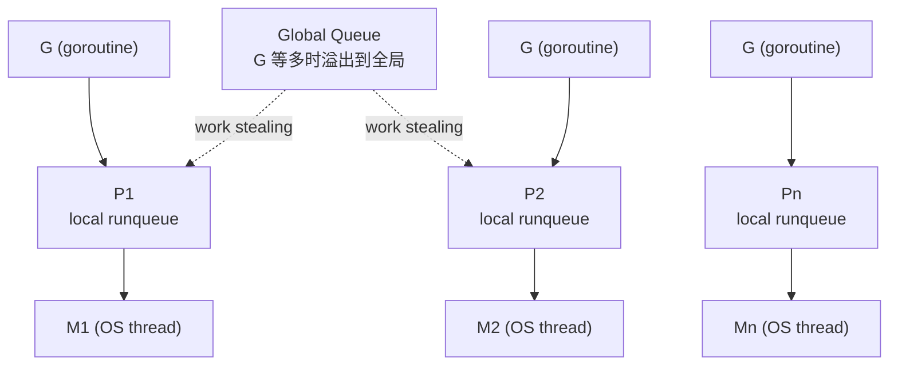
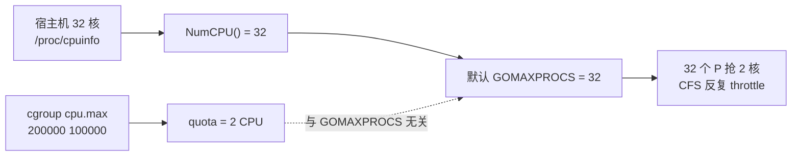
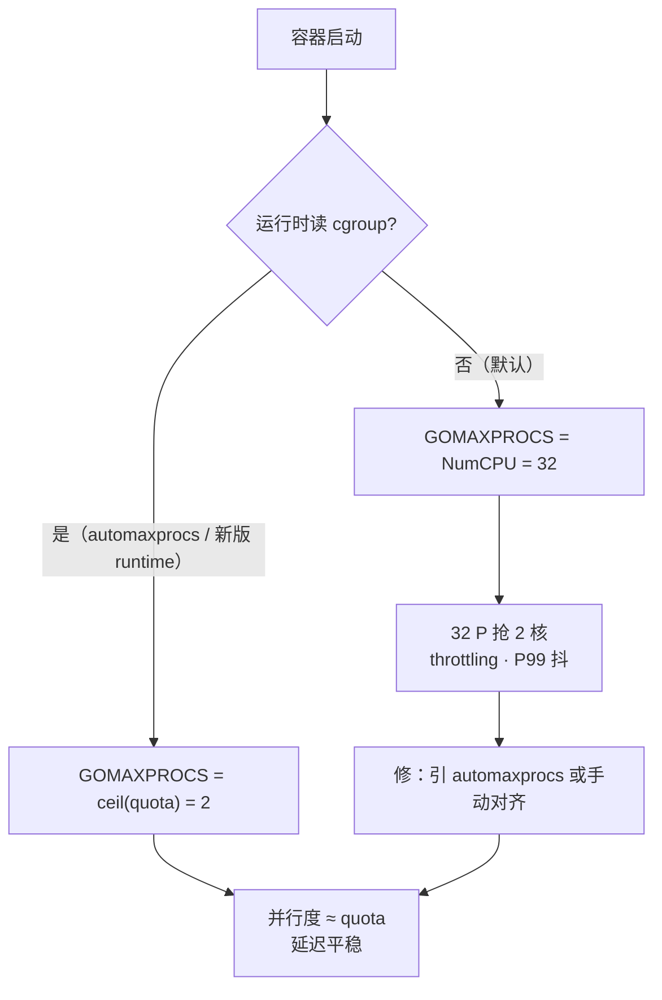
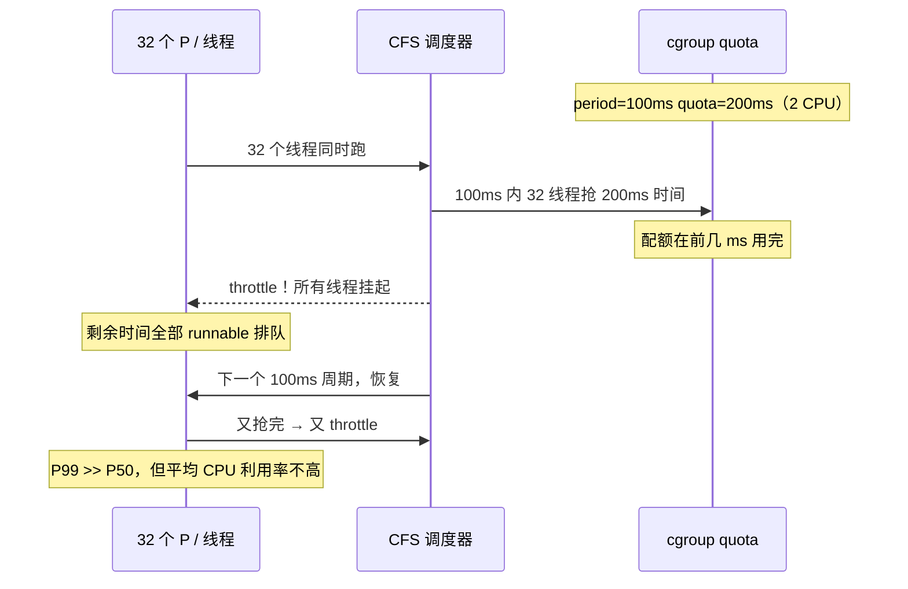

# 12 GOMAXPROCS与容器cgroup

> 容器 limit 2 CPU，`runtime.NumCPU()` 仍报 32，`GOMAXPROCS` 默认也是 32——32 个 P 抢 2 核时间片，CFS 反复 throttle，P99 毛刺、CPU 利用率却不到 2；有人手动 `GOMAXPROCS=2` 但忘了配 `GOMEMLIMIT`，K8s limit 改了不重启 Pod，automaxprocs 也没引，线上「核数」和 cgroup 永远对不上。
> **本章回答**：`GOMAXPROCS` 从默认值、P-M-G 关系、容器 cgroup 误读、CFS throttling 到 automaxprocs 与手动设置的一生——该设多少、谁误导、怎么验。
> **不讲**：GMP 调度细节 → [05](../05-goroutine与调度模型/)；GC 与逃逸 → [11](../11-GC内存与逃逸分析/)；errgroup 与并发限流 → [09](../09-errgroup与并发限流/)；pprof 排障 → [13](../13-pprof与性能排查/)。

**标记**：🎯重点 · 🔥难点 · ⭐常考 · 🔧实操

---

## 一、面试怎么考：核心口径与 30 秒说法

| 标记 | 考点 |
|------|------|
| **核心** | GOMAXPROCS = 同时跑在 OS 线程上的 **P 数量上限**，不是 goroutine 个数 |
| **必会** | 容器内 `runtime.NumCPU()` 看宿主机；automaxprocs 读 cgroup CPU quota |
| **常用** | K8s CPU limit/request；CFS throttling 与 P99 毛刺 |
| **常考** | GOMAXPROCS 不限 goroutine；与 errgroup SetLimit 不是一回事 |

**30 秒怎么说**：`GOMAXPROCS` 设可并行执行 Go 代码的 P 个数上限，默认等于 `runtime.NumCPU()`——容器里 NumCPU() 常是宿主机核数，不是 cgroup quota。limit 2 核却 GOMAXPROCS=32 → 32 个 P 抢 2 核 → CFS throttling、延迟毛刺。修法：`import _ "go.uber.org/automaxprocs"` 或手动 `GOMAXPROCS=2`。它不限制 goroutine 个数，也不替代 SetLimit 限连接。CPU request 影响调度份额，limit 影响 throttle 上限——两者都要看。

---

## 二、能力边界：各机制分工

| 机制 | 管什么 | 不管什么 |
|------|--------|----------|
| `GOMAXPROCS` | CPU 并行度（P 个数） | goroutine 总数、I/O 并发 |
| cgroup CPU quota | 容器可用 CPU 时间片 | Go 调度器内部队列 |
| `runtime.NumCPU()` | 可见逻辑 CPU 数（常是宿主机） | cgroup limit |
| automaxprocs | 启动时按 quota 设 GOMAXPROCS | 运行中 quota 变更（需重启） |
| errgroup SetLimit | 应用层任务并发 | OS 线程数 |
| GOMEMLIMIT | GC 堆上限 | CPU 并行度 |

GOMAXPROCS 管「多少个 P 同时跑 Go 代码」，SetLimit 管「多少个任务同时干活」，GOMEMLIMIT 管「堆长到多少时触发 GC」——三层各管各，不能互相替代。

---

## 三、语言最小集：GOMAXPROCS 的最小语法 ⭐

> 🎯 **一句话**：`runtime.GOMAXPROCS(n)` 设 P 上限，`runtime.GOMAXPROCS(0)` 查询当前值不修改，`GOMAXPROCS` 环境变量在启动前生效。

最小 API 就四个，记住就能答面试：

```go
import "runtime"

runtime.GOMAXPROCS(4)   // 设 GOMAXPROCS=4
runtime.GOMAXPROCS(0)   // 传 0 = 查询当前值，不修改
runtime.NumCPU()        // 返回可见逻辑 CPU 数，容器里常是宿主机核数
runtime.NumGoroutine()  // 当前 goroutine 总数，与 GOMAXPROCS 无关
```

环境变量：

```bash
GOMAXPROCS=2 ./myapp    # 启动前设，等价于 runtime.GOMAXPROCS(2)
echo $GOMAXPROCS        # 查环境变量（但运行中改 env 不生效）
```

> ⚠️ **别混**：`GOMAXPROCS(0)` 不是「设为 0」，而是「查询当前值、不改」。`NumCPU()` 永远返回同一进程内的固定值，运行中不会变——它不读 cgroup。

> 📝 **面试**：Go 1.5 起默认 `GOMAXPROCS = runtime.NumCPU()`；容器普及后这个默认值成为坑。Go 新版本运行时可能自动感知 cgroup（以发行说明为准），但容器镜像仍建议显式 import automaxprocs，不要假设。

---

## 四、语法必会：容器里怎么设 GOMAXPROCS 🔧

> 🎯 **一句话**：容器场景三步——读 cgroup quota、设 GOMAXPROCS 对齐 quota、启动日志验证。

### automaxprocs：一行 import 解决

```go
import (
    _ "go.uber.org/automaxprocs"   // init() 里自动读 cgroup，设 GOMAXPROCS
    "runtime"
)
```

```bash
go get go.uber.org/automaxprocs
```

行为：`init()` 时读 cgroup CPU quota/period → 算可用 CPU 数 → `runtime.GOMAXPROCS(ceil(quota/period))`。Pod 启动时生效一次；运行中改 limit 要重启进程才重新读。

### 手动设置

```bash
export GOMAXPROCS=2    # 已知 limit 2 核
./myapp
```

或在 `main` 最早处：

```go
func main() {
    runtime.GOMAXPROCS(2)   // 必须在 goroutine 大量创建之前
    // ...
}
```

### K8s YAML：Downward API 注入

```yaml
resources:
  limits:
    cpu: "2"          # cgroup CPU quota = 200000
  requests:
    cpu: "500m"       # 调度份额，不等于 GOMAXPROCS
env:
  - name: GOMAXPROCS
    value: "2"         # 与 limits.cpu 对齐
```

> ⚠️ **别混**：`limits.cpu: 2` 不会自动让 `NumCPU()` 返回 2——除非运行时或 automaxprocs 主动读 cgroup。Downward API 注入 `GOMAXPROCS=2` 是手动对齐，不如 automaxprocs 自动且易错配（改 limit 时忘了同步改 env）。

### 非 K8s 容器：Docker 与 systemd

只要是 cgroup 限了 CPU，Go 默认 NumCPU 就可能误导——不限于 K8s：

```bash
docker run --cpus=2 mygoapp          # 同样写 cgroup cpu.max → 需 automaxprocs
# systemd
# CPUQuota=200% → 同样写 cgroup → 需 automaxprocs
```

规则统一：**只要 cgroup 限 CPU，Go 服务就应引 automaxprocs**，不管是 K8s、Docker 还是 systemd。

### cgroup 版本与读法

> 🔍 **现场**：容器里先确认 cgroup 版本，再读 quota。

```bash
# cgroup v2（新集群）
cat /sys/fs/cgroup/cpu.max
# 200000 100000          # ← quota=200000, period=100000 → 2 CPU

# cgroup v1
cat /sys/fs/cgroup/cpu/cpu.cfs_quota_us    # ← 200000
cat /sys/fs/cgroup/cpu/cpu.cfs_period_us   # ← 100000
# quota/period = 2.0 → 2 CPU

# 看可见 CPU（常是宿主机核数，不等于 quota）
grep -c ^processor /proc/cpuinfo           # ← 32
```

automaxprocs 读当前挂载的 cgroup 文件——面试知道 `quota/period` 算法即可：`GOMAXPROCS = ceil(quota/period)`。

### 验证 GOMAXPROCS 是否对齐

```go
func logRuntime() {
    log.Printf("runtime: GOMAXPROCS=%d NumCPU=%d NumGoroutine=%d",
        runtime.GOMAXPROCS(0),   // ← 实际 P 数
        runtime.NumCPU(),        // ← 常是宿主机核数
        runtime.NumGoroutine())  // ← goroutine 总数
}
```

典型输出（已对齐）：

```text
runtime: GOMAXPROCS=2 NumCPU=32 NumGoroutine=10
# ← GOMAXPROCS=2 与 limit 对齐；NumCPU=32 仍是宿主机核数（正常）
```

典型输出（未对齐，需修）：

```text
runtime: GOMAXPROCS=32 NumCPU=32 NumGoroutine=10
# ← GOMAXPROCS=32 但 limit=2 → automaxprocs 没引或没生效
```

> 🔍 **现场**：`main` 最早、automaxprocs import **之后** 打一行——排障时第一屏就能发现 limit=2 但 GOMAXPROCS=32 的错配。

---

## 五、原理讲透：P-M-G 模型与 GOMAXPROCS ⭐🔥

> 🎯 **一句话**：GOMAXPROCS = P 的个数，P 是 Go 调度的「处理器上下文」，每个 P 绑一个 M（OS 线程）跑 Go 代码——G（goroutine）排队等 P 来执行。



**读图**：P 是 G 和 M 之间的中间层——G 排在 P 的本地队列里，P 绑一个 M 执行。P 个数 = GOMAXPROCS。P 空了会从全局队列或其他 P **偷** G（work stealing）。M 阻塞 syscall 时可 detach P，让别的 M 接着跑——所以 M 可以多于 GOMAXPROCS，但**同时跑 Go 代码的 P 仍受 GOMAXPROCS 限**。

> 💡 **打个比方**：P 是收银台窗口，M 是收银员，G 是排队的顾客。GOMAXPROCS=2 就是开 2 个窗口。顾客可以排几百个（goroutine 不限），但同一时刻只有 2 个窗口在结账。窗口少了不会让顾客变少，只会让队伍更长。

| 概念 | 全称 | 是什么 |
|------|------|--------|
| G | goroutine | 用户态协程，`go func()` 创建 |
| M | machine | OS 线程，真正跑在 CPU 上 |
| P | processor | 调度上下文 + 本地 runqueue，**个数 = GOMAXPROCS** |

**M 可以多于 GOMAXPROCS**：阻塞 syscall 时 M 会阻塞，P detach 出来给别的 M 用。但 CPU 密集并行度仍 ≈ GOMAXPROCS——因为只有 GOMAXPROCS 个 P 在跑 Go 代码。

> 📝 **面试**：GOMAXPROCS=1 时仍可有百万 goroutine，只是同一时刻只有一个 P 在跑 Go 代码。阻塞 I/O 时 M 会让出 P 给别的 M，所以 GOMAXPROCS=1 的程序仍能并发做 I/O。GMP 细节见 [05](../05-goroutine与调度模型/)。

---

## 六、原理讲透：NumCPU 与 cgroup CPU quota 的错位 ⭐🔥

> 🎯 **一句话**：`runtime.NumCPU()` 读的是可见逻辑 CPU（常映射宿主机核数），`cgroup CPU quota` 是时间片上限——两者不是一回事，容器里默认 GOMAXPROCS=NumCPU() 就是「误读」。



**读图**：误导发生在「NumCPU → 默认 GOMAXPROCS」这条链上——Go 运行时以为有 32 核可用，实际 cgroup 只给了 2 核时间片。cgroup quota 和 NumCPU 之间没有任何联系，除非运行时主动去读 cgroup 文件。

**NumCPU() 怎么来的**：底层调 `sched_getaffinity` 或读 `/proc/cpuinfo`，返回进程可见的 CPU 集合。容器不隔离 CPU 视图（除非 cpuset），所以看到的是宿主机全部核数。

**cgroup CPU quota 怎么来的**：K8s `limits.cpu: 2` → kubelet 写 cgroup → `cpu.max`（v2）或 `cpu.cfs_quota_us`（v1）→ CFS 按 quota/period 分配 CPU 时间。

> ⚠️ **别混**：`limits.cpu: 2` 是 **CPU 时间片上限**（100ms 周期内最多用 200ms），不是「NumCPU 变成 2」。`requests.cpu: 500m` 是调度权重（Guaranteed/Burstable），不影响 GOMAXPROCS——GOMAXPROCS 应对齐 **limit**，不是 request。

> 🔍 **现场**：容器里一眼看清两个数：

```bash
echo "NumCPU: $(grep -c ^processor /proc/cpuinfo)"    # ← 32（宿主机）
echo "Quota: $(cat /sys/fs/cgroup/cpu.max)"            # ← 200000 100000 = 2 CPU
```

### 物理机 vs 虚拟机 vs 容器

| 环境 | NumCPU | 建议 |
|------|--------|------|
| 物理机 bare metal | 真实核数 | 默认常 OK |
| 虚拟机 VM | 分配的 vCPU | 通常 OK |
| K8s 容器 | 常是 node 核数 | **必须 automaxprocs** |
| Docker `--cpus=N` | 常是 host 核数 | **必须 automaxprocs** |
| systemd `CPUQuota=` | 常是 host 核数 | **必须 automaxprocs** |

误导只发生在「cgroup 限了 CPU 但 NumCPU 看不到限制」的路径——容器是重灾区。

### cpuset 的特殊情况

若 cgroup **cpuset** 绑了 4 核（只允许在这 4 个 CPU 上跑），`sched_getaffinity` 会返回 4——NumCPU 可能变 4。但 **CPU quota limit** 仍可能更小（比如 cpuset 给 4 核但 quota 只给 2 核时间）。规则：以**实际可用算力**的最小值为准——`min(cpuset 数, quota/period)` 思维设并行度。automaxprocs 会综合考虑 quota 和 cpuset。

### 收束：容器里 GOMAXPROCS 为什么会被误导



**读图**：分水岭是「运行时读不读 cgroup」——不读就走上面「误导」路径，读了就走下面「对齐」路径。修正后不是「变慢」，常是**少被 throttle、P99 更好**。

可背清单：

- GOMAXPROCS ≈ P 数，不是 goroutine 数
- NumCPU() 读宿主机核数，不等于 cgroup limit
- automaxprocs 在 init() 读 cgroup，设 GOMAXPROCS
- 默认 GOMAXPROCS >> quota → CFS throttle → P99 毛刺
- 修正后常 P99 更好，不是变慢
- 改 K8s limit 要重启 Pod 才重新读 cgroup

---

## 七、原理讲透：CFS throttling 为什么伤 P99 ⭐🔥

> 🎯 **一句话**：GOMAXPROCS 远大于 CPU quota → 多个 P 对应的 OS 线程争抢有限 CPU 时间片 → CFS 在周期内耗尽配额后**掐停**所有线程 → goroutine 排队等下个周期 → 尾延迟毛刺。



**读图**：CFS（Completely Fair Scheduler）按 cgroup quota 分配 CPU 时间。quota=200ms/period=100ms 意味着每 100ms 周期内可用 200ms CPU 时间（2 核）。32 个线程同时跑，200ms 时间在最初几毫秒就被瓜分完，之后整个周期内所有线程被 throttle（挂起），直到下个周期。goroutine 以为自己并行，实际大量时间在排队。

### 为什么 CPU 利用率不高但 P99 高

`kubectl top` 看到不到 limit，是因为 throttled 期间线程**不消耗 CPU**（被挂起了）。但延迟已经产生——runnable goroutine 在 throttle 期间排队，等到下个周期才恢复，这段空等就是 P99 尖峰的来源。

> 💡 **打个比方**：两条收费车道（2 CPU），开了三十二个入口（GOMAXPROCS=32）。前面几秒所有人一起挤过去，车道满了，剩下的三十个人被拦住等到下一拨放行。平均 throughput 没高多少，但排在后面的人等待时间暴涨——P99 就是「排在最后那个人」的体感。

### 观测 throttling

> 🔍 **现场**：查 cgroup CPU throttling 计数。

```bash
# cgroup v2
cat /sys/fs/cgroup/cpu.stat
# nr_periods 114832
# nr_throttled 87210        # ← 被掐的周期数，高 = 严重
# throttled_time 9823410    # ← 累计被掐的纳秒，与 P99 尖峰相关

# cgroup v1
cat /sys/fs/cgroup/cpu/cpu.stat
# 同样看 nr_throttled 和 throttled_time
```

`nr_throttled` 持续涨、`throttled_time` 大 → 确认 throttle 是 P99 毛刺根因。

### 与 GC 写屏障的叠加效应 🔥

容器里 GOMAXPROCS 过高还会放大 GC 停顿：GC mark 阶段启用**写屏障（write barrier）**，每个指针赋值都多一次开销。如果此时又被 CFS throttle，mark 线程也被挂起 → 写屏障开启时间拉长 → STW 感知更长。CPU 少 + GOMAXPROCS 高 → GC mark 线程也抢不到 CPU → GC pause 变长。这也是为什么 `GOMEMLIMIT` 要和 GOMAXPROCS 一起调（见生产模板）。

### Pod 内 sidecar 与多容器

Pod 内 app 和 sidecar 各有独立 cgroup（各自独立 CPU limit）。app 的 GOMAXPROCS 对齐**本 container 的 limit**，不是 Pod 加总。sidecar 0.1 核、app 2 核 → app GOMAXPROCS≈2，sidecar 单独设。共享 PID namespace 不影响——仍独立 cgroup CPU。

### 压测对比：怎么验修法有效

三步对比法：

```text
① baseline：GOMAXPROCS=NumCPU=32（错配）
② fixed：GOMAXPROCS=limit=2（手动对齐）
③ auto：import automaxprocs（自动对齐）
```

指标：**P50/P99 latency**、**throughput**、`cpu.stat` 的 `nr_throttled`、`GOGC CPU%`。常出现 ②③ 的 P99 优于 ① 且吞吐相近或更好——因为 throttle 减少了、上下文切换少了。

> 📝 **面试**：throttle 不是「CPU 打满了」——恰恰相反，**CPU 没打满但延迟抖**。根因是 quota 在周期内提前用完、线程被掐。修法：降 GOMAXPROCS 到 ≈ quota（整数核），不是盲目加 CPU limit。

---

## 八、生产模板：容器 Go 服务基线配置 🔧

> 🎯 **一句话**：容器 Go 服务三条基线——automaxprocs 管 CPU 并行度，GOMEMLIMIT 管 GC 堆上限，启动日志管验证。

完整可复制：

```go
package main

import (
    _ "go.uber.org/automaxprocs"  // init() 自动读 cgroup 设 GOMAXPROCS
    "log"
    "runtime"
    "runtime/debug"
)

func main() {
    logRuntime()   // 第一行：打印运行时状态
    // ... 业务逻辑
}

func logRuntime() {
    memlimit := debug.SetMemoryLimit(0)  // 查询当前 GOMEMLIMIT，不修改
    log.Printf(
        "runtime: GOMAXPROCS=%d NumCPU=%d NumGoroutine=%d GOMEMLIMIT=%d",
        runtime.GOMAXPROCS(0),    // ← 实际 P 数，应与 limit 对齐
        runtime.NumCPU(),         // ← 宿主机核数，不等于 limit（正常）
        runtime.NumGoroutine(),   // ← goroutine 总数，不受 GOMAXPROCS 限
        memlimit,                // ← GOMEMLIMIT 字节数
    )
}
```

K8s Deployment 片段：

```yaml
spec:
  containers:
    - name: app
      image: myapp:latest
      resources:
        limits:
          cpu: "2"                # ← cgroup quota = 2 CPU
          memory: "512Mi"
        requests:
          cpu: "1"                # ← 调度份额，不影响 GOMAXPROCS
          memory: "256Mi"
      env:
        - name: GOMEMLIMIT
          value: "460MiB"         # ← 低于 memory limit 留余量，见 [11](../11-GC内存与逃逸分析/)
```

典型启动日志（已对齐）：

```text
runtime: GOMAXPROCS=2 NumCPU=32 NumGoroutine=5 GOMEMLIMIT=482344960
# ← GOMAXPROCS=2 对齐 limit=2；NumCPU=32 仍是宿主机（正常）；GOMEMLIMIT≈460MiB
```

典型启动日志（未对齐，需修）：

```text
runtime: GOMAXPROCS=32 NumCPU=32 NumGoroutine=5 GOMEMLIMIT=0
# ← automaxprocs 没引 + GOMEMLIMIT 没设 → 两条基线都缺
```

> 🎯 **检查**：发版后看启动日志——`GOMAXPROCS` 应等于 `limits.cpu`；`NumCPU` 大于也没关系（正常）；`GOMEMLIMIT` 应略低于 `limits.memory`。

健康检查接口可暴露 gomaxprocs 字段便于巡检：

```go
import "encoding/json"
import "net/http"

func init() {
    http.HandleFunc("/readyz", func(w http.ResponseWriter, r *http.Request) {
        json.NewEncoder(w).Encode(map[string]interface{}{
            "gomaxprocs": runtime.GOMAXPROCS(0),   // ← 巡检确认对齐
            "numcpu":     runtime.NumCPU(),        // ← 预期 != limit
        })
    })
}
```

---

## 九、踩坑清单：现象、原因、修法

| 现象 | 原因 | 修法 |
|------|------|------|
| NumCPU=32、limit=2 | 默认 GOMAXPROCS=NumCPU() | `import _ "go.uber.org/automaxprocs"` |
| P99 抖、CPU 不到 limit | GOMAXPROCS >> quota → CFS throttle | 降 GOMAXPROCS 对齐 quota |
| 改 limit 后不生效 | automaxprocs 在 init() 读一次 | 滚动重启 Pod |
| GOMAXPROCS=1 当限流 | 误解：以为限 goroutine 数 | 用 SetLimit / semaphore |
| GC pause 变长 | GOMAXPROCS 高 → mark 线程被 throttle | 对齐 GOMAXPROCS + 设 GOMEMLIMIT |
| 物理机也引 automaxprocs | 无害：非容器 fallback 到 NumCPU | 保持 import 不删 |
| 小数核 quota（0.5 CPU） | automaxprocs 有取整策略 | 查 automaxprocs 文档；手动试 1 并压测 |
| BestEffort 无 limit | 默认 GOMAXPROCS 吃满 node | 按 node 实际可用设上限 |
| sidecar 各自 GOMAXPROCS | Pod 内每容器独立 cgroup | 各对齐本 container limit |

---

## 十、必会常考：对错与易混

**对错一句话**：

- 错：GOMAXPROCS 越大越好 → 对：超 quota 反而被 throttle
- 错：NumCPU 等于 limit → 对：常是宿主机核数，与 limit 无关
- 错：GOMAXPROCS 替代 SetLimit → 对：一个管 CPU 并行，一个管任务并发
- 错：GOMAXPROCS 限 goroutine 数 → 对：`go` 仍可无限创建，内存才是硬限
- 错：改 K8s limit 自动生效 → 对：要重启进程才重新读 cgroup
- 错：request=500m 就该 GOMAXPROCS=1 → 对：并行度看 **limit**，不是 request
- 错：CPU 没满就不会 throttle → 对：throttle 时 CPU 反而不高
- 错：GOMAXPROCS=1 不能并发 → 对：阻塞 I/O 时 M 让出 P，仍可并发

**易混**：

- `GOMAXPROCS` vs `SetLimit`：CPU 并行度 vs 任务并发上限（[09](../09-errgroup与并发限流/)）
- `NumCPU()` vs `cpu.max`：可见 CPU 数 vs 时间片配额
- `request` vs `limit`：调度份额 vs throttle 上限
- `automaxprocs` vs Go 新版 runtime：第三方库 vs 运行时内置（以发行说明为准）
- `cgroup v1` vs `v2`：`cpu.cfs_quota_us/cfs_period_us` vs `cpu.max`
- `cpuset` vs `quota`：绑哪些 CPU 核 vs 给多少 CPU 时间

---

## 十一、收口：速查与锚点

### 命令速查 🔧

```bash
# 查 cgroup quota
cat /sys/fs/cgroup/cpu.max                              # v2: "200000 100000" = 2 CPU
cat /sys/fs/cgroup/cpu/cpu.cfs_quota_us                 # v1: 200000
cat /sys/fs/cgroup/cpu/cpu.cfs_period_us                # v1: 100000

# 查 throttling
cat /sys/fs/cgroup/cpu.stat | grep -i throttled         # nr_throttled / throttled_time

# 查可见 CPU（常是宿主机核数，不等于 quota）
grep -c ^processor /proc/cpuinfo                        # ← 32

# K8s
kubectl describe pod {pod} | grep -A3 Limits            # ← limits.cpu
kubectl top pod {pod}                                   # ← 实际 CPU 使用
```

### 面试锚点

| 问 | 30 秒答 |
|----|---------|
| GOMAXPROCS 是什么 | 可并行执行 Go 代码的 P 个数上限，不限制 goroutine 数 |
| 容器默认坑 | NumCPU() 返宿主机核数，非 cgroup quota；默认 GOMAXPROCS=NumCPU 被误导 |
| 怎么修 | `import _ "go.uber.org/automaxprocs"` 或手动 `GOMAXPROCS=limit` |
| 能限 goroutine 吗 | 不能；用 SetLimit / semaphore / worker pool |
| throttle 现象 | P99 抖、nr_throttled 涨、CPU 利用率反而不高 |
| request vs limit | request 影响调度份额；limit 是 throttle 上限，GOMAXPROCS 对齐 limit |
| 改 limit 生效吗 | 不，automaxprocs 在 init() 读一次，要重启 Pod |
| 与 GOMEMLIMIT | 两条 cgroup 基线各管各；GOMAXPROCS 高还会放大 GC pause |
| cgroup v1/v2 | v1: `cfs_quota_us/cfs_period_us`；v2: `cpu.max`（一行两数） |
| automaxprocs 原理 | init() 读 cgroup → `ceil(quota/period)` → `runtime.GOMAXPROCS()` |
| P-M-G 中 P 与 GOMAXPROCS | P 个数 = GOMAXPROCS；M 可多于 P（阻塞线程） |
| 物理机要 automaxprocs 吗 | 无害，非容器 fallback 到 NumCPU；建议统一引 |
| cpuset 和 quota 的关系 | cpuset 绑核（可能改 NumCPU），quota 限时间片；取 min 设并行度 |
| `runtime.LockOSThread` | 绑线程到 P，但不增加 quota，仍受 cgroup 限 |

### 易错一句话对照

- GOMAXPROCS 越大越好 → 超 quota 被 throttle
- NumCPU 等于 limit → 常是宿主机核数
- GOMAXPROCS 替代 SetLimit → 不同层，一个管 CPU 一个管任务
- 改 K8s limit 自动生效 → 要重启进程
- request=500m 就 GOMAXPROCS=1 → 并行看 limit
- CPU 没满就没 throttle → throttle 时 CPU 反而不高
- GOMAXPROCS=1 不能并发 → 阻塞 I/O 时仍可并发
- automaxprocs 运行中动态生效 → 只在 init() 读一次
- cgroup v1 和 v2 读法一样 → 文件路径和格式不同
- GOMAXPROCS 只影响 CPU 密集 → 也影响 GC mark 线程、写屏障持续时间

### 数字墙

> GOMAXPROCS ≈ **P 个数** · 默认 = `NumCPU()` · 容器 NumCPU 常 **= 宿主机核数** · cgroup v2 `cpu.max` = `quota period` · CFS period **100ms** · `nr_throttled` 高 = throttle 严重 · automaxprocs 在 **init()** 读一次 · 改 limit 要**重启** · GOMEMLIMIT 略低于 memory limit · 调参对齐 **limit** 不是 request · `GOMAXPROCS(0)` = 查询不改

> 💡 **记忆**：一句话锁住全章——**「容器里 NumCPU 骗了你，automaxprocs 替你读真值，改 limit 要重启」**。面试官问任何 GOMAXPROCS 问题，先回到这条主轴再展开。

---

## 合上书

- [ ] **默画** GOMAXPROCS 被 cgroup 误导的一生：容器启动 → NumCPU=32 → 默认 GOMAXPROCS=32 → 32 P 抢 2 核 → CFS throttle → P99 抖 → 修正（automaxprocs / 手动）→ 对齐 quota。
- [ ] **口述** GOMAXPROCS 与 P、M、G 的关系：P 个数=GOMAXPROCS，G 排队等 P，M 可多于 P（阻塞线程），GOMAXPROCS=1 仍可并发 I/O。
- [ ] **口述** NumCPU 与 cgroup CPU quota 的区别：NumCPU 读宿主机核数，quota 是时间片上限，容器里两者不等于。
- [ ] **口述** automaxprocs 怎么用：`import _ "go.uber.org/automaxprocs"`，init() 读 cgroup 设 GOMAXPROCS，改 limit 要重启。
- [ ] **口述** CFS throttling 为什么伤 P99：quota 在周期内提前用完 → 线程被掐 → goroutine 排队 → P99 尖峰，CPU 利用率反而不高。
- [ ] **口述** GOMAXPROCS 与 SetLimit 的区别：CPU 并行度 vs 任务并发，两层都要。
- [ ] **口述** K8s request vs limit：request 影响调度份额，limit 是 throttle 上限，GOMAXPROCS 对齐 limit。
- [ ] **口述** 如何验证 GOMAXPROCS 已对齐：启动日志打 `GOMAXPROCS` 与 `NumCPU`，对照 `cpu.max` / `kubectl describe`。
- [ ] **口述** cgroup v1/v2 怎么读 CPU quota：v2 `cpu.max`（一行两数），v1 `cfs_quota_us` / `cfs_period_us`。
- [ ] **口述** 与 GOMEMLIMIT 联调：CPU 少 + GOMAXPROCS 高 → GC mark 被 throttle + 写屏障时间长 → GC pause 变长。
- [ ] **口述** 改 K8s limit 后为什么 GOMAXPROCS 不变：automaxprocs 只在 init() 读一次，要滚动重启。
