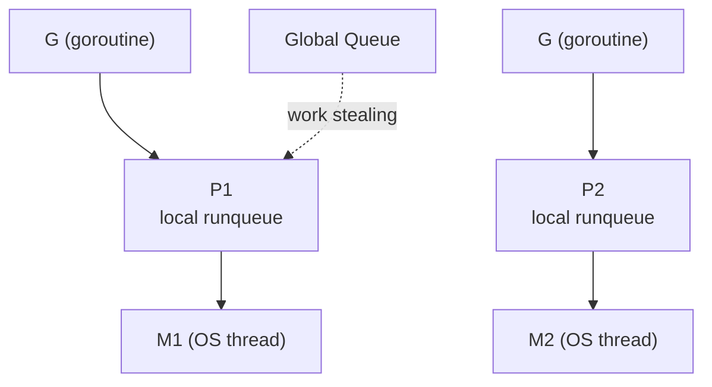
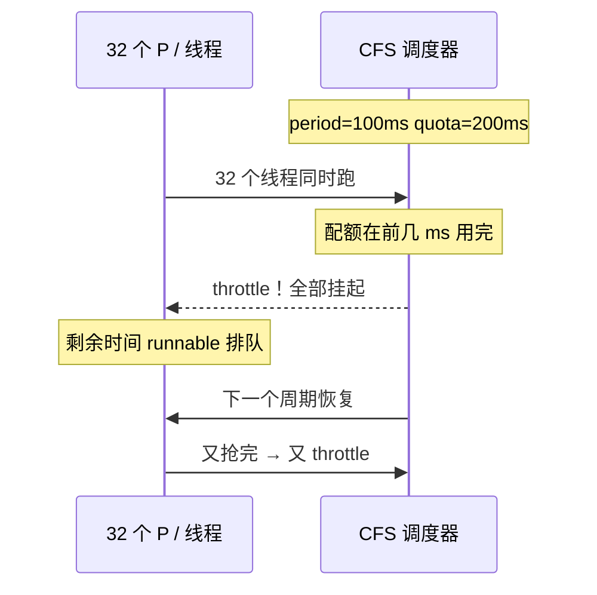
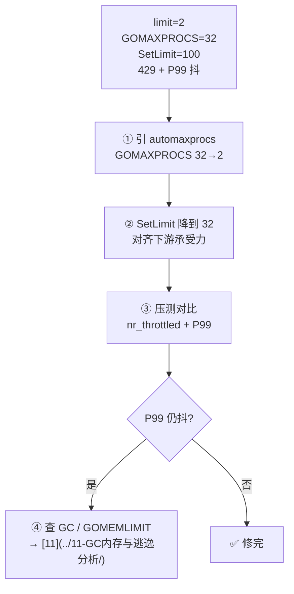

# 12｜GOMAXPROCS与容器cgroup · 练习题

开始做题前，先给大家一个小建议：合上知识点，对着**NumCPU vs cgroup quota** 错位图口述一遍。能顺下来，下面这些题大半都会了。

做题的方式：每道题**先看标题和场景，自己口述一遍答案，再往下看解答**。

题目顺序：Q1～Q5 钉 GOMAXPROCS；Q6～Q10 错位与 throttle；Q11～Q14 配置与作战。

| 标记 | 含义 |
|------|------|
| **核心** | 不懂整章就没建立起来 |
| **必会** | 值班和面试都要能讲 |
| **常用** | 线上会反复碰到 |
| **常考** | 白板和追问的高频口径 |

## 本题目录

- [Q1 GOMAXPROCS 控制什么](#q1)
- [Q2 容器 NumCPU 坑](#q2)
- [Q3 automaxprocs 用法](#q3)
- [Q4 CFS throttling 观测](#q4)
- [Q5 GOMAXPROCS vs SetLimit](#q5)
- [Q6 request vs limit](#q6)
- [Q7 改 limit 不重启](#q7)
- [Q8 如何验证对齐](#q8)
- [Q9 GOMEMLIMIT 联调](#q9)
- [Q10 CPU 低 P99 高](#q10)
- [Q11 cgroup v1/v2 读法](#q11)
- [Q12 sidecar 多容器](#q12)
- [Q13 综合调参场景](#q13)
- [Q14 BestEffort 与 cpuset](#q14)
- [合上书](#合上书)

---

## Q1

**★★★★★｜GOMAXPROCS 控制什么？和 goroutine、OS 线程什么关系？**

**覆盖**：核心 · 必会 · 常考 ｜ **对应**：知识点 [三、语言最小集：GOMAXPROCS 的最小语法](知识点.md) + [五、原理讲透：P-M-G 模型与 GOMAXPROCS](知识点.md)

### 场景

面试官开场问「GOMAXPROCS 控制什么」。有人答「限制 goroutine 数量」，有人答「限制 OS 线程数量」。追问「GOMAXPROCS=1 时程序还能并发吗」就卡住。


先自己试试，再往下看解答。

### 完整解答

> 🎯 **一句话**：GOMAXPROCS 设可同时执行 Go 代码的 **P 个数上限**，不是 goroutine 数量上限，也不是 OS 线程总数上限。

P-M-G 三者关系：



- **G（goroutine）**：用户态协程，`go func()` 创建，**数量不受 GOMAXPROCS 限制**——内存才是硬限。
- **M（machine）**：OS 线程，真正跑在 CPU 上。M **可以多于 GOMAXPROCS**——阻塞 syscall 时 M 会阻塞，P detach 出来给别的 M 用。
- **P（processor）**：调度上下文 + 本地 runqueue，**个数 = GOMAXPROCS**。只有拿到 P 的 M 才能跑 Go 代码。

所以 GOMAXPROCS=1 时仍可有百万 goroutine，只是同一时刻只有一个 P 在跑 Go 代码。但阻塞 I/O 时 M 会让出 P 给别的 M，所以 GOMAXPROCS=1 的程序**仍能并发做 I/O**。

`runtime.GOMAXPROCS(0)` 传 0 是查询当前值不修改，不是「设为 0」。

> ⚠️ **别混**：GOMAXPROCS 限的是「同时跑 Go 代码的 P 数」，不是 goroutine 创建数量，也不是 M 的总数。

> 📝 **面试**：GMP 中 P 与 GOMAXPROCS 对齐（[05](../05-goroutine与调度模型/)）。问「GOMAXPROCS=1 能并发吗」——能，阻塞 I/O 时 M 让出 P，其他 G 仍可在 P 上跑。

### 再追问

**GOMAXPROCS=1 防雪崩行吗？**——不行。goroutine 仍可无限创建，只是同时只有一个在跑。要限并发用 `errgroup.SetLimit` / semaphore / worker pool（[09](../09-errgroup与并发限流/)），不要用 GOMAXPROCS 当限流器。

---

## Q2

**★★★★★｜K8s CPU limit=2，容器里 runtime.NumCPU() 为什么还是 32？默认 GOMAXPROCS 是多少？**

**覆盖**：核心 · 必会 · 常考 ｜ **对应**：知识点 [六、原理讲透：NumCPU 与 cgroup CPU quota 的错位](知识点.md)

### 场景

服务上线 K8s，`limits.cpu: 2`，但启动日志打印 `NumCPU=32`、`GOMAXPROCS=32`。有人问「不是给了 2 核吗，为什么是 32」，有人以为是 K8s 配置错了。


SetMaxProcs 语法。

先自己试试，再往下看解答。

### 完整解答

> 🎯 **一句话**：`runtime.NumCPU()` 底层调 `sched_getaffinity` 或读 `/proc/cpuinfo`，返回进程可见的 CPU 集合——容器不隔离 CPU 视图（除非 cpuset），所以看到宿主机全部核数；默认 `GOMAXPROCS = NumCPU() = 32`。

```bash
# 容器里
grep -c ^processor /proc/cpuinfo     # ← 32（宿主机核数）
cat /sys/fs/cgroup/cpu.max           # ← 200000 100000 = 2 CPU（cgroup quota）
```

两行命令揭示了问题核心：`/proc/cpuinfo` 给的是**宿主机视图**，`cpu.max` 给的是 **cgroup 时间片配额**。Go 1.5 起默认 `GOMAXPROCS = runtime.NumCPU()`，而 NumCPU 不读 cgroup——所以 limit=2 但 GOMAXPROCS=32。

`limits.cpu: 2` 是 **CPU 时间片上限**（CFS period=100ms 内最多用 200ms），不是「把 CPU 可见数变成 2」。K8s 把 limit 翻译成 cgroup 的 `cpu.max`（v2）或 `cpu.cfs_quota_us`（v1），CFS 据此限时间，但 `/proc/cpuinfo` 不受 cgroup quota 影响。

> ⚠️ **别混**：`limits.cpu: 2` ≠ `NumCPU()` 变成 2。除非用了 cpuset 绑核（cgroup `cpuset.cpus` 限定 CPU 编号），`sched_getaffinity` 返回的是宿主机全部核。

> 📝 **面试**：默认 GOMAXPROCS=NumCPU() 是 Go 1.5 起的行为；容器里 NumCPU 常是宿主机核数，这是「GOMAXPROCS 被误导」的根源。

### 再追问

**cpuset 绑了 4 核，NumCPU 会变吗？**——可能变 4。cpuset 限制进程可运行在哪些 CPU 核上，`sched_getaffinity` 会返回这 4 个。但 cpuset 给 4 核不等于 quota 给 4 核时间——可能 cpuset=4 但 quota=2。以 `min(cpuset 数, quota/period)` 思维设并行度。

---

## Q3

**★★★★★｜go.uber.org/automaxprocs 做什么？怎么用？什么场景必须引？**

**覆盖**：必会 · 常用 ｜ **对应**：知识点 [四、语法必会：容器里怎么设 GOMAXPROCS](知识点.md)

### 场景

团队容器 Go 服务没引 automaxprocs，线上 P99 偶发毛刺，`cpu.stat` 里 `nr_throttled` 很高。有人问「不引这个库手动设 `GOMAXPROCS=2` 行不行」。


容器里怎么设。

先自己试试，再往下看解答。

### 完整解答

> 🎯 **一句话**：automaxprocs 在 `init()` 里读 cgroup CPU quota，算出可用 CPU 数，调 `runtime.GOMAXPROCS(ceil(quota/period))` 自动对齐。

```go
import (
    _ "go.uber.org/automaxprocs"   // init() 自动读 cgroup，设 GOMAXPROCS
    "runtime"
)
```

行为：`init()` 执行时读当前挂载的 cgroup 文件（v2 读 `cpu.max`，v1 读 `cpu.cfs_quota_us` + `cfs_period_us`），算 `ceil(quota/period)`，调 `runtime.GOMAXPROCS(n)`。**Pod 启动时生效一次**——运行中改 K8s limit 不会自动更新，要重启 Pod。

**什么场景必须引**：只要是 cgroup 限了 CPU 且 NumCPU 看不到限制的场景——K8s 容器、Docker `--cpus=N`、systemd `CPUQuota=` 都算。

手动设 `GOMAXPROCS=2` 也能对齐，但缺点是**改 limit 时忘了同步改 env**。automaxprocs 自动跟着 cgroup 走，少一层人工错配。不过两者都只在启动时读一次——**改 limit 必须重启 Pod**。

> ⚠️ **别混**：automaxprocs 读一次就完了，不是动态感知。Go 新版本运行时可能内置 cgroup 感知（以发行说明为准），但在确认版本行为前，容器镜像仍建议显式 import。

> 📝 **面试**：容器 Go 服务**基线依赖**之一。问「automaxprocs 性能开销」——init 一次读文件，可忽略。

### 再追问

**物理机部署也要引吗？**——建议统一引。非容器环境下 automaxprocs 通常 fallback 到 `runtime.NumCPU()`（等于默认值），无害。统一引可以避免「开发环境物理机没问题、生产容器炸了」的遗漏。

---

## Q4

**★★★★★｜GOMAXPROCS 远大于 CPU quota 会导致什么？CFS throttling 怎么观测？**

**覆盖**：核心 · 必会 · 常考 ｜ **对应**：知识点 [七、原理讲透：CFS throttling 为什么伤 P99](知识点.md)

### 场景

GOMAXPROCS=32、limit=2，P99 偶发尖刺到几百毫秒，但 `kubectl top` 看 CPU 不到 2 核。有人怀疑是网络问题要抓包，有人怀疑是 GC 问题要调 GOGC。


automaxprocs。

先自己试试，再往下看解答。

### 完整解答

> 🎯 **一句话**：32 个线程抢 2 核时间片，CFS 在 100ms 周期内几毫秒就把 quota 用完，之后整个周期所有线程被 throttle（挂起），goroutine 排队等下个周期——P99 暴涨但 CPU 利用率反而不高。



CFS（Completely Fair Scheduler）按 cgroup 的 quota/period 分配 CPU 时间。quota=200ms / period=100ms = 2 CPU。32 个线程同时跑，200ms 时间在最初几毫秒被瓜分完，CFS 把所有线程**挂起**直到下个 100ms 周期。goroutine 以为自己在并行，实际大量时间在排队——这就是 P99 >> P50 的根源。

观测手段：

```bash
cat /sys/fs/cgroup/cpu.stat
# nr_periods 114832          # ← 总周期数
# nr_throttled 87210          # ← 被掐的周期，高 = 严重
# throttled_time 9823410      # ← 累计被掐纳秒，与 P99 尖峰相关
```

`nr_throttled` 持续涨、`throttled_time` 大 → 确认 throttle 是 P99 毛刺根因。**不要**先抓包或调 GC——throttle 不走网络路径，也不产生 GC 日志。

修法：降 GOMAXPROCS 到 ≈ quota（`import _ "go.uber.org/automaxprocs"` 或手动 `GOMAXPROCS=2`），压测对比 `nr_throttled` 和 P99。

> 💡 **打个比方**：两条收费车道开了三十二个入口，前面几秒所有人一起挤过去，车道满了，剩下三十个人被拦住等到下一拨放行。平均 throughput 没高多少，但排在最后的人等待时间暴涨。

> 📝 **面试**：throttle 不是「CPU 打满了」——恰恰相反，**CPU 没打满但延迟抖**。根因是 quota 在周期内提前用完、线程被掐。修法是降 GOMAXPROCS，不是加 CPU limit。

### 再追问

**加 CPU limit 到 4 就行了吗？**——也可以，但要**同步**把 GOMAXPROCS 跟到 4（automaxprocs 重启后自动跟）。只加 limit 不调 GOMAXPROCS：虽然 throttle 减轻了（因为 quota 变大了），但 32 个线程争抢 4 核仍有开销。两者一起调才最优。

---

## Q5

**★★★★★｜GOMAXPROCS=4 能代替 errgroup SetLimit(4) 吗？**

**覆盖**：核心 · 常考 ｜ **对应**：知识点 [二、能力边界：各机制分工](知识点.md)

### 场景

批量 HTTP 探活服务用 `errgroup` 跑 100 个 goroutine，有人提议「设 GOMAXPROCS=4 就自动限并发了，不用 SetLimit」。


P-M-G 与 GOMAXPROCS。

先自己试试，再往下看解答。

### 完整解答

> 🎯 **一句话**：**不能**——GOMAXPROCS 管 CPU 并行度（P 个数），SetLimit 管同时跑的业务任务数；两者是不同层，都要。

| | **GOMAXPROCS=4** | **SetLimit(4)** |
|---|---|---|
| 管什么 | 同时有几个 P 跑 Go 代码 | 同时有几个任务在执行 |
| 影响 | CPU 并行度 | 业务并发上限 |
| goroutine 总数 | 不限 | 仍可创建很多，但超过 N 个排队 |
| 典型场景 | 容器 CPU limit 对齐 | 限下游连接数、防雪崩 |

GOMAXPROCS=4 时仍可 `go` 出 100 个 goroutine——它们轮流抢 4 个 P 来跑。这 100 个 goroutine 可能同时发 HTTP 请求，打穿下游 DB 连接池或触发 429。SetLimit(4) 确保同一时刻只有 4 个任务在干活，其余排队。

I/O 密集服务尤其明显：开很多 goroutine 抢 4 个 P 做网络 I/O，每个 goroutine 大部分时间在等 I/O（不占 P），但仍可能同时发出 100 个 HTTP 请求——GOMAXPROCS 限不住。

> ⚠️ **别混**：GOMAXPROCS=1 不能当限流器——goroutine 仍可无限创建，只是同时一个在跑。要限并发用 `errgroup.SetLimit` / `semaphore` / worker pool（[09](../09-errgroup与并发限流/)）。

> 📝 **面试**：两层都要——GOMAXPROCS 对齐 CPU limit 防 throttle，SetLimit 对齐下游承受力防雪崩。

### 再追问

**那 GOMAXPROCS 和 SetLimit 有没有关系？**——间接关系。GOMAXPROCS 太高导致 throttle 时，throttle 期间所有 P 被掐，SetLimit 排队的任务也等更久。修好 GOMAXPROCS 后，P99 改善，SetLimit 排队的延迟也跟着改善。但两者职责不同，不能互相替代。

---

## Q6

**★★★★☆｜K8s CPU request 500m、limit 2，GOMAXPROCS 应对齐哪个？为什么？**

**覆盖**：必会 · 常用 ｜ **对应**：知识点 [四、语法必会：容器里怎么设 GOMAXPROCS](知识点.md) + [六、NumCPU 与 cgroup CPU quota 的错位](知识点.md)

### 场景

Burstable Pod：request=500m、limit=2。有人认为「request 500m 就是给你半核，GOMAXPROCS=1 就够了」。


开头那个 NumCPU 误读。

先自己试试，再往下看解答。

### 完整解答

> 🎯 **一句话**：**对齐 limit（2）** 防 throttle；request 影响调度份额，不增加 CPU 时间片配额。

```yaml
resources:
  requests:
    cpu: "500m"    # ← 调度份额：K8s 按 request 分配节点 CPU 权重
  limits:
    cpu: "2"       # ← cgroup 上限：CFS 按 quota=200ms 限时间
```

两个概念不要混：

- **request=500m**：告诉 K8s 调度器「这个 Pod 至少要 0.5 核」。Guaranteed Pod 要求 request=limit；Burstable Pod 可以 request < limit。request 影响**节点调度**和 **CPU share 权重**（CFS share，不是 quota），在节点 CPU 紧张时按 request 比例分。
- **limit=2**：kubelet 把 `cpu.cfs_quota_us=200000`、`cfs_period_us=100000` 写进 cgroup。CFS 据此**硬限**每 100ms 最多用 200ms CPU 时间——超了就 throttle。

GOMAXPROCS 对齐 limit=2 → 2 个 P 争用 2 核时间片，基本不 throttle。如果对齐 request=1 → 只开 1 个 P，白白浪费一半 quota。

> ⚠️ **别混**：低 request + 高 limit 是 Burstable 的正常配置。并行度按 **limit** 设（能用的上限），容量规划按 **request** 看（稳态资源）。request 低只影响**何时被调度到 CPU**，不增加可用 CPU 时间。

> 📝 **面试**：调 GOMAXPROCS 看 limit；容量规划看 request。Guaranteed（request=limit=2）也要 automaxprocs——NumCPU 仍可能是 32。

### 再追问

**Guaranteed request=limit=2 还要 automaxprocs 吗？**——要。Guaranteed 只保证 request=limit（调度优先级高），不改变 NumCPU。NumCPU 仍读宿主机核数，GOMAXPROCS 默认仍是 NumCPU()。automaxprocs 读 cgroup quota 对齐，与 QoS 无关。

---

## Q7

**★★★★☆｜运维把 Deployment CPU limit 从 4 改成 2，不重启 Pod，GOMAXPROCS 会变吗？**

**覆盖**：常用 ｜ **对应**：知识点 [四、语法必会：容器里怎么设 GOMAXPROCS](知识点.md)

### 场景

线上缩容 CPU，运维改了 Deployment 的 `limits.cpu: 4 → 2`，`kubectl apply` 后 Pod 没 restart。有人以为 GOMAXPROCS 自动跟到 2。


quota 怎么算。

先自己试试，再往下看解答。

### 完整解答

> 🎯 **一句话**：**不会变**——automaxprocs 和默认值都在进程 **init()** 时读一次 cgroup；运行中 cgroup 文件改了，Go 进程内 GOMAXPROCS 仍是旧值。

automaxprocs 在 `init()` 执行时读 `cpu.max`（或 v1 的 `cfs_quota_us`），算出 GOMAXPROCS，调 `runtime.GOMAXPROCS(n)`。之后再也不读。K8s 改 limit → kubelet 更新 cgroup 文件 → `cpu.max` 从 `400000 100000` 变成 `200000 100000`——但 Go 进程里的 GOMAXPROCS 还是 4。

后果：limit=2 但 GOMAXPROCS=4，4 个 P 抢 2 核时间片，开始 throttle、P99 抖。而 `kubectl top` 看 CPU 也不到 2（throttle 时线程被挂起）。

修法：**滚动重启 Pod**。新 Pod 启动时 automaxprocs 读到新的 `cpu.max`，GOMAXPROCS=2。

```bash
kubectl rollout restart deployment {name}
# 新 Pod init() 读 cpu.max=200000 100000 → GOMAXPROCS=2
# 看启动日志确认：GOMAXPROCS=2
```

> ⚠️ **别混**：`kubectl apply` 改了 Deployment spec，但**已运行的 Pod 不会自动重启**（除非加了 `restartedAt` annotation 或触发 rolling update）。cgroup 文件变了不等于进程重新读。

> 📝 **面试**：改 limit → 滚动发布 → 看启动日志确认 GOMAXPROCS 已对齐。**不要**假设热更新。

### 再追问

**未来会支持动态感知吗？**——以官方和 automaxprocs 文档为准。生产环境**不要假设**热更新，滚动重启是最可靠的。即使运行时支持 `runtime.GOMAXPROCS()` 动态调用，频繁改 P 数也会影响正在跑的 goroutine 调度——启动时一次设对仍是最佳实践。

---

## Q8

**★★★★☆｜如何确认线上 Pod 的 GOMAXPROCS 已对齐 quota？**

**覆盖**：常用 · 🔧 ｜ **对应**：知识点 [四、语法必会：容器里怎么设 GOMAXPROCS](知识点.md) + [八、生产模板：容器 Go 服务基线配置](知识点.md)

### 场景

新服务上线，automaxprocs 刚引上，要确认每个 Pod 都对齐了。有人只看 Helm values 里的 `GOMAXPROCS` env，没看实际运行时值。


request vs limit。

先自己试试，再往下看解答。

### 完整解答

> 🎯 **一句话**：三步——启动日志打 `GOMAXPROCS` 与 `NumCPU`、对照 `cpu.max` / `kubectl describe`、查 `cpu.stat` 确认无 throttle。

```go
func logRuntime() {
    log.Printf("runtime: GOMAXPROCS=%d NumCPU=%d NumGoroutine=%d",
        runtime.GOMAXPROCS(0),   // ← 实际 P 数
        runtime.NumCPU(),        // ← 宿主机核数
        runtime.NumGoroutine())  // ← goroutine 总数
}
```

已对齐的日志：

```text
runtime: GOMAXPROCS=2 NumCPU=32 NumGoroutine=5
# ← GOMAXPROCS=2 与 limit 对齐；NumCPU=32 是宿主机核数（正常）
```

未对齐的日志：

```text
runtime: GOMAXPROCS=32 NumCPU=32 NumGoroutine=5
# ← automaxprocs 没引或没生效 → 需修
```

对照验证：

```bash
# 看 cgroup quota
cat /sys/fs/cgroup/cpu.max                 # ← 200000 100000 = 2 CPU

# 看 K8s 声明的 limit
kubectl describe pod {pod} | grep -A3 Limits    # ← cpu: 2

# 看 throttle（确认修正后 nr_throttled 不再涨）
cat /sys/fs/cgroup/cpu.stat | grep throttled     # ← nr_throttled 应趋近 0
```

> 🔍 **现场**：`main` 最早、automaxprocs import **之后**打这行日志——排障第一屏就能发现错配。也可在 `/readyz` 暴露 gomaxprocs 字段便于巡检。

> 📝 **面试**：不要只看 Helm values 里的 env `GOMAXPROCS=2`——要看运行时实际值 `runtime.GOMAXPROCS(0)`。env 设了但 automaxprocs 又覆盖了、或 import 顺序不对，实际值可能和预期不一致。

### 再追问

**pprof 能看 GOMAXPROCS 吗？**——能。`curl localhost:6060/debug/pprof/` 的 `cmdline` 和 `goroutine` 信息里可间接推。但启动日志更轻量，适合每次发版后一眼确认。pprof 更适合运行时排障（[13](../13-pprof与性能排查/)）。

---

## Q9

**★★★★☆｜容器同时设 GOMAXPROCS 和 GOMEMLIMIT 的理由？为什么 GOMAXPROCS 高会放大 GC pause？**

**覆盖**：必会 ｜ **对应**：知识点 [七、原理讲透：CFS throttling 为什么伤 P99](知识点.md) + [八、生产模板](知识点.md)

### 场景

容器 `limits.cpu: 2, limits.memory: 512Mi`。有人只设了 `GOMEMLIMIT=460MiB` 但没引 automaxprocs。GC pause 偶发偏长，但堆没超 limit。


CFS throttling 伤 P99。

先自己试试，再往下看解答。

### 完整解答

> 🎯 **一句话**：CPU 线防 throttle，内存线防 OOM 促 GC——两条 cgroup 限制各管各；但 GOMAXPROCS 过高时 GC mark 线程也被 throttle，写屏障开启时间拉长，GC pause 放大。

容器同时有两个 cgroup 限制：

```text
cgroup CPU quota (cpu.max)     → GOMAXPROCS 应对齐 → 防 CFS throttle
cgroup memory limit (memory.max) → GOMEMLIMIT 应略低 → 防 OOM、促 GC 提前回收
```

GOMAXPROCS 高 → GC pause 变长的链条：

- GC mark 阶段启用**写屏障（write barrier）**：每个指针赋值多一次开销。
- mark 线程也需要 CPU 时间——如果 GOMAXPROCS=32 但 quota=2，mark 线程和其他 32 个线程一起抢 2 核。
- CFS throttle 把 mark 线程也掐住 → mark 完成变慢 → 写屏障开启时间拉长 → STW 感知更长。

所以本例虽然 `GOMEMLIMIT` 设了，但 GOMAXPROCS=32 导致 GC mark 线程被 throttle，pause 仍偏长。修法：同时引 automaxprocs 对齐 CPU quota。

```go
import (
    _ "go.uber.org/automaxprocs"   // CPU 线
    "runtime/debug"
)

func init() {
    debug.SetMemoryLimit(460 * 1024 * 1024)  // 内存线，略低于 memory limit
}
```

> ⚠️ **别混**：GOMEMLIMIT 设了不等于 GOMAXPROCS 自动设。两条基线各自独立，都要显式配。只设 GOMEMLIMIT 不设 GOMAXPROCS：内存侧防住了 OOM，CPU 侧仍在 throttle。

> 📝 **面试**：容器 Go **双基线**：automaxprocs + GOMEMLIMIT。GC 细节见 [11](../11-GC内存与逃逸分析/)。

### 再追问

**只设 GOMAXPROCS 不设 GOMEMLIMIT 行吗？**——不行。CPU 侧防住了 throttle，但内存侧：cgroup memory limit 到了直接 OOM kill，Go runtime 来不及 GC。设 GOMEMLIMIT 让 GC 在逼近 limit 时提前回收，避免 OOM kill。

---

## Q10

**★★★★☆｜CPU 利用率不到 limit 但 P99 很高，和 GOMAXPROCS 有关吗？**

**覆盖**：常用 · 必会 ｜ **对应**：知识点 [七、原理讲透：CFS throttling 为什么伤 P99](知识点.md) + [九、踩坑清单](知识点.md)

### 场景

网关 P99 偶发尖刺到 300ms，`kubectl top` 显示 CPU 不到 limit 的一半。有人怀疑是业务代码慢，有人怀疑是网络。启动日志发现 `GOMAXPROCS=32`、limit=2。


怎么验证 throttle。

先自己试试，再往下看解答。

### 完整解答

> 🎯 **一句话**：**很可能有关**——GOMAXPROCS >> quota → CFS throttle，throttle 期间线程被挂起不消耗 CPU（利用率不高），但 goroutine 排队等下个周期 → P99 毛刺。

| 现象 | 更像 | 查什么 |
|------|------|---------|
| CPU 不到 limit + P99 抖 | CFS throttle | `cpu.stat` 的 `nr_throttled` |
| CPU 打满 limit + P99 抖 | 真 CPU 瓶颈 | pprof CPU profile（[13](../13-pprof与性能排查/)） |
| CPU 低 + P99 低 + QPS 低 | 流量不够 | 压测验证 |
| CPU 低 + P99 抖 + GC 频繁 | GC pause | pprof + GOMEMLIMIT（Q9） |

本例：先查 `cpu.stat`：

```bash
cat /sys/fs/cgroup/cpu.stat
# nr_throttled 87210          # ← 高 = throttle 严重
# throttled_time 9823410      # ← 累计被掐纳秒
```

`nr_throttled` 持续涨 → 确认 throttle 是 P99 根因。修法：`import _ "go.uber.org/automaxprocs"` 或手动 `GOMAXPROCS=2`，压测对比 P99 和 `nr_throttled`。

> ⚠️ **别混**：**CPU 利用率不高 ≠ 没有 throttle**。throttle 时线程被挂起、不消耗 CPU，所以平均利用率看起来很低。P99 才是 throttle 的信号——「CPU 闲着但延迟抖」就是 throttle 的签名。

> 📝 **面试**：先对齐 GOMAXPROCS，再查应用 SetLimit、GC（[11](../11-GC内存与逃逸分析/)）、pprof（[13](../13-pprof与性能排查/)）。

### 再追问

**CPU 真打满 limit 了呢？**——可能是真 CPU 瓶颈。这时加 CPU limit 或优化代码（pprof 找热点），不是 GOMAXPROCS 的问题。GOMAXPROCS 已对齐 quota 时，CPU 密集任务的并行度已经是最优——再加 GOMAXPROCS 不会变快（quota 没变）。

---

## Q11

**★★★☆☆｜cgroup v1 和 v2 怎么读 CPU quota？automaxprocs 怎么算？**

**覆盖**：必会 · 🔧 ｜ **对应**：知识点 [四、语法必会：容器里怎么设 GOMAXPROCS](知识点.md)

### 场景

容器里想确认 CPU quota，但不知道 cgroup 版本。有人读 v2 的 `cpu.max` 返回 `max`，有人读 v1 的 `cfs_quota_us` 找不到文件。


生产基线配置。

先自己试试，再往下看解答。

### 完整解答

> 🎯 **一句话**：v2 一行两数 `cpu.max`，v1 两个文件 `cfs_quota_us` / `cfs_period_us`，`ceil(quota/period)` 就是可用 CPU 数。

```bash
# 先确认版本
stat -fc %T /sys/fs/cgroup/
# cgroup2fs → v2
# tmpfs     → v1

# cgroup v2（新集群）
cat /sys/fs/cgroup/cpu.max
# 200000 100000      # ← quota=200000 period=100000 → 2 CPU
# max 100000         # ← 无限制（部分环境）

# cgroup v1
cat /sys/fs/cgroup/cpu/cpu.cfs_quota_us     # ← 200000
cat /sys/fs/cgroup/cpu/cpu.cfs_period_us    # ← 100000
# quota/period = 2.0 → 2 CPU
```

automaxprocs 读当前挂载的 cgroup 文件，算 `ceil(quota/period)`，调 `runtime.GOMAXPROCS(n)`。

- v2 `cpu.max` = `200000 100000` → `ceil(200000/100000)` = 2
- v1 `cfs_quota_us=200000, cfs_period_us=100000` → 同上
- v2 `cpu.max` = `max 100000` → 无限制 → fallback 到 `NumCPU()`

> ⚠️ **别混**：v2 的 `cpu.max` 第一字段是 quota（微秒），第二字段是 period（微秒）。`max` 表示无限制。v1 是两个独立文件。不要在 v2 环境找 `cfs_quota_us`——文件不存在。

> 📝 **面试**：知道 `quota/period` 算法即可，不用背 automaxprocs 源码。面试官问「automaxprocs 原理」——答 init() 读 cgroup、算 ceil(quota/period)、调 runtime.GOMAXPROCS。

### 再追问

**0.5 CPU 的 quota 怎么算？**——`cpu.max` = `50000 100000` → `ceil(50000/100000)` = `ceil(0.5)` = 1。automaxprocs 会设 GOMAXPROCS=1。手动设也可以试 1 并压测——GOMAXPROCS 最小是 1，不能设 0。

---

## Q12

**★★★☆☆｜Pod 里 app 和 sidecar 两个容器，GOMAXPROCS 对齐谁？**

**覆盖**：常用 ｜ **对应**：知识点 [七、原理讲透：CFS throttling 为什么伤 P99](知识点.md)

### 场景

Pod 里 app 容器 limit=2、sidecar（日志收集）limit=200m。两个都是 Go 程序。有人问「Pod 总共 2.2 核，app 设 GOMAXPROCS=2.2 行吗」。


GOMEMLIMIT 搭配。

先自己试试，再往下看解答。

### 完整解答

> 🎯 **一句话**：各对齐**本 container 的 CPU limit**——app GOMAXPROCS≈2，sidecar GOMAXPROCS≈1（200m 取整）。不是 Pod 加总。

Pod 内每个容器有独立 cgroup（各自独立 CPU limit）。K8s 给每个 container 写各自的 `cpu.max`：

```text
app container:      cpu.max = 200000 100000   → 2 CPU → GOMAXPROCS=2
sidecar container:  cpu.max = 50000 100000    → 0.5 CPU → GOMAXPROCS=1（取整）
```

两个容器是独立进程，各自 automaxprocs 读各自的 cgroup，互不干扰。app 不会因为 sidecar 有 200m 就把自己的 GOMAXPROCS 设成 2.2。

如果 app 引了 automaxprocs，sidecar 也引了——各自对齐，没问题。如果只 app 引了 sidecar 没引——sidecar 的 GOMAXPROCS 可能是 NumCPU=32，在 200m quota 下严重 throttle，影响日志收集。

> ⚠️ **别混**：**Pod 级别没有总 cgroup CPU limit**（除非用 Pod-level cgroup，K8s 1.25+ 特性）。每个 container 独立限。共享 PID namespace 不影响——仍独立 cgroup CPU。

> 📝 **面试**：每个容器独立 cgroup，各自 automaxprocs 各自对齐。sidecar 也是 Go 程序也要引 automaxprocs。

### 再追问

**不引 automaxprocs 手动设行吗？**——行，但每个容器各自设 env `GOMAXPROCS`，与各自的 `limits.cpu` 对齐。不要把 Pod 总 limit 拆给 app——那样 sidecar 拿不到自己的份额。

---

## Q13

**★★★★★｜综合场景：limit=2、NumCPU=32、无 automaxprocs、errgroup SetLimit(100)、批量 HTTP 探活 → 429 + P99 抖。给调参顺序。**

**覆盖**：核心 · 必会 ｜ **对应**：知识点 [全文](知识点.md)

### 场景

批量 HTTP 探活服务，K8s limit=2 核。没引 automaxprocs，GOMAXPROCS=32。errgroup SetLimit(100) 同时探 100 个目标。下游偶发 429（Too Many Requests），P99 抖。有人只降 SetLimit，有人只加 CPU limit。


踩坑对照。

先自己试试，再往下看解答。

### 完整解答

> 🎯 **一句话**：**① 引 automaxprocs 或 GOMAXPROCS=2** → **② SetLimit 降到下游可承受** → **③ 压测看 nr_throttled / P99** → **④ 按需设 GOMEMLIMIT**。



为什么是这个顺序：

- **只降 SetLimit 不修 GOMAXPROCS**：SetLimit=32 但 GOMAXPROCS=32 → 32 个 P 仍抢 2 核 → CFS throttle → P99 仍抖。throttle 期间排队的任务也等更久。
- **只修 GOMAXPROCS 不降 SetLimit**：GOMAXPROCS=2 防 throttle 了，但 SetLimit=100 → 100 个 goroutine 同时发 HTTP → 下游 429。GOMAXPROCS=2 不限 goroutine 数（Q5）。
- **两层都要**：GOMAXPROCS 对齐 CPU（防 throttle），SetLimit 对齐下游（防 429）。

```go
import (
    _ "go.uber.org/automaxprocs"   // ① GOMAXPROCS 32 → 2
)

func main() {
    logRuntime()   // 确认 GOMAXPROCS=2
    g, ctx := errgroup.WithContext(context.Background())
    g.SetLimit(32) // ② 降到下游可承受
    // ...
}
```

GOMEMLIMIT（④）按需：如果压测后 GC pause 也长，设 `GOMEMLIMIT` 略低于 `limits.memory`（Q9）。

> ⚠️ **别混**：**CPU 并行度**（GOMAXPROCS）与**应用并发**（SetLimit）是两层——只修一层解决不了另一层的问题。

> 📝 **面试**：先修 GOMAXPROCS（CPU 线），再修 SetLimit（业务线），最后看 GOMEMLIMIT（内存线）。三层各管各，按序排查。

### 再追问

**limit 提到 4 行吗？**——可以，但要同步：GOMAXPROCS 跟到 4（automaxprocs 重启后自动跟），SetLimit 重新压测定。不要只加 limit 不调其他——GOMAXPROCS 没跟的话 32 P 抢 4 核仍有 throttle（比 2 核轻但仍存在）。加 limit 也要确认节点有足够 CPU 余量。

---

## Q14

**★★★★☆｜BestEffort Pod 没 CPU limit、cpuset 绑 4 核但 quota=2，GOMAXPROCS 怎么设？**

**覆盖**：常用 · 常考 ｜ **对应**：知识点 [六、NumCPU 与 cgroup CPU quota 的错位](知识点.md) · [九、踩坑清单](知识点.md)

### 场景

测试集群 Pod 是 BestEffort（无 `resources.limits`），`cpu.max` 显示 `max 100000`。另一台生产 Pod cpuset 绑了 4 核，但 `limits.cpu: 2`。


本套题收尾综合口述。

先自己试试，再往下看解答。

### 完整解答

> 🎯 **一句话**：**无 limit** 时 automaxprocs 常 fallback **NumCPU()** → 可能吃满整节点；**cpuset ≠ quota**——并行度按 **`min(cpuset 数, ceil(quota/period))`** 思维设 GOMAXPROCS。

```bash
cat /sys/fs/cgroup/cpu.max
# max 100000          # ← BestEffort：无 quota 上限

cat /sys/fs/cgroup/cpuset.cpus.effective   # ← 若 cpuset 绑 4 核
# 0-3

cat /sys/fs/cgroup/cpu.max
# 200000 100000       # ← quota 仍只有 2 CPU 时间片
```

BestEffort：默认 GOMAXPROCS 可能 = 节点核数，争抢 node CPU、影响同节点 Pod——测试环境可接受，**生产应设 request/limit**。cpuset 给 4 核只限制「跑在哪些 CPU」，quota=2 才限制「用多少 CPU 时间」——automaxprocs 读 quota，不是只数 cpuset。手动设时取 **实际可用算力更小的一侧**。

> ⚠️ **别混**：`cpu.max` 第一字段 `max` = 无限制，不等于「可以无限用 CPU」——节点物理核和调度竞争仍是硬约束。

> 📝 **面试**：生产容器**必须有 CPU limit** + automaxprocs；BestEffort 是踩坑场景，不是推荐配置。

### 再追问

**物理机也要 import automaxprocs 吗？**——建议统一引，非容器 fallback 到 NumCPU()，无害且避免「开发机 OK、容器炸」遗漏。

---

## 合上书

与知识点「合上书」逐条对齐——能讲出来才算会。

- [ ] **默画** GOMAXPROCS 被 cgroup 误导的一生：容器启动 → NumCPU=32 → 默认 GOMAXPROCS=32 → 32 P 抢 2 核 → CFS throttle → P99 抖 → 修正（automaxprocs / 手动）→ 对齐 quota。（Q1 · Q2 · Q4）
- [ ] **口述** GOMAXPROCS 与 P、M、G 的关系：P 个数=GOMAXPROCS，G 排队等 P，M 可多于 P（阻塞线程），GOMAXPROCS=1 仍可并发 I/O。（Q1）
- [ ] **口述** NumCPU 与 cgroup CPU quota 的区别：NumCPU 读宿主机核数，quota 是时间片上限，容器里两者不等于。（Q2）
- [ ] **口述** automaxprocs 怎么用：`import _ "go.uber.org/automaxprocs"`，init() 读 cgroup 设 GOMAXPROCS，改 limit 要重启 Pod。（Q3 · Q7）
- [ ] **口述** CFS throttling 为什么伤 P99：quota 在周期内提前用完 → 线程被掐 → goroutine 排队 → P99 尖峰，CPU 利用率反而不高。（Q4 · Q10）
- [ ] **口述** GOMAXPROCS 与 SetLimit 的区别：CPU 并行度 vs 任务并发，两层都要。（Q5）
- [ ] **口述** K8s request vs limit：request 影响调度份额，limit 是 throttle 上限，GOMAXPROCS 对齐 limit。（Q6）
- [ ] **口述** 如何验证 GOMAXPROCS 已对齐：启动日志打 `GOMAXPROCS` 与 `NumCPU`，对照 `cpu.max` / `kubectl describe`，查 `cpu.stat` 确认无 throttle。（Q8）
- [ ] **口述** cgroup v1/v2 怎么读 CPU quota：v2 `cpu.max`（一行两数），v1 `cfs_quota_us` / `cfs_period_us`，`ceil(quota/period)`。（Q11）
- [ ] **口述** 与 GOMEMLIMIT 联调：CPU 少 + GOMAXPROCS 高 → GC mark 被 throttle + 写屏障时间长 → GC pause 变长；两条基线都要设。（Q9）
- [ ] **口述** 改 K8s limit 后为什么 GOMAXPROCS 不变：automaxprocs 只在 init() 读一次，要滚动重启。（Q7）
- [ ] **口述** 综合调参顺序：先 GOMAXPROCS（CPU 线），再 SetLimit（业务线），最后 GOMEMLIMIT（内存线），三层各管各。（Q13）
- [ ] **口述** BestEffort 无 limit、cpuset vs quota 怎么设 GOMAXPROCS。（Q14）
