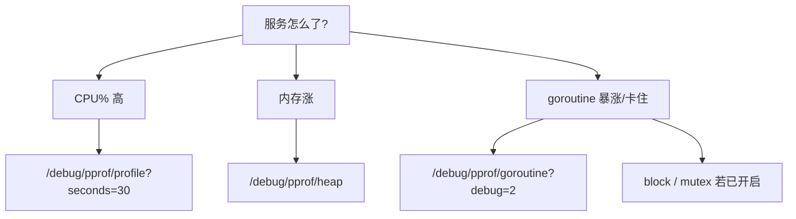
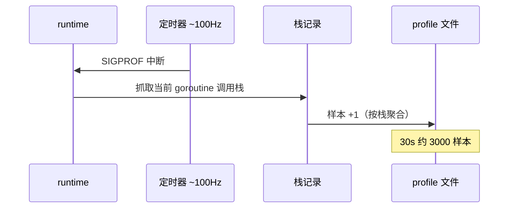
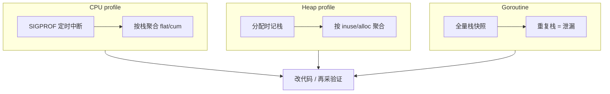

# pprof 与性能排查

> 大家好，欢迎来到这次分享。开讲之前，先带大家回到一个很多值班同学都踩过的现场：
> 活动高峰 API P99 从 80ms 飙到 2s，有人直接 `kill -9` 重启——重启后指标绿了，根因还在；有人 `curl /debug/pprof/profile` 抓了 30 秒 CPU 图，却对着 `runtime.mallocgc` 发呆，不知道下一步该 `list` 谁。
> 这一章讲完，你会知道当时那两个人错在哪——重启只消症状；对着 mallocgc 发呆是因为没选对 profile、也不会 `list`/`top`。
> **本章回答**：一次 pprof 采样从「怎么开、采什么、怎么存」到「`go tool pprof` 读图定责」完整走一遍——CPU、heap、goroutine 各看什么、各踩什么坑。
> **不讲**：GC 触发条件与逃逸分析 → [11](../11-GC内存与逃逸分析/)；GOMAXPROCS 与 cgroup 配额 → [12](../12-GOMAXPROCS与容器cgroup/)；HTTP Server 优雅退出与 `/debug/pprof` 挂载点 → [10](../10-HTTP-Server与优雅退出/)。这些都有专门的章节，本章只在用到时点到为止。

**标记**：🎯重点 · 🔥难点 · ⭐常考 · 🔧实操

**怎么听这场分享**：先扫面试口径和语言最小集；主线是「一次 pprof 采样的一生」——选型 → 开启 → CPU/heap/goroutine → 读火焰图 → 安全暴露。每一节讲完提示对应练习题。

🔥 CPU profile 大白话：**不是把每条指令录下来**，是按时间抽样「当时 PC 在哪」——短毛刺可能采不着，要拉长采样或换场景复现。


---

## 面试怎么考

| 标记 | 考点 |
|------|------|
| **核心** | `import _ "net/http/pprof"`；CPU vs heap profile 语义；`go tool pprof` 的 `top`/`list`/`web` |
| **必会** | `?seconds=30` 采 CPU；heap 的 `inuse` vs `alloc`；goroutine profile 看泄漏栈 |
| **常用** | 生产用独立端口或鉴权暴露 pprof；`curl -o` 落盘再离线分析；火焰图读「平顶」 |
| **常考** | 为什么 CPU profile 是采样不是追踪；`alloc_space` 与 `inuse_space` 区别；block/mutex 何时开 |

**30 秒怎么说**：Go 内置 `runtime/pprof` 和 `net/http/pprof`。CPU 是定时 SIGPROF 采栈，heap 是分配时记栈。线上 `curl localhost:6060/debug/pprof/profile?seconds=30` 落盘，`go tool pprof -http=:0 cpu.prof` 看火焰图——宽的是热点，平顶是忙等或锁。内存涨先看 `heap?debug=1` 或 `inuse_space`，别一上来就怪 GC。


本节对应练习题目录先扫一眼。

---

## 能力边界

| 维度 | pprof | `trace` / `fgprof` | 外部 APM |
|------|-------|-------------------|----------|
| **适合** | CPU/内存/阻塞/goroutine 栈归因 | 调度延迟、GC STW 毫秒级时序 | 全链路、业务 span |
| **不适合** | 网络 RTT、磁盘 IO 等内核外因 | 长期低开销常驻（trace 很重） | 替代读源码 |
| **你要会** | 30 秒内拿到可分享的 profile 文件 | 知道何时要 `go tool trace` | 和 Prometheus 指标互证 |

> 🎯 pprof 回答「**这段代码在吃 CPU/内存**」，不回答「**为什么 QPS 掉**」——后者要 RED 指标 + 日志 + 有时抓包。


本节对应练习题 Q1。边界清了——最小集。

---

## 语言最小集

读任何带 profiling 的 Go 服务，先认这 10 个零件：

| 零件 | 示例 | 含义 |
|------|------|------|
| 匿名导入 | `_ "net/http/pprof"` | 副作用注册 `/debug/pprof/*` 路由 |
| 独立 ServeMux | `http.ListenAndServe(":6060", nil)` | 别把 debug 和管理口绑业务端口 |
| CPU 采集 | `/debug/pprof/profile?seconds=30` | 采 30s 栈样本写 profile |
| Heap 快照 | `/debug/pprof/heap` | 当前堆分配快照（可 `?debug=1` 文本） |
| Goroutine | `/debug/pprof/goroutine?debug=2` | 全协程栈，泄漏排查第一刀 |
| Block | `/debug/pprof/block` | 阻塞在 channel/sync 上的时间（需先 `SetBlockProfileRate`） |
| Mutex | `/debug/pprof/mutex` | 互斥锁竞争（需 `SetMutexProfileFraction`） |
| 落盘 | `curl -o cpu.prof 'http://...'` | 文件可离线、可发同事 |
| 分析 | `go tool pprof cpu.prof` | 交互式 REPL |
| Web UI | `go tool pprof -http=:0 cpu.prof` | 火焰图、图、源码行 |

```go
import (
    _ "net/http/pprof"   // 副作用注册到 DefaultServeMux
    "net/http"
)
func main() {
    go func() {
        http.ListenAndServe("127.0.0.1:6060", nil) // 只绑 loopback
    }()
    // ... 业务 main
}
```


本节对应练习题 Q2。最小集会了——主图。

---

## 一、一张图：一次 pprof 采样的一生 ⭐

> 🎯 **一句话**：从「决定采哪种 profile」→「内核记栈」→「HTTP 吐出二进制」→「pprof 工具聚合」→「你定责改代码」，是一条单向流水线。


**读图**：从左「现象」到右「修复」，中间**不能跳步**——没 `seconds` 的 CPU 采太短是噪声；heap 没分清 `inuse`/`alloc` 会修错方向。监控（CPU%、RSS）照的是「要不要走这条流水线」，pprof 照的是「流水线走到 ANALYZE 后该点谁」。


本节对应练习题 Q1、Q14。主线有了——先选型。

---

## 二、入口：现象决定 profile 选型 🔧

> 🎯 **一句话**：**现象决定 profile 类型**，不是「哪个顺手采哪个」。



**读图**：三条分支对应三种「生命」终点不同——CPU 走采样中断，heap 走分配记录，goroutine 走当前栈快照。别在 CPU 不高时死盯 CPU profile。

> ⚠️ **别混**：**metrics 告诉你「病了」**，pprof 告诉你「哪段代码在发烧」——`process_cpu_seconds_total` 高不等于 `json.Marshal` 一定是热点，要以 profile 为准。

> 📝 **面试**：「线上 CPU 高怎么查？」——先确认是 **CPU bound** 还是 **IO wait**（`top`/`pidstat`），Go 服务再 `profile` 30s，火焰图看**自身代码**宽条，宽在 `runtime` 再往下追业务调用链。


口诀：**「CPU 慢抓 profile；内存抓 heap；泄漏看 goroutine」**。练习题 Q3、Q4。选型会了，看怎么开。

---

## 三、开启：怎么把 pprof 开起来 ⭐🔧

> 🎯 **一句话**：**`net/http/pprof` 注册路由 + 独立监听**是生产最低配，别把 `/debug/pprof` 暴露在公网业务口。

### 标准挂载

```go
package main
import (
    "log"
    "net/http"
    _ "net/http/pprof" // 副作用：注册 HandleFunc 到 DefaultServeMux
)
func main() {
    go func() {
        // 生产：127.0.0.1 或内网 + 鉴权；绝不要 0.0.0.0:8080 与 API 同端口裸奔
        log.Println(http.ListenAndServe("127.0.0.1:6060", nil))
    }()
    // runAPIServer()
}
```

`import _ "net/http/pprof"` 会在 **`http.DefaultServeMux`** 上注册以下路径，全部挂在 `/debug/pprof/` 前缀下：索引页 `/debug/pprof/`（列出所有可用 profile）、`/profile`（CPU，默认 30s，可 `?seconds=` 调整）、`/heap`（堆快照）、`/goroutine`（协程栈，`?debug=2` 带完整栈）、`/block`（阻塞）、`/mutex`（锁竞争）、`/symbol`（符号解析，给 pprof 工具用）。

### 不用 HTTP：代码里直接写文件

```go
import (
    "os"
    "runtime/pprof"
)
func dumpCPU(path string, sec int) error {
    f, err := os.Create(path)
    if err != nil {
        return err
    }
    defer f.Close()
    return pprof.StartCPUProfile(f)
    // ... time.Sleep; pprof.StopCPUProfile()
}
```

适合：**定时任务**、**信号触发**（`SIGUSR1`）、**测试基准**里 `testing` 包已封装。

> 💡 **打个比方**：HTTP pprof 像医院体检中心——随来随查；`pprof.StartCPUProfile` 像随身心电图——只在怀疑发作的 30 秒打开。

> ⚠️ **别混**：`ListenAndServe(":6060", nil)` 用的是 **DefaultServeMux**；若业务 `http.Handle("/api", ...)` 也在 Default 上，**路由会混在一起**——更干净的是 `mux := http.NewServeMux()` 手动注册，或单独进程。


本节对应练习题 Q5。开启会了，CPU 采样原理。

---

## 四、采样：CPU profile 原理 🔥⭐

> 🎯 **一句话**：CPU profile 是 **SIGPROF 定时中断采栈**（约 100Hz），统计的是「时间花在哪些调用栈上」，不是每条语句的执行次数。

### 采样过程



**读图**：每个样本是一次「此刻 CPU 在执行哪条栈」；聚合后 `flat` 是函数自身耗时占比，`cum` 含子调用。忙等（空转 `for`）也会占样本——火焰图上**平顶**常见。

**flat 与 cum 到底怎么算**——pprof 把所有样本按调用栈树状聚合。一条栈 `main → encode → json.Marshal → runtime.mallocgc` 出现了 100 次：

- `main` 的 `cum` 含下游所有（100 次）
- `json.Marshal` 的 `cum` 也含下游（100 次），但 `flat` 只是它**自己**那几行代码的
- `runtime.mallocgc` 的 `flat` 是它自己执行那几个样本

```text
main           cum=3000（全部）   flat=10（自身几乎不烧）
  -> encode    cum=2500           flat=50
    -> json.Marshal cum=2000     flat=820   # ← flat 高，自身烧 CPU
      -> mallocgc cum=410        flat=410   # ← 子函数，减调用次数才降
```

**读图**：优化 `json.Marshal` 的 `flat`（820）要改它的内部实现；优化 `mallocgc` 的 `flat`（410）要减少**分配次数**（谁调用了 `Marshal` 就少分配）。两条路径的改法不同——这就是 `flat` vs `cum` 的实战意义。

### 采集命令

```bash
# 采 30 秒 CPU，落盘
curl -s 'http://127.0.0.1:6060/debug/pprof/profile?seconds=30' -o cpu-$(date +%H%M).prof

# 确认文件非空
file cpu-1430.prof
# cpu-1430.prof: gzip compressed data   # ← pprof 格式常是 gzip

go tool pprof -top cpu-1430.prof
# Showing nodes accounting for 2.10s, 95% of 2.21s total
# flat  flat%   sum%        cum   cum%
# 0.82s 37.10% 37.10%      1.95s 88.24%  encoding/json.Marshal
# 0.41s 18.55% 55.66%      0.41s 18.55%  runtime.mallocgc   # ← 分配多，转 heap
```

**读图**：`flat` 高是函数**自己**烧 CPU；`cum` 高要 `list` 看是**谁调用**它。`runtime.mallocgc` 高往往是**分配多**，应转 heap profile 或看调用方。

> 📝 **面试**：「CPU profile 准确吗？」——统计意义上足够定热点；**短于 10s** 易受毛刺影响；**多核**要采够时长覆盖所有 P；不能替代 trace 看调度延迟。

> ⚠️ **别混**：`go test -cpuprofile` 和线上 `profile` **格式相同**，分析命令一样；但测试负载 ≠ 生产负载，**别用单测 profile 代表线上**。

> 🔍 **现场**：`runtime.SetCPUProfileRate(hz)` 可以调采样频率，但生产别乱调——100Hz 是 Go 团队权衡后的默认值，调到 1000Hz 会让 profiling 自身吃掉不少 CPU，样本里会出现 pprof 自己的栈。


⭐ 面试必考：CPU profile 是采样不是全量。练习题 Q6。CPU 懂了，看 heap。

---

## 五、内存：heap profile 的 inuse 与 alloc 🔥⭐

> 🎯 **一句话**：**`inuse_space` = 此刻还活在堆上的对象**；**`alloc_space` = 历史上分配过多少（含已释放）**——泄漏查 inuse，分配压力查 alloc。

### 四种常用视角

| 模式 | 含义 | 何时用 |
|------|------|--------|
| `inuse_space` | 当前堆上字节 | OOM、RSS 涨 |
| `inuse_objects` | 当前对象个数 | 小对象泄漏 |
| `alloc_space` | 累计分配字节 | GC 压力、热点分配 |
| `alloc_objects` | 累计分配次数 | 高频 `new` |

```bash
curl -s 'http://127.0.0.1:6060/debug/pprof/heap' -o heap.prof

go tool pprof -sample_index=inuse_space -top heap.prof
#      flat  flat%   sum%        cum   cum%
#  512.10MB 62.01% 62.01%   512.10MB 62.01%  bytes.(*Buffer).Grow  # ← 嫌疑栈
```

```bash
# 文本速览（不经过 go tool）
curl -s 'http://127.0.0.1:6060/debug/pprof/heap?debug=1' | head -40
# # heap profile: 847: 120340232 [1923: 280451120] @ heap/1048576
# #   1: 67108864 [1: 67108864] @ 0x... 0x... main.leakyCache
#         ^ inuse_bytes  ^ alloc_count   # ← 行首是 inuse，括号里是 alloc 累计
```

**读图**：`debug=1` 行里 `[inuse: total]` 和 `@` 后的栈指向**谁还在持有**；对比两次 heap 快照间隔 5 分钟，inuse 只增不减的栈即泄漏嫌疑。

**两快照对比法**——单次 heap 只能看「此刻谁占内存多」，但「占得多」不一定是泄漏（可能就是缓存大）。真正的泄漏验证靠**对比**：

```bash
# 采第一次
curl -s 'http://127.0.0.1:6060/debug/pprof/heap' -o heap1.prof
# 等 5 分钟（让泄漏积累）
curl -s 'http://127.0.0.1:6060/debug/pprof/heap' -o heap2.prof

# 对比：看增量
go tool pprof -base heap1.prof -sample_index=inuse_space heap2.prof
# 显示「5 分钟内 inuse 增长最多的栈」——这才是泄漏嫌疑
```

如果两次 inuse 差不多、不随时间涨，那不是泄漏，是**缓存常驻**。如果每次都涨且不回落，就是泄漏。

> 💡 **打个比方**：`alloc` 像「这辈子一共买过多少碗面」；`inuse` 像「冰箱里现在还剩几碗」——吃得多不一定胖，剩得多才占地方。

> 🔥 **难点**：slice 底层数组、`[]byte` 池化不当、`sync.Pool` 里对象被意外长期引用，都会在 heap 上显示为某次 `append` 或 `make` 的栈——要 **`list` + 看业务是否仍引用**。


🔥 inuse vs alloc 别混。练习题 Q7、Q8。heap 懂了，看协程阻塞。

---

## 六、协程与阻塞：goroutine / block / mutex ⭐🔧

> 🎯 **一句话**：**goroutine profile 是当前栈快照**；block/mutex 要**事先开启采样率**，否则端点是空的。

### Goroutine 泄漏

```bash
curl -s 'http://127.0.0.1:6060/debug/pprof/goroutine?debug=2' -o gor.txt
grep -c '^goroutine' gor.txt
# 48291   # ← 上万就要警惕

grep -A2 'chan receive' gor.txt | head -20
# goroutine 412 [chan receive]:
# main.worker(...)
#     /app/worker.go:88   # ← 同一栈重复上万次 = 泄漏
```

**读图**：同一栈重复成千上万次 = **泄漏**；`chan receive` 卡在等消息、`select` 死等、`context` 未 cancel 是三大经典。

**三大经典泄漏根因**——面试要能按名字点出来：

- **context 未 cancel**：启动了 `go func()` 处理请求，请求超时后 context 没传播到 goroutine，它还在等 channel 永远不来的消息。修法：所有 goroutine 都 `select` 监听 `ctx.Done()`。
- **consumer 未退出**：worker pool 的消费者从 channel 读数据，shutdown 时没关闭 channel，consumer 永久阻塞在 `chan receive`。修法：shutdown 时 `close(chan)` 让所有 consumer 收到 zero value 退出。
- **time.Ticker 未 Stop**：`time.NewTicker` 创建后忘了 `defer ticker.Stop()`，Ticker 内部的 goroutine 一直活着。每次请求创建一个不 Stop，泄漏一个。修法：`defer ticker.Stop()` 一行搞定。

### 开启 block / mutex

```go
import "runtime"
func init() {
    runtime.SetBlockProfileRate(1)     // 纳秒：记录阻塞 >1ns 的事件（生产可设更大降开销）
    runtime.SetMutexProfileFraction(5) // 每 5 次锁竞争记录 1 次
}
```

```bash
curl -s 'http://127.0.0.1:6060/debug/pprof/block' -o block.prof
go tool pprof -top block.prof
# sync.(*Mutex).Lock   # ← 锁竞争热点
# runtime.chanrecv      # ← channel 阻塞热点
```

> ⚠️ **别混**：**goroutine 多 ≠ 泄漏**——高并发服务常驻数万 goroutine 可能正常；要看**是否随负载回落**、栈是否卡在**同一业务行**。

> 📝 **面试**：「怎么查 goroutine 泄漏？」——`goroutine?debug=2` 看重复栈；结合 `pprof` 的 `traces` 视图；修 **context 取消**、**consumer 退出**、**timer 未 Stop**。


本节对应练习题 Q9、Q10。协程会了，读火焰图。

---

## 七、读图：go tool pprof 与火焰图 🔥⭐

> 🎯 **一句话**：**`top` 找嫌疑人 → `list` 看行号 → `-http` 看火焰图 → 改代码再采一轮对比**。

### 交互命令

```text
go tool pprof cpu.prof
(pprof) top10          # 按 flat 排序，前 10 热点函数
(pprof) list Marshal   # 正则匹配函数，带源码行占比
(pprof) web            # 需要 graphviz；生成调用图
(pprof) peek json     # 看谁调用 json（调用链上游）
(pprof) disasm regexp.Compile  # 汇编级（少见）
```

```bash
# 推荐：内置 Web UI + 火焰图
go tool pprof -http=127.0.0.1:0 cpu.prof
# 浏览器打开后：View -> Flame Graph
```

### 火焰图读法 🔥

> 💡 **打个比方**：火焰图横轴是 CPU 时间占比（不是时间线！），纵轴是调用栈深度。想象一摞积木，越宽的积木吃 CPU 越多。「平顶」就是一块积木特别宽但上面没叠多少层——这个函数自己在烧 CPU，没怎么调子函数。**越宽的条越吃 CPU**。平顶 = 一个函数独占很长一段（忙等、正则灾难、加密）；尖塔深 = 调用链深，但要看**最宽的那层**才是优化目标。

```text
  宽 = 该栈样本占比大 = CPU 热点
  平顶 = 长时间占 CPU 的单函数（忙等、正则灾难、加密）
  尖塔深 = 调用链深，看最宽的那层才是优化目标
  runtime.* 宽 -> 往上看业务谁触发（分配、锁、反射）
  encoding/json 宽 -> list 看哪一行 Marshal
  regexp 平顶 -> 灾难性回溯或超大正则
```

常见宽条解读：

- `encoding/json` 宽 → `list Marshal` 看哪一行在分配或反射
- `regexp` 平顶 → 灾难性回溯或超大正则编译
- `runtime.mallocgc` 宽 → 分配多，转 heap profile 看谁在分配
- `runtime.scanobject` 宽 → GC 扫描多，说明堆上对象多，可能泄漏
- `sync.(*Mutex).Lock` 宽 → 锁竞争，开 mutex profile

### flat vs cum 🔥

> ⚠️ **别混**：**flat** = 函数**体内**耗时（不含子调用）；**cum** = **含下游所有子调用**。`cum` 高但 `flat` 低，说明热量在下游——要 `list` 往下追到 `flat` 最高的那个才是真正该改的。反过来 `flat` 高但 `cum` 不高，说明就是这函数自身烧 CPU，直接优化它的实现。

优化策略：`flat` 高 → 优化函数内部实现（换算法、减少循环）；`cum` 高但 `flat` 低 → 减调用次数或优化子函数。

### 对比两次 profile

```bash
go tool pprof -base cpu-before.prof cpu-after.prof
# 看「优化后」相对 baseline 的增量；发布前后各采 30s
```

> 📝 **面试**：改完代码必须**再采一轮**确认 flat 下降，别凭感觉说「优化了」。

### 收束：pprof 凭什么能定责



**读图**：三类 profile 共用「**样本 + 调用栈**」抽象；差别在**触发时机**——CPU 靠中断、heap 靠分配钩子、goroutine 靠快照。定责后必须**再采一轮**确认 flat 下降，别凭感觉。

> ⚠️ **别混**：pprof **不保证**找到 IO 等待、外部 DB 慢——那时 CPU profile 会「看起来很空」，要靠 **trace、日志、DB explain**。


本节对应练习题 Q11、Q12。读图会了，采集传输。

---

## 八、采集与传输：从 Pod 到本地 🔧

> 🎯 **一句话**：**profile 是二进制（常 gzip）**，用 `curl -o` 落盘最稳；K8s 里 `kubectl port-forward` 再 curl，别在浏览器里直接打开大 profile。

```bash
# 全套采集脚本（oncall 可粘贴）
PPROF=http://127.0.0.1:6060
STAMP=$(date +%Y%m%d-%H%M%S)
mkdir -p "/tmp/pprof-$STAMP" && cd "/tmp/pprof-$STAMP"
curl -s "$PPROF/debug/pprof/profile?seconds=30" -o cpu.prof
curl -s "$PPROF/debug/pprof/heap" -o heap.prof
curl -s "$PPROF/debug/pprof/goroutine?debug=2" -o goroutine.txt
ls -lh
# -rw-r--r-- 1 ops ops  45K cpu.prof
# -rw-r--r-- 1 ops ops  12K heap.prof
# -rw-r--r-- 1 ops ops 2.1M goroutine.txt   # ← 泄漏时 goroutine 文本会很大
```

K8s 里常用 `kubectl port-forward pod/app-xxx 6060:6060` 再 curl——**别**把 6060 做成 Service 公网暴露。

> 🔍 **现场**：`curl` 一直不返回？——CPU profile 默认采满 `seconds` 才结束，**不是 hang**；heap/goroutine 应立即返回。

**port-forward 的注意事项**——长采（30s CPU profile）期间网络波动会断隧道，断了要重采。建议先 `curl /debug/pprof/` 索引页确认连通，再采 profile。多副本时每个副本各采一份，看是否同栈——同栈是代码热点，不同栈可能是流量倾斜。


本节对应练习题 Q13。采集会了，生产安全。

---

## 九、生产安全：pprof 暴露的管控 ⭐

> 🎯 **一句话**：pprof 端点暴露**堆栈、内存布局、内部路径**，属于**敏感调试面**，按生产密钥级别管控。

三种安全做法：

- **独立端口 + loopback**：`ListenAndServe("127.0.0.1:6060", nil)`，只绑 loopback，配合 `kubectl port-forward` 访问。
- **内网 + Bearer 鉴权**：用 middleware 校验 `Authorization` 头，不与公网 API 同端口。
- **不暴露到 Ingress**：K8s 里 6060 端口不配 Service、不走 Ingress，用 NetworkPolicy 限制只有运维网段可达。

```go
// 带鉴权的 pprof 侧车
func pprofHandler(token string) http.Handler {
    mux := http.DefaultServeMux
    if token == "" {
        return mux
    }
    return http.HandlerFunc(func(w http.ResponseWriter, r *http.Request) {
        if r.Header.Get("Authorization") != "Bearer "+token {
            http.Error(w, "forbidden", http.StatusForbidden)
            return
        }
        mux.ServeHTTP(w, r)
    })
}
```

> ⚠️ **别混**：`SO_REUSEADDR` 解决的是 TCP 重启绑不上（[13](../../../01-基础底座/13-TCP与UDP/)），和 pprof 端口安全无关；pprof 的安全靠**网络隔离 + 鉴权**，不靠端口复用。

**pprof 能泄露什么**——属于**敏感调试面**，按生产密钥级别管控：

- **heap profile**：堆上对象内容（部分可见）、内存布局、数据结构大小——等于数据画像
- **goroutine stack**：完整调用栈，暴露内部包路径、函数名、行号——等于源码地图
- **CPU profile**：函数占比、调用关系——等于性能画像，攻击者知道你哪里慢就能针对性打
- **symbol 端点**：直接反查函数名，配合二进制就能定位代码

> 📝 **面试**：问「生产怎么暴露 pprof」，答「独立端口 + loopback / 内网鉴权，K8s 用 port-forward 不走 Ingress」，再补「pprof 暴露堆栈和内存布局属于敏感调试面」。

> 🔍 **现场**：K8s 里 6060 端口不配 Service、不走 Ingress，用 `kubectl port-forward` 或 NetworkPolicy 限制只有运维网段可达。别靠「改大端口号」或「没人知道路径」——扫描工具会自动尝试 `/debug/pprof/`。


本节对应练习题 Q13。安全钉死，踩坑。

---

## 十、踩坑清单

> 🎯 **一句话**：这些坑每个都会浪费你 30 分钟——提前知道就能跳过。

| 现象 | 原因 | 修法 |
|------|------|------|
| `curl profile` 无响应 30s | 正常，采满才返回 | 耐心等待或缩短 `seconds` |
| heap 巨大但 RSS 一般 | mmap、栈、CGO 不在 heap | 结合 `GODEBUG=gctrace=1`、系统 RSS |
| top 全是 `runtime` | 样本在底层 | `traces` 往上看业务 |
| block 为空 | 未 `SetBlockProfileRate` | init 里开启 |
| 火焰图打不开 | 无 graphviz | 用 `-http` 内置 UI |
| 采完 CPU 更高 | profiling 自身开销 | 缩短时长、非高峰采 |
| 火焰图全是十六进制 | `-ldflags="-s -w"` strip 了符号 | 用 `-ldflags="-w"` 保留符号表 |
| 多副本 profile 不同 | 流量倾斜或负载不均 | 查负载均衡和 Pod 分布 |

> 🔍 **现场**：火焰图全是 `0x4012f8` 这种地址没有函数名？——生产镜像用 `go build -ldflags="-s -w"` strip 了符号表。改用 `-ldflags="-w"`（去掉 DWARF 调试信息但保留符号表），文件略大但 pprof 能读函数名。


本节对应练习题 Q6、Q8。踩坑钉死，收口。

---

**回到开头那个现场**：kill -9 重启、对着 mallocgc 发呆。正确剧本是：先按现象选 profile → 安全暴露抓包 → `top/list/web` 定业务帧 → 再改代码。现在再看群里那句「重启一下」，你知道该怎么拦住他了。

## 十一、收口

### 命令速查 🔧

```bash
# CPU 采集（生产至少 30s）
curl -s 'http://127.0.0.1:6060/debug/pprof/profile?seconds=30' -o cpu.prof
# Heap 快照
curl -s 'http://127.0.0.1:6060/debug/pprof/heap' -o heap.prof
# Goroutine 全栈
curl -s 'http://127.0.0.1:6060/debug/pprof/goroutine?debug=2' -o gor.txt
# 火焰图
go tool pprof -http=127.0.0.1:0 cpu.prof
# Heap 按 inuse 排序
go tool pprof -sample_index=inuse_space -top heap.prof
# 对比两次
go tool pprof -base cpu-before.prof cpu-after.prof
```

### 面试锚点

遮住右列自问自答，卡壳的行回去重读对应小节——能讲出来才算会：

| 问 | 30 秒答 |
|----|---------|
| 怎么开 pprof？ | `_ "net/http/pprof"` + 独立端口；或 `pprof.StartCPUProfile` 写文件 |
| CPU profile 原理？ | SIGPROF 定时中断采栈，约 100Hz，聚合占比 |
| inuse vs alloc？ | inuse 当前存活；alloc 历史累计（含已释放）。泄漏查 inuse |
| goroutine 泄漏？ | `goroutine?debug=2` 看重复栈；修 cancel/退出/timer Stop |
| flat vs cum？ | flat 自身耗时；cum 含子调用。cum 高要 list 往下追 |
| 火焰图怎么读？ | 宽 = 热点；平顶 = 单函数忙等；runtime 宽要往上看业务 |
| block 为空？ | 默认未开 `SetBlockProfileRate`；init 里设 |
| CPU profile 空但 P99 高？ | 可能是 IO wait / 锁等待；看 goroutine + trace |
| 生产暴露 pprof？ | 独立端口 + loopback / 鉴权；不与公网 API 同端口 |

### 易错一句话对照

- 错：CPU 高就看 heap → 对：先 **CPU profile** 30s
- 错：`alloc` 大就是泄漏 → 对：看 **inuse** 是否只增不减
- 错：pprof 挂业务 0.0.0.0:8080 → 对：**独立端口 + loopback / 鉴权**
- 错：采 3 秒就够 → 对：生产至少 **30s**
- 错：重启后再查 → 对：**先落盘 profile 再重启**
- 错：goroutine 多就是泄漏 → 对：看是否随负载回落
- 错：flat 高就优化函数 → 对：先确认 cum，cum 高要 list 追下游
- 错：CPU profile 空就是没问题 → 对：可能是 IO wait，看 goroutine + trace
- 错：block 下载就有数据 → 对：需先 `SetBlockProfileRate`

### 数字墙

> CPU profile 约 **100Hz** 采样 · 生产采集推荐 **30s** · heap 四种 sample_index：**inuse/alloc × space/objects** · 社区惯例 debug 端口 **6060**（非强制）· `SetBlockProfileRate(1)` 记录 >**1ns** 阻塞 · `SetMutexProfileFraction(5)` 每 **5** 次记录 **1** 次 · 短于 **10s** 的 CPU 采样易受毛刺


本节对应练习题 Q1～Q14。现在回开头那个现场。

---

## 合上书

- [ ] **默画**「一次 pprof 采样的一生」主图：选型 → 开启 → 采样 → 导出 → 分析 → 定责，标出 CPU/heap/goroutine 三分支。
- [ ] **口述** `import _ "net/http/pprof"` 注册了哪些路径，为什么建议独立端口。
- [ ] **口述** CPU profile 是 **SIGPROF 采样**不是追踪，默认大约 **100Hz**，生产至少采 **30s**。
- [ ] **背**四种 heap 模式（inuse/alloc × space/objects），OOM 时先用 **inuse_space**。
- [ ] **演示** `curl profile?seconds=30` + `go tool pprof -http` 完整命令链。
- [ ] **解释** `flat` 与 `cum`，各举一种优化策略（flat 高优化实现，cum 高减调用或优化子函数）。
- [ ] **读**一段 `goroutine?debug=2` 输出，指出泄漏栈特征（同一栈重复上万次）。
- [ ] **说明** block/mutex 为什么默认是空的（需 `SetBlockProfileRate` / `SetMutexProfileFraction`）。
- [ ] **说**一个「metrics 高但 pprof 空」的场景（IO wait）及下一步（goroutine + trace + 日志）。
- [ ] **列举**两个生产暴露 pprof 的安全做法（独立端口 + loopback / 鉴权）。

下一章：[14](../14-CLI与Prometheus指标/)。GC 与逃逸 → [11](../11-GC内存与逃逸分析/)；GOMAXPROCS 与 cgroup → [12](../12-GOMAXPROCS与容器cgroup/)。
