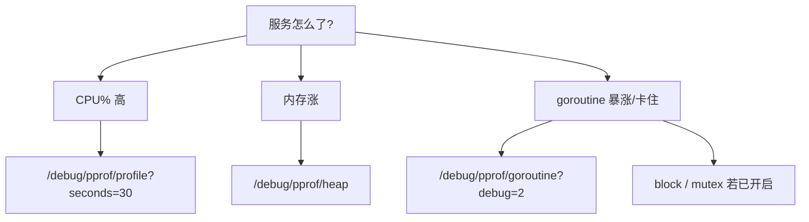
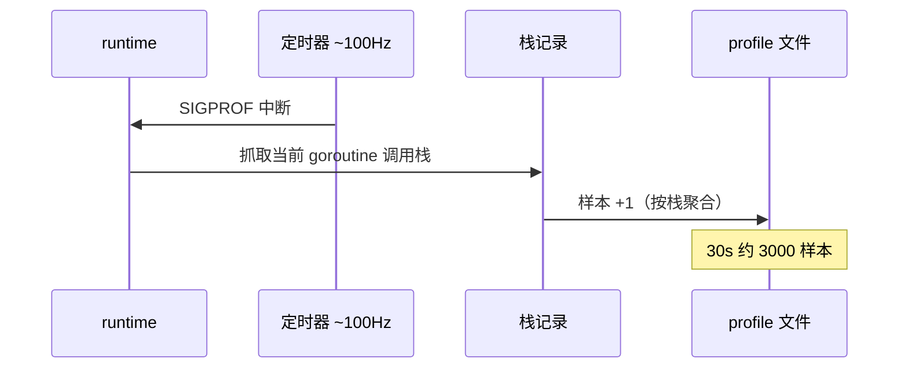
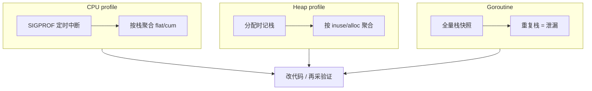

# pprof 与性能排查

> 活动高峰 API P99 从 80ms 飙到 2s：有人 `kill -9` 重启——指标绿了，根因还在；有人 `curl /debug/pprof/profile` 采了 30s，对着 `runtime.mallocgc` 发呆，不会 `list`/`top`。
> **本章回答**：一次 pprof 采样从「怎么开、采什么、怎么存」到「`go tool pprof` 读图定责」——CPU、heap、goroutine 各看什么、各踩什么坑。
> **不讲**：GC 触发与逃逸 → [11](../11-GC内存与逃逸分析/)；GOMAXPROCS 与 cgroup → [12](../12-GOMAXPROCS与容器cgroup/)；HTTP 优雅退出与挂载点细节 → [10](../10-HTTP-Server与优雅退出/)。

**标记**：🎯重点 · 🔥难点 · ⭐常考 · 🔧实操

---

## 面试怎么考

| 标记 | 考点 |
|------|------|
| **核心** | `import _ "net/http/pprof"`；CPU vs heap 语义；`go tool pprof` 的 `top`/`list`/`web` |
| **必会** | `?seconds=30` 采 CPU；heap 的 `inuse` vs `alloc`；goroutine profile 看泄漏栈 |
| **常用** | 生产独立端口或鉴权；`curl -o` 落盘再离线分析；火焰图读「平顶」 |
| **常考** | CPU profile 是采样不是追踪；`alloc_space` vs `inuse_space`；block/mutex 何时开 |

> 📝 **面试（30 秒）**：Go 内置 `runtime/pprof` 和 `net/http/pprof`。CPU 是定时 SIGPROF 采栈，heap 是分配时记栈。线上 `curl localhost:6060/debug/pprof/profile?seconds=30` 落盘，`go tool pprof -http=:0 cpu.prof` 看火焰图——宽的是热点，平顶是忙等或锁。内存涨先看 `inuse_space`，别一上来就怪 GC。

本节对应练习题目录先扫一眼。

---

## 能力边界

> 🎯 **一句话**：pprof 回答「哪段代码在吃 CPU/内存」，不回答「为什么 QPS 掉」。

| 维度 | pprof | `trace` / `fgprof` | 外部 APM |
|------|-------|-------------------|----------|
| **适合** | CPU/内存/阻塞/goroutine 栈归因 | 调度延迟、GC STW 毫秒级时序 | 全链路、业务 span |
| **不适合** | 网络 RTT、磁盘 IO 等内核外因 | 长期低开销常驻（trace 很重） | 替代读源码 |
| **你要会** | 30 秒内拿到可分享的 profile 文件 | 知道何时要 `go tool trace` | 和 Prometheus 指标互证 |

- 🔑 **三层各管各**
  - **metrics（RED/USE）**：告诉你「病了」——CPU%、RSS、P99
  - **pprof**：告诉你「哪段代码在发烧」——栈 + 样本
  - **trace / 抓包 / DB explain**：内核外因、调度时序、慢查询
  - 三者**不能互相替代**

> ⚠️ **别混**：`process_cpu_seconds_total` 高 ≠ `json.Marshal` 一定是热点——要以 profile 为准。

本节对应练习题 Q1。边界清了——最小集。

---

## 语言最小集

> 🎯 **一句话**：认这 10 个零件，就能把线上 profile 从开启采到离线定责。

| 零件 | 示例 | 含义 |
|------|------|------|
| 匿名导入 | `_ "net/http/pprof"` | 副作用注册 `/debug/pprof/*` |
| 独立 ServeMux | `ListenAndServe("127.0.0.1:6060", nil)` | debug 口别绑业务端口 |
| CPU 采集 | `/debug/pprof/profile?seconds=30` | 采 30s 栈样本 |
| Heap 快照 | `/debug/pprof/heap` | 当前堆分配（可 `?debug=1`） |
| Goroutine | `/debug/pprof/goroutine?debug=2` | 全协程栈，泄漏第一刀 |
| Block | `/debug/pprof/block` | channel/sync 阻塞（需先开 rate） |
| Mutex | `/debug/pprof/mutex` | 锁竞争（需 `SetMutexProfileFraction`） |
| 落盘 | `curl -o cpu.prof 'http://...'` | 可离线、可发同事 |
| 分析 | `go tool pprof cpu.prof` | 交互式 REPL |
| Web UI | `go tool pprof -http=:0 cpu.prof` | 火焰图 / 图 / 源码行 |

```go
import (
    _ "net/http/pprof" // 副作用注册到 DefaultServeMux
    "net/http"
)
func main() {
    go func() {
        http.ListenAndServe("127.0.0.1:6060", nil) // ← 只绑 loopback
    }()
    // ... 业务 main
}
```

🔥 CPU profile 大白话：**不是把每条指令录下来**，是按时间抽样「当时 PC 在哪」——短毛刺可能采不着，要拉长采样或换场景复现。

本节对应练习题 Q2。最小集会了——主图。

---

## 一、一张图：一次 pprof 采样的一生 ⭐

> 🎯 **一句话**：选型 → 开启 → 采样 → 导出 → 分析 → 定责，中间不能跳步。


- 📖 **读图**
  - 🚪 左「现象」→ 右「修复」；没 `seconds` 的 CPU、没分清 `inuse`/`alloc` 的 heap，都会修错方向
  - 🩺 监控（CPU%、RSS）决定「要不要走这条线」；pprof 决定「ANALYZE 后该点谁」
  - 🔁 定责后必须**再采一轮**确认 flat 下降（七节）

本节对应练习题 Q1、Q14。主线有了——先选型。

---

## 二、入口：现象决定 profile 选型 🔧

> 🎯 **一句话**：**现象决定 profile 类型**，不是「哪个顺手采哪个」。



- 📖 **读图**
  - 三条分支终点不同：CPU → 采样中断；heap → 分配记录；goroutine → 当前栈快照
  - 别在 CPU 不高时死盯 CPU profile

- 🗺️ **选型口诀**
  - CPU 慢 / 烧核 → **`profile?seconds=30`**
  - 内存涨 / OOM → **`heap`**（先 `inuse_space`）
  - 协程暴涨 / 卡住 → **`goroutine?debug=2`**，必要时 block/mutex
  - ⚠️ 典型错误：CPU 不高却只采 CPU；内存涨却只看 `alloc`

> 📝 **面试**：「线上 CPU 高怎么查？」——先确认是 **CPU bound** 还是 **IO wait**（`top`/`pidstat`），Go 服务再 `profile` 30s，火焰图看**自身代码**宽条，宽在 `runtime` 再往上追业务调用链。⭐（练习题 Q3、Q4）

本节对应练习题 Q3、Q4。选型会了——怎么开。

---

## 三、开启：怎么把 pprof 开起来 ⭐🔧

> 🎯 **一句话**：**`net/http/pprof` + 独立监听**是生产最低配，别把 `/debug/pprof` 裸奔在公网业务口。

### 📮 标准挂载

```go
package main
import (
    "log"
    "net/http"
    _ "net/http/pprof" // 副作用：注册到 DefaultServeMux
)
func main() {
    go func() {
        // 生产：127.0.0.1 或内网 + 鉴权；绝不要 0.0.0.0:8080 与 API 同端口
        log.Println(http.ListenAndServe("127.0.0.1:6060", nil))
    }()
    // runAPIServer()
}
```

- 🔑 **`import _ "net/http/pprof"`** 注册到 `http.DefaultServeMux`，前缀 `/debug/pprof/`：
  - `/` 索引页（列出所有 profile）
  - `/profile` CPU（默认 30s，`?seconds=` 可调）
  - `/heap` · `/goroutine`（`?debug=2` 完整栈）· `/block` · `/mutex` · `/symbol`

### 📁 不用 HTTP：代码里直接写文件

```go
import (
    "os"
    "runtime/pprof"
)
func dumpCPU(path string) error {
    f, err := os.Create(path)
    if err != nil {
        return err
    }
    defer f.Close()
    if err := pprof.StartCPUProfile(f); err != nil {
        return err
    }
    // time.Sleep(...); pprof.StopCPUProfile()
    return nil
}
```

- 适合：**定时任务**、**信号触发**（`SIGUSR1`）、**测试基准**（`testing` 已封装）

> 💡 **打个比方**：HTTP pprof 像医院体检中心——随来随查；`pprof.StartCPUProfile` 像随身心电图——只在怀疑发作的 30 秒打开。

> ⚠️ **别混**：`ListenAndServe(":6060", nil)` 用的是 **DefaultServeMux**；业务若也 `http.Handle` 到 Default，**路由会混**——更干净的是独立 `ServeMux` 手动注册，或单独进程。

本节对应练习题 Q5。开启会了——CPU 采样原理。

---

## 四、采样：CPU profile 原理 🔥⭐

> 🎯 **一句话**：CPU profile 是 **SIGPROF 定时中断采栈**（约 100Hz），统计「时间花在哪些调用栈上」，不是每条语句的执行次数。

### ⏱️ 采样过程



- 📖 **读图**
  - 每个样本 =「此刻 CPU 在执行哪条栈」；聚合后 `flat` = 自身，`cum` = 含子调用
  - 忙等（空转 `for`）也会占样本——火焰图上**平顶**常见

#### ❓ 为什么是采样不是追踪？

- 📡 **全量追踪**每条指令 → 开销会把业务拖垮，profile 自己变成热点
- 🎲 **~100Hz 抽样**在统计意义上足够定热点；短于 **10s** 易受毛刺影响
- 🔧 `runtime.SetCPUProfileRate(hz)` 可调，生产别乱调——调到 1000Hz 时样本里会出现 pprof 自己的栈
- ⚠️ **多核**要采够时长覆盖所有 P；不能替代 `go tool trace` 看调度延迟

### 📐 flat 与 cum 怎么算 🔥

一条栈 `main → encode → json.Marshal → runtime.mallocgc` 出现 100 次：

```text
main           cum=3000（全部）   flat=10（自身几乎不烧）
  -> encode    cum=2500           flat=50
    -> json.Marshal cum=2000     flat=820   # ← flat 高，自身烧 CPU
      -> mallocgc cum=410        flat=410   # ← 子函数，减调用次数才降
```

- 📖 **读图**
  - 优化 `json.Marshal` 的 flat → 改它内部实现
  - 优化 `mallocgc` 的 flat → 减少**分配次数**（谁调了 Marshal 就少分配）
  - 两条路径改法不同——这就是 flat vs cum 的实战意义

#### ❓ 为什么对着 `runtime.mallocgc` 发呆没用？

- `mallocgc` 高 = **分配多**，不是「GC 坏了」
- ✅ 下一步：`list` 看谁调它，或转 **heap profile** 看分配栈
- ❌ 只盯 `runtime.*` 宽条、不往上追业务帧 → 开篇那个现场

### 🔧 采集命令

```bash
curl -s 'http://127.0.0.1:6060/debug/pprof/profile?seconds=30' -o cpu-$(date +%H%M).prof
file cpu-1430.prof
# cpu-1430.prof: gzip compressed data   # ← pprof 格式常是 gzip

go tool pprof -top cpu-1430.prof
# Showing nodes accounting for 2.10s, 95% of 2.21s total
# flat  flat%   sum%        cum   cum%
# 0.82s 37.10% 37.10%      1.95s 88.24%  encoding/json.Marshal
# 0.41s 18.55% 55.66%      0.41s 18.55%  runtime.mallocgc   # ← 分配多，转 heap
```

- 🔍 **读输出**：`flat` 高 = 函数**自己**烧 CPU；`cum` 高要 `list` 看**谁调用**它

> ⚠️ **别混**：`go test -cpuprofile` 和线上 `profile` **格式相同**，分析命令一样；但测试负载 ≠ 生产负载，**别用单测 profile 代表线上**。

> 📝 **面试**：「CPU profile 准确吗？」——统计意义上足够定热点；短于 10s 易受毛刺；多核要采够时长；不能替代 trace。⭐（练习题 Q6）

本节对应练习题 Q6。CPU 懂了——看 heap。

---

## 五、内存：heap profile 的 inuse 与 alloc 🔥⭐

> 🎯 **一句话**：**`inuse_space` = 此刻还活在堆上**；**`alloc_space` = 历史上分配过多少（含已释放）**——泄漏查 inuse，分配压力查 alloc。

### 📊 四种常用视角

| 模式 | 含义 | 何时用 |
|------|------|--------|
| `inuse_space` | 当前堆上字节 | OOM、RSS 涨 |
| `inuse_objects` | 当前对象个数 | 小对象泄漏 |
| `alloc_space` | 累计分配字节 | GC 压力、热点分配 |
| `alloc_objects` | 累计分配次数 | 高频 `new` |

```bash
curl -s 'http://127.0.0.1:6060/debug/pprof/heap' -o heap.prof
go tool pprof -sample_index=inuse_space -top heap.prof
#      flat  flat%   sum%        cum   cum%
#  512.10MB 62.01% 62.01%   512.10MB 62.01%  bytes.(*Buffer).Grow  # ← 嫌疑栈
```

```bash
curl -s 'http://127.0.0.1:6060/debug/pprof/heap?debug=1' | head -40
# # heap profile: 847: 120340232 [1923: 280451120] @ heap/1048576
# #   1: 67108864 [1: 67108864] @ 0x... 0x... main.leakyCache
#         ^ inuse_bytes  ^ alloc_count   # ← 行首是 inuse，括号里是 alloc 累计
```

- 📖 **读图**：`debug=1` 行里 inuse 与 `@` 后栈指向**谁还在持有**；间隔 5 分钟比两次快照，inuse 只增不减 = 泄漏嫌疑

#### ❓ 为什么 `alloc` 大不等于泄漏？

> 💡 **打个比方**：`alloc` 像「这辈子一共买过多少碗面」；`inuse` 像「冰箱里现在还剩几碗」——吃得多不一定胖，剩得多才占地方。

- ❌ `alloc_space` 只增不减是**正常的**（累计指标）
- ✅ 泄漏验证看 **`inuse` 是否随时间只增不减**
- 🔁 单次 heap 只能看「此刻谁占得多」——占得多也可能只是缓存大

```bash
curl -s 'http://127.0.0.1:6060/debug/pprof/heap' -o heap1.prof
# 等 5 分钟
curl -s 'http://127.0.0.1:6060/debug/pprof/heap' -o heap2.prof
go tool pprof -base heap1.prof -sample_index=inuse_space heap2.prof
# ← 显示「5 分钟内 inuse 增长最多的栈」——泄漏嫌疑
```

- 两次 inuse 差不多、不随时间涨 → **缓存常驻**，不是泄漏
- 每次都涨且不回落 → **泄漏**

> 🔥 **难点**：slice 底层数组、`[]byte` 池化不当、`sync.Pool` 对象被长期引用，都会显示为某次 `append`/`make` 的栈——要 **`list` + 看业务是否仍引用**（逃逸与 Pool → [11](../11-GC内存与逃逸分析/)）。

本节对应练习题 Q7、Q8。heap 懂了——协程阻塞。

---

## 六、协程与阻塞：goroutine / block / mutex ⭐🔧

> 🎯 **一句话**：**goroutine profile 是当前栈快照**；block/mutex 要**事先开启采样率**，否则端点是空的。

### 🧵 Goroutine 泄漏

```bash
curl -s 'http://127.0.0.1:6060/debug/pprof/goroutine?debug=2' -o gor.txt
grep -c '^goroutine' gor.txt
# 48291   # ← 上万就要警惕

grep -A2 'chan receive' gor.txt | head -20
# goroutine 412 [chan receive]:
# main.worker(...)
#     /app/worker.go:88   # ← 同一栈重复上万次 = 泄漏
```

- 📖 **读图**：同一栈重复成千上万次 = **泄漏**；`chan receive` / `select` 死等 / `context` 未 cancel 是三大经典

- 👻 **三大经典泄漏根因**（面试要能按名字点）
  - **context 未 cancel**：请求超时后 goroutine 还在等永远不来的 channel → 所有 goroutine `select` 听 `ctx.Done()`
  - **consumer 未退出**：shutdown 没 `close(chan)`，worker 永久 `chan receive` → shutdown 时 close
  - **time.Ticker 未 Stop**：每次请求 `NewTicker` 不 `Stop` → `defer ticker.Stop()`

#### ❓ 为什么 goroutine 多 ≠ 泄漏？

- 高并发服务常驻数万 goroutine **可能正常**
- ✅ 看是否**随负载回落**、栈是否卡在**同一业务行**
- ❌ 只看 `NumGoroutine()` 绝对值就喊泄漏 → 误杀

### 🔒 开启 block / mutex

```go
import "runtime"
func init() {
    runtime.SetBlockProfileRate(1)     // 记录阻塞 >1ns（生产可设更大降开销）
    runtime.SetMutexProfileFraction(5) // 每 5 次锁竞争记 1 次
}
```

```bash
curl -s 'http://127.0.0.1:6060/debug/pprof/block' -o block.prof
go tool pprof -top block.prof
# sync.(*Mutex).Lock   # ← 锁竞争热点
# runtime.chanrecv      # ← channel 阻塞热点
```

#### ❓ 为什么 block / mutex 默认是空的？

- 默认 **未采样**——避免常驻开销
- ✅ 必须先 `SetBlockProfileRate` / `SetMutexProfileFraction`，再 curl 端点
- 🔍 下载了文件但 `top` 全空 → 先查是否开了 rate，不是 curl 错了

> 📝 **面试**：「怎么查 goroutine 泄漏？」——`goroutine?debug=2` 看重复栈；修 **context 取消**、**consumer 退出**、**timer 未 Stop**。⭐（练习题 Q9、Q10）

本节对应练习题 Q9、Q10。协程会了——读火焰图。

---

## 七、读图：go tool pprof 与火焰图 🔥⭐

> 🎯 **一句话**：**`top` 找嫌疑人 → `list` 看行号 → `-http` 看火焰图 → 改代码再采一轮对比**。

### 🖥️ 交互命令

```text
go tool pprof cpu.prof
(pprof) top10          # 按 flat 排序，前 10 热点
(pprof) list Marshal   # 正则匹配函数，带源码行占比
(pprof) web            # 需要 graphviz；调用图
(pprof) peek json      # 谁调用 json（上游）
(pprof) disasm regexp.Compile  # 汇编级（少见）
```

```bash
go tool pprof -http=127.0.0.1:0 cpu.prof
# 浏览器打开后：View -> Flame Graph
```

### 🔥 火焰图读法

> 💡 **打个比方**：横轴是 CPU **时间占比**（不是时间线！），纵轴是调用栈深度。越宽越吃 CPU；「平顶」= 一块特别宽但上面没叠多少层——函数自己在烧。

```text
  宽 = 该栈样本占比大 = CPU 热点
  平顶 = 长时间占 CPU 的单函数（忙等、正则灾难、加密）
  尖塔深 = 调用链深，看最宽的那层才是优化目标
  runtime.* 宽 -> 往上看业务谁触发（分配、锁、反射）
  encoding/json 宽 -> list 看哪一行 Marshal
  regexp 平顶 -> 灾难性回溯或超大正则
```

- 🔑 **常见宽条**
  - `encoding/json` → `list Marshal`
  - `regexp` 平顶 → 灾难性回溯
  - `runtime.mallocgc` → 转 heap 看谁分配
  - `runtime.scanobject` → 堆对象多，可能泄漏
  - `sync.(*Mutex).Lock` → 开 mutex profile

#### ❓ 为什么 flat 高和 cum 高改法不同？

- **flat 高** → 优化函数**内部**（换算法、减循环）
- **cum 高但 flat 低** → 热量在下游 → `list` 往下追到 flat 最高的那个
- ❌ 「cum 高就改这个函数」→ 可能改错层

```bash
go tool pprof -base cpu-before.prof cpu-after.prof
# 看优化后相对 baseline 的增量；发布前后各采 30s
```

### 收束：pprof 凭什么能定责



- 📖 **读图**
  - 三类共用「**样本 + 调用栈**」；差别在**触发时机**——CPU 靠中断、heap 靠分配钩子、goroutine 靠快照
  - 定责后必须**再采一轮**确认 flat 下降，别凭感觉

> ⚠️ **别混**：pprof **不保证**找到 IO 等待、外部 DB 慢——那时 CPU profile 会「看起来很空」，要靠 **trace、日志、DB explain**。

> 📝 **面试**：改完必须再采一轮确认 flat 下降。⭐（练习题 Q11、Q12）

本节对应练习题 Q11、Q12。读图会了——采集传输。

---

## 八、采集与传输：从 Pod 到本地 🔧

> 🎯 **一句话**：**profile 是二进制（常 gzip）**，`curl -o` 落盘最稳；K8s 里 `kubectl port-forward` 再 curl，别在浏览器里直接打开大 profile。

```bash
PPROF=http://127.0.0.1:6060
STAMP=$(date +%Y%m%d-%H%M%S)
mkdir -p "/tmp/pprof-$STAMP" && cd "/tmp/pprof-$STAMP"
curl -s "$PPROF/debug/pprof/profile?seconds=30" -o cpu.prof
curl -s "$PPROF/debug/pprof/heap" -o heap.prof
curl -s "$PPROF/debug/pprof/goroutine?debug=2" -o goroutine.txt
ls -lh
# -rw-r--r-- 1 ops ops  45K cpu.prof
# -rw-r--r-- 1 ops ops  12K heap.prof
# -rw-r--r-- 1 ops ops 2.1M goroutine.txt   # ← 泄漏时文本会很大
```

- 🔑 **K8s 要点**
  - 常用 `kubectl port-forward pod/app-xxx 6060:6060` 再 curl
  - **别**把 6060 做成 Service 公网暴露
  - 长采 30s 期间隧道断了要重采——先 `curl /debug/pprof/` 确认连通
  - 多副本各采一份：同栈 = 代码热点；不同栈 = 可能流量倾斜

> 🔍 **现场**：`curl` 一直不返回？——CPU profile 默认采满 `seconds` 才结束，**不是 hang**；heap/goroutine 应立即返回。

本节对应练习题 Q13。采集会了——生产安全。

---

## 九、生产安全：pprof 暴露的管控 ⭐

> 🎯 **一句话**：pprof 暴露**堆栈、内存布局、内部路径**，按生产密钥级别管控。

- 🛡️ **三种安全做法**
  - **独立端口 + loopback**：`ListenAndServe("127.0.0.1:6060", nil)` + `kubectl port-forward`
  - **内网 + Bearer 鉴权**：middleware 校验 `Authorization`，不与公网 API 同端口
  - **不暴露到 Ingress**：6060 不配 Service / Ingress，NetworkPolicy 限运维网段

```go
func pprofHandler(token string) http.Handler {
    mux := http.DefaultServeMux
    if token == "" {
        return mux
    }
    return http.HandlerFunc(func(w http.ResponseWriter, r *http.Request) {
        if r.Header.Get("Authorization") != "Bearer "+token {
            http.Error(w, "forbidden", http.StatusForbidden)
            return
        }
        mux.ServeHTTP(w, r)
    })
}
```

#### ❓ 为什么不能和业务 API 同端口裸奔？

- **heap** → 对象内容/布局画像；**goroutine** → 源码地图；**CPU** → 性能画像；**symbol** → 反查函数名
- 扫描工具会自动尝试 `/debug/pprof/`——别靠「改大端口」或「没人知道路径」
- 安全靠**网络隔离 + 鉴权**，不靠端口复用（`SO_REUSEADDR` 与此无关 → [13](../../../01-基础底座/13-TCP与UDP/)）

> 📝 **面试**：生产暴露 =「独立端口 + loopback / 内网鉴权，K8s 用 port-forward 不走 Ingress」；补一句「属于敏感调试面」。⭐

本节对应练习题 Q13。安全钉死——踩坑。

---

## 十、踩坑清单

> 🎯 **一句话**：这些坑每个浪费 30 分钟——提前知道就能跳过。

| 现象 | 原因 | 修法 |
|------|------|------|
| `curl profile` 无响应 30s | 正常，采满才返回 | 耐心等待或缩短 `seconds` |
| heap 巨大但 RSS 一般 | mmap、栈、CGO 不在 heap | 结合 `GODEBUG=gctrace=1`、系统 RSS |
| top 全是 `runtime` | 样本在底层 | `traces` 往上看业务 |
| block 为空 | 未 `SetBlockProfileRate` | init 里开启 |
| 火焰图打不开 | 无 graphviz | 用 `-http` 内置 UI |
| 采完 CPU 更高 | profiling 自身开销 | 缩短时长、非高峰采 |
| 火焰图全是十六进制 | `-ldflags="-s -w"` strip 符号 | 用 `-ldflags="-w"` 保留符号表 |
| 多副本 profile 不同 | 流量倾斜或负载不均 | 查负载均衡和 Pod 分布 |

> 🔍 **现场**：火焰图全是 `0x4012f8`？——生产镜像 strip 了符号表。改用 `-ldflags="-w"`（去 DWARF、留符号），pprof 能读函数名。

本节对应练习题 Q6、Q8。踩坑钉死——收口。

---

**回到开头那个现场**：kill -9、对着 mallocgc 发呆。正确剧本：按现象选 profile → 安全暴露抓包 → `top/list/web` 定业务帧 → 再改代码。群里那句「重启一下」，你知道该怎么拦住他了。

## 十一、收口

### 命令速查 🔧

```bash
curl -s 'http://127.0.0.1:6060/debug/pprof/profile?seconds=30' -o cpu.prof
curl -s 'http://127.0.0.1:6060/debug/pprof/heap' -o heap.prof
curl -s 'http://127.0.0.1:6060/debug/pprof/goroutine?debug=2' -o gor.txt
go tool pprof -http=127.0.0.1:0 cpu.prof
go tool pprof -sample_index=inuse_space -top heap.prof
go tool pprof -base cpu-before.prof cpu-after.prof
```

### 面试锚点

| 问 | 30 秒答 |
|----|---------|
| 怎么开 pprof？ | `_ "net/http/pprof"` + 独立端口；或 `StartCPUProfile` 写文件 |
| CPU profile 原理？ | SIGPROF 定时中断采栈，约 100Hz，聚合占比 |
| inuse vs alloc？ | inuse 当前存活；alloc 历史累计。泄漏查 inuse |
| goroutine 泄漏？ | `goroutine?debug=2` 看重复栈；修 cancel/退出/timer Stop |
| flat vs cum？ | flat 自身；cum 含子调用。cum 高要 list 往下追 |
| 火焰图怎么读？ | 宽 = 热点；平顶 = 单函数忙等；runtime 宽往上看业务 |
| block 为空？ | 默认未开 `SetBlockProfileRate`；init 里设 |
| CPU profile 空但 P99 高？ | 可能 IO wait / 锁等待；看 goroutine + trace |
| 生产暴露 pprof？ | 独立端口 + loopback / 鉴权；不与公网 API 同端口 |

### 易错一句话对照

- 错：CPU 高就看 heap → 对：先 **CPU profile** 30s
- 错：`alloc` 大就是泄漏 → 对：看 **inuse** 是否只增不减
- 错：pprof 挂业务 0.0.0.0:8080 → 对：**独立端口 + loopback / 鉴权**
- 错：采 3 秒就够 → 对：生产至少 **30s**
- 错：重启后再查 → 对：**先落盘 profile 再重启**
- 错：goroutine 多就是泄漏 → 对：看是否随负载回落
- 错：flat 高就优化函数 → 对：cum 高要 list 追下游
- 错：CPU profile 空就是没问题 → 对：可能是 IO wait，看 goroutine + trace
- 错：block 下载就有数据 → 对：需先 `SetBlockProfileRate`

### 数字墙

> CPU profile 约 **100Hz** · 生产采集推荐 **30s** · heap 四种 sample_index：**inuse/alloc × space/objects** · 社区惯例 debug 端口 **6060** · `SetBlockProfileRate(1)` 记 >**1ns** 阻塞 · `SetMutexProfileFraction(5)` 每 **5** 次记 **1** 次 · 短于 **10s** 的 CPU 采样易受毛刺

本节对应练习题 Q1～Q14。

---

## 合上书

- [ ] **默画**「一次 pprof 采样的一生」：选型 → 开启 → 采样 → 导出 → 分析 → 定责，标出 CPU/heap/goroutine 三分支
- [ ] **口述** `import _ "net/http/pprof"` 注册了哪些路径，为什么建议独立端口
- [ ] **口述** CPU profile 是 **SIGPROF 采样**不是追踪，约 **100Hz**，生产至少采 **30s**
- [ ] **背**四种 heap 模式（inuse/alloc × space/objects），OOM 时先用 **inuse_space**
- [ ] **演示** `curl profile?seconds=30` + `go tool pprof -http` 完整命令链
- [ ] **解释** `flat` 与 `cum`，各举一种优化策略
- [ ] **读**一段 `goroutine?debug=2` 输出，指出泄漏栈特征（同一栈重复上万次）
- [ ] **说明** block/mutex 为什么默认是空的
- [ ] **说**一个「metrics 高但 pprof 空」的场景（IO wait）及下一步
- [ ] **列举**两个生产暴露 pprof 的安全做法

下一章：[14](../14-CLI与Prometheus指标/)。GC 与逃逸 → [11](../11-GC内存与逃逸分析/)；GOMAXPROCS 与 cgroup → [12](../12-GOMAXPROCS与容器cgroup/)。
