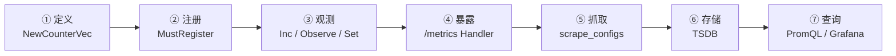
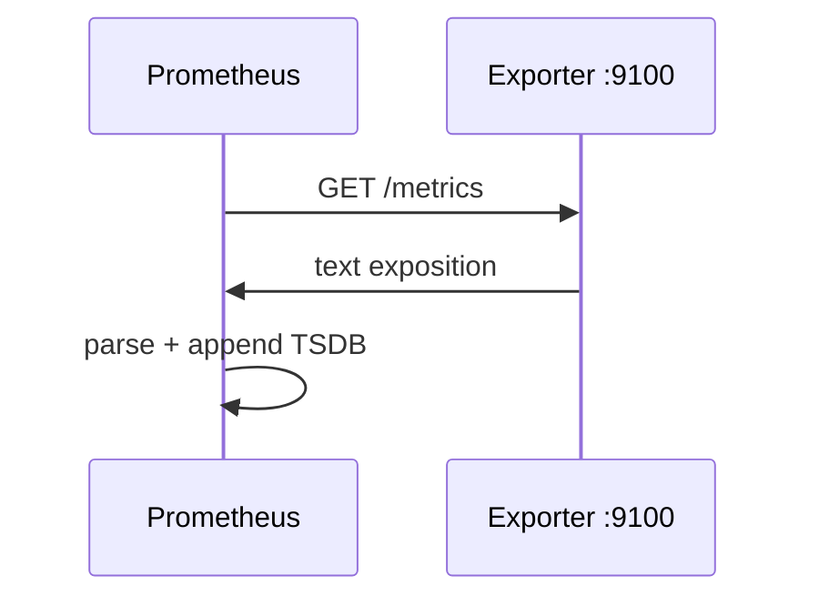
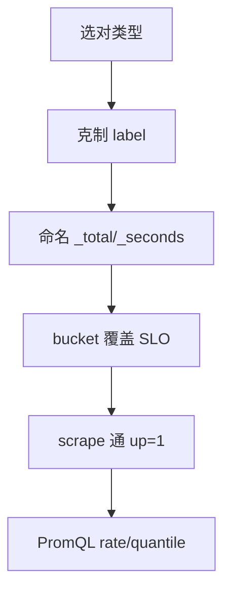
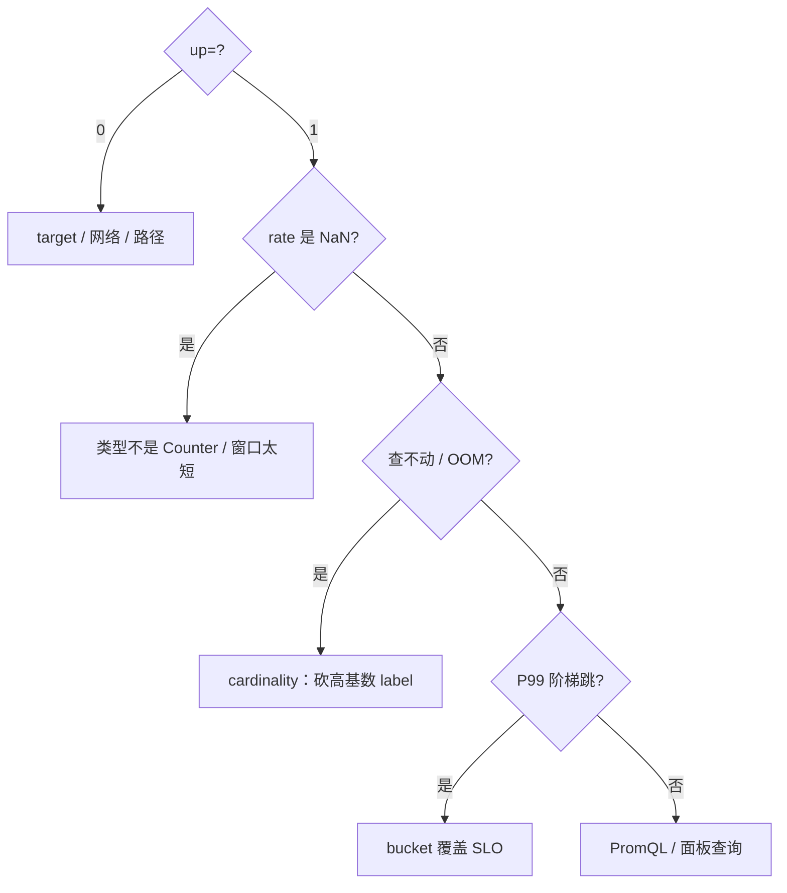

# 14｜CLI 与 Prometheus 指标 · SRE 开发能力

> 值班写了个 `game-exporter`：本机 `curl /metrics` 通，Prometheus 却 `up=0`；好不容易 scrape 到了，Grafana 全是 `NaN`——有人 Counter 用 Gauge 记、Histogram 没配 bucket、有人把 `user_id` 打进 label 把 cardinality 打爆。群里三个人分别喊「改 Grafana」「加大 scrape」「先重启 Prometheus」。
> **本章回答**：一个指标从 `NewCounter` → 注册 → Inc/Observe → `/metrics` 暴露 → scrape → PromQL/Grafana 的一生——CLI 怎么搭、四类指标怎么选、label 怎么克制。
> **不讲**：告警规则与降噪 → [09-03](../../../09-可观测性与SRE方法论/03-告警设计与降噪/)；RED/USE 总览 → [01-21](../../../01-基础底座/21-性能方法论-USE与RED/)；pprof 性能栈 → [13](../13-pprof与性能排查/)。

**标记**：🎯重点 · 🔥难点 · ⭐常考 · 🔧实操

---

## 面试怎么考

| 标记 | 考点 |
|------|------|
| **核心** | Counter/Gauge/Histogram/Summary；`promhttp.Handler()`；`MustRegister` |
| **必会** | Histogram `bucket` 与 `_bucket` 序列；label 基数；`rate()` / `histogram_quantile()` |
| **常用** | cobra 子命令 + `version`；`/metrics` 独立端口；`MustRegister` vs `Register` |
| **常考** | Counter 只能增；为何不用 Summary 做全局分位；Pull 与 Pushgateway 边界 |

> 📝 **面试（30 秒）**：client_golang 定义指标 → `MustRegister` → HTTP 挂 `promhttp.Handler()`。Counter 记累计、Gauge 记瞬时、Histogram 配 bucket 算 P99。label 只放低基数（method、code），绝不放 `user_id`。Prometheus scrape `/metrics`；PromQL 用 `rate(...[5m])` 与 `histogram_quantile(0.99, sum(rate(..._bucket[5m])) by (le))`。

---

## 能力边界

| 维度 | Go Exporter + Pull | Pushgateway | 日志打点 |
|------|-------------------|-------------|---------|
| **适合** | 长驻服务、K8s Pod | 短任务一次性 push | 排障细节、审计 |
| **不适合** | 进程秒退且无人 scrape | 替代服务常驻指标 | 做 SLO 分母 |
| **你要会** | 写可 scrape 的 `/metrics` | 批作业才用 push | 指标与日志分工 |

- 🔑 **各管一段**
  - Pull：长驻进程等人来拉——**不**解决短任务「没人 scrape」
  - Pushgateway：批作业终点站——**不**当通用指标中转
  - 日志/追踪：高基数细节——**不**进 label

> ⚠️ **别混**：`up=1` 只证明 scrape 成功，不证明业务健康；Grafana 全 NaN 先查类型/`rate` 窗口，别先改面板。

本节对应练习题 Q1。边界清了——最小集。

---

## 语言最小集

读懂 / 写出 cobra + client_golang，认这些零件：

| 零件 | 示例 | 含义 |
|------|------|------|
| `cobra.Command` | `Use` / `RunE` | 子命令容器 |
| `NewCounter` / `NewGauge` / `NewHistogram` | `CounterOpts{Name, Help}` | 三类核心构造器 |
| `NewCounterVec` | `WithLabelValues(...).Inc()` | 带 label 的指标族 |
| `MustRegister` | `init` 里一次 | 注册到默认 Registry |
| `promhttp.Handler()` | `mux.Handle("/metrics", …)` | exposition 文本 |
| `testutil.ToFloat64` | 单元测试读当前值 | 不依赖 scrape |

```go
var requestsTotal = prometheus.NewCounterVec(
    prometheus.CounterOpts{
        Name: "http_requests_total",
        Help: "Total HTTP requests",
    },
    []string{"method", "code"}, // ← 只放低基数枚举
)
```

- 🧩 **四行钉子**
  - Counter 名以 `_total` 结尾 → Gauge 别冒充
  - `init` 里 `MustRegister` 一次 → 测试用独立 Registry
  - `/metrics` 用 `promhttp.Handler` → 与 `/health` 分开
  - label 枚举化 → 禁止 `user_id` / `trace_id`

零件认完，上主图。

---

## 一、一张图：一个指标的一生 ⭐🔥

> 🎯 **一句话**：代码里**定义 + 注册** → 运行时 **Inc/Observe** → HTTP **暴露** → Prometheus **scrape** → TSDB **存** → Grafana **查**。



- 📖 **读图**
  - 🛤️ 左 ①～④ 是**进程内**；右 ⑤～⑦ 是**监控平台**。断在 ④→⑤ 多半是网络/`up`/路径；断在 ⑦ 多半是类型错或 PromQL 错
  - 🔪 开篇三种病：`up=0` → ⑤；`NaN` → ①选型/`rate`；cardinality 爆炸 → ③ label（Q1、Q14）

本节对应练习题 Q1、Q14。主线有了——先定入口形态。

---

## 二、入口：cobra CLI 还是 Exporter ⭐🔧

> 🎯 **一句话**：**常驻 = Exporter pull**；**跑完就退 = cobra CLI**，指标可选 sidecar 或 Pushgateway。

### 📮 cobra 骨架

同一二进制既能 `hallctl sync` 跑一次性任务，也能 `hallctl serve` 常驻当 exporter：

```go
var rootCmd = &cobra.Command{Use: "hallctl", Short: "Hall ops CLI"}

var versionCmd = &cobra.Command{
    Use: "version",
    Run: func(cmd *cobra.Command, args []string) {
        fmt.Println(Version, Commit, BuildDate) // ← -ldflags 注入，见 [15](../15-编译交付与读源码/)
    },
}

var serveCmd = &cobra.Command{
    Use: "serve",
    RunE: func(cmd *cobra.Command, args []string) error {
        reg := prometheus.NewRegistry()
        reg.MustRegister(requestsTotal)
        mux := http.NewServeMux()
        mux.Handle("/metrics", promhttp.HandlerFor(reg, promhttp.HandlerOpts{}))
        return http.ListenAndServe(":9100", mux) // ← 常驻暴露
    },
}

func init() {
    rootCmd.AddCommand(versionCmd, serveCmd)
}
```

```bash
./hallctl version
# hallctl 1.4.2 commit=abc123 2026-09-01   ← 发布核对

./hallctl serve --listen :9100
# listening on :9100                          ← 等人 scrape
```

#### ❓ 为什么用 `RunE` 而不是 `Run`？

- 🔥 `RunE` 返回 `error`——cobra 打印错误并以**非零码**退出；`Run` 里 panic 可能被吞成「看起来成功」
- ✅ 生产子命令一律 `RunE`；`version` 这种零失败路径用 `Run` 可以

> 📝 **面试**：「为什么 CLI 还要 metrics？」——**同一二进制**既能一次性任务也能常驻 exporter；版本走 `version` 子命令方便发布核对。⭐（Q3）

本节对应练习题 Q3。入口清了——四类指标怎么挑。

---

## 三、选型：四类指标怎么挑 🎯⭐

> 🎯 **一句话**：**Counter 只增**；**Gauge 可增可减**；**Histogram 分桶**；**Summary 客户端分位（少用）**。

| 类型 | Go API | 语义 | 典型 |
|------|--------|------|------|
| Counter | `Counter` / `CounterVec` | 只增（重启归零） | `requests_total` |
| Gauge | `Gauge` / `GaugeVec` | 瞬时可上下 | `queue_depth` |
| Histogram | `HistogramVec` + `Buckets` | `_bucket`/`_sum`/`_count` | 延迟、大小 |
| Summary | `SummaryVec` + `Objectives` | 客户端分位 | 旧代码 |

> 💡 **打个比方**：Counter 像里程表只往前滚；Gauge 像油箱指针可升可降；Histogram 像把延迟扔进不同抽屉数个数——服务端按桶插值算分位；Summary 像自己边数边报，但只能报**本实例**。

```go
requestDuration := prometheus.NewHistogramVec(
    prometheus.HistogramOpts{
        Name:    "http_request_duration_seconds",
        Help:    "Request latency",
        Buckets: prometheus.DefBuckets, // ← [.005 … 10]
    },
    []string{"method", "handler"},
)
```

#### ❓ 为什么「当前连接数」不能用 Counter？

- 🔥 Counter **没有** `Set`/`Dec`——断开连接要减，只能用 Gauge
- ✅ **两件套**：当前连接数 → Gauge；累计建连次数 → 另设 Counter
- 📛 命名：Counter 以 **`_total`** 结尾；Gauge **不要** `_total`——否则有人 `rate()` 算出 NaN

> ⚠️ **别混**：把「当前连接数」记成 Counter 是经典错题；口诀「Counter 只增；Gauge 可上可下；Histogram 看分布」。

本节对应练习题 Q4、Q5。选型会了——注册。

---

## 四、注册：MustRegister 与 Registry ⭐

> 🎯 **一句话**：`MustRegister` 在 `init` 调一次；测试用新 Registry 隔离；`Register` 返回 error 不 panic。

```go
func init() {
    prometheus.MustRegister(requestsTotal, requestDuration)
}

// 自定义 Registry：隔离或不想带默认 go_* 运行时指标
reg := prometheus.NewRegistry()
reg.MustRegister(collectors.NewGoCollector()) // ← 可选
reg.MustRegister(requestsTotal)
```

#### ❓ 为什么测试里 `MustRegister` 会 panic？

- 🔥 默认 Registry **进程级单例**——第二个 `TestXxx` 再注册同名 → `duplicate collector`
- ✅ 每个测试 `prometheus.NewRegistry()` + `reg.MustRegister`；或测完前不要污染全局
- 🛠️ `MustRegister` = `Register` + panic；生产用 Must（出错该立刻暴露）；想断言错误本身时用 `Register`

```go
func TestHandler(t *testing.T) {
    reg := prometheus.NewRegistry()
    c := prometheus.NewCounter(prometheus.CounterOpts{Name: "test_total"})
    reg.MustRegister(c) // ← 独立，互不干扰
}
```

> ⚠️ **别混**：`promauto` 在 `init` 自动 MustRegister，适合单例服务；**测试仍要隔离**。

本节对应练习题 Q6。注册会了——打点。

---

## 五、打点：Observe 与 label 纪律 🔥⭐🔧

> 🎯 **一句话**：在请求入口/出口打点；defer 记延迟；label 值用**枚举**，不用原始 ID。

### 🧵 中间件打点

```go
func metricsMiddleware(next http.Handler) http.Handler {
    return http.HandlerFunc(func(w http.ResponseWriter, r *http.Request) {
        start := time.Now()
        sw := &statusWriter{ResponseWriter: w, code: 200}
        next.ServeHTTP(sw, r)
        requestsTotal.WithLabelValues(r.Method, strconv.Itoa(sw.code)).Inc()
        requestDuration.WithLabelValues(r.Method, r.URL.Path).Observe(
            time.Since(start).Seconds()) // ← Histogram，单位 seconds
    })
}
```

- ⚠️ 上例 `r.URL.Path` 若含 `/user/8374921` → **立刻高基数**；生产应换成路由模板 `/user/:id`

### 💣 label 纪律：cardinality 是监控事故

```text
OK     method=GET|POST    code=200|500    handler=/api/login
BAD    user_id=8374921    trace_id=abc-xyz    每秒变的 pod 名
```

#### ❓ 为什么 `user_id` 不能当 label？

- 🔥 每个唯一 label 组合 = **一条时间序列**；百万 user → 内存翻倍、查询超时、甚至 OOM
- ✅ 高基数进日志/追踪；指标只留低维聚合。`/api/user/8374921` 当 handler 也不行——规范为 `/api/user/:id`
- 🔍 现场数序列：

```bash
curl -s localhost:9100/metrics | grep -c '^http_requests'
# 12        ← method×code，正常
# 837421    ← user_id 全打进去了，爆炸
```

> 📝 **面试**：cardinality 爆炸 = **监控事故**，不是「Prometheus 慢」。修法：砍高基数 label，别先加机器。⭐（Q7）

### 📏 Histogram bucket 怎么选 🔧

```go
// DefBuckets 未必适合游戏 API
Buckets: prometheus.DefBuckets,
// [.005, .01, .025, .05, .1, .25, .5, 1, 2.5, 5, 10]

// 大部分 <100ms，尾延迟 500ms~2s — 覆盖 SLO 边界
Buckets: []float64{0.01, 0.05, 0.1, 0.25, 0.5, 1, 2.5, 5, 10},
```

#### ❓ 为什么 P99 会「贴到 bucket 边界」像阶梯？

- 🔥 `histogram_quantile` 在相邻桶间**线性插值**；桶太稀 → 估值贴边界，看起来像阶梯——常是插值误差，不是真延迟
- ✅ bucket **覆盖 SLO 边界**（如 100ms）；游戏 API 别盲用 `DefBuckets` 的稀间距
- 🔍 Grafana P99 线总跳到固定值 → 先查桶，再查业务

本节对应练习题 Q7、Q8。打点会了——暴露。

---

## 六、暴露：promhttp 与 exposition format ⭐🔧

> 🎯 **一句话**：`promhttp.Handler()` 把 Registry 编成 **Prometheus exposition** 文本，每行一个样本。

```bash
curl -s localhost:9100/metrics | head -20
# HELP http_requests_total Total HTTP requests
# TYPE http_requests_total counter
http_requests_total{code="200",method="GET"} 12847
# TYPE http_request_duration_seconds histogram
http_request_duration_seconds_bucket{handler="/health",method="GET",le="0.005"} 12001
http_request_duration_seconds_bucket{handler="/health",method="GET",le="+Inf"} 12847
http_request_duration_seconds_sum{handler="/health",method="GET"} 42.3
http_request_duration_seconds_count{handler="/health",method="GET"} 12847
```

- 📖 **读图**
  - `TYPE` 声明类型；Histogram 必有 `_bucket{le=…}`、`_sum`、`_count`
  - `+Inf` bucket **必须存在**且等于 `_count`——缺了 `histogram_quantile` 会歪

```go
mux.HandleFunc("/health", func(w http.ResponseWriter, _ *http.Request) { w.WriteHeader(200) })
mux.Handle("/metrics", promhttp.Handler()) // ← 默认 Registry
// 或：promhttp.HandlerFor(reg, promhttp.HandlerOpts{})
```

> 🔍 **现场**：本机 `curl` 有 HELP/TYPE，Prometheus `up=0`——查 **target 地址、端口、DNS、TLS、NetworkPolicy**，不是 Go 代码。本机通只证明进程活着。

本节对应练习题 Q9。暴露会了——谁来拉。

---

## 七、抓取：Pull vs Pushgateway ⭐

> 🎯 **一句话**：Prometheus **主动拉** `/metrics`，`scrape_interval` 定分辨率；短生命周期任务才 push 到 Pushgateway。

```yaml
scrape_configs:
  - job_name: hall-exporter
    scrape_interval: 15s
    static_configs:
      - targets: ['hall-exporter:9100']
    metrics_path: /metrics
```

- K8s 常用 Pod annotation 或 ServiceMonitor——本质仍是 HTTP GET `/metrics`



- 📖 **读图**：每次 scrape 是**快照**；Counter 两次间跳变用 `rate()` 算每秒增量；Gauge 每次值就是原始点

#### ❓ 为什么不能把 Pushgateway 当通用缓冲区？

- 🔥 PG 上的指标**不会自动消失**——除非显式删或 TTL；当中转站会制造「幽灵序列」
- ✅ 长驻服务 **Pull**；批处理 cron 可 push，但要清理策略
- ⚠️ **Exporter ≠ 被监控应用本身**——可以是 sidecar，也可以内嵌 `/metrics`；`up=1` ≠ 业务健康

本节对应练习题 Q10。抓取会了——怎么查。

---

## 八、查询：rate() 与 histogram_quantile 🔥⭐

> 🎯 **一句话**：Counter 用 **`rate()`**；Histogram 分位用 **`histogram_quantile()`**；Gauge 直接查。

```promql
# R：请求速率
sum(rate(http_requests_total[5m])) by (method)

# E：错误率
sum(rate(http_requests_total{code=~"5.."}[5m]))
/
sum(rate(http_requests_total[5m]))

# D：P99
histogram_quantile(0.99,
  sum(rate(http_request_duration_seconds_bucket[5m])) by (le, handler)
)
```

#### ❓ 为什么必须「先聚合 bucket 再 quantile」？

- 🔥 **先 `sum by (le)` 再 `histogram_quantile`** = 跨实例真实全局分位；**先各实例 quantile 再平均** = 假 P99，语义完全不同——面试爱问
- ✅ 正确顺序永远是：`sum(rate(..._bucket[5m])) by (le, …)` → 再 `histogram_quantile`

#### ❓ 为什么推荐 Histogram 而不是 Summary？

| 对比 | Histogram | Summary |
|------|-----------|---------|
| 分位位置 | 服务端 PromQL | 客户端 Go |
| 多副本 P99 | 聚合 `_bucket` 后 quantile | 只能平均/挑实例 |
| 序列数 | `_bucket` 多条 | 较少 |

- 🔥 Summary 分位在客户端算，**不可跨实例聚合**——多副本没有真正的全局 P99
- ✅ 新代码优先 Histogram；Summary 留给历史包袱

> ⚠️ **别混**：Gauge **不要** `rate()`——只有单调 Counter 才需要增量；Gauge 直接查。进程重启 Counter 归零时，Prometheus 2.x 会处理 reset，短窗口仍可能短暂 NaN。

### 收束：指标凭什么能进 Grafana



- 📖 **读图**：任一环断了图上就是空或错——**先 `up`，再 `rate` 非 NaN，再 quantile**。四种病：类型错、label 爆、桶稀、scrape 不通。

> 📝 **面试**：Histogram 可服务端跨实例算分位；Summary 客户端算不可聚合。⭐（Q11、Q12）

本节对应练习题 Q11、Q12。查询会了——自定义采集。

---

## 九、自定义 Collector 与 testutil 🔧⭐

> 🎯 **一句话**：值在外部系统、没法持续 Inc 时，实现 **`prometheus.Collector`**，在 `Collect` 里现查；单测用 **`testutil`**。

### 🧲 自定义 Collector

```go
type queueCollector struct {
    depth func() float64
    desc  *prometheus.Desc
}

func newQueueCollector(depth func() float64) *queueCollector {
    return &queueCollector{
        depth: depth,
        desc:  prometheus.NewDesc("custom_queue_depth", "Queue depth", nil, nil),
    }
}

func (c *queueCollector) Describe(ch chan<- *prometheus.Desc) { ch <- c.desc }
func (c *queueCollector) Collect(ch chan<- prometheus.Metric) {
    ch <- prometheus.MustNewConstMetric(c.desc, prometheus.GaugeValue, c.depth())
}
```

#### ❓ 为什么有时不用 Inc/Observe 而用 Collector？

> 💡 **打个比方**：普通指标像你自己往桶里扔球；Collector 像请人每次来看时**现场数一遍**——适合 Redis 队列长度、DB 连接池这种「值在外面」的场景。

- 🔥 Inc/Observe 适合进程内累积；外部瞬时值每次 scrape 现取 → Collector
- ✅ `Describe` 声明指标；`Collect` 出样本；注册方式同普通指标

### 🧪 testutil

```go
import "github.com/prometheus/client_golang/prometheus/testutil"

func TestInc(t *testing.T) {
    c := prometheus.NewCounter(prometheus.CounterOpts{Name: "test_total"})
    c.Inc()
    c.Inc()
    if v := testutil.ToFloat64(c); v != 2 {
        t.Fatalf("got %v, want 2", v)
    }
}
```

> 📝 **面试**：`ToFloat64` 读当前值；或 `CollectAndCompare` 对比 exposition。测试**别依赖默认 Registry**。⭐（Q13）

本节对应练习题 Q13。Collector 会了——生产模板。

---

**回到开头那个现场**：`up=0`、NaN、`user_id` 进 label。正确剧本：类型选对 → MustRegister → `/metrics` 可 scrape → label 低基数 → `rate` 配 Counter。

## 十、生产模板：完整最小 Exporter 🔧

```go
package main

import (
    "flag"
    "log"
    "net/http"
    "time"

    "github.com/prometheus/client_golang/prometheus"
    "github.com/prometheus/client_golang/prometheus/promhttp"
)

var (
    addr = flag.String("listen", ":9100", "metrics listen address")

    jobsProcessed = prometheus.NewCounter(prometheus.CounterOpts{
        Name: "batch_jobs_processed_total",
        Help: "Jobs completed",
    })
    jobDuration = prometheus.NewHistogram(prometheus.HistogramOpts{
        Name:    "batch_job_duration_seconds",
        Help:    "Job runtime",
        Buckets: prometheus.ExponentialBuckets(0.1, 2, 12),
    })
    queueLen = prometheus.NewGauge(prometheus.GaugeOpts{
        Name: "batch_queue_length",
        Help: "Pending jobs",
    })
)

func init() {
    prometheus.MustRegister(jobsProcessed, jobDuration, queueLen)
}

func main() {
    flag.Parse()
    http.Handle("/metrics", promhttp.Handler())
    http.HandleFunc("/healthz", func(w http.ResponseWriter, _ *http.Request) {
        w.WriteHeader(200)
    })
    log.Fatal(http.ListenAndServe(*addr, nil))
}

func processJob() {
    start := time.Now()
    defer func() {
        jobDuration.Observe(time.Since(start).Seconds())
        jobsProcessed.Inc()
    }()
    queueLen.Dec()
    // ... do work ...
    queueLen.Inc()
}
```

```bash
curl -s localhost:9100/metrics | grep batch_
# TYPE batch_jobs_processed_total counter
batch_jobs_processed_total 42
# TYPE batch_job_duration_seconds histogram
batch_job_duration_seconds_bucket{le="+Inf"} 42
batch_job_duration_seconds_count 42
# TYPE batch_queue_length gauge
batch_queue_length 3
```

- 🏷️ **命名**：`snake_case`；Counter `_total`；单位进名字（`_seconds`/`_bytes`）
- 前缀：`Namespace` + `Subsystem` → `hall_gateway_requests_total`

本节对应练习题 Q4、Q8。模板拿走——作战。

---

## 十一、作战：Grafana 全红怎么查 🔧

> 🎯 **一句话**：先 `up`，再 TYPE/`rate`，再 label 序列数，再 bucket——别先改面板。



- 📖 **读图**：开篇三种事故分别落 A1、A2、A3；P99 怪线走 A4

| 现象 | 先做 | 别做 |
|------|------|------|
| `up=0` | Targets / curl 从 Prometheus 网段 | 先改业务代码 |
| `rate` NaN | 确认 Counter + `[5m]` | 改 Grafana 公式乱试 |
| 查询超时 | `grep -c` 数序列 | 先加 Prometheus 内存 |
| P99 贴边界 | 查 Buckets 是否盖 SLO | 怪业务延迟 |

**60 秒剧本** 🔧：

- **0–10s**：Prometheus UI → Targets，看 `up`
- **10–30s**：`curl` target `/metrics`，看 TYPE 与 `_total`
- **30–45s**：`grep -c '^metric_name'` 估序列数
- **45–60s**：对 Histogram 看 `le` 是否覆盖 SLO；再改 PromQL

### 踩坑清单

| 现象 | 原因 | 修法 |
|------|------|------|
| 重复注册 panic | `MustRegister` 两次 | 仅 `init`；测试新 Registry |
| `rate` NaN | Gauge 当 Counter / 重启 | 确认类型；看重启时间 |
| 名冲突 | 多库抢前缀 | `Namespace`/`Subsystem` |
| PG 指标永不消失 | PG 设计如此 | 短任务 + 清理 |
| handler 高基数 | path 带原始 ID | 路由模板 |
| P99 贴边界 | bucket 太稀 | 覆盖 SLO |

本节对应练习题 Q5、Q12。定责完——收口。

---

## 十二、收口

### 命令速查 🔧

```bash
curl -s localhost:9100/metrics | grep -E '^http_|^# '
promtool check metrics metrics.txt
curl -s localhost:9100/metrics | grep -c '^http_requests'   # ← 序列数
# Prometheus UI → Status → Targets；Graph：rate(http_requests_total[5m])
```

### 面试锚点 ⭐

| 问 | 30 秒答 |
|----|---------|
| 四类指标？ | Counter 只增；Gauge 瞬时；Histogram 分桶；Summary 客户端分位 |
| 怎么暴露？ | `MustRegister` + `promhttp.Handler()` |
| P99 怎么查？ | `histogram_quantile(0.99, sum(rate(..._bucket[5m])) by (le))` |
| label 原则？ | 低基数枚举，禁 user_id/trace_id |
| Pull vs Push？ | 长驻 Pull；短任务 PG（不自动消失） |
| Histogram vs Summary？ | Histogram 可服务端聚合；Summary 不可 |
| Counter 能 Set 吗？ | 不能；要 Set 用 Gauge |
| `rate` 窗口？ | `[5m]` 常用；scrape 15s 至少约 4 点 |
| 命名？ | `_total` / `_seconds` / `_bytes` |

### 易错一句话对照

- 错：连接数用 Counter → 对：用 **Gauge**
- 错：Summary 跨 Pod 平均当全局 P99 → 对：**Histogram + 服务端 quantile**
- 错：path 带 ID 当 label → 对：**路由模板**
- 错：Gauge 上 `rate()` → 对：Counter 才 `rate()`
- 错：Pushgateway 当通用中转 → 对：**只短任务**
- 错：bucket 没覆盖 SLO → 对：**盖住边界值**
- 错：`MustRegister` 写在 `Run` 里 / 测试用默认 Registry → 对：**`init` 一次 + 测试独立 Registry**
- 错：本机 curl 通就当 scrape 通 → 对：还要查 **Targets / 网络策略**

### 数字墙

> scrape_interval 常见 **15s** · `rate()` 窗口下限 **5m** · DefBuckets **0.005～10** 共 **11** 桶 · `+Inf` 必须存在 · cardinality 爆炸 = **监控事故** · RED = Rate / Errors / Duration · `MustRegister` 只在 **init**

本节对应练习题 Q1～Q14。

---

## 合上书

对着第一节主图口述一遍；开篇 `up=0` / NaN / label 爆炸——各自错在哪一段，现在该能说清。

- [ ] **默画**「指标的一生」：定义 → 注册 → Observe → 暴露 → scrape → PromQL
- [ ] 口述 Counter/Gauge/Histogram 各一个运维例子，说清为何选该类型
- [ ] 写 `NewHistogramVec`，说明 `_bucket` / `_sum` / `_count` 与 `+Inf`
- [ ] 解释为何 `user_id` 不能当 label，爆炸会怎样
- [ ] 写出 `rate` 与 `histogram_quantile` 完整式，说清先聚合再 quantile
- [ ] `MustRegister` vs 自定义 Registry；测试为何要新 Registry
- [ ] 读一段 `/metrics`，核对 TYPE 与 `+Inf`
- [ ] `up=0` 时进程侧与平台侧各查什么
- [ ] Pull vs Pushgateway 边界；PG 指标不消失的后果
- [ ] cobra `serve` 与一次性命令如何共存；`RunE` vs `Run`
- [ ] Histogram vs Summary 在多副本 P99 上的差异

下一章：[15](../15-编译交付与读源码/)。地基：[11](../11-GC内存与逃逸分析/) · 性能栈：[13](../13-pprof与性能排查/)。
