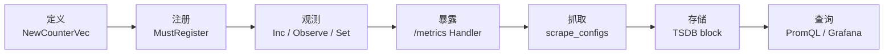
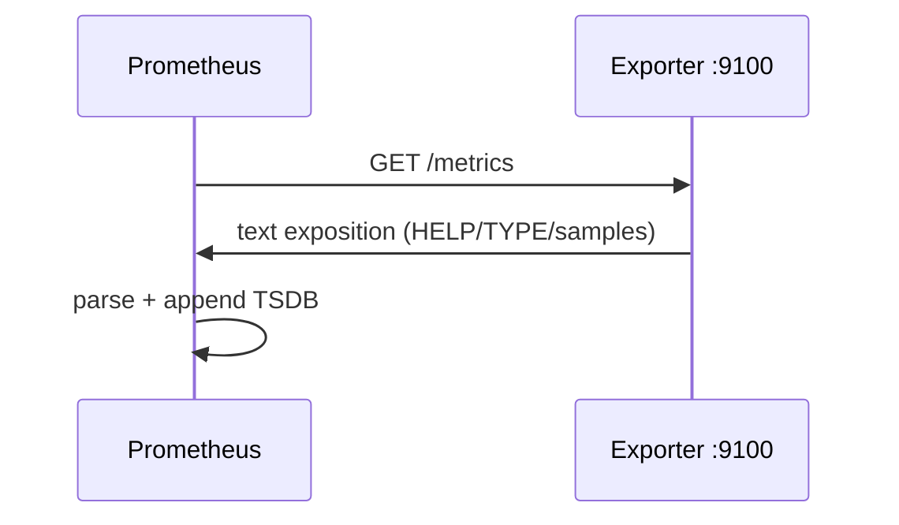
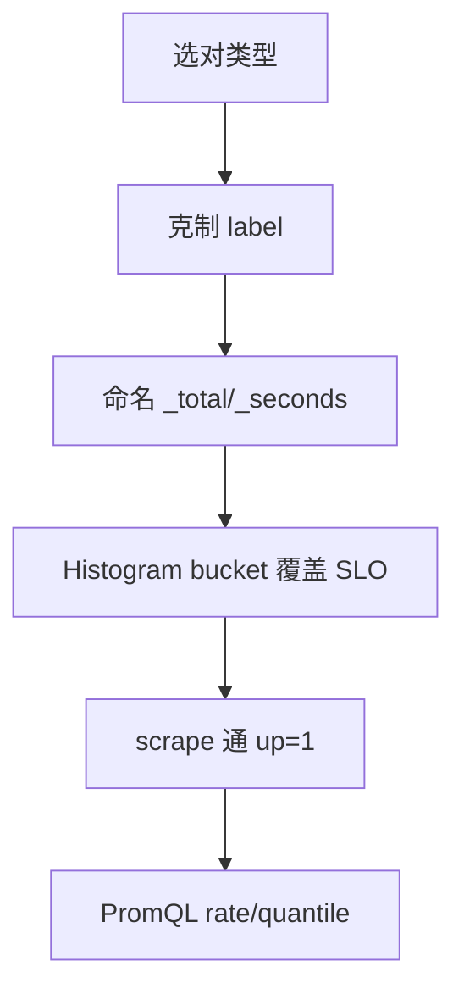

# 14 CLI与Prometheus指标

> 大家好，欢迎来到这次分享。开讲之前，先带大家回到一个很多值班同学都踩过的现场：
> 值班同学写了个 `game-exporter`，`/metrics` 能打开、Prometheus 却 `up=0`；好不容易 scrape 到了，Grafana 全是 `NaN`——Counter 用 Gauge 记、Histogram 没配 bucket、label 把 `user_id` 打进去 cardinality 爆炸。
> 这一章讲完，你会知道当时那个人错在哪——up=0、NaN、cardinality 爆炸，多半是类型选错、bucket 没配、label 打了高基数。
> **本章回答**：一个 Exporter 指标从「代码里 `NewCounter`」到「Prometheus scrape 进 TSDB」再到「Grafana 能画」完整走一遍——CLI 怎么搭、四类指标怎么选、label 怎么克制。
> **不讲**：告警规则与降噪 → [09-03](../../../09-可观测性与SRE方法论/03-告警设计与降噪/)；RED/USE 方法论总览 → [01-21](../../../01-基础底座/21-性能方法论-USE与RED/)；pprof 性能栈 → [13](../13-pprof与性能排查/)。这些都有专门的章节，本章只在用到时点到为止。

**标记**：🎯重点 · 🔥难点 · ⭐常考 · 🔧实操

**怎么听这场分享**：先扫面试口径和语言最小集；主线是「一个指标的一生」——选型 → 注册 → 打点 → 暴露 → 抓取 → 查询；生产模板代码一字不改。每一节讲完提示对应练习题。

大家想想：Grafana 全 NaN，第一反应是啥？很多人会改 Grafana——**常常错了**。先看类型是否 Counter、range 是否够、label 是否高基数。


---

## 面试怎么考

| 标记 | 考点 |
|------|------|
| **核心** | Counter/Gauge/Histogram/Summary；`promhttp.Handler()`；`prometheus.Register` |
| **必会** | Histogram 的 `bucket` 与 `_bucket` 时间序列；label 基数；`rate()` / `histogram_quantile()` |
| **常用** | cobra 子命令 + `version`；`/metrics` 独立端口；`MustRegister` vs `Register` 错误处理 |
| **常考** | Counter 只能增；Gauge 可增可减；为什么不用 Summary 做全局分位；exporter 与 Pushgateway 边界 |

**30 秒怎么说**：用 prometheus client_golang 定义指标，`prometheus.MustRegister`，HTTP 挂 `promhttp.Handler()`。Counter 记累计（请求总数），Gauge 记瞬时值（队列长度），Histogram 配 bucket 算 P99。label 只放低基数维度（method、code），绝不放 user_id。Prometheus `scrape_configs` 拉 `/metrics`，PromQL 用 `rate(http_requests_total[5m])` 和 `histogram_quantile(0.99, ...)`。


本节对应练习题目录先扫一眼。

---

## 能力边界

| 维度 | Go Exporter + Pull | Pushgateway | 日志打点 |
|------|-------------------|-------------|----------|
| **适合** | 长驻服务、K8s Pod | 短任务一次性 push | 排障细节、审计 |
| **不适合** | 进程秒级退出且无人 scrape | 替代服务常驻指标 | 做 SLO 分母 |
| **你要会** | 写可 scrape 的 `/metrics` | 知道批作业才用 push | 指标与日志分工 |


本节对应练习题 Q1。边界清了——最小集。

---

## 语言最小集

读懂 / 写出 cobra + Prometheus client_golang 最小代码，只需认得这些零件：

- **`cobra.Command`** — 子命令的容器，`Use` 是命令名，`RunE` 是执行体
- **`prometheus.NewCounter` / `NewGauge` / `NewHistogram`** — 三类核心指标的构造器
- **`prometheus.NewCounterVec`** — 带 label 的指标族，`WithLabelValues(...).Inc()` 打点
- **`prometheus.MustRegister`** — 把指标注册到默认 Registry，`init` 里调一次
- **`promhttp.Handler()`** — 把 Registry 编码成 Prometheus exposition format 文本
- **`testutil.ToFloat64`** — 单元测试里读取指标当前值

```go
var (
    requestsTotal = prometheus.NewCounterVec(
        prometheus.CounterOpts{
            Name: "http_requests_total",
            Help: "Total HTTP requests",
        },
        []string{"method", "code"},  // ← 只放低基数枚举维度
    )
)
```


本节对应练习题 Q2。最小集会了——主图。

---

## 一、一张图：一个指标的一生

> 🎯 **一句话**：代码里**定义 + 注册** → 运行时 **Inc/Observe** → HTTP **暴露** → Prometheus **scrape** → TSDB **存储** → Grafana **查询**。



**读图**：左边是**进程内**（Go 代码），右边是**监控平台**；断在 EXP→SCR 多半是网络、`up`、或路径错；断在 Q 多半是 PromQL 或指标类型用错。合上书默画的就是这张——六个阶段，每个阶段都有对应的 API 和排障命令。


本节对应练习题 Q1、Q14。主线有了——CLI vs Exporter。

---

## 二、入口：cobra CLI 还是 Exporter

> 🎯 **一句话**：**常驻进程 = Exporter pull**；**跑完就退 = cobra CLI，指标可选 sidecar 或 Pushgateway**。

### cobra 骨架 ⭐🔧

cobra 用 `Command` 树组织子命令。同一二进制既能 `hallctl sync` 跑一次性任务，也能 `hallctl serve` 常驻当 exporter：

```go
var rootCmd = &cobra.Command{
    Use:   "hallctl",
    Short: "Hall ops CLI",
}

var versionCmd = &cobra.Command{
    Use:   "version",
    Run: func(cmd *cobra.Command, args []string) {
        fmt.Println(Version, Commit, BuildDate)  // ← -ldflags 注入，见 [15](../15-编译交付与读源码/)
    },
}

var serveCmd = &cobra.Command{
    Use:   "serve",
    RunE: func(cmd *cobra.Command, args []string) error {
        reg := prometheus.NewRegistry()
        reg.MustRegister(requestsTotal)
        mux := http.NewServeMux()
        mux.Handle("/metrics", promhttp.HandlerFor(reg, promhttp.HandlerOpts{}))
        return http.ListenAndServe(":9100", mux)  // ← 常驻暴露
    },
}

func init() {
    rootCmd.AddCommand(versionCmd)
    rootCmd.AddCommand(serveCmd)
}
```

```bash
./hallctl version
# hallctl 1.4.2 commit=abc123 2026-09-01   ← 版本核对，发布对齐用

./hallctl serve --listen :9100
# listening on :9100                          ← 常驻进程，等 Prometheus 来 scrape
```

> 📝 **面试**：「为什么 CLI 还要 metrics？」——**同一二进制**既能做一次性任务也能常驻当 exporter；版本信息走 `version` 子命令，方便发布核对。

> ⚠️ **别混**：cobra 的 `Run` 和 `RunE` 差在后者返回 error——生产代码用 `RunE`，让 cobra 帮你打印错误并退出非零码。`Run` 里 panic 会被 cobra 吞掉。


本节对应练习题 Q3。入口清了，四类指标。

---

## 三、选型：四类指标怎么挑

> 🎯 **一句话**：**Counter 只增**（请求总数）；**Gauge 可增可减**（在线数、队列深度）；**Histogram 分桶**（延迟）；**Summary 客户端分位**（少用）。

| 类型 | Go API | 语义 | 典型 |
|------|--------|------|------|
| Counter | `Counter` / `CounterVec` | 只增不减（重启归零） | `requests_total`、`errors_total` |
| Gauge | `Gauge` / `GaugeVec` | 可增可减的瞬时值 | `queue_depth`、`in_flight` |
| Histogram | `HistogramVec` + `Buckets` | 分桶累计 + `_sum` `_count` `_bucket` | 延迟、大小 |
| Summary | `SummaryVec` + `Objectives` | 客户端算分位（少用） | 旧代码 |

> 💡 **打个比方**：Counter 像里程表只往前滚；Gauge 像油箱指针可升可降；Histogram 像把延迟扔进不同抽屉数个数——服务端按桶做插值算分位；Summary 像自己边数边报分位数，但只能报自己那个实例的。

```go
requestDuration := prometheus.NewHistogramVec(
    prometheus.HistogramOpts{
        Name:    "http_request_duration_seconds",
        Help:    "Request latency",
        Buckets: prometheus.DefBuckets,  // ← [.005, .01, .025, .05, .1, .25, .5, 1, 2.5, 5, 10]
    },
    []string{"method", "handler"},
)
```

> ⚠️ **别混**：**Counter 不能 `Set(5)` 再 `Set(3)`**——用 Gauge。把「当前连接数」记成 Counter 是经典错题：连接断开要 Dec，Counter 根本没有 Dec 方法。正确做法：当前连接数用 `Gauge`，累计连接次数另设一个 `Counter`。

> ⚠️ **别混**：Counter 命名以 **`_total`** 结尾；Gauge 不要用 `_total` 后缀——看到 `_total` 就以为是 Counter，`rate()` 一算全是 NaN。


口诀：**「Counter 只增；Gauge 可上可下；Histogram 看分布」**。练习题 Q4、Q5。选型会了，看注册。

---

## 四、注册：MustRegister 与 Registry

> 🎯 **一句话**：`MustRegister` 在 `init` 里调一次；测试用新 Registry 隔离；`Register` 返回 error 不 panic。

```go
// 默认全局 Registry — 生产代码在 init 里注册一次
func init() {
    prometheus.MustRegister(requestsTotal)
    prometheus.MustRegister(requestDuration)
}

// 自定义 Registry — 多租户隔离或不想注册默认 go_* 运行时指标
reg := prometheus.NewRegistry()
reg.MustRegister(collectors.NewGoCollector())  // ← 可选：Go 运行时指标
reg.MustRegister(requestsTotal)
```

`MustRegister` 重复注册同名指标会 **panic: duplicate collector**——这是设计上的保护，不是 bug。生产代码只在 `init` 注册一次。测试里每个 `TestXxx` 都注册会踩坑：

```go
// 错误：测试间共享默认 Registry，第二个测试 panic
func TestHandler(t *testing.T) {
    c := prometheus.NewCounter(prometheus.CounterOpts{Name: "test_total"})
    prometheus.MustRegister(c)  // ← 第一个测试注册了
    // ... 第二个测试再跑这行 → panic
}

// 正确：每个测试用独立 Registry
func TestHandler(t *testing.T) {
    reg := prometheus.NewRegistry()
    c := prometheus.NewCounter(prometheus.CounterOpts{Name: "test_total"})
    reg.MustRegister(c)  // ← 独立 Registry，互不干扰
}
```

> ⚠️ **别混**：`MustRegister` vs `Register`——`MustRegister` 是 `Register` + panic on error；生产代码用 `MustRegister`（出错该立刻暴露），测试用 `Register`（想检查错误本身时）。`promauto` 包会在 `init` 阶段自动 `MustRegister`，适合单例服务，测试仍要注意隔离。


本节对应练习题 Q6。注册会了，打点。

---

## 五、打点：在业务路径上 Observe

> 🎯 **一句话**：在请求入口/出口打点；defer 记延迟；label 值用**枚举**不用原始 ID。

### 中间件打点 ⭐🔧

```go
func metricsMiddleware(next http.Handler) http.Handler {
    return http.HandlerFunc(func(w http.ResponseWriter, r *http.Request) {
        start := time.Now()
        sw := &statusWriter{ResponseWriter: w, code: 200}
        next.ServeHTTP(sw, r)
        requestsTotal.WithLabelValues(r.Method, strconv.Itoa(sw.code)).Inc()      // ← Counter
        requestDuration.WithLabelValues(r.Method, r.URL.Path).Observe(
            time.Since(start).Seconds())  // ← Histogram，单位 seconds
        })
}
```

### label 纪律：cardinality 是监控事故 🔥⭐

```text
OK     method=GET|POST    code=200|500    handler=/api/login
BAD    user_id=8374921    trace_id=abc-xyz    pod_name 每秒变
```

每个唯一 label 组合 = **一条时间序列**。Prometheus 内存和查询性能直接受序列数影响——user_id 百万级 = cardinality 爆炸 = 内存翻倍、查询超时、甚至 OOM。

查序列数：

```bash
curl -s localhost:9100/metrics | grep -c '^http_requests'
# 12    ← method×code 组合数，正常

curl -s localhost:9100/metrics | grep -c '^http_requests'
# 837421  ← user_id 全打进去了，爆炸
```

> 📝 **面试**：「cardinality 爆炸会怎样？」——每个唯一 label 组合是一条时间序列，Prometheus 内存和查询变慢，甚至 OOM；**高基数 label 是监控事故**，不是「Prometheus 慢」那么简单。修法：高基数信息放日志/追踪；指标只保留低维聚合。`/api/user/8374921` 当 handler label 也不行——应规范为路由模板 `/api/user/:id`。

### Histogram bucket 怎么选 🔧

```go
// 默认 DefBuckets 未必适合游戏 API
Buckets: prometheus.DefBuckets,
// [.005, .01, .025, .05, .1, .25, .5, 1, 2.5, 5, 10]

// 游戏 API 大部分 <100ms，尾延迟 500ms~2s — bucket 要覆盖 SLO 边界
Buckets: []float64{0.01, 0.05, 0.1, 0.25, 0.5, 1, 2.5, 5, 10},
//                                     ^^^^  ^^^^  ^^^^
//                                     SLO   尾延迟 上限
```

bucket 太稀 → `histogram_quantile` 估算不精确，P99 会贴到 bucket 边界值 🔥——这是游戏 API 监控最隐蔽的坑：图上 P99 看起来很高，实际是 bucket 间距造成的插值误差，不是真延迟。游戏 API 若大部分 20ms 但 SLO 是 100ms，`DefBuckets` 的 0.05 和 0.1 之间太稀，P99 可能直接跳到 0.25。

> 🔍 **现场**：bucket 没覆盖 SLO 边界，Grafana P99 线总跳到 bucket 值，看起来像阶梯而不是曲线。


本节对应练习题 Q7、Q8。打点会了，暴露。

---

## 六、暴露：promhttp.Handler 与 exposition format

> 🎯 **一句话**：`promhttp.Handler()` 把 Registry 编成 **Prometheus exposition format** 文本，每行一个样本。

```bash
curl -s localhost:9100/metrics | head -20
# HELP http_requests_total Total HTTP requests                         ← HELP：人类可读说明
# TYPE http_requests_total counter                                      ← TYPE：声明指标类型
http_requests_total{code="200",method="GET"} 12847                     ← Counter 样本，累计值
# HELP http_request_duration_seconds Request latency
# TYPE http_request_duration_seconds histogram                          ← TYPE histogram
http_request_duration_seconds_bucket{handler="/health",method="GET",le="0.005"} 12001  ← le=0.005 累计计数
http_request_duration_seconds_bucket{handler="/health",method="GET",le="0.01"} 12500
http_request_duration_seconds_bucket{handler="/health",method="GET",le="+Inf"} 12847    ← +Inf bucket 必须存在
http_request_duration_seconds_sum{handler="/health",method="GET"} 42.3                    ← 所有观测值之和
http_request_duration_seconds_count{handler="/health",method="GET"} 12847                 ← 观测总次数
```

**读图**：`TYPE` 声明类型；Histogram 必有 `_bucket` + `le` 标签、`_sum`、`_count`；`+Inf` bucket 必须存在且等于 `_count`。

```go
// 生产：/metrics 与 /health 分开；可加鉴权或只绑内网
mux.HandleFunc("/health", func(w http.ResponseWriter, _ *http.Request) { w.WriteHeader(200) })
mux.Handle("/metrics", promhttp.Handler())  // ← 用默认 Registry
// 或用自定义 Registry
mux.Handle("/metrics", promhttp.HandlerFor(reg, promhttp.HandlerOpts{}))
```

> 🔍 **现场**：`curl` 能看到 HELP/TYPE 但 Prometheus `up=0`——查 **target 地址、端口、DNS、TLS、NetworkPolicy**，不是 Go 代码问题。本机 `curl localhost:9100/metrics` 只证明进程正常，不证明 Prometheus 能连到。


本节对应练习题 Q9。暴露会了，Pull vs Push。

---

## 七、抓取：Pull vs Pushgateway

> 🎯 **一句话**：Prometheus **主动拉** `/metrics`，`scrape_interval` 决定分辨率；短生命周期任务才 push 到 Pushgateway。

```yaml
# prometheus.yml 片段
scrape_configs:
  - job_name: hall-exporter
    scrape_interval: 15s                    # ← 每次拉取间隔 = 数据分辨率
    static_configs:
      - targets: ['hall-exporter:9100']     # ← target 地址
    metrics_path: /metrics                   # ← 默认就是 /metrics
```

K8s 常用 **Pod annotation** 或 **ServiceMonitor**（operator）——本质仍是 HTTP GET `/metrics`。



**读图**：每次 scrape 是**快照**；Counter 在两次 scrape 间跳变，PromQL 用 `rate()` 算每秒增量。Gauge 每次 scrape 的值就是一条原始点，直接查。

> ⚠️ **别混**：**Exporter ≠ 被监控应用本身**——可以是 sidecar，也可以是应用内嵌 `/metrics`。`up=1` 只证明 scrape 成功，不证明业务健康。

> ⚠️ **别混**：Pushgateway **不是通用缓冲区**。短任务 push 后指标不会自动消失——PG 指标是永久存储的，除非显式删或加 TTL 策略。把 Pushgateway 当「所有指标的中转站」会制造序列生命周期问题。正解：长驻服务 Pull；批处理 cron 可 push 但要加清理策略。


本节对应练习题 Q10。抓取会了，PromQL。

---

## 八、查询：rate() 与 histogram_quantile

> 🎯 **一句话**：Counter 用 **`rate()`**；Histogram 分位用 **`histogram_quantile()`**；Gauge 直接查。

```promql
# R (Rate)：请求速率 — sum + rate + by 分组
sum(rate(http_requests_total[5m])) by (method)

# E (Errors)：错误率 — 5xx 占总量
sum(rate(http_requests_total{code=~"5.."}[5m]))
/
sum(rate(http_requests_total[5m]))

# D (Duration)：P99 延迟
histogram_quantile(0.99,
  sum(rate(http_request_duration_seconds_bucket[5m])) by (le, handler)
)
```

> 🔥 **难点**：`histogram_quantile` 是**估算**——在相邻 bucket 之间做线性插值。bucket 太稀 P99 不准，会贴到 bucket 边界值。**聚合后再 quantile**（先 `sum by (le)`）与 **先 quantile 再平均** 语义完全不同——面试爱问。正确顺序是**先聚合 bucket 再 quantile**。

> 📝 **面试**：「为什么推荐 Histogram 而不是 Summary？」——Histogram 可在 Prometheus **服务端**跨实例算分位（`histogram_quantile` + `sum by (le)`）；Summary 分位在客户端算，**不可跨实例聚合**——多副本时只能平均或挑实例，不是真正的全局 P99。

| 对比 | Histogram | Summary |
|------|-----------|---------|
| 分位计算位置 | 服务端 PromQL | 客户端 Go 代码 |
| 多副本 P99 | 聚合 `_bucket` 后 quantile | 只能平均/挑实例 |
| 存储序列 | `_bucket` 多条 | 较少 |

> ⚠️ **别混**：Gauge **不要** `rate()`——Counter 随时间单调递增才需要 `rate()` 算增量；Gauge 是瞬时值，直接查或用 `deriv` 看趋势。`rate()` 用在 Gauge 上会出无意义的结果。进程重启 Counter 归零时，Prometheus 2.x 对 counter reset 有处理（检测到值下降视为重启），但极端情况短窗口仍可能出 NaN。

### 收束：指标凭什么能进 Grafana



**读图**：任何一环断了，图上就是空或错——**先 `up`，再 `rate` 非 NaN，再 quantile**。类型选错（Gauge 当 Counter `rate`）、label 爆炸（查不动）、bucket 没覆盖 SLO（P99 阶梯跳）、scrape 不通（`up=0`）——四种病四种治法。


⭐ rate() 要 Counter。练习题 Q11、Q12。查询会了，Collector。

---

## 九、自定义 Collector 与 testutil

> 🎯 **一句话**：复杂指标可实现 **`prometheus.Collector`** 接口，在 `Collect` 里批量上报；单元测试用 **`prometheus/testutil`**。

### 自定义 Collector 🔧

当你需要从外部系统（如 Redis 队列长度、DB 连接池）采集指标时，指标值不是通过 Inc/Observe 累积的，而是每次 scrape 时动态查询的。这时实现 `Collector` 接口：

```go
type queueCollector struct {
    depth func() float64  // ← 回调，scrape 时调
    desc  *prometheus.Desc
}

func newQueueCollector(depth func() float64) *queueCollector {
    return &queueCollector{
        depth: depth,
        desc:  prometheus.NewDesc("custom_queue_depth", "Queue depth", nil, nil),
    }
}

func (c *queueCollector) Describe(ch chan<- *prometheus.Desc) {
    ch <- c.desc  // ← 声明有哪些指标
}

func (c *queueCollector) Collect(ch chan<- prometheus.Metric) {
    ch <- prometheus.MustNewConstMetric(c.desc, prometheus.GaugeValue, c.depth())  // ← 每次 scrape 调一次
}
```

注册和使用：

```go
func init() {
    prometheus.MustRegister(newQueueCollector(func() float64 {
        return float64(getQueueDepth())  // ← 动态查
    }))
}
```

> 💡 **打个比方**：普通指标像你自己往桶里扔球（Inc/Observe），Collector 像请个人每次有人来看的时候现场数一遍球——适合「值在外部系统、你没法持续追踪增减」的场景。

### testutil 测试 🔧⭐

```go
import "github.com/prometheus/client_golang/prometheus/testutil"

func TestInc(t *testing.T) {
    c := prometheus.NewCounter(prometheus.CounterOpts{Name: "test_total"})
    c.Inc()
    c.Inc()
    if v := testutil.ToFloat64(c); v != 2 {
        t.Fatalf("got %v, want 2", v)  // ← ToFloat64 直接读 Counter 当前值
    }
}
```

> 📝 **面试**：「怎么测指标？」——`testutil.ToFloat64` 读 Counter/Gauge 当前值；或用 `testutil.CollectAndCompare` 对比 exposition 文本。不要在测试里依赖默认 Registry——用独立 Registry 隔离。


本节对应练习题 Q13。Collector 会了——生产模板（代码一字不改）。

---

**回到开头那个现场**：up=0、NaN、user_id 进 label。正确剧本是：四类指标选对 → MustRegister → /metrics 可 scrape → label 低基数 → rate 配 Counter。现在再看那张全红的 Grafana，你知道该先查哪一层了。

## 十、生产模板：完整最小 Exporter 🔧

```go
package main

import (
    "flag"
    "log"
    "net/http"
    "time"

    "github.com/prometheus/client_golang/prometheus"
    "github.com/prometheus/client_golang/prometheus/promhttp"
)

var (
    addr = flag.String("listen", ":9100", "metrics listen address")

    jobsProcessed = prometheus.NewCounter(prometheus.CounterOpts{
        Name: "batch_jobs_processed_total",       // ← Counter 以 _total 结尾
        Help: "Jobs completed",
    })
    jobDuration = prometheus.NewHistogram(prometheus.HistogramOpts{
        Name:    "batch_job_duration_seconds",     // ← 单位放进名字
        Help:    "Job runtime",
        Buckets: prometheus.ExponentialBuckets(0.1, 2, 12),  // ← 0.1 起步 ×2 共 12 个桶
    })
    queueLen = prometheus.NewGauge(prometheus.GaugeOpts{
        Name: "batch_queue_length",
        Help: "Pending jobs",
    })
)

func init() {
    prometheus.MustRegister(jobsProcessed, jobDuration, queueLen)  // ← 只注册一次
}

func main() {
    flag.Parse()
    http.Handle("/metrics", promhttp.Handler())
    http.HandleFunc("/healthz", func(w http.ResponseWriter, _ *http.Request) { w.WriteHeader(200) })
    log.Fatal(http.ListenAndServe(*addr, nil))
}

func processJob() {
    start := time.Now()
    defer func() {
        jobDuration.Observe(time.Since(start).Seconds())  // ← Histogram 打点
        jobsProcessed.Inc()                                 // ← Counter 打点
    }()
    queueLen.Dec()       // ← Gauge 减
    // ... do work ...
    queueLen.Inc()       // ← Gauge 加
}
```

```bash
curl -s localhost:9100/metrics | grep batch_
# HELP batch_jobs_processed_total Jobs completed
# TYPE batch_jobs_processed_total counter
batch_jobs_processed_total 42                                    # ← 累计值
# HELP batch_job_duration_seconds Job runtime
# TYPE batch_job_duration_seconds histogram
batch_job_duration_seconds_bucket{le="0.1"} 15                  # ← 0.1s 内的累计
batch_job_duration_seconds_bucket{le="0.2"} 28
batch_job_duration_seconds_bucket{le="+Inf"} 42                  # ← +Inf = _count
batch_job_duration_seconds_sum 8.34                              # ← 所有观测值之和
batch_job_duration_seconds_count 42                             # ← 观测总次数
# HELP batch_queue_length Pending jobs
# TYPE batch_queue_length gauge
batch_queue_length 3                                            # ← 瞬时值
```

命名规范：指标名 **`snake_case`**，Counter 以 **`_total`** 结尾，单位放进名字（`_seconds`、`_bytes`）。用 `Namespace` + `Subsystem` 前缀避免冲突：

```go
prometheus.CounterOpts{
    Namespace: "hall",
    Subsystem: "gateway",
    Name:      "requests_total",
}
// 生成：hall_gateway_requests_total
```


本节对应练习题 Q4、Q8。模板拿走，踩坑。

---

## 十一、踩坑清单

| 现象 | 原因 | 修法 |
|------|------|------|
| 重复注册 panic | `MustRegister` 两次 | 仅 `init` 注册；测试用新 Registry |
| `rate` 出 NaN | Counter 类型用错（Gauge）/ 进程重启 | 确认是 Counter；看进程重启时间 |
| 指标名冲突 | 多库都用 `go_` 前缀 | 自定义 `Namespace` / `Subsystem` |
| Pushgateway 指标永不消失 | PG 设计如此 | 短任务才用；加清理策略 |
| handler label 高基数 | path 带原始 ID | 路由模板 `/user/:id` |
| P99 贴 bucket 边界 | bucket 太稀 | 覆盖 SLO 边界值 |


本节对应练习题 Q5、Q12。踩坑钉死，必会常考。

---

## 十二、必会常考

### 命令速查 🔧

```bash
# 本地验证
curl -s localhost:9100/metrics | grep -E '^http_|^# '      # ← 看 HELP/TYPE/样本
promtool check metrics metrics.txt                            # ← 离线校验格式

# Prometheus 侧
# UI → Status → Targets：看 up 状态
# UI → Graph：rate(http_requests_total[5m]) 验证有值

# 序列数检查
curl -s localhost:9100/metrics | grep -c '^http_requests'    # ← label 组合数
```

### 面试锚点 ⭐

遮住右列自问自答，卡壳的行回去重读对应小节——能讲出来才算会：

| 问 | 30 秒答 |
|----|---------|
| 四类指标？ | Counter 只增；Gauge 瞬时值；Histogram 分桶；Summary 客户端分位 |
| 怎么暴露？ | `MustRegister` + `promhttp.Handler()` |
| P99 怎么查？ | `histogram_quantile(0.99, sum(rate(..._bucket[5m])) by (le))` |
| label 原则？ | 低基数枚举，禁止 user_id / trace_id |
| Pull vs Push？ | 长驻服务 Pull；短任务 Pushgateway（指标不自动消失） |
| Histogram vs Summary？ | Histogram 服务端可聚合分位；Summary 客户端算不可聚合 |
| Counter 能 Set 吗？ | 不能，只有 Inc/Add；要 Set 用 Gauge |
| rate() 窗口？ | `[5m]` 常用下限，scrape 15s 时至少 4 个点 |
| 命名规范？ | `_total`（Counter）、`_seconds`（时间）、`_bytes`（大小） |

### 易错一句话对照

- 错：连接数用 Counter → 对：用 **Gauge**
- 错：Summary 跨 Pod 平均 P99 → 对：用 **Histogram + 服务端 quantile**
- 错：path 带 ID 当 label → 对：**路由模板**
- 错：不写 `_total` 后缀 → 对：Counter 名以 **`_total`**
- 错：Gauge 上 `rate()` → 对：Counter 才用 `rate()`；Gauge 直接查
- 错：scrape 通就不看 HELP → 对：**TYPE 与实现一致**
- 错：Pushgateway 当通用中转 → 对：**只短任务**
- 错：bucket 没覆盖 SLO → 对：**覆盖 SLO 边界值**
- 错：`MustRegister` 写在 `Run` 里 → 对：**`init` 注册一次**
- 错：测试用默认 Registry → 对：**独立 Registry 隔离**

### 数字墙

> scrape_interval 常见 **15s** · `rate()` 窗口下限 **5m** · DefBuckets 从 **0.005** 到 **10** 共 **11** 个桶 · `+Inf` bucket 必须存在 · Cardijnarity 爆炸 = **监控事故** · RED = **R**ate **E**rrors **D**uration · `MustRegister` 只在 **init**


本节对应练习题 Q1～Q14。现在回开头那个现场。

---

## 合上书

- [ ] **默画**「指标的一生」：定义 → 注册 → Observe → 暴露 → scrape → PromQL。
- [ ] 口述 Counter/Gauge/Histogram 各一个游戏运维例子，说清为什么选这个类型。
- [ ] 写一段 `NewHistogramVec` 并说明 `_bucket` / `_sum` / `_count` 三条序列的含义。
- [ ] 解释为什么 `user_id` 不能当 label，cardinality 爆炸会怎样。
- [ ] 写出 `rate()` 和 `histogram_quantile(0.99, ...)` 完整 PromQL，说清先聚合再 quantile。
- [ ] 说明 `MustRegister` 与自定义 `Registry` 的使用场景，测试为什么要用新 Registry。
- [ ] 读一段 `/metrics` 输出，指出 TYPE 与样本是否匹配，`+Inf` bucket 是否存在。
- [ ] 描述 `up=0` 时 CLI 侧与平台侧各查什么。
- [ ] 对比 Pull 与 Pushgateway 适用边界，说清 PG 指标不自动消失的后果。
- [ ] 说清 cobra `serve` 与一次性子命令如何共存于同一二进制，`RunE` vs `Run` 差在哪。
- [ ] 对比 Histogram 与 Summary 在多副本 P99 聚合能力上的差异。

下一章：[15](../15-编译交付与读源码/)。地基：[11](../11-GC内存与逃逸分析/) · 性能栈：[13](../13-pprof与性能排查/)。
