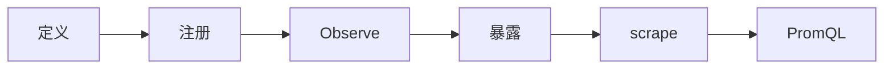

# 14｜CLI与Prometheus指标 · 练习题

开始做题前，先给大家一个小建议：合上知识点，对着**一个指标的一生**口述一遍。能顺下来，下面这些题大半都会了。

做题的方式：每道题**先看标题和场景，自己口述一遍答案，再往下看解答**。

题目顺序：Q1～Q5 钉类型；Q6～Q10 注册暴露；Q11～Q14 查询与作战。

| 标记 | 含义 |
|------|------|
| **核心** | 不懂整章就没建立起来 |
| **必会** | 值班和面试都要能讲 |
| **常用** | 线上会反复碰到 |
| **常考** | 白板和追问的高频口径 |

## 本题目录

- [Q1 四类指标](#q1) · [Q2 Counter 误用](#q2) · [Q3 Histogram bucket](#q3) · [Q4 label 基数](#q4)
- [Q5 暴露 metrics](#q5) · [Q6 up=0](#q6) · [Q7 rate 与 PromQL](#q7) · [Q8 histogram_quantile](#q8)
- [Q9 Summary vs Histogram](#q9) · [Q10 cobra serve](#q10) · [Q11 重复注册](#q11) · [Q12 RED 指标](#q12)
- [Q13 自定义 Collector](#q13) · [Q14 白板总览](#q14)
- [合上书](#合上书)

---

## Q1

**★★★★★｜Counter、Gauge、Histogram、Summary 各适合什么场景？**

**覆盖**：核心 · 必会 · 常考 ｜ **对应**：知识点 [三、选型：四类指标怎么挑](知识点.md)

### 场景

新人把「当前在线人数」记成 Counter，Grafana 上 `rate()` 出现奇怪小数；面试官问四类指标的区别和选型依据。


先自己试试，再往下看解答。

### 完整解答

> 🎯 **一句话**：**Counter 只增**（请求总数）；**Gauge 可增可减**（在线数、队列深度）；**Histogram 分桶**（延迟）；**Summary 客户端分位**（少用）。

Counter 像里程表只往前滚，进程重启归零；Gauge 像油箱指针可升可降；Histogram 像把延迟扔进不同抽屉数个数，服务端按桶做插值算分位；Summary 像自己边数边报分位数，但只能报自己那个实例的。

| 类型 | 例子 | Go API |
|------|------|--------|
| Counter | `http_requests_total`、`errors_total` | `NewCounter` / `NewCounterVec` |
| Gauge | `queue_depth`、`in_flight_requests` | `NewGauge` / `NewGaugeVec` |
| Histogram | `request_duration_seconds` + bucket | `NewHistogramVec` + `Buckets` |
| Summary | 旧式客户端 P99（难聚合） | `NewSummaryVec` + `Objectives` |

在线人数必须用 **Gauge**——人进来 `Inc()`、退出 `Dec()`；请求数用 Counter + `rate()`。Counter 只有 `Inc()` / `Add()`，没有 `Dec()` 和 `Set()`。

> ⚠️ **别混**：Counter 命名以 **`_total`** 结尾；Gauge 不要用 `_total` 后缀——看到 `_total` 就以为是 Counter，`rate()` 一算全是 NaN。

### 再追问

Counter 能 `Set(0)` 吗？——不能，语义上只有 `Inc` / `Add`；进程重启 Counter 从 0 开始，Prometheus 2.x 用 counter reset 检测处理（值下降视为重启）。但极端短窗口仍可能出 NaN，生产监控要注意重启频率。

---

## Q2

**★★★★★｜「连接数」用 Counter 还是 Gauge？**

**覆盖**：核心 · 必会 · 常考 ｜ **对应**：知识点 [三、选型：四类指标怎么挑](知识点.md)

### 场景

exporter 里 `connections_total` 在连接建立时 `Inc`、断开时想 `Dec`，编译器报错——Counter 没有 Dec 方法。面试官问为什么不能这么设计。


语言最小集。

先自己试试，再往下看解答。

### 完整解答

> 🎯 **一句话**：连接断开要 **Dec** → 必须用 **Gauge**，Counter 根本没有 Dec 方法。

```go
inFlight := prometheus.NewGauge(prometheus.GaugeOpts{
    Name: "http_in_flight_requests",
    Help: "Current in-flight HTTP requests",
})

// 中间件里
inFlight.Inc()               // ← 请求进入 +1
defer inFlight.Dec()          // ← 请求退出 -1
```

Counter 只能统计「累计建立过的连接次数」——这有业务价值，但不等于「当前活跃连接数」。正确做法：当前连接数用 **Gauge**；累计连接次数另设一个 Counter `connections_accepted_total`，两者并存。

```go
// 两个指标并存
connectionsActive = prometheus.NewGauge(...)   // 当前值，可增可减
connectionsAccepted = prometheus.NewCounter(...) // 累计值，只增不减
```

> 📝 **面试**：「为什么 Counter 不能 Dec？」——Counter 语义是**单调递增累计量**，`rate()` 靠单调性算每秒增量；如果允许 Dec 就无法区分「正常增量」和「回退」，分位和速率全乱。Gauge 专为瞬时值设计，Inc/Dec/Set 都有。

### 再追问

累计连接次数有业务价值吗？——有，可以算「连接建立速率」`rate(connections_accepted_total[5m])`，判断负载趋势；但要看**当前**多少连接在线，只能查 Gauge。

---

## Q3

**★★★★☆｜Histogram 的 bucket 怎么选？输出里有什么序列？**

**覆盖**：必会 · 常考 ｜ **对应**：知识点 [五、打点：在业务路径上 Observe](知识点.md)

### 场景

游戏 API 大部分 20ms，尾延迟 1~2s，默认 `DefBuckets` 算出的 P99 总是贴到 10s 或 5s 边界，Grafana 线像阶梯。


cobra vs Exporter。

先自己试试，再往下看解答。

### 完整解答

> 🎯 **一句话**：bucket 要覆盖 **SLO 边界**（如 0.05, 0.1, 0.5, 1, 2, 5 秒）；暴露 **`_bucket{le=}` + `_sum` + `_count`** 三条序列。

```go
Buckets: []float64{0.01, 0.05, 0.1, 0.25, 0.5, 1, 2.5, 5, 10},
//                                     ^^^^  ^^^^  ^^^^
//                                     SLO   尾延迟 上限
```

`DefBuckets` 是 `[..., 0.05, 0.1, 0.25, ...]`——如果 SLO 是 100ms，0.05 和 0.1 之间太稀，P99 可能直接跳到 0.25，看起来延迟暴增但实际没问题。

```bash
curl -s localhost:9100/metrics | grep duration_seconds_bucket | head -5
# ..._bucket{le="0.005"} 12001    ← 延迟 ≤0.005s 的累计计数
# ..._bucket{le="0.01"} 12500     ← 累计：含上一个 bucket
# ..._bucket{le="0.025"} 12700
# ..._bucket{le="0.05"} 12800
# ..._bucket{le="+Inf"} 12847     ← +Inf bucket 必须存在，等于 _count
```

> 🔍 **现场**：Grafana P99 线总跳到 bucket 值，看起来像阶梯而不是曲线——就是 bucket 太稀。`histogram_quantile` 是在相邻 bucket 之间做**线性插值**估算，bucket 间距大则估算不精确。

> ⚠️ **别混**：`le="0.1"` 的值是延迟 ≤0.1s 的**累计**计数（含更小 bucket 的所有计数），不是「恰好落在 0.05~0.1 之间的数量」。桶是**累积**的，不是独立的。

### 再追问

`ExponentialBuckets(0.1, 2, 12)` 是什么？——从 0.1 起步、每次 ×2、共 12 个桶（0.1, 0.2, 0.4, 0.8, 1.6, ...），适合延迟跨多个数量级的场景。对游戏 API 不一定合适——SLO 边界可能不在 bucket 上。

---

## Q4

**★★★★★｜为什么不能把 user_id 放进 label？**

**覆盖**：核心 · 必会 · 常考 ｜ **对应**：知识点 [五、打点：在业务路径上 Observe](知识点.md)

### 场景

开发加了 `http_requests_total{user_id="8374921"}`，Prometheus 内存一周翻倍，查询超时，值班同学收到 Prometheus OOM 告警。


四类指标怎么挑。

先自己试试，再往下看解答。

### 完整解答

> 🎯 **一句话**：每个唯一 label 组合 = **一条时间序列**——user_id 百万级 = **cardinality 爆炸** = 内存翻倍、查询超时、OOM。

```text
OK     method=GET|POST    code=200|500    handler=/api/login
BAD    user_id=8374921    trace_id=abc-xyz    pod_name 每秒变
```

允许的 label 值：`method`（有限枚举）、`code`（HTTP 状态码有限）、`handler`（路由模板）。禁止的 label 值：`user_id`（百万级）、`trace_id`（每次请求唯一）、无界 `pod_name`（每次发布变化）。

```bash
# 查序列数
curl -s localhost:9100/metrics | grep -c '^http_requests'
# 837421  ← user_id 全打进去了，爆炸

# 正常应该
curl -s localhost:9100/metrics | grep -c '^http_requests'
# 12    ← method×code 组合数
```

> 📝 **面试**：cardinality 爆炸是**监控事故**，不是「Prometheus 慢」那么简单。修法：高基数信息放**日志/追踪**；指标只保留低维聚合。`/api/user/8374921` 当 handler label 也不行——应规范为路由模板 `/api/user/:id`，否则每个 URL 变体都是一条新序列。

> ⚠️ **别混**：不是「不能有 label」而是「label 值必须低基数」。method/code/handler 模板完全没问题——它们是有限枚举。要禁止的是把原始 ID、trace_id 这类每次请求都不同的值当 label。

### 再追问

怎么知道一个指标已经爆炸了？——Prometheus UI → Status → TSDB Status，看 Top Series Count by Metric Name；或 `curl /metrics | grep -c '^metric_name'` 看样本行数，异常多就是 cardinality 问题。生产要加 `prometheus_tsdb_head_series` 告警。

---

## Q5

**★★★★★｜最小可 scrape 的 Go 代码怎么写？**

**覆盖**：核心 · 必会 ｜ **对应**：知识点 [六、暴露：promhttp.Handler 与 exposition format](知识点.md)

### 场景

要写 `hall-exporter`，要求 `/metrics` 和 `/healthz` 分开，Prometheus 15s 来 scrape 一次。


就是 Counter/Gauge 用错。

先自己试试，再往下看解答。

### 完整解答

> 🎯 **一句话**：`NewCounter` → `MustRegister` → `mux.Handle("/metrics", promhttp.Handler())`。

```go
var reqTotal = prometheus.NewCounter(prometheus.CounterOpts{
    Name: "hall_requests_total",
    Help: "Total requests",
})

func init() {
    prometheus.MustRegister(reqTotal)  // ← init 里注册一次
}

func main() {
    mux := http.NewServeMux()
    mux.Handle("/metrics", promhttp.Handler())  // ← 暴露默认 Registry
    mux.HandleFunc("/healthz", func(w http.ResponseWriter, _ *http.Request) {
        w.WriteHeader(200)
    })
    log.Fatal(http.ListenAndServe(":9100", mux))
}
```

```bash
curl -s localhost:9100/metrics | head -5
# HELP hall_requests_total Total requests     ← HELP：人类可读说明
# TYPE hall_requests_total counter            ← TYPE：声明指标类型
hall_requests_total 42                        ← Counter 样本，累计值
```

`promhttp.Handler()` 用默认全局 Registry；`promhttp.HandlerFor(reg, opts)` 用自定义 Registry——多租户隔离或不想注册默认 `go_*` 运行时指标时用后者。

> 📝 **面试**：「为什么 `/metrics` 和 `/healthz` 分开？」——healthz 是 Kubernetes 探针用，返回快；`/metrics` 内容大（可能数千行），separate 避免 liveness probe 超时。生产可给 `/metrics` 加鉴权或只绑内网。

### 再追问

自定义 Registry 何时用？——多租户隔离、测试隔离、不想注册默认 `go_*` 运行时指标时。代码：`reg := prometheus.NewRegistry()` + `promhttp.HandlerFor(reg, promhttp.HandlerOpts{})`。

---

## Q6

**★★★★★｜Prometheus Targets 里 `up=0`，但 curl exporter 正常，查什么？**

**覆盖**：必会 · 常用 ｜ **对应**：知识点 [七、抓取：Pull vs Pushgateway](知识点.md)

### 场景

Grafana 无数据，Prometheus UI 显示 `hall-exporter` job 全红 `up=0`，但 SSH 到 Pod `curl localhost:9100/metrics` 正常。


MustRegister。

先自己试试，再往下看解答。

### 完整解答

> 🎯 **一句话**：**Target 配置 / network 路径**问题，不是 Go 代码——查地址、端口、DNS、TLS、NetworkPolicy。

```text
排查顺序：
- Prometheus config 的 targets 是否 exporter 实际 IP:9100（K8s 里 Service Endpoints 是否有 ready pod）
- metrics_path 是否写错（默认 /metrics，写成 /metric 就 404）
- NetworkPolicy 是否拦 scrape 源（Prometheus pod 到 exporter pod 的 9100 端口）
- DNS 解析（prometheus pod 里 curl exporter 域名是否通）
- TLS（若配了 scheme: https 但 exporter 只监听 http）
- 从 Prometheus pod curl target（同网络验证连通性）
```

Exporter 本机 `curl localhost:9100/metrics` 只证明**进程正常**，不证明 **Prometheus 能连到**——中间隔着 K8s Service、NetworkPolicy、DNS、TLS。

```bash
# 从 Prometheus pod 内验证
kubectl exec -it prometheus-0 -c prometheus -- curl -s hall-exporter:9100/metrics | head -3
# 若超时 → NetworkPolicy 或 DNS 问题
# 若 404 → metrics_path 写错
# 若正常 → Prometheus config 的 target 地址写错了
```

> 🔍 **现场**：Prometheus UI → Status → Targets，点开 `hall-exporter`，看 **Last Error** 和 **Scrape Duration**——`connection refused` = 端口没监听或 NetworkPolicy 拦；`context deadline exceeded` = DNS 或网络超时；`404` = path 写错。

### 再追问

`up=1` 但 Grafana 仍空？——查 PromQL（指标名写错？label 匹配写错？）、时间范围（时间选择器在 future 或数据太旧？）、是否用了错误的 `rate` 窗口（`[1m]` 在 scrape 15s 时只有 4 个点，Prometheus 要求至少 2 个点但太少不稳）。

---

## Q7

**★★★★★｜`rate(http_requests_total[5m])` 干什么？为什么用 5m？**

**覆盖**：核心 · 必会 · 常考 ｜ **对应**：知识点 [八、查询：rate() 与 histogram_quantile](知识点.md)

### 场景

新人直接 `http_requests_total` 画线图，看到的是一条只增不减的累计线，锯齿巨大，看不懂趋势。面试官问 `rate()` 的原理和窗口选择。


业务路径 Observe。

先自己试试，再往下看解答。

### 完整解答

> 🎯 **一句话**：Counter 是**累计值**，`rate()` 算**每秒增量**；`[5m]` 是滑动窗口平滑毛刺。

```promql
# 每秒请求数，按 method 分组
sum(rate(http_requests_total[5m])) by (method)
```

`rate(counter[5m])` 的计算：取 5 分钟窗口内**首尾两个点的差值**除以时间差。Counter 随时间单调递增，直接画线是一条不断上升的线，看不出「这一刻有多少请求/秒」；`rate()` 把累计值转成瞬时速率。

窗口选择：太短（`[30s]`）噪声大，scrape 15s 时只有 2-3 个点；太长（`[1h]`）反应慢，故障后 1 小时才看到下降。`[5m]` 是常见下限——scrape 15s 时有 ~20 个点，既平滑又不太迟钝。

> ⚠️ **别混**：Gauge **不要** `rate()`——Counter 随时间单调递增才需要 `rate()` 算增量；Gauge 是瞬时值（如当前队列长度），直接查或用 `deriv()` 看趋势。`rate()` 用在 Gauge 上会出无意义的结果，因为 Gauge 值可以下降，`rate()` 会把下降当作「负速率」。

> 📝 **面试**：「rate 和 irate 区别？」——`rate` 用窗口内首尾差/时间差，平滑；`irage` 只取最近两个点，灵敏但噪声大。告警用 `rate`（稳），实时大屏可用 `irate`（快）。

### 再追问

进程重启 Counter 归零 `rate` 会 NaN 吗？——Prometheus 2.x 对 counter reset 有处理：检测到值下降视为重启，自动补偿。但极端情况（短窗口内多次重启）仍可能出 NaN，生产监控要注意重启频率和 `rate` 窗口长度的关系。

---

## Q8

**★★★★★｜P99 延迟 PromQL 怎么写？先聚合还是先 quantile？**

**覆盖**：核心 · 必会 · 常考 ｜ **对应**：知识点 [八、查询：rate() 与 histogram_quantile](知识点.md)

### 场景

SLO 要求 P99 < 500ms，Grafana 面板要配 P99 查询；面试官问「多副本时先 quantile 再平均对不对」。


开头那个 cardinality。

先自己试试，再往下看解答。

### 完整解答

> 🎯 **一句话**：**`histogram_quantile(0.99, sum(rate(..._bucket[5m])) by (le, handler))`**——先聚合 bucket 再 quantile。

```promql
# 正确：先聚合 bucket，再 quantile
histogram_quantile(0.99,
  sum(rate(http_request_duration_seconds_bucket[5m])) by (le, handler)
)

# 错误：先 quantile 再平均
avg(histogram_quantile(0.99,
  rate(http_request_duration_seconds_bucket[5m])
))
```

**为什么顺序很重要**：`histogram_quantile` 是在 `_bucket` 的**累计分布**上做线性插值。多副本时每个 Pod 的 bucket 是独立的累计计数；必须先 `sum by (le)` 把所有 Pod 的 bucket 合并成**全局分布**，再在这个全局分布上 quantile——这才是真正的全局 P99。

先 quantile 再平均在数学上是错的：对 P99 做 `avg` 得到的是「各实例 P99 的算术平均」，不是全局 P99。极端情况下一个实例 P99=10s、另一个 P99=0.1s，平均得 5.05s，但全局 P99 可能远低于 10s。

> 🔥 **难点**：`histogram_quantile` 是**估算**，依赖 bucket 密度。bucket 太稀 P99 不准，会贴到 bucket 边界值。重要 SLO 要验证 bucket 是否覆盖 SLO 阈值（如 500ms 必须在 bucket 里）。

> 📝 **面试**：「没有 Histogram 只有 Summary 怎么办？」——Summary 的分位在客户端算，**不能跨 Pod 聚合**。多副本时只能 `avg` 各实例的分位，不是真正的全局 P99。正解：改 Histogram 或上游网关统一算。

### 再追问

`le` 标签是什么？——`le="less than or equal"`，表示 bucket 上界。`le="0.1"` 的值是延迟 ≤0.1s 的累计请求数。`le="+Inf"` 的值等于 `_count`（总观测次数）。`histogram_quantile` 靠这些累计值反推分位点。

---

## Q9

**★★★★☆｜为什么推荐 Histogram 而不是 Summary？**

**覆盖**：必会 · 常考 ｜ **对应**：知识点 [八、查询：rate() 与 histogram_quantile](知识点.md)

### 场景

老代码用了 `Summary` 的 `Objectives`，多副本 Grafana P99 对不上单 Pod 日志——每个 Pod P99 各不相同，平均后和实际体验差距巨大。


promhttp 暴露。

先自己试试，再往下看解答。

### 完整解答

> 🎯 **一句话**：Summary 在**客户端**算分位，**不能**在 Prometheus 侧跨实例正确聚合；Histogram 服务端 `histogram_quantile` 可聚合。

| | Histogram | Summary |
|---|-----------|---------|
| 分位计算位置 | 服务端 PromQL | 客户端 Go 代码 |
| 多副本 P99 | 聚合 `_bucket` 后 quantile ✓ | 只能平均/挑实例 ✗ |
| 存储序列 | `_bucket` 多条 | 较少 |
| bucket 精度 | 可事后调 PromQL 分位 | 客户端固定 Objectives |

Summary 的 `quantile` 是每个实例自己算的——它只看到经过自己的请求，不知道其他实例的情况。多副本时 `avg` 各 Pod P99 不是全局 P99，而是「各实例 P99 的算术平均」，数学上不等价。

Histogram 的 `_bucket` 是原始累计分布——把所有 Pod 的 bucket `sum by (le)` 后得到全局分布，再 `histogram_quantile` 就是真正的全局 P99。

> ⚠️ **别混**：不是 Summary「不好」而是它**设计用途不同**——单进程场景 Summary 完全够用且存储更少。问题是**多副本微服务**场景下它无法聚合，现代架构几乎都是多副本，所以新代码统一 Histogram。

> 📝 **面试**：口诀「Histogram 能聚合，Summary 不能」。如果面试官追问 Summary 何时还能用——单进程、不需聚合的旧系统；或者你的指标只关心单实例行为（如 GC pause）时。

### 再追问

Summary 存了什么序列？——`{quantile="0.99"}` 一条（每个 Objective 一条）、`_sum`、`_count`。注意 `quantile` 是 label，不是 `le`。这些序列**不可被 `histogram_quantile` 使用**——函数只认 `_bucket` + `le`。

---

## Q10

**★★★★☆｜cobra CLI 和 exporter 怎么共存在一个二进制？**

**覆盖**：常用 ｜ **对应**：知识点 [二、入口：cobra CLI 还是 Exporter](知识点.md)

### 场景

`hallctl sync` 是一次性同步任务跑完就退；`hallctl serve` 要常驻暴露 metrics；`hallctl version` 打印版本号。面试官问怎么用一个二进制覆盖三种场景。


Pull vs Pushgateway。

先自己试试，再往下看解答。

### 完整解答

> 🎯 **一句话**：**cobra 子命令**——`serve` 里 `ListenAndServe` + `promhttp.Handler()` 常驻；`sync` 跑完退出；`version` 打印 `-ldflags` 注入的版本号。

```go
var rootCmd = &cobra.Command{Use: "hallctl", Short: "Hall ops CLI"}

var versionCmd = &cobra.Command{
    Use: "version",
    Run: func(cmd *cobra.Command, args []string) {
        fmt.Println(Version, Commit, BuildDate)  // ← -ldflags 注入
    },
}

var serveCmd = &cobra.Command{
    Use: "serve",
    RunE: func(cmd *cobra.Command, args []string) error {
        reg := prometheus.NewRegistry()
        reg.MustRegister(requestsTotal)
        mux := http.NewServeMux()
        mux.Handle("/metrics", promhttp.HandlerFor(reg, promhttp.HandlerOpts{}))
        return http.ListenAndServe(":9100", mux)  // ← 常驻
    },
}

func init() {
    rootCmd.AddCommand(versionCmd)
    rootCmd.AddCommand(serveCmd)
}
```

```bash
./hallctl version
# hallctl 1.4.2 commit=abc123 2026-09-01   ← 版本核对

./hallctl serve --listen :9100
# listening on :9100                          ← 常驻暴露

./hallctl sync --config /etc/hall/sync.yaml
# sync done, 142 records updated              ← 跑完退出
```

> ⚠️ **别混**：`Run` 和 `RunE` 差在后者返回 error——生产代码用 `RunE`，让 cobra 帮你打印错误并退出非零码；`Run` 里 panic 会被 cobra 吞掉。version 不需要错误处理用 `Run` 即可；serve 要处理 `ListenAndServe` 错误用 `RunE`。

版本注入用 `-ldflags -X`（见 [15](../15-编译交付与读源码/)），编译时注入 Version/Commit/BuildDate 三个变量。

### 再追问

一次性任务要打点怎么办？——短任务可 push 到 **Pushgateway**（Prometheus 15s scrape 可能抓不到跑 30 秒就退的进程）；或改成常驻 worker + 队列深度 Gauge。但 Pushgateway 指标不自动消失，要加清理策略。

---

## Q11

**★★★★☆｜`MustRegister` panic: duplicate collector 怎么修？**

**覆盖**：常用 ｜ **对应**：知识点 [四、注册：MustRegister 与 Registry](知识点.md)

### 场景

测试里每个 `TestXxx` 都 `MustRegister` 同名 Counter，第二个测试 panic：`duplicate metrics collector registration attempted`。


rate() 与 histogram_quantile。

先自己试试，再往下看解答。

### 完整解答

> 🎯 **一句话**：**全局指标只 `init` 注册一次**；测试用**独立 Registry** 隔离。

```go
// 错误：测试间共享默认 Registry，第二个测试 panic
func TestHandler(t *testing.T) {
    c := prometheus.NewCounter(prometheus.CounterOpts{Name: "test_total"})
    prometheus.MustRegister(c)  // ← 第一个测试注册了
    // ... 第二个测试再跑这行 → panic
}

// 正确：每个测试用独立 Registry
func TestHandler(t *testing.T) {
    reg := prometheus.NewRegistry()
    c := prometheus.NewCounter(prometheus.CounterOpts{Name: "test_total"})
    reg.MustRegister(c)  // ← 独立 Registry，互不干扰
    // 用 reg 构造 handler 做测试
}
```

`MustRegister` 重复注册同名指标会 **panic: duplicate collector**——这是设计上的保护，不是 bug。生产代码只在 `init` 注册一次；测试里用 `prometheus.NewRegistry()` 创建独立 Registry。

```go
// 测试用 HandlerFor 而非默认 Handler
handler := promhttp.HandlerFor(reg, promhttp.HandlerOpts{})
```

> ⚠️ **别混**：`MustRegister` vs `Register`——`MustRegister` = `Register` + panic on error。生产代码用 `MustRegister`（出错该立刻暴露）；测试用 `Register`（想检查错误本身时）。`promauto` 包会在 `init` 阶段自动 `MustRegister`，适合单例服务，测试仍要注意隔离。

### 再追问

`promauto` 包干什么？——在变量声明时自动 `MustRegister` 到默认 Registry，语法更简洁（`promauto.NewCounter(...)` 省去显式 `MustRegister`）。但测试时仍会注册到默认 Registry，所以测试还是要用独立 Registry 或 `Unregister`。

---

## Q12

**★★★★☆｜用 Prometheus 指标实现 RED，各用什么类型？**

**覆盖**：必会 · 常考 ｜ **对应**：知识点 [八、查询：rate() 与 histogram_quantile](知识点.md)

### 场景

面试官：「给 HTTP API 设计三个核心监控指标。」需要从 RED 方法论出发选指标类型并写 PromQL。


就是 NaN 现场。

先自己试试，再往下看解答。

### 完整解答

> 🎯 **一句话**：**R**=Counter `requests_total`+`rate`；**E**=Counter 5xx/`rate` 错误率；**D**=Histogram `duration_seconds`+`quantile`。

```go
// 定义三个指标
requestsTotal = prometheus.NewCounterVec(
    prometheus.CounterOpts{Name: "http_requests_total"},
    []string{"method", "code", "handler"},
)
requestDuration = prometheus.NewHistogramVec(
    prometheus.HistogramOpts{
        Name:    "http_request_duration_seconds",
        Buckets: []float64{0.01, 0.05, 0.1, 0.25, 0.5, 1, 2.5, 5, 10},
    },
    []string{"method", "handler"},
)
```

```promql
# R (Rate)：请求速率
sum(rate(http_requests_total[5m])) by (method)

# E (Errors)：错误率 — 5xx 占总量
sum(rate(http_requests_total{code=~"5.."}[5m]))
/
sum(rate(http_requests_total[5m]))

# D (Duration)：P99 延迟
histogram_quantile(0.99,
  sum(rate(http_request_duration_seconds_bucket[5m])) by (le, handler)
)
```

label 选择：`method`（GET/POST 有限枚举）、`code`（HTTP 状态码有限）、`handler`（路由模板 `/api/user/:id`）。绝不放 user_id / trace_id。

> 📝 **面试**：RED = **R**ate **E**rrors **D**uration，是 HTTP API 监控的黄金三指标。总览见 [01-21](../../../01-基础底座/21-性能方法论-USE与RED/)。Counter 适合 Rate 和 Errors（累计值 + `rate()` 算速率）；Histogram 适合 Duration（分桶 + `histogram_quantile` 算分位）。

> ⚠️ **别混**：Error rate 不要用 Gauge——错误率是 Counter 派生的，不是直接打点的瞬时值。`rate(errors_total[5m]) / rate(requests_total[5m])` 才对，不要 `errors_total / requests_total`（那是累计比率，不是实时比率）。

### 再追问

gRPC 呢？——同理，指标名换成 `grpc_server_handled_total` + `grpc_server_handling_seconds`，code 用 `grpc_code` label（OK/DeadlineExceeded/Unavailable 等枚举）。go-grpc 中间件已内置这些指标。

---

## Q13

**★★★☆☆｜什么时候用 Pushgateway，什么时候 Pull？自定义 Collector 怎么写？**

**覆盖**：常用 ｜ **对应**：知识点 [七、抓取：Pull vs Pushgateway](知识点.md) · [九、自定义 Collector 与 testutil](知识点.md)

### 场景

cron 批处理跑 30 秒就退出，Prometheus 15s scrape 经常抓不到。另外有一个 Redis 队列深度指标需要每次 scrape 时动态查，不适合 Inc/Observe 累积。


自定义 Collector。

先自己试试，再往下看解答。

### 完整解答

> 🎯 **一句话**：**长驻服务 Pull**；**短生命周期任务** push 到 Pushgateway；动态外部指标用自定义 **Collector**。

```text
Pull：exporter / 内嵌 /metrics 常驻 → Prometheus 每 15s 来拉
Push：cron job 跑完瞬间 push → Pushgateway → Prometheus 拉 Pushgateway
Collector：值在外部系统（Redis/DB），scrape 时动态查，不需 Inc/Observe
```

Pushgateway 的坑：指标 push 后**不会自动消失**——PG 是持久存储。短任务反复 push 同一个指标名但不同 label，序列会无限增长。要加清理策略或 `honor_labels` 配置。

自定义 Collector 实现 `prometheus.Collector` 接口：

```go
type queueCollector struct {
    depth func() float64  // ← 回调，scrape 时调
    desc  *prometheus.Desc
}

func (c *queueCollector) Describe(ch chan<- *prometheus.Desc) {
    ch <- c.desc
}

func (c *queueCollector) Collect(ch chan<- prometheus.Metric) {
    ch <- prometheus.MustNewConstMetric(c.desc, prometheus.GaugeValue, c.depth())
}
```

普通指标像你自己往桶里扔球（Inc/Observe），Collector 像请个人每次有人来看时现场数一遍球——适合「值在外部系统、你没法持续追踪增减」的场景（如 Redis LLEN、DB 连接池活跃数）。

> ⚠️ **别混**：不要把 Pushgateway 当「所有指标的中转站」——会增加单点与序列生命周期问题。能 Pull 就 Pull；批处理 cron 可 push 但要加清理策略。更优方案是改成常驻 worker + 队列深度 Gauge。

### 再追问

怎么测自定义 Collector？——用 `testutil.CollectAndCompare`：构造 Collector，收集，对比预期的 exposition 文本。或用 `testutil.ToFloat64` 测普通指标——直接读 Counter/Gauge 当前值。

---

## Q14

**★★★★★｜白板：默画「指标的一生」并口述 scrape 到 P99 查询。**

**覆盖**：核心 · 必会 · 常考 ｜ **对应**：知识点 [一、一张图：一个指标的一生](知识点.md)

### 场景

终面 3 分钟讲清 Prometheus 指标全链路——从 Go 代码到 Grafana 画线。


本套题收尾综合口述。

先自己试试，再往下看解答。

### 完整解答

> 🎯 **一句话**：**定义→注册→Observe→/metrics→scrape→TSDB→PromQL**。

六段口述：

```text
① 定义  NewCounterVec / NewHistogramVec，指定 Name/Help/Buckets/Labels
② 注册  MustRegister 到 Registry，init 里调一次
③ 观测  业务路径上 Inc() / Observe() / Set()，defer 记延迟
④ 暴露  promhttp.Handler() 把 Registry 编成 exposition format 文本
⑤ 抓取  Prometheus 按 scrape_configs 定时 GET /metrics，存 TSDB
⑥ 查询  PromQL：rate() 算 Counter 速率，histogram_quantile() 算分位
```

然后写一条完整 P99 PromQL：

```promql
histogram_quantile(0.99,
  sum(rate(http_request_duration_seconds_bucket[5m])) by (le, handler)
)
```

强调四个关键点：**类型选对**（Counter/Gauge/Histogram 不混）、**label 克制**（低基数枚举，禁 user_id）、**Counter 用 rate**（不是直接画累计线）、**Histogram 用 quantile**（先聚合 bucket 再 quantile）。



> 📝 **面试**：收尾说「上线用 `x/time/rate` 限流类比——指标用成熟 client_golang，手写 exporter 重点是类型和基数。指标的一生就是从代码到 Grafana 的完整链路，任何一环断了图就是空或错——先查 `up`，再查 `rate` 非 NaN，再查 `quantile`。」

### 再追问

说出两个 Grafana 有数据但业务认为不对的原因？——① bucket 太稀 P99 假（P99 贴到 bucket 边界值）；② label 聚合方式错（先 quantile 再 avg 而非先聚合 bucket 再 quantile，多副本时全局 P99 不对）。

---

## 合上书

与知识点「合上书」逐条对齐——能讲出来才算会。

- [ ] **默画**「指标的一生」主图：定义 → 注册 → Observe → 暴露 → scrape → PromQL。
- [ ] 口述 Counter/Gauge/Histogram 各一个游戏运维例子，说清为什么选这个类型。
- [ ] 写出最小 `MustRegister` + `promhttp.Handler()` 代码，说明 `/metrics` 与 `/healthz` 为什么分开。
- [ ] 解释为何 `user_id` 不能当 label，cardinality 爆炸会怎样，怎么排查。
- [ ] 写出 `rate()` 和 `histogram_quantile(0.99, ...)` 完整 PromQL，说清先聚合 bucket 再 quantile。
- [ ] 对比 Histogram 与 Summary 在多副本 P99 聚合能力上的差异。
- [ ] 说明 `MustRegister` 与自定义 `Registry` 的使用场景，测试为什么要用新 Registry。
- [ ] 读一段 `/metrics` 输出，指出 TYPE 与样本是否匹配，`+Inf` bucket 是否存在。
- [ ] 描述 `up=0` 时 CLI 侧与平台侧各查什么，给出排查顺序。
- [ ] 说明 cobra `serve` 与一次性子命令如何共存于同一二进制，`RunE` vs `Run` 差在哪。
- [ ] 对比 Pull 与 Pushgateway 适用边界，说清 PG 指标不自动消失的后果。
- [ ] 口述 RED 三指标各用什么类型，写出 R/E/D 的 PromQL 片段。

下一章：[15](../15-编译交付与读源码/)。地基：[11](../11-GC内存与逃逸分析/) · 性能栈：[13](../13-pprof与性能排查/)。
