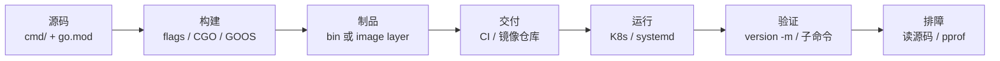
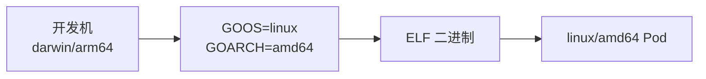
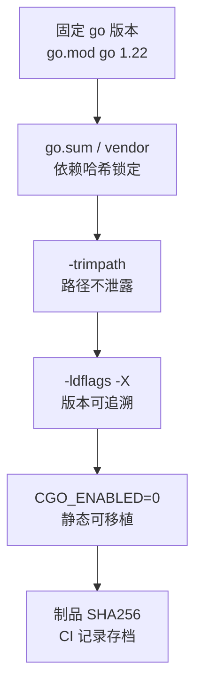
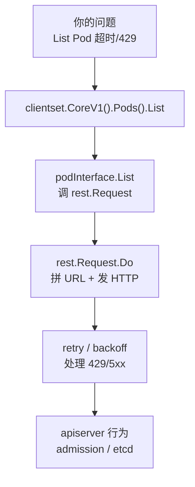
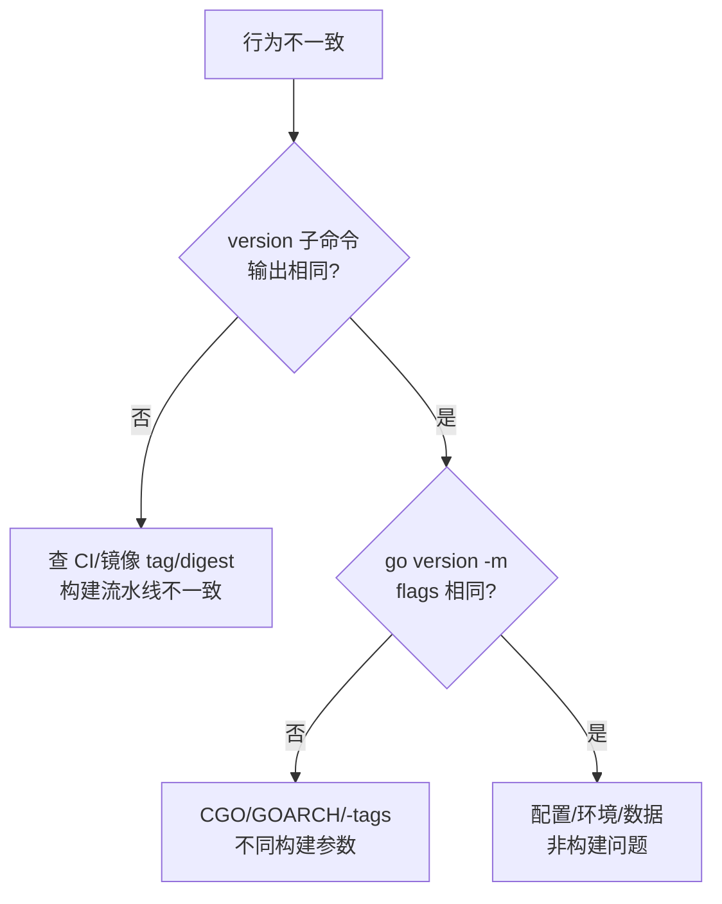

# 编译交付与读源码

> 测试服跑的 `hall-agent` 和正式服"同一个 tag"，行为却不一样——oncall 在容器里 `strings` 看到开发机路径 `/Users/alice/...`，安全审计直接红牌。
> **本章回答**：一个 Go 二进制从「源码 `go build`」到「镜像进生产」再到「线上验版本、读 K8s 源码」完整走一遍——go build flags、交叉编译、可复现构建、读官方库套路。
> **不讲**：Dockerfile 多阶段全集 → [04-02](../../../04-工程化与自动化/02-Docker深度/)；CI 流水线编排 → [04-04](../../../04-工程化与自动化/04-CI-CD/)；pprof 与 metrics → [13](../13-pprof与性能排查/)、[14](../14-CLI与Prometheus指标/)。

**标记**：🎯重点 · 🔥难点 · ⭐常考 · 🔧实操

---

## 一、面试怎么考

| 标记 | 考点 |
|------|------|
| **核心** | `GOOS`/`GOARCH`；`-ldflags "-s -w -X"`；`-trimpath`；`CGO_ENABLED=0` |
| **必会** | `go version -m binary`；embed vs `-X` 注入版本；多阶段镜像只拷静态二进制 |
| **常用** | `go mod vendor`；`go install` vs `go build`；读 `client-go` 从 `NewForConfig` 跟起 |
| **常考** | 为什么静态编译；`-s -w` 干什么；如何确认线上跑的是哪次 commit |

**30 秒怎么说**：交付用 `CGO_ENABLED=0 GOOS=linux GOARCH=amd64 go build -trimpath -ldflags "-s -w -X main.version=$TAG -X main.commit=$SHA"`。`-trimpath` 去掉本机路径；`-X` 注入版本。上线用 `go version -m ./hall-agent` 或自带 `version` 子命令核对。读 K8s 源码从接口 `RESTClient` 跟 `Do()`，别从 `main` 硬啃。

---

## 二、能力边界：go build 能干什么、不干什么

> 🎯 **一句话**：`go build` 产出**单文件静态二进制**——适合 CLI/agent/controller/exporter，不适合需要动态 C 库或热更新的场景。

| 维度 | `go build` 交付 | 解释型脚本 | 读源码 |
|------|----------------|-----------|--------|
| **适合** | CLI、agent、controller、exporter | 一次性胶水 | 理解 API 行为、排障 |
| **不适合** | 强依赖 CGO 且不愿静态链 | 毫秒级热更 | 替代官方文档 |
| **你要会** | 可复现、可审计的构建命令 | 何时必须 Go 二进制 | 跟调用链不跟全仓库 |

读源码**不是**通读全仓库——是从你要调的 API 反向跟到 HTTP 层，停在能解释现象的深度。Shell 和 Python 能干的胶水活不必用 Go 编二进制；但需要分发给多台机器、长期运行的 agent/controller，Go 静态二进制是运维首选。

---

## 三、语言最小集：go build 从认到用

> 🎯 **一句话**：一个 Go 二进制的一生：源码 + go.mod → `go build`(flags/CGO/GOOS) → 制品(二进制/镜像) → 交付(CI/registry) → 运行 → 验证 → 排障(读源码)。



**读图**：左段是**开发机/CI**，右段是**集群**；`VERIFY` 是 SRE 门禁——没版本信息的二进制不允许上生产。每个环节都有对应的 go build flags 或工具：构建用 `-ldflags -X -trimpath -s -w`，平台用 `GOOS/GOARCH`，链接用 `CGO_ENABLED`，验证用 `go version -m`，排障靠读源码。

Go 构建的最小动作就一行 `go build`。`-o` 改输出路径，其余 flags 控制「打进什么、去掉什么、给谁编译」：

```bash
go build -o bin/app ./cmd/app          # 编译 cmd/app，输出到 bin/app
go build .                               # 编译当前包，输出与目录同名
go env GOOS GOARCH CGO_ENABLED GOMODCACHE  # 查当前构建环境
# linux amd64 0 /root/pkg/mod /build/go.mod   # ← CGO_ENABLED=0 是运维默认
```

`go.mod` 声明模块路径和 Go 版本，`go.sum` 锁定每个依赖的哈希——**两个文件合在一起就是「这份代码用哪些版本的依赖」**。改了依赖要 `go mod tidy`，CI 构建前要 `go mod verify` 确认哈希没被篡改。

```bash
go mod tidy       # 清理依赖声明，去掉没用到的   # ← 每次 go.mod 变动后跑
go mod verify     # 校验 go.sum 哈希没被篡改      # ← CI 构建前必跑
go mod download   # 只下载依赖，不构建            # ← Dockerfile 里 COPY 后先跑这步
```

> 📝 **面试**：「`go.mod` 和 `go.sum` 各管什么？」——`go.mod` 声明依赖（直接依赖 + Go 版本），`go.sum` 记录每个依赖的哈希（防篡改）。CI 构建前 `go mod verify` 不通过就该停。

---

## 四、语法必会：go build flags 全家桶

> 🎯 **一句话**：生产 `go build` 一行命令里，每个 flag 解决一个交付问题——`-trimpath` 管安全、`-ldflags -X` 管版本、`-s -w` 管体积、`GOOS`/`GOARCH` 管平台、`CGO_ENABLED` 管链接方式。

这是 go build flags 的全家桶——面试官让你"写一个生产级 go build 命令"，就是考这些。

### -ldflags -X：链接期注入版本 ⭐🔥

`-X` 在**链接阶段**把字符串变量写进二进制——不需要重新编译源码，只需 `go build` 时传值。这是 Go 版本注入的**标准做法**，CI 里从 git tag/commit 取值注入。

```go
// cmd/hall-agent/main.go
package main

var (
    version   = "dev"    // ← 默认值，CI 用 -X 覆盖
    commit    = "none"
    buildDate = "unknown"
)

func main() {
    if len(os.Args) > 1 && os.Args[1] == "version" {
        fmt.Printf("hall-agent %s commit=%s built=%s\n", version, commit, buildDate)
        return
    }
    run()
}
```

```bash
go build -ldflags "-X main.version=1.4.2 -X main.commit=abc123 -X main.buildDate=2026-09-01" -o hall-agent ./cmd/hall-agent
./hall-agent version
# hall-agent 1.4.2 commit=abc123 built=2026-09-01   # ← CI 注入成功
```

> ⚠️ **别混**：`-X` 只能设 **string 变量**（不是 `const`），且变量必须在**可被链接的包**里。如果变量在 `pkg/buildinfo` 包，路径要写全：`-X github.com/org/app/pkg/buildinfo.Version=1.4.2`。包路径写错是 `-X` 不生效的**最常见原因**——CI 里 `./hall-agent version` 仍显示 `dev`，先查包路径。

> 💡 **打个比方**：`-ldflags -X` 像出厂前激光刻序列号——不拆机器、不重设计，只在最后一步烙上去。`//go:embed` 像把说明书装进盒子——适合文件内容，不适合 CI 环境变量。

### -s -w：strip 符号与 DWARF 🔧

```bash
go build -o app-nostrip ./cmd/app
go build -ldflags "-s -w" -o app-stripped ./cmd/app

ls -lh app-nostrip app-stripped
# -rwxr-xr-x 12M app-nostrip     # ← 无 -s -w，含完整符号与 DWARF
# -rwxr-xr-x 8.2M app-stripped   # ← 有 -s -w，体积降约 30%
```

`-s` 去掉**符号表**（symbol table），`-w` 去掉 **DWARF 调试信息**。两者合用通常让二进制体积降 20～30%。代价：**pprof 火焰图函数名可能变差**——生产与 debug 制品可分两条构建线，debug 不带 `-s -w`。

> ⚠️ **别混**：`-s -w` 去的是**调试信息**，不影响运行时行为。但 pprof 符号缺失会导致火焰图里出现 `0x...` 地址而非函数名。解法：oncall 用**带符号的 debug 构建**采 profile，或配合符号服务器（大型厂）。不要因为 pprof 就不加 `-s -w`——体积和供应链审计也要管。

### -trimpath：去路径泄露

不加 `-trimpath`，二进制里内嵌了编译机的**绝对路径**——`/Users/alice/proj/internal/...`。安全审计会标红：开发机结构、用户名、目录布局全部泄露。

```bash
go build -trimpath -o hall-agent ./cmd/hall-agent

strings hall-agent | grep -i '/Users\|/home\|/root'
# （无输出）   # ← -trimpath 生效，路径不进二进制

go version -m hall-agent | grep trimpath
# build -trimpath=true   # ← 构建信息里确认
```

> 🔍 **现场**：事故复盘发现线上 binary 里 `strings` 出开发机路径——不是 bug，是构建时**漏了 `-trimpath`**。团队应在 Makefile/CI 模板里固化此 flag，不靠人记。漏 `-trimpath` 在安全审计里是直接红牌。

### GOOS / GOARCH：交叉编译 ⭐

Go **原生支持交叉编译**——设 `GOOS`（目标 OS）和 `GOARCH`（目标架构），即可在 Mac 上编 Linux 二进制，不必在目标机编译。

```bash
CGO_ENABLED=0 GOOS=linux GOARCH=amd64 go build -trimpath -o bin/hall-agent-linux ./cmd/hall-agent
file bin/hall-agent-linux
# ELF 64-bit LSB executable, x86-64   # ← 确认目标格式

GOOS=windows GOARCH=amd64 go build -o bin/hall-agent.exe ./cmd/hall-agent
file bin/hall-agent.exe
# PE32+ executable (console) x86-64   # ← Windows 可执行
```



**读图**：交叉编译不装交叉编译器（CGO=0 时），`GOOS`/`GOARCH` 两个环境变量搞定一切。`GOARCH=arm64` 给 Graviton/Apple Silicon 节点。**必须与镜像基础架构一致**——`amd64` 二进制扔进 `arm64` 节点报 `exec format error`。

### CGO_ENABLED：静态 vs 动态 🔥

`CGO_ENABLED=0` 纯 Go 静态链——**运维工具的默认选择**。`CGO_ENABLED=1`（Mac 默认）链 C 库，产出动态依赖二进制。

```bash
CGO_ENABLED=0 go build -o app ./cmd/app    # 静态，单文件丢哪都能跑
CGO_ENABLED=1 go build -o app ./cmd/app    # 动态，依赖目标机 C 库
```

> 💡 **打个比方**：`CGO_ENABLED=0` 像自带电池的电器——插哪都能用。`CGO_ENABLED=1` 像需要外接电源的电器——你必须确保目标插座（C 库）型号匹配。Alpine 用 musl，Debian 用 glibc，两边不兼容。

> ⚠️ **别混**：Alpine 里跑 `CGO_ENABLED=1` 编的 Go 程序会报 `not found` 或 glibc 错误——不是文件不存在，是**动态链接器找不到 glibc**。解法：运维工具统一 `CGO_ENABLED=0`；确实需要 CGO（如 sqlite、某些 DNS 解析）要么在目标环境编译，要么换 Debian 基础镜像。Mac 上 `go env CGO_ENABLED` 默认可能 1，CI 应**显式写** `CGO_ENABLED=0` 避免漂移。

> 📝 **面试**：「Alpine 里 Go 程序起不来？」——先问 **是否 CGO=1 链了 glibc**；静态 `CGO_ENABLED=0` 一个二进制即可跑。追问「为什么 Go 容器常用 distroless/static？」——无 shell、静态二进制一个文件即可，攻击面最小。

### embed：编译期嵌入文件

`//go:embed` 在**编译期**把文件内容打进二进制——适合默认配置、静态页面、CHANGELOG。

```go
import _ "embed"

//go:embed config/default.yaml
var defaultConfig []byte

//go:embed CHANGELOG.md
var changelog string
```

```bash
go build -o hall-agent ./cmd/hall-agent
./hall-agent config --print-default
# server:
#   port: 8080          # ← embed 的默认配置，不依赖外部文件
```

| 对比 | `-ldflags -X` | `//go:embed` |
|------|---------------|--------------|
| 适合 | CI 环境变量注入的版本号 | 静态文件内容（配置、文档） |
| 类型 | 只能 string | `[]byte` / `string` |
| 时机 | 链接期 | 编译期 |

> ⚠️ **别混**：密钥和环境相关的生产配置**不要 embed**——用 ConfigMap/Secret。embed 适合**不变**的默认配置。embed 会增加二进制体积（等于文件大小），大资源考虑外置。

### 条件编译：build tags

`//go:build` 指令让文件只在特定条件编译——按 OS、架构、或自定义 tag 切换实现。这在 K8s 生态里很常见——`client-go` 用 `-tags` 切换不同认证实现，`etcd` 用它切换单机/集群代码路径。

```go
//go:build linux
//go:build !darwin

package main
// 仅 linux 编译此文件
```

```go
//go:build !linux

package main
// 非 linux 编译此文件（darwin/windows 的兜底实现）
```

```bash
go build -tags "osusergo" -o app ./cmd/app   # 用纯 Go 实现 user lookup
```

### go install vs go build

```bash
go install ./cmd/hallctl@latest    # 装到 $GOBIN，全局可用（go 1.20+）
go build -o $(go env GOPATH)/bin/hallctl ./cmd/hallctl  # 手动拷到 bin
```

`go install` = `go build` + 自动拷到 `GOBIN`。生产 CI 构建用 `go build -o`（精确控制输出路径），本机装 CLI 工具用 `go install`。

### 收束：一个生产 go build 命令凭什么可信



**读图**：缺任何一环都可能「看起来同 tag、实际不同二进制」。`-trimpath` 缺了泄露路径，`-X` 缺了无法追溯版本，`CGO` 没设可能在 Alpine 崩，`go.sum` 没验可能被篡改——**五环缺一不可**。

> 📝 **面试**：背诵这行命令——`CGO_ENABLED=0 GOOS=linux GOARCH=amd64 go build -trimpath -ldflags "-s -w -X main.version=$TAG -X main.commit=$SHA" -o app ./cmd/app`——每个 flag 能说出解决什么问题，就是「懂了」和「背了」的分水岭。

---

## 五、原理讲透：为什么 Go 能这样编译

> 🎯 **一句话**：Go 把「编译器 + 链接器」打包进 `go` 命令，所有平台的交叉编译器**内置**——这是 Go 对 C/C++ 最大的交付优势。

### 为什么自带交叉编译 🔥

C/C++ 交叉编译要装 `gcc-aarch64-linux-gnu` 等交叉工具链，配 `--sysroot`、调 `pkg-config`。Go 把**所有目标平台的编译后端**都编进了自带的工具链——`GOOS=linux GOARCH=arm64 go build` 不需要 `arm64-linux-gnu-gcc`，因为 Go 编译器自己就能生成 ARM64 机器码。

> 💡 **打个比方**：Go 编译器像多语言翻译官——会说几十种语言（GOOS/GOARCH 组合），不需要请外部翻译。但 CGO 打破这个优势：`CGO_ENABLED=1` 需要调用 C 编译器，就得装目标平台的 C 交叉链。所以运维工具统一 `CGO_ENABLED=0`——保持 Go 自带交叉编译的红利。

> ⚠️ **别混**：`CGO_ENABLED=1` 时交叉编译要目标平台 **C 交叉链**。Mac 上编 Linux CGO 程序需要 `x86_64-linux-gnu-gcc`，没装就报 `gcc: not found`。运维工具尽量 `CGO=0`，避免这个坑。

### -X 为什么只能 string

`-ldflags -X` 的工作原理是：**链接器在最终链接阶段找到目标符号，把它的值替换成指定字符串**。Go 的链接器只支持替换 `string` 类型变量（底层是 `{ptr, len}` 结构），不支持 `int`、`bool`。

- `const` 不行——常量在编译期就固化了，链接器改不动
- `var version string = "dev"` 行——是可变变量，链接器能改它的值
- `var version int` 不行——类型不匹配

数字版本要用字符串（`"1.4.2"`），或在 `init()` 里 `strconv.Atoi` 转换。

> 📝 **面试**：「`-X` 能注入 int 吗？」——不能，只能 string。数字版本号用字符串注入，运行时按需转换。这也是 `-X` 和 `embed` 的分工——embed 可以嵌任意文件的 `[]byte`，`-X` 只管 string 变量。

### vendor 与 go.sum 的可复现性 ⭐

```bash
go mod tidy       # 清理依赖
go mod verify     # 校验 go.sum 哈希
go mod vendor     # 把依赖拷进 vendor/
go build -mod=vendor -o bin/app ./cmd/app   # 用 vendor 构建，不访问网络
```

`go mod vendor` 把所有依赖源码拷进项目的 `vendor/` 目录。提交 `vendor/` 后，CI 构建**不依赖 module proxy**——适合 air-gapped 机房、离线 CI、供应链审计。

> ⚠️ **别混**：`vendor/` 和 `go.mod`/`go.sum` 必须**同步提交**——只提 `go.mod` 不提 `vendor`，或提了 `vendor` 但 `go.mod` 没更新，CI 会用不一致的依赖构建。CI 要固定 `go build -mod=vendor`，否则默认走 module cache，构建结果取决于谁先 `go mod download`。

> 📝 **面试**：「如何保证测试服和正式服同一个二进制？」——**同 git tag + 同 CI job + 制品 SHA256 门禁**，不是「差不多同一个分支」。`go.sum` 锁哈希防篡改，`vendor` 锁内容防漂移，`-trimpath` 去路径差异——三件一起才是可复现构建。

### go version -m 读了什么 🔧

```bash
go version -m ./hall-agent
# ./hall-agent: go1.22.5
#   path  github.com/org/hall-agent
#   mod   github.com/org/hall-agent v1.4.2
#   dep   k8s.io/client-go v0.29.0
#   build -trimpath=true
#   build -ldflags="-s -w -X main.version=1.4.2"
#   build vcs.revision=fa3b2c1...
#   build CGO_ENABLED=0
```

**读图**：`go version -m` 读的是 Go 1.18+ 内嵌的**构建信息**（VCS revision、build flags、module 版本）。节点上没有 git 也能从二进制反查 commit——这是线上验版本的**第一道工具**。旧版 Go（小于 1.18）没有 VCS 信息，只能靠 `-X` 注入的 version 子命令。

### SBOM、签名与供应链

大厂门禁 increasingly 要求**制品 SHA256**、**SBOM（软件物料清单）**、**cosign 签名**——SRE 要知道构建记录在哪查。

```bash
sha256sum bin/hall-agent
# a3f2c8...  hall-agent   # ← 制品哈希，CI 存档

go version -m bin/hall-agent | grep -E 'path|mod|vcs'
# 反查 module 版本与 VCS revision
```

CI 应存档：`git commit`、`go version`、`ldflags`、`镜像 digest`、`SHA256`。回滚按 **digest** 不按「昨天那个 tag」——tag 可变，digest 不可变。SBOM 工具（如 `syft`）可以扫描二进制依赖列表，cosign 可以对镜像签名验证来源可信。

---

## 六、生产模板：Makefile + Dockerfile 🔧

> 🎯 **一句话**：**Makefile 固化 flags**，**Dockerfile 多阶段只拷二进制**——两个模板覆盖 90% Go 交付场景。

### Makefile

```makefile
APP       := hall-agent
PKG       := ./cmd/hall-agent
VERSION   ?= $(shell git describe --tags --always --dirty)
COMMIT    ?= $(shell git rev-parse --short HEAD)
BUILD_DATE ?= $(shell date -u +%Y-%m-%dT%H:%M:%SZ)
LDFLAGS   := -s -w -X main.version=$(VERSION) -X main.commit=$(COMMIT) -X main.buildDate=$(BUILD_DATE)

.PHONY: build linux verify clean

build:
	go build -trimpath -ldflags "$(LDFLAGS)" -o bin/$(APP) $(PKG)

linux:
	CGO_ENABLED=0 GOOS=linux GOARCH=amd64 $(MAKE) build

verify:
	@bin/$(APP) version
	@go version -m bin/$(APP)

clean:
	rm -rf bin/
```

```bash
make linux
# CGO_ENABLED=0 GOOS=linux GOARCH=amd64 go build -trimpath -ldflags "..." -o bin/hall-agent ./cmd/hall-agent
# hall-agent v1.4.2-1-ga3b2c1 commit=a3b2c1 built=2026-09-01T08:00:00Z   # ← verify 输出
```

> 🔍 **现场**：`make linux && make verify` 是 CI 的最小验证闭环——构建完立刻自验版本号，不等到线上才发现 `-X` 没生效。`git describe --dirty` 会在有未提交改动时追加 `-dirty`，一眼看出非干净构建。

### 多阶段 Dockerfile

```dockerfile
# syntax=docker/dockerfile:1
FROM golang:1.22 AS builder
WORKDIR /src
COPY go.mod go.sum ./
RUN go mod download
COPY . .
ARG VERSION=dev
ARG COMMIT=unknown
RUN CGO_ENABLED=0 GOOS=linux go build -trimpath \
    -ldflags "-s -w -X main.version=${VERSION} -X main.commit=${COMMIT}" \
    -o /out/hall-agent ./cmd/hall-agent

FROM gcr.io/distroless/static-debian12
COPY --from=builder /out/hall-agent /hall-agent
USER nonroot:nonroot
ENTRYPOINT ["/hall-agent"]
```

```bash
docker build --build-arg VERSION=1.4.2 --build-arg COMMIT=$(git rev-parse --short HEAD) -t hall-agent:1.4.2 .
docker run --rm hall-agent:1.4.2 version
# hall-agent 1.4.2 commit=fa3b2c1   # ← 镜像里版本子命令可跑
```

**读图**：builder 阶段有 Go 工具链和源码，runtime 阶段**只有二进制**——无 shell、无源码、无 `go.mod`。排障靠版本子命令和日志，不是 `kubectl exec` 进去 `vi`。distroless 比 scratch 多了 CA 证书和时区数据，比 alpine 少了 shell 和包管理器——攻击面最小。

> ⚠️ **别混**：**镜像 tag 可变**——同一个 `hall-agent:1.4.2` 可以指向不同 digest。要以 **digest**（`hall-agent:1.4.2@sha256:abc...`）或构建记录里的 SHA256 为准做回滚。Dockerfile 多阶段细节全集见 [04-02](../../../04-工程化与自动化/02-Docker深度/)。

---

## 七、读源码：从 client-go 到 cobra ⭐

> 🎯 **一句话**：**从你要调的 API 往里跟**，不要从 `main` 啃——接口 → 实现 → `Do()`/`Watch()`，停在能解释现象的深度。

### 读 client-go：List Pod 超时怎么跟

```go
// 典型调用入口
config, _ := clientcmd.BuildConfigFromFlags("", kubeconfig)
clientset, _ := kubernetes.NewForConfig(config)
pods, err := clientset.CoreV1().Pods("default").List(ctx, metav1.ListOptions{})
```

跟码路径：



**读图**：左边是 **client-go**（客户端重试/限流），右边是 **apiserver**（admission/etcd）。List Pod 偶发 429——一半可能是客户端 `rest.Request` 的重试逻辑没配对，一半可能是 apiserver 限流。跟到 `Do()` 和 `retry` 这一层就能定位，不必读完整 controller-runtime 仓库。

```bash
go doc k8s.io/client-go/rest.Config          # 查类型文档
go install golang.org/x/tools/cmd/goimports@latest  # 装格式化工具
# 模块缓存里读源码：
ls $(go env GOMODCACHE)/k8s.io/client-go@v0.29.0/kubernetes/typed/core/v1/
# pod.go  ← List 的接口定义和实现都在这
```

> 📝 **面试**：「怎么读 Go 开源库？」——**从调用点反向跟**；看 **test 文件当文档**（test 展示了作者预期的用法）；`git tag` 对齐你集群版本——`client-go` v0.29.0 对应 K8s 1.29，版本不对齐读到的方法可能不存在。

### 读 cobra CLI 框架

很多 Go CLI 工具（kubectl、helm、containerd）用 **cobra** 命令框架。读源码从 `Command.Execute()` 跟起：

```go
// 典型 cobra 入口
rootCmd := &cobra.Command{
    Use:   "hallctl",
    Short: "Hall agent CLI",
}
rootCmd.AddCommand(versionCmd)
rootCmd.Execute()
```

跟码路径：`Execute()` → `Find(args)` 找子命令 → `Flags().Parse()` 解析参数 → `RunE` 执行业务逻辑。cobra 的核心是**命令树 + flag 解析**——理解了 `Command` 结构体的 `RunE`/`PreRunE`/`PostRunE` 钩子链，就读懂了大多数 Go CLI 工具的骨架。

> ⚠️ **别混**：读源码**不是**通读全仓库。明确你的问题（List Pod 超时？cobra 子命令没注册？），从调用点跟到能解释现象的深度就停。不读完整仓库不影响排障——你不需要理解 cobra 的每行代码，只需要知道子命令注册在哪、flag 解析在哪一步。

### 读 Informer：跟一次缓存机制

控制器问题从 **`sharedIndexInformer`** → **`ListWatch`** → **`DeltaFIFO`** 跟：

```go
factory := informers.NewSharedInformerFactory(clientset, time.Minute*10)
podInformer := factory.Core().V1().Pods().Informer()
podInformer.AddEventHandler(cache.ResourceEventHandlerFuncs{
    AddFunc: func(obj interface{}) { /* ... */ },
})
factory.Start(ctx.Done())
factory.WaitForCacheSync(ctx.Done())
```

`resyncPeriod`（这里 `10min`）不是「更实时」，而是**定期重放缓存**——设太短会 List 风暴打爆 apiserver。跟到 `sharedIndexInformer.HandleDelta` 就能看清 resync 如何把全量缓存重新分发给 handler。

apiserver 行为见 [03-Kubernetes](../../../03-Kubernetes/)。pprof 排障见 [13](../13-pprof与性能排查/)。

---

## 八、作战与踩坑：构建不一致怎么办

> 🎯 **一句话**：收到「同 tag 不同行为」报障，先比 digest 再比 build flags，最后才查配置/数据。



**读图**：第一刀比 version 子命令——不同就是构建产物不一致，查 CI 流水线；相同再比 `go version -m` 的 build flags——CGO/GOARCH/-tags 差异会导致同 tag 产出不同二进制；都相同就是运行时环境差异。

| 现象 | 原因 | 修法 |
|------|------|------|
| `-X` 不生效 | 包路径错、变量非 string、变量在不可达包 | 检查 `main.version` 全路径，变量是 `var` 不是 `const` |
| Mac 编的在 Linux 不能跑 | GOOS 未设 | `GOOS=linux`，CI 模板固化 |
| Alpine 里 `not found` | CGO=1 链了 glibc | `CGO_ENABLED=0` 或换 Debian 基础镜像 |
| 路径泄露到二进制 | 漏了 `-trimpath` | Makefile 固化 `-trimpath` |
| vendor 与 mod 不一致 | 只提了 go.mod 没提 vendor，或反之 | CI `go build -mod=vendor`，两者同步提交 |
| distroless 无法 shell | 设计如此——无 shell | 侧车 debug 容器或临时换 busybox 镜像 |
| pprof 火焰图全 `0x...` | `-s -w` 去了符号 | 用带符号的 debug 构建采 profile |
| 读源码版本不对 | GOMODCACHE 有多版本 | `go list -m k8s.io/client-go` 对齐集群 |
| UPX 压缩被杀软拦 | UPX 特征明显 | 生产慎用 UPX |
| `exec format error` | GOARCH 不匹配 | `file` 确认架构，GOARCH 与节点一致 |

### 60 秒剧本 🔧

> 🔍 **现场**：收到「行为不一致」报障，60 秒走完这条线再下结论。

```text
① 0-15s   kubectl get pod -o jsonpath='{.spec.containers[0].image}'  取镜像 digest
② 15-30s  exec 进去 ./app version 或 go version -m 看 version/commit/flags
③ 30-45s  对比 CI 该 tag 的构建记录 SHA256 与 ldflags
④ 45-60s  不一致 → 停止扩散，回滚 digest；一致 → 查 ConfigMap/环境变量/数据
```

---

## 九、必会常考

### 对错一句话

- 错：以为 tag 相同就是同一二进制 → 对：看 **digest/SHA256**，tag 可变
- 错：生产用 `-race` 构建 → 对：`-race` **仅测试**，生产会 10x 性能损耗
- 错：CGO=1 配 Alpine musl 能跑 → 对：**CGO=0 或换 Debian**
- 错：从 `main` 读完整 K8s → 对：**从问题 API 反向跟**
- 错：不设 `-trimpath` 没关系 → 对：**路径进二进制是安全风险**
- 错：`go.sum` 和 `go.mod` 一回事 → 对：`go.mod` 声明依赖，`go.sum` 锁哈希
- 错：`-X` 能注入 int → 对：**只能 string**，数字用字符串
- 错：embed 适合放密钥 → 对：用 **ConfigMap/Secret**，embed 只放不变默认值
- 错：`go install` 和 `go build` 一样 → 对：`go install` 自动装到 `$GOBIN`，`go build -o` 精确控制输出

### 易混对照

| 易混 | 区别 |
|------|------|
| `-X` vs `embed` | `-X` 链接期注入 string（CI 变量）；`embed` 编译期嵌入文件内容 |
| `-s` vs `-w` | `-s` 去符号表；`-w` 去 DWARF 调试信息 |
| `go mod vendor` vs `go mod download` | vendor 拷进仓库离线构建；download 只缓存不拷入 |
| `go build` vs `go install` | `-o` 精确输出路径；install 装到 GOBIN |
| tag vs digest | tag 可变可覆盖；digest 不可变 |
| `go.sum` vs `vendor` | sum 锁哈希防篡改；vendor 锁内容防漂移 |

### 数字墙

> `-s -w` 体积降约 **20-30%** · CGO_ENABLED=0 运维默认 · go 1.18+ 构建信息内嵌 VCS · go.sum 锁**每个依赖哈希** · vendor 离线构建 · distroless 无 shell · `-X` 仅 **string** · `-race` **仅测试** · `resyncPeriod` 不是实时而是重放 · Mac 上 `go env CGO_ENABLED` 默认可能 **1**

---

## 合上书

- [ ] **默画主图**：源码 → `go build`(flags/CGO/GOOS) → 制品 → 交付 → 运行 → 验证 → 排障（读源码）。
- [ ] 写出带 `-trimpath` 和三个 `-X` 的完整 `go build` 命令，并说出每个 flag 解决什么问题。
- [ ] 解释 `CGO_ENABLED=0` 与 Alpine/distroless 的关系——为什么 `CGO=1` 在 Alpine 会崩。
- [ ] 口述 `go version -m` 输出里你会看哪几行，以及它为什么能从二进制反查 commit。
- [ ] 说清 `go mod vendor` 在 CI 里的价值——什么场景必须用、vendor 与 go.mod 的同步要求。
- [ ] 画多阶段 Dockerfile 两阶段各干什么——builder 有什么，runtime 有什么。
- [ ] 描述读 client-go List Pod 的跟码路径（至少 4 层），并说清为什么不从 `main` 啃。
- [ ] 列举两个「同 tag 不同行为」的原因——digest 不同、GOARCH/CGO/-tags 不同。
- [ ] 说明 `-s -w` 对 pprof 的影响及应对方案——两条构建线。
- [ ] 对比 embed 与 `-X` 注入版本各适合什么场景——动态 CI 变量 vs 静态文件。

下一章：[16-泛型与代码生成](../16-泛型与代码生成/)。Docker 深度：[04-02](../../../04-工程化与自动化/02-Docker深度/)。pprof：[13](../13-pprof与性能排查/)。
