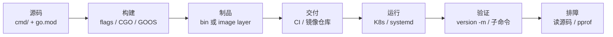
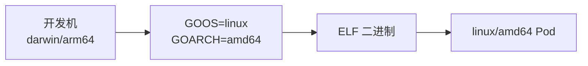
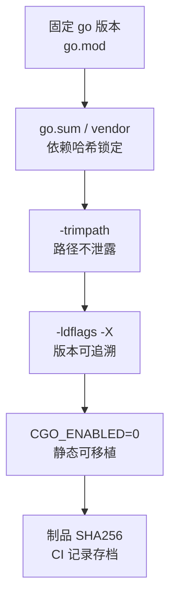
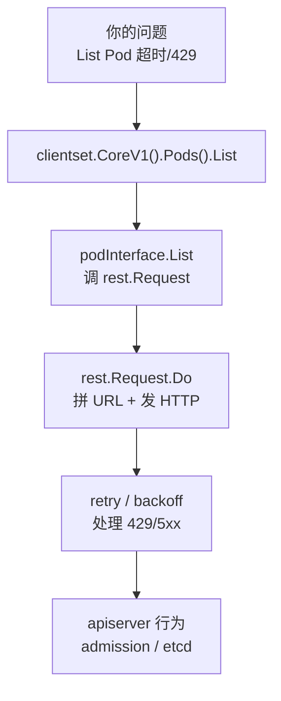
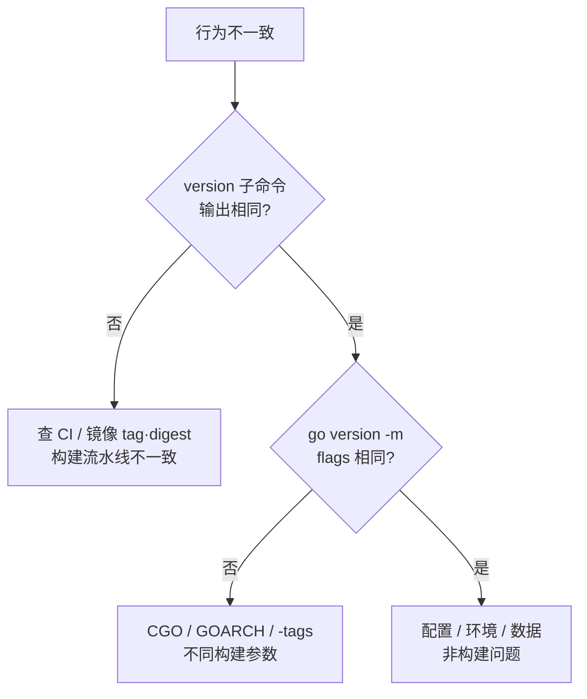

# 15｜编译交付与读源码 · SRE 开发能力

> 测试服与正式服都挂着「同一个 tag」的 `hall-agent`，行为却对不上——oncall 在容器里 `strings` 扫出 `/Users/alice/...`，安全审计直接红牌；群里已有人喊「再打一次 tag」。
> **本章回答**：一个 Go 二进制从 `go build` → 制品/镜像 → 线上验版本 → 读官方库排障的完整交付链——flags、交叉编译、可复现、读码套路。
> **不讲**：Dockerfile 多阶段全集 → [04-02](../../../04-工程化与自动化/02-Docker深度/)；CI 流水线编排 → [04-04](../../../04-工程化与自动化/04-CI-CD/)；pprof / metrics → [13](../13-pprof与性能排查/)、[14](../14-CLI与Prometheus指标/)。

**标记**：🎯重点 · 🔥难点 · ⭐常考 · 🔧实操

---

## 面试怎么考

| 标记 | 考点 |
|------|------|
| **核心** | `GOOS`/`GOARCH`；`-ldflags "-s -w -X"`；`-trimpath`；`CGO_ENABLED=0` |
| **必会** | `go version -m binary`；embed vs `-X`；多阶段镜像只拷静态二进制 |
| **常用** | `go mod vendor`；`go install` vs `go build`；读 `client-go` 从 `NewForConfig` 跟起 |
| **常考** | 为什么静态编译；`-s -w` 干什么；如何确认线上跑的是哪次 commit |

**30 秒怎么说**：交付用 `CGO_ENABLED=0 GOOS=linux GOARCH=amd64 go build -trimpath -ldflags "-s -w -X main.version=$TAG -X main.commit=$SHA"`。`-trimpath` 去本机路径；`-X` 注入版本。上线用 `go version -m ./hall-agent` 或自带 `version` 子命令核对。读 K8s 源码从接口跟到 `Do()`，别从 `main` 硬啃。

---

## 能力边界

> 🎯 **一句话**：`go build` 产出**单文件静态二进制**——适合 CLI/agent/controller/exporter，不适合强依赖动态 C 库或毫秒级热更。

| 维度 | `go build` 交付 | 解释型脚本 | 读源码 |
|------|----------------|-----------|--------|
| **适合** | CLI、agent、controller、exporter | 一次性胶水 | 理解 API 行为、排障 |
| **不适合** | 强依赖 CGO 且不愿静态链 | 毫秒级热更 | 替代官方文档 |
| **你要会** | 可复现、可审计的构建命令 | 何时必须 Go 二进制 | 跟调用链不跟全仓库 |

- 🧰 **三层边界**
  - **构建**：flags / CGO / GOOS —— 管「打成什么样」
  - **制品**：二进制 / 镜像 digest —— 管「跑的是哪一份」
  - **读码**：从调用点反向跟 —— 管「行为为什么这样」，不是通读仓库

本节对应练习题 Q1。边界清了——最小集。

---

## 语言最小集

读运维 Go 交付的 12 个「零件」——认命令下限，不是工具链大全。

| 零件 | 示例 | 含义 |
|------|------|------|
| go build | `go build -o bin/app ./cmd/app` | 编译包 → 二进制 |
| -trimpath | `go build -trimpath` | 去掉编译机绝对路径 |
| -ldflags -X | `-X main.version=$TAG` | 链接期注入 string |
| -s -w | `-ldflags "-s -w"` | 去符号表 / DWARF |
| GOOS/GOARCH | `GOOS=linux GOARCH=amd64` | 交叉编译目标 |
| CGO_ENABLED | `CGO_ENABLED=0` | 纯 Go 静态链（运维默认） |
| go version -m | `go version -m ./bin` | 读内嵌构建信息 |
| //go:embed | `//go:embed config.yaml` | 编译期嵌入文件 |
| //go:build | `//go:build linux` | 条件编译 |
| go mod vendor | `go build -mod=vendor` | 离线可复现 |
| go install | `go install ./cmd/x@latest` | build + 装到 GOBIN |
| file | `file bin/app` | 确认 ELF/PE 与架构 |

```bash
go env GOOS GOARCH CGO_ENABLED GOMODCACHE
# linux amd64 0 /root/pkg/mod   # ← CGO_ENABLED=0 是运维默认；Mac 本机可能是 1
go mod tidy && go mod verify    # ← tidy 整理声明；verify 校验哈希（CI 构建前）
```

---

## 一、一张图：一个二进制的一生

> 🎯 **一句话**：源码 + go.mod → `go build`(flags/CGO/GOOS) → 制品 → 交付 → 运行 → 验证 → 排障（读源码）。



- 📖 **读图**
  - 🛤️ 左段是开发机/CI，右段是集群；**VERIFY** 是 SRE 门禁——没版本信息的二进制不允许上生产
  - 💣 开头事故卡在 **BUILD→ART**：同 tag 却漏了 `-trimpath` / 不同 CI job → 行为漂移 + 路径泄露

> 📝 **面试**：「`go.mod` 和 `go.sum` 各管什么？」——`go.mod` 声明依赖与 Go 版本；`go.sum` 记每个依赖哈希。CI 构建前 `go mod verify` 不过就该停。（→ [02](../02-工程结构与go-mod/)）

本节对应练习题 Q1、Q2。主线清楚了——出生：一行生产级 build。

---

## 二、出生：生产级 go build 🎯⭐

> 🎯 **一句话**：生产 `go build` 一行里，每个 flag 解决一个交付问题——`-trimpath` 管安全、`-X` 管版本、`-s -w` 管体积、`GOOS`/`GOARCH` 管平台、`CGO` 管链接。

### 🏷️ -ldflags -X：链接期刻序列号 ⭐🔥

`-X` 在**链接阶段**把 string 变量写进二进制——CI 从 git tag/commit 取值注入，不必改源码。

```go
// cmd/hall-agent/main.go
package main

var (
    version   = "dev"    // ← 默认值，CI 用 -X 覆盖
    commit    = "none"
    buildDate = "unknown"
)

func main() {
    if len(os.Args) > 1 && os.Args[1] == "version" {
        fmt.Printf("hall-agent %s commit=%s built=%s\n", version, commit, buildDate)
        return
    }
    run()
}
```

```bash
go build -ldflags "-X main.version=1.4.2 -X main.commit=abc123 -X main.buildDate=2026-09-01" \
  -o hall-agent ./cmd/hall-agent
./hall-agent version
# hall-agent 1.4.2 commit=abc123 built=2026-09-01   # ← CI 注入成功
```

- 🔑 **-X 三条硬规则**
  - 只能设 **string 的 `var`**，不能是 `const` / `int` / `bool`
  - 变量必须在**可被链接到的包**里；子包要写全路径：`-X github.com/org/app/pkg/buildinfo.Version=1.4.2`
  - 包路径写错 → `version` 仍显示 `dev`——**最常见失效原因**

> 💡 **打个比方**：`-X` 像出厂前激光刻序列号——不拆机器、不重设计，最后一步烙上去。`//go:embed` 像把说明书装进盒子——适合文件内容，不适合 CI 环境变量。

#### ❓ 为什么 -X 只能 string？

- 🔗 **链接器只认 `{ptr, len}`**：找到符号后替换字符串值；`int`/`bool` 布局不同，不支持
- ❌ **`const` 不行**：编译期已固化，链接器改不动
- ✅ **数字版本**：注入 `"1.4.2"`，需要时再 `strconv.Atoi`

> ⚠️ **别混**：`-X` ≠ `embed`。前者链接期注入 **CI 变量**；后者编译期嵌入 **文件内容**（`[]byte`/`string`）。密钥与环境相关配置**不要 embed**——用 ConfigMap/Secret。

### 📉 -s -w：瘦身与代价 🔧

```bash
go build -o app-nostrip ./cmd/app
go build -ldflags "-s -w" -o app-stripped ./cmd/app
ls -lh app-nostrip app-stripped
# -rwxr-xr-x 12M app-nostrip     # ← 含完整符号与 DWARF
# -rwxr-xr-x 8.2M app-stripped   # ← 体积降约 30%
```

- `-s` 去**符号表**；`-w` 去 **DWARF**；合用通常降 20～30%
- 代价：pprof 火焰图可能变成 `0x...`——生产与 debug **两条构建线**，debug 不加 `-s -w`

> ⚠️ **别混**：`-s -w` 不影响运行时行为，只影响调试符号。不要因为 pprof 就永久不加——体积与供应链审计也要管。

#### ❓ 为什么生产还要加 -s -w？和 pprof 不冲突吗？

- 📦 **体积 + 少暴露内部符号**是常态交付要求
- 🔥 **排障用带符号制品**采 profile，或符号服务器——不是生产二进制永远带 DWARF
- ✅ 口诀：**交付 strip，取证不 strip**

### 🧹 -trimpath：路径不进二进制 ⭐

不加 `-trimpath`，二进制内嵌编译机绝对路径——`/Users/alice/...`。审计标红：用户名、目录布局全泄露。

```bash
go build -trimpath -o hall-agent ./cmd/hall-agent
strings hall-agent | grep -E '/Users|/home|/root'
# （无输出）   # ← -trimpath 生效
go version -m hall-agent | grep trimpath
# build -trimpath=true   # ← 构建信息里确认
```

> 🔍 **现场**：线上 `strings` 出开发机路径——不是业务 bug，是构建漏了 `-trimpath`。固化进 Makefile/CI，不靠人记。

#### ❓ 为什么「再打一次 tag」治不好路径泄露？

- 🏷️ **tag 只标源码快照**，不强制构建 flags
- 🧾 漏 `-trimpath` 的 CI job 再打一百次 tag，路径照样进二进制
- ✅ 要改的是**构建模板**，不是标签名字

本节对应练习题 Q3、Q4。flags 钉住版本与安全——交叉编译与 CGO。

---

## 三、干活：交叉编译与静态链接 ⭐🔥

> 🎯 **一句话**：`GOOS`/`GOARCH` 选目标机；`CGO_ENABLED=0` 保住「插哪都能跑」；架构与节点不一致就 `exec format error`。

### 🌍 GOOS / GOARCH：交叉编译 ⭐

Go **原生交叉编译**——Mac 上编 Linux 二进制，不必在目标机装编译器（`CGO=0` 时）。

```bash
CGO_ENABLED=0 GOOS=linux GOARCH=amd64 go build -trimpath -o bin/hall-agent-linux ./cmd/hall-agent
file bin/hall-agent-linux
# ELF 64-bit LSB executable, x86-64   # ← 确认目标格式

GOOS=windows GOARCH=amd64 go build -o bin/hall-agent.exe ./cmd/hall-agent
file bin/hall-agent.exe
# PE32+ executable (console) x86-64
```



- 📖 **读图**
  - 🚪 `GOOS`/`GOARCH` 两个环境变量切换后端；`arm64` 给 Graviton / Apple Silicon 节点
  - 💣 **必须与镜像基础架构一致**——`amd64` 二进制扔进 `arm64` 节点 → `exec format error`

### 🔋 CGO_ENABLED：静态 vs 动态 🔥

`CGO_ENABLED=0` 纯 Go 静态链——**运维工具默认**。`=1`（Mac 常默认）链 C 库，产出动态依赖。

```bash
CGO_ENABLED=0 go build -o app ./cmd/app    # 静态，单文件
CGO_ENABLED=1 go build -o app ./cmd/app    # 动态，依赖目标机 C 库
```

> 💡 **打个比方**：`CGO=0` 像自带电池——插哪都能用。`CGO=1` 像外接电源——目标插座（glibc vs musl）必须匹配。

#### ❓ 为什么运维默认 CGO_ENABLED=0？

- 🧳 **静态单文件**：distroless/scratch 都能跑，攻击面最小
- 🏔️ **Alpine 坑**：`CGO=1` 链了 glibc → Alpine 里报 `not found`（动态链接器找不到 glibc，不是文件丢了）
- 🔧 **交叉红利**：`CGO=1` 要目标平台 C 交叉链；`=0` 才享受 Go 自带多后端
- ✅ CI **显式写** `CGO_ENABLED=0`——Mac 本机默认可能是 1，避免漂移

> 📝 **面试**：「Alpine 里 Go 程序起不来？」——先问是否 CGO=1 链了 glibc；静态 `CGO=0` 一个文件即可。追问 distroless——无 shell、静态二进制，攻击面最小。

### 📎 embed · build tags · install

- **embed**：编译期打进默认配置 / CHANGELOG；大资源与密钥外置
- **`//go:build linux`**：按 OS/自定义 tag 切换实现；`go build -tags osusergo`
- **`go install`** = `go build` + 拷到 `$GOBIN`；生产 CI 用 `go build -o` 精确控路径

### 🧩 收束：生产 go build 凭什么可信 🎯



- 📖 **读图**：缺任何一环都可能「看起来同 tag、实际不同二进制」——五环缺一不可

> 📝 **面试**：背 `CGO_ENABLED=0 GOOS=linux GOARCH=amd64 go build -trimpath -ldflags "-s -w -X main.version=$TAG -X main.commit=$SHA" -o app ./cmd/app`——每个 flag 能说出解决什么问题，才是「懂了」。

⭐ `-X` 钉版本；`-trimpath` 去路径。练习题 Q5。原理：为什么 Go 能这样编。

---

## 四、原理：可复现与 go version -m 🔥

> 🎯 **一句话**：Go 把各平台编译后端打进 `go` 命令；可复现靠 **同源码 + 同 flags + 同依赖指纹 + 制品哈希**。

### 🧭 为什么自带交叉编译 🔥

C/C++ 要装交叉工具链、配 sysroot。Go 编译器自己生成目标机器码——`GOOS=linux GOARCH=arm64 go build` 不需要外部 `aarch64-linux-gnu-gcc`（除非 CGO=1）。

> ⚠️ **别混**：`CGO_ENABLED=1` 交叉编译仍要目标平台 **C 交叉链**；没装就报 `gcc: not found`。运维工具尽量 `CGO=0`。

### 🔒 vendor 与 go.sum ⭐

```bash
go mod tidy
go mod verify
go mod vendor
go build -mod=vendor -o bin/app ./cmd/app   # 不访问网络
```

- **vendor**：依赖源码进仓，air-gapped / 离线 CI / 供应链审计
- **同步**：`vendor/` 与 `go.mod`/`go.sum` **必须同提交**；CI 固定 `-mod=vendor`，否则默认走 module cache 会漂移

> 📝 **面试**：「如何保证测服和正式服同一个二进制？」——**同 git tag + 同 CI job + 制品 SHA256 门禁**，不是「差不多同一分支」。sum 锁哈希、vendor 锁内容、`-trimpath` 去路径差——三件一起才是可复现。

### 🔎 go version -m 读了什么 🔧

```bash
go version -m ./hall-agent
# ./hall-agent: go1.22.5
#   path  github.com/org/hall-agent
#   mod   github.com/org/hall-agent v1.4.2
#   dep   k8s.io/client-go v0.29.0
#   build -trimpath=true
#   build -ldflags="-s -w -X main.version=1.4.2"
#   build vcs.revision=fa3b2c1...
#   build CGO_ENABLED=0
```

- 📖 **读图**
  - Go **1.18+** 内嵌构建信息：VCS revision、flags、module 版本
  - 节点上没有 git 也能反查 commit——线上验版本**第一道工具**；更旧只能靠 `-X` 的 version 子命令

### 📦 SBOM、签名与 digest

```bash
sha256sum bin/hall-agent
# a3f2c8...  hall-agent   # ← 制品哈希，CI 存档
```

- CI 存档：`git commit`、`go version`、`ldflags`、**镜像 digest**、`SHA256`
- 回滚按 **digest**（`image@sha256:...`），不按「昨天那个 tag」——tag 可变，digest 不可变
- 大厂门禁还可能要 SBOM（如 syft）、cosign 签名——知道记录在哪查即可

本节对应练习题 Q6、Q7。原理清了——生产模板。

---

## 五、外套：Makefile + 多阶段镜像 🔧

> 🎯 **一句话**：**Makefile 固化 flags**，**Dockerfile 多阶段只拷二进制**——两个模板覆盖 90% Go 交付场景。

### Makefile

```makefile
APP       := hall-agent
PKG       := ./cmd/hall-agent
VERSION   ?= $(shell git describe --tags --always --dirty)
COMMIT    ?= $(shell git rev-parse --short HEAD)
BUILD_DATE ?= $(shell date -u +%Y-%m-%dT%H:%M:%SZ)
LDFLAGS   := -s -w -X main.version=$(VERSION) -X main.commit=$(COMMIT) -X main.buildDate=$(BUILD_DATE)

.PHONY: build linux verify clean

build:
	go build -trimpath -ldflags "$(LDFLAGS)" -o bin/$(APP) $(PKG)

linux:
	CGO_ENABLED=0 GOOS=linux GOARCH=amd64 $(MAKE) build

verify:
	@bin/$(APP) version
	@go version -m bin/$(APP)

clean:
	rm -rf bin/
```

```bash
make linux && make verify
# hall-agent v1.4.2-1-ga3b2c1 commit=a3b2c1 built=2026-09-01T08:00:00Z
```

> 🔍 **现场**：构建完立刻自验版本号，不等到线上才发现 `-X` 没生效。`git describe --dirty` 有未提交改动会追加 `-dirty`。

### 多阶段 Dockerfile

```dockerfile
# syntax=docker/dockerfile:1
FROM golang:1.22 AS builder
WORKDIR /src
COPY go.mod go.sum ./
RUN go mod download
COPY . .
ARG VERSION=dev
ARG COMMIT=unknown
RUN CGO_ENABLED=0 GOOS=linux go build -trimpath \
    -ldflags "-s -w -X main.version=${VERSION} -X main.commit=${COMMIT}" \
    -o /out/hall-agent ./cmd/hall-agent

FROM gcr.io/distroless/static-debian12
COPY --from=builder /out/hall-agent /hall-agent
USER nonroot:nonroot
ENTRYPOINT ["/hall-agent"]
```

```bash
docker build --build-arg VERSION=1.4.2 --build-arg COMMIT=$(git rev-parse --short HEAD) -t hall-agent:1.4.2 .
docker run --rm hall-agent:1.4.2 version
# hall-agent 1.4.2 commit=fa3b2c1
```

- 📖 **读图**
  - builder 有工具链与源码；runtime **只有二进制**——无 shell、无源码
  - distroless 比 scratch 多 CA/时区，比 alpine 少 shell——攻击面最小；排障靠版本子命令与日志，不是 `kubectl exec` 进 `vi`

#### ❓ 为什么回滚不能只看镜像 tag？

- 🏷️ **同一 tag 可被覆盖**，指向不同 digest
- ✅ 回滚写 `hall-agent:1.4.2@sha256:abc...` 或构建记录里的 SHA256
- 📚 Dockerfile 多阶段细节全集 → [04-02](../../../04-工程化与自动化/02-Docker深度/)

本节对应练习题 Q8、Q9。模板拿走——读源码套路。

---

## 六、排障：从调用点读源码 ⭐

> 🎯 **一句话**：**从你要调的 API 往里跟**，不要从 `main` 啃——接口 → 实现 → `Do()`/`Watch()`，停在能解释现象的深度。

### 📡 读 client-go：List Pod 超时

```go
config, _ := clientcmd.BuildConfigFromFlags("", kubeconfig)
clientset, _ := kubernetes.NewForConfig(config)
pods, err := clientset.CoreV1().Pods("default").List(ctx, metav1.ListOptions{})
```



- 📖 **读图**
  - 左半是 **client-go**（重试/限流），右半是 **apiserver**；跟到 `Do()` + retry 就能定责半边，不必读完整 controller-runtime
  - 📚 apiserver 深排障 → [03-Kubernetes](../../../03-Kubernetes/)

```bash
go doc k8s.io/client-go/rest.Config
ls $(go env GOMODCACHE)/k8s.io/client-go@v0.29.0/kubernetes/typed/core/v1/
# pod.go  ← List 接口与实现
```

#### ❓ 为什么不从 main 通读仓库？

- 🎯 **问题驱动**：超时/429/子命令没注册——入口是调用点，不是整个进程启动故事
- ⏱️ **停在能解释现象的深度**就够；再往下是消遣不是值班
- ✅ **test 文件当文档**；`git tag` 对齐集群版本（`client-go` v0.29 ↔ K8s 1.29）

> 📝 **面试**：「怎么读 Go 开源库？」——从调用点反向跟；看 test；版本对齐你集群。

### 🌳 读 cobra：命令树

`Execute()` → `Find(args)` → `Flags().Parse()` → `RunE`。核心是**命令树 + flag 解析**——搞清 `RunE`/`PreRunE`/`PostRunE` 钩子链，就懂大多数 Go CLI 骨架。

> ⚠️ **别混**：读源码 ≠ 通读全仓库。明确问题，跟到能解释就停。

### 🗂️ 读 Informer：缓存与 resync

```go
factory := informers.NewSharedInformerFactory(clientset, time.Minute*10)
podInformer := factory.Core().V1().Pods().Informer()
factory.Start(ctx.Done())
factory.WaitForCacheSync(ctx.Done())
```

- 跟：`sharedIndexInformer` → `ListWatch` → `DeltaFIFO`
- **`resyncPeriod` 不是「更实时」**，是定期重放缓存——太短会 List 风暴打爆 apiserver
- pprof 侧 → [13](../13-pprof与性能排查/)

本节对应练习题 Q10、Q11。读码会了——作战不一致。

---

## 七、作战：同 tag 不同行为 🔧

> 🎯 **一句话**：收到「同 tag 不同行为」，先比 digest 再比 build flags，最后才查配置/数据。



- 📖 **读图**：第一刀 version 子命令 → 第二刀 `go version -m` flags → 都同才查运行时环境

| 现象 | 原因 | 修法 |
|------|------|------|
| `-X` 不生效 | 包路径错 / 非 string / const | 查全路径；必须是 `var` |
| Mac 编的 Linux 不能跑 | GOOS 未设 | `GOOS=linux`，CI 固化 |
| Alpine `not found` | CGO=1 链 glibc | `CGO_ENABLED=0` 或换 Debian |
| 路径泄露 | 漏 `-trimpath` | Makefile 固化 |
| vendor 与 mod 不一致 | 只提一边 | 同步提交 + `-mod=vendor` |
| distroless 无法 shell | 设计如此 | debug 侧车 / 临时 busybox |
| pprof 全 `0x...` | `-s -w` | 带符号 debug 构建 |
| 读源码版本不对 | GOMODCACHE 多版本 | `go list -m` 对齐集群 |
| `exec format error` | GOARCH 不匹配 | `file` 确认架构 |
| UPX 被杀软拦 | UPX 特征 | 生产慎用 |

### 60 秒剧本 🔧

> 🔍 **现场**：行为不一致报障，60 秒走完再下结论。

```text
① 0-15s   kubectl get pod -o jsonpath='{.spec.containers[0].image}'  取镜像 digest
② 15-30s  exec ./app version 或 go version -m 看 version/commit/flags
③ 30-45s  对比 CI 该 tag 构建记录 SHA256 与 ldflags
④ 45-60s  不一致 → 停扩散、回滚 digest；一致 → 查 ConfigMap/环境/数据
```

口诀：**「tag 相同 ≠ 二进制相同」**。练习题 Q12、Q13。

---

## 八、收口

### 命令速查 🔧

```bash
CGO_ENABLED=0 GOOS=linux GOARCH=amd64 go build -trimpath \
  -ldflags "-s -w -X main.version=$TAG -X main.commit=$SHA" -o bin/app ./cmd/app
go version -m ./bin/app
file ./bin/app
strings ./bin/app | grep -E '/Users|/home'   # 应无输出
go mod verify && go mod vendor && go build -mod=vendor -o bin/app ./cmd/app
sha256sum bin/app
make linux && make verify
```

### 面试锚点

| 问 | 30 秒答 |
|----|---------|
| 生产 go build 怎么写？ | CGO=0 + GOOS/GOARCH + `-trimpath` + `-ldflags -s -w -X` |
| `-trimpath` 干什么？ | 去掉编译机绝对路径，防泄露 |
| `-X` 能注入 int 吗？ | 不能，只能 string |
| 为何静态编译？ | 单文件可移植；避 Alpine glibc 坑 |
| 如何验线上版本？ | `version` 子命令 + `go version -m` + digest |
| 怎么读 client-go？ | 从调用点反向跟到 `Do()`，对齐版本 |

### 易错一句话对照

- tag 相同就是同一二进制 → **看 digest/SHA256**，tag 可变
- 生产用 `-race` 构建 → **仅测试**，生产约 10x 损耗
- CGO=1 配 Alpine musl 能跑 → **CGO=0 或换 Debian**
- 从 `main` 读完整 K8s → **从问题 API 反向跟**
- 不设 `-trimpath` 没关系 → **路径进二进制是安全风险**
- `go.sum` 和 `go.mod` 一回事 → **mod 声明依赖，sum 锁哈希**
- `-X` 能注入 int → **只能 string**
- embed 适合放密钥 → **ConfigMap/Secret**；embed 只放不变默认值
- `go install` 和 `go build` 一样 → install 装到 GOBIN；CI 用 `-o` 精确控路径
- 回滚按「昨天那个 tag」 → **按 digest**

### 数字墙

> `-s -w` 体积降约 **20～30%** · `CGO_ENABLED=0` 运维默认 · Go **1.18+** 内嵌 VCS 构建信息 · `-X` 仅 **string** · `-race` **仅测试** · Mac 上 `CGO_ENABLED` 默认可能 **1** · `resyncPeriod` 是重放不是实时 · distroless 无 shell · tag 可变 / digest 不可变

本节对应练习题 Q1～Q14。

---

## 合上书

对着第一节主图口述一遍；开头那个「同 tag + strings 出 /Users」现场——现在应能说清错在构建模板，不是再打 tag。

- [ ] **默画主图**：源码 → `go build`(flags/CGO/GOOS) → 制品 → 交付 → 运行 → 验证 → 排障。
- [ ] 写出带 `-trimpath` 和三个 `-X` 的完整 `go build`，并说出每个 flag 解决什么问题。
- [ ] 解释 `CGO_ENABLED=0` 与 Alpine/distroless——为何 `CGO=1` 在 Alpine 会崩。
- [ ] 口述 `go version -m` 你会看哪几行，以及为何能从二进制反查 commit。
- [ ] 说清 `go mod vendor` 在 CI 的价值，以及 vendor 与 go.mod 的同步要求。
- [ ] 画多阶段 Dockerfile：builder 有什么、runtime 有什么；为何回滚看 digest。
- [ ] 描述读 client-go List Pod 的跟码路径（≥4 层），并说清为何不从 `main` 啃。
- [ ] 列举两个「同 tag 不同行为」原因——digest 不同、GOARCH/CGO/-tags 不同。
- [ ] 说明 `-s -w` 对 pprof 的影响与应对——两条构建线。
- [ ] 对比 embed 与 `-X`：动态 CI 变量 vs 静态文件。

下一章：[16-泛型与代码生成](../16-泛型与代码生成/)。Docker 深度：[04-02](../../../04-工程化与自动化/02-Docker深度/)。pprof：[13](../13-pprof与性能排查/)。
