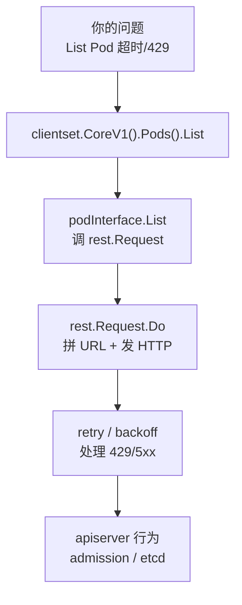
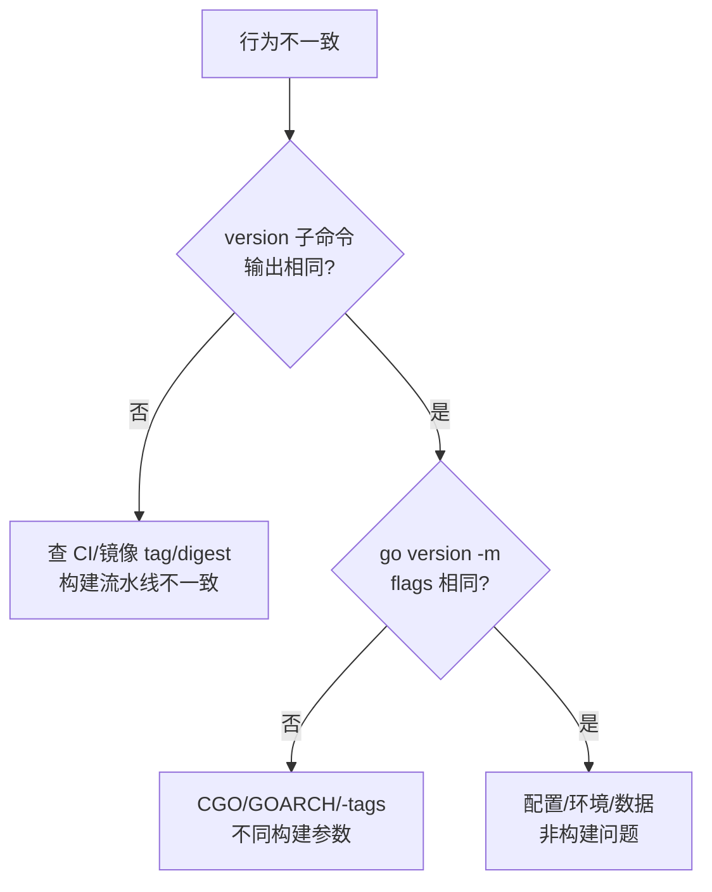
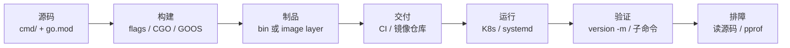

# 15｜编译交付与读源码 · 练习题

开始做题前，先给大家一个小建议：合上知识点，对着**源码→二进制→镜像→验版本**口述一遍。能顺下来，下面这些题大半都会了。

做题的方式：每道题**先看标题和场景，自己口述一遍答案，再往下看解答**。

题目顺序：Q1～Q5 钉 build flags；Q6～Q9 可复现与模板；Q10～Q14 读源码与作战。

| 标记 | 含义 |
|------|------|
| **核心** | 不懂整章就没建立起来 |
| **必会** | 值班和面试都要能讲 |
| **常用** | 线上会反复碰到 |
| **常考** | 白板和追问的高频口径 |

## 本题目录

- [Q1 交叉编译 GOOS/GOARCH](#q1)
- [Q2 -ldflags -X 版本注入不生效](#q2)
- [Q3 -trimpath 解决什么问题](#q3)
- [Q4 CGO_ENABLED 与 Alpine](#q4)
- [Q5 多阶段 Dockerfile](#q5)
- [Q6 线上验证跑的是哪次 commit](#q6)
- [Q7 go mod vendor](#q7)
- [Q8 -s -w 对 pprof 的影响](#q8)
- [Q9 读 client-go List Pod 调用链](#q9)
- [Q10 同 tag 不同行为](#q10)
- [Q11 embed vs -X](#q11)
- [Q12 go version -m 输出](#q12)
- [Q13 Makefile 与条件编译](#q13)
- [Q14 白板：二进制的一生](#q14)
- [合上书](#合上书)

---

## Q1

**★★★★★｜Mac 上如何编译 Linux amd64 静态二进制？**

**覆盖**：核心 · 必会 · 常考 ｜ **对应**：知识点 [四、语法必会：go build flags 全家桶](知识点.md)

### 场景

开发在 M 系列 Mac 上编好 `hall-agent`，拷到 Linux 服务器报 `cannot execute binary file: Exec format error`。CI 没设 GOOS，开发机默认 `darwin/arm64`。


先自己试试，再往下看解答。

### 完整解答

> 🎯 **一句话**：`CGO_ENABLED=0 GOOS=linux GOARCH=amd64 go build`——Go 原生交叉编译，不需要装交叉工具链。

```bash
CGO_ENABLED=0 GOOS=linux GOARCH=amd64 go build -trimpath \
  -o bin/hall-agent-linux ./cmd/hall-agent

file bin/hall-agent-linux
# ELF 64-bit LSB executable, x86-64   # ← 确认目标格式正确
```

Go 把**所有目标平台的编译后端**内置进工具链——设 `GOOS`（目标 OS）和 `GOARCH`（目标架构）即可在任意平台编译任意目标。`CGO_ENABLED=0` 保证纯 Go 静态链，不需要目标平台的 C 交叉编译器。

ARM 节点（Graviton/Apple Silicon）用 `GOARCH=arm64`。**必须与运行环境架构一致**——`amd64` 二进制扔进 `arm64` 节点报 `exec format error`。

```bash
GOOS=windows GOARCH=amd64 go build -o bin/hall-agent.exe ./cmd/hall-agent
file bin/hall-agent.exe
# PE32+ executable (console) x86-64   # ← Windows 可执行，不需要 Windows 机器
```

> ⚠️ **别混**：`CGO_ENABLED=1` 时交叉编译要目标平台 **C 交叉链**（如 `x86_64-linux-gnu-gcc`），没装就报 `gcc: not found`。运维工具统一 `CGO=0` 避免这个坑。Mac 上 `go env CGO_ENABLED` 默认可能 1，CI 应**显式写** `CGO_ENABLED=0`。

> 📝 **面试**：「Go 交叉编译和 C/C++ 有什么不同？」——Go 编译器内置所有目标平台后端，`GOOS`/`GOARCH` 两个变量搞定；C/C++ 要装交叉工具链配 `--sysroot`。这是 Go 对 C/C++ 最大的交付优势。

### 再追问

**CI 模板里一定要写 GOOS 吗？在 Linux CI 上编译 Linux 二进制也要？**——要，显式写更好。CI runner 可能换架构（如从 amd64 换到 arm64），不写就用 runner 默认值，构建产物可能静默变化。

---

## Q2

**★★★★★｜`-ldflags "-X main.version=1.2.3"` 不生效，常见原因有哪些？**

**覆盖**：核心 · 必会 · 常考 ｜ **对应**：知识点 [四、语法必会：go build flags 全家桶](知识点.md)

### 场景

CI 打了 tag `v1.2.3`，容器里 `./hall-agent version` 仍显示 `dev`。开发说"命令里明明写了 -X"。


go build 基础。

先自己试试，再往下看解答。

### 完整解答

> 🎯 **一句话**：`-X` 要精确到 `main.version` 全路径且变量必须是 **string 类型**——包路径写错、变量用了 const、变量在不可达包是最常见三个原因。

```go
// cmd/hall-agent/main.go
var version = "dev"   // ← 必须 var，不能 const；必须 string
```

```bash
go build -ldflags "-X main.version=1.2.3" -o hall-agent ./cmd/hall-agent
./hall-agent version
# hall-agent 1.2.3 ...   # ← 生效
```

三个不生效的排查方向：

- **包路径错**：如果变量在 `pkg/buildinfo` 包，路径要写全：`-X github.com/org/app/pkg/buildinfo.Version=1.2.3`。写 `main.version` 但变量不在 `main` 包，链接器找不到符号就静默跳过
- **变量非 string**：`-X` 只支持 string 变量。`const version = "dev"` 不行（常量编译期固化，链接器改不动）；`var version int` 不行（类型不匹配）
- **变量在不可达包**：如果那个包没被 `main` 直接或间接导入，链接器在链接阶段不会处理它

> ⚠️ **别混**：`-X` 在**链接阶段**替换符号值，不是在编译阶段。所以你改了 `-X` 的值不需要重新编译依赖，只需重新 `go build`——这也是 CI 注入版本号快的原因。

> 📝 **面试**：「`-X` 能注入 int 吗？」——不能，只能 string。数字版本号用字符串注入（`"1.2.3"`），运行时按需 `strconv.Atoi` 转换。

### 再追问

**能不能在子包里放版本变量？**——能，但 `-X` 路径要写全包路径。推荐放 `main` 包或 `internal/version` 包，路径用 `go list -m` 取模块根路径拼上包相对路径。CI 可用 `-X $(go list -m)/internal/version.Version=$TAG` 动态拼路径。

---

## Q3

**★★★★☆｜`-trimpath` 解决什么问题？不加会怎样？**

**覆盖**：必会 · 常考 ｜ **对应**：知识点 [四、语法必会：go build flags 全家桶](知识点.md)

### 场景

安全扫描在二进制里发现 `/Users/alice/proj/internal/secret.go` 路径，审计不通过。开发说"又不是源码泄露，路径有什么关系"。


ldflags -X。

先自己试试，再往下看解答。

### 完整解答

> 🎯 **一句话**：不加 `-trimpath`，编译机**绝对路径**会内嵌进二进制——泄露开发机用户名、目录结构、项目布局，安全审计直接红牌。

```bash
go build -o app-notrim ./cmd/app
strings app-notrim | grep -i '/Users\|/home\|/root'
# /Users/alice/proj/internal/config/loader.go   # ← 开发机路径泄露了

go build -trimpath -o app-trim ./cmd/app
strings app-trim | grep -i '/Users\|/home\|/root'
# （无输出）   # ← -trimpath 生效

go version -m app-trim | grep trimpath
# build -trimpath=true   # ← 构建信息里确认
```

`-trimpath` 把绝对路径替换为**模块路径**——`/Users/alice/proj/internal/config/loader.go` 变成 `github.com/org/app/internal/config/loader.go`。栈追踪和 pprof 符号仍然可用（显示模块相对路径），只是不再暴露编译机的文件系统布局。

> ⚠️ **别混**：`-trimpath` 影响的是路径前缀，不影响运行时行为、不影响 pprof 函数名解析（那取决于 `-s -w` 是否 strip 了符号表）。与 `-ldflags "-s -w"` 常一起用于生产制品，但解决的是不同问题——trimpath 管路径泄露，`-s -w` 管体积和调试信息。

> 📝 **面试**：「`-trimpath` 和可复现构建有什么关系？」——去掉绝对路径后，同一份代码在不同机器上构建产出的二进制**更一致**（可复现构建的前提之一）。团队应在 Makefile/CI 模板里固化 `-trimpath`，不靠人记。

### 再追问

**加了 `-trimpath` 后 pprof 还能用吗？**——能。`-trimpath` 只把绝对路径换成模块路径，函数名和行号信息仍在。真正影响 pprof 的是 `-s -w`（见 Q8）。

---

## Q4

**★★★★★｜Alpine 里运行 Go 程序报 `not found` 或 glibc 错误，和 CGO 什么关系？**

**覆盖**：核心 · 必会 · 常考 ｜ **对应**：知识点 [四、语法必会：go build flags 全家桶](知识点.md)

### 场景

`CGO_ENABLED=1` 链了 glibc 的二进制扔进 `alpine:latest`，启动报 `not found`——但 `ls` 能看到文件。开发以为是 Dockerfile COPY 没拷对。


开头那个 trimpath。

先自己试试，再往下看解答。

### 完整解答

> 🎯 **一句话**：`CGO=1` 动态链 C 库 → Alpine 用 musl 不兼容 glibc → 找不到动态链接器；运维工具默认 `CGO_ENABLED=0` 纯 Go 静态链，单文件丢哪都能跑。

```bash
CGO_ENABLED=0 go build -o app ./cmd/app
# 静态二进制，丢 distroless/static 或 alpine 都能跑

CGO_ENABLED=1 go build -o app ./cmd/app
# 动态链 glibc，只能在有 glibc 的环境跑（Debian/Ubuntu）
```

> 💡 **打个比方**：`CGO_ENABLED=0` 像自带电池的电器——插哪都能用。`CGO_ENABLED=1` 像需要外接电源的电器——你必须确保目标插座（C 库）型号匹配。Alpine 用 musl，Debian 用 glibc，两边不兼容。

`not found` 这个报错的迷惑性在于：不是文件不存在，而是**动态链接器找不到 glibc**——内核尝试加载 ELF 时发现 `INTERP` 段指向的 `/lib64/ld-linux-x86-64.so.2` 在 Alpine 里不存在（Alpine 的链接器在 `/lib/ld-musl-x86_64.so.1`）。

解法两条线：

- **运维工具统一 `CGO_ENABLED=0`**——纯 Go 静态链，不依赖任何 C 库，distroless/alpine/scratch 都能跑
- **确实需要 CGO**（如 sqlite、某些 DNS 解析库）——要么在目标环境编译，要么换 Debian 基础镜像，要么在 Alpine 里装 `musl` 兼容层

> ⚠️ **别混**：Mac 上 `go env CGO_ENABLED` 默认可能 1（因为 Mac 上 CGO 用 clang，默认能用）。CI runner 上不显式写 `CGO_ENABLED=0` 就可能漂移——某天 CI 换了基础镜像，构建突然产出动态二进制，扔进 Alpine 就崩。**CI 模板必须显式写**。

> 📝 **面试**：「为什么 Go 容器常用 distroless/static？」——无 shell、静态二进制一个文件即可，攻击面最小。比 scratch 多了 CA 证书和时区数据，比 alpine 少了 shell 和包管理器。

### 再追问

**哪些场景必须 CGO=1？**——`go-sqlite3`（cgo binding）、某些 `net` 包的 DNS 解析模式（`CGO_ENABLED=1` 走系统 resolver，`0` 走纯 Go resolver）、`os/user` 的某些实现。如果必须 CGO=1，建议用 Debian 基础镜像而非 Alpine。

---

## Q5

**★★★★☆｜多阶段 Dockerfile 两阶段各干什么？为什么 runtime 要用 distroless？**

**覆盖**：必会 · 常用 ｜ **对应**：知识点 [六、生产模板：Makefile + Dockerfile](知识点.md)

### 场景

镜像 800MB，安全要求 runtime 无 gcc、无源码、无 shell。开发在 runtime 镜像里装了 vim 方便调试，审计不过。


CGO_ENABLED / 交叉编译。

先自己试试，再往下看解答。

### 完整解答

> 🎯 **一句话**：builder 阶段 `go build`；runtime 只 COPY 二进制（distroless/scratch）——最终镜像无 shell、无源码、无编译器。

```dockerfile
FROM golang:1.22 AS builder
WORKDIR /src
COPY go.mod go.sum ./
RUN go mod download
COPY . .
ARG VERSION=dev
ARG COMMIT=unknown
RUN CGO_ENABLED=0 GOOS=linux go build -trimpath \
    -ldflags "-s -w -X main.version=${VERSION} -X main.commit=${COMMIT}" \
    -o /out/hall-agent ./cmd/hall-agent

FROM gcr.io/distroless/static-debian12
COPY --from=builder /out/hall-agent /hall-agent
USER nonroot:nonroot
ENTRYPOINT ["/hall-agent"]
```

builder 阶段有 Go 工具链（~1GB+）和全部源码，负责编译出二进制。runtime 阶段**只从 builder 拷一个文件**——二进制本身。最终镜像不含 `go`、`gcc`、源码、`go.mod`，甚至没有 `sh`。

| 阶段 | 有什么 | 没什么 |
|------|--------|--------|
| builder | Go 工具链、源码、go.mod/go.sum | 不进最终镜像 |
| runtime | 只有二进制 | 无 shell、无源码、无编译器 |

```bash
docker build --build-arg VERSION=1.4.2 --build-arg COMMIT=$(git rev-parse --short HEAD) -t hall-agent:1.4.2 .
docker run --rm hall-agent:1.4.2 version
# hall-agent 1.4.2 commit=fa3b2c1   # ← 镜像里版本子命令可跑
```

distroless 比 scratch 多了 CA 证书（HTTPS 能用）和时区数据，比 alpine 少了 shell 和包管理器——攻击面最小，安全审计友好。

> ⚠️ **别混**：distroless 无 shell——`kubectl exec -it pod -- sh` 会失败。排障靠版本子命令和日志。需要临时调试用 `:debug` 变体（如 `gcr.io/distroless/static-debian12:debug`）有 busybox shell，**仅限非 prod 环境**。Dockerfile 多阶段细节全集见 [04-02](../../../04-工程化与自动化/02-Docker深度/)。

### 再追问

**如何在 builder 传 version？**——`ARG VERSION` + `RUN go build -ldflags "-X main.version=${VERSION}"`。`ARG` 在 Dockerfile 构建时传入，`RUN` 里可用。`--build-arg VERSION=1.4.2` 在 `docker build` 时传值。

---

## Q6

**★★★★★｜线上怎么确认跑的是哪次 commit？三道门禁是什么？**

**覆盖**：核心 · 必会 ｜ **对应**：知识点 [五、原理讲透：为什么 Go 能这样编译](知识点.md)

### 场景

事故复盘：测试服和正式服"都是 v1.4.2"，行为不同，怀疑制品不一致。有人要 `kubectl exec` 进去查，但 distroless 无 shell。


可复现构建。

先自己试试，再往下看解答。

### 完整解答

> 🎯 **一句话**：三道核对——**镜像 digest**、**`./app version` 子命令**、**`go version -m`**——不依赖 shell，从镜像元数据到二进制内嵌信息逐层验证。

```bash
# 第一道：镜像 digest（不可变）
kubectl get pod -o jsonpath='{.spec.containers[0].image}'
# hall-agent:1.4.2@sha256:abc...   # ← digest 不可变，tag 可变

# 第二道：版本子命令（-X 注入的）
kubectl exec deploy/hall-agent -- /hall-agent version
# hall-agent 1.4.2 commit=fa3b2c1 built=2026-09-01T08:00:00Z   # ← CI 注入的版本

# 第三道：go version -m（Go 1.18+ 内嵌的构建信息）
go version -m ./hall-agent | grep -E 'mod|path|vcs|trimpath'
# path  github.com/org/hall-agent
# mod   github.com/org/hall-agent v1.4.2
# build vcs.revision=fa3b2c1...   # ← VCS revision 从二进制反查
# build -trimpath=true
```

三道门禁各验什么：

- **镜像 digest**——验**容器运行的是哪个镜像**。tag 可变可覆盖，digest 不可变。K8s 部署应记录 digest 做回滚锚点
- **version 子命令**——验**二进制里注入的版本号**。CI 从 git tag/commit 取值经 `-X` 注入，构建后 `make verify` 自验
- **go version -m**——验**Go 工具链内嵌的构建信息**。Go 1.18+ 自动内嵌 VCS revision、build flags、module 版本，节点上无 git 也能反查

> ⚠️ **别混**：**镜像 tag 可变**——同一个 `hall-agent:1.4.2` 可以指向不同 digest。回滚按 **digest** 不按「昨天那个 tag」。CI 应存档构建 SHA256，部署以 digest 门禁。

> 📝 **面试**：「如何确认线上跑的是哪次 commit？」——答三道门禁：digest（镜像层）、version 子命令（应用层）、`go version -m`（工具链层）。再加一句「tag 可变，digest 不可变，回滚按 digest」。

### 再追问

**只有镜像 tag 没有 version 子命令怎么办？**——要求所有运维二进制必须有 `version` 或 `-version` flag（团队规范）。没有 version 子命令的二进制不允许上生产。这是 Go 交付的最低标准——`-X` 注入一个 version 变量加几行代码的事。

**旧 Go 二进制没有 vcs 信息？**——需 Go 1.18+ 构建且在有 git 的目录 build。旧版 Go 只能靠 `-X` 注入的 version 子命令验版本。

---

## Q7

**★★★★☆｜`go mod vendor` 什么时候用？和 `go mod download` 有什么区别？**

**覆盖**：必会 · 常用 ｜ **对应**：知识点 [五、原理讲透：为什么 Go 能这样编译](知识点.md)

### 场景

离线 CI、air-gapped 机房构建，不能 `go mod download` 访问外网 module proxy。有人问"直接把 `go mod download` 跑在 CI 里不行吗"。


模块与 vendor。

先自己试试，再往下看解答。

### 完整解答

> 🎯 **一句话**：`go mod vendor` 把依赖源码拷进仓库 `vendor/` 目录，`go build -mod=vendor` 离线可复现——适合 air-gapped 机房、供应链审计、不依赖外网 proxy 的场景。

```bash
go mod tidy       # 清理依赖声明
go mod verify     # 校验 go.sum 哈希
go mod vendor     # 把依赖拷进 vendor/
go build -mod=vendor -o bin/app ./cmd/app   # 用 vendor 构建，不访问网络
```

`go mod vendor` 和 `go mod download` 的区别：

| | `go mod download` | `go mod vendor` |
|---|---|---|
| 做什么 | 下载到 `$GOMODCACHE` | 拷进项目 `vendor/` 目录 |
| 离线可用 | 否（依赖 cache 已有） | 是（vendor 在仓库里） |
| 提交到 git | 不提交 | 提交 `vendor/` |
| 审计 | 难（cache 不可见） | 易（diff 可见） |

提交 `vendor/` 后 CI 构建**不依赖 module proxy**。注意 `vendor/` 和 `go.mod`/`go.sum` 必须**同步提交**——只提 `go.mod` 不提 `vendor`，CI 会回退到 module cache，构建结果取决于谁先 `go mod download`，可复现性消失。

> ⚠️ **别混**：CI 要固定 `go build -mod=vendor`，否则 Go 默认走 module cache（`-mod=readonly`），即使有 `vendor/` 目录也不用。`go.sum` 锁哈希防篡改，`vendor` 锁内容防漂移——**两个一起才是可复现构建**。

> 📝 **面试**：「如何保证测试服和正式服同一个二进制？」——**同 git tag + 同 CI job + 制品 SHA256 门禁**。`go.sum` 锁哈希，`vendor` 锁内容，`-trimpath` 去路径差异——三件一起才是可复现构建，不是「差不多同一个分支」。

### 再追问

**vendor 目录太大怎么办？**——这是 trade-off。大型项目 vendor 可能几百 MB。替代方案：用私有 module proxy（如 Athens）代替 vendor，既能离线又不膨胀仓库。但对供应链审计来说，vendor 的 diff 可见性是 proxy 给不了的。

---

## Q8

**★★★★☆｜`-ldflags "-s -w"` 干什么？对 pprof 有何影响？怎么应对？**

**覆盖**：必会 ｜ **对应**：知识点 [四、语法必会：go build flags 全家桶](知识点.md)

### 场景

为了缩镜像体积加了 `-s -w`，pprof 火焰图函数名变 `0x...`。有人要加回来去掉 `-s -w`，但镜像要过供应链体积门禁。


Makefile 模板。

先自己试试，再往下看解答。

### 完整解答

> 🎯 **一句话**：`-s` 去符号表、`-w` 去 DWARF 调试信息，体积降约 20～30%；代价是 pprof 符号变差，解法是生产与 debug 两条构建线。

```bash
go build -o app-nostrip ./cmd/app
go build -ldflags "-s -w" -o app-stripped ./cmd/app

ls -lh app-nostrip app-stripped
# -rwxr-xr-x 12M app-nostrip     # ← 含完整符号与 DWARF
# -rwxr-xr-x 8.2M app-stripped   # ← 体积降约 30%
```

`-s` 去掉 **symbol table**（符号表，函数名→地址映射），`-w` 去掉 **DWARF**（调试信息，行号、变量位置）。两者合用让二进制体积降 20～30%。

影响 pprof 的机制：Go runtime 的 pprof 采样拿到的是**地址**，需要符号表把地址翻译成函数名。`-s` 去了符号表后，runtime 只能用内嵌的函数名表（Go 保留了一份精简版），但某些情况下会退化成 `0x...` 地址。

**应对方案——两条构建线**：

- **生产制品**：带 `-s -w -trimpath`，体积最小、路径不泄露、过供应链门禁
- **debug 制品**：不带 `-s -w`（保留 `-trimpath`），体积大但 pprof 符号完整，oncall 时用 debug 制品采 profile

CI 可在 Makefile 里加 `build-debug` 目标：

```makefile
build-debug:
	go build -trimpath -o bin/$(APP)-debug $(PKG)
```

> ⚠️ **别混**：`-s -w` 去的是**调试信息**，不影响运行时行为。不要因为 pprof 就不加 `-s -w`——体积和供应链审计也要管。用两条构建线平衡。UPX 压缩虽然体积更小但杀软误报、启动解压 CPU 开销，**生产慎用**。

### 再追问

**UPX 压缩能用吗？**——体积更小但杀软误报（UPX 特征明显被当成恶意软件）、启动时解压有 CPU 开销、且 strip 后的符号更不可恢复。生产环境**慎用**，除非能接受这些代价。

---

## Q9

**★★★★★｜怎么读 client-go 里 List Pod 的调用链？偶发 429 怎么跟？**

**覆盖**：核心 · 必会 · 常考 ｜ **对应**：知识点 [七、读源码：从 client-go 到 cobra](知识点.md)

### 场景

List Pod 偶发 429，你要判断是客户端重试逻辑问题还是 apiserver 限流。有人建议"从 main 函数开始通读 client-go 源码"。


Dockerfile 多阶段。

先自己试试，再往下看解答。

### 完整解答

> 🎯 **一句话**：从 **`clientset.CoreV1().Pods().List`** 跟到 **`rest.Request.Do()`**，看重试与 backoff——从你要调的 API 反向跟，不要从 `main` 啃。

```go
// 典型调用入口
config, _ := clientcmd.BuildConfigFromFlags("", kubeconfig)
clientset, _ := kubernetes.NewForConfig(config)
pods, err := clientset.CoreV1().Pods("default").List(ctx, metav1.ListOptions{})
```

跟码路径：



**读图**：左边是 **client-go**（客户端重试/限流），右边是 **apiserver**（admission/etcd）。List Pod 偶发 429——一半可能是客户端 `rest.Request` 的重试逻辑没配对，一半可能是 apiserver 限流。跟到 `Do()` 和 `retry` 这一层就能定位，不必读完整 controller-runtime 仓库。

具体跟法：

- `go doc k8s.io/client-go/kubernetes/typed/core/v1.PodInterface` 查接口
- IDE 跳转到 `podInterface.List` 的实现，看到它调 `rest.Request`
- 跟到 `rest.Request.Do()` 看 URL 怎么拼、429 怎么处理、retry/backoff 怎么配
- 停在能解释现象的深度——看到 429 的处理逻辑就够了，不必读 apiserver 源码

```bash
# 模块缓存里读源码
ls $(go env GOMODCACHE)/k8s.io/client-go@v0.29.0/kubernetes/typed/core/v1/
# pod.go  ← List 的接口定义和实现都在这

ls $(go env GOMODCACHE)/k8s.io/client-go@v0.29.0/rest/
# request.go  ← rest.Request.Do() 和 retry 逻辑在这
```

> ⚠️ **别混**：读源码**不是**通读全仓库。明确你的问题（List Pod 超时？429？），从调用点跟到能解释现象的深度就停。不读完整仓库不影响排障。`git tag` 要对齐集群版本——`client-go` v0.29.0 对应 K8s 1.29，版本不对齐读到的方法可能不存在。

> 📝 **面试**：「怎么读 Go 开源库？」——**从调用点反向跟**；看 **test 文件当文档**（test 展示了作者预期的用法）；`git tag` 对齐你集群版本。不要从 `main` 啃——你不需要理解整个 controller-runtime 才能定位一个 List 超时。

### 再追问

**Informer 和直接 List 区别？**——Informer 走 reflector + 本地 cache，只在首次 List 全量、之后靠 Watch 增量更新。直接 List 每次都发 HTTP 请求。控制器用 Informer 减少 apiserver 压力。读源码跟 `sharedIndexInformer` → `ListWatch` → `DeltaFIFO`，看 resync 如何把全量缓存重新分发给 handler。

**cobra CLI 怎么读？**——从 `Command.Execute()` 跟起：`Execute()` → `Find(args)` 找子命令 → `Flags().Parse()` → `RunE` 执行业务。理解了 `Command` 结构体的 `RunE`/`PreRunE`/`PostRunE` 钩子链，就读懂了大多数 Go CLI 工具的骨架。

---

## Q10

**★★★★☆｜同 tag 不同行为，除配置外还有什么构建原因？**

**覆盖**：必会 · 常用 ｜ **对应**：知识点 [八、作战与踩坑：构建不一致怎么办](知识点.md)

### 场景

`v1.4.2` 在 A 区正常 B 区异常，ConfigMap 相同，镜像 tag 相同。有人准备"重新构建一次覆盖 tag"。


读 client-go 套路。

先自己试试，再往下看解答。

### 完整解答

> 🎯 **一句话**：查 **digest/SHA256、GOARCH、CGO、build tags**——tag 可变，同一 tag 可能指向不同二进制。



**读图**：第一刀比 version 子命令——不同就是构建产物不一致；相同再比 `go version -m` 的 build flags——CGO/GOARCH/-tags 差异会导致同 tag 产出不同二进制；都相同就是运行时环境差异。

排查步骤：

```bash
# 对比镜像 digest 是否真相同
kubectl get pod -o jsonpath='{.spec.containers[0].image}' -n zone-a
kubectl get pod -o jsonpath='{.spec.containers[0].image}' -n zone-b
# hall-agent:1.4.2@sha256:abc...   vs   hall-agent:1.4.2@sha256:def...   ← digest 不同

# go version -m 看 mod 版本与 -tags
go version -m ./hall-agent | grep -E 'mod|build|CGO'
# build CGO_ENABLED=0   build -trimpath=true   ← 两区 flags 应完全一致

# file 看 ELF ARCH
file ./hall-agent
# ELF 64-bit LSB executable, x86-64   ← 确认架构
```

常见原因：某区 CI job 用了不同基础镜像导致 `CGO_ENABLED` 漂移（Mac CI 默认 1，Linux CI 默认 0）；某区构建时忘了 `-trimpath`；某区用了不同 `GOARCH`（如 Graviton 节点编了 arm64 但部署到 amd64）。

> ⚠️ **别混**：**不要**用"重新构建覆盖 tag"来修——同一 tag 指向不同 digest 是流程漏洞。应该查 CI 为什么两区构建参数不一致，固定 CI 模板，然后以 digest 门禁确保不可变。

### 再追问

**`--dirty` 构建是什么？**——`git describe --tags --always --dirty` 会在有未提交改动时追加 `-dirty`。version 子命令输出 `v1.4.2-dirty` 一眼看出非干净构建——CI 应拒绝 `--dirty` 的制品上生产。

---

## Q11

**★★★★☆｜版本信息用 embed 还是 -ldflags -X？各适合什么场景？**

**覆盖**：常考 ｜ **对应**：知识点 [四、语法必会：go build flags 全家桶](知识点.md)

### 场景

要把 `CHANGELOG.md` 片段和 semver 版本号一起打进二进制。有人全部用 `-X`，有人全部用 embed。


读 cobra。

先自己试试，再往下看解答。

### 完整解答

> 🎯 **一句话**：**动态 CI 注入用 `-X`**（版本号、commit）；**静态文件内容用 `embed`**（配置、文档）——两者不互斥，各管各的。

```go
import _ "embed"

//go:embed CHANGELOG.md
var changelog string   // ← 静态文件，编译期嵌入

var version = "dev"    // ← CI 动态注入，链接期覆盖
```

```bash
go build -ldflags "-X main.version=$TAG -X main.commit=$SHA" -o app ./cmd/app
./app version
# v1.4.2 commit=fa3b2c1   ← -X 注入的
./app changelog
# # v1.4.2 ...             ← embed 的文件内容
```

| 对比 | `-ldflags -X` | `//go:embed` |
|------|---------------|--------------|
| 适合 | CI 环境变量注入的版本号 | 静态文件内容（配置、文档） |
| 类型 | 只能 string | `[]byte` / `string` / `embed.FS` |
| 时机 | 链接期 | 编译期 |
| 改值 | 不改源码，改 ldflags 即可 | 要改文件内容重新编译 |

> ⚠️ **别混**：密钥和环境相关的生产配置**不要 embed**——用 ConfigMap/Secret。embed 适合**不变**的默认配置。embed 会增加二进制体积（等于文件大小），大资源考虑外置。`-X` 适合 CI 从 git/环境变量取值注入，不需要改源码。

### 再追问

**embed 能嵌目录吗？**——能，`//go:embed assets/*` 配合 `embed.FS` 类型，可以把整个目录打进二进制。适合嵌 Swagger UI 静态页面等场景。

---

## Q12

**★★★★☆｜`go version -m binary` 输出看什么？为什么能从二进制反查 commit？**

**覆盖**：必会 ｜ **对应**：知识点 [五、原理讲透：为什么 Go 能这样编译](知识点.md)

### 场景

节点上只有二进制没有 git，要确认 module 版本和构建参数。有人问"不加 `-X` 注入版本号就查不到 commit 了吗"。


同 tag 不一致定责。

先自己试试，再往下看解答。

### 完整解答

> 🎯 **一句话**：看 **`path`、`mod ... vX.Y.Z`、`build -trimpath`、`build vcs.revision`**——Go 1.18+ 自动内嵌 VCS 信息，不需要 `-X` 也能从二进制反查 commit。

```bash
go version -m ./hall-agent
# ./hall-agent: go1.22.5
#   path  github.com/org/hall-agent          ← 模块路径
#   mod   github.com/org/hall-agent v1.4.2   ← 模块版本
#   dep   k8s.io/client-go v0.29.0           ← 依赖版本
#   build -trimpath=true                     ← 构建时用了 trimpath
#   build -ldflags="-s -w -X main.version=1.4.2"  ← 构建时传的 ldflags
#   build vcs.revision=fa3b2c1...            ← VCS revision（git commit）
#   build CGO_ENABLED=0                      ← CGO 状态
```

**读图**：`go version -m` 读的是 Go 1.18+ 内嵌的**构建信息**。这些信息在 `go build` 时自动嵌入，不需要开发者做任何额外操作。关键几行：

- `path` / `mod` —— 模块路径和版本，能确认"这个二进制是哪个项目的哪个版本"
- `build -trimpath` / `build CGO_ENABLED` —— 构建参数，能对比"两区构建参数是否一致"
- `build vcs.revision` —— VCS revision，**节点上没有 git 也能反查 commit**。这是 Go 1.18+ 的杀手锏

```bash
# 与 -X 注入的 version 子命令互证
./hall-agent version
# hall-agent 1.4.2 commit=fa3b2c1   ← -X 注入的

go version -m ./hall-agent | grep vcs
# build vcs.revision=fa3b2c1...     ← 工具链内嵌的，两者应一致
```

> ⚠️ **别混**：`-X` 注入的 version 是**应用层**的（你自己写的代码读变量输出）；`go version -m` 读的是**工具链层**自动内嵌的。两者互为校验——如果 `-X` 注入了 `fa3b2c1` 但 `vcs.revision` 是 `b4c5d6`，说明构建时的工作目录不干净（不在正确的 commit 上 build）。

> 📝 **面试**：「旧 Go 二进制没有 vcs 信息怎么办？」——需 Go 1.18+ 构建且在有 git 的目录 build。旧版 Go 只能靠 `-X` 注入的 version 子命令验版本。所以团队应统一 Go 1.18+ 并在 CI（有 git 的 checkout 目录）里构建。

### 再追问

**`go version -m` 在 stripped 二进制上还能用吗？**——能。`-s -w` 去的是符号表和 DWARF，**构建信息是独立段**不受影响。`go version -m` 读的是模块元数据段，不是调试信息。

---

## Q13

**★★★☆☆｜写一段 Makefile 目标 `linux`，带 version 注入和 verify。再说说条件编译（build tags）怎么用。**

**覆盖**：常用 ｜ **对应**：知识点 [六、生产模板：Makefile + Dockerfile](知识点.md)

### 场景

团队要求 `make linux` 一键出 Linux 制品并自验版本号。还要在代码里用 build tags 切换 Linux/Darwin 的不同实现。


作战加深。

先自己试试，再往下看解答。

### 完整解答

> 🎯 **一句话**：`CGO_ENABLED=0 GOOS=linux` + `LDFLAGS -X` + `verify` 目标自验——Makefile 固化 flags 不靠人记。

```makefile
APP       := hall-agent
PKG       := ./cmd/hall-agent
VERSION   ?= $(shell git describe --tags --always --dirty)
COMMIT    ?= $(shell git rev-parse --short HEAD)
BUILD_DATE ?= $(shell date -u +%Y-%m-%dT%H:%M:%SZ)
LDFLAGS   := -s -w -X main.version=$(VERSION) -X main.commit=$(COMMIT) -X main.buildDate=$(BUILD_DATE)

.PHONY: build linux verify clean

build:
	go build -trimpath -ldflags "$(LDFLAGS)" -o bin/$(APP) $(PKG)

linux:
	CGO_ENABLED=0 GOOS=linux GOARCH=amd64 $(MAKE) build
	@bin/$(APP) version
	@go version -m bin/$(APP)

verify:
	@bin/$(APP) version
	@go version -m bin/$(APP)

clean:
	rm -rf bin/
```

```bash
make linux
# CGO_ENABLED=0 GOOS=linux GOARCH=amd64 go build -trimpath -ldflags "..." -o bin/hall-agent ./cmd/hall-agent
# hall-agent v1.4.2-1-ga3b2c1 commit=a3b2c1 built=2026-09-01T08:00:00Z   # ← version 子命令
# ./hall-agent: go1.22.5 ...                                              # ← go version -m
```

条件编译（build tags）用 `//go:build` 指令按 OS/架构/自定义 tag 切换实现文件：

```go
//go:build linux
// +build linux

package main
// 此文件仅在 linux 编译，如调用 syscall.Setsid 等 Linux 特有 API
```

```go
//go:build !linux

package main
// 非 linux 的兜底实现
```

```bash
go build -tags "osusergo" -o app ./cmd/app   # 用纯 Go 实现 user lookup，不依赖系统 C 库
```

> ⚠️ **别混**：`go build -tags` 的值是空格分隔的 tag 列表，不是逗号分隔。`-tags "osusergo netgo"` 正确，`-tags "osusergo,netgo"` 错误。

### 再追问

**`make linux` 在 Linux CI 上还要 GOOS 吗？**——显式写更好，避免 CI runner 换架构时默认值漂移。`git describe --dirty` 会在有未提交改动时追加 `-dirty`，CI 应拒绝 `--dirty` 的制品上生产。

---

## Q14

**★★★★★｜白板：默画「Go 二进制的一生」主图，写完整 go build 命令，口述验证流程。**

**覆盖**：核心 · 必会 · 常考 ｜ **对应**：知识点 [三、语言最小集：go build 从认到用](知识点.md)

### 场景

终面 3 分钟：从源码到 K8s 验证全流程。


本套题收尾综合口述。

先自己试试，再往下看解答。

### 完整解答

> 🎯 **一句话**：**源码 → go build(flags) → 制品 → 镜像 → 部署 → version 验证 → 出问题读源码**——每个环节都有对应的 flag 或工具。



白板命令：

```bash
CGO_ENABLED=0 GOOS=linux GOARCH=amd64 go build -trimpath \
  -ldflags "-s -w -X main.version=1.4.2 -X main.commit=abc" \
  -o hall-agent ./cmd/hall-agent
```

每个 flag 解决什么问题：

- `CGO_ENABLED=0` —— 静态纯 Go，不依赖 C 库，distroless/alpine 都能跑
- `GOOS=linux GOARCH=amd64` —— 交叉编译目标平台，Mac CI 编 Linux 二进制
- `-trimpath` —— 去掉编译机绝对路径，防泄露、可复现
- `-ldflags "-s -w"` —— strip 符号和 DWARF，体积降约 30%
- `-ldflags "-X main.version=..."` —— 链接期注入版本号，CI 从 git tag/commit 取值
- `-o hall-agent` —— 精确控制输出路径

验证流程口述：镜像 digest → `./app version` 子命令 → `go version -m` 看 VCS revision。三道门禁互为校验，digest 不可变是回滚锚点。

读源码口述：从你要调的 API 反向跟（如 `clientset.CoreV1().Pods().List` → `rest.Request.Do()` → retry），不要从 `main` 啃。`git tag` 对齐集群版本，test 文件当文档用。

> 📝 **面试**：这道题考的是全局视图——不是每个 flag 的细节（前面题已考），而是"能不能把构建→交付→验证→排障串成一条线"。背不出完整命令或说不出每个 flag 解决什么，就是没建立整章脉络。

### 再追问

**说出两个「以为同 tag 实则不同二进制」的原因？**——digest 不同（同一 tag 被覆盖指向不同镜像）；build flags 不同（CGO/GOARCH/-tags 差异导致同 tag 产出不同二进制）。

**如果只能选三个 flag 上生产，选哪三个？**——`-trimpath`（安全）、`-ldflags -X`（版本可追溯）、`CGO_ENABLED=0`（可移植）。`-s -w` 是第四个但可取舍（体积 vs pprof 符号）。

---

## 合上书

与知识点「合上书」逐条对齐——能讲出来才算会。

对齐知识点「合上书」，逐条口述，卡住就回对应节：

- [ ] **默画主图**：源码 → `go build`(flags/CGO/GOOS) → 制品 → 交付 → 运行 → 验证 → 排障（读源码）。
- [ ] 写出带 `-trimpath` 和三个 `-X` 的完整 `go build` 命令，并说出每个 flag 解决什么问题。
- [ ] 解释 `CGO_ENABLED=0` 与 Alpine/distroless 的关系——为什么 `CGO=1` 在 Alpine 会崩。
- [ ] 口述 `go version -m` 输出里你会看哪几行，以及它为什么能从二进制反查 commit。
- [ ] 说清 `go mod vendor` 在 CI 里的价值——什么场景必须用、vendor 与 go.mod 的同步要求。
- [ ] 画多阶段 Dockerfile 两阶段各干什么——builder 有什么，runtime 有什么。
- [ ] 描述读 client-go List Pod 的跟码路径（至少 4 层），并说清为什么不从 `main` 啃。
- [ ] 列举两个「同 tag 不同行为」的原因——digest 不同、GOARCH/CGO/-tags 不同。
- [ ] 说明 `-s -w` 对 pprof 的影响及应对方案——两条构建线。
- [ ] 对比 embed 与 `-X` 注入版本各适合什么场景——动态 CI 变量 vs 静态文件。
