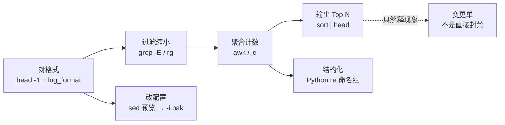

# 04｜正则与文本处理 · SRE 开发能力

> 有人一条「万能正则」扫 10GB 日志把跳板机打满；有人 `sed -i` 改 nginx.conf 没备份；还有人 awk 硬拆 JSON，列号跟 `log_format` 对不上，Top IP 直接拿去封禁。
> **本章回答**：一次日志排障从对格式 → 过滤 → 聚合 → 安全改文件 → 结构化抽取的一生；grep / sed / awk / jq / Python re 是管道工具链，不是「一条万能正则打天下」。
> **不讲**：值班 one-liner / 日志现场刀法 → [01-03 文本三剑客](../../01-基础底座/03-文本三剑客/)；生产脚本三开关 → [01 Shell](../01-Shell/)；时间窗 + API 编排 → [02 Python](../02-Python/)、[05 实战](../05-运维开发实战题/)；日志平台架构 → [03-20](../../03-Kubernetes/20-日志管理/)、[01-23](../../01-基础底座/23-日志运维/)。

**标记**：🎯重点 · 🔥难点 · ⭐常考 · 🔧实操

---

## 面试怎么考

| 标记 | 考点 |
|------|------|
| **核心** | 先过滤再聚合；列号以 `log_format` 为准；BRE vs ERE；贪婪 vs 字符类 |
| **必会** | Top IP / 每小时 QPS / jq 非 Running Pod；sed 预览 + `-i.bak`；Python 命名组 + `search` |
| **常用** | access / error log 字段提取；10GB 日志 grep 缩小；YAML `image:` 不能靠 grep |
| **常考** | RE2 vs PCRE；grep 默认 BRE；回溯爆炸 `(.+)+`；Top IP 不能直接封禁 |

> 📝 **30 秒怎么说**：正则排障三步——先 `head -1` 对列号（Nginx 以你们 `log_format` 为准）；大文件 grep 缩小再 awk 计数，禁止几十 GB 直接 `sort`；sed 改配置先 `diff` 再 `-i.bak`。JSON 用 jq，YAML 用 yq / `safe_load`。Python re 用 `search` + 命名组，用 `[^"]*` 代替 `.*`，禁止嵌套量词。Top IP 只解释现象，封禁走变更单。

---

## 能力边界

| 维度 | grep / sed / awk / jq | Python re | Shell 脚本 |
|------|----------------------|-----------|------------|
| **适合** | 跳板机 one-liner、GB 级过滤计数、kubectl JSON | 命名组、跨行、坏行跳过、接 API | 管道编排、调已有命令 |
| **不适合** | 嵌套 JSON 硬拆、多行 YAML 审计、复杂回溯 | 纯过滤几 GB（C 更快） | 十层管道无人 review |
| **生命周期** | 5 分钟排障、一次性统计 | 可入库脚本、结构化输出 | Git 脚本 + Runbook |

- 🔑 **五角色分工**（别混）
  - **grep**：缩小范围（5xx、ERROR、去注释）——默认 BRE，生产写 `-E`
  - **awk**：分列、计数、`substr` 时间窗——列号以 `log_format` 为准
  - **sed**：流式替换；预览后再 `-i`——不是配置管理系统
  - **jq**：kubectl JSON、日志 JSON 行——不要用 awk 拆 `{`
  - **Python re**：命名组、畸形行容错——`search` 不是 `match`

> ⚠️ **别混**：10 行管道 → grep/awk/jq；要命名组 / 接 API → Python；改 100 台配置 → Ansible，不是裸 `ssh sed -i`。

本节对应练习题 Q1。边界清了，先认最小语法零件。

---

## 语言最小集

```bash
grep -E 'ERROR|WARN' app.log                 # 生产默认 ERE
grep -oE '([0-9]{1,3}\.){3}[0-9]{1,3}' f.log # -o 只吐匹配段
sed 's/old/new/' f | diff -u f -             # 先预览
sed -i.bak 's/key=100/key=500/' f            # 确认后带备份
awk -F: '{print $1, $NF}' /etc/passwd        # $1..$NF / NR / OFS
jq -r '.items[].metadata.name' pods.json     # JSON 路径抽取
```

```python
import re
pat = re.compile(r'\[(?P<level>\w+)\]\s+(?P<msg>.*)')
m = pat.search(line)          # 任意位置；match 只从行首
if m:
    print(m.groupdict())
```

零件认完，上主图——一条日志从对格式到封禁决策，中间哪几步会炸。

---

## 一、一张图：一条日志的一生

> 🎯 **一句话**：对格式 → 过滤缩小 → 聚合计数 → 结构化抽取 / 安全改文件；卡在「列号错」或「先 sort」整条链白干。



- 📖 **读图**
  - 🛤️ 主线左→右：502 现场先对列，再 grep 5xx，再 awk 计数，最后 `sort | head`
  - 💣 炸点常在 A（抄网上 `$9`）与「跳过 B 直接全文件 sort」；G 是变更纪律，不是文本工具能力

本节对应练习题 Q1、Q14。道选好了——语法按工具链走。

---

## 二、语法必会：管道上的五把刀 🔧

> 🎯 **一句话**：每把刀只干一件事；用法 + 易错钉死，别背语法大全。

### 📮 grep -E：缩小范围 ⭐

- **用法**：生产默认 `grep -E`（ERE）；缩小日志、抽 IP、去注释行

```bash
grep -E 'HTTP/[0-9.]+" 5[0-9][0-9]' access.log
grep -oE '([0-9]{1,3}\.){3}[0-9]{1,3}' access.log | head
grep -vE '^\s*(#|$)' nginx.conf
grep -E 'ERROR|WARN|FATAL' app.log
```

- 🔑 **易错四条**
  - `grep 'error+'` → BRE 下 `+` 是字面量，匹配不到 `errorr`
  - `grep -E 'error+'` → 正确：一个或多个 `r`
  - `cat file | grep pat` → 多进程；大文件用 `grep pat file`
  - `\d+.\d+.` 当 IP → `.` 匹配任意字符，要 `\.`

### ✂️ sed：先预览再改 🎯⭐

- **用法**：改配置**永远**先不加 `-i`，管道到 `diff`；确认后 `-i.bak`

```bash
sed 's/max_connections=100/max_connections=500/' my.cnf | diff -u my.cnf -
sed -i.bak 's/max_connections=100/max_connections=500/' my.cnf
sed 's|/old/path|/new/path|g' config.conf          # 路径含 / 换分隔符
sed -e 's/{{DB_HOST}}/192.168.1.100/g' \
    -e 's/{{DB_PORT}}/3306/g' template.conf > production.conf
```

```text
--- my.cnf
+++ -
@@ -1,3 +1,3 @@
 [mysqld]
-max_connections=100
+max_connections=500
 port=3306
```

- 🔑 **易错四条**
  - `s/100/500/g` 误改端口里的 100 → 匹配完整键 `max_connections=100`
  - macOS `sed -i` 把后缀当文件名 → `sed -i ''` 或 `sed -i.bak`
  - `.` 未转义 → `s/10.0.0.1/` 会误伤 `10x0x0x1`
  - 多机裸 `ssh sed -i` → 走 Ansible / Git

### 📊 awk：分列与计数 🎯⭐🔥

- **用法**：默认空白分列；`-F` 指定分隔符；`$1..$NF`、`NR`、`OFS`

```bash
head -1 access.log
awk '{print $1, $7, $9}' access.log | head
awk '{count[$9]++} END {for (c in count) print c, count[c]}' access.log | sort -k2 -rn
awk '$9 ~ /^5/ {count[$1]++} END {for (ip in count) print count[ip], ip}' access.log \
  | sort -rn | head -10
# combined $4 形如 [28/Aug/2026:10:00:00
awk '{h=substr($4,14,2); count[h]++} END {for (h in count) print h, count[h]}' access.log | sort
```

```text
192.168.1.10 /login 502
10 15234
11 18902
```

- 🔑 **易错四条**
  - 抄网上 `$9` 当 status → 以你们 `log_format` 为准
  - `$NF` 当 RT → combined 里 `$NF` 常常是 `-` 或 UA
  - 只取小时做 key → 跨天文件两天的 10 点会加在一起
  - awk 硬拆 JSON → 用 jq

### 🧩 jq：kubectl JSON ⭐🔧

- **用法**：几 MB 的 `kubectl -o json` 用 jq 流式抽取

```bash
echo '{"a":{"b":2}}' | jq '.a.b'
kubectl get pods -A -o json | jq '.items[] | {name: .metadata.name, ns: .metadata.namespace, status: .status.phase}'
kubectl get pods -A -o json | jq -r '.items[].spec.containers[].image'
kubectl get pods -A -o json | jq -r '.items[] | select(.status.phase != "Running") | "\(.metadata.namespace)/\(.metadata.name)"'
kubectl get pods -A -o json | jq -r '.items[] | select(.status.containerStatuses != null) | select(.status.containerStatuses[].restartCount > 0) | .metadata.name'
```

```text
default/nginx-7d8f9c-abc12
registry.example.com/app:v1.2.3
```

- 🔑 **易错**：Pending Pod 可能没有 `containerStatuses`；宽表 `kubectl get pods` 会截断镜像名，必须 `-o json`

### 🐍 Python re：命名组 + search ⭐🔥

- **用法**：`re.compile` + `(?P<name>...)` + `search` 逐行；输出 `groupdict()`

```python
import re

error_pat = re.compile(
    r'\[(?P<ts>\d{4}-\d{2}-\d{2} \d{2}:\d{2}:\d{2})\]'
    r'\s+\[(?P<level>\w+)\]'
    r'\s+(?P<msg>.*)'
)

results = []
with open("app.log") as f:
    for line in f:
        m = error_pat.search(line)   # search 任意位置；match 只从开头
        if m:
            results.append(m.groupdict())
```

- 🔑 **易错四条**
  - `re.match` 对 syslog 前缀行 → 改用 `search`
  - `.*` 抽引号内 URL → 用 `[^"]*`
  - `\d+.\d+.` 当 IP → `.` 要 `\.`
  - 全文件 `read()` 进内存 → 逐行 + 超长行截断

本节对应练习题 Q2～Q8。语法过了，原理放慢——引擎方言、贪婪、列号、性能。

---

## 三、原理讲透：为什么这样写 🔥

### 3.1 BRE / ERE / PCRE / RE2 ⭐

> 🎯 **一句话**：grep 默认 BRE（`+ () {}` 要转义）；生产写 `-E`；Python 用 PCRE 系；Go/Rust 常用 RE2（无回溯灾难）。

> 💡 **打个比方**：像不同方言的「加号」——BRE 里 `+` 是字面字符，ERE 里才是「一个或多个」。

| 引擎 | 标志 / 环境 | 特点 | SRE 场景 |
|------|-------------|------|----------|
| **BRE** | 裸 `grep` | `+ () {}` 需 `\` 转义 | 笔试陷阱 |
| **ERE** | `grep -E` | `+ () {}` 直接用 | **生产默认** |
| **PCRE** | `grep -P`、Python `re` | 前瞻后顾、命名组 | 复杂提取 |
| **RE2** | Go `regexp`、ripgrep | 线性时间、无灾难回溯 | 新工具选型 |

> 🔍 **现场**：`grep 'error+' app.log` 无匹配 → `grep -E 'error+'` 才匹配 `error` / `errorr`。笔试问默认模式 → **BRE**。

> 📝 **面试**：grep 默认 BRE，生产写 `-E`；Python re 是 PCRE，Go regexp / ripgrep 是 RE2 无灾难回溯。

#### ❓ 为什么生产不统一写 `grep -P`？

- PCRE 功能全，但**有回溯**；畸形行 + `(.+)+` 能把单核打满
- `-P` 在部分平台（含部分 BusyBox / macOS）不可用或行为不一致
- 大文件优先 `rg`（RE2 线性）；跳板机没装再退 `grep -E`

### 3.2 贪婪与回溯 🎯⭐🔥

> 🎯 **一句话**：`.*` 贪婪吃到最后一个分隔符；嵌套量词 `(.+)+` 让引擎指数级吐回字符，畸形行 CPU 100%。

> 💡 **打个比方**：像贪吃蛇一口吞到地图尽头——`.*` 会吃到最后一个 `"`，中间 URL 全糊在一起。


- 📖 **读图**：入口是嵌套量词；中间行一长就指数尝试；出口是 `top` 里 Python/grep 单核 100%。修法：改字符类 + 跳过超长行。

```bash
# 炸：re.compile(r'(.*:)+$') 跑 10GB 畸形日志 → top 100%
# 修：r'^[^:]+(:[^:]+)*$' + 跳过超长行 → 线性扫描
```

> 📝 **面试**：抽引号内字段用 `[^"]*` 不用 `.*`；禁止 `(.+)+` 嵌套量词。

#### ❓ 为什么 `.*` 和 `[^"]*` 不是「写法偏好」？

- `.*` **贪婪**：先吞到行尾，再一点点吐回找最后一个 `"`——两个 URL 会糊成一段
- `[^"]*` **否定类**：遇 `"` 就停，线性、边界清晰
- 面试追问「能不能加 `?` 变非贪婪」：能缓解部分场景，**嵌套量词照样炸**；生产仍优先字符类

### 3.3 awk 分列与 log_format ⭐🔥

> 🎯 **一句话**：awk 按分隔符切 `$1..$NF`；Nginx combined 常见 `$1` IP、`$4` 时间、`$7` path、`$9` status——**偏移随 log_format 变**。

> 💡 **打个比方**：像 Excel 按列统计——列号抄错，求和全错；必须先 `head -1` 对表头。

> 🔍 **现场**：5xx 统计为零——

```bash
head -1 access.log
# 192.168.1.10 - - [28/Aug/2026:10:00:01 "GET /login HTTP/1.1" 502 ...

head -1 access.log | awk '{for(i=1;i<=NF;i++) print i":"$i}' | grep -E '502|200|GET'
# 9:502   ← 这行 status 在 $9

grep -A5 'log_format' /etc/nginx/nginx.conf | head
awk '$9 ~ /^5/ {count[$1]++} END {for (ip in count) print count[ip], ip}' access.log | sort -rn | head -10
```

> 📝 **面试**：列号以 `log_format` 为准；combined 小时用 `substr($4,14,2)`；跨天 QPS key 要带日期。

#### ❓ 为什么不能把网上的 `$9` 当真理？

- 自定义 `log_format` 加 `$request_time` / `$upstream_*` 后，status 可能变成 `$10` / `$11`
- `$NF` 在 combined 尾部常是 UA 或 `-`，不是 RT
- **先对列再统计**是纪律，不是可选优化

### 3.4 jq vs awk 拆 JSON ⭐

> 🎯 **一句话**：JSON 是结构化数据，jq 懂层级；awk 按空格切会把 `{` 和键名拆散。

```bash
kubectl get pods -A -o json | jq -r \
  '.items[] | select(.status.phase != "Running") | "\(.metadata.namespace)/\(.metadata.name)"'
```

> ⚠️ **别混**：JSON → jq；YAML → yq / `yaml.safe_load`；CSV 含引号逗号 → `csvkit` / Python `csv`，不是 `awk -F','`。

> 📝 **面试**：JSON 用 jq，YAML 用 yq/`safe_load`，别 awk 硬拆。

### 3.5 性能：先过滤再聚合 🎯⭐🔧

> 🎯 **一句话**：几十 GB 禁止直接 `sort` 打满内存；顺序是 `head -1` → grep 缩小 → awk 计数 → 必要时 `sort` Top N。

> 💡 **打个比方**：像大海捞针——先用磁铁（grep 5xx）缩小范围，再数针（awk），别先把整片海水舀干（全文件 sort）。


- 📖 **读图**：箭头顺序不可跳；`sort` 只吃管道尾部的小结果集，不是整份 10GB。

```bash
# ✅
grep -E 'HTTP/[0-9.]+" 5[0-9][0-9]' access.log | awk ... | sort -rn | head -10
# ❌ 禁止
sort access.log   # 一次进内存 → 跳板机 OOM
```

> 🔍 **现场**：ripgrep vs grep——

```bash
time grep -E 'HTTP/[0-9.]+" 5[0-9][0-9]' access.log | wc -l
# real    3m12s   ← grep 单线程全扫

time rg 'HTTP/[0-9.]+" 5[0-9][0-9]' access.log -c
# real    0m28s   ← ripgrep mmap + SIMD，常快 3～7 倍
# ← 生产大文件优先 rg；跳板机没装才用 grep -E
```

> 📝 **面试**：大文件先 grep 再 awk；Top IP 只解释现象，封禁走变更单；大文件优先 ripgrep。

⭐ 贪婪 vs 字符类；回溯爆炸。练习题 Q9、Q10。原理懂了——生产模板一字不改带走。

---

## 四、生产模板 🔧

> 🎯 **一句话**：502 现场标准三步——状态码分布 → 5xx Top IP → Top URL → 分扫号还是上游挂。

### 模板 1：access / error 字段提取

```bash
head -1 access.log
awk '{print $1, $4, $7, $9, $NF}' access.log | head -5
```

```text
192.168.1.10 [28/Aug/2026:10:00:01 /login 502 "-"
192.168.1.20 [28/Aug/2026:10:00:02 /api 200 "Mozilla/5.0..."
```

```python
import re
pat = re.compile(
    r'\[(?P<ts>\d{4}-\d{2}-\d{2} \d{2}:\d{2}:\d{2})\]\s+\[(?P<level>\w+)\]\s+(?P<msg>.*)'
)
with open("app.log") as f:
    for line in f:
        m = pat.search(line)
        if m and m.group("level") in ("ERROR", "FATAL"):
            print(m.group("ts"), m.group("msg")[:120])
```

### 模板 2：5xx Top IP

1. `head -1` 对列号
2. grep 缩小 5xx，再 awk 计数（10GB 禁止直接 sort 全文件）
3. Top IP 集中 URL 杂 → 扫号；`/login` 集中 → 上游挂——**不要直接 iptables 封 Top IP**

```bash
grep -E 'HTTP/[0-9.]+" 5[0-9][0-9]' access.log \
  | awk '{count[$1]++} END {for (ip in count) print count[ip], ip}' \
  | sort -rn | head -10
```

```text
842 203.0.113.50
156 198.51.100.22
89 192.168.1.100
```

口径：Top 里有探活 / NAT 出口——统计只解释现象，封禁走变更单。

### 模板 3：每小时 QPS

```bash
awk '{k=substr($4,14,2); count[k]++} END {for (h in count) print h, count[h]}' access.log | sort -n
```

```text
09 12450
10 28901
11 31200
```

跨天：key 用 `substr($4,2,11) substr($4,14,2)`（日期+小时），不要只取 2 位小时。

### 模板 4：jq 非 Running Pod

```bash
kubectl get pods -A -o json | jq -r '
  .items[]
  | select(.status.phase != "Running")
  | "\(.metadata.namespace)\t\(.metadata.name)\t\(.status.phase)"
'
```

```text
default     nginx-deploy-abc12    CrashLoopBackOff
game        login-svc-xyz99       Pending
```

### 模板 5：sed 改 my.cnf + diff 预览

```bash
sed 's/max_connections=100/max_connections=500/' my.cnf | diff -u my.cnf -
sed -i.bak 's/max_connections=100/max_connections=500/' my.cnf
# 改错回滚：cp my.cnf.bak my.cnf
find /etc/mysql -name 'my.cnf' -exec sed -i.bak 's/max_connections=100/max_connections=500/' {} +
# 批量仍建议 Ansible
```

本节对应练习题 Q11、Q12。模板拿走，收口作战。

---

## 五、收口：命令 · 面试 · 踩坑 · 数字

### 命令速查 🔧

```bash
# 对列
head -1 access.log
head -1 access.log | awk '{for(i=1;i<=NF;i++) print i":"$i}'

# 过滤 / 聚合
grep -E 'HTTP/[0-9.]+" 5[0-9][0-9]' access.log
rg 'pattern' big.log -c
awk '$9 ~ /^5/ {c[$1]++} END {for (i in c) print c[i], i}' f | sort -rn | head -10

# 改文件
sed 's/a/b/' f | diff -u f -
sed -i.bak 's/key=old/key=new/' f

# JSON / YAML
kubectl get pods -A -o json | jq -r '.items[] | select(.status.phase != "Running") | .metadata.name'
# YAML 镜像审计：yq / Python yaml.safe_load，禁止 grep 'image:'
```

### 面试锚点

| 问 | 30 秒答 |
|----|---------|
| 正则排障三步？ | `head -1` 对列 → grep 缩小 → awk 计数；禁全文件 sort。 |
| grep 默认什么？ | BRE；生产写 `-E`。 |
| `.*` vs `[^"]*`？ | 贪婪糊字段 vs 字符类线性停。 |
| 为何禁 `(.+)+`？ | 嵌套量词 → 回溯爆炸 → CPU 100%。 |
| RE2 vs PCRE？ | RE2 线性无灾难回溯；PCRE 功能全但有回溯。 |
| sed 改配置？ | 先 `diff` 预览，再 `-i.bak`；路径换分隔符。 |
| JSON / YAML？ | jq / yq·`safe_load`；别 awk / `grep image:`。 |
| Top IP 能封？ | 不能直接封；可能是探活/NAT；走变更单。 |

### 踩坑清单

| 现象 | 原因 | 修法 |
|------|------|------|
| 5xx 统计为零 | 列号抄错 | `head -1` + 对 `log_format` |
| `grep 'error+'` 无匹配 | 默认 BRE | `grep -E` |
| sed 端口 100 被改 | `s/100/500/g` 太宽 | 匹配完整键名 |
| 正则 CPU 100% | `(.+)+` / `(.*:)+$` | 改 `[^:]*` 字符类 |
| `.*` 两 URL 糊一段 | 贪婪 | `[^"]*` |
| awk 拆 JSON 乱 | 不是空白分列 | jq |
| `grep image:` 漏镜像 | 多行 YAML | yq / `safe_load` |
| Top IP 封后登录挂 | 探活 / NAT | 白名单 + 变更单 |
| 几十 GB sort OOM | 未先缩小 | 先过滤再聚合 |
| `re.match` 全 None | syslog 前缀 | 改 `search` |
| macOS `sed -i` 异常 | BSD sed | `-i.bak` |
| 只取小时 QPS key | 跨天加总 | 日期+小时 |
| `rg` 扫进 `.git` | 未尊重 ignore | 默认读 `.gitignore`；强制用 `--no-ignore` 要自觉 |
| `grep -P` 线上挂 | PCRE 回溯 | 优先 `rg` |
| `awk -F','` 断字段 | CSV 引号内逗号 | `csvkit` / Python `csv` |

### 易错一句话对照

- `grep 'error+'` 匹配 errorr → BRE 下 `+` 字面量，写 `grep -E`
- `.*` 抽引号 URL 最省事 → 贪婪；用 `[^"]*`
- `(.+)+` 只是「一个或多个」 → 嵌套量词，畸形行 CPU 100%
- `re.match` = `search` → match 只从行首
- 网上 `$9` 一定是 status → 以 `log_format` 为准
- `sed -i` 不用 bak → 先 `diff` 再 `-i.bak`
- JSON 用 awk 拆 → jq
- `grep image:` 能审计全部镜像 → 多行 YAML，用 yq / `safe_load`
- Top IP 可直接 iptables → 可能是探活；走变更单
- `cat \| grep` = `grep file` → 多进程；大文件直接 `grep pat file`
- macOS sed = Linux sed → BSD `-i` 要后缀；写 `-i.bak`
- ripgrep = `grep -E` → rg 默认 RE2、读 `.gitignore`、mmap
- `awk -F','` 安全解析 CSV → 字段内逗号会断
- 几十 GB 直接 sort 拿 Top → 先 grep 再 awk
- `grep -P` 性能同 `-E` → PCRE 有回溯风险

### 数字墙

> `head -10` Top N 常用 · `substr($4,14,2)` combined 小时 · `substr($4,14,5)` 分钟 · ripgrep 常比 grep 快 **3～7×** · **10GB** 禁止直接 sort 全文件 · `head -1` 对列是第一步

### 必会 · 常考

| 说法 | 对错 | 口径 |
|------|:----:|------|
| grep 默认 ERE | 错 | 默认 **BRE**；生产写 `-E` |
| RE2 和 PCRE 一样 | 错 | RE2 线性无灾难回溯；功能子集 |
| `.*` 抽引号字段最省事 | 错 | 贪婪；用 `[^"]*` |
| `(.+)+` 只是「一个或多个」 | 错 | 嵌套量词 → 回溯爆炸 |
| `re.match` 和 `search` 一样 | 错 | match 只从行首 |
| 网上 `$9` 一定是 status | 错 | 以 `log_format` 为准 |
| `sed -i` 不用 bak | 错 | 不可逆；先 diff |
| JSON 用 awk 拆 | 错 | jq |
| grep `image:` 能审计全部镜像 | 错 | 多行 YAML |
| Top IP 可以直接 iptables | 错 | 可能是探活；走变更 |
| `cat \| grep` 和 grep 文件一样 | 错 | 多进程；大文件更差 |
| macOS sed 和 Linux sed 一样 | 错 | BSD `-i` 不同；用 `-i.bak` |
| ripgrep 和 grep -E 完全等价 | 错 | rg 默认 RE2、读 `.gitignore` |
| awk `-F','` 能安全解析 CSV | 错 | 用 `csvkit` / Python `csv` |

本节对应练习题 Q1～Q14。现在回开头那个现场。

---

## 合上书

对着第一节主图口述一遍，卡住就回对应小节。开头万能正则扫盘 / sed 无备份 / awk 拆 JSON / Top IP 直接封——各自错在哪一步，现在该能说清了。

- [ ] **默画主图**：对格式 → 过滤 → 聚合 → Top N / 命名组 / sed 预览；标出「禁全文件 sort」与「封禁走变更」。（→ Q1）
- [ ] **口述 BRE**：默认模式是什么；`error+` 为何无匹配；为何生产写 `-E` 而不是默认上 `-P`。（→ Q2 · Q9）
- [ ] **口述贪婪**：`.*` vs `[^"]*`；`(.+)+` 为何 CPU 100%；RE2 怎么选。（→ Q9 · Q10）
- [ ] **口述列号**：5xx 为零先敲什么；`$9` / `$NF` 为何不能抄网；跨天 QPS key。（→ Q3 · Q13）
- [ ] **口述 sed 三步**：预览 / `-i.bak` / 路径换分隔符；macOS `-i` 坑；改错怎么回滚。（→ Q5 · Q11）
- [ ] **口述 jq**：非 Running Pod；Pending 为何先判 `containerStatuses`；为何别 grep `image:`。（→ Q6 · Q8）
- [ ] **口述性能**：10GB Top IP 正确顺序；ripgrep 相对 grep 大概快多少。（→ Q4 · Q12）
- [ ] **口述封禁纪律**：Top IP 为何不能直接 iptables；探活 / NAT 怎么认。（→ Q14）

全部打勾之后，找同事十分钟讲清「502 现场三步 + 封禁纪律」。开发能力五章收口：编排 Shell，结构化 Python，常驻 Go，日志先对列。

> 📝 **面试**：⭐「正则排障三步：`head -1` 对列 → grep 缩小 → awk 计数；BRE 生产写 `-E`；`.*` 用 `[^"]*`；JSON 用 jq；大文件优先 ripgrep；sed 先 `diff` 再 `-i.bak`；禁 `(.+)+`；Top IP 只解释现象。」
