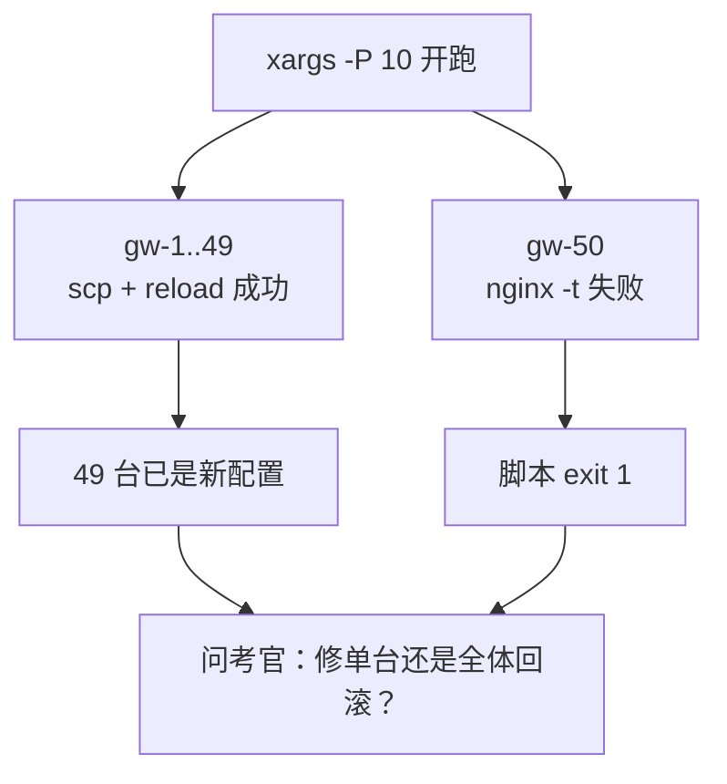
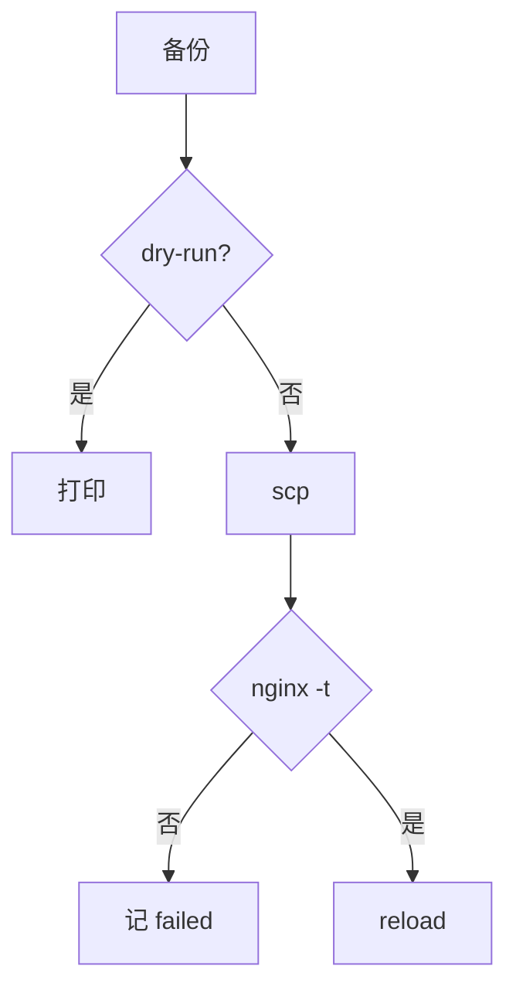

# 05｜运维开发实战题 · SRE 开发能力

> 题目写「批量更新 100 台 nginx」，候选人闷头写 for+ssh，不问失败停不停、有没有 dry-run；写到一半才发现第 50 台失败不知道怎么回滚——考官已经在摇头。
> **本章回答**：六道运维开发实战题从审题、红线、骨架到收口怎么答——先问约束、守四条红线、选对语言，写出能进生产的关键骨架。
> **不讲**：Shell 三开关 → [01](../01-Shell/)；ThreadPool → [02](../02-Python/)；pprof → [03](../03-Go/)；awk/jq → [04](../04-正则与文本处理/)。

**标记**：🎯重点 · 🔥难点 · ⭐常考 · 🔧实操

---

## 面试怎么考

| 标记 | 考点 |
|------|------|
| **核心** | 先问约束；四条红线（幂等、可回滚、默认 dry-run、日志可追溯） |
| **必会** | Nginx：备份→scp→nginx -t→reload；K8s `kubectl -o json`，P1 非 0 退出 |
| **常用** | 5xx 先对 log_format；Go SSH sem 50 + Dial Timeout；令牌桶 vs 漏桶 |
| **常考** | 并行不是事务；POST 不盲重试；飞书 timeout=5；风暴靠 AM grouping |
| **加分** | Prom canary label；CI 扫描非 0 停推 tag；对账只读凭证 |

> 📝 **面试（30 秒）**：白板我先问约束——多少台、失败停不停、dry-run 和回滚。四条红线：幂等、可回滚、默认 dry-run、日志可追溯。Shell：`set -euo`、备份、`nginx -t` 通过才 reload、`xargs -P 10`。Python：K8s 巡检 `-o json`，P1 `exit 1`；HTTP timeout，Retry 只 GET。Go SSH：sem 50、Dial 10s、failed 非 0。并行不是事务——第 50 台失败要回滚已成功的。令牌桶允许突发；告警 dedupe 在 Alertmanager。

---

## 能力边界

| 六类题 | 本章写什么 | 细节去哪 |
|--------|-----------|---------|
| 批量部署 | dry-run、备份、nginx -t、`-P 10` | [01 Shell](../01-Shell/) |
| 日志 5xx | 列号、时间窗、10GB 策略 | [04 正则](../04-正则与文本处理/) |
| K8s 巡检 | JSON、P1/P2、exit 1 | [02 Python](../02-Python/) |
| 批量 SSH | sem、Timeout、failed 汇总 | [03 Go](../03-Go/) |
| 限流 | 令牌桶、429、POST 幂等 | [02 Python](../02-Python/) |
| 告警/门禁 | 飞书 timeout、Prom canary | [03-19](../../03-Kubernetes/19-监控与可观测性/) |

- 🔑 **口诀**：管道 → Shell；API+JSON → Python；数千 SSH → Go
- 🎚️ **角色边界**
  - **你（白板）**：先问约束再写骨架——卡住停笔问「第 50 台失败怎么办」
  - **脚本**：timeout、failed 汇总、退出码——「跑完了」≠ 100 台都对
  - **平台**：AM grouping、GitOps、审批——别在发送脚本 reinvent dedupe

> ⚠️ **别混**：语法大全 ≠ 生产骨架——考官看失败可见，不看你会不会背 `awk` 全手册。

本节对应练习题 Q12。边界清了——白板五步。

---

## 一、一张图：一道白板题的一生

> 🎯 **一句话**：**问约束 → 选语言 → 画骨架 → 关键路径 → 失败策略**——五步写完才像生产。


- 📖 **读图**
  - 🛤️ 左「约束」到右「失败」是白板主线；死得最多的是**没问就写 for+ssh**
  - 🚪 每步都能拿分：问清失败停不停 = senior 信号；失败策略写 failed+exit 1 才过关

本节对应练习题 Q10。

---

## 二、入口：白板五步与语言选型 ⭐

> 🎯 **一句话**：第一句不是 `for`，是「多少台？失败停不停？dry-run？回滚 RTO？」

### 🎤 五步清单

```text
① 多少台？失败停不停？dry-run？回滚 RTO？
② Shell 编排 / Python JSON / Go 大规模
③ 输入 → 处理 → 输出 → 退出码
④ 备份、校验、有界并发、timeout
⑤ failed 汇总、非 0 退出、回滚 job
```

### 🗺️ 语言选型

| 场景 | 首选 | 理由 |
|------|------|------|
| 100 台 Nginx | Shell + xargs | 调已有命令，dry-run 一行 |
| 5xx + 时间窗 | Python / awk | 简单 awk；复杂 Python |
| K8s 巡检 | Python subprocess | `-o json`，不必 client-go |
| 3000 SSH | Go | sem + Timeout 清晰 |
| 开服限流 | TokenBucket | 跨机 Redis+Lua |
| 飞书 webhook | requests | timeout=5，三次退避 |

### 📦 失败汇总模式

- **Shell**：失败写 `failed_hosts.txt`，末尾 `[ -s failed_hosts.txt ] && exit 1`
- **Python**：`as_completed` 必须 `result()`；`if failed: sys.exit(1)`
- **Go**：`WaitGroup` + `results chan`；`failed>0 → os.Exit(1)`

#### ❓ 为什么「跑完了」不等于成功？

- ❌ **xargs / 线程池 / goroutine「全跑完」**：子任务失败被吞，主进程仍 exit 0
- ✅ **CI 只认两样**：进程退出码 + failed 列表是否为空
- 🔥 **半残比全失败更危险**：49 台已变、1 台旧 → 配置不一致（见三节）

> 📝 **面试**：xargs/线程池/goroutine 都能「跑完但半残」——**退出码和 failed 列表**才是 CI 看的。⭐（练习题 Q11）

本节对应练习题 Q10、Q11、Q12。骨架会了——先钉红线。

---

## 三、原理讲透：四条红线与六类题 🎯🔥

### 🚦 3.1 四条红线 ⭐

> 🎯 **一句话**：不是「能跑」，是跑错了能收、跑完能查、默认不伤生产。

> 💡 **打个比方**：像手术四查对——刀口开错了能缝回去（可回滚），演练时不真切（dry-run），每一步有记录（日志可追溯）。

| 红线 | 含义 | 白板体现 |
|------|------|---------|
| 幂等 | 多次执行结果一样 | 同一 conf 多次 scp |
| 可回滚 | 每步有逆操作 | 远端 `conf.bak.timestamp` |
| 默认 dry-run | 第一次只打印 | `DRY_RUN="${1:-true}"` |
| 日志可追溯 | 哪台成功失败 | `echo "[$host]" >&2` |

- 🔧 **现场第一分钟**
  - 先问：多少台？第 50 台失败停不停？默认 dry-run？回滚 RTO？
  - 再写：`DRY_RUN="${1:-true}"`、远端 `conf.bak.timestamp`、failed 文件、exit 1

> 📝 **面试**：白板四条红线：幂等、可回滚、默认 dry-run、日志可追溯；先问约束再写代码。⭐（练习题 Q1）

### 💥 3.2 并行不是事务 🔥⭐

> 🎯 **一句话**：100 台并行，第 50 台失败时前 49 台**不会自动回滚**。

> 💡 **打个比方**：像 100 人同时改配置——第 50 人改错了，前 49 人的修改不会自动撤销。



- 📖 **读图**
  - 🛤️ 并行分叉后左边已变、右边失败——**脚本停了 ≠ 世界没改**
  - 🚪 分叉终点是「问变更单」，不是「重跑就好」

#### ❓ 为什么部分成功比全失败更危险？

- ❌ **误区**：脚本 exit 1 了所以没改 → 真相：49 台配置已变
- ❌ **误区**：部分成功不用管 → 真相：配置不一致更危险
- ❌ **误区**：重跑就好 → 真相：要区分「只修第 50 台」vs「49 台跑回滚 job」
- ✅ **修法**：failed 列表 + 按变更单决定；战斗服不要和网关同一批并行 reload

> 📝 **面试**：并行不是事务；第 50 台失败要问考官是修单台还是全体回滚。🔥（练习题 Q1）

### 🪣 3.3 令牌桶 vs 漏桶 ⭐

> 🎯 **一句话**：令牌桶**允许突发**；漏桶**严格匀速**。

> 💡 **打个比方**：令牌桶像地铁闸机里攒的次卡——短时间能进一批；漏桶像匀速单通道，突发只能排队。

| 维度 | 令牌桶 | 漏桶 |
|------|--------|------|
| 突发 | capacity 内允许 | 排队或丢弃 |
| 适用 | API 限 QPS | 带宽整形 |
| 分布式 | Redis+Lua | Redis 队列 |

- 🎮 **开服场景**：`TokenBucket(capacity=40, refill_rate=20)` → 前 2 秒可突发 40；漏桶同样 20/s → 突发排队或丢弃
- 🚫 **POST 被 429** → **不要 Retry**，查是否已创建或幂等键

#### ❓ 为什么 429 后 POST 不能盲重试？

- ❌ **GET 可幂等重试**：再读一次结果不变
- ❌ **POST 开服 / 创建**：盲重试 → 双写、双订单
- ✅ **做法**：Retry 只 GET；POST 用幂等键或先查「是否已创建」

> 📝 **面试**：令牌桶允许突发，开服用 capacity=40 refill=20；429 后 POST 不能盲重试。⭐（练习题 Q5、Q13）

### 📢 3.4 告警在 Alertmanager，不在脚本 ⭐

> 🎯 **一句话**：发送脚本只管 POST + timeout；**grouping/inhibit** 是 AM 的活。

> 💡 **打个比方**：像快递分拣中心——发送脚本只负责「把包裹送到门口」，合并同类告警是分拣规则的事。


- 📖 **读图**：风暴先进 AM 合并，再进发送脚本；在脚本里自己 dedupe → 仍漏、仍乱
- 🔧 **发送脚本钉子**：`requests.post(..., timeout=5)`，三次退避，失败降级邮件/短信
- 🎚️ **加分口述**
  - **Prom 门禁**：PromQL 带 **canary label**，对比发布前 5min baseline；Prom 挂了默认 **不放行**
  - **CI 扫描**：`trivy --exit-code 1 --severity CRITICAL`；非 0 不 push tag
  - **对账释放**：只读 AK + paginator；**列出 ≠ 删除**，有 diff 就 exit 1 等人审

#### ❓ 为什么 Prom 挂了不能默认放行？

- ❌ **「监控挂了先放行更安全」** → 门禁被绕过，坏镜像照样推
- ✅ **Prom 不可用 = 不放行**；同理 trivy 超时当通过 = 漏扫

> 📝 **面试**：dedupe 在 Alertmanager grouping，不在发送脚本；P0/P3 分 webhook。⭐（练习题 Q6～Q9）

本节对应练习题 Q1、Q4～Q9、Q13。原理懂了——生产模板。

---

## 四、生产模板 🔧

白板写骨架 + 讲取舍。**每个模板：场景 → 走一遍 → 脚本 → 输出**。

### 🐚 Shell：批量 Nginx deploy

**场景**：100 台网关改 nginx.conf，默认 dry-run，实跑前备份。



- 📖 **读图**：干跑只走打印；实跑必须 **nginx -t 通过才 reload**——`-t` 失败仍 reload 直接减分

```bash
#!/usr/bin/env bash
set -euo pipefail
HOSTS_FILE="${HOSTS_FILE:-hosts.txt}"
CONFIG_SRC="${CONFIG_SRC:-./nginx.conf}"
CONFIG_DST="${CONFIG_DST:-/etc/nginx/nginx.conf}"
DRY_RUN="${DRY_RUN:-true}"   # 默认 dry-run
PARALLEL="${PARALLEL:-10}"
FAILED_FILE="${FAILED_FILE:-failed_hosts.txt}"
: > "$FAILED_FILE"
[[ -f "$HOSTS_FILE" && -f "$CONFIG_SRC" ]] || { echo "missing file" >&2; exit 1; }

backup_remote() {
  local host=$1
  ssh -o BatchMode=yes -o ConnectTimeout=10 -n "$host" \
    "cp '$CONFIG_DST' '${CONFIG_DST}.bak.\$(date +%Y%m%d%H%M%S)' 2>/dev/null || true"
}
deploy_host() {
  local host=$1
  backup_remote "$host" || { echo "$host" >> "$FAILED_FILE"; return 1; }
  if [[ "$DRY_RUN" == "true" ]]; then
    echo "[$host] DRY-RUN: scp && nginx -t && reload" >&2; return 0
  fi
  scp -q "$CONFIG_SRC" "$host:$CONFIG_DST" || { echo "$host" >> "$FAILED_FILE"; return 1; }
  ssh -o BatchMode=yes -o ConnectTimeout=10 -n "$host" \
    "nginx -t && systemctl reload nginx" || { echo "$host" >> "$FAILED_FILE"; return 1; }
  echo "[$host] done" >&2
}
export -f backup_remote deploy_host
export CONFIG_SRC CONFIG_DST DRY_RUN FAILED_FILE
xargs -P "$PARALLEL" -I {} bash -c 'deploy_host "$@"' _ {} < "$HOSTS_FILE" || true
[[ -s "$FAILED_FILE" ]] && { cat "$FAILED_FILE" >&2; exit 1; }
echo "all ok (dry-run=$DRY_RUN)" >&2
```

```text
[gateway-01] DRY-RUN: scp && nginx -t && reload
all ok (dry-run=true)
# 实跑失败：gateway-50 → FAILED hosts 列表 → exit 1
```

> 🔍 **现场**：先 `DRY_RUN=true` 看打印；实跑看 `failed_hosts.txt` 是否空，再看 `echo $?`。

本节对应练习题 Q1、Q14。

---

### 🐍 Python：5xx Top IP（时间窗口）

```python
#!/usr/bin/env python3
import argparse, logging, sys
from collections import defaultdict
from datetime import datetime
LOG_FMT = "%d/%b/%Y:%H:%M:%S"
log = logging.getLogger(__name__)

def parse_log(path, start=None, end=None, top_n=10):
    ip_errors = defaultdict(lambda: {"count": 0, "urls": defaultdict(int)})
    with open(path, encoding="utf-8", errors="replace") as f:
        for line in f:
            p = line.split()
            if len(p) < 9 or not p[8].startswith("5"): continue
            try:
                t = datetime.strptime(p[3].strip("[]"), LOG_FMT)
            except ValueError: continue
            if start and t < start: continue
            if end and t > end: continue
            ip, url = p[0], p[6] if len(p) > 6 else "-"
            ip_errors[ip]["count"] += 1
            ip_errors[ip]["urls"][url] += 1
    for ip, d in sorted(ip_errors.items(), key=lambda x: -x[1]["count"])[:top_n]:
        print(f"{ip}: {d['count']} errors")
        for u, c in sorted(d["urls"].items(), key=lambda x: -x[1])[:3]:
            print(f"  {u}: {c}")

def main():
    ap = argparse.ArgumentParser()
    ap.add_argument("path", nargs="?", default="access.log")
    ap.add_argument("--start"); ap.add_argument("--end"); ap.add_argument("--top", type=int, default=10)
    args = ap.parse_args()
    ps = datetime.strptime(args.start, LOG_FMT) if args.start else None
    pe = datetime.strptime(args.end, LOG_FMT) if args.end else None
    parse_log(args.path, ps, pe, args.top)

if __name__ == "__main__":
    logging.basicConfig(level=logging.INFO)
    try: main()
    except FileNotFoundError: log.exception("not found"); sys.exit(1)
```

```text
10.0.0.5: 8421 errors
  /login: 8200          # ← URL 集中 /login → 上游挂
10.0.0.12: 312 errors
  /login: 310
```

- 🔑 **读数**：Top IP 集中、URL 杂 → 扫号；URL 集中 `/login` → 上游挂
- 📦 **10GB**：先 `grep '" 5[0-9][0-9]'` 再解析——别 `cat` 全读进内存

> ⚠️ **别混**：先 `head -1` 对 `log_format` 列号；列错 → 5xx 统计永远为 0。

本节对应练习题 Q2。

---

### 🐍 Python：K8s 巡检

```python
#!/usr/bin/env python3
import json, logging, subprocess, sys
from dataclasses import dataclass
log = logging.getLogger(__name__)

@dataclass
class Issue:
    severity: str; resource: str; message: str

def kubectl_json(cmd, timeout=60):
    r = subprocess.run(["kubectl", *cmd, "-o", "json"],
                       capture_output=True, text=True, timeout=timeout)
    if r.returncode != 0:
        log.error("kubectl failed: %s", r.stderr.strip()); return {"items": []}
    return json.loads(r.stdout)

def check_pod_resources():
    issues = []
    for pod in kubectl_json(["get", "pods", "-A"]).get("items", []):
        ns, name = pod["metadata"]["namespace"], pod["metadata"]["name"]
        for c in pod["spec"].get("containers", []):
            res = c.get("resources", {})
            if not res.get("requests"):
                issues.append(Issue("P2", f"{ns}/pod/{name}/{c['name']}", "no requests"))
            if not res.get("limits"):
                issues.append(Issue("P3", f"{ns}/pod/{name}/{c['name']}", "no limits"))
    return issues

def check_deployment_readiness():
    issues = []
    for dep in kubectl_json(["get", "deploy", "-A"]).get("items", []):
        ns, name = dep["metadata"]["namespace"], dep["metadata"]["name"]
        for c in dep["spec"]["template"]["spec"].get("containers", []):
            if "readinessProbe" not in c:
                issues.append(Issue("P1", f"{ns}/deploy/{name}/{c['name']}", "no readinessProbe"))
    return issues

def check_nodes():
    issues = []
    for node in kubectl_json(["get", "nodes"]).get("items", []):
        n = node["metadata"]["name"]
        for c in node["status"].get("conditions", []):
            if c["type"] == "Ready" and c["status"] != "True":
                issues.append(Issue("P1", f"node/{n}", f"NotReady: {c.get('reason','')}"))
    return issues

def check_pvc_pending():
    issues = []
    for pvc in kubectl_json(["get", "pvc", "-A"]).get("items", []):
        if pvc["status"].get("phase") == "Pending":
            ns, name = pvc["metadata"]["namespace"], pvc["metadata"]["name"]
            issues.append(Issue("P2", f"{ns}/pvc/{name}", "Pending"))
    return issues

def main():
    logging.basicConfig(level=logging.INFO, format="%(asctime)s [%(levelname)s] %(message)s")
    all_i = (check_pod_resources() + check_deployment_readiness()
             + check_nodes() + check_pvc_pending())
    order = {"P1": 0, "P2": 1, "P3": 2}
    all_i.sort(key=lambda x: (order.get(x.severity, 9), x.resource))
    for i in all_i: print(f"[{i.severity}] {i.resource}: {i.message}")
    p1 = sum(1 for i in all_i if i.severity == "P1")
    print(f"\nTotal: {len(all_i)} (P1={p1})")
    if p1: sys.exit(1)

if __name__ == "__main__": main()
```

```text
[P1] prod/deploy/hall-api/hall: no readinessProbe
[P1] node/worker-03: NotReady: KubeletNotReady
[P2] game/pvc/data-battle-7: Pending
Total: 3 (P1=2)   # ← exit 1
```

#### ❓ 为什么必须 `-o json`，不能解析文本？

- ❌ **`kubectl get` 文本**：列宽截断、版本差一列就全错
- ✅ **`-o json`**：字段稳定；巡检权限不要 cluster-admin
- 🔥 **P1 必须 `sys.exit(1)`**——永远绿 = CI 当没看见

本节对应练习题 Q3。

---

### 🐍 Python：TokenBucket

```python
import time, threading

class TokenBucket:
    def __init__(self, capacity, refill_rate):
        self.capacity, self.refill_rate = capacity, refill_rate
        self.tokens, self.last_refill = capacity, time.monotonic()
        self.lock = threading.Lock()

    def allow(self):
        with self.lock:
            now = time.monotonic()
            self.tokens = min(self.capacity,
                self.tokens + (now - self.last_refill) * self.refill_rate)
            self.last_refill = now
            if self.tokens >= 1:
                self.tokens -= 1; return True
            return False

bucket = TokenBucket(40, 20)  # 突发 40，长期 20/s
for sid in server_ids:
    if not bucket.allow(): failed.append(sid); continue
    open_server(sid)  # POST timeout=(3,10)，不 Retry
```

```text
server_id=101 ok | server_id=102 rate_limited → failed 列表 → exit 1
```

本节对应练习题 Q5、Q13。

---

### 🐍 Python：飞书告警 send

```python
import logging, time, requests
log = logging.getLogger(__name__)

def send_feishu_alert(webhook, title, content, severity="P1"):
    payload = {"msg_type": "interactive", "card": {
        "header": {"title": {"tag": "plain_text", "content": f"[{severity}] {title}"}},
        "elements": [{"tag": "div", "text": {"tag": "lark_md", "content": content}}],
    }}
    for attempt in range(3):
        try:
            r = requests.post(webhook, json=payload, timeout=5)
            r.raise_for_status(); return True
        except Exception:
            if attempt < 2: time.sleep(2 ** attempt)
            else: log.exception("feishu failed"); return False
```

```text
WARNING attempt 1 failed → INFO sent attempt 2
# 三次全失败 → 降级邮件/短信 + exit 1
```

本节对应练习题 Q6。

---

### 🐹 Go：并发 SSH skeleton

```go
package main
import ("fmt"; "log"; "os"; "sync"; "time"; "golang.org/x/crypto/ssh")

type Result struct { Host, Out string; Err error }

func runSSH(hosts []string, user string, key []byte, cmd string, n int) []Result {
    signer, _ := ssh.ParsePrivateKey(key)
    cfg := &ssh.ClientConfig{
        User: user, Auth: []ssh.AuthMethod{ssh.PublicKeys(signer)},
        HostKeyCallback: ssh.InsecureIgnoreHostKey(), // 生产用 knownhosts
        Timeout: 10 * time.Second,
    }
    sem := make(chan struct{}, n)
    ch := make(chan Result, len(hosts))
    var wg sync.WaitGroup
    for _, h := range hosts {
        host := h; wg.Add(1)
        go func() {
            defer wg.Done()
            sem <- struct{}{}; defer func(){ <-sem }()
            c, err := ssh.Dial("tcp", host+":22", cfg)
            if err != nil { ch <- Result{Host: host, Err: err}; return }
            defer c.Close()
            s, _ := c.NewSession(); defer s.Close()
            out, err := s.CombinedOutput(cmd)
            ch <- Result{Host: host, Out: string(out), Err: err}
        }()
    }
    wg.Wait(); close(ch)
    var all []Result
    for r := range ch { all = append(all, r) }
    return all
}

func main() {
    key, _ := os.ReadFile(os.ExpandEnv("$HOME/.ssh/id_rsa"))
    rs := runSSH([]string{"10.0.0.1","10.0.0.99"}, "ops", key, "uname -r", 50)
    failed := 0
    for _, r := range rs {
        if r.Err != nil { failed++; fmt.Fprintf(os.Stderr, "FAIL %s: %v\n", r.Host, r.Err) }
        else { fmt.Printf("OK %s: %s", r.Host, r.Out) }
    }
    if failed > 0 { os.Exit(1) }
}
```

```text
OK 10.0.0.1: 5.15.0-91-generic
FAIL 10.0.0.99: dial tcp: i/o timeout   # ← exit 1
```

> 🔍 **现场**：跑完第一件事看退出码——

```bash
./ssh-check; echo "exit=$?"
# exit=0    ← 全部成功
# exit=1    ← 有失败，看 stderr 的 FAIL 行
```

本节对应练习题 Q4、Q11。模板拿走——踩坑。

---

## 五、作战：踩坑清单

| 现象 | 原因 | 修法 |
|------|------|------|
| 49 台已改 1 台旧 | 并行非事务 | failed 文件 + exit 1 |
| 跳板机 OOM | cat 10GB 全读 | grep 过滤 + 逐行 |
| 5xx 统计为 0 | 列号错 | head -1 对 format |
| 巡检永远绿 | P1 仍 exit 0 | any P1 → exit 1 |
| SSH 握手失败一片 | 无限并发 | sem 50 + Timeout |
| 开服双写 | 429 Retry POST | Retry 只 GET |
| P0 静默 | 飞书吞异常 | timeout=5 + 降级 |
| 告警风暴 | 发送层 dedupe | AM grouping |
| 误释放战斗机 | 读写 AK 自动删 | 只读 + 人审 |
| Go SSH 全卡 | 无 Dial Timeout | `Timeout: 10s` |
| CI 扫描漏报 | trivy 超时当通过 | `--exit-code 1` 非 0 停推 |
| Prom 门禁误放行 | Prom 挂了默认放行 | 不可用 = 不放行 |

本节对应练习题 Q13。踩坑钉死——收口。

---

## 六、收口：必会 · 常考 · 速查

### ✅ 对错表

| 说法 | 对错 |
|------|------|
| 先问约束再写 | ✅ |
| 默认 DRY_RUN=true | ✅ |
| nginx -t 失败仍 reload | ❌ |
| 100 台并行 = 事务 | ❌ |
| kubectl get 文本解析 | ❌ |
| P1 必须非 0 退出 | ✅ |
| POST 默认 Retry | ❌ |
| 令牌桶允许突发 | ✅ |
| dedupe 在发送脚本 | ❌ |
| 对账脚本直接 release | ❌ |
| Prom 挂了默认放行 | ❌ |
| sem 50 + Dial 10s | ✅ |
| 飞书三次失败后静默 | ❌ |

### 🔧 命令速查

```bash
# Nginx 干跑 / 实跑
DRY_RUN=true  ./deploy.sh
DRY_RUN=false ./deploy.sh; echo exit=$?

# 5xx 先滤再解析
grep '" 5[0-9][0-9]' access.log | head
head -1 access.log   # ← 对 log_format 列号

# K8s / CI
kubectl get deploy -A -o json | python check.py; echo exit=$?
trivy image --exit-code 1 --severity CRITICAL "$IMG"

# Go SSH
./ssh-check; echo "exit=$?"
```

### 📝 面试锚点

| 问 | 30 秒答 |
|----|---------|
| 白板怎么开场？ | 先问约束，再四条红线，再选语言 |
| 第 50 台失败？ | 并行非事务；问修单台还是回滚 49 |
| 为何 `-o json`？ | 文本列不稳；P1 必须 exit 1 |
| 令牌桶 vs 漏桶？ | 桶允许突发；漏桶匀速；POST 不盲重试 |
| 告警风暴？ | grouping 在 AM，脚本只管 POST+timeout |

### ⚠️ 易错一句话对照

- 错：脚本 exit 0 就是全成功 → 对：看 `failed_hosts.txt` 是否为空
- 错：POST 被 429 就 Retry → 对：只 Retry GET；POST 用幂等键
- 错：Prom 挂了默认放行更安全 → 对：不可用 = 不放行
- 错：trivy 超时当扫描通过 → 对：非 0 停推 tag
- 错：dry-run 写成 `except: pass` → 对：默认只打印，显式 false 才变更

> 🧱 **数字墙**：Nginx 并行 **10**；Go SSH sem **50**、Dial **10s**；飞书 timeout **5s**、重试 **3**；开服常见 **20 QPS**、突发 **40**。

本节对应练习题 Q1～Q14。

---

## 合上书，问自己

- [ ] 白板卡住先问哪四个约束？四条红线？
- [ ] 第 50 台 nginx -t 失败，前 49 台怎么办？（**口述**分支）
- [ ] combined 日志 IP/status 哪列？10GB 怎么查？
- [ ] K8s 为什么 `-o json`？P1 和 exit code？
- [ ] Go SSH sem/Timeout/failed 汇总？
- [ ] 令牌桶 vs 漏桶？429 后 POST 能重试吗？
- [ ] CI 扫描超时了该放行还是阻止推 tag？
- [ ] **默画**白板五步 + Nginx 备份→`-t`→reload 决策树

---

**下一章**：[06 SRE 手写题与算法轮](../06-SRE手写题与算法轮/)
