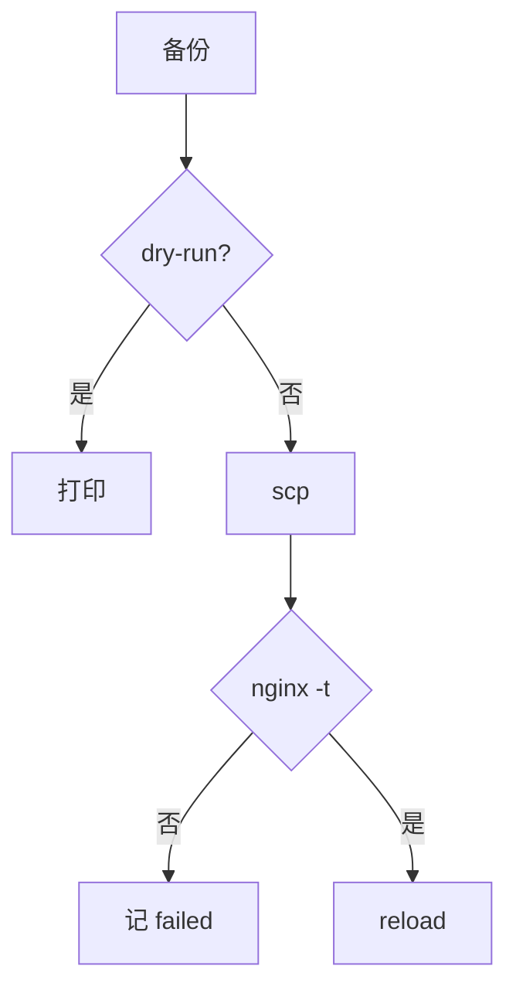
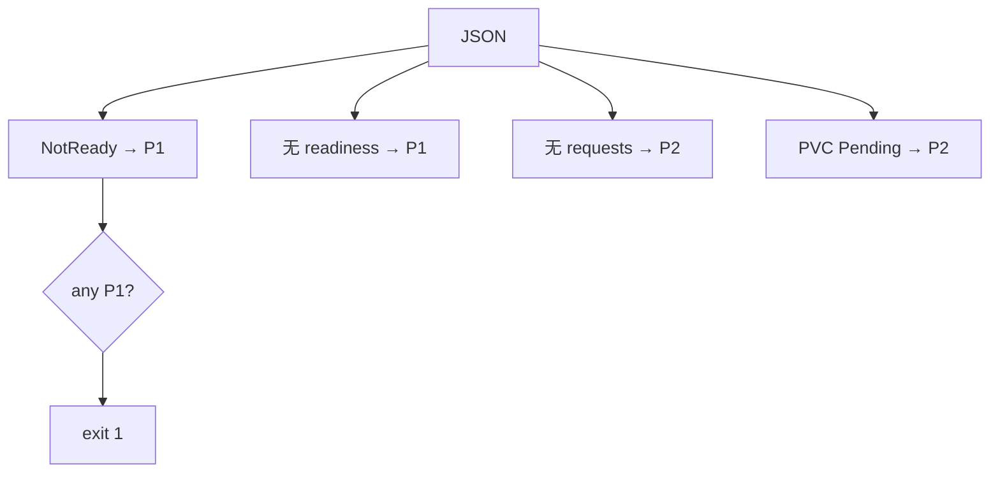
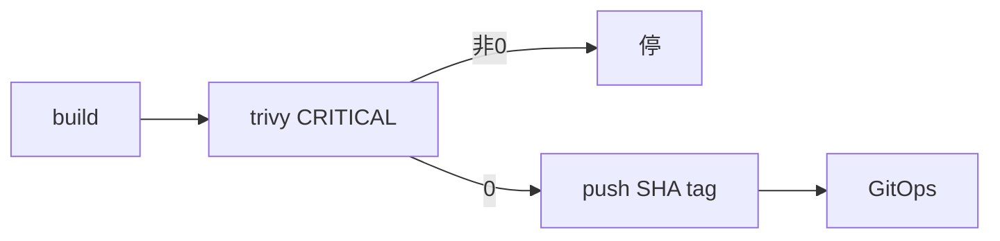
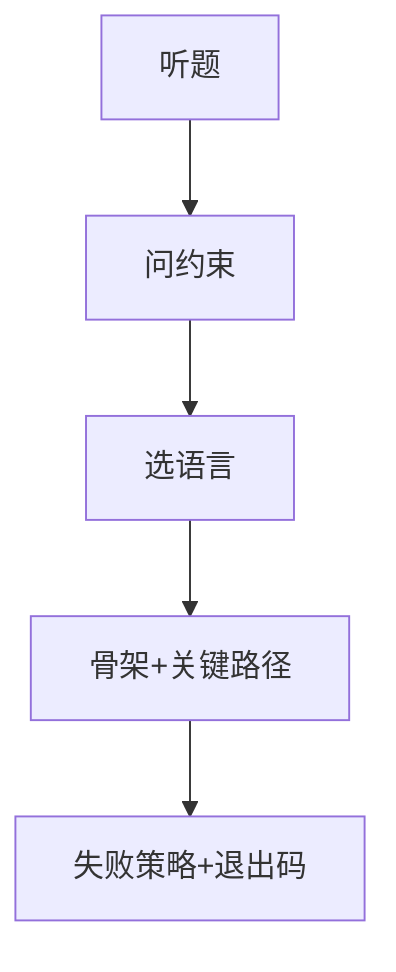

# 05｜运维开发实战题 · 练习题

开始做题前，先给大家一个小建议：合上知识点，对着**四条红线 + 语言选型**口述一遍。能顺下来，下面这些题大半都会了。

做题的方式：每道题**先看标题和场景，自己口述一遍答案，再往下看解答**。

题目顺序：Q1～Q4 钉红线；Q5～Q10 六类题骨架；Q11～Q14 综合与加分。

| 标记 | 含义 |
|------|------|
| **核心** | 不懂整章就没建立起来 |
| **必会** | 值班和面试都要能讲 |
| **常用** | 线上会反复碰到 |
| **常考** | 白板和追问的高频口径 |

## 本题目录

- [Q1 批量 Nginx](#q1) · [Q2 5xx Top IP](#q2) · [Q3 K8s 巡检](#q3)
- [Q4 Go 并发 SSH](#q4) · [Q5 令牌桶](#q5) · [Q6 飞书告警](#q6)
- [Q7 Prom 门禁](#q7) · [Q8 CI 扫描](#q8) · [Q9 对账释放](#q9)
- [Q10 白板策略](#q10) · [Q11 失败汇总](#q11) · [Q12 语言选型](#q12) · [Q13 幂等重试](#q13) · [Q14 Ansible 与裸 SSH](#q14)
- [合上书](#合上书)

---

## Q1

**★★★★★｜100 台节点批量更新 Nginx 配置并 reload，怎么写才像生产？**

**覆盖**：核心 · 必会 · 常考 ｜ **对应**：知识点 [Shell：批量 Nginx deploy](知识点.md)

### 场景

活动前调大 `keepalive_timeout`。有人 `for h in $(cat hosts); do scp; ssh reload; done`，第 50 台 `nginx -t` 失败。


先自己试试，再往下看解答。

### 完整解答

> 🎯 **一句话**：备份→scp→nginx -t→reload，默认 DRY_RUN，`xargs -P 10`。

⭐ 四条红线：幂等、可回滚、默认 dry-run、日志可追溯。



```bash
set -euo pipefail
DRY_RUN="${DRY_RUN:-true}"; PARALLEL=10
deploy_host() {
  local host=$1
  ssh -n "$host" "cp $CONFIG_DST ${CONFIG_DST}.bak.\$(date +%Y%m%d%H%M%S) 2>/dev/null || true"
  [[ "$DRY_RUN" == "true" ]] && { echo "[$host] DRY-RUN" >&2; return; }
  scp -q "$CONFIG_SRC" "$host:$CONFIG_DST"
  ssh -n "$host" "nginx -t && systemctl reload nginx"
}
export -f deploy_host
xargs -P "$PARALLEL" -I {} bash -c 'deploy_host "$@"' _ {} < hosts.txt
# failed_hosts.txt 非空 → exit 1
```

🔧 先问：同一角色？能并行？失败策略？回滚 RTO。网关 `-P 10`；战斗服别混批。🔥 第 50 台失败不是事务——看变更单决定回滚 49 台还是只修第 50 台。

评分点：`set -euo pipefail`；`DRY_RUN` 默认 true；远端备份 timestamp；**先 nginx -t 再 reload**；失败 host 汇总非 0。Ansible 等价：copy + validate + reload。

### 再追问

必须全集群一致？——对已成功的跑回滚 job（scp bak + nginx -t + reload）。磁盘满只修第 50 台？——新配置正确时修完重入 failed 列表即可。

---

## Q2

**★★★★★｜access.log 找 5xx Top-10 IP；日志 10GB 怎么办？**

**覆盖**：核心 · 必会 · 常用 ｜ **对应**：知识点 [Python：5xx Top IP（时间窗口）](知识点.md)

### 场景

登录 502，`cat access.log | grep 502 | wc` 打满跳板机。要 Top IP + URL，限定活动前 10 分钟。


四条红线展开。

先自己试试，再往下看解答。

### 完整解答

> 🎯 **一句话**：先 head -1 对列；10GB 先 grep 再 awk/Python；JSON 用 jq。

⭐ combined：`$1` IP、`$9` status、`$6` URL。

🔧 坏行处理：列数 `<9` 或时间戳 parse 失败 → skip + 计数 warning，别让一行脏数据炸全脚本。

```bash
awk '$9 ~ /^5/ {c[$1]++} END {for (i in c) print c[i], i}' access.log | sort -rn | head -10
grep '" 5[0-9][0-9]' huge.log | awk '...' | sort -rn | head -10   # ← 10GB 先过滤再解析
jq -r 'select(.status >= 500) | .client_ip' access.log | sort | uniq -c | sort -rn | head -10
```

时间窗见知识点 Python 模板（`--start/--end` 过滤 `$3`）。Top IP 集中 URL 杂 → 扫号；URL 集中 `/login` → 上游挂。经常查的日志进 Loki/ES，跳板机只做 ad-hoc。

> ⚠️ **别混**：JSON 行不能 awk 硬拆，用 jq 或 Python `json.loads`。压缩日志用 `zcat | grep | awk` 逐行，不 load 全文件。

### 再追问

5xx 统计为 0 是什么原因？——列号错了，先 `head -1` 对 format。跳板机 OOM？——cat 10GB 全读，必须 grep 过滤 + 逐行。

---

## Q3

**★★★★★｜K8s 巡检：没 requests、没 readiness、PVC Pending、Node NotReady。**

**覆盖**：核心 · 必会 · 常用 ｜ **对应**：知识点 [Python：K8s 巡检完整脚本](知识点.md)

### 场景

肉眼 `kubectl get pod` 扫，活动日 NotReady 节点未发现，登录打到脏节点。


语言选型。

先自己试试，再往下看解答。

### 完整解答

> 🎯 **一句话**：`kubectl -o json` + timeout，P1 存在 exit 1，不要 cluster-admin。



```python
def kubectl_json(cmd):
    r = subprocess.run(["kubectl", *cmd, "-o", "json"],
                       capture_output=True, text=True, timeout=60)
    if r.returncode != 0: return {"items": []}
    return json.loads(r.stdout)
# ← 四函数：pod resources / deploy readiness / nodes / pvc
# ← any P1 → sys.exit(1)
```

⭐ P1：NotReady 节点、Deploy 缺 readinessProbe（误流量入口）。P2：缺 requests、PVC Pending（调度/存储风险）。完整脚本见知识点。不用 client-go；写操作走 GitOps。战斗服 liveness 过激要单独报——有状态负载别和 Web 套同一探针标准。

> ⚠️ **别混**：巡检永远绿——P1 仍 exit 0 是最常见的坑。必须 any P1 → sys.exit(1)。

### 再追问

要 cluster-admin 吗？——不要，get/list 即可。输出 JSON 给平台消费？——可以，但 CI 门禁看 exit code。为什么不用 `kubectl get` 文本解析？——输出格式不保证稳定，JSON 才是 API 契约。

---

## Q4

**★★★★☆｜Go 并发 SSH，一台卡住怎么办？**

**覆盖**：必会 · 常用 · 常考 ｜ **对应**：知识点 [Go：并发 SSH skeleton](知识点.md)

### 场景

3000 台扫 `uname -r`，指定 Go。一台防火墙丢包、一台 SSH hung。


就是开头闷头写 for 的反例。

先自己试试，再往下看解答。

### 完整解答

> 🎯 **一句话**：sem 50 + Dial Timeout 10s，failed>0 非 0 退出。

🔧 核心骨架：

```go
sem := make(chan struct{}, 50)
cfg := &ssh.ClientConfig{Timeout: 10*time.Second, HostKeyCallback: knownHosts}
for _, h := range hosts {
    go func(host string) {
        sem <- struct{}{}; defer func(){ <-sem }()
        c, err := ssh.Dial("tcp", host+":22", cfg)
        // err → results; else CombinedOutput(cmd)
    }(h)
}
// wg.Wait → close → failed>0 → os.Exit(1)
```

🔥 一台 hung：靠 `Timeout`，可选 `context.WithTimeout` 包 Session。生产不用 `InsecureIgnoreHostKey` 当默认。

失败汇总：

```go
failed := 0
for _, r := range results {
    if r.Err != nil { failed++; log.Printf("FAIL %s: %v", r.Host, r.Err) }
}
if failed > 0 { os.Exit(1) }   # ← CI 看这个
```

泄漏检查：每个 goroutine `defer wg.Done()`；`close(results)` 必须在 `wg.Wait()` 之后。

### 再追问

3000/50=60 批，最坏 ~10 分钟；瓶颈在握手不是 goroutine 数。Python ThreadPool 什么时候够用？——几百台、命令短、连接复用少时够用；数千台 Go 更合适。

---

## Q5

**★★★★☆｜令牌桶 vs 漏桶？开服 API 怎么用？**

**覆盖**：必会 · 常用 · 常考 ｜ **对应**：知识点 [3.3 令牌桶 vs 漏桶](知识点.md)

### 场景

限 20 QPS，50 并发打出 429，部分服双创建。


Nginx 批量骨架。

先自己试试，再往下看解答。

### 完整解答

> 🎯 **一句话**：令牌桶允许突发；开服用桶+failed 列表，POST 不盲重试。

🔥 令牌桶 `capacity` 内允许突发；漏桶严格匀速。开服用 `TokenBucket(capacity=40, refill_rate=20)`。

```python
bucket = TokenBucket(capacity=40, refill_rate=20)
for sid in server_ids:
    if not bucket.allow(): failed.append(sid); continue
    open_server(sid)
```

| | 令牌桶 | 漏桶 |
|-|--------|------|
| 突发 | 允许 | 不允许 |
| 场景 | API QPS | 带宽整形 |

分布式 Redis+Lua。429 后查是否已创建，盲重试双写。

开服脚本用法：

```python
failed = []
for sid in server_ids:
    if not bucket.allow():
        failed.append(sid); continue
    resp = session.post(f"{API}/open", json={"id": sid}, timeout=(3, 10))
    if resp.status_code == 429:
        failed.append(sid)  # ← 不立刻 Retry POST
```

⭐ 失败率高（>30%）应熔断本轮，避免巡检/开服脚本变 DDoS。

### 再追问

漏桶什么时候选？——要严格匀速出水、不能突发，比如日志写入速率整形。

---

## Q6

**★★★★☆｜飞书告警发送；飞书挂了？告警风暴？**

**覆盖**：必会 · 常用 ｜ **对应**：知识点 [3.4 告警在 Alertmanager，不在脚本](知识点.md)

### 场景

P0 登录跌破，飞书故障全静默；Redis 挂 300 条重复卡片。


K8s 巡检。

先自己试试，再往下看解答。

### 完整解答

> 🎯 **一句话**：三次退避 timeout=5 + 降级；风暴靠 AM grouping。

🔧 发送脚本只管 POST + timeout：

```python
for attempt in range(3):
    try:
        requests.post(webhook, json=payload, timeout=5).raise_for_status(); return True
    except Exception:
        if attempt < 2: time.sleep(2**attempt)
        else: log.exception("failed"); return False  # ← 降级邮件
```

⭐ dedupe 在 Alertmanager `group_by: ['alertname','namespace']`，不在发送脚本。P0/P3 分 webhook。

> ⚠️ **别混**：timeout 30s 不行——队列会被 hung 堵住。P0 静默是飞书吞异常造成的，必须 timeout=5 + 降级邮件/短信。

### 再追问

发送脚本里自己做 dedupe 行吗？——不行，200 Pod CrashLoop 靠脚本 dedupe 仍漏仍乱，AM grouping + `group_wait` 才是正解。

---

## Q7

**★★★★☆｜Prometheus 登录错误率接发布门禁？**

**覆盖**：必会 · 常用 ｜ **对应**：知识点 [3.4 告警在 Alertmanager，不在脚本](知识点.md)

### 场景

金丝雀 5%，有人 curl 全集群均值，canary 2% 被 0.1% 淹没。


批量 SSH。

先自己试试，再往下看解答。

### 完整解答

> 🎯 **一句话**：PromQL 带 canary label；Prom 挂了默认失败。

🔧 门禁脚本：

```python
Q = 'sum(rate(http_requests_total{canary="true",status=~"5.."}[5m]))/sum(rate(...[5m]))'
r = requests.get(f"{prom}/api/v1/query", params={"query": Q}, timeout=5)
val = float(r.json()["data"]["result"][0]["value"][1])
if val > threshold: rollback(); sys.exit(1)
```

🔥 对比 baseline：发布前 5min 同 query 的值，或对照未发布区服。全集群均值会把 canary 2% 错误淹没在 0.1% 里——这是常见坑。没数据不放行。预发可人工豁免并记录；生产默认失败。阈值做成参数——活动日可调但必须写进变更窗口。

> ⚠️ **别混**：canary 门禁 vs 集群均值——canary label 必须带，全集群均值会淹没小流量错误。Prom 挂了和「指标正常」是两回事——挂了默认不放行。

### 再追问

为了发版临时关门禁？——可以记录豁免，但不能事后还声称「有自动检查」。

---

## Q8

**★★★★☆｜CI 镜像扫描失败还推生产 tag 吗？**

**覆盖**：必会 · 常用 ｜ **对应**：知识点 [踩坑清单](知识点.md) · [04-04 CI-CD](../../04-工程化与自动化/04-CI-CD/)

### 场景

Critical CVE 有人 `|| true` 变绿仍 push；Trivy 超时当成功。


5xx 日志。

先自己试试，再往下看解答。

### 完整解答

> 🎯 **一句话**：Trivy Critical 非 0 停，不推 prod tag；豁免默认关。

🔧 流水线骨架：

```bash
set -euo pipefail
docker build -t "reg/hall:${GIT_SHA}" .
trivy image --exit-code 1 --severity CRITICAL "reg/hall:${GIT_SHA}"
docker push "reg/hall:${GIT_SHA}"   # ← 不可变 SHA，禁 :latest 生产
```



超时重试有上限，仍失败当失败。`:prod` 浮动指针须能追溯 SHA。豁免：`SCAN_WAIVER=true` 必须带 `APPROVER` 写日志，默认关。这是 Shell 在流水线的位置，不是另写 CD。

> ⚠️ **别混**：Trivy 超时当扫描通过——禁止。超时重试有上限，仍失败当失败。

### 再追问

扫描通过但有 High 级别 CVE？——看策略：Critical 硬拦，High 可能 warn+工单。口径要说清「我们拦什么 severity」。

---

## Q9

**★★★☆☆｜对账 CMDB 与 ECS，3 台无主能直接 release 吗？**

**覆盖**：常用 · 常考 ｜ **对应**：知识点 [踩坑清单](知识点.md) · [06-05 成本治理](../../06-云平台/05-成本治理/)

### 场景

读写 AK 直接 release，其中一台活动备用战斗机没打 CMDB 标签。


限流。

先自己试试，再往下看解答。

### 完整解答

> 🎯 **一句话**：只读凭证列 diff 等人审；protected 标签不能脚本删。

```python
for inst in fetch_readonly():
    if inst["Tags"].get("protected") == "true": continue
    if inst["InstanceId"] not in cmdb_ids: print(f"orphan {iid}")
if orphans: sys.exit(1)  # ← 列出 ≠ 删除
```

写操作另开 job + 审批 + dry-run。CMDB 滞后当线索，先「待确认」再 TTL 审批。

🔥 云有 CMDB 无 / CMDB 有云无 两种 diff 都要报——后者可能是 CMDB 录入漏了，不等于可以 release。游戏备用机、数据盘、活动 reserve 打 `protected=true`。

> ⚠️ **别混**：列出 orphan ≠ 自动 release。误释放战斗机的根因就是读写 AK + 自动删。只读 + 人审 + 独立审批 job。

### 再追问

脚本发现 3 台 orphan，值班能半夜 auto release 吗？——不能。列清单 + 非 0 退出 + 工单；release 是独立审批 job，默认 dry-run。

---

## Q10

**★★★★★｜白板 coding 总策略：卡住、换语言、编造 API？**

**覆盖**：核心 · 必会 · 常考 ｜ **对应**：知识点 [面试怎么考](知识点.md)

### 场景

「3000 节点磁盘巡检」——有人写 perfect bash 5 分钟；有人编 `kubectl audit --fix`。


告警/门禁。

先自己试试，再往下看解答。

### 完整解答

> 🎯 **一句话**：先问约束+四条红线，选熟语言写骨架，编造 API 换真命令。

⭐ 白板五步：



| 情况 | 做法 |
|------|------|
| 卡住 | 停笔问「第 50 台失败怎么办」 |
| 语言不熟 | 换熟的，说清取舍 |
| 编造 API | 用 kubectl/subprocess/ssh |
| 时间不够 | 骨架 + 10 行 + 口述 |

评分：约束 > 红线 > 失败策略 > 语法。简历没写 Go：诚实说小规模 Python ThreadPool 也行，能讲 sem+Timeout 骨架即可。

🔥 开口模板（30 秒）：「我先确认规模、失败是否停全批、有没有 dry-run 和回滚。生产脚本四条红线：幂等、可回滚、默认 dry-run、日志可追溯。我选 [Shell/Python/Go] 因为……关键路径是……失败时汇总 failed 并非 0 退出。」

> ⚠️ **别混**：没问约束就写循环、编造不存在的 API、`except pass` 或 `|| true` 让 CI 绿、无限并发 SSH、发送层做 dedupe——这些都是禁止项。

### 再追问

考官说「写单元测试」？——讲测试点：dry-run 不 scp、nginx -t mock 失败不 reload、P1 触发 exit 1、TokenBucket 补令牌速率。不必现场写 pytest。

---

## Q11

**★★★★☆｜给出三种语言的批量执行片段，哪个会「跑完但半残」？CI 怎么知道？**

**覆盖**：核心 · 必会 · 常考 ｜ **对应**：知识点 [语法必会 · 失败汇总模式](知识点.md)

### 场景

新人写了三版「100 台巡检」，都能跑完输出结果，但 CI 绿了不该绿的——49 台成功 1 台失败，CI 却报通过。


并行不是事务。

先自己试试，再往下看解答。

### 完整解答

> 🎯 **一句话**：xargs/线程池/goroutine 都能「跑完但半残」——退出码和 failed 列表才是 CI 看的。

🔥 三种语言各自的坑：

Shell：
```bash
xargs -P 10 -I {} bash -c 'deploy_host "$@"' _ {} < hosts.txt || true
# ← || true 吃掉 xargs 非 0 退出码 → CI 永远绿
# 正确：记 failed_hosts.txt，末尾 [[ -s failed_hosts.txt ]] && exit 1
```

Python：
```python
for f in as_completed(fs):
    f.result()  # ← 不调 result()，异常被 Future 吞掉 → 以为全成功
# 正确：必须 result()；if failed: sys.exit(1)
```

Go：
```go
wg.Wait()
// close(results) 必须在 wg.Wait() 之后
// ← 放前面：goroutine 写不进 channel → range 死锁
// failed > 0 → os.Exit(1)
```

🔧 三种语言的正确失败汇总：
- **Shell**：失败写 `failed_hosts.txt`，末尾 `[ -s failed_hosts.txt ] && exit 1`
- **Python**：`as_completed` 必须 `result()`；`if failed: sys.exit(1)`
- **Go**：`WaitGroup` + `results chan`；`failed>0 → os.Exit(1)`

> ⚠️ **别混**：「跑完了」≠ 100 台都对。三种语言都要：failed 列表 + 非 0 退出码。CI 看的是 exit code，不是 stdout 有没有输出。

> 📝 **面试**：问「批量脚本怎么保证质量」，答「退出码和 failed 列表是 CI 的判据。Shell 看 failed_hosts.txt 非空，Python 看 as_completed 的 result()，Go 看 results channel 里的 Err」。

### 再追问

Go 的 `close(results)` 放在 `wg.Wait()` 前会怎样？——goroutine 往已关闭 channel 写会 panic，或者 range results 死锁。Python 不调 `f.result()` 异常去哪了？——被 Future 对象吞掉，`as_completed` 不报错，`done()` 仍返回 True——这就是「以为全成功」的根因。

---

## Q12

**★★★☆☆｜四个运维任务，分别选什么语言？为什么？**

**覆盖**：必会 · 常考 ｜ **对应**：知识点 [能力边界](知识点.md)

### 场景

面试官给四个任务：(a) 100 台 nginx 改配置 reload (b) access.log 5xx Top IP + 时间窗 (c) 3000 台 SSH `uname -r` (d) K8s 巡检 Pod/Node/PVC。问各选什么语言。


POST 不盲重试。

先自己试试，再往下看解答。

### 完整解答

> 🎯 **一句话**：管道 → Shell；API+JSON → Python；数千 SSH → Go。

| 任务 | 首选 | 理由 |
|------|------|------|
| 100 台 nginx | Shell + xargs | 调已有命令，dry-run 一行 |
| 5xx + 时间窗 | Python / awk | 简单 awk；复杂 Python |
| 3000 SSH | Go | sem + Timeout 清晰 |
| K8s 巡检 | Python subprocess | -o json，不必 client-go |

⭐ 语言选型判据：Shell 适合管道编排，不适合 JSON 解析和复杂逻辑；Python 适合 API+JSON，subprocess 调 kubectl；Go 适合数千 SSH 并发，sem + Timeout 清晰。

> ⚠️ **别混**：不是「Go 一定比 Python 好」——几百台、命令短、连接复用少时 Python ThreadPool 够用；数千台 Go 更合适。Shell 不适合 JSON 解析——JSON 用 jq 或 Python `json.loads`，不能 awk 硬拆。

> 📝 **面试**：「管道 → Shell；API+JSON → Python；数千 SSH → Go」一句话说完，再说「选熟的不选快的，能讲清取舍即可」。

### 再追问

为什么不直接用 Ansible？——可以，但面试要能讲底层：Ansible copy+validate+reload 背后就是 scp + nginx -t + reload。K8s 为什么不用 client-go？——巡检 get/list 用 kubectl -o json 够了，client-go 太重；写操作走 GitOps。

---

## Q13

**★★★★☆｜开服 API 被 429，加了 retry 后部分服双创建，怎么修？**

**覆盖**：必会 · 常用 · 常考 ｜ **对应**：知识点 [3.3 令牌桶 vs 漏桶](知识点.md)

### 场景

开服限 20 QPS，50 并发打出 429，有人给 `session.post` 加了 retry，结果部分服开了两份。


加分项。

先自己试试，再往下看解答。

### 完整解答

> 🎯 **一句话**：POST 不盲重试——429 后查是否已创建，用幂等键或查-then-create。

🔥 错误写法：

```python
for attempt in range(3):
    try:
        resp = session.post(f"{API}/open", json={"id": sid}, timeout=(3, 10))
        if resp.status_code == 429:
            time.sleep(1); continue  # ← 盲重试 → 双创建
        break
    except Exception:
        continue
```

🔧 正确写法：

```python
if not bucket.allow():
    failed.append(sid); continue  # ← 限流在前
resp = session.post(f"{API}/open", json={"id": sid, "idempotency_key": sid}, timeout=(3, 10))
if resp.status_code == 429:
    failed.append(sid)  # ← 不立刻 retry
    # 或：resp = session.get(f"{API}/open/{sid}") 查是否已创建
```

⭐ Retry 只 GET 安全。POST/PUT 要么带幂等键（服务端按 key 去重，同一 key 只执行一次，第二次返回首次结果），要么查-then-create。429 ≠ 服务端没收到——可能是限流排队，请求已到但被拒。

> ⚠️ **别混**：dry-run vs except pass——dry-run 是不执行只打印，except pass 是吞异常假装没出错。两者完全不同。xargs vs 线程池都要 failed 汇总——语言不同，CI 判据相同。

### 再追问

失败率高怎么办？——>30% 熔断本轮，避免开服脚本变 DDoS。幂等键怎么实现？——服务端按 `idempotency_key` 去重，同一 key 只执行一次，第二次返回首次结果。GET 能盲重试吗？——可以，GET 无副作用，重试安全。

---

## Q14

**★★★★☆｜100 台 Nginx 为什么仍要写 Shell 骨架，不能只 `ssh for` 或只 Ansible？**

**覆盖**：必会 · 常考 ｜ **对应**：知识点 [能力边界](知识点.md) · [生产模板](知识点.md)

### 场景

面试官问「你们不是有 Ansible 吗，白板还写 scp + nginx -t？」有人现场只会 `for h in hosts; do ssh sed -i; done`，说不清和 Ansible `copy + validate` 的关系。


本套题收尾综合口述。

先自己试试，再往下看解答。

### 完整解答

> 🎯 **一句话**：**Ansible 是生产执行层**；白板/脚本骨架要能说清底层——备份、`nginx -t`、failed 汇总、默认 dry-run；裸 `ssh sed -i` 缺四条红线。

| 做法 | 问题 |
|------|------|
| `for + ssh sed -i` | 无备份、无 `nginx -t`、失败不可见、无 dry-run |
| 只背 Ansible 模块名 | 说不清第 50 台失败怎么办 |
| Shell 骨架 + Ansible 等价 | ✅ 能讲约束与回滚 |

白板答法：「生产用 Ansible `copy` + `validate: nginx -t -c %s` + `notify: reload`；我写的 Shell 是同一逻辑的骨架——`DRY_RUN` 默认 true、远端 `.bak`、failed_hosts.txt、exit 1。」100 台仍要 **`-P 10` 有界并行**，不是无限 for。

```bash
# Ansible 等价心智（口述即可）
# copy → validate: nginx -t → reload
# 失败 host 汇总 → playbook 非 0
```

> ⚠️ **别混**：Ansible 不是「不用写失败策略」——playbook 也要 `any_errors_fatal` / 失败列表。Shell 三开关、Python subprocess、Go SSH 是**能说清底层**的能力，不是排斥 Ansible。

> 📝 **面试**：「有 Ansible 仍要会 Shell 骨架」——考官看你是否理解备份、校验、退出码，不是背模块名。

### 再追问

**GitOps 呢？**——配置源在 Git，节点拉取 + `nginx -t` 仍要有；紧急 hotfix 才用跳板机脚本，仍守四条红线。

---

## 合上书

与知识点「合上书」逐条对齐——能讲出来才算会。

- [ ] **Q1–Q3**：Nginx 六步？5xx 列号？K8s json + P1 exit？
- [ ] **Q4–Q6**：Go sem/Timeout？令牌桶 vs 漏桶？飞书 dedupe 分工？
- [ ] **Q7–Q9**：canary label？扫描失败推 tag？对账能 release？
- [ ] **Q10–Q12**：卡住第一句话？三种语言失败汇总？Shell/Python/Go 选哪个？
- [ ] **Q13–Q14**：429 后 POST 能重试吗？Ansible vs 裸 SSH 怎么答？
- [ ] 四条红线是什么？dry-run 默认值？幂等怎么保证？
- [ ] 并行不是事务——第 50 台失败前 49 台怎么办？
- [ ] 「跑完了」≠ 全部成功——CI 看什么？

闭卷重做 Q1、Q3、Q4、Q10、Q11 骨架——覆盖 **80% 白板权重**。

---

**回到**：[知识点 · 面试怎么考](知识点.md)
