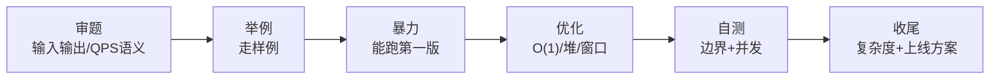
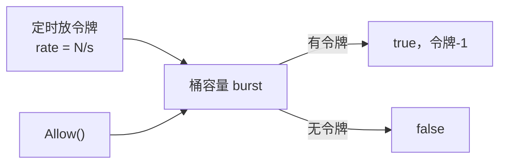
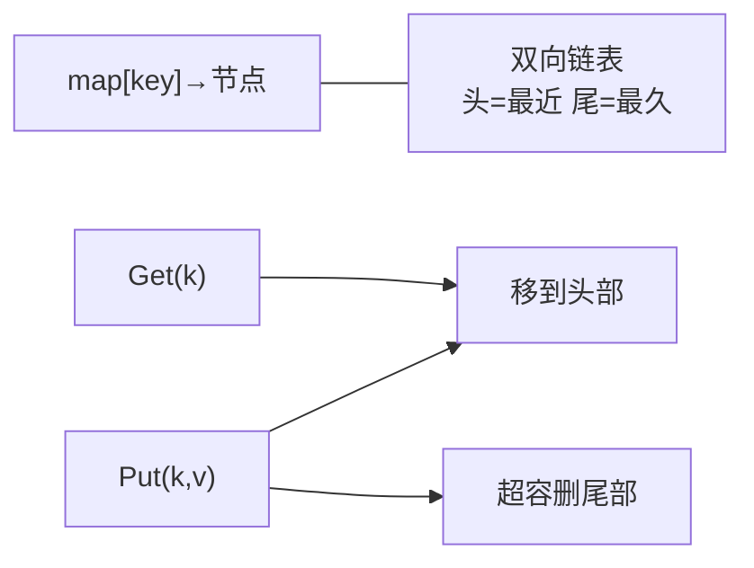
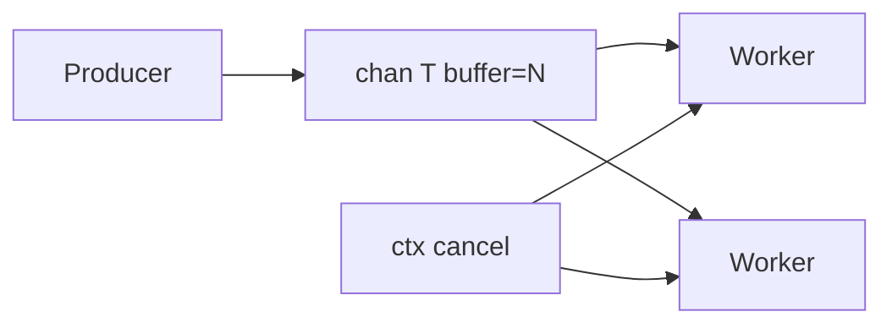
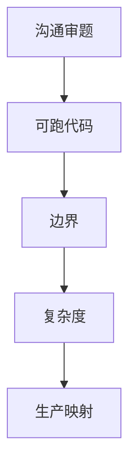
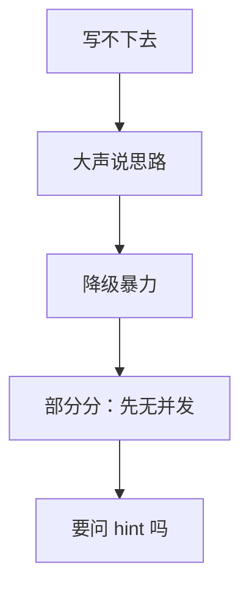

# 06 SRE手写题与算法轮 · 知识点

> 面试官白板写「实现一个限流器」，候选人上来就 `map[string]int` 加锁，问到 QPS 按秒滑动窗口就卡壳；下一题 LRU，把 `list` 和 `map` 接反了，`Get` 变成 O(n)。SRE 岗的 live coding 不是 ACM 金牌赛——**题面窄、时间紧、要能说清 trade-off**。
> **本章回答**：一道 **live coding**从「审题」到「AC」完整走一遍——限流器、LRU、TopK、生产者消费者四条主线，外加 SRE 面试里怎么沟通、怎么测、怎么收尾。
> **本章不讲**：LeetCode 全集与动态规划 → 算法竞赛范畴；Go 语言语法全集 → [05-03-01](../03-Go/01-基础语法与类型系统/)；channel 细节 → [05-03-06](../03-Go/06-channel与select/)。

## 面试怎么考

| 标记 | 考点 |
|------|------|
| **核心** | 令牌桶/滑动窗口限流；LRU `map+双向链表`；TopK 堆/桶；有界 channel 生产者消费者 |
| **必会** | 审题复述、复杂度、边界（0、满、并发）；Go `sync.Mutex` / `container/list` |
| **常用** | 先暴力再优化；写 `TestXxx` 自证；说出「生产我会用现成库」 |
| **常考** | 限流漏桶 vs 令牌桶；LRU O(1) 关键；TopK 为何用最小堆；优雅退出 |

**30 秒怎么说**：SRE 手写题重在**工程化**：先跟面试官对齐输入输出和 QPS 语义，写可读的 Go，主路径 AC 后再说并发和优化。限流用令牌桶或滑动窗口；LRU 是 map 指向链表节点；TopK 用大小为 K 的最小堆；生产者消费者用 buffered channel + context 取消。不会的死磕不如大声说 trade-off 和现成方案（x/time、groupcache）。

**标记**：🎯重点 · 🔥难点 · ⭐常考 · 🔧实操

---

## 能力边界

| 维度 | Live coding | 背题 | 生产 |
|------|-------------|------|------|
| **适合** | 证明你能写清核心逻辑 | 突击高频模板 | 用成熟库 + 压测 |
| **不适合** | 证明数学竞赛 | 替代理解 | 面试现写分布式锁 |
| **你要会** | 15～25 分钟写出可跑主路径 | 模板肌肉记忆 | 说清「上线用 redis/redis-cell」 |

---

## 语言最小集（手写轮）

| 零件 | 示例 | 手写题用途 |
|------|------|------------|
| 结构体 + 方法 | `type Limiter struct{...}` | 封装状态 |
| `sync.Mutex` | `l.mu.Lock(); defer l.mu.Unlock()` | 保护 map/桶 |
| `container/list` | 双向链表 | LRU 顺序 |
| `container/heap` | `heap.Push` / `heap.Pop` | TopK |
| `chan` | `make(chan T, n)` | 有界队列 |
| `context` | `ctx.Done()` | 消费者退出 |
| `time` | `time.Now()`、`time.Ticker` | 限流时间窗 |
| 测试 | `go test -run TestFoo` | 现场自证 |

---

## 一、一张图：一道 live coding 的一生

> 🎯 **一句话**：**审题** → **样例与边界** → **暴力可行** → **优化与并发** → **自测** → **口述复杂度与生产化**。



**读图**：很多候选人死在**没审题就写**——限流要澄清「按全局限流还是 per-key」；LRU 要澄清容量含不含；TopK 要澄清 K 与数据规模。

---

## 二、入口：审题四问（所有题通用）

> 🎯 **一句话**：动笔前 **30 秒**问清四件事——**输入输出、规模、并发、失败语义**。

```text
1. 输入输出长什么样？（函数签名）
2. 数据规模？（N、K、QPS 数量级）
3. 要线程安全吗？（单 goroutine 可先不加锁）
4. 边界？（空、满、0、nil、超时）
```

**示范（限流器）**：

```text
面试官：实现 Allow() bool，每秒最多 N 个请求。
你：是全局一个 N，还是每个 user 一个 N？滑动窗口还是固定窗口？
    允许突发吗（令牌桶）？需要 Wait(ctx) 阻塞还是只 Try？
```

> 📝 **面试**：主动审题是 **senior 信号**——比闷头写错再推翻得分高。

> ⚠️ **别混**：**复述题意 ≠ 拖延**——15 秒结论 + 1 个样例，然后开写。

---

## 三、出生：限流器——令牌桶与滑动窗口

> 🎯 **一句话**：**令牌桶允许可控突发**；**滑动窗口计数更贴「任意 1 秒内不超过 N」**。

### 令牌桶（Token Bucket）⭐🔥



```go
type TokenBucket struct {
    mu       sync.Mutex
    rate     float64   // 每秒补充令牌数
    burst    float64   // 桶容量
    tokens   float64
    last     time.Time
}

func (tb *TokenBucket) Allow() bool {
    tb.mu.Lock()
    defer tb.mu.Unlock()
    now := time.Now()
    elapsed := now.Sub(tb.last).Seconds()
    tb.tokens = min(tb.burst, tb.tokens+elapsed*tb.rate)
    tb.last = now
    if tb.tokens < 1 {
        return false
    }
    tb.tokens--
    return true
}
```

**读图**：`elapsed * rate` 是**补令牌**；`burst` 限制**最大突发**；`Allow` 非阻塞，适合网关快速拒绝。

### 固定窗口 vs 滑动窗口

| 类型 | 做法 | 坑 |
|------|------|-----|
| 固定窗口 | 当前秒计数，到下一秒清零 | 秒边界双倍流量 |
| 滑动窗口 | 记录时间戳队列或分桶 | 实现稍复杂，更平滑 |

```go
// 滑动窗口：存最近 1s 内时间戳（简化版，QPS 不高时够用）
type SlidingWindow struct {
    mu    sync.Mutex
    limit int
    win   time.Duration
    ts    []time.Time
}

func (sw *SlidingWindow) Allow() bool {
    sw.mu.Lock()
    defer sw.mu.Unlock()
    now := time.Now()
    cutoff := now.Add(-sw.win)
    // 丢掉窗口外
    i := 0
    for i < len(sw.ts) && sw.ts[i].Before(cutoff) {
        i++
    }
    sw.ts = sw.ts[i:]
    if len(sw.ts) >= sw.limit {
        return false
    }
    sw.ts = append(sw.ts, now)
    return true
}
```

> 💡 **打个比方**：固定窗口像「每分钟整点清零」；滑动窗口像「滚动 60 秒录像带」——边界不会突然放行两倍。

> 📝 **面试**：「漏桶 vs 令牌桶？」——**漏桶平滑输出**（恒定速率）；**令牌桶允许突发**（桶里有存货）。API 网关常见令牌桶。

> 🔧 **生产**：`golang.org/x/time/rate.Limiter`；分布式用 Redis + Lua / 专用模块。

---

## 四、干活：LRU Cache

> 🎯 **一句话**：**`map[key]*list.Element` + 双向链表维护顺序**——`Get/Put` 都把节点移到队头，超容删队尾。



```go
type entry struct {
    key, value int
}

type LRU struct {
    cap   int
    ll    *list.List
    cache map[int]*list.Element
}

func NewLRU(capacity int) *LRU {
    return &LRU{
        cap:   capacity,
        ll:    list.New(),
        cache: make(map[int]*list.Element),
    }
}

func (l *LRU) Get(key int) (int, bool) {
    if el, ok := l.cache[key]; ok {
        l.ll.MoveToFront(el)
        return el.Value.(*entry).value, true
    }
    return 0, false
}

func (l *LRU) Put(key, value int) {
    if el, ok := l.cache[key]; ok {
        el.Value.(*entry).value = value
        l.ll.MoveToFront(el)
        return
    }
    el := l.ll.PushFront(&entry{key, value})
    l.cache[key] = el
    if l.ll.Len() > l.cap {
        back := l.ll.Back()
        l.ll.Remove(back)
        delete(l.cache, back.Value.(*entry).key)
    }
}
```

**复杂度**：`Get`/`Put` 均 **O(1)**——面试必须说出来。

> ⚠️ **别混**：删尾节点时 **必须同时 `delete(map, key)`**——只删链表不删 map 会泄漏或脏读。

> 📝 **面试**：「为什么链表？」——O(1) 移动「最近使用」；数组做不到任意位置 O(1) 移动。

---

## 五、TopK：堆与桶

> 🎯 **一句话**：**找最大 K 个**用**大小为 K 的最小堆**；数据范围小可用**桶排序**。

### 最小堆法 ⭐

```go
type minHeap []int

func (h minHeap) Len() int            { return len(h) }
func (h minHeap) Less(i, j int) bool  { return h[i] < h[j] }
func (h minHeap) Swap(i, j int)      { h[i], h[j] = h[j], h[i] }
func (h *minHeap) Push(x interface{}) { *h = append(*h, x.(int)) }
func (h *minHeap) Pop() interface{} {
    old := *h
    n := len(old)
    x := old[n-1]
    *h = old[:n-1]
    return x
}

func TopK(nums []int, k int) []int {
    h := &minHeap{}
    heap.Init(h)
    for _, n := range nums {
        heap.Push(h, n)
        if h.Len() > k {
            heap.Pop(h)
        }
    }
    return *h
}
```

**读图**：堆顶是 K 个里**最小的**，新数比堆顶大就换；最终堆内是 TopK。复杂度 **O(N log K)**。

### 何时用 quickselect

- 只需 **一次查询**、不需流式：平均 **O(N)**，最坏 O(N²)——面试可说「我会用 `sort` 或 quickselect，生产用堆更稳」。

> 🔥 **难点**：**TopK 频繁词**——数据流用堆；**整数范围 [0,10000]** 用桶 O(N)。

---

## 六、生产者与消费者

> 🎯 **一句话**：**有界 buffered channel** 做队列；**多个 worker** 从同一 channel 读；**context** 广播退出。



```go
func worker(ctx context.Context, jobs <-chan int, results chan<- int, wg *sync.WaitGroup) {
    defer wg.Done()
    for {
        select {
        case <-ctx.Done():
            return
        case j, ok := <-jobs:
            if !ok {
                return
            }
            results <- j * 2
        }
    }
}

func pipeline(ctx context.Context, in []int, workers int) []int {
    jobs := make(chan int, len(in))
    results := make(chan int, len(in))
    var wg sync.WaitGroup
    for i := 0; i < workers; i++ {
        wg.Add(1)
        go worker(ctx, jobs, results, &wg)
    }
    for _, v := range in {
        jobs <- v
    }
    close(jobs)
    wg.Wait()
    close(results)
    out := make([]int, 0, len(in))
    for r := range results {
        out = append(out, r)
    }
    return out
}
```

**要点**：

```text
1. close(jobs) 告诉 worker 没有新任务
2. wg.Wait() 等 worker 干完再 close(results)
3. select + ctx 避免 goroutine 泄漏
4. buffer 大小 = 背压：满则 producer 阻塞
```

> 📝 **面试**：「怎么优雅停？」——`context.Cancel` + `close(chan)` + `WaitGroup`；**别强杀**。

> ⚠️ **别混**：**关闭 channel 的是发送方**；消费者只读。向已关闭 channel 发送会 panic。

---

## 七、优化与并发：何时加锁

> 🎯 **一句话**：面试 **先写单线程 AC**，面试官要并发再加 `Mutex` 或 `chan` 串行化。

| 题 | 单线程 | 并发加固 |
|----|--------|----------|
| 限流 | 直接写 | `Mutex` 保护状态 |
| LRU | 可先不写锁 | 读多写少考虑 `RWMutex`（说清楚即可） |
| TopK | 无共享状态 | 流式需锁或分片 |
| 生产者消费者 | channel 已同步 | 注意 close 顺序 |

```go
// 错误示范：双重检查不加锁
if l.cache[key] != nil { ... } // 竞态
```

> 🔍 **现场**：写完说「我会加 `go test -race`」——SRE 岗这是加分项。

---

## 八、自测：边界用例清单

> 🎯 **一句话**：**至少 4 个用例**：空、单元素、满容、重复操作。

```go
func TestLRU(t *testing.T) {
    l := NewLRU(2)
    l.Put(1, 1)
    l.Put(2, 2)
    if v, ok := l.Get(1); !ok || v != 1 {
        t.Fatal("get 1")
    }
    l.Put(3, 3) // 挤掉 2
    if _, ok := l.Get(2); ok {
        t.Fatal("2 should evict")
    }
}
```

限流：

```text
- limit=0 全拒绝
- burst 内连续 Allow
- 等待 1s 后恢复
- 并发 100 goroutine Allow（race test）
```

> 🔧 **实操**：白板写不出测试时，**口述用例**也算分。

---

## 九、收尾：复杂度与生产化（必说）

> 🎯 **一句话**：AC 后 **30 秒**交代复杂度 + 「上线我用什么」。

| 题 | 时间/空间 | 生产 |
|----|-----------|------|
| 令牌桶 Allow | O(1) | `x/time/rate` |
| 滑动窗口 | O(窗口内请求数) 简化版 | Redis ZSET |
| LRU | O(1) | groupcache / 本地 + TTL |
| TopK 堆 | O(N log K) | 指标聚合 Flink |
| 生产者消费者 | 吞吐看 buffer | worker pool 模式 |

**收尾模板**：

```text
「这版单线程主路径是 O(1)/O(N log K)，并发我会加 Mutex。
生产环境网关限流会用 x/time/rate 或 Redis 分布式计数，
我这里展示的是核心语义。」
```

### 收束：手写题凭什么得分



**读图**：四块都说到，比「最优算法但没沟通」更适合 SRE。

---

## 十、作战：卡壳怎么办



| 情况 | 先做 | 别做 |
|------|------|------|
| 忘了堆 API | 说「用 sort 取 K」 | 沉默 5 分钟 |
| LRU 指针乱 | 画 map+链表图 | 硬背错模板 |
| 限流语义不清 | 问固定/滑动 | 假设不吭声 |
| 时间不够 | 口述未完成部分 | 追求完美注释 |

### 60 秒白板剧本 🔧

| 时间 | 动作 |
|------|------|
| 0–30s | 复述 + 样例 + 签名 |
| 30s–15m | 核心结构 + 主路径 |
| 15–20m | 边界 + 复杂度 |
| 20–25m | 生产方案一句 |

---

## 十一、四题速查模板（背诵用）

### 限流器签名

```go
type Limiter interface {
    Allow() bool
    // 或 AllowN(now time.Time, n int) bool
}
```

### LRU 签名

```go
type Cache interface {
    Get(key int) (int, bool)
    Put(key, value int)
}
```

### TopK

```go
func topK(nums []int, k int) []int
```

### 生产者消费者

```go
func fanOut(ctx context.Context, in <-chan Job, workers int) <-chan Result
```

---

## 十二、踩坑清单

| 现象 | 原因 | 修法 |
|------|------|------|
| LRU Get 超容 | Put 未 evict | 超容删尾+删 map |
| 限流边界双倍 | 固定窗口 | 改滑动或令牌桶 |
| TopK 堆反了 | 用最大堆 | K 个最大用**最小堆** |
| goroutine 泄漏 | 未监听 ctx | select Done |
| 死锁 | 无缓冲 handoff | buffer 或 extra goroutine |

---

## 十三、收口

### 面试锚点

| 问 | 30 秒答 |
|----|---------|
| 令牌桶原理？ | 定速补令牌，有则消费，允许 burst |
| LRU O(1)？ | map 定位 + 链表移动 |
| TopK 堆？ | 维护 K 大小最小堆，O(N log K) |
| 生产者消费者？ | buffered chan + close + WaitGroup |
| 卡壳？ | 说思路、暴力、问清题意 |

### 易错一句话

- 错：限流只写计数器不清理 → 对：**窗口或补令牌**
- 错：LRU 只动链表不删 map → 对：**evict 双删**
- 错：TopK 用最大堆 → 对：**K 个最大用最小堆**
- 错：消费者 close jobs → 对：**生产者 close**
- 错：写完不说复杂度 → 对：**必报 O()**

### 数字墙

```text
15～25 min    单题常见时长
O(1)          LRU / 令牌桶 Allow
O(N log K)    TopK 堆
K << N        堆优于全排序
4             最少自测用例数（空/单/满/重复）
```

---

## 合上书

- [ ] **默画** live coding 一生：审题 → 样例 → 暴力 → 优化 → 自测 → 收尾。
- [ ] 口述限流器审题要问的四个问题。
- [ ] 白板写出 LRU 的 `map` + `list` 结构，说清 O(1)。
- [ ] 解释 TopK 为什么用最小堆而不是最大堆。
- [ ] 写生产者消费者的 `close` 与 `WaitGroup` 顺序。
- [ ] 对比令牌桶与固定窗口限流的边界问题。
- [ ] 给 LRU 写两个边界测试用例。
- [ ] 说清 `go test -race` 在手写题里的意义。
- [ ] 每道题说一个「生产我会用什么库/组件」。
- [ ] 描述卡壳时的降级策略（暴力、部分分、沟通）。
- [ ] 限流器 `Allow()` 并发时加什么锁？为什么 `RWMutex` 不适合？
- [ ] LRU 删尾节点时为什么要同时删 map？不删会怎样？
