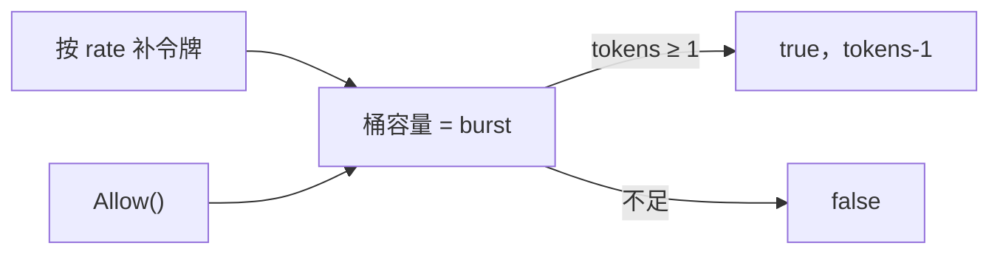
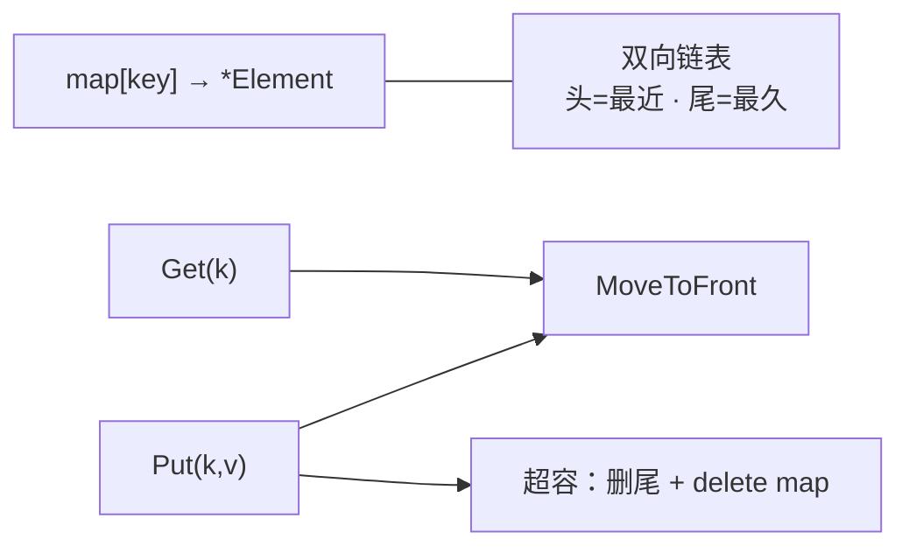
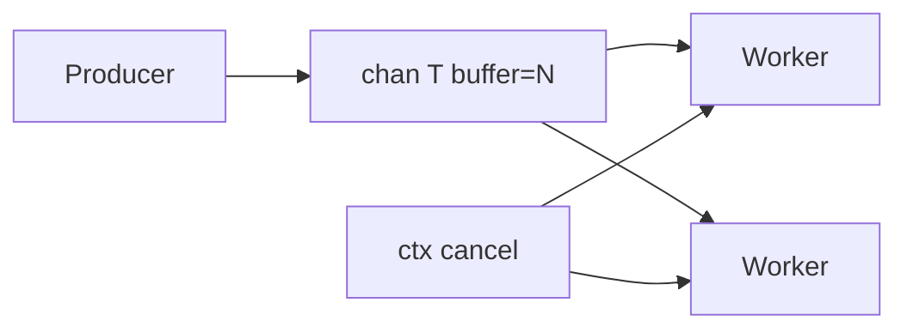
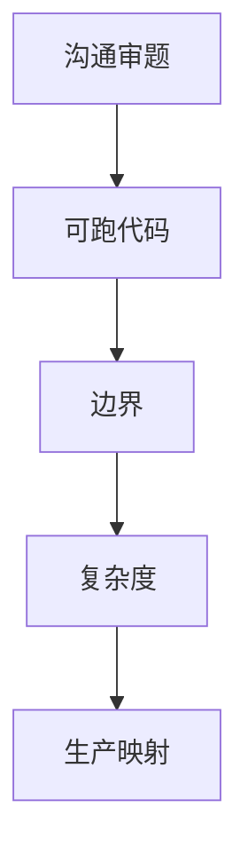
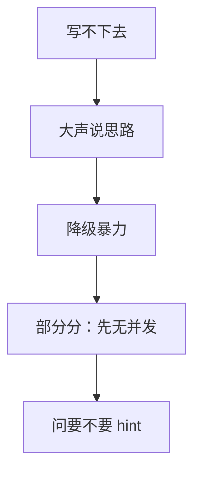

# 06｜SRE 手写题与算法轮 · 知识点

> 白板写「实现限流器」，候选人上来 `map`+锁，问到滑动窗口就卡；下一题 LRU，`list` 和 `map` 接反，`Get` 变 O(n)。
> **本章回答**：一道 live coding 从审题到收尾怎么走——限流、LRU、TopK、生产者消费者，外加卡壳沟通。
> **不讲**：LeetCode / DP 竞赛题；Go 语法全集 → [03-01](../03-Go/01-基础语法与类型系统/)；channel 细节 → [03-06](../03-Go/06-channel与select/)。

**标记**：🎯重点 · 🔥难点 · ⭐常考 · 🔧实操

---

## 面试怎么考

| 标记 | 考点 |
|------|------|
| **核心** | 令牌桶 / 滑动窗口；LRU `map`+双向链表；TopK 堆；有界 channel 生产者消费者 |
| **必会** | 审题四问、复杂度、边界（0/满/并发）；`sync.Mutex` / `container/list` |
| **常用** | 先暴力再优化；口述 `TestXxx`；说「生产用现成库」 |
| **常考** | 漏桶 vs 令牌桶；LRU O(1)；TopK 为何最小堆；优雅退出 |

> 📝 **30 秒**：SRE 手写重**工程化**——先对齐输入输出与 QPS 语义，主路径可读可跑，再谈并发与优化。限流用令牌桶或滑动窗口；LRU 是 map 指向链表节点；TopK 用大小为 K 的最小堆；队列用 buffered chan + context。死磕不如大声说 trade-off 和现成方案（`x/time/rate`、groupcache）。

---

## 能力边界

| 维度 | Live coding | 背题 | 生产 |
|------|-------------|------|------|
| **适合** | 写清核心逻辑 | 高频模板肌肉记忆 | 成熟库 + 压测 |
| **不适合** | 证明数学竞赛 | 替代理解 | 现场现写分布式锁 |
| **你要会** | 15～25 min 可跑主路径 | 四题签名能默写 | 说清「上线用 redis / rate」 |

- 🎯 **边界一句话**：白板证明「能说清结构与 trade-off」；上线用库，别把面试草稿当生产。

练习题 Q1。边界清了——语言最小集。

---

## 语言最小集（手写轮）

> 🎯 **一句话**：手写轮只带这几块零件——结构体、锁、链表、堆、channel、context、时间、测试。

- **结构体 + 方法**：`type Limiter struct{...}` —— 封装状态
- **`sync.Mutex`**：`Lock` / `defer Unlock` —— 保护 map / 桶
- **`container/list`**：双向链表 —— LRU 顺序
- **`container/heap`**：`Push` / `Pop` —— TopK
- **`chan`**：`make(chan T, n)` —— 有界队列
- **`context`**：`ctx.Done()` —— 消费者退出
- **`time`**：`Now` / 间隔 —— 限流时间窗
- **测试**：`go test -run TestFoo` —— 现场自证

练习题 Q1。最小集会了——主图。

---

## 一、一张图：一道 live coding 的一生

> 🎯 **一句话**：**审题 → 样例 → 暴力 → 优化 → 自测 → 口述复杂度与生产化**。


- 📖 **读图**
  - 🛤️ 六步是**时间线**，不是六种题型；死在第一步的人最多——没审题就写
  - 🔑 限流先问「全局还是 per-key」；LRU 问容量；TopK 问 K 与数据规模

练习题 Q1、Q14。主线有了——审题四问。

---

## 二、入口：审题四问（所有题通用）

> 🎯 **一句话**：动笔前 **30 秒**问清——**输入输出、规模、并发、失败语义**。

```text
1. 输入输出长什么样？（函数签名）
2. 数据规模？（N、K、QPS 数量级）
3. 要线程安全吗？（单 goroutine 可先不加锁）
4. 边界？（空、满、0、nil、超时）
```

### 🎤 示范：限流器怎么问

```text
面试官：实现 Allow() bool，每秒最多 N 个请求。
你：是全局一个 N，还是每个 user 一个 N？
    固定窗口还是滑动窗口？允许突发吗（令牌桶）？
    只要 Try，还是要 Wait(ctx) 阻塞？
```

- 🗝️ **口诀**：单机还是分布式？精确还是近似？QPS？内存上限？

> 📝 **面试**：主动审题是 **senior 信号**——比闷头写错再推翻得分高。⭐

> ⚠️ **别混**：**复述题意 ≠ 拖延**——15 秒结论 + 1 个样例，然后开写。

练习题 Q2。审题会了——限流器。

---

## 三、出生：限流器——令牌桶与滑动窗口

> 🎯 **一句话**：**令牌桶允许可控突发**；**滑动窗口更贴「任意 1 秒内不超过 N」**。

### 🪣 令牌桶（Token Bucket）⭐🔥



- 📖 **读图**
  - ⏱️ `elapsed * rate` 补令牌；`burst` 封顶突发
  - 🚪 `Allow` 非阻塞 → 网关快速拒绝；要排队用 `Wait(ctx)`（另说）

```go
type TokenBucket struct {
    mu     sync.Mutex
    rate   float64 // 每秒补充
    burst  float64 // 桶容量
    tokens float64
    last   time.Time
}

func (tb *TokenBucket) Allow() bool {
    tb.mu.Lock()
    defer tb.mu.Unlock()
    now := time.Now()
    elapsed := now.Sub(tb.last).Seconds()
    tb.tokens = min(tb.burst, tb.tokens+elapsed*tb.rate)
    tb.last = now
    if tb.tokens < 1 {
        return false
    }
    tb.tokens--
    return true
}
```

#### ❓ 为什么不只用「每秒一个计数器」？

- ❌ **纯计数器**：不知道何时清零 → 要么永不衰减，要么固定窗口边界翻倍（见下）
- ✅ **令牌桶**：时间流逝自动补仓，突发有上界 `burst`
- ✅ **滑动窗口**：任意长度 `win` 内精确计数，语义更硬

> 💡 **打个比方**：令牌桶像食堂打饭——厨子按固定速度往桶里丢餐票，人多时可以先把桶里存货吃光（突发），桶空了就得等。

### 🪟 固定窗口 vs 滑动窗口

| 类型 | 做法 | 坑 |
|------|------|-----|
| 固定窗口 | 当前秒计数，整秒清零 | **秒边界可双倍流量** |
| 滑动窗口 | 时间戳队列或分桶 | 实现稍复杂，更平滑 |

```go
// 滑动窗口：存最近 1s 内时间戳（QPS 不高时够用）
type SlidingWindow struct {
    mu    sync.Mutex
    limit int
    win   time.Duration
    ts    []time.Time
}

func (sw *SlidingWindow) Allow() bool {
    sw.mu.Lock()
    defer sw.mu.Unlock()
    now := time.Now()
    cutoff := now.Add(-sw.win)
    i := 0
    for i < len(sw.ts) && sw.ts[i].Before(cutoff) {
        i++
    }
    sw.ts = sw.ts[i:]
    if len(sw.ts) >= sw.limit {
        return false
    }
    sw.ts = append(sw.ts, now)
    return true
}
```

#### ❓ 为什么固定窗口会在边界「放行两倍」？

- 🕐 上一秒末尾放行 N，下一秒开头再放行 N → **任意 1 秒窗口内可能 ≈ 2N**
- 🎞️ 滑动窗口看的是「滚动录像带」，不会整点清零翻倍
- 🪣 令牌桶用 `burst` 显式声明突发上限，语义不同但边界更可控

> 💡 **打个比方**：固定窗口像「每分钟整点清零」；滑动窗口像「最近 60 秒录像」——边界不会突然放行两倍。

> 📝 **面试**：「漏桶 vs 令牌桶？」——**漏桶平滑输出**（恒定出水）；**令牌桶允许突发**（桶里有存货）。API 网关常见令牌桶。⭐

> 🔧 **生产**：单机 `golang.org/x/time/rate.Limiter`；分布式 Redis + Lua / 专用模块。别把白板草稿直接上多机。

练习题 Q3、Q4。限流会了——LRU。

---

## 四、干活：LRU Cache

> 🎯 **一句话**：**`map[key]*list.Element` + 双向链表**——`Get/Put` 移到队头，超容删队尾。



- 📖 **读图**
  - 📍 **map 只负责 O(1) 定位**；链表只负责「谁更近」
  - 🔥 接反（map 存值、Get 扫 list）→ 复杂度当场穿帮

```go
type entry struct {
    key, value int
}

type LRU struct {
    cap   int
    ll    *list.List
    cache map[int]*list.Element
}

func NewLRU(capacity int) *LRU {
    return &LRU{
        cap:   capacity,
        ll:    list.New(),
        cache: make(map[int]*list.Element),
    }
}

func (l *LRU) Get(key int) (int, bool) {
    if el, ok := l.cache[key]; ok {
        l.ll.MoveToFront(el)
        return el.Value.(*entry).value, true
    }
    return 0, false
}

func (l *LRU) Put(key, value int) {
    if el, ok := l.cache[key]; ok {
        el.Value.(*entry).value = value
        l.ll.MoveToFront(el)
        return
    }
    el := l.ll.PushFront(&entry{key, value})
    l.cache[key] = el
    if l.ll.Len() > l.cap {
        back := l.ll.Back()
        l.ll.Remove(back)
        delete(l.cache, back.Value.(*entry).key)
    }
}
```

- ⏱️ **复杂度**：`Get` / `Put` 均 **O(1)**——必须说出口

#### ❓ 为什么必须是「map 指向链表节点」？

- 🔗 链表单独：找 key 要扫 → O(n)
- 🗺️ map 单独：知道值，**不知道谁最久没用**（无顺序）
- ✅ **两者合体**：map 定位节点，链表 `MoveToFront` / 删尾都是 O(1)

> 💡 **打个比方**：map 是「门牌号 → 人在哪」；链表是「队伍谁排最前」——只记门牌、不记队伍位置，就得每次从头找人。

> ⚠️ **别混**：删尾时 **必须同时 `delete(map, key)`**——只删链表不删 map → 泄漏或脏读。🔥

> 📝 **面试**：「为什么链表？」——O(1) 移动「最近使用」；数组做不到任意位置 O(1) 摘除/插入。⭐

练习题 Q5、Q6。LRU 会了——TopK。

---

## 五、TopK：堆与桶

> 🎯 **一句话**：**找最大 K 个** → **大小为 K 的最小堆**；值域小可用桶。

### ⛰️ 最小堆法 ⭐🔥

```go
type minHeap []int

func (h minHeap) Len() int           { return len(h) }
func (h minHeap) Less(i, j int) bool { return h[i] < h[j] }
func (h minHeap) Swap(i, j int)      { h[i], h[j] = h[j], h[i] }
func (h *minHeap) Push(x interface{}) { *h = append(*h, x.(int)) }
func (h *minHeap) Pop() interface{} {
    old := *h
    n := len(old)
    x := old[n-1]
    *h = old[:n-1]
    return x
}

func TopK(nums []int, k int) []int {
    h := &minHeap{}
    heap.Init(h)
    for _, n := range nums {
        heap.Push(h, n)
        if h.Len() > k {
            heap.Pop(h)
        }
    }
    return *h
}
```

- 📖 **读图（脑子里的堆）**
  - 堆顶 = K 个里的**最小**；新数 ≤ 堆顶 → 丢；更大 → 换掉堆顶
  - 扫完一遍，堆内即 TopK；复杂度 **O(N log K)**

#### ❓ 为什么「要最大 K 个」却用最小堆？

- 🎯 堆只装 K 个候选；要淘汰的永远是「当前 K 个里最弱的那个」
- 📉 **最小堆堆顶 = 最弱** → 比较 / 弹出都在堆顶，O(log K)
- ❌ 若用最大堆：堆顶是最强，淘汰「最弱」要扫堆 → 失去意义

> 🔥 **难点**：流式 TopK / 高频词 → 堆；整数范围很小（如 `[0,10000]`）→ 桶计数 O(N)。

### ⚡ 何时提 quickselect

- 只需**一次查询**、非流式：平均 O(N)，最坏 O(N²)
- 白板可说：「我会 `sort` 或 quickselect；生产流式用堆更稳」

练习题 Q7、Q8。TopK 会了——生产者消费者。

---

## 六、生产者与消费者

> 🎯 **一句话**：**有界 buffered channel** 做队列；多 worker 同读；**context** 广播退出。



- 📖 **读图**
  - 📦 buffer = **背压**：满则 producer 阻塞，防止无限堆积
  - 🛑 cancel 与 `close(jobs)` 是两条退出通路，都要接住

```go
func worker(ctx context.Context, jobs <-chan int, results chan<- int, wg *sync.WaitGroup) {
    defer wg.Done()
    for {
        select {
        case <-ctx.Done():
            return
        case j, ok := <-jobs:
            if !ok {
                return
            }
            results <- j * 2
        }
    }
}

func pipeline(ctx context.Context, in []int, workers int) []int {
    jobs := make(chan int, len(in))
    results := make(chan int, len(in))
    var wg sync.WaitGroup
    for i := 0; i < workers; i++ {
        wg.Add(1)
        go worker(ctx, jobs, results, &wg)
    }
    for _, v := range in {
        jobs <- v
    }
    close(jobs)
    wg.Wait()
    close(results)
    out := make([]int, 0, len(in))
    for r := range results {
        out = append(out, r)
    }
    return out
}
```

### 🔑 关闭顺序（必背）

```text
1. close(jobs)     ← 发送方宣布「没有新任务」
2. wg.Wait()       ← 等 worker 干完
3. close(results)  ← 再关结果通道
4. select + ctx    ← 避免 goroutine 泄漏
```

#### ❓ 为什么是生产者 close，不能消费者 close？

- 📤 **关闭 channel 的是发送方**——多个发送方要先协商「谁关」
- 💥 向已关闭 channel **发送** → panic；多消费者读关闭 channel 安全（读到零值 + `ok=false`）
- 🧵 消费者只读 `<-jobs`，用 `ok` 判断结束

> 📝 **面试**：「怎么优雅停？」——`context.Cancel` + `close(chan)` + `WaitGroup`；**别强杀**。⭐

> ⚠️ **别混**：`close` 职责在发送方；`WaitGroup` 等的是 worker，不是「谁先 return」。细节见 [03-06](../03-Go/06-channel与select/)、[03-08](../03-Go/08-context取消与超时传播/)。

练习题 Q9、Q10。队列会了——加锁边界。

---

## 七、优化与并发：何时加锁

> 🎯 **一句话**：面试 **先写单线程 AC**，要并发再加 `Mutex` 或用 chan 串行化。

| 题 | 单线程 | 并发加固 |
|----|--------|----------|
| 限流 | 直接写 | `Mutex` 护状态 |
| LRU | 可先不锁 | 读多写少可提 `RWMutex`（说清即可） |
| TopK | 无共享 | 流式需锁或分片 |
| 生产者消费者 | channel 已同步 | 盯 close 顺序 |

```go
// 错误：无锁双重检查
if l.cache[key] != nil { ... } // 竞态
```

#### ❓ 限流 `Allow()` 为啥常不用 `RWMutex`？

- 🧾 每次 `Allow` 几乎都要**改** `tokens` / 时间戳 → 写锁为主
- 📖 `RLock` 占比极低，复杂度白加；`Mutex` 更干净
- 🧪 LRU 读多写少才值得讨论 `RWMutex`——说清楚场景即可，别机械套

> 🔍 **现场**：写完说「我会加 `go test -race`」——SRE 岗加分项。🔧

练习题 Q11。加锁会了——自测清单。

---

## 八、自测：边界用例清单

> 🎯 **一句话**：**至少 4 个用例**——空、单元素、满容、重复操作。

```go
func TestLRU(t *testing.T) {
    l := NewLRU(2)
    l.Put(1, 1)
    l.Put(2, 2)
    if v, ok := l.Get(1); !ok || v != 1 {
        t.Fatal("get 1")
    }
    l.Put(3, 3) // 挤掉 2
    if _, ok := l.Get(2); ok {
        t.Fatal("2 should evict")
    }
}
```

- **限流口述清单**
  - `limit=0` 全拒绝
  - burst 内连续 `Allow` 成功
  - 等 1s 后恢复
  - 100 goroutine + `-race`

> 🔧 **实操**：白板写不出测试时，**口述用例**也算分。

练习题 Q12。自测会了——复杂度收尾。

---

## 九、收尾：复杂度与生产化（必说）

> 🎯 **一句话**：AC 后 **30 秒**交代复杂度 + 「上线我用什么」。

| 题 | 时间 / 空间 | 生产 |
|----|-------------|------|
| 令牌桶 `Allow` | O(1) | `x/time/rate` |
| 滑动窗口 | O(窗内请求数) 简化版 | Redis ZSET |
| LRU | O(1) | groupcache / 本地 + TTL |
| TopK 堆 | O(N log K) | 指标聚合 / 流处理 |
| 生产者消费者 | 吞吐看 buffer | worker pool |

**收尾模板**：

```text
「这版单线程主路径是 O(1)/O(N log K)，并发我会加 Mutex。
生产网关限流用 x/time/rate 或 Redis 分布式计数，
这里展示的是核心语义。」
```

### 收束：手写题凭什么得分



- 📖 **读图**：四块都说到，比「最优算法但没沟通」更贴 SRE。⭐

练习题 Q13。收尾会了——卡壳作战。

---

## 十、作战：卡壳怎么办

> 🎯 **一句话**：卡壳不是零分——**大声说思路、降级暴力、要 hint**。



- 📖 **读图**：每条边都是**可执行动作**；沉默 5 分钟是最差选项。

| 情况 | 先做 | 别做 |
|------|------|------|
| 忘了堆 API | 说「先 sort 取 K」 | 沉默 |
| LRU 指针乱 | 画 map+链表图 | 硬背错模板 |
| 限流语义不清 | 问固定/滑动 | 假设不吭声 |
| 时间不够 | 口述未完成部分 | 追求完美注释 |

### ⏱️ 60 秒白板剧本 🔧

| 时间 | 动作 |
|------|------|
| 0–30s | 复述 + 样例 + 签名 |
| 30s–15m | 核心结构 + 主路径 |
| 15–20m | 边界 + 复杂度 |
| 20–25m | 生产方案一句 |

练习题 Q14。作战会了——四题速查。

---

## 十一、四题速查模板（背诵用）

### 限流器

```go
type Limiter interface {
    Allow() bool
    // 或 AllowN(now time.Time, n int) bool
}
```

### LRU

```go
type Cache interface {
    Get(key int) (int, bool)
    Put(key, value int)
}
```

### TopK

```go
func topK(nums []int, k int) []int
```

### 生产者消费者

```go
func fanOut(ctx context.Context, in <-chan Job, workers int) <-chan Result
```

练习题 Q3～Q10。速查拿走——踩坑。

---

## 十二、踩坑清单

| 现象 | 原因 | 修法 |
|------|------|------|
| LRU Get 仍见已删 key | Put 未双删 | 超容删尾 + `delete` map |
| 边界双倍流量 | 固定窗口 | 滑动窗口或令牌桶 |
| TopK 结果偏小 | 用了最大堆 | K 个最大用**最小堆** |
| goroutine 泄漏 | 未听 `ctx.Done` | `select` Done |
| 死锁 / 卡住 | 无缓冲 handoff | 加 buffer 或额外 goroutine |

练习题 Q11。踩坑钉死——收口。

---

**回到开头**：闷头 map+锁、LRU 接反。正确剧本——审题四问 → 选结构说 trade-off → 先正确再优化 → 边界自测 → 收尾说复杂度与生产化。

## 十三、收口

### 命令速查 🔧

```text
go test -run TestLRU -v
go test -race -run TestAllow
go test -bench=. -benchmem   # 可选：证明 O(1) 体感
```

### 面试锚点

| 问 | 30 秒答 |
|----|---------|
| 令牌桶？ | 定速补令牌，有则消费，允许 burst |
| LRU O(1)？ | map 定位 + 链表移动；evict 双删 |
| TopK 堆？ | 维护 K 大小**最小堆**，O(N log K) |
| 生产者消费者？ | buffered chan + 发送方 close + WaitGroup |
| 卡壳？ | 说思路、暴力、问清题意 |

### 易错一句话

- 错：限流只加计数不衰减 → 对：**窗口或补令牌**
- 错：LRU 只动链表不删 map → 对：**evict 双删**
- 错：TopK 用最大堆装「最大 K」→ 对：**最小堆**
- 错：消费者 close jobs → 对：**生产者 close**
- 错：写完不说复杂度 → 对：**必报 O()**
- 错：固定窗口当精确限流 → 对：**边界可 2N，改滑动/令牌桶**

### 数字墙

```text
15～25 min     单题常见时长
O(1)           LRU / 令牌桶 Allow
O(N log K)     TopK 堆
K << N         堆优于全排序
4              最少自测用例（空/单/满/重复）
burst          令牌桶突发上界
```

练习题 Q1～Q14。

---

## 合上书

- [ ] **默画** live coding 一生：审题 → 样例 → 暴力 → 优化 → 自测 → 收尾
- [ ] 口述限流审题四问（全局/窗口/突发/Try vs Wait）
- [ ] **默画** LRU：`map` → `*Element` + 链表头尾，说清 O(1) 与双删
- [ ] 解释 TopK「最大 K」为何用**最小堆**
- [ ] 写出生产者消费者的 `close` / `WaitGroup` 顺序
- [ ] 对比令牌桶与固定窗口的边界问题
- [ ] 给 LRU 口述两个边界用例
- [ ] 说明 `go test -race` 在手写题里的意义
- [ ] 每道题说一个「生产用什么库/组件」
- [ ] 描述卡壳降级：暴力 → 部分分 → 问 hint
