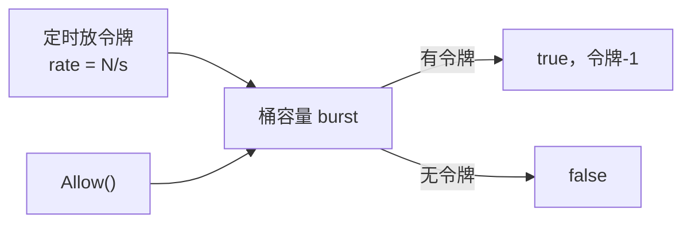
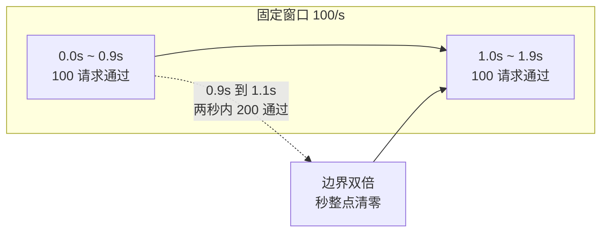
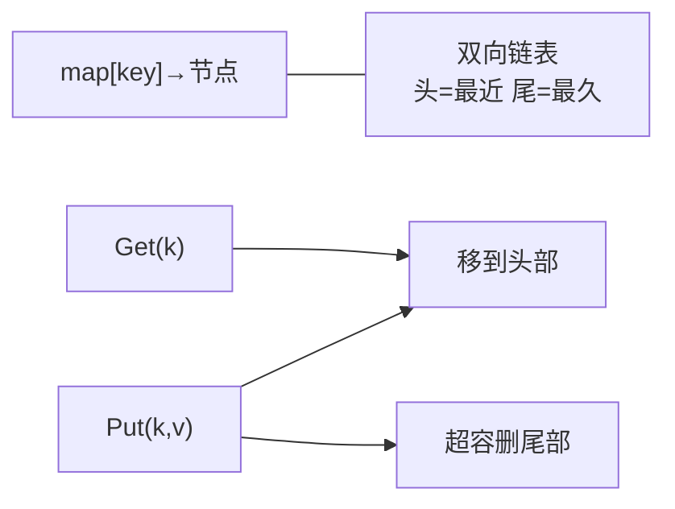
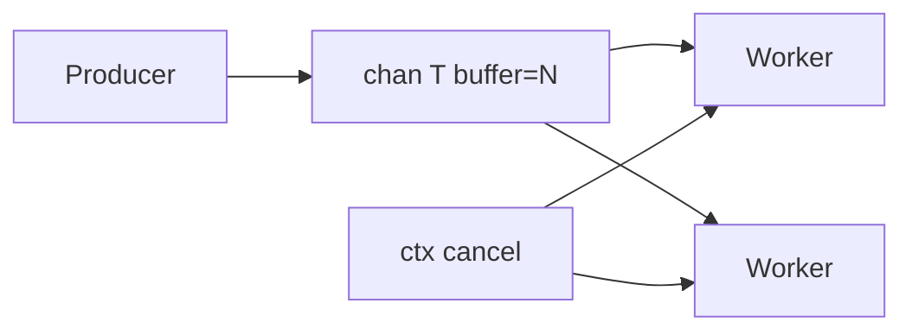
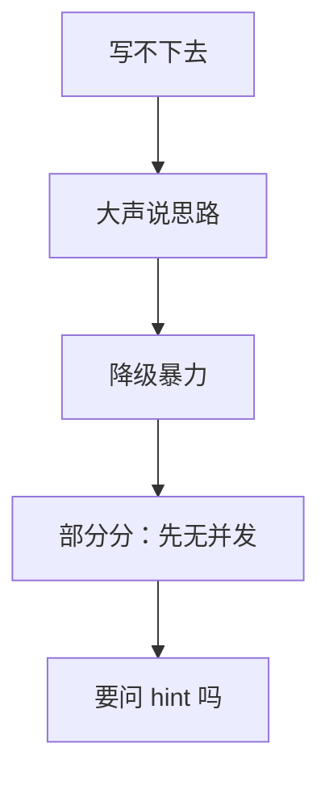

# 06｜SRE手写题与算法轮 · 练习题

开始做题前，先给大家一个小建议：合上知识点，对着**一道 live coding 的一生**口述一遍（审题 → 选型 → 实现 → 自测 → 收尾）。能顺下来，下面这些题大半都会了。

做题的方式：每道题**先看标题和场景，自己口述一遍答案，再往下看解答**。

题目顺序：Q1～Q4 审题与限流；Q5～Q8 LRU/TopK；Q9～Q14 队列与收尾。

| 标记 | 含义 |
|------|------|
| **核心** | 不懂整章就没建立起来 |
| **必会** | 值班和面试都要能讲 |
| **常用** | 线上会反复碰到 |
| **常考** | 白板和追问的高频口径 |

## 本题目录

- [Q1 审题四问](#q1) · [Q2 令牌桶实现](#q2) · [Q3 固定窗口边界](#q3) · [Q4 漏桶对比](#q4)
- [Q5 LRU 结构](#q5) · [Q6 LRU 边界与 evict](#q6) · [Q7 TopK 最小堆](#q7) · [Q8 TopK 选型](#q8)
- [Q9 生产者消费者](#q9) · [Q10 优雅退出](#q10) · [Q11 并发加锁](#q11) · [Q12 卡壳降级](#q12)
- [Q13 自测用例](#q13) · [Q14 白板总览](#q14)
- [合上书](#合上书)

---

## Q1

**★★★★★｜live coding 动笔前必须问清哪四件事？**

**覆盖**：核心 · 必会 · 常考 ｜ **对应**：知识点 [二、入口：审题四问（所有题通用）](知识点.md)

### 场景

面试官刚说完「实现限流器」，候选人直接写 `map[string]int`，两分钟后发现要的是全局 QPS 不是 per-key。面试官皱眉，候选人推翻重来，时间浪费了三分之一。


先自己试试，再往下看解答。

### 完整解答

> 🎯 **一句话**：**输入输出、规模、并发、边界**——30 秒复述 + 1 个样例再开写，比闷头写错再推翻得分高。

审题四问，所有题通用：

```text
1. 输入输出长什么样？  Allow() bool 还是 Wait(ctx) error？
2. 数据规模？          N、K、QPS 的数量级，单机还是分布式？
3. 要线程安全吗？      先单 goroutine AC，面试官要并发再加锁
4. 边界？              空、满、0、nil、超时
```

**以限流器为例**，面试官说「每秒最多 N 个请求」，你要追问：

```text
面试官：实现 Allow() bool，每秒最多 N 个请求。
你：    是全局一个 N，还是每个 user 一个 N？
        滑动窗口还是固定窗口？
        允许突发吗（令牌桶）？
        需要 Wait(ctx) 阻塞还是只 Try？
```

15 秒内说完假设，然后开写：「我按全局令牌桶、Allow 非阻塞、单机 Mutex，开始写。」

> 📝 **面试**：主动审题是 **senior 信号**——比闷头写错再推翻得分高。复述题意 ≠ 拖延：15 秒结论 + 1 个样例，然后开写。

### 再追问

**面试官催「快写」怎么办？**——15 秒说完假设后立即开写，别等面试官逐条确认。写的过程中如果假设不对，面试官会打断你——这比写完再推翻省时间。**不要**沉默 30 秒想完美方案。

**四问对所有题都一样吗？**——一样。LRU 要问容量含不含、key 是 int 还是 string；TopK 要问 K 与 N 的关系、是否流式；生产者消费者要问 buffer 大小、worker 数量、失败语义。

---

## Q2

**★★★★★｜实现令牌桶 `Allow()`，说明 rate 和 burst 的作用。** ⭐

**覆盖**：核心 · 必会 · 常考 ｜ **对应**：知识点 [三、出生：限流器——令牌桶与滑动窗口](知识点.md)

### 场景

API 网关要求每秒 1000 QPS，允许短暂突发 2000。面试官要看你手写令牌桶，不是调库。


审题四问。

先自己试试，再往下看解答。

### 完整解答

> 🎯 **一句话**：**按 elapsed 补令牌，上限 burst，有令牌则 Allow 并减 1**——O(1) 单次操作。



**读图**：`elapsed * rate` 是补令牌；`burst` 限制最大突发；`Allow` 非阻塞，适合网关快速拒绝。

```go
type TokenBucket struct {
    mu     sync.Mutex
    rate   float64   // 每秒补充令牌数
    burst  float64   // 桶容量
    tokens float64
    last   time.Time
}

func (tb *TokenBucket) Allow() bool {
    tb.mu.Lock()
    defer tb.mu.Unlock()
    now := time.Now()
    elapsed := now.Sub(tb.last).Seconds()
    tb.tokens = min(tb.burst, tb.tokens+elapsed*tb.rate)
    tb.last = now
    if tb.tokens < 1 {
        return false
    }
    tb.tokens--
    return true
}
```

```text
rate=1000, burst=2000
启动后等 2s：tokens=2000（满）   ← burst 限制了最大存量
瞬间来 2000 请求：全部 Allow      ← 允许突发
第 2001 个：false                 ← 令牌耗尽
```

**关键点**：令牌不是按 tick 补的，是**按需算**——每次 `Allow` 时用 `now - last` 算经过时间补令牌，避免开 goroutine 定时器。

> 📝 **面试**：生产用 `golang.org/x/time/rate.Limiter`，面试写完要主动说「上线我用 x/time/rate，这里展示核心语义」。

> ⚠️ **别混**：`burst` 不是「每秒额外允许多少」，是**桶的最大容量**——长时间空闲后最多存 burst 个令牌。

### 再追问

**`AllowN(now, n)` 与 `Allow()` 区别？**——一次消费 n 个令牌，不够则 false；`x/time/rate` 包提供完整 API（`Wait`、`Reserve`）。面试说清 `Allow` 是非阻塞 try 语义即可。

**分布式限流怎么做？**——Redis + Lua 脚本原子操作，或 Redis Cell 模块。面试答「单机用 x/time/rate，分布式用 Redis ZSET 滑动窗口或 redis-cell」。

---

## Q3

**★★★★☆｜固定窗口限流在秒边界有什么问题？滑动窗口怎么解？**

**覆盖**：必会 · 常考 ｜ **对应**：知识点 [三、出生：限流器——令牌桶与滑动窗口](知识点.md)

### 场景

限流 100/s，用户在 0.9s 和 1.1s 各打 100 请求，固定窗口下两秒内 200 请求通过——超了一倍。有人认为「加个前后 10% 的余量」就行。


令牌桶。

先自己试试，再往下看解答。

### 完整解答

> 🎯 **一句话**：**固定窗口在秒边界可双倍放行**；滑动窗口维护最近 1s 内时间戳，窗口外丢弃。



**读图**：固定窗口在秒整点清零，0.9s 的 100 个和 1.1s 的 100 个分属不同窗口，各自放行——两秒内实际通过 200，超了一倍。滑动窗口则往回看 1s，0.9s 的 100 个还在窗口里，1.1s 时拒绝。

滑动窗口简化版（QPS 不高时够用）：

```go
type SlidingWindow struct {
    mu    sync.Mutex
    limit int
    win   time.Duration
    ts    []time.Time
}

func (sw *SlidingWindow) Allow() bool {
    sw.mu.Lock()
    defer sw.mu.Unlock()
    now := time.Now()
    cutoff := now.Add(-sw.win)
    i := 0
    for i < len(sw.ts) && sw.ts[i].Before(cutoff) {
        i++
    }
    sw.ts = sw.ts[i:]       // 丢掉窗口外
    if len(sw.ts) >= sw.limit {
        return false
    }
    sw.ts = append(sw.ts, now)
    return true
}
```

```text
limit=100, win=1s
0.9s 打 100 个 → 全部 Allow（窗口内 100 个时间戳）
1.1s 再打 1 个 → 窗口内已有 100（0.1s~1.1s 范围）→ false
```

> 💡 **打个比方**：固定窗口像「每分钟整点清零」；滑动窗口像「滚动 60 秒录像带」——边界不会突然放行两倍。

> ⚠️ **别混**：滑动窗口的简化版 `[]time.Time` 在高 QPS 下切片头尾清理是 O(窗口内请求数)，生产高 QPS 用**分桶**或 Redis ZSET。

### 再追问

**滑动窗口的高 QPS 优化？**——把 1s 分成 10 个 100ms 的桶，每个桶计数，滑动时累加窗口内各桶。空间 O(桶数)，时间 O(1)。**不要**在高 QPS 下还用 `[]time.Time` 遍历。

**Redis 分布式滑动窗口怎么做？**——ZSET 按时间戳 score 存请求，`ZREMRANGEBYSCORE` 裁剪窗口外，`ZCARD` 计数，原子性用 Lua 脚本保证。

---

## Q4

**★★★★☆｜漏桶和令牌桶区别？API 网关常用哪种？**

**覆盖**：必会 · 常考 ｜ **对应**：知识点 [三、出生：限流器——令牌桶与滑动窗口](知识点.md)

### 场景

面试官追问：「既要平滑流量又要允许活动突发，选哪个？」有人答「漏桶更好，因为它更严格」。


滑动窗口——承接 Q3。

先自己试试，再往下看解答。

### 完整解答

> 🎯 **一句话**：**漏桶平滑输出恒定速率**；**令牌桶允许可控突发**（桶内有存货）。

| | 漏桶 | 令牌桶 |
|---|------|--------|
| 突发 | 不允许超过漏出速率 | burst 允许 |
| 输出 | 恒定速率 | 可快可慢，受 burst 上限 |
| 典型 | 保护下游恒定吞吐 | API 网关、登录尖峰 |

```text
漏桶：     请求 → 进桶（满则丢）→ 以恒定速率漏出     ← 平滑但不允许突发
令牌桶：   定速补令牌 → Allow 时有令牌则消费         ← 允许 burst 内突发
```

**选型**：活动登录尖峰常用令牌桶 + 合理 burst；纯削峰填谷、保护下游恒定吞吐用漏桶。API 网关（Kong、APISIX）默认令牌桶。

> 📝 **面试**：「漏桶 vs 令牌桶？」——**漏桶平滑输出**（恒定速率）；**令牌桶允许突发**（桶里有存货）。API 网关常见令牌桶。

### 再追问

**「双令牌桶」听过吗？**——区分平均速率与峰值（了解即可，说清令牌桶语义即可得分）。**不要**硬扯没把握的细节。

**令牌桶的 burst 设多大？**——看业务能承受的突发量。登录场景 burst = rate × 2~3 秒；API 网关按下游容量设。**不要**把 burst 设成无限大——那就等于不限流了。

---

## Q5

**★★★★★｜LRU O(1) 用什么数据结构？Get/Put 各做什么？** ⭐

**覆盖**：核心 · 必会 · 常考 ｜ **对应**：知识点 [四、干活：LRU Cache](知识点.md)

### 场景

白板：「实现容量为 K 的 LRU，Get 和 Put 都要 O(1)。」有人用单链表 + map 存前驱指针，移动节点要 O(n)。


LRU 结构。

先自己试试，再往下看解答。

### 完整解答

> 🎯 **一句话**：**`map[key]*list.Element` + 双向链表**，Get/Put 都把节点**移到头部**，满则**删尾部**。



**读图**：map 负责 O(1) 定位，链表负责 O(1) 调整顺序。头是最近使用，尾是最久未用。Get 和 Put 都把命中的节点移到头部；Put 超容时删尾部。

```go
type entry struct {
    key, value int
}

type LRU struct {
    cap   int
    ll    *list.List
    cache map[int]*list.Element
}

func NewLRU(capacity int) *LRU {
    return &LRU{
        cap:   capacity,
        ll:    list.New(),
        cache: make(map[int]*list.Element),
    }
}

func (l *LRU) Get(key int) (int, bool) {
    if el, ok := l.cache[key]; ok {
        l.ll.MoveToFront(el)
        return el.Value.(*entry).value, true
    }
    return 0, false
}

func (l *LRU) Put(key, value int) {
    if el, ok := l.cache[key]; ok {
        el.Value.(*entry).value = value
        l.ll.MoveToFront(el)
        return
    }
    el := l.ll.PushFront(&entry{key, value})
    l.cache[key] = el
    if l.ll.Len() > l.cap {
        back := l.ll.Back()
        l.ll.Remove(back)
        delete(l.cache, back.Value.(*entry).key)
    }
}
```

```text
cap=2, 操作序列：Put(1,1) Put(2,2) Get(1) Put(3,3)

链表变化（左=头=最近，右=尾=最久）：
Put(1,1) → [1]
Put(2,2) → [2, 1]
Get(1)   → [1, 2]                 ← 1 移到头
Put(3,3) → [3, 1]                 ← 挤掉尾部的 2
Get(2)   → false                  ← 2 已被 evict
```

**复杂度**：`Get`/`Put` 均 **O(1)**——`map` 查找 O(1)，`MoveToFront`/`PushFront`/`Remove` 均为 O(1)。面试必须说出来。

> ⚠️ **别混**：删尾节点时**必须同时 `delete(map, key)`**——只删链表不删 map 会泄漏或脏读。

> 📝 **面试**：「为什么链表？」——O(1) 移动「最近使用」；数组做不到任意位置 O(1) 移动。`container/list` 已封装双向链表，不用自己手搓指针。

### 再追问

**为什么不用单链表 + map 存前驱？**——移动节点需要改前驱的 next 指针，map 存前驱虽然能定位，但代码复杂且容易出错；标准库 `container/list` 的 `Element` 自带 `Prev`/`Next`，`MoveToFront` 一步到位。

**LRU 和 LFU 区别？**——LRU 淘汰最久未用（时间维度），LFU 淘汰最少使用（频率维度）。LFU 要维护频次计数，更复杂，面试说清区别即可。

---

## Q6

**★★★★★｜LRU Put(3) 挤掉谁？写出完整的边界测试。**

**覆盖**：核心 · 必会 ｜ **对应**：知识点 [四、干活：LRU Cache](知识点.md)

### 场景

面试官：「你怎么证明你写的 LRU 是对的？」候选人只写了一个正常路径，没测边界。


就是 list/map 接反。

先自己试试，再往下看解答。

### 完整解答

> 🎯 **一句话**：**空、单元素、满容、重复操作**——至少 4 类边界用例，白板写不跑就口述。

cap=2 的经典驱逐序列：

```go
func TestLRU(t *testing.T) {
    l := NewLRU(2)
    l.Put(1, 1)
    l.Put(2, 2)
    if v, ok := l.Get(1); !ok || v != 1 {
        t.Fatal("get 1")              // ← 正常路径：1 还在
    }
    l.Put(3, 3)                       // ← 挤掉 2（Get(1) 后 2 是最久未用）
    if _, ok := l.Get(2); ok {
        t.Fatal("2 should evict")     // ← 驱逐验证
    }
    if v, ok := l.Get(1); !ok || v != 1 {
        t.Fatal("get 1 after put 3")  // ← 1 没被误删
    }
    if v, ok := l.Get(3); !ok || v != 3 {
        t.Fatal("get 3")              // ← 新数据在
    }
}
```

```text
# ← 运行结果
ok  --- 0.001s    ← 全部通过
```

四类边界，面试口述也要能说全：

```text
- cap=1 连续 Put 两个 → 第一个被挤掉
- Get 不存在 key → 返回 false，不改变顺序
- Put 更新已存在 key → 不增容，值更新，移到头部
- 满容后 Get 某 key 再 Put → 被 Get 的不会被挤掉
```

> ⚠️ **别混**：`Put` 更新已存在的 key 时**不增容**——只更新值 + 移到头部，`len` 不变。常见错误是 `Put` 已有 key 后又 `PushFront`，链表里出现重复节点。

> 🔧 **实操**：白板写不出完整测试时，**口述用例**也算分——面试官考的是你知道要测哪些边界，不是手跑 `go test`。

### 再追问

**cap=0 语义？**——可定义「全拒绝」或 panic，面试先说清假设：「cap=0 我定义成所有 Put 都不存，Get 永远 false」。

**并发场景下这个测试够吗？**——不够。要加 `go test -race` 跑并发 100 goroutine 读写同一 LRU，验证无竞态（Q11）。**不要**只跑单线程测试就说「线程安全」。

---

## Q7

**★★★★★｜TopK 找最大 K 个，为什么用最小堆而不是最大堆？**

**覆盖**：核心 · 必会 · 常考 ｜ **对应**：知识点 [五、TopK：堆与桶](知识点.md)

### 场景

数据流 1e6 个数，K=100，内存有限不能全排序。有人写最大堆存所有 N 个元素再取 K 个——内存爆了。


TopK 堆。

先自己试试，再往下看解答。

### 完整解答

> 🎯 **一句话**：维护**大小为 K 的最小堆**，堆顶是 K 个里最小的；新数比堆顶大就替换。

```text
找最大 K 个 → 用最小堆：
  堆大小 K=3，堆顶 = K 个里最小的
  来一个新数：
    比 heap[0]（堆顶最小）大 → 替换堆顶，下沉调整
    比 heap[0] 小 → 不要（它连 K 个最小的都排不上）

  最终堆内 = 最大的 K 个
```

```go
type minHeap []int

func (h minHeap) Len() int            { return len(h) }
func (h minHeap) Less(i, j int) bool  { return h[i] < h[j] }  // ← 最小堆
func (h minHeap) Swap(i, j int)       { h[i], h[j] = h[j], h[i] }
func (h *minHeap) Push(x interface{}) { *h = append(*h, x.(int)) }
func (h *minHeap) Pop() interface{} {
    old := *h
    n := len(old)
    x := old[n-1]
    *h = old[:n-1]
    return x
}

func TopK(nums []int, k int) []int {
    h := &minHeap{}
    heap.Init(h)
    for _, n := range nums {
        heap.Push(h, n)
        if h.Len() > k {
            heap.Pop(h)        // ← 堆满 K+1 时弹出最小的
        }
    }
    return *h
}
```

```text
nums = [3, 1, 4, 1, 5, 9, 2, 6], k=3
Push 3 → [3]
Push 1 → [1, 3]
Push 4 → [1, 3, 4]
Push 1 → [1, 1, 3, 4] → Pop → [1, 3, 4]    ← 弹出最小的 1
Push 5 → [3, 4, 5, 5] → Pop → [3, 4, 5]    ← 弹出 3
Push 9 → [4, 5, 9, 9] → Pop → [4, 5, 9]
Push 2 → 比 4 小，Push 后 Pop 2 → [4, 5, 9]
Push 6 → [5, 9, 6, 6] → Pop → [5, 6, 9]
最终：[5, 6, 9]  ← 最大的 3 个
```

复杂度 **O(N log K)**，空间 **O(K)**——K 远小于 N 时远优于全排序 O(N log N)。

> ⚠️ **别混**：找**最大 K 个**用**最小堆**；用最大堆会保留最小的 K 个，逻辑反了。记忆法：堆顶是「门槛」，门槛要低（最小堆），比门槛高才能进。

> 📝 **面试**：「为什么用最小堆？」——堆大小控制在 K，堆顶是 K 个里最小的，就是「准入门槛」；新数比门槛大才能进，进门槛的淘汰当前最小的。N 个数每个最多操作一次堆（O(log K)），总计 O(N log K)。

### 再追问

**K 接近 N 呢？**——`sort` O(N log N) 可能更简单，K=N 时就是全排序。要说 trade-off：「K << N 用堆，K ≈ N 直接 sort」。

**「前 K 个高频词」怎么做？**——先哈希计数 O(N)，再用大小 K 的最小堆按频率排序 O(M log K)，M 为不同词数。词频上限已知时可用桶排序 O(N)。

---

## Q8

**★★★★☆｜TopK 与 quickselect 怎么选？数据范围已知时还有什么解法？**

**覆盖**：必会 ｜ **对应**：知识点 [五、TopK：堆与桶](知识点.md)

### 场景

一次性查询 1e5 整数 Top 10，不需要流式。有人纠结用堆还是 quickselect。


桶计数。

先自己试试，再往下看解答。

### 完整解答

> 🎯 **一句话**：**单次查询** quickselect 平均 O(N)；**流式/多次** 用堆 O(N log K)；**整数范围小** 用桶 O(N)。

```text
场景判断：
  数据流式来、要实时更新    → 堆 O(N log K)，堆大小 K
  一次性、不需要流式        → quickselect 平均 O(N)，最坏 O(N²)
  整数范围 [0, 10000]       → 桶排序 O(N)
```

quickselect 利用 partition 思想（类似快排的轴值划分）：

```text
quickselect(nums, k):
  partition 后，轴值左边都比它小，右边都大
  如果轴值正好在第 K 位 → 找到了
  如果 K 在左半 → 递归左半
  如果 K 在右半 → 递归右半
平均每次砍掉一半 → O(N)
最坏（已排序）每次只砍一个 → O(N²)
```

桶排序适用于值域已知且不大时：

```text
nums 中所有整数 ∈ [0, 10000]
建 10001 个桶，遍历 nums 计数 → O(N)
从后往前扫桶，累计到 K 个就是 TopK → O(值域)
值域固定时总计 O(N)
```

> 📝 **面试**：「我会 heap，稳定 O(N log K)；quickselect 平均更快 O(N) 但最坏 O(N²)，生产用堆更稳；数据范围小用桶 O(N)。」一句话说清三种 trade-off 比纠结哪个最优得分高。

### 再追问

**Go 标准库 `sort.Slice` 不就够了吗？**——够，`sort` 是 O(N log N)，K 小时比堆慢，但代码最简单。面试可以说「生产我会先 `sort` 取 K，性能不够再换堆」，但要说出复杂度差异。

**TopK 在指标聚合里怎么用？**——生产环境指标聚合（P99 延迟、最大 K 个慢请求）通常不手写，用 Flink/ClickHouse 的 `quantile`/`topK` 聚合函数。面试说「生产用成熟组件，这里展示核心算法」。

---

## Q9

**★★★★★｜生产者消费者：channel、close、WaitGroup 的顺序是什么？** ⭐🔥

**覆盖**：核心 · 必会 · 常考 ｜ **对应**：知识点 [六、生产者与消费者](知识点.md)

### 场景

多个 worker 从 jobs 读，main 发完任务要收集 results，不能泄漏 goroutine。有人把 `close(results)` 放在 `close(jobs)` 后面，worker 还在写 results 时就关了——panic。


生产者消费者。

先自己试试，再往下看解答。

### 完整解答

> 🎯 **一句话**：**生产者 close(jobs) → WaitGroup 等 worker → close(results)**，顺序不能乱。



**读图**：有界 channel 做队列，多个 worker 从同一 channel 读。buffer 满则 producer 阻塞（背压）；`context` 广播退出。

```go
func worker(ctx context.Context, jobs <-chan int, results chan<- int, wg *sync.WaitGroup) {
    defer wg.Done()
    for {
        select {
        case <-ctx.Done():
            return
        case j, ok := <-jobs:
            if !ok {
                return               // ← jobs 关了且空了，worker 退出
            }
            results <- j * 2
        }
    }
}

func pipeline(ctx context.Context, in []int, workers int) []int {
    jobs := make(chan int, len(in))
    results := make(chan int, len(in))
    var wg sync.WaitGroup
    for i := 0; i < workers; i++ {
        wg.Add(1)
        go worker(ctx, jobs, results, &wg)
    }
    for _, v := range in {
        jobs <- v
    }
    close(jobs)          // ← 1. 生产者告诉 worker：没新任务了
    wg.Wait()            // ← 2. 等 worker 全部干完
    close(results)       // ← 3. 最后一个写完了才关 results
    out := make([]int, 0, len(in))
    for r := range results {
        out = append(out, r)
    }
    return out
}
```

```text
正确顺序：
  ① close(jobs)   → worker 的 <-jobs 返回 ok=false → 退出 → wg.Done()
  ② wg.Wait()     → 等 worker 全部退出，不再有人写 results
  ③ close(results) → 安全关闭，range 遍历收完剩余数据

错误顺序：
  close(jobs) → close(results) → worker 还在写已关的 results → panic
```

四个要点：

```text
1. close(jobs) 告诉 worker 没有新任务
2. wg.Wait() 等 worker 干完再 close(results)
3. select + ctx 避免 goroutine 泄漏
4. buffer 大小 = 背压：满则 producer 阻塞
```

> ⚠️ **别混**：**关闭 channel 的是发送方**；消费者只读。向已关闭 channel 发送会 panic。`results` 的发送方是 worker，必须等 worker 全退出后（`wg.Wait()`）才能 close。

> 📝 **面试**：「怎么优雅停？」——`context.Cancel` + `close(chan)` + `WaitGroup`；**别强杀**。

### 再追问

**results 为什么要 buffer？**——不 buffer 的话，worker 写 results 时如果没有消费者在读，worker 阻塞，`wg.Wait()` 永远等不到。buffer = `len(in)` 让所有 worker 都能写完不阻塞。**不要**用无缓冲 channel 做 fan-out，会死锁。

**buffer 设多大？**——等于输入数量最简单（`len(in)`），但大数据量时不现实。生产用固定 buffer + 消费者持续读 results，buffer 满则 worker 背压等待。

---

## Q10

**★★★★☆｜消费者如何优雅退出？SIGTERM 到来时怎么处理？**

**覆盖**：必会 · 常用 ｜ **对应**：知识点 [六、生产者与消费者](知识点.md)

### 场景

服务收到 SIGTERM，jobs 队列里还有任务，要在 30s 内处理完或放弃。有人直接 `kill -9`，worker 写了一半的数据丢了。


channel 版。

先自己试试，再往下看解答。

### 完整解答

> 🎯 **一句话**：**context.Cancel** + worker `select` **`ctx.Done()`** + 超时兜底 + `WaitGroup` 等退出。

```go
func worker(ctx context.Context, jobs <-chan int, results chan<- int, wg *sync.WaitGroup) {
    defer wg.Done()
    for {
        select {
        case <-ctx.Done():
            return              // ← 收到取消，立即退出
        case j, ok := <-jobs:
            if !ok {
                return          // ← jobs 关了，正常退出
            }
            results <- j * 2
        }
    }
}

func main() {
    ctx, cancel := context.WithCancel(context.Background())
    // ... 启动 worker ...
    
    sigCh := make(chan os.Signal, 1)
    signal.Notify(sigCh, syscall.SIGTERM, syscall.SIGINT)
    <-sigCh                    // ← 收到信号
    cancel()                   // ← 广播取消
    
    done := make(chan struct{})
    go func() {
        wg.Wait()
        close(done)
    }()
    
    select {
    case <-done:
        // ← worker 全部退出，正常收尾
    case <-time.After(30 * time.Second):
        // ← 超时强退，可能有未完成任务
    }
}
```

```text
SIGTERM 到来：
  cancel() → 所有 worker 的 ctx.Done() 触发 → 退出 → wg.Done()
  wg.Wait() 返回 → close(done) → 主流程收到 done
  如果 30s 没退完 → 超时分支 → 强退（可能丢数据）
```

**两种语义，面试要说清**：

```text
- drain 模式：收到信号后停止接新任务，处理完队列里剩余的 → close(jobs) + wg.Wait()
- 立即退出：收到信号直接 cancel，不管队列剩余 → ctx.Cancel + 超时兜底
```

> 📝 **面试**：「怎么优雅停？」——`context.Cancel` + `close(chan)` + `WaitGroup`；**别强杀**。SIGTERM 后给一个超时窗口，超了再退。

> 🔧 **实操**：K8s 的 `terminationGracePeriodSeconds` 默认 30s，对应这里的超时窗口。超过后 kubelet 发 SIGKILL，进程直接死。**不要**把处理时间设成比 grace period 还长。

### 再追问

**ctx 取消后 jobs 里剩余任务怎么办？**——业务决定：丢弃或 drain。丢弃用 `ctx.Cancel` 立即退出；drain 用 `close(jobs)` 让 worker 把剩余处理完。**不要**含糊其辞，要说清你选哪种语义。

**`close(jobs)` 和 `cancel()` 能同时用吗？**——能，但要小心顺序。worker 的 select 里 `ctx.Done()` 优先级高于 `jobs`，所以 cancel 后 worker 会先退出，即使 jobs 里还有任务。如果要先 drain 再退出，用 `close(jobs)` + `wg.Wait()`，不用 cancel。

---

## Q11

**★★★★☆｜面试官要求线程安全，LRU 怎么改？先加锁还是先换数据结构？**

**覆盖**：必会 ｜ **对应**：知识点 [七、优化与并发：何时加锁](知识点.md)

### 场景

单线程 LRU AC 后，追问「并发读写呢？」有人直接上 `sync.RWMutex`，也有人想换 sharded map。


何时加锁。

先自己试试，再往下看解答。

### 完整解答

> 🎯 **一句话**：**整个 Get/Put 用 `sync.Mutex` 包住**；读多写少可 `RWMutex`（LRU 写频繁，Mutex 往往够用）。

```go
type LRU struct {
    mu    sync.Mutex
    cap   int
    ll    *list.List
    cache map[int]*list.Element
}

func (l *LRU) Get(key int) (int, bool) {
    l.mu.Lock()
    defer l.mu.Unlock()
    // ... map 查找 + MoveToFront ...
}

func (l *LRU) Put(key, value int) {
    l.mu.Lock()
    defer l.mu.Unlock()
    // ... PushFront / evict ...
}
```

```text
不加锁的竞态：
  goroutine A: Get(1) → 读 map[1] → 还没 MoveToFront
  goroutine B: Put(3) → evict 尾节点 → delete map[2]
  goroutine A: MoveToFront(el) → el 可能已被 Remove → use-after-free
```

**面试策略**：**先单线程 AC，再口头加锁**——比一开始过度设计得分高。

```text
单线程版：不加锁，主路径 AC
并发版：  口述「Get/Put 整个用 Mutex 包住」
优化版：  口述「读多写少可 RWMutex，但 LRU Get 也改链表，实际都是写锁」
         「分片 LRU 降低锁竞争」
```

> ⚠️ **别混**：LRU 的 `Get` 也改链表（`MoveToFront`），所以 `RWMutex` 的读锁**不能用**在 Get 上——Get 本质是写操作。简单说，LRU 用 `Mutex` 往往比 `RWMutex` 更合适。

> 🔍 **现场**：写完说「我会加 `go test -race`」——SRE 岗这是加分项。`-race` 能检测出竞态条件，手写题里主动提 race detector 是 senior 信号。

### 再追问

**分片 LRU 降低锁竞争？**——`hash(key)%N` 分 N 个 LRU，每个一把锁。生产 groupcache 思路。口述即可，不用写代码。

**错误示范：双重检查不加锁？**——`if l.cache[key] != nil { ... }` 在并发下是竞态，map 读写不是原子的。**不要**用「先查再锁」的伪优化。

---

## Q12

**★★★★☆｜白板写不出完整代码，怎么拿部分分？**

**覆盖**：常用 · 常考 ｜ **对应**：知识点 [十、作战：卡壳怎么办](知识点.md)

### 场景

TopK 堆 API 记不清（`heap.Push` 还是 `heap.Push(h, x)`？），还剩 5 分钟。有人沉默 5 分钟零分走人。


边界用例。

先自己试试，再往下看解答。

### 完整解答

> 🎯 **一句话**：**大声说思路 → 暴力可跑 → 口述优化与复杂度**，沉默 5 分钟零分；沟通 + 暴力 + trade-off 有分。



**读图**：卡壳时的降级路径——先说思路证明你懂，再写暴力版证明你能跑，最后口述优化方案证明你知道最优解。

```text
1. 「我用 sort 取前 K，O(N log N)，能跑」
   sort.Slice(nums, func(i, j bool) { return nums[i] > nums[j] })
   return nums[:k]
   # ← 暴力但正确，拿到基础分

2. 「最优是大小 K 最小堆，O(N log K)」
   口述：heap.Init → 遍历 Push → 超过 K 就 Pop → 最终堆内是 TopK
   # ← 知道最优解，拿到优化分

3. 「生产标准写法用 container/heap，我记不准 Push 签名」
   # ← 诚实，不硬编
```

| 情况 | 先做 | 别做 |
|------|------|------|
| 忘了堆 API | 说「用 sort 取 K」 | 沉默 5 分钟 |
| LRU 指针乱 | 画 map+链表图 | 硬背错模板 |
| 限流语义不清 | 问固定/滑动 | 假设不吭声 |
| 时间不够 | 口述未完成部分 | 追求完美注释 |

> 📝 **面试**：能查文档吗？——看公司；多数面试不允许，提前背四题模板（限流/LRU/TopK/生产者消费者）。

### 再追问

**面试官说「要不要给个 hint」？**——要。接受 hint 不丢分，沉默卡死才丢分。但接受前先说出自己想到哪一步，让面试官知道你不是完全不会。

**60 秒白板剧本怎么分配？**——0-30s 复述+样例+签名；30s-15m 核心结构+主路径；15-20m 边界+复杂度；20-25m 生产方案一句。

---

## Q13

**★★★★☆｜LRU 和限流器各写两个边界测试，说清 `go test -race` 的意义。**

**覆盖**：必会 ｜ **对应**：知识点 [八、自测：边界用例清单](知识点.md)

### 场景

面试官：「你怎么证明写对了？」候选人只写了正常路径。追问「并发呢？」答不上来。


卡壳怎么沟通。

先自己试试，再往下看解答。

### 完整解答

> 🎯 **一句话**：**空、单元素、满容、重复操作**——至少 4 类边界用例，白板写不跑就口述。

**LRU 边界**：

```text
- cap=1 连续 Put 两个 → 第一个被挤掉
- Get 不存在 key → 返回 false，不改变顺序
- Put 更新已存在 key → 不增容，值更新，移到头部
- 满容后 Get 某 key 再 Put → 被 Get 的不会被挤掉
```

**限流边界**：

```text
- limit=0 全拒绝
- burst 内连续 Allow 成功
- 等待 1/rate 秒后恢复
- 并发 100 goroutine Allow（race test）
```

并发 race 测试示例：

```go
func TestTokenBucketRace(t *testing.T) {
    tb := NewTokenBucket(1000, 10)
    var wg sync.WaitGroup
    for i := 0; i < 100; i++ {
        wg.Add(1)
        go func() {
            defer wg.Done()
            tb.Allow()        // ← 100 个 goroutine 同时 Allow
        }()
    }
    wg.Wait()
    // go test -race 能检测出是否有未加锁的竞态
}
```

```text
# ← 运行
$ go test -race -run TestTokenBucketRace
ok      --- 0.002s    ← 无竞态
# ← 如果没加 Mutex，-race 会报 DATA RACE
```

> 🔧 **实操**：白板写不出测试时，**口述用例**也算分——面试官考的是你知道要测哪些边界，不是手跑 `go test`。

> 📝 **面试**：「`go test -race` 在手写题里的意义？」——证明你知道并发安全不是嘴上说的，要用 race detector 验证。SRE 岗这是加分项。

### 再追问

**白板没法跑 test？**——口述用例 + 手跑样例，面试官常接受。说「我会写 `TestXxx`，用例包括空、满容、驱逐、并发」即可。

**测试覆盖率怎么保证？**——`go test -cover` 看覆盖率，手写题不用追求 100%，覆盖核心路径 + 边界即可。

---

## Q14

**★★★★★｜白板：默画 live coding 一生 + 四题一句话模板。**

**覆盖**：核心 · 必会 · 常考 ｜ **对应**：知识点 [一、一张图：一道 live coding 的一生](知识点.md)

### 场景

SRE 终面手写轮开场：「你做题的方法论？」有人直接开写代码，没说思路。


本套题收尾：四题速查合口述。

先自己试试，再往下看解答。

### 完整解答

> 🎯 **一句话**：**审题 → 样例 → 暴力 → 优化 → 自测 → 复杂度+生产映射**——六步缺一不可。


**读图**：很多候选人死在**没审题就写**。审题要澄清输入输出、规模、并发、边界；收尾必说复杂度和生产映射。

四题一句话模板（背诵用）：

```text
限流：      令牌桶 rate/burst 或滑动窗口；生产 x/time/rate
LRU：       map + 双向链表，O(1) Get/Put，evict 时双删
TopK：      大小 K 最小堆，O(N log K)；范围小用桶 O(N)
生产者消费者：buffered chan + close 顺序 + ctx + WaitGroup
```

收尾模板：

```text
「这版单线程主路径是 O(1)/O(N log K)，并发我会加 Mutex。
生产环境网关限流会用 x/time/rate 或 Redis 分布式计数，
我这里展示的是核心语义。」
```

> 📝 **面试**：四题里哪道最常考？——**限流 + LRU**；游戏 SRE **生产者消费者**（worker pool）也高频。

> 🔧 **实操**：每题说一个生产映射——限流用 `x/time/rate`、LRU 用 groupcache、TopK 用 Flink/ClickHouse 聚合、生产者消费者用 worker pool 模式。**不要**只说「我会用现成库」而不说哪个库。

### 再追问

**复杂度怎么背？**——四题各记一组：限流 O(1) / LRU O(1) / TopK O(N log K) / 生产者消费者吞吐看 buffer。不用背推导，记结论 + 一句「为什么」。

**收尾模板要背吗？**——不用逐字背，记住三个要素：复杂度、并发方案、生产映射。能说出来就比闷头写完不说话强。

---

## 合上书

与知识点「合上书」逐条对齐——能讲出来才算会。

- [ ] **默画** live coding 一生主图：审题 → 样例 → 暴力 → 优化 → 自测 → 收尾。（Q14）
- [ ] 口述审题四问，各举限流器一例。（Q1）
- [ ] 白板写出令牌桶 `Allow()`，说清 rate 与 burst；对比固定窗口与滑动窗口边界问题。（Q2 · Q3）
- [ ] 说清漏桶与令牌桶的区别和选型。（Q4）
- [ ] 白板写出 LRU 的 `map` + `list` 结构，说清 O(1) 与 evict 双删。（Q5 · Q6）
- [ ] 解释 TopK 为什么用最小堆；说清堆 / quickselect / 桶三种选型。（Q7 · Q8）
- [ ] 写生产者消费者的 `close` 与 `WaitGroup` 顺序。（Q9）
- [ ] 口述消费者优雅退出方案（ctx + 超时 + WaitGroup）。（Q10）
- [ ] 说清 LRU 并发加锁方案及 `go test -race` 的意义。（Q11 · Q13）
- [ ] 描述卡壳时的降级策略（暴力、部分分、沟通）。（Q12）
- [ ] 每题说一个生产映射（x/time/rate、groupcache 等）。（Q14）
