# 云网络与安全

> 活动开服，玩家进不去，LB 后端一片红。群里有人要改安全组、有人要重启 NAT、有人要切高防——本机 `curl 127.0.0.1:port` 却是 200。
> **本章回答**：一个包在云上怎么进 VPC、被谁放行、从哪出网、在哪被洗；每一段什么会坏、怎么一眼定责。
> **不讲**：阿里 Terway / CLB `100.64` 落地 → [06](../06-阿里云生产/)；EKS VPC CNI、NLB preserve client IP、NAT 处理费 → [07](../07-AWS生产/)；火山健康检查源 → [08](../08-火山引擎生产/)；跨云默认值 → [09](../09-多云对照/)；NAT/跨 AZ/CDN 账单 → [05](../05-成本治理/)；安全组变更权限、多账号拆 VPC → [04](../04-IAM与多账号/)；游戏入口对抗、心跳协议 → [07-游戏运维专题](../../07-游戏运维专题/)。

**标记**：🎯重点 · 🔥难点 · ⭐常考 · 🔧实操

---

## 一、一张图：一个包在云上的旅程

> 🎯 **一句话**：云上网络就四件事——进、守、出、防；出问题先问「这个包现在卡在哪一段」，不是先改安全组。

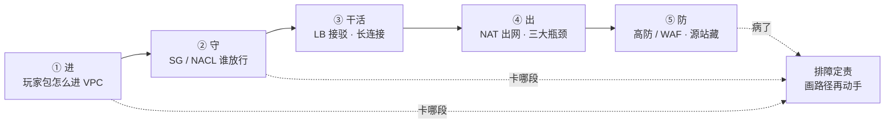

- 📖 **读图**
  - 🛤️ 主线：进 → 守 → 干活 → 出 → 防；排障按五段问「卡在哪」
  - 三条路径不同：玩家入站走 ①→②→③；私网出公网走 ④；管理面走堡垒——⭐ **玩家流量永不走 NAT**
  - 右下 `DOC` 是排障入口：任何一段卡住都先画路径，不是先改规则、不是先重启进程

---

## 二、出生地：VPC 与 CIDR 🎯⭐🔥

> 🎯 **一句话**：生产 VPC 不是「建一个 `10.0.0.0/16` 再说」，它是**故障域 + 权限域 + 路由域**三合一的根。

- 🔥 **VPC = 三域合一**（不是「划一块 IP」）
  - 故障域：AZ / 子网怎么放 → 挂一片丢多少
  - 权限域：SG 绑 ENI · NACL 绑子网 → 谁能碰谁
  - 路由域：`0.0.0.0/0` 指 IGW 还是 NAT → 出网往哪走

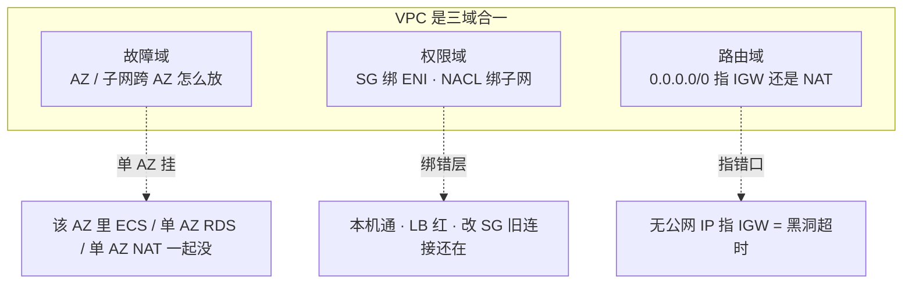

- 📖 **读图**：三个域错了出三种病——整片没 / 本机通 LB 红 / 黑洞超时；排障第一刀分清是哪个域的病

### 📮 三条路径：谁走哪条

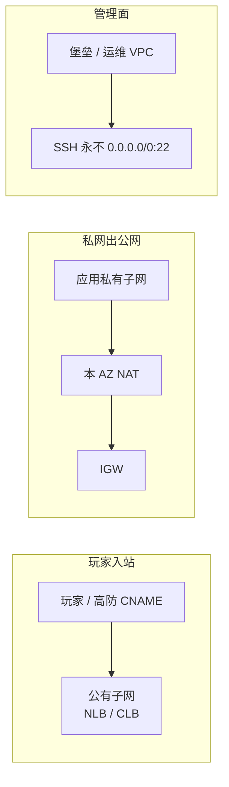

- 📖 **读图**
  - 玩家只碰公有子网的 LB；拉镜像 / 调支付 / webhook 走 NAT；管理面走堡垒
  - **逻辑服、RDS、Redis 永不绑公网 IP**——只有 LB / NAT / 堡垒有出入口

> ⚠️ **别混**：玩家入站**不走 NAT**。NAT 只服务私网出公网。把玩家下载绕 NAT，账单和处理费一起打穿（见 [05](../05-成本治理/)）。

### 🗺️ CIDR 不重叠 🔥

> 💡 **打个比方**：CIDR 像城市门牌号。两个城市都叫「长安街 1 号」，一旦修高速连起来，快递就分不清送哪家。

#### ❓ 为什么不能人人都用 `10.0.0.0/16`？

- 测试和生产都用同一段，半年后一对等 / 打专线 / CEN·TGW，路由直接冲突——切流当天才发现
- 国内一套、出海一套也要提前避开；混合云和多账号互联是迟早的事
- 按环境切开：`prod 10.10.0.0/16` / `staging 10.20.0.0/16` / `ops 10.30.0.0/16`，子网再拆公有 / 应用私有 / 数据私有
- 同账号同地域多环境，**独立 VPC 比靠安全组硬隔离更不容易误配**——一个 `0.0.0.0/0` 误配爆炸半径就是全环境

### 🏢 多 AZ：数据面必须，战斗服常故意单 AZ 🎯⭐🔥

> 🎯 **一句话**：数据面（RDS/Redis/NAT/LB）必须多 AZ；有状态战斗服常故意单 AZ，RTO 按「踢人重建」写进预案，不承诺玩家无感。

> 💡 **打个比方**：银行金库要两地备份（RDS 多 AZ），棋牌室一桌牌不能拆成两半打（战斗服单 AZ）——Session 在内存里，AZ 切换本来就要踢人重连。

#### ❓ 为什么战斗服不跨 AZ？

- 同城跨 AZ RTT 通常 **0.5–2ms**，帧同步 / 频繁 RPC 会放大延迟
- AWS 跨 AZ 流量计费，逻辑服互打会把账单打穿
- 一个区服绑一组进程内存态，AZ 级切换本来就要踢人
- ✅ **正确表述**：区服计算面单 AZ，RTO 按「切热备 AZ 或重开进程」计；大厅 / 登录 / 匹配 / HTTP API 可以多 AZ

- 丢一个 AZ 时：该 AZ 节点整片 NotReady，对端 AZ 的 LB 健康检查应把流量切走
  - 若探测路径也挂在故障 AZ →「AZ 挂了流量还往死节点打」——先看对端 AZ 的 `HealthyHostCount`
  - NLB 关掉跨 AZ 能少付钱、适合区服绑单 AZ；代价是该 AZ 目标全挂时流量不自动漂，要写进预案

### 🅿️ IP 按 Pod 留：`/24` 是经典事故 🔧🔥

> 🎯 **一句话**：Terway / VPC CNI 按 **Pod** 占 IP，不是按节点；节点池按峰值 Pod × 1.5 留 IP，给 ACK/EKS 划 `/24`（254 个地址）会耗尽。

> 💡 **打个比方**：停车场按**车位**计费不是按**车**——一台 ECS 只占一个 IP，但每个 Pod 占一个。64 台 × 30 Pod 要 1920 个车位，`/24` 只有 254 个。

```text
kubectl describe po <pending-pod>
# Events:
#   Warning  FailedScheduling  ... insufficient IP
# ← 节点池子网可用 IP 接近 0，不是镜像问题、不是节点不够
```

- 止血：给节点池加 **secondary CIDR** 或新子网
- ❌ 不要现场改已经对等的生产网段，不要缩节点假装资源够
- 细节 → [02](../02-云上计算与弹性/)、[03](../03-云上存储与数据库/)

> 📝 **面试**：「生产 VPC 按环境切开 CIDR；ACK/EKS 节点池按峰值 Pod × 1.5 留 IP；给节点池划 `/24` 是经典事故。」

本节对应练习题 Q1、Q2、Q13。

---

## 三、守门：SG vs NACL 🎯⭐🔥

> 🎯 **一句话**：安全组（SG）有状态绑 ENI，NACL 无状态绑子网；生产以 SG 精细控，NACL 只做粗禁；本机通、LB 全红先放探测源，不是重启进程。

### 🚪 有状态 vs 无状态

> 💡 **打个比方**：SG 像酒店房卡——进门登记了，出门自动放行；NACL 像小区大门——进和出都要各刷一次卡。

| 维度 | 安全组 SG | 网络 ACL / NACL |
|------|-----------|------------------|
| 作用点 | 弹性网卡 / 实例 | 子网 |
| 状态 | **有状态**：入站放行则回程自动放 | **无状态**：入、出都要各写一条 |
| 匹配 | 规则并集，有一条 Allow 就过 | 按优先级号，先匹配先生效 |
| 生产用法 | 主控制面，按角色拆组 | 兜底粗禁（整段禁公网 22） |

> ⚠️ **别混**：NACL 放行入站 80 却不放出站 1024-65535，HTTP 会建连失败或极慢——无状态，回程临时端口没写。生产以 SG 为主，**NACL 只做粗禁**，两层同时精细化会「谁都说放了但不通」。

### 🩺 本机通、LB 全红：先放探测源 🔧🔥

> 🎯 **一句话**：LB 健康检查源不是你的笔记本，也不是玩家 IP；本机 `curl` 通只证明进程在听，不证明探测路径通。

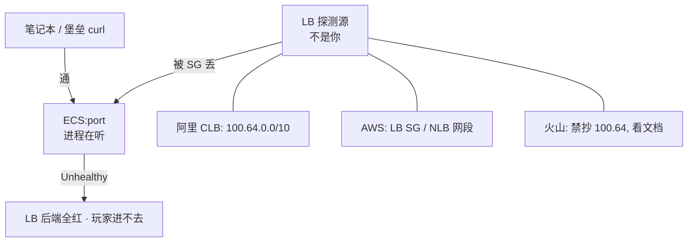

- 📖 **读图**：你的 curl 和 LB 探测是两条路；阿里 CLB 是 `100.64.0.0/10`，AWS 是 LB ENI / 节点网段，火山禁抄 `100.64`——后端 SG 没放探测源 → 全红，跟本机能不能 curl 无关

```bash
curl -v 127.0.0.1:$port        # ← 只证明进程在听，不证明探测路径
# * Connected to 127.0.0.1 ... 200 OK   ← 本机通，但 LB 控制台仍 Unhealthy
```

- 止血：临时对探测源放行业务端口（及 HTTP 检查路径），观察变 Healthy 再收紧
- 根因：变更只测了「堡垒 ssh 再 curl」，没测 LB 真实探测源
- 治理：Terraform 里 backend SG 强制 `source_security_group_id = lb_sg`；上线 checklist 含「LB 健康检查变绿」
- 健康检查过严对有状态服的害：检查打到会阻塞的业务线程 → 瞬时变慢被摘流、在线玩家被踢——**检查口要轻、与业务线程隔离**

### 🔗 SG 按角色拆组：源写 SG ID 🔧

> 🎯 **一句话**：安全组按角色拆，不要一个「default 全开」；下游规则的源**写上游安全组的 ID**，不写 `0.0.0.0/0` 也不写网段 CIDR。

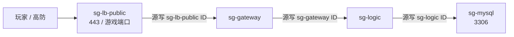

- 📖 **读图**：LB → DB 是一条 SG 引用链——每跳「源」写上游 SG ID；上游扩容换 IP 下游零改动；想打 3306 必须先成为 sg-logic 成员

> ⚠️ **别混**：写源 SG ID =「这个 SG 成员就放」；写源 CIDR =「源 IP 在这段就放」。前者跟着实例走，后者跟着 IP 走。preserve client IP 时玩家 IP 不在任何 SG 里，业务端口才退回写 CIDR。

### 🧵 改了 SG 旧连接还在：conntrack 🔧🔥

> 🎯 **一句话**：改了 SG，已建立的长连接可能还通到 conntrack 过期——这是连接跟踪表在维持，不是规则没生效；新连接立刻按新规则走。

```text
dmesg | grep conntrack
# [nf_conntrack: table full, dropping packet]   # ← 表满：新连接失败、旧的还活
# ← 调 nf_conntrack_max 只是止血；根因是超时过短狂建连，或 UDP 无状态打爆表
```

#### ❓ 为什么改了 SG 旧连接还在？

- 规则对**新连接**立刻生效；旧连接由 conntrack 维持到超时
- 排障先分：「新玩家进不去」= 规则/探测源问题；「全断」= 路径或进程问题
- ❌ 看到旧连接还通就再加一条 `0.0.0.0/0` 是典型误操作

### 收束：流量凭什么被放对、拦对

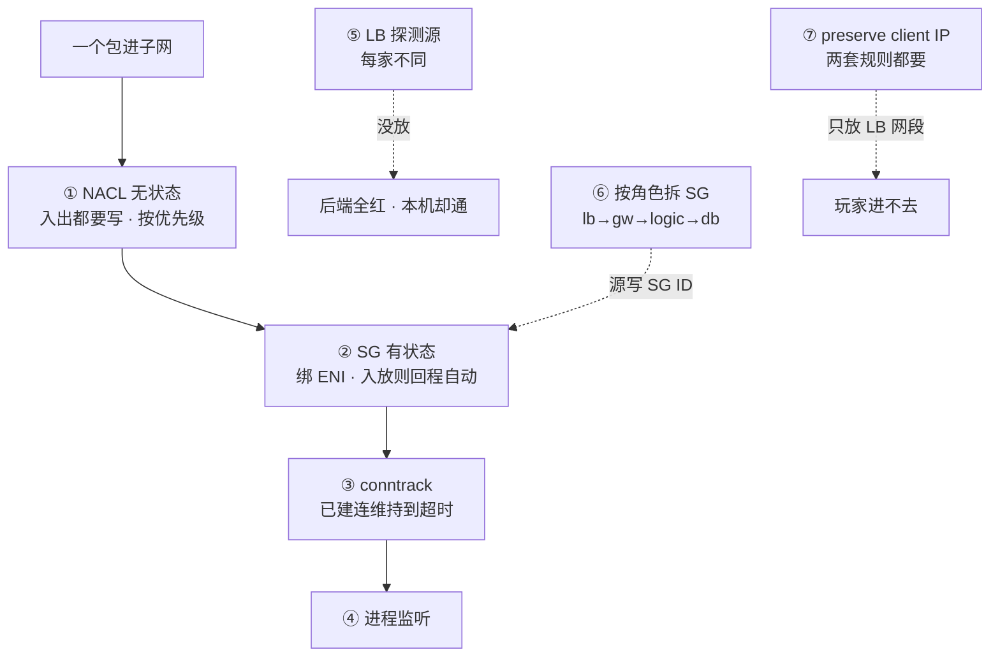

- 📖 **读图（分组）**
  - ①②③ = 数据面关卡（NACL→SG→conntrack→进程）
  - ⑤ = 健康检查源；⑥ = 角色链源写 SG ID；⑦ = preserve 时业务+检查两套规则

> ⚠️ **别混**：这套机制**只保证**规则匹配正确的包被放/拒；**不保证**改规则立刻对旧连接生效、**不保证** LB 探测源自动对齐、**不保证** NACL 放入站就能通（出站也要写）。

> 📝 **面试**：守门三层——**子网边 NACL（无状态粗禁）→ 网卡上 SG（有状态精细）→ conntrack（维持旧连）**；再加两类源要单独放：**LB 探测源**和 **preserve 时的玩家源**。口诀：**SG 有状态出门不用再刷卡，NACL 无状态进出各刷一次**。

本节对应练习题 Q4、Q5、Q11。

---

## 四、出网：NAT 与三大瓶颈 🎯⭐🔥

> 🎯 **一句话**：NAT 只服务私网出公网，玩家不走 NAT；出网偶发超时先查 NAT 三大瓶颈（带宽/PPS、SNAT 端口、单 AZ），不是先改安全组。

> 💡 **打个比方**：NAT 像公司前台统一寄快递——所有私网员工共用一个寄件地址。当所有人同时寄给同一收件人（同一支付网关 `IP:443`），「寄件人+端口」用完，后来的快递就寄不出去。

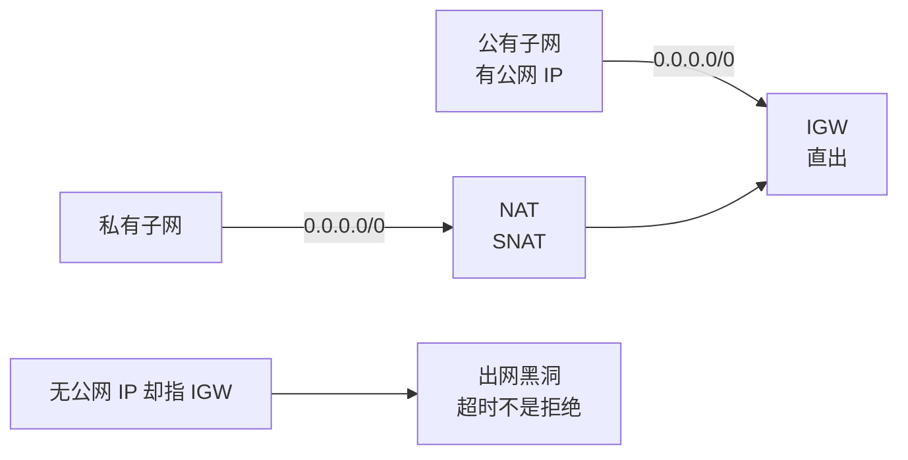

- 📖 **读图**：有公网 IP → `0.0.0.0/0` 指 IGW；无私网 → 指 NAT 再走 IGW；无公网 IP 却指 IGW = **超时黑洞**（不是 ICMP 拒绝）——和 SG 拒绝完全不同

### 📉 NAT 三大瓶颈对照

| # | 瓶颈 | 现象 | 控制台怎么看 |
|---|------|------|--------------|
| ① | 带宽 / PPS | 活动期所有节点抢同一 NAT，拉镜像变慢、VPC 内仍正常 | NAT 字节数贴上限 |
| ② | SNAT 端口耗尽 | 热点目标同一 `IP:443`，随机 `connect timeout` | 阿里端口水位 / AWS `ErrorPortAllocation` |
| ③ | 单 AZ NAT | NAT 所在 AZ 挂，出网健康检查/拉配置/写外部账单全挂 | 该 AZ NAT 不可用 |

- 一个 NAT IP 约 **6 万** 源端口；同 `dstIP:dstPort` 最易耗尽
- 本机 curl 偶发失败、换目标就好 → 典型 SNAT 端口耗尽

```bash
curl -v https://pay-gateway/...
# * connect: timed out    # ← 不是支付方挂了，是 NAT 源端口用完
# ← VPC 内 ping RDS 正常 = 出网段病，不是应用病
```

- 止血：扩 NAT IP / 升带宽；热点目标改连接池、合并出口；镜像/对象存储改 VPC 内网 endpoint
- 治理：每 AZ 各放 NAT，路由走「本 AZ NAT」；数据子网默认无 `0.0.0.0/0`；CI 用内网镜像仓

> 📝 **面试**：「玩家入站不走 NAT；出网偶发超时先查 NAT 带宽 / SNAT 端口 / 单 AZ，一个 NAT IP 约 6 万源端口；黑洞是超时不是拒绝。」

### 🌉 专线与 VPN：UDP 丢先测 MTU 🔧🔥

> 🎯 **一句话**：专线给云 ↔ IDC 数据面，玩家不走专线；专线 / VPN 封装后 MTU < 1500，UDP 大包静默丢，TCP 不丢——先测路径 MTU，不是先调应用重传。

| 维度 | 专线（Express Connect / Direct Connect） | IPsec / SSL VPN |
|------|------------------------------------------|------------------|
| 用途 | 云 VPC ↔ 自建机房，**生产数据面** | 应急、办公运维、专线备份 |
| 质量 | 带宽和时延可承诺 | 走公网，抖动不可控 |
| 玩家流量 | 不走 | 更不走 |

- 生产混合云：双专线不同运营商 + BGP，VPN 只保管理面；**单专线是单点**
- CDN 回源、玩家下载、对公网开放的登录都不该走专线

```bash
ping -M do -s 1472 <对端>     # ← 测路径 MTU，UDP 丢包时用
# ping: local error: message too long, mtu=1400   # ← 封装后有效 MTU < 1500
# ← 游戏 UDP 按 1500 发会静默丢；TCP 可 PMTU/重传所以不丢
```

> ⚠️ **别混**：「专线给玩家走更稳」是错的——玩家在公网，连的是 LB/高防；专线是 IDC ↔ 云数据面。

本节对应练习题 Q3、Q8。

---

## 五、接驳：LB 层选型与长连接 🎯⭐🔥

> 🎯 **一句话**：游戏长连接走 NLB/CLB（L4），HTTP 登录支付走 ALB（L7）；自定义 TCP 不接 ALB；心跳必须 < LB idle 的 1/3，否则玩家被静默踢。

### 🎛️ L4 vs L7：长连接接到哪一层

> 💡 **打个比方**：ALB 像 HTTP 专用闸机，只认 HTTP 握手；自定义 TCP 战斗协议走 ALB，等于拿身份证去刷地铁卡。

| 维度 | CLB / 传统 SLB | NLB | ALB |
|------|----------------|-----|-----|
| 层 | 4/7，TCP/UDP/HTTP | **4**，超高性能 | **7**，HTTP/gRPC |
| 游戏长连接 | 能用，会话保持常按源 IP | **首选** | **不适合**非 HTTP 战斗连接 |
| 灰度 | 4 层基本没有 | 无 L7 | Header/路径/权重 |
| WAF | 不挂自定义 TCP | **挂不到** TCP/UDP | 登录/支付 HTTP 走这里 |

#### ❓ 为什么自定义 TCP 不能接 ALB？

- ALB 只认 **HTTP 握手起手**；自定义二进制协议它解析不了 → 必须走 NLB/CLB
- ⚠️ **标准 HTTP 升级的 WebSocket** 可以挂 ALB，但 idle 仍要 ≥ 心跳 × 3，否则静默拆 WS
- 选错典型事故：WebSocket / 自定义 TCP 接 ALB → 空闲超时、健康检查、HTTP 解析全对不上，随机断线

### ⏱️ LB idle vs 心跳：进程没挂玩家却被踢 🔧🔥

> 🎯 **一句话**：连接静默超过 LB idle，LB 主动 FIN/RST；游戏心跳 5 分钟一次，idle 默认 60–350 秒先到——客户端以为还在线，发数据才发现。

```text
14:30:00 ... idle 到期, LB → 后端 FIN/RST   # ← LB 静默拆
14:30:00 ... 后端进程仍在, 无异常退出       # ← 进程没挂
14:35:00 ... 客户端发心跳, 才发现连接已断   # ← 玩家以为还在线 5 分钟
```

- 止血：心跳间隔 < idle 的 **1/3**，或调大 LB idle（有上限）
- UDP 无连接，LB 用会话超时，超时后五元组漂移到别的后端——有状态 UDP 必须会话保持或改客户端重连
- 跨云切换后集体掉线，优先怀疑新云 idle / UDP 会话超时默认值更短（见 [09](../09-多云对照/)）

### 🎯 源 IP 哈希在 NAT 后会打歪 🔥

- 四层会话保持按源 IP：运营商 NAT 后大量玩家同一出口 IP → 全部打到同一后端
- 开服时出现**单机 CCU 畸形高、其他机器空转** → 接入层做**连接级调度**，不能指望源 IP 哈希

### 🪪 preserve client IP：两套规则都要 🔧🔥

> 🎯 **一句话**：NLB 开了 client IP 保留，后端看到的是玩家 IP 不是 LB IP——业务端口要放玩家 IP，健康检查端口仍要放 LB 网段，两组规则都要有。

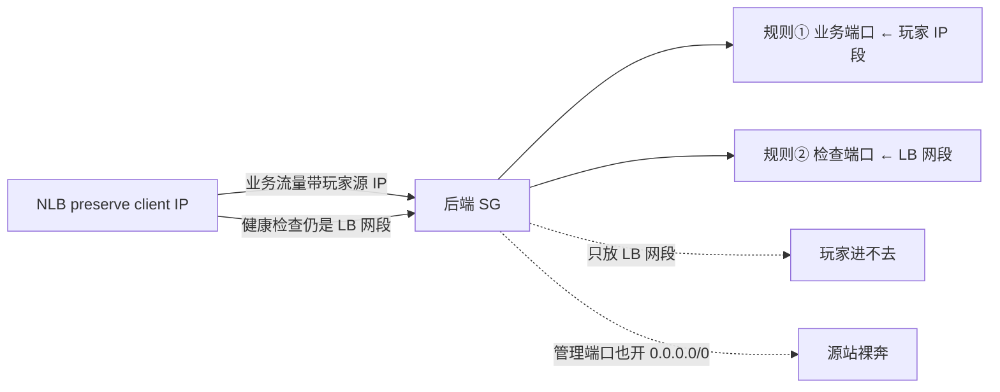

- 📖 **读图**：业务流量和健康检查源地址不同——漏放玩家 IP 段则进不去；管理端口跟着 `0.0.0.0/0` 重开则源站裸奔

### 收束：游戏长连接凭什么接对层又不被踢

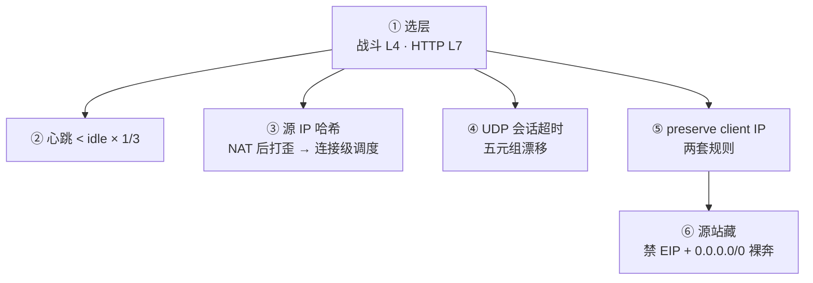

- 📖 **读图（分组）**：①选层；②③④长连接三大坑；⑤⑥安全和暴露——层选错 + 心跳对不齐 + 源站裸奔，是游戏 LB 三大经典事故

> ⚠️ **别混**：这套机制**不保证**同名 LB 跨云默认值一样、**不保证**源 IP 哈希能均匀分流、**不保证** ALB 能解析自定义 TCP。

> 📝 **面试**：「战斗长连接走 NLB/CLB，心跳 < idle 的 1/3；自定义 TCP 不接 ALB；源 IP 哈希在 NAT 后会打歪；preserve client IP 时业务+检查两套规则都要有。」

本节对应练习题 Q6、Q7、Q10。

---

## 六、防御：高防与 WAF 🎯⭐🔥

> 🎯 **一句话**：WAF 只解析 HTTP，游戏 TCP/UDP 自定义协议它看不见；L3/L4 用高防/Shield；源站必须藏，一旦 IP 泄漏 DDoS 绕过高防直打 ECS，黑洞即整服没。

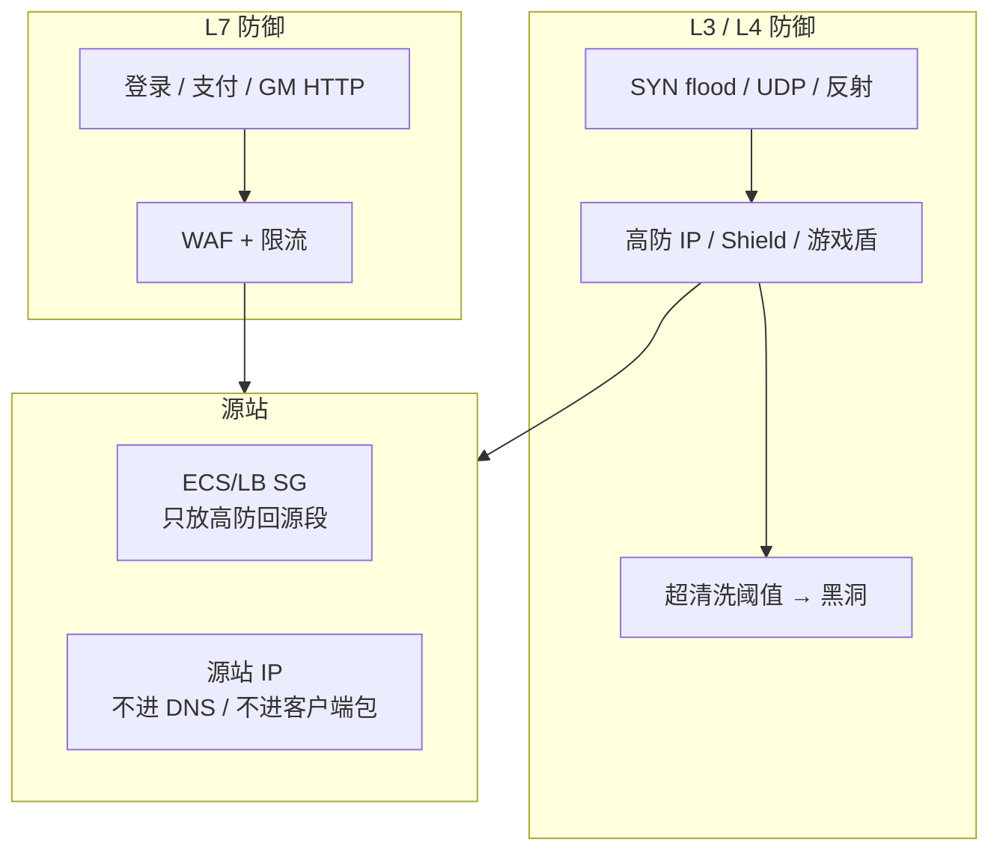

- 📖 **读图**：L4 打高防、L7 走 WAF，汇到源站；高防只保护「打到高防 IP 的流量」——源站 IP 一旦进 DNS 或客户端包，攻击者绕过高防直打 ECS

### 🕳️ 源站裸奔：CCU 断崖、CPU 不高 🔧🔥

> 🎯 **一句话**：CCU 突然断崖、逻辑服 CPU 不高、进程还在——优先怀疑入口被清洗或黑洞，不是逻辑服崩了。

```text
高防流量图: 正常              # ← 高防没被打
源站网卡 PPS: 暴涨             # ← 源站被直打 = IP 泄漏
逻辑服 CPU: 不高 · 进程在      # ← 不是逻辑服崩了
安全组: 0.0.0.0/0 放业务端口   # ← 源站裸奔
```

- 「高防流量正常但源站 PPS 暴涨」= 源站 IP 泄漏被直打——先看高防/黑洞告警，不要先重启逻辑服
- 止血：切高防 CNAME（提前演练 TTL）、临时换入口 IP、源站 SG 收回仅回源段
- 根因常是测试域名 / 旧 EIP / 客户端写死 IP / SG `0.0.0.0/0`
- AWS Shield Standard 抗常见 L3/L4；大流量游戏仍要 Advanced 或第三方高防

### 🧹 黑洞 vs 清洗 🔧🔥

> 🎯 **一句话**：超过清洗阈值不立即黑洞——先清洗（丢可疑包、放行正常包），清洗扛不住才黑洞（整段 IP 全丢），RTO 完全不同。

#### ❓ 为什么清洗和黑洞要分清？

| 阶段 | 发生什么 | 玩家体感 | RTO 口径 |
|------|----------|----------|----------|
| 清洗 | 丢可疑包、放行正常包 | 部分卡顿、丢包，多数仍在线 | 清洗结束自动恢复 |
| 黑洞 | 整段 EIP 流量被运营商丢弃 | 该入口所有玩家全断 | 切高防 CNAME / 换源站 IP，按 TTL 计 |

- 清洗 = 精准手术；黑洞 = 整段截肢——CCU 断崖先分清阶段再动刀
- 切高防 CNAME 要提前演练 DNS TTL（TTL 越短切换越快但查询量越大）

> 📝 **面试**：「高防超阈值先清洗后黑洞——清洗丢攻击保正常、黑洞整段全丢；CCU 断崖先分清是哪阶段；切高防 CNAME 的 RTO 取决于 DNS TTL。」

> ⚠️ **别混**：黑洞是**运营商/云平台强制**的，不是高防清洗动作。源站一旦直被打到黑洞，切 CNAME 也得等当前黑洞时长结束那个 EIP 才恢复——**预防靠源站 IP 不泄漏**。

> ⚠️ **别混**：WAF ≠ DDoS 高防。WAF 防 HTTP（注入、CC、盗刷）；高防/Shield 防 L3/L4（SYN flood、UDP 反射）。游戏主连接是自定义 TCP/UDP，WAF 看不见——口诀：**HTTP 挂 WAF，自定义 TCP/UDP 挂高防，源站 IP 永不进 DNS**。

本节对应练习题 Q6、Q9、Q14。

---

## 七、作战：定责 🎯⭐🔧

> 🎯 **一句话**：通断问题不要从改 SG 开始猜——先画路径、再分叉定位；入口被清洗 = 不能进新玩家，不是立刻踢还活着的长连接，重启业务只会把事故面放大。

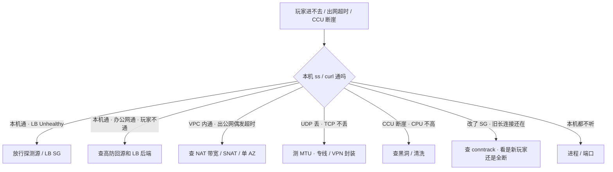

- 📖 **读图**：第一刀永远是「本机通不通」，再按现象分叉——「本机通 LB 红」→ 探测源；「VPC 内通出公网超时」→ NAT

- 现场顺序（从外到内）：

```text
客户端 → 高防/DNS → LB(监听 · 健康检查 · idle)
       → 安全组(源是谁) → NACL → 路由表(IGW 还是 NAT)
       → 网卡/conntrack → 进程是否在听
```

### 现象 · 先做 · 别做

| 现象 | 先做 | 别做 |
|------|------|------|
| 本机 `ss -lnt` 通、办公网通、玩家不通 | 查高防回源和 LB 后端 | 先改业务端口 |
| 本机通、LB Unhealthy | 放探测源 CIDR / LB SG | 先重启进程 |
| VPC 内通、出公网偶发超时 | 查 NAT 带宽 / SNAT / 单 AZ | 先改安全组 |
| UDP 丢、TCP 不丢 | 测 MTU（专线 / VPN 封装） | 先调应用重传 |
| CCU 断崖、CPU 不高 | 查黑洞 / 清洗 | 先重启逻辑服 |
| 改了 SG、旧长连接还在 | 查 conntrack，看新玩家还是全断 | 再加 `0.0.0.0/0` |
| `insufficient IP` | 加 secondary CIDR / 新子网 | 缩节点假装资源够 |
| 节点池 `/24` 耗尽 | 加网段 | 现场改已对等生产网段 |

### 60 秒剧本 🔧

> 🔍 **现场**：接报「玩家进不去」，60 秒内按顺序敲完，不重启进程——

```bash
# 0-10s: 进程在不在听
ss -lnt | grep ":$port"                    # ← 有 = 进程在，继续查路径
curl -s -o /dev/null -w '%{http_code}' 127.0.0.1:$port  # ← 200 = 本机通，不证明 LB 通

# 10-30s: LB 健康检查 / 探测源
# 控制台 → LB → 健康检查：Unhealthy = 探测源被 SG 拦
# 阿里 CLB 放 100.64.0.0/10；AWS 放 LB SG ID

# 30-45s: 安全组 / NAT 水位
# 源写 SG ID 不写 CIDR；NAT 网关端口水位
# ← VPC 内通 + 出公网 timeout = NAT SNAT 端口耗尽

# 45-60s: 高防 / conntrack
# 高防流量图：CCU 断崖 + CPU 不高 = 黑洞/清洗
dmesg | grep conntrack                     # ← table full = 新连失败旧连活着
# ← 60 秒内不动业务进程、不改 0.0.0.0/0、不重启逻辑服
```

- Flow log 只在「规则看起来对但仍丢包」时对 ENI 定向开五元组，不要全 VPC 开一天再海选

> 📝 **面试**：「通断先画路径再改规则：LB 红查探测源、出网查 NAT、UDP 查 MTU、CCU 断崖查黑洞、改 SG 旧连接还在查 conntrack——不重启逻辑服是因为长连接可能还活着，重启会主动踢在线玩家放大事故面。」

本节对应练习题 Q12。

---

## 八、收口

### 命令速查 🔧

```bash
ss -lnt                         # ← 进程有没有在听
curl -v 127.0.0.1:$port         # ← 只证明本机，不证明探测路径
ping -M do -s 1472 <对端>       # ← 测路径 MTU，UDP 丢包时用
dmesg | grep conntrack          # ← 表满：新连接失败、旧的还活
kubectl describe po {pod}       # ← insufficient IP = 子网 IP 耗尽
```

### 面试锚点表

| 问 | 30 秒答 |
|----|---------|
| 生产 VPC 怎么划？ | 按环境切开 CIDR；子网分公有/应用/数据三层；ACK/EKS 按峰值 Pod × 1.5 留 IP，`/24` 会耗尽 |
| 逻辑服要多 AZ 吗？ | 数据面必须多 AZ；有状态战斗服常单 AZ，跨 AZ RTT 和 AWS 流量费会放大，RTO 按踢人写 |
| 出网偶发超时？ | 先查 NAT 三大瓶颈（带宽/SNAT 端口/单 AZ），一个 NAT IP 约 6 万源端口，不先改 SG |
| SG vs NACL？ | SG 有状态绑 ENI 是主控制面；NACL 无状态绑子网只做粗禁；NACL 回程端口也要写 |
| 本机通 LB 全红？ | 探测源被 SG 拦，放 `100.64.0.0/10`（阿里）/ LB SG（AWS），不重启进程 |
| LB 怎么选？心跳踢人？ | 战斗长连接走 NLB/CLB（L4），HTTP 走 ALB；心跳 < idle 的 1/3，否则静默踢 |
| 改 SG 旧连接还在？ | conntrack 维持到超时，规则对新连接立刻生效，看是新玩家还是全断 |
| 游戏端口接 WAF？ | 不行，WAF 只解析 HTTP，自定义 TCP/UDP 走高防/Shield，源站 SG 只放回源段 |
| 专线给玩家走？ | 不走，玩家在公网，专线是 IDC ↔ 云数据面；UDP 丢先测 MTU |
| NAT 端口耗尽什么现象？ | 偶发 `connect timeout`，VPC 内正常；扩 IP 或改连接池 |
| 黑洞 vs 清洗？ | 清洗丢攻击保正常（部分卡顿），黑洞整段全丢（全断）；CCU 断崖先分清阶段 |
| conntrack 表满什么表现？ | 新连接失败、旧连接还活着；`dmesg \| grep conntrack` 看 table full |
| NLB 关跨 AZ 的代价？ | 该 AZ 目标全挂时流量不自动漂，要显式选择并写进预案 |

### 易错一句话对照

- `逻辑服绑 EIP 高防会挡` → **错**：源站 IP 泄漏后直打 ECS，黑洞即整服没
- `玩家入站走 NAT 更安全` → **错**：NAT 只给出网，玩家连 LB/高防
- `一个大 VPC 用 SG 隔离就够` → **错**：误配爆炸半径大，按环境切开 CIDR
- `数据面和战斗服都必须多 AZ、玩家无感` → **错**：数据面必须，战斗服常单 AZ，RTO 按踢人写
- `本机 curl 通说明 LB 一定绿` → **错**：探测源不是你
- `自定义 TCP 接 ALB 做灰度` → **错**：ALB 只认 HTTP，长连接走 NLB/CLB
- `NACL 放行入站 80 即可` → **错**：无状态，回程临时端口也要写
- `改了 SG 旧连接还在 = 规则没生效` → **错**：conntrack，新连接已按新规则
- `游戏端口接 WAF` → **错**：WAF 看不见自定义 TCP/UDP
- `ACK/EKS 节点池划 /24 够用` → **错**：Terway/VPC CNI 按 Pod 占 IP
- `火山健康检查也抄 100.64` → **错**：每家探测源不同，看文档
- `专线给玩家走更稳` → **错**：玩家在公网，专线是 IDC ↔ 云数据面
- `NAT 端口耗尽会拒绝连接` → **错**：是 `connect timeout`，不是 ICMP 拒绝
- `黑洞和清洗一样，都是丢流量` → **错**：清洗丢攻击保正常，黑洞整段全丢
- `conntrack 表满 = 安全组没生效` → **错**：表满是新连接失败，旧连接还活着
- `NLB 关跨 AZ 省钱没代价` → **错**：该 AZ 目标全挂时流量不自动漂

### 数字墙

> 峰值 Pod × **1.5** 留 IP · 一个 NAT IP ≈ **6 万** 源端口 · 跨 AZ RTT **0.5–2ms**（同城）· 心跳 < idle × **1/3** · 阿里 CLB 探测源 **100.64.0.0/10** · 专线封装 MTU **1400–1460** · UDP 按 1500 发会静默丢 · 数据面必须多 AZ · 战斗服常单 AZ

---

## 合上书

对着第一节主图口述一遍，卡住就回对应小节。开头那个现场——改安全组 / 重启 NAT / 切高防——三个人各自错在哪，现在该能说清了。

- [ ] **默画主图**：进→守→干活→出→防，标出三条路径各走哪段、NAT 不在玩家入站路径上。（→ Q1、Q12）
- [ ] **口述 VPC**：三域是什么？为什么不能人人 `10.0.0.0/16`？节点池为什么不能划 `/24`？（→ Q1、Q13）
- [ ] **口述多 AZ**：数据面为什么必须？战斗服为什么常故意单 AZ？丢一个 AZ 先看哪个 LB 指标？（→ Q2）
- [ ] **默画守门**：SG vs NACL（作用点/状态/匹配/用法）；本机通 LB 红先放什么；改 SG 旧连接为何还在。（→ Q4、Q5、Q11）
- [ ] **默画 NAT**：私有子网→NAT→IGW；黑洞是超时还是拒绝；三大瓶颈各看什么。（→ Q3）
- [ ] **口述接驳**：战斗走哪一层？为什么不接 ALB？心跳与 idle 怎么对齐？preserve 几套规则？源 IP 哈希 NAT 后怎样？（→ Q6、Q7、Q10）
- [ ] **口述专线**：UDP 丢 TCP 不丢先测什么？专线该给谁走？（→ Q8）
- [ ] **口述防御**：CCU 断崖该不该重启逻辑服？WAF 能不能接游戏端口？清洗 vs 黑洞？（→ Q9、Q14）
- [ ] **默画决策树**：本机通→七条分叉；口述 60 秒剧本 0–60s 各敲什么、什么绝不碰。（→ Q12）
