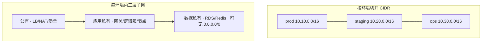
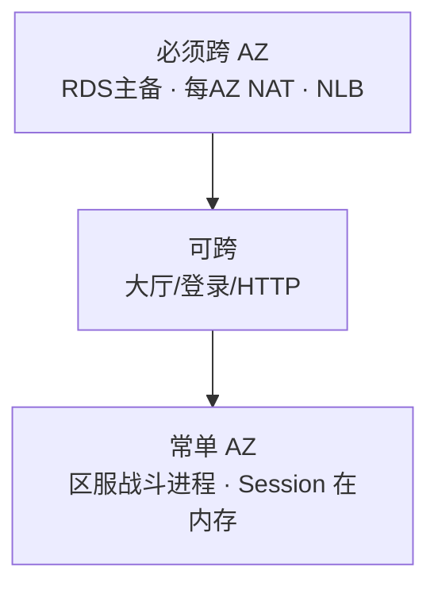
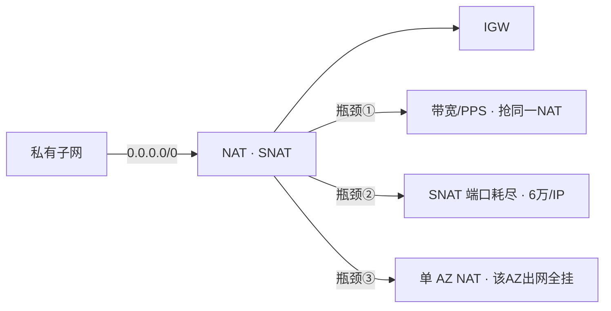
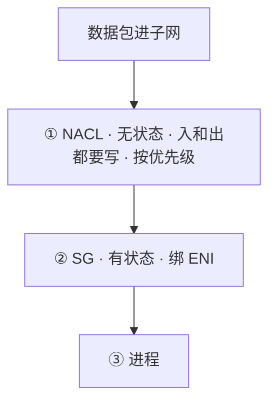
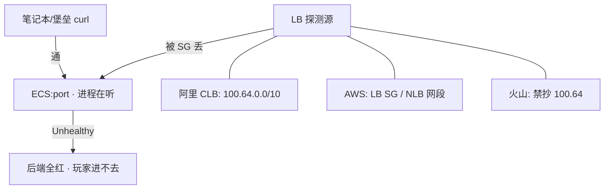
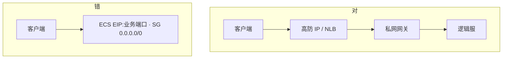
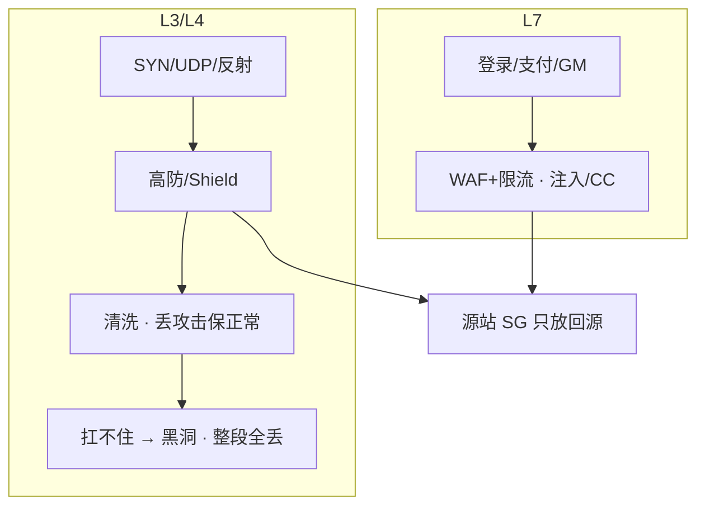
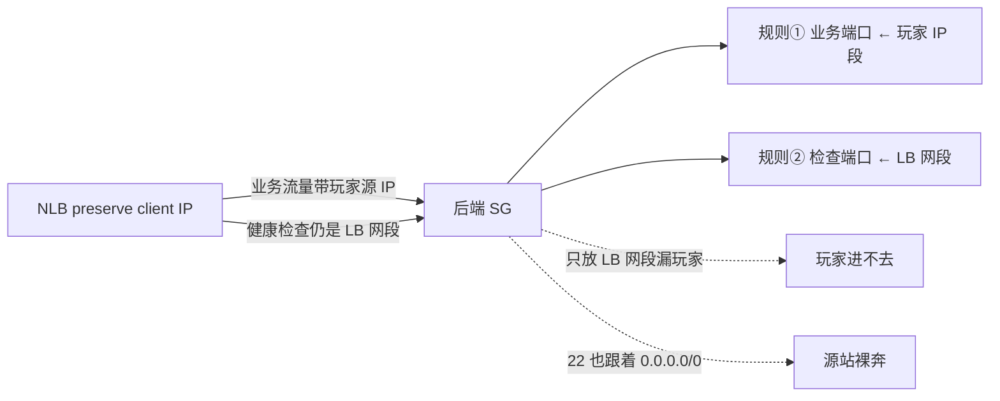
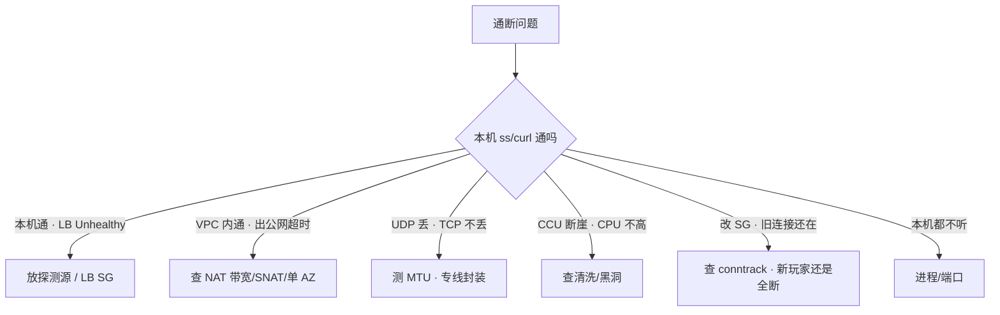

# 01｜云网络与安全 · 练习题

先合上知识点，对着 **一、一张图：一个包在云上的旅程** 把进→守→干活→出→防五段口述一遍，再来做题。

| 标记 | 含义 |
|------|------|
| **核心** | 不懂整章就没建立起来 |
| **必会** | 值班和面试都要能讲 |
| **常用** | 线上会反复碰到 |
| **常考** | 白板和追问的高频口径 |

## 本题目录
- [Q1 生产 VPC 怎么划](#q1)
- [Q2 逻辑服要不要多 AZ](#q2)
- [Q3 出网偶发超时](#q3)
- [Q4 SG vs NACL](#q4)
- [Q5 本机通、LB 全红](#q5)
- [Q6 游戏端口怎么暴露](#q6)
- [Q7 LB 选型与心跳踢人](#q7)
- [Q8 专线与 VPN](#q8)
- [Q9 WAF 和高防](#q9)
- [Q10 preserve client IP 时 SG 怎么写](#q10)
- [Q11 改了 SG 旧连接还在](#q11)
- [Q12 排障分流](#q12)
- [Q13 子网 IP 耗尽怎么办](#q13)
- [Q14 CCU 断崖先查什么](#q14)
- [合上书](#合上书)

---

## Q1

**★★★★★｜生产 VPC 怎么划？为什么不能大家都用 10.0.0.0/16？ACK 节点池报 insufficient IP 怎么办？**

**覆盖**：核心 · 必会 · 常考 ｜ **对应**：知识点 [二、出生地：VPC 与 CIDR](知识点.md)

### 场景
新环境从控制台默认网段建起来。半年后要对等生产、打专线，发现两边都是 `10.0.0.0/16`。同时 ACK 节点池加不进去，报 `insufficient IP`。有人说「一个大 VPC 用安全组隔离就行」。

### 完整解答
> 🎯 **一句话**：生产 VPC 按环境切开 CIDR，子网分公有/应用/数据三层，ACK/EKS 按峰值 Pod × 1.5 留 IP。

生产 VPC 是**故障域 + 权限域 + 路由域**三合一。`10.0.0.0/16` 人人默认，一对等、打专线、CEN/TGW 就路由冲突。按环境切开：`prod 10.10.0.0/16` / `staging 10.20.0.0/16` / `ops 10.30.0.0/16`，子网再拆公有（LB/NAT/堡垒）、应用私有（网关/逻辑服/节点）、数据私有（RDS/Redis，可无 `0.0.0.0/0`）。国内出海也要提前避开重叠。



**读图**：环境切开是横向隔离，三层子网是纵向分层。数据子网可以没有 `0.0.0.0/0`——3306/6379 只放应用网段。

`insufficient IP` 是节点池子网 IP 耗尽，不是镜像或节点不够。Terway/VPC CNI 按 **Pod** 占 IP，64 台 × 30 Pod 要 1920 个 IP，`/24` 只有 254 个。

```text
kubectl describe po <pending-pod>
#   Warning  FailedScheduling  ... insufficient IP      # ← 子网 IP 耗尽
# ← 止血：加 secondary CIDR 或新子网，不缩节点、不改已对等生产网段
```

> ⚠️ **别混**：止血加 secondary CIDR，**不要现场改已经对等的生产网段**——会牵动一堆路由和对等关系。同账号多环境，独立 VPC 比 SG 硬隔离更不容易误配。
> 📝 **面试**：「按环境切开 CIDR；ACK/EKS 按峰值 Pod × 1.5 留 IP，`/24` 是经典事故；`insufficient IP` 加网段不缩节点。」

### 再追问
- **国内和出海可以同一套 `10.10.0.0/16`？** ——迟早要对等/打专线，提前避开重叠，落地表在 [04](../04-IAM与多账号/)。
- **缩副本假装资源够行不行？** ——不行。Pod Pending、`failed to assign IP`，加网段或 prefix delegation 才是正解。

---

## Q2

**★★★★★｜游戏逻辑服要不要多 AZ？跨 AZ 流量为什么要钱？**

**覆盖**：核心 · 必会 · 常考 ｜ **对应**：知识点 [二、出生地：多 AZ](知识点.md)

### 场景
架构评审有人写「全部多 AZ，所以 AZ 挂了玩家无感」。战斗服东西向 RPC 很密，AWS 账单里已经出现跨 AZ 流量。

### 完整解答
> 🎯 **一句话**：数据面必须多 AZ，有状态战斗服常故意单 AZ，跨 AZ 要算 RTT 和 AWS 流量费，RTO 按踢人写预案。



**读图**：三档——数据面必须跨（RDS/Redis/NAT/LB），无状态计算面可跨（大厅/登录/匹配/HTTP），有状态战斗服常单 AZ。战斗服单 AZ 的三个理由：跨 AZ RTT 0.5–2ms 放大帧同步延迟；AWS 跨 AZ 计费会打穿账单；Session 在内存，AZ 切换本来就要踢人重建。RTO 按「切热备 AZ 或重开进程」计，不承诺玩家无感。

丢一个 AZ 时：该 AZ 节点整片 NotReady，先看对端 AZ的 `HealthyHostCount` 是否已切流量；若健康检查也挂在故障 AZ 探测路径上，流量还会往死节点打。

> ⚠️ **别混**：AZ 是机房级故障域，**不抗地域级**故障——4 个 AZ 不比 2 个更能抗地域级，地域级走多地域 + DNS。
> 📝 **面试**：「数据面必须多 AZ；战斗服常单 AZ，跨 AZ RTT 和流量费会放大；AZ 挂看对端 HealthyHostCount。」

### 再追问
- **关掉 NLB 跨 AZ 行不行？** ——能少付钱、适合区服绑单 AZ，代价是该 AZ 目标全挂时流量不自动漂，要显式选择并写进预案。
- **丢 AZ 时为什么流量还往死节点打？** ——健康检查探测路径也挂在故障 AZ 上。先看对端 AZ 的 `HealthyHostCount`。

---

## Q3

**★★★★★｜私网访问公网偶发超时，VPC 内互访正常，怎么查？**

**覆盖**：核心 · 必会 · 常用 ｜ **对应**：知识点 [四、出网：NAT 与三大瓶颈](知识点.md)

### 场景
活动期逻辑服调支付/账号 API 随机 `connect timeout`，拉镜像变慢。ping 同 VPC 的 RDS 正常。有人准备改安全组，有人说要重启 NAT。

### 完整解答
> 🎯 **一句话**：私网出公网偶发超时先查 NAT 三大瓶颈（带宽/PPS、SNAT 端口、单 AZ），不是先改安全组。



**读图**：私网出公网路径 `0.0.0.0/0 → NAT → IGW`。三个瓶颈：①带宽/PPS 活动期抢同一 NAT，拉镜像变慢但 VPC 内正常；②SNAT 端口耗尽，热点目标同一 `IP:443` 随机 `connect timeout`；③单 AZ NAT，该 AZ 出网的健康检查、拉配置全挂。

一个 NAT IP 约 6 万源端口，同 `dstIP:dstPort` 最容易耗尽。本机 curl 偶发失败、换一个目标就好——典型 SNAT 信号。没有公网 IP 却指 IGW = 出网黑洞，是**超时**不是 ICMP 拒绝。

```bash
curl -v https://pay-gateway/
# * connect: timed out        # ← VPC 内 ping RDS 正常 = 出网段病
# 阿里云看 NAT 端口水位; AWS 看 ErrorPortAllocation
```

止血：加 NAT IP / 升带宽；热点目标改连接池、合并出口；镜像/对象存储改 VPC 内网 endpoint（S3 Gateway Endpoint / OSS 内网域名）。治理：每 AZ 一个 NAT，本 AZ 路由；数据子网无出网。

> ⚠️ **别混**：黑洞是**超时**不是 ICMP 拒绝——和 SG 拒绝是两种病，别看到超时就改 SG。
> 📝 **面试**：「出网偶发超时先查 NAT 带宽/SNAT 端口/单 AZ，一个 NAT IP 约 6 万源端口；玩家流量不走 NAT。」

### 再追问
- **玩家流量会不会走 NAT？** ——不会也不该，玩家连 LB/高防。把下载走 NAT 会把账单和处理费一起打穿（[05](../05-成本治理/)）。
- **改 SG 旧长连接还通？** ——那是 conntrack，不是 NAT 也没坏，见 Q11。

---

## Q4

**★★★★☆｜安全组和 NACL 有什么区别？为什么生产以 SG 为主？**

**覆盖**：必会 · 常用 · 常考 ｜ **对应**：知识点 [三、守门：有状态 vs 无状态](知识点.md)

### 场景
有人从 AWS 文档抄了 NACL 示例，放行入站 80，HTTP 建连失败或极慢。

### 完整解答
> 🎯 **一句话**：SG 有状态绑 ENI（入放则回程自动放），NACL 无状态绑子网（入出都要写）；生产以 SG 精细控，NACL 只做粗禁。



**读图**：包进子网先过 NACL（无状态，要入出各写），再过 SG（有状态，入放则回程自动放）。NACL 放行入站 80 却不放出站 1024-65535，HTTP 建连失败——无状态回程端口没写。SG 不会踩这个。所以生产 SG 主控、NACL 粗禁（整段禁公网 22），两层同时精细化会「都说放了但不通」。

SG 按角色拆，下游源**写上游 SG 的 ID**不写 CIDR：`sg-lb-public → sg-gateway → sg-logic → sg-mysql`，上游扩容换 IP 下游零改动。

> ⚠️ **别混**：SG ID 放行（「是这个 SG 成员就放」）和 CIDR 放行（「源 IP 在这个段就放」）是两种——前者跟实例走，后者跟 IP 走。preserve client IP 时玩家 IP 不在任何 SG 里，才退回写 CIDR 段。
> 📝 **面试**：「SG 有状态绑 ENI 是主控，NACL 无状态绑子网只粗禁；NACL 入 80 漏放出站临时端口会建连失败。」

### 再追问
- **一个 `sg-default` 全开当万金油行吗？** ——不行，任意一台 ECS 被攻破就是整网沦陷。按角色拆，源写上游 SG ID。
- **NACL 按什么匹配？** ——按优先级号，先匹配先生效；SG 是规则并集，有一条 Allow 就过。

---

## Q5

**★★★★★｜本机 curl 通，负载均衡后端全 Unhealthy，为什么？**

**覆盖**：核心 · 必会 · 常考 ｜ **对应**：知识点 [三、守门：本机通、LB 全红](知识点.md)

### 场景
`curl 127.0.0.1:port` 200，办公网也能通。LB 控制台后端全红，玩家进不去。刚用 Terraform 建的安全组，变更只测了堡垒 ssh + curl。

### 完整解答
> 🎯 **一句话**：本机 curl 通、LB 全红是探测源被 SG 拦住，不是进程没起。



**读图**：你的 curl 和 LB 探测是两条不同路径。LB 健康检查源每家不同——阿里 CLB `100.64.0.0/10`，AWS 是 LB 自己的 ENI/节点网段，火山禁止照抄 `100.64`。本机 curl 只证明进程在听，不证明探测路径通；LB 按检查失败摘流，业务端口对办公网开放也没用。

```bash
curl -v 127.0.0.1:$port
# * Connected ... 200 OK   # ← 本机通, 但 LB 控制台仍 Unhealthy
# ← 止血: 放行探测源 CIDR / LB SG, 看 Healthy 再收紧
```

治理：backend SG 强制 `source_security_group_id = lb_sg`；上线 checklist 含「LB 健康检查变绿」。健康检查口要轻、与业务线程隔离——检查打到会阻塞的业务线程，瞬时变慢被摘流，正在打的玩家被踢到另一台。

> ⚠️ **别混**：探测源不是你也不是玩家 IP，是 LB 自己的网段。先放探测源，不要先重启进程、不要先改业务端口。
> 📝 **面试**：「本机通 LB 全红先放探测源——阿里 `100.64.0.0/10`、AWS 放 LB SG；本机 curl 只证明进程在听。」

### 再追问
- **为什么火山不能抄 `100.64`？** ——每家探测源不同，火山以控制台/文档为准（[08](../08-火山引擎生产/)）。
- **健康检查过严会怎样？** ——打到会阻塞的业务线程，瞬时变慢被摘流，正在打的玩家被踢。检查口要轻、独立端口。

---

## Q6

**★★★★★｜游戏长连接端口应该怎么暴露？能不能 ECS 绑 EIP？**

**覆盖**：核心 · 必会 · 常考 ｜ **对应**：知识点 [五、接驳：LB 层选型](知识点.md) · [六、防御](知识点.md)

### 场景
测试期逻辑服绑了 EIP，安全组 `0.0.0.0/0` 放业务端口。正式开服后源站网卡 PPS 暴涨，高防流量图却正常。有人建议再买一台高防。

### 完整解答
> 🎯 **一句话**：玩家走高防/NLB，源站藏私网，逻辑服禁 EIP + `0.0.0.0/0` 裸奔；源站 IP 一旦泄漏 DDoS 绕过高防直打 ECS，黑洞即整服没。



**读图**：对的路径——客户端 → 高防/NLB → 私网网关 → 逻辑服，源站在私网、SG 源是回源段。错的路径——ECS 直接绑 EIP + `0.0.0.0/0`，源站 IP 泄漏后被直打。高防**只保护打到高防 IP 的流量**，源站必须从 DNS 和 SG 两头藏住。

观测：源站网卡 PPS 暴涨但高防图正常 = 源站 IP 泄漏被直打；安全组有 `0.0.0.0/0`；DNS/旧 EIP/客户端写死 IP 泄漏。止血：SG 收回仅回源段；切高防 CNAME（提前演练 TTL）；必要时换源站 IP。治理：对外 DNS 只指向高防；定期扫 EIP 和 `0.0.0.0/0`。ACK/EKS `LoadBalancer` 改注解可能换 IP，客户端必须走域名。

> ⚠️ **别混**：买更多高防救不了源站裸奔——攻击者打到的是泄漏的源站 EIP，不是高防 IP。先藏源站。
> 📝 **面试**：「玩家走高防/NLB，源站藏私网禁 EIP 裸奔；高防只保护打到高防 IP 的流量，源站要从 DNS 和 SG 两头藏。」

### 再追问
- **ACK `LoadBalancer` 改注解为什么客户端掉线？** ——注解可能重建 LB 换 IP，客户端写死 IP 全军覆没，必须用域名。
- **DDoS 一定先黑洞吗？** ——不一定，先清洗（丢攻击保正常），清洗扛不住才黑洞整段全丢（见 Q9）。

---

## Q7

**★★★★☆｜CLB/NLB/ALB 怎么选？玩家定时被踢、进程没挂怎么查？**

**覆盖**：必会 · 常用 · 常考 ｜ **对应**：知识点 [五、接驳：LB 层选型与长连接](知识点.md)

### 场景
Ingress 默认 ALB 注解套到了游戏端口。另一边战斗服进程正常，玩家每隔几分钟掉线一次。抓包见 FIN/RST，心跳 5 分钟一次。

### 完整解答
> 🎯 **一句话**：TCP/UDP 长连接用 CLB/NLB，HTTP/gRPC 用 ALB；自定义 TCP 不接 ALB；心跳必须 < LB idle 的 1/3，否则静默踢。

| 维度 | CLB/SLB | NLB | ALB |
|------|---------|-----|-----|
| 层 | 4/7 | **4** | **7** |
| 游戏长连接 | 能用 | **首选** | **不适合**非 HTTP |
| WAF | 不挂自定义 TCP | 挂不到 | 登录/支付走这 |

自定义 TCP 接 ALB：解析失败、超时和健康检查按 HTTP 来，随机断线。LB idle 短于心跳，连接静默超 idle 后 LB 主动 FIN/RST，应用无崩溃。

```text
14:30:00 ... idle 到期, LB → 后端 FIN/RST   # ← LB 静默拆
14:30:00 ... 后端进程仍在, 无异常退出       # ← 进程没挂
14:35:00 ... 客户端发心跳, 才发现连接已断   # ← 玩家以为还在线 5 分钟
```

止血：心跳改 < idle 的 1/3，或调大 idle（有上限）。四层会话保持按源 IP——运营商 NAT 后大量玩家同一出口 IP 打到单机 CCU 畸形高，要接入层做连接级调度。UDP 用会话超时，超时后五元组漂移到别的后端。

> ⚠️ **别混**：**标准 HTTP 升级的 WebSocket** 可以挂 ALB（ALB 支持 WS 升级），但 idle 仍要 ≥ 心跳 × 3；**自定义二进制 TCP**（非 HTTP 起手）ALB 解析不了，必须 NLB/CLB。区分标准就是「是不是 HTTP 握手起手」。
> 📝 **面试**：「战斗长连接走 NLB/CLB，心跳 < idle 的 1/3；自定义 TCP 不接 ALB；源 IP 哈希 NAT 后会打歪单机 CCU。」

### 再追问
- **跨云切换后集体掉线怀疑什么？** ——新云 LB idle/UDP 会话超时默认值更短，名字都叫 NLB 不等于超时一样，切云验收单独测心跳（[09](../09-多云对照/)）。
- **关掉 NLB 跨 AZ + preserve IP 同时用？** ——`ActiveFlow` 涨、`HealthyHostCount=0` 要单独查（见 Q10）。

---

## Q8

**★★★★☆｜专线和 VPN 怎么选？玩家流量走专线吗？专线只有一条，UDP 战斗包随机丢、TCP 正常，为什么？**

**覆盖**：必会 · 常用 ｜ **对应**：知识点 [四、出网：专线与 VPN](知识点.md)

### 场景
混合云：IDC 还有自建库，云上跑逻辑服。有人提议玩家入口也走专线「更稳」。专线闪断时 DNS/数据库跨云超时。

### 完整解答
> 🎯 **一句话**：专线给云 ↔ IDC 数据面，玩家不走专线；专线/VPN 封装后 MTU < 1500，UDP 按 1500 会静默丢、TCP 不丢，先测路径 MTU。

| 维度 | 专线 | IPsec/SSL VPN |
|------|------|---------------|
| 用途 | 云 ↔ IDC 数据面 | 应急、办公、专线备份 |
| 质量 | 带宽时延可承诺 | 走公网抖动 |
| 玩家流量 | 不走 | 更不走 |

生产混合云双专线不同运营商 + BGP，VPN 只保管理面。**单专线是单点**——闪断时没探测和主备切换，两边都以为自己是主，DNS/数据库跨云双写或超时。

```bash
ping -M do -s 1472 <对端>
# ping: local error: message too long, mtu=1400   # ← 封装后 MTU<1500
# ← UDP 按 1500 发静默丢; TCP 可 PMTU/重传所以不丢
```

止血：两侧统一 MTU（1400–1460）或 clamp MSS；UDP 降包大小；切备专线（仅管理）。CDN 回源、玩家下载、对公网登录都不该走专线。

> ⚠️ **别混**：「专线给玩家走更稳」是错的——玩家在公网连 LB/高防，专线是 IDC ↔ 云数据面通道。
> 📝 **面试**：「专线给 IDC 数据面，玩家不走；UDP 丢 TCP 不丢先测 MTU，两侧统一 1400–1460 或 clamp MSS。」

### 再追问
- **专线闪断为什么双脑？** ——没探测和主备切换时两边都以为自己是主，单专线是单点，不能靠「应该很稳」。
- **谁不该走专线？** ——CDN 回源、玩家下载、对公网登录。

---

## Q9

**★★★★★｜WAF 和高防差在哪？游戏端口接 WAF 行不行？CCU 断崖、CPU 不高是什么病？**

**覆盖**：核心 · 必会 · 常考 ｜ **对应**：知识点 [六、防御：高防与 WAF](知识点.md)

### 场景
安全同学要把战斗端口接到 WAF「反正都是防护」。开服当天 CCU 断崖，逻辑服 CPU 不高、进程还在。

### 完整解答
> 🎯 **一句话**：WAF 只解析 HTTP，游戏 TCP/UDP 自定义协议它看不见；L3/L4 用高防/Shield；CCU 断崖 CPU 不高先查清洗/黑洞，不是先重启逻辑服。



**读图**：两条防御路径——L4 打高防（先清洗后黑洞），L7 走 WAF，最后汇到源站。WAF 防 HTTP 层（注入、CC、盗刷），高防/Shield 防 L3/L4 流量。游戏主连接是 TCP/UDP 自定义协议，WAF 看不见也接不上去——接 WAF 是错误架构。

CCU 断崖 CPU 不高：分清是「还在清洗但部分卡顿」还是「已黑洞全断」——前者等清洗结束自动恢复，后者必须切入口。

| 阶段 | 发生什么 | 玩家体感 | RTO |
|------|----------|----------|-----|
| 清洗 | 丢可疑包、放正常包 | 部分卡顿 | 自动恢复 |
| 黑洞 | 整段 EIP 流量全丢 | 该入口全断 | 切 CNAME/换 IP，按 TTL |

止血：切高防 CNAME（提前演练 DNS TTL）；确认源站没被直打。黑洞是运营商/云**强制**的（打到承诺上限自动触发），切高防 CNAME 也得等当前黑洞时长结束那个 EIP 才恢复——**预防靠源站 IP 不泄漏**，不是靠事后切。AWS Shield Standard 抗常见 L3/L4，大流量游戏仍要 Advanced 或第三方高防。

> ⚠️ **别混**：WAF ≠ 高防。WAF 防 HTTP 注入/CC，高防防 L3/L4 流量；黑洞是运营商强制的不是高防的清洗动作。
> 📝 **面试**：「WAF 只解析 HTTP，游戏 TCP/UDP 走高防；CCU 断崖 CPU 不高先查清洗/黑洞；高防超阈值先清洗后黑洞，切 CNAME 的 RTO 取决于 DNS TTL。」

### 再追问
- **源站在高防后面为什么还被直打？** ——测试域名、旧 EIP、客户端写死 IP、SG `0.0.0.0/0`。高防只保护打到高防 IP 的流量，源站要从 DNS 和 SG 两头藏。
- **黑洞能立刻切走吗？** ——不能，黑洞是运营商强制的整段丢，当前 EIP 要等黑洞时长结束；RTO 靠切 CNAME/换 IP。

---

## Q10

**★★★★☆｜NLB 开了 preserve client IP，后端安全组怎么写？**

**覆盖**：必会 · 常考 ｜ **对应**：知识点 [五、接驳：preserve client IP](知识点.md)

### 场景
游戏要按玩家 IP 做风控，NLB 开了 preserve client IP。开完玩家进不去，LB 后端 Unhealthy。有人想全开 `0.0.0.0/0` 解决，包括 22 端口。

### 完整解答
> 🎯 **一句话**：preserve client IP 后后端看到的是玩家 IP，业务端口放玩家 IP 段、健康检查端口仍放 LB 网段，**两套规则都要**；管理端口绝不能跟着重开。



**读图**：preserve client IP 后业务流量和健康检查流量源地址不同——必须两套规则分别放行。漏放玩家 IP 段，玩家进不去（这是本题的坑）；管理端口跟着 `0.0.0.0/0` 重开，源站裸奔。`source_security_group_id = lb_sg` 这招在 preserve client IP 时**对业务端口失效**——因为后端看到的源是玩家 IP 不是 LB，得退回写 CIDR 段。

> ⚠️ **别混**：preserve client IP 只影响**业务流量的源地址**，健康检查流量源仍是 LB 网段——所以是「业务 + 检查」两套规则，不是「业务一套就够」。
> 📝 **面试**：「preserve client IP 时业务端口放玩家 IP 段、检查端口放 LB 网段，两套都要；管理端口绝不跟着开。」

### 再追问
- **关掉跨 AZ + preserve IP 同时用会怎样？** ——`ActiveFlow` 涨、`HealthyHostCount=0` 要单独查，可能需要单独放行。
- **业务端口对 `0.0.0.0/0` 放行安全吗？** ——业务端口可以（玩家要进），但必须确认管理端口（22 等）没有跟着 `0.0.0.0/0`，否则源站裸奔。

---

## Q11

**★★★★☆｜改了安全组，旧长连接还在通，群里说「规则没生效」，对吗？**

**覆盖**：必会 · 常考 ｜ **对应**：知识点 [三、守门：改了 SG 旧连接还在](知识点.md)

### 场景
临时放了一条 `0.0.0.0/0` 排障，事后删掉。但发现删掉后旧连接还通，群里有人说「规则没生效，再加回去」。

### 完整解答
> 🎯 **一句话**：改了 SG，已建立的长连接由 conntrack 维持到超时——这是规则对**新连接**生效、旧连接未过期，不是规则没生效。

```text
dmesg | grep conntrack
# [nf_conntrack: table full, dropping packet]   # ← 表满: 新连接失败、旧的还活
# ← 调 nf_conntrack_max 只是止血; 根因是超时过短狂建连或 UDP 打爆表
```

规则对**新连接**立刻生效；旧连接由 conntrack 维持到超时才断。所以「删了规则旧连接还通」是正常的，不是规则没生效。判断要看是「新玩家进不去」还是「全断」——只有新连接失败、旧连接还活着，是规则/探测源问题；全断才是路径或进程问题。云上安全组在宿主机实现，但实例内 conntrack 仍可能先满，两边都要看。

> ⚠️ **别混**：看到旧连接还通就再加 `0.0.0.0/0` 是典型误操作——规则已经生效了，旧连接是 conntrack 在维持。等 conntrack 超时或杀连接即可。
> 📝 **面试**：「改 SG 旧长连接还在是 conntrack 维持到超时，规则对新连接已生效；看是新玩家还是全断来分因。」

### 再追问
- **conntrack 表满了怎么办？** ——`dmesg` 见 `table full`，新连接失败旧连接还活。调大 `nf_conntrack_max` 止血，根因是超时过短狂建连或 UDP 无状态打爆表。
- **怎么让旧连接立刻断？** ——杀连接或等 conntrack 超时，不要靠加 `0.0.0.0/0`（会引入新的暴露面）。

---

## Q12

**★★★★☆｜通断问题你按什么顺序查？从改 SG 开始行不行？**

**覆盖**：必会 · 常用 ｜ **对应**：知识点 [七、作战：定责](知识点.md)

### 场景
玩家进不去。群里同时有人改安全组、有人重启 NAT、有人准备切高防。没有人画出路径。四个工单：①本机通 LB 红 ②VPC 内通出公网超时 ③UDP 丢 TCP 不丢 ④CCU 断崖 CPU 不高。

### 完整解答
> 🎯 **一句话**：通断先画路径再改规则——LB 红查探测源，出网查 NAT，UDP 查 MTU，CCU 断崖查清洗/黑洞，改 SG 旧连接还通查 conntrack。

不行。先画路径再改规则，否则把 conntrack、探测源、黑洞搅在一起。



| # | 现象 | 先做 | 别做 |
|---|------|------|------|
| ① | 本机通 LB 红 | 放探测源 CIDR/LB SG | 先重启进程 |
| ② | VPC 内通出公网超时 | 查 NAT 带宽/SNAT/单 AZ | 先改安全组 |
| ③ | UDP 丢 TCP 不丢 | 测 MTU（专线/VPN） | 先调应用重传 |
| ④ | CCU 断崖 CPU 不高 | 查清洗/黑洞 | 先重启逻辑服 |

现场顺序：`ss/curl → LB 健康 → SG 探测源 → NACL → 路由表(IGW 还是 NAT) → conntrack → 进程`。Flow log 只在「规则看起来对但仍丢包」时对 ENI 定向五元组开，不全 VPC 海选。

```text
0–10s   ss -lnt + curl 127.0.0.1:port     # ← 先看进程在不在
10–30s  LB 控制台健康检查 / HealthyHost   # ← 本机通就查探测源
30–45s  安全组规则 + NAT 端口水位          # ← LB 绿就查路径和出网
45–60s  高防流量图 + dmesg conntrack       # ← 路径通就查防御和连接表
# ← 60 秒内不动业务进程、不改 0.0.0.0/0、不重启逻辑服
```

> ⚠️ **别混**：不先重启逻辑服是因为长连接可能还活着——入口被清洗、LB 摘流、探测源没放行，重启业务只会主动踢还在线的玩家，把事故面放大。
> 📝 **面试**：「通断先画路径：LB 红查探测源、出网查 NAT、UDP 查 MTU、CCU 断崖查清洗/黑洞、改 SG 旧连接还通查 conntrack；不重启逻辑服。」

### 再追问
- **Flow log 什么时候开？** ——只在「规则看起来对但仍丢包」时对 ENI 定向五元组开，不全 VPC 开一天海选。
- **为什么 60 秒内不重启进程？** ——长连接可能还活，重启主动踢在线玩家放大事故面；先定位是哪段病再说。

---

## Q13

**★★★★☆｜ACK Pod `insufficient IP`，子网还有余量为什么仍 Pending？**

**覆盖**：必会 · 常用 ｜ **对应**：知识点 [二、出生地：VPC 与 CIDR](知识点.md)

### 场景

Terway 模式，`kubectl get pods` 大量 Pending：`failed to assign IP`。VPC 控制台显示子网 IP 使用率 60%。

### 完整解答

> 🎯 **一句话**：**Pod 密度 × 峰值 > 子网可用 IP**——按 `节点数 × 每节点 Pod 上限 × 1.5` 预留；`insufficient IP` **加 secondary CIDR / 新子网**，**不要**缩节点。

```text
/24 ≈ 251 可用（扣系统保留）
20 节点 × 每节点 64 Pod = 1280 IP 需求 → 至少 /22
```

```bash
kubectl describe pod xxx | grep -A3 Events
# failed to assign IP address: insufficient IP
# ← 加网段或扩子网，不是调小 max-pods 糊弄
```

> 📝 **面试**：开服前按峰值 Pod 算 IP，活动前看 `eniip` 水位。

### 再追问

**Flannel 会占这么多 IP 吗？**——Flannel  overlay 不占 VPC IP；Terway VPC-CNI 占 ENI/IP，规划不同。

---

## Q14

**★★★★★｜CCU 断崖 50%，CPU 不高，先查什么？**

**覆盖**：核心 · 必会 · 常考 ｜ **对应**：知识点 [六、防御：高防与 WAF](知识点.md)

### 场景

20:05 CCU 从 40 万跌到 20 万。Gate CPU 30%。群里要扩战斗服。

### 完整解答

> 🎯 **一句话**：**CPU 不高先查清洗/黑洞/入口**——不是算力问题；对照高防流量图、LB 新建连接、DNS。

```text
0–10s   高防/清洗控制台：是否黑洞、CC 阈值
10–30s  LB HealthyHost / 新建连接是否归零
30–45s  DNS 是否被劫持/过期；WAF 误拦
45–60s  定型：解黑洞/调清洗/回滚入口，不扩战斗
```

```bash
curl -sS 'http://prom:9090/api/v1/query?query=sum(gate_new_conn)' | jq .
# 接近 0   ← 入口问题，不是战斗算力
```

> ⚠️ **别混**：CCU 断崖 + 低 CPU = **流量没进来**，不是战斗卡。**不要**先 HPA 战斗。

### 再追问

**黑洞和限流区别？**——黑洞是运营商丢弃，客户端超时；限流还有部分连接。

---

## 合上书

- [ ] 能**默画**一个包在云上的旅程（进→守→干活→出→防），标出三条路径各走哪段、NAT 不在玩家入站路径上。
- [ ] 能说出按环境切开 CIDR；ACK/EKS 按峰值 Pod × 1.5 留 IP，`/24` 会耗尽；`insufficient IP` 加网段不缩节点。
- [ ] 能区分数据面必须多 AZ 与战斗服常单 AZ；跨 AZ RTT（0.5–2ms）和 AWS 流量费；丢 AZ 看对端 `HealthyHostCount`。
- [ ] 能**默画** SG vs NACL（作用点/状态/匹配/用法），标出 NACL 放入站 80 漏放出站临时端口会建连失败；SG 按角色拆源写 SG ID。
- [ ] 能说出本机通、LB 红先放探测源——阿里 `100.64.0.0/10`、AWS 放 LB SG、火山不抄。
- [ ] 能说出改 SG 旧连接还通是 conntrack，规则对新连接已生效；看是新玩家还是全断。
- [ ] 能选出战斗走 NLB/CLB、HTTP 走 ALB；心跳 < idle 的 1/3；标准 WS 可挂 ALB 但自定义 TCP 不行；源 IP 哈希 NAT 后会打歪。
- [ ] 能说出 preserve client IP 时业务+检查两套规则都要；管理端口不跟着开。
- [ ] 能说出私网出公网偶发超时先查 NAT 三大瓶颈；黑洞是超时不是拒绝；一个 NAT IP 约 6 万源端口。
- [ ] 能说出专线给 IDC 数据面、玩家不走；UDP 丢先测 MTU，两侧统一 1400–1460 或 clamp MSS。
- [ ] 能区分 WAF（HTTP）vs 高防（L3/L4）；CCU 断崖 CPU 不高先查清洗/黑洞；先清洗后黑洞；黑洞是运营商强制。
- [ ] 能**默画**作战决策树（本机通→七条分叉），口述 60 秒剧本各敲什么、什么绝不碰。
