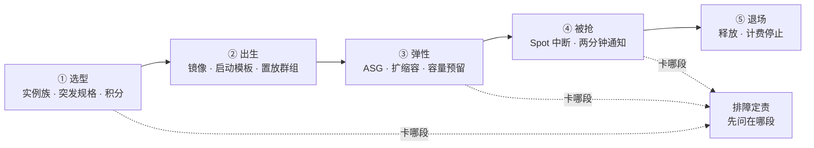
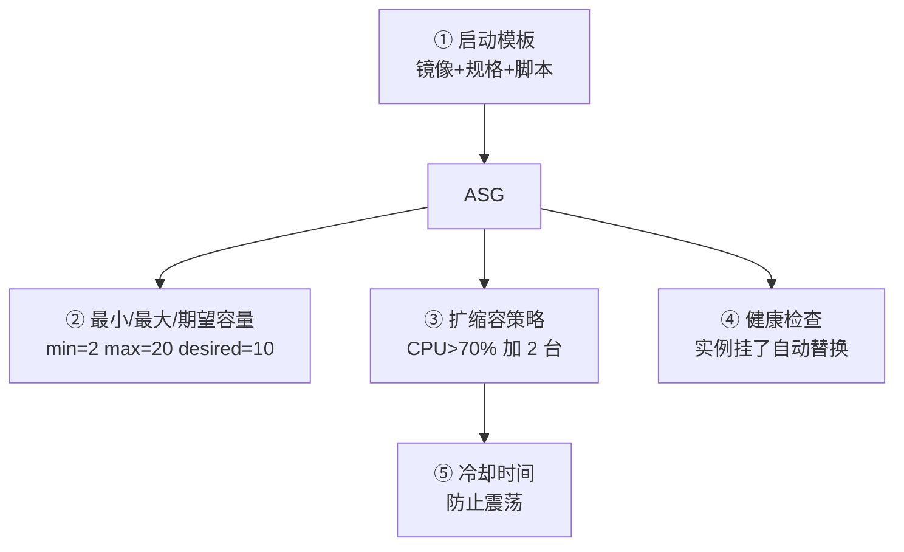
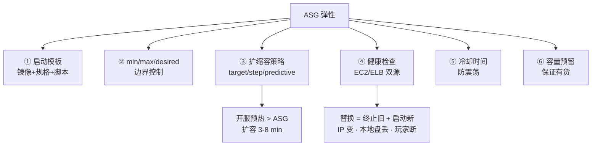
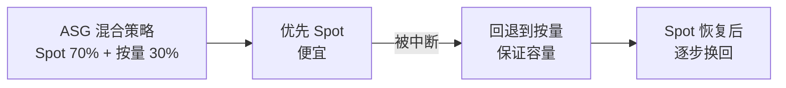
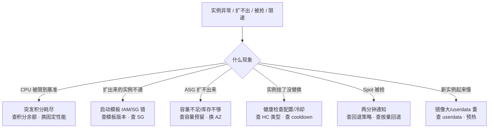

# 云上计算与弹性

> 大家好，欢迎来到这次分享。开讲之前，先带大家回到一个现场：
> 开服弹了 200 台，十分钟一半 CPU 积分耗尽变砖；活动期 Spot 被抢，战斗服没有回退策略直接掉了一片区。
> 这一章讲完，你会知道当时「再弹一批突发规格」和「战斗全上 Spot」各自错在哪，以及正确的选型与回退该怎么写。
> **本章回答的问题**：一台云实例从选型到退场的一生——选什么族、怎么生出来、怎么弹、怎么被抢、怎么退，每段什么会坏。
> **本章不讲**：VPC/子网/AZ/安全组 → [01](../01-云网络与安全/)；云盘/快照/对象存储/数据库 → [03](../03-云上存储与数据库/)；实例 IAM 角色/AK/多账号 → [04](../04-IAM与多账号/)；成本/账单/RI 深入选型 → [05](../05-成本治理/)；阿里 ECS/ACK 突发坑、AWS EC2/EKS/Spot Fleet、火山差异 → [06](../06-阿里云生产/) · [07](../07-AWS生产/) · [08](../08-火山引擎生产/)；多云对照 → [09](../09-多云对照/)。

**标记**：🎯重点 · 🔥难点 · ⭐常考 · 🔧实操

**怎么听这场分享**：先把第一节「一台云实例的一生」看熟——后面每一节都是这张图上的一段；第二到第六节顺着选型 → 出生 → 弹性 → 被抢 → 退场往下走；第七节专门讲开头那个现场怎么定责。每一节讲完会提示对应练习题，趁热打铁。

---

## 一、一张图：一台云实例的一生

> 🎯 **一句话**：实例像人一样有生老病死——选型、出生、弹性、被抢、退场，出了问题先问「它在哪一段」。



**读图**：

- 主线是一台实例的一生，五个阶段串成时间线，每节讲一段，排障时按这五段逐段问「卡在哪」。
- 选型段决定「这台机器是什么底子」——突发规格的积分耗尽会在开服高峰变砖；出生段决定「能不能快速复制」——启动模板配错导致扩出来的实例带不上正确配置。
- 弹性段是值班最常碰到的地方——ASG 扩不出来、健康检查反复摘流；被抢段是 Spot 实例的命；退场段管钱。
- 排障时先定位是哪个阶段的病，再对症下药——不要看到「实例异常」就重启或扩容，没有区分是选型问题、出生问题、弹性问题、还是被抢问题。


好，主图装进脑子了。接下来咱们从「选型」开始——这台机器到底该买哪一族。

本节对应练习题 Q1。

---

## 二、选型：实例族与突发规格 🎯⭐🔥

> 🎯 **一句话**：实例族（instance family）决定这台机器是干什么活的；突发规格（burstable）有积分攒/花机制，开服高峰积分耗尽就限到基准性能——不是 CPU 不够，是积分花光了。

大家先别急着背规格名。很多人以为「CPU 核数一样就能互相替」——⭐ 这是高频错答。🔥 大白话先钉死：**突发规格 = 平时省钱、忙时靠积分透支**；积分耗尽，CPU 会被硬限到基线，看起来像「机器变砖」。

### 实例族：x-large 不是越大越好 ⭐

**实例族（instance family）** = 云厂商按 CPU/内存/IO 比例分的大类，同一族内按大小分型号。阿里 ECS 的 `ecs.g6.xlarge`、AWS EC2 的 `m5.xlarge`——前缀是族，后缀是大小。

游戏常见选法：通用型（m/g/general，CPU:内存 ≈ 1:4）给网关/匹配/HTTP API；计算型（c/compute-optimized，1:2）给 CPU 密集的战斗服；内存型（r/memory-optimized，1:8）给缓存/数据库；高主频型（阿里 `g6e`/`c6e`、AWS `z1d`）给单核延迟敏感的战斗服。

选型的核心不是「越大越好」——网关吃的是连接数和 PPS，不是单核性能；战斗服要的是单核主频不是核数。选错族比选错大小贵得多。

```bash
# AWS: 查实例规格的 vCPU / 内存 / 网络性能
aws ec2 describe-instance-types --instance-types m5.xlarge c5.2xlarge r5.xlarge \
  --query 'InstanceTypes[].{Type:InstanceType,VCPU:VCpuInfo.DefaultVCpus,Mem:MemoryInfo.SizeInMiB,Net:NetworkInfo.NetworkPerformance}'
# [{"Type":"m5.xlarge","VCPU":4,"Mem":16384,"Net":"Up to 10 Gigabit"}     # ← 通用 1:4
#  {"Type":"c5.2xlarge","VCCPU":8,"Mem":16384,"Net":"Up to 10 Gigabit"}   # ← 计算 1:2
#  {"Type":"r5.xlarge","VCPU":4,"Mem":32768,"Net":"Up to 10 Gigabit"}]    # ← 内存 1:8
```

> 📝 **面试**：「网关选通用型 m/g（吃连接数和 PPS）、战斗服选计算型 c 或高主频型（要单核主频）、缓存/数据库选内存型 r；选错族比选错大小贵——先定族再定大小。」

### 突发规格与 CPU 积分 🔥

> 💡 **打个比方**：突发规格像手机电池——平时攒电（积分），高峰花电（突发到满 CPU）。电池见底就限到基准性能——相当于手机降频。你以为买了 4 核，实际基准只有 40%，开服高峰 4 核猛跑 5 分钟就降频。

**突发规格（burstable instance）** 是一种 CPU 性能可突发的实例，平时跑低于**基准性能（baseline performance）**时攒 **CPU 积分（CPU credits）/ 突发积分（burst credits）**，高峰时花积分突发到满核；积分归零后限到基准性能。AWS t-series、阿里 t 系列突发型、腾讯 T 系列都属于这类。

| 对比 | 突发规格 | 固定性能实例 |
|------|----------|-------------|
| CPU | 可突发，有积分机制 | 恒定，无积分 |
| 适合 | 低负载偶发突发 | 持续高负载 |
| 坑 | 积分耗尽限到基准 | 无此问题 |

基准性能不是「性能归零」——一台 4 vCPU 突发规格基准 20% 的话，积分耗尽后持续有 0.8 核的能力。开发测试够了，战斗服不够。游戏开服高峰是最容易耗尽积分的场景：平时低负载攒的积分在开服 10 分钟全花光，然后所有实例同时降频，CCU 还在涨但 CPU 被限到基准——像集体踩了刹车。

积分怎么攒怎么花：实例跑低于基准性能时，每分钟攒积分（攒的速率 = 基准 - 实际使用，用得越少攒越快）；跑高于基准时，每分钟花积分（花的速率 = 实际使用 - 基准，满核时花最快）。一台 4 vCPU 基准 20% 的突发规格，满核跑 5 分钟要花掉 4×5×(1-0.2) = 16 个 vCPU 分钟的积分。平时只跑 10% 的话，每分钟攒 (0.2-0.1)×4 = 0.4 vCPU 分钟——攒 16 分钟才够花 1 分钟满核。开服前低负载攒了几天的积分，开服高峰几分钟就花光。

> ⚠️ **别混**：突发规格积分耗尽 ≠ CPU 被云平台「没收」了。你买的就是「基准 + 可突发」，积分是额外额度的银行账户。积分花光是正常机制，不是故障——用突发规格跑持续高负载才是配置错误。

> 📝 **面试**：「突发规格靠 CPU 积分，平时攒高峰花；积分归零限到基准性能。生产战斗服/网关用突发规格是常见坑——开服高峰积分耗尽就限到基准。持续高负载用固定性能实例。」

### 裸金属与本地盘 🔧

**裸金属（bare metal）** = 直接访问物理机，没有虚拟化层。适用于高性能数据库（绕过虚拟化开销）、严格合规/Licensing（绑物理核/主板）、特殊硬件直通。代价是启动慢、弹性差——裸金属实例启动可能要 10-20 分钟，远慢于普通虚拟机 1-2 分钟。游戏场景较少使用裸金属，除非有特殊 Licensing 需求或自建数据库对虚拟化开销敏感。裸金属也不是「裸金属就一定快」——没有虚拟化开销确实少了一层，但如果不是 CPU/IO 密集型数据库这种对虚拟化开销敏感的场景，普通虚拟机的性能已经够用。

**本地盘（instance store / local disk / NVMe SSD）** = 实例所在物理机上的盘，**实例释放即丢**。与云盘（EBS/云盘）的持久性完全不同（→ [03](../03-云上存储与数据库/)）。用途：临时计算中间结果、低延迟缓存——**不放任何需要持久化的数据**。

本地盘的延迟比云盘低一个量级：本地 NVMe SSD 延迟在微秒级（μs），云盘（EBS/云盘）延迟在毫秒级（ms）。所以高性能数据库/缓存会用本地盘——但必须有持久化兜底：Redis 用本地盘做缓存层但数据持久化到云盘或对象存储；数据库用本地盘做临时表空间但主数据在云盘。

> 🔍 **现场**：ASG 用本地盘实例时要特别小心——扩容出来的新实例本地盘是空的，缩容终止的实例本地盘数据直接丢。有状态服不能直接放 ASG + 本地盘，必须先做数据迁移（生命周期钩子在终止前把数据搬到对象存储或新实例）。本地盘实例还有一个坑：实例停止后再启动，有些云平台（如 AWS）会换物理机导致本地盘数据丢失——stop ≠ 安全，本地盘数据随时可能没。

```bash
# AWS: 查实例的本地盘信息
aws ec2 describe-instance-types --instance-types i3.2xlarge \
  --query 'InstanceTypes[0].InstanceStorage' --output text
# Supported: True   # ← 有本地 NVMe；实例停止/释放即丢

# AWS: 查实例的 vCPU 和网络性能
aws ec2 describe-instance-types --instance-types c5.2xlarge \
  --query 'InstanceTypes[0].{VCCPU:VCpuInfo.DefaultVCpus,Net:NetworkInfo.NetworkPerformance}'
# {"VCCPU":8,"Net":"Up to 10 Gigabit"}   # ← 网络性能也和实例规格绑定
```

> ⚠️ **别混**：本地盘 ≠ 云盘。本地盘实例释放即丢，不做持久化；云盘可以独立挂载、跨实例存活。把 Redis/数据库数据放本地盘然后实例被 Spot 抢走——数据没了。持久化走云盘或对象存储（→ [03](../03-云上存储与数据库/)）。


好，到这儿咱们已经知道：突发规格有积分、生产战斗服不该赌积分。接下来自然会问——这台机器怎么生出来、镜像和启动模板钉什么？

本节对应练习题 Q1、Q2。

---

## 三、出生：镜像与启动模板 🎯⭐

> 🎯 **一句话**：镜像是实例的系统模板，启动模板（launch template）把镜像+规格+网络+脚本打包成可复用的出生配方；置放群组控制实例落哪台物理机。

### 镜像：实例的"基因" ⭐

**镜像（image / AMI / 自定义镜像）** = 包含 OS + 预装软件 + 配置的模板，新实例从镜像启动。镜像分官方镜像（公共 OS）、市场镜像（带软件许可）、自定义镜像（自己从一台配好的实例打的）。

游戏常见流程：先手动起一台基础实例 → 装运行时、监控 agent、游戏包 → 打自定义镜像 → 后续所有实例从镜像启动。**镜像里的游戏包版本是打镜像时锁死的**——更新版本要重新打镜像或靠启动脚本拉最新包。

镜像管理的最佳实践：**镜像分层**——底层 OS 镜像（官方维护）→ 中间层运行时镜像（公司统一，装好 agent/依赖）→ 顶层业务镜像（各项目自己打，含游戏包）。分层的好处是底层更新（如安全补丁）只需要重打底层+中间层，业务镜像不用变。**镜像不要太大**——镜像越大启动越慢，ASG 扩容时镜像拉取占了大头时间。精简镜像（去掉不必要的包、清理缓存）能显著缩短启动时间。**镜像版本管理**——给镜像打标签（如 `game-server-v2.3.1-20260901`），不要只留 latest，回滚时需要旧版本镜像。

> ⚠️ **别混**：镜像 ≠ 快照。镜像用于创建实例（含注册信息），快照是云盘的数据备份（→ [03](../03-云上存储与数据库/)）。从快照可以建云盘，但不能直接启动实例；从镜像可以启动实例。阿里云的「自定义镜像」和「快照」是两个入口，混了会找不到东西。另外，从快照可以创建镜像（快照 → 镜像 → 实例），但快照本身不能直接启动实例——中间多了「创建镜像」这一步。

> 🔍 **现场**：镜像过大是 ASG 扩容慢的常见根因。一个 50GB 的业务镜像，在 ASG 扩容时拉取就要 3-5 分钟；精简到 10GB 以内、用对象存储 + userdata 拉包代替全量镜像，启动时间能从 8 分钟压到 3 分钟以内。定期清理旧版本镜像——云平台对镜像数量和存储空间有配额限制，堆太多会碰到 `ResourceLimitExceeded`。镜像共享跨账号时要确认目标账号有权限使用（→ [04](../04-IAM与多账号/)），否则扩容时报 `Unauthorized`。

### 启动模板：出生配方 🔧

**启动模板（launch template）** = 把镜像 ID、实例规格、子网、安全组、IAM 角色、用户数据（userdata / 启动脚本）打包成一个版本化的模板。ASG 扩容时从模板启动新实例，不用手动指定每个参数。

```bash
# AWS: 查启动模板版本
aws ec2 describe-launch-templates --launch-template-ids lt-xxx \
  --query 'LaunchTemplates[0].LatestVersionNumber'
# 3   # ← 当前最新版本号；ASG 绑定模板可指定版本或 always latest
```

```text
启动模板包含：
  - 镜像 ID（AMI）
  - 实例规格（instance type）
  - 子网 + 安全组（→ 01）
  - IAM 实例角色（→ 04）
  - 用户数据脚本（userdata：装包/拉配置/注册发现）
  - 置放群组（可选）
  # ← 改一个参数就生成新版本；ASG 做滚动更新时换模板版本
```

生产坑：启动模板的 IAM 实例角色配错，扩出来的实例拉不了配置、注册不了发现——实例起来了但业务不通。角色和 AK 管理见 [04](../04-IAM与多账号/)。另一个常见坑：改了启动模板但 ASG 绑的是旧版本，扩出来的还是旧配置——做滚动更新时要确认 ASG 指向了新版本。

启动模板的版本管理是核心设计：每次改一个参数（换镜像、换规格、换 IAM 角色、改 userdata）都生成一个新版本号，旧版本不丢。ASG 可以绑特定版本也可以绑 `$Latest` 或 `$Default`。绑 `$Latest` 意味着每次扩容用最新版本——方便但不安全（改错了直接扩出坏实例）。生产推荐：改模板 → 手动用新版本扩一台验证 → 确认没问题后更新 ASG 指向新版本 → 做滚动更新替换旧实例。

```bash
# AWS: 用新版本做滚动更新（Instance Refresh）
aws autoscaling start-instance-refresh --auto-scaling-group-name my-asg \
  --strategy Rolling --preferences '{"MinHealthyPercentage":50,"InstanceWarmup":300}'
# ← 滚动替换：每次换一批，保持 50% 健康，新实例就绪 300s 后继续下一批
```

> ⚠️ **别混**：改了启动模板 ≠ ASG 立刻用新版本扩容。模板生成了新版本，但 ASG 还在用旧版本——要么手动更新 ASG 绑定版本，要么触发 Instance Refresh 做滚动替换。只改模板不触发替换。

### 置放群组：实例落哪台物理机 🔥

> 💡 **打个比方**：置放群组像指定座位——「挤一起」（同机架低延迟）或「分散坐」（不同机架防同架挂），策略决定实例在机房里的物理分布。

**置放群组（placement group）** = 控制一组实例在物理机架/网络上的分布策略。三种策略：**聚集（cluster）**——同机架，实例间延迟最低，适合低延迟战斗服集群内部通信，代价是单机架故障全挂；**分散（spread）**——不同机架，每台物理机最多一个实例，适合需要严格隔离的关键实例（如 master 节点）；**分区（partition）**——按大分区分散，每分区多实例，适合大数据/Hadoop，每分区独立故障域。

置放群组有容量限制：聚集策略受单机架物理资源限制，同一聚集组内的实例数量有上限（AWS 限制按实例规格算，一般十几台大规格就满了）；分散策略更受限（每台物理机只能放一台该组的实例，一个机架可能只有几台物理机）。所以置放群组不是「想放多少放多少」——大集群要分多个组或用分区策略。

> ⚠️ **别混**：置放群组的「聚集」和「多 AZ」是两个维度。聚集管同 AZ 内的物理分布（同机架 vs 不同机架），多 AZ 管跨机房。战斗服要低延迟用聚集置放群组 + 单 AZ；数据面要抗 AZ 故障用多 AZ——两者不能混为一谈（多 AZ 决策见 [01](../01-云网络与安全/)）。

> 📝 **面试**：「置放群组三种策略：聚集=同机架低延迟（战斗服内部）、分散=不同机架隔离（master 节点）、分区=大故障域（大数据）。聚集 ≠ 多 AZ，一个管同 AZ 内物理分布，一个管跨机房。聚集组有容量限制，大集群要分组或用分区策略。」


出生讲完。大家想想：活动要弹 200 台，靠人点控制台行不行？下一节讲伸缩组怎么弹、怎么缩。

本节对应练习题 Q3、Q4、Q14。

---

## 四、弹性：伸缩组与扩缩容 🎯⭐🔥

> 🎯 **一句话**：弹性伸缩组（ASG）按策略自动加减实例，冷却时间防抖；扩容不是秒级——镜像拉取、userdata 执行、健康检查通过要 3-8 分钟，开服弹性要提前预热。

### ASG 的四个部件

**弹性伸缩组（ASG / Auto Scaling Group / 弹性伸缩组）** = 自动管理实例数量的服务，由四部分组成：



**读图**：①启动模板定义实例怎么生；②min/max/desired 定义底线和上限；③策略定义什么时候加减；④健康检查定义什么算「坏了要换」；⑤冷却时间防止加减完立刻又加减。

ASG 不是只往大扩——min/max 是边界，策略在中间调 desired。扩容靠加实例、缩容靠终止实例。缩容时**选哪台终止**有策略（默认随机，可配 oldest/least-requests），有状态服要注意别把有玩家的实例缩掉了。缩容终止实例和手动 terminate 一样——本地盘数据丢、IP 变、玩家断。所以有状态服的 ASG 缩容要配终止保护（termination protection）或生命周期钩子，在终止前做数据迁移和玩家通知。

### 扩缩容策略 ⭐

常见三种：**目标追踪（target tracking）**——维持某个指标在目标值（如 CPU 维持 60%），简单最常用；**步进式（step scaling）**——分档加减（CPU 60-70% 加 1，70-80% 加 3），更精细；**预测式（predictive）**——基于历史负载预测提前扩，适合有明显规律的流量。

目标追踪的数学逻辑：ASG 比较实际指标和目标值，差距越大加/减越多。目标设 60% CPU，实际跑到 80%，ASG 按 `actual/target` 比例扩容——80/60 = 1.33，如果有 6 台就扩到 8 台把 CPU 压回 60%。比步进式简单——不用手动设分档阈值，给一个目标值就行。但目标追踪对指标抖动敏感——CPU 瞬间飙到 90% 又立刻回落，ASG 也会触发扩容然后立刻缩容（靠冷却时间防这个）。

> ⚠️ **别混**：目标追踪的目标值不是「上限」——是「维持点」。设 60% 不代表「超过 60% 就扩容」，而是「ASG 试图让平均值趋近 60%」。瞬间超 60% 不会立刻扩容（冷却时间内），持续超 60% 才扩。

游戏开服弹性：预热比 ASG 更重要——ASG 扩容要 3-8 分钟（镜像拉取 + userdata + 健康检查通过），开服瞬间涌入的玩家等不了。正确做法：**活动前手动把 desired 调高**（预热），活动后调回来。ASG 策略是「平时保底」不是「开服救火」。

ASG 还支持**生命周期钩子（lifecycle hook）**：实例启动前或终止前暂停一段时间，让你做自定义操作——比如启动前拉配置/注册发现、终止前做检查点/踢人通知。钩子不改变最终状态（实例最终还是会启动或终止），只是给你一个窗口做额外操作。有状态服的终止钩子特别重要：在实例被终止前通知玩家「服务器即将关闭」、保存 Session 数据、等待玩家迁移到其他实例。生命周期钩子配合终止保护是一套完整的有状态服缩容方案：钩子暂停 → 通知玩家 → 等待迁移完成 → 解除保护 → ASG 终止。

```bash
# AWS: ASG 扩容活动记录——看每步花了多久
aws autoscaling describe-scaling-activities --auto-scaling-group-names my-asg \
  --query 'Activities[0].{Cause:Cause,Start:StartTime,Status:StatusCode}'
# {"Cause":"... CPU > 70%","Start":"...","Status":"Successful"}  # ← 触发原因和状态

# AWS: ASG 生命周期钩子（终止前暂停做迁移）
aws autoscaling put-lifecycle-hook --auto-scaling-group-name my-asg \
  --lifecycle-hook-name game-terminate-hook --lifecycle-transition autoscaling:EC2_INSTANCE_TERMINATING \
  --heartbeat-timeout 300    # ← 终止前暂停 300s 做迁移和通知
```

### 冷却时间 ⭐

> 🎯 **一句话**：冷却时间（cooldown）是 ASG 在一次扩缩容操作后等待一段时间再触发下一次，防止指标未稳定时反复加减。

冷却时间默认 300 秒。太短：扩容后 CPU 还没降下来又触发扩容，多扩了一堆；太长：缩容太慢，多花成本。游戏开服高峰前设长或暂时关掉——开服 10 分钟内需要的不是自动弹性，是预热好的实例。冷却时间只管扩缩容策略触发的间隔，不管健康检查——健康检查按自己的间隔跑（通常 10-30 秒），不受冷却时间影响。

> 🔍 **现场**：ASG 活动记录里如果看到短时间内连续多次扩容（`Launching... Launching... Launching...`），且每次只加了 1-2 台——是冷却时间太短导致震荡。调长冷却时间让指标稳定后再判断。

> ⚠️ **别混**：冷却时间 ≠ 健康检查间隔。冷却管「两次扩缩容之间的间隔」，健康检查管「多久查一次实例是否存活」——两个完全不同的时间。

### 健康检查与实例自动恢复 🔧⭐

ASG 的**健康检查（health check）** 有两种来源：**EC2 健康检查**——云平台层面，实例状态为 stopped/terminated/不健康时 ASG 替换它；**ELB 健康检查**——负载均衡器层，HTTP/TCP 探测失败也触发替换，更精细。两者可叠加——ELB 检查到不健康也触发 ASG 替换，不只看 EC2 状态。

```bash
# AWS: ASG 实例健康状态
aws autoscaling describe-auto-scaling-groups --auto-scaling-group-names my-asg \
  --query 'AutoScalingGroups[0].Instances[].{ID:InstanceId,Health:HealthStatus,Lifecycle:LifecycleState}'
# [{"ID":"i-aaa","Health":"Healthy","Lifecycle":"InService"}      # ← 正常
#  {"ID":"i-bbb","Health":"Unhealthy","Lifecycle":"Terminating"}]  # ← 被替换中
```

ASG 检测到实例不健康会**终止旧实例 + 启动新实例替换**，不是重启旧实例。替换 = 一台新的，IP 变了、本地盘数据没了、原来上面的玩家断了。健康检查的宽限期（grace period）也要注意：新实例启动后需要一段时间才被纳入健康检查——如果宽限期太短，实例还没跑起来就被标记 Unhealthy 反复替换，形成循环。生产建议宽限期 ≥ userdata 执行时间 + 应用启动时间。

**实例自动恢复（auto recovery / instance recovery）** ≠ ASG 替换。有些云平台提供更轻量的恢复：实例宿主机硬件故障时，自动在同一 AZ 恢复一台相同配置的实例，保留 EIP 和云盘。这是平台层恢复，比 ASG 替换轻——但不保本地盘数据。自动恢复由云平台检测底层硬件故障触发，你不需要配置——但要知道它的限制：只恢复硬件故障，不恢复软件层故障（进程崩溃不触发自动恢复，要靠 ASG 健康检查或进程管理工具）。

> ⚠️ **别混**：ASG 健康检查替换 ≠ 实例自动恢复。ASG 替换是「终止旧 + 启动新」（新 IP、新实例），自动恢复是「同配置同 EIP 恢复」（硬件故障专用）。有状态服被 ASG 替换 = 玩家断了、IP 变了；自动恢复 = 短暂中断后 IP 和云盘还在。战斗服用 ASG 要谨慎——战斗服有状态，替换会踢人。

### 容量预留 ⭐🔥

> 💡 **打个比方**：容量预留像酒店订房——你先锁定一批机器，用不到也付空房费。好处是开服时一定有货，不会碰到「云平台资源不足」开不出来。

**容量预留（capacity reservation）/ 预留实例券** = 预先在特定 AZ 锁定一批计算资源，确保需要时一定能启动实例，不受库存限制。两种形态要分清：**容量预留** 是显式锁一组物理资源，确保扩容时有货；**预留实例券（Reserved Instance / RI）** 是承诺使用时长换折扣，同时隐式预留容量——这是计费优惠 + 容量锁定的组合（计费深入见 [05](../05-成本治理/)）。

容量预留的关键属性：**绑定 AZ**——预留的容量只在指定 AZ 有效，不能跨 AZ 使用；**绑定实例规格**——预留的容量对应特定实例规格，不能混用；**显式 vs 隐式**——容量预留是显式锁定（你锁了就一定有，不管你开不开），RI 是隐式预留（开了实例才匹配折扣）。所以开服前要预热的实例，应该用显式容量预留保证一定有货，而不是指望 RI 的隐式预留。

容量预留什么时候该买？**开服前**——预热实例要保证有货，容量预留 + ASG 配合让开服一定扩得出来；**大活动前**——活动期弹性扩容要保证资源，提前 24 小时做容量预留；**长期稳定底座**——长期运行的实例可以配容量预留 + RI 组合（RI 管折扣，容量预留管保证有货）。不买的场景：短期测试（按量就行，库存不足就等或换 AZ）、灵活规格（规格会变的不适合锁规格）。

> 🔍 **现场**：开服前检查容量预留是否充足——ASG 活动记录里如果出现 `InsufficientInstanceCapacity` 说明该 AZ 该规格库存不足，需要加容量预留或换 AZ/规格。不要等开服当天才发现扩不出——提前做容量预留并在预压时验证。

> ⚠️ **别混**：容量预留 ≠ ASG。容量预留保证「有资源可以用」，ASG 保证「按策略加减实例」。可以 ASG 配容量预留——ASG 扩容时有预留一定从预留启动、没预留才去现货池抢。开服前预热 + 容量预留是游戏弹性的标准组合。

### 收束：ASG 凭什么「弹对」又不「弹飞」

把本节散机制收成一张可背清单——ASG 弹性就这六件套：



**读图（分组）**：①②是 ASG 的配置骨架（模板 + 容量边界）——模板定义实例怎么生，min/max/desired 定义底线和上限，改 desired 是最快的扩缩容操作；③是决策逻辑（策略）——目标追踪最常用、步进式更精细、预测式提前扩，策略选错会导致扩容不及时或震荡；④⑤是运行时控制（健康检查 + 冷却）——健康检查管「什么算坏了要换」、冷却管「两次操作之间等多久」，两个时间不要搞混；⑥是资源保障（预留）——ASG + 容量预留 = 开服一定扩得出来。核心边界：ASG 替换不是恢复——有状态服要小心；开服弹性靠预热不靠 ASG 自动扩。

> ⚠️ **别混**：ASG 的这套机制**保证**「实例数量趋近 desired」和「不健康实例被替换」，**不保证**「扩容是秒级」（镜像 + userdata + 健康检查要 3-8 min）、**不保证**「替换保留 IP/数据」（新实例新 IP、本地盘数据丢）、**不保证**「有资源一定能扩出来」（没容量预留可能碰到库存不足）、**不保证**「缩容不踢人」（有状态服被缩容终止 = 玩家断了）。

> 📝 **面试**（记忆分组法）：ASG 六件套——**模板定义怎么生，min/max 定边界，策略管加减，健康检查管替换，冷却防震荡，预留保有货**；再加一条**开服预热 > ASG 自动扩**（扩容要 3-8 min）；有状态服用 ASG 要谨慎（替换 = 新 IP + 踢人）；缩容终止有状态服要做数据迁移和玩家通知，配终止保护或生命周期钩子。


弹性讲完。⭐ 高频错答来了：战斗服能不能全上 Spot「省 70%」？下一节把「被抢」讲透。

本节对应练习题 Q5、Q6、Q7、Q8。

---

## 五、被抢：Spot 中断与回退 🎯⭐🔥

> 🎯 **一句话**：Spot 实例（竞价实例 / 抢占式实例）是云平台的闲置资源，价格便宜但会被回收——收到两分钟中断通知后必须优雅退出，靠竞价实例回退保证服务不中断。

大家想想：Spot 便宜 70%，战斗服全上 Spot 行不行？很多人会答「省钱当然上」——错了。先问一句：被抢的两分钟，房间里的玩家往哪搬？

### Spot 实例：便宜但有"租约"

**Spot 实例（Spot instance）/ 抢占式实例（preemptible instance）** = 利用云平台闲置算力的实例，价格比按量低 60-90%。代价：云平台需要回收资源时可随时**中断（Spot 中断 / preemption）**，给**两分钟中断通知（two-minute interruption warning）** 后回收。阿里云叫「抢占式实例」，AWS 叫「Spot Instance」，GCP 叫「Preemptible VM」——机制类似，通知时长不同（AWS 2 分钟，GCP 30 秒，阿里 2-5 分钟看实例类型）。

> 💡 **打个比方**：Spot 像拼车——车空着你就坐，车主来要车了你两分钟内下车。便宜但不能保证一直坐到目的地。

| 对比 | Spot 实例 | 按量付费 |
|------|----------|----------|
| 价格 | 低 60-90% | 标准 |
| 可用性 | 随时可能被中断 | 不中断 |
| 适合 | 无状态 / 可中断任务 | 生产关键服务 |

Spot 适合：CI/CD 构建节点、批处理、大数据 Spark/EMR、开发测试环境、无状态 Web 后端（配合回退）。**Spot 不适合**：战斗服、数据库、有状态缓存、任何不能中断的生产服务。

Spot 实例和按量实例在**硬件层面没有区别**——同样的物理机、同样的规格、同样的性能。区别只在「租约」：按量你独占到释放，Spot 云平台随时可回收。所以 Spot 不是「性能打折版」，是「可用性打折版」——便宜但随时可能被收走。有些云平台还提供 **Spot Block**（竞价实例块）——承诺在 1-6 小时内不被回收，适合有明确时长的批处理任务。但 Spot Block 不是所有区域都支持，且超过承诺时长后仍可能被回收。

### 两分钟中断通知 🔧

云平台通过**实例元数据（metadata）**和 EventBridge / 实例元数据服务推送中断通知。应用必须轮询或订阅，收到后在两分钟内完成优雅退出：

```bash
# AWS: 轮询 Spot 中断通知（实例元数据）
TOKEN=$(curl -s -X PUT "http://169.254.169.254/latest/api/token" -H "X-aws-ec2-metadata-token-ttl-seconds:21600")
curl -s -H "X-aws-ec2-metadata-token: $TOKEN" "http://169.254.169.254/latest/meta-data/spot/instance-action"
# {"action":"terminate","time":"2026-09-01T14:30:00Z"}   # ← 两分钟内将被回收
# ← 收到后：停止接新请求 → 通知发现下线 → 等 in-flight 处理 → 退出
```

两分钟够不够取决于业务：HTTP 短连接够；游戏长连接/大数据任务要靠检查点 + 续传。**Spot 实例永远不该跑不能中断的生产业务**——战斗服、数据库、有状态缓存都不行。

Spot 最佳实践：**多规格多 AZ 分散**——不要只选一种实例规格和一个 AZ，多选几种等价规格（如 m5.xlarge + m5a.xlarge + c5.2xlarge），某个规格缺库存就自动用另一个；**设最高出价**——设高于按量的出价等于「宁可按量也不要 Spot 被抢」，设低于按量的出价等于「被抢就用按量回退」；**应用层做幂等**——Spot 被回收后重新调度到新实例，如果上次跑了一半没做完要能续传而不是重头来；**监控 Spot 中断频率**——某个 AZ/规格频繁被抢说明该区域资源紧张，考虑换区域或增加按量比例。

> ⚠️ **别混**：Spot 性能 ≠ 按量性能打折。Spot 和按量在硬件层面一样——同样的物理机、同样的规格、同样的性能。Spot 便宜是因为可用性打折（随时被回收），不是性能打折。混了会以为「Spot 性能差不能跑重任务」——实际上跑起来一样快，只是可能跑到一半被收走。

### 竞价实例回退 ⭐

**竞价实例回退（Spot fallback / Spot 替换回退）** = ASG 配置 Spot + 按量混合策略：优先用 Spot，Spot 被中断时自动回退到按量实例，保证容量不丢。



**读图**：ASG 混合策略不是「Spot 挂了就少几台」——是「Spot 挂了自动补按量，容量不降」。Spot 恢复后再把按量换回 Spot 省钱。但按量比 Spot 贵，回退期间成本会跳——预算和回退策略见 [05](../05-成本治理/)。

ASG 混合策略的配比不是随便填的：**按量基座**保证最低容量永不被抢（比如 min=2 按量做底座），**Spot 弹性**在上面叠便宜容量（desired=10 中 8 台 Spot + 2 台按量）。Spot 被抢时 ASG 先尝试补 Spot，补不到就用按量——保证 desired 不降。配比要根据「能容忍多少按量成本」和「Spot 中断频率」来定：Spot 中断频繁的区域多配按量做底座，中断少的区域多配 Spot 省钱。

回退触发流程：Spot 实例收到两分钟中断通知 → ASG 收到 Spot 中断事件 → 标记该实例为待终止 → 尝试用 Spot 补充（如果库存有） → 补不到就用按量实例替代 → 旧 Spot 实例在通知时间后被回收。整个过程中 desired 数量不变——一台被回收就补一台。如果多台 Spot 同时被回收（常见于 Spot 价格突然上涨时），ASG 会批量补按量——成本会瞬间跳高，所以 Spot 比例不是越高越好，要留够按量底座。

**Spot Fleet**（AWS 专用）是比 ASG 混合策略更精细的 Spot 管理服务：可以跨多种实例规格和 AZ 自动寻找最便宜的 Spot 容量，避免单一规格/单 AZ 库存不足时扩不出来。阿里云有类似的「竞价实例」+「多规格」配置。核心思路相同：不要只依赖一种实例规格和一个 AZ 的 Spot——规格和 AZ 越分散，中断概率越低。

> ⚠️ **别混**：Spot 中断 ≠ 实例故障。中断是云平台**主动回收**（需要资源给别的高优客户），不是你的实例坏了——所以 ASG 健康检查不会标记 Unhealthy，是 Spot 中断通知触发的替换。混了会以为「健康检查为什么没发现」——它发现的是另一件事。ASG 对 Spot 中断的处理和健康检查替换是两条独立路径：Spot 中断走「收到通知 → 终止 → 回退到按量」，健康检查走「检测不健康 → 终止 → 启动新实例」。

> 📝 **面试**：「Spot 实例便宜但随时被回收，两分钟中断通知；生产用 Spot 必须配竞价实例回退（ASG Spot + 按量混合），保证容量不降；Spot 不跑有状态服——战斗服/数据库/缓存都不行。」


记住口诀：**无状态可 Spot，有状态必须有 On-Demand 兜底**。下一节看退场——钱怎么结、实例怎么放。

本节对应练习题 Q9、Q10。

---

## 六、退场：计费模型与释放 🎯⭐

> 🎯 **一句话**：实例释放后按量计费立刻停止，包年包月到期前不退；RI 和 Savings Plan 是折扣承诺不是实例——买了折扣仍然要自己开实例。

### 四种计费模型

**按量付费（on-demand / 按量）**：秒级或小时级计费，实例释放即停止计费。ASG 弹性扩出来的实例默认按量。最灵活也最贵。适合短期突发、开发测试、ASG 弹性补充。按量是所有计费模型的「默认值」——不主动选就是按量，临时扩容的实例就是按量，ASG 弹性补充的也是按量。要省钱就要主动从按量切到包年包月/RI/Savings Plan。

**包年包月（subscription / 包年包月）**：预付一口价买固定期限（1-3 年），到期前释放也不退。适合长期稳定负载——网关、逻辑服底座。比按量便宜 30-50%。包年包月的实例到期后自动转成按量（或释放，看配置），不主动续费会从省钱变烧钱。

> ⚠️ **别混**：包年包月实例「释放」≠「退费」。到期前计费不退，你释放了也不省钱——所以临时不用宁可 stop 不要 terminate（保留计费已付的实例，到期再释放）。ASG 缩容终止按量实例 = 立刻停计费；终止包年包月 = 不退费。

**预留实例（Reserved Instance / RI）**：承诺 1-3 年使用换折扣（最高 72% off），锁定实例族/AZ/数量。**RI 是计费折扣不是具体实例**——你仍然要自己 `run-instances` 启动实例，RI 自动匹配折扣。买了 RI 不开实例 = 白付承诺费。

**Savings Plan**：承诺每小时消费额度换折扣，**不锁实例族和区域**，比 RI 灵活。适合实例族/区域会变的场景。和 RI 一样是折扣承诺——不是已开好的实例。

> ⚠️ **别混**：RI / Savings Plan ≠ 已开好的实例。RI 是「你承诺用，云平台给你折扣」，仍然要自己启动实例才能匹配折扣。RI 和 Savings Plan 的深入选型和优化在 [05](../05-成本治理/)。

什么时候用哪种模型？判断思路：**短期突发/弹性补充**用按量（ASG 扩出来的默认按量，灵活但贵）；**长期稳定底座**用包年包月（网关/逻辑服底座，锁期限比按量便宜 30-50%）；**已知规格不会变**用 RI（承诺 1-3 年最高 72% off）；**规格会变但要控制成本**用 Savings Plan（承诺消费额度不锁实例族）。混合使用是常态：底座用包年包月/RI，弹性补充用按量，非关键任务用 Spot。

一个常见误区是「全买 RI 最省钱」——RI 锁实例族和 AZ，如果后续规格升级或迁移到新 AZ，RI 就浪费了。Savings Plan 更灵活但也需要承诺——承诺金额太高用不完就是浪费，太低折扣不够。RI 和 Savings Plan 的选型和优化需要持续监控和调整，深入在 [05](../05-成本治理/)。

> 📝 **面试**：「按量最灵活最贵给弹性补充；包年包月锁期限给底座；RI 锁实例族最高折扣；Savings Plan 不锁族更灵活；混合使用是常态——底座包年/RI、弹性按量、非关键 Spot。RI 和 Savings Plan 的选型要看负载稳定性：稳定的选 RI（折扣更深），会变的选 Savings Plan（更灵活）。」

> 💡 **打个比方**：计费模型像买手机套餐——按量是「用多少付多少」最灵活但单价最高；包年包月是「签两年合约送手机」一口价不能退；RI 是「承诺用两年打 7 折」但仍然要自己打电话才算数；Savings Plan 是「承诺每月消费 100 块打 8 折」不限定打给谁。

### 释放：计费什么时候停 🔧

实例**停止（stop）** ≠ **释放（terminate）**：

- **停止**：实例关机但还在，云盘保留、EIP 保留、按量计费可能减到只算 EIP/云盘费（各厂不同）。
- **释放（terminate）**：实例彻底删除，按量计费停止、EIP 释放（除非显式保留）、本地盘数据丢失。

停止实例后要注意：按量实例停止后大部分云平台不再收实例计算费（只收 EIP/云盘费），但有些平台（如阿里 ECS 按量）停止后仍可能收部分费用——各厂不同要看文档。包年包月停止不省钱（已经预付了）。本地盘实例停止后数据是否保留也因平台而异：AWS 实例 store stop 后数据丢，阿里本地盘实例停止后数据保留（但释放后丢）。

> 🔍 **现场**：临时不用实例的正确操作——先 stop 再确认 EIP/云盘是否还在计费。按量实例 stop 后只收 EIP/云盘费，但如果留了 EIP 没释放，EIP 持续计费——空 EIP 也要钱。包年包月实例 stop 不省钱（已预付），到期再释放。

```bash
# AWS: 停止 vs 释放
aws ec2 stop-instances --instance-ids i-xxx       # ← 停止：云盘保留、可重启
aws ec2 terminate-instances --instance-ids i-xxx  # ← 释放：彻底删除、计费停止

# AWS: 查实例状态——stopped 不收计算费（但 EIP/云盘继续）
aws ec2 describe-instances --instance-ids i-xxx \
  --query 'Reservations[0].Instances[0].State.Name'
# "stopped"   # ← 停止状态，按量计费减到只算 EIP/云盘
```

> 📝 **面试**：「按量释放即停计费，包年包月到期前不退；RI/Savings Plan 是折扣承诺不是实例，买了仍然要自己开实例匹配折扣；停止保留云盘/EIP，释放彻底删除。」


退场讲完，咱们回到开头那个现场——积分耗尽变砖、Spot 被抢掉区。60 秒怎么定责。

本节对应练习题 Q11、Q12。

---

## 七、作战：定责 🎯⭐🔧

> 🎯 **一句话**：实例层面的问题先分清是「选型错了」还是「出生配错了」还是「弹性没弹对」——不要上来就重启。



**读图**：第一刀问「什么现象」——六条支线分别指向选型/出生/弹性/被抢的不同问题。每条写真实现象不写抽象类别——「CPU 被限到基准」直接指向突发积分，「扩出来不通」直接指向启动模板。排障时不要跳过第一刀直接改配置——先定位是哪个阶段的病，再对症下药。常见错误是看到「实例异常」就重启或扩容，没有区分是选型问题（突发规格积分耗尽）、出生问题（启动模板配错）、弹性问题（容量不足/健康检查没触发）、还是被抢问题（Spot 回收）。

### 现象 · 先做 · 别做

| 现象 | 先做 | 别做 |
|------|------|------|
| CPU 限到基准、开服变卡 | 查突发积分余额 → 换固定性能 | 加实例数量假装够 |
| 扩出来的实例拉不了配置 | 查启动模板 IAM 角色 + SG | 重启实例 |
| ASG 扩不出实例 | 查容量预留/AZ 库存 → 换 AZ | 调扩缩容策略参数 |
| 实例挂了 ASG 没替换 | 查健康检查类型 + cooldown | 手动起一台顶着 |
| Spot 被抢掉了一片 | 查竞价回退策略 → 确认按量回退 | 全改按量（成本翻倍） |
| 新实例起来要 8 分钟 | 查镜像大小 + userdata → 预热 | 缩短健康检查间隔 |

### 60 秒剧本 🔧

```text
0-10s   查 ASG 活动/实例状态          # ← 是扩不出/替换中/被抢？
10-30s  查实例 CPU 积分（突发规格）    # ← 积分归零 = 限到基准
30-45s  查启动模板版本 + IAM 角色      # ← 扩出来的通不通看模板
45-60s  查 Spot 中断通知 + 容量预留    # ← 被抢/扩不出看预留和库存
# ← 60 秒内不手动起实例顶着、不重启业务、不改 ASG 策略
```

60 秒剧本的核心原则：**先收集信息再动手**。前 60 秒只看不改——看 ASG 活动记录是什么状态、看实例 CPU 积分是不是归零了、看启动模板是不是最新版本、看 Spot 中断通知有没有触发。不手动起实例是因为手动起的可能带不上正确启动模板配置（IAM/SG/userdata 全靠模板）；不重启业务是因为长连接可能还活着，重启会主动踢在线玩家放大事故面；不改 ASG 策略是因为在定位清楚前改策略可能引发连锁扩缩容，让现场更乱。

一个常见的实战场景：开服期同时报「CPU 突然降了」和「ASG 扩不出实例」。0-10s 查 ASG 活动记录——看到扩容失败 `InsufficientInstanceCapacity`（容量不足）；10-30s 查 CPU 积分——突发规格积分归零限到基准；30-45s 查启动模板——版本没问题；45-60s 查容量预留——该 AZ 该规格库存不足。结论：两个病——选型错了（突发规格不适合生产）+ 容量不足（没做容量预留）。止血：换 AZ 扩容（有库存的 AZ）、换固定性能规格（不再用突发规格）、加容量预留（下次开服前准备好）。

另一个常见场景：活动结束 ASG 缩容，有状态战斗服被终止导致在线玩家集体掉线。0-10s 查 ASG 活动——看到 `Terminating instance i-xxx`（缩容终止）；10-30s 查被终止的实例——确认是有状态服、上面还有玩家；30-45s 查缩容策略——是默认随机终止没区分有状态/无状态。结论：缩容策略没有保护有状态实例。止血：立刻手动调高 desired 暂停缩容、踢掉的玩家重连到剩余实例。根因：有状态服不应放在默认缩容策略里，要用实例保护（instance protection）或生命周期钩子（lifecycle hook）在缩容前做迁移。

> 📝 **面试**：「实例问题先分类：CPU 被限查突发积分、扩不出查容量预留/AZ 库存、扩出来不通查启动模板 IAM、Spot 被抢查回退策略——不手动起实例顶着（可能带不上正确配置）。」


现在再看群里那句「再弹一批突发」和「战斗全上 Spot」，你知道该怎么拦住他了。收口把命令、面试口径和数字墙收齐。

本节对应练习题 Q13。

---

## 八、收口

### 命令速查 🔧

```bash
# AWS: 突发积分余额
aws ec2 describe-instances --query 'Reservations[].Instances[].{ID:InstanceId,Credit:CpuCredits}'
# ← 积分归零 = 限到基准性能

# AWS: ASG 活动记录
aws autoscaling describe-scaling-activities --auto-scaling-group-names my-asg
# Activity: "Launching a new instance... i-xxx" / "Terminating... Spot interruption"

# AWS: Spot 中断通知（实例元数据，在实例内执行）
TOKEN=$(curl -s -X PUT "http://169.254.169.254/latest/api/token" -H "X-aws-ec2-metadata-token-ttl-seconds:21600")
curl -s -H "X-aws-ec2-metadata-token: $TOKEN" "http://169.254.169.254/latest/meta-data/spot/instance-action"
# {"action":"terminate","time":"..."}   # ← 两分钟内回收

# AWS: ASG 健康检查
aws autoscaling describe-auto-scaling-groups --auto-scaling-group-names my-asg \
  --query 'AutoScalingGroups[0].Instances[].{ID:InstanceId,Health:HealthStatus}'
# [{"ID":"i-aaa","Health":"Healthy"} {"ID":"i-bbb","Health":"Unhealthy"}]  # ← 后者被替换中

# AWS: 实例状态
aws ec2 describe-instance-status --instance-ids i-xxx
# InstanceStatus: ok/impaired   # ← 硬件层 vs 系统层

# AWS: 启动模板版本
aws ec2 describe-launch-templates --launch-template-ids lt-xxx \
  --query 'LaunchTemplates[0].{Latest:LatestVersionNumber,Default:DefaultVersionNumber}'
# {"Latest":3,"Default":2}   # ← ASG 绑的是 Default 还是 Latest？

# AWS: 手动调 desired 预热
aws autoscaling update-auto-scaling-group --auto-scaling-group-names my-asg --desired-capacity 10
# ← 活动前调高预热，活动后调回来
```

### 面试锚点表

遮住右列自问自答，卡壳的行回去重读对应小节——能讲出来才算会，看着答案点头不算。

| 问 | 30 秒答 |
|----|---------|
| 实例族怎么选？ | 通用 m/g 做网关、计算 c 做战斗服、内存 r 做缓存；选错族比选错大小贵 |
| 突发规格什么坑？ | 积分耗尽限到基准性能；开发够、生产战斗服/网关不行；开服高峰最容易耗尽 |
| 镜像 vs 快照？ | 镜像用于启动实例，快照是云盘备份（→03）；镜像锁版本，更新要重打 |
| 启动模板管什么？ | 镜像+规格+子网+SG+IAM+userdata 打包，ASG 从模板启动；改参数生新版本 |
| 置放群组？ | 控制物理分布：聚集=同机架低延迟、分散=不同机架隔离、分区=大故障域 |
| ASG 扩容多久？ | 3-8 min（镜像+userdata+健康检查），开服靠预热不靠自动扩 |
| 冷却时间？ | 一次扩缩容后等 N 秒再触发下一次，防震荡；≠ 健康检查间隔 |
| ASG 替换 ≠ 恢复？ | 替换=终止旧+启动新（新IP/本地盘丢），恢复=同配置同EIP恢复（硬件故障） |
| 容量预留？ | 预锁资源保证有货，ASG+容量预留=开服一定扩得出来；≠ RI（折扣承诺） |
| Spot 中断？ | 两分钟通知后回收；必须配竞价回退（Spot+按量混合）保证容量；不跑有状态服 |
| 计费模型？ | 按量最灵活最贵、包年包月锁期限、RI/Savings Plan 是折扣承诺不是实例 |
| 停止 vs 释放？ | 停止=关机保留云盘、释放=删除停止计费、包年包月释放不退费 |
| 本地盘？ | 实例释放即丢，不放持久化数据；云盘跨实例存活（→03） |
| 裸金属？ | 直接访问物理机无虚拟化层，高性能数据库/合规/Licensing |
| 目标追踪目标值是什么？ | 维持点不是上限——ASG 让平均值趋近目标值，瞬间超不立刻扩 |
| ASG 缩容终止有状态服？ | 和手动 terminate 一样，玩家断、IP 变；配终止保护或钩子做迁移 |
| Spot 和按量性能一样吗？ | 硬件一样，可用性打折不是性能打折 |
| 竞价回退配比怎么定？ | 按量做底座保最低容量，Spot 叠便宜弹性；中断多的区域多配按量 |

### 易错一句话对照

- `突发规格买了 4 核就有 4 核` → **错**：基准可能只有 40%，积分耗尽限到基准
- `积分耗尽是云平台没收了` → **错**：积分花光是正常机制，跑持续高负载才是配置错误
- `镜像和快照一回事` → **错**：镜像启动实例，快照备份云盘（→03）
- `启动模板改了立刻生效` → **错**：生成新版本，ASG 要滚动更新才换版本
- `置放群组聚集 = 多 AZ` → **错**：聚集管同 AZ 内物理分布，多 AZ 管跨机房
- `ASG 扩容是秒级` → **错**：镜像+userdata+健康检查 3-8 min，开服要预热
- `ASG 替换 = 恢复旧实例` → **错**：替换=新实例新 IP、本地盘丢、玩家断；恢复=同 EIP 恢复
- `冷却时间 = 健康检查间隔` → **错**：冷却管两次扩缩容间隔，健康检查管实例存活
- `容量预留 = RI` → **错**：预留保证有货，RI 是折扣承诺
- `Spot 中断 = 实例故障` → **错**：中断是主动回收，健康检查不会标记 Unhealthy
- `Spot 适合所有业务` → **错**：有状态服/数据库/缓存都不行，Spot 只跑可中断任务
- `RI = 已开好的实例` → **错**：RI 是折扣承诺，仍要自己 run-instances
- `包年包月释放就退费` → **错**：到期前不退，临时不用 stop 不 terminate
- `本地盘和云盘一样` → **错**：本地盘实例释放即丢，云盘跨实例存活
- `ASG 缩容不会踢人` → **错**：缩容终止实例和手动 terminate 一样，有状态服玩家会断
- `目标追踪目标值是上限` → **错**：是维持点不是上限，瞬间超不立刻扩（冷却内）
- `Spot 性能打折` → **错**：Spot 和按量硬件一样，可用性打折不是性能打折
- `自动恢复管软件故障` → **错**：自动恢复只管宿主机硬件故障，进程崩溃要靠 ASG 或进程管理

### 数字墙

```text
Spot 折扣           按量低 60-90%    RI 折扣         最高 72% off
ASG 扩容耗时         3-8 min          冷却默认         300s
Spot 中断通知        2 min            突发积分归零     限到基准性能
本地盘               实例释放即丢     ASG 替换         新实例新 IP
裸金属启动           10-20 min        包年包月折扣      30-50% off
本地盘延迟           微秒(us)         云盘延迟         毫秒(ms)
生命周期钩子超时     300s             健康检查间隔      10-30s
```

> 📝 **面试**（数字速记）：Spot 便宜 60-90% 通知 2 分钟；ASG 扩容 3-8 分钟冷却默认 300 秒；RI 最高省 72% 包年省 30-50%；本地盘释放即丢延迟微秒云盘毫秒。

---

## 合上书

学到这里，先别急着翻下一章。合上书，试试下面这几件事能不能做到——能做到，这章才算真的听懂了。卡住的那一条，就回到对应的小节再听一遍：

- [ ] **默画**一台云实例的一生（选型→出生→弹性→被抢→退场），标出每段管什么、出问题先问哪段（Q1）。
- [ ] 实例族怎么选？突发规格的积分机制是什么？为什么开服高峰会「变砖」？基准性能是什么意思？（Q1、Q2）
- [ ] 镜像和快照有什么区别？启动模板包含哪些参数？改了模板怎么让 ASG 生效？（Q3、Q4、Q14）
- [ ] **默画** ASG 六件套（模板/min-max/策略/健康检查/冷却/预留），标出扩容为什么不秒级、ASG 替换和实例恢复的区别（Q5、Q6、Q7、Q8）。
- [ ] 扩缩容策略有几种？冷却时间管什么？和健康检查间隔什么关系？开服弹性为什么不靠 ASG 自动扩？（Q9、Q10）
- [ ] 容量预留和 RI 差在哪？ASG + 容量预留解决什么问题？（Q11、Q12）
- [ ] **默画** Spot 中断流程（两分钟通知→优雅退出→竞价回退），标出 Spot 中断 ≠ 实例故障、Spot 性能 = 按量性能（可用性打折不是性能打折）（Q13）。
- [ ] Spot 能跑什么、不能跑什么？竞价实例回退怎么保证容量不降？（Q13）
- [ ] 四种计费模型怎么对比？RI/Savings Plan 为什么不是实例？停止和释放的区别？包年包月释放退不退费？（Q13）
- [ ] **默画**作战决策树（六条分叉），口述 60 秒剧本里 0-60s 各敲什么、什么绝不碰。口述一个实战场景：开服期同时报 CPU 降了 + ASG 扩不出，前 60 秒各敲什么命令、得出什么结论（Q13）。

全部打勾之后，给自己出一个终极测试：找一位同事，十分钟讲清「开服弹 200 台突发变砖、战斗 Spot 掉区——第一刀为什么不是再弹一批，而是查积分与回退策略」。讲得下来，你就是下一个能拦住「战斗全上 Spot」的人。
