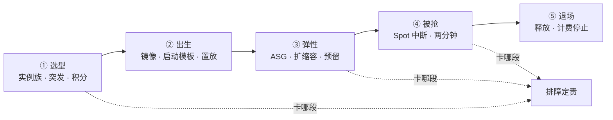
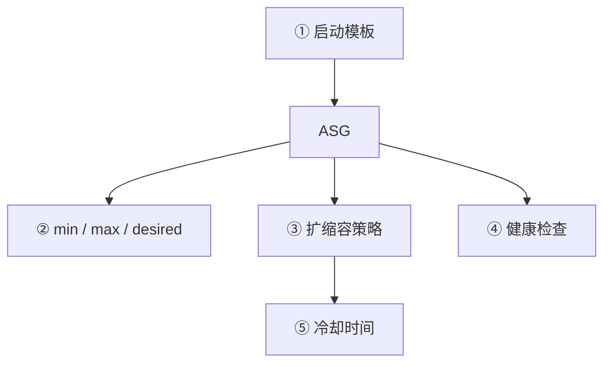
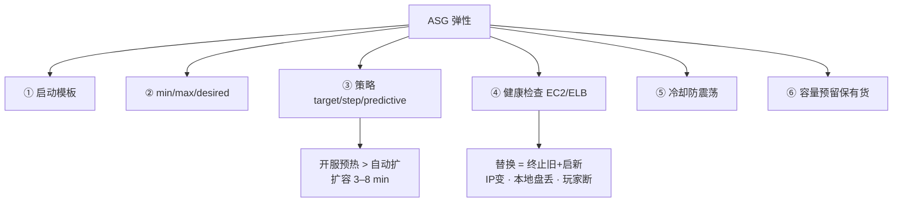
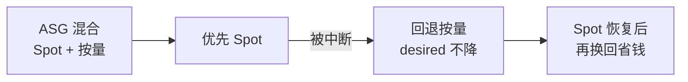
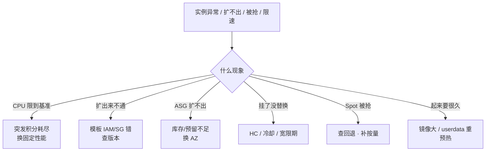

# 云上计算与弹性

> 开服弹了 200 台，十分钟一半 CPU 积分耗尽变砖；活动期 Spot 被抢，战斗服没有回退直接掉了一片区。有人喊「再弹一批突发」、有人喊「战斗全上 Spot」，两句都不对。
> **本章回答**：一台云实例从选型到退场的一生——选什么族、怎么生出来、怎么弹、怎么被抢、怎么退，每段什么会坏。
> **不讲**：VPC/子网/AZ/安全组 → [01](../01-云网络与安全/)；云盘/快照/对象存储 → [03](../03-云上存储与数据库/)；IAM/AK → [04](../04-IAM与多账号/)；成本/RI 深入 → [05](../05-成本治理/)；各厂生产坑 → [06](../06-阿里云生产/) · [07](../07-AWS生产/) · [08](../08-火山引擎生产/)；多云对照 → [09](../09-多云对照/)。

**标记**：🎯重点 · 🔥难点 · ⭐常考 · 🔧实操

---

## 一、一张图：一台云实例的一生

> 🎯 **一句话**：实例像人一样有生老病死——选型、出生、弹性、被抢、退场；出问题先问「它卡在哪一段」。



- 📖 **读图**
  - 🛤️ 主线五段串时间线；排障按段问「卡在哪」，别看到「实例异常」就重启或扩容
  - 选型定底子（积分耗尽会变砖）；出生定配方（模板错则扩出来不通）；弹性是值班最常撞的段；被抢是 Spot 的命；退场管钱

本节对应练习题 Q1。

---

## 二、选型：实例族与突发规格 🎯⭐🔥

> 🎯 **一句话**：实例族决定干什么活；突发规格靠积分突发，开服高峰积分归零就限到基准——不是 CPU 不够，是积分花光了。

### 🏷️ 实例族：x-large 不是越大越好 ⭐

- **实例族（instance family）** = 云厂商按 CPU/内存/IO 比例分的大类；同族内再分大小
  - 阿里 `ecs.g6.xlarge`、AWS `m5.xlarge`：前缀是族，后缀是大小
  - ⭐ 高频错答：「核数一样就能互相替」——选错族比选错大小贵得多

- 🗺️ **游戏常见选法**
  - 通用型（m/g，≈1:4）→ 网关 / 匹配 / HTTP API（吃连接数和 PPS）
  - 计算型（c，≈1:2）或高主频（`g6e`/`c6e`/`z1d`）→ 战斗服（要单核主频）
  - 内存型（r，≈1:8）→ 缓存 / 数据库

```bash
aws ec2 describe-instance-types --instance-types m5.xlarge c5.2xlarge r5.xlarge \
  --query 'InstanceTypes[].{Type:InstanceType,VCPU:VCpuInfo.DefaultVCpus,Mem:MemoryInfo.SizeInMiB,Net:NetworkInfo.NetworkPerformance}'
# m5.xlarge  4vCPU 16GiB   # ← 通用 1:4
# c5.2xlarge 8vCPU 16GiB   # ← 计算 1:2
# r5.xlarge  4vCPU 32GiB   # ← 内存 1:8
```

> 📝 **面试**：网关选通用、战斗选计算/高主频、缓存选内存；先定族再定大小。⭐

### 🔋 突发规格与 CPU 积分 🔥

> 💡 **打个比方**：突发像手机电池——平时攒电（积分），高峰花电（突发满核）；见底就降到基准，相当于手机降频。你以为买了 4 核，基准可能只有 20%～40%。

- **突发规格（burstable）** = 平时低于**基准性能（baseline）**时攒 **CPU 积分**，高峰花积分冲满核；归零后硬限到基准
  - AWS t 系列、阿里/腾讯 T 系列都属于这类

| 对比 | 突发规格 | 固定性能 |
|------|----------|----------|
| CPU | 可突发，有积分 | 恒定，无积分 |
| 适合 | 低负载偶发突发 | 持续高负载 |
| 坑 | 积分耗尽限到基准 | 无此坑 |

- 🧮 **怎么攒怎么花**（4 vCPU、基准 20%）
  - 低于基准：每分钟攒 `(基准−实际)×核数`
  - 高于基准：每分钟花 `(实际−基准)×核数`；满核 5 分钟约花 `4×5×0.8 = 16` 个 vCPU·分钟
  - 平时只跑 10%：每分钟攒 `0.4`——攒十几分钟才够花 1 分钟满核
  - 开服：几天攒的积分几分钟花光 → 集体踩刹车，CCU 还在涨

#### ❓ 为什么积分耗尽不是「云平台没收了 CPU」？

- ❌ 不是故障、不是配额被扣
- ✅ 你买的就是「基准 + 可突发额度」；积分是银行账户，花光是正常机制
- 🔥 用突发跑持续高负载 = **配置错误**，不是平台背锅
- 基准不是归零：4 核基准 20% → 仍有约 0.8 核持续能力——开发够，战斗服不够

> ⚠️ **别混**：积分耗尽 ≠ 机器坏了。换固定性能，别靠「再弹一批突发」假装够。

> 📝 **面试**：突发靠积分，归零限到基准；生产战斗/网关别用突发；开服高峰最容易集体耗尽。⭐

### 🔩 裸金属与本地盘 🔧

- **裸金属（bare metal）** = 直访物理机、无虚拟化层
  - 适合：高性能库、合规/Licensing、硬件直通
  - 代价：启动常 10–20 min（普通 VM 约 1–2 min），弹性差；游戏少用

- **本地盘（instance store / 本地 NVMe）** = 宿主机上的盘，**实例释放即丢**
  - 延迟常微秒级，云盘常毫秒级（持久化 → [03](../03-云上存储与数据库/)）
  - 只放临时中间结果 / 低延迟缓存；**不放必须持久化的数据**

> 🔍 **现场**：ASG + 本地盘——扩出来盘是空的，缩容终止盘直接丢；有状态服必须生命周期钩子先迁数据。AWS 上 stop 再 start 可能换物理机，本地盘照样没。

```bash
aws ec2 describe-instance-types --instance-types i3.2xlarge \
  --query 'InstanceTypes[0].InstanceStorage' --output text
# Supported: True   # ← 有本地 NVMe；停止/释放即丢（看厂商）
```

> ⚠️ **别混**：本地盘 ≠ 云盘。Spot 抢走本地盘上的 Redis 主数据 = 数据没了。

本节对应练习题 Q1、Q2。

---

## 三、出生：镜像与启动模板 🎯⭐

> 🎯 **一句话**：镜像是系统基因；启动模板把镜像+规格+网络+脚本打成可复用出生配方；置放群组决定落哪台物理机。

### 🧬 镜像：实例的基因 ⭐

- **镜像（AMI / 自定义镜像）** = OS + 预装软件 + 配置的模板
  - 官方 / 市场 / 自定义；游戏包版本在**打镜像时锁死**——要更新就重打或靠 userdata 拉包
  - 分层：OS → 运行时（agent/依赖）→ 业务包；镜像越大 ASG 扩得越慢

> ⚠️ **别混**：镜像 ≠ 快照。镜像用来启动实例；快照是云盘备份（→ [03](../03-云上存储与数据库/)）。快照可建盘、可再建镜像，但不能直接当「启动入口」。

> 🔍 **现场**：50GB 业务镜像拉 3–5 min 很常见；精简到 ≈10GB + 对象存储拉包，启动常能从 ~8 min 压到 ~3 min。旧镜像堆满配额会 `ResourceLimitExceeded`。

### 📋 启动模板：出生配方 🔧

- **启动模板（launch template）** = 镜像 ID · 规格 · 子网 · SG · IAM 角色 · userdata ·（可选）置放群组，带版本号
  - ASG 扩容从模板生实例；改任一参数 → 新版本，旧版本不丢
  - 生产：新版本先手动扩一台验证 → 再改 ASG 绑定 → Instance Refresh 滚动替换
  - 绑 `$Latest` 方便但不安全——改错立刻扩出坏实例

```bash
aws ec2 describe-launch-templates --launch-template-ids lt-xxx \
  --query 'LaunchTemplates[0].LatestVersionNumber'
# 3   # ← ASG 绑的是 Default 还是 Latest？

aws autoscaling start-instance-refresh --auto-scaling-group-name my-asg \
  --strategy Rolling --preferences '{"MinHealthyPercentage":50,"InstanceWarmup":300}'
# ← 保持 ≥50% 健康；新实例就绪 300s 再换下一批
```

#### ❓ 为什么改了启动模板，ASG 还在扩旧配置？

- 模板出新版本 ≠ ASG 立刻换绑
- 必须：更新 ASG 指向的版本，或触发 Instance Refresh
- 只改模板、不触发替换 → 现网旧实例与新扩实例配方分裂

> ⚠️ **别混**：改模板 ≠ 立刻生效。IAM/SG 配错时实例「起来了但业务不通」——先查模板版本，别重启瞎试。

### 🪑 置放群组：落哪台物理机 🔥

> 💡 **打个比方**：置放像指定座位——「挤一起」低延迟，或「分散坐」防同架挂。

- **置放群组（placement group）** 三种策略
  - **聚集（cluster）**：同机架最低延迟；单架故障全挂；容量有上限
  - **分散（spread）**：不同机架，每物理机最多一台；适合 master
  - **分区（partition）**：大分区故障域；适合大数据

> ⚠️ **别混**：聚集 ≠ 多 AZ。聚集管同 AZ 内机架分布；多 AZ 管跨机房（→ [01](../01-云网络与安全/)）。

> 📝 **面试**：聚集=低延迟战斗内网；分散=隔离 master；分区=大数据故障域；聚集有容量上限。⭐

本节对应练习题 Q3、Q4、Q14。

---

## 四、弹性：伸缩组与扩缩容 🎯⭐🔥

> 🎯 **一句话**：ASG 按策略加减实例，冷却防抖；扩容常要 3–8 min——开服靠预热，不靠自动扩救火。

### 🧩 ASG 的骨架

- **弹性伸缩组（ASG）** = 自动管实例数量



- 📖 **读图**
  - ①配方 ②边界 ③何时加减 ④什么算坏 ⑤防连续抖
  - 缩容=终止实例（本地盘丢、IP 变、玩家断）；有状态服要终止保护或生命周期钩子

### 📈 扩缩容策略 ⭐

- **目标追踪**：维持指标趋近目标（如 CPU≈60%），最常用
- **步进式**：分档加减，更精细
- **预测式**：按历史提前扩，适合规律流量

#### ❓ 为什么目标 60% 不是「超过就立刻扩」？

- 目标是**维持点**，不是上限；ASG 按 `实际/目标` 比例调 desired
- 瞬间飙一下常被冷却挡住；持续偏离才扩
- 开服：手动把 desired 调高预热 > 指望策略在涌入瞬间救火（扩容要 3–8 min）

- **生命周期钩子**：启动前/终止前暂停窗口（如 300s）——拉配置、踢人、迁 Session；不改变最终会启动/终止

```bash
aws autoscaling describe-scaling-activities --auto-scaling-group-names my-asg \
  --query 'Activities[0].{Cause:Cause,Status:StatusCode}'
# Cause: CPU > 70% · Status: Successful / Failed   # ← 看触发原因与是否 InsufficientCapacity

aws autoscaling put-lifecycle-hook --auto-scaling-group-name my-asg \
  --lifecycle-hook-name game-terminate-hook \
  --lifecycle-transition autoscaling:EC2_INSTANCE_TERMINATING \
  --heartbeat-timeout 300
# ← 终止前暂停 300s 做迁移/通知
```

### ⏱️ 冷却时间 ⭐

> 🎯 **一句话**：冷却 = 一次扩缩容后再等 N 秒才允许下一次策略触发（默认常 300s）。

> 🔍 **现场**：活动记录里短时间连续 `Launching… Launching…` 且每次只加 1–2 台 → 冷却太短导致震荡。

> ⚠️ **别混**：冷却 ≠ 健康检查间隔。冷却管两次加减之间；HC 管多久探一次活（常 10–30s）。

### ❤️‍🩹 健康检查与自动恢复 🔧⭐

- **EC2 健康检查**：实例 stopped/terminated/不健康 → ASG 替换
- **ELB 健康检查**：HTTP/TCP 探测失败也可触发替换（可叠加）
- **ASG 替换** = 终止旧 + 启新（新 IP、本地盘没了、玩家断）——不是重启旧实例
- **宽限期（grace period）** 太短 → 新实例还没起来就被标 Unhealthy → 反复替换死循环；宽限期 ≥ userdata + 应用启动

- **实例自动恢复（auto recovery）** ≠ ASG 替换
  - 宿主机硬件故障时同 AZ 恢复同配置，常保 EIP/云盘；不保本地盘
  - 只管硬件层，不管进程崩溃（软件层靠 ASG HC 或进程管理）

```bash
aws autoscaling describe-auto-scaling-groups --auto-scaling-group-names my-asg \
  --query 'AutoScalingGroups[0].Instances[].{ID:InstanceId,Health:HealthStatus,Lifecycle:LifecycleState}'
# Healthy + InService          # ← 正常
# Unhealthy + Terminating      # ← 替换中
```

> ⚠️ **别混**：ASG 替换 ≠ 自动恢复。有状态战斗服上 ASG 要谨慎——替换=踢人。

### 🏨 容量预留 ⭐🔥

> 💡 **打个比方**：容量预留像酒店订房——先锁货，空着也付空房费；开服时一定有货，不怕 `InsufficientInstanceCapacity`。

- **容量预留**：显式在指定 AZ + 规格锁资源
- **RI**：承诺时长换折扣，顺带隐式容量——是计费优惠为主（→ [05](../05-成本治理/)）

#### ❓ 为什么开服预热不能只指望 RI？

- RI 是「开了才匹配折扣」的隐式预留，不保证你要扩时现货池一定有货
- 开服/大活动要**显式容量预留** + ASG；提前 24h 锁，预压时验证能扩出来

> ⚠️ **别混**：容量预留 ≠ ASG。预留保证有货，ASG 保证按策略加减；两者常一起用。

### 收束：ASG 凭什么「弹对」又不「弹飞」



- 📖 **读图**
  - ①②骨架 · ③决策 · ④⑤运行时控制 · ⑥资源保障
  - **保证**：数量趋近 desired、不健康被替换
  - **不保证**：秒级扩容、替换保 IP/数据、没预留一定有货、缩容不踢人

> 📝 **面试**（分组背）：模板怎么生、min/max 定边界、策略管加减、HC 管替换、冷却防抖、预留保货；再加一条**开服预热 > ASG**。⭐

本节对应练习题 Q5、Q6、Q7、Q8。

---

## 五、被抢：Spot 中断与回退 🎯⭐🔥

> 🎯 **一句话**：Spot 是闲置算力，便宜但会被收；两分钟通知内必须优雅退出，靠 Spot+按量混合回退保容量。

### 🚗 Spot：便宜但有租约

> 💡 **打个比方**：Spot 像拼车——车空着你坐，车主要车了两分钟内下车。便宜，但不保证坐到终点。

- **Spot / 抢占式** = 闲置资源，常比按量低 60–90%；平台可随时中断
  - AWS ≈2 min 通知；GCP 常 30s；阿里约 2–5 min（看类型）
  - 硬件与按量同规格同性能——**可用性打折，不是性能打折**

| 对比 | Spot | 按量 |
|------|------|------|
| 价格 | 低 60–90% | 标准 |
| 可用性 | 可被抢 | 不中断 |
| 适合 | 无状态 / 可中断任务 | 生产关键 |

- ✅ CI、批处理、Spark、测服、无状态 Web（配合回退）
- ❌ 战斗服、数据库、有状态缓存

### 📢 两分钟中断通知 🔧

```bash
TOKEN=$(curl -s -X PUT "http://169.254.169.254/latest/api/token" \
  -H "X-aws-ec2-metadata-token-ttl-seconds:21600")
curl -s -H "X-aws-ec2-metadata-token: $TOKEN" \
  "http://169.254.169.254/latest/meta-data/spot/instance-action"
# {"action":"terminate","time":"..."}   # ← 两分钟内回收
# ← 停接新请求 → 发现下线 → 等 in-flight → 退出
```

- 实践：多规格多 AZ；设出价策略；应用幂等/检查点；盯中断率换区或加按量比例

> ⚠️ **别混**：Spot 性能 ≠ 按量打折。跑起来一样快，可能跑一半被收走。

### 🛟 竞价实例回退 ⭐



- 📖 **读图**
  - 不是「Spot 挂了就少几台」，而是「补 Spot，补不到就补按量」
  - 按量做底座（永不被抢），Spot 叠弹性；多台同时被抢 → 成本瞬间跳高

#### ❓ 为什么 Spot 中断时健康检查常常还是 Healthy？

- Spot 中断是平台**主动回收**，不是实例「坏了」
- ASG 走「中断事件 → 终止 → 回退」路径，与 HC「Unhealthy → 替换」是两条线
- 混了会问「健康检查怎么没发现」——它发现的是另一件事

> 📝 **面试**：Spot 便宜可被抢，必须配回退；不跑有状态服；硬件同按量，可用性打折。⭐

口诀：**无状态可 Spot，有状态必须有 On-Demand 兜底**。

本节对应练习题 Q9、Q10。

---

## 六、退场：计费模型与释放 🎯⭐

> 🎯 **一句话**：按量释放即停计费；包年到期前不退；RI/Savings Plan 是折扣承诺——买了仍要自己开实例。

### 💳 四种计费模型

> 💡 **打个比方**：按量=用多少付多少；包年=签约一口价不能退；RI=承诺用量打折但仍要自己打电话；Savings Plan=承诺消费额度打折、不锁打给谁。

- **按量**：最灵活最贵；ASG 扩出来默认按量
- **包年包月**：锁期限便宜约 30–50%；到期前释放**不退费**
- **RI**：锁族/AZ/数量，折扣深（最高约 72%）；**不是已开好的机器**
- **Savings Plan**：承诺小时消费，不锁族更灵活；同样是折扣承诺

- 常态混合：底座包年/RI · 弹性按量 · 非关键 Spot（选型深挖 → [05](../05-成本治理/)）

> ⚠️ **别混**：RI/Savings Plan ≠ 已开实例。不开机 = 白付承诺。包年「释放」≠「退费」——临时不用宁可 stop，到期再 terminate。

### 🛑 停止 vs 释放 🔧

- **停止（stop）**：关机仍在；云盘/EIP 常保留；按量多停算计算费（各厂细节不同）
- **释放（terminate）**：删除；按量停计费；本地盘没；EIP 除非显式保留

```bash
aws ec2 stop-instances --instance-ids i-xxx        # ← 可重启；云盘在
aws ec2 terminate-instances --instance-ids i-xxx   # ← 删除；按量停计算费
aws ec2 describe-instances --instance-ids i-xxx \
  --query 'Reservations[0].Instances[0].State.Name'
# "stopped"   # ← 仍可能收 EIP/云盘费
```

> 🔍 **现场**：按量 stop 后别留空 EIP 白烧钱；包年 stop 不省钱。

> 📝 **面试**：按量释放即停；包年到期前不退；RI/SP 是折扣不是实例；停止保留、释放删除。⭐

本节对应练习题 Q11、Q12。

---

## 七、作战：定责 🎯⭐🔧

> 🎯 **一句话**：先分清选型 / 出生 / 弹性 / 被抢哪一段病——不要上来就重启或手动起一台。



- 📖 **读图**：第一刀问现象，六条支线对应五段主线；别跳过分类直接改策略。

### 现象 · 先做 · 别做

| 现象 | 先做 | 别做 |
|------|------|------|
| CPU 限到基准、开服卡 | 查积分 → 换固定性能 | 再弹一批突发 |
| 扩出来拉不了配置 | 查模板 IAM + SG + 版本 | 重启实例 |
| ASG 扩不出 | 查预留/库存 → 换 AZ | 先拧策略旋钮 |
| 挂了没替换 | 查 HC 类型 + cooldown + 宽限期 | 手动起一台顶着 |
| Spot 掉一片 | 查回退 → 确认按量补上 | 立刻全改按量 |
| 起来要 8 分钟 | 查镜像/userdata → 预热 | 缩短 HC 间隔 |

### 60 秒剧本 🔧

```text
0–10s   查 ASG 活动 / 实例状态     # ← 扩不出 / 替换中 / Spot？
10–30s  查突发 CPU 积分            # ← 归零 = 限到基准
30–45s  查启动模板版本 + IAM       # ← 扩出来通不通看配方
45–60s  查 Spot 通知 + 容量预留    # ← 被抢 / 库存
# ← 60s 内：不手动起实例顶着、不重启踢人、不乱改 ASG 策略
```

- 开服同时报「CPU 掉了」+「扩不出」：常是**两个病**——突发选型错 + 没预留；止血换固定规格 + 换有货 AZ，根因会后改预留与规格
- 活动后缩容踢光战斗服：缩容策略没保护有状态实例 → 立刻抬 desired 止血，根因上 termination protection / 钩子

> 📝 **面试**：先分类——限速查积分、扩不出查预留、不通查模板、被抢查回退；不手动起无模板实例顶着。⭐

本节对应练习题 Q13。

---

## 八、收口

### 命令速查 🔧

```bash
# 突发积分 / 实例状态
aws ec2 describe-instance-status --instance-ids i-xxx
# InstanceStatus: ok/impaired

# ASG 活动
aws autoscaling describe-scaling-activities --auto-scaling-group-names my-asg
# Launching… / Terminating… Spot interruption / InsufficientInstanceCapacity

# ASG 健康
aws autoscaling describe-auto-scaling-groups --auto-scaling-group-names my-asg \
  --query 'AutoScalingGroups[0].Instances[].{ID:InstanceId,Health:HealthStatus}'

# 启动模板版本
aws ec2 describe-launch-templates --launch-template-ids lt-xxx \
  --query 'LaunchTemplates[0].{Latest:LatestVersionNumber,Default:DefaultVersionNumber}'

# 预热
aws autoscaling update-auto-scaling-group --auto-scaling-group-name my-asg --desired-capacity 10

# Spot 中断（实例内）
TOKEN=$(curl -s -X PUT "http://169.254.169.254/latest/api/token" \
  -H "X-aws-ec2-metadata-token-ttl-seconds:21600")
curl -s -H "X-aws-ec2-metadata-token: $TOKEN" \
  http://169.254.169.254/latest/meta-data/spot/instance-action
```

### 面试锚点表

| 问 | 30 秒答 |
|----|---------|
| 实例族怎么选？ | 通用网关、计算/高主频战斗、内存缓存；先族后大小 |
| 突发坑？ | 积分归零限到基准；生产战斗/网关别用 |
| 镜像 vs 快照？ | 镜像启实例；快照备份云盘（→03） |
| 启动模板？ | 镜像+规格+网络+IAM+userdata；改出新版本，ASG 要换绑/Refresh |
| 置放群组？ | 聚集低延迟、分散隔离、分区大故障域；≠ 多 AZ |
| ASG 扩容多久？ | 常 3–8 min；开服靠预热 |
| 冷却？ | 两次策略加减间隔；≠ HC 间隔 |
| 替换 ≠ 恢复？ | 替换新 IP/丢本地盘；恢复同 EIP（硬件故障） |
| 容量预留？ | 显式锁货；≠ RI 折扣承诺 |
| Spot？ | 2 min 通知；必须回退；不跑有状态 |
| 计费？ | 按量灵活贵；包年锁期限；RI/SP 是折扣不是实例 |
| 停止 vs 释放？ | stop 保留；terminate 删除停按量；包年释放不退 |

### 易错一句话对照

- `买了 4 核突发就有 4 核` → 基准可能只有一部分，积分耗尽限到基准
- `积分耗尽=平台没收` → 正常机制；持续高负载用突发才是错配
- `镜像=快照` → 镜像启实例，快照备份盘
- `改模板立刻生效` → 要换 ASG 版本或 Refresh
- `聚集=多 AZ` → 聚集管同 AZ 机架
- `ASG 秒级扩` → 常 3–8 min，开服要预热
- `替换=恢复旧机` → 替换是新实例
- `冷却=HC 间隔` → 两套时钟
- `容量预留=RI` → 预留保货，RI 保折扣
- `Spot 中断=故障` → 主动回收，HC 常仍 Healthy
- `Spot 性能打折` → 硬件同按量，可用性打折
- `RI=已开机` → 仍要自己 run-instances
- `包年释放退费` → 到期前不退
- `本地盘=云盘` → 本地释放即丢
- `ASG 缩容不踢人` → 终止=踢人；有状态要保护/钩子
- `目标值=上限` → 是维持点
- `自动恢复管进程崩` → 只管宿主机硬件

### 数字墙

```text
Spot 折扣            低 60–90%         RI 最高约         72% off
ASG 扩容             3–8 min           冷却默认          300s
Spot 通知            ~2 min            突发归零          限到基准
本地盘               释放即丢          ASG 替换          新 IP
裸金属启动           10–20 min         包年折扣          ~30–50%
本地盘延迟           μs 级             云盘延迟          ms 级
生命周期钩子         常 300s           HC 间隔           10–30s
```

---

## 合上书

- [ ] **默画**实例一生五段（选型→出生→弹性→被抢→退场），说出每段管什么、排障先问哪段（Q1）
- [ ] 实例族怎么选？突发积分怎么攒花？为何开服会「变砖」？基准是什么？（Q1、Q2）
- [ ] 镜像 vs 快照？启动模板含什么？改模板如何让 ASG 生效？（Q3、Q4、Q14）
- [ ] **默画** ASG 六件套；为何不秒级；替换 vs 自动恢复（Q5–Q8）
- [ ] 策略三种？冷却管什么？为何开服不靠自动扩？（Q9、Q10）
- [ ] 容量预留 vs RI？ASG+预留解决什么？（Q11、Q12）
- [ ] **默画** Spot：通知→退出→回退；中断≠故障；性能=按量（Q13）
- [ ] Spot 能跑/不能跑什么？回退如何保 desired？（Q13）
- [ ] 四种计费；RI/SP 为何不是实例；stop vs terminate（Q13）
- [ ] **默画**作战决策树 + 口述 60 秒剧本；开服「CPU 掉+扩不出」前 60s 敲什么（Q13）

终极测试：十分钟讲清「开服弹突发变砖、战斗全上 Spot 掉区——第一刀为什么不是再弹一批，而是查积分与回退」。讲得下来，你就能拦住下一次错误决策。
