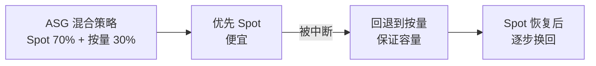
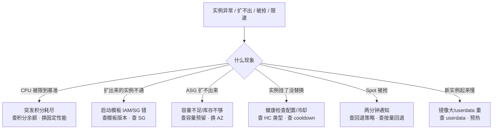

# 02｜云上计算与弹性 · 练习题

先合上知识点，对着 **一、一张图：一台云实例的一生** 把选型→出生→弹性→被抢→退场五段口述一遍，再来做题。

| 标记 | 含义 |
|------|------|
| **核心** | 不懂整章就没建立起来 |
| **必会** | 值班和面试都要能讲 |
| **常用** | 线上会反复碰到 |
| **常考** | 白板和追问的高频口径 |

## 本题目录
- [Q1 突发规格开服变砖](#q1)
- [Q2 实例族怎么选](#q2)
- [Q3 镜像 vs 快照、启动模板改了不生效](#q3)
- [Q4 置放群组策略选哪个](#q4)
- [Q5 ASG 扩容为什么不秒级](#q5)
- [Q6 ASG 替换 vs 实例自动恢复](#q6)
- [Q7 容量预留 vs RI](#q7)
- [Q8 扩缩容策略与冷却时间](#q8)
- [Q9 Spot 中断怎么处理](#q9)
- [Q10 竞价实例回退](#q10)
- [Q11 四种计费模型对比](#q11)
- [Q12 停止 vs 释放](#q12)
- [Q13 排障定责](#q13)
- [Q14 启动模板改了 ASG 不生效](#q14)
- [合上书](#合上书)

---

## Q1

**★★★★★｜生产用了突发规格，开服 10 分钟 CCU 还在涨但 CPU 突然全降了，什么情况？**

**覆盖**：核心 · 必会 · 常考 ｜ **对应**：知识点 [二、选型：实例族与突发规格](知识点.md)

### 场景
开服前用 t 系列突发规格跑了几天测试没问题。开服当天 CCU 涌入，前 10 分钟一切正常，然后所有实例 CPU 同时掉到 20% 左右，玩家开始卡顿排队。有人准备加实例数量。

### 完整解答
> 🎯 **一句话**：突发规格积分耗尽限到基准性能——不是 CPU 坏了，是积分花光了；加实例不解决根因，换固定性能实例才对。

突发规格（burstable）平时跑低于基准性能时攒 CPU 积分，高峰时花积分突发到满核；积分归零后限到基准性能。开服前几天低负载攒的积分，在开服高峰 10 分钟全花光，然后所有实例同时降频——像集体踩了刹车。基准 20% 的 4 核实例，积分耗尽后只有 0.8 核持续能力。

```bash
# AWS: 查突发积分余额
aws ec2 describe-instances --query 'Reservations[].Instances[].{ID:InstanceId,Credit:CpuCredits}'
# {"ID":"i-aaa","Credit":"0"}   # ← 积分归零，限到基准性能
```

止血：换固定性能实例（c/m/r 系列），不靠加突发实例数量假装够——加出来的也是突发规格，一样会耗尽积分。根因是选型错误：持续高负载不该用突发规格。

> ⚠️ **别混**：积分耗尽 ≠ CPU 被云平台「没收」。你买的就是「基准 + 可突发」，积分花光是正常机制，不是故障——用突发规格跑持续高负载才是配置错误。
> 📝 **面试**：「突发规格靠 CPU 积分，平时攒高峰花；积分归零限到基准性能。生产战斗服/网关用突发规格是常见坑——开服高峰积分耗尽就限到基准。持续高负载用固定性能实例。」

### 再追问
- **突发规格能不能跑网关？** ——网关是持续高负载，不适合突发规格；只有低负载偶发突发的场景（开发、内部工具）才适合。
- **基准性能是固定的还是可配的？** ——每个实例规格有固定的基准百分比，比如 t3.xlarge 基准 20%，不能调；选型时就决定了。

---

## Q2

**★★★★☆｜游戏网关和战斗服分别选什么实例族？为什么不是越大越好？**

**覆盖**：必会 · 常考 ｜ **对应**：知识点 [二、选型：实例族与突发规格](知识点.md)

### 场景
新项目要选机型。有人说「网关用 r 系列大内存」，有人说「战斗服用 m 系列通用型」。架构评审时还在纠结 xlarge 还是 2xlarge。

### 完整解答
> 🎯 **一句话**：网关选通用型（m/g），战斗服选计算型（c）或高主频型；选错族比选错大小贵得多——网关吃连接数和 PPS 不是单核，战斗服要主频不是核数。

实例族（instance family）是云厂商按 CPU/内存/IO 比例分的大类。通用型 m/g（1:4）给网关/匹配/HTTP API——连接数和 PPS 是瓶颈不是单核性能；计算型 c（1:2）给 CPU 密集的战斗服——要的是单核主频不是核数；内存型 r（1:8）给缓存/数据库。

选错族的典型事故：网关选了 r 系列大内存——内存浪费了，CPU 和 PPS 反而不够；战斗服选了 m 系列但单核主频不够——帧同步延迟高。先定族再定大小，不要反过来。

> 📝 **面试**：「通用 m/g 做网关、计算 c 做战斗服、内存 r 做缓存；网关吃连接数和 PPS 不是单核，战斗服要主频不是核数；选错族比选错大小贵。」

### 再追问
- **高主频型和计算型有什么区别？** ——计算型核多但单核不一定强；高主频型（AWS z1d、阿里 g6e/c6e）单核性能强，适合延迟敏感的战斗服。
- **裸金属什么时候用？** ——高性能数据库绕过虚拟化开销、合规/Licensing 绑物理核、特殊硬件直通；启动慢弹性差，不常用。

---

## Q3

**★★★★★｜扩出来的实例拉不了配置，查镜像还是查启动模板？镜像和快照有什么区别？**

**覆盖**：核心 · 必会 · 常考 ｜ **对应**：知识点 [三、出生：镜像与启动模板](知识点.md)

### 场景
ASG 扩容出来的新实例起来了但业务不通——SSH 进去看，监控 agent 没注册、配置没拉下来。有人说是镜像问题，有人说是启动模板问题。

### 完整解答
> 🎯 **一句话**：实例起来了但不通，先查启动模板的 IAM 实例角色和 userdata——镜像只管 OS 和预装包，模板管镜像+规格+网络+脚本+角色，配错模板实例就带不上正确配置。

镜像（image / AMI）= OS + 预装软件 + 配置的模板，用于启动实例。快照 = 云盘的数据备份（→ [03](../03-云上存储与数据库/)）。从快照可以建云盘但不能直接启动实例；从镜像可以启动实例。

启动模板（launch template）把镜像 ID、实例规格、子网、安全组、IAM 角色、userdata 打包成版本化模板。扩出来的实例不通，常见原因：IAM 实例角色配错——实例拉不了配置、注册不了发现；userdata 脚本有 bug——装包/注册步骤失败；模板绑了旧版本——改了模板但 ASG 还在用旧版本扩容。

```bash
# AWS: 查 ASG 用的启动模板版本
aws autoscaling describe-auto-scaling-groups --auto-scaling-group-names my-asg \
  --query 'AutoScalingGroups[0].MixedInstancesSpec.LaunchTemplate'
# {"LaunchTemplateId":"lt-xxx","Version":"2"}   # ← 确认是否指向最新版本
```

> ⚠️ **别混**：镜像 ≠ 快照。镜像用于创建实例（含注册信息），快照是云盘备份。从快照可以建云盘但不能直接启动实例；从镜像可以启动实例。阿里云「自定义镜像」和「快照」是两个入口。
> 📝 **面试**：「镜像启动实例，快照备份云盘（→03）；启动模板打包镜像+规格+网络+IAM+userdata，ASG 从模板扩容；扩出来不通查 IAM 角色 + 模板版本。」

### 再追问
- **改了启动模板怎么让 ASG 生效？** ——生成新版本后，ASG 做滚动更新（instance refresh）才会用新版本替换旧实例；只改模板不触发替换。
- **镜像里的游戏包版本怎么更新？** ——镜像锁版本，更新要重打镜像或在 userdata 里拉最新包；后者更灵活但启动慢。

---

## Q4

**★★★★☆｜战斗服集群内部通信延迟高，要不要用置放群组？聚集和分散怎么选？**

**覆盖**：必会 · 常考 ｜ **对应**：知识点 [三、出生：镜像与启动模板](知识点.md)

### 场景
战斗服集群帧同步要求低延迟，同 AZ 内实例间 RTT 偶尔跳到 2-3ms。有人建议用置放群组，有人担心「聚集策略一挂全挂」。

### 完整解答
> 🎯 **一句话**：低延迟集群内部通信用聚集（cluster）置放群组——同机架延迟最低；关键隔离实例（master）用分散（spread）——不同机架防同架挂；聚集 ≠ 多 AZ。

置放群组（placement group）三种策略：**聚集（cluster）**——同机架，实例间延迟最低，适合低延迟战斗服集群内部通信，代价是单机架故障全挂；**分散（spread）**——不同机架，每台物理机最多一个实例，适合需要严格隔离的关键实例；**分区（partition）**——按大分区分散，适合大数据/Hadoop。

战斗服帧同步要低延迟用聚集 + 单 AZ。单机架故障全挂的风险用热备 AZ 兜底——不是靠分散置放群组，而是跨 AZ 做区服级故障切换。

> ⚠️ **别混**：聚集管同 AZ 内的物理分布（同机架 vs 不同机架），多 AZ 管跨机房。战斗服要低延迟用聚集 + 单 AZ；数据面要抗 AZ 故障用多 AZ——两者不能混为一谈。
> 📝 **面试**：「聚集=同机架低延迟（战斗服）、分散=不同机架隔离（master）、分区=大故障域（大数据）；聚集 ≠ 多 AZ。」

### 再追问
- **聚集置放群组能跨 AZ 吗？** ——不能，聚集是同 AZ 内同机架；跨 AZ 用分散或分区。
- **分散和分区什么区别？** ——分散是每台物理机最多一个实例（严格隔离），分区是按大分区分散每分区多实例（大数据用）。

---

## Q5

**★★★★★｜ASG 扩容要多久？为什么开服不能靠 ASG 自动扩？**

**覆盖**：核心 · 必会 · 常考 ｜ **对应**：知识点 [四、弹性：伸缩组与扩缩容](知识点.md)

### 场景
开服前 ASG min=2 max=20 desired=2，扩缩容策略 CPU>70% 加 3 台。开服瞬间 CCU 涌入，CPU 飙到 90%，ASG 触发扩容但玩家已经排了 5 分钟队。

### 完整解答
> 🎯 **一句话**：ASG 扩容要 3-8 分钟（镜像拉取 + userdata 执行 + 健康检查通过），开服瞬间涌入的玩家等不了——开服弹性靠预热，不靠 ASG 自动扩。

ASG 扩容流程：启动模板拉镜像 → 分配资源启动实例 → userdata 执行（装包/拉配置/注册发现） → 健康检查通过 → 转入 InService。每步都要时间，加起来 3-8 分钟。CPU 到 70% 触发扩容，等实例就绪时玩家已经排队 5 分钟了。

正确做法：**活动前手动把 desired 调高**（预热），活动后调回来。ASG 策略是「平时保底」不是「开服救火」。预热 + 容量预留是游戏弹性的标准组合——容量预留保证有货，预热保证已就绪。

```bash
# AWS: 活动前手动调 desired 预热
aws autoscaling update-auto-scaling-group --auto-scaling-group-names my-asg \
  --desired-capacity 10    # ← 从 2 调到 10，提前 15 分钟预热
# 活动后调回来
aws autoscaling update-auto-scaling-group --auto-scaling-group-names my-asg \
  --desired-capacity 2
```

> ⚠️ **别混**：ASG 不保证「扩容是秒级」（镜像 + userdata + 健康检查要 3-8 min）、不保证「替换保留 IP/数据」（新实例新 IP）、不保证「有资源一定能扩出来」（没容量预留可能碰到库存不足）。
> 📝 **面试**：「ASG 扩容要 3-8 min（镜像+userdata+健康检查），开服靠预热不靠自动扩；ASG 策略是平时保底不是开服救火。」

### 再追问
- **能不能缩短扩容时间？** ——用更小的镜像、精简 userdata、用自定义健康检查加速就绪判定。但 3 分钟以内很难——镜像拉取和 OS 启动本身就要时间。
- **缩容时选哪台终止？** ——默认随机，可配 oldest（先删最老）或 least-requests（先删请求最少的）；有状态服要注意别缩掉有玩家的实例。

---

## Q6

**★★★★★｜ASG 健康检查发现实例不健康，是重启旧实例还是换一台新的？和实例自动恢复有什么区别？**

**覆盖**：核心 · 必会 · 常考 ｜ **对应**：知识点 [四、弹性：伸缩组与扩缩容](知识点.md)

### 场景
ASG 实例被 ELB 健康检查标记 Unhealthy。有人以为会「重启这台实例」，结果发现 ASG 终止了旧实例、启动了一台新的，IP 变了、本地盘数据没了。

### 完整解答
> 🎯 **一句话**：ASG 健康检查替换 = 终止旧实例 + 启动新实例（新 IP、本地盘丢、玩家断）；实例自动恢复 = 同配置同 EIP 恢复（硬件故障专用）——两者不是一回事。

ASG 健康检查有两种来源：**EC2 健康检查**——云平台层面，实例 stopped/terminated 时触发替换；**ELB 健康检查**——负载均衡器层，HTTP/TCP 探测失败也触发替换。检测到不健康后，ASG **终止旧实例 + 启动新实例**，不是重启旧实例。替换 = 一台全新的，IP 变了、本地盘数据没了、原来上面的玩家断了。

**实例自动恢复（auto recovery）** 是另一回事：实例宿主机硬件故障时，自动在同一 AZ 恢复一台相同配置的实例，保留 EIP 和云盘。比 ASG 替换轻——但不保本地盘数据。

| 维度 | ASG 健康检查替换 | 实例自动恢复 |
|------|-----------------|-------------|
| 触发 | EC2/ELB 健康检查失败 | 宿主机硬件故障 |
| 结果 | 终止旧 + 启动新 | 同配置同 EIP 恢复 |
| IP | 新 IP | 保留 EIP |
| 本地盘 | 数据丢 | 不保 |

> ⚠️ **别混**：ASG 替换 ≠ 实例自动恢复。有状态服被 ASG 替换 = 玩家断了、IP 变了；自动恢复 = 短暂中断后 IP 和云盘还在。战斗服用 ASG 要谨慎——替换会踢人。
> 📝 **面试**：「ASG 健康检查替换=终止旧+启动新（新IP/本地盘丢），实例自动恢复=同配置同EIP恢复（硬件故障）；战斗服有状态，替换会踢人。」

### 再追问
- **ELB 健康检查和 EC2 健康检查能不能同时开？** ——能，两者叠加。ELB 检查到不健康也触发 ASG 替换，不只看 EC2 状态。
- **健康检查过严会怎样？** ——检查打到会阻塞的业务线程，瞬时变慢被摘流，正在打的玩家被踢到另一台。检查口要轻、独立端口。

---

## Q7

**★★★★☆｜容量预留和 RI 有什么区别？ASG 扩不出来说明资源不够，怎么查？**

**覆盖**：必会 · 常考 ｜ **对应**：知识点 [四、弹性：伸缩组与扩缩容](知识点.md)

### 场景
开服前 ASG 扩容报错「InsufficientInstanceCapacity」，扩不出来。有人以为买了 RI 就有资源，有人说要加容量预留。

### 完整解答
> 🎯 **一句话**：容量预留保证「有资源可以用」（锁货），RI 是折扣承诺（锁价不锁货）——买了 RI 仍要自己开实例，没容量预留可能碰到库存不足。

**容量预留（capacity reservation）** = 预先在特定 AZ 锁定一批计算资源，确保需要时一定能启动实例，不受库存限制。**预留实例券（RI）** = 承诺使用时长换折扣，同时隐式预留容量——是计费优惠 + 容量锁定的组合。但 RI 的容量预留是「隐式」的——只有你实际开实例时才匹配，不像显式容量预留那样「锁定即一定有」。

ASG 扩不出来说明该 AZ 该实例规格的库存不足。止血：换 AZ（不同 AZ 库存不同）、换实例规格（同族不同大小）、加显式容量预留（提前锁货）。根因是开服高峰大家都在抢同一种实例，没预留就可能扩不出来。

```bash
# AWS: 查 ASG 扩容失败原因
aws autoscaling describe-scaling-activities --auto-scaling-group-names my-asg
# "Launching a new instance... Status: Failed... InsufficientInstanceCapacity"
# ← 该 AZ 该规格库存不足
```

> ⚠️ **别混**：容量预留 ≠ ASG。容量预留保证「有资源可以用」，ASG 保证「按策略加减实例」。ASG + 容量预留 = 开服一定扩得出来。RI 是折扣承诺，深入选型在 [05](../05-成本治理/)。
> 📝 **面试**：「容量预留保证有货，RI 是折扣承诺不一定有货；ASG 扩不出查 InsufficientInstanceCapacity → 换 AZ/换规格/加预留。」

### 再追问
- **RI 的容量预留和显式容量预留什么区别？** ——RI 是隐式预留（开实例时才匹配折扣），显式容量预留是显式锁定（不管你开不开，这批资源都锁着给你）。
- **Savings Plan 预留容量吗？** ——Savings Plan 是折扣承诺不锁实例族/区域，更不锁容量；它只管折扣不管有没有货。

---

## Q8

**★★★★☆｜扩缩容策略有几种？冷却时间管什么？为什么和健康检查间隔不是一回事？**

**覆盖**：必会 · 常用 ｜ **对应**：知识点 [四、弹性：伸缩组与扩缩容](知识点.md)

### 场景
ASG 配了目标追踪 CPU 60%。扩容后 CPU 还没降下来，ASG 又触发了一次扩容，多扩了一堆。有人说「冷却时间太短」，有人说「健康检查间隔太长」。

### 完整解答
> 🎯 **一句话**：扩缩容策略有三种（目标追踪/步进/预测），冷却时间管两次扩缩容之间的间隔防震荡，和健康检查间隔完全不同——一个管加减频率，一个管存活检查频率。

三种扩缩容策略：**目标追踪（target tracking）**——维持指标在目标值（CPU 60%），最常用；**步进式（step scaling）**——分档加减（60-70% 加 1，70-80% 加 3），更精细；**预测式（predictive）**——基于历史负载提前扩，适合有规律的流量。

冷却时间（cooldown）默认 300 秒。扩容后 CPU 还没降下来又触发扩容——是冷却时间太短。调长冷却时间让指标稳定后再判断。太长则缩容太慢多花成本。

> ⚠️ **别混**：冷却时间 ≠ 健康检查间隔。冷却管「两次扩缩容之间的间隔」，健康检查管「多久查一次实例是否存活」——两个完全不同的时间。改错了不解决问题。
> 📝 **面试**：「扩缩容三种：目标追踪/步进/预测；冷却时间管两次扩缩容间隔防震荡，≠ 健康检查间隔；默认 300s，太短震荡太长慢缩。」

### 再追问
- **开服高峰前冷却时间怎么配？** ——设长或暂时关掉，开服 10 分钟内需要的不是自动弹性，是预热好的实例。
- **预测式策略什么时候用？** ——有明显规律的流量（如每天晚上 8 点高峰），基于历史预测提前扩；无规律流量没用。

---

## Q9

**★★★★★｜Spot 实例被回收了，两分钟够干什么？收到通知后怎么优雅退出？**

**覆盖**：核心 · 必会 · 常考 ｜ **对应**：知识点 [五、被抢：Spot 中断与回退](知识点.md)

### 场景
CI/CD 构建集群用 Spot 实例。构建跑到一半收到 Spot 中断通知，两分钟后实例被回收，构建任务直接失败。有人问「能不能不退」。

### 完整解答
> 🎯 **一句话**：Spot 中断给两分钟通知后回收——不能不退；收到通知后停接新请求、通知发现下线、等 in-flight 处理、做检查点续传，靠竞价实例回退保证容量不降。

Spot 实例（抢占式实例）被云平台回收时给**两分钟中断通知**——通过实例元数据或 EventBridge 推送。不能不退，两分钟后实例一定被回收。优雅退出流程：停止接新请求 → 通知发现/调度器下线 → 等 in-flight 请求处理完 → 做检查点/续传 → 退出。

```bash
# AWS: 轮询 Spot 中断通知（实例元数据）
TOKEN=$(curl -s -X PUT "http://169.254.169.254/latest/api/token" -H "X-aws-ec2-metadata-token-ttl-seconds:21600")
curl -s -H "X-aws-ec2-metadata-token: $TOKEN" "http://169.254.169.254/latest/meta-data/spot/instance-action"
# {"action":"terminate","time":"2026-09-01T14:30:00Z"}   # ← 两分钟内将被回收
```

CI/CD 构建场景：收到通知后标记当前构建为可重试、保存中间产物到对象存储、退出后由调度器重新分配到其他实例（Spot 或按量回退的实例）。大数据场景：做检查点续传，Spark/EMR 原生支持。

> ⚠️ **别混**：Spot 中断 ≠ 实例故障。中断是云平台主动回收，不是你的实例坏了——ASG 健康检查不会标记 Unhealthy。混了会以为「健康检查为什么没发现」——它发现的是另一件事。
> 📝 **面试**：「Spot 两分钟通知后回收，不能不退；收到后停接新请求、通知发现、等 in-flight、做检查点续传；配竞价回退保证容量不降。」

### 再追问
- **两分钟够不够？** ——HTTP 短连接够；游戏长连接/大数据任务要靠检查点 + 续传，不能指望两分钟内跑完。
- **各云通知时长一样吗？** ——AWS 2 分钟，GCP 30 秒，阿里 2-5 分钟看实例类型；跨云要分别适配（→ [09](../09-多云对照/)）。

---

## Q10

**★★★★☆｜Spot 被抢掉了一片，ASG 怎么保证容量不降？竞价实例回退怎么配？**

**覆盖**：必会 · 常考 ｜ **对应**：知识点 [五、被抢：Spot 中断与回退](知识点.md)

### 场景
ASG 用了 Spot 实例跑无状态 Web 后端。活动期 Spot 价格涨了，一批 Spot 被回收，后端容量掉了一片。有人建议全改按量。

### 完整解答
> 🎯 **一句话**：竞价实例回退（Spot fallback）= ASG 配 Spot + 按量混合策略，Spot 被中断时自动回退到按量实例保证容量不降——不是全改按量（成本翻倍）。

竞价实例回退（Spot fallback）通过 ASG 混合实例策略实现：配 Spot 占比 70% + 按量占比 30%。Spot 被中断时 ASG 自动用按量补充，容量不降。Spot 恢复后再把按量换回 Spot 省钱。



全改按量虽然能解决中断问题，但成本翻倍——Spot 比按量便宜 60-90%。正确做法是配混合策略，平时用 Spot 省钱、中断时自动回退保容量。回退期间成本会跳，预算和回退策略见 [05](../05-成本治理/)。

> ⚠️ **别混**：Spot 中断 = 云平台主动回收 ≠ 实例故障。ASG 健康检查不会标记 Unhealthy，是 Spot 中断通知触发的替换。
> 📝 **面试**：「Spot 被抢配竞价回退（ASG Spot + 按量混合）保证容量不降；全改按量成本翻倍；Spot 恢复后逐步换回省钱。」

### 再追问
- **Spot 适合跑什么？** ——CI/CD 构建、批处理、大数据、开发测试、无状态 Web 后端（配合回退）。
- **Spot 不能跑什么？** ——战斗服、数据库、有状态缓存、任何不能中断的生产服务。

---

## Q11

**★★★★☆｜按量付费、包年包月、RI、Savings Plan 怎么选？RI 是不是已经开好的实例？**

**覆盖**：必会 · 常考 ｜ **对应**：知识点 [六、退场：计费模型与释放](知识点.md)

### 场景
团队要优化成本。有人买了 RI 以为「就是预定了实例」，结果发现还要自己 run-instances 才能用。有人问 Savings Plan 和 RI 什么区别。

### 完整解答
> 🎯 **一句话**：按量最灵活最贵、包年包月锁期限、RI 是折扣承诺不是实例（仍要自己开）、Savings Plan 不锁实例族比 RI 灵活——RI 和 Savings Plan 都只管折扣不管有没有实例。

四种计费模型：**按量付费（on-demand）**——秒级/小时级计费，释放即停，最灵活最贵，适合 ASG 弹性补充；**包年包月（subscription）**——预付一口价买固定期限，到期前释放也不退，适合长期稳定负载，比按量便宜 30-50%；**预留实例（RI）**——承诺 1-3 年使用换折扣（最高 72% off），锁定实例族/AZ/数量，是计费折扣不是具体实例——你仍然要自己 run-instances 启动实例，RI 自动匹配折扣；**Savings Plan**——承诺每小时消费额度换折扣，不锁实例族/区域，比 RI 灵活。

买了 RI 不开实例 = 白付承诺费。RI 是「你承诺用，云平台给你折扣」，不是「云平台给你留了一台实例」。

> ⚠️ **别混**：RI / Savings Plan ≠ 已开好的实例。RI 是折扣承诺，仍然要自己启动实例才能匹配折扣。深入选型和优化在 [05](../05-成本治理/)。
> 📝 **面试**：「按量释放即停最贵最灵活；包年包月锁期限不退；RI 是折扣承诺不是实例，仍要自己开；Savings Plan 不锁族比 RI 灵活。」

### 再追问
- **RI 和 Savings Plan 怎么选？** ——实例族/AZ 稳定选 RI（折扣更高），实例族/区域会变选 Savings Plan（更灵活）。深入在 [05](../05-成本治理/)。
- **ASG 弹性扩出来的实例用什么计费？** ——默认按量；可以配 ASG 使用 RI 折扣或 Savings Plan 覆盖，但 RI 锁的实例族要和 ASG 用的实例族匹配。

---

## Q12

**★★★★☆｜停止和释放有什么区别？包年包月实例不用了释放能退费吗？**

**覆盖**：必会 · 常用 ｜ **对应**：知识点 [六、退场：计费模型与释放](知识点.md)

### 场景
一批包年包月实例临时不用了。有人想 terminate 释放省钱，有人说不释放应该 stop。

### 完整解答
> 🎯 **一句话**：停止保留云盘/EIP 可重启，释放彻底删除计费停止——包年包月释放不退费，临时不用 stop 不 terminate。

实例**停止（stop）** ≠ **释放（terminate）**：停止 = 实例关机但还在，云盘保留、EIP 保留、按量计费可能减到只算 EIP/云盘费；释放 = 实例彻底删除，按量计费停止、EIP 释放（除非显式保留）、本地盘数据丢失。

包年包月实例到期前释放也不退费——预付的一口价不退。所以临时不用宁可 stop（保留计费已付的实例，到期再释放），不要 terminate（释放了也不省钱，还丢了实例配置）。

```bash
# AWS: 停止 vs 释放
aws ec2 stop-instances --instance-ids i-xxx       # ← 停止：云盘保留、可重启
aws ec2 terminate-instances --instance-ids i-xxx  # ← 释放：彻底删除、计费停止
```

ASG 缩容终止按量实例 = 立刻停计费（按量的好处）；终止包年包月 = 不退费（包年包月的坑）。

> ⚠️ **别混**：包年包月释放 ≠ 退费。到期前计费不退，释放了也不省钱。临时不用 stop 不 terminate。
> 📝 **面试**：「停止保留云盘/EIP 可重启，释放彻底删除；包年包月释放不退费，临时不用 stop 不 terminate；ASG 缩容终止按量=停计费，终止包年包月=不退费。」

### 再追问
- **本地盘实例停止后数据还在吗？** ——看云平台：有些平台 stop 后本地盘数据丢（AWS 实例 store stop 后数据丢），有些保留。关键数据不放本地盘。
- **EIP 释放后会自动保留吗？** ——不会，释放实例时 EIP 也释放（除非显式保留）；保留的 EIP 继续计费（空 EIP 也要钱）。

---

## Q13

**★★★★☆｜实例问题你按什么顺序查？从重启开始行不行？**

**覆盖**：必会 · 常用 ｜ **对应**：知识点 [七、作战：定责](知识点.md)

### 场景
开服期同时报四个问题：①CPU 突然降到 20%、②扩出来的实例不通、③ASG 扩不出实例、④Spot 被抢掉一片。群里有人要重启实例、有人要改 ASG 策略。

### 完整解答
> 🎯 **一句话**：实例问题先分清在哪段——CPU 被限查突发积分、扩出来不通查启动模板、扩不出查容量预留/AZ 库存、Spot 被抢查回退策略——不手动起实例顶着、不重启业务、不改 ASG 策略。



| 现象 | 先做 | 别做 |
|------|------|------|
| CPU 限到基准、开服变卡 | 查突发积分余额 → 换固定性能 | 加实例数量假装够 |
| 扩出来的实例拉不了配置 | 查启动模板 IAM 角色 + SG | 重启实例 |
| ASG 扩不出实例 | 查容量预留/AZ 库存 → 换 AZ | 调扩缩容策略参数 |
| 实例挂了 ASG 没替换 | 查健康检查类型 + cooldown | 手动起一台顶着 |
| Spot 被抢掉了一片 | 查竞价回退策略 → 确认按量回退 | 全改按量（成本翻倍） |
| 新实例起来要 8 分钟 | 查镜像大小 + userdata → 预热 | 缩短健康检查间隔 |

```text
0-10s   查 ASG 活动/实例状态          # ← 是扩不出/替换中/被抢？
10-30s  查实例 CPU 积分（突发规格）    # ← 积分归零 = 限到基准
30-45s  查启动模板版本 + IAM 角色      # ← 扩出来的通不通看模板
45-60s  查 Spot 中断通知 + 容量预留    # ← 被抢/扩不出看预留和库存
# ← 60 秒内不手动起实例顶着、不重启业务、不改 ASG 策略
```

> ⚠️ **别混**：不手动起实例顶着是因为手动起的可能带不上正确启动模板配置（IAM/SG/userdata）；不重启业务是因为长连接可能还活着，重启会主动踢在线玩家放大事故面。
> 📝 **面试**：「实例问题先分类：CPU 被限查突发积分、扩不出查容量预留/AZ 库存、扩出来不通查启动模板 IAM、Spot 被抢查回退策略——不手动起实例顶着。」

### 再追问
- **Flow log / 什么日志什么时候开？** ——只在「规则看起来对但仍丢包」时定向开，不全局开一天海选。
- **为什么 60 秒内不改 ASG 策略？** ——改策略可能引发连锁扩缩容，在定位清楚前改只会让现场更乱；先定位是哪段病再说。

---

## Q14

**★★★★☆｜启动模板 v5 改了 IAM 角色，ASG 新实例还是旧权限？**

**覆盖**：必会 · 常用 ｜ **对应**：知识点 [三、出生：镜像与启动模板](知识点.md)

### 场景

安全组修了 S3 权限，更新 Launch Template 到 v5。ASG `max=50` 但旧实例仍 403。

### 完整解答

> 🎯 **一句话**：**改模板 ≠ 改存量**——要 `instance refresh` 或滚动替换；ASG 默认用 **$Latest** 还是 **固定版本** 要确认。

```bash
aws autoscaling describe-auto-scaling-groups \
  --query 'AutoScalingGroups[0].LaunchTemplate'
# Version: 3   ← 仍指向旧版，新扩才是 v5

aws autoscaling start-instance-refresh --auto-scaling-group-name game-asg
```

```text
① 确认 ASG 绑定 Launch Template 版本
② start-instance-refresh / 提高 desired 滚动替换
③ 旧实例手动 terminate 让 ASG 拉新（先摘流）
```

> ⚠️ **别混**：只改模板不刷新 = 只有新扩实例用新配置。**不要**手动改单台当修复。

### 再追问

**能原地改 IAM 不替换吗？**——实例 profile 绑定后部分云要替换才生效。

---

## 合上书

- [ ] 能**默画**一台云实例的一生（选型→出生→弹性→被抢→退场），标出每段管什么、出问题先问哪段。
- [ ] 能说出实例族怎么选；突发规格的积分机制是什么；为什么开服高峰会「变砖」；基准性能是什么意思。
- [ ] 能说出镜像和快照的区别；启动模板包含哪些参数；改了模板怎么让 ASG 生效。
- [ ] 能**默画** ASG 六件套（模板/min-max/策略/健康检查/冷却/预留），标出扩容为什么不秒级、ASG 替换和实例恢复的区别。
- [ ] 能说出扩缩容策略有几种；冷却时间管什么；和健康检查间隔什么关系；开服弹性为什么不靠 ASG 自动扩。
- [ ] 能说出容量预留和 RI 差在哪；ASG + 容量预留解决什么问题。
- [ ] 能**默画** Spot 中断流程（两分钟通知→优雅退出→竞价回退），标出 Spot 中断 ≠ 实例故障。
- [ ] 能说出 Spot 能跑什么、不能跑什么；竞价实例回退怎么保证容量不降。
- [ ] 能说出四种计费模型怎么对比；RI/Savings Plan 为什么不是实例；停止和释放的区别；包年包月释放退不退费。
- [ ] 能**默画**作战决策树（六条分叉），口述 60 秒剧本里 0-60s 各敲什么、什么绝不碰。
