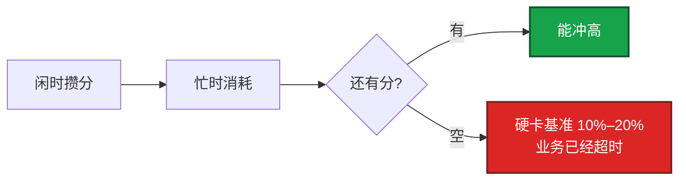
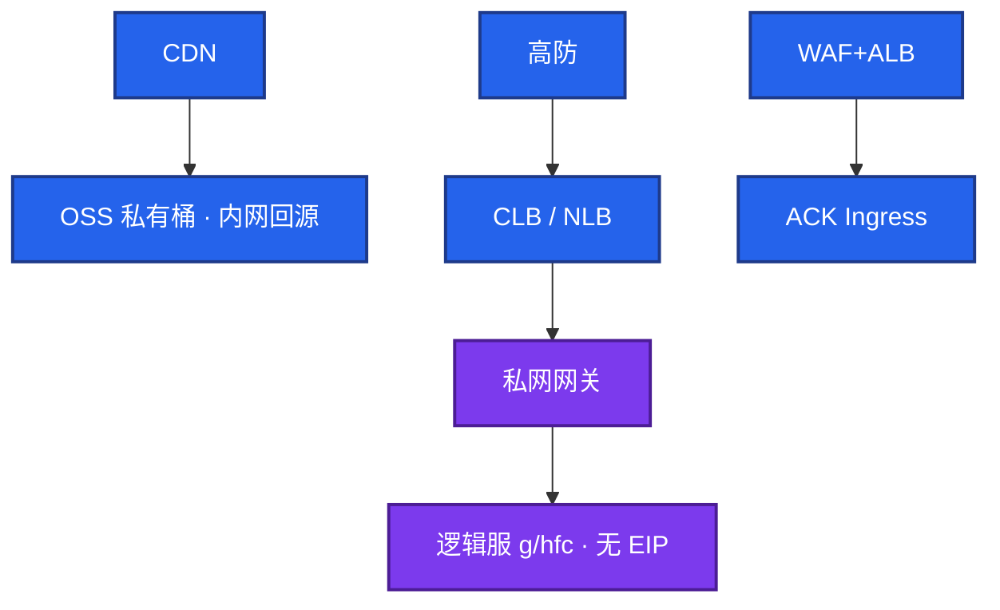
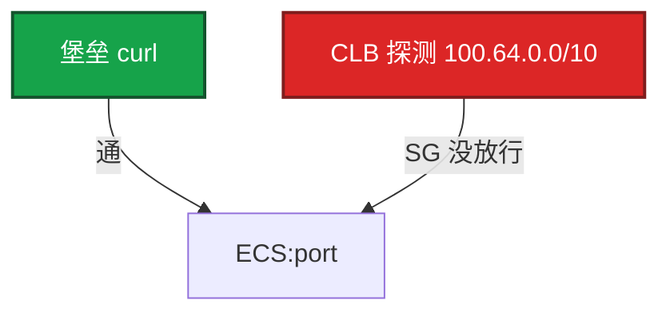

# 02｜阿里云生产 · 练习题

先对照 [知识点](知识点.md) **本章主线** 自己口述，再对答案。每题标了覆盖范围：

| 标记 | 含义 |
|------|------|
| **核心** | 不懂整章就没建立起来 |
| **必会** | 值班和面试都要能讲 |
| **常用** | 线上会反复碰到 |
| **常考** | 白板和追问的高频口径 |

## 本题目录

- [Q1 为什么禁 t 系列](#q1)
- [Q2 国内游戏组合](#q2)
- [Q3 CLB / ALB / NLB](#q3)
- [Q4 本机通、CLB 全红](#q4)
- [Q5 热更 OSS+CDN](#q5)
- [Q6 ACK Terway 与控制面](#q6)
- [Q7 SLS 与告警去重](#q7)
- [Q8 RAM / RRSA](#q8)
- [Q9 源 IP 会话保持](#q9)
- [Q10 开服 5 分钟](#q10)
- [合上书](#合上书)

---

## Q1

**★★★★★｜为什么游戏禁用 ECS t 系列（突发性能）？**

**覆盖**：核心 · 必会 · 常考

**对应**：知识点 §3.1

### 场景

活动期流量没变，逻辑服延迟周期性变差，帧超时、GC 变长。`top` 看不到打满。有人按价格排序买了 t6。群里说「升配加 CPU」。

### 完整解答

**一句话**：游戏禁 t 系列：CPU 积分耗尽会被硬卡基准，top 看不出，要看云监控积分余额。

t 系列靠 CPU 积分，耗尽后性能被卡在基准（可到一成算力），不是平滑降速。游戏逻辑超时、GC 变长，`top` 还看不到打满。打满是利用率贴 100%；积分耗尽是利用率被卡在低基准。

观测：云监控 CPU 积分余额；与流量无关的周期性卡顿。止血：变配到 g / hfc（可能要停机换规格族），开服窗口不够就迁新实例。治理：Terraform 禁 `ecs.t*`；开服模板白名单 g / hfc / c / r。抢占式不能给逻辑服：回收不可控。CI、压测、跑批可以。

### 再追问

CPU 积分耗尽和 CPU 打满怎么区分？变配窗口不够怎么办？——打满能在 `top` 看到忙。积分耗尽看云监控积分余额，不要只看 `top`。活动中发现 t 系列，只能迁流量到 g 规格新实例，不要假设在线升配一定成功。

---

## Q2

**★★★★★｜画一下国内游戏在阿里云上的生产组合。**

**覆盖**：核心 · 必会 · 常考

**对应**：知识点 §2 · §4.1

### 场景

白板：「你们国内区到底怎么跑的？」有人开始背产品名。要的是链路和取舍，不是目录。

### 完整解答

**一句话**：国内游戏按流量形态选入口、按状态选算力、按爆炸半径选权限，不是背产品名。

按流量形态选入口，按状态选算力，按爆炸半径选权限。

数据：RDS 多 AZ + Redis（VPC 内，无公网）。日志：SLS；业务指标常自建 Prometheus；云监控看云资源。权限：人控制台+MFA；程序 RAM 角色 / RRSA，无长期 AK。

开服 5 分钟看 SLB 新建连接、Unhealthy 数、NAT 并发、CDN 回源 4xx。有状态服可以不上 ACK：优雅下线、内核参数、固定容量、SLB 摘流时序。能上的是大厅、登录、无状态 API。答「K8s 万能」会偏。

### 再追问

为什么不全放 ACK？ECI 能跑战斗服吗？——战斗服滚动踢人、PDB、SLB 摘流慢于 Pod 退出。ECI 适合突发 Job，有状态战斗要稳定节点、内核参数、可预期摘流，不要用 ECI 图弹性。

---

## Q3

**★★★★★｜CLB、ALB、NLB 怎么选？自定义 TCP 接到 ALB 会怎样？**

**覆盖**：核心 · 必会 · 常考

**对应**：知识点 §3.2

### 场景

Ingress 默认 ALB 注解套到了游戏端口。玩家随机断线，健康检查按 HTTP 路径来。另一边四层会话保持按源 IP，开服单机 CCU 畸形高。

### 完整解答

**一句话**：自定义 TCP / UDP 用 CLB / NLB，接 ALB 会解析失败、idle 断连、健康检查按 HTTP 来。

TCP / UDP 长连接用 CLB 或 NLB；HTTP 灰度、Header、gRPC 用 ALB。自定义 TCP 接 ALB：解析失败、超时和健康检查按 HTTP 来，随机断线。

ALB 是 L7。NLB 高 PPS / 低延迟更适合战斗。止血：改挂 NLB / CLB，检查端口改四层。治理：游戏 Service 用 NLB 注解；HTTP Ingress 单独一套。

四层会话保持按源 IP：运营商 NAT 后大量玩家同一出口，打到单机 CCU 畸形高。接入层要做连接级调度，不能指望源 IP 哈希。UDP 监听要确认产品是否真支持（老 CLB 有限制），不支持就 NLB。心跳必须 < CLB idle，两端一起改。

### 再追问

改 SLB 注解导致 IP 变了会怎样？——ACK LoadBalancer 重建地址会变。客户端必须走域名。写死 IP 会全服连不上。

---

## Q4

**★★★★★｜SLB 显示后端全挂，ECS 上端口能 curl 通，查什么？**

**覆盖**：核心 · 必会 · 常用

**对应**：知识点 §3.2 · §7

### 场景

实例运行中，监听全红。`curl 127.0.0.1:port` 200。Terraform 刚建的安全组，控制台「允许负载均衡探测」没勾。

### 完整解答

**一句话**：SLB 全红、本机通先放行 CLB 探测源 100.64.0.0/10，不要先重启进程。

放行负载均衡探测（`100.64.0.0/10`）。Terraform / 控制台漏开关就会「实例运行中、监听全红」。七层检查还要路径和状态码对。本机 curl 只证明进程在听。

观测：SLB 健康检查日志；后端有无 100.64 来源的探测。止血：开探测放行或加安全组规则，看到 Healthy 再收紧。有状态服检查过严：检查打到阻塞的业务线程，瞬时变慢被摘流，正在打的玩家被踢到另一台。

### 再追问

火山引擎也能抄 100.64 吗？——不能。健康检查源每家不同，照抄必 Unhealthy。火山以控制台 / 文档为准（08）。

---

## Q5

**★★★★☆｜热更为什么必须 OSS+CDN？ECS+Nginx 行不行？**

**覆盖**：必会 · 常用

**对应**：知识点 §6.1

### 场景

开服十万客户端拉 200MB 包。测试环境用 ECS + Nginx 下包一直没问题。有人把 Bucket 设成公共读「省事」，CDN 回源走了公网域名。

### 完整解答

**一句话**：热更必须 OSS + CDN 私有桶内网回源，ECS + Nginx 扛不住开服十万客户端。

开服十万客户端拉包会打满 ECS 网卡和 NAT。OSS 扛源、CDN 扛边缘。Bucket 私有，回源走 OSS 内网域名，避免公网回源费和公共读被拖库。

对：客户端 → CDN → OSS 内网域名（私有桶，版本在 key 里）。错：ECS Nginx；公共读；回源公网；覆盖同名 latest 不刷新。

观测：CDN 命中率、源站 403、OSS 流控。止血：预热、修鉴权时间差、临时升 CDN；公共读立刻私有化。覆盖同一 key，客户端还是旧包：CDN 缓存。要刷新或改 key。刷新不是全球瞬时一致。强更分两步：新包可下载，再切版本检查服务。

### 再追问

为什么不把热更放云盘？——云盘是块设备，绑实例，吞吐有上限，没有边缘。见 05。RDS blob 当文件库同样错。

---

## Q6

**★★★★☆｜ACK 用 Terway 还是 Flannel？托管了控制面还要你管什么？**

**覆盖**：必会 · 常用 · 常考

**对应**：知识点 §3.3 · §4.2

### 场景

节点池子网是 `/24`。加节点后 Pod Pending，报 IP 不够。RDS 安全组只放了节点网段。老板说上 ACK 就不用懂安装。有人建议改用 Flannel「省 IP」。

### 完整解答

**一句话**：Terway 吃 VPC IP，Flannel 出 VPC 多一跳；ACK 托管 Master，节点池 / CNI / 升级仍是你的。

Terway 让 Pod IP 进 VPC，连 RDS 安全组好写，但吃大量 VPC IP，节点池 `/24` 会耗尽。Flannel 简单，出 VPC 常要 SNAT，排障多一跳。游戏生产常用 Terway，前提是 CIDR 按 Pod 数划。

ACK 托管 Master / etcd，ssh 不进机器。你仍负责：节点池（禁 t）、网络插件、插件兼容、升级窗口（避开开服日）、备份 RPO、Event / Webhook。控制面升级期间 API 可能抖。和 EKS 同一模型：厂商管控制面，影响面仍是你的业务。

观测：`insufficient IP`、节点加不进去。止血：加网段 / 新交换机给节点池，不要现场改已对等的生产网段。Service LoadBalancer 注解写错会「有 External-IP 但不通」；改注解可能换 IP，客户端走域名。数据盘走 PVC，不把游戏状态落节点盘。

### 再追问

RRSA 和节点角色有什么差别？——节点角色一宽，任意 Pod 都能调 API。RRSA 绑到具体 ServiceAccount，Pod 扮 RAM 角色访问 OSS / SLS，不要把 AK 放进 Secret。

---

## Q7

**★★★★☆｜SLS 和自建 ES 怎么选？日志账单为什么会爆？**

**覆盖**：必会 · 常用

**对应**：知识点 §6.2

### 场景

默认上了 SLS。开服夜摄入量和索引费用跳起来。有人把玩家 ID 当索引列，Debug 全量打生产。三个渠道（云监控、SLS、Prometheus）同时炸群。

### 完整解答

**一句话**：SLS 管日志、云监控管厂商指标、Prometheus 管业务黄金指标，账单爆常是高基数索引。

默认 SLS：免 ES 集群、和 ACK 集成快。自建 ES 只在查询模型和保留策略 SLS 搞不定时才上。账单爆通常是全字段索引 + 高基数（玩家 ID）+ Debug 全量打生产。

云监控管厂商指标（ECS/SLB/RDS）。Prometheus 管业务黄金指标（CCU、登录成功率）。SLS 管日志，不要当时序库。

日志突然没了：先看接入点流量是否掉零，再查 agent / 机器组 / RAM 写权限。止血：降采样、砍索引字段、生命周期。治理：三套告警去重，否则开服夜同时炸。

### 再追问

为什么还要云监控？能不能只用 SLS？——ECS / SLB / RDS 的厂商指标在云监控。SLS 管日志。没做 ARMS 埋点就不要吹全链路都在 ARMS。

---

## Q8

**★★★★☆｜RAM 上程序该用长期 AK 吗？**

**覆盖**：必会 · 常用 · 常考

**对应**：知识点 §3.4

### 场景

开服脚本目录里有一把 AK。镜像里也烤进了访问 OSS 的密钥。有人说「反正 Bucket 是私有的」。节点角色给了 OSS `*`，「还上 RRSA 干什么」。

### 完整解答

**一句话**：程序用 RAM 角色 / RRSA，不用长期 AK；节点角色要瘦，Trust 限制 SA。

不用。ECS 用实例 RAM 角色，ACK 用 RRSA，人用控制台 + MFA，CI 用角色。AK 进镜像 / Git 按泄漏：先禁用密钥，再 ActionTrail 查调用（07）。

禁止根 AK；OSS 按前缀授权；一个「万能 OSS 角色」挂全部 Pod 等于没做隔离。打开 ActionTrail，`ConsoleSignin` 无 MFA 和 AK 调用失败要告警。节点角色一宽，任意 Pod 都能调 API。RRSA 绑到具体 SA。

RAM JSON 不能粘成 AWS IAM。模型相同：人走 MFA 扮角色，程序走实例角色 / RRSA，Trust 限制到具体身份。

### 再追问

开服脚本用角色，当天还来不及改 AK 怎么办？——先当泄漏处理：禁 Key、查 Trail、换角色。不要「开完服再收」。打包目录扫 AK 是开服检查项。

---

## Q9

**★★★★☆｜四层会话保持按源 IP，开服为什么一台打满、其它空转？**

**覆盖**：必会 · 常用

**对应**：知识点 §3.2

### 场景

CLB 开了源 IP 会话保持。开服后单机 CCU 畸形高，其它网关空转。玩家大量来自同一运营商 NAT。

### 完整解答

**一句话**：四层源 IP 会话保持会把 NAT 后大量玩家打到同一后端，要做连接级调度。

四层按源 IP 哈希。运营商 NAT 后大量玩家同一出口 IP，会打到同一后端。全球玩家经运营商 NAT 时这个更明显。接入层要做连接级调度，不能指望源 IP 哈希。这和「健康检查源是 LB」是两件事：会话保持解决的是亲和，不是探测。

### 再追问

关掉会话保持，有状态战斗连接会怎样？——新连接可以打散；已有长连接还在旧后端。有状态服本来就该在接入层做连接级调度和 reconnection，不要把亲和全押在源 IP 上。

---

## Q10

**★★★★☆｜开服当天 5 分钟你先看哪几条？**

**覆盖**：必会 · 常用

**对应**：知识点 §6.4

### 场景

活动开始。群里同时报延迟、进不去、热更失败。没有统一检查单。

### 完整解答

**一句话**：开服 5 分钟先看 SLB / 高防 / NAT / RDS / CDN / SLS / 规格，不要从重启逻辑服开始。

按组合检查，不要从重启逻辑服开始：

1. SLB 新建连接、后端 Unhealthy 数（本机通、LB 红 → 100.64）
2. 高防是否黑洞（CCU 断崖、CPU 不高）
3. NAT 并发（出网偶发超时、VPC 内正常）
4. RDS 连接、Redis 带宽水位
5. CDN 回源 4xx、命中率（热更失败）
6. SLS 摄入是否掉零
7. 规格是不是 t（流量没变、周期性卡顿）

任何一项跳变先止血再查。清单：规格、入口、长连接心跳、热更、ACK IP / 域名、数据、日志去重、无长期 AK。

### 再追问

OSS 公共读账单炸，先做什么？——立刻私有化 + 内网回源域名，再查访问日志谁在拖。不要先开会分析「是不是 CDN 配置」。

---

## 合上书

- [ ] 能画出国内三条入口，并说出有状态服可以不上 ACK 的理由
- [ ] 能区分积分耗尽和 CPU 打满；禁 `ecs.t*`、抢占式不给逻辑服
- [ ] 能选出 CLB / NLB vs ALB；默写探测 `100.64.0.0/10`；LB 用域名
- [ ] 能说出 ACK 托管 Master/etcd，节点池 / Terway / 升级窗口 / RPO 仍是你的
- [ ] 能对比 RRSA 与节点角色；程序不用长期 AK
- [ ] 能处理热更 403 / 公共读，以及开服 5 分钟检查单
- [ ] 能用分流图处理积分卡顿、探测源、黑洞，而不是重启逻辑服
