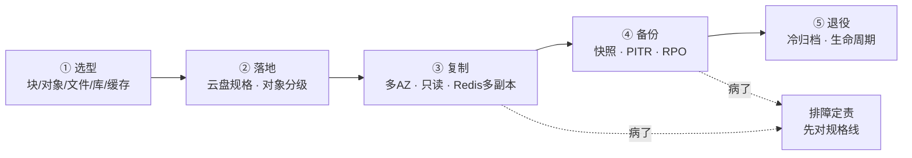
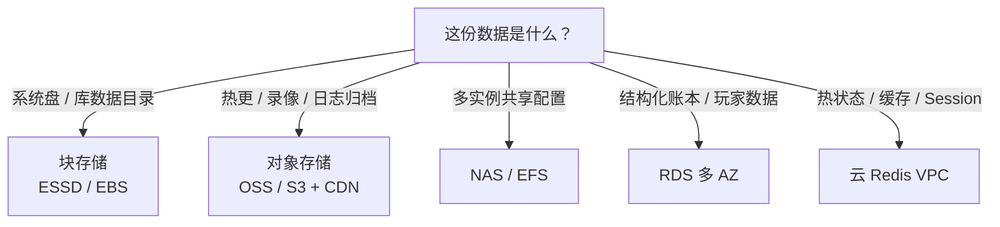
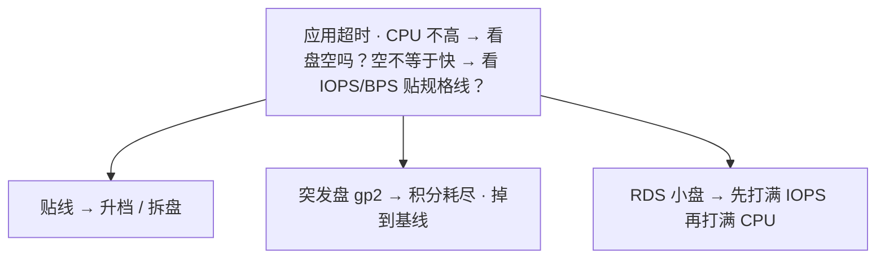
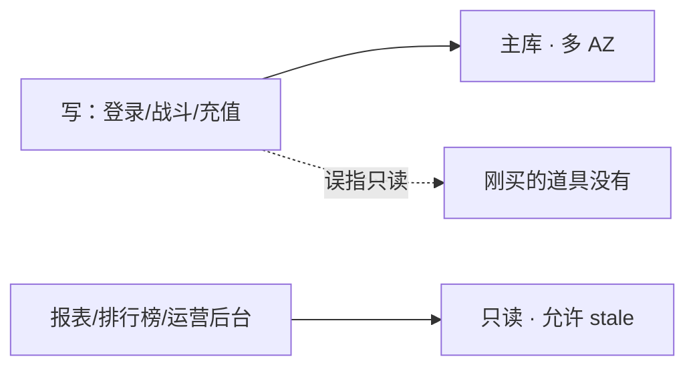
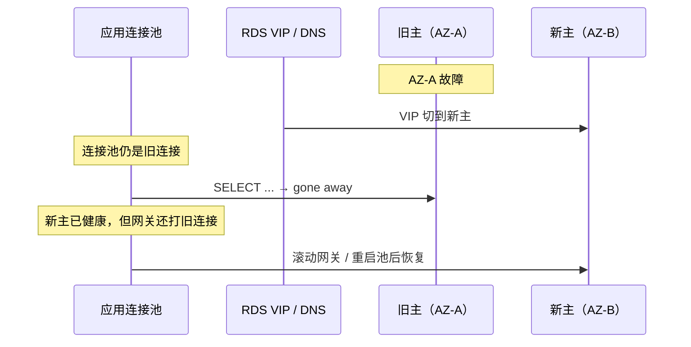
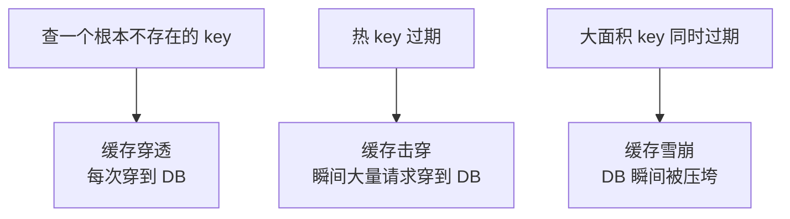
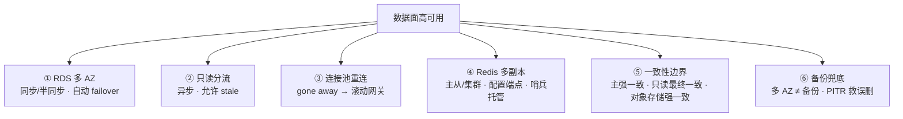

# 云上存储与数据库

> 开服十万客户端拉包，云盘 IOPS 打满、网卡打满——有人还在往 ECS 塞热更；RDS 刚切主，应用还报 `gone away`；Redis 公网忘关被扫满，本机 cli 还通。
> **本章回答**：一份数据在云上的归宿——从选型到落地、从复制到备份、从退役到归档，每段什么会坏、怎么一眼定责。
> **不讲**：MySQL 复制与锁 → [02-01 MySQL](../../02-中间件与数据库/01-MySQL/)；Redis 大 key 内核 → [02-02 Redis](../../02-中间件与数据库/02-Redis/)；游戏回档流程 → [07-09](../../07-游戏运维专题/09-玩家数据备份与回档/)；云盘挂 K8s PVC → [03-11](../../03-Kubernetes/11-存储/)；OSS/S3 产品名与内网 endpoint → [06](../06-阿里云生产/)、[07](../07-AWS生产/)；公共读账单 → [05](../05-成本治理/)；VPC 安全组 → [01](../01-云网络与安全/)。

**标记**：🎯重点 · 🔥难点 · ⭐常考 · 🔧实操

---

## 一、一张图：一份数据在云上的归宿

> 🎯 **一句话**：数据从写入到退役有五站——选型、落地、复制、备份、归档，出了问题先问「它现在卡在哪一站」。



**读图**：
- 主线是一份数据的归宿，五个阶段串成一条时间线：先选放哪种存储，再落地到具体规格，然后做复制高可用，定期备份验 RPO，最后冷数据归档退役。
- 每段都有「规格上限」这个共同病根——云盘 IOPS、RDS 连接数、Redis 带宽、对象存储流出，任一触顶先升配止血，再谈代码和 SQL。这是云上和自建最大的区别：自建靠参数调优能突破瓶颈，云上规格就是天花板。
- `DOC` 是排障入口——先对规格线、画路径，不是先加索引、先改重试。云上「慢」经常是规格上限而不是 SQL 没索引。
- 五个阶段不是孤立的——选型决定了落地到什么规格，落地决定了复制怎么做（RDS 多 AZ 需要选支持多 AZ 的规格），复制决定了备份策略（多 AZ 不替代备份），备份决定了退役时能回到过去哪个时间点。一环错，后面全跟着错。

---

## 二、选型：块、对象、文件、库、缓存各放什么 🎯⭐🔥

> 🎯 **一句话**：块存储给库和系统盘，对象存储给热更和归档，NAS 给共享配置，RDS 给账本，Redis 给热状态——放错层的事故跟着走。

三种存储模型一句话讲清：

- **块存储（云盘 / ESSD / EBS）**：挂到一台 ECS / Pod 的块设备，**POSIX 语义**，延迟低，跟实例生命周期可独立。给库的数据目录和系统盘。`fdatasync` 保证落盘，MySQL 对它的语义是可信的。块存储是「独占」的——一块云盘同时只挂一台实例（除共享盘外），数据一致性由文件系统保证。
- **对象存储（OSS / S3 / TOS）**：HTTP API 读写不可变对象，**无 POSIX**，容量无限，给热更包、录像、日志归档、跨服大文件。`PUT` 一个对象就是原子的，要么全有要么全无。对象存储是「共享」的——多个进程 / 多台机器同时读写同一个桶，但单个对象不可追加修改，覆盖是原子的。
- **文件存储（NAS / EFS）**：多实例同时挂载同一份文件系统，POSIX 语义但锁和延迟弱于云盘。给共享配置、构建缓存。NAS 能做的事是多实例读同一份配置文件、构建缓存目录——不是当数据库、不是当战斗服状态同步、不是当 CDN 源站。POSIX 锁在跨节点时弱于云盘本地锁，延迟也更高。

> 💡 **打个比方**：块存储像本地硬盘——快但只在一台机器上；对象存储像网盘——无限大但要 HTTP 下载，不能当硬盘挂；NAS 像办公室共享盘——大家都能读写但别拿来当数据库。

五件禁止——放错就出事：

- **数据库数据目录禁 s3fs / NAS**：`fdatasync` 在对象存储上会撒谎（实际没落盘就说成功了），POSIX 语义是模拟的，崩了才发现。MySQL 数据目录必须在云盘或 RDS 托管盘上。NAS 的锁和延迟也不对——跨节点并发写同一个 MySQL 数据文件会损坏。测试环境可能不崩——因为并发低、`fdatasync` 撒谎的窗口窄；生产并发一上去或崩溃恢复时才发现数据没落盘。
- **热更禁 ECS 云盘 + Nginx**：开服十万客户端拉包，打满云盘 IOPS 和 ECS 网卡，且没有边缘节点。热更走对象存储 + CDN + 私有桶。CDN 回源到对象存储内网 endpoint，不走 ECS 也不穿 NAT。
- **NAS 禁当战斗服状态同步**：POSIX 锁和延迟都不对，跨节点 Session 同步该走 Redis 或自研。NAS 能做的事是多实例读同一份配置、构建缓存。NAS 不当库、不当战斗状态、不当 CDN 源站。POSIX 锁在跨节点时弱于云盘本地锁，跨节点并发写同一文件可能损坏。
- **Redis 禁当唯一账本**：failover 可能丢秒级数据，持久化 ≠ `appendfsync always`。账本在 RDS，Redis 是热状态。充值流水、道具发放记录必须落 RDS，Redis 只做热缓存。Redis 当账本出事的典型场景：failover 后发现充值记录少了——主从异步复制，主挂了从没来得及同步。
- **跨服大文件禁进 RDS blob**：备份、IOPS、恢复窗口一起拖垮。放大文件走对象存储。录像、截图、日志归档都不该进 RDS——RDS 是结构化账本，不是文件存储。大文件进 RDS blob 会让备份膨胀、恢复变慢——一个 10GB 的录像 blob 把整个库的恢复窗口从分钟拉到小时。



**读图**：选型第一刀是「这份数据是什么」——是文件系统里的文件走块，是不可变的大对象走对象存储，是多客户端共享的配置走 NAS，是结构化的账本走 RDS，是高频读写的热状态走 Redis。选错层，后面所有优化都是白费。常见事故：把热更包放 ECS 云盘（IOPS 打满）、把 MySQL 数据目录放 s3fs（`fdatasync` 撒谎）、把跨服录像塞进 RDS blob（备份和 IOPS 一起拖垮）。

选型不是一劳永逸的——数据有生命周期，不同阶段可能在不同存储层。玩家存档在活跃期走 RDS，退役后走对象存储归档；战斗录像先写对象存储标准存储，30 天后转低频，1 年后转归档。选型时就要考虑退役路径，不要等数据堆满了才想「这些东西放哪」。

> ⚠️ **别混**：块存储和对象存储不是「同一种东西的两种接口」——块存储有 POSIX 语义（`fsync` 保证落盘），对象存储是 HTTP API（`PUT` / `GET` 不可变对象），两者的 consistency 模型和延迟天差地别。`s3fs` 把对象存储挂成块设备，POSIX 语义是模拟的，`fdatasync` 会撒谎。

> 📝 **面试**：「块给库和系统盘，对象给热更和归档，NAS 给共享配置；五件禁止：DB 目录禁 s3fs、热更禁 ECS+Nginx、NAS 禁战斗状态、Redis 禁当账本、大文件禁进 RDS blob。」

---

## 三、落地：云盘规格与对象存储分级 🎯⭐🔥

> 🎯 **一句话**：云盘 IOPS 按规格锁死不是盘空就快；对象存储分四级（标准/低频/归档/冷归档），按访问频率选 tier。

### 云盘 IOPS：规格上限和突发积分 🔧🔥

云盘 IOPS 不是「盘空就快」。阿里云 ESSD 分 PL0 / PL1 / PL2 / PL3，AWS 分 gp2 / gp3 / io2 / io2 Block Express——**IOPS 和带宽按规格绑定**，不是按容量。ESSD PL0 的 IOPS 上限就那么多，盘再大也不会更快。

> 💡 **打个比方**：云盘 IOPS 像「套餐里的流量包」——盘再大，PL0 的上限就那么多。突发型云盘（AWS gp2）像手机套餐的「加油包」，攒着积分时能突发，积分耗尽掉到基线——和 ECS t 系列突发 CPU 同一类「突然变慢、CPU 看起来不忙」。突发积分的计算：gp2 每秒获得积分 = 配置 IOPS / 最大 IOPS × 540 万，积分上限 = 配置 IOPS × 54 分钟。积分耗尽后掉到配置 IOPS（基线）——不是掉到 0，但和突发时的 IOPS 差了几倍。生产数据盘不能用 gp2——突发积分是有上限的，活动期间持续高 IOPS 会耗尽积分掉到基线。生产必须用 gp3 / io2 / ESSD 等「不靠积分」的规格。



```bash
iostat -x 1
# Device  rrqm/s  wrqm/s  r/s    w/s   rkB/s  wkB/s  avgr-r-sz  await  %util
# sdb       0.0     0.0   3200   120   51200   1800     16.0    45.2  98.5
# ← await 高、%util 接近 100 = 磁盘瓶颈，不是 CPU 瓶颈
```

止血：改 gp3 / io2 / ESSD 更高档，或拆盘。治理：按压测 IOPS 选型，不要按容量买最小盘。系统盘只放镜像和日志，MySQL 数据不放系统盘。RDS 小盘也会先打满 IOPS 再打满 CPU——规格页上的 IOPS 上限就是天花板。生产数据盘要预留 30% IOPS 余量，活动期用量按峰值 × 1.3 买，不是按平均值买。

> ⚠️ **别混**：ESSD PL0 和 PL1 的 IOPS 上限差几倍，但盘的容量可以一样——选型看规格不看容量。同理 AWS gp3 的 IOPS 和吞吐可以独立调（不像 gp2 绑容量），但买了 gp3 不调参数还是默认值——很多团队升了 gp3 却忘了调 IOPS 参数，等于白花钱。

**扩容 vs 文件系统 grow** 🔧：多数云盘支持在线扩容容量，但**文件系统仍要 grow**：

```bash
lsblk
# sdb  500G  ← 控制台已扩到 500G
df -h
# /dev/sdb  200G  ← 文件系统还是旧大小 = 没 grow
# ← resize2fs（ext4）或 xfs_growfs（xfs）后才会变
```

扩容后文件系统不 grow 的根因：云盘扩容改的是块设备大小（`lsblk` 看得到），但文件系统（ext4 / xfs）的元数据还记录旧大小——文件系统不主动探测底层块设备变大了。`resize2fs` / `xfs_growfs` 就是让文件系统重新读取底层块设备大小并更新自己的元数据。xfs 只能 grow 不能缩——所以 xfs 扩容后想缩回来是不行的，ext4 虽然可以缩但生产没人敢做。

> ⚠️ **别混**：控制台显示盘已经 500GB、`df` 还是 200GB，卡在文件系统没 grow，**不是云盘没扩**。生产变更把「盘变大了但 ext4 没长」写成检查项。不要在生产数据盘上试修损坏；止血用快照新建盘挂上。

**加密盘与 KMS**：生产数据盘 / RDS / Redis 静态加密默认要开，密钥走 KMS / RAM 角色。快照继承加密。**加密盘丢了 KMS 权限等于丢盘**——破窗流程要能拿到密钥，不能只备份盘。不要把盘口令打进镜像。加密对性能的影响通常 < 5%，但和云盘规格上限叠加后可能压到最后几个百分点——选型时 IOPS 要多留余量。

加密盘的破窗流程要演练——不是「密钥在 KMS 里就行」。出事时谁有 KMS 解密权限？应用角色被误删了怎么办？密钥被 scheduled deletion 了怎么办？破窗演练至少每季度一次，和 restore 演练一起做。演练内容：拿到密钥 → 用快照新建加密盘 → 挂到实例 → 启动应用 → 校验数据可读。不演练的密钥等于没有密钥——出事时才发现权限链断了。

### 对象存储分级：标准 / 低频 / 归档 / 冷归档 ⭐

对象存储不是只有一种存储类型。按访问频率分四级：

| 对比 | 标准存储 | 低频 | 归档 | 冷归档 |
|------|---------|------|------|--------|
| 适用 | 频繁访问 | 月级访问 | 年级访问 | 极少访问 |
| 存储价格 | 贵 | 便宜 | 很便宜 | 最便宜 |
| 取回 | 免费 | 按量收费 | 解冻需秒到分钟 | 解冻需小时 |
| 最低存储期 | 无 | 30 天 | 60 天 | 180 天 |

> 💡 **打个比方**：标准存储像手边的书架（贵但随手拿），低频像柜子（便宜但走两步），归档像仓库（很便宜但要登记取），冷归档像地下冷库（最便宜但要预约等几天）。

注意低频和归档有**最低存储期**——提前删除也要付存储费。低频 30 天、归档 60 天、冷归档 180 天。所以生命周期规则的转换时间不能短于最低存储期——把标准存储转低频后 10 天又删掉，仍要付 30 天的存储费。

**生命周期（lifecycle）规则**：按前缀和时间自动转换 tier 或删除。热更包前缀和日志归档前缀**不要用同一条规则**——热更包过早转归档会拉高取回延迟（玩家拉包要等解冻），日志堆着不删会炸存储费。

**版本控制（versioning）**：开版本控制后，覆盖同名对象不会丢旧版——误删 / 误覆盖可恢复。代价是存储量涨，要配合生命周期定期清旧版本。**删除权限要单独授并告警**——版本控制是兜底，权限收窄是预防。开了版本控制的桶还有一种特殊风险：DELETE 请求只打删除标记（delete marker），不是物理删除——存储量继续涨。必须配生命周期规则定期清理 delete marker 和旧版本，否则版本控制的代价会悄悄吃掉存储预算。

**对象存储强一致**：2020 年起 AWS S3 和阿里云 OSS 都已支持**强一致性**——`PUT` 后立即 `GET` 就能读到最新对象，不再有「写后读到旧值」的最终一致问题。但**跨地域复制**（cross-region replication）仍是**最终一致**——异步复制有延迟，异地副本不是立即可读最新的。对象存储强一致改变了游戏热更的流程——以前热更包上传后要等几秒再刷新 CDN 源站，现在上传即可读。但 CDN 缓存刷新是另一层——强一致只保证源站读到最新，CDN 边缘节点的缓存过期仍按 TTL 来。所以热更流程是：上传新包到对象存储 → 主动刷新 CDN 缓存 → 客户端拉到新包。

**私有桶与 Block Public Access**：生产桶必须**私有 + Block Public Access**。公共读 = 下载费炸弹（详见 [05](../05-成本治理/))。热更包走 CDN + 内网回源，拉镜像 / 回源走内网 endpoint（OSS 内网域名、S3 Gateway Endpoint），不要穿 NAT（会算 NAT 处理费）或走公网（账单先炸）。桶策略和 IAM 策略两层都要收窄——只放应用角色的读写权限，不开放匿名读。CDN 回源鉴权用签名 URL 或桶策略限定源 IP 段，不要靠「桶是私有的就放心」——CDN 缓存的是对象副本，回源时仍要验证权限。

> ⚠️ **别混**：对象存储强一致和跨地域复制最终一致是两码事——同地域写后读是强一致，跨地域副本是异步的最终一致。别拿「对象存储最终一致」当过时答案——2020 年后同地域已强一致。

> 📝 **面试**：「对象存储分标准/低频/归档/冷归档，生命周期按前缀自动转 tier；版本控制防误删；2020 年起 S3/OSS 已强一致——写后立即可读；跨地域复制仍最终一致；私有桶 + Block Public Access + 内网 endpoint。」

---

## 四、复制与高可用：RDS 多 AZ、只读与 Redis 多副本 🎯⭐🔥

> 🎯 **一句话**：多可用区（Multi-AZ）保写路径高可用，只读实例给查询；切主后连接池要重连；Redis 多副本是最终一致、不能当账本。

### RDS 多可用区（Multi-AZ）vs 只读实例 ⭐🔥

这两个经常被说成「都是高可用」，完全不是一回事：

| 对比 | 多可用区（Multi-AZ） | 只读实例（读副本 / read replica） |
|------|----------------------|----------------------------------|
| 目的 | **高可用**（HA），抗 AZ / 主机故障 | **读扩展**，分摊读 QPS |
| 复制 | 同步或半同步（主备复制，产品而异） | **异步**，可落后 |
| 切换 | 自动 failover，秒到分钟级中断 | 主挂了只读还在，但**不能自动变主** |
| 数据 | 切换后应无或极少丢失 | 延迟内的读是旧的（最终一致） |

多 AZ 的主备架构：主库在一个 AZ，备库在另一个 AZ，主备之间走同步或半同步复制。failover 时 VIP / DNS 切到备库，备库升主。注意「主备」和「主从」在云上常被混用——RDS 多 AZ 是**主备**（备库不接流量，只等 failover），只读实例是**主从**（从库接读流量，异步复制）。同步模式下主库等备库确认才返回成功，数据零丢失但写入延迟增加；半同步模式在超时后降级为异步，兼顾延迟和数据安全——云厂商的具体实现要看文档，别假设都是同步。

> 💡 **打个比方**：多 AZ 像银行金库两地备份（主库出事备用库立刻顶上），只读副本像银行开的多个查账窗口（能分流但不能当主库用）。

写路径（登录、战斗、充值）**必须打主库**。只读只给报表、排行榜、运营后台——这些场景**允许 stale**（最终一致）。误把写路径指到只读，活动刷表后副本落后分钟级，玩家看到「刚买的道具没有」。另一种事故：排行榜读只读，但活动发奖是写主库，发奖后立刻查排行榜——副本还没同步，排行榜显示旧排名，玩家投诉「为什么领了奖排名没变」。正确做法是写后延迟读主库或直接读主库。



**读图**：写打主库、读打只读，两条路径分开。`gone away` 和 stale 是两种不同的病——前者是切主后连接池没重连（五节详述），后者是只读落后于主库。写路径误指只读的典型事故：活动期间副本落后分钟级，玩家充值后查背包只读还没同步，看到「刚买的道具没有」——不是充值没到账，是读到了旧副本。

只读实例规格选择常见误区：以为只读不写就可以买小规格。活动报表一打只读，CPU 或 IOPS 先打满——只读也要按读 QPS 选型，不是按「不写就不忙」选。只读的规格建议 ≥ 主库的 0.5 倍，活动期间至少 0.8 倍。如果只读是给运营后台用的，运营后台查询通常是大查询、全表扫描，对 IOPS 的压力比应用端更高。

**只读延迟怎么看**：控制台看 `ReplicaLag` / 秒级延迟。大事务、DDL、活动刷表会让副本延迟从毫秒跳到分钟。应用必须能接受 stale——不能接受 stale 的读路径必须打主库。只读规格可以小于主库，但活动报表一打只读先成为瓶颈——只读也要按读 QPS 选型。活动期间只读的 `ReplicaLag` 要加告警，延迟超过 10 秒就要把关键读路径切回主库。

只读延迟跳变的典型原因：主库做了一个大事务（比如合服时的批量 UPDATE 影响百万行），只读要回放这个事务，期间副本是单线程回放的——主库多并发写，只读单线程追，延迟必然跳。DDL（比如 ALTER TABLE）在只读上也可能锁表导致延迟。活动前如果有 DDL，要在低峰提前做——不要在活动高峰期跑 DDL，DDL 不止打主库，还会把只读延迟拉到分钟级。

> ⚠️ **别混**：多 AZ **不能替代备份**。failover 复制的是**已经误删的数据**——主库 DROP 了表，备库也跟着 DROP。误删靠 PITR（五节），不靠 failover。只读也不是备份——它落后于主库，且不能自动变主。**多 AZ 是 HA，只读是读扩展，备份是备份——三件不同的事。**

### 切主后连接池：`gone away` 🔧🔥

RDS 多 AZ failover 时，VIP / DNS 已切到新主，但应用的连接池里还是旧连接——旧主已经不在了，连接报 `gone away`。



**读图**：VIP 切换是秒级，但连接池不知道——它没收到通知，继续用旧连接打已经不存在的旧主。新主已经可写，网关还在报错。RTO 包含三段：**切换本身 + 连接池重连 + 未提交事务回滚**，不承诺玩家无感。未提交事务回滚是第三段——旧连接上的事务可能正在执行中（比如一个大的 UPDATE），旧主消失后这个事务回滚需要时间。如果事务很大（涉及大量行），回滚本身可能比切换和重连加起来还久。所以排障时看到「新主健康、连接池已重连、但应用还报错」——可能是在等大事务回滚。

止血：**滚动网关 / 重启连接池**，不要先再切一次主。治理：连接池校验（`SELECT 1` 探活）、failover 演练（真切一次）。切主窗口按「秒到分钟级中断 + 连接池重连」写进预案。充值路径要能对账——不能靠「连接还在」判断业务正常。**不要再切一次主**——第二次 failover 会再次中断正在恢复的连接，把 RTO 从秒级拉到分钟级。连接池探活的频率要够高（建议 5–10 秒），否则 failover 后到下次探活之间的请求全部失败。

连接池配置的三个关键参数：`maxLifetime`（连接最长存活时间，要 < RDS 的 `wait_timeout`，否则 RDS 先踢连接、应用还以为连接活着）、`idleTimeout`（空闲连接超时回收）、`connectionTimeout`（获取连接超时）。failover 后旧连接的 `maxLifetime` 还没到，连接池不会主动回收——必须靠探活或重启来清。很多团队配了连接池但不配探活，failover 后就是等 `maxLifetime` 自然回收——RTO 变成了几分钟甚至更久。

### max_connections 与参数组 🔧

云上 `max_connections` 常被规格锁死。连接池 × 进程数超限直接拒绝：

```text
Too many connections
# ← 池 × 进程数超过规格锁死的上限
# ← 先杀长事务 / 泄漏连接，再升规格，不要无限加大应用池
```

`innodb_buffer_pool` 在云上常被规格锁死，不是想改多少改多少。参数组变更要当生产变更——有的参数要重启。开服夜禁止顺手改 `innodb_buffer_pool` / `slow_query_log`，除非变更单写明接受重启。能区分「动态参数」和「重启生效」，避免开服夜改 `slow_query_log` 把实例重启了。参数组变更的正确流程：在 staging 验证 → 提变更单写明是否需要重启 → 选择低峰窗口执行 → 改完确认实例状态正常。云控制台会标注 Apply Type（dynamic / pending-reboot）——dynamic 立即生效，pending-reboot 要等下次重启。看到 pending-reboot 不要心存侥幸，不是「可能不用重启」。

### 云 Redis：多副本、硬顶与坑 ⭐🔥

云 Redis（阿里云 Redis、ElastiCache、腾讯云 CREDIS、火山 veDB Redis）是**规格合同**——连接数、带宽、QPS 有硬上限。云Redis和自建 Redis 最大的区别不是功能，而是**规格合同**——你买的规格就是天花板，不是靠参数调优能突破的。

**主从与集群版**：

- **主从版（标准版）**：一主多从，**异步复制**（主从复制），failover 由**哨兵（Sentinel）**或云平台托管。从库可读不可写。哨兵负责监控主存活、自动选新主、通知客户端切换——云上这层由平台托管，但客户端仍要用配置端点而非写死 IP。
- **集群版**：分片（slot），每个分片各自主从。**不能用跨 slot 的事务**（`MULTI` / `EVAL` 跨 key 会报错）。游戏若用了 `KEYS`、跨 key 事务、Lua 乱访，上集群版会直接失败。

主从版适合小规模或单分片场景——扩容靠升配（加内存、加带宽），不能水平扩。集群版适合大数据量或高 QPS 场景——可以加分片水平扩，但跨 slot 命令报错是硬限制。游戏上集群前必须验收：跑一遍 `MULTI`、`EVAL`、跨 key 操作，确认 key 分布是否在同 slot——用 hash tag `{tag}` 可以把相关 key 路由到同一分片，但前提是设计时就规划好了 tag。

> ⚠️ **别混**：主从版和集群版的限制完全不同——主从版没有 slot 限制但扩容靠升配；集群版可水平扩但跨 slot 命令会报错。上集群前必须验收跨 slot / Lua。

**持久化 RDB / AOF**：云 Redis 的持久化受规格限制——有的规格 AOF / RDB 受限或关闭。**failover 可能丢秒级数据**——不能假设和自建 `appendfsync always` 一样。所以 **Redis 不能当唯一账本**，账本在 RDS。RDB 是定期快照，恢复时丢的是「最近一次快照到故障之间」的数据；AOF 是追加日志，恢复时丢的是「最后一次 fsync 到故障之间」的数据。云上规格限制可能让你选不了 `appendfsync always`（每次写都 fsync，性能差但数据最安全），只能选 `everysec`——所以最多丢 1 秒。但这是「规格允许的情况下」——有的规格直接关了 AOF。

**配置端点 vs 节点 IP**：云 Redis 有**配置端点**（configuration endpoint）——failover 后配置端点指向新主，连接自动恢复。**禁止写死节点 IP**——升主后 IP 变，连接池打到幽灵节点，本机 `redis-cli` 连配置端点通，应用还打旧 IP，表现为部分进程超时。

集群版的配置端点和主从版不同——集群版配置端点返回的是所有分片的主从节点列表，客户端 SDK 据此建立连接拓扑。failover 后某个分片的主变了，客户端需要刷新拓扑——SDK 自动做这事，但前提是客户端用的是智能 SDK 而不是裸 `redis-cli`。用裸 `redis-cli` 连集群版要加 `-c` 参数，否则跨 slot 命令直接报错。

```bash
redis-cli -h <配置端点> INFO clients
# connected_clients:10000
# blocked_clients:5
# ← 连配置端点通，但应用写死节点 IP 的进程还在超时
```

**硬顶**：活动期 `rejected connections` 或超时，先看连接 / 带宽 / QPS 是否触顶（**80% 告警**，开服夜水位 **< 70%**），不要先改应用重试把连接打得更满。止血三招：升配、拆池、砍大 key。Redis 的 QPS 硬顶和连接数硬顶是两个不同的限制——QPS 超了报 `slowlog` 堆积、响应变慢；连接数超了报 `rejected connections`。两个都可能表现为应用超时，但解法不同：前者砍大 key / 优化命令，后者升配或拆连接池。

**禁用命令**：`FLUSHALL`、`KEYS`、`CONFIG` 常被禁或应被禁。自建习惯 `KEYS *` 在云上会失败或被审计。大 key / hot key 用控制台诊断，不要生产 `KEYS *`。替代方案：`SCAN` 替代 `KEYS`（渐进式遍历不阻塞）、`MEMORY USAGE` 看单个 key 大小、`OBJECT ENCODING` 看编码类型。云控制台的大 key / hot key 诊断是后台采样做的，不影响生产性能——比手动跑命令安全得多。

**禁公网**：Redis 开公网 = 内存数据库暴露在 DDoS 面上。扫描把连接打满，本机 cli 还通——应用连的是被打满的那条公网入口。只走 VPC，安全组只放应用。传输 TLS、静态加密默认开；密钥在 KMS / 角色上，不要把盘口令打进镜像。Redis 公网暴露的典型信号：`connected_clients` 突然暴涨但应用 QPS 没变——是扫描器在连。止血：关公网入口、改安全组只放应用 VPC、查是否有数据被读走（监控 `GET` 命令频率突增）。

**代理模式**：有的云有 Proxy 层，会改变客户端看到的拓扑。连接池参数按云文档配，不是按自建。代理层会多一跳延迟，但简化了客户端 failover 逻辑——客户端连代理，代理负责路由到正确节点。代理模式的坑是连接数翻倍——每个客户端到代理一条连接，代理到后端又一条连接，总连接数 × 2。规格硬顶按代理到后端的连接算，不是按客户端到代理的连接算——很多人在这里看错控制台数字。

**noeviction 与内存管理**：`noeviction` 策略下内存满直接写失败（返回 error）。逻辑服当 DB 用 Redis 必须监控 `used_memory` 和 `evicted`。生产推荐用 `allkeys-lru` 逐出冷数据，但**账本路径不要用 `noeviction` 当 DB**——那不是 Redis 该干的。内存使用率 80% 告警，开服夜 < 70%。

内存满的两种表现：`noeviction` 下写操作返回 `OOM command not allowed`，应用看到 error 但不知道是 Redis 满了；`allkeys-lru` 下冷 key 被逐出，应用感觉缓存命中率下降、响应变慢但不报错。前者爆炸但好发现，后者沉默但更危险——命中率下降后 DB 压力悄悄涨上去，等 DB 也满才发现链路断了两层。生产必须监控 `evicted_keys` 和 `keyspace_hits / misses`，不等的「Redis 没报错」就以为没事。

### 缓存穿透 / 击穿 / 雪崩 🔥

三种「Redis 挡不住」的病，对策完全不同：



- **缓存穿透（penetration）**：查询一个**根本不存在**的 key，每次都穿到 DB。原因：恶意攻击或 bug。对策：空值缓存（短 TTL）、布隆过滤器拦截。空值缓存要注意 TTL 别设太长——恶意构造大量不存在的 key 会把缓存也撑满。布隆过滤器的代价是初始化要预热（从 DB 加载所有 key），且不能删除元素（只能重建）。
- **缓存击穿（breakdown）**：**热 key 过期**的瞬间，大量请求同时穿到 DB。对策：热 key 永不过期（手动更新）、互斥锁（只放一个请求回源，其他等）。互斥锁的实现要小心：锁本身也是个 key，锁的 key 过期了多个请求同时回源——互斥锁的 TTL 要远小于业务 key 的 TTL。
- **缓存雪崩（avalanche）**：**大面积 key 同时过期**，DB 瞬间被压垮。对策：TTL 加随机抖动、分批过期。雪崩和击穿的区别是规模——击穿是一个热 key，雪崩是一批 key 同时失效。雪崩更危险因为 DB 会被多个 key 的回源请求同时打满，不只是一条查询。

> ⚠️ **别混**：穿透是「查不存在的 key」（key 从来没有），击穿是「热 key 过期」（key 有过但没了），雪崩是「大面积同时过期」。穿透挡在入口（布隆过滤器），击穿保热 key（永不过期 / 互斥），雪崩打散过期时间。三种病对策完全不同，别一套「加重试」糊弄。加重试对三种病不仅没用还会帮倒忙——穿透时重试打 DB 更猛，击穿时重试挤在互斥锁后面排队更久，雪崩时重试让 DB 压力叠加更大。

### 一致性：强一致 vs 最终一致 ⭐

| 数据位置 | 一致性模型 | 说明 |
|----------|-----------|------|
| RDS 主库 | **强一致** | 写后立即读到最新值 |
| RDS 只读 | **最终一致** | 异步复制，有延迟 |
| Redis 从库 | **最终一致** | 异步复制，failover 可能丢秒级 |
| 对象存储（同地域） | **强一致** | 2020 年起写后立即可读 |
| 对象存储跨地域 | **最终一致** | 异步跨地域复制 |

> 📝 **面试**：「RDS 主库强一致、只读最终一致；Redis 主从异步复制最终一致、failover 丢秒级；对象存储 2020 年起已强一致，跨地域复制仍最终一致。账本必须放强一致的 RDS 主库，不放在最终一致的 Redis 或只读。」

### 收束：数据面凭什么高可用



**读图（分组）**：①②是 RDS 的 HA + 读扩展（多 AZ 保写、只读分读）；③是切主后的应用侧收尾（连接池重连）；④是 Redis 的高可用（多副本 + 配置端点 + 哨兵托管）；⑤⑥是边界——一致性级别和备份兜底。

这六个组件是数据面高可用的完整清单——缺任何一个都有缺口。常见漏配：开了多 AZ 但没配连接池探活（③缺），failover 后 gone away；开了只读但没配 `ReplicaLag` 告警（②缺），副本落后了不知道；开了 Redis 多副本但客户端写死节点 IP（④缺），failover 后打幽灵节点。每一条都要在上线 checklist 里逐项确认。

> ⚠️ **别混**：这套机制**不保证**：failover 不丢数据（Redis 丢秒级、RDS 看同步模式）、**不保证**只读能自动变主（要手动提升）、**不保证**连接池自动重连（要滚动网关）、**不保证**多 AZ 替代备份（failover 复制误删）。多 AZ 是 HA 不是备份，只读是读扩展不是 HA，备份是备份——三件不同的事。

> 📝 **面试**（记忆分组法）：数据面高可用分三组——**RDS 组**（多 AZ 保写 + 只读分读 + 切主重连）、**Redis 组**（多副本 + 配置端点 + 硬顶 + 不当账本）、**一致性边界**（主库强一致、只读 / Redis 最终一致、对象存储已强一致）。最后补一句「多 AZ 是 HA 不是备份，误删靠 PITR」。

---

## 五、备份与回档：快照、PITR 与 RPO 🎯⭐🔥

> 🎯 **一句话**：RPO 以校验过的 restore 为准——没 restore 过的数字是假的；误删靠 PITR，不靠 failover。

### 快照 vs RDS 备份

| 对比 | ECS 云盘快照 | RDS 备份 |
|------|-------------|----------|
| 救什么 | 这台机的文件系统 | 这个库可恢复到时间点 |
| 一致性 | 常**崩溃一致**（非应用一致） | 热备 / 托管一致 |
| 用途 | 整盘回滚 | 库级 / 表级恢复到时间点 |

**增量快照**：云盘快照通常是**增量**的——只备份自上次快照后变化的块。好处是快、省存储；代价是**恢复时要回放整条快照链**，链断了中间的版本可能恢复不了。快照链不要当唯一备份——删实例时有的产品连快照策略一起清。开服前、合服前打快照，止血用快照新建盘挂上，不要在生产盘上试修。快照策略要配告警——快照创建失败不告警，出事才发现没有可用快照，和备份失败一样危险。

快照恢复的正确姿势：选快照 → 新建云盘 → 挂到另一台 ECS → 校验文件系统 → 挂载后检查数据完整性 → 决定是否替换原盘。整个过程不碰生产盘——在生产盘上试修损坏是第二大事故来源（第一是误删）。

> ⚠️ **别混**：用快照冒充数据库 PITR，会丢 binlog 里那几分钟。裸盘快照常是**崩溃一致**——不是「应用一致」——MySQL 要 `flush tables with read lock` / 热备或用 RDS 备份才能拿到应用一致。合服前两者都要，用途不同。

崩溃一致 vs 应用一致的详细区别：崩溃一致是「断电时的磁盘状态」——文件系统可能有一致性问题（journal 回放后恢复），数据库可能有一致性问题（InnoDB crash recovery 回滚未提交事务）。应用一致是「正常关闭时的状态」——所有 buffer 都 flush 了、所有事务都提交了。裸盘快照等于拔电源——InnoDB 的 crash recovery 能救，但 binlog 可能少最后几条。RDS 热备在备份时做了协调（`FLUSH TABLES WITH READ LOCK` 或 InnoDB hot backup），拿到的是应用一致。

### PITR 与 RPO

**按时间点恢复（PITR，Point-in-Time Recovery）**：依赖 binlog 是否开、保留多久。restore 到**新实例**，校验行数 / 账本 / 最大主键，再决定切连接串——不要在生产实例上「回滚试试」。

PITR 的时间点选择：恢复到误操作前 1～5 分钟，不是恢复到「事件发生时」。因为误操作可能持续了一段时间——DROP TABLE 可能不是一次，先 TRUNCATE 再 DROP。恢复到误操作前的安全点，校验数据完整性后再切。时间点选择要和业务方确认——「误操作是几点几分」不是运维一个人拍板的，要查操作日志、审计记录。

```bash
# 阿里云: DescribeBackups + 指定时间点恢复到新实例
# AWS:   aws rds restore-db-instance-to-point-in-time --source-instance-id ... --restore-time 2024-...
# ← restore 到新实例，校验后再切连接串，不在生产上试
```

**RPO = 故障时最多丢多久的数据**。要落到数字和校验：

```text
不能写进 RPO 的：           能说出口的 RPO：
  只读副本                     自动备份 + PITR
  同盘未校验快照                跨地域备份 · 救地域
  策略上写的 24h               隔离 restore 演练过
```

RPO 不是「备份策略上写的数字」——是「校验过的 restore 能恢复到的最近时间点」。策略上写「每 1 小时备份一次」不代表 RPO 是 1 小时：如果备份失败了、binlog 没开、restore 没演练过，RPO 可能是「上次成功备份到现在」甚至「永远」。RPO 的正确表述：「上次 restore 演练可以恢复到 T-1 小时，所以 RPO = 1 小时」——带时间点和演练记录，不带「策略上写的」。

> 💡 **打个比方**：「策略上写 RPO 24 小时」就像保险单上写「赔付 100 万」——你没真理赔过就不知道能不能赔。RPO 以**校验过的 restore** 为准。

生产要求：① 备份失败要告警（失败比没有更危险，你以为有）；② **定期 restore 演练**到隔离实例，校验表行数和关键账本——没 restore 过的 RPO 是假的；③ 保留期覆盖「发现误操作的最长时间」（游戏常见几天后才发现发错道具，账本 binlog 留 **14～30 天**）；④ 充值 / 账本库备份与游戏库分开策略，权限更严，删除备份要双人。

备份策略的分层设计：日常自动备份（每日全量 + binlog 增量）保 7～30 天，应对常规误操作；跨地域备份保 30～90 天，应对地域级故障；合服 / 开服前手动打快照 + RDS 备份，应对大规模变更回滚。三层备份对应三种恢复场景——日常误操作走 PITR、地域故障走跨地域恢复、变更回滚走手动快照。

**restore 演练的校验清单**：表行数（主库 vs 恢复实例）、充值流水最大 ID、玩家最大主键、关键配置表内容。校验通过后再切连接串，不通过的重新选时间点。充值 / 账本库的 restore 演练频率高于游戏库——账本出问题的代价更大。演练记录要写进交付文档：「上次演练日期、选的时间点、校验结果、是否有偏差」——不写记录等于没演练过，出事时谁也说不清 RPO 到底是多少。

> ⚠️ **别混**：binlog 留 7 天而运营 10 天后发现发错道具，**RPO 窗口已经关了**。释放 RDS 后备份是否还在，要在删除前看清楚——有的产品**释放即清**。改实例删除保护、禁止控制台误释放。只给 DBA `Restore` 不给 `DeleteBackup`。

### RPO vs RTO

| 对比 | RPO | RTO |
|------|-----|-----|
| 定义 | 最多丢多久数据 | 多久恢复服务 |
| 同城多 AZ | 分钟级（failover） | 秒到分钟级 |
| 跨地域备份 | 小时到天级 | **小时级** |
| PITR | 秒到分钟级 | 取决于 restore + 校验 |

**跨地域备份**抗的是**地域级故障**（整地域不可用），RTO 按小时计，**不能替代同城多 AZ 的分钟级切换**。两者是不同量级——同城多 AZ 是 HA，跨地域是 DR（灾难恢复）。跨地域备份的恢复流程：发现地域级故障 → 在备用地域用备份新建实例 → 校验数据 → 切 DNS / 连接串 → 恢复服务。整流程以小时计，不是分钟。跨地域备份不是「备好了就安全」——要定期在备用地域演练恢复流程，否则真出事时才发现 DNS 没切、连接串写死、备用地域规格不够。演练频率可以低于同城 restore，但至少每季度一次。

**删除保护**：RDS / Redis / 桶开 deletion protection；生产 Terraform `prevent_destroy`。误释放比误更新更常见——释放前看备份是否还在。备份副本要离开生产账号或至少离开「同一套删除权限」。`prevent_destroy` 写在 Terraform resource 的 lifecycle 块里，`terraform destroy` 时会拒绝删除标了 true 的资源——防止 IaC 误删生产。控制台误释放是另一种常见路径——生产实例控制台权限要单独收窄，不是所有运维都有释放权限，`DeleteInstance` 权限和 `DescribeInstance` 权限要分开授予。

> 📝 **面试**：「RPO 以校验过的 restore 为准；PITR 到新实例校验后再切；跨地域不能替代同城多 AZ（小时 vs 分钟）；binlog 覆盖发现窗口（账本 14～30 天）；删除保护 + 备份失败告警。」

---

## 六、退役与归档：冷存储与生命周期 🎯

> 🎯 **一句话**：冷数据走对象存储生命周期自动降 tier，别让它堆在标准存储上炸账单。

游戏数据退役的典型路径：

```text
热数据（标准存储）→ 30 天后转低频 → 90 天后转归档 → 1 年后转冷归档 → 3 年后删除
```

这条路径不是一成不变的——按数据类型调。玩家存档退役慢（先转低频保 1 年再转归档），日志退役快（7 天后直接转归档）。战斗录像按法规保留 N 年的走冷归档。关键是**每类数据有自己的生命周期规则**，不要全桶一条规则。退役路径的设计要和业务方对齐——「玩家存档多久可以转归档」是产品决策不是运维决策，因为转了归档取回慢，可能影响玩家查询历史数据的需求。

**生命周期按前缀**：热更包前缀和日志归档前缀不要用同一条规则——热更包过早转归档会拉高取回延迟（归档取回需秒到分钟，冷归档需小时），日志堆着不删会炸存储费。

生命周期规则的配置建议：按前缀分多条规则，每条规则写清楚转换时间和删除时间。热更包前缀 `hotfix/` 保留 30 天标准存储后删除（热更版本迭代快不需要长期保留）；日志前缀 `logs/` 7 天后转归档 90 天后删除；录像前缀 `replay/` 30 天后转低频 180 天后转归档 1 年后转冷归档。每条规则配告警——规则被误改或删除要第一时间知道，否则要么存储费炸要么热数据被误转归档。

**版本控制 + 生命周期**：开了版本控制的桶，旧版本也要配生命周期定期清理，否则存储量翻倍涨。删除权限单独授并告警——版本控制是兜底，权限收窄是预防。

> ⚠️ **别混**：归档和冷归档取回时间差几个数量级——归档秒到分钟，冷归档小时级。需要快速取回的热数据不要转归档，只把真正冷的日志和归档数据转。游戏回档流程（停服、选点、校验、公告）在 [07-09](../../07-游戏运维专题/09-玩家数据备份与回档/)，本章只要求你能说出该实例「现在能回到过去哪一分钟」以及「上次 restore 演练是什么时候」。

> 💡 **打个比方**：归档像仓库里登记取货——等几分钟就拿到；冷归档像地下冷库——要先申请解冻，等几小时才能取。所以冷归档只放「几乎不碰但法规要求留」的数据，比如退役一年以上的战斗录像、历史充值流水。偶尔需要取的日志放归档不放进冷归档，等不起那几个小时。

退役不等于删除——归档是让冷数据以最低存储费保留，删除是最后一步。游戏法规要求数据保留 N 年的，走冷归档 + 生命周期自动续期，不要手动删。账单控制详见 [05](../05-成本治理/)。

退役阶段容易被忽略的还有 RDS——玩家数据在 RDS 里也有退役需求。合服后旧区服的玩家数据不活跃了，但不能直接删（玩家可能回来）。正确做法：把旧区服数据导出到对象存储归档，RDS 里只留活跃玩家。导出和归档是合服流程的一部分，不是「以后再说」——数据在 RDS 里堆着，IOPS、备份窗口、恢复窗口都会受影响。

退役阶段最常见的坑是「忘了退役」——数据一直在标准存储上堆着，没人管，直到账单炸了才发现三个月前的日志还按标准存储收费。治理方法是上线生命周期规则时就把退役策略配好，不要等「以后再说」。另一个坑是「退役了但取不回来」——冷归档取回需小时，紧急取数据时才发现归档了。关键数据退役前要评估「取回频率」，偶尔要查的走归档不走去冷归档。

---

## 七、作战：定责 🎯⭐🔧

> 🎯 **一句话**：云上「慢」经常是规格上限而不是 SQL 没索引——先排除云盘 / RDS / Redis 规格线，再进中间件章谈索引和热 key。


**读图**：第一刀永远是「哪一层贴规格线」——云盘 IOPS、RDS 连接、Redis 带宽、对象存储流出，任一触顶先升配止血。讲故障要用规格说话，不要只说「慢」。活动高峰的救火顺序：确认进程还在 → 停止发版和无限重试 → 救规格 / 连接池 / 公网暴露 → 恢复后先对账（充值流水最大 ID），再补自愈。不要在活动高峰期做参数组变更、索引变更、连接池重配——这些操作本身有风险窗口。活动高峰先止血（升配、拆池、断公网），治理等复盘再说。

排障最大的陷阱是「先改代码」——加了索引、改了重试、调了连接池，症状可能暂时缓解，但根因是规格上限。改完发现第二天活动高峰又炸了——因为规格线还是没变。正确做法：先对规格线确认是规格问题还是代码问题，再决定治理方向。规格问题升配，代码问题走 [02](../../02-中间件与数据库/) 章节。

「先止血后治理」的具体含义：止血是升配、拆池、断公网、切流量——这些操作 5 分钟内能做，风险可控。治理是加索引、改重试逻辑、优化大 key——这些操作需要测试、需要发版、需要时间。活动高峰做止血不做治理，等复盘时再走治理流程。

### 现象 · 先做 · 别做

| 现象 | 先做 | 别做 |
|------|------|------|
| 空盘 + 超时 + CPU 不高 | 查 IOPS 规格 / 突发积分 | 先加索引 |
| `Too many connections` | 杀长事务 / 泄漏，再升规格 | 无限加大应用池 |
| 切主成功应用仍报错 | 滚动网关 / 重启连接池 | 再切一次主 |
| 误 DROP | PITR 到新实例校验 | 在生产实例上回滚试试 |
| Redis 超时 | 硬顶 100% / hot key / 公网 | 先把重试调大 |
| 本机 redis-cli 通、应用不通 | 查配置端点 / 旧 IP / 安全组 | 先重启 Redis |
| 开服拉包打满 | 切 CDN，禁 ECS + Nginx | 把热更换更大云盘 |
| 账单炸 | 公共读或跨地域；先断公网 | 先开会 |
| 只读延迟分钟级 | 写路径打回主库 | 把只读当 HA |
| 扩容后 `df` 不涨 | `resize2fs` / `xfs_growfs` | 以为云盘没扩 |
| 加密盘打不开 | KMS 权限 / 破窗 | 只恢复盘不管密钥 |

### 60 秒剧本 🔧

```text
0–10s   iostat -x 1 + df -h && lsblk        # ← 先看磁盘规格线和文件系统
10–30s  RDS 控制台: DiskIOPS / max_connections / ReplicaLag  # ← 库的规格线
30–45s  Redis 控制台: 连接 / 带宽 / QPS / rejected           # ← 缓存硬顶
45–60s  对象存储: 桶是否公共读 / 流出是否穿 NAT              # ← 账单和带宽
# ← 60 秒内先对规格线，不动业务进程、不加索引、不改重试
# ← 恢复后先对账（充值流水最大 ID），再补自愈
```

60 秒剧本的目标不是「60 秒解决问题」——是「60 秒排除规格问题，缩小排查范围」。60 秒后如果发现某层贴规格线，直接走升配止血；如果都没贴线，再进 [02](../../02-中间件与数据库/) 章查索引和热 key。最浪费时间的做法是 60 秒内就开始改代码——规格线没排除之前改代码，改完发现是规格问题，白改了。

> 📝 **面试**：「排障先对规格线——云盘 IOPS、RDS `max_connections`、Redis 带宽，任一触顶先升配止血，再谈 SQL 和代码。讲故障用规格说话，不只说『慢』。」

---

## 八、收口

### 命令速查 🔧

```bash
# 云盘
iostat -x 1                     # ← IOPS / BPS / await / %util
df -h && lsblk                  # ← 控制台 vs 文件系统大小
resize2fs /dev/sdb              # ← ext4 文件系统 grow（扩容后用）
xfs_growfs /                    # ← xfs 文件系统 grow
# RDS（经堡垒或控制台）
SHOW PROCESSLIST;               # ← 杀长事务 / 泄漏连接
SHOW REPLICA STATUS;             # ← 只读延迟 ReplicaLag
# Redis
redis-cli -h <配置端点> INFO clients   # ← 连接数对照控制台硬顶
redis-cli -h <配置端点> INFO memory     # ← used_memory / evicted
# 对象存储
# GetBucketPublicAccessBlock / OSS 权限页  # ← 确认没公共读
# 内网 endpoint: oss-<region>-internal.aliyuncs.com / S3 Gateway Endpoint
```

### 面试锚点表

| 问 | 30 秒答 |
|----|---------|
| 块/对象/NAS 各放什么？ | 块给库和系统盘；对象给热更和归档；NAS 给共享配置。五件禁止。 |
| 盘空为什么还慢？ | IOPS 按规格不是容量；突发盘积分耗尽掉基线。 |
| 扩容后 `df` 不涨？ | 文件系统没 grow，`resize2fs` / `xfs_growfs`。 |
| 对象存储分级？ | 标准/低频/归档/冷归档；生命周期按前缀自动转；2020 起已强一致。 |
| 多 AZ vs 只读？ | 多 AZ 是 HA（同步/半同步）；只读是读扩展（异步、可落后）。写路径禁只读。 |
| 切主后 `gone away`？ | 连接池打旧连接；滚动网关重连，不要再切主。RTO 含切换+重连+回滚。 |
| 多 AZ 能替代备份吗？ | 不能。failover 复制误删。误删靠 PITR。 |
| RPO 怎么算？ | 以校验过的 restore 为准；PITR 到新实例校验；binlog 覆盖发现窗口。 |
| 跨地域 vs 同城多 AZ？ | 跨地域 RTO 小时级；同城多 AZ 分钟级。不同量级。 |
| 增量快照？ | 只备变化块，快但恢复回放整链；不当唯一备份。 |
| 快照 vs PITR？ | 快照救文件系统（常崩溃一致）；PITR 救库到时间点。 |
| 云 Redis 超时先看？ | 连接/带宽/QPS 硬顶 80%；不当账本；禁公网；配置端点。 |
| Redis 集群版限制？ | 跨 slot 事务/Lua 会报错；上集群前验收。哨兵托管 failover。 |
| 缓存穿透/击穿/雪崩？ | 穿透查不存在 key（布隆过滤）；击穿热 key 过期（永不过期/互斥）；雪崩大面积过期（TTL 抖动）。 |
| RDS 主库 vs 只读一致性？ | 主库强一致；只读最终一致；对象存储已强一致；跨地域仍最终一致。 |
| Redis 写死节点 IP？ | failover 后打幽灵节点；用配置端点。 |
| 数据库目录放 s3fs？ | `fdatasync` 撒谎，崩了才发现。 |
| 加密盘丢 KMS 权限？ | 等于丢盘。破窗流程要能拿到密钥。 |

### 易错一句话对照

- 热更放云盘 + Nginx 能扛开服 → 走对象存储 + CDN
- 只读开了就是高可用 → 只读是读扩展，可落后
- 多 AZ 能替代备份 → failover 复制误删
- 没 restore 过也能写 RPO 24h → 以校验过的 restore 为准
- 盘还有 TB 所以不会慢 → IOPS 按规格；突发积分会掉
- 云 Redis 超时先加大重试 → 先看连接 / 带宽硬顶
- Redis 开了持久化就能当账本 → failover 丢秒级；账本在 RDS
- Redis 写死节点 IP → 用配置端点
- 本机 redis-cli 通 = 应用路径通 → 可能打的是另一条入口
- 数据库目录可以放 s3fs → `fdatasync` 撒谎
- NAS 能同步战斗服状态 → 锁和延迟都不对
- 裸盘快照 = 应用一致备份 → 常是崩溃一致
- 控制台盘变大了 `df` 就会变 → 文件系统要 grow
- 切主后 TCP 连接还在就能用 → 连接池 gone away；未提交回滚
- 加密盘丢 KMS 还能靠快照开 → 丢权限 = 丢盘
- 跨地域备份能替代同城多 AZ → RTO 按小时 vs 分钟级
- 对象存储最终一致 → 2020 起同地域已强一致（跨地域仍最终一致）
- 集群版什么命令都能用 → 跨 slot 事务/Lua 会报错

### 数字墙

> 云盘 IOPS 按规格 · gp2 突发积分 · Redis 硬顶告警 **80%** · 开服夜 **< 70%** · PITR binlog 覆盖 **14～30 天** · 切主 RTO **秒到分钟 + 连接池** · 跨地域 RTO **小时级** · 同城多 AZ RTO **分钟级** · 对象存储分级 **4** 级 · 多 AZ **不能替代备份** · 加密盘丢 KMS = 丢盘

---

## 合上书

- [ ] 能**默画**主图：选型→落地→复制→备份→退役；标出五段各卡什么规格线。
- [ ] 能说出块/对象/NAS/RDS/Redis 各放什么？五件禁止是什么？
- [ ] 能说出 ESSD IOPS 为什么空盘还慢？突发积分是什么？扩容后 `df` 不涨查什么？对象存储分哪四级？生命周期和版本控制各防什么？对象存储强一致是哪年开始的？私有桶 + Block Public Access 为什么？
- [ ] 能说出多 AZ 和只读差在哪？写路径能不能指只读？切主后 `gone away` 先做什么？`max_connections` 打满先做什么？参数组改 innodb 要注意什么？
- [ ] 能**默画**收束结构图：数据面高可用清单（RDS 多 AZ + 只读 + 连接池 + Redis 多副本 + 一致性边界 + 备份兜底），标出每条不保证什么。
- [ ] 能说出 Redis 坑：硬顶是什么？集群版限制什么？主从版和哨兵是什么？配置端点 vs 节点 IP？持久化能当账本吗？禁公网为什么？禁什么命令？内存满怎么办？
- [ ] 能说出缓存三大病：穿透/击穿/雪崩各是什么、各怎么防。
- [ ] 能说出一致性：RDS 主库/只读、Redis 从库、对象存储、跨地域复制各是什么一致？
- [ ] 能说出备份：快照 vs PITR 差在哪？增量快照是什么？RPO 怎么算？PITR 到新实例还是生产上试？跨地域能替代同城多 AZ 吗？binlog 留几天？删除保护给谁开？加密盘丢 KMS 等于什么？
- [ ] 能说出退役：冷归档取回多久？生命周期为什么要按前缀拆？
- [ ] 能说出定责：排障决策树「哪层贴规格线」怎么走？60 秒剧本各敲什么？

下一章：[IAM 与多账号](../04-IAM与多账号/)。成本账单：[05](../05-成本治理/)；VPC 安全组：[01](../01-云网络与安全/)。
