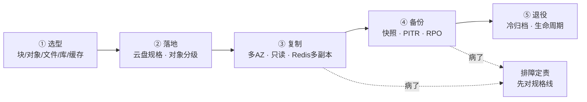
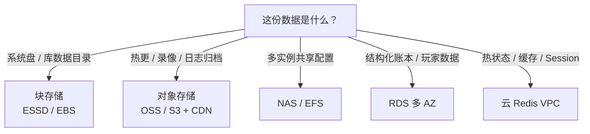
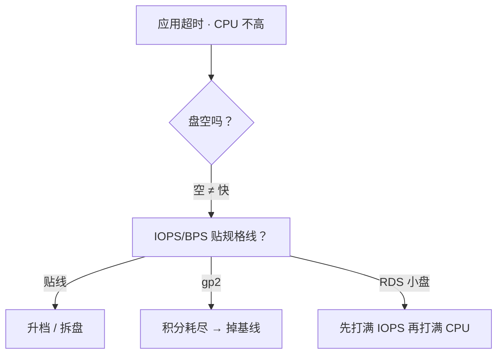
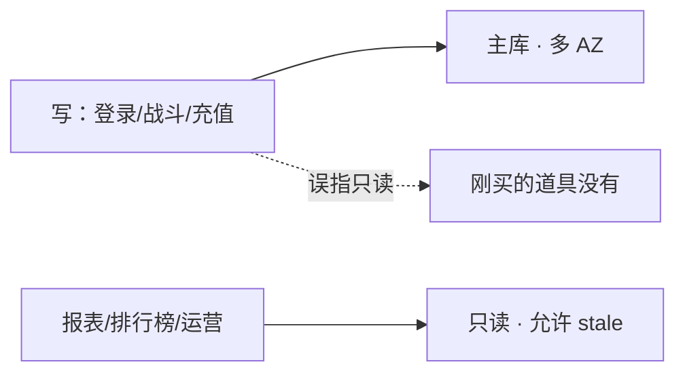
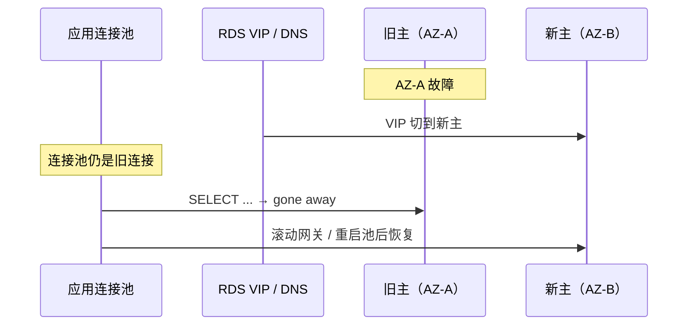
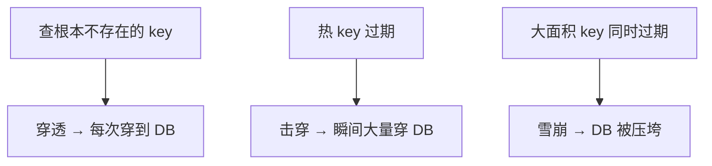
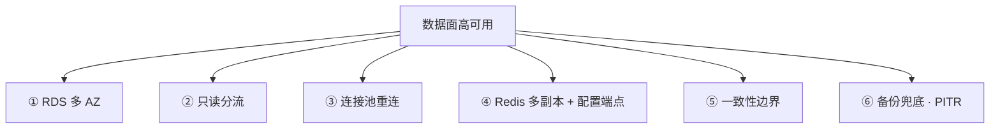
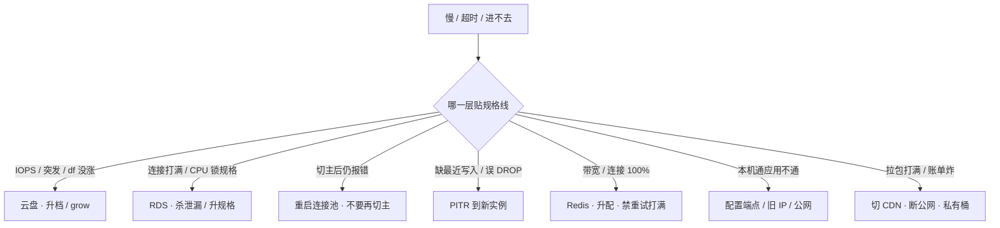

# 云上存储与数据库

> 开服十万客户端拉包，云盘 IOPS 打满——有人还在往 ECS 塞热更；RDS 刚切主，应用仍报 `gone away`；Redis 公网忘关被扫满，本机 cli 还通。
> **本章回答**：一份数据在云上的归宿——选型 → 落地 → 复制 → 备份 → 退役，每段什么会坏、怎么一眼定责。
> **不讲**：MySQL 复制与锁 → [02-01](../../02-中间件与数据库/01-MySQL/)；Redis 大 key 内核 → [02-02](../../02-中间件与数据库/02-Redis/)；游戏回档流程 → [07-09](../../07-游戏运维专题/09-玩家数据备份与回档/)；云盘挂 K8s PVC → [03-11](../../03-Kubernetes/11-存储/)；OSS/S3 产品名与内网 endpoint → [06](../06-阿里云生产/)、[07](../07-AWS生产/)；公共读账单 → [05](../05-成本治理/)；VPC 安全组 → [01](../01-云网络与安全/)。

**标记**：🎯重点 · 🔥难点 · ⭐常考 · 🔧实操

---

## 一、一张图：一份数据在云上的归宿

> 🎯 **一句话**：数据从写入到退役五站——选型、落地、复制、备份、归档；出了问题先问「它现在卡在哪一站」。



- 📖 **读图**
  - 🛤️ 主线「选型 → 落地 → 复制 → 备份 → 退役」；每段都有规格上限（云盘 IOPS、RDS 连接、Redis 带宽、对象流出）
  - 🔦 云上「慢」常是规格天花板，不是 SQL 没索引——`DOC` 入口是先对规格线，再谈代码
  - 一环错后面全跟着错：选型错 → 落地规格错 → 复制/备份策略一起错

本节对应练习题 Q1。

---

## 二、选型：块、对象、文件、库、缓存各放什么 🎯⭐🔥

> 🎯 **一句话**：块给库和系统盘，对象给热更和归档，NAS 给共享配置，RDS 给账本，Redis 给热状态——放错层，事故跟着走。

> 💡 **打个比方**：块像本地硬盘——快但独占；对象像网盘——无限大但走 HTTP，不能当硬盘挂；NAS 像办公室共享盘——大家能读写，别拿来当数据库。

### 📦 三种存储模型

- **块存储（云盘 / ESSD / EBS）**：挂到一台 ECS / Pod 的块设备，**POSIX 语义**，延迟低；给库数据目录和系统盘
  - 一块云盘同时只挂一台（除共享盘外）；`fdatasync` 语义可信
- **对象存储（OSS / S3 / TOS）**：HTTP API 读写不可变对象，**无 POSIX**，容量近乎无限
  - 给热更包、录像、日志归档、跨服大文件；`PUT` 原子（全有或全无）
- **文件存储（NAS / EFS）**：多实例同时挂同一文件系统，POSIX 但锁/延迟弱于云盘
  - 给共享配置、构建缓存——不当库、不当战斗状态、不当 CDN 源站



- 📖 **读图**：第一刀问「这份数据是什么」——文件走块、不可变大对象走对象、共享配置走 NAS、账本走 RDS、热状态走 Redis；选错层后面优化全白费

### 🚫 五件禁止 ⭐🔥

- **数据库数据目录禁 s3fs / NAS**：`fdatasync` 在对象上会撒谎；NAS 跨节点锁/延迟也不对
- **热更禁 ECS 云盘 + Nginx**：开服十万拉包打满 IOPS 与网卡；走对象 + CDN + 私有桶
- **NAS 禁当战斗服状态同步**：跨节点 Session 走 Redis 或自研
- **Redis 禁当唯一账本**：failover 可能丢秒级；充值流水必须落 RDS
- **跨服大文件禁进 RDS blob**：备份、IOPS、恢复窗口一起拖垮

#### ❓ 为什么数据库目录不能放 s3fs？

- 🎭 **表象**：测试环境「能跑」——并发低，撒谎窗口窄
- 💥 **根因**：POSIX 是模拟的；`fdatasync` 说成功 ≠ 真落盘；崩溃恢复才发现数据没了
- ✅ **正解**：MySQL 数据目录必须在云盘或 RDS 托管盘；NAS 同理禁当库盘

> ⚠️ **别混**：块和对象不是「同一种东西的两种接口」——块有 `fsync` 落盘语义，对象是 HTTP 不可变对象；`s3fs` 把对象扮成块，语义是假的。

> 📝 **面试**：「块给库和系统盘，对象给热更和归档，NAS 给共享配置；五件禁止：DB 禁 s3fs、热更禁 ECS+Nginx、NAS 禁战斗状态、Redis 禁当账本、大文件禁进 RDS blob。」

本节对应练习题 Q1。

---

## 三、落地：云盘规格与对象存储分级 🎯⭐🔥

> 🎯 **一句话**：云盘 IOPS 按规格锁死，不是盘空就快；对象分四级（标准/低频/归档/冷归档），按访问频率选 tier。

### 📀 云盘 IOPS：规格上限与突发积分 🔧🔥

> 💡 **打个比方**：云盘 IOPS 像套餐流量包——盘再大，PL0 上限就那么多；突发盘（gp2）像加油包，积分耗尽掉到基线，和 ECS t 系列突发 CPU 同一类「突然变慢、CPU 看起来不忙」。

- 阿里 ESSD：PL0 / PL1 / PL2 / PL3；AWS：gp2 / gp3 / io2——**IOPS 和带宽绑规格，不绑容量**
- 生产数据盘：**不用 gp2**；用 gp3 / io2 / ESSD 等不靠积分的规格；IOPS 预留约 30% 余量（峰值 × 1.3）
- 系统盘只放镜像和日志；MySQL 数据不放系统盘；RDS 小盘也会先打满 IOPS 再打满 CPU



- 📖 **读图**：超时且 CPU 不高 → 别先加索引；先看是否贴 IOPS/BPS 规格线或突发积分耗尽

```bash
iostat -x 1
# Device  r/s    w/s   rkB/s  wkB/s  await  %util
# sdb     3200   120   51200  1800   45.2   98.5
# ← await 高、%util≈100 = 磁盘瓶颈，不是 CPU
```

#### ❓ 为什么盘还有 TB 还会慢？

- ❌ **错答**：「空间够就不会慢」
- ✅ **对答**：IOPS/吞吐按**规格档**封顶；ESSD PL0 与 PL1 容量可相同，上限差几倍
- 🔧 gp3 可独立调 IOPS/吞吐——升了 gp3 却忘调参数 = 白花钱

> ⚠️ **别混**：选型看规格不看容量；gp3 默认 IOPS 不等于你以为买到的上限。

**扩容 vs 文件系统 grow** 🔧：

```bash
lsblk
# sdb  500G  ← 控制台已扩
df -h
# /dev/sdb  200G  ← 文件系统还是旧大小
# ← resize2fs（ext4）或 xfs_growfs（xfs）后才会变
```

- 云盘扩容改块设备大小；文件系统元数据仍记旧尺寸——不主动探测变大
- xfs 只能 grow 不能缩；生产数据盘损坏：快照新建盘挂上，不在生产盘试修

> ⚠️ **别混**：控制台 500G、`df` 仍 200G = **没 grow**，不是云盘没扩。

**加密盘与 KMS**：生产盘 / RDS / Redis 静态加密默认开；快照继承加密；**丢 KMS 权限 = 丢盘**——破窗要能拿到密钥，每季度与 restore 一起演练。

### 🧊 对象存储分级 ⭐

| 对比 | 标准 | 低频 | 归档 | 冷归档 |
|------|------|------|------|--------|
| 适用 | 频繁访问 | 月级 | 年级 | 极少 |
| 取回 | 免费 | 按量 | 秒～分钟解冻 | 小时级解冻 |
| 最低存储期 | 无 | 30 天 | 60 天 | 180 天 |

> 💡 **打个比方**：标准像手边书架，低频像柜子，归档像仓库登记取，冷归档像地下冷库预约等几天。

- **生命周期**：按前缀自动转 tier / 删除；热更包与日志**不要同一条规则**
- **版本控制**：覆盖不丢旧版；DELETE 常只打 delete marker——须配生命周期清旧版本，否则存储悄悄涨
- **强一致（同地域）**：2020 年起 S3/OSS `PUT` 后立即 `GET` 最新；**跨地域复制仍最终一致**
- **私有桶 + Block Public Access**：热更走 CDN + 内网回源；穿 NAT / 公网 = 账单炸弹（→ [05](../05-成本治理/)）

#### ❓ 对象存储「最终一致」还对吗？

- 2020 后：**同地域写后读 = 强一致**；跨地域副本 = 异步最终一致
- CDN 是另一层：源站强一致 ≠ 边缘缓存立刻新——热更流程仍是「上传 → 主动刷 CDN → 客户端拉」

> ⚠️ **别混**：别拿过时的「对象存储最终一致」当同地域答案；跨地域复制另说。

> 📝 **面试**：「四级存储 + 生命周期按前缀；版本控制防误删；2020 起同地域强一致，跨地域仍最终一致；私有桶 + Block Public Access + 内网 endpoint。」

本节对应练习题 Q2、Q3。

---

## 四、复制与高可用：RDS 多 AZ、只读与 Redis 多副本 🎯⭐🔥

> 🎯 **一句话**：多 AZ 保写路径 HA；只读给查询分流；切主后连接池要重连；Redis 多副本最终一致、不能当账本。

### 🏦 多 AZ vs 只读实例 ⭐🔥

> 💡 **打个比方**：多 AZ 像金库两地备份（出事立刻顶上）；只读像多个查账窗口（能分流，不能当主库）。

| 对比 | 多可用区（Multi-AZ） | 只读实例 |
|------|----------------------|----------|
| 目的 | **HA**，抗 AZ/主机故障 | **读扩展**，分摊读 QPS |
| 复制 | 同步或半同步（产品而异） | **异步**，可落后 |
| 切换 | 自动 failover，秒～分钟中断 | 主挂了只读还在，**不能自动变主** |
| 数据 | 切换后应无或极少丢失 | 延迟内读是旧的 |

- 写路径（登录/战斗/充值）**必须打主库**；只读给报表/排行榜/运营——允许 stale
- 只读也要按读 QPS 选型；活动报表一打，小规格只读先成为瓶颈
- `ReplicaLag` 告警；大事务 / DDL / 刷表会让延迟从毫秒跳到分钟



- 📖 **读图**：写打主、读打只读；`gone away`（切主后池未重连）与 stale（只读落后）是两种病

#### ❓ 为什么多 AZ 不能替代备份？

- failover **复制的是已经误删的数据**——主库 `DROP`，备库跟着 `DROP`
- 只读也不是备份：可落后，且不能自动变主
- **三件不同的事**：多 AZ = HA · 只读 = 读扩展 · 备份 = 备份（误删靠 PITR，五节）

> ⚠️ **别混**：多 AZ ≠ 备份 ≠ 只读。别说「开了多 AZ 就不用备份」。

### 🔌 切主后连接池：`gone away` 🔧🔥



- 📖 **读图**：VIP 秒级切换，池不知道；RTO = **切换 + 池重连 + 未提交事务回滚**（大事务回滚可能最长）

#### ❓ 为什么切主成功了应用还报错？

- 新主已健康，网关仍打**旧连接** → `gone away`
- 止血：**滚动网关 / 重启连接池**；**不要再切一次主**（再拉长 RTO）
- 治理：`SELECT 1` 探活（建议 5–10s）；`maxLifetime` < RDS `wait_timeout`

### 🔢 max_connections 与参数组 🔧

```text
Too many connections
# ← 池 × 进程数超过规格锁死的上限
# ← 先杀长事务 / 泄漏，再升规格，不要无限加大应用池
```

- `innodb_buffer_pool` 常被规格锁死；参数组分 dynamic / pending-reboot——开服夜禁顺手改需重启的项

### 🔴 云 Redis：多副本、硬顶与坑 ⭐🔥

云 Redis 是**规格合同**——连接数、带宽、QPS 有硬上限，不是靠参数调优能突破。

- **主从版**：一主多从，异步复制；failover 哨兵/平台托管；扩容靠升配
- **集群版**：分片 slot；**跨 slot 的 `MULTI` / `EVAL` 会报错**——上集群前必须验收；`{tag}` 可绑同 slot
- **持久化**：规格可能限制 AOF/RDB；failover **可能丢秒级** → **不能当唯一账本**
- **配置端点**：failover 后指向新主；**禁写死节点 IP**（幽灵节点：本机 cli 通、应用超时）
- **硬顶**：`rejected connections` / 超时 → 先看连接/带宽/QPS（**80% 告警**，开服夜 **< 70%**）；止血：升配、拆池、砍大 key
- **禁公网**：扫描打满连接，本机 cli 仍通——应用打的是被打满的那条入口
- **禁用**：`FLUSHALL` / `KEYS` / `CONFIG`；大 key 用控制台诊断，用 `SCAN` 替代 `KEYS *`
- **内存**：`noeviction` 满则写失败；账本路径别用 Redis 当 DB；监控 `used_memory` / `evicted_keys` / 命中率

```bash
redis-cli -h <配置端点> INFO clients
# connected_clients:10000
# ← 连配置端点通，写死旧 IP 的进程还在超时
```

#### ❓ 为什么 Redis 开了持久化也不能当账本？

- 云规格常只能 `everysec` 或关 AOF → 最多丢约 1 秒，甚至更多
- 主从异步：主挂了、从没同步到从 → 充值记录「少了」
- ✅ 账本在 RDS；Redis 只做热状态 / Session / 缓存

### 💥 缓存穿透 / 击穿 / 雪崩 🔥



- 📖 **读图**：三种病对策完全不同——别一套「加重试」糊弄（重试只会打得更猛）

- **穿透**：空值短 TTL、布隆过滤器
- **击穿**：热 key 永不过期 / 互斥锁单飞回源
- **雪崩**：TTL 加随机抖动、分批过期

> ⚠️ **别混**：穿透 = key 从来没有；击穿 = 热 key 过期；雪崩 = 一批同时失效。

### 收束：数据面凭什么高可用



- 📖 **读图（分组）**：①② RDS 的 HA+读扩展；③ 切主后应用收尾；④ Redis HA；⑤⑥ 一致性与备份边界

> ⚠️ **别混**：不保证 failover 零丢数（Redis 秒级、RDS 看同步模式）、不保证只读自动变主、不保证池自动重连、不保证多 AZ 替代备份。

> 📝 **面试**（分组）：**RDS 组**（多 AZ + 只读 + 切主重连）· **Redis 组**（多副本 + 配置端点 + 硬顶 + 不当账本）· **边界**（主强一致、只读/Redis 最终一致、对象同地域已强一致；多 AZ ≠ 备份，误删靠 PITR）。

本节对应练习题 Q4、Q5、Q6、Q7、Q8、Q12、Q14。

---

## 五、备份与回档：快照、PITR 与 RPO 🎯⭐🔥

> 🎯 **一句话**：RPO 以校验过的 restore 为准——没演练过的数字是假的；误删靠 PITR，不靠 failover。

### 📸 快照 vs RDS 备份

| 对比 | ECS 云盘快照 | RDS 备份 |
|------|-------------|---------|
| 救什么 | 这台机的文件系统 | 库可恢复到时间点 |
| 一致性 | 常**崩溃一致** | 热备 / 托管一致 |
| 用途 | 整盘回滚 | 库/表级到时间点 |

- **增量快照**：只备变化块，快且省；恢复要回放整条链——链断则中间版本可能救不了；删实例时有的产品连快照策略一起清
- 正确姿势：快照 → **新建盘** → 挂另一台 → 校验 → 再决定是否替换；不碰生产盘试修

#### ❓ 为什么快照不能冒充 PITR？

- 裸盘快照 ≈ 拔电源：**崩溃一致**，不是应用一致；可能丢 binlog 里那几分钟
- MySQL 要 `FLUSH TABLES WITH READ LOCK` / 热备或 RDS 备份才拿应用一致
- 合服前两者都要，用途不同

> ⚠️ **别混**：快照救盘；PITR 救库到时间点——别互相顶替。

### ⏱️ PITR 与 RPO

**PITR（Point-in-Time Recovery）**：依赖 binlog 是否开、保留多久；**restore 到新实例**，校验行数 / 账本 / 最大主键后再切连接串。

```bash
# 阿里云: DescribeBackups + 指定时间点恢复到新实例
# AWS: aws rds restore-db-instance-to-point-in-time ...
# ← 到新实例校验后再切，不在生产上试
```

```text
不能写进 RPO：              能说出口的 RPO：
  只读副本                     自动备份 + PITR
  同盘未校验快照                跨地域备份 · 救地域
  策略上写的 24h               隔离 restore 演练过
```

> 💡 **打个比方**：策略写「RPO 24h」像保单写「赔 100 万」——没真理赔过不知道能不能赔。

#### ❓ 为什么没 restore 过就不能写 RPO？

- RPO = 故障时**最多丢多久数据**，以「校验过的 restore 能回到的最近点」为准
- 备份失败未告警、binlog 没开、从未演练 → 真实 RPO 可能是「永远」
- 生产：① 备份失败告警 ② 定期 restore 到隔离实例校验 ③ 账本 binlog **14～30 天**（发现窗口）④ 删除保护 + `DeleteBackup` 权限收窄

### RPO vs RTO

| 对比 | RPO | RTO |
|------|-----|-----|
| 定义 | 最多丢多久数据 | 多久恢复服务 |
| 同城多 AZ | 分钟级（failover） | 秒～分钟 |
| 跨地域备份 | 小时～天 | **小时级** |
| PITR | 秒～分钟 | restore + 校验时长 |

- 跨地域抗**地域级故障**，**不能替代**同城多 AZ 的分钟级切换（HA vs DR）
- 删除保护：RDS/Redis/桶 + Terraform `prevent_destroy`；释放前确认备份是否还在

> 📝 **面试**：「RPO 以校验过的 restore 为准；PITR 到新实例；跨地域不能替同城多 AZ；binlog 覆盖发现窗口；删除保护 + 备份失败告警。」

本节对应练习题 Q9、Q10、Q11。

---

## 六、退役与归档：冷存储与生命周期 🎯

> 🎯 **一句话**：冷数据走对象生命周期自动降 tier，别堆在标准存储上炸账单。

```text
热数据（标准）→ 30 天低频 → 90 天归档 → 1 年冷归档 → 3 年删除
```

- 按数据类型拆规则：存档慢退役、日志快退役、法规录像走冷归档——**全桶一条规则必出事**
- 热更前缀过早转归档 → 玩家拉包等解冻；日志不删 → 存储费炸
- 开了版本控制：旧版本也要配清理
- RDS 合服后旧区数据可导出对象归档，别一直堆在库里拖备份/恢复窗口

#### ❓ 为什么归档和冷归档不能混用？

- 归档取回：秒～分钟；冷归档：小时级
- 偶尔要查的日志放归档；「几乎不碰但法规要留」才进冷归档
- 游戏回档流程 → [07-09](../../07-游戏运维专题/09-玩家数据备份与回档/)；本章只要求说出「现在能回到哪一分钟」和「上次 restore 演练何时」

> ⚠️ **别混**：退役 ≠ 立刻删除；归档是最低费保留，删除是最后一步。账单 → [05](../05-成本治理/)。

本节对应练习题 Q10、Q11。

---

## 七、作战：定责 🎯⭐🔧

> 🎯 **一句话**：云上「慢」经常是规格上限——先排除云盘 / RDS / Redis 规格线，再进中间件章谈索引和热 key。



- 📖 **读图**：第一刀永远「哪层贴规格线」；活动高峰先止血（升配/拆池/断公网），治理（索引/大 key）等复盘

### 现象 · 先做 · 别做

| 现象 | 先做 | 别做 |
|------|------|------|
| 空盘 + 超时 + CPU 不高 | 查 IOPS / 突发积分 | 先加索引 |
| `Too many connections` | 杀长事务/泄漏，再升规格 | 无限加大应用池 |
| 切主成功应用仍报错 | 滚动网关 / 重启池 | 再切一次主 |
| 误 DROP | PITR 到新实例校验 | 生产上回滚试试 |
| Redis 超时 | 硬顶 / hot key / 公网 | 先把重试调大 |
| 本机 cli 通、应用不通 | 配置端点 / 旧 IP / 安全组 | 先重启 Redis |
| 开服拉包打满 | 切 CDN，禁 ECS+Nginx | 换更大云盘 |
| 账单炸 | 公共读/跨地域；先断公网 | 先开会 |
| 只读延迟分钟级 | 写路径打回主库 | 把只读当 HA |
| 扩容后 `df` 不涨 | `resize2fs` / `xfs_growfs` | 以为云盘没扩 |
| 加密盘打不开 | KMS 权限 / 破窗 | 只恢复盘不管密钥 |

### 60 秒剧本 🔧

> 🔍 **现场**：接到「慢/超时」，60 秒先对规格线，不动业务进程、不加索引、不改重试。

```text
0–10s   iostat -x 1 + df -h && lsblk     # ← 磁盘规格线 / 文件系统
10–30s  RDS: DiskIOPS / max_connections / ReplicaLag
30–45s  Redis: 连接 / 带宽 / QPS / rejected
45–60s  对象存储: 公共读？流出穿 NAT？
# ← 贴线 → 升配止血；都没贴 → 再进 02 章查索引/热 key
# ← 恢复后先对账（充值流水最大 ID），再补自愈
```

> 📝 **面试**：「排障先对规格线——云盘 IOPS、RDS `max_connections`、Redis 带宽；触顶先升配，再谈 SQL。讲故障用规格说话，不只说『慢』。」

本节对应练习题 Q13。

---

## 八、收口

### 命令速查 🔧

```bash
# 云盘
iostat -x 1                     # ← IOPS / BPS / await / %util
df -h && lsblk                  # ← 控制台 vs 文件系统大小
resize2fs /dev/sdb              # ← ext4 grow
xfs_growfs /                    # ← xfs grow
# RDS
SHOW PROCESSLIST;               # ← 杀长事务 / 泄漏
SHOW REPLICA STATUS;            # ← ReplicaLag
# Redis
redis-cli -h <配置端点> INFO clients
redis-cli -h <配置端点> INFO memory
# 对象存储
# GetBucketPublicAccessBlock / OSS 权限页  # ← 确认没公共读
# 内网 endpoint: oss-<region>-internal / S3 Gateway Endpoint
```

### 面试锚点

| 问 | 30 秒答 |
|----|---------|
| 块/对象/NAS 各放什么？ | 块给库和系统盘；对象给热更和归档；NAS 给共享配置。五件禁止。 |
| 盘空为什么还慢？ | IOPS 按规格不是容量；突发盘积分耗尽掉基线。 |
| 扩容后 `df` 不涨？ | 文件系统没 grow，`resize2fs` / `xfs_growfs`。 |
| 对象存储分级？ | 标准/低频/归档/冷归档；生命周期按前缀；2020 起同地域强一致。 |
| 多 AZ vs 只读？ | 多 AZ 是 HA；只读是读扩展（异步可落后）。写路径禁只读。 |
| 切主后 `gone away`？ | 池打旧连接；滚动网关重连，不要再切主。 |
| 多 AZ 能替代备份吗？ | 不能。failover 复制误删。误删靠 PITR。 |
| RPO 怎么算？ | 以校验过的 restore 为准；PITR 到新实例；binlog 覆盖发现窗口。 |
| 跨地域 vs 同城多 AZ？ | 跨地域 RTO 小时级；同城多 AZ 分钟级。 |
| 快照 vs PITR？ | 快照救文件系统（常崩溃一致）；PITR 救库到时间点。 |
| 云 Redis 超时先看？ | 连接/带宽/QPS 硬顶 80%；不当账本；禁公网；配置端点。 |
| Redis 集群版限制？ | 跨 slot 事务/Lua 报错；上集群前验收。 |
| 穿透/击穿/雪崩？ | 穿透=不存在 key；击穿=热 key 过期；雪崩=大面积过期。对策不同。 |
| 一致性边界？ | 主库强一致；只读/Redis 最终一致；对象同地域已强一致。 |
| 加密盘丢 KMS？ | 等于丢盘。破窗要能拿到密钥。 |

### 易错一句话对照

- 热更放云盘 + Nginx 能扛开服 → 走对象存储 + CDN
- 只读开了就是高可用 → 只读是读扩展，可落后
- 多 AZ 能替代备份 → failover 复制误删
- 没 restore 过也能写 RPO 24h → 以校验过的 restore 为准
- 盘还有 TB 所以不会慢 → IOPS 按规格；突发积分会掉
- 云 Redis 超时先加大重试 → 先看连接 / 带宽硬顶
- Redis 开了持久化就能当账本 → failover 丢秒级；账本在 RDS
- Redis 写死节点 IP → 用配置端点
- 本机 redis-cli 通 = 应用路径通 → 可能打的是另一条入口
- 数据库目录可以放 s3fs → `fdatasync` 撒谎
- NAS 能同步战斗服状态 → 锁和延迟都不对
- 裸盘快照 = 应用一致备份 → 常是崩溃一致
- 控制台盘变大了 `df` 就会变 → 文件系统要 grow
- 切主后 TCP 连接还在就能用 → 连接池 gone away
- 加密盘丢 KMS 还能靠快照开 → 丢权限 = 丢盘
- 跨地域备份能替代同城多 AZ → RTO 小时 vs 分钟
- 对象存储最终一致 → 2020 起同地域已强一致（跨地域仍最终一致）
- 集群版什么命令都能用 → 跨 slot 事务/Lua 会报错

### 数字墙

> 云盘 IOPS 按规格 · gp2 突发积分 · Redis 硬顶告警 **80%** · 开服夜 **< 70%** · PITR binlog **14～30 天** · 切主 RTO **秒～分钟 + 连接池** · 跨地域 RTO **小时级** · 同城多 AZ RTO **分钟级** · 对象分级 **4** 级 · 多 AZ **不能替代备份** · 加密盘丢 KMS = 丢盘 · 低频最低存 **30** 天 / 归档 **60** / 冷归档 **180**

---

## 合上书

对着第一节主图口述一遍；开头那个现场——云盘打满、切主 gone away、Redis 公网——三刀分别砍在哪一层，现在该能说清。

- [ ] **默画主图**：选型 → 落地 → 复制 → 备份 → 退役；标出五段各卡什么规格线。（→ Q1）
- [ ] **口述选型**：块/对象/NAS/RDS/Redis 各放什么；五件禁止；为何 s3fs 不能当库盘。（→ Q1）
- [ ] **口述落地**：空盘为何还慢；突发积分；扩容后 `df` 不涨；对象四级 + 生命周期；同地域强一致自哪年起。（→ Q2、Q3）
- [ ] **口述复制**：多 AZ vs 只读；切主 `gone away` 先做什么；`max_connections` 打满先做什么。（→ Q4～Q8、Q12、Q14）
- [ ] **默画收束**：数据面高可用六件套，标出每条不保证什么。（→ Q9～Q11）
- [ ] **口述 Redis**：硬顶、集群跨 slot、配置端点 vs 节点 IP、为何不能当账本、禁公网。（→ Q10、Q11）
- [ ] **口述缓存三病**：穿透/击穿/雪崩各是什么、各怎么防。（→ Q13）
- [ ] **口述备份**：快照 vs PITR；RPO 为何要 restore 演练；跨地域能否替同城多 AZ；加密盘丢 KMS。（→ Q9～Q11）
- [ ] **口述退役**：归档 vs 冷归档取回差；生命周期为何按前缀拆。（→ Q10、Q11）
- [ ] **定责**：决策树「哪层贴规格线」；60 秒剧本各敲什么。（→ Q13）

下一章：[IAM 与多账号](../04-IAM与多账号/)。成本：[05](../05-成本治理/)；VPC：[01](../01-云网络与安全/)。
