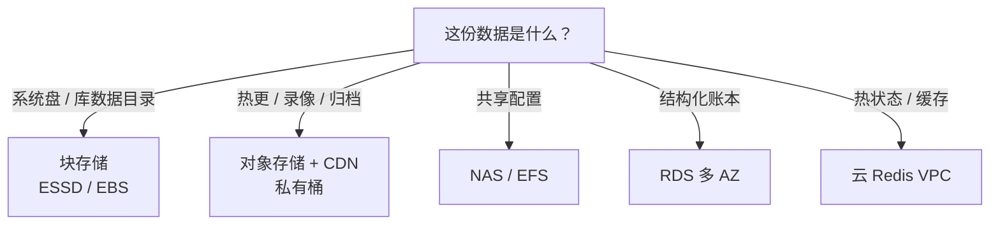
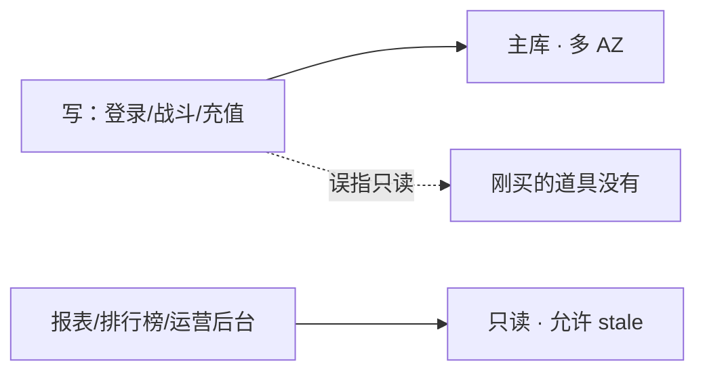
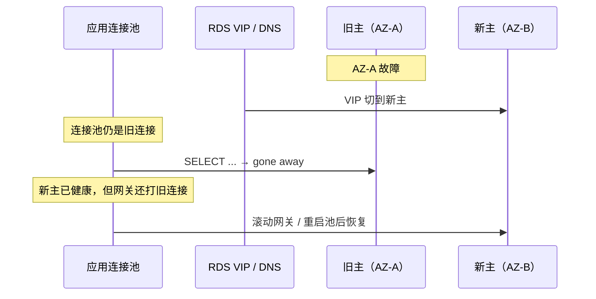
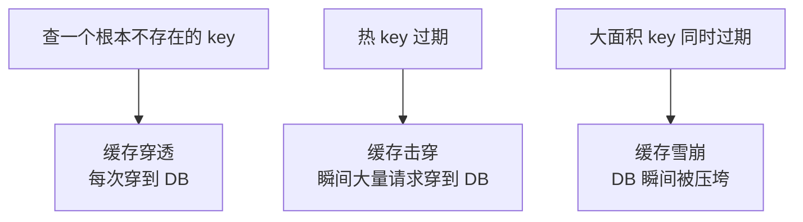
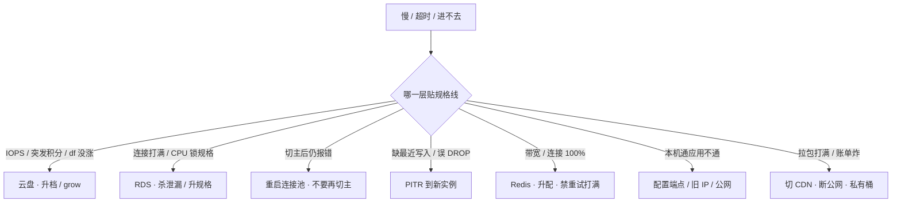

# 03｜云上存储与数据库 · 练习题

先合上知识点，对着 **一、一张图：一份数据在云上的归宿** 把选型→落地→复制→备份→退役五段口述一遍，再来做题。

| 标记 | 含义 |
|------|------|
| **核心** | 不懂整章就没建立起来 |
| **必会** | 值班和面试都要能讲 |
| **常用** | 线上会反复碰到 |
| **常考** | 白板和追问的高频口径 |

## 本题目录
- [Q1 块/对象/NAS/RDS/Redis 各放什么](#q1)
- [Q2 空盘为什么还慢](#q2)
- [Q3 对象存储分级与生命周期](#q3)
- [Q4 多 AZ vs 只读](#q4)
- [Q5 切主后 gone away](#q5)
- [Q6 max_connections 打满](#q6)
- [Q7 云 Redis 硬顶与配置端点](#q7)
- [Q8 缓存穿透/击穿/雪崩](#q8)
- [Q9 RPO 与 PITR](#q9)
- [Q10 快照 vs PITR 与增量快照](#q10)
- [Q11 跨地域 vs 同城多 AZ](#q11)
- [Q12 一致性级别](#q12)
- [Q13 排障分流](#q13)
- [Q14 RDS 切主后应用 gone away](#q14)
- [合上书](#合上书)

---

## Q1

**★★★★★｜块存储、对象存储、NAS、RDS、Redis 各放什么？数据库目录能不能放 s3fs？热更能不能走 ECS 云盘 + Nginx？**

**覆盖**：核心 · 必会 · 常考 ｜ **对应**：知识点 [二、选型：块、对象、文件、库、缓存各放什么](知识点.md)

### 场景
新项目启动，有人把 MySQL 数据目录挂了 s3fs（「对象存储无限大」），热更包放 ECS 云盘 + Nginx（「直接拉就行」），跨服录像塞进 RDS blob（「省得再开桶」）。开服前评审被拦下。

### 完整解答
> 🎯 **一句话**：块给库和系统盘，对象给热更和归档，NAS 给共享配置，RDS 给账本，Redis 给热状态——五件禁止碰一件就出事。

三种存储模型各有语义：块存储有 POSIX 语义（`fdatasync` 保证落盘），给库和系统盘；对象存储是 HTTP API 读写不可变对象，给热更、录像、归档；NAS 多实例共享，给配置和构建缓存。RDS 是结构化账本，Redis 是热状态缓存。

五件禁止：① 数据库数据目录禁 s3fs / NAS——`fdatasync` 在对象存储上会撒谎，崩了才发现；② 热更禁 ECS 云盘 + Nginx——开服十万客户端拉包打满 IOPS 和网卡，走对象存储 + CDN + 私有桶；③ NAS 禁当战斗服状态同步——锁和延迟都不对，走 Redis；④ Redis 禁当唯一账本——failover 丢秒级，账本在 RDS；⑤ 跨服大文件禁进 RDS blob——备份、IOPS、恢复窗口一起拖垮。



> ⚠️ **别混**：块存储和对象存储不是「同一种东西的两种接口」——块有 POSIX 语义，对象是 HTTP API，`s3fs` 模拟的 POSIX 会撒谎。
> 📝 **面试**：「块给库和系统盘，对象给热更和归档，NAS 给共享配置；五件禁止：DB 目录禁 s3fs、热更禁 ECS+Nginx、NAS 禁战斗状态、Redis 禁当账本、大文件禁进 RDS blob。」

### 再追问
- **加了 s3fs 做 DB 目录，测试环境没崩？** ——测试并发低，`fdatasync` 撒谎的窗口窄。生产并发一上去或崩溃恢复时才发现数据没落盘。
- **热更放云盘 + CDN 行不行？** ——CDN 回源还是打云盘 IOPS，且没有私有桶 + Block Public Access。直接走对象存储 + CDN。

---

## Q2

**★★★★☆｜盘还有 500GB 空间为什么还慢？突发积分是什么？扩容后 `df` 不涨怎么办？**

**覆盖**：必会 · 常用 · 常考 ｜ **对应**：知识点 [三、落地：云盘规格与对象存储分级](知识点.md)

### 场景
活动期 ECS 突然变慢，CPU 不高，盘还有几百 GB 空间。另一台控制台已扩容到 500GB，`df` 还显示 200GB。有人准备加索引。

### 完整解答
> 🎯 **一句话**：云盘 IOPS 按规格锁死不是盘空就快；突发型积分耗尽掉基线；扩容后 `df` 不涨是文件系统没 grow。

云盘 IOPS 和带宽按规格绑定——ESSD PL0 / PL1 / PL2 / PL3，AWS gp2 / gp3 / io2——不是按容量。盘再大，PL0 的上限就那么多。突发型云盘（AWS gp2）攒着积分时能突发，积分耗尽掉到基线，和 ECS t 系列突发 CPU 同一类「突然变慢、CPU 看起来不忙」。

```bash
iostat -x 1
# Device  rrqm/s  wrqm/s  r/s    w/s   rkB/s  wkB/s  await  %util
# sdb       0.0     0.0   3200   120   51200   1800    45.2  98.5
# ← await 高、%util 接近 100 = 磁盘瓶颈
```

扩容后 `df` 不涨：控制台盘已 500GB，文件系统还是旧大小。`resize2fs`（ext4）或 `xfs_growfs`（xfs）后才变。生产变更把「盘变大了但 ext4 没长」写成检查项。

```bash
lsblk
# sdb  500G  ← 控制台已扩到 500G
df -h
# /dev/sdb  200G  ← 文件系统还是旧大小 = 没 grow
```

止血：升档 ESSD / 改 gp3 / io2，或拆盘。治理：按压测 IOPS 选型，不要按容量买最小盘。

> ⚠️ **别混**：空盘不等于快——IOPS 按规格；控制台盘变大 ≠ `df` 会自动变——文件系统要 grow。
> 📝 **面试**：「盘空还慢看 IOPS 规格线和突发积分；扩容后 `df` 不涨查文件系统 grow（`resize2fs` / `xfs_growfs`）。」

### 再追问
- **加密盘丢了 KMS 权限怎么办？** ——等于丢盘。快照继承了加密，但破窗流程要能拿到密钥，不能只备份盘不管密钥。
- **RDS 小盘也会先打满 IOPS？** ——会，规格页上的 IOPS 上限就是天花板，先打满 IOPS 再打满 CPU。

---

## Q3

**★★★★☆｜对象存储分哪四级？生命周期为什么要按前缀拆？版本控制防什么？对象存储强一致是哪年开始的？**

**覆盖**：必会 · 常用 · 常考 ｜ **对应**：知识点 [三、落地：云盘规格与对象存储分级](知识点.md)

### 场景
热更包和日志归档放在同一个桶、用同一条生命周期规则。热更包被转了归档，玩家拉包要等解冻。有人还在担心「对象存储写后读到旧值」。

### 完整解答
> 🎯 **一句话**：对象存储分标准/低频/归档/冷归档四级，生命周期按前缀自动转 tier；2020 年起同地域已强一致；版本控制防误删。

按访问频率分四级：标准存储（频繁访问，存储贵取回免费）、低频（月级访问）、归档（年级访问，解冻需秒到分钟）、冷归档（极少访问，解冻需小时）。生命周期规则按前缀和时间自动转换 tier 或删除。

热更包前缀和日志归档前缀**不要用同一条规则**——热更包过早转归档会拉高取回延迟（玩家拉包要等解冻），日志堆着不删会炸存储费。

版本控制（versioning）：开版本控制后，覆盖同名对象不会丢旧版——误删/误覆盖可恢复。代价是存储量涨，要配合生命周期定期清旧版本。删除权限要单独授并告警。

对象存储强一致：2020 年起 AWS S3 和阿里云 OSS 都已支持**强一致性**——`PUT` 后立即 `GET` 就能读到最新对象。但跨地域复制仍是最终一致——异步复制有延迟。

> ⚠️ **别混**：同地域写后读是强一致，跨地域副本是异步的最终一致——别拿「对象存储最终一致」当过时答案。归档和冷归档取回时间差几个数量级——归档秒到分钟，冷归档小时级。
> 📝 **面试**：「对象存储分标准/低频/归档/冷归档，生命周期按前缀自动转 tier；版本控制防误删；2020 起已强一致；跨地域仍最终一致；私有桶 + Block Public Access + 内网 endpoint。」

### 再追问
- **公共读桶为什么炸账单？** ——公共读 = 下载费炸弹。热更包走 CDN + 内网回源，不走公网。详见 [05](../05-成本治理/)。
- **内网 endpoint 省什么？** ——不走公网不计流量费，不穿 NAT 不算 NAT 处理费。拉镜像、回源、备份走内网 endpoint。

---

## Q4

**★★★★★｜RDS 多 AZ 和只读实例差在哪？写路径能不能指只读？只读能自动变主吗？**

**覆盖**：核心 · 必会 · 常考 ｜ **对应**：知识点 [四、复制与高可用：RDS 多 AZ、只读与 Redis 多副本](知识点.md)

### 场景
架构评审有人说「多 AZ 和只读都是高可用，加一个只读就抗 AZ 挂了」。活动期间有人把充值写路径指向了只读实例。

### 完整解答
> 🎯 **一句话**：多 AZ 是 HA（同步/半同步、自动 failover），只读是读扩展（异步、可落后、不能自动变主）；写路径必须打主库。

| 对比 | 多可用区（Multi-AZ） | 只读实例（读副本 / read replica） |
|------|----------------------|----------------------------------|
| 目的 | **高可用**（HA），抗 AZ / 主机故障 | **读扩展**，分摊读 QPS |
| 复制 | 同步或半同步 | **异步**，可落后 |
| 切换 | 自动 failover，秒到分钟级 | 不能自动变主 |
| 数据 | 切换后应无或极少丢失 | 延迟内的读是旧的（最终一致） |

写路径（登录、战斗、充值）**必须打主库**。误把写路径指到只读，活动刷表后副本落后分钟级，玩家看到「刚买的道具没有」。

多 AZ **不能替代备份**——failover 复制的是已经误删的数据。主库 DROP 了表，备库也跟着 DROP。误删靠 PITR。多 AZ 是 HA，只读是读扩展，备份是备份——三件不同的事。



> ⚠️ **别混**：多 AZ 不能替代备份；只读不能自动变主。三个概念——HA、读扩展、备份——是不同的事。
> 📝 **面试**：「多 AZ 是 HA 同步/半同步自动 failover；只读是读扩展异步可落后不能变主；写路径禁只读；多 AZ 不能替代备份，误删靠 PITR。」

### 再追问
- **只读延迟怎么看？** ——控制台看 `ReplicaLag`。大事务、DDL、活动刷表会让副本延迟从毫秒跳到分钟。不能接受 stale 的读路径必须打主库。
- **只读规格可以小于主库？** ——可以，但活动报表一打只读先成为瓶颈——只读也要按读 QPS 选型。

---

## Q5

**★★★★★｜RDS 切主成功后应用还报 `gone away`，怎么办？能不能再切一次主？**

**覆盖**：核心 · 必会 · 常考 ｜ **对应**：知识点 [四、复制与高可用：RDS 多 AZ、只读与 Redis 多副本](知识点.md)

### 场景
RDS 多 AZ failover 完成，控制台显示新主已健康。但应用网关还在报 `gone away`，玩家进不去。有人建议再切一次主。

### 完整解答
> 🎯 **一句话**：VIP 切了但连接池里还是旧连接——滚动网关 / 重启连接池，不要先再切一次主。



**读图**：VIP 切换是秒级，但连接池不知道——它没收到通知，继续用旧连接打已经不存在的旧主。新主已经可写，网关还在报错。RTO 包含三段：**切换本身 + 连接池重连 + 未提交事务回滚**，不承诺玩家无感。

止血：**滚动网关 / 重启连接池**，不要先再切一次主。治理：连接池校验（`SELECT 1` 探活）、failover 演练（真切一次）。切主窗口按「秒到分钟级中断 + 连接池重连」写进预案。充值路径要能对账——不能靠「连接还在」判断业务正常。

> ⚠️ **别混**：切主成功 ≠ 应用无感——连接池 gone away 要滚动网关重连。不要再切一次主，那会二次中断。
> 📝 **面试**：「切主后 gone away 是连接池打旧连接；滚动网关 / 重启池重连；RTO 含切换+重连+回滚，不承诺无感。」

### 再追问
- **连接池探活怎么做？** ——`SELECT 1` 定期校验，失败时主动剔除旧连接。但探活频率要够高——failover 后到下次探活之间的请求还是会失败。
- **failover 演练怎么做？** ——真切一次，看连接池和网关是否自动恢复。不能只在文档上写「应该能恢复」。

---

## Q6

**★★★★☆｜RDS `Too many connections` 怎么处理？能不能无限加大应用连接池？参数组改 `innodb_buffer_pool` 要注意什么？**

**覆盖**：必会 · 常用 ｜ **对应**：知识点 [四、复制与高可用：RDS 多 AZ、只读与 Redis 多副本](知识点.md)

### 场景
活动期 RDS 报 `Too many connections`。有人准备把应用连接池从 50 调到 200。还有人顺手改参数组里的 `slow_query_log`。

### 完整解答
> 🎯 **一句话**：`max_connections` 被规格锁死——先杀长事务 / 泄漏连接再升规格，不要无限加大应用池；参数组有的参数要重启。

云上 `max_connections` 常被规格锁死。连接池 × 进程数超限直接拒绝：

```text
Too many connections
# ← 池 × 进程数超过规格锁死的上限
# ← 先杀长事务 / 泄漏连接，再升规格
```

`innodb_buffer_pool` 在云上常被规格锁死，不是想改多少改多少。参数组变更要当生产变更——有的参数是动态的（改了立即生效），有的要重启。开服夜禁止顺手改 `innodb_buffer_pool` / `slow_query_log`，除非变更单写明接受重启。能区分「动态参数」和「重启生效」，避免开服夜改 `slow_query_log` 把实例重启了。

止血：杀 `SHOW PROCESSLIST` 里的长事务 / 泄漏连接，再升规格。治理：按压测选规格，连接池 × 进程数留余量。

> ⚠️ **别混**：加大应用池只会更快打满 `max_connections`——先杀泄漏 / 升规格，不是无限加池。
> 📝 **面试**：「`max_connections` 按规格锁死；先杀长事务 / 泄漏再升规格，不无限加池；参数组有的参数要重启，开服夜禁顺手改 innodb。」

### 再追问
- **连接池设多大合适？** ——按 `连接池 × 进程数 < max_connections × 0.7` 留余量。开服夜水位 < 70%。
- **改参数组后怎么知道要不要重启？** ——云控制台标了 Apply Type（dynamic / pending-reboot）。动态的立即生效，pending-reboot 要重启。

---

## Q7

**★★★★★｜云 Redis 活动期超时先看什么？集群版有什么限制？为什么禁止写死节点 IP？**

**覆盖**：核心 · 必会 · 常考 ｜ **对应**：知识点 [四、复制与高可用：RDS 多 AZ、只读与 Redis 多副本](知识点.md)

### 场景
活动期 Redis 开始超时。有人准备把重试次数从 3 调到 10。应用进程部分通部分不通，本机 `redis-cli` 连配置端点正常。有人记得上集群版了但不确定跨 slot 事务能不能用。

### 完整解答
> 🎯 **一句话**：先看连接 / 带宽 / QPS 硬顶 80%，不先改重试；集群版跨 slot 事务会报错；禁止写死节点 IP——用配置端点。

云 Redis 是**规格合同**——连接数、带宽、QPS 有硬上限。活动期超时先看是否触顶（80% 告警，开服夜 < 70%），不要先改应用重试把连接打得更满。止血三招：升配、拆池、砍大 key。

**集群版限制**：分片（slot），**不能用跨 slot 的事务**（`MULTI` / `EVAL` 跨 key 会报错）。上集群前必须验收跨 slot / Lua。主从版没有 slot 限制但扩容靠升配；failover 由哨兵（Sentinel）或云平台托管。

**配置端点 vs 节点 IP**：云 Redis 有配置端点——failover 后指向新主，连接自动恢复。**禁止写死节点 IP**——升主后 IP 变，连接池打到幽灵节点，本机 `redis-cli` 连配置端点通，应用还打旧 IP，表现为部分进程超时。

```bash
redis-cli -h <配置端点> INFO clients
# connected_clients:10000
# ← 连配置端点通，但应用写死节点 IP 的进程还在超时
```

**禁公网**：Redis 开公网 = 内存数据库暴露在 DDoS 面上。扫描把连接打满，本机 cli 还通——应用连的是被打满的那条公网入口。只走 VPC，安全组只放应用。

**禁用命令**：`FLUSHALL`、`KEYS`、`CONFIG` 常被禁或应被禁。大 key / hot key 用控制台诊断。

**持久化**：RDB / AOF 受规格限制，failover 可能丢秒级数据。Redis 不能当唯一账本，账本在 RDS。

> ⚠️ **别混**：主从版和集群版限制完全不同——集群版跨 slot 会报错；配置端点和节点 IP 不是一回事——写死 IP 后 failover 打幽灵节点。
> 📝 **面试**：「云 Redis 硬顶 80% 先升配不先改重试；集群版跨 slot 事务报错；配置端点不写死 IP；禁公网禁 KEYS/FLUSHALL/CONFIG；持久化丢秒级不当账本。」

### 再追问
- **内存满 `noeviction` 怎么办？** ——`noeviction` 策略下内存满直接写失败。监控 `used_memory` 和 `evicted`。生产推荐 `allkeys-lru` 逐出冷数据，但账本路径不放在 Redis。
- **代理模式改变什么？** ——有的云有 Proxy 层，改变客户端看到的拓扑。连接池参数按云文档配，不是按自建。

---

## Q8

**★★★★☆｜缓存穿透、击穿、雪崩分别是什么？对策各是什么？**

**覆盖**：必会 · 常考 ｜ **对应**：知识点 [四、复制与高可用：RDS 多 AZ、只读与 Redis 多副本](知识点.md)

### 场景
面试官问「缓存三大病」，有人回答「加重试 + 降级」。面试官说「三种病的对策完全不同」。

### 完整解答
> 🎯 **一句话**：穿透查不存在的 key（布隆过滤），击穿热 key 过期（永不过期/互斥），雪崩大面积同时过期（TTL 抖动）——三种病对策完全不同。



- **缓存穿透（penetration）**：查询一个**根本不存在**的 key，每次都穿到 DB。原因：恶意攻击或 bug。对策：空值缓存（短 TTL）、布隆过滤器拦截。
- **缓存击穿（breakdown）**：**热 key 过期**的瞬间，大量请求同时穿到 DB。对策：热 key 永不过期（手动更新）、互斥锁（只放一个请求回源，其他等）。
- **缓存雪崩（avalanche）**：**大面积 key 同时过期**，DB 瞬间被压垮。对策：TTL 加随机抖动、分批过期。

> ⚠️ **别混**：穿透是「查不存在的 key」（key 从来没有），击穿是「热 key 过期」（key 有过但没了），雪崩是「大面积同时过期」。三种病对策完全不同，别一套「加重试」糊弄。
> 📝 **面试**：「穿透挡在入口（布隆过滤），击穿保热 key（永不过期/互斥），雪崩打散过期时间（TTL 抖动）。」

### 再追问
- **布隆过滤器是什么？** ——一种空间高效的数据结构，能判断「key 肯定不存在」或「可能存在」。放 Redis 前面挡掉不存在的 key。
- **热 key 永不过期怎么更新？** ——业务主动更新，不设 TTL 或设极长 TTL，由异步线程定期刷新。

---

## Q9

**★★★★★｜RPO 怎么算？PITR 恢复到新实例还是生产上试？binlog 留几天？备份失败怎么办？**

**覆盖**：核心 · 必会 · 常考 ｜ **对应**：知识点 [五、备份与回档：快照、PITR 与 RPO](知识点.md)

### 场景
运营 10 天后发现发错道具，要恢复到误操作前。binlog 留了 7 天。有人要直接在生产实例上「回滚试试」。备份策略写 RPO 24 小时但从没 restore 演练过。

### 完整解答
> 🎯 **一句话**：RPO 以校验过的 restore 为准——没 restore 过的数字是假的；PITR 到新实例校验后再切，不在生产上试；binlog 覆盖发现窗口（账本 14～30 天）。

**按时间点恢复（PITR）**：依赖 binlog 是否开、保留多久。restore 到**新实例**，校验行数 / 账本 / 最大主键，再决定切连接串——不要在生产实例上「回滚试试」。

```bash
# 阿里云: DescribeBackups + 指定时间点恢复到新实例
# AWS:   aws rds restore-db-instance-to-point-in-time --source-instance-id ... --restore-time 2024-...
# ← restore 到新实例，校验后再切连接串
```

binlog 留 7 天而运营 10 天后发现——**RPO 窗口已经关了**。游戏常见几天后才发现发错道具，账本 binlog 留 **14～30 天**。

```text
不能写进 RPO 的：           能说出口的 RPO：
  只读副本                     自动备份 + PITR
  同盘未校验快照                跨地域备份 · 救地域
  策略上写的 24h               隔离 restore 演练过
```

生产要求：① 备份失败要告警（失败比没有更危险，你以为有）；② 定期 restore 演练到隔离实例，校验表行数和关键账本——没 restore 过的 RPO 是假的；③ 充值 / 账本库备份与游戏库分开策略，删除备份要双人。

> ⚠️ **别混**：策略上写 RPO 24h 不等于真能恢复 24h——以校验过的 restore 为准。释放 RDS 后备份有的产品释放即清。
> 📝 **面试**：「RPO 以校验过的 restore 为准；PITR 到新实例校验后再切；binlog 覆盖发现窗口（账本 14～30 天）；备份失败要告警；只给 DBA Restore 不给 DeleteBackup。」

### 再追问
- **快照能冒充 PITR 吗？** ——不能。裸盘快照常是崩溃一致，会丢 binlog 里那几分钟。PITR 要 RDS 热备 + binlog。
- **充值库和游戏库备份策略分开？** ——是。充值 / 账本库权限更严，删除备份要双人，保留期更长。

---

## Q10

**★★★★☆｜快照和 RDS 备份差在哪？增量快照是什么？崩溃一致和应用一致有什么区别？**

**覆盖**：必会 · 常用 ｜ **对应**：知识点 [五、备份与回档：快照、PITR 与 RPO](知识点.md)

### 场景
有人用云盘快照当数据库备份，合服前只打了一份裸盘快照。问能不能恢复到误删前的时间点。

### 完整解答
> 🎯 **一句话**：快照救文件系统（常崩溃一致），PITR 救库到时间点；增量快照只备变化块，恢复回放整条链。

| 对比 | ECS 云盘快照 | RDS 备份 |
|------|-------------|----------|
| 救什么 | 这台机的文件系统 | 这个库可恢复到时间点 |
| 一致性 | 常**崩溃一致** | 热备 / 托管一致 |
| 用途 | 整盘回滚 | 库级 / 表级恢复到时间点 |

**增量快照**：云盘快照通常是增量——只备份自上次快照后变化的块。好处是快、省存储；代价是**恢复时要回放整条快照链**，链断了中间版本可能恢复不了。快照链不要当唯一备份——删实例时有的产品连快照策略一起清。

**崩溃一致 vs 应用一致**：裸盘快照常是**崩溃一致**——不是「应用一致」——MySQL 要 `flush tables with read lock` / 热备或用 RDS 备份才能拿到应用一致。用快照冒充 PITR，会丢 binlog 里那几分钟。合服前两者都要，用途不同。

> ⚠️ **别混**：用快照冒充数据库 PITR 会丢 binlog 里那几分钟。崩溃一致 ≠ 应用一致。
> 📝 **面试**：「快照救文件系统（常崩溃一致），PITR 救库到时间点；增量快照只备变化块但恢复回放整链；不当唯一备份。」

### 再追问
- **删实例时快照还在吗？** ——有的产品删实例连快照策略一起清。释放前看备份是否还在，开删除保护。
- **合服前打什么？** ——快照 + RDS 备份都要。快照整盘回滚，RDS 备份做 PITR。用途不同。

---

## Q11

**★★★★☆｜跨地域备份和同城多 AZ 有什么区别？能互相替代吗？删除保护给谁开？**

**覆盖**：必会 · 常用 ｜ **对应**：知识点 [五、备份与回档：快照、PITR 与 RPO](知识点.md)

### 场景
有人说「我们有跨地域备份，不需要同城多 AZ了」。也有人反过来「多 AZ 了不用跨地域备份」。

### 完整解答
> 🎯 **一句话**：同城多 AZ 是 HA（分钟级），跨地域是 DR（小时级）——不同量级，不能互相替代。

| 对比 | RPO | RTO |
|------|-----|-----|
| 同城多 AZ | 分钟级（failover） | 秒到分钟级 |
| 跨地域备份 | 小时到天级 | **小时级** |
| PITR | 秒到分钟级 | 取决于 restore + 校验 |

跨地域备份抗的是**地域级故障**（整地域不可用），RTO 按小时计，不能替代同城多 AZ 的分钟级切换。同城多 AZ 是 HA，跨地域是 DR（灾难恢复）——不同量级，不能互相替代。

**删除保护**：RDS / Redis / 桶开 deletion protection；生产 Terraform `prevent_destroy`。误释放比误更新更常见——释放前看备份是否还在。备份副本要离开生产账号或至少离开「同一套删除权限」。只给 DBA `Restore` 不给 `DeleteBackup`。

> ⚠️ **别混**：跨地域 RTO 小时级 vs 同城多 AZ 分钟级——不同量级。多 AZ 是 HA 不是备份，跨地域是 DR 不是 HA。
> 📝 **面试**：「同城多 AZ 分钟级 HA，跨地域小时级 DR，不能互相替代；删除保护 + prevent_destroy；只给 DBA Restore 不给 DeleteBackup。」

### 再追问
- **Terraform `prevent_destroy` 是什么？** ——Terraform 资源的生命周期参数，设为 true 后 `terraform destroy` 会拒绝删除该资源。防止 IaC 误删生产。
- **备份副本为什么要离开生产账号？** ——离开「同一套删除权限」。生产账号被误删或权限泄露时，备份在另一个账号里更安全。

---

## Q12

**★★★★☆｜RDS 主库和只读的一致性有什么区别？Redis 从库呢？对象存储是什么一致？**

**覆盖**：必会 · 常考 ｜ **对应**：知识点 [四、复制与高可用：RDS 多 AZ、只读与 Redis 多副本](知识点.md)

### 场景
面试官问「你的游戏数据一致性模型是什么」。有人回答「都是最终一致」。有人回答「Redis 是强一致」。

### 完整解答
> 🎯 **一句话**：RDS 主库强一致，只读最终一致，Redis 从库最终一致，对象存储 2020 年起已强一致，跨地域仍最终一致。

| 数据位置 | 一致性模型 | 说明 |
|----------|-----------|------|
| RDS 主库 | **强一致** | 写后立即读到最新值 |
| RDS 只读 | **最终一致** | 异步复制，有延迟 |
| Redis 从库 | **最终一致** | 异步复制，failover 可能丢秒级 |
| 对象存储（同地域） | **强一致** | 2020 年起写后立即可读 |
| 对象存储跨地域 | **最终一致** | 异步跨地域复制 |

RDS 主库是强一致——写后立即读到最新值。只读是异步复制，有延迟（`ReplicaLag`），是最终一致。Redis 主从也是异步复制，failover 可能丢秒级——也是最终一致。

对象存储 2020 年起已强一致——`PUT` 后立即 `GET` 就能读到最新对象。但跨地域复制仍是最终一致——异步复制有延迟。

账本必须放强一致的 RDS 主库，不放在最终一致的 Redis 或只读。Redis 不能当唯一账本——failover 丢秒级，持久化受规格限制。

> ⚠️ **别混**：对象存储不是「最终一致」——2020 年起同地域已强一致。跨地域才是最终一致。别拿过时答案。
> 📝 **面试**：「主库强一致、只读最终一致、Redis 从库最终一致、对象存储已强一致、跨地域仍最终一致。账本放 RDS 主库。」

### 再追问
- **Redis 主从复制是同步还是异步？** ——异步。所以 failover 可能丢秒级数据。哨兵负责选新主但数据复制本身就是异步的。
- **只读副本能变强一致吗？** ——不能。异步复制本质就是最终一致。需要强一致的读必须打主库。

---

## Q13

**★★★★☆｜云上排障你按什么顺序查？从加索引开始行不行？60 秒剧本各敲什么？**

**覆盖**：必会 · 常用 ｜ **对应**：知识点 [七、作战：定责](知识点.md)

### 场景
活动期 ECS 超时、RDS `Too many connections`、Redis rejected。群里同时有人加索引、有人改重试、有人重启 NAT。没有人画路径看规格线。

### 完整解答
> 🎯 **一句话**：先对规格线——云盘 IOPS、RDS `max_connections`、Redis 带宽，任一触顶先升配止血，再谈 SQL 和代码。



**读图**：第一刀永远是「哪一层贴规格线」——云盘 IOPS、RDS 连接、Redis 带宽、对象存储流出，任一触顶先升配止血。讲故障用规格说话，不要只说「慢」。

```text
0–10s   iostat -x 1 + df -h && lsblk        # ← 先看磁盘规格线和文件系统
10–30s  RDS 控制台: DiskIOPS / max_connections / ReplicaLag  # ← 库的规格线
30–45s  Redis 控制台: 连接 / 带宽 / QPS / rejected           # ← 缓存硬顶
45–60s  对象存储: 桶是否公共读 / 流出是否穿 NAT              # ← 账单和带宽
# ← 60 秒内先对规格线，不动业务进程、不加索引、不改重试
```

> ⚠️ **别混**：先加索引是错的——要先排除规格上限。先改重试是错的——Redis 硬顶越重试越满。先重启逻辑服是错的——长连接可能还活，重启踢在线玩家放大事故面。
> 📝 **面试**：「排障先对规格线——云盘 IOPS、RDS max_connections、Redis 带宽，任一触顶先升配止血，再谈 SQL 和代码。讲故障用规格说话。」

### 再追问
- **活动高峰按什么顺序救？** ——确认进程还在 → 停止发版和无限重试 → 救规格 / 连接池 / 公网暴露 → 恢复后先对账（充值流水最大 ID），再补自愈。
- **加密盘打不开查什么？** ——KMS 权限 / 破窗。加密盘丢了 KMS 权限等于丢盘，破窗流程要能拿到密钥。

---

## Q14

**★★★★★｜RDS 多 AZ 故障切换后，应用大量 `MySQL server has gone away`？**

**覆盖**：核心 · 必会 · 常考 ｜ **对应**：知识点 [四、复制与高可用](知识点.md)

### 场景

云 RDS 自动 failover 完成。Java 连接池里全是死连接，登录 50% 失败。DBA 说库已好。

### 完整解答

> 🎯 **一句话**：**DNS/VIP 已切新主，连接池仍持旧 TCP**——应用 **刷新连接池** + `testOnBorrow` / 短 `maxLifetime`，**不要**再切主。

```text
① 确认 RDS 事件：Failover complete
② 应用滚动重启或连接池 evict（Hikari keepalive）
③ 写端点 vs 读端点：写必须指 cluster/primary endpoint
④ 监控 ReplicaLag 归零后再放量
```

```properties
# Hikari 示例
maxLifetime=600000
connectionTestQuery=SELECT 1
```

> ⚠️ **别混**：gone away 是 **客户端池** 问题，不是再 failover 一次。**不要**高峰期调参数不重启。

### 再追问

**只读端点会自动跟新主吗？**——只读仍指 replica；写 endpoint 跟 primary。

---

## 合上书

- [ ] 能**默画**主图：选型→落地→复制→备份→退役；标出五段各卡什么规格线。
- [ ] 能口述选型：块/对象/NAS/RDS/Redis 各放什么？五件禁止是什么？
- [ ] 能口述落地：ESSD IOPS 为什么空盘还慢？突发积分是什么？扩容后 `df` 不涨查什么？对象存储分哪四级？生命周期和版本控制各防什么？对象存储强一致是哪年开始的？私有桶 + Block Public Access 为什么？
- [ ] 能口述复制：多 AZ 和只读差在哪？写路径能不能指只读？切主后 `gone away` 先做什么？`max_connections` 打满先做什么？参数组改 innodb 要注意什么？
- [ ] 能**默画**收束结构图：数据面高可用清单（RDS 多 AZ + 只读 + 连接池 + Redis 多副本 + 一致性边界 + 备份兜底），标出每条不保证什么。
- [ ] 能口述 Redis 坑：硬顶是什么？集群版限制什么？主从版和哨兵是什么？配置端点 vs 节点 IP？持久化能当账本吗？禁公网为什么？禁什么命令？内存满怎么办？
- [ ] 能口述缓存三大病：穿透/击穿/雪崩各是什么、各怎么防。
- [ ] 能口述一致性：RDS 主库/只读、Redis 从库、对象存储、跨地域复制各是什么一致？
- [ ] 能口述备份：快照 vs PITR 差在哪？增量快照是什么？RPO 怎么算？PITR 到新实例还是生产上试？跨地域能替代同城多 AZ 吗？binlog 留几天？删除保护给谁开？加密盘丢 KMS 等于什么？
- [ ] 能口述退役：冷归档取回多久？生命周期为什么要按前缀拆？
- [ ] 能**默画**作战决策树「哪层贴规格线」怎么走？口述 60 秒剧本各敲什么、什么绝不碰。
