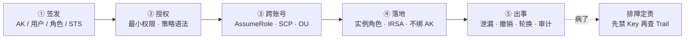
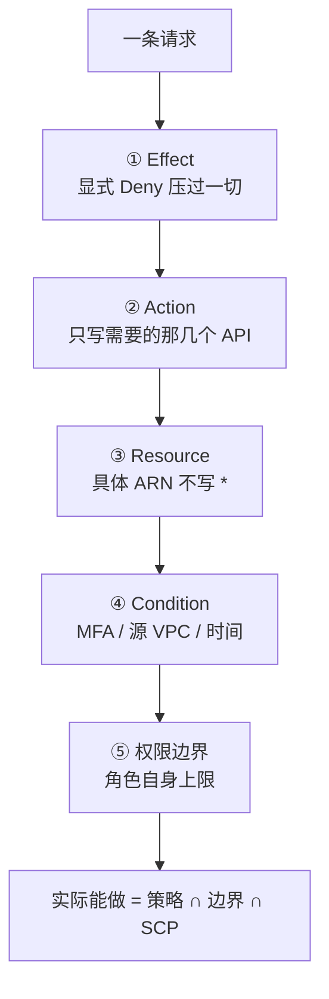
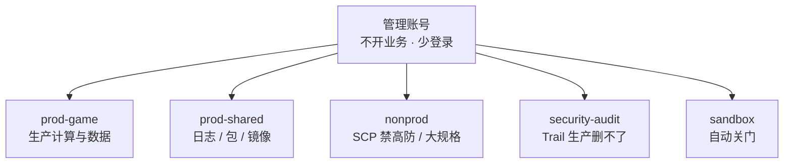
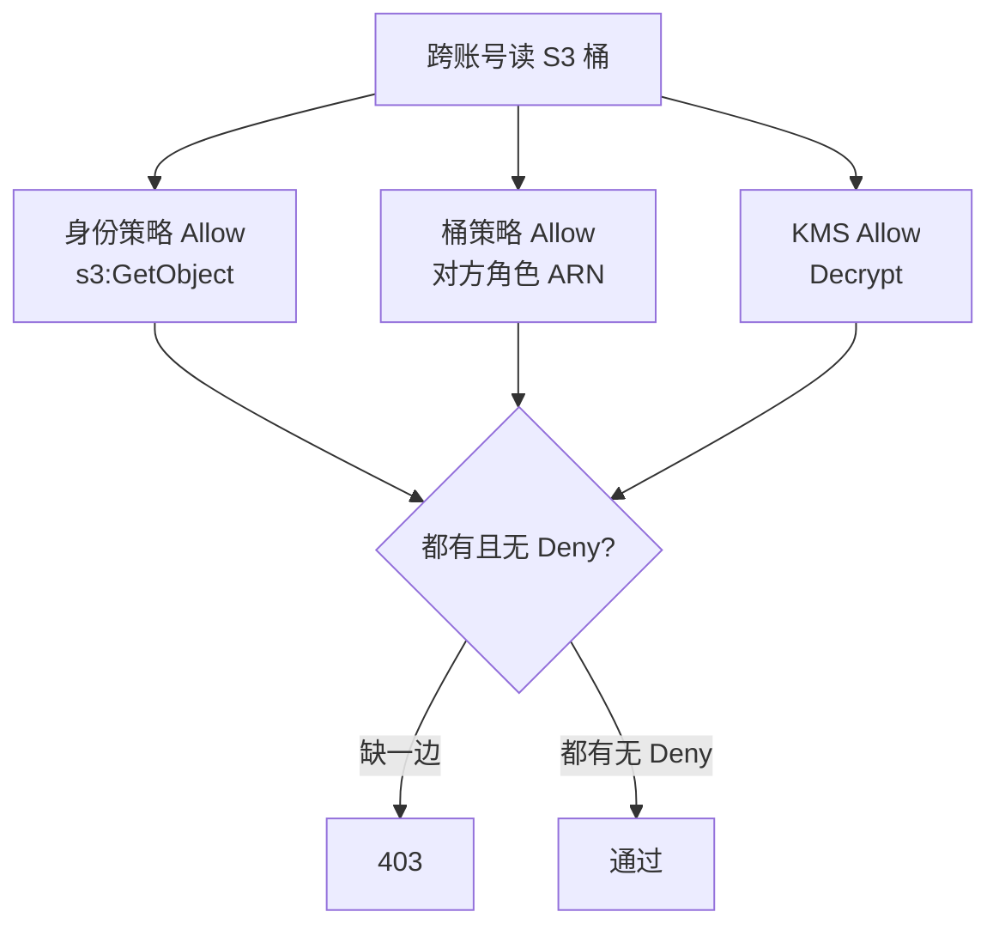
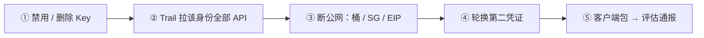
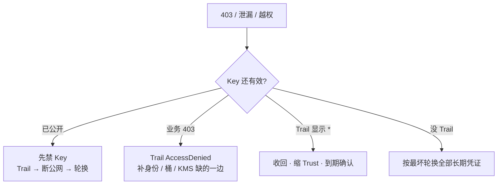

# IAM 与多账号

> 测试 AK 打进热更 json，玩家抓包拿到——群里有人先开会、有人 force-push 删 Git，密钥还挂在那里。另有人给排障角色临时开了 `*:*`，工单没写到期，三个月后这把权限还在。
> **本章回答**：一把 AK 从签发到出事的一生——谁该拿永久钥匙、谁该拿临时票、出了事先做什么。
> **不讲**：AWS IAM 求值细节、IRSA Trust `sub` 展开 → [07](../07-AWS生产/)；ACK RRSA 用法 → [06](../06-阿里云生产/)；火山 IAM 与办公身份 → [08](../08-火山引擎生产/)；跨云策略不能粘贴 → [09](../09-多云对照/)；账单按账号拆 → [05](../05-成本治理/)；K8s RBAC / SA → [03-13](../../03-Kubernetes/13-RBAC与安全/)。

**标记**：🎯重点 · 🔥难点 · ⭐常考 · 🔧实操

---

## 一、一张图：一把钥匙的旅程

> 🎯 **一句话**：云上身份只有两种东西——能复制的永久钥匙（AK）和不能带走的临时票（STS），整章讲的就是一把钥匙从签发到出事会经历哪几段。



**读图**：

- 主线是一把钥匙的旅程，五个阶段串成一条时间线，每节讲一段。
- 永久 AK 出现在 ①，出事在 ⑤——中间三段（授权、跨账号、落地）决定的是「这把钥匙能开几扇门、能被谁拿走」。
- ① 签发决定的是「这把钥匙是什么形态」：永久 AK 还是临时 STS。② 授权决定的是「这把钥匙能开几扇门」：策略四要素和权限边界。③ 跨账号决定的是「这把钥匙能不能跨门开」：AssumeRole 和 SCP 天花板。④ 落地决定的是「这把钥匙怎么挂到机器上」：实例角色和 IRSA。⑤ 出事决定的是「钥匙丢了怎么办」：禁 Key、查 Trail、轮换。
- 排障入口在右下角——任何一段出问题都先回到「先禁 Key 还是先查 Trail」，不是先开会。

---

## 二、签发：永久 AK 与临时 STS 🎯⭐🔥

> 🎯 **一句话**：**访问密钥 AK/SK（Access Key / Secret Key）** 是能复制的永久口令；**角色（Role）** 扮演后拿到的是 **STS Token（临时安全凭证）**，有过期时间、绑身份、不能带走。

### 三种身份凭证 🔥

> 💡 **打个比方**：AK 是你家门钥匙——配一把贴墙上，谁拿到都能开。角色扮演拿到的 STS 是酒店房卡——前台验证身份后给你，几小时后自动失效，而且只认这张卡不认人。钥匙能复制，房卡不能带走。

**IAM 用户（User）/ 用户组（User Group）** 是云平台里造的人——每人或每组一把 AK。**角色（Role）** 不属于任何人，是一种「可以扮演的身份」：谁满足信任策略（Trust Policy）的条件，就能 **AssumeRole（角色扮演）** 换到一把短时 STS。

> 💡 **打个比方**：「定期轮换」不是安全措施——轮换只是换了把新钥匙贴墙上，旧钥匙被抄走的人仍然能开到轮换前的所有门。真正的防御是把钥匙收回来，改成「前台验证身份后给你的房卡」——这就是角色和 STS。

**AWS 叫 IAM Role，阿里云叫 RAM 角色，火山引擎叫 IAM Role**——名字不同，模型一样：信任策略决定谁能扮演，权限策略决定扮演后能干什么。跨云共通的是模型，不共通的是 JSON 字段名和条件键——**不能把 AWS 的策略 JSON 粘到阿里云 RAM**，字段名、条件键、STS 会话时长默认值都不同。

```text
永久 AK / SK          →  没有过期时间，抄进 Git / 镜像 / Jenkins 就等于贴墙上
STS Token             →  有过期时间（小时级），绑在实例 / SA / OIDC 上才能续
AssumeRole            →  换票的动作：我满足 Trust 条件 → 换到一把 STS
```

**用户组（User Group）** 的价值是批量授权：把同一部门的人放进一个组，策略挂在组上而不是逐人挂。但生产仍建议人走 SSO + 扮角色，不留在组里拿永久 AK——组里的人离职后如果忘了删，AK 还在。

| 对比 | 永久 AK/SK | STS Token（角色扮演后） |
|------|-----------|------------------------|
| 过期 | **不过期**，手动禁用前一直有效 | **小时级**过期，SDK 自动续 |
| 绑定 | 不绑任何机器 | 绑实例 / SA / OIDC 身份 |
| 泄漏后果 | 能开这把钥匙的全部门 | 窗口内的调用算数，过期自动失效 |
| 生产用法 | **禁用**，只用于破窗或无法联邦的老系统 | **首选**，程序和人都要走这条路 |

> ⚠️ **别混**：把 STS 写进环境变量跑 12 小时**不等于用了角色**——STS 本该由 SDK 凭证链自动续期，你把它固化进环境变量，就把它变成了事实上的长期票。形式上用了角色，实际等于永久 AK。

### 人怎么进：SSO + MFA 扮角色 ⭐

> 🎯 **一句话**：人从企业 **IdP（身份提供商）/ SSO** 进云，不在云里造一套密码；离职关 IdP 即失去扮演资格，比在每个云账号删用户可靠。

```text
人走对的路：  企业 IdP / SSO  →  MFA  →  AssumeRole（小时级 STS）→  控制台 / API
人走错的路：  云里每人一把永久 AK  →  离职清单漏一个  →  留后门
```

没有 SSO 时至少强制 **MFA（多因素认证）+ 角色扮演**。生产 AssumeRole 强制 `aws:MultiFactorAuthPresent` 条件，禁止没 MFA 的人扮演生产角色。

**SSO / IdP 联邦的好处**：人在企业 IdP 里只有一个身份（Active Directory / Okta / 飞书），云平台不造用户、不存密码。人扮角色时 IdP 发断言（SAML / OIDC），云平台验证后发 STS。离职关 IdP 账号即失去扮演资格——比在每个云账号逐个删用户可靠得多。云平台里的 IAM 用户是遗留产物——老系统没法联邦时才用，新建不要再造 IAM 用户。

> ⚠️ **别混**：控制台和 API 分两套——控制台登录走 MFA，API 调用走角色 STS。`ConsoleSignin` 无 MFA 要告警。根账号（Root）不开日常 API、不开永久 AK、必须开 MFA——根 AK 视为 P0。

### 根账号保护 🎯⭐

> 🎯 **一句话**：根账号是整棵账号树的上帝——不用它干活，只做初始设置和紧急破窗。

根账号保护四条：① 不开日常 AK；② 开 MFA；③ 不用来跑业务；④ SCP 禁止根用户创建 AccessKey。根 AK 泄漏按 P0 处理：轮换根、查 CloudTrail / ActionTrail 是否还有第二把。

> 📝 **面试**：「人走 SSO + MFA 扮角色；程序走实例角色 / IRSA / OIDC；永久 AK 进 Git 按泄漏处理。根账号不开 AK、开 MFA、不跑业务。」

---

## 三、授权：最小权限与策略语法 🔥⭐

> 🎯 **一句话**：**策略（Policy）** 是 JSON 文档，四要素 `Effect / Action / Resource / Condition` 决定「谁能对什么做什么在什么条件下」；**最小权限** 是只给需要的那几个 Action、写到具体 Resource ARN、加 Condition 限缩。

### 策略语法四要素 🎯🔥

```json
{
  "Effect": "Deny",
  "Action": ["s3:GetObject"],
  "Resource": "arn:aws:s3:::game-assets-prod/hotfix/*",
  "Condition": {
    "Bool": { "aws:MultiFactorAuthPresent": "true" }
  }
}
```

- **Effect**：只有 `Allow` 和 `Deny` 两种，**显式 Deny 压过一切 Allow**（含 SCP 的 Deny）。
- **Action**：写需要的那几个 API，如 `s3:GetObject`，**禁止 `*:*`**。
- **Resource**：写具体 ARN（桶名 + 前缀），如 `arn:aws:s3:::game-assets-prod/hotfix/*`，不写 `*`。
- **Condition**：条件键比「拆两个 Action」更有用——`aws:MultiFactorAuthPresent`、源 VPC、禁止没 MFA 的 `sts:AssumeRole`。

> 💡 **打个比方**：策略四要素像门卫的「检查四步」——Effect 是「放还是拦」的最终裁决；Action 是「你能干哪几件事」（不是「你能进哪个房间」那么粗）；Resource 是「具体到哪个房间的哪个柜子」；Condition 是「在什么前提下才放行」（比如必须戴了工牌=MFA、必须从正门进=源 VPC）。少写任何一步，门卫的判断就变粗。

> ⚠️ **别混**：没有写 Allow **不等于禁止**——IAM 默认拒绝（default deny），但不是显式 Deny。两者区别：默认拒绝可以被一条 Allow 翻盘；显式 Deny 谁都翻不了。求值顺序是：先看有没有显式 Deny → 再看有没有 Allow → 都没有 → 默认拒绝。

### 最小权限怎么落到一条策略 ⭐🔧

> 🔍 **现场**：oncall 为了放行探测源，策略写成 `ecs:*` + `vpc:*`，顺手能改生产安全组和释放实例。资源写 `*`。

```text
错：  Action: ecs:* + vpc:*    Resource: *    ← 排障角色能改 SG、释放实例
对：  Action: AuthorizeSecurityGroupIngress   Resource: <backend-sg-arn>
      ← 只能加一条入站规则，改不了别的
```

落到 OSS / S3 同理：角色只能 `GetObject` 指定前缀，不能 `DeleteBucket`。排障不要给整段 VPC 写权限，backend SG 入站只允许 LB 安全组 ID（见 [01-05](../01-云网络与安全/)）。

**Condition 的实战用法**：不只 MFA——可以用源 VPC 限制（只允许从堡垒 VPC 发起 `AssumeRole`）、IP 条件（只允许办公网段访问控制台）、时间条件（只允许工作时间变更）。条件键比「拆两个 Action」更有用——一条 `s3:GetObject` 加条件 `aws:sourceVpce = vpce-xxx` 就把访问锁死到指定 VPC Endpoint，不用拆成「内网 GetObject」和「外网 GetObject」两个角色。

**GM 后台、发奖接口的云角色不能和逻辑服同一条。** 发奖脚本用独立角色 + 审计。两条角色混用，一次 Pod 逃逸就能发奖——这和「节点角色万能」是同一类：图省事把几条职责绑在一个身份上，出事无法收口。

### 临时放大必须到期 🔧🔥

开服夜「先放开再收」。有人给排障角色临时开了 `*:*`，工单没写到期。三个月后这把权限还在——下次泄漏的半径就是生产全部门。

```text
临时 * 的最低限度：
  ① 有工单（写明为什么开 *）
  ② 有到期时间（自动失效）
  ③ 有收回确认（人确认已收回，不是「应该到期了」）
```

> ⚠️ **别混**：权限变更本身就是生产变更。开服夜「先放开再收」而没有到期，就是下次泄漏的半径。90 天未用的 AccessKey 和未用角色要告警关闭——不要「留着观察」，观察中的死 Key 仍有效。

### 权限边界：角色的天花板 ⭐🔥

> 🎯 **一句话**：**权限边界（Permissions Boundary）** 是角色「最多能有」的上限，防的是有 `iam:CreateRole` 的人给自己开 `*`。

```text
日常策略：     角色能做什么（Allow / Deny）
权限边界：     角色最多能做什么（上限）
SCP：          账号能做什么（组织天花板）
```

实际能做 = 日常策略 ∩ 权限边界 ∩ SCP，任一层 Deny 就 Deny。没有天花板时，最小权限会被第一张紧急工单冲掉。

> 💡 **打个比方**：权限边界像信用卡额度——日常策略是你「想买什么」（超市能买、赌场不让），权限边界是「最多刷多少」（额度上限），SCP 是银行风控（境外大额直接拒）。三层叠加：超市买的东西也在额度内也没被风控拦，才交易成功。任何一层拒绝就拒绝。

### 收束：策略凭什么拦得住

把本节散机制收成一张可背清单——IAM 授权就这五件套：



**读图（分组）**：① 是求值铁律（Deny 永远赢）；②③④ 是写策略的三件武器（Action 精确、Resource 具体到 ARN、Condition 限缩）；⑤ 是角色自身天花板。没有显式 Deny 也没有 Allow → 默认拒绝。最后一行是三层叠加公式——实际能做 = 策略 ∩ 边界 ∩ SCP，三层都 Allow 且无 Deny 才通过。

> ⚠️ **别混**：这套机制**只保证**「匹配到的请求按规则放行或拒绝」，**不保证**「模拟器过了就一定通」（跨账号缺资源策略时模拟器会撒谎，四节）、**不保证**「临时开 `*` 会自动收回」（必须工单 + 到期 + 确认）。

> 📝 **面试**（记忆分组法）：策略四要素 `Effect / Action / Resource / Condition`；求值三步「显式 Deny → Allow → 默认拒绝」；三层天花板「日常策略 < 权限边界 < SCP」。最后补一句「临时 `*` 必须有到期收回」。

---

## 四、跨账号：AssumeRole 与 SCP 天花板 🔥⭐

> 🎯 **一句话**：**多账号** 拆的是爆炸半径——prod / nonprod / audit / shared 各一个账号；**SCP（服务控制策略）** 是组织对账号的天花板，只 Deny 不授权，**显式 Deny 压过账号内一切 Allow**。

### 为什么要拆多账号

```text
单账号：  一套 RAM + 一把 AK + 一套配额 + 一套账单
          → 一次测试 AK 泄漏 = 改生产 SG、列生产桶、删生产数据
多账号：  prod / nonprod / audit / shared 各自隔离
          → nonprod 的 SCP 禁高防、禁大规格；生产库 SG 不放行 nonprod VPC
```

拆多账号拆的是三样东西：① **爆炸半径**——一个账号的 AK 泄漏不影响其他账号的生产资源；② **配额和账单**——每个账号独立的 vCPU 配额、EIP 限额、账单单元；③ **权限域**——生产账号的管理员不能碰测试账号的 SG，反之亦然。「VPC + 安全组隔离」只能防网络层，防不了一把 AK 同时有生产和测试的 `ram:*`。

**账号目录**（Account Directory）是组织管理服务里账号的注册和发现机制——集中查看「组织里有哪些账号、谁在哪个 OU、SCP 挂了没有」。SCP 挂在 OU 上不挂在账号目录上，但账号目录是看到全貌的入口。

### 账号树：组织单元与落地顺序 🎯⭐

**组织单元 OU（Organizational Unit）** 是账号树里的分组节点，SCP 挂在 OU 上对下面所有账号生效。



**读图**：管理账号不开业务，只管组织。审计账号的 Trail 是组织级的，生产角色只能写不能删。nonprod 的 SCP 禁高防和大规格包年。sandbox 自动关门（资源到期销毁）。

落地顺序：**先拆 nonprod → 再拆审计账号 → 最后动生产**。管理账号紧急角色双人离线保存。一次切七个没有 runbook，比「全员 Admin」的单账号更危险——SCP 先上、管理账号没有紧急角色、全员被锁门外。

> ⚠️ **别混**：**账号目录（Account Directory）** 不是指这些账号本身，而是组织管理服务里账号的注册和发现机制——用来集中查看「组织里有哪些账号、谁在哪个 OU」。SCP 挂在 OU 上，不挂在账号目录上。

### SCP：只 Deny 不授权 ⭐🔥

> 🎯 **一句话**：SCP 是「不能做什么」，不是日常权限清单——它不授予权限，只封顶。

**SCP 最小集（组织级 Deny，业务策略写在账号内角色上）：**

| Deny 什么 | 为什么 |
|-----------|--------|
| 关闭 CloudTrail / ActionTrail / 配置记录器 | 没有审计 = 没有影响面 |
| 根用户创建 AccessKey | 根 Key 视为 P0 |
| 关掉 `s3:PutBucketPublicAccessBlock` | 公共桶是数据面 + 账单炸弹 |
| 非生产购买高防、大规格包年、昂贵 GPU | 测试账号冲动购买 |
| 成员账号离开组织 / 删审计桶 | 自己拆天花板 |

SCP 在 sandbox 先挂 → 确认破窗角色不被误杀 → 再挂生产 OU。不要在开服夜改 SCP。误杀后靠从管理账号卸策略来破窗，不能靠「全员 Admin」。

**SCP 为什么只 Deny 不 Allow**：SCP 是组织级合规天花板，不是日常权限管理工具。如果 SCP 能写 Allow，各账号的管理员就要同时维护 SCP 和角色策略两套 Allow，冲突时无法判断哪条优先。只 Deny 的设计保证了「天花板只往下压、不往上抬」——日常授权全部在账号内角色策略里写，SCP 只负责兜底禁止。FullAccessGuard（阿里云）和 Service Control Policy（AWS）都是这个模型。

> ⚠️ **别混**：**SCP ≠ 权限边界 ≠ 日常策略**。日常策略是「角色能做什么」（账号内）；权限边界是「角色最多能做什么」（角色自身上限）；SCP 是「账号能做什么」（组织天花板）。三层都 Deny 就 Deny。SCP 不授权——日常仍靠角色最小权限。

### 跨账号 AssumeRole 与资源策略 🔧🔥

跨账号访问要过两道门：**身份策略**（A 账号里的角色能干什么）和 **资源策略**（B 账号里的桶/KMS 允许谁来访问）。两道门都 Allow 才通，缺一边 403。



**读图**：跨账号要身份策略和资源策略（桶策略 / KMS）**都** Allow，缺一边 403。KMS 加密桶还缺 `kms:Decrypt` 也会 403。**IAM 模拟器（Policy Simulator）常不带资源策略，会误导**——模拟器过了、实际 403 是经典事故。

**AssumeRole 跨账号的流程**：A 账号角色的信任策略写 `Principal: B 账号角色 ARN`（允许 B 来扮演）；B 账号角色调 `sts:AssumeRole` 拿到 A 的 STS；A 的 STS 再去读 B 的桶——此时 A 的身份策略要 Allow `s3:GetObject`，B 的桶策略要 Allow A 的角色 ARN。两边都 Allow 才通。KMS 加密的桶还多一道：KMS Key 策略也要 Allow A 的角色 ARN 做 `kms:Decrypt`——少这一道也会 403，而且报错信息不指向 KMS，容易误判为桶策略问题。

```bash
# 跨账号 403 时不要加 Admin 验证，看 Trail
# AWS:  aws cloudtrail lookup-events --lookup-attribute AttributeKey=AccessKeyId,AttributeValue=AKIA...
# 阿里:  ActionTrail 控制台按 accessKeyId 过滤
# ← 看 AccessDenied 的 Action 和 Resource，补缺的那一边
```

> ⚠️ **别混**：**不要加 `AdministratorAccess` 验证「是不是权限问题」**——那是扩大泄漏面。以 Trail 里 `AccessDenied` 的 Action 和 Resource 为唯一可信输入。

> 📝 **面试**：「跨账号 403 要身份 + 资源策略双允许 + KMS；模拟器不是真相，以 Trail 为准；不加 Admin 验证。」

---

## 五、落地：实例角色与 IRSA 🎯⭐🔧

> 🎯 **一句话**：程序不绑永久 AK——ECS 用 **实例角色（ECS实例RAM角色 / Instance Profile）**，EKS / ACK 用 **IRSA（IAM Roles for Service Accounts）**，CI 用 OIDC 联邦换短时 STS。

### 节点角色 vs 应用角色 ⭐🔥

> ⚠️ **别混**：节点角色和应用角色必须拆开。节点角色只要拉镜像、写日志，不能 `oss:DeleteBucket`。应用角色绑 SA，逻辑服最多读热更前缀、写自己的日志。两条角色混用，一次 Pod 逃逸就能发奖。

| 角色 | 干什么 | 不能干什么 |
|------|--------|-----------|
| 节点角色 | 拉镜像、写日志 | `DeleteBucket`、改 SG、发奖 |
| 应用角色 | 读热更前缀、写业务日志 | 和节点角色共用 |

**ECS 实例角色** 的机制：实例启动时挂上 **Instance Profile**（AWS）/ **ECS 实例 RAM 角色**（阿里云），SDK 凭证链从 **metadata 服务**（`169.254.169.254`）自动拿 STS。程序不需要配 AK——SDK 发现自己跑在 ECS 上，自动去找 metadata 服务续票。这就是「不绑 AK」的本质：AK 换成了 metadata 服务里的自动续期 STS。

> 🔍 **现场**：检查 ECS 实例是否挂了角色，不要看环境变量有没有 AK。

```bash
# 检查实例角色（metadata 服务返回 STS = 挂了角色）
curl -s http://100.100.100.200/latest/meta-data/ram/security-credentials/    # 阿里云 ECS
curl -s http://169.254.169.254/latest/meta-data/iam/security-credentials/    # AWS EC2
# ← 有返回 = 挂了角色，程序应走 SDK 凭证链；无返回 = 没挂角色，程序只能靠环境变量 AK
```

### IRSA：把权限绑到 Pod 🔧🔥

EKS 节点 Instance Profile 给了 S3 Full Access 仍算没做 IRSA——任意 Pod 都能用节点角色调 S3，逃逸即搬空桶。IRSA 把权限缩到具体 **ServiceAccount**，Trust 限制 `sub` 到 `system:serviceaccount:<ns>:<sa>`。

```text
没做 IRSA：    节点角色 s3:*  →  任意 Pod 可调 S3  →  Pod 逃逸 = 搬空桶
做了 IRSA：    SA 注 role-arn  →  Trust sub = ns:sa  →  只有这个 SA 能扮演
Trust 没限 sub：  集群内任意 SA 可扮演  →  等于没做
```

**IMDSv2** 防 SSRF 偷节点凭证——如果应用有 SSRF 漏洞，攻击者可以访问 `169.254.169.254` 拿到节点角色的 STS。IMDSv2 要求先 PUT 拿 token 再 GET，SSRF 通常只能发 GET，挡住了一层。但节点角色仍必须瘦——IMDSv2 是加固不是替代。ACK **RRSA** 同一模型（阿里云的 IRSA 等价物）。EBS CSI 和 LB Controller 不要共用一个角色——少一个权限就 controller 403、Service Pending，共用只会把权限再放宽。

> ⚠️ **别混**：节点 S3 Full Access = 没做 IRSA，不是「节点能拉桶就算做了 IRSA」。IRSA 的 Trust 不限制 `sub` = 集群内任意 SA 可扮演。

### CI：OIDC 短时角色 ⭐

CI 流水线不要永久 AK + Admin。用 **OIDC 联邦**到角色，仅推某个 ECR 或执行有限 API，过期短。流水线被打穿等于生产被打穿。发版角色和生产 oncall 角色分开；生产 Terraform apply 要人工审 plan。开服脚本同样用角色，打包目录扫 AK。

```text
对：  CI OIDC → STS（短时）→ 推镜像 / RunCommand
错：  Jenkins 永久 AK + AdministratorAccess → 「发版省事」= P0 风险
```

**OIDC 联邦的机制**：CI 平台（GitHub Actions / GitLab CI / Jenkins）配置为 OIDC IdP，云平台信任这个 IdP。每次流水线运行时，CI 向云平台发 OIDC Token，云平台验证后发短时 STS。Token 只在这一次 pipeline 运行中有效——不存在永久 AK 被抄走的可能。Trust 策略限制 `sub` 到具体 repo + branch，防止其他 repo 冒充。

开服脚本同样用角色，不要在脚本里硬编码 AK。打包目录发布前扫一遍——`grep -r "AKIA\|LTAI"` 发现 AK 立即替换为角色引用，不要「先上线再改」。

> 📝 **面试**：「ECS 用实例角色，EKS / ACK 用 IRSA / RRSA，CI 用 OIDC；节点角色要瘦，应用权限绑 SA；Trust 不限 sub = 集群内任意 SA 可扮演。」

---

## 六、出事：AK泄漏与审计 🎯⭐🔥

> 🎯 **一句话**：AK 泄漏先禁 Key、再查 Trail、再断公网——不要先开会，作废前每一秒都算数。

### 泄漏应急：分钟级顺序 🔧🔥



**读图**：五步按顺序走，不能跳。先禁 Key 再查 Trail——Key 还有效时开会分析，等于给攻击者留窗口。

**每步在做什么**：① 禁用/删除 Key 让攻击者立刻断手——之前能开的门现在开不了；② Trail 拉这条身份的全部 API 调用——看改了什么 SG、列了什么桶、建了什么用户；③ 断公网——如果攻击者开了后门（新 AK、新 SG `0.0.0.0/0`），这一步堵住；④ 轮换第二凭证——如果攻击者已经创建了第二把 AK，只禁第一把不够；⑤ 评估通报——密钥进了客户端包（热更 json、配置文件）等于公开，玩家抓包能拿到，需要走通报流程。

```bash
# 先禁 Key，再查这条身份干过什么（各云 CLI 名字不同，顺序一样）
# 阿里云:  DisableAccessKey → ActionTrail 按 accessKeyId 过滤
# AWS:     aws iam update-access-key --status Inactive
#          → aws cloudtrail lookup-events --lookup-attribute AttributeKey=AccessKeyId
# ← 顺序永远是先禁再查，不要先开会
```

根账号密钥按 P0 处理：轮换根、开 MFA、查是否还有第二把根 AK。STS 泄漏仍要禁角色并查 Trail——窗口内的调用算数。密钥进了镜像：重建镜像、作废旧凭证、检查是否推过公共仓库。密钥进了客户端包（热更 json、配置文件）：评估是否需要通报——玩家抓包能拿到等于公开。

> ⚠️ **别混**：改登录密码**不等于**禁 AK——AK 独立于登录密码，必须单独作废。force-push 删 Git 记录**不能当应急**——历史还在，密钥已公开，改 `.gitignore` 不够，必须作废密钥。测试密钥同一套流程，不要用「那是测试的」开脱。

### 没有 Trail 怎么办 🔧

没有 **CloudTrail（AWS）/ ActionTrail（阿里云）/ 操作日志** = 无法证明没被搬数据，只能按最坏假设轮换所有长期凭证、查 Bucket 访问日志。开审计是生产门禁，不是可选合规。Trail 必须覆盖所有区域（Multi-Region），进独立审计账号，生产角色只能写不能删。

```text
有 Trail：   按 accessKeyId 过滤 → 列出改过的 SG、新用户、新策略、S3 列表/下载
没 Trail：   按最坏轮换全部长期凭证，影响面说不清
```

### 访问审计与告警项 ⭐🔧

Trail 进**独立审计账号**，生产角色只能写不能删。**访问审计 / 操作日志**必须覆盖所有区域（Trail 的 Multi-Region）。Trail 在生产账号里，生产管理员能删等于没有审计——审计必须独立于被审计对象。

必须告警的操作：

```text
根登录              ← 根不该日常登录
关 Trail            ← 没有审计 = 没有影响面
新建 AK             ← 新增永久钥匙
策略变 *            ← 最小权限被冲掉
Bucket 公共         ← 数据面 + 账单炸弹
SG 0.0.0.0/0:22/3389  ← 管理端口裸奔
90 天未用 AK         ← 死 Key 仍有效
```

告警不是「配了就行」——要有人值班看告警。告警进了 Slack / 飞书群没人看，等于没有告警。oncall 值班要覆盖安全告警，不只是业务告警。GitHub secret scanning 也要进 oncall 告警——公开仓库出现 AK 时，secret scanning 通知比人工发现快。

> 📝 **面试**：「泄漏先禁 Key 再查 Trail，不先开会；改密码不等于禁 AK；force-push 不能当应急；没有 Trail 按最坏轮换。」

### 破窗演练 🔧

管理账号 / 根很少登录，但必须有破窗流程：SCP 误杀、所有人被锁门外时，谁能用离线保管的紧急角色进来。双人、密封、每年演练一次（只登录不改资源）。演练当天确认密封包能打开、MFA 还能用、紧急角色没被 SCP 误杀。没有破窗的多账号，比单账号更容易在事故里瘫痪。

**破窗角色怎么放**：离线保管 = 不在云上、不在 Git、不在 CI。物理密封（U 盘 / 纸质），双人各持一半（密钥拆两半，必须两人到齐才能拼出）。MFA 设备同样密封。演练只验证「能登录、能扮演」，不改任何资源——不创建 AK、不修改 SCP、不碰生产数据。演练后确认密封包重新密封。

> ⚠️ **别混**：**不能把 AWS IAM JSON 粘到阿里云 RAM**——字段名、条件键、STS 会话时长默认值不同。共通的是：人走扮演、程序走角色、Deny 优先、审计进独立桶。跨云策略不能粘贴，见 [09](../09-多云对照/)。

---

## 七、作战：定责 🎯⭐🔧

> 🎯 **一句话**：权限问题用 Trail 分流——先分叉「是泄漏还是 403 还是过宽」，不要加 Admin 验证。



**读图**：第一刀先分「Key 还有效吗」——已公开就走泄漏应急（先禁再查），业务 403 就看 Trail 补缺边，过宽就收回。没 Trail 是最坏情况，只能全量轮换。

**读图（分组）**：三叉分到三类病——①「Key 已公开」是泄漏，走五步应急（禁 Key → Trail → 断公网 → 轮换 → 通报）；②「业务 403」是权限缺边，看 Trail 的 `AccessDenied` 补身份/桶/KMS 缺的那一边；③「Trail 显示 `*`」是过宽，收回缩 Trust、写到期。没 Trail 是最坏分支，等于「不知道被干了什么」，只能全量轮换。

### 现象 · 先做 · 别做

| 现象 | 先做 | 别做 |
|------|------|------|
| GitHub 出现生产 AK | 禁 Key → Trail → 断公网 | 先开会 / 只 force-push / 只改密码 |
| 模拟器过、实际 403 | Trail + 桶策略 / KMS | 加 AdministratorAccess 验证 |
| 任意 Pod 能调 S3 | 收节点策略、IRSA + Trust sub | 认为「节点能拉桶就算做了 IRSA」 |
| SCP 后全员进不去 | 破窗从管理账号卸策略 | 没有紧急角色时一次切七个账号 |
| 临时 `*` 三个月后还在 | 到期收回 | 开服夜先放开再收且不写到期 |
| 没有 Trail | 按最坏轮换全部长期凭证 | 声称「可能没用过」 |

### 60 秒剧本 🔧

```text
0–10s   这把 Key 是不是根 AK？  根 → P0 轮换根 + 开 MFA + 查第二把
10–30s  禁用 / 删除这把 AccessKey（控制台或 CLI 都行，不等审批流）
30–45s  Trail 按 accessKeyId 过滤：改了什么 SG、列了什么桶、建了什么用户
45–60s  断异常公网（桶 Block Public Access、SG 收回、EIP 释放）
# ← 60 秒内不开会、不 force-push、不改登录密码当修复
```

> 📝 **面试**：「泄漏先禁 Key 再查 Trail，不先开会；403 看 Trail 补资源策略，不加 Admin；过宽收回缩 Trust；没 Trail 按最坏轮换。」

---

## 八、收口

### 命令速查 🔧

```bash
# 禁用 AK（先禁再查，不等审批）
# AWS:     aws iam update-access-key --status Inactive --access-key-id AKIA...
# 阿里云:   aliyun ram UpdateAccessKey --Status Inactive
# ← 顺序永远是先禁再查 Trail，不要先开会

# 查 Trail（该 Key 干过什么）
# AWS:     aws cloudtrail lookup-events --lookup-attribute AttributeKey=AccessKeyId,AttributeValue=AKIA...
# 阿里云:   ActionTrail 控制台按 accessKeyId 过滤
# ← 看 AccessDenied 的 Action + Resource；看改过的 SG / 新建用户 / 桶列表

# 未用密钥告警
# AWS:     aws iam generate-credential-report  ← 90 天未用 AccessKey 告警关闭
# 阿里云:   RAM 控制台 → AccessKey 最后使用时间

# SCP 列表（破窗从管理账号卸策略）
# AWS:     aws organizations list-policies-for-target --target-id <account-id>
# 阿里云:   ram ListPoliciesForRole（资源目录级策略在资源目录控制台看）
# ← 误杀后从管理账号卸策略来破窗，不能靠「全员 Admin」

# 检查 ECS 实例角色（metadata 服务返回 STS = 挂了角色）
# 阿里云:  curl -s http://100.100.100.200/latest/meta-data/ram/security-credentials/
# AWS:     curl -s http://169.254.169.254/latest/meta-data/iam/security-credentials/
# ← 有返回 = 挂了角色，程序应走 SDK 凭证链；无返回 = 没挂角色

# 检查 IRSA（SA 注了 role-arn 才算做了 IRSA）
# kubectl get sa <sa-name> -n {ns} -o jsonpath='{.metadata.annotations}'
# ← 有 role-arn 注解 = 做了 IRSA；Trust 要限 sub 到 system:serviceaccount:{ns}:<sa>

# 检查 STS Token 剩余有效期（SDK 凭证链自动续，手动看到期）
# AWS:     aws sts get-caller-identity（确认当前身份）
#          aws iam list-access-keys（看谁的 AK 还在）
# 阿里云:   aliyun sts GetCallerIdentity
# ← 确认当前调用走的是哪个身份 / 角色
```

### 面试锚点表

| 问 | 30 秒答 |
|----|---------|
| 程序为什么不用永久 AK？ | AK 能复制、不绑机器、泄漏即全门；走实例角色 / IRSA / OIDC，STS 小时级过期 SDK 自动续。 |
| STS 写环境变量跑 12h 算用了角色吗？ | 不算，变成事实上的长期票；SDK 凭证链自动续才对。 |
| AK 泄漏前 15 分钟？ | 先禁 Key → Trail → 断公网 → 轮换；不先开会，作废前每秒都算数。 |
| 改密码等于禁 AK 吗？ | 不等于，AK 独立于登录密码，必须单独作废。 |
| force-push 能当应急吗？ | 不能，历史还在，密钥已公开，必须作废。 |
| 策略四要素？ | Effect（Allow/Deny）/ Action（具体 API）/ Resource（ARN）/ Condition（MFA、源 VPC）。 |
| 显式 Deny 和默认拒绝？ | 显式 Deny 谁都翻不了；默认拒绝一条 Allow 就能翻盘。 |
| 最小权限落到策略？ | Action 写需要的那几个、Resource 写具体 ARN、Condition 加 MFA / 源 VPC；禁止 `*:*`。 |
| 权限边界 vs SCP？ | 边界是角色自身上限；SCP 是账号层天花板（组织级）。两层都 Deny 就 Deny。 |
| SCP 能代替最小权限吗？ | 不能，SCP 只 Deny 不授权，日常仍靠角色最小权限。 |
| 跨账号 403 为什么？ | 身份策略 + 资源策略（桶 + KMS）双允许，缺一边 403；模拟器常漏资源策略。 |
| 不要用什么验证权限问题？ | 不加 AdministratorAccess 验证，以 Trail 为准。 |
| 为什么要拆多账号？ | 单账号一次 AK 打穿生产 + 测试；拆 prod / nonprod / audit / shared 爆炸半径。 |
| SCP 最小集 Deny 哪几条？ | 关 Trail / 根 AK / 公共桶 / 非生产大规格 / 离开组织 / 删审计桶。 |
| 节点 S3 Full = 做了 IRSA？ | 不等于，任意 Pod 用节点角色调 S3；IRSA Trust 必须限 sub。 |
| 节点角色要什么权限？ | 拉镜像、写日志；不能 DeleteBucket / 改 SG / 发奖。 |
| CI 该拿什么权限？ | OIDC 短时角色，只推镜像或执行有限 API；不要永久 AK + Admin。 |
| 告警项有哪些？ | 根登录 / 关 Trail / 新建 AK / 策略变 * / 桶公共 / SG 0.0.0.0/0:22,3389 / 90 天未用 AK。 |
| 没有破窗会怎样？ | SCP 误杀全员被锁，比单账号更容易瘫痪；双人密封每年演练。 |
| 账号树落地顺序？ | 先 nonprod → 再审计 → 最后生产；管理账号紧急角色双人离线。 |
| AWS JSON 粘到 RAM 行吗？ | 不行，字段和条件键不同；共通的是 Deny 优先、人走扮演、审计独立桶。 |
| GM 发奖和逻辑服共用角色？ | 不行，Pod 逃逸就能发奖；独立角色 + 审计。 |
| 临时 `*` 最低限度？ | 工单 + 到期 + 收回确认；没有到期三个月后还在。 |
| 权限边界防什么？ | 防有 `iam:CreateRole` 的人给自己开 `*`；角色自身上限。 |
| STS 泄漏要禁角色吗？ | 要，窗口内的调用算数，禁角色并查 Trail。 |
| 根账号保护怎么做？ | 不开日常 AK、开 MFA、不跑业务；SCP 禁止根用户创建 AccessKey。 |
| 开服夜能改 SCP 吗？ | 不行，误杀后没破窗会全员被锁；SCP 在 sandbox 先挂再挂生产。 |

### 易错一句话对照

- 程序用永久 AK 定期轮换就行 → 错：绑计算身份的角色 / OIDC
- STS 写环境变量跑 12h 算用了角色 → 错：变成长期票
- 泄漏先开会再禁 Key → 错：作废前每秒都算数
- 改密码等于禁 AK → 错：AK 独立必须单独作废
- force-push 能当应急 → 错：历史还在密钥已公开
- 只读开了 / VPC 隔离了就不需要多账号 → 错：一次 AK 打穿生产 + 测试
- SCP 是日常权限清单 → 错：只 Deny 不授权
- 权限边界 = SCP → 错：边界是角色上限，SCP 是账号天花板
- 模拟器过了就一定能读桶 → 错：还要资源策略 / KMS
- 没写 Allow 就默认过 → 错：默认拒绝
- 节点 S3 Full Access = 做了 IRSA → 错：任意 Pod 用节点角色
- Trust 不限制 sub 也算 IRSA → 错：集群内任意 SA 可扮演
- 没有 Trail 也能说清影响面 → 错：按最坏轮换
- 发奖和逻辑服同一角色图省事 → 错：Pod 逃逸就能发奖
- 把 AWS JSON 粘到 RAM → 错：字段和条件键不同
- 加 AdministratorAccess 验证权限问题 → 错：扩大泄漏面
- 开服夜改 SCP 没问题 → 错：误杀后没破窗全员被锁
- CI 用永久 AK + Admin 省事 → 错：流水线被打穿等于生产被打穿
- Trail 放生产账号里 → 错：生产管理员能删等于没有审计
- 破窗演练不用做很少登录 → 错：SCP 误杀后比单账号更容易瘫痪

### 数字墙

> STS **小时级**过期 · AK **90 天**未用告警 · 破窗**每年**演练只登录 · 临时 `*` 必须有到期 · 泄漏止血**分钟级** · SCP 最小集 **5~7** 条 Deny · 账号树 **5** 格（prod / shared / nonprod / audit / sandbox）· 求值三步 Deny → Allow → 默认拒绝 · 三层天花板 日常策略 < 权限边界 < SCP · 一个 NAT IP 约 **6 万** 源端口（和 [01](../01-云网络与安全/) 共享的 SNAT 限制）· 跨 AZ RTT **0.5–2ms**（影响 Session 绑 AZ 的决策）· 跨账号三道门 身份 + 桶 + KMS · AssumeRole STS 最长 **1~12 小时**（可配但不建议拉长）· 破窗密封包双人各持一半 · GitHub secret scanning 分钟级通知 · IRSA Trust sub 限制到 `system:serviceaccount:<ns>:<sa>` · Condition 键 `aws:MultiFactorAuthPresent` / `aws:SourceVpc` · 90 天未用 AK 关闭不留观察

---

## 合上书

- [ ] **默画**一把钥匙的旅程（签发→授权→跨账号→落地→出事），标出永久 AK 和 STS 各在哪段、排障从哪进。
- [ ] **口述签发**：AK vs 角色 vs STS 三种凭证各什么特性；STS 写环境变量跑 12h 为什么等于长期票；人走 SSO + MFA 扮角色 vs 程序走实例角色 / IRSA / OIDC。
- [ ] **默画策略语法**：`Effect / Action / Resource / Condition` 四要素；求值三步（Deny → Allow → 默认拒绝）；最小权限落到一条 OSS 策略长什么样。
- [ ] **口述授权**：权限边界是什么、和 SCP 什么关系、三层天花板怎么叠；临时 `*` 最低限度；GM 发奖和逻辑服为什么拆开。
- [ ] **默画账号树**：管理账号 → prod / shared / nonprod / audit / sandbox 五格；SCP 最小集 Deny 哪几条；落地顺序为什么先 nonprod 再审计最后生产。
- [ ] **口述跨账号**：AssumeRole 怎么跨账号；跨账号 403 缺哪一边；KMS 为什么也要 Decrypt；模拟器为什么撒谎；不加什么验证。
- [ ] **口述落地**：节点角色 vs 应用角色为什么拆开；IRSA Trust sub 不限等于什么；节点 S3 Full 为什么不算做了 IRSA；CI 该拿什么权限。
- [ ] **默画泄漏应急**：禁 Key → Trail → 断公网 → 轮换 → 通报五步；为什么先开会不及格；改密码为什么不等于禁 AK；force-push 为什么不能当应急。
- [ ] **口述出事**：没有 Trail 怎么办；告警项有哪些；破窗演练怎么做；为什么不能把 AWS JSON 粘到 RAM。
- [ ] **定责**：作战决策树三叉（泄漏 / 403 / 过宽）各走哪条；60 秒剧本 0–60s 各敲什么、什么绝不碰。
- [ ] **口述数字墙**：STS 小时级过期 · AK 90 天未用告警 · SCP 最小集 5~7 条 · 账号树 5 格 · 三层天花板 · 跨账号三道门 · 破窗密封包双人各持一半。
- [ ] **口述根账号保护**：不开日常 AK、开 MFA、不跑业务、SCP 禁止根用户创建 AccessKey；根 AK 泄漏按 P0 轮换根 + 查第二把。
- [ ] **口述 STS 凭证链**：SDK 怎么从 metadata 自动拿 STS？为什么手写 STS 进环境变量等于退化成永久 AK？
