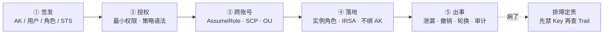
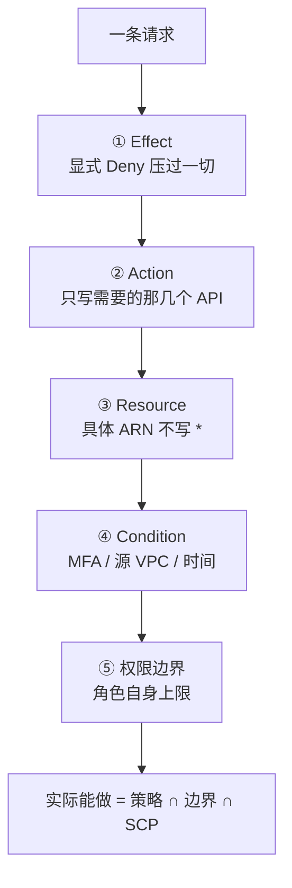
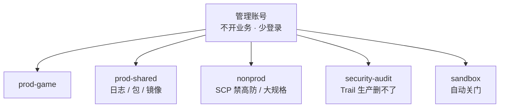
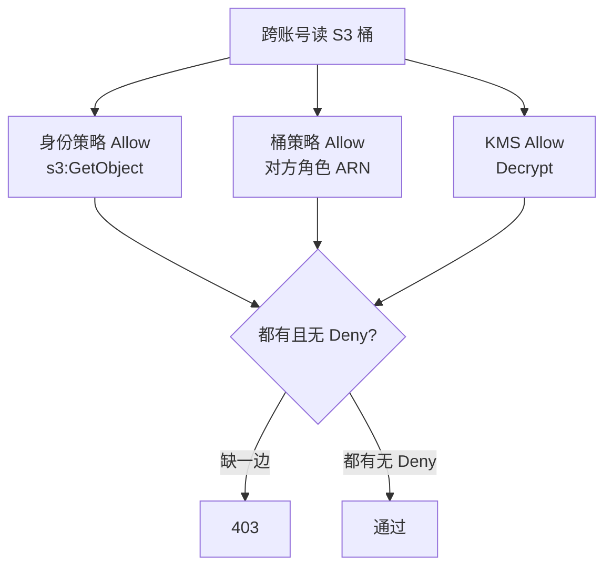
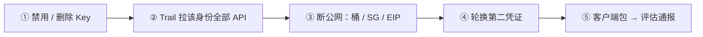
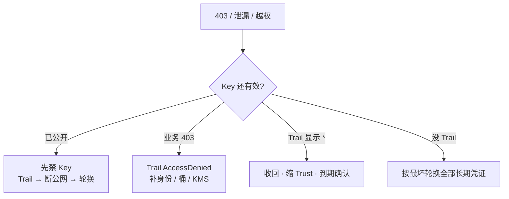

# IAM 与多账号

> 测试 AK 打进热更 json，玩家抓包拿到——群里有人先开会、有人 force-push 删 Git，密钥还挂在那里。另有人给排障角色临时开了 `*:*`，工单没写到期，三个月后这把权限还在。
> **本章回答**：一把 AK 从签发到出事的一生——谁该拿永久钥匙、谁该拿临时票、出了事先做什么。
> **不讲**：AWS IAM 求值细节、IRSA Trust `sub` 展开 → [07](../07-AWS生产/)；ACK RRSA → [06](../06-阿里云生产/)；火山 IAM → [08](../08-火山引擎生产/)；跨云策略粘贴 → [09](../09-多云对照/)；账单按账号拆 → [05](../05-成本治理/)；K8s RBAC / SA → [03-13](../../03-Kubernetes/13-RBAC与安全/)。

**标记**：🎯重点 · 🔥难点 · ⭐常考 · 🔧实操

---

## 一、一张图：一把钥匙的旅程

> 🎯 **一句话**：云上身份只有两种——能复制的永久钥匙（AK）和不能带走的临时票（STS）；整章就是一把钥匙从签发到出事会经历哪几段。



- 📖 **读图**
  - 🛤️ 主线五段：签发 → 授权 → 跨账号 → 落地 → 出事；永久 AK 在 ①，出事在 ⑤
  - 🚨 右下虚线：任何一段出问题都先回到「先禁 Key 还是先查 Trail」，不是先开会

好，主图装进脑子了。从「签发」开始——永久 AK 和临时 STS，谁该拿哪把。

本节对应练习题 Q1。

---

## 二、签发：永久 AK 与临时 STS 🎯⭐🔥

> 🎯 **一句话**：**访问密钥 AK/SK** 是能复制的永久口令；**角色（Role）** 扮演后拿到的是 **STS Token**，有过期时间、绑身份、不能带走。

- 🔑 **永久 AK** = 长期有效的大门钥匙；**STS** = 有过期时间的临时通行证——能发临时票就别发永久钥
- 🎭 **角色**不属于任何人：谁满足 **信任策略（Trust Policy）**，就能 **AssumeRole** 换到短时 STS
- ☁️ **AWS IAM Role / 阿里云 RAM 角色 / 火山 IAM Role**——名字不同，模型一样；**不能把 AWS 策略 JSON 粘到阿里云 RAM**

> 💡 **打个比方**：AK 是门钥匙——配一把贴墙上，谁拿到都能开。STS 是酒店房卡——前台验证后给你，几小时后失效，只认这张卡。「定期轮换」只是换了把新钥匙贴墙上，旧钥匙被抄走的人仍能开到轮换前的门——真正防御是改成房卡。

#### ❓ 为什么轮换永久 AK 仍不够安全？

- ❌ 高频错答：「定期轮换就算安全措施」
- ✅ 轮换只换新钥，**抄走过的旧钥在禁用前仍开全门**
- 🎫 生产首选：绑计算身份的角色 / OIDC，SDK 自动续 STS
- ⚠️ STS 写进环境变量跑 12h **不等于用了角色**——固化后变成事实上的长期票

| 对比 | 永久 AK/SK | STS Token（角色扮演后） |
|------|-----------|------------------------|
| 过期 | **不过期**，手动禁用前一直有效 | **小时级**过期，SDK 自动续 |
| 绑定 | 不绑任何机器 | 绑实例 / SA / OIDC 身份 |
| 泄漏后果 | 能开这把钥匙的全部门 | 窗口内的调用算数，过期自动失效 |
| 生产用法 | **禁用**，只用于破窗或无法联邦的老系统 | **首选** |

### 👤 人怎么进：SSO + MFA 扮角色 ⭐

> 🎯 **一句话**：人从企业 **IdP / SSO** 进云，不在云里造一套密码；离职关 IdP 即失去扮演资格。

```text
对：  企业 IdP / SSO  →  MFA  →  AssumeRole（小时级 STS）→  控制台 / API
错：  云里每人一把永久 AK  →  离职清单漏一个  →  留后门
```

- 🪪 云平台不造用户、不存密码；扮角色时 IdP 发 SAML / OIDC 断言，云验证后发 STS
- 🔒 没有 SSO 时至少强制 **MFA + 角色扮演**；生产 AssumeRole 强制 `aws:MultiFactorAuthPresent`
- ⚠️ 控制台走 MFA，API 走角色 STS——两套；根账号不开日常 AK、开 MFA、不跑业务

> 📝 **面试**：「人走 SSO + MFA 扮角色；程序走实例角色 / IRSA / OIDC；永久 AK 进 Git 按泄漏处理。根账号不开 AK、开 MFA、不跑业务。」

本节对应练习题 Q1。

---

## 三、授权：最小权限与策略语法 🔥⭐

> 🎯 **一句话**：**策略（Policy）** 四要素 `Effect / Action / Resource / Condition` 决定「谁能对什么做什么」；最小权限 = 只写需要的 Action、具体 ARN、加 Condition。

### 📋 策略语法四要素 🎯🔥

```json
{
  "Effect": "Deny",
  "Action": ["s3:GetObject"],
  "Resource": "arn:aws:s3:::game-assets-prod/hotfix/*",
  "Condition": {
    "Bool": { "aws:MultiFactorAuthPresent": "true" }
  }
}
```

- **Effect**：只有 Allow / Deny；**显式 Deny 压过一切 Allow**（含 SCP）
- **Action**：写需要的那几个 API，**禁止 `*:*`**
- **Resource**：具体 ARN（桶 + 前缀），不写 `*`
- **Condition**：MFA、源 VPC、时间——往往比「再拆一个 Action」更有用

> 💡 **打个比方**：门卫四步——Effect 放还是拦；Action 能干哪几件事；Resource 哪个柜子；Condition 必须戴工牌（MFA）或从正门进（源 VPC）。

#### ❓ 为什么「没写 Allow」不等于显式禁止？

- 🚫 **默认拒绝**：没人写 Allow → 拒绝；但一条 Allow 就能翻盘
- 🛑 **显式 Deny**：谁都翻不了（含 SCP Deny）
- 📐 求值顺序：显式 Deny → 有 Allow → 都没有则默认拒绝

> ⚠️ **别混**：默认拒绝 ≠ 显式 Deny。模拟器过了也不等于一定通（跨账号缺资源策略时会撒谎，见四节）。

### ✂️ 最小权限怎么落到一条策略 ⭐🔧

> 🔍 **现场**：oncall 为了放行探测，写成 `ecs:*` + `vpc:*`，Resource `*`——顺手能改生产 SG、释放实例。

```text
错：  Action: ecs:* + vpc:*    Resource: *
对：  Action: AuthorizeSecurityGroupIngress   Resource: <backend-sg-arn>
```

- 🎯 OSS / S3：只能 `GetObject` 指定前缀，不能 `DeleteBucket`
- 🎮 GM 发奖和逻辑服**不能同一条角色**——一次 Pod 逃逸就能发奖

### ⏰ 临时放大必须到期 🔧🔥

```text
临时 * 的最低限度：
  ① 有工单（写明为什么开 *）
  ② 有到期时间（自动失效）
  ③ 有收回确认（人确认，不是「应该到期了」）
```

> ⚠️ **别混**：开服夜「先放开再收」且没到期 = 下次泄漏半径。90 天未用 AK / 角色告警关闭，不「留着观察」。

### 🧱 权限边界：角色的天花板 ⭐🔥

> 🎯 **一句话**：**权限边界（Permissions Boundary）** 是角色「最多能有」的上限，防有 `iam:CreateRole` 的人给自己开 `*`。

```text
日常策略：     角色能做什么
权限边界：     角色最多能做什么
SCP：          账号能做什么（组织天花板）
实际能做 = 日常策略 ∩ 权限边界 ∩ SCP
```

> 💡 **打个比方**：日常策略像「超市能买、赌场不让」；边界是信用卡额度；SCP 是银行风控境外大额直接拒。任一层拒就拒。

### 收束：策略凭什么拦得住



- 📖 **读图**
  - ① 求值铁律 Deny 永远赢；②③④ 写策略三件武器；⑤ 角色自身天花板
  - 最后一行三层叠加——三层都 Allow 且无 Deny 才通过

> 📝 **面试**：四要素；求值三步「显式 Deny → Allow → 默认拒绝」；三层天花板「日常 < 边界 < SCP」；临时 `*` 必须到期收回。

本节对应练习题 Q3、Q4、Q10。

---

## 四、跨账号：AssumeRole 与 SCP 天花板 🔥⭐

> 🎯 **一句话**：多账号拆爆炸半径；**SCP** 是组织对账号的天花板，**只 Deny 不授权**，显式 Deny 压过账号内一切 Allow。

### 🏢 为什么要拆多账号

```text
单账号：  一套 RAM + 一把 AK → 测试 AK 泄漏 = 改生产 SG、列生产桶
多账号：  prod / nonprod / audit / shared 各自隔离
```

- 💥 拆三样：爆炸半径 · 配额/账单 · 权限域
- 🌐 「VPC + SG 隔离」防不了一把 AK 同时有生产和测试的 `ram:*`

### 🌳 账号树：OU 与落地顺序 🎯⭐

**OU（Organizational Unit）** = 账号树分组节点，SCP 挂在 OU 上对下面所有账号生效。



- 📖 **读图**
  - 管理账号不开业务；审计 Trail 组织级，生产只能写不能删
  - 落地顺序：**先 nonprod → 再审计 → 最后生产**；管理账号紧急角色双人离线

> ⚠️ **别混**：**账号目录**是注册发现入口，不是账号本身；SCP 挂 OU，不挂目录。

### 🛑 SCP：只 Deny 不授权 ⭐🔥

> 🎯 **一句话**：SCP 是「不能做什么」，不是日常权限清单。

**SCP 最小集（组织级 Deny，业务策略写在账号内角色上）：**

| Deny 什么 | 为什么 |
|-----------|--------|
| 关闭 CloudTrail / ActionTrail | 没有审计 = 没有影响面 |
| 根用户创建 AccessKey | 根 Key 视为 P0 |
| 关掉 `s3:PutBucketPublicAccessBlock` | 公共桶 = 数据面 + 账单炸弹 |
| 非生产买高防 / 大规格 / 贵 GPU | 测试冲动购买 |
| 成员账号离开组织 / 删审计桶 | 自己拆天花板 |

#### ❓ 为什么 SCP 只 Deny、不能写 Allow？

- ❌ 若 SCP 能 Allow：各账号要同时维护 SCP 与角色两套 Allow，冲突时说不清谁优先
- ✅ 只 Deny = 天花板只往下压；日常授权全在账号内角色策略
- 🧱 **SCP ≠ 权限边界 ≠ 日常策略**：边界是角色上限，SCP 是账号天花板

> ⚠️ **别混**：SCP 不授权——日常仍靠角色最小权限。sandbox 先挂 → 确认破窗不被误杀 → 再挂生产 OU；开服夜不改 SCP。

### 🔗 跨账号 AssumeRole 与资源策略 🔧🔥

跨账号要过两道门：**身份策略** + **资源策略**（桶 / KMS），都 Allow 才通。



- 📖 **读图**
  - 身份 + 桶 + KMS 三道都要；缺一边 403；KMS 报错常不指向 KMS，易误判
  - **IAM 模拟器常不带资源策略**——模拟器过、实际 403 是经典事故

#### ❓ 为什么跨账号不能只看身份策略？

- 🪪 A 能 `s3:GetObject` ≠ B 的桶愿意让 A 进
- 🔐 KMS 加密桶还要 Key 策略 Allow `kms:Decrypt`
- 🚫 **不要加 AdministratorAccess 验证**——以 Trail 里 `AccessDenied` 的 Action / Resource 为准

```bash
# AWS:  aws cloudtrail lookup-events --lookup-attribute AttributeKey=AccessKeyId,AttributeValue=AKIA...
# 阿里:  ActionTrail 按 accessKeyId 过滤
# ← 看 AccessDenied 的 Action 和 Resource，补缺的那一边
```

> 📝 **面试**：「跨账号 403 = 身份 + 资源策略双允许 + KMS；模拟器不是真相；不加 Admin 验证。」

本节对应练习题 Q5、Q6、Q7、Q13。

---

## 五、落地：实例角色与 IRSA 🎯⭐🔧

> 🎯 **一句话**：程序不绑永久 AK——ECS 用**实例角色**，EKS / ACK 用 **IRSA**，CI 用 OIDC 联邦换短时 STS。

### 🧩 节点角色 vs 应用角色 ⭐🔥

> ⚠️ **别混**：节点角色只要拉镜像、写日志，不能 `oss:DeleteBucket`。应用角色绑 SA。混用 = Pod 逃逸就能发奖。

| 角色 | 干什么 | 不能干什么 |
|------|--------|-----------|
| 节点角色 | 拉镜像、写日志 | DeleteBucket、改 SG、发奖 |
| 应用角色 | 读热更前缀、写业务日志 | 和节点角色共用 |

- 🖥️ ECS：挂 **Instance Profile** / **ECS 实例 RAM 角色**；SDK 从 metadata（`169.254.169.254`）自动拿 STS
- 🔍 查角色看 metadata，不看环境变量有没有 AK

```bash
curl -s http://100.100.100.200/latest/meta-data/ram/security-credentials/    # 阿里云
curl -s http://169.254.169.254/latest/meta-data/iam/security-credentials/    # AWS
# ← 有返回 = 挂了角色；无返回 = 只能靠环境变量 AK
```

### 🎫 IRSA：权限绑到 Pod 🔧🔥

```text
没做 IRSA：    节点角色 s3:*  →  任意 Pod 可调 S3  →  Pod 逃逸 = 搬空桶
做了 IRSA：    SA 注 role-arn  →  Trust sub = ns:sa  →  只有这个 SA 能扮演
Trust 没限 sub：  集群内任意 SA 可扮演  →  等于没做
```

#### ❓ 为什么节点 S3 Full Access 不算做了 IRSA？

- ❌ 「节点能拉桶 = 做了 IRSA」——任意 Pod 都能用节点角色
- ✅ IRSA = SA 注解 role-arn + Trust 限 `sub` 到 `system:serviceaccount:<ns>:<sa>`
- 🛡️ **IMDSv2** 挡一层 SSRF 偷凭证，但节点角色仍必须瘦——加固不是替代
- ☁️ ACK **RRSA** 同一模型；EBS CSI 与 LB Controller 不要共用一个角色

### 🚀 CI：OIDC 短时角色 ⭐

```text
对：  CI OIDC → STS（短时）→ 推镜像 / RunCommand
错：  Jenkins 永久 AK + AdministratorAccess → 流水线被打穿 = 生产被打穿
```

- 🔗 CI 作 OIDC IdP；每次 pipeline 换短时 STS；Trust 限 `sub` 到具体 repo + branch
- 📦 开服脚本用角色；打包目录扫 `AKIA\|LTAI`，发现立刻替换

> 📝 **面试**：「ECS 实例角色，EKS/ACK 用 IRSA/RRSA，CI 用 OIDC；节点角色要瘦；Trust 不限 sub = 任意 SA 可扮演。」

本节对应练习题 Q8、Q9、Q14。

---

## 六、出事：AK泄漏与审计 🎯⭐🔥

> 🎯 **一句话**：AK 泄漏先禁 Key、再查 Trail、再断公网——不要先开会，作废前每一秒都算数。

### 🚨 泄漏应急：分钟级顺序 🔧🔥



- 📖 **读图**
  - 五步按序，不能跳：Key 还有效时开会 = 给攻击者留窗口
  - ④ 防攻击者已建第二把 AK；⑤ 密钥进热更 json = 公开，要走通报

#### ❓ 为什么不能先开会、force-push、改密码？

- ⏱️ 开会写不进攻击窗口——第一刀是**禁用/轮换**
- 📜 force-push 删 Git：**历史还在**，密钥已公开，改 `.gitignore` 不够
- 🔑 改登录密码 **≠** 禁 AK——AK 独立，必须单独作废
- 🧪 测试密钥同一套流程，不拿「那是测试的」开脱

```bash
# 阿里: DisableAccessKey → ActionTrail 按 accessKeyId 过滤
# AWS:  aws iam update-access-key --status Inactive
#       → aws cloudtrail lookup-events --lookup-attribute AttributeKey=AccessKeyId
# ← 顺序永远是先禁再查
```

### 📭 没有 Trail 怎么办 🔧

```text
有 Trail：   按 accessKeyId 过滤 → 改过的 SG、新用户、S3 列表/下载
没 Trail：   按最坏轮换全部长期凭证，影响面说不清
```

- 🧾 Trail 覆盖所有区域，进**独立审计账号**，生产角色只能写不能删
- 🔔 必告警：根登录 · 关 Trail · 新建 AK · 策略变 `*` · 桶公共 · SG `0.0.0.0/0:22/3389` · 90 天未用 AK
- 👥 告警要有人值班看；GitHub secret scanning 进 oncall

### 🪟 破窗演练 🔧

- 📦 紧急角色离线密封（不在云 / Git / CI），双人各持一半，每年演练只登录不改资源
- ⚠️ 没有破窗的多账号，SCP 误杀后比单账号更容易瘫痪
- 🌐 跨云共通：人走扮演、程序走角色、Deny 优先、审计进独立桶——策略 JSON **不能粘贴** → [09](../09-多云对照/)

> 📝 **面试**：「泄漏先禁 Key 再查 Trail；改密码 ≠ 禁 AK；force-push 不能当应急；没 Trail 按最坏轮换。」

口诀：**先停钥，再开会；临时权，必到期**。

本节对应练习题 Q2、Q11。

---

## 七、作战：定责 🎯⭐🔧

> 🎯 **一句话**：权限问题用 Trail 分流——先分叉「泄漏 / 403 / 过宽」，不要加 Admin 验证。



- 📖 **读图**
  - ① Key 已公开 → 五步应急；② 业务 403 → 补缺边；③ Trail 显示 `*` → 收回缩 Trust
  - 没 Trail = 最坏分支，只能全量轮换

### 现象 · 先做 · 别做

| 现象 | 先做 | 别做 |
|------|------|------|
| GitHub 出现生产 AK | 禁 Key → Trail → 断公网 | 先开会 / 只 force-push / 只改密码 |
| 模拟器过、实际 403 | Trail + 桶策略 / KMS | 加 AdministratorAccess 验证 |
| 任意 Pod 能调 S3 | 收节点策略、IRSA + Trust sub | 「节点能拉桶就算做了 IRSA」 |
| SCP 后全员进不去 | 破窗从管理账号卸策略 | 没有紧急角色时一次切七个账号 |
| 临时 `*` 三个月后还在 | 到期收回 | 开服夜先放开再收且不写到期 |
| 没有 Trail | 按最坏轮换全部长期凭证 | 声称「可能没用过」 |

### 60 秒剧本 🔧

```text
0–10s   是不是根 AK？  根 → P0 轮换根 + 开 MFA + 查第二把
10–30s  禁用 / 删除这把 AccessKey（不等审批流）
30–45s  Trail 按 accessKeyId：改了什么 SG、列了什么桶、建了什么用户
45–60s  断异常公网（桶 BPA、SG 收回、EIP 释放）
# ← 60 秒内不开会、不 force-push、不改登录密码当修复
```

> 📝 **面试**：「泄漏先禁再查；403 看 Trail 补资源策略；过宽收回；没 Trail 按最坏轮换。」

本节对应练习题 Q12。

---

## 八、收口

### 命令速查 🔧

```bash
# 禁用 AK（先禁再查）
# AWS:     aws iam update-access-key --status Inactive --access-key-id AKIA...
# 阿里云:   aliyun ram UpdateAccessKey --Status Inactive

# 查 Trail
# AWS:     aws cloudtrail lookup-events --lookup-attribute AttributeKey=AccessKeyId,AttributeValue=AKIA...
# 阿里云:   ActionTrail 控制台按 accessKeyId 过滤

# 未用密钥 / 实例角色 / IRSA / 当前身份
# AWS:     aws iam generate-credential-report
# 阿里云:   curl -s http://100.100.100.200/latest/meta-data/ram/security-credentials/
# AWS:     curl -s http://169.254.169.254/latest/meta-data/iam/security-credentials/
# kubectl get sa <sa> -n {ns} -o jsonpath='{.metadata.annotations}'   # 有 role-arn = 做了 IRSA
# AWS:     aws sts get-caller-identity
# 阿里云:   aliyun sts GetCallerIdentity

# SCP 破窗（从管理账号卸策略）
# AWS:     aws organizations list-policies-for-target --target-id <account-id>
```

### 面试锚点表

遮住右列自问自答。

| 问 | 30 秒答 |
|----|---------|
| 程序为什么不用永久 AK？ | AK 能复制、不绑机器；走实例角色 / IRSA / OIDC，STS 小时级过期。 |
| STS 写环境变量跑 12h？ | 不算用了角色，变成长期票；SDK 凭证链自动续才对。 |
| AK 泄漏前 15 分钟？ | 先禁 Key → Trail → 断公网 → 轮换；不先开会。 |
| 改密码等于禁 AK？ | 不等于，AK 独立必须单独作废。 |
| force-push 能当应急？ | 不能，历史还在，必须作废密钥。 |
| 策略四要素？ | Effect / Action / Resource / Condition。 |
| 显式 Deny vs 默认拒绝？ | 显式 Deny 翻不了；默认拒绝一条 Allow 可翻盘。 |
| 权限边界 vs SCP？ | 边界是角色上限；SCP 是账号天花板。 |
| SCP 能代替最小权限？ | 不能，只 Deny 不授权。 |
| 跨账号 403？ | 身份 + 资源策略 + KMS 双允许；模拟器常漏资源策略。 |
| 节点 S3 Full = IRSA？ | 不等于；Trust 必须限 sub。 |
| CI 该拿什么？ | OIDC 短时角色，不要永久 AK + Admin。 |
| 临时 `*` 最低限度？ | 工单 + 到期 + 收回确认。 |
| 根账号保护？ | 不开日常 AK、开 MFA、不跑业务；SCP 禁根建 AK。 |
| AWS JSON 粘到 RAM？ | 不行；共通的是 Deny 优先、人走扮演、审计独立桶。 |

### 易错一句话对照

- 程序用永久 AK 定期轮换就行 → 错：绑计算身份的角色 / OIDC
- STS 写环境变量跑 12h 算用了角色 → 错：变成长期票
- 泄漏先开会再禁 Key → 错：作废前每秒都算数
- 改密码等于禁 AK → 错：AK 独立必须单独作废
- force-push 能当应急 → 错：历史还在密钥已公开
- VPC 隔离了就不需要多账号 → 错：一次 AK 打穿生产 + 测试
- SCP 是日常权限清单 → 错：只 Deny 不授权
- 权限边界 = SCP → 错：边界是角色上限，SCP 是账号天花板
- 模拟器过了就一定能读桶 → 错：还要资源策略 / KMS
- 没写 Allow 就默认过 → 错：默认拒绝
- 节点 S3 Full = 做了 IRSA → 错：任意 Pod 用节点角色
- Trust 不限制 sub 也算 IRSA → 错：集群内任意 SA 可扮演
- 没有 Trail 也能说清影响面 → 错：按最坏轮换
- 发奖和逻辑服同一角色 → 错：Pod 逃逸就能发奖
- 加 AdministratorAccess 验证权限 → 错：扩大泄漏面
- Trail 放生产账号里 → 错：管理员能删等于没有审计

### 数字墙

> STS **小时级**过期 · AK **90 天**未用告警 · 破窗**每年**演练 · 临时 `*` 必须有到期 · 泄漏止血**分钟级** · SCP 最小集 **5~7** 条 Deny · 账号树 **5** 格 · 求值三步 Deny → Allow → 默认拒绝 · 三层天花板 日常 < 边界 < SCP · 跨账号三道门 身份 + 桶 + KMS · AssumeRole STS 最长 **1~12 小时** · IRSA Trust `system:serviceaccount:<ns>:<sa>` · Condition `aws:MultiFactorAuthPresent` / `aws:SourceVpc`

---

## 合上书

- [ ] **默画**钥匙旅程（签发→授权→跨账号→落地→出事），标永久 AK / STS 各在哪段（Q1）
- [ ] **口述签发**：AK vs 角色 vs STS；STS 写环境变量为何等于长期票；人走 SSO、程序走角色（Q1）
- [ ] **默画策略**：四要素；求值三步；最小权限落到一条 OSS 策略（Q3、Q4、Q10）
- [ ] **口述授权**：权限边界 vs SCP；临时 `*` 最低限度；GM 与逻辑服为何拆开（Q5、Q6、Q7、Q13）
- [ ] **默画账号树**：五格 + SCP 最小集 + 落地顺序（Q8、Q9、Q14）
- [ ] **口述跨账号**：双允许 + KMS；模拟器为何撒谎；不加什么验证（Q2、Q11）
- [ ] **口述落地**：节点 vs 应用角色；IRSA Trust sub；CI 拿什么（Q12）
- [ ] **默画泄漏应急**：五步；为何先开会不及格；改密码 / force-push 为何不行（Q12）
- [ ] **定责**：决策树三叉 + 60 秒剧本（Q12）
- [ ] **口述数字墙**：STS 小时级 · 90 天未用 · SCP 5~7 条 · 三层天花板 · 跨账号三道门（Q12）

终极测试：十分钟讲清「热更里的 AK 泄漏——为什么先停钥不先开会，临时 `*:*` 为什么必须带到期」。
