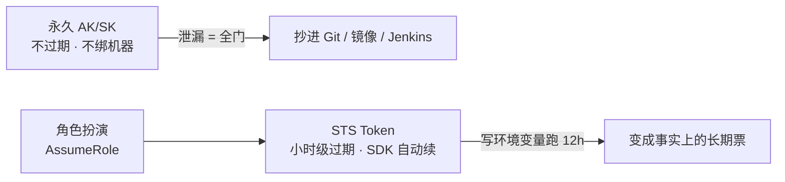
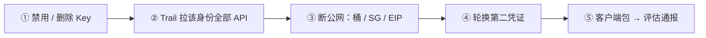
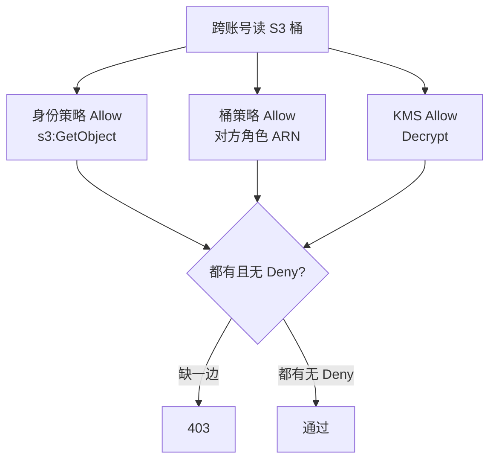
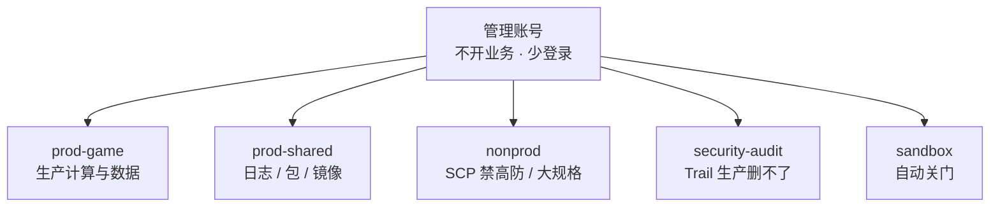
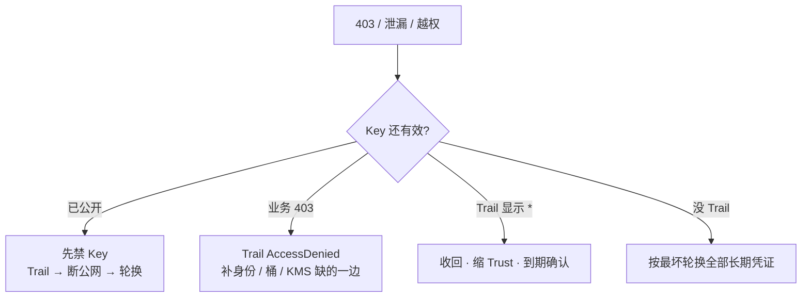

# 04｜IAM与多账号 · 练习题

开始做题前，先给大家一个小建议：合上知识点，对着**第一节的主图**，把「一把钥匙的旅程」从签发到出事口述一遍。能顺下来，下面这些题你会发现大半都会了；卡壳的地方，就是你该回去重读的那一节。

做题的方式也建议改一下：每道题**先看标题和场景，自己口述一遍答案，再往下看「完整解答」对答案**。直接看解答，容易产生「我会了」的错觉——能讲出来才是真的会。

| 标记 | 含义 |
|------|------|
| **核心** | 不懂整章就没建立起来 |
| **必会** | 值班和面试都要能讲 |
| **常用** | 线上会反复碰到 |
| **常考** | 白板和追问的高频口径 |

题目的顺序也是有意排的：Q1～Q4 先钉签发与最小权限；Q5～Q8 讲跨账号与落地；Q9～Q14 收尾到泄漏与定责。

## 本题目录
- [Q1 程序为什么不用永久 AK](#q1)
- [Q2 AK 泄漏前 15 分钟做什么](#q2)
- [Q3 最小权限怎么落到一条策略](#q3)
- [Q4 策略四要素和求值顺序](#q4)
- [Q5 跨账号 403 为什么](#q5)
- [Q6 为什么要拆多账号 + SCP 最小集](#q6)
- [Q7 SCP vs 权限边界 vs 日常策略](#q7)
- [Q8 节点 S3 Full 为什么不算 IRSA](#q8)
- [Q9 CI 该拿什么权限](#q9)
- [Q10 GM 发奖角色为什么不能共用](#q10)
- [Q11 告警项 + Trail + 破窗](#q11)
- [Q12 排障分流](#q12)
- [Q13 SCP 误配全员进不去](#q13)
- [Q14 IRSA Trust 没限制 sub](#q14)
- [合上书](#合上书)

---

## Q1

**★★★★★｜程序为什么不用永久 AK？该用什么？STS 写环境变量跑 12 小时算用了角色吗？**

**覆盖**：核心 · 必会 · 常考 ｜ **对应**：知识点 [二、签发：永久 AK 与临时 STS](知识点.md)

### 场景
团队给每个 ECS 实例绑了一把永久 AK 调支付 API，「定期轮换就行」。有人用 SDK 拿了 STS Token，写进环境变量跑了 12 小时，说「我已经用了角色」。

先自己试试：不看下面，先口述一遍你的答案，再往下对。

### 完整解答
> 🎯 **一句话**：永久 AK 能复制、不绑机器、泄漏即全门；程序走实例角色 / IRSA / OIDC，STS 由 SDK 凭证链自动续——写进环境变量固化就变成事实上的长期票。



**读图**：永久 AK 不过期、不绑任何机器，抄进 Git / 镜像 / Jenkins 就等于贴墙上。角色扮演拿到的 STS 有过期时间、绑身份、SDK 凭证链自动续。但把 STS 写进环境变量跑 12 小时，就把它固化成了事实上的长期票——形式上用了角色，实际等于永久 AK。

**人怎么进**：企业 IdP / SSO → MFA → AssumeRole（小时级 STS）→ 控制台 / API。离职关 IdP 即失去扮演资格，比在每个云账号删用户可靠。没有 SSO 时至少强制 MFA + 角色扮演，生产 AssumeRole 强制 `aws:MultiFactorAuthPresent` 条件。

```text
对：  ECS 实例角色 / IRSA / OIDC → SDK 自动续 STS → 过期自动失效
错：  每台 ECS 一把永久 AK → 「定期轮换」→ 泄漏即全门
错：  STS 写环境变量跑 12h → 变成长期票
```

> ⚠️ **别混**：控制台和 API 分两套——控制台登录走 MFA，API 调用走角色 STS。`ConsoleSignin` 无 MFA 要告警。根账号不开日常 API、不开永久 AK、必须开 MFA——根 AK 视为 P0。
> 📝 **面试**：「AK 能复制不绑机器；走实例角色 / IRSA / OIDC，STS 小时级过期 SDK 自动续；STS 写环境变量跑 12h = 长期票。人走 SSO + MFA 扮角色。」

### 再追问
- **根账号保护怎么做？** ——不开日常 AK、开 MFA、不跑业务；SCP 禁止根用户创建 AccessKey。根 AK 泄漏按 P0 轮换根 + 查第二把。
- **STS 泄漏要禁角色吗？** ——要。窗口内的调用算数，禁角色并查 Trail。

---

## Q2

这是 Q1 的对照——STS 临时票什么时候用。


**★★★★★｜生产 AK 泄漏了，前 15 分钟做什么？改密码等于禁 AK 吗？force-push 能当应急吗？**

**覆盖**：核心 · 必会 · 常考 ｜ **对应**：知识点 [六、出事：AK泄漏与审计](知识点.md)

### 场景
GitHub 仓库出现了生产 AK。群里有人先开会分析、有人 force-push 删 Git 记录、有人改了 IAM 用户登录密码。密钥还挂在那里。

先自己试试：不看下面，先口述一遍你的答案，再往下对。

### 完整解答
> 🎯 **一句话**：AK 泄漏先禁 Key、再查 Trail、再断公网——不要先开会，作废前每一秒都算数；改密码不等于禁 AK，force-push 不能当应急。



**读图**：五步按顺序走，不能跳。先禁 Key 再查 Trail——Key 还有效时开会分析，等于给攻击者留窗口。根账号密钥按 P0 处理：轮换根、开 MFA、查是否还有第二把根 AK。STS 泄漏仍要禁角色并查 Trail——窗口内的调用算数。

```bash
# 先禁 Key，再查这条身份干过什么（各云 CLI 名字不同，顺序一样）
# AWS:     aws iam update-access-key --status Inactive --access-key-id AKIA...
#          → aws cloudtrail lookup-events --lookup-attribute AttributeKey=AccessKeyId
# 阿里云:   DisableAccessKey → ActionTrail 按 accessKeyId 过滤
# ← 顺序永远是先禁再查，不要先开会
```

改登录密码**不等于**禁 AK——AK 独立于登录密码，必须单独作废。force-push 删 Git 记录**不能当应急**——历史还在，密钥已公开，改 `.gitignore` 不够，必须作废密钥。测试密钥同一套流程，不要用「那是测试的」开脱。

> ⚠️ **别混**：改密码 ≠ 禁 AK，AK 独立必须单独作废；force-push ≠ 应急，历史还在密钥已公开。两个都不算止血。
> 📝 **面试**：「泄漏先禁 Key 再查 Trail，不先开会；改密码不等于禁 AK；force-push 不能当应急；没有 Trail 按最坏轮换。」

### 再追问
- **没有 CloudTrail / ActionTrail 怎么办？** ——无法证明没被搬数据，只能按最坏假设轮换所有长期凭证、查 Bucket 访问日志。开审计是生产门禁。
- **密钥进了镜像怎么办？** ——重建镜像、作废旧凭证、检查是否推过公共仓库。

---

## Q3

签发清楚了，策略怎么写最小权限。


**★★★★★｜最小权限怎么落到一条策略？oncall 写 ecs:* + vpc:* 排障有什么问题？**

**覆盖**：核心 · 必会 · 常考 ｜ **对应**：知识点 [三、授权：最小权限与策略语法](知识点.md)

### 场景
oncall 为了放行探测源，策略写成 `ecs:*` + `vpc:*`，Resource 写 `*`。顺手能改生产安全组和释放实例。有人说「先放开再收」。

先自己试试：不看下面，先口述一遍你的答案，再往下对。

### 完整解答
> 🎯 **一句话**：最小权限是 Action 写需要的那几个 API、Resource 写具体 ARN、Condition 加 MFA / 源 VPC 限缩；禁止 `*:*`，排障不要给整段 VPC 写权限。

```text
错：  Action: ecs:* + vpc:*    Resource: *    ← 排障角色能改 SG、释放实例
对：  Action: AuthorizeSecurityGroupIngress   Resource: <backend-sg-arn>
      ← 只能加一条入站规则，改不了别的
```

落到 OSS / S3 同理：角色只能 `GetObject` 指定前缀，不能 `DeleteBucket`。排障不要给整段 VPC 写权限，backend SG 入站只允许 LB 安全组 ID。**临时 `*` 必须有到期**：① 有工单写明为什么开 `*`；② 有到期时间自动失效；③ 有收回确认人确认已收回。开服夜「先放开再收」而没有到期，三个月后这把权限还在——下次泄漏的半径就是生产全部门。

90 天未用的 AccessKey 和未用角色要告警关闭——不要「留着观察」，观察中的死 Key 仍有效。

> ⚠️ **别混**：权限变更本身就是生产变更。开服夜「先放开再收」没到期 = 下次泄漏的半径。90 天未用 Key 仍有效，要告警关闭。
> 📝 **面试**：「Action 写需要的那几个、Resource 写具体 ARN、Condition 加 MFA / 源 VPC；禁止 `*:*`；临时 `*` 必须有工单 + 到期 + 收回确认。」

### 再追问
- **权限边界是什么？** ——角色「最多能有」的上限，防有 `iam:CreateRole` 的人给自己开 `*`。实际能做 = 日常策略 ∩ 权限边界 ∩ SCP。
- **没有天花板会怎样？** ——最小权限会被第一张紧急工单冲掉。

---

## Q4

就是那个临时 *:* 三个月还在的坑。


**★★★★☆｜策略四要素是什么？显式 Deny 和默认拒绝有什么区别？求值顺序是什么？**

**覆盖**：必会 · 常考 ｜ **对应**：知识点 [三、授权：最小权限与策略语法](知识点.md)

### 场景
面试官递白板：默写一条策略 JSON，讲四要素，然后问「没有写 Allow 是不是就禁止了」。

先自己试试：不看下面，先口述一遍你的答案，再往下对。

### 完整解答
> 🎯 **一句话**：策略四要素 `Effect / Action / Resource / Condition`；求值三步「显式 Deny → Allow → 默认拒绝」；显式 Deny 谁都翻不了，默认拒绝一条 Allow 就能翻盘。

```json
{
  "Effect": "Deny",
  "Action": ["s3:GetObject"],
  "Resource": "arn:aws:s3:::game-assets-prod/hotfix/*",
  "Condition": {
    "Bool": { "aws:MultiFactorAuthPresent": "true" }
  }
}
```

- **Effect**：只有 `Allow` 和 `Deny` 两种，**显式 Deny 压过一切 Allow**（含 SCP 的 Deny）。
- **Action**：写需要的那几个 API，如 `s3:GetObject`，**禁止 `*:*`**。
- **Resource**：写具体 ARN（桶名 + 前缀），不写 `*`。
- **Condition**：条件键比「拆两个 Action」更有用——`aws:MultiFactorAuthPresent`、源 VPC、禁止没 MFA 的 `sts:AssumeRole`。

没有写 Allow **不等于禁止**——IAM 默认拒绝（default deny），但不是显式 Deny。两者区别：默认拒绝可以被一条 Allow 翻盘；显式 Deny 谁都翻不了。求值顺序：先看有没有显式 Deny → 再看有没有 Allow → 都没有 → 默认拒绝。

实际能做 = 日常策略 ∩ 权限边界 ∩ SCP，任一层 Deny 就 Deny。

> ⚠️ **别混**：没有写 Allow ≠ 禁止——默认拒绝可以被 Allow 翻盘；显式 Deny 谁都翻不了。两层都 Deny 就 Deny。
> 📝 **面试**（记忆分组法）：四要素 `Effect / Action / Resource / Condition`；求值三步「显式 Deny → Allow → 默认拒绝」；三层天花板「日常策略 < 权限边界 < SCP」。

### 再追问
- **权限边界和 SCP 什么关系？** ——边界是角色自身上限，SCP 是账号层天花板。三层叠：日常策略 ∩ 权限边界 ∩ SCP。
- **这套机制保证临时 `*` 会自动收回吗？** ——不保证。必须工单 + 到期 + 确认。模拟器过了也不保证实际通（跨账号缺资源策略时撒谎）。

---

## Q5

授权讲完，跨账号 AssumeRole。


**★★★★★｜跨账号读 S3 桶 403，模拟器过了但实际不通，为什么？**

**覆盖**：核心 · 必会 · 常考 ｜ **对应**：知识点 [四、跨账号：AssumeRole 与 SCP 天花板](知识点.md)

### 场景
A 账号的角色要读 B 账号的 S3 桶。IAM Policy Simulator 显示 Allow，实际调用 403。有人准备加 `AdministratorAccess` 验证「是不是权限问题」。

先自己试试：不看下面，先口述一遍你的答案，再往下对。

### 完整解答
> 🎯 **一句话**：跨账号要身份策略 + 资源策略（桶策略 + KMS）双允许，缺一边 403；模拟器常不带资源策略会撒谎；不加 Admin 验证，以 Trail 为准。



**读图**：跨账号要身份策略和资源策略**都** Allow，缺一边 403。KMS 加密桶还缺 `kms:Decrypt` 也会 403。**IAM 模拟器常不带资源策略，会误导**——模拟器过了、实际 403 是经典事故。

```bash
# 跨账号 403 时不要加 Admin 验证，看 Trail
# AWS:  aws cloudtrail lookup-events --lookup-attribute AttributeKey=AccessKeyId,AttributeValue=AKIA...
# 阿里:  ActionTrail 控制台按 accessKeyId 过滤
# ← 看 AccessDenied 的 Action 和 Resource，补缺的那一边
```

不要加 `AdministratorAccess` 验证「是不是权限问题」——那是扩大泄漏面。以 Trail 里 `AccessDenied` 的 Action 和 Resource 为唯一可信输入。

> ⚠️ **别混**：模拟器过了不等于实际通——模拟器常漏资源策略。加 Admin 验证 = 扩大泄漏面。以 Trail 为准。
> 📝 **面试**：「跨账号 403 要身份 + 资源策略双允许 + KMS；模拟器不是真相，以 Trail 为准；不加 Admin 验证。」

### 再追问
- **KMS 为什么也要 Decrypt？** ——KMS 加密桶的 Object 读操作需要 KMS Decrypt 权限，缺了也会 403。
- **AssumeRole 怎么跨账号？** ——A 账号角色信任策略允许 B 账号角色 ARN 扮演，B 扮演后拿到 A 的 STS。

---

## Q6

SCP 天花板怎么卡测试账号。


**★★★★★｜为什么要拆多账号？单账号 + 只读 + VPC 隔离不行吗？SCP 最小集 Deny 哪几条？**

**覆盖**：核心 · 必会 · 常考 ｜ **对应**：知识点 [四、跨账号：AssumeRole 与 SCP 天花板](知识点.md)

### 场景
团队认为「单账号 + 只读角色 + VPC 隔离」就够了，不需要多账号。一次测试 AK 泄漏后，攻击者改了生产 SG、列了生产桶。

先自己试试：不看下面，先口述一遍你的答案，再往下对。

### 完整解答
> 🎯 **一句话**：单账号一次 AK 打穿生产 + 测试；多账号拆爆炸半径——prod / nonprod / audit / shared / sandbox 各一个账号；SCP 只 Deny 不授权，最小集 5~7 条。



**读图**：管理账号不开业务，只管组织。审计账号的 Trail 是组织级的，生产角色只能写不能删。nonprod 的 SCP 禁高防和大规格包年。sandbox 自动关门。落地顺序：**先拆 nonprod → 再拆审计账号 → 最后动生产**。管理账号紧急角色双人离线保存。

**SCP 最小集（组织级 Deny）：**

| Deny 什么 | 为什么 |
|-----------|--------|
| 关闭 CloudTrail / ActionTrail | 没有审计 = 没有影响面 |
| 根用户创建 AccessKey | 根 Key 视为 P0 |
| 关掉 BucketPublicAccessBlock | 公共桶是数据面 + 账单炸弹 |
| 非生产购买高防、大规格包年 | 测试账号冲动购买 |
| 成员账号离开组织 / 删审计桶 | 自己拆天花板 |

SCP 在 sandbox 先挂 → 确认破窗角色不被误杀 → 再挂生产 OU。不要在开服夜改 SCP。

> ⚠️ **别混**：SCP ≠ 日常权限清单——SCP 只 Deny 不授权，日常仍靠角色最小权限。只读 + VPC 隔离不等于多账号——一次 AK 打穿生产和测试。
> 📝 **面试**：「单账号一次 AK 打穿；拆 prod / nonprod / audit / shared / sandbox；SCP 只 Deny 不授权，最小集关 Trail / 根 AK / 公共桶 / 非生产大规格；落地先 nonprod 再审计最后生产。」

### 再追问
- **账号目录是什么？** ——组织管理服务里账号的注册和发现机制，集中查看「组织里有哪些账号、谁在哪个 OU」。SCP 挂在 OU 上不挂在账号目录上。
- **没有破窗会怎样？** ——SCP 误杀全员被锁，比单账号更容易瘫痪。双人密封每年演练。

---

## Q7

实例上的钥匙：角色 vs 明文 AK。


**★★★★☆｜SCP、权限边界、日常策略三层什么关系？SCP 能代替最小权限吗？**

**覆盖**：必会 · 常考 ｜ **对应**：知识点 [四、跨账号：AssumeRole 与 SCP 天花板](知识点.md)

### 场景
有人写了 SCP 以为就不用做最小权限了：「SCP 都封顶了，角色策略给 `*` 也行」。

先自己试试：不看下面，先口述一遍你的答案，再往下对。

### 完整解答
> 🎯 **一句话**：三层天花板叠——日常策略（角色能做什么）< 权限边界（角色最多能做什么）< SCP（账号能做什么）；任一层 Deny 就 Deny；SCP 只 Deny 不授权，不能代替最小权限。

```text
日常策略：     角色能做什么（Allow / Deny）        ← 账号内
权限边界：     角色最多能做什么（上限）              ← 角色自身
SCP：          账号能做什么（组织天花板）            ← 组织级
实际能做 = 日常策略 ∩ 权限边界 ∩ SCP
```

SCP 只 Deny 不授权——它是「不能做什么」，不是「能做什么」。日常仍靠角色最小权限。SCP 给了 Deny 之后，角色策略就算写了 Allow `*:*`，SCP Deny 的部分仍然不通。但 SCP 没有 Deny 的部分，角色策略给 `*` 就等于全开——SCP 不代替最小权限。

误杀后靠从管理账号卸策略来破窗，不能靠「全员 Admin」。SCP 在 sandbox 先挂，确认破窗角色不被误杀，再挂生产 OU。

> ⚠️ **别混**：SCP ≠ 权限边界 ≠ 日常策略。三层各管各的，都 Deny 就 Deny。SCP 只 Deny 不授权——日常仍靠角色最小权限。
> 📝 **面试**：「三层天花板：日常策略 < 权限边界 < SCP；任一层 Deny 就 Deny；SCP 只 Deny 不授权，不代替最小权限。」

### 再追问
- **权限边界防什么？** ——防有 `iam:CreateRole` 的人给自己开 `*`。角色自身上限。
- **开服夜改 SCP 行吗？** ——不行。不要在开服夜改 SCP，误杀后没破窗会全员被锁。

---

## Q8

IRSA / RRSA 怎么把 Pod 绑到角色。


**★★★★★｜EKS 节点给了 S3 Full Access，算做了 IRSA 吗？任意 Pod 能调 S3 怎么办？**

**覆盖**：核心 · 必会 · 常考 ｜ **对应**：知识点 [五、落地：实例角色与 IRSA](知识点.md)

### 场景
团队说「节点能拉 S3 桶就算做了 IRSA」。安全扫描发现任意 Pod 都能调 S3。节点 InstanceProfile 有 `s3:*`。

先自己试试：不看下面，先口述一遍你的答案，再往下对。

### 完整解答
> 🎯 **一句话**：节点 S3 Full Access = 没做 IRSA——任意 Pod 用节点角色调 S3，逃逸即搬空桶；IRSA 把权限缩到具体 ServiceAccount，Trust 必须限制 `sub` 到 `system:serviceaccount:<ns>:<sa>`。

```text
没做 IRSA：    节点角色 s3:*  →  任意 Pod 可调 S3  →  Pod 逃逸 = 搬空桶
做了 IRSA：    SA 注 role-arn  →  Trust sub = ns:sa  →  只有这个 SA 能扮演
Trust 没限 sub：  集群内任意 SA 可扮演  →  等于没做
```

IRSA 把权限从节点缩到具体 **ServiceAccount**。Trust 限制 `sub` 到 `system:serviceaccount:<ns>:<sa>`——不限 `sub` 等于集群内任意 SA 可扮演，等于没做。**IMDSv2** 防 SSRF 偷节点凭证——节点角色更必须瘦。ACK **RRSA** 同一模型（阿里云 IRSA 等价物）。

**节点角色 vs 应用角色必须拆开**：节点角色只要拉镜像、写日志，不能 `DeleteBucket` / 改 SG / 发奖。应用角色绑 SA，逻辑服最多读热更前缀、写自己的日志。两条角色混用，一次 Pod 逃逸就能发奖。EBS CSI 和 LB Controller 不要共用一个角色——少一个权限就 controller 403、Service Pending，共用只会把权限再放宽。

> ⚠️ **别混**：节点 S3 Full Access ≠ 做了 IRSA——任意 Pod 用节点角色。Trust 不限 sub ≠ IRSA——集群内任意 SA 可扮演。
> 📝 **面试**：「节点 S3 Full = 没做 IRSA；IRSA Trust 必须限 sub 到 `ns:sa`；节点角色要瘦，EBS CSI 和 LB Controller 独立角色。」

### 再追问
- **节点角色要什么权限？** ——拉镜像、写日志；不能 `DeleteBucket` / 改 SG / 发奖。
- **ACK 的 IRSA 叫什么？** ——RRSA，同一模型，Trust 限制同理。

---

## Q9

就是开头那个泄漏现场。


**★★★★☆｜CI 流水线该拿什么权限？Jenkins 永久 AK + Admin 行不行？**

**覆盖**：必会 · 常用 ｜ **对应**：知识点 [五、落地：实例角色与 IRSA](知识点.md)

### 场景
Jenkins 用永久 AK + `AdministratorAccess` 发版，「省事」。有人问要不要改。

先自己试试：不看下面，先口述一遍你的答案，再往下对。

### 完整解答
> 🎯 **一句话**：CI 用 OIDC 联邦换短时 STS，仅推某个 ECR 或执行有限 API；不要永久 AK + Admin——流水线被打穿等于生产被打穿。

```text
对：  CI OIDC → STS（短时）→ 推镜像 / RunCommand
错：  Jenkins 永久 AK + AdministratorAccess → 「发版省事」= P0 风险
```

发版角色和生产 oncall 角色分开；生产 Terraform apply 要人工审 plan。开服脚本同样用角色，打包目录扫 AK。流水线被打穿等于生产被打穿——CI 拿着 Admin AK 进了 Git，攻击者只要打穿 CI 就拿到生产全权限。

> ⚠️ **别混**：CI OIDC 短时角色 ≠ 永久 AK + Admin。发版角色和 oncall 角色分开，Terraform apply 要人工审 plan。
> 📝 **面试**：「CI 用 OIDC 短时角色，只推镜像或执行有限 API；不要永久 AK + Admin；发版和 oncall 角色分开。」

### 再追问
- **ECS 用什么不绑 AK？** ——实例角色（ECS 实例 RAM 角色 / Instance Profile），STS 由 metadata 服务自动续。
- **开服脚本里扫到 AK 怎么办？** ——打包目录扫 AK，发现立即替换为角色，不要「先上线再改」。

---

## Q10

审计日志怎么查谁用过这把钥。


**★★★★☆｜GM 后台、发奖接口的云角色能不能和逻辑服共用？为什么？**

**覆盖**：必会 · 常考 ｜ **对应**：知识点 [三、授权：最小权限与策略语法](知识点.md)

### 场景
图省事把 GM 后台、发奖脚本和逻辑服绑了同一个云角色。一次 Pod 逃逸后攻击者直接发了奖。

先自己试试：不看下面，先口述一遍你的答案，再往下对。

### 完整解答
> 🎯 **一句话**：GM 发奖角色不能和逻辑服共用——一次 Pod 逃逸就能发奖；发奖用独立角色 + 审计，和「节点角色万能」是同一类问题。

```text
共用：  逻辑服角色 = 发奖角色  →  Pod 逃逸 = 能发奖  →  无法收口
拆开：  逻辑服角色（读热更 + 写日志）≠ 发奖角色（独立 + 审计）
```

两条角色混用，一次 Pod 逃逸就能发奖——这和「节点角色万能」是同一类：图省事把几条职责绑在一个身份上，出事无法收口。发奖脚本用独立角色，操作写 ActionTrail / CloudTrail。逻辑服角色最多读热更前缀、写自己的日志。

临时放大的权限同样道理：开服夜给排障角色临时开了 `*:*`，工单没写到期，三个月后这把权限还在——下次泄漏的半径就是生产全部门。

> ⚠️ **别混**：GM 发奖和逻辑服共用角色 = 图省事出事无法收口。独立角色 + 审计是底线。临时 `*` 必须有到期收回。
> 📝 **面试**：「GM 发奖角色和逻辑服拆开，独立角色 + 审计；临时 `*` 必须有工单 + 到期 + 收回确认。」

### 再追问
- **节点角色和应用角色也是这个道理？** ——对。节点角色只要拉镜像写日志，不能 `DeleteBucket` / 改 SG / 发奖。应用角色绑 SA。
- **临时 `*` 最低限度？** ——① 有工单；② 有到期时间；③ 有收回确认。

---

## Q11

轮换与禁用的顺序。


**★★★★☆｜告警项有哪些？Trail 为什么要进独立审计账号？破窗演练怎么做？**

**覆盖**：必会 · 常用 ｜ **对应**：知识点 [六、出事：AK泄漏与审计](知识点.md)

### 场景
安全审计发现 Trail 在生产账号里、生产管理员能删。没有破窗流程。有人问「根账号很少登录，需要破窗吗」。

先自己试试：不看下面，先口述一遍你的答案，再往下对。

### 完整解答
> 🎯 **一句话**：Trail 进独立审计账号生产只能写不能删；告警覆盖根登录 / 关 Trail / 新建 AK / 策略变 `*` / 桶公共 / SG `0.0.0.0/0:22,3389` / 90 天未用 AK；破窗双人密封每年演练。

```text
根登录              ← 根不该日常登录
关 Trail            ← 没有审计 = 没有影响面
新建 AK             ← 新增永久钥匙
策略变 *            ← 最小权限被冲掉
Bucket 公共         ← 数据面 + 账单炸弹
SG 0.0.0.0/0:22/3389  ← 管理端口裸奔
90 天未用 AK         ← 死 Key 仍有效
```

**访问审计 / 操作日志**（CloudTrail / ActionTrail）必须覆盖所有区域（Multi-Region）。Trail 进独立审计账号，生产角色只能写不能删——Trail 在生产账号里，生产管理员能删等于没有审计。

**破窗演练**：管理账号 / 根很少登录，但必须有破窗流程——SCP 误杀、所有人被锁门外时，谁能用离线保管的紧急角色进来。双人、密封、每年演练一次（只登录不改资源）。演练当天确认密封包能打开、MFA 还能用、紧急角色没被 SCP 误杀。没有破窗的多账号，比单账号更容易在事故里瘫痪。

> ⚠️ **别混**：Trail 在生产账号 = 生产管理员能删 = 没有审计。破窗不是可选——SCP 误杀后没破窗比单账号更容易瘫痪。
> 📝 **面试**：「Trail 进独立审计账号；告警项根登录 / 关 Trail / 新建 AK / 策略变 * / 桶公共 / SG 0.0.0.0/0:22,3389 / 90 天未用 AK；破窗双人密封每年演练。」

### 再追问
- **不能把 AWS JSON 粘到阿里云 RAM 吗？** ——不能。字段名、条件键、STS 会话时长默认值不同。共通的是 Deny 优先、人走扮演、审计进独立桶。
- **90 天未用 AK 为什么要关？** ——死 Key 仍有效，不要「留着观察」。告警关闭。

---

## Q12

把前面串成决策树。


**★★★★☆｜权限问题你按什么顺序查？从加 Admin 验证开始行不行？**

**覆盖**：必会 · 常用 ｜ **对应**：知识点 [七、作战：定责](知识点.md)

### 场景
GitHub 出现生产 AK。跨账号 403。任意 Pod 能调 S3。SCP 后全员进不去。临时 `*` 三个月后还在。群里没人画路径。

先自己试试：不看下面，先口述一遍你的答案，再往下对。

### 完整解答
> 🎯 **一句话**：权限问题用 Trail 分流——先分叉「是泄漏还是 403 还是过宽」，不要加 Admin 验证；泄漏先禁 Key 再查 Trail，403 看 Trail 补资源策略，过宽收回缩 Trust，没 Trail 按最坏轮换。



**读图**：第一刀先分「Key 还有效吗」——已公开就走泄漏应急（先禁再查），业务 403 就看 Trail 补缺边，过宽就收回。没 Trail 是最坏情况，只能全量轮换。

| 现象 | 先做 | 别做 |
|------|------|------|
| GitHub 出现生产 AK | 禁 Key → Trail → 断公网 | 先开会 / 只 force-push / 只改密码 |
| 模拟器过、实际 403 | Trail + 桶策略 / KMS | 加 AdministratorAccess 验证 |
| 任意 Pod 能调 S3 | 收节点策略、IRSA + Trust sub | 认为「节点能拉桶就算做了 IRSA」 |
| SCP 后全员进不去 | 破窗从管理账号卸策略 | 没有紧急角色时一次切七个账号 |
| 临时 `*` 三个月后还在 | 到期收回 | 开服夜先放开再收且不写到期 |
| 没有 Trail | 按最坏轮换全部长期凭证 | 声称「可能没用过」 |

```text
0–10s   这把 Key 是不是根 AK？  根 → P0 轮换根 + 开 MFA + 查第二把
10–30s  禁用 / 删除这把 AccessKey（控制台或 CLI 都行，不等审批流）
30–45s  Trail 按 accessKeyId 过滤：改了什么 SG、列了什么桶、建了什么用户
45–60s  断异常公网（桶 Block Public Access、SG 收回、EIP 释放）
# ← 60 秒内不开会、不 force-push、不改登录密码当修复
```

> ⚠️ **别混**：不加 AdministratorAccess 验证——那是扩大泄漏面。以 Trail 里 `AccessDenied` 的 Action 和 Resource 为唯一可信输入。
> 📝 **面试**：「泄漏先禁 Key 再查 Trail，不先开会；403 看 Trail 补资源策略，不加 Admin；过宽收回缩 Trust；没 Trail 按最坏轮换。」

### 再追问
- **Flow log 什么时候开？** ——只在「规则看起来对但仍丢包」时对 ENI 定向五元组开，不全 VPC 海选。权限问题看 Trail，不看 Flow log。
- **为什么 60 秒内不重启进程？** ——权限问题重启进程没用，先禁 Key 查 Trail 止血。

---

## Q13

综合：排障临时权怎么发。


**★★★★☆｜SCP 误 Deny `ec2:*`，生产账号全员 403，怎么破窗？**

**覆盖**：必会 · 常考 ｜ **对应**：知识点 [四、跨账号：AssumeRole 与 SCP 天花板](知识点.md)

### 场景

变更把 Deny 绑到 prod OU，On-call 无法 AssumeRole 进生产排障。

先自己试试：不看下面，先口述一遍你的答案，再往下对。

### 完整解答

> 🎯 **一句话**：**管理账号破窗角色** 在 OU 外或 SCP 豁免——预先演练 `BreakGlassAdmin`，**不要**临时给全员 Admin。

```text
① 管理账号登录（不受子 OU SCP 或有限豁免）
② 修改/卸错误 SCP（记录变更单）
③ 用 BreakGlass 角色进 prod，非常规审计
④ 事后 Trail 复盘 + 收紧 SCP 变更流程
```

> ⚠️ **别混**：SCP 是天花板，子账号 Policy 再宽也无效。**不要**没有破窗角色时乱改七个账号根 AK。

### 再追问

**权限边界和 SCP 同时 Deny？**——任一 Deny 生效；修 SCP 优先。

---

## Q14

收尾到多账号边界。


**★★★★★｜任意 Pod 能读全桶 S3，IRSA 算做了吗？**

**覆盖**：核心 · 必会 · 常考 ｜ **对应**：知识点 [五、落地：实例角色与 IRSA](知识点.md)

### 场景

EKS 节点 IAM Role 有 `s3:*`。应用 Pod 没注解也能 `aws s3 ls`。

先自己试试：不看下面，先口述一遍你的答案，再往下对。

### 完整解答

> 🎯 **一句话**：**节点角色 ≠ IRSA**——要 **OIDC Provider + SA 注解 + Trust `sub` 限定**，节点角色只留 `ECR/CSI` 最小权限。

```yaml
# ServiceAccount
annotations:
  eks.amazonaws.com/role-arn: arn:aws:iam::123:role/app-s3-reader
```

```json
"Condition": {
  "StringEquals": {
    "oidc.eks.../sub": "system:serviceaccount:game:mail-sender"
  }
}
```

```text
① 收节点 s3:* 
② 每应用独立 SA + 桶前缀策略
③ 审计：Trail principal 应是 assumed-role/app，不是 i-xxx 节点
```

> 📝 **面试**：「节点能拉桶不算 IRSA」是高频坑。

### 再追问

**Trust 没写 sub 会怎样？**——同 namespace 任意 SA 可冒充角色。

---

## 合上书

和知识点末尾那份清单逐条对齐——那边勾完、这边再口述一遍，两边都能讲顺，这章才算过关：

- [ ] 能**默画**一把钥匙的旅程（签发→授权→跨账号→落地→出事），标出永久 AK 和 STS 各在哪段、排障从哪进。
- [ ] 能说出 AK vs 角色 vs STS 三种凭证各什么特性；STS 写环境变量跑 12h 为什么等于长期票；人走 SSO + MFA 扮角色 vs 程序走实例角色 / IRSA / OIDC。
- [ ] 能**默画**策略语法：`Effect / Action / Resource / Condition` 四要素；求值三步（Deny → Allow → 默认拒绝）；最小权限落到一条 OSS 策略长什么样。
- [ ] 能说出权限边界是什么、和 SCP 什么关系、三层天花板怎么叠；临时 `*` 最低限度；GM 发奖和逻辑服为什么拆开。
- [ ] 能**默画**账号树：管理账号 → prod / shared / nonprod / audit / sandbox 五格；SCP 最小集 Deny 哪几条；落地顺序为什么先 nonprod 再审计最后生产。
- [ ] 能说出 AssumeRole 怎么跨账号；跨账号 403 缺哪一边；KMS 为什么也要 Decrypt；模拟器为什么撒谎；不加什么验证。
- [ ] 能说出节点角色 vs 应用角色为什么拆开；IRSA Trust sub 不限等于什么；节点 S3 Full 为什么不算做了 IRSA；CI 该拿什么权限。
- [ ] 能**默画**泄漏应急：禁 Key → Trail → 断公网 → 轮换 → 通报五步；为什么先开会不及格；改密码为什么不等于禁 AK；force-push 为什么不能当应急。
- [ ] 能说出没有 Trail 怎么办；告警项有哪些；破窗演练怎么做；为什么不能把 AWS JSON 粘到 RAM。
- [ ] 能**默画**作战决策树三叉（泄漏 / 403 / 过宽）各走哪条；60 秒剧本 0–60s 各敲什么、什么绝不碰。
