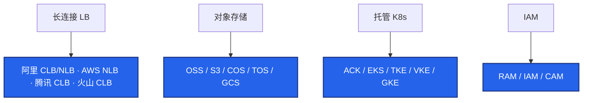
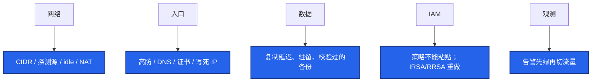
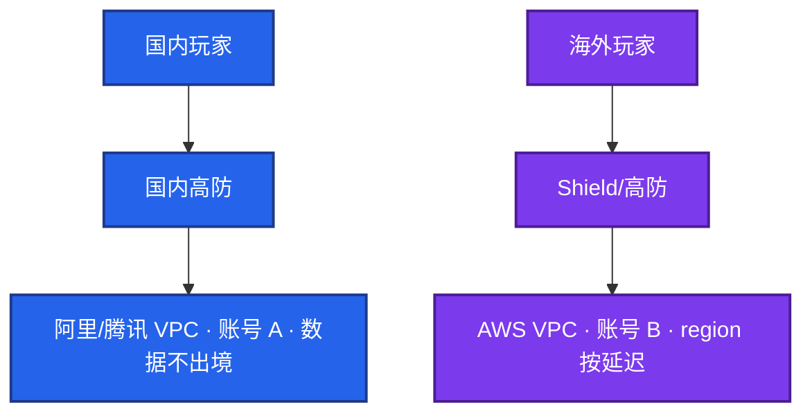

# 04｜多云对照 · 练习题

先对照 [知识点](知识点.md) **本章主线** 自己口述，再对答案。每题标了覆盖范围：

| 标记 | 含义 |
|------|------|
| **核心** | 不懂整章就没建立起来 |
| **必会** | 值班和面试都要能讲 |
| **常用** | 线上会反复碰到 |
| **常考** | 白板和追问的高频口径 |

## 本题目录

- [Q1 能力翻译表](#q1)
- [Q2 迁移难在哪](#q2)
- [Q3 为什么不做流量双活](#q3)
- [Q4 火山要学到多深](#q4)
- [Q5 腾讯 vs 阿里](#q5)
- [Q6 跨云同款坑](#q6)
- [Q7 分市场与账号隔离](#q7)
- [Q8 Terraform / K8s 仍锁定](#q8)
- [Q9 ACK vs EKS 控制面](#q9)
- [Q10 切云三件事与灰度](#q10)
- [合上书](#合上书)

---

## Q1

**★★★★★｜用一张表把「长连接 LB、对象存储、托管 K8s、IAM」翻译一下。**

**覆盖**：核心 · 必会 · 常考

**对应**：知识点 §3.1

### 场景

白板：「阿里的东西到 AWS / 腾讯 / 火山叫什么？」有人开始背五朵云全家桶。要的是能力对齐，以及名字像不等于行为像。

### 完整解答

**一句话**：按能力对齐 LB / 对象存储 / 托管 K8s / IAM，名字像不等于默认值像。

按能力对齐，名称 1:1 会选错（都叫 NLB 但健康检查源、跨 AZ 计费不同）。



切换云时单独验收健康检查 CIDR 和 idle timeout。突发性能实例各家都有便宜规格，游戏一律禁。腾讯和阿里模型接近，差异在 CAM、高防 / 游戏盾、商务。火山生产细节在 08，对照层不要抄 `100.64.0.0/10`。国内云是地域 VPC；GCP 是全球 VPC + 区域子网。

### 再追问

GCP 全球 VPC 是不是更适合游戏多 region？——内网打通更省事，区服仍按延迟和数据驻留切。国内游戏岗极少 GCP 主场，点到差异即可。GKE Autopilot 对有状态战斗服不友好。

---

## Q2

**★★★★★｜从阿里云迁到 AWS，最难的是改 ECS 机型吗？**

**覆盖**：核心 · 必会 · 常考

**对应**：知识点 §4.1

### 场景

项目说「我们用了 K8s，搬云就是改机型」。切换窗口长连接集中断线，健康检查全红，热更失败。有人按 10% 玩家随机切流量。

### 完整解答

**一句话**：迁云难在网络 / 入口 / 数据 / IAM / 观测，不是改 ECS 机型。

不是。难的是 CIDR 重叠、健康检查源和 LB 超时默认值、高防 / DNS / 客户端写死 IP、数据 RPO 与驻留、RAM → IAM 重写、告警体系。机器改名是最简单的一步。



有状态 + 长连接，切换窗口会集中断线。止血：DNS 切回，数据以源云为主，禁止双向写。治理：网络连通 → 数据校验 → 无流量演练 → 小服 → 大服，每步可回滚。灰度按区服，不按随机百分比玩家——会话和区服绑定，随机切会把同一服玩家撕开。

### 再追问

切云当天最常见的三件事？——① 健康检查全红：抄了 100.64，按目标云文档放探测源。② 长连接集体掉：新云 idle 更短，对齐心跳。③ 热更失败：CDN 没预热，回滚 DNS 再切。都不是 ECS 没迁完。

---

## Q3

**★★★★★｜为什么游戏很少做多云流量双活？**

**覆盖**：核心 · 必会 · 常考

**对应**：知识点 §6.1

### 场景

「为了防锁定，两朵云同时接玩家。」匹配、区服状态、长连接都要跨云漂。Terraform 已经写了。

### 完整解答

**一句话**：游戏不做多云流量双活，合理策略是分市场或冷灾备。

有状态、长连接、匹配和区服数据跨云 RTT 和一致性扛不住，还要两套 IAM / 网络 / 告警。合理策略是分市场（国内一朵、海外一朵）或冷灾备，不是同一会话漂。

```mermaid
flowchart TB
    subgraph ok ["对"]
        a[国内阿里/腾讯 | 海外 AWS · 账号数据隔离]
        b[冷灾备，RTO 小时/天，真 restore 过]
        c[高防可以和计算不同家]
    end
    subgraph bad ["错"]
        d[同一战斗会话跨云漂]
        e[用了 K8s 所以可搬]
    end
    classDef okc fill:#16A34A,stroke:#14532D,stroke-width:2px,color:#fff
    classDef badc fill:#DC2626,stroke:#7F1D1D,stroke-width:2px,color:#fff
    class a,b,c okc
    class d,e badc
    style ok fill:#ECFDF5,stroke:#16A34A,stroke-width:4px
    style bad fill:#FEF2F2,stroke:#DC2626,stroke-width:4px
```

K8s 消灭不了 LoadBalancer 注解和云盘 CSI 绑定。成本是两套最小集群 + 跨云流量。真正可搬的是镜像、指标语义、CIDR 文档。锁定最怕托管库备份格式 + 客户端写死的入口 IP，不是 ECS 主机名。

### 再追问

冷灾备只复制快照够不够？——不够。至少真 restore 到目标云隔离环境，测 RTO。从未拉起，故障当天会发现 IAM、网络、DNS 都没备好。GSLB 切流前两边健康检查都要绿。

---

## Q4

**★★★★☆｜火山云要学到多深？和阿里最大的操作差异？**

**覆盖**：必会 · 常用 · 常考

**对应**：知识点 §3.1 · §8

### 场景

目标公司是字节系（含沐瞳）。有人把火山当成「再背一张产品表」。另一人没用过火山，准备编 veDB 全家桶。

### 完整解答

**一句话**：火山与阿里同构可迁移，但探测源 / 内网域名 / IAM 必须单独验收。

对照层：VPC / 安全组 / CLB / TOS / VKE 与阿里同构，排障思路可迁移，但健康检查源不要抄 `100.64.0.0/10`。目标是字节或简历写了火山，再看 08 的真实组合和沐瞳现场会碰到的东西。没落地不要编产品全家桶。

可迁移：NAT SNAT、SG 探测源、对象存储公共读、突发规格禁。必须单独验收：健康检查源 CIDR、内网 TOS/镜像域名、IAM 与字节办公身份、配额工单流。

深度放在你真用过的阿里或 AWS；火山坦诚对照。说法：「健康检查源我会先查文档和流日志，不搬阿里的网段。」

### 再追问

腾讯云要不要单开一章来学？——不要。模型接近，对照这张表即可。简历写了哪家就深讲哪家。不要编「腾讯更懂游戏」。

---

## Q5

**★★★★☆｜腾讯云和阿里云对游戏运维差在哪？**

**覆盖**：必会 · 常用

**对应**：知识点 §3.1

### 场景

国内二选一。商务在推腾讯。有人说「腾讯有游戏盾所以更适合」。

### 完整解答

**一句话**：腾讯与阿里模型接近，差异在 CAM、高防形态和商务，没深度用过不要硬讲。

模型接近：CVM 禁突发、CLB 长连接、COS + CDN、TKE 吃 VPC IP。差异在 CAM、高防 / 游戏盾形态、地域和商务。没深度用过不要硬讲「腾讯更适合游戏」。

游戏盾 / 高防的 CNAME 和回源网段必须当新系统验收，不能「和阿里一样勾一下」。CAM 和 RAM 都是身份 + 策略，条件键和角色扮演流程不同，策略不能粘贴。选哪家：团队熟练度、高防和商务、已有专线。技术模型不是决定项。

### 再追问

COS 公共读和 OSS 公共读是不是同一类事故？——是。OSS / COS / S3 / TOS 公共读都会变成下载费炸弹。跨云同坑还有突发规格、源站裸 EIP。

---

## Q6

**★★★★☆｜跨云对照时最容易踩的三个同款坑？网络对照表先盯哪几行？**

**覆盖**：必会 · 常用 · 常考

**对应**：知识点 §3.2

### 场景

产品名都对上了。开服当天 Unhealthy、账单炸、源站被打。清单上写着「NLB ✓、S3 ✓、EKS ✓」。

### 完整解答

**一句话**：跨云同款坑：探测源照抄、公共读、源站 EIP 裸奔、LB idle 默认值不同。

① 健康检查源每家不同，照抄必 Unhealthy。② 对象存储公共读 → 流量炸弹。③ 源站 EIP 裸奔 → DDoS 绕过高防。另外 LB idle 默认值不同会集中断线。

网络对照先盯：探测源 CIDR、LB idle / UDP、NAT 是否按 AZ、跨 AZ 是否计费、内网 endpoint 名称、SG 改已有连接（conntrack）。验收清单（名字对上了也不算过）：探测源不抄 100.64；idle 和心跳对齐；公共读 + 内网回源；IAM 重做；告警先绿；突发规格黑名单、无 EIP 裸奔；CIDR 无重叠。

中国区 AWS 不能当阿里云用：账号、备案、产品完整度、高防都不同。出海写 Global。

### 再追问

混用国内 OSS 给海外客户端回源行不行？——延迟和流量费都难看，还可能踩内容审核。版本包构建可以一份，发布通道必须两套：CDN 域名、热更检查地址、高防证书、GM 白名单。

---

## Q7

**★★★★★｜分市场落地怎么画？游戏出海账号与网络怎么隔离？**

**覆盖**：核心 · 必会 · 常考

**对应**：知识点 §3.4 · §4.2

### 场景

架构图上画了一个全球入口，国内海外玩家进同一个 Redis。合规同学问身份证数据去哪了。海外 CI 拿着国内生产角色。两边 VPC 都是 `10.0.0.0/16`。

### 完整解答

**一句话**：分市场画两张 VPC：账号 / CIDR / CI / 密钥 / 驻留五层隔离。

按两张图讲，不要画成一张「全球 Anycast」。



五层隔离：账号 A/B（中国区 AWS 另算一套 IAM）；CIDR 不重叠、独立 VPC；海外 CI 禁止国内生产角色；密钥 / 高防回源 / 告警分叉；国内身份证 / 支付不要复制到 Global「做灾备方便」。账号服若全球一份：单独评估驻留，不要默认跟逻辑服走。模板可以同源，运行时必须分叉。

### 再追问

入口高防必须和计算同一家吗？——不必。DNS + 高防供应商可以不和计算同一家，降低单一清洗商绑定。这是合理的「防锁定」，比双云双活现实。

---

## Q8

**★★★★☆｜为什么「用了 Terraform / K8s」仍然锁在一家云？**

**覆盖**：必会 · 常用

**对应**：知识点 §6.1

### 场景

「我们基础设施即代码，随时可搬。」问到 RDS 备份能不能在另一朵云直接 restore、SLS 查询怎么迁、Ingress 注解换成 AWS 会不会重建 LB。

### 完整解答

**一句话**：Terraform / K8s 仍锁云：LB 注解、CSI、托管库备份格式、客户端写死 IP。

Terraform 让「在同一朵云重建」可重复，per-cloud provider 仍然绑产品 API。K8s 的 Service LoadBalancer 注解、CNI、CSI 都是云绑定。绑得死的还有：托管库备份格式、日志查询语言、IAM 条件键、HPA 用的云指标名。

真正可搬的是：CIDR 规划文档、镜像构建、应用配置、Prometheus 指标语义、游戏进程本身。迁移 runbook 按网络 → 数据 → 演练 → 小服 → 大服，不要按「apply 换 provider」。

### 再追问

锁定最怕哪两样？——托管库备份格式（restore 不到另一家）+ 游戏客户端写死的入口 IP（切不了高防 / LB）。不是 ECS 主机名。

---

## Q9

**★★★★★｜ACK 和 EKS 控制面分别谁负责什么？**

**覆盖**：核心 · 必会 · 常考

**对应**：知识点 §3.3

### 场景

「两边都是托管 K8s，对照可以跳过。」开服日有人升 ACK 控制面；EKS 节点角色给了 `s3:*`；探测源从阿里抄到了 AWS。

### 完整解答

**一句话**：ACK / EKS 都是厂商管 Master，你管节点池 / CNI / 身份 / RPO / 探测源。

厂商管 Master / etcd，ssh 不进。你管节点池/组、CNI、插件/控制器、升级窗口、RPO、停变更。两边一样：战斗不用 ECI / Fargate / Spot；`/24` 会 IP 耗尽；节点角色要瘦；LB 用域名。

不一样、不能粘贴的：ACK 探测 `100.64.0.0/10`，EKS 是 NLB 节点；RRSA vs IRSA Trust `sub`；RAM JSON 不能粘成 IAM。控制面升级避开开服日；PDB 挡着不要 `--force`。

TKE / VKE / GKE 插件都吃 VPC IP。GKE Autopilot 对有状态战斗不友好。

### 再追问

托管了这章能跳过吗？——不能。影响面、RPO、自己的 Event/Webhook、探测源和身份仍是你的。

---

## Q10

**★★★★☆｜切云当天三件事是什么？灰度为什么按区服切？**

**覆盖**：必会 · 常用 · 常考

**对应**：知识点 §6.2

### 场景

机器已经迁完，DNS 准备切。Web 团队习惯按百分比切流量。游戏这边匹配和好友在同一区服。证书和 GM 白名单还没在新入口生效。

### 完整解答

**一句话**：切云三件事：探测源全红、idle 断连、热更没预热；灰度按区服不按百分比玩家。

三件事：① 健康检查全红——抄了 100.64，按目标云文档放探测源，不要先改业务端口。② 长连接集体掉——新云 idle 更短（心跳 5 分钟、idle 60 秒），抓包谁先 FIN，对齐心跳。③ 热更失败——CDN 没预热，回滚 DNS 再切。都不是 ECS 没迁完。

灰度按区服：先小服真实玩家，对账 CCU / 登录 / 充值，再大服。随机切会把同一服玩家撕开。回滚只动该区服的 DNS / 入口，数据仍以源云为主，禁止双向写。证书和 GM 白名单必须在新入口先生效，否则 443 失败或发奖被拒，看起来像「云挂了」。

### 再追问

小服已经进玩家，发现只读延迟导致「刚买的道具没有」，回滚什么？——先把写路径打回主库 / 源云，不要双向写。再查是复制延迟还是切到了只读（05）。DNS 可以一起切回。

---

## 合上书

- [ ] 能按能力翻译 LB / 对象存储 / 托管 K8s / IAM，并说出名字像不等于默认值像
- [ ] 能列出网络对照表里探测源、idle、跨 AZ 计费、endpoint 必须单独测
- [ ] 能对比 ACK vs EKS 控制面责任：厂商管进程，你管节点 / CNI / 身份 / RPO
- [ ] 能画出分市场两张 VPC，并说出账号、CIDR、CI、驻留五层隔离
- [ ] 能说明迁移难在入口默认值不是机型；游戏不做流量双活
- [ ] 能处理切云三件事，回滚只动 DNS；灰度按区服不按百分比玩家
- [ ] 能坦诚对照火山（不抄 100.64）和腾讯（模型接近，不编「更懂游戏」）
