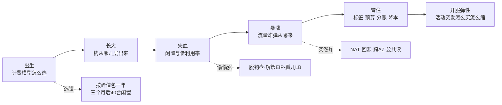
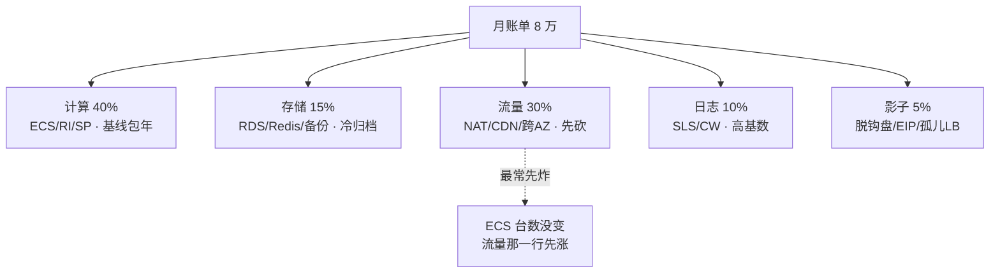
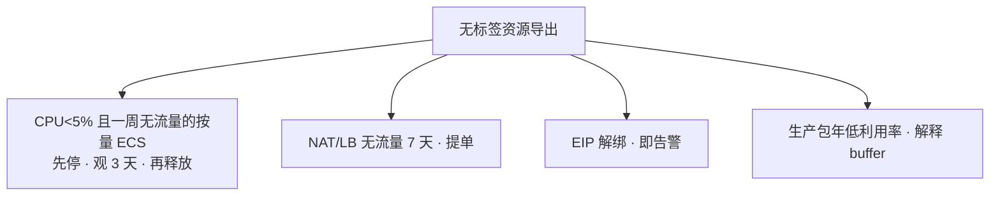
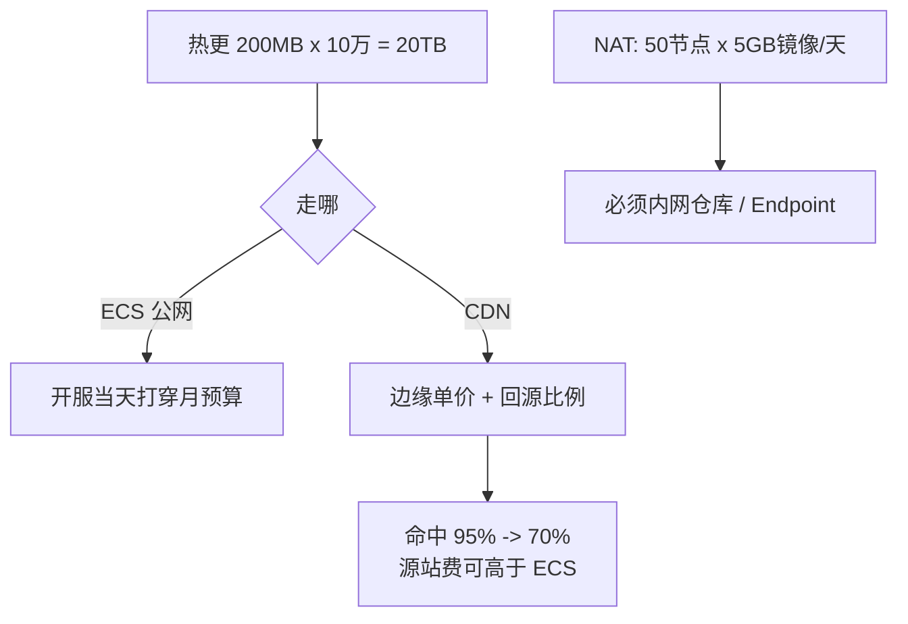
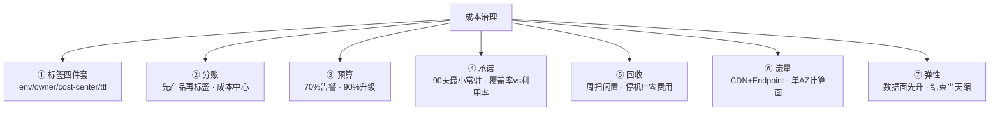
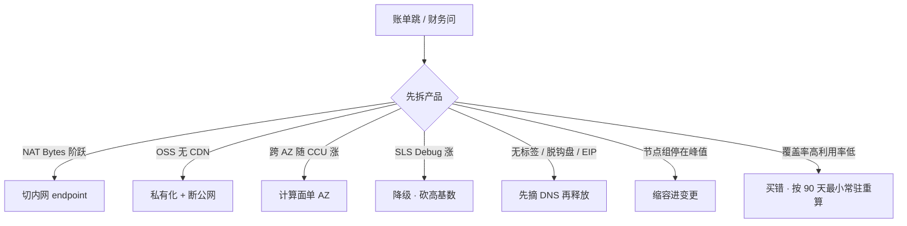

# 成本治理

> 月底打开账单，ECS 台数没变，流量那一行先炸。财务按开服当天 3 万 CCU 买了 50 台一年，三个月后日常 8 千，40 台闲置仍在付。群里有人要把战斗服改 Spot「省 70%」。
> **本章回答**：一张账单从「出生」（计费模型怎么选）到「暴涨」（流量炸弹从哪来）再到「管住」（标签、预算、分账、降本），每段什么会漏、怎么一眼定责。
> **不讲**：NAT / 跨 AZ 路径细节、区服单 AZ 架构 → [01](../01-云网络与安全/)；OSS 公共读、CDN 回源内网 → [06](../06-阿里云生产/)；Spot 两分钟中断、NAT 处理费定价、Savings vs RI 细节 → [07](../07-AWS生产/)；切云后两套账单 → [09](../09-多云对照/)；备份保留 365 天、只读忘删 → [03](../03-云上存储与数据库/)；无标签治理的多账号拆账单、SCP 禁买大规格 → [04](../04-IAM与多账号/)；开服缩容与合服清单流程细节 → [07-06 开服合服](../../07-游戏运维专题/06-开服合服/)。

**标记**：🎯重点 · 🔥难点 · ⭐常考 · 🔧实操

---

## 一、一张图：一张账单的一生

> 🎯 **一句话**：账单像活物——出生（计费模型选错就畸形）、长大（钱从五层漏出）、失血（闲置偷偷涨）、暴涨（流量炸弹炸）、管住（标签+预算+分账）、开服弹性（活动突发最考验功力）。



**读图**：主线是一张账单的六个阶段，每节讲一段。选错计费模型（出生段）会让账单从一开始就畸形；闲置和流量是两个「不主动查就偷偷涨」的段；标签和预算是「管住」的闸；开服弹性是综合考试。费用中心 / Cost Explorer 照的是「长大」和「暴涨」这两段——先按产品拆，再按标签拆。

**怎么用这章**：开服前看二（出生）和七（开服弹性）——计费模型怎么选、活动突发怎么买怎么缩。开服周每天看五（暴涨）和六（治理）——流量炸弹从哪来、成本洞察每天怎么走。关服时看七（合服清单）和四（失血）——漏一个 NAT 收到下一年、闲置怎么扫。面试前看九（收口）——命令速查、面试锚点表、易错对照。

---

## 二、出生：计费模型怎么选 🎯⭐🔥

> 🎯 **一句话**：基线包年 / RI，峰值按量，Spot 只给可中断；承诺按 90 天最小常驻买，不按峰值。

### 三种买法

| 买法 | 给谁 | 典型 |
|------|------|------|
| 包年 / RI / Savings Plan | 常驻基线：老区逻辑服、RDS、EKS 系统节点 | 90 天最小常驻 |
| 按量付费 | 可预期活动：版本日、节日，提前几小时知道，结束释放 | 1.5 倍扛开服周 |
| Spot / 竞价实例 | 可中断：CI、压测、统计离线 | 战斗服禁止 |

**包年买错的典型**：开服当天 CCU 3 万，按 3 万买了 50 台一年。三个月后日常 8 千，40 台闲置仍在付。游戏区服有生命周期，新服前两周和老服完全不是同一条曲线。承诺锁死了峰值容量——费用中心看到这 50 台仍在出账，利用率 40%。这个错误不止浪费钱——它占用了团队对成本治理的信任。下次提「包年底」时财务会先想起这 40 台闲置，连合理的包年都难批。

> 💡 **打个比方**：按开服峰值包年，像按春运最高峰买了个大巴车跑全年——平时只有 8 个乘客，车贷照还。正确做法是春运租车（按量），平时按最小常驻线包车（包年底）。另一个比方：买保险——你不会因为「可能生一次大病」就买最贵的全险全年，你按日常健康状态买基线保险，真出事了再加临时保障。

**承诺用量怎么算**：看过去 90 天**最小**常驻，不是平均，更不是峰值。平均会把活动峰值摊进去导致买多；峰值会把开服当天当全年。游戏用「老区日常 CCU 对应的机器数」做包年底，其余一律按量。90 天窗口覆盖一个完整活动周期——包含版本日、周末高峰、低谷，取最小值就是「砍掉所有活动后的日常基线」。如果 90 天内有合服导致最小值不典型，往前推到合服稳定后的 30 天最小值。

**1.5 倍按量七天**模式：新服第一天用 1.5 倍按量扛峰值波动——开服第一天 CCU 可能是日常的 2–3 倍，7 天后曲线稳定。1.5 倍是经验值：扛得住开服峰值，又不过度浪费。第七天后按 90 天最小常驻转包年底，规格与老服模板一致——方便转、方便合、方便改挂。这个模式的核心是「先按量观察七天，再决定承诺多少」，不是开服当天就锁一年。为什么是七天不是三天——因为开服前三天 CCU 波动最大（新服涌入 + 快速流失），第四到七天趋于日常稳定。三天太短可能把活动尾声误当日常，七天刚好覆盖一个完整的开服周期。

转包年 / RI 的门禁：规格稳定、区服不会合、至少看过一个完整活动周期。AWS Savings Plans 比 RI 灵活（可跨规格族，看买的是 Compute 还是 EC2 Instance SP），但仍是承诺用量。包年退订有折损，把测试开成包年比按量忘关更痛——按量忘关是一天几块钱，包年忘关是已经付了全年。测试机永远用按量 + `ttl` 标签，不用包年——包年锁住了就退不掉，`ttl` 到期自动提单释放。

**RI vs Savings Plan** 🔥

**预留实例（Reserved Instance, RI）** 锁定特定实例规格和区域，承诺期 1 年或 3 年，折扣可达 50%+。RI 的承诺粒度是「这个规格、这个区域、这个数量」——换规格就不适用了。RI 适合规格稳定的场景——老区逻辑服跑了一年没换过规格，RI 锁定就是纯赚。但游戏区服有生命周期，规格会随版本迭代变——今天 16c32g 的逻辑服半年后可能换成 32c64g，RI 锁了旧规格就要改。

**Savings Plan（SP）** 更灵活：买的是「每小时承诺金额」而非特定规格，可跨规格族。但仍然是承诺用量；用量掉下去一样浪费。SP 适合规格会变但计算量稳定的场景——规格从 16c 换到 32c，SP 仍然覆盖。但 SP 不是万能——承诺买错品类（Compute SP 以为盖了 NAT）是第二常见浪费。

- **Compute SP** 盖 EC2 / Fargate / Lambda，**盖不住 NAT 和流量**——承诺买错品类是第二常见浪费。你买了 Compute SP 以为覆盖了计算，结果 NAT 处理费和流量费照样按全价走，因为 SP 只承诺计算实例的小时费。
- **EC2 Instance SP** 锁定实例族但可跨大小，介于 RI 和 Compute SP 之间。
- **预留容量**（capacity reservation）和 RI 不是一回事——RI 是费用折扣，预留容量是「给你留一台机器不用抢」。Spot 市场紧张时没预留容量可能抢不到，但那不是费用问题。

转包年 / RI 的门禁：规格稳定、区服不会合、至少看过一个完整活动周期。AWS Savings Plans 比 RI 灵活（可跨规格族，看买的是 Compute 还是 EC2 Instance SP），但仍是承诺用量。包年退订有折损，把测试开成包年比按量忘关更痛。

> ⚠️ **别混**：**覆盖率 ≠ 利用率**。覆盖率 = 有承诺折扣的实例占比；利用率 = 那些实例实际在跑多忙。覆盖率 100% 但利用率 40% 是买错承诺，不是治理成功。成本治理的 KPI 是**闲置率和流量异常**，不是 RI 覆盖率。

### Spot：折扣大，但会中断 🎯⭐

**Spot / 竞价实例** 用云平台闲置产能，折扣可达 70%+，但随时可能被回收（**抢占式中断**），中断通知约 2 分钟（AWS）或更短。开服扩容用 Spot 会在最需要容量时被收走。

Spot 只给可中断：CI、镜像构建、压测、统计离线。混合节点组必须把有状态 taint 掉 Spot 节点，否则 Pod 被调度到 Spot 上被回收时数据会丢。**Spot 节省比例只能出现在 CI / 压测的故事里**，不要把战斗服改 Spot 当省钱案例——战斗服中断 = 整局玩家被踢。Spot 的适用边界很清晰：无状态、可重试、中断不影响用户体验。CI 构建中断重跑一次就行；压测中断换一台继续压；统计离线作业可以断点续传。战斗服不满足任何一条——有状态、不可重试、中断直接踢玩家。

**抢占式中断与成本**的关系：Spot 的折扣大，但中断成本远高于实例折扣省下的钱。战斗服一局 20 分钟，Spot 中断 2 分钟通知 = 整局被踢 + 客诉 + 充值回滚。开服当天 CCU 峰值时 Spot 被回收 = 玩家排队进不去。Spot 在容量紧张时优先被回收——你最需要容量的时候，正是 Spot 最不稳定的时候。所以 Spot 的省钱故事只能讲「CI 从按量转 Spot 省了多少」，不能讲「战斗服转 Spot 省了多少」。Spot 容量紧张和你的业务高峰重合——开服当天全平台都在抢容量，Spot 回收概率最高。这不是巧合——开服 = 需求高峰 = 云平台闲置产能减少 = Spot 供给减少 = 回收率升高。Spot 和你的业务高峰是反相关的。

> ⚠️ **别混**：Spot 省钱 ≠ 战斗服上 Spot。「省 70%」只在可中断场景成立；战斗服和开服当天容量不用 Spot。Spot 的中断成本远高于实例折扣省下的钱。

### 按量坑：停机 ≠ 零费用 🔧

按量 ECS 停机是否还收盘、是否收 EIP，各云不同——**停机不等于零费用**。账单里看到已停实例仍出盘费 / **EIP 保有费**。按量最大的坑是忘记释放：测试机开完不关，标签没 `ttl`，一周后没人记得。包年退订有折损，把测试开成包年比按量忘关更痛——按量忘关是一天几块钱，包年忘关是已经付了全年。

各云停机计费规则不同：AWS 按量实例停机后不再收计算费，但 EIP 保有费继续收、云盘继续收；阿里云按量实例停机后云盘继续收费、EIP 如果没解绑也继续收。内存型实例（如 RDS / Redis）停机可能还收全价——因为内存资源被占住。这些规则不是常识，是各家文档里的小字，费用中心看到已停实例仍出账时去查文档，不要假设。停机前先算：停机省了计算费但盘 / EIP / 快照仍在收，可能只省了 50%。真要省钱就释放——释放 = 删盘 + 解绑 EIP + 删快照，不是停机。停机只是「暂停计算费」，释放才是「归零」。

```bash
# 查看已停止实例仍在计费的项目
# 阿里云：费用中心 → 按产品 → ECS → 看已停止实例的云盘和 EIP
# AWS：Cost Explorer → Filter by Service: EC2-Other → 查 Idle/Unattached
# ← 停机后仍出账：云盘按量、EIP 保有费、快照保留费

# 查解绑 EIP 列表
# AWS：aws ec2 describe-addresses --query 'Addresses[?InstanceId==null]'
# 阿里云：EIP 控制台 → 筛选未绑定
# ← 解绑 EIP 即告警，不等人发现
```

> 📝 **面试**：问「游戏服怎么省钱」，别先答 Spot。要答「先砍闲置和流量，再谈 RI / Spot；基线包年按 90 天最小常驻，峰值按量，Spot 只给可中断；战斗服禁 Spot；停机 ≠ 零费用，盘/EIP/快照可能仍计」。如果追问「为什么不用 Spot 省更多」，答「Spot 和业务高峰反相关——开服当天全平台抢容量，Spot 回收概率最高，最需要容量时被收走，省了实例费赔了客诉」。

---

## 三、长大：钱从哪几层出来

> 🎯 **一句话**：出账大头通常不是 32 核单价——计算、存储、流量、日志、影子资源各占一段，说不清 8 万从哪来就别谈优化。

账单的钱分五层出来，先砍闲置和流量，再谈 RI / Spot：

- **计算**：基线包年 / RI / SP；峰值按量；Spot = 可中断。单逻辑服规格和包年单价是算单位经济的基础。这层最常被优化——降配、缩节点、转 Spot——但通常不是先炸的那层。降配要 95 分位不是平均值——CPU 平均 10% 可能在峰值打到 80%。
- **存储与数据**：RDS / Redis 规格；只读忘删；备份保留 365 天无人要。**冷存储归档省钱**——冷数据转低频 / 归档存储，存储费降一个数量级，但取回慢、取回费高，只给真正冷的备份用。**对象存储请求费**：高频 List / Head / Get 请求积少成多，不只看流量费。RDS 只读副本开了不关 = 按小时收的闲置。存储层最容易藏浪费——只读忘删、快照不删、冷数据不转归档，每项不多但积少成多。
- **流量**：CDN 边缘、回源、NAT 处理费、公网出、跨 AZ、专线出云。**出口带宽**是公网流出的费用，各云计费模型不同——有的按固定带宽、有的按流量、有的按 95 峰值。流量费经常先于 ECS 单价——ECS 台数没变，流量那一行先炸。流量是五层中最常先炸的——因为计算是固定成本（台数不变就不涨），流量是变动成本（随 CCU 涨）。
- **日志**：SLS / CloudWatch 摄入、高基数索引、Debug 全量。磁盘还没满，账单先满——因为 SLS / CloudWatch 按摄入量计费不按磁盘。高基数（玩家 ID 当索引）+ Debug 全量打生产，摄入随 CCU 线性涨。日志层在开服周会从日常的 10% 涨到 25%+——Debug 全量打生产是主因。
- **影子资源**：脱钩盘、解绑 EIP、空闲 NAT / LB、旧高防、孤儿 LB。按小时收的隐性成本——不看费用中心「按产品」拆根本看不到，混在 EC2-Other 或 ECS-其他 里。影子层最小但最隐蔽——5% 看着不多，但全是纯浪费（零业务价值），砍了零风险。

**单位经济**：每 CCU 成本 = (计算 + 数据 + 流量 + 日志) / 平均 CCU。开服周和日常差几倍是正常的，用来判断该缩计算还是该砍流量。开服周这个数字会难看，要用「第七天以后」对比，不要用第一天吓财务。单位经济要做趋势线——单月数字可能被活动或异常拉偏，看 30 天移动平均更稳。趋势线往下走说明治理有效，往上走说明闲置或流量在偷偷涨。

**口径区分**：费用中心看到的是「账期金额」（按月出账），不是「实际消耗」（按小时计费）。账期有延迟——AWS 謝期 12 小时到 3 天，阿里云按月出账。所以「成本洞察」不能只看出账数据，要同时看实时监控的 NAT Bytes、CDN 回源比例、SLS 摄入量——这些是先行指标，出账数据是滞后指标。先行指标阶跃时改，出账数据出来时已经晚了。

张口要有量级：计算 / 数据库 / 流量 / 日志各占百分之多少；单逻辑服规格和包年单价；开服按量扛几天再转；CDN 命中率；NAT 是否曾经贵过节点。没有数字的「我们很注重成本」等于没答。量级不需要精确到个位数——「计算 40%、流量 30%、存储 15%、日志 10%、影子 5%」这种粗粒度就够了，关键是能说出哪层最大、哪层在涨。



**读图**：八万账单的五层占比是示例（实际比例按业务不同），但流量层是最常先炸的——ECS 台数没变，NAT 和 CDN 在后台涨。影子层最小但最隐蔽，不主动扫就看不到。日志层在开服周会从 10% 涨到 25%+，因为 Debug 全量打生产。这五层是成本治理的检查清单——费用中心按这五层拆，一层一层看哪层在涨。不拆到这五层粒度就找不到根因——「总账单涨了 20%」是现象，「NAT 处理费涨了 80%」才是根因。

> ⚠️ **别混**：**先砍闲置和流量，再谈 RI / Spot**。上来就 Spot 战斗服是错的——闲置和流量是大头，承诺折扣只是优化已稳定的基线。优化顺序是：先归因（标签）→ 砍闲置 → 砍流量 → 再谈承诺折扣 → 最后才谈 Spot。

---

## 四、失血：闲置与低利用率 🎯⭐🔧

> 🎯 **一句话**：闲置比「机器买大了」更常见——脱钩盘、解绑 EIP、空闲 NAT、孤儿 LB、节点组 min 停峰值，都是按小时偷偷出血。

### 闲置资源清单 🔧

比「机器太大」更常见的失血点：

- 按量磁盘跟释放的 ECS 脱钩后仍在出账——ECS 删了，云盘还在按量收费
- **EIP 保有费**：解绑仍计费，一个 EIP 一天几块钱，几十个积少成多
- 测试 CLB / ALB、空闲 NAT（NAT 按小时 + 处理费双重计费）
- 旧高防实例、旧域名仍解析到付费 IP
- RDS 只读副本忘删、备份保留 365 天无人要
- ACK / EKS 节点组 `min=max=峰值` 过夜——弹上去容易、缩回来没人做
- 旧监听还挂在 CLB 上、测试域名 A 记录指向已删 ECS 的残留 EIP
- ACK / EKS 里 Service 创建的孤儿 LB——Service 删了 LB 还在计费，改注解也可能重建 LB
- 生命周期失败但仍付存储费的快照
- 闲置资源（idle resource）不只是停机的机器——无流量的 LB、无流量的 NAT、无标签的临时资源，都在按小时收

**预留容量 / 包年未使用也是闲置**——财务看利用率。SRE 要能解释「这 20 台是过年活动 buffer」还是「忘了」。buffer 要有数字：例如春节 CCU 模型 × 1.2，过完节 **7 天内**缩回。向财务解释 buffer 要给节日模型和过完节的缩容日，不给「以防万一」。财务和 SRE 的矛盾常在这里——SRE 说「以防万一」，财务说「利用率 40%」。解法是数字：buffer = 节日模型 × 系数 + 缩容日，没有数字就是闲置。

**利用率怎么看**：不是看 CPU 平均值——CPU 平均 10% 可能在峰值打到 80%，平均掩盖了峰值。要看 95 分位数和峰值。95 分位 < 5% 且峰值 < 20% 的按量 ECS 是高概率闲置——先停 3 天观察有没有人找。包年机器看 30 天利用率趋势，不是看一天——周末和工作日差很多，活动周和日常差很多。30 天 95 分位 < 10% 的包年机器，要么改挂到需要的区服，要么接受沉没成本，不要为了「用掉」打空服流量。

### 周扫闲置 🔧



**读图**：周扫按四类分——按量低利用率、无流量 NAT/LB、解绑 EIP、包年低利用率。先从 DNS / 入口摘掉再释放，避免删了还在解析。不靠「大家自觉」。孤儿 LB、失败快照在周报里单列，不要和「机器太大」混在一张优化表里。确认不是备用——生产关资源走变更。

**无标签资源当闲置打**：没有 `env` / `owner` / `cost-center` 标签的 NAT / LB / EIP，没人认领，按闲置处理。标签策略落地前先扫一轮存量——没标签的资源要么补标签要么清理，不要让无标签资源留在生产网里当定时炸弹。临时压测资源必须有 `ttl` 和负责人，过期自动提单关闭——不靠人记得关，靠系统提单。`ttl` 标签的用法：值为到期日期或小时数（如 `2026-09-07` 或 `72h`），扫描脚本每天跑一次，过期的自动提单。人记得关是不靠谱的——开服夜建了 10 台压测机，一周后没人记得哪台是压测机。`ttl` 让系统记得。

```bash
# AWS 查闲置资源
aws ce get-cost-and-usage --metrics BlendedCost \
  --filter '{"Dimensions":{"Key":"SERVICE","Values":["EC2-Other"]}}' \
  --time-period Start=2026-08-01,End=2026-09-01
# ← EC2-Other 包含 EIP、LB、快照等隐性成本，拆开看哪项在出账

# 阿里云：费用中心 → 按产品 → 拆 NAT / LB / EIP / 快照
# ← 无标签 NAT/LB/EIP 优先清理，按小时收的隐性成本
```

> ⚠️ **别混**：**停机 ≠ 零费用**。按量 ECS 停机是否收盘、是否收 EIP，各云不同，要查不要假设。关机不等于清零——盘、EIP、快照可能仍计费。内存型实例停机可能还收全价。

> 📝 **面试**：「闲置比买大更常见：脱钩盘、解绑 EIP、空闲 NAT、孤儿 LB、节点组 min 停峰值；停机 ≠ 零费用；无标签资源当闲置打。」

---

## 五、暴涨：流量炸弹从哪来 🎯⭐🔥

> 🎯 **一句话**：NAT 处理费、CDN 回源、跨 AZ 流量费、公共读是流量炸弹四大来源——ECS 台数没变，流量那一行先炸。

> 💡 **打个比方**：像「水电费里空调偷偷开了一整月」——你看不到 ECS 在变多，但 NAT 处理费和 CDN 回源在后台涨。月底打开账单才发现，其实开服第二天 NAT 已经阶跃了。流量炸弹的特征是「安静地涨」——不像 ECS 爆满那样有告警，费用中心不会主动推送，要主动去查。开服周每天看一眼费用中心，就像每天看一眼电表——不看就不知道空调开了一整月。

### 四大来源

| 项 | 何时产生 | 游戏场景 |
|----|----------|---------|
| NAT 处理费 | 私网访问公网的字节数（AWS 很贵） | 拉镜像、打第三方 API、错误地把下载走 NAT |
| CDN 回源 | CDN 回 OSS / ECS，缓存击穿或短 TTL | 热更应该走 CDN 但回源比例失控 |
| 跨 AZ 流量费 | AWS 明确收；阿里部分场景也有 | 逻辑服东西向、LB 跨 AZ、NAT 跨 AZ |
| 公共读 / 出口带宽 | OSS / S3 流出无 CDN、ECS 出互联网 | Bucket 公共被爬、源站被打、日志外发 |

算一笔账再开口：节点每天拉 5GB 镜像 × 50 台 = 250GB/天穿 NAT，AWS 处理费可以**超过节点本身**；热更 200MB × 10 万 = 20TB，走 ECS 公网开服当天就能把月预算打穿。**对象存储请求费**也常被忽略——高频小请求（List、Head）积少成多，不只看流量费。



**读图**：热更和镜像是两个最大流量炸弹。热更走 ECS 公网，开服当天打穿月预算；走 CDN 要盯回源比例，命中率从 95% 掉到 70%，回源费可以比 ECS 月费还高。镜像穿 NAT，处理费贵过节点——必须切内网仓库 / VPC Endpoint。

### 一次账单暴涨跟着走

> 🔍 **现场**：费用中心按产品拆（Cost Explorer / 费用中心），NAT Gateway 的 Bytes 和 ECS 公网分开看。

1. **NAT 字节阶跃**：开服滚动，镜像没走内网仓库 / VPC Endpoint。先切内网 endpoint，不要先买更大的 NAT。AWS 上 NAT 处理费经常贵过节点本身。检测：CloudWatch 看 NAT Gateway 的 `BytesProcessed`，阶跃 = 突变。阿里云看 NAT 网关监控的处理流量。切内网后 Bytes 应该掉一个数量级。
2. **OSS / S3 流出无 CDN**：Bucket 公共读，爬虫把包拖走；或回源走公网。立刻私有化 + 内网域名，再查访问日志谁在拖。**出口带宽**（egress）是公网流出的费用——OSS / S3 流出到公网按量收，到 CDN 比到公网便宜。把 Bucket 设为私有 + CDN 回源走内网，是标准姿势。
3. **跨 AZ 随 CCU 线性涨**：计算面误开跨 AZ。区服单 AZ 是成本理由，见 01。逻辑服 RPC 10Gbps 量级时，AWS 跨 AZ 流量费可以接近计算本身——这是区服单 AZ 的成本理由，不是偷懒。大厅 / 登录 / HTTP 仍可多 AZ。关掉 NLB 跨 AZ 同样省钱，某 AZ 目标全挂就不会漂，必须显式接受。跨 AZ 流量费随 CCU 线性涨——CCU 翻倍、跨 AZ 流量翻倍、费用翻倍，不是固定成本。
4. **SLS / CloudWatch 摄入随 Debug 涨**：高基数（玩家 ID 当索引）+ Debug 全量打生产。磁盘还没满，账单先满。黄金指标用 Prom 且克制 label——不要把玩家 ID 放进 Prom label，基数爆炸。日志生命周期按前缀：热日志短 TTL，冷日志转归档。止血：降采样、砍字段、TTL。为什么还要云监控：厂商指标（ECS / NLB / NAT），和 Prom、日志告警去重，否则开服夜三渠道同时炸。

**对象存储请求费**也常被忽略：高频 List / Head / Get 请求积少成多。游戏热更每次版本检查都打 OSS / S3 ListBucket，10 万客户端每 30 秒查一次 = 20 万次/分钟，请求费单独一栏。改方案：CDN 列目录 + 长缓存，只在强更时刷 CDN 缓存，不要让客户端直查 OSS。请求费和流量费是两回事——流量费是传了多少字节，请求费是调了多少次 API。高频小请求（List、Head）流量不大但请求次数爆炸。另一种常见请求费来源：备份脚本高频 ListObjects 查增量——改成按前缀 + 分页，不要每次全量 List。

**CDN 命中率杀手**：短 TTL、带 query string 的版本检查、不会缓存的动态接口。强更窗口单独预热，不要和「省 CDN」同一周做。财务周把 TTL 从 1 天改成 5 分钟「省存储」，命中率从 95% 掉到 70%，回源费比 ECS 月费还高——省了存储费，赔了流量费。带 query string 的 CDN 不缓存：`/version?v=123` 每次都是不同 URL，CDN 全 miss。改方案：版本检查走 long polling 或 push，不走 CDN 带 query 的请求。

**故障型账单**还有：安全组 `0.0.0.0/0` 加 EIP，矿机扫描。ECS 被种木马挖矿，CPU 100% 产生额外计算费，同时作为跳板产生出口带宽费。开服周每天看一眼流量，不要月底才打开账单——到月底 NAT 已经阶跃了 30 天，处理费已经是不可逆的沉没成本。矿机扫描型账单的识别特征：CPU 持续 100% 但业务 CCU 不高；出口带宽持续异常；安全组有 `0.0.0.0/0` 开端口。止血：安全组收回、EIP 解绑换 IP、实例重装系统。预防：生产安全组禁止 `0.0.0.0/0` 开管理端口；定期扫 EIP 和安全组暴露面。

**流量费 vs 计算费谁先炸**：大多数游戏团队的第一反应是「ECS 太多了」——降配、缩节点。但流量费经常先于计算费炸：ECS 台数没变，NAT 处理费在涨、CDN 回源在涨、跨 AZ 在涨。先拆账单看哪层在涨，再决定砍哪层。上来砍计算是错的——如果流量在涨，砍了计算只是省了小头，流量还在继续炸。

止血四步：热更强制 CDN + 私有桶；ECR / OSS 内网 endpoint；关掉跨 AZ 流量（区服单 AZ 计算面）；WAF / 高防后源站不出公网。每一步都有验证——切内网 endpoint 后拉镜像验证成功、CDN 回源比例验证命中率没掉、跨 AZ 关掉后业务验证正常（有状态服不跨 AZ 本来就正常）。止血不是一锤子买卖——改完要盯第二天账单，看阶跃是否消失了。如果 NAT Bytes 没掉，说明还有别的流量在穿 NAT——可能是某个组件配了公网域名没切内网。

**止血的优先级**：先止血再优化——先切内网 endpoint（立竿见影，NAT Bytes 掉一个数量级），再私有化 Bucket（防爬虫），再关跨 AZ（改计算面架构），最后调 CDN TTL（有业务影响）。不要同时全改——一个一个改才能定位哪个有效、哪个出了问题。止血是紧急动作，优化是长期工程——止血后要复盘为什么会炸（开服前没检查 endpoint？CDN TTL 被谁改短了？），写进开服 checklist 防止下次重复。

> ⚠️ **别混**：**边缘流量 ≠ 回源流量**。CDN 命中率高，回源比例低，源站费用小；命中率掉，回源费可以反过来超过 ECS 月费。省 CDN 不是改短 TTL，是提高命中率。CDN 费 = 边缘流量费 + 回源流量费 + 缓存存储费。省了缓存存储费（几十块）赔了回源流量费（几千块），是典型的「捡芝麻丢西瓜」。

> 📝 **面试**：「流量炸弹四大来源：NAT 处理费、CDN 回源、跨 AZ、公共读；先 Endpoint / 内网回源再谈升配；开服周每天看一眼流量，不要月底才打开账单。」

---

## 六、治理：标签、预算、分账、降本 🎯⭐🔥

> 🎯 **一句话**：没有标签就没有治理——FinOps 不是财务周点控制台，是分账 → 承诺 → 回收三条能执行的闸。

### 标签与分账（Inform）

强制 `env`、`owner`、`cost-center`、`ttl` 四个标签。生产禁止无标签 NAT / LB / EIP。无标签资源当闲置打，禁止申请生产网关。临时压测资源必须有 `ttl` 和负责人，过期自动提单关闭。

**成本标签**（cost tag）是专门用于分账的标签键，不是随便打的备注——阿里云叫标签、AWS 叫 Tag，都要在费用中心激活为「成本分配标签」才出分账报告。先按产品拆（NAT 还是 ECS），再按标签拆环境。**成本中心**（cost center）是把账单归到业务团队的手段——每个资源必须带 `cost-center` 标签，费用中心才能按团队出分账报告。说不清「这 8 万是谁」就不要谈优化。多账号拆账单更清楚，见 04；标签是账号内的第二把尺。标签值要审计——`owner=张三` 但张三离职了等于没标签，定期扫标签值的有效性。

**标签策略落地顺序**：先扫存量（无标签资源列表）→ 补标签或清理 → 再推强制策略（新资源不带标签禁止创建）。从 IaC 模板入手——Terraform / Pulumi 模板里写死标签，不让创建者跳过。存量无标签 NAT / LB / EIP 禁止申请生产网关——要先用就得先补标签。分账报告出来后按 `cost-center` 拆到业务团队，各团队自己解释自己的费用。

**标签治理的常见阻力**：「打标签太麻烦」——答：IaC 模板写死，创建者不用手动打。「老资源没标签怎么办」——答：先扫存量列表，限期补标签或清理，不给「以后再说」。「标签键不统一」——答：团队级标签规范文档，强制 `env` / `owner` / `cost-center` / `ttl` 四个键，其他键可选。标签策略不是技术问题，是组织问题——需要研发 leader 和财务一起推，SRE 单独推不动。标签治理的成熟度标志：从「SRE 追着打标签」到「IaC 模板自动打」再到「无标签禁止创建（强制策略）」——三步走，最后一步才是真正的治理。

### 预算告警与成本洞察（Operate）

预算按账号或项目设阈值，**70% 告警、90% 升级**，开服周单独临时调高，避免告警疲劳后把真爆炸当噪声。70% 是「开始关注」——看一眼是不是预期内的开服扩容；90% 是「该升级了」——SRE lead 和财务一起看，确认是活动突发还是异常。开服周临时调高到 120% 或 150%，因为开服按量扩容是预期的。如果调高了还是天天告警，说明预算设低了或真的在浪费。

**预算设多少**：按过去 3 个月的日常均值 × 1.2 做基线预算，活动周单独设临时预算。基线预算不含活动——活动是临时调高。如果基线预算天天告警，说明日常在涨（可能是闲置在偷偷增），不是预算设低了。预算告警看的是「趋势是否偏离基线」，不是「绝对金额高不高」。新项目没有历史数据时，先按预估 CCU × 单 CCU 成本设一个粗预算，跑一个月后用实际数据校准。

**成本洞察**（cost insight）不是事后看报表，是开服周每天对着费用中心走一遍：ECS / EC2、LB、NAT、CDN、OSS / S3、RDS、日志。异常模式：NAT 字节阶跃 = 镜像没走内网；OSS 流出无 CDN = 桶被扫 / 公共读；跨 AZ 随 CCU 线性涨 = 计算面误开跨 AZ；SLS 摄入随 Debug 涨 = 日志级别没改。发现当天改，不要等出账日——到月底 NAT 已经阶跃了 30 天，处理费已经是不可逆的沉没成本。成本洞察的节奏：日常周一周五各扫一次（10 分钟），开服周每天扫一次（30 分钟），活动后第二天必扫一次（复盘预估 vs 实际）。


**读图**：FinOps 循环三条闸——标签（分账）→ 承诺（预留）→ 回收（闲置+预算）。三条缺一条就不是治理：没标签说不清谁出的钱，没承诺基线在裸付全价，没回收闲置和突发就在偷偷涨。覆盖率 100% 但利用率 40% 是买错，不是治理成功。三条闸是递进的——先 Inform（看清谁花的钱）再 Optimize（承诺折扣锁定基线）再 Operate（回收闲置和管住突发）。跳过 Inform 直接 Optimize 是最常见的错——连钱是谁的都不知道就买 RI，买了之后发现利用率 40%。

### 降本怎么落地

**降本**不是「财务周在控制台点」，是生产变更。改 CDN TTL、关跨 AZ、并 NAT、缩节点，都是生产变更，要有回滚。NAT 合并可能把 SNAT 端口和 AZ 单点一并带来（01）。CDN TTL 变短会打回源费。缩节点没有 drain 会踢人。优化当变更——走变更流程、有审批、有回滚窗口、有验证人，不是财务周直接在控制台点。

**降本优先级**：先砍影子资源（零业务影响）→ 再砍闲置计算（低风险，先停观察）→ 再砍流量（切 endpoint、调 CDN，中等风险）→ 最后调承诺折扣（重算 RI / SP，长期影响）。从零风险到高风险排列，不要一上来就动生产配置。影子资源清理是纯赚——释放无主 EIP 和孤儿 LB 不影响任何业务。闲置计算先停 3 天观察有没有人找，没人找再释放。流量优化有业务影响——切内网 endpoint 要验证拉取正常，调 CDN TTL 要看命中率变化。承诺折扣重算是长期决策——买了 RI 就锁了一年，重算要看 90 天最小常驻趋势。

**降本的节奏**：影子资源周扫一次（每周固定时间，10 分钟）；闲置计算月扫一次（30 天趋势线）；流量优化季度做一次（要有变更窗口和回滚方案）；承诺折扣半年重算一次（90 天趋势 + 活动周期）。不同频率对应不同风险——零风险的每周做，高风险的半年做。不要把所有降本挤在一周做——一起改出了问题分不清是哪个改的。

**省钱案例怎么讲**：讲数字，也要讲你没动哪些（战斗服规格、RDS 多 AZ）。不要把战斗服改 Spot 当案例——那是承诺买错品类后被迫补救，不是治理成功。好案例是「砍了多少闲置 NAT / EIP」或「CDN 回源比例从 X 降到 Y，月省多少」，有前后对比、有时间线、有回滚方案。案例的受众是财务和领导——他们关心的是「省了多少钱」「有没有风险」，不是「用了什么技术」。所以案例讲法是：省了多少（绝对值 + 百分比）→ 怎么做的（一句话）→ 没动什么（边界）→ 有没有回滚方案。

**冷存储归档省钱**：冷数据转低频 / 归档存储，存储费降一个数量级，但取回慢（分钟到小时级）、取回费高，只给真正冷的备份用，不给活动数据。备份保留 365 天的快照转归档是典型场景。只读忘删则是另一种闲置——RDS 只读副本开了不关，和闲置机器一样按小时收。

**降本案例的三个要素**：有数字（省了多少、从多少到多少）、有时间线（哪天开始改、哪天见效）、有回滚方案（如果改出问题怎么退）。缺任何一个就只是「做了件事」，不是治理成果。好的降本案例还要标注「没动什么」——「砍了 20 个闲置 EIP 省了 X / 月，战斗服规格没动」——没动比动了更重要，说明你知道边界在哪。

> ⚠️ **别混**：**buffer ≠ 闲置**。buffer 有节日模型和缩容日（「春节 × 1.2，过完节 7 天内缩回」）；闲置没有故事，是忘了。向财务解释时混在一起，要么让真闲置混进 buffer 逃避清理，要么让真 buffer 被当闲置砍掉。

> 📝 **面试**：「FinOps 三闸：标签 → 预留 → 闲置；预算 70% 告警 90% 升级；覆盖率是结果不是目标，利用率才是；降本是生产变更要回滚。」

### 收束：成本治理凭什么管住

把六节散机制收成一张可背清单——成本治理就这七件套：



**读图（分组）**：①② 是「归因」（标签+分账），③④⑤ 是「管控」（预算+承诺+回收），⑥⑦ 是「执行」（流量省钱+弹性省钱）。一张图记住：没有标签就没有分账，没有分账就没有优化，承诺买错比不买更痛。归因是地基——说不清 8 万是谁就没人管；管控是闸门——预算拦突发、承诺锁基线、回收清浪费；执行是动作——流量切内网、弹性有 runbook。三层缺一层就是假治理。

> ⚠️ **别混**：这套机制**只保证**「账单能归因到团队」，**不保证**「覆盖率 100% 就是省钱」（利用率 40% 是买错）、**不保证**「停机就清零」（盘/EIP/快照可能仍计）、**不保证**「HPA 能解决开服成本」（有状态服要调度，问题是买多了不缩）、**不保证**「标签打了就准」（标签值要审计，`owner=张三` 但张三离职了等于没标签）。

> 📝 **面试**（记忆分组法）：成本治理分三组——**归因**（标签+分账）、**管控**（预算+承诺+回收）、**执行**（流量省钱+弹性省钱）。最后补一句「成本 KPI 是闲置率和流量异常，不是 RI 覆盖率」——这句是区分「背过」和「懂了」的分水岭。

---

## 七、开服弹性：活动突发怎么买怎么缩 🎯⭐🔥

> 🎯 **一句话**：开服按峰值按量扛几天；活动结束必须有缩容 runbook——计算面能按小时弹，数据面不能。

开服 / 节日 / 版本日不是「多买几台」。计算面能按小时弹，**数据面不能**——RDS / Redis 升配窗口长，来不及按小时弹。流量和日志会按 CCU 非线性涨。


**读图**：活动前先升数据面，再弹计算面，热更走 CDN。活动中盯 NAT / 回源 / Redis。结束当天缩容进变更——和开服对称，有检查项。弹上去容易、缩回来要人：活动结束当天若不进变更单，节点组 min=max=峰值会过夜。开服和关服是对称的——开服有 checklist（数据面升配、计算面扩容、CDN 预热），关服也有 checklist（计算面缩容、数据面降配、临时资源释放）。只做开服不做关服，是成本治理的半吊子。

### 正确策略

1. 新服用按量或短期预留，规格与老服模板一致，方便之后转包年
2. 计算面按 CCU 扩，数据面（RDS / Redis）提前升配——库升配窗口长，来不及按小时弹
3. 热更流量走 CDN，把流量费从不可控公网变成可控 CDN
4. 活动结束有缩容 runbook：节点组、按量 ECS、临时只读、压测 Redis 副本
5. 合服后旧服资源清单关闭，含 LB、NAT、磁盘、监控包

**为什么规格与老服模板一致**：方便转（按量转包年不用换规格）、方便合（合服时规格一致才能合并）、方便改挂（包年未到期改挂到其他区服，规格不同改不了）。规格不一致是技术债——开服时随便选了个规格，三个月后转包年时要换规格，数据迁移风险和停机窗口比省的钱大得多。所以新服规格必须从老服模板复制，不是开服当天拍脑袋。规格模板由架构组维护，不是开服运维临时选——规格是架构决策，不是运维决策。

数字示例（用自己的替换）：单逻辑服 2000 CCU、16c32g；新服第一天 1.5 倍按量；7 天后转包年 1.0 倍基线；活动结束缩容进变更，和开服一样有检查项。开服周每天拆账单：ECS / EC2、LB、NAT、CDN、OSS / S3、RDS、日志各占多少，找阶跃。**1.5 倍按量七天**是经验值——扛开服峰值波动，七天后曲线稳定再转包年底。

**1.5 倍怎么来的**：开服第一天 CCU 可能是日常的 2–3 倍，但不是每个服都到峰值——有的服开服当天就 1.5 倍，有的服第二天才到峰值。1.5 倍是「够扛但不浪费」的折中值：比 1.0 倍多 50% 的缓冲扛住波动，比 2.0 倍少 25% 的浪费省钱。如果开服当天发现 1.5 倍不够（排队、CCU 超预期），当天加按量——不要等到第二天。如果 1.5 倍明显多了（开服当天 CCU 只有日常 1.2 倍），第三天开始缩。1.5 倍是起点不是终点，按实际曲线调整。

**为什么不直接按峰值 2–3 倍买**：因为峰值只持续 1–2 天，第三天 CCU 就开始回落。按峰值买 2–3 倍意味着第三天起就有 1–2 倍在闲置。1.5 倍是「扛得住开服峰值波动，又不至于第三天就大量闲置」的折中。如果开服当天发现不够，当天加按量——按量扩容是分钟级的，不需要提前买好。

**弹性伸缩与成本**：弹性不是 HPA 万能——有状态逻辑服扩容要加进程和进服调度，不是云控制台加两台就均流。HPA 只能覆盖无状态（大厅、登录、匹配、HTTP API）；成本问题是买多了不缩，不是没开 HPA。开服缩容和合服清单流程细节见 [07-06](../../07-游戏运维专题/06-开服合服/)。

**缩容为什么比扩容难**：扩容是云控制台加节点，HPA 自动触发，分钟级完成。缩容要人决策——哪些 Pod 安全驱逐？有状态服的 Session 怎么排空？玩家正在战斗中能不能踢？所以缩容走变更流程、有审批、有 drain 窗口。扩容可以自动化（HPA / Cluster Autoscaler），缩容不能全自动——至少要有「结束当天进变更」的提醒机制，不是靠人记得。

**数据面 vs 计算面弹速差**：计算面（ECS / EKS 节点）按分钟弹——HPA 或集群扩容加节点、加 Pod。数据面（RDS / Redis）升配要停机或主备切换，窗口分钟到小时。所以活动前先升数据面，活动中弹计算面，结束先缩计算面（按量释放），再降数据面（进同一张变更单）。反过来做会卡在数据面升不上、计算面缩不了。

**活动前预算预估**：活动前要给财务一个预估——「版本日预计增加 N 台按量 × M 天 = 估算金额」。预估的依据是 CCU 模型（上次活动 CCU × 增长率）和单 CCU 成本。活动后对实际账单做复盘——预估和实际的偏差在哪层？是计算买多了还是流量超了？复盘结果用来校准下一次预估。不做复盘的团队，每次活动都在重复同样的浪费。

**开服周的节奏**：D-1 数据面升配 + CDN 预热 → D0 1.5 倍按量启动 + 盯 NAT/CDN/Redis → D1 看费用中心拆账单找阶跃 → D2–D3 继续盯 + 开始缩临时容量 → D7 曲线稳定转包年底 → D7+ 日常周扫。每天 10 分钟扫费用中心找阶跃，发现当天改——不等出账日。开服周的成本洞察比日常重要十倍——日常涨 5% 不急，开服周涨 50% 是事故。

### 突发项单独记账

| 突发项 | 为什么贵 | 怎么收 |
|--------|----------|--------|
| 临时只读 / 压测 Redis | 忘删收到下一次活动 | `ttl` + 负责人，过期提单 |
| 数据面升配 | 来不及按小时弹，只能提前 | 活动后降配进同一张变更单 |
| CDN 回源 | 短 TTL / 未预热 | 强更单独预热，不和「省 CDN」同一周 |
| NAT / 镜像 | 滚动扩容穿公网 | 内网仓库，开服周盯 Bytes |
| Debug 日志 | 摄入随 CCU 涨 | 当天降级，不等出账日 |
| 节点组 min=峰值过夜 | 弹上去没人缩 | 结束当天进变更 |

向财务解释多买：用 CCU 曲线和失败成本。开服买 1.5 倍按量三天，比买少了排队、商店打不开、充值失败的客诉便宜——一次充值失败客诉的成本可能超过一台机器一天的费用。解释完必须接「第三天开始缩」——只讲买不够、不讲收回，财务下次不信。每 CCU 成本在开服周会难看，用「第七天以后」对比，不要用第一天吓财务。

### 合服 / 关服清单

合服 / 关服是成本治理的终点——漏关一个资源会按小时收到下一年。清单：

- **LB**：CLB / NLB / ALB，含监听和后端组——LB 最常被记住删，但监听规则和后端组可能残留
- **NAT**：最常漏的，按小时 + 处理费双重计费——因为 NAT 不在 ECS 界面里，容易忘记
- **只读副本**：RDS 只读忘删，和闲置机器一样按小时收——开了压测忘了关
- **Redis**：临时压测副本、缓存节点——压测结束后没人记得删
- **高防**：旧高防实例，按月收——费用高但最容易忘（不在日常巡检范围）
- **EIP**：解绑未删，保有费按天收——一个 EIP 一天几块，几十个积少成多
- **监控包**：云监控、APM、日志包——按月收，关服后监控没意义了但包还在
- **磁盘快照**：生命周期失败但仍付存储费的快照——快照策略设了但删快照失败了

DNS 先摘再释放，避免删了还在解析——客户端缓存了旧 IP 还在打，流量费和安全风险都留着。关服检查项：解析、证书、监控、备份保留策略。**关服 ≠ 立刻删备份**——备份按合规保留周期。包年改挂或接受沉没成本，不要为了「用掉」把空服流量打上去——空服打流量会引入新的流量费和安全风险。财务问「为什么关服还在付钱」时，答包年剩余窗口和是否改挂：要么改挂到需要的区服（折旧转移），要么接受沉没成本（剩余窗口的钱已经花了，不要再花流量费去「用掉」）。

**关服清单怎么防漏**：清单不是关服当天临时写——从开服第一天就维护一张资源台账（用标签 `server-group` 关联区服）。关服时按台账逐项关闭，关一项打一个勾。常见漏的不是大件（ECS、RDS），而是附件：挂在 CLB 上的监听规则、SLS 的 Project、云监控的报警规则、APM 的应用监控项、KMS 的密钥调用（按次收费）。这些小项每个不贵但积少成多，且最难发现——因为不在 EC2-Other 的大类里，分散在各产品线下。

**关服流程的检查项**：DNS 解析摘除（A 记录和 CNAME 都要摘）→ LB 监听规则删除 → LB 实例删除 → ECS 释放 → EIP 解绑后删除 → 云盘删除 → 快照按合规保留 → RDS 释放（含只读）→ Redis 释放 → NAT 删除 → 高防实例删除 → 监控包关闭 → 告警规则删除。每一步要验证「确实释放了」——控制台显示「运行中」和「已释放」是两回事，确认状态再打勾。

> ⚠️ **别混**：**关服 ≠ 立刻删备份**。关服清资源，但备份按合规保留周期；包年未到期改挂或接受沉没成本，不为「用掉」打空服流量。

> 📝 **面试**：「开服按峰值签一年 = 三个月后浪费；缩容要有 runbook，和开服对称；活动突发先升数据面，再弹计算面；HPA 盖不住有状态，问题是买多了不缩。」

---

## 八、作战：定责 🎯⭐🔧

> 🎯 **一句话**：账单异常用分流，不是先开会——先拆产品再拆标签，先砍闲置和流量再谈承诺。



**读图**：第一刀永远是「先拆产品」——NAT 还是 ECS 还是 CDN。然后按现象分叉到七条支线。每条支线写真实现象不写抽象类别——「NAT Bytes 阶跃」直接指向镜像没走内网，「覆盖率 100% 利用率 40%」直接指向承诺买错。这棵决策树的价值是「不靠经验靠流程」——新人按树走也能 60 秒内定位到根因，不需要「我干了五年才知道 NAT 贵过节点」。

### 现象 · 先做 · 别做

| 现象 | 先做 | 别做 |
|------|------|------|
| 流量比 ECS 贵 | 拆 NAT / CDN 回源 / 跨 AZ / 公共读 | 只盯 32 核单价 |
| 命中率 95%→70% | 查短 TTL、query string、动态接口 | 和强更同一周「省 CDN」 |
| 已停实例仍出账 | 对盘 / EIP 计费规则 | 以为关机清零 |
| 关服还在付钱 | 清单 + 包年改挂 | 空服打流量「用掉」 |
| 优化后长连接掉 | 当生产变更回滚 | 财务周继续点 |
| 每 CCU 开服周难看 | 用第七天以后对比 | 用第一天吓财务 |
| 覆盖率 100% 利用率 40% | 按 90 天最小常驻重算承诺 | 以为覆盖率越高越好 |

这张表的用法：账单异常时按现象找先做项，别做项是红线。每条都是真实事故的总结——「和强更同一周省 CDN」是某人干过的事，「空服打流量用掉」也是某人干过的事。别做项比先做项更重要——先做做错了只是慢，别做做了就是事故。

### 60 秒剧本 🔧

> 🔍 **现场**：接到「账单暴涨 / 财务问为什么」，60 秒走完这条线。

```text
0-10s   费用中心按产品拆：NAT / ECS / CDN / OSS / RDS / 日志各占多少
10-30s  找阶跃：NAT Bytes 阶跃？OSS 流出无 CDN？跨 AZ 随 CCU 涨？SLS 随 Debug 涨？
30-45s  定型：流量型（切 endpoint/CDN/单AZ）还是闲置型（周扫）还是承诺型（重算）
45-60s  定责 + 验证：流量型先切内网 · 闲置先摘 DNS · 承诺按 90 天重算
# ← 60 秒内不动业务进程、不财务周直接改控制台、不为「用掉」打空服流量
```

被问优化案例：给一次砍闲置（释放了多少 NAT / EIP）或一次切 CDN（回源比例从 X 到 Y）的前后对比。不要把战斗服改 Spot 当案例。好案例有数字、有时间线、有回滚方案；差案例只有「我们很注重成本」没有量级。

**优化案例的讲法**：先说省了多少（绝对值 + 百分比），再说怎么做的（一句话动作），最后说没动什么（边界）。例如：「上月砍了 15 个无主 EIP + 3 个孤儿 LB，月省 2300 元（占总账单 3%），做法是周扫无标签资源列表逐个释放，战斗服规格和 RDS 多 AZ 没动。」好案例的三要素：数字（2300 元 / 3%）、动作（周扫释放）、边界（没动战斗服和 RDS）。差案例：「我们很注重成本，做了很多优化。」——没有数字等于没答。

**什么不能当案例**：战斗服改 Spot（那不是治理成功，是承诺买错后被迫补救）；只改承诺折扣没砍闲置和流量（治标不治本）；「为了用掉包年打空服流量」（那是浪费不是省钱）。好案例讲的是「砍了多少浪费」，不是「用了什么技巧」。

游戏故事（三笔账）：

**第一笔——包年买错**：开服按第一天 3 万 CCU 包了 50 台一年，三个月后日常 8 千，40 台闲置仍在付。后来改成：新服 1.5 倍按量七天，转包年底用 90 天最小常驻。每 CCU 成本从「3 万峰值摊到一年」变成「8 千日常对应机器数」，月省 40 台 × 包年月费。教训：承诺量按峰值是最大的买错——后面改回 90 天最小常驻，但已经付了一年的钱。

**第二笔——流量炸弹**：镜像穿 NAT，50 节点每天拉 5GB = 250GB/天，NAT 处理费超过节点本身。切内网仓库 / VPC Endpoint 后 NAT Bytes 掉一个数量级，月省 NAT 处理费 + 出口带宽。热更 200MB × 10 万 = 20TB 走 ECS 公网，开服当天差点打穿月预算；改走 CDN 预热后流量费从公网单价降到 CDN 边缘单价。教训：开服周每天看 NAT Bytes 和 CDN 回源比例，不要等月账单。

**第三笔——省了存储赔了流量**：财务周有人把 CDN TTL 从 1 天改成 5 分钟「省存储」，命中率从 95% 掉到 70%，回源费比 ECS 月费还高。省了 100GB 的 CDN 缓存存储费（几十块），赔了 30% 回源流量 × 20TB = 6TB 的源站出口费（几千块）。后来改回 1 天 TTL + 强更单独预热，命中率回到 95%。教训：省 CDN 不是改短 TTL——CDN 费 = 边缘流量 + 回源流量 + 缓存存储，改短 TTL 省的是最便宜的一项（存储），赔的是最贵的一项（回源流量）。

**总结三笔账的教训**：包年买错是承诺量算错了（按峰值不按最小常驻）；流量炸弹是没盯先行指标（NAT Bytes、CDN 回源比例）；省了存储赔了流量是只看一项成本不看全局（CDN 三项费用分不清主次）。三条教训对应成本治理的三条主线：承诺量算对、先行指标盯住、全局视角看成本。

---

## 九、收口

### 命令速查 🔧

```bash
# 费用中心 / Cost Explorer 按产品拆，再按标签拆
# 阿里云：费用中心 → 按产品 → 拆 NAT/CDN/ECS/OSS/日志
# AWS：Cost Explorer → Group by Service → 再 Group by Tag
# ← 说不清 8 万从哪来就别谈优化

# NAT 字节阶跃检测
# AWS：CloudWatch → NAT Gateway → BytesProcessed 看阶跃
# 阿里云：NAT 网关监控 → 处理流量
# ← 阶跃 = 镜像没走内网仓库 / VPC Endpoint

# 闲置资源周扫
# AWS：Trusted Advisor / Cost Explorer → Idle / Unattached
# 阿里云：费用中心 → 按产品 → 看 NAT/LB/EIP 无流量
# ← 解绑 EIP 即告警；无标签资源当闲置打

# 覆盖率 vs 利用率
# AWS：Cost Explorer → Savings Plans → Coverage Report + Utilization Report
# 阿里云：费用中心 → 预留实例 → 覆盖率 + 使用率
# ← 覆盖率 100% 利用率 40% = 买错承诺
```

### 面试锚点表

| 问 | 30 秒答 |
|----|---------|
| 游戏服怎么省钱？ | 先砍闲置和流量再谈 RI/Spot；基线包年按 90 天最小常驻，峰值按量，Spot 只给可中断；战斗服禁 Spot。 |
| 包年按什么数字买？ | 过去 90 天最小常驻，不按平均不按峰值。 |
| Spot 能上战斗服吗？ | 不能，只给 CI/压测；开服当天容量不用 Spot。 |
| 覆盖率 100% 是治理好吗？ | 不是，利用率 40% 是买错；KPI 是闲置率和流量异常。 |
| 流量比 ECS 贵怎么查？ | 拆 NAT 处理费/CDN 回源/跨 AZ/公共读四大来源；先 Endpoint/内网再升配。 |
| 停机是零费用吗？ | 不是，盘/EIP/快照可能仍计；停机只省计算费，释放才归零。 |
| 标签怎么落？ | 强制 env/owner/cost-center/ttl；无标签 NAT/LB/EIP 禁止生产；无标签当闲置打。 |
| 预算怎么设？ | 70% 告警 90% 升级；开服周临时调高避免疲劳。日常均值 × 1.2 做基线。 |
| 活动突发怎么买？ | 数据面先升、计算 1.5 倍按量、结束当天缩；HPA 盖不住有状态。 |
| 合服还在付钱？ | 清单关 LB/NAT/只读/EIP/包年；DNS 先摘；包年改挂或沉没成本；关服≠删备份。 |
| RI vs Savings Plan？ | RI 锁规格区域；SP 跨族但盖不住 NAT/流量；都是承诺用量。 |
| 跨 AZ 为什么贵？ | AWS 明确收；逻辑服东西向 10Gbps 时费用可接近计算本身——区服单 AZ 是成本理由。 |
| 降本从哪开始？ | 先砍影子资源（零风险）→ 闲置计算 → 流量 → 最后调承诺折扣。 |
| 成本洞察怎么做？ | 开服周每天扫费用中心，看先行指标（NAT Bytes/CDN 回源），不等出账日。 |

### 易错一句话对照

- 越包年越省 → 峰值按量；按峰值签一年三个月后浪费
- 承诺按平均值买 → 90 天最小常驻
- 战斗服上 Spot 省 70% → Spot 只给可中断
- 覆盖率 100% 就是治理好 → 利用率 40% 是买错
- Compute SP 能盖 NAT → 盖不住流量和 NAT
- 停机 = 零费用 → 盘 / EIP 可能仍计；停机只省计算费，释放才归零
- 无标签也能优化 → 说不清 8 万是谁
- 成本 KPI 是 RI 覆盖率 → 闲置率和流量异常
- 区服计算面单 AZ 是偷懒 → 跨 AZ 可接近计算本身
- HPA 能解决开服成本 → 有状态服要调度；问题是不缩
- 优化可以财务周直接点 → 生产变更要回滚
- 向财务只讲买不够 → 必须接第几天开始缩
- 关服立刻删备份 → 关服 ≠ 立刻删备份
- 为用掉包年把空服打满 → 改挂或接受沉没成本
- buffer 和闲置混在一起 → buffer 有模型有缩容日，闲置没有故事
- 省 CDN 就是改短 TTL → 命中率掉了回源费更高
- 磁盘没满 = 日志费没问题 → SLS/CW 按摄入量计费不按磁盘
- 每台只看 32 核单价 → 流量费经常先于 ECS 单价
- Spot 省钱就是战斗服上 Spot → Spot 只给可中断，战斗服禁
- 覆盖率高就是买对了 → 利用率 40% 是买错
- 冷存储归档随便转 → 取回慢、取回费高，只给冷备份
- 账期金额 = 实际消耗 → 账期有延迟，看先行指标（NAT Bytes / CDN 回源）
- 降本从承诺折扣开始 → 先砍影子资源（零风险）再砍流量最后调承诺
- 活动后不复盘 → 每次活动重复同样的浪费

### 数字墙

> 新服 **1.5 倍按量七天** · 转包年 **90 天最小常驻** · 预算 **70 / 90** · buffer 春节 CCU × **1.2**、过完节 **7 天内**缩回 · 热更 200MB × 10 万 = **20TB** · NAT 50 × **5GB/天** = 250GB/天 · CDN 命中 **95%→70%** 回源费可高于 ECS · NAT 处理费可超过节点本身 · Spot 中断 ~**2 分钟** · 一个 NAT IP ≈ **6 万**源端口 · 跨 AZ RTT **0.5–2ms** · 跨 AZ 流量费可接近计算本身 · 账单五层：计算/存储/流量/日志/影子 · 热更 200MB × 10 万 = **20TB** · CDN 三项费用：边缘流量 + 回源流量 + 缓存存储 · 闲置 95 分位 < 5% 先停观察 · 关服清单：LB/NAT/只读/Redis/高防/EIP/监控包/快照 · 降本优先级：影子→闲置→流量→承诺 · 账期延迟 12h–3d，看先行指标

---

## 合上书

- [ ] 能**默画**一张账单的一生（出生→长大→失血→暴涨→治理→开服弹性），标出哪些段会「偷偷涨」、费用中心照的是哪两段、怎么用这章（开服前看哪两节、开服周看哪两节、关服时看哪两节）。
- [ ] 能说出三种买法各给谁？承诺按什么数字买？Spot 能不能给战斗服？停机是不是零费用？1.5 倍按量七天为什么是七天不是三天？测试机用按量还是包年？
- [ ] 能说出钱从哪五层出来？为什么先砍闲置和流量再谈 RI / Spot？每 CCU 成本怎么算？单位经济看趋势线看什么？账期金额和实际消耗有什么区别？
- [ ] 能说出闲置比「机器买大了」常见哪些？脱钩盘、解绑 EIP、孤儿 LB、节点组 min 停峰值各怎么扫？利用率看 CPU 平均值还是 95 分位？buffer 和闲置怎么区分？
- [ ] 能**默画**流量炸弹四大来源（NAT 处理费/CDN 回源/跨 AZ/公共读），用 20TB 和 NAT 250GB 开口说数字。止血四步各验证什么？CDN 费的三项是什么？改短 TTL 省了哪项赔了哪项？
- [ ] 能说出 FinOps 三闸是哪三条？标签四件套是什么？预算 70/90 怎么设？成本洞察和事后看报表有什么区别？先行指标和滞后指标各是什么？覆盖率 vs 利用率差在哪？
- [ ] 能**默画**成本治理七件套结构图，按「归因→管控→执行」分组，说清成本 KPI 是什么、不是什么。降本优先级怎么排？先砍什么后砍什么？
- [ ] 能说出活动突发：数据面和计算面谁先升？缩容哪天进变更？怎么跟财务讲 1.5 倍？HPA 能当成本方案吗？数据面为什么不能按小时弹？缩容为什么比扩容难？活动前预算预估怎么给？
- [ ] 能说出合服 / 关服清单有哪些？漏一个 NAT 会怎样？DNS 先摘还是先释放？关服 ≠ 什么？包年没到期怎么答财务？关服清单怎么防漏？资源台账从哪天开始维护？
- [ ] 能**默画**作战决策树（先拆产品→七条分叉），口述 60 秒剧本各敲什么、什么绝不碰。优化案例怎么讲？好案例三要素是什么？什么不能当案例？三笔账的教训分别对应哪条主线？

下一章：[06](../06-阿里云生产/)。NAT / 跨 AZ 路径：[01](../01-云网络与安全/)。多账号拆账单：[04](../04-IAM与多账号/)。
成本治理的终点不是「省了多少」，是「账单能归因、能管控、能执行」——三条做到了，省钱是结果。
