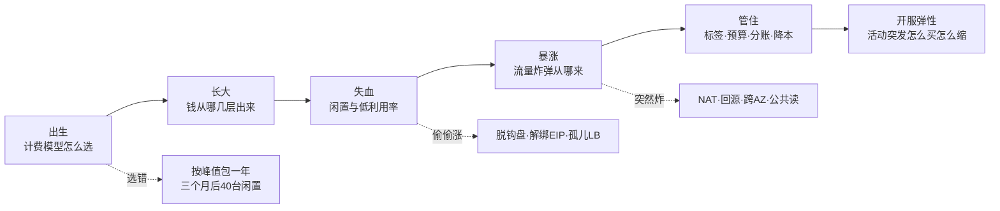
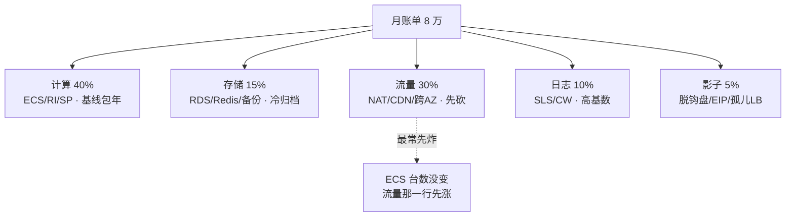
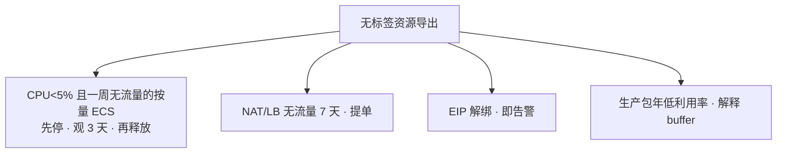
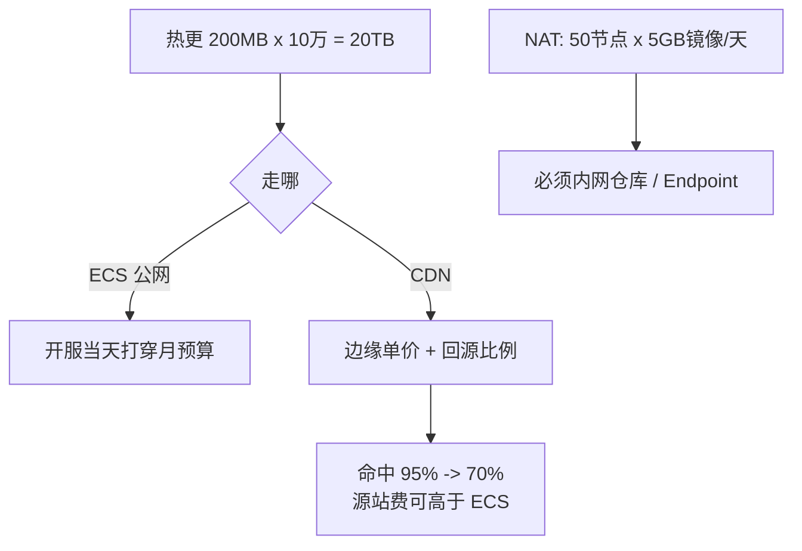
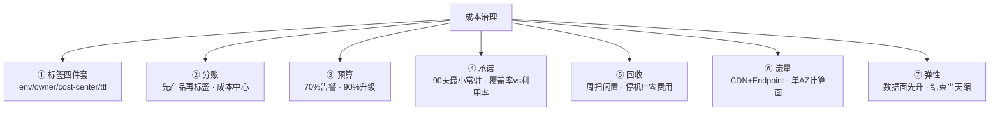
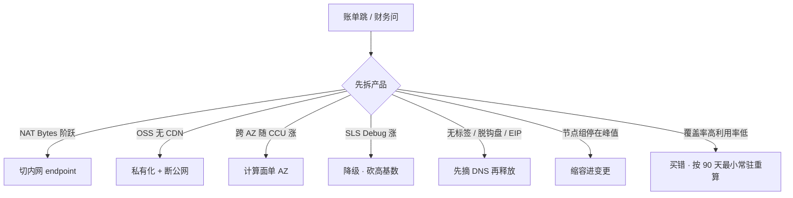

# 成本治理

> 月底打开账单：ECS 台数没变，流量那一行先炸。财务按开服当天 3 万 CCU 买了 50 台一年，三个月后日常 8 千，40 台闲置仍在付。群里有人要把战斗服改 Spot「省 70%」。
> **本章回答**：一张账单从出生（计费模型）→ 长大（五层出账）→ 失血（闲置）→ 暴涨（流量炸弹）→ 管住（标签·预算·分账）→ 开服弹性，每段怎么漏、怎么一眼定责。
> **不讲**：NAT / 跨 AZ 路径 → [01](../01-云网络与安全/)；OSS 公共读、CDN 回源内网 → [06](../06-阿里云生产/)；Spot 中断、NAT 定价、Savings vs RI 细节 → [07](../07-AWS生产/)；切云两套账单 → [09](../09-多云对照/)；备份保留 / 只读忘删 → [03](../03-云上存储与数据库/)；多账号 SCP → [04](../04-IAM与多账号/)；开服合服流程 → [07-06](../../07-游戏运维专题/06-开服合服/)。

**标记**：🎯重点 · 🔥难点 · ⭐常考 · 🔧实操

---

## 一、一张图：一张账单的一生

> 🎯 **一句话**：账单像活物——出生选错就畸形，闲置与流量偷偷涨，标签+预算是闸，开服弹性是综合考试。



- 📖 **读图**
  - 🛤️ 主线六段：出生 → 长大 → 失血 → 暴涨 → 管住 → 开服弹性
  - 👻 虚线是「不主动查就偷涨」：计费选错、闲置、流量炸弹
  - 🔭 费用中心 / Cost Explorer 照的是「长大」和「暴涨」——先按产品拆，再按标签拆

本节对应练习题 Q1。

---

## 二、出生：计费模型怎么选 🎯⭐🔥

> 🎯 **一句话**：基线包年 / RI，峰值按量，Spot 只给可中断；承诺按 90 天最小常驻买，不按峰值。

### 🛒 三种买法

| 买法 | 给谁 | 典型 |
|------|------|------|
| 包年 / RI / Savings Plan | 常驻基线：老区逻辑服、RDS、EKS 系统节点 | 90 天最小常驻 |
| 按量付费 | 可预期活动：版本日、节日，结束释放 | 1.5 倍扛开服周 |
| Spot / 竞价实例 | 可中断：CI、压测、统计离线 | 战斗服禁止 |

- ⭐ **按峰值包一年**是高频错答：开服 3 万 CCU → 买 50 台一年 → 三个月后日常 8 千 → 40 台闲置仍付
- 🎮 游戏区服有生命周期：新服前两周 ≠ 老服曲线；承诺锁死峰值 = 畸形账单

> 💡 **打个比方**：按开服峰值包年，像按春运最高峰买大巴跑全年——平时 8 个乘客，车贷照还。正确：春运租车（按量），平时按最小常驻包车（包年底）。

### 📐 承诺用量怎么算

- 看过去 **90 天最小常驻**，不是平均，更不是峰值
  - 平均把活动峰值摊进去 → 买多
  - 峰值把开服当天当全年 → 买废
- 窗口覆盖一个完整活动周期；合服导致最小值不典型 → 推到合服稳定后 30 天最小值
- **1.5 倍按量七天**：新服先按量扛峰值波动，第七天曲线稳再转包年底
  - 规格与老服模板一致（方便转 / 合 / 改挂）
  - 前三天波动最大；三天太短会把活动尾声误当日常

#### ❓ 为什么按最小常驻，不按平均？

- ❌ 平均 = 把版本日、周末高峰摊进「日常」→ 承诺量偏大
- ❌ 峰值 = 开服当天当全年 → 三个月后大片闲置仍付
- ✅ 最小常驻 = 砍掉所有活动后的基线；活动峰值用按量扛

### 🧾 RI vs Savings Plan 🔥

- **RI（Reserved Instance）**：锁规格 + 区域 + 数量；规格稳定的老区逻辑服合适；换规格就不适用
- **Savings Plan（SP）**：买「每小时承诺金额」，可跨规格族；用量掉下去一样浪费
  - **Compute SP** 盖 EC2 / Fargate / Lambda，**盖不住 NAT 和流量**——承诺买错品类是第二常见浪费
  - **EC2 Instance SP** 锁实例族但可跨大小
- **预留容量** ≠ RI：前者是「给你留机器」，后者是费用折扣

- 🚪 **转包年门禁**：规格稳定、区服不会合、至少看过一个完整活动周期
- 🧪 测试机永远按量 + `ttl` 标签——包年退订有折损，比按量忘关更痛

> ⚠️ **别混**：**覆盖率 ≠ 利用率**。覆盖率 = 有承诺折扣的占比；利用率 = 那些实例实际多忙。覆盖率 100% + 利用率 40% = 买错，不是治理成功。KPI 是**闲置率和流量异常**，不是 RI 覆盖率。

### ⚡ Spot：折扣大，但会中断 🎯⭐

- Spot 用闲置产能，折扣可达 70%+，随时可能被回收（AWS 中断通知约 2 分钟）
- ✅ 只给：CI、镜像构建、压测、统计离线
- ❌ 禁止：战斗服、开服当天容量
- 混合节点组必须把有状态 taint 掉 Spot，否则回收丢数据

#### ❓ 为什么战斗服不能为「省 70%」上 Spot？

- 战斗一局 20 分钟，中断 2 分钟通知 = 整局被踢 + 客诉 + 充值回滚
- Spot 与业务高峰**反相关**：开服 = 全平台抢容量 = Spot 供给少 = 回收率最高
- 「省 70%」只在可中断、可重试、不影响玩家体验时成立

### 🛑 按量坑：停机 ≠ 零费用 🔧

- 停机只暂停计算费；盘 / EIP / 快照可能仍计——各云规则不同，查文档别假设
- 真要归零 = **释放**：删盘 + 解绑 EIP + 删快照
- 内存型（RDS / Redis）停机可能还收全价

```bash
# 阿里云：费用中心 → 按产品 → ECS → 已停止实例的云盘和 EIP
# AWS：Cost Explorer → Filter: EC2-Other → Idle/Unattached
# ← 停机后仍出账：云盘、EIP 保有费、快照

# AWS 查解绑 EIP
aws ec2 describe-addresses --query 'Addresses[?InstanceId==null]'
# 阿里云：EIP 控制台 → 筛选未绑定
# ← 解绑 EIP 即告警
```

> 📝 **面试**：问「游戏服怎么省钱」，别先答 Spot。答「先砍闲置和流量，再谈 RI / Spot；基线按 90 天最小常驻，峰值按量，Spot 只给可中断；战斗服禁 Spot；停机 ≠ 零费用」。追问「为何不用 Spot 省更多」→「Spot 与业务高峰反相关，最需要容量时被收走」。

本节对应练习题 Q1、Q7、Q10、Q11。

---

## 三、长大：钱从哪几层出来

> 🎯 **一句话**：出账大头通常不是 32 核单价——计算、存储、流量、日志、影子各占一段，说不清 8 万从哪来就别谈优化。

- **计算**：基线包年 / RI / SP；峰值按量；Spot = 可中断。降配看 **95 分位**不是平均
- **存储与数据**：RDS / Redis；只读忘删；备份 365 天无人要；冷归档省存储但取回费高；对象存储**请求费**（List / Head）积少成多
- **流量**：CDN 边缘、回源、NAT 处理费、公网出、跨 AZ——**最常先炸**（台数不变也能涨）
- **日志**：SLS / CloudWatch 按摄入量计费不按磁盘；高基数 + Debug 全量 → 开服周可从 10% 涨到 25%+
- **影子资源**：脱钩盘、解绑 EIP、空闲 NAT / LB、孤儿 LB——混在 EC2-Other / ECS-其他，不拆看不到

- 📏 **单位经济**：每 CCU 成本 = (计算 + 数据 + 流量 + 日志) / 平均 CCU；看 **30 天趋势**，别用开服第一天吓财务
- ⏱️ **账期金额 ≠ 实际消耗**：账期有延迟（AWS 约 12h～3d）；先行指标是 NAT Bytes、CDN 回源比例、SLS 摄入



- 📖 **读图**
  - 📊 五层占比是示例；流量层最常先炸；影子层最小但全是纯浪费
  - 🔎 「总账单涨 20%」是现象；「NAT 处理费涨 80%」才是根因

> ⚠️ **别混**：**先砍闲置和流量，再谈 RI / Spot**。优化顺序：归因（标签）→ 砍闲置 → 砍流量 → 承诺折扣 → 最后 Spot。

本节对应练习题 Q8。

---

## 四、失血：闲置与低利用率 🎯⭐🔧

> 🎯 **一句话**：闲置比「机器买大了」更常见——脱钩盘、解绑 EIP、空闲 NAT、孤儿 LB、节点组 min 停峰值，都是按小时偷偷出血。

### 📋 闲置资源清单 🔧

- 按量盘跟释放的 ECS 脱钩仍出账
- **EIP 保有费**：解绑仍计；几十个积少成多
- 测试 CLB / ALB、空闲 NAT（按小时 + 处理费）
- 旧高防、旧域名仍解析到付费 IP
- RDS 只读忘删、备份保留 365 天无人要
- ACK / EKS 节点组 `min=max=峰值` 过夜
- Service 删了 LB 还在计费（孤儿 LB）
- 生命周期失败但仍付存储费的快照
- **预留 / 包年未使用也是闲置**——要能解释 buffer 还是忘了

- 📐 **利用率**：看 **95 分位和峰值**，不看 CPU 平均
  - 按量：95 分位 < 5% 且峰值 < 20% → 先停 3 天再释放
  - 包年：看 30 天趋势；低利用率要么改挂，要么接受沉没成本——不为「用掉」打空服流量

### 🗓️ 周扫闲置 🔧



- 📖 **读图**
  - 四类分扫：按量低利用率 / 无流量 NAT·LB / 解绑 EIP / 包年低利用率
  - 先从 DNS / 入口摘掉再释放；无标签资源当闲置打

- 🏷️ 临时压测必须有 `ttl` + 负责人；过期自动提单——不靠人记得关
- 🗣️ buffer 要有数字：「春节 CCU × 1.2，过完节 **7 天内**缩回」；没模型没缩容日 = 闲置

```bash
aws ce get-cost-and-usage --metrics BlendedCost \
  --filter '{"Dimensions":{"Key":"SERVICE","Values":["EC2-Other"]}}' \
  --time-period Start=2026-08-01,End=2026-09-01
# ← EC2-Other 含 EIP、LB、快照；拆开看哪项在出账

# 阿里云：费用中心 → 按产品 → 拆 NAT / LB / EIP / 快照
# ← 无标签 NAT/LB/EIP 优先清理
```

> ⚠️ **别混**：**停机 ≠ 零费用**（见二节）。关机不等于清零。

> 📝 **面试**：「闲置比买大更常见：脱钩盘、解绑 EIP、空闲 NAT、孤儿 LB、节点组 min 停峰值；停机 ≠ 零费用；无标签当闲置打。」

本节对应练习题 Q4。

---

## 五、暴涨：流量炸弹从哪来 🎯⭐🔥

> 🎯 **一句话**：NAT 处理费、CDN 回源、跨 AZ、公共读——ECS 台数没变，流量那一行先炸。

> 💡 **打个比方**：像水电费里空调偷偷开了一整月——看不到 ECS 变多，但 NAT / 回源在后台涨。开服周每天看费用中心，像每天看电表。

### 💣 四大来源

| 项 | 何时产生 | 游戏场景 |
|----|----------|---------|
| NAT 处理费 | 私网访问公网的字节（AWS 很贵） | 拉镜像、第三方 API、下载误走 NAT |
| CDN 回源 | 缓存击穿或短 TTL | 热更回源比例失控 |
| 跨 AZ 流量费 | AWS 明确收；阿里部分场景有 | 逻辑服东西向、LB / NAT 跨 AZ |
| 公共读 / 出口 | OSS / S3 无 CDN、ECS 出公网 | Bucket 被爬、源站被打 |

- 🔢 节点每天拉 5GB 镜像 × 50 台 = 250GB/天穿 NAT，处理费可**超过节点本身**
- 🔢 热更 200MB × 10 万 = 20TB，走 ECS 公网可当天打穿月预算



- 📖 **读图**
  - 热更与镜像是两大炸弹：公网打穿预算 / NAT 贵过节点
  - 走 CDN 必须盯回源比例；命中率掉 → 回源费可反超 ECS 月费

### 🔍 一次账单暴涨跟着走

> 🔍 **现场**：费用中心按产品拆，NAT Bytes 与 ECS 公网分开看。

1. **NAT 字节阶跃**：镜像没走内网仓库 / VPC Endpoint → 先切内网，别先买更大 NAT
2. **OSS / S3 流出无 CDN**：立刻私有化 + 内网回源，再查谁在拖
3. **跨 AZ 随 CCU 线性涨**：计算面误开跨 AZ；区服单 AZ 是成本理由（见 01），不是偷懒
4. **SLS / CW 摄入随 Debug 涨**：降采样、砍字段、TTL；玩家 ID 别进 Prom label

- 📎 **请求费**：10 万客户端每 30 秒 ListBucket = 请求爆炸 → CDN 列目录 + 长缓存，别让客户端直查 OSS
- 🎯 **CDN 命中率杀手**：短 TTL、带 query string 的版本检查、不可缓存动态接口
- 🦠 **故障型账单**：`0.0.0.0/0` + EIP → 矿机；特征是 CPU 100% 但 CCU 不高 + 出口异常

#### ❓ 为什么台数没变却先砍流量行，不先砍 ECS？

- 计算多是固定成本（台数不变就不涨）；流量是变动成本（随 CCU / 回源 / NAT 涨）
- 上来缩容只省小头，流量还在继续炸
- 口诀：**台数没变先查流量行**

- 🩹 **止血优先级**（一次改一项）：切内网 Endpoint → 私有化 Bucket → 关跨 AZ 计算面 → 调 CDN TTL
- 改完盯第二天账单；NAT Bytes 没掉 = 还有组件配了公网域名

> ⚠️ **别混**：**边缘流量 ≠ 回源流量**。省 CDN 不是改短 TTL——改短 TTL 省的是最便宜的缓存存储，赔的是最贵的回源。CDN 费 = 边缘 + 回源 + 缓存存储。

> 📝 **面试**：「流量炸弹四大来源：NAT / CDN 回源 / 跨 AZ / 公共读；先 Endpoint / 内网回源再谈升配；开服周每天看流量，别月底才打开账单。」

本节对应练习题 Q2、Q7、Q8、Q13。

---

## 六、治理：标签、预算、分账、降本 🎯⭐🔥

> 🎯 **一句话**：没有标签就没有治理——FinOps 是分账 → 承诺 → 回收三条能执行的闸，不是财务周点控制台。

### 🏷️ 标签与分账（Inform）

- 强制四件套：`env` / `owner` / `cost-center` / `ttl`
- 生产禁止无标签 NAT / LB / EIP；无标签当闲置打
- **成本标签**要在费用中心激活为「成本分配标签」才出分账报告
- 落地顺序：扫存量 → 补标签或清理 → IaC 模板写死 → 无标签禁止创建

### 📊 预算与成本洞察（Operate）

- 预算：**70% 告警、90% 升级**；开服周临时调高（120%～150%）避免疲劳
- 基线 = 过去 3 个月日常均值 × 1.2；活动另设临时预算
- **成本洞察**：开服周每天对着费用中心走一遍（ECS / LB / NAT / CDN / OSS / RDS / 日志）
  - 日常周一周五各扫 10 分钟；活动后第二天必复盘预估 vs 实际


- 📖 **读图**
  - 三闸递进：Inform（看清谁花钱）→ Optimize（锁基线）→ Operate（回收 + 管突发）
  - 跳过 Inform 直接买 RI = 最常见错——连钱是谁的都不知道

### ✂️ 降本怎么落地

- 降本是**生产变更**：改 TTL、关跨 AZ、并 NAT、缩节点——要回滚、要审批
- **优先级**：影子（零风险）→ 闲置计算（先停观察）→ 流量 → 最后重算承诺
- **节奏**：影子周扫 / 闲置月扫 / 流量季度 / 承诺半年重算
- 好案例讲：省多少（绝对值+百分比）→ 怎么做（一句）→ 没动什么（边界）→ 回滚方案
- ❌ 别把战斗服改 Spot 当案例

> ⚠️ **别混**：**buffer ≠ 闲置**。buffer 有节日模型 + 缩容日；闲置没有故事。混在一起，要么真闲置逃清理，要么真 buffer 被砍。

> 📝 **面试**：「FinOps 三闸：标签 → 预留 → 闲置；预算 70/90；覆盖率是结果不是目标；降本是生产变更要回滚。」

### 收束：成本治理凭什么管住



- 📖 **读图（分组）**
  - ①② **归因** · ③④⑤ **管控** · ⑥⑦ **执行**
  - 没有标签就没有分账，没有分账就没有优化；承诺买错比不买更痛

> ⚠️ **别混**：这套只保证「账单能归因」，**不保证**覆盖率 100% = 省钱、停机 = 清零、HPA 解决开服成本、标签打了就准（值要审计）。

> 📝 **面试**（记忆分组）：**归因**（标签+分账）→ **管控**（预算+承诺+回收）→ **执行**（流量+弹性）；补一句「KPI 是闲置率和流量异常，不是 RI 覆盖率」。

本节对应练习题 Q5、Q11、Q12。

---

## 七、开服弹性：活动突发怎么买怎么缩 🎯⭐🔥

> 🎯 **一句话**：开服按峰值按量扛几天；活动结束必须有缩容 runbook——计算面能按小时弹，数据面不能。


- 📖 **读图**
  - 前：升数据面 → 弹计算面 → CDN 预热；中：盯 NAT / 回源 / Redis；后：结束当天缩
  - 开服与关服对称——只开不关是半吊子治理

### ✅ 正确策略

1. 新服用按量，规格与老服模板一致
2. 计算面按 CCU 扩；数据面（RDS / Redis）**提前**升配——窗口长，来不及按小时弹
3. 热更走 CDN
4. 结束有缩容 runbook：节点组、按量 ECS、临时只读、压测 Redis
5. 合服后旧服资源清单关闭（含 LB、NAT、磁盘、监控包）

#### ❓ 为什么先升数据面，再弹计算面？

- 计算面（ECS / 节点）分钟级可弹；数据面升配要停机或主备切换（分钟～小时）
- 反过来：计算面弹上去了，库升不上 → 排队 / 超时；结束时计算面缩不了也卡在数据面
- 顺序：活动前升库 → 活动中弹计算 → 结束先缩计算再降库（同一张变更单）

- 🔢 数字示例：单逻辑服 2000 CCU / 16c32g；第一天 1.5 倍按量；7 天后转 1.0 倍包年底
- HPA 盖不住有状态逻辑服——问题是买多了不缩，不是没开 HPA（细节见 [07-06](../../07-游戏运维专题/06-开服合服/)）
- 缩容比扩容难：要 drain、排空 Session、走变更——至少「结束当天进变更」的提醒机制

### 📌 突发项单独记账

| 突发项 | 为什么贵 | 怎么收 |
|--------|----------|--------|
| 临时只读 / 压测 Redis | 忘删收到下次活动 | `ttl` + 负责人，过期提单 |
| 数据面升配 | 来不及按小时弹 | 活动后降配进同一张变更单 |
| CDN 回源 | 短 TTL / 未预热 | 强更单独预热 |
| NAT / 镜像 | 滚动扩容穿公网 | 内网仓库，盯 Bytes |
| Debug 日志 | 摄入随 CCU 涨 | 当天降级 |
| 节点组 min=峰值过夜 | 弹上去没人缩 | 结束当天进变更 |

- 🗣️ 跟财务讲 1.5 倍：用 CCU 曲线 + 失败成本（排队 / 充值失败）；必须接「第几天开始缩」

### 🧹 合服 / 关服清单

- LB（含监听 / 后端组）· NAT（最常漏）· 只读副本 · Redis 压测副本 · 高防 · EIP · 监控包 · 失败快照
- DNS **先摘再释放**；关服 ≠ 立刻删备份（按合规保留）
- 包年：改挂或接受沉没成本——不为「用掉」打空服流量
- 防漏：开服第一天起用 `server-group` 标签维护台账，关服按台账打勾

> ⚠️ **别混**：**关服 ≠ 立刻删备份**。清资源，备份按合规周期；包年未到期改挂或沉没成本。

> 📝 **面试**：「开服按峰值签一年 = 三个月后浪费；缩容要有 runbook，与开服对称；先升数据面再弹计算面；HPA 盖不住有状态，问题是不缩。」

本节对应练习题 Q3、Q6、Q9、Q14。

---

## 八、作战：定责 🎯⭐🔧

> 🎯 **一句话**：账单异常用分流，不是先开会——先拆产品再拆标签，先砍闲置和流量再谈承诺。



- 📖 **读图**
  - 第一刀永远「先拆产品」；七条支线写真实现象
  - 新人按树走也能 60 秒定位，不靠「干了五年才知道 NAT 贵过节点」

### 现象 · 先做 · 别做

| 现象 | 先做 | 别做 |
|------|------|------|
| 流量比 ECS 贵 | 拆 NAT / CDN 回源 / 跨 AZ / 公共读 | 只盯 32 核单价 |
| 命中率 95%→70% | 查短 TTL、query string、动态接口 | 和强更同一周「省 CDN」 |
| 已停实例仍出账 | 对盘 / EIP 计费规则 | 以为关机清零 |
| 关服还在付钱 | 清单 + 包年改挂 | 空服打流量「用掉」 |
| 优化后长连接掉 | 当生产变更回滚 | 财务周继续点 |
| 每 CCU 开服周难看 | 用第七天以后对比 | 用第一天吓财务 |
| 覆盖率 100% 利用率 40% | 按 90 天最小常驻重算 | 以为覆盖率越高越好 |

### 60 秒剧本 🔧

> 🔍 **现场**：接到「账单暴涨 / 财务问为什么」。

```text
0-10s   费用中心按产品拆：NAT / ECS / CDN / OSS / RDS / 日志各占多少
10-30s  找阶跃：NAT Bytes？OSS 无 CDN？跨 AZ 随 CCU？SLS Debug？
30-45s  定型：流量型 / 闲置型 / 承诺型
45-60s  定责：流量先切内网 · 闲置先摘 DNS · 承诺按 90 天重算
# ← 不动业务进程、不财务周直接改控制台、不为「用掉」打空服流量
```

**三笔账（背故事用）**：

- **包年买错**：按 3 万峰值包 50 台一年 → 改 1.5 倍按量七天 + 90 天最小常驻
- **流量炸弹**：50×5GB/天穿 NAT → 切内网 Endpoint；热更 20TB 改 CDN 预热
- **省存储赔流量**：TTL 1 天→5 分钟，命中 95%→70%，回源费反超 ECS → 改回长 TTL + 强更预热

本节对应练习题 Q12。

---

## 九、收口

### 命令速查 🔧

```bash
# 费用中心 / Cost Explorer：先按产品，再按标签
# 阿里云：费用中心 → 按产品 → 拆 NAT/CDN/ECS/OSS/日志
# AWS：Cost Explorer → Group by Service → Group by Tag
# ← 说不清 8 万从哪来就别谈优化

# NAT 字节阶跃
# AWS：CloudWatch → NAT Gateway → BytesProcessed
# 阿里云：NAT 网关监控 → 处理流量
# ← 阶跃 = 镜像没走内网 / VPC Endpoint

# 闲置周扫
# AWS：Trusted Advisor / Cost Explorer → Idle / Unattached
# 阿里云：费用中心 → 按产品 → NAT/LB/EIP 无流量
# ← 解绑 EIP 即告警；无标签当闲置打

# 覆盖率 vs 利用率
# AWS：Savings Plans → Coverage + Utilization Report
# 阿里云：预留实例 → 覆盖率 + 使用率
# ← 覆盖率 100% 利用率 40% = 买错承诺
```

### 面试锚点表

| 问 | 30 秒答 |
|----|---------|
| 游戏服怎么省钱？ | 先砍闲置和流量再谈 RI/Spot；基线 90 天最小常驻，峰值按量，Spot 只给可中断；战斗服禁 Spot。 |
| 包年按什么数字买？ | 过去 90 天最小常驻，不按平均不按峰值。 |
| Spot 能上战斗服吗？ | 不能，只给 CI/压测；开服当天容量不用 Spot。 |
| 覆盖率 100% 是治理好吗？ | 不是，利用率 40% 是买错；KPI 是闲置率和流量异常。 |
| 流量比 ECS 贵怎么查？ | 拆 NAT/CDN 回源/跨 AZ/公共读；先 Endpoint/内网再升配。 |
| 停机是零费用吗？ | 不是，盘/EIP/快照可能仍计；释放才归零。 |
| 标签怎么落？ | 强制 env/owner/cost-center/ttl；无标签 NAT/LB/EIP 禁止生产。 |
| 预算怎么设？ | 70% 告警 90% 升级；开服周临时调高；日常均值 × 1.2。 |
| 活动突发怎么买？ | 数据面先升、计算 1.5 倍按量、结束当天缩；HPA 盖不住有状态。 |
| 合服还在付钱？ | 清单关 LB/NAT/只读/EIP；DNS 先摘；包年改挂或沉没；关服≠删备份。 |
| RI vs Savings Plan？ | RI 锁规格区域；SP 跨族但盖不住 NAT/流量；都是承诺用量。 |
| 跨 AZ 为什么贵？ | AWS 明确收；逻辑服东西向量大时可接近计算本身——单 AZ 是成本理由。 |
| 降本从哪开始？ | 影子（零风险）→ 闲置计算 → 流量 → 最后承诺折扣。 |
| 成本洞察怎么做？ | 开服周每天扫费用中心，看先行指标，不等出账日。 |

### 易错一句话对照

- 越包年越省 → 峰值按量；按峰值签一年三个月后浪费
- 承诺按平均值买 → 90 天最小常驻
- 战斗服上 Spot 省 70% → Spot 只给可中断
- 覆盖率 100% 就是治理好 → 利用率 40% 是买错
- Compute SP 能盖 NAT → 盖不住流量和 NAT
- 停机 = 零费用 → 盘 / EIP 可能仍计；释放才归零
- 无标签也能优化 → 说不清 8 万是谁
- 成本 KPI 是 RI 覆盖率 → 闲置率和流量异常
- 区服计算面单 AZ 是偷懒 → 跨 AZ 可接近计算本身
- HPA 能解决开服成本 → 有状态服要调度；问题是不缩
- 优化可以财务周直接点 → 生产变更要回滚
- 向财务只讲买不够 → 必须接第几天开始缩
- 关服立刻删备份 → 关服 ≠ 立刻删备份
- 为用掉包年把空服打满 → 改挂或接受沉没成本
- buffer 和闲置混在一起 → buffer 有模型有缩容日
- 省 CDN 就是改短 TTL → 命中率掉了回源费更高
- 磁盘没满 = 日志费没问题 → SLS/CW 按摄入量计费
- 每台只看 32 核单价 → 流量费经常先于 ECS 单价
- 降本从承诺折扣开始 → 先砍影子再砍流量最后调承诺
- 账期金额 = 实际消耗 → 账期有延迟，看先行指标

### 数字墙

> 新服 **1.5 倍按量七天** · 转包年 **90 天最小常驻** · 预算 **70 / 90** · buffer 春节 CCU × **1.2**、过完节 **7 天内**缩回 · 热更 200MB × 10 万 = **20TB** · NAT 50 × **5GB/天** = 250GB/天 · CDN 命中 **95%→70%** 回源费可高于 ECS · NAT 处理费可超过节点本身 · Spot 中断 ~**2 分钟** · 跨 AZ 流量费可接近计算本身 · 账单五层：计算/存储/流量/日志/影子 · CDN 三项：边缘 + 回源 + 缓存存储 · 闲置 95 分位 < 5% 先停观察 · 降本优先级：影子→闲置→流量→承诺 · 账期延迟 12h–3d，看先行指标

---

## 合上书

- [ ] 能**默画**一张账单的一生（出生→长大→失血→暴涨→治理→开服弹性），标出偷偷涨的段、费用中心照哪两段（Q1）
- [ ] 三种买法各给谁？承诺按什么数字？Spot 能否给战斗服？停机是否零费用？（Q1、Q7、Q10、Q11）
- [ ] 钱从哪五层出来？为何先砍闲置和流量？单位经济怎么看？（Q8）
- [ ] 闲置常见清单？利用率看平均还是 95 分位？buffer 与闲置怎么分？（Q4）
- [ ] 能**默画**流量炸弹四大来源，用 20TB / NAT 250GB 开口；止血优先级；CDN 三项费用（Q2、Q7、Q8、Q13）
- [ ] FinOps 三闸？标签四件套？预算 70/90？覆盖率 vs 利用率？（Q5、Q11、Q12）
- [ ] 能**默画**七件套，按「归因→管控→执行」分组；降本优先级（Q3、Q6、Q9、Q14）
- [ ] 活动突发：谁先升？缩容哪天进变更？HPA 能否当成本方案？（Q12）
- [ ] 合服清单？DNS 先摘还是先释放？关服 ≠ 什么？（Q12）
- [ ] 能**默画**作战决策树，口述 60 秒剧本；三笔账各对应哪条主线？（Q12）

下一章：[06](../06-阿里云生产/)。NAT / 跨 AZ：[01](../01-云网络与安全/)。多账号拆账单：[04](../04-IAM与多账号/)。
