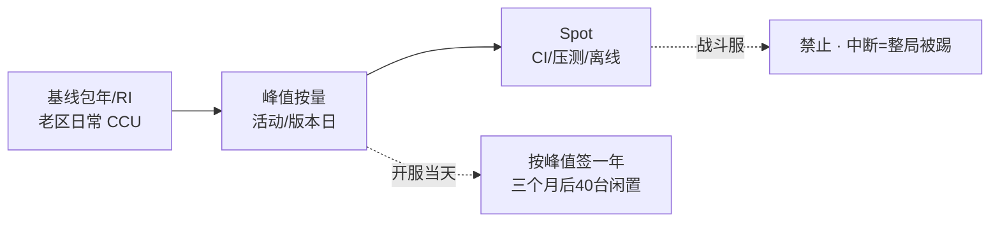
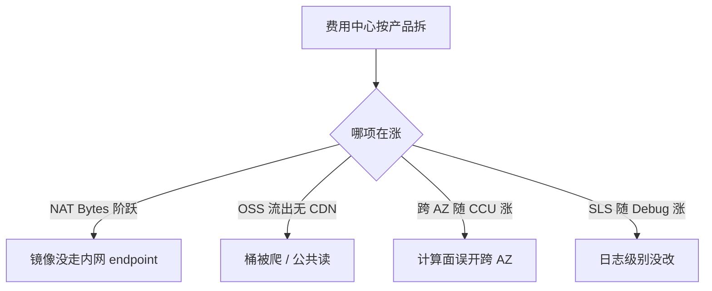
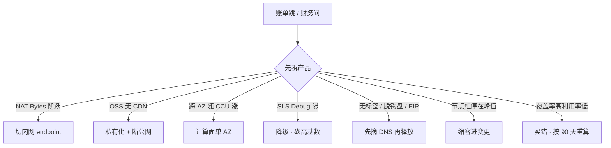

# 05｜成本治理 · 练习题

开始做题前，先给大家一个小建议：合上知识点，对着**第一节的主图**，把「一张账单的一生」从计费模型到治理口述一遍。能顺下来，下面这些题你会发现大半都会了；卡壳的地方，就是你该回去重读的那一节。

做题的方式也建议改一下：每道题**先看标题和场景，自己口述一遍答案，再往下看「完整解答」对答案**。直接看解答，容易产生「我会了」的错觉——能讲出来才是真的会。

| 标记 | 含义 |
|------|------|
| **核心** | 不懂整章就没建立起来 |
| **必会** | 值班和面试都要能讲 |
| **常用** | 线上会反复碰到 |
| **常考** | 白板和追问的高频口径 |

题目的顺序也是有意排的：Q1～Q5 先钉计费与闲置；Q6～Q10 讲流量炸弹与治理；Q11～Q14 收尾到开服弹性与定责。

## 本题目录
- [Q1 包年按量 Spot 怎么选](#q1)
- [Q2 流量比 ECS 贵怎么查](#q2)
- [Q3 开服弹性怎么买怎么缩](#q3)
- [Q4 闲置与影子资源](#q4)
- [Q5 FinOps 标签和预留](#q5)
- [Q6 活动突发成本](#q6)
- [Q7 单 AZ 是成本理由](#q7)
- [Q8 日志账单和开服周拆账单](#q8)
- [Q9 关服还在付钱](#q9)
- [Q10 RI vs Savings Plan](#q10)
- [Q11 覆盖率 vs 利用率](#q11)
- [Q12 优化当变更 + 60 秒剧本](#q12)
- [Q13 流量账单 NAT 阶跃怎么切](#q13)
- [Q14 活动结束缩容进变更](#q14)
- [合上书](#合上书)

---

## Q1

**★★★★★｜游戏服包年/按量/Spot 怎么选？有人说把战斗服改 Spot 省 70%，行不行？**

**覆盖**：核心 · 必会 · 常考 ｜ **对应**：知识点 [二、出生：计费模型怎么选](知识点.md)

### 场景
新服开服当天 CCU 3 万。财务按 3 万买了 50 台一年。三个月后日常 8 千，40 台闲置仍在付。群里有人提议把战斗服改 Spot「省 70%」。

先自己试试：不看下面，先口述一遍你的答案，再往下对。

### 完整解答
> 🎯 **一句话**：基线包年 / RI 按 90 天最小常驻，峰值按量，Spot 只给可中断；战斗服禁 Spot——开服按峰值签一年是经典买错。



**读图**：三种买法各给各的场景——包年给常驻基线、按量给活动峰值、Spot 给可中断。按开服峰值签一年是把「春运峰值」当全年常态——三个月后 40 台闲置仍在付。承诺用量看过去 90 天**最小**常驻，不是平均更不是峰值。

Spot 折扣可达 70%+，但随时被回收（抢占式中断约 2 分钟）。战斗服被回收 = 整局玩家被踢。Spot 只给 CI、镜像构建、压测、统计离线。混合节点组把有状态 taint 掉 Spot 节点。

> ⚠️ **别混**：Spot 省钱 ≠ 战斗服上 Spot。「省 70%」只在可中断场景成立；战斗服和开服当天容量不用 Spot。
> 📝 **面试**：「先砍闲置和流量，再谈 RI / Spot；基线包年按 90 天最小常驻，峰值按量，Spot 只给可中断；战斗服禁 Spot。」

### 再追问
- **承诺用量按平均还是峰值？** ——都不按，按 90 天最小常驻。平均会把活动峰值摊进去导致买多，峰值会把开服当天当全年。
- **按量 ECS 停机是零费用吗？** ——不是，盘/EIP/快照可能仍计费，各云不同要查（[二](知识点.md) 按量坑）。

---

## Q2

这是 Q1 计费模型的延伸——包年怎么买才不闲置。


**★★★★★｜ECS 台数没变，流量那一行先炸，怎么查？**

**覆盖**：核心 · 必会 · 常考 ｜ **对应**：知识点 [五、暴涨：流量炸弹从哪来](知识点.md)

### 场景
月底打开账单，ECS 台数没变，费用中心显示 NAT Gateway 和 CDN 费用暴涨。有人只盯 32 核单价优化计算。

先自己试试：不看下面，先口述一遍你的答案，再往下对。

### 完整解答
> 🎯 **一句话**：流量炸弹四大来源——NAT 处理费、CDN 回源、跨 AZ 流量费、公共读；先拆产品再拆来源，先切内网 endpoint 再谈升配。



**读图**：第一刀先拆产品——NAT 还是 ECS 还是 CDN。然后按现象分叉到四条支线。算一笔账开口：节点每天拉 5GB 镜像 × 50 台 = 250GB/天穿 NAT，AWS 处理费可以**超过节点本身**；热更 200MB × 10 万 = 20TB，走 ECS 公网开服当天打穿月预算。

止血顺序：先切内网 endpoint（S3 Gateway Endpoint / OSS 内网域名），不要先买更大的 NAT。OSS 公共读立刻私有化 + 内网域名。跨 AZ 关掉计算面（区服单 AZ）。SLS 降采样、砍字段、TTL。

> ⚠️ **别混**：**边缘流量 ≠ 回源流量**。CDN 命中率 95% 掉到 70%，回源费可以反过来超过 ECS 月费。省 CDN 不是改短 TTL，是提高命中率。
> 📝 **面试**：「流量炸弹四大来源：NAT 处理费、CDN 回源、跨 AZ、公共读；先 Endpoint / 内网回源再谈升配；开服周每天看一眼流量，不要月底才打开账单。」

### 再追问
- **CDN 命中率杀手是什么？** ——短 TTL、带 query string 的版本检查、不会缓存的动态接口。强更窗口单独预热，不和「省 CDN」同一周做。
- **对象存储请求费贵吗？** ——高频小请求（List、Head）积少成多，不只看流量费（[五](知识点.md) 四大来源）。

---

## Q3

钱从哪几层出来。


**★★★★★｜开服/活动突发怎么买？缩容哪天做？HPA 能解决成本问题吗？**

**覆盖**：核心 · 必会 · 常考 ｜ **对应**：知识点 [七、开服弹性：活动突发怎么买怎么缩](知识点.md)

### 场景
版本日活动，CCU 预计从日常 8 千涨到 3 万。有人只弹了计算面 HPA，没动数据面。活动结束后节点组 min=max=峰值过夜，一周没人缩。

先自己试试：不看下面，先口述一遍你的答案，再往下对。

### 完整解答
> 🎯 **一句话**：数据面先升、计算面 1.5 倍按量扛、热更走 CDN 预热、结束当天缩容进变更；HPA 盖不住有状态，成本问题是买多了不缩。


**读图**：活动前先升数据面（RDS/Redis 升配窗口长，来不及按小时弹），再弹计算面，热更走 CDN。活动中盯 NAT / 回源 / Redis。结束当天缩容进变更——和开服对称，有检查项。不缩就过夜：节点组 min=max=峰值会按小时收。

**弹性伸缩与成本**：弹性不是 HPA 万能——有状态逻辑服扩容要加进程和进服调度，不是云控制台加两台就均流。HPA 只能覆盖无状态；成本问题是买多了不缩，不是没开 HPA。

向财务解释多买：用 CCU 曲线和失败成本。开服买 1.5 倍按量三天，比买少了排队、商店打不开、充值失败的客诉便宜。解释完必须接「第三天开始缩」——只讲买不够、不讲收回，财务下次不信。

> ⚠️ **别混**：**HPA 能解决成本问题** → 错。HPA 只覆盖无状态；有状态服要调度；问题是买多了不缩，不是没开 HPA。
> 📝 **面试**：「开服按峰值签一年 = 三个月后浪费；缩容要有 runbook，和开服对称；活动突发先升数据面，再弹计算面；HPA 盖不住有状态。」

### 再追问
- **临时只读 / 压测 Redis 怎么收？** ——`ttl` + 负责人，过期自动提单关闭；忘删会收到下一次活动（[七](知识点.md) 突发项）。
- **buffer 春节怎么算？** ——春节 CCU 模型 × 1.2，过完节 7 天内缩回；要有数字和缩容日，不给「以防万一」。

---

## Q4

闲置资源怎么发现。


**★★★★★｜比「机器买大了」更常见的闲置有哪些？停机等于零费用吗？**

**覆盖**：核心 · 必会 · 常用 ｜ **对应**：知识点 [四、失血：闲置与低利用率](知识点.md)

### 场景
费用中心显示 ECS 单价没涨，但总费用在涨。有人以为只是「机器买大了」要降配。已停的测试机仍在出账。

先自己试试：不看下面，先口述一遍你的答案，再往下对。

### 完整解答
> 🎯 **一句话**：闲置比「机器买大了」更常见——脱钩盘、解绑 EIP、空闲 NAT、孤儿 LB、节点组 min 停峰值，都是按小时偷偷出血；停机 ≠ 零费用。

闲置资源清单：

- 按量磁盘跟释放的 ECS 脱钩后仍在出账——ECS 删了，云盘还在按量收费
- **EIP 保有费**：解绑仍计费，几十个积少成多
- 测试 CLB / ALB、空闲 NAT（NAT 按小时 + 处理费双重计费）
- RDS 只读副本忘删、备份保留 365 天无人要
- ACK / EKS 节点组 `min=max=峰值` 过夜——弹上去容易、缩回来没人做
- ACK / EKS 里 Service 创建的孤儿 LB——Service 删了 LB 还在计费
- 旧高防实例、旧域名仍解析到付费 IP
- 生命周期失败但仍付存储费的快照

```bash
# AWS 查闲置资源
aws ce get-cost-and-usage --metrics BlendedCost \
  --filter '{"Dimensions":{"Key":"SERVICE","Values":["EC2-Other"]}}' \
  --time-period Start=2026-08-01,End=2026-09-01
# ← EC2-Other 包含 EIP、LB、快照等隐性成本
```

停机不等于零费用——按量 ECS 停机是否收盘、是否收 EIP，各云不同。盘、EIP、快照可能仍计费。内存型实例停机可能还收全价。

> ⚠️ **别混**：**停机 = 零费用** → 错。关机不等于清零——盘、EIP、快照可能仍计费。要查不要假设。
> 📝 **面试**：「闲置比买大更常见：脱钩盘、解绑 EIP、空闲 NAT、孤儿 LB、节点组 min 停峰值；停机 ≠ 零费用；无标签资源当闲置打。」

### 再追问
- **孤儿 LB 怎么来的？** ——ACK/EKS 里 Service 创建的 LB，Service 删了 LB 还在计费，改注解也可能重建 LB（[四](知识点.md) 闲置清单）。
- **包年未使用也是闲置吗？** ——是，财务看利用率。SRE 要能解释「这 20 台是 buffer」还是「忘了」——buffer 要有数字和缩容日。

---

## Q5

低利用率怎么治理。


**★★★★☆｜标签怎么落？预算怎么设？FinOps 三闸是什么？**

**覆盖**：必会 · 常考 ｜ **对应**：知识点 [六、治理：标签、预算、分账、降本](知识点.md)

### 场景
新环境没有标签策略，费用中心只按产品拆，说不清 8 万是谁出的。有人等出账日再看报表优化。

先自己试试：不看下面，先口述一遍你的答案，再往下对。

### 完整解答
> 🎯 **一句话**：FinOps 三闸——标签（分账）→ 承诺（预留）→ 回收（闲置+预算）；没有标签就没有治理，说不清 8 万是谁就不要谈优化。


**读图**：三条缺一条就不是治理。没标签说不清谁出的钱，没承诺基线在裸付全价，没回收闲置和突发就在偷偷涨。

标签强制 `env`、`owner`、`cost-center`、`ttl` 四件套。生产禁止无标签 NAT / LB / EIP。无标签资源当闲置打。临时压测资源必须有 `ttl` 和负责人，过期自动提单关闭。成本标签是专门用于分账的标签键，不是随便打的备注——要在费用中心激活为成本分配标签才出分账报告。成本中心（cost center）把账单归到业务团队。

预算按账号或项目设阈值，**70% 告警、90% 升级**，开服周单独临时调高，避免告警疲劳后把真爆炸当噪声。成本洞察不是事后看报表，是开服周每天对着费用中心走一遍，发现当天改。

> ⚠️ **别混**：**覆盖率 100% 就是治理好** → 错。利用率 40% 是买错。成本 KPI 是闲置率和流量异常，不是 RI 覆盖率。
> 📝 **面试**：「FinOps 三闸：标签 → 预留 → 闲置；预算 70% 告警 90% 升级；覆盖率是结果不是目标，利用率才是；降本是生产变更要回滚。」

### 再追问
- **多账号拆账单更清楚？** ——是，见 [04](../04-IAM与多账号/)；标签是账号内的第二把尺。
- **降本可以财务周直接点控制台吗？** ——不行，改 CDN TTL、关跨 AZ、缩节点都是生产变更，要有回滚（[六](知识点.md) 降本怎么落地）。

---

## Q6

就是开头那个流量行先炸的现场。


**★★★★☆｜活动突发哪些项会贵？怎么收？向财务怎么解释多买？**

**覆盖**：必会 · 常用 ｜ **对应**：知识点 [七、开服弹性：活动突发怎么买怎么缩](知识点.md)

### 场景
活动结束一周后账单出来，临时只读忘删收到下一次活动、CDN 回源比例失控、Debug 日志摄入随 CCU 涨。财务问为什么多买。

先自己试试：不看下面，先口述一遍你的答案，再往下对。

### 完整解答
> 🎯 **一句话**：突发项单独记账——临时只读/压测 Redis 用 ttl 收、CDN 回源单独预热、Debug 日志当天降级、节点组结束当天进变更；向财务只讲买不够不讲收回，下次不信。

| 突发项 | 为什么贵 | 怎么收 |
|--------|----------|--------|
| 临时只读 / 压测 Redis | 忘删收到下一次活动 | `ttl` + 负责人，过期提单 |
| 数据面升配 | 来不及按小时弹，只能提前 | 活动后降配进同一张变更单 |
| CDN 回源 | 短 TTL / 未预热 | 强更单独预热，不和「省 CDN」同一周 |
| NAT / 镜像 | 滚动扩容穿公网 | 内网仓库，开服周盯 Bytes |
| Debug 日志 | 摄入随 CCU 涨 | 当天降级，不等出账日 |
| 节点组 min=峰值过夜 | 弹上去没人缩 | 结束当天进变更 |

向财务解释多买：用 CCU 曲线和失败成本。开服买 1.5 倍按量三天，比买少了排队、商店打不开、充值失败的客诉便宜。解释完必须接「第三天开始缩」——只讲买不够、不讲收回，财务下次不信。

> ⚠️ **别混**：**向财务只讲买不够** → 错。必须接「第几天开始缩」，否则财务下次不信。
> 📝 **面试**：「突发项单独记账：临时只读 ttl、CDN 单独预热、Debug 当天降级、节点组结束当天进变更；向财务讲买不够 + 缩容日。」

### 再追问
- **CDN 回源为什么会失控？** ——短 TTL、带 query string 的版本检查、动态接口不走缓存。强更窗口单独预热（[五](知识点.md) CDN 命中率杀手）。
- **每 CCU 开服周难看怎么办？** ——用第七天以后对比，不要用第一天吓财务（[三](知识点.md) 单位经济）。

---

## Q7

NAT / 跨 AZ 账单怎么拆。


**★★★★☆｜区服计算面单 AZ 是偷懒吗？跨 AZ 为什么贵？**

**覆盖**：必会 · 常考 ｜ **对应**：知识点 [五、暴涨：流量炸弹从哪来](知识点.md) · [二、出生：计费模型怎么选](知识点.md)

### 场景
架构评审有人写「全部多 AZ」。战斗服东西向 RPC 10Gbps，AWS 账单里跨 AZ 流量费接近计算本身。

先自己试试：不看下面，先口述一遍你的答案，再往下对。

### 完整解答
> 🎯 **一句话**：区服计算面单 AZ 是成本理由——逻辑服东西向 10Gbps 时跨 AZ 流量费可接近计算本身；大厅/登录/HTTP 仍可多 AZ。

跨 AZ 流量费：AWS 明确收，阿里部分场景也有。逻辑服 RPC 10Gbps 量级时，AWS 跨 AZ 流量费可以接近计算本身——这是区服单 AZ 的成本理由，不是偷懒。关掉 NLB 跨 AZ 同样省钱，某 AZ 目标全挂就不会漂，必须显式接受。

数据面（RDS/Redis/NAT/LB）必须多 AZ——那是故障域。大厅、登录、匹配、HTTP API 可以多 AZ——无状态。有状态战斗服常故意单 AZ——跨 AZ RTT 0.5–2ms 放大帧同步延迟、跨 AZ 流量费打穿账单、Session 在内存 AZ 切换本来就要踢人。RTO 按「切热备 AZ 或重开进程」计，不承诺玩家无感。

> ⚠️ **别混**：**区服计算面单 AZ 是偷懒** → 错。跨 AZ 流量费可接近计算本身；单 AZ 是成本理由 + 延迟理由 + Session 理由。详见 [01](../01-云网络与安全/)。
> 📝 **面试**：「数据面必须多 AZ，战斗服常单 AZ；跨 AZ 流量费可接近计算本身——区服单 AZ 是成本理由，不是偷懒。」

### 再追问
- **关掉 NLB 跨 AZ 行不行？** ——能少付钱、适合区服绑单 AZ，代价是该 AZ 目标全挂时流量不自动漂，要显式选择并写进预案（[01](../01-云网络与安全/)）。
- **丢一个 AZ 时先看什么？** ——对端 AZ 的 `HealthyHostCount`，先看流量有没有切走（[01](../01-云网络与安全/)）。

---

## Q8

公共读与 CDN 回源炸弹。


**★★★★☆｜SLS/CloudWatch 日志费怎么炸的？开服周怎么拆账单？**

**覆盖**：必会 · 常用 ｜ **对应**：知识点 [五、暴涨：流量炸弹从哪来](知识点.md) · [三、长大：钱从哪几层出来](知识点.md)

### 场景
磁盘还没满，账单先满。费用中心显示 SLS / CloudWatch 摄入费暴涨。开服周没人每天看账单，月底才打开。

先自己试试：不看下面，先口述一遍你的答案，再往下对。

### 完整解答
> 🎯 **一句话**：日志是账单五层之一——高基数索引（玩家 ID 当索引）+ Debug 全量打生产，摄入随 CCU 涨；开服周每天拆账单，不要月底才打开。

日志层失血点：

- **高基数索引**：玩家 ID 当 label/索引，基数爆炸，SLS/CloudWatch 按摄入量计费
- **Debug 全量打生产**：开服夜 Debug 没改回，摄入随 CCU 线性涨
- **黄金指标用 Prom 且克制 label**：不要把玩家 ID 放进 Prom label
- **日志生命周期按前缀**：热日志短 TTL，冷日志转归档

止血：降采样、砍字段、TTL。当天降级，不等出账日。为什么还要云监控：厂商指标（ECS/NLB/NAT），和 Prom、日志告警去重，否则开服夜三渠道同时炸。

开服周拆账单：每天对着费用中心走一遍——ECS/EC2、LB、NAT、CDN、OSS/S3、RDS、日志各占多少。找阶跃：NAT Bytes 阶跃？OSS 流出无 CDN？跨 AZ 随 CCU 涨？SLS 随 Debug 涨？发现当天改。

> ⚠️ **别混**：**磁盘没满 = 日志费没问题** → 错。SLS/CloudWatch 按摄入量计费不按磁盘——磁盘还没满，账单先满。
> 📝 **面试**：「日志是账单五层之一——高基数索引 + Debug 全量打生产，摄入随 CCU 涨；开服周每天拆账单，不要月底才打开。」

### 再追问
- **冷存储归档省钱吗？** ——冷数据转低频/归档存储，存储费降一个数量级，但取回慢、取回费高，只给真正冷的备份用（[三](知识点.md) 存储与数据）。
- **备份保留 365 天无人要算闲置吗？** ——算，备份按合规保留但要有销毁计划，365 天无人查 = 影子资源（[四](知识点.md) 闲置清单）。

---

## Q9

标签与分账怎么落地。


**★★★★★｜关服了为什么还在付钱？包年没到期怎么办？**

**覆盖**：核心 · 必会 · 常考 ｜ **对应**：知识点 [七、开服弹性：活动突发怎么买怎么缩](知识点.md)

### 场景
区服合服后关了一组服。一个月后财务问「为什么关服了还在付钱」。发现一个 NAT 没删按小时收了一个月，包年 ECS 还有 8 个月到期。

先自己试试：不看下面，先口述一遍你的答案，再往下对。

### 完整解答
> 🎯 **一句话**：关服 ≠ 立刻删备份，也 ≠ 零费用——清单关 LB/NAT/只读/EIP/包年；DNS 先摘再释放；包年改挂或接受沉没成本；备份按合规保留。

合服 / 关服清单：LB、NAT、只读、Redis、高防、EIP、监控包、磁盘快照。漏一个 NAT 会按小时收到下一年。DNS 先摘再释放，避免删了还在解析。关服检查项：解析、证书、监控、备份保留策略。

**关服 ≠ 立刻删备份**——备份按合规保留周期。包年未到期改挂或接受沉没成本，不要为了「用掉」把空服流量打上去。财务问「为什么关服还在付钱」时，答包年剩余窗口和是否改挂。

> ⚠️ **别混**：**关服 = 立刻删备份** → 错。关服清资源，但备份按合规保留；包年未到期改挂或接受沉没成本，不为「用掉」打空服流量。
> 📝 **面试**：「合服清单关 LB/NAT/只读/EIP/包年；DNS 先摘；包年改挂或沉没成本；关服≠删备份。」

### 再追问
- **为用掉包年把空服打满行吗？** ——不行。改挂到需要的区服或接受沉没成本，空服打流量会引入新的流量费和安全风险（[七](知识点.md) 合服/关服清单）。
- **只读忘删算闲置吗？** ——算。RDS 只读副本忘删在闲置清单里，周扫要覆盖（[四](知识点.md) 闲置清单）。

---

## Q10

预算告警怎么设。


**★★★★☆｜RI 和 Savings Plan 有什么区别？Compute SP 能盖住 NAT 吗？**

**覆盖**：必会 · 常考 ｜ **对应**：知识点 [二、出生：计费模型怎么选](知识点.md)

### 场景
财务买了 Compute Savings Plan 以为覆盖了所有计算费用，结果 NAT 处理费和流量费照样按全价走。有人问 RI 和 SP 该买哪个。

先自己试试：不看下面，先口述一遍你的答案，再往下对。

### 完整解答
> 🎯 **一句话**：RI 锁规格锁区域，SP 买承诺金额可跨族；Compute SP 盖 EC2/Fargate/Lambda 但盖不住 NAT 和流量——承诺买错品类是第二常见浪费。

**预留实例（Reserved Instance, RI）** 锁定特定实例规格和区域，承诺期 1 年或 3 年，折扣可达 50%+。RI 的承诺粒度是「这个规格、这个区域、这个数量」——换规格就不适用了。

**Savings Plan（SP）** 更灵活：买的是「每小时承诺金额」而非特定规格，可跨规格族。但仍然是承诺用量；用量掉下去一样浪费。

- **Compute SP** 盖 EC2 / Fargate / Lambda，**盖不住 NAT 和流量**
- **EC2 Instance SP** 锁定实例族但可跨大小，介于 RI 和 Compute SP 之间
- **预留容量**（capacity reservation）和 RI 不是一回事——RI 是费用折扣，预留容量是「给你留一台机器不用抢」

转包年 / RI 的门禁：规格稳定、区服不会合、至少看过一个完整活动周期。包年退订有折损。

> ⚠️ **别混**：**Compute SP 能盖 NAT** → 错。SP 只承诺计算实例的小时费，NAT 处理费和流量费照样按全价走。
> 📝 **面试**：「RI 锁规格区域；SP 跨族但盖不住 NAT/流量；都是承诺用量，用量掉下去一样浪费。」

### 再追问
- **预留容量和 RI 什么关系？** ——RI 是费用折扣，预留容量是「给你留一台机器不用抢」。Spot 市场紧张时没预留容量可能抢不到，但那不是费用问题（[二](知识点.md) RI vs SP）。
- **包年退订有折损吗？** ——有。把测试开成包年比按量忘关更痛（[二](知识点.md) 按量坑）。

---

## Q11

开服突发怎么买怎么缩。


**★★★★☆｜覆盖率 100% 是治理成功吗？覆盖率和利用率有什么区别？**

**覆盖**：必会 · 常考 ｜ **对应**：知识点 [二、出生：计费模型怎么选](知识点.md) · [六、治理：标签、预算、分账、降本](知识点.md)

### 场景
财务报告「RI 覆盖率 100%，治理成功」。但费用中心显示利用率只有 40%——50 台包年里有 20 台在闲置。

先自己试试：不看下面，先口述一遍你的答案，再往下对。

### 完整解答
> 🎯 **一句话**：覆盖率 = 有承诺折扣的实例占比；利用率 = 那些实例实际在跑多忙。覆盖率 100% 但利用率 40% 是买错承诺，不是治理成功。

**覆盖率（coverage）**：有多少比例的实例有 RI / SP 承诺折扣覆盖。100% 覆盖率 = 所有实例都有折扣。

**利用率（utilization）**：有承诺折扣的实例实际在跑多忙。40% 利用率 = 一半以上在闲置。

覆盖率 100% 但利用率 40% = 承诺买多了——50 台包年只有 30 台在跑，20 台闲置仍在付折扣价。这不是治理成功，是买错承诺。

成本治理的 KPI 是**闲置率和流量异常**，不是 RI 覆盖率。覆盖率是结果不是目标——先看利用率，再看承诺该不该重算。重算按 90 天最小常驻，不是平均更不是峰值。

> ⚠️ **别混**：**覆盖率 100% = 治理好** → 错。利用率 40% 是买错。成本 KPI 是闲置率和流量异常，不是 RI 覆盖率。
> 📝 **面试**：「覆盖率 ≠ 利用率。覆盖率 100% 但利用率 40% 是买错承诺；成本 KPI 是闲置率和流量异常。」

### 再追问
- **利用率低怎么重算？** ——按 90 天最小常驻重算承诺用量，不是平均更不是峰值（[二](知识点.md) 承诺用量）。
- **buffer 和闲置怎么区分？** ——buffer 有节日模型和缩容日（春节 × 1.2，过完节 7 天缩回）；闲置没有故事，是忘了（[六](知识点.md) 降本怎么落地）。

---

## Q12

战斗能不能改 Spot 省钱。


**★★★★☆｜账单暴涨 60 秒怎么走？优化能财务周直接点吗？**

**覆盖**：必会 · 常用 ｜ **对应**：知识点 [八、作战：定责](知识点.md) · [六、治理：标签、预算、分账、降本](知识点.md)

### 场景
接到「账单暴涨 / 财务问为什么」。群里有人要财务周直接改控制台。有人要为「用掉」包年把空服打满。

先自己试试：不看下面，先口述一遍你的答案，再往下对。

### 完整解答
> 🎯 **一句话**：账单异常先拆产品再分叉定位——60 秒走完费用中心→找阶跃→定型→定责；优化是生产变更要回滚，不为「用掉」打空服流量。



```text
0-10s   费用中心按产品拆：NAT / ECS / CDN / OSS / RDS / 日志各占多少
10-30s  找阶跃：NAT Bytes 阶跃？OSS 流出无 CDN？跨 AZ 随 CCU 涨？SLS 随 Debug 涨？
30-45s  定型：流量型（切 endpoint/CDN/单AZ）还是闲置型（周扫）还是承诺型（重算）
45-60s  定责 + 验证：流量型先切内网 · 闲置先摘 DNS · 承诺按 90 天重算
# ← 60 秒内不动业务进程、不财务周直接改控制台、不为「用掉」打空服流量
```

降本是生产变更：改 CDN TTL、关跨 AZ、并 NAT、缩节点，都是生产变更，要有回滚。NAT 合并可能把 SNAT 端口和 AZ 单点一并带来。CDN TTL 变短会打回源费。缩节点没有 drain 会踢人。

被问优化案例：给一次砍闲置或一次切 CDN 的前后对比。不要把战斗服改 Spot 当案例。

> ⚠️ **别混**：**优化可以财务周直接点** → 错。降本是生产变更要回滚；不为「用掉」打空服流量。
> 📝 **面试**：「账单异常先拆产品再分叉：流量型切内网、闲置型先摘 DNS、承诺型按 90 天重算；60 秒内不动业务进程、不改控制台、不为用掉打空服。」

### 再追问
- **NAT 合并有什么风险？** ——可能把 SNAT 端口耗尽和 AZ 单点一并带来（[01](../01-云网络与安全/)）。
- **优化案例怎么讲？** ——给一次砍闲置（释放了多少 NAT / EIP）或一次切 CDN（回源比例从 X 到 Y）的前后对比。不要把战斗服改 Spot 当案例（[八](知识点.md) 60 秒剧本）。

---

## Q13

把前面串成决策树。


**★★★★☆｜账单 NAT Gateway 处理费阶跃，怎么切内网止血？**

**覆盖**：必会 · 常用 ｜ **对应**：知识点 [五、暴涨：流量炸弹从哪来](知识点.md)

### 场景

费用中心 NAT `BytesProcessed` 一周 3 倍。镜像拉取、日志上传都走公网 NAT。

先自己试试：不看下面，先口述一遍你的答案，再往下对。

### 完整解答

> 🎯 **一句话**：**S3/ECR/OSS 走 VPC Endpoint 内网**——大流量不穿 NAT；NAT 处理费按字节，比带宽更贵（AWS 尤其）。

```text
止血顺序：
① 开 S3 Gateway Endpoint / ECR Interface Endpoint
② 路由表私网子网指向 endpoint
③ 验证 NAT 流量下降、镜像 pull 仍成功
④ 再评估是否合并 NAT（注意 SNAT 端口）
```

> ⚠️ **别混**：降 NAT 个数可能引入 SNAT 单点——先 endpoint 再并 NAT。

### 再追问

**国内 NAT 和 AWS 计费差？**——国内看端口/并发水位；AWS 看处理字节。解药都是内网 endpoint。

---

## Q14

收尾到跨章边界。


**★★★★☆｜活动结束 HPA 还顶在 max，怎么缩容不伤玩家？**

**覆盖**：必会 · 常用 ｜ **对应**：知识点 [七、开服弹性：活动突发怎么买怎么缩](知识点.md)

### 场景

活动后 Gate `desired=80`（平时 30）。财务催降本。有人直接改 `min=10`。

先自己试试：不看下面，先口述一遍你的答案，再往下对。

### 完整解答

> 🎯 **一句话**：**缩容是生产变更**——先调 HPA max → 观察 CCU/queue → **drain 长连接** → 再降 ASG/节点组，**不要**硬砍 min。

```text
T+1d  活动结束确认 CCU 回落
T+2d  HPA max 80→50，观察 queue_depth
T+3d  滚动缩节点（先摘流 preStop）
T+7d  节点组 min 进变更窗口，写回滚
```

> 📝 **面试**：buffer 有故事（活动模型）；闲置是没故事忘了缩——见 Q11。

### 再追问

**包年实例能缩吗？**——不能退就调度到别的池；算利用率重算 RI，不是硬缩付费。

---

## 合上书

和知识点末尾那份清单逐条对齐——那边勾完、这边再口述一遍，两边都能讲顺，这章才算过关：

- [ ] 能**默画**一张账单的一生（出生→长大→失血→暴涨→治理→开服弹性），标出哪些段会「偷偷涨」、费用中心照的是哪两段。
- [ ] 能说出三种买法各给谁？承诺按 90 天最小常驻？Spot 能不能给战斗服？停机是不是零费用？
- [ ] 能说出钱从哪五层出来？为什么先砍闲置和流量再谈 RI/Spot？每 CCU 成本怎么算？
- [ ] 能说出闲置比「机器买大了」常见哪些？脱钩盘、解绑 EIP、孤儿 LB、节点组 min 停峰值各怎么扫？
- [ ] 能**默画**流量炸弹四大来源（NAT 处理费/CDN 回源/跨 AZ/公共读），用 20TB 和 NAT 250GB 开口说数字。
- [ ] 能说出 FinOps 三闸是哪三条？标签四件套是什么？预算 70/90 怎么设？覆盖率 vs 利用率差在哪？
- [ ] 能**默画**成本治理七件套结构图，按「归因→管控→执行」分组，说清成本 KPI 是什么、不是什么。
- [ ] 能说出活动突发：数据面和计算面谁先升？缩容哪天进变更？怎么跟财务讲 1.5 倍？HPA 能当成本方案吗？
- [ ] 能说出合服/关服清单有哪些？关服 ≠ 什么？包年没到期怎么答财务？
- [ ] 能**默画**作战决策树（先拆产品→七条分叉），口述 60 秒剧本各敲什么、什么绝不碰。
