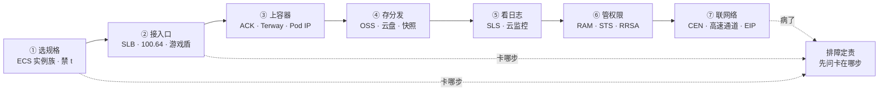
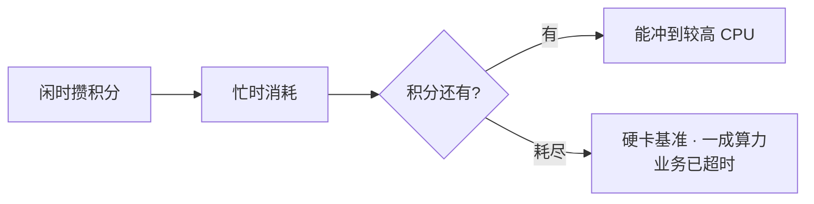
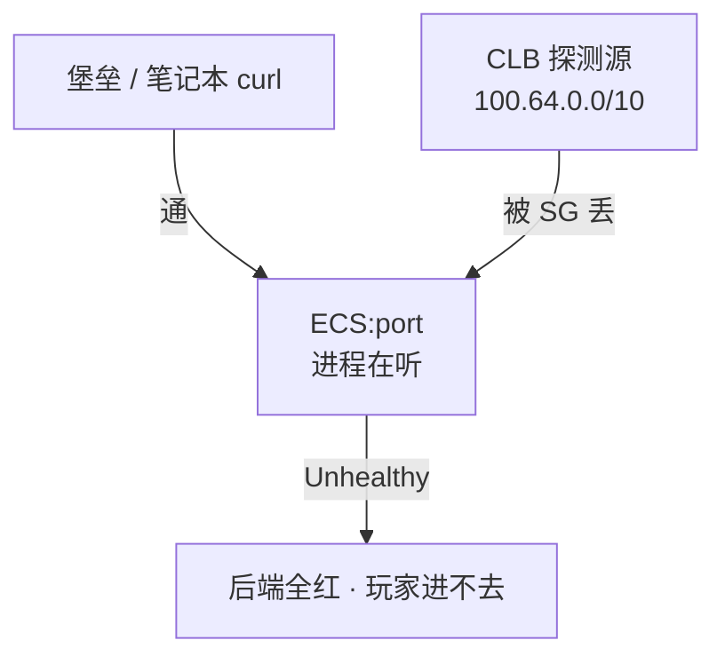
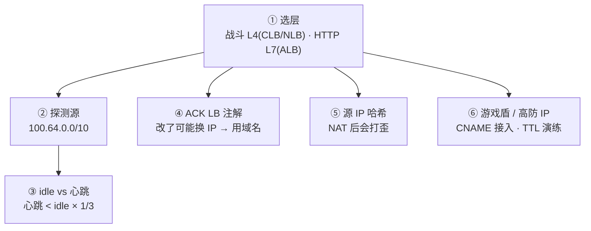
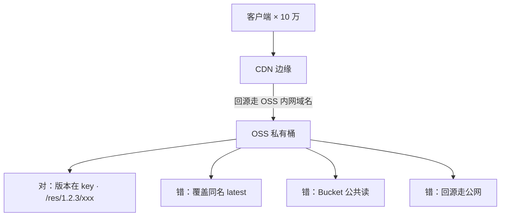
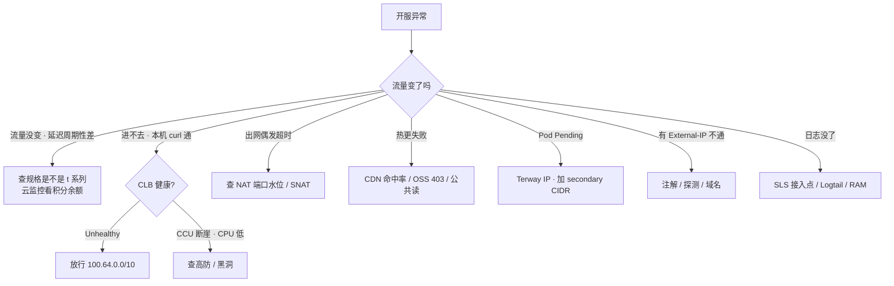

# 阿里云生产

> 大家好，欢迎来到这次分享。开讲之前，先带大家回到一个现场：
> 开服当天，网关 P99 每 20 分钟抬一截，`top` 看不到打满。另一边 CLB 全红，本机 curl 全 200。群里有人要升配加 CPU，另有人要重启逻辑服。
> 这一章讲完，你会知道当时「升配加 CPU」和「重启逻辑服」各自错在哪，以及 t 系列积分、CLB 100.64 探测该怎么一眼定责。
> **本章回答的问题**：一个游戏服在阿里云上从选规格到排障会踩什么坑——每段只讲阿里特有的产品名和坑。
> **本章不讲**：VPC / SG / NACL / 高防 / WAF 通用概念 → [01](../01-云网络与安全/)；RDS 多 AZ / 备份 RPO / 云 Redis → [03](../03-云存储与数据库/)；包年 / 按量 / 流量费 → [05](../05-成本治理/)；RAM 求值 / 多账号 → [04](../04-IAM与多账号/)；AWS / 火山对照 → [07](../07-AWS生产/)、[08](../08-火山引擎生产/)、[09](../09-多云对照/)。

**标记**：🎯重点 · 🔥难点 · ⭐常考 · 🔧实操

**怎么听这场分享**：先把第一节「游戏服在阿里云上的落地」七步看熟——选规格→接入口→上容器→存分发→看日志→管权限→联网络；第二到第七节一站一节，第八节专门讲开头那个开服 P99 现场怎么定责。每一节讲完会提示对应练习题，趁热打铁。

---

## 一、一张图：游戏服在阿里云上的落地

> 🎯 **一句话**：游戏服在阿里云上就七步——选规格、接入口、上容器、存分发、看日志、管权限、联网络；出问题先问「卡在哪一步」，不是先重启。



**读图**：主线是游戏服落地阿里云的七步，每步只讲阿里特有的产品名和坑。通用概念（VPC / SG / NAT / 高防 / 多 AZ）在 [01](../01-云网络与安全/) 讲过，本章不重复。排障时按这七步逐段问「卡在哪步」，不是先重启逻辑服。


好，主图装进脑子了。接下来从「选规格」开始——ECS 实例族与突发性能坑。

本节对应练习题 Q1、Q2。

---

## 二、选规格：ECS 实例族与突发性能坑 🎯⭐🔥

🔥 大白话：**t 系列是「积分信用卡」**——积分耗尽就限速，top 不一定打满。开服网关别用 t 顶一天。

> 🎯 **一句话**：ECS 规格族决定算力特征，突发性能实例 t 系列积分耗尽是硬限速不是变慢——游戏禁 `ecs.t*`。

### 实例族：g / hfc / c / r

**ECS 实例族**（阿里云对 EC2 实例类型的叫法）按算力特征分家，选错族比选错大小严重：

- **g（通用型）**：CPU 和内存均衡，网关、逻辑服默认选这个。
- **hfc（高主频型）**：单核频率高，帧同步 / 频繁小包的游戏首选。
- **c（计算型）**：CPU 多、内存比低，匹配服、战斗计算节点。
- **r（内存型）**：内存带宽和容量，Redis / 单机缓存。

> 💡 **打个比方**：t 系列像「透支信用卡 CPU」——积分花完不是变慢，是直接限速到 baseline，P99 每 20 分钟抬一截像心跳。g / hfc 是「全额付款」，有多少花多少，不透支。

### 突发性能实例：t 系列积分机制 🔥

**突发性能实例（burstable performance instance）**是 t 系列（`ecs.t6` / `ecs.t5`），靠 **CPU 积分**运行：闲时攒积分，忙时消耗。积分耗尽后 CPU 被硬限制在**基准性能（baseline）**，常见 10%–20% 量级——不是「稍微慢一点」，是硬卡到一成算力。游戏帧逻辑超时、GC 变长，`top` 还看不到打满。



**读图**：积分有就能冲，耗尽就硬卡。打满是利用率贴 100%、`top` 能看到忙；积分耗尽是利用率被卡在低基准、`top` 看不到打满——这是区分两者的唯一判据。

某卡牌开服，网关买了 t6「先顶一天」。流量曲线平稳，P99 却每 20 分钟抬一截。云监控看 **CPU 积分余额**周期性掉光、回血、再掉光——根因是规格族选错，不是代码问题。

```bash
# 云监控看 CPU 积分余额，不要只看 top
# 控制台路径：云监控 → 主机监控 → CPU 积分余额
# ← 周期性掉光 = t 系列积分耗尽，不是打满
```

止血：立刻变配到 g / hfc（注意变配约束——部分规格只能**停机变**，t → g 常要换规格族）。活动窗口不够就新开 g 规格实例迁流量。治理：Terraform 禁止 `ecs.t*`；开服模板白名单只允许 g / hfc / c / r。

> ⚠️ **别混**：积分耗尽（利用率被卡在低基准，`top` 看不到忙）≠ CPU 打满（利用率贴 100%，`top` 能看到忙）。卡住先看规格族是不是 `ecs.t*`，不要先优化代码。

### 抢占式实例（Spot）

**抢占式实例**是按量付费的竞价实例，价格低但**回收窗口短、不可控**。给 CI、跑批、压测流量发生器可以；**不要给有状态逻辑服**——回收时踢人不可控。包年包月给基线 CCU，按量给活动峰值。

### 云盘 / ESSD / 快照 / 自定义镜像 🔧

**云盘**是阿里云的块存储产品。**ESSD（ESSD PL0/PL1/PL2/PL3）**是增强型 SSD，按性能级别分档，PL 越高 IOPS 和吞吐越高。系统盘云盘即可；数据盘看 IOPS 选 ESSD 级别。本地盘性能好但实例释放即没，游戏服状态应在 Redis / RDS 而不是本地盘。

**快照**是云盘的数据备份，可用来恢复云盘或创建自定义镜像。生产建议：系统盘做快照模板，数据盘按业务做快照策略。快照是按容量计费的——不需要每盘每天快照，按 RPO 决定频率。**自定义镜像**可把一台 ECS 的系统盘做成模板，批量开服时用——但镜像里的 AK 和临时配置要清理，否则等于把密钥分发到每台机器。

**ESS弹性伸缩（Auto Scaling）**按规格模板和伸缩规则自动增删 ECS 实例。游戏活动扩容可以用，但注意四个坑：

- 伸缩组配的规格模板不能含 t 系列（突发规格积分耗尽会在活动中卡顿）。
- 弹性伸缩创建的实例要绑 RAM 角色而不是 UserData 写 AK——AK 进脚本等于分发密钥。
- 冷却时间要匹配业务启动时间，否则还没起来就被缩回去了。
- 伸缩规则按 CCU 或 CPU 触发时，注意积分型规格的 CPU 不可信——t 系列积分耗尽时 CPU 反而很低，伸缩规则可能误判「不忙」不扩容。

> 💡 **打个比方**：ESS 伸缩组像「临时工调度」——你要给的是岗位说明书（自定义镜像 + 规格族）、门禁卡（RAM 角色）、到岗时间（冷却时间）。三样少一样，临时工来了干不了活、进不了门、或还没坐热就被送走了。

变配坑补充：部分规格只能**停机变**（实例关机后变配），t → g 常要换规格族不能原地升。活动窗口不够就新开 g 规格实例迁流量，不要赌在线变配一定成功。24 核以上规格的网卡带宽有基线保障，小规格的突发网卡带宽同理于 CPU 积分——游戏网关 PPS 高时也要看网卡规格。

> 📝 **面试**：「游戏禁 `ecs.t*`，突发性能积分耗尽是硬限速不是变慢；抢占式不给逻辑服；开服模板白名单 g / hfc / c / r；ESS 伸缩组规格模板要禁 t、绑角色、冷却时间匹配启动。」


规格讲完。大家想想：top 看不到打满，是不是就该升配？很多人会答「是」——⭐ 这是高频错答，先查 t 系列积分。

本节对应练习题 Q1、Q2。

---

## 三、接入口：SLB 选型与 100.64 探测源 🎯⭐🔥🔧

大家想想：本机 curl 全 200、CLB 全红，是不是业务挂了？很多人会答「是」——错了。⭐ 先查探测源 `100.64.0.0/10` 是否放行。

> 🎯 **一句话**：战斗长连接走 CLB / NLB（四层），HTTP 登录支付走 ALB（七层）；CLB 健康检查源是 `100.64.0.0/10`，后端 SG 没放就本机通、LB 全红。

### CLB vs NLB vs ALB

**SLB（Server Load Balancer）**是阿里云负载均衡的统称，下分三个产品：

| 维度 | CLB / NLB（四层） | ALB（七层） |
|------|-------------------|-------------|
| 协议 | TCP / UDP，不解析 payload | HTTP / gRPC / WebSocket |
| 游戏长连接 | **首选** NLB，PPS / 延迟更好 | **不适合**非 HTTP 战斗连接 |
| 灰度 | 四层基本没有 | Header / 路径 / 权重 |
| WAF | 不挂自定义 TCP | 登录 / 支付走这里 |

CLB 是传统型（四 / 七层都支持但性能弱），NLB 是纯四层超高性能，ALB 是纯七层。选错的典型事故：把自定义 TCP 战斗协议接到 ALB，空闲超时、健康检查按 HTTP 来、解析失败，表现为随机断线。区分标准就是「这个连接是不是 HTTP 握手起手」。

> ⚠️ **别混**：标准 HTTP 升级的 **WebSocket** 可以挂 ALB（ALB 支持 WS 升级），但 idle 仍要 ≥ 心跳 × 3；**自定义二进制 TCP**（非 HTTP 起手）ALB 根本解析不了，必须走 CLB / NLB。

### 100.64.0.0/10：CLB 健康检查源 🔥

> 💡 **打个比方**：CLB 探测源 `100.64.0.0/10` 像「专用快递员」——你从堡垒 curl 通不等于 LB 通，后端 SG 没放这条 CIDR，LB 探测全部失败，后端一片红。

CLB / NLB 的健康检查流量来自 `100.64.0.0/10`（阿里云保留的链路本地段）。后端 ECS 的安全组必须放行这个段到业务端口，否则控制台显示「实例运行中、监听全红」——`curl 127.0.0.1:port` 却全 200。



**读图**：你的 curl 和 CLB 的探测是两条完全不同的路径。本机 curl 只证明进程在听，不证明探测路径通。CLB 按检查失败摘流，业务端口对办公网开放也没用。

```bash
curl -v 127.0.0.1:$port
# * Connected ... 200 OK   # ← 本机通，但 CLB 控制台仍 Unhealthy
# ← 止血：SG 放行 100.64.0.0/10 到业务端口，看 Healthy 再收紧
```

Terraform 里后端 SG 要显式写 `source_cidr = "100.64.0.0/10"`，控制台也有「允许负载均衡探测」开关——漏了就开服前 30 分钟全红。火山引擎**禁止照抄 `100.64`**，每家探测源不同（[08](../08-火山引擎生产/)）。

> 🔍 **现场**：CLB 控制台 → 监听 → 健康检查 → 查看后端服务器状态。Unhealthy 的后端，点进去看健康检查日志——如果显示「连接超时」但本机 curl 通，就是探测源被拦。如果显示「HTTP 404」或「状态码不匹配」，是七层检查路径或状态码写错。

七层检查还要正确的 URL 路径和状态码。有状态服的健康检查过严会踢人：检查打到会阻塞的业务线程，瞬时变慢被摘流，正在打的玩家被踢到另一台——检查口要轻、与业务线程隔离，最好用独立健康检查端口。

### CLB idle vs 心跳 🔧

CLB TCP 连接有空闲超时（idle timeout），默认往往短于游戏心跳。连接静默超过 idle，CLB 主动 FIN / RST，应用无崩溃。止血：心跳改 < idle 的 **1/3**，或调大 CLB idle（有上限），两端一起改。UDP 监听要确认产品是否真支持（老 CLB 有 UDP 限制），不支持就换 NLB。

> 💡 **打个比方**：CLB idle 像「教室自动熄灯」——没人动（静默）超过 idle 时间，灯就灭了（FIN/RST）。心跳就是「有人举手」，只要在 idle 内举手灯就不会灭。心跳 5 分钟、idle 60 秒——灯灭了你还在自习，下次举手才发现教室黑了。

> 🔍 **现场**：CLB 控制台 → 监听 → idle timeout 配置项。抓包 `tcpdump -i any port $port` 看 FIN/RST 来源——是 CLB 发的（源不在 ECS）= idle 超时，不是进程崩溃。

```text
14:30:00 ... idle 到期, CLB → 后端 FIN/RST   # ← CLB 静默拆
14:30:00 ... 后端进程仍在, 无异常退出         # ← 进程没挂
14:35:00 ... 客户端发心跳, 才发现连接已断   # ← 玩家以为还在线 5 分钟
```

### ACK Service LoadBalancer 注解换 IP

ACK 里创建 `type: LoadBalancer` 的 Service 会自动开 CLB / NLB。**改注解（规格、付费类型、健康检查）可能重建 LB，地址会变**——客户端若写死 IP 全军覆没，必须用域名。常见踩坑注解：`service.beta.kubernetes.io/alibaba-cloud-loadbalancer-spec` 改规格、`service.beta.kubernetes.io/alibaba-cloud-loadbalancer-charge-type` 改付费类型。改任一个都可能触发 LB 重建。

```bash
kubectl get svc -A | grep LoadBalancer
# ack-ingress-nginx  ... LoadBalancer  172.16.x.x  ...  a1b2c3.cn-hangzhou.slb...
# ← EXTERNAL-IP 必须进 DNS，禁止写进客户端
```

### 源 IP 会话保持：NAT 后会打歪

四层会话保持按源 IP 哈希。运营商 NAT 后大量玩家同一出口 IP，会全部打到同一后端——开服时出现单机 CCU 畸形高、其他机器空转。此时要在接入层做**连接级调度**，不能指望源 IP 哈希。关掉会话保持，新连接可以打散；已有长连接还在旧后端。有状态战斗服本来就该在接入层做连接级调度和 reconnection，不要把亲和全押在源 IP 哈希上。

### 游戏盾 / DDoS 高防 IP

阿里云的 DDoS 防御产品链：**DDoS高防IP**（T 级清洗，CNAME 接入）、**游戏盾**（专门针对游戏，智能调度多个高防 IP 隐藏源站）。通用概念（清洗 vs 黑洞、源站隐藏）在 [01](../01-云网络与安全/) 讲过，这里只讲阿里特有的产品名和坑：游戏盾的 SDK 要在客户端集成，非 SDK 接入退化为普通 DDoS高防IP；高防 CNAME 切换的 RTO 取决于 DNS TTL，提前演练。游戏盾多 IP 智能调度，客户端 SDK 自动选最优入口，比单 IP 高防切换更快但接入成本高（要改客户端）。

### 收束：阿里云入口凭什么接对



**读图（分组）**：①是入口决策（L4 / L7 分流）；②③是健康检查和心跳对齐（100.64 探测源 + idle / 心跳比）；④⑤是 ACK 和会话保持的坑（注解换 IP + NAT 打歪）；⑥是防御产品（游戏盾 SDK / 高防 CNAME）。一张图记住：层选错 + 探测源没放 + 心跳对不齐，是阿里云入口的三大经典事故。

> ⚠️ **别混**：这套机制**不保证**「同名 SLB 跨云默认值一样」（阿里 CLB idle 和 AWS NLB 不同）、**不保证**「源 IP 哈希能均匀分流」（NAT 后会歪）、**不保证**「ALB 能解析自定义 TCP」（只能 HTTP）、**不保证**「游戏盾非 SDK 接入也能智能调度」（退化为普通高防 IP）。

> 📝 **面试**：「战斗长连接走 CLB / NLB，HTTP 走 ALB；CLB 探测源 `100.64.0.0/10` 后端 SG 必须放；心跳 < idle 的 1/3；ACK LB 用域名不用 IP；源 IP 哈希 NAT 后会打歪单机 CCU。」


接入口讲完。记住口诀：**本机通、CLB 红 → 先查 100.64 探测源与探活路径**。

本节对应练习题 Q3、Q4、Q5。

---

## 四、上容器：ACK 与 Terway 🎯⭐🔥

🔥 Terway 吃的是 VPC IP；IP 耗尽 = Pod insufficient，不是镜像坏了。开服前先算地址余量。

> 🎯 **一句话**：ACK 托管 Master / etcd，你管节点池、Terway、升级窗口、RPO；Terway 按 Pod 占 VPC IP，节点池划 `/24` 是经典事故。

### ACK 托管了什么、你还管什么

**ACK（阿里云容器服务 Kubernetes）**托管 Master 和 etcd，你 ssh 不进控制面节点。但你仍负责：节点池规格（禁 t）、网络插件（Terway / Flannel）、插件兼容、升级窗口（避开开服日）、备份 RPO、Event / Webhook、业务停变更。控制面升级期间 API 可能抖，GitOps / HPA 会受影响。和 AWS EKS 同一个模型：厂商管控制面，影响面仍是你的业务。

> 💡 **打个比方**：ACK 像「物业管电梯和消防」——你仍管房间装修（节点池）、住户数量（Pod IP）、搬家时间（升级窗口）。托管不等于不用懂，ssh 不进 etcd 机器，但停变更的仍是你的业务。

### Terway vs Flannel 🔥

| 维度 | Terway | Flannel |
|------|--------|---------|
| Pod IP | 进 VPC 平面，**每个 Pod 占一个 VPC IP** | Pod IP 与 VPC 不在同一平面 |
| 连 RDS | SG 可直接放 Pod / 节点网段 | 要 SNAT 或额外转发 |
| 代价 | 吃 VPC IP，节点池 `/24` 会耗尽 | 排障多一跳，出 VPC 常 SNAT |

游戏生产常用 Terway，前提是 CIDR 按 Pod 数规划。活动扩容时节点池加机器，新 Pod Pending，Events 写 `insufficient IP`——系统里是 Terway 按 Pod 占 VPC IP，交换机可用 IP 接近 0。

```bash
kubectl describe po <pending-pod>
# Events:
#   Warning  FailedScheduling  ... insufficient IP      # ← 子网 IP 耗尽
#   Normal   Scheduled          ... failed to assign IP
# ← 止血：加 secondary CIDR 或新子网，不缩节点、不改已对等生产网段
```

规划时按**峰值 Pod × 1.5** 预留 IP（[01](../01-云网络与安全/)）。64 台 × 30 Pod 要 1920 个 IP，`/24` 只有 254 个——这是经典事故。规划公式：节点数 × 单节点 Pod 上限 × 1.5 = 需要的 IP 数。254 < 1920，所以要给节点池至少 `/22`（1022 地址）或更大的 CIDR。同时要考虑 Pod 重建时新旧 Pod 短暂共存（新 Pod 起新 IP、旧 Pod 还占着旧 IP），IP 用量会临时比稳态高。

### RRSA：Pod 扮 RAM 角色

**RRSA（RAM Roles for Service Accounts）**让 ACK Pod 通过绑定的 ServiceAccount 扮演 RAM 角色，获取 STS 临时凭证访问 OSS / SLS 等。和 AWS IRSA 同一个模型，只是名字不同。RRSA 的信任策略限制到具体的 SA（`system:serviceaccount:namespace:sa-name`），只有指定 SA 的 Pod 才能扮这个角色——比节点角色更细粒度。

> ⚠️ **别混**：**RRSA 绑到具体 SA** vs **节点 RAM 角色**——节点角色一宽，任意 Pod 都能调 API，等于没做隔离。RRSA 让 Pod 以自己的 SA 身份拿临时凭证，不把 AK 放进 Secret。一个「万能 OSS 角色」挂全部 Pod 等于没做隔离。

### ECI 与有状态服

**ECI（Elastic Container Instance）**是阿里云的 Serverless 容器，适合突发无状态任务（跑批、一次性 Job），**不适合有状态战斗服**——要稳定节点、内核参数、可预期的摘流。有状态游戏服上 ACK 要 PDB、优雅下线、session 迁移。云上特有坑：滚动时 SLB 摘流慢于 Pod 退出，或健康检查过快把正在 drain 的节点打成 Unhealthy 又打回去。

> 💡 **打个比方**：ECI 像「日租房」——适合临时住一晚的旅客（Job / 跑批），不适合长住要装家具的住户（战斗服）。战斗服要固定门牌（Pod 不漂）、装修（内核参数）、能预期搬家时间（优雅下线）。

### 有状态服可以不上 ACK

不是所有游戏服都要上 K8s。有状态战斗服常故意留在 ECS 上，理由：

- **优雅下线**：战斗结束才踢人，不接受 Pod 被强制驱逐。
- **内核参数**：TCP somaxconn、fd limit、UDP buffer 要固定调优，ECS 直接 `/etc/sysctl.conf` 改，ACK 节点要 Kubelet 加 systemd drop-in 或 DaemonSet。
- **固定容量**：战斗服按房间数算容量，不像无状态 API 可以 HPA 弹性伸缩——固定台数比弹性伸缩更好管。
- **SLB 摘流时序**：K8s 滚动更新时 Pod 退出和 SLB 摘流有时序差，ECS 直接摘 SLB 后端更可控。

能上 ACK 的是大厅、登录、匹配、GM HTTP API——无状态、可弹性、可滚动。答「K8s 万能」会偏。

> 📝 **面试**：「ACK 托管 Master / etcd，节点池 / Terway / 升级窗口 / RPO 仍是你的；Terway 按 Pod 占 VPC IP，`/24` 会耗尽；RRSA 绑 SA 不用节点万能角色；ECI 不适合战斗服；有状态服可以不上 ACK。」


容器讲完。存与分发：OSS 与云盘。

本节对应练习题 Q6、Q13。

---

## 五、存与分发：OSS 与云盘 🎯⭐

> 🎯 **一句话**：热更包放 OSS 私有桶 + CDN 内网回源，不放 ECS 磁盘；Bucket 公共读或回源走公网 = 账单炸。

### OSS 对象存储

**OSS（Object Storage Service）**是阿里云的对象存储服务。热更包、资源、日志归档放 OSS，**不要放 ECS 磁盘当下载源**——开服当天十万客户端拉 200MB 包，ECS 网卡和 NAT 会先死。云盘是块设备绑实例，吞吐有上限，没有边缘节点。



**读图**：CDN 扛边缘，OSS 扛源。对的做法是客户端 → CDN → OSS 内网域名（私有桶，版本在 key 里）。错的三个：覆盖同名不刷新、公共读被爬虫拖包、回源走公网 = 账单打穿。

生产配置四条：① Bucket 私有，CDN 用回源鉴权；② 回源走 **OSS 内网域名**（同地域，不经公网）；③ 生命周期：热更包 30 天标准 → 低频，日志 7 天标准 → 归档，规则按前缀；④ 版本号在对象键里，发新包不覆盖旧 key，覆盖同名必须刷新 CDN。

生命周期规则按前缀拆：`/res/` 热更包 30 天标准 → 低频归档（旧版本不删，留回滚）；`/log/` 日志 7 天标准 → 归档（查近期在标准、查历史在归档）；`/backup/` 快照备份 90 天 → 删除（按合规保留期）。规则不要一刀切——热更包和日志的保留策略完全不同。

CDN 刷新不是瞬时全球一致。强更要「新包可下载」和「版本检查服务已切」**分两步**，留缓存窗口。

> 💡 **打个比方**：CDN 刷新像「通知全国快递站换新货」——你按了刷新按钮，但每个边缘节点从 OSS 拉新包要时间，全球一致不是秒级。强更前先预热（主动推送新包到边缘节点），再切版本检查。

账单日炸：Bucket 公共读或回源走公网 → 立刻私有化 + 内网域名，再查访问日志谁在拖。不要先开会分析。

> ⚠️ **别混**：OSS 公共读 ≠ 私有桶 + CDN 回源鉴权。公共读任何人可读，爬虫拖包账单打穿；私有桶 + CDN 鉴权只让 CDN 边缘回源，客户端拿不到直接 URL。

### 云盘 / ESSD / 快照 / 自定义镜像

云盘和 ESSD 在第二节已介绍。补充快照和镜像的联动：**快照**可以用来恢复云盘或创建**自定义镜像**，自定义镜像可以批量克隆 ECS。开服模板用自定义镜像秒级拉起实例——但镜像里残留的 AK 和临时配置要清理，否则等于分发密钥。ESS 伸缩组的规格模板就是基于自定义镜像 + 实例规格。

> 📝 **面试**：「热更 OSS 私有桶 + CDN 内网回源，版本在 key 不覆盖同名；公共读立刻私有化；自定义镜像清 AK；快照可恢复云盘和创建镜像。」


存储讲完。看日志：SLS 与云监控。

本节对应练习题 Q8、Q9。

---

## 六、看日志：SLS 与云监控 🎯⭐

> 🎯 **一句话**：SLS 管日志，云监控管厂商资源指标，业务黄金指标常自建 Prometheus——三套告警要去重，否则开服夜同时炸。

### SLS 日志服务

**SLS（Simple Log Service，日志服务）**是阿里云的日志产品。链路：采集（Logtail / Sidecar）→ 索引 → 查询 / 告警。对比自建 ES：免集群、按写入和存储计费、和 ACK / ECS 集成快。代价：查询语法和 ES 不同、超大索引成本会悄悄涨、长期归档仍要生命周期。自建 ES 只在查询模型和保留策略 SLS 搞不定时才上。

> 💡 **打个比方**：SLS 像「云上 ES 管家」——你不用建集群、不用管扩容，按写入量和存储量付费。但管家按索引字段收费——你把每个玩家 ID 都建索引，等于给一亿个名字各做一个抽屉，费用自然炸。

### 索引费用与告警去重 🔧

账单爆通常是**全字段索引 + 高基数（玩家 ID 当索引列）+ Debug 全量打生产**。SLS 索引字段要克制，高基数列不做索引。止血：降采样、砍索引字段、开生命周期。

三渠道各有分工，不要混用：

- **云监控**：ECS / SLB / RDS 的 CPU、连接、后端健康数——厂商指标。
- **Prometheus**：业务黄金指标（CCU、登录成功率）——自建或 ARMS。
- **SLS**：日志和访问日志——不要当时序库。

三套告警同时炸 = 没去重。开服夜同一故障云监控告 SLB 异常、SLS 告日志报错飙升、Prometheus 告 CCU 下降——要先去重再查。去重不是关掉两套只留一套，是按故障域分组：入口故障先看云监控 SLB、再查 SLS 网关日志、最后看 Prometheus CCU——三套从不同角度验证同一个故障。

日志突然没了：先看 SLS 接入点流量是否掉零，再查 Logtail 进程、机器组配置、RAM 写权限。没做 ARMS 埋点就不要吹「全链路都在 ARMS」。

> 📝 **面试**：「SLS 管日志，云监控管厂商指标，Prometheus 管业务黄金指标；索引字段克制，高基数不做索引；三套告警去重不是关掉两套，是按故障域分组从不同角度验证同一故障。」

> ⚠️ **别混**：SLS 管日志 ≠ 云监控管指标。SLS 不要当时序库用，查时序用 Prometheus。ECS / SLB / RDS 的厂商指标在云监控，不在 SLS。

> 📝 **面试**：「SLS 管日志，云监控管厂商指标，Prometheus 管业务黄金指标；索引字段克制，高基数不做索引；三套告警去重。」


日志讲完。管权限与联网络。

本节对应练习题 Q9。

---

## 七、管权限与联网络：RAM / STS / CEN 🎯⭐

> 🎯 **一句话**：人走 MFA 扮 RAM 角色，程序走实例 RAM 角色 / RRSA / STS 临时凭证；永久 AK 出现在 Git / 镜像 / 脚本按泄漏处理。

### RAM 角色 / STS / RRSA

**RAM（Resource Access Management）**是阿里云的权限管理。**RAM角色**可被人或实例扮演，扮演后拿到 **STS（Security Token Service）临时凭证**——有时效，过期自动失效。**长期 AK（AccessKey）**是永久密钥，泄漏后没有 ActionTrail 等于无法判断影响面。

| 身份 | 走哪条 | 禁止 |
|------|--------|------|
| 人 | 控制台 + MFA 扮角色 | 根 AK、无 MFA 登录 |
| ECS | 实例 RAM 角色 | UserData 里写永久 AK |
| ACK Pod | **RRSA** 绑 ServiceAccount | 节点角色 `*:*`；AK 进 Secret |
| CI / 开服脚本 | 角色 / STS | 流水线永久 AK |

最小集：按环境拆 RAM 用户组；OSS 按 Bucket 前缀授权；禁止 `*:*`。**ActionTrail** 记录所有 API 调用，`ConsoleSignin` 无 MFA 和 AK 调用失败要告警。开服脚本里发现长期 AK：先当泄漏处理——禁 Key、查 Trail、换角色，不要「开完服再收」。

> 💡 **打个比方**：长期 AK 像「丢了配不配都一样的钥匙」——丢了之后你不知道谁进过门，因为锁不会告诉你。RAM 角色 + STS 像「临时门禁卡」——每次进门发一张，过期自动失效，ActionTrail 记录谁在什么时间用了哪张卡。

> 🔍 **现场**：ActionTrail 控制台搜 `ConsoleSignin` 事件，筛 `MFA AuthType != Kennedy`（无 MFA 登录）；搜 `AccessKey` 调用失败事件，定位被扫描的 AK。发现 AK 在 Git / 镜像里 → 立刻禁 Key → 查 ActionTrail 该 Key 的调用记录 → 换 RAM 角色。

> ⚠️ **别混**：RRSA 绑到具体 SA vs 节点万能角色——节点角色一宽，任意 Pod 逃逸就能搬空 OSS Bucket。RAM JSON 不能直接粘 AWS IAM 策略，条件键和角色扮演流程不同。模型相同：人走 MFA 扮角色，程序走实例角色 / RRSA。

### CEN / 高速通道 / EIP / NAT 网关

这几个阿里云特有产品名，通用概念在 [01](../01-云网络与安全/) 讲过，这里只记产品名和坑：

**CEN（云企业网，Cloud Enterprise Network）**是阿里云的多 VPC / 多地域互联产品。多 VPC 同账号用对等连接即可；跨账号跨地域才上 CEN。CEN 路由学不会时，宁可少打通，不要把测试 VPC 接到生产 CEN 上「方便调试」。CEN 带宽包按地域对买，跨地域带宽共享；同地域 VPC 互联走 CEN 不收带宽费，但路由条目数有上限。

**高速通道（Express Connect）**是阿里云的专线产品，给 IDC ↔ 云数据面。生产混合云双专线不同运营商 + BGP，单专线是单点——闪断时 DNS / 数据库跨云会双脑或超时。专线带宽和时延可承诺，IPsec / SSL VPN 走公网抖动不可控。专线给数据面，VPN 只保管理面。玩家入站不走专线——玩家在公网连 LB / 高防，专线是 IDC ↔ 云的通道。UDP 丢先测 MTU（封装后 < 1500），通用概念在 [01](../01-云网络与安全/)。

**EIP（弹性公网 IP）**是阿里云的公网 IP 产品，可绑 ECS / SLB / NAT 网关。逻辑服禁绑 EIP，只有 LB / NAT / 堡垒有出入口。逻辑服绑了 EIP 方便调试是常见违规——源站 IP 泄漏后被 DDoS 直打，高防保护不到（[01](../01-云网络与安全/)）。生产治理：定期扫 EIP 绑定，逻辑服 EIP 一律回收。

**NAT 网关**（NAT网关）是阿里云的 SNAT 产品，只服务私网出公网。玩家入站不走 NAT 网关。一个 NAT IP 约 6 万源端口，SNAT 端口耗尽时偶发 `connect timeout`——查 NAT 网关端口水位，不是改安全组。多 AZ 部署时每 AZ 一个 NAT 网关，路由表走「本 AZ NAT」，避免单 AZ NAT 成为单点。

> ⚠️ **别混**：NAT 网关只给私网出公网（拉镜像、调支付、告警 webhook），玩家入站走 LB / 高防。把下载流量绕 NAT 网关会把账单和处理费一起打穿（[05](../05-成本治理/)）。

> 📝 **面试**：「程序用 RAM 角色 / RRSA / STS，不用长期 AK；CEN 跨账号跨地域才上，别把测试 VPC 接进生产 CEN；EIP 只绑 LB / NAT / 堡垒，逻辑服禁 EIP。」


现在再看群里「升配 / 重启逻辑服」，你知道该怎么拦住他了。

本节对应练习题 Q7、Q10、Q11。

---

## 八、作战：定责 🎯⭐🔧

> 🎯 **一句话**：阿里云故障先问「卡在哪步」——积分型看规格，CLB 全红放 100.64，Pod Pending 加网段，账单炸先私有化——不要先重启逻辑服。



**读图**：第一刀永远是「流量变了吗」——没变就查规格（t 系列积分），变了就按现象分叉到七条支线。每条支线写真实现象，不写抽象类别。

排障三连——开服当天最常见的三种故障模式：

- **积分型卡顿**：流量没变、P99 周期性抬、`top` 看不到打满 → 查规格族是不是 t 系列，云监控看 CPU 积分余额。
- **全服进不去、进程还在**：CCU 断崖、CPU 不高、进程在 → 查入口（CLB 探测源 100.64 / 高防黑洞 / SLB Unhealthy）。
- **账单日炸**：OSS 账单突然飙高 → 查 Bucket 是不是公共读 / 回源是不是走公网 → 立刻私有化 + 内网域名。

三种故障的第一刀完全不同——不要看到「玩家进不去」就重启逻辑服。

### 现象 · 先做 · 别做

| 现象 | 先做 | 别做 |
|------|------|------|
| 流量没变、P99 周期性抬 | 查规格是不是 `ecs.t*`；迁 g / hfc | 先给代码加核、假设在线升配 |
| 本机通、CLB 全红 | 放行 `100.64.0.0/10` / 探测开关 | 重启 ECS |
| CCU 断崖、CPU 不高 | 查高防 / 黑洞 | 重启逻辑服 |
| 单机 CCU 畸形高、其它空转 | 四层源 IP 会话保持 + NAT 打歪 | 指望哈希自己打散 |
| OSS 账单炸 | 立刻私有化 + 内网回源，再查日志 | 先开会分析 CDN |
| `insufficient IP` | 加 secondary CIDR / 新子网 | 缩节点；改已对等网段 |
| 改注解后全服连不上 | LB 地址变了，客户端走域名 | 写死 IP |
| 日志突然没了 | 查 SLS 接入点流量 / Logtail / RAM | 先怪业务没打日志 |
| 出网偶发 `connect timeout` | 查 NAT 网关端口水位 | 先改安全组 |

### 60 秒剧本 🔧

```text
0–10s   规格：云监控看 CPU 积分余额；top 看有没有打满    # ← 积分型卡顿 top 骗人
10–30s  入口：CLB 健康检查 / Unhealthy 数               # ← 本机通就放 100.64
30–45s  容器：kubectl get nodes -o wide / Pod Pending   # ← insufficient IP 加网段
45–60s  存储 / 日志：CDN 命中率 / SLS 摄入流量            # ← 路径通就查存储和日志
# ← 60 秒内不动业务进程、不改 0.0.0.0/0、不重启逻辑服
```

开服 5 分钟检查单（按组合查，不要从重启逻辑服开始）：

1. SLB 新建连接、后端 Unhealthy 数（本机通、LB 红 → 放 100.64）
2. 高防是否黑洞（CCU 断崖、CPU 不高）
3. NAT 网关并发端口水位（出网偶发超时、VPC 内正常）
4. RDS 连接数、Redis 带宽水位（[03](../03-云存储与数据库/)）
5. CDN 回源 4xx、命中率（热更失败）
6. SLS 摄入是否掉零（日志突然没了）
7. 规格是不是 t（流量没变、周期性卡顿）

任何一项跳变先止血再查，不要等「全查完再动」。

> 📝 **面试**：「通断先问卡在哪步：积分型查规格、CLB 全红放 100.64、Pod Pending 加网段、账单炸先私有化——不重启逻辑服是因为长连接可能还活着，重启会主动踢在线玩家放大事故面。」


定责剧本齐了。收口把命令、面试口径和数字墙收齐。

本节对应练习题 Q12、Q14。

---

## 九、收口

### 命令速查 🔧

```bash
# 积分型卡顿：云监控看 CPU 积分余额（不在本机 top）
# 控制台路径：云监控 → 主机监控 → CPU 积分余额

# 本机通不等于探测通
ss -lnt && curl -s -o /dev/null -w '%{http_code}\n' 127.0.0.1:$port
# ← 只证明进程在听，不证明 CLB 探测路径通

# ACK 节点池 IP 余量和 LB 是不是域名
kubectl get nodes -o wide
kubectl get svc -A | grep LoadBalancer   # EXTERNAL-IP 必须进 DNS，禁止写进客户端

# Pod Pending 看原因
kubectl describe po <pending-pod>          # insufficient IP = 子网 IP 耗尽

# 抓包确认 CLB idle 拆连接（FIN/RST 来源不在 ECS）
tcpdump -i any "port $port and (tcp[tcpflags] & tcp-fin != 0 or tcp[tcpflags] & tcp-rst != 0)"

# ActionTrail 查 ConsoleSignin 无 MFA
# 控制台路径：ActionTrail → 事件查询 → 事件名 ConsoleSignin → 筛 MFA AuthType
```

### 面试锚点表

遮住右列自问自答，卡壳的行回去重读对应小节——能讲出来才算会，看着答案点头不算。

| 问 | 30 秒答 |
|----|---------|
| ECS t 系列为什么禁？ | 突发性能积分耗尽是硬限速到基准（10%–20%），`top` 看不到打满；游戏禁 `ecs.t*`，用 g / hfc。 |
| 实例族怎么选？ | 逻辑服 / 网关 g / hfc，匹配 c，Redis r；抢占式只给 CI / 压测不给逻辑服。 |
| CLB / NLB / ALB 怎么选？ | 战斗长连接走 CLB / NLB（四层），HTTP 登录支付走 ALB；自定义 TCP 接 ALB 会随机断线。 |
| CLB 后端全红本机 200？ | 健康检查源 `100.64.0.0/10` 没放行；放探测源，不重启 ECS。火山不能抄 100.64。 |
| ACK 托管了什么？ | Master / etcd 阿里管；节点池 / Terway / 升级窗口 / RPO 是你的；ssh 不进 etcd 但停变更是你的业务。 |
| Terway vs Flannel？ | Terway Pod IP 进 VPC，SG 好写但吃 IP，`/24` 会耗尽；Flannel 出 VPC 多一跳 SNAT。 |
| RRSA 和节点角色差在哪？ | RRSA 绑到具体 SA，Pod 扮 RAM 角色；节点角色一宽任意 Pod 调 API。 |
| 热更为什么 OSS + CDN？ | ECS Nginx 扛不住开服十万客户端；OSS 私有桶 + CDN 内网回源，版本在 key 不覆盖同名。 |
| SLS 和云监控怎么分？ | SLS 管日志，云监控管 ECS / SLB / RDS 厂商指标，业务黄金指标用 Prometheus；三套告警去重。 |
| 程序能用长期 AK 吗？ | 不能，ECS 用 RAM 角色，ACK 用 RRSA / STS，CI 用角色；AK 进 Git / 镜像按泄漏处理。 |
| CEN 什么时候用？ | 跨账号跨地域多 VPC 互联；同账号用对等连接即可；别把测试 VPC 接进生产 CEN。 |
| 改 ACK LB 注解会怎样？ | 可能重建 LB 换 IP，客户端必须走域名。 |
| ESS 伸缩组注意什么？ | 规格模板禁 t；绑 RAM 角色；冷却时间匹配业务启动；t 系列 CPU 不可信会误判不扩容。 |
| 快照和自定义镜像？ | 快照恢复云盘或创建自定义镜像；镜像里残留 AK 要清理；ESS 模板基于自定义镜像。 |
| 有状态服上 ACK 吗？ | 可以不上——ECS 摘 SLB 后端更可控；内核参数 / 优雅下线 / 固定容量在 ECS 上更好管。 |
| 高速通道给谁走？ | IDC ↔ 云数据面，玩家不走专线；双专线 + BGP，单专线是单点；UDP 丢先测 MTU。 |

### 易错一句话对照

- 游戏可以用 t 系列先顶一天 → 积分耗尽硬卡基准，`top` 看不到打满
- 抢占式给逻辑服省钱 → 回收不可控，踢人不可控
- 自定义 TCP 接 ALB 做灰度 → ALB 只认 HTTP，长连接走 CLB / NLB
- 本机 curl 通说明 CLB 一定绿 → 必须放行 `100.64.0.0/10`
- ACK 托管了就不用关心备份 → 停变更的是你的业务，问清 RPO
- Terway 省心所以节点池 `/24` 够 → 按峰值 Pod × 1.5 留 IP
- ECI 能跑战斗服 → 要稳定节点、内核、可预期摘流
- 有状态服必须上 K8s → 可以不上 ACK，ECS 摘 SLB 后端更可控
- 节点角色给 OSS `*`，Pod 就不用 RRSA → 任一 Pod 逃逸搬空桶
- 长期 AK 放开服脚本开完再收 → 先当泄漏：禁 Key、查 Trail
- 热更放 ECS + Nginx → 开服打满网卡和 SNAT
- Bucket 公共读省事 → 爬虫拖包，账单打穿
- 覆盖 latest 不用刷新 CDN → 缓存窗口；强更分两步
- 改 SLB 注解 IP 不会变 → 可能重建 LB，客户端走域名
- 四层会话保持能打散运营商 NAT → 同一出口 IP 打到单机
- 火山也能抄 100.64 → 每家探测源不同
- SLS 当时序库用 → 查时序用 Prometheus
- 自定义镜像直接用不清理 → AK 分发到每台机器
- 同账号多 VPC 也上 CEN → 对等连接即可，别接测试 VPC 进生产 CEN
- ESS 伸缩组配 t 系列 → 积分耗尽时 CPU 反而低，伸缩规则误判不扩容

### 数字墙

> CPU 积分基准 **10%–20%** · CLB 探测源 **100.64.0.0/10** · 一个 NAT IP ≈ **6 万**源端口 · 心跳 < idle × **1/3** · 峰值 Pod × **1.5** 留 IP · `/24` = **254** 地址 · 热更包 **30 天**标准 → 低频 · 日志 **7 天**标准 → 归档 · 快照备份 **90 天** → 删除 · Redis 水位 **< 70%** · STS 临时凭证 **有时效** · 高速通道封装 MTU **< 1500**

---

## 术语速查

- **ECS**：阿里云的弹性计算服务（Elastic Compute Service），即虚拟机。下分实例族（g / hfc / c / r / t）。
- **突发性能实例**：t 系列，靠 CPU 积分运行，积分耗尽硬卡基准。也叫突发规格。
- **SLB**：阿里云负载均衡统称，下分 CLB（传统型）、NLB（四层高性能）、ALB（七层）。
- **健康检查源 `100.64.0.0/10`**：CLB / NLB 探测后端用的保留网段，后端 SG 必须放行。
- **ACK**：阿里云容器服务 Kubernetes，托管 Master / etcd。
- **Terway / Flannel**：ACK 的两种 CNI 插件。Terway Pod IP 进 VPC，Flannel 不进。
- **RRSA**：RAM Roles for Service Accounts，ACK Pod 扮 RAM 角色。
- **OSS**：对象存储服务（Object Storage Service），阿里云的 S3。
- **SLS**：日志服务（Simple Log Service），阿里云的托管日志平台。
- **RAM**：资源访问管理（Resource Access Management），阿里云的 IAM。
- **STS**：安全令牌服务（Security Token Service），发临时凭证。
- **CEN**：云企业网（Cloud Enterprise Network），多 VPC / 多地域互联。
- **高速通道**：Express Connect，阿里云的专线产品。
- **ESS**：弹性伸缩（Auto Scaling），按模板自动增删 ECS。
- **EIP**：弹性公网 IP（Elastic IP），可绑 ECS / SLB / NAT 网关。
- **NAT 网关**：阿里云的 SNAT 产品，私网出公网。
- **ESSD**：增强型 SSD（Enhanced SSD），按 PL0/PL1/PL2/PL3 分档。
- **游戏盾**：阿里云游戏专用 DDoS 防御，SDK 接入，多 IP 智能调度。
- **DDoS高防IP**：阿里云通用 T 级 DDoS 清洗，CNAME 接入。
- **云监控**：阿里云的厂商资源监控（CloudMonitor），ECS / SLB / RDS 指标。
- **ActionTrail**：阿里云的操作审计日志，记录所有 API 调用。

---

## 合上书

学到这里，先别急着翻下一章。合上书，试试下面这几件事能不能做到——能做到，这章才算真的听懂了。卡住的那一条，就回到对应的小节再听一遍：

- [ ] **默画**游戏服在阿里云上的落地七步图（选规格 → 接入口 → 上容器 → 存分发 → 看日志 → 管权限 → 联网络），标出每步的阿里特有产品名。
- [ ] **口述选规格**：实例族 g / hfc / c / r 怎么选；突发性能 t 系列积分耗尽和 CPU 打满怎么区分；抢占式不给逻辑服；ESS 伸缩组注意什么。
- [ ] **默画** CLB / NLB vs ALB 对比（层 / 游戏长连接 / 灰度 / WAF），标出自定义 TCP 接 ALB 会怎样、`100.64.0.0/10` 是什么、本机通 LB 全红先放什么。
- [ ] **口述接入口**：CLB idle vs 心跳怎么对齐；ACK LB 注解为什么可能换 IP；源 IP 会话保持 NAT 后会怎样；游戏盾和高防 IP 的产品定位。
- [ ] **口述上容器**：ACK 托管了什么、你还管什么；Terway vs Flannel 差在哪；`insufficient IP` 怎么办；RRSA 和节点角色差在哪；ECI 为什么不适合战斗服。
- [ ] **口述存分发**：热更为什么 OSS + CDN；私有桶 + 内网域名 + 版本在 key；公共读会怎样；CDN 刷新为什么不是瞬时；快照和自定义镜像怎么联动。
- [ ] **口述看日志**：SLS / 云监控 / Prometheus 各管什么；索引费用为什么会爆；三套告警为什么同时炸。
- [ ] **口述管权限**：人 / ECS / ACK Pod / CI 各走哪条身份；长期 AK 出现在脚本里怎么办；RRSA 和节点万能角色差在哪；CEN 什么时候用。
- [ ] **定责**：开服故障三连（积分型 / CLB 全红 / 账单炸）各先做什么、别做什么；60 秒剧本各敲什么、什么绝不碰。
- [ ] **数字**：闭眼报出关键数字——CPU 积分基准 10%–20% · CLB 探测源 100.64.0.0/10 · NAT IP ≈ 6 万源端口 · 心跳 < idle × 1/3 · 峰值 Pod × 1.5 留 IP · `/24` = 254 地址。
- [ ] **别混**：RRSA 绑具体 SA ≠ 节点万能角色；OSS 私有桶 + CDN 回源 ≠ 公共读；CLB 静默拆连接 ≠ 进程崩溃；ACK 托管 Master ≠ 不用管备份。
- [ ] **口述联网络**：CEN 跨账号跨地域才上，同账号用对等连接；高速通道给 IDC 数据面，玩家不走；EIP 只绑 LB / NAT / 堡垒；NAT 端口耗尽查水位不先改 SG。
- [ ] **口述 ESS 伸缩组四坑**：规格模板禁 t、绑 RAM 角色不写 AK、冷却时间匹配启动、t 系列 CPU 不可信会误判不扩容。
- [ ] **默画**阿里云入口收束图（选层 → 探测源 → idle/心跳 → ACK 注解 → 源 IP 哈希 → 游戏盾），标出三大经典事故。

全部打勾之后，给自己出一个终极测试：找一位同事，十分钟讲清本章开头那个现场——错在哪、正确第一刀是什么。讲得下来，这章才算过关。
