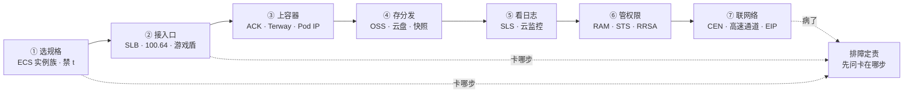
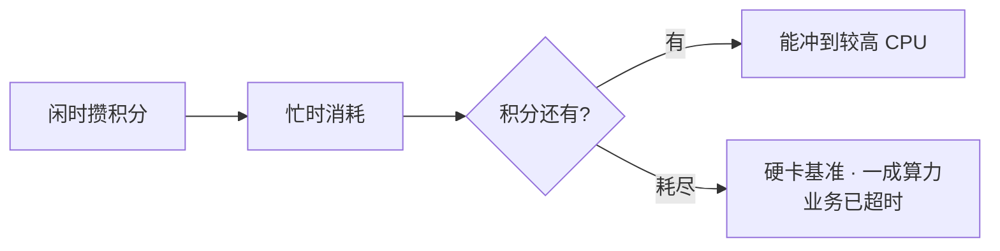
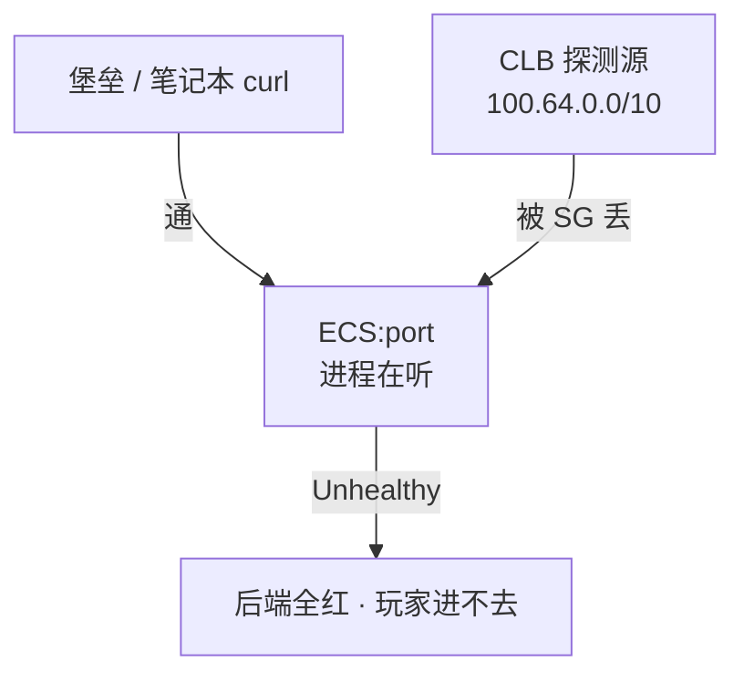
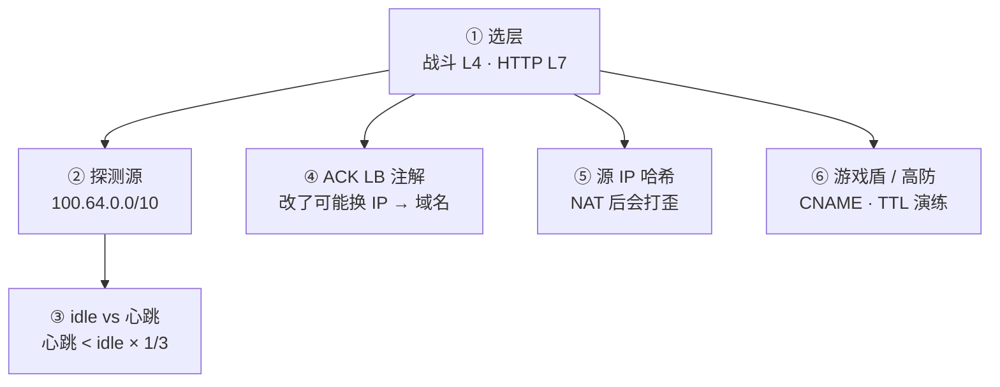
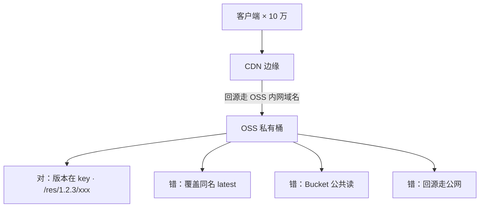
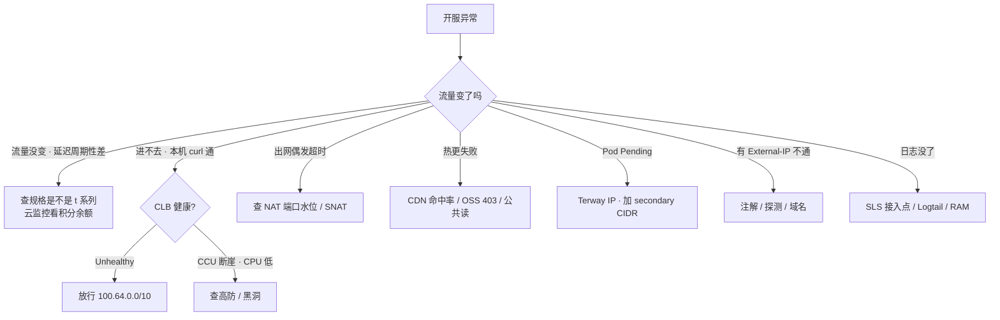

# 阿里云生产

> 开服当天网关 P99 每 20 分钟抬一截，`top` 看不到打满；另一边 CLB 全红，本机 curl 全 200。群里有人要升配加 CPU，另有人要重启逻辑服——两刀都可能打歪。
> **本章回答**：游戏服在阿里云上从选规格到排障会踩什么坑——每段只讲阿里特有的产品名和坑，出问题先问「卡在哪一步」。
> **不讲**：VPC / SG / NACL / 高防 / WAF 通用概念 → [01](../01-云网络与安全/)；RDS 多 AZ / 备份 RPO / 云 Redis → [03](../03-云存储与数据库/)；包年 / 按量 / 流量费 → [05](../05-成本治理/)；RAM 求值 / 多账号 → [04](../04-IAM与多账号/)；AWS / 火山对照 → [07](../07-AWS生产/)、[08](../08-火山引擎生产/)、[09](../09-多云对照/)。

**标记**：🎯重点 · 🔥难点 · ⭐常考 · 🔧实操

---

## 一、一张图：游戏服在阿里云上的落地

> 🎯 **一句话**：七步落地——选规格、接入口、上容器、存分发、看日志、管权限、联网络；出问题先问「卡在哪一步」，不是先重启。



- 📖 **读图**
  - 🛤️ 主线是七步落地，每步只挂阿里特有产品名和坑；通用 VPC / SG / NAT / 高防在 [01](../01-云网络与安全/)
  - 🩹 排障按七步问「卡在哪步」，不是先重启逻辑服（→ 八节）

本节对应练习题 Q1、Q2。

---

## 二、选规格：ECS 实例族与突发性能坑 🎯⭐🔥

> 🎯 **一句话**：规格族决定算力特征；突发性能实例 t 系列积分耗尽是硬限速不是变慢——游戏禁 `ecs.t*`。

### 🖥️ 实例族：g / hfc / c / r

**ECS（Elastic Compute Service）** = 阿里云虚拟机。**实例族**按算力特征分家，选错族比选错大小严重：

- **g（通用型）**：CPU / 内存均衡，网关、逻辑服默认
- **hfc（高主频型）**：单核频率高，帧同步 / 频繁小包首选
- **c（计算型）**：CPU 多、内存比低，匹配服、战斗计算
- **r（内存型）**：内存带宽和容量，Redis / 单机缓存

> 💡 **打个比方**：t 系列像「透支信用卡 CPU」——积分花完不是变慢，是直接限速到 baseline，P99 每 20 分钟抬一截像心跳。g / hfc 是「全额付款」，有多少花多少。

### 💳 突发性能实例：t 系列积分 🔥

**突发性能实例**（`ecs.t6` / `ecs.t5`）靠 **CPU 积分**运行：闲时攒、忙时耗。积分耗尽后 CPU 被硬限制在**基准性能（baseline）**，常见 10%–20%——不是「稍微慢一点」，是硬卡到一成算力。帧逻辑超时、GC 变长，`top` 还看不到打满。



- 📖 **读图**
  - 有积分能冲；耗尽硬卡基准
  - 🔍 **打满** = 利用率贴 100%、`top` 能看到忙；**积分耗尽** = 利用率被卡在低基准、`top` 看不到打满——唯一判据

某卡牌开服网关买了 t6「先顶一天」。流量平稳，P99 每 20 分钟抬一截。云监控 **CPU 积分余额**周期性掉光、回血、再掉——规格族选错，不是代码问题。

```bash
# 云监控 → 主机监控 → CPU 积分余额
# ← 周期性掉光 = t 系列积分耗尽，不是打满
```

- 🩹 **止血**：立刻变配到 g / hfc（部分规格只能**停机变**，t → g 常要换规格族）；活动窗口不够就新开 g 迁流量
- 🛡️ **治理**：Terraform 禁 `ecs.t*`；开服模板白名单只允许 g / hfc / c / r

#### ❓ 为什么 top 看不到打满还卡？

- ❌ 直觉：CPU 没打满 → 升配 / 优化代码
- ✅ 真相：积分耗尽把利用率**钉在低基准**，`top` 永远看不到 100%
- 🔑 先看规格是不是 `ecs.t*`，云监控看积分余额，再谈升配

> ⚠️ **别混**：积分耗尽（利用率卡在低基准）≠ CPU 打满（利用率贴 100%）。卡住先查规格族，不要先优化代码。

### 🏷️ 抢占式 / 云盘 / ESS 🔧

- **抢占式实例**：按量竞价，价格低但**回收窗口短、不可控**——给 CI、跑批、压测可以；**不给有状态逻辑服**
- **云盘 / ESSD（PL0～PL3）**：块存储按性能级别分档；系统盘云盘即可，数据盘看 IOPS 选 PL。本地盘释放即没，状态应在 Redis / RDS
- **快照**：恢复云盘或创建**自定义镜像**；镜像里残留 AK = 密钥分发。快照按容量计费，按 RPO 定频率
- **ESS（弹性伸缩）**四坑：规格模板禁 t；绑 RAM 角色不写 UserData AK；冷却时间匹配启动；t 系列 CPU 不可信会误判「不忙」不扩

> 💡 **打个比方**：ESS 像「临时工调度」——要岗位说明书（镜像 + 规格族）、门禁卡（RAM 角色）、到岗时间（冷却）。少一样就干不了活、进不了门、或还没坐热就被送走。

> 📝 **面试**：「游戏禁 `ecs.t*`，积分耗尽是硬限速；抢占式不给逻辑服；模板白名单 g / hfc / c / r；ESS 禁 t、绑角色、冷却匹配启动。」

本节对应练习题 Q1、Q2。

---

## 三、接入口：SLB 选型与 100.64 探测源 🎯⭐🔥🔧

> 🎯 **一句话**：战斗长连接走 CLB / NLB（四层），HTTP 登录支付走 ALB（七层）；CLB 探测源是 `100.64.0.0/10`，后端 SG 没放就本机通、LB 全红。

### ⚖️ CLB vs NLB vs ALB

**SLB（Server Load Balancer）** 是阿里负载均衡统称：

| 维度 | CLB / NLB（四层） | ALB（七层） |
|------|-------------------|-------------|
| 协议 | TCP / UDP，不解析 payload | HTTP / gRPC / WebSocket |
| 游戏长连接 | **首选** NLB（PPS / 延迟更好） | **不适合**非 HTTP 战斗连接 |
| 灰度 | 四层基本没有 | Header / 路径 / 权重 |
| WAF | 不挂自定义 TCP | 登录 / 支付走这里 |

- CLB = 传统型（四 / 七都有但性能弱）；NLB = 纯四层高性能；ALB = 纯七层
- 选错典型：自定义 TCP 战斗协议接 ALB → 空闲超时、健康检查按 HTTP、解析失败 → 随机断线
- 🔑 区分标准：「这个连接是不是 HTTP 握手起手」

> ⚠️ **别混**：标准 HTTP 升级的 **WebSocket** 可挂 ALB（idle ≥ 心跳 × 3）；**自定义二进制 TCP** ALB 解析不了，必须走 CLB / NLB。

### 🚚 100.64.0.0/10：CLB 健康检查源 🔥

> 💡 **打个比方**：探测源 `100.64.0.0/10` 像「专用快递员」——堡垒 curl 通 ≠ LB 通；后端 SG 没放这条 CIDR，LB 探测全失败、后端一片红。

CLB / NLB 健康检查来自 `100.64.0.0/10`（阿里保留链路本地段）。后端 ECS 安全组必须放行到业务端口，否则控制台「实例运行中、监听全红」——`curl 127.0.0.1:port` 却全 200。



- 📖 **读图**
  - 你的 curl 与 CLB 探测是两条路径；本机通只证明进程在听
  - CLB 按检查失败摘流；业务端口对办公网开放也没用

```bash
curl -v 127.0.0.1:$port
# * Connected ... 200 OK   # ← 本机通，CLB 仍可能 Unhealthy
# ← 止血：SG 放行 100.64.0.0/10 到业务端口
```

#### ❓ 为什么本机 200、CLB 还全红？

- ❌ 直觉：业务挂了 / 重启 ECS
- ✅ 真相：探测源被 SG 丢；进程在听，探针进不来
- 🔑 Terraform 写 `source_cidr = "100.64.0.0/10"`；火山**禁止照抄 100.64**（[08](../08-火山引擎生产/)）

> 🔍 **现场**：CLB → 监听 → 健康检查 → 后端状态。Unhealthy +「连接超时」但本机通 = 探测源被拦；「HTTP 404 / 状态码不匹配」= 七层路径或状态码写错。

- 有状态服探活过严会踢人：检查打到会阻塞的业务线程 → 摘流 → 玩家被踢。检查口要轻、与业务线程隔离，最好独立探活端口

### ⏱️ CLB idle vs 心跳 🔧

CLB TCP **idle timeout** 默认常短于游戏心跳。静默超过 idle，CLB 主动 FIN / RST，应用无崩溃。

- 🩹 心跳改 < idle 的 **1/3**，或调大 CLB idle（有上限），两端一起改
- UDP 监听要确认产品真支持；老 CLB 有 UDP 限制 → 换 NLB

> 💡 **打个比方**：idle 像「教室自动熄灯」——静默超 idle 灯灭（FIN/RST）。心跳是举手；心跳 5 分钟、idle 60 秒——灯灭了你还在自习。

> 🔍 **现场**：抓包 `tcpdump -i any port $port` 看 FIN/RST 来源——源不在 ECS = CLB idle 拆，不是进程崩溃。

```text
14:30:00 ... idle 到期, CLB → 后端 FIN/RST   # ← CLB 静默拆
14:30:00 ... 后端进程仍在, 无异常退出         # ← 进程没挂
14:35:00 ... 客户端发心跳, 才发现连接已断   # ← 玩家以为还在线
```

### 📎 ACK LB 注解 / 源 IP 哈希 / 游戏盾

- **ACK `type: LoadBalancer`**：改注解（规格、付费、健康检查）可能**重建 LB、地址变**——客户端必须用域名，禁止写死 IP
- **源 IP 会话保持**：运营商 NAT 后大量玩家同出口 IP → 全打到同一后端 → 单机 CCU 畸形高。要连接级调度，别全押源 IP 哈希
- **游戏盾 / DDoS高防IP**：清洗 vs 黑洞、源站隐藏见 [01](../01-云网络与安全/)。游戏盾要客户端 SDK；非 SDK 退化为普通高防；CNAME 切流 RTO 看 DNS TTL，提前演练

### 收束：阿里云入口凭什么接对



- 📖 **读图**
  - ① 入口决策（L4 / L7）；②③ 探活与心跳对齐；④⑤ ACK / 会话坑；⑥ 防御产品
  - 三大经典事故：层选错 + 探测源没放 + 心跳对不齐

> ⚠️ **别混**：这套**不保证**跨云同名 SLB 默认值一样、**不保证**源 IP 哈希能均匀分流、**不保证** ALB 能解析自定义 TCP、**不保证**游戏盾非 SDK 也能智能调度。

> 📝 **面试**：「战斗走 CLB / NLB，HTTP 走 ALB；探测源 `100.64.0.0/10` 必须放；心跳 < idle × 1/3；ACK LB 用域名；源 IP 哈希 NAT 后会打歪。」

本节对应练习题 Q3、Q4、Q5。

---

## 四、上容器：ACK 与 Terway 🎯⭐🔥

> 🎯 **一句话**：ACK 托管 Master / etcd，你管节点池、Terway、升级窗口、RPO；Terway 按 Pod 占 VPC IP，节点池划 `/24` 是经典事故。

### 🏢 ACK 托管了什么、你还管什么

**ACK（阿里云容器服务 Kubernetes）**托管 Master / etcd，ssh 不进控制面。你仍负责：节点池规格（禁 t）、网络插件（Terway / Flannel）、插件兼容、升级窗口（避开开服日）、备份 RPO、Event / Webhook、业务停变更。控制面升级期间 API 可能抖，GitOps / HPA 会受影响。

> 💡 **打个比方**：ACK 像「物业管电梯和消防」——你仍管装修（节点池）、住户数（Pod IP）、搬家时间（升级窗口）。托管 ≠ 不用懂。

### 🌐 Terway vs Flannel 🔥

| 维度 | Terway | Flannel |
|------|--------|---------|
| Pod IP | 进 VPC 平面，**每 Pod 占一个 VPC IP** | 与 VPC 不在同一平面 |
| 连 RDS | SG 可直接放 Pod / 节点网段 | 要 SNAT 或额外转发 |
| 代价 | 吃 VPC IP，`/24` 会耗尽 | 排障多一跳，出 VPC 常 SNAT |

游戏生产常用 Terway，前提是按 Pod 数规划 CIDR。活动扩容加机器后 Pod Pending，Events 写 `insufficient IP`——交换机可用 IP 接近 0。

```bash
kubectl describe po <pending-pod>
#   Warning  FailedScheduling  ... insufficient IP      # ← 子网 IP 耗尽
# ← 止血：加 secondary CIDR 或新子网，不缩节点、不改已对等生产网段
```

- 📐 **规划**：峰值 Pod × **1.5** 预留（[01](../01-云网络与安全/)）。64 台 × 30 Pod = 1920 IP，`/24` 只有 254——经典事故
- Pod 重建时新旧短暂共存，用量会临时高于稳态

#### ❓ 为什么节点池 /24 不够？

- ❌ 直觉：机器还没满 / 镜像坏了
- ✅ 真相：Terway **按 Pod 占 VPC IP**，不是按节点；`/24` = 254 地址撑不住峰值 Pod × 1.5
- 🔑 给节点池至少 `/22` 或更大；`insufficient IP` 加网段，不缩节点

### 🔑 RRSA / ECI / 要不要上 ACK

- **RRSA（RAM Roles for Service Accounts）**：Pod 通过 SA 扮 RAM 角色拿 STS 临时凭证访 OSS / SLS——和 AWS IRSA 同模型。信任策略限到具体 SA，比节点角色细

> ⚠️ **别混**：RRSA 绑具体 SA ≠ 节点万能角色——节点角色一宽，任意 Pod 都能调 API。

- **ECI（Elastic Container Instance）**：Serverless 容器，适合突发无状态 Job；**不适合有状态战斗服**（要稳定节点、内核参数、可预期摘流）
- **有状态服可以不上 ACK**：优雅下线、内核参数、固定容量、SLB 摘流时序在 ECS 上更好管。能上 ACK 的是大厅 / 登录 / 匹配 / GM HTTP——无状态可弹性

> 📝 **面试**：「ACK 管 Master / etcd，节点池 / Terway / 升级 / RPO 是你的；Terway 吃 VPC IP，`/24` 会耗尽；RRSA 绑 SA；ECI 不适合战斗服；有状态服可以不上 ACK。」

本节对应练习题 Q6、Q13。

---

## 五、存与分发：OSS 与云盘 🎯⭐

> 🎯 **一句话**：热更包放 OSS 私有桶 + CDN 内网回源，不放 ECS 磁盘；Bucket 公共读或回源走公网 = 账单炸。

### 📦 OSS 对象存储

**OSS（Object Storage Service）** = 对象存储。热更包、资源、日志归档放 OSS，**不要放 ECS 当下载源**——十万客户端拉 200MB，ECS 网卡和 NAT 先死。



- 📖 **读图**
  - CDN 扛边缘，OSS 扛源；对的是 CDN → OSS 内网域名（私有桶，版本在 key）
  - 错三件：覆盖同名不刷新、公共读被爬、回源走公网打穿账单

- 生产四条：① Bucket 私有 + CDN 回源鉴权；② 回源走 **OSS 内网域名**（同地域）；③ 生命周期按前缀（`/res/` 30 天标准→低频；`/log/` 7 天→归档；`/backup/` 90 天→删除）；④ 版本号在对象键，不覆盖旧 key
- CDN 刷新非瞬时全球一致；强更分两步：「新包可下载」与「版本检查已切」，留缓存窗口

> 💡 **打个比方**：CDN 刷新像「通知全国快递站换新货」——按了刷新，边缘拉新包仍要时间。强更前先预热再切版本检查。

#### ❓ 为什么公共读会账单日炸？

- ❌ 直觉：公开下载省事、CDN 会挡
- ✅ 真相：公共读任何人可读，爬虫拖包；回源走公网再加一刀流量费
- 🔑 立刻私有化 + 内网域名，再查访问日志谁在拖——不要先开会

> ⚠️ **别混**：OSS 公共读 ≠ 私有桶 + CDN 回源鉴权。后者只让 CDN 边缘回源，客户端拿不到直接 URL。

> 📝 **面试**：「热更 OSS 私有桶 + CDN 内网回源，版本在 key；公共读立刻私有化；自定义镜像清 AK。」

本节对应练习题 Q8、Q9。

---

## 六、看日志：SLS 与云监控 🎯⭐

> 🎯 **一句话**：SLS 管日志，云监控管厂商资源指标，业务黄金指标常自建 Prometheus——三套告警要去重，否则开服夜同时炸。

### 📒 SLS / 索引 / 告警去重 🔧

**SLS（Simple Log Service）**：采集（Logtail / Sidecar）→ 索引 → 查询 / 告警。对比自建 ES：免集群、按写入和存储计费、与 ACK / ECS 集成快。代价：语法不同、超大索引成本涨、长期归档仍要生命周期。

> 💡 **打个比方**：SLS 像「云上 ES 管家」——按写入和存储付费；把每个玩家 ID 都建索引 = 给一亿个名字各做一个抽屉，费用自然炸。

- 账单爆常见原因：**全字段索引 + 高基数（玩家 ID）+ Debug 全量打生产** → 降采样、砍索引、开生命周期
- 三渠道分工：
  - **云监控**：ECS / SLB / RDS 的 CPU、连接、后端健康——厂商指标
  - **Prometheus / ARMS**：业务黄金指标（CCU、登录成功率）
  - **SLS**：日志和访问日志——不要当时序库
- 三套同时炸 ≠ 关掉两套；按故障域分组验证同一故障：入口先看云监控 SLB → SLS 网关日志 → Prometheus CCU
- 日志突然没了：先看 SLS 接入点流量是否掉零 → Logtail / 机器组 / RAM 写权限

> ⚠️ **别混**：SLS 管日志 ≠ 云监控管指标。查时序用 Prometheus；厂商指标在云监控，不在 SLS。

> 📝 **面试**：「SLS 管日志，云监控管厂商指标，Prometheus 管业务黄金；索引克制，高基数不做索引；三套告警按故障域去重验证。」

本节对应练习题 Q9。

---

## 七、管权限与联网络：RAM / STS / CEN 🎯⭐

> 🎯 **一句话**：人走 MFA 扮 RAM 角色，程序走实例 RAM 角色 / RRSA / STS；永久 AK 出现在 Git / 镜像 / 脚本按泄漏处理。

### 🛂 RAM 角色 / STS / RRSA

**RAM（Resource Access Management）** = 权限管理。**RAM 角色**被人或实例扮演后拿 **STS** 临时凭证（有时效）。**长期 AK** 泄漏后没有 ActionTrail 等于无法判断影响面。

| 身份 | 走哪条 | 禁止 |
|------|--------|------|
| 人 | 控制台 + MFA 扮角色 | 根 AK、无 MFA 登录 |
| ECS | 实例 RAM 角色 | UserData 写永久 AK |
| ACK Pod | **RRSA** 绑 SA | 节点角色 `*:*`；AK 进 Secret |
| CI / 开服脚本 | 角色 / STS | 流水线永久 AK |

- 最小集：按环境拆用户组；OSS 按 Bucket 前缀授权；禁 `*:*`
- **ActionTrail** 记 API 调用；`ConsoleSignin` 无 MFA、AK 调用失败要告警
- 脚本里发现长期 AK：先当泄漏——禁 Key、查 Trail、换角色，不要「开完服再收」

> 💡 **打个比方**：长期 AK 像「丢了也不知道谁进过门的钥匙」；RAM 角色 + STS 像「临时门禁卡」——过期失效，Trail 记谁用了哪张卡。

> 🔍 **现场**：ActionTrail 搜 `ConsoleSignin` 筛无 MFA；搜 AccessKey 调用失败。发现 AK 在 Git / 镜像 → 立刻禁 Key → 查 Trail → 换角色。

> ⚠️ **别混**：RRSA 绑 SA ≠ 节点万能角色；RAM JSON **不能**直接粘 AWS IAM——条件键和扮演流程不同。

### 🌉 CEN / 高速通道 / EIP / NAT

通用概念见 [01](../01-云网络与安全/)，这里只记产品名和坑：

- **CEN（云企业网）**：多 VPC / 多地域互联。同账号对等连接即可；跨账号跨地域才上 CEN。别把测试 VPC 接进生产 CEN「方便调试」
- **高速通道（Express Connect）**：IDC ↔ 云数据面。生产双专线不同运营商 + BGP；单专线是单点。玩家入站不走专线。UDP 丢先测 MTU（封装后 < 1500）
- **EIP**：只绑 LB / NAT / 堡垒；逻辑服禁绑——源站泄漏后高防保护不到
- **NAT 网关**：只服务私网出公网。一个 NAT IP ≈ **6 万**源端口；端口耗尽 → 偶发 `connect timeout`，查水位不先改 SG。多 AZ 每 AZ 一个 NAT，路由走本 AZ

> ⚠️ **别混**：NAT 只给出公网；玩家入站走 LB / 高防。下载流量绕 NAT 会打穿账单和处理费（[05](../05-成本治理/)）。

#### ❓ 为什么逻辑服不能绑 EIP？

- ❌ 直觉：绑了方便调试 / 直连排障
- ✅ 真相：源站 IP 泄漏 → DDoS 直打，高防绕不过
- 🔑 定期扫 EIP 绑定，逻辑服 EIP 一律回收

> 📝 **面试**：「程序用 RAM 角色 / RRSA / STS，不用长期 AK；CEN 跨账号跨地域才上；EIP 只绑 LB / NAT / 堡垒。」

本节对应练习题 Q7、Q10、Q11。

---

## 八、作战：定责 🎯⭐🔧

> 🎯 **一句话**：先问「卡在哪步」——积分型看规格，CLB 全红放 100.64，Pod Pending 加网段，账单炸先私有化——不要先重启逻辑服。



- 📖 **读图**
  - 第一刀永远是「流量变了吗」——没变查规格（t 积分），变了按现象分叉
  - 每条支线写真实现象，不写抽象类别

排障三连：

- **积分型卡顿**：流量没变、P99 周期性抬、`top` 看不到打满 → 查 `ecs.t*` / 积分余额
- **全服进不去、进程还在**：CCU 断崖、CPU 不高 → 查入口（100.64 / 高防黑洞 / SLB Unhealthy）
- **账单日炸**：OSS 飙高 → 公共读 / 公网回源 → 立刻私有化 + 内网域名

### 现象 · 先做 · 别做

| 现象 | 先做 | 别做 |
|------|------|------|
| 流量没变、P99 周期性抬 | 查 `ecs.t*`；迁 g / hfc | 先给代码加核、赌在线升配 |
| 本机通、CLB 全红 | 放行 `100.64.0.0/10` | 重启 ECS |
| CCU 断崖、CPU 不高 | 查高防 / 黑洞 | 重启逻辑服 |
| 单机 CCU 畸形高、其它空转 | 源 IP 会话保持 + NAT 打歪 | 指望哈希自己打散 |
| OSS 账单炸 | 立刻私有化 + 内网回源 | 先开会分析 CDN |
| `insufficient IP` | 加 secondary CIDR / 新子网 | 缩节点；改已对等网段 |
| 改注解后全服连不上 | LB 地址变了，走域名 | 写死 IP |
| 日志突然没了 | SLS 接入点 / Logtail / RAM | 先怪业务没打日志 |
| 出网偶发 `connect timeout` | NAT 端口水位 | 先改安全组 |

### 60 秒剧本 🔧

```text
0–10s   规格：云监控看 CPU 积分余额；top 看有没有打满    # ← 积分型 top 骗人
10–30s  入口：CLB 健康检查 / Unhealthy 数               # ← 本机通就放 100.64
30–45s  容器：kubectl get nodes / Pod Pending          # ← insufficient IP 加网段
45–60s  存储 / 日志：CDN 命中率 / SLS 摄入流量            # ← 路径通再查存储日志
# ← 60 秒内不动业务进程、不改 0.0.0.0/0、不重启逻辑服
```

开服 5 分钟检查单（按组合查，不要从重启开始）：

1. SLB 新建连接、后端 Unhealthy（本机通、LB 红 → 放 100.64）
2. 高防是否黑洞（CCU 断崖、CPU 不高）
3. NAT 并发端口水位（出网偶发超时）
4. RDS 连接数、Redis 带宽水位（[03](../03-云存储与数据库/)）
5. CDN 回源 4xx、命中率（热更失败）
6. SLS 摄入是否掉零
7. 规格是不是 t（流量没变、周期性卡顿）

> 📝 **面试**：「通断先问卡在哪步：积分型查规格、CLB 全红放 100.64、Pod Pending 加网段、账单炸先私有化——不重启逻辑服，因为长连接可能还活着，重启会主动踢人放大事故面。」

本节对应练习题 Q12、Q14。

---

## 九、收口

### 命令速查 🔧

```bash
# 积分型卡顿：云监控 → 主机监控 → CPU 积分余额（不在本机 top）

# 本机通 ≠ 探测通
ss -lnt && curl -s -o /dev/null -w '%{http_code}\n' 127.0.0.1:$port
# ← 只证明进程在听，不证明 CLB 探测路径通

# ACK 节点池与 LB 域名
kubectl get nodes -o wide
kubectl get svc -A | grep LoadBalancer   # EXTERNAL-IP 必须进 DNS

# Pod Pending
kubectl describe po <pending-pod>          # insufficient IP = 子网耗尽

# CLB idle 拆连接（FIN/RST 来源不在 ECS）
tcpdump -i any "port $port and (tcp[tcpflags] & tcp-fin != 0 or tcp[tcpflags] & tcp-rst != 0)"

# ActionTrail：ConsoleSignin 无 MFA
# 控制台 → ActionTrail → 事件查询 → ConsoleSignin → 筛 MFA AuthType
```

### 面试锚点表

| 问 | 30 秒答 |
|----|---------|
| ECS t 系列为什么禁？ | 积分耗尽硬限速到基准（10%–20%），`top` 看不到打满；禁 `ecs.t*`，用 g / hfc。 |
| 实例族怎么选？ | 逻辑服 / 网关 g / hfc，匹配 c，Redis r；抢占式只给 CI / 压测。 |
| CLB / NLB / ALB？ | 战斗长连接 CLB / NLB；HTTP 登录支付 ALB；自定义 TCP 接 ALB 会随机断线。 |
| CLB 全红本机 200？ | 探测源 `100.64.0.0/10` 没放；放探测源，不重启。火山不能抄 100.64。 |
| ACK 托管了什么？ | Master / etcd 阿里管；节点池 / Terway / 升级 / RPO 是你的。 |
| Terway vs Flannel？ | Terway Pod IP 进 VPC、吃 IP，`/24` 会耗尽；Flannel 出 VPC 多一跳 SNAT。 |
| RRSA vs 节点角色？ | RRSA 绑具体 SA；节点角色一宽任意 Pod 调 API。 |
| 热更为什么 OSS + CDN？ | ECS Nginx 扛不住开服洪峰；私有桶 + CDN 内网回源，版本在 key。 |
| SLS 和云监控？ | SLS 管日志，云监控管厂商指标，业务黄金用 Prometheus；三套告警去重。 |
| 程序能用长期 AK 吗？ | 不能；ECS 用 RAM 角色，ACK 用 RRSA / STS；AK 进 Git / 镜像按泄漏处理。 |
| CEN 什么时候用？ | 跨账号跨地域；同账号对等连接即可；别接测试 VPC 进生产 CEN。 |
| 改 ACK LB 注解？ | 可能重建 LB 换 IP，客户端必须走域名。 |
| ESS 注意什么？ | 禁 t；绑 RAM 角色；冷却匹配启动；t 的 CPU 不可信会误判不扩。 |
| 有状态服上 ACK 吗？ | 可以不上——ECS 摘 SLB 更可控；内核 / 优雅下线 / 固定容量更好管。 |
| 高速通道给谁走？ | IDC ↔ 云数据面，玩家不走；双专线 + BGP；UDP 丢先测 MTU。 |

### 易错一句话对照

- 游戏可以用 t 系列先顶一天 → 积分耗尽硬卡基准，`top` 看不到打满
- 抢占式给逻辑服省钱 → 回收不可控，踢人不可控
- 自定义 TCP 接 ALB 做灰度 → ALB 只认 HTTP，长连接走 CLB / NLB
- 本机 curl 通说明 CLB 一定绿 → 必须放行 `100.64.0.0/10`
- ACK 托管了就不用关心备份 → 停变更的是你的业务，问清 RPO
- Terway 省心所以节点池 `/24` 够 → 按峰值 Pod × 1.5 留 IP
- ECI 能跑战斗服 → 要稳定节点、内核、可预期摘流
- 有状态服必须上 K8s → 可以不上 ACK
- 节点角色给 OSS `*`，Pod 就不用 RRSA → 任一 Pod 逃逸搬空桶
- 长期 AK 放开服脚本开完再收 → 先当泄漏：禁 Key、查 Trail
- 热更放 ECS + Nginx → 开服打满网卡和 SNAT
- Bucket 公共读省事 → 爬虫拖包，账单打穿
- 覆盖 latest 不用刷新 CDN → 缓存窗口；强更分两步
- 改 SLB 注解 IP 不会变 → 可能重建 LB，客户端走域名
- 四层会话保持能打散运营商 NAT → 同一出口 IP 打到单机
- 火山也能抄 100.64 → 每家探测源不同
- SLS 当时序库用 → 查时序用 Prometheus
- 自定义镜像直接用不清理 → AK 分发到每台机器
- 同账号多 VPC 也上 CEN → 对等连接即可
- ESS 伸缩组配 t 系列 → 积分耗尽时 CPU 反而低，误判不扩容

### 数字墙

> CPU 积分基准 **10%–20%** · CLB 探测源 **100.64.0.0/10** · 一个 NAT IP ≈ **6 万**源端口 · 心跳 < idle × **1/3** · 峰值 Pod × **1.5** 留 IP · `/24` = **254** 地址 · 热更包 **30 天**标准 → 低频 · 日志 **7 天**标准 → 归档 · 快照备份 **90 天** → 删除 · Redis 水位 **< 70%** · STS **有时效** · 高速通道封装 MTU **< 1500**

---

## 合上书

对着第一节主图口述一遍，卡住就回对应小节。开头那个现场——升配加 CPU、重启逻辑服——各自错在哪，现在该能说清了。

- [ ] **默画主图**：七步落地（选规格 → 接入口 → 上容器 → 存分发 → 看日志 → 管权限 → 联网络），标出每步阿里特有产品名，排障入口「卡在哪步」。（→ Q12 · Q14）
- [ ] **口述选规格**：g / hfc / c / r 怎么选；t 积分耗尽 vs CPU 打满；抢占式不给逻辑服；ESS 四坑。（→ Q1 · Q2）
- [ ] **默画接入口**：CLB / NLB vs ALB；`100.64.0.0/10`；本机通 LB 全红先放什么；idle vs 心跳。（→ Q3 · Q4 · Q5）
- [ ] **口述上容器**：ACK 托管 vs 你管；Terway vs Flannel；`insufficient IP`；RRSA vs 节点角色；有状态服可以不上 ACK。（→ Q6 · Q13）
- [ ] **口述存分发**：OSS + CDN 内网回源；私有桶 + 版本在 key；公共读账单炸；镜像清 AK。（→ Q8 · Q9）
- [ ] **口述看日志**：SLS / 云监控 / Prometheus 各管什么；索引爆；三套告警去重。（→ Q9）
- [ ] **口述权限与网络**：人 / ECS / Pod / CI 各走哪条；长期 AK 泄漏处置；CEN / EIP / NAT 坑。（→ Q7 · Q10 · Q11）
- [ ] **定责**：三连（积分型 / CLB 全红 / 账单炸）先做别做；60 秒剧本各敲什么、什么绝不碰。（→ Q12 · Q14）
- [ ] **数字**：闭眼报——积分基准 10%–20% · 100.64.0.0/10 · NAT ≈ 6 万源端口 · 心跳 < idle × 1/3 · 峰值 Pod × 1.5 · `/24` = 254
- [ ] **别混**：RRSA ≠ 节点万能角色；私有桶 + CDN ≠ 公共读；CLB 静默拆 ≠ 进程崩溃；ACK 托管 ≠ 不用管备份

全部打勾后：找同事十分钟讲清开服现场错在哪、正确第一刀是什么——讲得下来才算过关。
