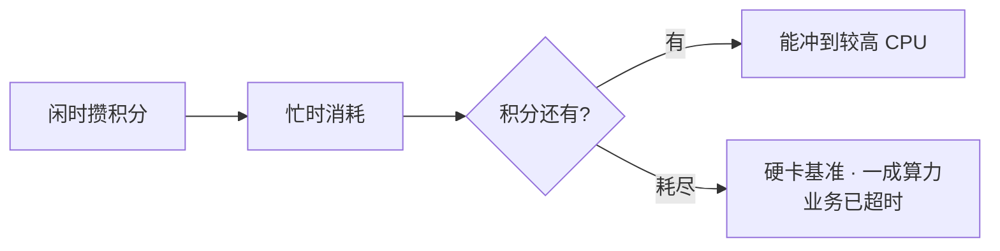
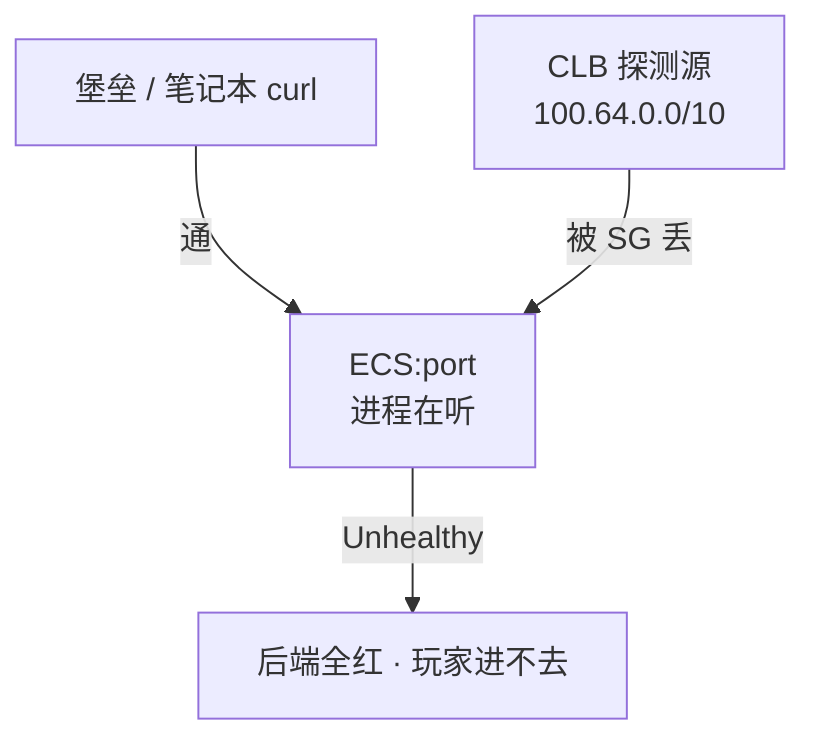
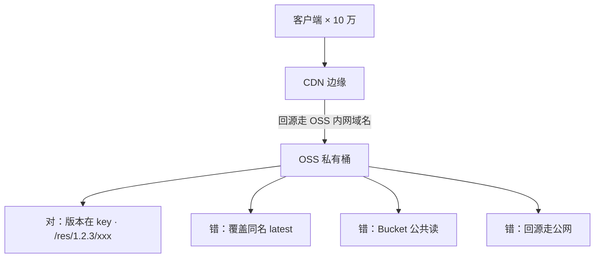
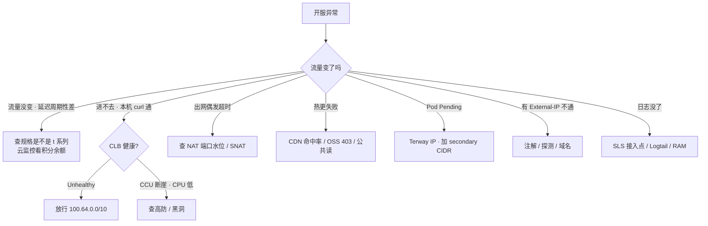

# 06-阿里云生产 · 练习题

开始做题前，先给大家一个小建议：合上知识点，对着**第一节的主图**，把「游戏服在阿里云上的落地」七步——选规格到联网络——口述一遍。能顺下来，下面这些题你会发现大半都会了；卡壳的地方，就是你该回去重读的那一节。

做题的方式也建议改一下：每道题**先看标题和场景，自己口述一遍答案，再往下看「完整解答」对答案**。直接看解答，容易产生「我会了」的错觉——能讲出来才是真的会。

| 标记 | 含义 |
|------|------|
| **核心** | 不懂整章就没建立起来 |
| **必会** | 值班和面试都要能讲 |
| **常用** | 线上会反复碰到 |
| **常考** | 白板和追问的高频口径 |

题目的顺序也是有意排的：Q1～Q5 先钉规格与 SLB；Q6～Q10 讲 ACK、RRSA、OSS、SLS、RAM；Q11～Q14 收尾到网络、定责与账单止血。

## 本题目录
- [Q1 t 系列积分耗尽 vs CPU 打满](#q1)
- [Q2 实例族选型与抢占式](#q2)
- [Q3 CLB / NLB / ALB 选型](#q3)
- [Q4 本机通、CLB 全红](#q4)
- [Q5 CLB idle vs 心跳](#q5)
- [Q6 ACK Terway vs Flannel](#q6)
- [Q7 RRSA vs 节点角色](#q7)
- [Q8 热更 OSS + CDN](#q8)
- [Q9 SLS 与云监控](#q9)
- [Q10 RAM / STS / 长期 AK](#q10)
- [Q11 CEN / 高速通道 / EIP / NAT 网关](#q11)
- [Q12 开服排障定责](#q12)
- [Q13 Terway IP 与 insufficient](#q13)
- [Q14 OSS 公共读账单止血](#q14)
- [合上书](#合上书)

---

## Q1

**★★★★★｜网关 P99 每 20 分钟抬一截，`top` 看不到打满，流量曲线平稳。有人要升配加 CPU，有人要重启逻辑服。怎么查？**

**覆盖**：核心 · 必会 · 常考 ｜ **对应**：知识点 [二、选规格：ECS 实例族与突发性能坑](知识点.md)

### 场景
某卡牌开服，网关买了 `ecs.t6`「先顶一天」。流量曲线平稳，P99 却每 20 分钟抬一截。`top` 看 CPU 没打满。群里有人要在线升配，有人要重启逻辑服。


先自己试试：不看下面，先口述一遍你的答案，再往下对。

### 完整解答
> 🎯 **一句话**：突发性能实例 t 系列积分耗尽是硬限速到基准（10%–20%），不是变慢——`top` 看不到打满，看云监控 CPU 积分余额。

**突发性能实例**（t 系列，也叫突发规格）靠 **CPU 积分**运行：闲时攒、忙时消耗。积分耗尽后 CPU 被硬限制在**基准性能（baseline）**，常见 10%–20% 量级。游戏帧逻辑超时、GC 变长，`top` 还看不到打满——因为利用率被卡在低基准，不是贴 100%。



**读图**：积分有就能冲，耗尽就硬卡。打满是利用率贴 100%、`top` 能看到忙；积分耗尽是利用率被卡在低基准、`top` 看不到打满——这是区分两者的唯一判据。

```bash
# 云监控看 CPU 积分余额，不要只看 top
# 控制台路径：云监控 → 主机监控 → CPU 积分余额
# ← 周期性掉光 = t 系列积分耗尽，不是打满
```

止血：立刻变配到 g / hfc（注意部分规格只能**停机变**，t → g 常要换规格族）。活动窗口不够就新开 g 规格实例迁流量。治理：Terraform 禁止 `ecs.t*`；开服模板白名单只允许 g / hfc / c / r。

> ⚠️ **别混**：积分耗尽（利用率被卡在低基准，`top` 看不到忙）≠ CPU 打满（利用率贴 100%，`top` 能看到忙）。卡住先看规格族是不是 `ecs.t*`，不要先优化代码。
> 📝 **面试**：「游戏禁 `ecs.t*`，突发性能积分耗尽是硬限速不是变慢；`top` 看不到打满，看云监控 CPU 积分余额；开服模板白名单 g / hfc / c / r。」

### 再追问
- **升配能立刻止血吗？** ——部分规格只能停机变，t → g 常要换规格族；活动窗口不够就新开 g 规格实例迁流量。
- **ESS 伸缩组能配 t 系列吗？** ——不能，伸缩组规格模板要禁 t、绑 RAM 角色；冷却时间匹配业务启动。

---

## Q2

实例族选型与抢占式。

**★★★★☆｜实例族怎么选？抢占式能给逻辑服吗？快照和自定义镜像怎么联动？**

**覆盖**：必会 · 常考 ｜ **对应**：知识点 [二、选规格：ECS 实例族与突发性能坑](知识点.md)

### 场景
新项目开服，运维照搬上一次的规格清单。有人提议用抢占式省钱，有人担心回收不可控。开服模板用自定义镜像批量克隆，镜像里有上次环境的 AK。


先自己试试：不看下面，先口述一遍你的答案，再往下对。

### 完整解答
> 🎯 **一句话**：实例族 g / hfc 给逻辑服 / 网关，c 给匹配，r 给 Redis；抢占式不给逻辑服；自定义镜像要清理 AK，快照可恢复云盘或创建镜像。

**ECS 实例族**按算力特征分家：g（通用型）CPU 和内存均衡给网关 / 逻辑服；hfc（高主频型）单核频率高给帧同步 / 频繁小包；c（计算型）CPU 多给匹配服 / 战斗计算；r（内存型）给 Redis / 单机缓存。选错族比选错大小严重。

**抢占式实例**价格低但回收窗口短、不可控。给 CI、跑批、压测流量发生器可以；不要给有状态逻辑服——回收时踢人不可控。包年包月给基线 CCU，按量给活动峰值。

**云盘 / ESSD**：系统盘云盘即可，数据盘看 IOPS 选 ESSD 级别（PL0/PL1/PL2/PL3）。**快照**是云盘的数据备份，可恢复云盘或创建**自定义镜像**。自定义镜像可批量克隆 ECS——但镜像里残留的 AK 和临时配置要清理，否则等于分发密钥。**ESS弹性伸缩**的规格模板就是基于自定义镜像 + 实例规格，注意禁 t、绑 RAM 角色、冷却时间匹配业务启动。

> ⚠️ **别混**：抢占式给逻辑服「省钱」= 回收不可控踢人；自定义镜像直接用不清理 = AK 分发到每台机器。
> 📝 **面试**：「逻辑服 / 网关 g / hfc，匹配 c，Redis r；抢占式只给 CI / 压测不给逻辑服；自定义镜像清 AK；快照恢复云盘或创建镜像；ESS 模板禁 t、绑角色。」

### 再追问
- **变配坑有哪些？** ——部分规格只能停机变，t → g 常要换规格族；活动窗口不够就新开实例迁流量。
- **本地盘能用吗？** ——性能好但实例释放即没，游戏服状态应在 Redis / RDS 而不是本地盘。

---

## Q3

CLB / NLB / ALB 选型。

**★★★★★｜CLB / NLB / ALB 怎么选？自定义 TCP 战斗协议接 ALB 做灰度行不行？游戏盾和高防 IP 是什么？**

**覆盖**：核心 · 必会 · 常考 ｜ **对应**：知识点 [三、接入口：SLB 选型与 100.64 探测源](知识点.md)

### 场景
Ingress 默认 ALB 注解套到了游戏战斗端口。自定义 TCP 协议接到 ALB 后随机断线。有人要把战斗端口也挂 WAF。安全同学问游戏盾和高防 IP 怎么选。


先自己试试：不看下面，先口述一遍你的答案，再往下对。

### 完整解答
> 🎯 **一句话**：战斗长连接走 CLB / NLB（四层），HTTP 登录支付走 ALB（七层）；自定义 TCP 接 ALB 会随机断线；游戏盾是游戏专用高防，DDoS高防IP 是通用 T 级清洗。

| 维度 | CLB / NLB（四层） | ALB（七层） |
|------|-------------------|-------------|
| 协议 | TCP / UDP，不解析 payload | HTTP / gRPC / WebSocket |
| 游戏长连接 | **首选** NLB，PPS / 延迟更好 | **不适合**非 HTTP 战斗连接 |
| 灰度 | 四层基本没有 | Header / 路径 / 权重 |
| WAF | 不挂自定义 TCP | 登录 / 支付走这里 |

CLB 是传统型（四 / 七层都支持但性能弱），NLB 是纯四层超高性能，ALB 是纯七层。自定义 TCP 战斗协议接到 ALB，空闲超时、健康检查按 HTTP 来、解析失败，表现为随机断线。区分标准就是「这个连接是不是 HTTP 握手起手」。

**游戏盾**是阿里云专门针对游戏的 DDoS 防御产品，智能调度多个高防 IP 隐藏源站，SDK 要在客户端集成——非 SDK 接入退化为普通高防 IP。**DDoS 高防 IP** 是通用 T 级清洗，CNAME 接入。通用概念（清洗 vs 黑洞、源站隐藏）在 [01](../01-云网络与安全/) 讲过，这里只记阿里产品名和坑：高防 CNAME 切换的 RTO 取决于 DNS TTL，提前演练。

> ⚠️ **别混**：标准 HTTP 升级的 **WebSocket** 可以挂 ALB（ALB 支持 WS 升级），但 idle 仍要 ≥ 心跳 × 3；**自定义二进制 TCP** ALB 根本解析不了，必须走 CLB / NLB。
> 📝 **面试**：「战斗长连接走 CLB / NLB，HTTP 走 ALB；自定义 TCP 接 ALB 会随机断线；游戏盾 SDK 要客户端集成，非 SDK 退化为普通高防 IP。」

### 再追问
- **UDP 监听有什么限制？** ——老 CLB 有 UDP 限制，不支持就换 NLB。
- **游戏盾和高防 IP 的 RTO 差在哪？** ——高防 CNAME 切换的 RTO 取决于 DNS TTL，提前演练；游戏盾多 IP 调度，SDK 接入 RTO 更短。

---

## Q4

开头那个本机通、CLB 全红。

**★★★★★｜本机 curl 通，CLB 后端全红，Terraform 刚建的安全组。为什么？**

**覆盖**：核心 · 必会 · 常考 ｜ **对应**：知识点 [三、接入口：SLB 选型与 100.64 探测源](知识点.md)

### 场景
开服前 30 分钟，`curl 127.0.0.1:port` 200，办公网也能通。CLB 控制台后端全红，玩家进不去。刚用 Terraform 建的安全组，变更只测了堡垒 ssh + curl。


先自己试试：不看下面，先口述一遍你的答案，再往下对。

### 完整解答
> 🎯 **一句话**：本机通、CLB 全红是健康检查源 `100.64.0.0/10` 被 SG 拦住，不是进程没起。

CLB / NLB 的健康检查流量来自 `100.64.0.0/10`（阿里云保留的链路本地段）。后端 ECS 的安全组必须放行这个段到业务端口，否则控制台显示「实例运行中、监听全红」——`curl 127.0.0.1:port` 却全 200。



**读图**：你的 curl 和 CLB 的探测是两条完全不同的路径。本机 curl 只证明进程在听，不证明探测路径通。CLB 按检查失败摘流，业务端口对办公网开放也没用。

```bash
curl -v 127.0.0.1:$port
# * Connected ... 200 OK   # ← 本机通，但 CLB 控制台仍 Unhealthy
# ← 止血：SG 放行 100.64.0.0/10 到业务端口，看 Healthy 再收紧
```

Terraform 里后端 SG 要显式写 `source_cidr = "100.64.0.0/10"`，控制台也有「允许负载均衡探测」开关——漏了就开服前 30 分钟全红。火山引擎**禁止照抄 `100.64`**，每家探测源不同（[08](../08-火山引擎生产/)）。七层检查还要正确的 URL 路径和状态码。有状态服的健康检查过严会踢人——检查口要轻、与业务线程隔离。

> ⚠️ **别混**：探测源不是你也不是玩家 IP，是 `100.64.0.0/10`。先放探测源，不要先重启 ECS、不要先改业务端口。
> 📝 **面试**：「本机通 CLB 全红先放 `100.64.0.0/10`；Terraform 漏写探测源就开服前全红；火山不能抄 100.64。」

### 再追问
- **ACK 里改 SLB 注解会怎样？** ——改注解（规格、付费类型、健康检查）可能重建 LB，地址会变，客户端必须走域名。
- **健康检查过严会怎样？** ——检查打到会阻塞的业务线程，瞬时变慢被摘流，正在打的玩家被踢到另一台。检查口要轻、独立端口。

---

## Q5

CLB idle vs 心跳。

**★★★★☆｜玩家定时被踢，进程没挂，抓包见 FIN/RST，心跳 5 分钟一次。怎么查？**

**覆盖**：必会 · 常用 · 常考 ｜ **对应**：知识点 [三、接入口：SLB 选型与 100.64 探测源](知识点.md)

### 场景
战斗服进程正常，玩家每隔几分钟掉线一次。抓包见 CLB 主动 FIN/RST，心跳 5 分钟一次。有人怀疑代码有 bug。


先自己试试：不看下面，先口述一遍你的答案，再往下对。

### 完整解答
> 🎯 **一句话**：CLB TCP 连接的 idle timeout 短于游戏心跳，连接静默超过 idle 后 CLB 主动 FIN/RST——心跳必须 < idle 的 1/3。

CLB TCP 连接有空闲超时（idle timeout），默认往往短于游戏心跳。连接静默超过 idle，CLB 主动 FIN/RST，应用无崩溃。止血：心跳改 < idle 的 **1/3**，或调大 CLB idle（有上限），两端一起改。

```text
14:30:00 ... idle 到期, CLB → 后端 FIN/RST   # ← CLB 静默拆
14:30:00 ... 后端进程仍在, 无异常退出         # ← 进程没挂
14:35:00 ... 客户端发心跳, 才发现连接已断   # ← 玩家以为还在线 5 分钟
```

UDP 监听要确认产品是否真支持（老 CLB 有限制），不支持就换 NLB。四层会话保持按源 IP 哈希——运营商 NAT 后大量玩家同一出口 IP，会全部打到同一后端，开服时出现单机 CCU 畸形高、其他机器空转。此时要在接入层做**连接级调度**，不能指望源 IP 哈希。

> ⚠️ **别混**：CLB 静默拆连接（idle 到期，进程没挂）≠ 进程崩溃（进程退出，有 core dump）。心跳 < idle × 1/3，两端一起改。
> 📝 **面试**：「CLB idle vs 心跳：心跳 < idle 的 1/3，或调大 idle 有上限；源 IP 哈希 NAT 后会打歪单机 CCU。」

### 再追问
- **关掉会话保持能打散吗？** ——新连接可以打散，已有长连接还在旧后端。
- **跨云切换后集体掉线怀疑什么？** ——新云 idle / UDP 会话超时默认值更短，名字都叫 NLB 不等于超时一样（[09](../09-多云对照/)）。

---

## Q6

ACK Terway vs Flannel。

**★★★★★｜ACK 节点池加机器后 Pod Pending，Events 写 `insufficient IP`。Terway vs Flannel 怎么选？ACK 托管了什么？**

**覆盖**：核心 · 必会 · 常考 ｜ **对应**：知识点 [四、上容器：ACK 与 Terway](知识点.md)

### 场景
活动扩容时节点池加机器，新 Pod Pending，Events 写 `insufficient IP`。有人要缩节点，有人说子网够大。同时有人问 ACK 托管了 Master，为什么还要关心备份。


先自己试试：不看下面，先口述一遍你的答案，再往下对。

### 完整解答
> 🎯 **一句话**：ACK 托管 Master / etcd，你管节点池、Terway、升级窗口、RPO；Terway 按 Pod 占 VPC IP，节点池划 `/24` 是经典事故。

**ACK（阿里云容器服务 Kubernetes）**托管 Master 和 etcd，你 ssh 不进控制面节点。但你仍负责：节点池规格（禁 t）、网络插件（Terway / Flannel）、插件兼容、升级窗口（避开开服日）、备份 RPO、Event / Webhook、业务停变更。

| 维度 | Terway | Flannel |
|------|--------|---------|
| Pod IP | 进 VPC 平面，**每个 Pod 占一个 VPC IP** | Pod IP 与 VPC 不在同一平面 |
| 连 RDS | SG 可直接放 Pod / 节点网段 | 要 SNAT 或额外转发 |
| 代价 | 吃 VPC IP，节点池 `/24` 会耗尽 | 排障多一跳，出 VPC 常 SNAT |

游戏生产常用 Terway，前提是 CIDR 按 Pod 数规划。`insufficient IP` 是子网 IP 耗尽，不是镜像或节点不够。

```bash
kubectl describe po <pending-pod>
# Events:
#   Warning  FailedScheduling  ... insufficient IP      # ← 子网 IP 耗尽
#   Normal   Scheduled          ... failed to assign IP
# ← 止血：加 secondary CIDR 或新子网，不缩节点、不改已对等生产网段
```

规划时按**峰值 Pod × 1.5** 预留 IP。64 台 × 30 Pod 要 1920 个 IP，`/24` 只有 254 个——这是经典事故。

> ⚠️ **别混**：ACK 托管了 Master / etcd ≠ 不用关心备份——停变更的是你的业务，问清 RPO。`insufficient IP` 加网段，不缩节点。
> 📝 **面试**：「ACK 托管 Master / etcd，节点池 / Terway / 升级窗口 / RPO 仍是你的；Terway 按 Pod 占 VPC IP，`/24` 会耗尽；`insufficient IP` 加网段不缩节点。」

### 再追问
- **ECI 能跑战斗服吗？** ——不能，ECI 适合突发无状态 Job，不适合有状态战斗服——要稳定节点、内核参数、可预期摘流。
- **有状态服上 ACK 要注意什么？** ——PDB、优雅下线、session 迁移；滚动时 SLB 摘流慢于 Pod 退出，或健康检查过快把 drain 节点打成 Unhealthy 又打回去。

---

## Q7

RRSA vs 节点角色。

**★★★★☆｜RRSA 和节点 RAM角色差在哪？程序能用长期 AK 吗？ActionTrail 审计什么？**

**覆盖**：必会 · 常考 ｜ **对应**：知识点 [四、上容器：ACK 与 Terway](知识点.md) · [七、管权限与联网络：RAM / STS / CEN](知识点.md)

### 场景
ACK 集群里 Pod 要访问 OSS。有人给节点绑了万能 RAM 角色（`AliyunOSSFullAccess`），觉得这样最省事。开服脚本里还有长期 AK。有人问这样行不行。


先自己试试：不看下面，先口述一遍你的答案，再往下对。

### 完整解答
> 🎯 **一句话**：RRSA 绑到具体 ServiceAccount，Pod 扮 RAM 角色拿 STS 临时凭证；节点万能角色一宽，任意 Pod 逃逸就能搬空桶；长期 AK 出现在脚本里按泄漏处理。

**RRSA（RAM Roles for Service Accounts）**让 ACK Pod 通过绑定的 ServiceAccount 扮演 RAM 角色，获取 STS 临时凭证访问 OSS / SLS。和 AWS IRSA 同一个模型，只是名字不同。

节点万能角色和 RRSA 的关键区别：
- **节点 RAM 角色**绑到节点，该节点上**所有 Pod** 都能用这个角色——一个「万能 OSS 角色」挂全部 Pod 等于没做隔离，任意 Pod 逃逸就能搬空 OSS Bucket。
- **RRSA** 绑到具体 SA，只有指定 SA 的 Pod 才能扮这个角色——最小权限，不把 AK 放进 Secret。

**长期 AK（AccessKey）**是永久密钥，泄漏后没有 ActionTrail 等于无法判断影响面。开服脚本里发现长期 AK：先当泄漏处理——禁 Key、查 Trail、换角色，不要「开完服再收」。**ActionTrail** 记录所有 API 调用，`ConsoleSignin` 无 MFA 和 AK 调用失败要告警。RAM JSON 不能直接粘 AWS IAM 策略，条件键和角色扮演流程不同。

> ⚠️ **别混**：RRSA 绑到具体 SA（最小权限）vs 节点万能角色（任意 Pod 可调 API）。模型相同：人走 MFA 扮角色，程序走实例角色 / RRSA。
> 📝 **面试**：「RRSA 绑 SA 不用节点万能角色；长期 AK 进 Git / 镜像 / 脚本按泄漏处理——禁 Key、查 Trail、换角色；ActionTrail 记 `ConsoleSignin` 无 MFA 告警。」

### 再追问
- **OSS 怎么授权最小？** ——按 Bucket 前缀授权，禁止 `*:*`。
- **CI / 开服脚本走哪条身份？** ——角色 / STS，不用流水线永久 AK。

---

## Q8

热更 OSS + CDN。

**★★★★★｜热更包放 ECS + Nginx 还是 OSS + CDN？Bucket 公共读省事吗？覆盖同名 latest 行不行？**

**覆盖**：核心 · 必会 · 常考 ｜ **对应**：知识点 [五、存与分发：OSS 与云盘](知识点.md)

### 场景
开服当天十万客户端拉 200MB 热更包。有人放 ECS + Nginx 当下载源，网卡和 NAT 先死。有人把 Bucket 设成公共读省得配鉴权。有人覆盖同名 `latest` 不刷新 CDN。


先自己试试：不看下面，先口述一遍你的答案，再往下对。

### 完整解答
> 🎯 **一句话**：热更包放 OSS 私有桶 + CDN 内网回源，不放 ECS 磁盘；Bucket 公共读或回源走公网 = 账单炸；版本在 key 不覆盖同名。

**OSS（Object Storage Service，对象存储）**是阿里云的对象存储服务。热更包、资源、日志归档放 OSS，不要放 ECS 磁盘当下载源——开服当天十万客户端拉 200MB 包，ECS 网卡和 NAT 会先死。云盘是块设备绑实例，吞吐有上限，没有边缘节点。



**读图**：CDN 扛边缘，OSS 扛源。对的做法是客户端 → CDN → OSS 内网域名（私有桶，版本在 key 里）。错的三个：覆盖同名不刷新、公共读被爬虫拖包、回源走公网 = 账单打穿。

生产配置四条：① Bucket 私有，CDN 用回源鉴权；② 回源走 **OSS 内网域名**（同地域，不经公网）；③ 生命周期：热更包 30 天标准 → 低频，日志 7 天标准 → 归档，规则按前缀；④ 版本号在对象键里，发新包不覆盖旧 key，覆盖同名必须刷新 CDN。

CDN 刷新不是瞬时全球一致。强更要「新包可下载」和「版本检查服务已切」**分两步**，留缓存窗口。账单日炸：Bucket 公共读或回源走公网 → 立刻私有化 + 内网域名，再查访问日志谁在拖。不要先开会分析。

> ⚠️ **别混**：OSS 公共读（任何人可读，爬虫拖包账单打穿）≠ 私有桶 + CDN 回源鉴权（只让 CDN 边缘回源，客户端拿不到直接 URL）。
> 📝 **面试**：「热更 OSS 私有桶 + CDN 内网回源，版本在 key 不覆盖同名；公共读立刻私有化；CDN 刷新不是瞬时，强更分两步。」

### 再追问
- **快照和自定义镜像怎么联动？** ——快照恢复云盘或创建自定义镜像；自定义镜像批量克隆 ECS 但要清 AK；ESS 伸缩组模板基于自定义镜像。
- **为什么不能放 ECS 磁盘？** ——云盘吞吐有上限、没有边缘节点；ECS 网卡和 NAT 会先死。

---

## Q9

SLS 与云监控。

**★★★★☆｜SLS 和云监控怎么分？索引费用为什么会爆？三套告警为什么同时炸？**

**覆盖**：必会 · 常考 ｜ **对应**：知识点 [六、看日志：SLS 与云监控](知识点.md)

### 场景
开服夜同一故障，云监控告 SLB 异常、SLS 告日志报错飙升、Prometheus 告 CCU 下降。SLS 月账单突然翻了三倍。有人把玩家 ID 当索引列。


先自己试试：不看下面，先口述一遍你的答案，再往下对。

### 完整解答
> 🎯 **一句话**：SLS 管日志，云监控管厂商资源指标，业务黄金指标用 Prometheus——三套告警要去重，否则开服夜同时炸。

三渠道各有分工，不要混用：

- **云监控**：ECS / SLB / RDS 的 CPU、连接、后端健康数——厂商指标。
- **Prometheus**：业务黄金指标（CCU、登录成功率）——自建或 ARMS。
- **SLS（Simple Log Service，日志服务）**：日志和访问日志——不要当时序库。

**SLS** 链路：采集（Logtail / Sidecar）→ 索引 → 查询 / 告警。对比自建 ES：免集群、按写入和存储计费、和 ACK / ECS 集成快。代价：查询语法和 ES 不同、超大索引成本会悄悄涨、长期归档仍要生命周期。

账单爆通常是**全字段索引 + 高基数（玩家 ID 当索引列）+ Debug 全量打生产**。SLS 索引字段要克制，高基数列不做索引。止血：降采样、砍索引字段、开生命周期。

三套告警同时炸 = 没去重。开服夜同一故障云监控告 SLB 异常、SLS 告日志报错飙升、Prometheus 告 CCU 下降——要先去重再查。日志突然没了：先看 SLS 接入点流量是否掉零，再查 Logtail 进程、机器组配置、RAM 写权限。没做 ARMS 埋点就不要吹「全链路都在 ARMS」。

> ⚠️ **别混**：SLS 管日志 ≠ 云监控管指标。SLS 不要当时序库用，查时序用 Prometheus。ECS / SLB / RDS 的厂商指标在云监控，不在 SLS。
> 📝 **面试**：「SLS 管日志，云监控管厂商指标，Prometheus 管业务黄金指标；索引字段克制，高基数不做索引；三套告警去重。」

### 再追问
- **什么时候自建 ES？** ——只在查询模型和保留策略 SLS 搞不定时才上，免集群和集成快是 SLS 的优势。
- **日志突然没了先查什么？** ——先看 SLS 接入点流量是否掉零，再查 Logtail 进程、机器组配置、RAM 写权限。

---

## Q10

RAM / STS / 长期 AK。

**★★★★★｜人 / ECS / ACK Pod / CI 各走哪条身份？长期 AK 出现在开服脚本里怎么办？**

**覆盖**：核心 · 必会 · 常考 ｜ **对应**：知识点 [七、管权限与联网络：RAM / STS / CEN](知识点.md)

### 场景
开服脚本里发现长期 AK，有人提议「开完服再收」。ECS 的 UserData 里也写了 AK。ACK Pod 访问 OSS 用节点万能角色。有人问这样合规吗。


先自己试试：不看下面，先口述一遍你的答案，再往下对。

### 完整解答
> 🎯 **一句话**：人走 MFA 扮 RAM 角色，程序走实例 RAM 角色 / RRSA / STS 临时凭证；永久 AK 出现在 Git / 镜像 / 脚本按泄漏处理——禁 Key、查 Trail、换角色。

**RAM（Resource Access Management）**是阿里云的权限管理。**RAM 角色**可被人或实例扮演，扮演后拿到 **STS（Security Token Service）临时凭证**——有时效，过期自动失效。**长期 AK** 是永久密钥，泄漏后没有 ActionTrail 等于无法判断影响面。

| 身份 | 走哪条 | 禁止 |
|------|--------|------|
| 人 | 控制台 + MFA 扮角色 | 根 AK、无 MFA 登录 |
| ECS | 实例 RAM 角色 | UserData 里写永久 AK |
| ACK Pod | **RRSA** 绑 ServiceAccount | 节点角色 `*:*`；AK 进 Secret |
| CI / 开服脚本 | 角色 / STS | 流水线永久 AK |

最小集：按环境拆 RAM 用户组；OSS 按 Bucket 前缀授权；禁止 `*:*`。**ActionTrail** 记录所有 API 调用，`ConsoleSignin` 无 MFA 和 AK 调用失败要告警。开服脚本里发现长期 AK：先当泄漏处理——禁 Key、查 Trail、换角色，不要「开完服再收」。

> ⚠️ **别混**：RRSA 绑到具体 SA（最小权限）vs 节点万能角色（任意 Pod 可调 API）。RAM JSON 不能直接粘 AWS IAM 策略，条件键和角色扮演流程不同。
> 📝 **面试**：「人 MFA 扮角色，ECS 实例 RAM 角色，ACK Pod 走 RRSA，CI 走角色 / STS；长期 AK 进 Git / 镜像 / 脚本按泄漏处理——禁 Key、查 Trail、换角色。」

### 再追问
- **ActionTrail 要告警什么？** ——`ConsoleSignin` 无 MFA、AK 调用失败、非常规 API 调用。
- **RAM JSON 能粘 AWS IAM 吗？** ——不能，条件键和角色扮演流程不同，模型相同但语法不兼容。

---

## Q11

CEN / 高速通道 / EIP / NAT。

**★★★★☆｜CEN 什么时候用？高速通道给谁走？EIP 绑哪里？NAT 网关端口耗尽怎么看？**

**覆盖**：必会 · 常用 ｜ **对应**：知识点 [七、管权限与联网络：RAM / STS / CEN](知识点.md)

### 场景
多 VPC 要互通，有人提议全上 CEN。混合云 IDC 要连云，有人问玩家走不走专线。逻辑服绑了 EIP 方便调试。出网偶发 `connect timeout`，有人要改安全组。


先自己试试：不看下面，先口述一遍你的答案，再往下对。

### 完整解答
> 🎯 **一句话**：CEN 跨账号跨地域才上，同账号用对等连接；高速通道给 IDC 数据面，玩家不走；EIP 只绑 LB / NAT / 堡垒；NAT 端口耗尽查水位不是改 SG。

**CEN（云企业网，Cloud Enterprise Network）**是阿里云的多 VPC / 多地域互联产品。多 VPC 同账号用对等连接即可；跨账号跨地域才上 CEN。CEN 路由学不会时，宁可少打通，不要把测试 VPC 接到生产 CEN 上「方便调试」。

**高速通道（Express Connect）**是阿里云的专线产品，给 IDC ↔ 云数据面。玩家入站不走专线。UDP 丢先测 MTU（封装后 < 1500），通用概念在 [01](../01-云网络与安全/)。

**EIP（弹性公网 IP）**可绑 ECS / SLB / NAT网关。逻辑服禁绑 EIP，只有 LB / NAT / 堡垒有出入口。

**NAT网关**是阿里云的 SNAT 产品，只服务私网出公网。一个 NAT IP 约 6 万源端口，SNAT 端口耗尽时偶发 `connect timeout`——查 NAT 端口水位，不是改安全组。

> ⚠️ **别混**：CEN 给跨账号跨地域多 VPC 互联，同账号用对等连接；玩家入站不走 NAT / 专线，走 LB / 高防。
> 📝 **面试**：「CEN 跨账号跨地域才上，别把测试 VPC 接进生产 CEN；EIP 只绑 LB / NAT / 堡垒，逻辑服禁 EIP；NAT 端口耗尽查水位不先改 SG。」

### 再追问
- **为什么不能把测试 VPC 接进生产 CEN？** ——路由学不会时宁可少打通，测试 VPC 误配爆炸半径是整个生产网。
- **NAT 端口耗尽和 SG 拒绝怎么区分？** ——NAT 耗尽是偶发 `connect timeout`、VPC 内正常；SG 拒绝是 ICMP 拒绝或全不通（[01](../01-云网络与安全/)）。

---

## Q12

开服排障定责。

**★★★★★｜开服当天 P99 周期性抬、CLB 全红、账单炸——你怎么在 60 秒内定责？**

**覆盖**：核心 · 必会 · 常考 ｜ **对应**：知识点 [八、作战：定责](知识点.md)

### 场景
开服当天同时出三件事：① 网关 P99 每 20 分钟抬一截，`top` 看不到打满；② CLB 后端全红，本机 curl 全 200；③ OSS 账单突然飙高。群里有人要升配、有人要重启逻辑服、有人要开会分析 CDN。


先自己试试：不看下面，先口述一遍你的答案，再往下对。

### 完整解答
> 🎯 **一句话**：阿里云故障先问「卡在哪步」——积分型看规格，CLB 全红放 100.64，账单炸先私有化——不要先重启逻辑服。



**读图**：第一刀永远是「流量变了吗」——没变就查规格（t 系列积分），变了就按现象分叉到七条支线。每条支线写真实现象，不写抽象类别。

| 现象 | 先做 | 别做 |
|------|------|------|
| 流量没变、P99 周期性抬 | 查规格是不是 `ecs.t*`；迁 g / hfc | 先给代码加核 |
| 本机通、CLB 全红 | 放行 `100.64.0.0/10` / 探测开关 | 重启 ECS |
| OSS 账单炸 | 立刻私有化 + 内网回源，再查日志 | 先开会分析 CDN |
| `insufficient IP` | 加 secondary CIDR / 新子网 | 缩节点 |
| 改注解后全服连不上 | LB 地址变了，客户端走域名 | 写死 IP |

```text
0–10s   规格：云监控看 CPU 积分余额；top 看有没有打满    # ← 积分型卡顿 top 骗人
10–30s  入口：CLB 健康检查 / Unhealthy 数               # ← 本机通就放 100.64
30–45s  容器：kubectl get nodes -o wide / Pod Pending   # ← insufficient IP 加网段
45–60s  存储 / 日志：CDN 命中率 / SLS 摄入流量            # ← 路径通就查存储和日志
# ← 60 秒内不动业务进程、不改 0.0.0.0/0、不重启逻辑服
```

> ⚠️ **别混**：不重启逻辑服是因为长连接可能还活着——入口被清洗、LB 摘流、探测源没放行，重启业务只会主动踢还在线的玩家，把事故面放大。
> 📝 **面试**：「通断先问卡在哪步：积分型查规格、CLB 全红放 100.64、Pod Pending 加网段、账单炸先私有化——不重启逻辑服是因为长连接可能还活着。」

### 再追问
- **为什么不能先改 SG？** ——SG 拒绝和 NAT 端口耗尽、探测源没放行是不同病，不先画路径就把三者搅在一起。
- **Flow log 什么时候开？** ——只在「规则看起来对但仍丢包」时对 ENI 定向五元组开，不全 VPC 海选。

---

## Q13

Terway IP insufficient。

**★★★★☆｜ACK `insufficient IP` 和 Terway 怎么治？**

**覆盖**：必会 · 常用 ｜ **对应**：知识点 [四、上容器：ACK 与 Terway](知识点.md)

### 场景

开服扩容 200 节点，Pod Pending。Terway ENI 模式。

先自己试试：不看下面，先口述一遍你的答案，再往下对。

### 完整解答

> 🎯 **一句话**：**加 secondary CIDR + 新 VSwitches**——Terway 一 Pod 一 ENI/IP；`/24` 不够就扩网段，**不要**盲目调小 `max-pods`。

```bash
kubectl get events -A | grep -i insufficient
# failed to allocate eni ip

# 控制台：VPC 加辅助 CIDR → 新交换机 → ACK 关联
```

```text
规划：峰值 Pod 数 × 1.5 IP
Flannel 不占 VPC IP，迁 Terway 要重算
```

> ⚠️ **别混**：`insufficient IP` 不是 K8s bug——是 IP 规划不足。

### 再追问

**RRSA 和 IP 有关系吗？**——无；但同章开服要一起验收。

---

## Q14

OSS 公共读账单止血。

**★★★★★｜OSS 账单一夜飙高，命中率正常，先做什么？**

**覆盖**：核心 · 必会 ｜ **对应**：知识点 [五、存与分发：OSS 与云盘](知识点.md)

### 场景

热更包走 OSS 公网域名，爬虫扫桶。CDN 命中率 95% 但回源费仍高。

先自己试试：不看下面，先口述一遍你的答案，再往下对。

### 完整解答

> 🎯 **一句话**：**立刻私有化 + 内网 endpoint 回源**——公共读/公网域名 = 流量炸弹；再查 CDN 回源是否仍走公网。

```text
① 桶 ACL/Policy 关公共读；开 Block Public Access
② 回源改 OSS 内网域名（同地域 ECS/ACK）
③ CDN 源站改内网；刷新恶意 URL
④ 账单按流出/请求数对账
```

> ⚠️ **别混**：命中率高只说明边缘命中——**回源走公网**仍贵。**不要**先开会分析 CDN。

### 再追问

**内网域名改了客户端要改吗？**——玩家走 CDN 不变；源站配置改。

---

## 合上书

学到这里，先别急着翻下一章。合上书，试试下面这几件事能不能做到——能做到，这章才算真的听懂了。卡住的那一条，就回到对应的小节再听一遍：

- [ ] 能**默画**游戏服在阿里云上的落地七步图（选规格 → 接入口 → 上容器 → 存分发 → 看日志 → 管权限 → 联网络），标出每步的阿里特有产品名。
- [ ] 能说出实例族 g / hfc / c / r 怎么选；突发性能 t 系列积分耗尽和 CPU 打满怎么区分；抢占式不给逻辑服；ESS 伸缩组注意什么。
- [ ] 能**默画** CLB / NLB vs ALB 对比（层 / 游戏长连接 / 灰度 / WAF），标出自定义 TCP 接 ALB 会怎样、`100.64.0.0/10` 是什么、本机通 LB 全红先放什么。
- [ ] 能说出 CLB idle vs 心跳怎么对齐；ACK LB 注解为什么可能换 IP；源 IP 会话保持 NAT 后会怎样；游戏盾和高防 IP 的产品定位。
- [ ] 能说出 ACK 托管了什么、你还管什么；Terway vs Flannel 差在哪；`insufficient IP` 怎么办；RRSA 和节点角色差在哪；ECI 为什么不适合战斗服。
- [ ] 能说出热更为什么 OSS + CDN；私有桶 + 内网域名 + 版本在 key；公共读会怎样；CDN 刷新为什么不是瞬时；快照和自定义镜像怎么联动。
- [ ] 能说出 SLS / 云监控 / Prometheus 各管什么；索引费用为什么会爆；三套告警为什么同时炸。
- [ ] 能说出人 / ECS / ACK Pod / CI 各走哪条身份；长期 AK 出现在脚本里怎么办；RRSA 和节点万能角色差在哪；CEN 什么时候用。
- [ ] 能**默画**作战决策树（流量变了吗→七条分叉），口述 60 秒剧本各敲什么、什么绝不碰。
