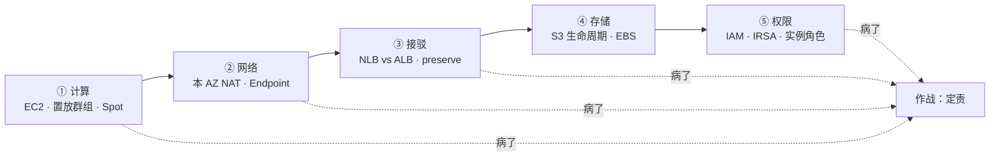
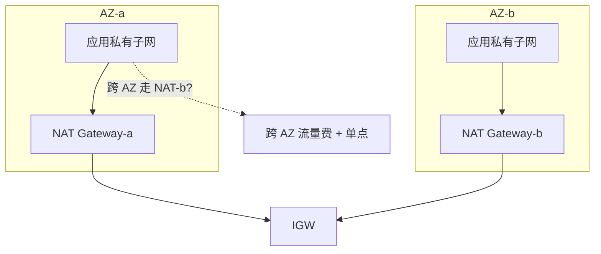
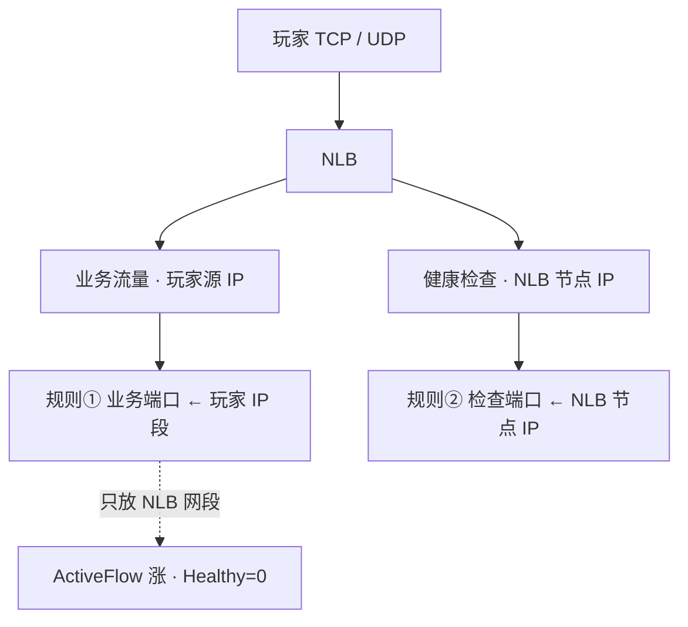
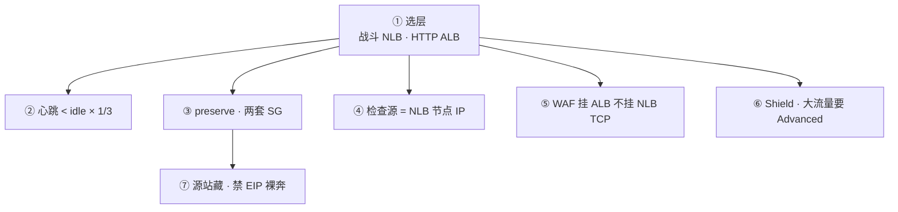
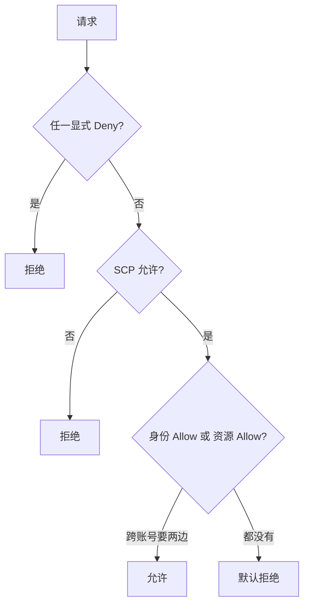
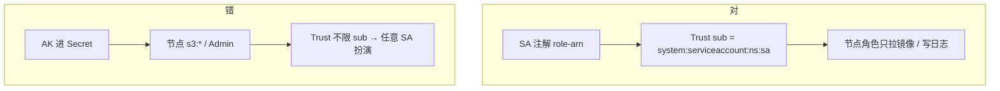
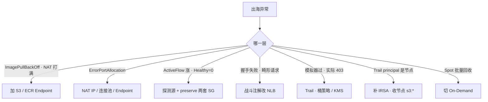

# AWS 生产

> 出海开服前夜，50 个 EKS 节点同时拉 4GB 镜像，Pod 全 `ImagePullBackOff`——NAT Gateway 带宽和处理费一起打满。群里有人要扩 NAT，另有人把战斗 Service 注解成了 ALB。
> **本章回答**：一个出海游戏服在 AWS 上落地要过哪几关——计算选型、网络坑、LB 接驳、存储配置、权限收口，每关什么会炸、怎么一眼定责。
> **不讲**：VPC / SG / NACL / NAT 通用模型 → [01](../01-云网络与安全/)；国内 ECS / CLB / OSS → [06](../06-阿里云生产/)；多云对照 → [09](../09-多云对照/)；RDS / ElastiCache / 备份 RPO → [03](../03-云上存储与数据库/)；Spot / RI / NAT 账单 → [05](../05-成本治理/)；泄漏应急、多账号、SCP → [04](../04-IAM与多账号/)；火山对照 → [08](../08-火山引擎生产/)。

**标记**：🎯重点 · 🔥难点 · ⭐常考 · 🔧实操

---

## 一、一张图：出海游戏服在 AWS 上的落地

> 🎯 **一句话**：出海落地五关——计算选型、网络坑、LB 接驳、存储配置、权限收口；通用模型在 01，本章只补 AWS 产品名和坑。



- 📖 **读图**
  - 🛤️ 主线五关，每关挂 AWS 特有坑；通用 VPC / SG / NAT → [01](../01-云网络与安全/)
  - 🇨🇳 中国区（北京 / 宁夏）与 Global 是两套账号、两套 IAM，**同一把 AK 打不通**
  - 🩹 出事先回到「哪一关病了」，不是先改 SG 或重启进程（→ 八节）

本节对应练习题 Q1。

---

## 二、计算：EC2 实例族、置放群组与 Spot

> 🎯 **一句话**：战斗节点用 C 系 On-Demand + 置放群组 cluster；禁 T3 / T4g；Spot 约 2 分钟中断只给无状态。🔥⭐

### 🖥️ EC2 实例族与 Graviton ⭐

**EC2（Elastic Compute Cloud）** = AWS 虚拟机。命名：系列字母 + 代数 + 可选特性后缀。

- **C 系列**（计算优化）：战斗服、网关首选 — `c7i`（Intel）、`c7g`（Graviton / ARM）
- **M 系列**（通用）：逻辑服、EKS 系统节点 — `m7i`、`m7g`
- **R 系列**（内存）：Redis、匹配服 — `r7i`、`r7g`
- **T 系列**（可突发）：T3 / T4g — ⭐**禁用于游戏**；CPU credit 耗尽即限速，和阿里 `ecs.t` 同一类事故

- 🧬 **Graviton**：出海省钱可用 C7g / M7g，但要过编译和延迟测试，不要空口「ARM 一定更快」

> ⚠️ **别混**：T 系列「可突发」≠「能扛峰值」——credit 耗尽后钉到基线，战斗服会卡到踢人。

### 📍 置放群组：战斗服低延迟 🔧

**置放群组（Placement Group）** 控制实例在物理机架上的分布：

- **cluster**：同机架，实例间延迟 μs 级 — 战斗服 / 帧同步首选；整机架挂了全没
- **spread**：不同机架各至多一台 — 少量关键节点高可用
- **partition**：按分区分散 — 大数据 / 分布式队列

- 🎮 游戏战斗服用 **cluster**；代价是机架级故障域 — RTO 按「踢人重建」写预案（与 01「战斗服常单 AZ」同一逻辑）
- 📦 cluster 有容量上限，扩容前确认还能放几台，否则 `InsufficientCapacity`

> 📝 **面试**：「战斗服用 cluster 降延迟；数据面多 AZ 容灾；不矛盾——cluster 是 AZ 内机架策略，多 AZ 是跨机房故障域。」

### 🚀 启动模板与 Auto Scaling ⭐🔧

- **启动模板（launch template）**：钉死 AMI、实例类型、SG、实例角色、子网、标签；有版本号，改 AMI 建新版本，ASG 引用具体版本便于回滚
- **ASG**：按模板扩缩；控制台手开「临时一台」无标签 → 活动后找不到、关不掉
- **EIP**：只给 NAT Gateway 和堡垒机；逻辑服 / RDS / Redis **不绑 EIP**（源站裸奔）；闲置 EIP 按小时收费，定期 `describe-addresses` 清理

```bash
aws autoscaling describe-auto-scaling-groups \
  --query 'AutoScalingGroups[].{Name:AutoScalingGroupName,Desired:DesiredCapacity,LC:LaunchTemplate.LaunchTemplateName}' --output table
# |  fight-asg   |  8  |  fight-lt-v3  |  # ← 战斗节点按模板扩
# |  system-asg  |  3  |  system-lt-v2 |  # ← EKS 系统节点 On-Demand
```

### ⚡ Spot：约 2 分钟中断 🔥⭐

> 💡 **打个比方**：Spot 像「随时可能被叫走的临时工」——约 2 分钟通知，有状态战斗服进池等于自找踢人。

**Spot** = 闲置算力折扣（最高 ~90% off），AWS 可随时收回。中断前约 **2 分钟**：元数据 `/latest/meta-data/spot/instance-action` 或 EventBridge `EC2 Spot Instance Interruption Warning`。

- ✅ **何时用**：CI、压测、无状态统计、可重试 Job
- ❌ **何时不用**：有状态战斗服、单点 Redis、RDS 替代
- 🔀 Spot 与 On-Demand **分两个 ASG**，不要一个组混容量还指望调度器懂业务
- 🛎️ EKS 配 **AWS Node Termination Handler**（cordon + drain）；没配 = Pod 直接没，调度器还往死节点派活

#### ❓ 为什么 2 分钟不够战斗服？

- ❌ 直觉：2 分钟够「优雅退出」
- ✅ 真相：只够摘流量、持久化内存态、SIGTERM；**不够完整合服**
- 🔌 没接中断信号 = 直接断电；有状态工作负载根本不该进 Spot 池

- **RI / Savings Plan**：承诺用量折扣；Compute SP 可跨规格族，**盖不住 NAT 和流量**；先砍闲置再买 90 天最小常驻，不按开服峰值（05）

> ⚠️ **别混**：Spot 的 2 分钟是「通知到回收」窗口，不是「能优雅合服」的保证。省钱用规格优化（含 Graviton）要过延迟测试，不是换 T 系列。

本节对应练习题 Q1、Q2。

---

## 三、网络：本 AZ NAT、跨 AZ 计费与 Endpoint

> 🎯 **一句话**：本 AZ NAT 避免跨 AZ 流量费；S3 / ECR 走 VPC Endpoint 不穿 NAT；VPC CNI 按 Pod 占 IP。⭐🔥

### 🧭 本 AZ NAT 与跨 AZ 计费 ⭐🔥

AWS 跨 AZ 流量约 **$0.01/GB/方向**（区域有差异）。生产规则：**每 AZ 一个 NAT Gateway**，私有子网 `0.0.0.0/0` 指本 AZ 的 NAT。

> 💡 **打个比方**：三个 AZ 各有前台（NAT）。员工寄快递走自己前台；若只有一个 AZ 有前台，另两个要跨区绕路——又慢又多交跨区费。NAT 处理费按量计，大流量穿 NAT 可能贵过 EC2。



- 📖 **读图**
  - ✅ 每 AZ 私有子网指本 AZ NAT → IGW；❌ 单 AZ 放 NAT = 其他 AZ 出网先跨 AZ（费 + 单点）
  - 数据面跨 AZ（RDS 同步）难免；计算面东西向 RPC 可用同 AZ 亲和减少跨 AZ

### 🔌 VPC Endpoint：S3 / ECR 不穿 NAT 🔧⭐

**VPC Endpoint** 让 VPC 内访问 AWS 服务不走公网、不穿 NAT：

- **Gateway Endpoint**：S3 / DynamoDB，路由表转发，**不收处理费** — 开服前夜拉镜像走这个
- **Interface Endpoint**：ENI 私有 IP，按小时 + 处理费 — ECR、Secrets Manager、STS；每 AZ 都要有（跨 AZ 访问也计跨 AZ 费）

#### ❓ 为什么开服镜像洪峰先加 Endpoint，不先扩 NAT？

- ❌ 直觉：NAT 打满 → 扩带宽 / 加 NAT
- ✅ 真相：ECR 镜像层在 S3；没 Endpoint 时节点走 **公网 NAT** 拉镜像 → 处理费 + 带宽一起爆
- 🩹 止血：S3 Gateway + ECR Interface **两个都配**；只配一个不够
- 🔍 `ImagePullBackOff` + NAT 打满 = Endpoint 缺失信号，不是「NAT 太小」

```bash
aws ec2 describe-vpc-endpoints \
  --query 'VpcEndpoints[].{Service:ServiceName,Type:VpcEndpointType,State:State}' --output table
# |  com.amazonaws.s3       | Gateway   | Available |  # ← S3 不收处理费
# |  com.amazonaws.ecr.api  | Interface | Available |  # ← ECR API
```

### 🕸️ VPC CNI：IP 按 Pod 占 🔥

**VPC CNI** 给每个 Pod 分配 VPC IP（非 overlay）。好处：同网络层无 NAT；代价：IP 消耗快 — `aws-node` 报 `failed to assign IP`、Pod Pending。

- 🩹 止血：加子网或开 **prefix delegation**（ENI 拿 /28 = 16 IP）；别缩节点「看起来像资源不够」
- 📐 规划按 ENI 算 maxPods；峰值 Pod × **1.5** 预留；`warm-ip-target` 按峰值速率配
- 🚫 数据子网可不配 `0.0.0.0/0`，强制 RDS / Redis 无出网

```bash
kubectl describe po <pending-pod>
#   Warning  FailedScheduling  ... failed to assign IP    # ← 子网 IP 耗尽
# ← 加子网或 prefix delegation，不缩副本
```

> 📝 **面试**：「本 AZ NAT；S3 / ECR 走 Endpoint 不穿 NAT；VPC CNI 按 Pod 占 IP，`failed to assign IP` → 加子网或 prefix delegation。」

本节对应练习题 Q2、Q3。

---

## 四、接驳：NLB vs ALB 与 preserve client IP

> 🎯 **一句话**：游戏 TCP / UDP 走 NLB，HTTP 走 ALB + WAF；preserve client IP 时 SG 写两套；健康检查源是 NLB 节点 IP 不是 `100.64`。⭐🔥

### ⚖️ ALB vs NLB ⭐🔥

| | ALB | NLB |
|--|-----|-----|
| 协议 | HTTP / HTTPS / gRPC / WebSocket | TCP / UDP / TLS |
| 延迟 | L7 多一跳 | L4，适合战斗 PPS |
| WAF | 可关联 | 挂不到 TCP / UDP |

- 🎮 自定义 TCP / UDP → **NLB**；战斗 Service 注解成 ALB = 自定义协议当畸形 HTTP → 握手失败
- 🌐 HTTP 登录 / 支付 / Ingress → **ALB**；WebSocket 可用 ALB，但 idle < 心跳 × 1/3（ALB 默认 60s；NLB TCP idle ≈ 350s）
- ❤️ 目标组健康检查口建议独立、轻量；`HealthyHostCount=0` = 检查不通，不是 NLB 没收流量

### 🪪 preserve client IP：两套 SG 🔧🔥

> 💡 **打个比方**：preserve 像「快递直接送到房间」——后端既要放 LB 探测（前台敲门），也要放玩家 IP（真快递），两套缺一不可。

开启后后端看到**玩家真实 IP**（非 NLB SNAT）：



- 📖 **读图**
  - 业务与检查**源地址不同**；漏放玩家段 → `ActiveFlowCount` 涨而 `HealthyHostCount=0`（LB 黑洞）
  - `source_security_group_id = lb_sg` 在 preserve 时对**业务端口失效**（源是玩家 IP）
  - 关闭 preserve 后一套 `lb_sg` 即可；是否开启由风控 / 封禁需求驱动

#### ❓ 为什么 preserve 后还要单独放 NLB 节点 IP？

- 业务口看到的是玩家 IP → 规则①写玩家 CIDR
- 健康检查**仍来自 NLB 节点 IP** → 规则②必须另写
- SSH **绝不能**跟着重开 `0.0.0.0/0`

### 🩺 健康检查源：不是 `100.64` ⭐🔧

NLB 检查源 = **NLB 节点 IP**（自身 ENI），不是阿里 `100.64.0.0/10`。照抄阿里必挂（01）。

```bash
aws elbv2 describe-target-health --target-group-arn <tg-arn> \
  --query 'TargetHealthDescriptions[].{Target:Target.Id,State:TargetHealth.State}' --output table
# |  i-xxx  |  healthy   |
# |  i-yyy  |  unhealthy |  # ← 检查口 / SG 没放 NLB 节点
```

- **跨 AZ NLB**：关掉可少跨 AZ 费（区服绑单 AZ）；该 AZ 目标全挂不漂。后端全在一 AZ 却开跨 AZ = 费翻倍还没容灾
- **Shield Standard**：账户默认免费，抗常见 L3 / L4；**Advanced** 付费 + SRT + 费用保护。大流量仍要 Advanced / 第三方，且**源站要藏**——泄漏直打 EC2，Shield 挡不住
- **ACM**：证书挂 ALB / NLB-TLS，私钥不出网；不能导出到 EC2 自建 Nginx
- EKS：Ingress 默认 ALB；战斗 Service 用 `aws-load-balancer-type: nlb`；注解写错 = 选错层（Q2）

### 收束：游戏长连接凭什么接对层



- 📖 **读图**：①选层；②心跳对齐 idle；③④两套源地址陷阱；⑤⑥防御分工；⑦藏源站

> ⚠️ **别混**：不保证「同名 LB 跨云 idle 一样」；不保证「WAF 能接自定义 TCP」；不保证「Shield Standard 挡所有 DDoS」。

> 📝 **面试**：「TCP/UDP → NLB；HTTP → ALB+WAF；preserve 两套 SG；检查源是 NLB 节点 IP 不是 `100.64`；大流量要 Advanced + 藏源站。」

本节对应练习题 Q4、Q5。

---

## 五、存储：S3 生命周期与 EBS 快照

> 🎯 **一句话**：S3 生命周期按前缀不整桶一刀切；403 常见 Block Public / OAC / KMS；EBS 快照是 AMI 的基础。🔧⭐

### 📦 S3 生命周期：按前缀 🔧⭐

热更、日志、tfstate、备份都进 S3。按**前缀**配规则：

- `res/current/*`：标准，不归档、不过期
- `res/old/*`：30 天 → IA，180 天 → Glacier
- `logs/*`：7 天标准，30 天过期
- `tfstate/*`：标准 + 版本控制，**禁止过期删除**

- **Intelligent-Tiering**：访问模式说不清的桶；热更「最新包」极热，别乱扔 Glacier
- Glacier 取回有时间/钱；回档演练要真 restore（03）

### 🔐 S3 权限：Block Public / OAC / KMS 🔥

S3 403 常见不是「文件不存在」：

- **Block Public Access**：账号级，优先级最高
- **OAC**：CloudFront 回源 S3（取代 OAI）
- **KMS `kms:Decrypt`**：桶开了 KMS，调用方缺 Decrypt

```bash
aws s3api get-object --bucket my-bucket --key res/current/v1.2.3.zip /tmp/test.zip
# AccessDenied  # ← 不是 404；查 CloudTrail Action / Resource
```

- 生产：默认 KMS；账号级 Block Public；CloudFront 用 OAC；热更只经 CDN，不直给 S3 URL；日志桶与热更桶分开

### 💾 EBS 与快照 ⭐

**EBS** = EC2 持久卷；**快照** = 卷增量备份（存 S3）；**AMI** = 快照 + 元数据，启动模板引用。

- 卷型：系统盘 `gp3`；高 IOPS 用 `io2`；卷性能要匹配实例
- EBS CSI 用 IRSA 访问快照；少权限 → controller 403、PVC Pending
- 跨 region 复制快照要显式配（DR）；有流量费

> ⚠️ **别混**：快照是 **EBS 卷级**，不是实例级——内存态 / 临时盘不在里面；有状态战斗服内存态要应用自己持久化。

本节对应练习题 Q6。

---

## 六、权限：IAM 求值与 IRSA

> 🎯 **一句话**：IAM 显式 Deny 最大；跨账号要两边允许；模拟器过了实际 403 以 CloudTrail 为准。⭐🔥

### 🧮 IAM 求值四步 ⭐🔥

1. **显式 Deny**（身份 / 资源 / SCP / 边界任一）→ 拒绝
2. **组织 SCP** 不允许 → 拒绝
3. **身份 Allow 或资源 Allow**（跨账号**两边都要**）→ 允许
4. **默认拒绝**：没有 Allow = 拒绝



- 📖 **读图**：Deny 永远优先；跨账号身份写满、桶策略没加仍是 403
- **权限边界** = 角色天花板；**SCP** = 组织对账号天花板；都是防自助开 `*`
- 三分责：**AWS** 管控制面；**你** 管节点 / CNI / SG / 路由；**IAM** 管身份与扮演

### 🧪 模拟器过了实际 403 🔧🔥

> 💡 **打个比方**：Policy Simulator 像笔试——身份策略对了打勾；实际还要过桶策略 / KMS 这些「面试官」，模拟器没带。

```bash
aws cloudtrail lookup-events \
  --lookup-attributes AttributeKey=EventName,AttributeValue=AccessDenied --max-results 5
# |  GetObject  |  game-role |  arn:aws:s3:::.../v1.zip |  # ← Action + Resource
# |  Decrypt    |  game-role |  arn:aws:kms:...         |  # ← 缺 kms:Decrypt
```

- **STS AssumeRole**：人从 SSO、程序从 IRSA / Instance Profile 换临时凭证；永久 AK 只留给破旧系统并轮换告警（04）
- 🩹 Pod 403 → Trail 搜 `AccessDenied`，不加 `AdministratorAccess`「验证是不是权限」

### 🎫 IRSA：SA 绑角色，Trust 限制 sub 🔧⭐

**IRSA** = SA 注解 `eks.amazonaws.com/role-arn`，Pod 用 OIDC 换临时凭证；**节点 Instance Profile 不需要 `s3:*`**。



- 📖 **读图**：对 = SA 绑角色 + Trust 钉到具体 SA + 节点瘦；错 = AK 进 Secret / 节点过宽 / Trust 敞口
- EBS CSI、LB Controller **各自** IRSA；少一个权限 → Pending
- **IMDSv2**：强制 metadata token，防 SSRF 偷角色凭证

#### ❓ 为什么节点角色给了 `s3:*` 还要 IRSA？

- ❌ 直觉：节点已有 S3 权限，Pod 跟着用就行
- ✅ 真相：任一 Pod 逃逸就能用**节点凭证**搬空桶；应用权限必须落在 **IRSA（按 SA）**
- 🔒 Trust 必须 `sub = system:serviceaccount:ns:sa`，否则集群任意 SA 可扮演
- 与 ACK **RRSA** 同模型（名字不同，别把 AWS JSON 粘到 RAM）

> ⚠️ **别混**：IRSA = Pod 级应用权限；实例角色 = 节点级系统权限。两层不能互相替代。

> 📝 **面试**：「Deny > SCP > Allow > 默认拒绝；跨账号两边 Allow；以 Trail 为准；IRSA Trust 限 sub，节点角色要瘦。」

本节对应练习题 Q7、Q8。

---

## 七、EKS：托管边界与 VPC CNI

> 🎯 **一句话**：EKS 托管控制面，节点组 / CNI / 升级 / RPO 仍是你的；Fargate 不跑战斗服。⭐

### 🧱 托管了什么、你还管什么 ⭐

**EKS** 托管 API Server / etcd（跨 3 AZ）。你负责：

- **节点组**：On-Demand / Spot 分开；战斗服 EC2 节点
- **VPC CNI**：IP 不够 → 加子网 / prefix delegation（三节）
- **CoreDNS / 控制器**：EBS CSI、LB Controller 各自 IRSA；CoreDNS 副本要扛住规模
- **升级**：先控制面再节点；drain 遇 PDB 不要 `--force`；战斗 drain 联动合服 / 踢人
- **RPO / 停变更**：托管 ≠ 跳过这一章

- **Fargate**：无状态小服务可以；有状态 / hostNetwork / 可预期 drain → EC2；不支持 DaemonSet
- 对照 ACK：控制面计费、VPC CNI vs Terway、IRSA vs RRSA — 模型同、细节按文档

> ⚠️ **别混**：控制面 Ready ≠ 集群可用；节点挂 / CNI IP 尽 / 控制器 403 都是你的事。

### 📊 CloudWatch vs Prometheus ⭐

- **CloudWatch**：EC2 / RDS / NLB / NAT / Spot 事件 — 开箱；自定义指标贵、高基数吓人
- **Prometheus**：CCU、登录成功率等业务黄金指标更自然
- 生产常态：**CW 管云资源与 AWS 事件，Prom 管应用黄金指标**
- 关键告警：`UnHealthyHostCount`、`ActiveFlowCount`、`ErrorPortAllocation`（SNAT 端口耗尽）
- **VPC Flow Logs**：排「SG 已放行仍丢」时对 ENI 开拒绝记录，不要全 VPC 海选

本节对应练习题 Q9、Q10。

---

## 八、作战：定责

> 🎯 **一句话**：出海异常先分「哪一关病了」——镜像穿 NAT 查 Endpoint，NLB 黑洞查两套 SG，403 查 Trail，Spot 被收查容量池。🔧



| 现象 | 先做 | 别做 |
|------|------|------|
| ImagePullBackOff + NAT 打满 | 加 VPC Endpoint | 先扩 NAT |
| `failed to assign IP` | 加子网 / prefix | 缩副本 |
| ActiveFlow 涨、Healthy=0 | NLB 检查源 + preserve SG | 重启游戏进程 |
| 战斗握手失败 | 改 NLB | 把 WAF 挂 TCP |
| 模拟器 Allow、实际 403 | Trail AccessDenied | 加 AdministratorAccess |
| Spot 批量回收 | 切 On-Demand | 故障中抢 Spot |
| 手开临时机找不到 | 启动模板 + 标签 | 控制台点一台 |

### 60 秒剧本 🔧

> 🔍 **现场**：接到出海报障，别先 ssh 猜，60 秒走完再下结论。

```text
① 0–10s   哪一关？  CW：NLB UnHealthy / NAT ErrorPortAllocation / Spot 事件
② 10–30s  镜像还是流量？ ImagePullBackOff→Endpoint；ActiveFlow→preserve SG
③ 30–45s  权限还是容量？ Trail AccessDenied；failed to assign IP→加子网
④ 45–60s  定责验证：Endpoint 通、Healthy>0、Trust 有 sub、战斗 On-Demand
# ← 不重启游戏进程、不加 Admin、不把 WAF 挂 NLB TCP
```

开服前夜清单：S3+ECR Endpoint；NLB Healthy>0；preserve 两套 SG；IRSA Trust 有 sub；节点无 `s3:*`；战斗 On-Demand；Spot 有 Termination Handler；闲置 EIP 清；Block Public；KMS Decrypt；CW 告警 NLB/NAT。

本节对应练习题 Q11–Q14。

---

## 九、收口

### 命令速查 🔧

```bash
# Spot 中断窗口
curl -s http://169.254.169.254/latest/meta-data/spot/instance-action
# NLB 目标健康
aws elbv2 describe-target-health --target-group-arn <tg-arn> \
  --query 'TargetHealthDescriptions[].{Target:Target.Id,State:TargetHealth.State}'
# NAT 端口耗尽
aws cloudwatch get-metric-statistics --namespace AWS/NATGateway --metric-name ErrorPortAllocation ...
# IAM 403
aws cloudtrail lookup-events --lookup-attributes AttributeKey=EventName,AttributeValue=AccessDenied --max-results 5
# VPC Endpoint
aws ec2 describe-vpc-endpoints --query 'VpcEndpoints[].{Service:ServiceName,Type:VpcEndpointType,State:State}'
# ASG
aws autoscaling describe-auto-scaling-groups --query 'AutoScalingGroups[].{Name:AutoScalingGroupName,Desired:DesiredCapacity}'
# IMDSv2 token
curl -s -H "X-aws-ec2-metadata-token-ttl-seconds: 300" -X PUT http://169.254.169.254/latest/api/token
```

### 面试锚点表

| 问 | 30 秒答 |
|----|---------|
| EC2 实例族怎么选？ | 战斗 C、逻辑 M、Redis R；禁 T3/T4g；Graviton 过延迟测试 |
| 置放群组？ | 战斗 cluster；数据面多 AZ；cluster 是 AZ 内策略 |
| Spot 给战斗服？ | 不能，约 2 分钟不够合服；分两个 ASG |
| ALB 还是 NLB？ | 长连接 NLB；HTTP 走 ALB+WAF |
| preserve 时 SG？ | 业务放玩家段 + 检查放 NLB 节点 IP；SSH 不跟着开 |
| 健康检查源？ | NLB 节点 IP，不是 `100.64` |
| 跨 AZ 为什么贵？ | ~$0.01/GB/方向；本 AZ NAT；NLB 可关跨 AZ |
| 镜像拉不下？ | S3 Gateway + ECR Interface，不穿 NAT |
| IAM 求值？ | Deny > SCP > Allow > 默认拒绝；跨账号两边 Allow |
| 模拟器过实际 403？ | 漏桶策略/KMS；以 Trail 为准 |
| IRSA Trust？ | 限 `sub=system:serviceaccount:ns:sa`；节点角色要瘦 |
| EKS 还管什么？ | 节点组、CNI、控制器、升级、RPO；Fargate 不跑战斗 |
| S3 403？ | Block Public / OAC / KMS Decrypt；生命周期按前缀 |
| CW vs Prom？ | CW 管云资源与 Spot；CCU 用 Prom；混合常态 |
| Shield Standard？ | 免费抗常见 L3/L4；大流量 Advanced + 藏源站 |
| 中国区当阿里？ | 两套账号两套 IAM，AK 不通 |

### 易错一句话对照

- 自定义 TCP 用 ALB → 错，长连接 NLB，WAF 挂不到 TCP
- 健康检查抄 `100.64` → 错，NLB 节点 IP / LB SG
- preserve 后 SG 只放 VPC 网段 → 错，业务 + 检查两套
- Spot 给战斗服省钱 → 错，约 2 分钟不够合服
- T3/T4g 给游戏 → 错，credit 耗尽硬限速
- EKS 托管就不用懂 CNI/IRSA → 错，节点/身份/RPO 仍是你的
- 节点 `s3:*` 就不用 IRSA → 错，Pod 逃逸搬空桶
- Trust 不限 sub → 错，任意 SA 可扮演
- 模拟器过了就有权限 → 错，以 Trail 为准
- 没有 Allow 就放过 → 错，默认拒绝
- 镜像穿 NAT 先加带宽 → 错，先 Endpoint
- 中国区同一把 AK → 错，两套账号两套 IAM
- 全在 CloudWatch 更云原生 → 错，CCU 用 Prom
- 整桶进 Glacier → 错，`current` 不过期，按前缀
- Fargate 跑战斗服 → 错，要 EC2 节点
- Compute SP 盖 NAT → 错，盖不住
- cluster 与多 AZ 矛盾 → 错，cluster 是 AZ 内策略
- 闲置 EIP 不收钱 → 错，按小时计费
- Shield Standard = 高防 → 错，大流量要 Advanced + 藏源站
- 快照是实例级备份 → 错，EBS 卷级，内存态不在里面
- ACM 私钥能导出 → 错，只能挂 ALB/NLB-TLS
- Flow Logs 全 VPC 开 → 错，按 ENI 定向开拒绝记录

### 数字墙

> Spot 中断约 **2 分钟** · ALB idle 默认 **60s** / 最长 **4000s** · NLB TCP idle 约 **350s** · 跨 AZ 约 **$0.01/GB/方向** · NAT 处理费按量 · 一个 NAT IP 约 **6 万** 源端口 · 心跳 < idle × **1/3** · 峰值 Pod × **1.5** 留 IP · EKS 控制面跨 **3** AZ · IAM 求值 **4** 步

---

## 合上书

- [ ] **默画**落地五关（计算→网络→接驳→存储→权限），标出本 AZ NAT、Endpoint、NLB preserve 位置
- [ ] **口述**实例族选型；cluster vs spread；为何禁 T；Graviton 要过什么测
- [ ] **口述**本 AZ NAT；跨 AZ 计费；为何镜像走 Endpoint 不穿 NAT
- [ ] **口述** NLB vs ALB；preserve 两套 SG；检查源为何不是 `100.64`
- [ ] **口述** Spot 2 分钟能/不能干什么；RI/SP 何时买
- [ ] **口述** IAM 四步；模拟器 vs Trail；跨账号缺什么会 403
- [ ] **口述** IRSA 解决什么；Trust 不限 sub 会怎样；为何节点角色要瘦；IMDSv2
- [ ] **口述** S3 按前缀生命周期；403 三因；快照与 AMI
- [ ] **口述** EKS 托管边界；Fargate 为何不跑战斗；CW vs Prom
- [ ] **默画**作战决策树 + 60 秒剧本；口述什么绝不碰

全部打勾后：十分钟给同事讲清开篇现场——错在哪、正确第一刀是什么。讲得下来才算过关。
