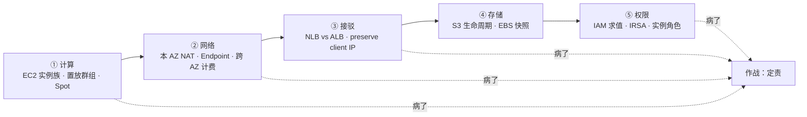
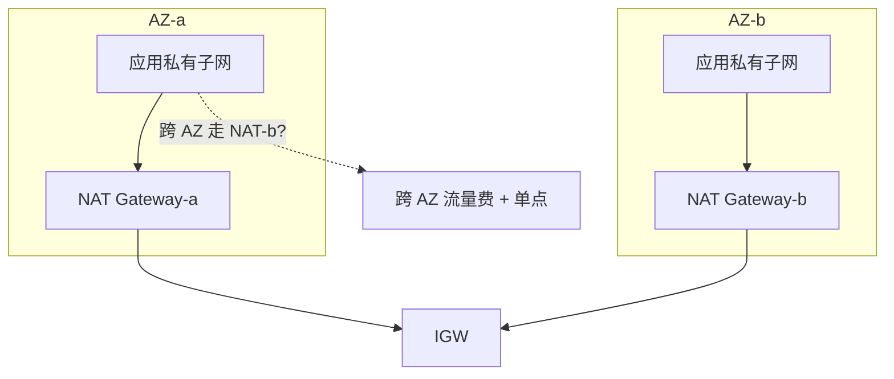
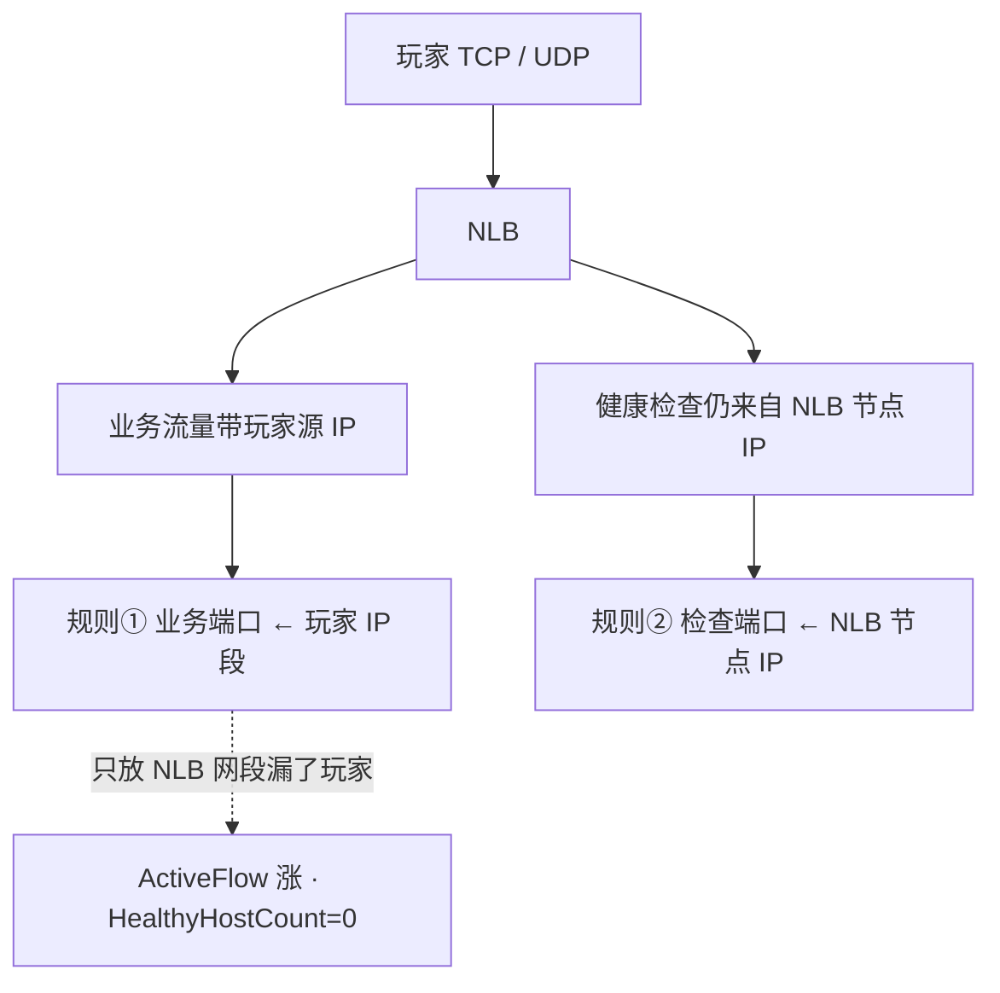
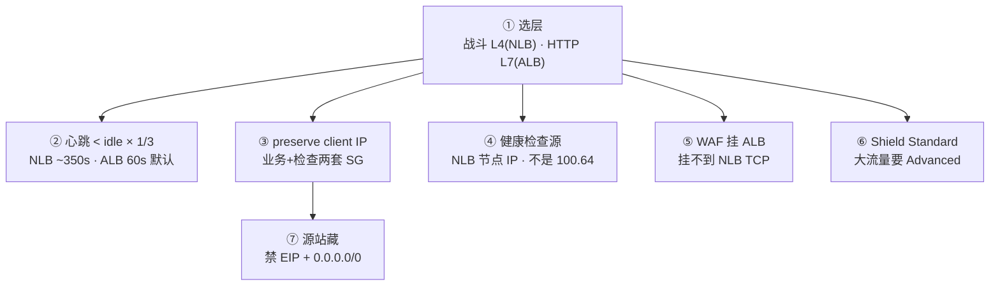
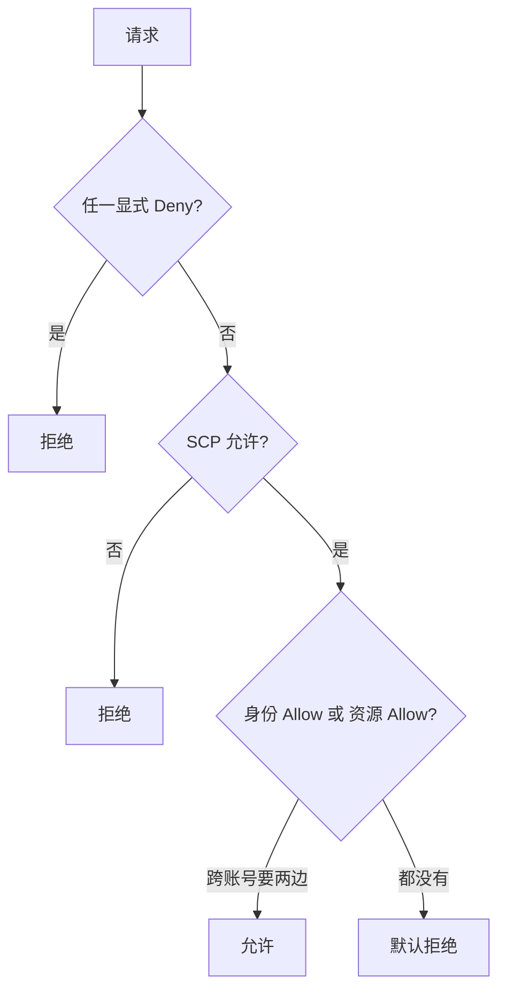
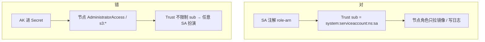
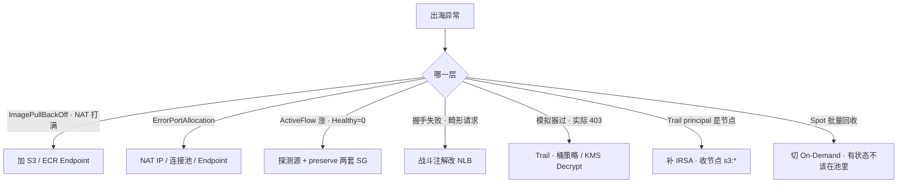

# AWS 生产

> 大家好，欢迎来到这次分享。开讲之前，先带大家回到一个现场：
> 出海开服前夜，50 个 EKS 节点同时拉 4GB 镜像，Pod 全 `ImagePullBackOff`——NAT Gateway 带宽和处理费一起打满。群里有人要扩 NAT，另有人把战斗 Service 注解成了 ALB。
> 这一章讲完，你会知道当时「扩 NAT」和「战斗 Service 注解成 ALB」各自错在哪，以及本 AZ NAT、NLB preserve client IP 该怎么验收。
> **本章回答的问题**：一个出海游戏服在 AWS 上落地要过哪几关——计算选型、网络坑、LB 接驳、存储配置、权限收口，每关什么会炸、怎么一眼定责。
> **本章不讲**：VPC / SG / NACL / NAT 通用模型 → [01](../01-云网络与安全/)；国内 ECS / CLB / OSS 组合 → [06](../06-阿里云生产/)；多云对照、迁移、中国区 vs 阿里 → [09](../09-多云对照/)；RDS / ElastiCache / 备份 RPO → [03](../03-云上存储与数据库/)；Spot / RI / NAT 处理费 / 跨 AZ 账单治理 → [05](../05-成本治理/)；泄漏应急、多账号、SCP → [04](../04-IAM与多账号/)；火山对照 → [08](../08-火山引擎生产/)。

**标记**：🎯重点 · 🔥难点 · ⭐常考 · 🔧实操

**怎么听这场分享**：先把第一节「出海游戏服在 AWS 上的落地」五关看熟——计算→网络→接驳→存储→权限；第二到第七节一关一节（含 EKS），第八节专门讲开头那个 ImagePullBackOff 现场怎么定责。每一节讲完会提示对应练习题，趁热打铁。

---

## 一、一张图：出海游戏服在 AWS 上的落地

> 🎯 **一句话**：出海落地五关——计算选型、网络坑、LB 接驳、存储配置、权限收口；通用模型在 01 讲过，本章只讲 AWS 特有的产品名和坑。



**读图**：

- 主线是一个出海游戏服从选机型到上线的五关，每关都有 AWS 特有的坑。通用 VPC / SG / NAT 模型在 [01](../01-云网络与安全/) 讲过，本章只补「这家的产品名、这家特有的坑」。
- 中国区（北京 / 宁夏）和 Global 是两套账号、两套 IAM，**同一把 AK 打不通**——出海写 Global region，中国区高防弱于阿里，不要按 Global Shield 或阿里游戏盾套。
- 五关都可能出事，右下角 `作战` 是排障入口——先回到「哪一关病了」，不是先改 SG 或重启进程。


好，主图装进脑子了。接下来从「计算」开始——EC2 实例族、置放群组与 Spot。

本节对应练习题 Q1。

---

## 二、计算：EC2 实例族、置放群组与 Spot

> 🎯 **一句话**：战斗节点用 C 系 On-Demand + 置放群组 cluster；禁 T3 / T4g；Spot 约 2 分钟中断只给无状态。🔥⭐

### EC2 实例族与 Graviton ⭐

**EC2（Elastic Compute Cloud）** 是 AWS 的虚拟机。实例族命名规则：第一个字母是系列，第二个字母是代数，可选后缀是特性。

- **C 系列**（计算优化）：战斗服、网关首选。`c7i`（Intel）、`c7g`（Graviton / ARM）。
- **M 系列**（通用）：逻辑服、EKS 系统节点。`m7i`、`m7g`。
- **R 系列**（内存）：Redis、匹配服。`r7i`、`r7g`。
- **T 系列**（可突发）：T3 / T4g——⭐**禁用于游戏**。CPU credit 耗尽即限速，和阿里 `ecs.t` 同一类事故。出海省钱用 Graviton（C7g / M7g）可以，但要过编译和延迟测试，不要空口「ARM 一定更快」。

> ⚠️ **别混**：T 系列「可突发」不等于「能扛峰值」——credit 耗尽后钉到基线性能，战斗服会卡到踢人。和阿里 t 系列是同一个坑，只是产品名叫 T3 / T4g。

### 置放群组：战斗服低延迟 🔧

**置放群组（Placement Group）** 是 EC2 的一种部署策略，控制实例在物理机架上的分布。三种模式：

- **cluster**：实例放进同一个机架，实例间网络延迟最低（μs 级）。战斗服、帧同步首选——但整个机架挂了全部没。
- **spread**：实例分散到不同机架，每台机架最多放一个实例——适合少量关键节点的高可用。
- **partition**：实例分散到分区，每分区可放多实例——适合大数据 / 分布式队列。

游戏战斗服用 **cluster**：同 AZ 同机架，实例间延迟极低。代价是机架级故障域——RTO 按「踢人重建」写预案，和 01 讲的「战斗服常单 AZ」是同一逻辑：Session 在内存，物理故障切换本来就要踢人。

cluster 置放群组有容量上限——一个机架能放的实例数有限（通常按机架物理端口和带宽算）。扩容前确认 cluster 还能放几台，不要扩了发现 `InsufficientCapacity`。spread 每机架限一台，扩到 7 台以上要跨机架——上限受 AZ 内机架数限制。

> 📝 **面试**：「战斗服用 cluster 置放群组降延迟；数据面多 AZ 做容灾；两者不矛盾——cluster 是同一 AZ 内的机架策略，多 AZ 是跨机房的故障域。」

### 启动模板与 Auto Scaling ⭐🔧

**启动模板（launch template）** 钉死 AMI、实例类型、安全组、实例角色、子网、标签。**Auto Scaling 组（ASG）** 按模板扩缩容。控制台手开的「临时一台」没有标签，活动后找不到、关不掉——按量扩必须走启动模板。启动模板有版本号，改了 AMI 或实例类型要建新版本，不要原地改——ASG 引用具体版本，回滚切旧版本。

```bash
aws autoscaling describe-auto-scaling-groups \
  --query 'AutoScalingGroups[].{Name:AutoScalingGroupName,Desired:DesiredCapacity,LC:LaunchTemplate.LaunchTemplateName}' --output table
# |     Name      |  Desired  |       LC         |
# |  fight-asg    |  8        |  fight-lt-v3     |  # ← 战斗节点组按模板扩
# |  system-asg   |  3        |  system-lt-v2    |  # ← EKS 系统节点 On-Demand
```

**EIP（Elastic IP）** 是 AWS 的固定公网 IP。NAT Gateway 绑 EIP 做出网 SNAT；堡垒机绑 EIP 做 SSH 入口。逻辑服 / RDS / Redis **不绑 EIP**——源站裸奔是流量炸弹（01）。EIP 不关联实例时按小时收费，闲置 EIP 要定期巡检。生产规则：EIP 只给 NAT Gateway 和堡垒机；定期 `aws ec2 describe-addresses` 扫闲置 EIP 清理。

### Spot：约 2 分钟中断 🔥⭐

> 💡 **打个比方**：Spot 像「随时可能被叫走的临时工」——约 2 分钟通知，有状态战斗服进池等于自找踢人。

**Spot 实例**（竞价实例）是 AWS 回收闲置算力的折扣实例（最高 ~90% off），代价是 AWS 随时收回。中断前约 **2 分钟**告警：实例元数据 `/latest/meta-data/spot/instance-action` 或 EventBridge `EC2 Spot Instance Interruption Warning`。

2 分钟不够完整合服，只够：摘流量、持久化内存态、SIGTERM 让进程优雅退出。没接中断信号的进程 = 直接断电。EKS 上没配 AWS Node Termination Handler，Pod 直接没了，调度器还在往死节点派活。两种中断信号都要接——元数据 `/latest/meta-data/spot/instance-action` 轮询有延迟，EventBridge 推送更快但需要 SNS / Lambda 消费链路。

- **何时用**：CI、压测、无状态统计、可重试 Job。
- **何时不用**：有状态战斗服、单点 Redis、RDS 替代。
- Spot 和 On-Demand **分两个 ASG**，不要一个组混容量类型还指望调度器懂业务。

EKS 上 Spot 节点组要配 **AWS Node Termination Handler**：监听 EventBridge 的 Spot 中断事件，自动 cordon 节点 + drain Pod。没配的话 Pod 直接没了，调度器还在往死节点派活——`kubectl get po` 看到一堆 `Terminating` 但新 Pod 一直调度到刚回收的节点上。

**RI（Reserved Instances，预留实例）** 和 **Savings Plan** 是承诺用量的折扣。RI 锁定具体实例族；Compute SP 更灵活，可跨规格族，盖 EC2 / Fargate / Lambda。两者都是承诺用量——用量掉下去一样浪费。Compute SP **盖不住 NAT 和流量**——承诺买错品类是第二常见浪费。先砍闲置再买承诺，按 90 天最小常驻，不按开服峰值。

RI 和 Savings Plan 不是「买了就便宜」——买了 100 台 `c7i.xlarge` 的 RI，实际只跑 60 台，剩下的 40 台承诺照样扣费。Savings Plan 按「每小时花 $X」承诺，比 RI 灵活但同样要用量预测。生产规则：先砍闲置（关掉不用的 EC2 / EIP / NAT），再买 90 天最小常驻的承诺，不按开服峰值买——开服后量掉下去承诺就浪费了（05）。

> ⚠️ **别混**：Spot 的 2 分钟是「通知到回收」的窗口，不是「能优雅退出」的保证——有状态工作负载根本不该在 Spot 池里。省钱用规格优化（含 Graviton）要过延迟测试，不是换 T 系列。


计算讲完。网络：本 AZ NAT、跨 AZ 计费与 Endpoint。

本节对应练习题 Q1、Q2。

---

## 三、网络：本 AZ NAT、跨 AZ 计费与 Endpoint

🔥 大白话：**NAT Gateway 按处理费计**，跨 AZ 再加一刀。拉 ECR/S3 优先 Endpoint，别让开服镜像洪峰打满 NAT。

> 🎯 **一句话**：本 AZ NAT 避免跨 AZ 流量费；S3 / ECR 走 VPC Endpoint 不穿 NAT；VPC CNI 按 Pod 占 IP。⭐🔥

### 本 AZ NAT 与跨 AZ 流量计费 ⭐🔥

AWS 跨AZ流量计费：每方向约 $0.01/GB（区域不同有差异），逻辑服东西向一打，跨AZ流量计费先于延迟爆。生产规则：**每 AZ 一个 NAT Gateway**，私有子网路由表指本 AZ 的 NAT。

中国区和 Global 的跨 AZ 费率不同，中国区通常更贵。三个 AZ 两两打通的流量费 = `3 × 2 = 6` 条方向的跨 AZ 流量——逻辑服东西向 RPC 密集时，账单比延迟先爆。这不是「多 AZ 不好」，而是「多 AZ 的东西向要控制」：数据面跨 AZ（RDS 主备同步、NAT 出网）不可避免，计算面的东西向 RPC 可以用同 AZ 亲和调度减少跨 AZ。

> 💡 **打个比方**：三个 AZ 各有前台（NAT Gateway），员工寄快递（出网）走自己前台就好。如果只有一个 AZ 有前台，另外两个 AZ 的快递要绕路跨区——既要等更久，又要多交跨区费。NAT Gateway 处理费按处理量计费，大流量穿 NAT 的话处理费可能贵过 EC2 本身。



**读图**：每个 AZ 的私有子网 `0.0.0.0/0` 指本 AZ 的 NAT Gateway，再统一走 IGW 出公网。如果只在一个 AZ 放 NAT，其他 AZ 的出网流量要先跨 AZ——产生跨 AZ 流量费，且 NAT 所在 AZ 挂了全部出网都断。

### VPC Endpoint：S3 / ECR 不穿 NAT 🔧⭐

**VPC Endpoint** 让 VPC 内访问 AWS 服务不走公网、不穿 NAT。两种：

- **Gateway Endpoint**：S3 / DynamoDB 专用，路由表层面转发，不收处理费。开服前夜拉镜像走这个。Gateway Endpoint 改的是路由表——私有子网的 `pl-xxx`（S3 前缀）指向 Endpoint，不走 NAT 不走 IGW。
- **Interface Endpoint**：ENI 上挂一个私有 IP，按小时 + 处理费计费。ECR、Secrets Manager、STS 等用这个。Interface Endpoint 在每个 AZ 创建一个 ENI——跨 AZ 访问 Interface Endpoint 也会产生跨 AZ 流量费，所以每 AZ 都要有。

没配 Endpoint 时，EKS 节点拉 ECR 镜像走 NAT 出公网。50 节点同时拉 4GB 镜像，NAT Gateway 带宽和处理费一起爆，Pod 全 `ImagePullBackOff`。止血先加 S3 Gateway Endpoint + ECR Interface Endpoint，不要先扩 NAT 带宽硬扛。ECR 镜像层存在 S3，ECR API 走 Interface Endpoint——两个都要配，只配一个不够。

```bash
aws ec2 describe-vpc-endpoints \
  --query 'VpcEndpoints[].{Service:ServiceName,Type:VpcEndpointType,State:State}' --output table
# |              Service              |   Type   |   State   |
# |  com.amazonaws.s3                | Gateway  |  Available |  # ← S3 走 Gateway 不收处理费
# |  com.amazonaws.ecr.api           | Interface|  Available |  # ← ECR 走 Interface
```

### VPC CNI：IP 按 Pod 占 🔥

**VPC CNI** 是 EKS 的容器网络插件，给每个 Pod 分配 VPC IP（不是用 overlay）。好处是 Pod 和 EC2 在同一网络层，没有 NAT 开销；代价是 IP 消耗快——`aws-node` 日志 `failed to assign IP`、Pod Pending。

止血：加子网或开 **prefix delegation**（给 ENI 分配前缀而非单个 IP）。别用缩节点「看起来像资源不够」。规划时按 ENI 数量算 maxPods，不要按「机器还能 ssh」。峰值 Pod × 1.5 预留（01）。

```bash
# VPC CNI 开 prefix delegation 后，一个 ENI 拿一个 /28 前缀 = 16 个 IP
kubectl describe po <pending-pod>
#   Warning  FailedScheduling  ... failed to assign IP    # ← 子网 IP 耗尽
# ← 加子网或开 prefix delegation，不缩副本
```

VPC CNI 的 `warm-ip-target` 和 `minimum-ip-target` 参数控制预分配：`warm-ip-target=10` 表示每个节点预留 10 个 IP 给新 Pod。游戏开服时 Pod 突然扩容，预分配不够会 Pending——值要按峰值速率配，不是按均值。

数据子网可以不配 `0.0.0.0/0`，强制无出网。RDS / Redis 不该自己出公网拉东西。出网路径留给应用私有子网的本 AZ NAT。和阿里一样，数据子网的路由表只有 local 和 VPC 内路由，没有 `0.0.0.0/0` → NAT 或 IGW——数据面的 RDS / Redis 从网络层就出不了公网，不需要靠 SG 单独拦。

> 📝 **面试**：「本 AZ NAT 避免跨 AZ 流量费；S3 / ECR 走 VPC Endpoint 不穿 NAT；VPC CNI 按 Pod 占 IP，`failed to assign IP` 加子网或 prefix delegation。」


网络讲完。大家想想：50 节点同时拉镜像，第一刀是扩 NAT 吗？很多人会答「是」——半对，更要问为什么走公网 NAT、有没有 Endpoint。

本节对应练习题 Q2、Q3。

---

## 四、接驳：NLB vs ALB 与 preserve client IP

> 🎯 **一句话**：游戏 TCP / UDP 走 NLB，HTTP 走 ALB + WAF；preserve client IP 时 SG 写两套规则；健康检查源是 NLB 节点 IP 不是 `100.64`。⭐🔥

### ALB vs NLB ⭐🔥

| | ALB | NLB |
|--|-----|-----|
| 协议 | HTTP / HTTPS / gRPC / WebSocket | TCP / UDP / TLS |
| 延迟 | L7 解析多一跳 | L4，延迟和 PPS 适合战斗 |
| WAF | 可关联 | 挂不到 TCP / UDP 端口 |

自定义 TCP / UDP 游戏协议用 **NLB**。战斗 Service 注解成 ALB，自定义协议被当畸形 HTTP 请求，握手失败。WebSocket 若是标准 HTTP 升级可以用 ALB，但 idle timeout 必须小于心跳的 1/3——ALB 默认 60s，最长 4000s；NLB TCP idle 约 350s。HTTP 登录、支付、运营、EKS Ingress 走 ALB。WAF 关联在 ALB / CloudFront 上，不要幻想 WAF 能挂到 NLB 的 TCP 端口。

NLB 目标组（Target Group）的健康检查端口和业务端口可以不同——生产建议用独立健康检查端口，检查口要轻、不占业务线程。目标组里的实例注册后，NLB 按配置的间隔和阈值判定健康 / 不健康。注册了实例但 `HealthyHostCount=0` = 健康检查路径不通，不是 NLB 没收流量。

### preserve client IP：两套 SG 规则 🔧🔥

> 💡 **打个比方**：preserve client IP 像「快递直接送到房间」——后端既要放 LB 的探测源（前台来敲门确认你在不在），也要放玩家 IP（真正的快递要进来），两套规则缺一不可。

**client IP preservation**（preserve client IP）是 NLB 的功能：开启后后端看到的是**玩家真实 IP**而不是 NLB 的 SNAT IP。好处是方便按 IP 封禁、做风控；代价是后端 SG 规则变复杂——业务端口要放玩家 IP 段（可能 `0.0.0.0/0`），**同时**健康检查端口仍要放行 NLB 节点 IP。SSH 绝不能跟着重开。



**读图**：preserve client IP 打开后，业务流量和健康检查流量源地址不同。漏放玩家 IP 段 → `ActiveFlowCount` 涨而 `HealthyHostCount` 为 0，流量在 LB 黑洞。`source_security_group_id = lb_sg` 这招在 preserve client IP 时**对业务端口失效**——因为后端看到的源是玩家 IP 不是 LB，得退回写 CIDR 段。

关闭 preserve client IP 后，后端看到的是 NLB 的 SNAT IP——此时 `source_security_group_id = lb_sg` 对业务端口也有效，一套规则就够。是否开 preserve client IP 是业务需求（风控、IP 封禁）驱动的，不是技术性能驱动的——开了多一套 SG 规则，不开多一层风控能力。

生产建议：开服前决定是否开 preserve client IP，不要开服后临时改——改了 SG 规则结构就变了，要重新验证两套规则。开了 preserve client IP 的目标组，Terraform 里要写明业务端口的源是 CIDR 段而不是 `source_security_group_id`，否则 IaC 和实际不一致。

### 健康检查源：不是 `100.64` ⭐🔧

NLB 的健康检查源是 **NLB 节点 IP**（NLB 自己的 ENI），不是阿里的 `100.64.0.0/10`。后端 SG 没放行 NLB 节点 IP → 健康检查失败 → `HealthyHostCount` 为 0 → 玩家连得上 NLB 进不了服。和阿里 CLB 全红是同一类故障：探测源不是你。阿里放 `100.64.0.0/10`；AWS 放 NLB 节点 IP / LB SG。照抄必挂（01）。

```bash
aws elbv2 describe-target-health --target-group-arn <tg-arn> \
  --query 'TargetHealthDescriptions[].{Target:Target.Id,State:TargetHealth.State}' --output table
# |  Target   |   State   |
# |  i-xxx    |  healthy  |
# |  i-yyy    |  unhealthy|  # ← 检查端口不是业务端口、或 SG 没放 NLB 节点
```

### 跨 AZ NLB

关掉 NLB 跨 AZ 负载可减少跨 AZ 流量费，适合区服绑单 AZ。代价是该 AZ 目标全挂时流量不自动漂。游戏常按区服绑 AZ，显式选择并写进预案——不要默认开着却说「已经多 AZ」。开了跨 AZ 的 NLB 也不等于「多 AZ 高可用」——如果后端实例全在一个 AZ，流量跨 AZ 打过来再打回去，费翻倍还没容灾。

### Shield Standard vs Advanced ⭐

**AWS Shield Standard** 对所有 AWS 账户默认开启，免费，抗常见 L3 / L4 DDoS（SYN flood、UDP 反射）。**Shield Advanced** 是付费服务，提供更高防护门槛、DDoS 响应团队（SRT）、费用保护和 DDoS 事件通知。大流量游戏仍要 Advanced 或第三方高防，且同样要藏源站——Shield 只保护「打到 AWS 边界的流量」，源站 IP 泄漏后直打 EC2，Shield Standard 挡不住（01）。

Shield Advanced 的「费用保护」是它被低估的价值——被 DDoS 攻击时，Shield Advanced 会覆盖因攻击产生的额外费用（NAT 处理费、CloudFront 流量费、EC2 Auto Scaling 扩容费）。大流量游戏被打一次，NAT处理费可能贵过 Shield Advanced 年费。但前提是源站 IP 没泄漏——Shield 保护「打到 AWS 边界的流量」，不保护泄漏的源站 IP。

> ⚠️ **别混**：Shield Standard 不等于高防 IP——它抗常见 L3 / L4，但大流量攻击仍可能触发黑洞。Shield Advanced 提供更高门槛和 SRT 支持但收费。两者都不能替代「源站 IP 不泄漏」。

### ACM 证书

**ACM（AWS Certificate Manager）** 管理 TLS 证书，挂在 ALB / NLB-TLS 上做卸载，私钥不出网。NLB TLS 卸载后后端可以是明文——VPC 内要清楚你是否接受这种配置。ACM 证书自动续期，不需要手动更新——但证书只在 AWS 服务（ALB / NLB / CloudFront）上挂载时才能用，不能导出私钥到 EC2 上自己 Nginx 用。

EKS Ingress 默认用 ALB（AWS Load Balancer Controller 注解 `alb.ingress.kubernetes.io/scheme: internet-facing`）。战斗 Service 用 `service.beta.kubernetes.io/aws-load-balancer-type: nlb` 注解切到 NLB。注解写错 = 选错 LB 层——Ingress 的 ALB 注解套到战斗 Service 上，握手全部失败（见 Q2）。

### 收束：游戏长连接凭什么接对层又不被踢



**读图（分组）**：①选层是入口决策（L4 / L7）；②心跳与 idle 对齐是防静默踢；③④是 NLB 两套源地址陷阱（preserve 两套规则、健康检查源不是 `100.64`）；⑤⑥是防御分工（WAF 挂 ALB、Shield 抗 L3 / L4）；⑦是源站隐藏。

> ⚠️ **别混**：这套机制**不保证**「同名 LB 跨云默认值一样」（idle 每家不同）、**不保证**「WAF 能接自定义 TCP」（只解析 HTTP）、**不保证**「Shield Standard 能挡所有 DDoS」（大流量要 Advanced，且源站要藏）。

> 📝 **面试**：「游戏 TCP / UDP 走 NLB；HTTP 走 ALB + WAF；preserve client IP 时业务 + 检查两套 SG；健康检查源是 NLB 节点 IP 不是 `100.64`；Shield Standard 免费，大流量要 Advanced。」


接驳讲完。记住口诀：**战斗长连接用 NLB，别随手注解 ALB**。

本节对应练习题 Q4、Q5。

---

## 五、存储：S3 生命周期与 EBS 快照

> 🎯 **一句话**：S3 生命周期按前缀不整桶一刀切；403 常见原因是 Block Public / OAC / KMS；EBS 快照是 AMI 的基础。🔧⭐

### S3 生命周期：按前缀 🔧⭐

热更、日志、Terraform state、备份都进 S3。生产规则按**前缀**，不要整桶一条规则：

- `res/current/*`：标准，不自动归档、不过期。
- `res/old/*`：30 天 → IA，180 天 → Glacier。
- `logs/*`：7 天标准，30 天过期。
- `tfstate/*`：标准 + 版本控制，禁止过期删除。

**Intelligent-Tiering** 适合访问模式说不清的桶；热更「最新包」访问极热，不适合乱扔 Glacier。Glacier 取回有时间和钱，回档演练要真拉一次，没真 restore 过的 RPO 是假的（03）。Glacier 有三档取回：Expedited（1-5 分钟，最贵）、Standard（3-5 小时）、Bulk（5-12 小时，最便宜）。回档演练用 Standard 就够——但要知道等 3-5 小时是什么体感，不是「S3 拉一下就回来」。

### S3 权限：Block Public / OAC / KMS 🔥

S3 403 最常见原因不是「文件不存在」，而是：

- **Block Public Access**：账号级阻止公共读，优先级最高。
- **OAC（Origin Access Control）**：CloudFront 回源 S3 的权限控制，取代旧的 OAI。
- **KMS `kms:Decrypt`**：桶开了 KMS 加密，调用方缺 `kms:Decrypt` 权限。

```bash
aws s3api get-object --bucket my-bucket --key res/current/v1.2.3.zip /tmp/test.zip
# An error occurred (AccessDenied) when calling the GetObject operation  # ← 不是 404
# ← 先查 CloudTrail 的 Action 和 Resource：是 Block Public? KMS? 桶策略?
```

state 桶禁止 List + Delete 给普通角色。版本控制防误删；管理删除加 MFA Delete。和阿里 OSS 对照：私有桶、内网 endpoint、版本在 key 里、禁止公共读，原则相同。AWS 多出来的坑是 Block Public Access、OAC、KMS `kms:Decrypt`——关掉 ACL，用 Bucket Policy + IAM。

生产规则：S3 桶默认加密开 KMS；Block Public Access 账号级全开；CloudFront 回源用 OAC 不用公共读；桶策略白名单最小化。热更桶对玩家只通过 CloudFront 分发，不直接给 S3 URL——直连 S3 会暴露桶名和前缀结构。日志桶和热更桶分开——日志桶配 lifecycle 过期，热更桶 `current` 永不过期。S3 跨 region 复制（CRR）用于灾难恢复——热更桶复制到 DR region，主 region 挂了仍有副本。但 CRR 要额外存储费和跨 region 流量费，按 RPO 需求决定是否开。

### EBS 与快照 ⭐

**EBS（Elastic Block Store）** 是 EC2 的持久卷。**快照（Snapshot）** 是 EBS 卷的增量备份，存在 S3。快照是 **AMI（Amazon Machine Image）** 的基础——AMI = 快照 + 元数据，启动模板（launch template）引用 AMI 来扩节点。

生产规则：系统盘定期做快照（AWS Backup 或 Data Lifecycle Manager 自动化）；扩节点前确认 AMI 是最新的；快照恢复成新卷后要 `xfs_repair` / `fsck`。EBS CSI 驱动用 IRSA 访问快照——少一个权限就 controller 日志 403，PVC 一直 Pending。

EBS 卷类型：`gp3`（通用 SSD，性价比首选）、`io2`（高 IOPS，数据库）、`st1`（吞吐优化，日志归档）。游戏系统盘用 `gp3`；Redis 数据盘按 IOPS 需选用 `io2`。卷性能和实例性能要匹配——一台 `c7i.xlarge` 挂 `gp3` 3000 IOPS 的盘，磁盘先成瓶颈。`gp3` 可以独立于实例调 IOPS 和吞吐，不用换盘型——比 `gp2` 灵活，是当前默认选择。

快照是增量的：第一次全量，后续只存变化块。恢复时 AWS 自动组装最新状态，不需要你手动拼。但跨 region 复制快照要显式配置——灾难恢复 region 没有快照等于没有 DR。跨 region 快照复制有流量费（跨 region 传输），按 DR 的 RPO 决定复制频率——实时复制最安全但最贵，每日复制够多数场景。

> ⚠️ **别混**：快照是 EBS 级别的备份，不是实例级别的——实例上的内存态和临时盘数据不在快照里。有状态战斗服的内存态要应用自己持久化，快照只管磁盘。AMI 是快照 + 元数据，扩节点前确认 AMI 版本和启动模板一致。


存储讲完。权限：IAM 求值与 IRSA。

本节对应练习题 Q6。

---

## 六、权限：IAM 求值与 IRSA

大家想想：节点实例角色给了 S3 全开，Pod 是不是就安全了？错了。🔥 **IRSA 按服务账号收权**，别靠节点角色放大爆炸半径。

> 🎯 **一句话**：IAM 显式 Deny 最大；跨账号要两边允许；模拟器过了实际 403 以 CloudTrail 为准。⭐🔥

### IAM 求值四步 ⭐🔥

**IAM（Identity and Access Management）** 求值顺序，能复述：

1. **显式 Deny**（身份策略、资源策略、SCP、权限边界任一 Deny）→ 拒绝。
2. **组织 SCP** 不允许的操作 → 拒绝。
3. **身份策略 Allow 或资源策略 Allow**（跨账号必须两边都允许）→ 允许。
4. **默认拒绝**：没有 Allow 就是拒绝，不是「没写就过」。



**读图**：Deny 永远优先，不管它来自哪一层。跨账号访问必须身份策略和资源策略都 Allow——身份策略写得再满，桶策略没加就是 403。

**权限边界（Permissions Boundary）** 是角色「最多能有」的上限，防自助开权限的人给自己 `*`。和生产最小权限是两层：边界是天花板，策略是实际开门的钥匙。SCP 是组织对账号的天花板。两层都是防「自己给自己开 `*`」。

三个角色容易混：**AWS（控制面）** 托管 EKS 控制面 / RDS / NLB 等；**你（数据面运维）** 负责节点组 / CNI / 控制器 / SG / 路由；**IAM（身份）** 管谁是什么角色、谁能扮演什么。出了事先分清是哪一角色的锅：控制面挂了找 AWS Support；节点组 / SG / 路由是你的；权限 403 是 IAM 策略或 Trust 的问题。简历写 Global region，不要把中国区 AWS 当阿里云用——两套账号、两套 IAM、同一把 AK 打不通。

### 模拟器过了实际 403 🔧🔥

> 💡 **打个比方**：IAM Policy Simulator 像笔试——身份策略写得对，模拟器给你打勾。但实际请求要经过桶策略、KMS、资源策略这些「面试官」——模拟器没带这些，过了不等于面试过了。

```bash
aws cloudtrail lookup-events \
  --lookup-attributes AttributeKey=EventName,AttributeValue=AccessDenied --max-results 5
# |  Event Name   |  Username  |  Resource                              |
# |  GetObject    |  game-role |  arn:aws:s3:::my-bucket/res/.../v1.zip |  # ← Trail 里看 Action 和 Resource
# |  Decrypt      |  game-role |  arn:aws:kms:...:key/xxx               |  # ← 缺 kms:Decrypt
```

**STS（Security Token Service）** `AssumeRole`：人从 SSO 扮演角色，程序从 IRSA / Instance Profile 换临时凭证。临时凭证有有效期（15min–12h），过期后自动刷新——比永久 AK 安全得多。永久 AK 只留给无法用角色的破旧系统，并强制轮换 + 告警。生产规则：新建应用一律走 IRSA / Instance Profile，不写 AK 进 Secret 或 ConfigMap。旧系统遗留的 AK 要排期迁移到 IRSA，并强制轮换 + 告警。AK 泄漏的发现靠 CloudTrail——异常 IP 调用、异常时间调用、异常 API 组合都是 AK 泄漏信号（04）。

止血：Pod 403 时去 CloudTrail 搜 `AccessDenied` 事件的 Action 和 Resource，不要猜策略，不要加 `AdministratorAccess` 验证「是不是权限问题」。模拟器没带资源策略会误导。CloudTrail 的事件有几分钟延迟，但它是**实际发生了什么**的真相——模拟器是「理论上应该怎样」，两者不一致时永远信 Trail。

### IRSA：SA 绑角色，Trust 限制 sub 🔧⭐

**IRSA（IAM Roles for Service Accounts）** 给 Kubernetes ServiceAccount 注解 `eks.amazonaws.com/role-arn`，Pod 用 OIDC 换临时凭证访问 S3 / Secrets Manager，**节点 Instance Profile 不需要 `s3:*`**。

**实例角色（instance profile）** 是 EC2 节点的 IAM Role，给节点拉镜像、写日志用的权限。真正的应用权限放 IRSA——节点角色必须窄，否则任一 Pod 逃逸都能搬空桶。

Trust Policy 必须限制 `sub = system:serviceaccount:ns:sa`，否则集群里任意 SA 都能扮演该角色。EKS 的 OIDC Provider 和 IRSA 角色的 Trust Policy 是一对——Provider URL 要和集群 OIDC 发卡方匹配，Trust 的 `sts:ExternalId` / `sub` 条件要精确到 namespace + SA 名。



**读图**：对的路径——SA 绑角色 + Trust 限制到具体 SA + 节点角色瘦。错的路径——AK 进 Secret / 节点角色过宽 / Trust 不限制 sub。EBS CSI、AWS Load Balancer Controller 各自独立 IRSA 角色；少一个权限就 controller 日志 403，Service / PVC 一直 Pending。

**IMDSv2**：实例元数据强制 token，防 SSRF 把角色凭证偷走。新账号默认开；旧镜像还在 IMDSv1 要排期关。凭证从元数据来，所以节点角色必须瘦。

```bash
# 验证 IMDSv2 是否强制（IMDSv1 返回不需要 token，IMDSv2 返回需要）
curl -s -H "X-aws-ec2-metadata-token-ttl-seconds: 300" -X PUT http://169.254.169.254/latest/api/token
# gAAAA...  # ← 有 token = IMDSv2 已开
# 没有 token 直接 curl 169.254.169.254/latest/meta-data/ 也能返回 = IMDSv1，要排期关
```

> ⚠️ **别混**：IRSA 和实例角色是两层——IRSA 是 Pod 级别的应用权限，实例角色是节点级别的系统权限。节点角色给了 `s3:*` 就不需要 IRSA？错——任一 Pod 逃逸都能用节点凭证搬空桶。和 ACK RRSA 是同一模型（Pod 扮角色、绑具体 SA、节点角色要瘦），名字不同，Trust / OIDC 细节按各自文档，不要把 AWS JSON 粘到 RAM。

> 📝 **面试**：「显式 Deny > SCP > Allow > 默认拒绝；跨账号要两边允许；模拟器没带资源策略会误导，以 CloudTrail `AccessDenied` 为准；IRSA Trust 限制 `sub = system:serviceaccount:ns:sa`，节点角色要瘦。」


权限讲完。EKS 托管边界与 VPC CNI。

本节对应练习题 Q7、Q8。

---

## 七、EKS：托管边界与 VPC CNI

> 🎯 **一句话**：EKS 托管控制面，节点组 / CNI / 升级 / RPO 仍是你的；Fargate 不跑战斗服。⭐

### 托管了什么、你还管什么 ⭐

**EKS（Elastic Kubernetes Service）** 托管控制面（API Server / etcd），跨 3 AZ，你 ssh 不进。你负责：

- **节点组**：On-Demand / Spot 分开；战斗服用 EC2 节点组。
- **VPC CNI**：按 Pod 占 IP，IP 不够加子网 / prefix delegation。
- **CoreDNS / 控制器**：EBS CSI、AWS LB Controller 各自 IRSA。CoreDNS Deployment 副本数要和节点数匹配——默认 2 副本扛不住大规模集群的 DNS 查询，Pod 拉镜像时 ECR 域名解析超时表现成网络问题。
- **升级节奏**：控制面和节点版本差不能跨太大；先 cordon / drain，PDB 挡着不要 `--force`。升级前停变更窗口、确认 EBS CSI / LB Controller 版本兼容。
- **RPO / 停变更**：托管不等于跳过这一章。

EKS 升级是滚动的：先升控制面（AWS 负责），再升节点组（你负责）。节点 drain 时 PDB（Pod Disruption Budget）挡着，`kubectl drain` 会被 PDB 卡住——不要 `--force` 强踢有状态 Pod，否则数据面写了一半被中断。战斗服节点 drain 要和合服 / 踢人流程联动，不是运维单独 `kubectl drain` 一下就完了。

**Fargate** 适合无状态小服务，有状态游戏进程要 EC2 节点——要内核参数、hostNetwork、固定资源、可预期 drain。和 ACK 的 ECI 同一条红线。Fargate 不支持 DaemonSet——日志收集、网络插件要改 Sidecar 模式，不是直接照搬 EC2 节点组的部署。

EKS 和 ACK 的对照（只列关键差异，不重复 01-05 通用概念）：EKS 控制面按小时收费（$0.10/h/cluster），ACK 控制面免费；EKS 用 VPC CNI（Pod 占 VPC IP），ACK 用 Terway 或 Flannel；EKS Pod 身份用 IRSA（OIDC），ACK 用 RRSA。名字不同，模型相同——Pod 扮角色、绑具体 SA、节点角色要瘦。Trust / OIDC 细节按各自文档，不要把 AWS JSON 粘到 RAM。EKS 的 kubectl 体验和 ACK 一样——都是标准 Kubernetes API，差异在节点组管理、CNI、身份集成这些 AWS / 阿里特有的周边。EKS 节点组的 `nodeRepair` 和 `autoScaling` 配置和 ACK 节点池概念不同——EKS 用 ASG + launch template，ACK 用节点池 + 弹性配置。

> ⚠️ **别混**：EKS 托管的是**控制面**，不是你的**应用**——节点组挂了、CNI IP 耗尽、控制器缺权限导致 Service Pending，都是你的事。控制面 Ready 不等于集群可用。

### CloudWatch vs Prometheus ⭐

**CloudWatch** 管 EC2 / RDS / NLB / NAT 的云厂商指标、日志、告警、EventBridge。优点是开箱、和 Auto Scaling / Spot 事件一体。缺点：自定义指标贵、基数一高账单吓人、PromQL 生态没有、游戏业务指标（CCU、登录成功率）用 Prometheus 更自然。

生产常见：**CloudWatch 管云资源和 AWS 事件，Prometheus + Grafana 管应用黄金指标，日志用 CloudWatch Logs 或 Loki。** 不要把「全在 CloudWatch」说成高级——大厂出海多数是混合。CloudWatch 自定义指标按指标数 + 数据点计费——CCU 这种高基数指标（每个房间一个指标）全塞 CloudWatch，账单比 EC2 还贵。

关键指标：NLB `UnHealthyHostCount`、`ActiveFlowCount`；NAT `ErrorPortAllocation`（= SNAT 端口耗尽）；EC2 Spot 中断事件。这些比 ssh 上机器猜更早。CloudWatch Alarms 配 SNS → Slack / 飞书 / 企业微信——但告警阈值要按业务峰值配，不是按均值，否则活动期告警风暴。

**VPC Flow Logs**：排「SG 已放行仍丢」时对 ENI 开，不要全 VPC 开去海选。拒绝记录比全量有用。`ErrorPortAllocation` = SNAT 端口耗尽，大量连接到同一目标 `IP:443`——先加 NAT IP / 连接池 / Endpoint，不要先改业务代码重试把连接打得更满（01）。

CloudWatch Logs 的日志组要配 retention——不配永久保留，存储费会累积。生产规则：操作日志 30 天，审计日志 90 天，安全日志 1 年。日志组按量收费，高频日志（Nginx access log）量大时考虑采样或转 Loki。


现在再看群里「扩 NAT / 战斗挂 ALB」，你知道该怎么拦住他了。

本节对应练习题 Q9、Q10。

---

## 八、作战：定责

> 🎯 **一句话**：出海异常先分「哪一关病了」——镜像穿 NAT 查 Endpoint，NLB 黑洞查两套 SG，403 查 Trail，Spot 被收查容量池。🔧



| 现象 | 先做 | 别做 |
|------|------|------|
| ImagePullBackOff + NAT 打满 | 加 VPC Endpoint | 先扩 NAT |
| `failed to assign IP` | 加子网 / prefix delegation | 缩副本 |
| ActiveFlow 涨、Healthy=0 | NLB 检查源 + preserve 业务端口 | 重启游戏进程 |
| 战斗握手失败 | 改 NLB，不要 ALB | 把 WAF 挂到 TCP |
| 模拟器 Allow、实际 403 | Trail AccessDenied | 加 AdministratorAccess |
| Spot 批量回收 | 切 On-Demand | 故障中抢 Spot |
| 手开临时机找不到 | 启动模板 + 标签 | 控制台点一台 |

开服前夜清单（不按这个顺序走，漏一项就开服当天补）：VPC Endpoint 通没通（S3 + ECR）；NLB `HealthyHostCount > 0`；preserve client IP 两套 SG 都写了；IRSA Trust 有 `sub` 限制；节点角色没 `s3:*`；战斗节点 On-Demand 不是 Spot；Spot 节点组配了 Node Termination Handler；EIP 闲置清理了；S3 桶 Block Public Access 开了；KMS Decrypt 权限给了；CloudWatch Alarm 配了 NLB / NAT 关键指标。

### 60 秒剧本 🔧

> 🔍 **现场**：接到出海报障，别先 ssh 上机器猜，60 秒走完这条线再下结论。

```text
① 0–10s  哪一关病了？  CloudWatch 看 NLB UnHealthyHostCount / NAT ErrorPortAllocation / Spot 事件
② 10–30s 镜像还是流量？ ImagePullBackOff → 查 ECR Endpoint；ActiveFlow 涨 → 查 preserve SG
③ 30–45s 权限还是容量？ Trail AccessDenied → 桶策略 / KMS；failed to assign IP → 加子网
④ 45–60s 定责 + 验证：  Endpoint 通没通、NLB Healthy > 0、IRSA Trust 有 sub、战斗节点 On-Demand
# ← 60 秒内不重启游戏进程、不加 AdministratorAccess、不把 WAF 挂到 NLB TCP
```


定责剧本齐了。收口把命令、面试口径和数字墙收齐。

本节对应练习题 Q11、Q12、Q13、Q14。

---

## 九、收口

### 命令速查 🔧

```bash
# Spot 中断：两分钟窗口，没 handler 等于断电
curl -s http://169.254.169.254/latest/meta-data/spot/instance-action
# NLB 健康检查状态
aws elbv2 describe-target-health --target-group-arn <tg-arn> \
  --query 'TargetHealthDescriptions[].{Target:Target.Id,State:TargetHealth.State}'
# NAT 端口耗尽
aws cloudwatch get-metric-statistics --namespace AWS/NATGateway --metric-name ErrorPortAllocation ...
# IAM 403 查 CloudTrail
aws cloudtrail lookup-events --lookup-attributes AttributeKey=EventName,AttributeValue=AccessDenied --max-results 5
# VPC Endpoint 状态
aws ec2 describe-vpc-endpoints --query 'VpcEndpoints[].{Service:ServiceName,Type:VpcEndpointType,State:State}'
# ASG 节点状态
aws autoscaling describe-auto-scaling-groups --query 'AutoScalingGroups[].{Name:AutoScalingGroupName,Desired:DesiredCapacity}'
# IMDSv2 token（验证实例元数据是否强制 token）
curl -s -H "X-aws-ec2-metadata-token-ttl-seconds: 300" -X PUT http://169.254.169.254/latest/api/token
```

### 面试锚点表

遮住右列自问自答，卡壳的行回去重读对应小节——能讲出来才算会，看着答案点头不算。

| 问 | 30 秒答 |
|----|---------|
| EC2 实例族怎么选？ | 战斗 C 系、逻辑 M 系、Redis R 系；禁 T3 / T4g（credit 耗尽限速）；Graviton 要过延迟测试。 |
| 置放群组用哪种？ | 战斗服用 cluster（同机架低延迟），数据面多 AZ 容灾；cluster 是 AZ 内策略，不冲突多 AZ。 |
| Spot 能不能给战斗服？ | 不能，约 2 分钟中断不够合服；只给 CI / 无状态 Job；Spot 和 On-Demand 分两个 ASG。 |
| 长连接用 ALB 还是 NLB？ | NLB（L4）；ALB 只解析 HTTP；WAF 挂 ALB 不挂 NLB TCP。 |
| preserve client IP 时 SG 怎么写？ | 业务端口放玩家 IP 段 + 检查端口放 NLB 节点 IP，两套都要；SSH 不跟着开。 |
| 健康检查源是谁？ | NLB 节点 IP，不是阿里的 `100.64.0.0/10`；抄必挂。 |
| 跨 AZ 流量为什么贵？ | AWS 每方向约 $0.01/GB；本 AZ NAT 避免出网跨 AZ；NLB 可关跨 AZ 但目标全挂不漂。 |
| 镜像拉不下来怎么办？ | 加 S3 Gateway + ECR Interface Endpoint，不穿 NAT；VPC CNI IP 不够加子网。 |
| IAM 求值顺序？ | 显式 Deny > SCP > Allow > 默认拒绝；跨账号两边都 Allow。 |
| 模拟器过了实际 403？ | 模拟器没带资源策略 / KMS Decrypt；以 CloudTrail AccessDenied 为准。 |
| IRSA Trust 不限制 sub？ | 集群里任意 SA 都能扮演；节点角色要瘦，不需要 `s3:*`；IMDSv2 防 SSRF。 |
| EKS 托管了还管什么？ | 节点组、VPC CNI、CoreDNS、控制器、升级节奏、RPO；Fargate 不跑战斗服。 |
| S3 403 常见原因？ | Block Public Access / OAC / KMS Decrypt；不是 404；生命周期按前缀。 |
| CloudWatch 还是 Prometheus？ | CW 管云资源和 Spot 事件；CCU 等业务指标用 Prom；混合是常态。 |
| Shield Standard 够吗？ | 免费抗常见 L3 / L4；大流量游戏要 Advanced 或第三方高防；源站要藏。 |
| 中国区 AWS 当阿里云用？ | 两套账号两套 IAM，AK 不通；高防弱于阿里；简历写 Global region。 |

### 易错一句话对照

- 自定义 TCP 用 ALB，WAF 可以挂上 → 错，长连接 NLB，WAF 挂不到 TCP
- 健康检查抄阿里 `100.64` → 错，NLB 节点 IP / LB SG
- preserve client IP 后 SG 只放 VPC 网段 → 错，业务 + 检查两套；SSH 不跟着
- Spot 给战斗服省 70% → 错，约 2 分钟中断，不够合服
- T3 / T4g 出海能给游戏用 → 错，CPU credit 耗尽即限速
- EKS 托管了就不用懂 CNI / IRSA → 错，节点组、身份、RPO 仍是你的
- 节点角色 `s3:*` 就不用 IRSA → 错，任一 Pod 逃逸搬空桶
- Trust 不限制 sub 也行 → 错，任意 SA 可扮演
- 模拟器过了就是有权限 → 错，常漏桶策略 / KMS Decrypt，以 Trail 为准
- 没有 Allow 就会默认放过 → 错，默认拒绝
- 镜像穿 NAT 先加带宽 → 错，先 Endpoint
- 中国区 AWS 当阿里云用，同一把 AK → 错，两套账号两套 IAM
- 全在 CloudWatch 更云原生 → 错，CCU 用 Prom，混合是常态
- 整桶 30 天进 Glacier → 错，`current` 不过期，按前缀
- Fargate 跑战斗服 → 错，要 EC2 节点
- Compute SP 能盖 NAT 和流量 → 错，盖不住，先砍闲置再买承诺
- 置放群组 cluster 和多 AZ 矛盾 → 错，cluster 是 AZ 内机架策略，多 AZ 是跨机房
- 闲置 EIP 不收钱 → 错，闲置 EIP 按小时计费，不及时释放是隐性浪费
- Shield Standard 能替代高防 IP → 错，只抗常见 L3/L4，大流量要 Advanced 或第三方
- 快照是实例级备份 → 错，快照是 EBS 卷级，内存态和临时盘不在里面
- ACM 证书私钥能导出 → 错，ACM 管理私钥不出网，只能挂在 ALB/NLB-TLS 上
- VPC Flow Logs 全 VPC 开最省事 → 错，按 ENI 计费，排障定向开拒绝记录
- 永久 AK 比 IRSA 更简单 → 错，永久 AK 泄漏无过期，IRSA 用临时凭证更安全

### 数字墙

> Spot 中断约 **2 分钟** · ALB idle 默认 **60s**，最长 **4000s** · NLB TCP idle 约 **350s** · 跨 AZ 流量约 **$0.01/GB**（每方向）· NAT Gateway 处理费按量计 · 一个 NAT IP 约 **6 万** 源端口 · 心跳 < idle × **1/3** · 跨 AZ RTT **0.5–2ms**（同城）· 峰值 Pod × **1.5** 留 IP · EKS 控制面跨 **3** AZ · IAM 求值 **4** 步

---

## 合上书

学到这里，先别急着翻下一章。合上书，试试下面这几件事能不能做到——能做到，这章才算真的听懂了。卡住的那一条，就回到对应的小节再听一遍：

- [ ] **默画**出海游戏服在 AWS 上的落地五关（计算→网络→接驳→存储→权限），标出本 AZ NAT、VPC Endpoint、NLB preserve client IP 的位置。
- [ ] **口述** EC2 实例族怎么选；置放群组 cluster vs spread 各适合什么；T3 / T4g 为什么禁用；Graviton 要过什么测试。
- [ ] **口述**本 AZ NAT 解决什么；跨 AZ 流量计费怎么来的；NAT Gateway 处理费为什么可能贵过 EC2；S3 / ECR 为什么走 VPC Endpoint 不穿 NAT。
- [ ] **口述** NLB vs ALB 选型；preserve client IP 时 SG 写几套规则；健康检查源是谁、为什么不是 `100.64`；WAF 挂在哪里、挂不到哪里。
- [ ] **口述** Spot 约 2 分钟能干什么、不能干什么；T3 / T4g 和 Spot 是同一个坑吗；Savings Plan / RI 什么时候买、先做什么。
- [ ] **口述** IAM 求值四步；模拟器过了实际 403 看什么；跨账号缺什么会 403；权限边界和 SCP 各是什么天花板。
- [ ] **口述** IRSA 解决什么；Trust 不限制 `sub` 会怎样；实例角色（instance profile）为什么必须瘦；IMDSv2 防什么；和 ACK RRSA 怎么对照。
- [ ] **口述** S3 生命周期按前缀怎么配；403 常见原因有哪些；EBS 快照和 AMI 什么关系；EBS CSI 为什么需要 IRSA。
- [ ] **口述** EKS 托管了什么、你还管什么；Fargate 为什么不跑战斗服；CloudWatch vs Prometheus 怎么分工。
- [ ] **口述** Shield Standard vs Advanced 的区别；中国区 AWS 和 Global 账号为什么打不通。
- [ ] **默画**作战决策树（哪一层病了→分叉），口述 60 秒剧本各敲什么、什么绝不碰。
- [ ] **口述**闲置 EIP 为什么要释放；ACM 证书私钥能不能导出；VPC Flow Logs 该怎么开。

全部打勾之后，给自己出一个终极测试：找一位同事，十分钟讲清本章开头那个现场——错在哪、正确第一刀是什么。讲得下来，这章才算过关。
