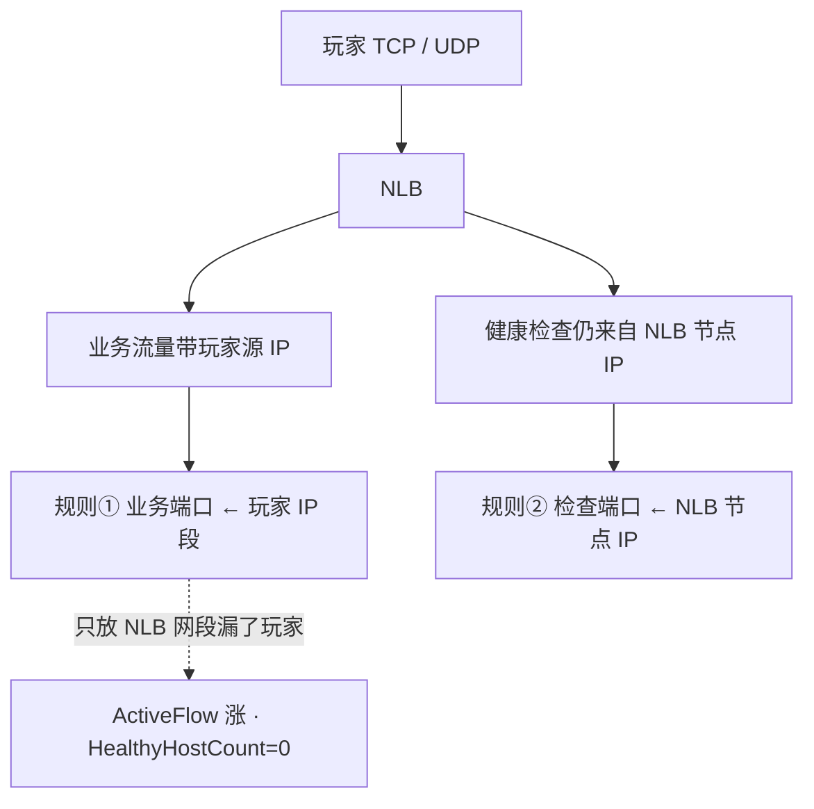
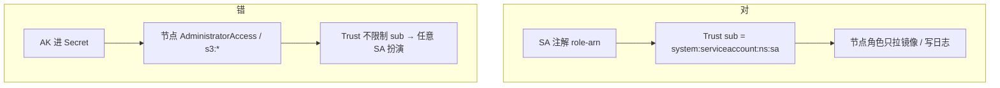
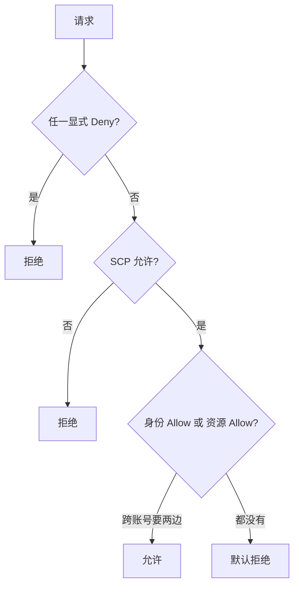
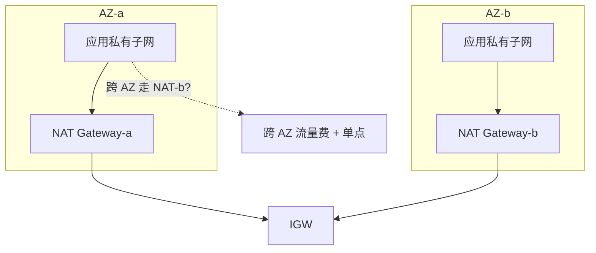
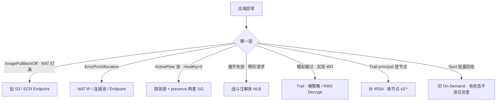

# 07｜AWS 生产 · 练习题

开始做题前，先给大家一个小建议：合上知识点，对着**第一节的主图**，把「出海游戏服在 AWS 上的落地」五关——计算到权限——口述一遍。能顺下来，下面这些题你会发现大半都会了；卡壳的地方，就是你该回去重读的那一节。

做题的方式也建议改一下：每道题**先看标题和场景，自己口述一遍答案，再往下看「完整解答」对答案**。直接看解答，容易产生「我会了」的错觉——能讲出来才是真的会。

| 标记 | 含义 |
|------|------|
| **核心** | 不懂整章就没建立起来 |
| **必会** | 值班和面试都要能讲 |
| **常用** | 线上会反复碰到 |
| **常考** | 白板和追问的高频口径 |

题目的顺序也是有意排的：Q1～Q5 先钉实例族、NLB、client IP、Spot；Q6～Q10 讲存储、IAM、EKS；Q11～Q14 收尾到定责与对照坑。

## 本题目录
- [Q1 EC2 实例族与置放群组](#q1)
- [Q2 长连接为什么用 NLB](#q2)
- [Q3 preserve client IP 两套 SG](#q3)
- [Q4 Spot 两分钟](#q4)
- [Q5 IRSA 与 Trust](#q5)
- [Q6 IAM 求值与 403](#q6)
- [Q7 ECR 穿 NAT](#q7)
- [Q8 跨 AZ 流量计费与 NAT 处理费](#q8)
- [Q9 S3 生命周期与 EBS 快照](#q9)
- [Q10 NLB 黑洞](#q10)
- [Q11 CloudWatch vs Prometheus](#q11)
- [Q12 中国区 vs Global](#q12)
- [Q13 开服前夜清单](#q13)
- [Q14 VPC Endpoint 省 NAT 怎么验](#q14)
- [合上书](#合上书)

---

## Q1

**★★★★★｜EC2 实例族怎么选？置放群组用哪种？T3 / T4g 能不能给游戏用？**

**覆盖**：核心 · 必会 · 常考 ｜ **对应**：知识点 [二、计算：EC2 实例族、置放群组与 Spot](知识点.md)

### 场景
出海选型评审，有人提议「省钱用 T4g」，有人写「战斗服跨 AZ spread 置放群组做高可用」。开服后战斗服延迟忽高忽低，CloudWatch 显示 CPU credit 耗尽。


先自己试试：不看下面，先口述一遍你的答案，再往下对。

### 完整解答
> 🎯 **一句话**：战斗服用 C 系 On-Demand + cluster 置放群组；禁 T3 / T4g（credit 耗尽限速）；Graviton 要过延迟测试。

EC2 实例族命名：第一个字母是系列，第二个字母是代数。C 系（计算优化）给战斗服 / 网关；M 系（通用）给逻辑服 / EKS 系统节点；R 系（内存）给 Redis / 匹配服。Graviton（C7g / M7g）省钱但要过编译和延迟测试，不要空口「ARM 一定更快」。

T 系列（T3 / T4g）是可突发实例，CPU credit 耗尽后钉到基线性能——和阿里 `ecs.t` 同一类事故。游戏战斗负载持续高 CPU，credit 会在活动期耗尽，延迟暴涨踢人。省钱用规格优化（含 Graviton），不是换 T 系列。

置放群组三种模式：**cluster**——同机架，延迟最低（μs 级），战斗服 / 帧同步首选，代价是机架级故障域；**spread**——分散到不同机架，每台机架最多一台，适合少量关键节点高可用；**partition**——分散到分区，适合大数据。战斗服用 cluster 降延迟，数据面多 AZ 做容灾——两者不矛盾：cluster 是同一 AZ 内的机架策略，多 AZ 是跨机房的故障域。

> ⚠️ **别混**：T 系列「可突发」不等于「能扛峰值」——credit 耗尽后限速，不是性能波动。置放群组 cluster 和多 AZ 不矛盾——cluster 是 AZ 内机架策略，多 AZ 是跨机房故障域。
> 📝 **面试**：「战斗 C 系、逻辑 M 系、Redis R 系；禁 T3 / T4g；战斗服用 cluster 置放群组降延迟，数据面多 AZ 容灾，两者不矛盾。」

### 再追问
- **Savings Plan 和 RI 什么时候买？** ——先砍闲置再买承诺，按 90 天最小常驻，不按开服峰值。Compute SP 盖不住 NAT 和流量。
- **Spot 能不能给战斗服？** ——不能，约 2 分钟中断不够合服，见 Q4。

---

## Q2

长连接接驳——NLB 还是 ALB。

**★★★★★｜游戏长连接用 ALB 还是 NLB？WAF 能不能挂上去？**

**覆盖**：核心 · 必会 · 常考 ｜ **对应**：知识点 [四、接驳：NLB vs ALB 与 preserve client IP](知识点.md)

### 场景
Ingress 默认 ALB 注解套到了游戏端口。开服当天战斗握手全部失败，玩家进不去。有人问「WAF 能不能也挂上保护一下」。


先自己试试：不看下面，先口述一遍你的答案，再往下对。

### 完整解答
> 🎯 **一句话**：自定义 TCP / UDP 游戏协议走 NLB（L4），ALB 只解析 HTTP；WAF 关联在 ALB / CloudFront 上，挂不到 NLB 的 TCP 端口。

| | ALB | NLB |
|--|-----|-----|
| 协议 | HTTP / HTTPS / gRPC / WebSocket | TCP / UDP / TLS |
| 延迟 | L7 解析多一跳 | L4，延迟和 PPS 适合战斗 |
| WAF | 可关联 | 挂不到 TCP / UDP 端口 |

战斗 Service 注解成 ALB，自定义协议被当畸形 HTTP 请求，握手失败。WAF 只解析 HTTP 层（注入、CC、盗刷），游戏 TCP / UDP 自定义协议它看不见也接不上去——挂 WAF 到游戏端口是错误架构。HTTP 登录、支付、运营、EKS Ingress 走 ALB + WAF。

WebSocket 若是标准 HTTP 升级可以用 ALB，但 idle timeout 必须小于心跳的 1/3——ALB 默认 60s，最长 4000s；NLB TCP idle 约 350s。

> ⚠️ **别混**：标准 HTTP 升级的 WebSocket 可以挂 ALB（ALB 支持 WS 升级），但自定义二进制 TCP（非 HTTP 起手）ALB 根本解析不了，必须 NLB。区分标准就是「是不是 HTTP 握手起手」。
> 📝 **面试**：「战斗长连接走 NLB（L4）；HTTP 走 ALB + WAF；WAF 挂 ALB 不挂 NLB TCP；心跳 < idle 的 1/3。」

### 再追问
- **跨云切换后集体掉线怀疑什么？** ——新云 LB idle / UDP 会话超时默认值更短，名字都叫 NLB 不等于超时一样（[09](../09-多云对照/)）。
- **关掉 NLB 跨 AZ 行不行？** ——能少付钱、适合区服绑单 AZ，代价是该 AZ 目标全挂时流量不自动漂，要显式选择并写进预案。

---

## Q3

和 Q2 配套——preserve client IP 与两套 SG。

**★★★★★｜NLB 开了 preserve client IP，后端安全组怎么写？健康检查源是谁？**

**覆盖**：核心 · 必会 · 常考 ｜ **对应**：知识点 [四、接驳：NLB vs ALB 与 preserve client IP](知识点.md)

### 场景
游戏要按玩家 IP 做风控，NLB 开了 client IP preservation。开完玩家进不去，`ActiveFlowCount` 涨而 `HealthyHostCount` 为 0。有人想全开 `0.0.0.0/0` 包括 22 端口解决。


先自己试试：不看下面，先口述一遍你的答案，再往下对。

### 完整解答
> 🎯 **一句话**：preserve client IP 后后端看到的是玩家真实 IP，业务端口放玩家 IP 段、健康检查端口仍放 NLB 节点 IP，**两套规则都要**；管理端口绝不跟着重开。



**读图**：preserve client IP 打开后，业务流量和健康检查流量源地址不同。漏放玩家 IP 段 → `ActiveFlowCount` 涨而 `HealthyHostCount` 为 0，流量在 LB 黑洞。`source_security_group_id = lb_sg` 这招在 preserve client IP 时**对业务端口失效**——因为后端看到的源是玩家 IP 不是 LB，得退回写 CIDR 段。

NLB 的健康检查源是 **NLB 节点 IP**（NLB 自己的 ENI），不是阿里的 `100.64.0.0/10`。后端 SG 没放行 NLB 节点 IP → 健康检查失败 → `HealthyHostCount` 为 0 → 玩家连得上 NLB 进不了服。阿里放 `100.64.0.0/10`；AWS 放 NLB 节点 IP / LB SG。照抄必挂（01）。

> ⚠️ **别混**：preserve client IP 只影响**业务流量的源地址**，健康检查流量源仍是 NLB 节点 IP——所以是「业务 + 检查」两套规则，不是「业务一套就够」。健康检查源不是阿里的 `100.64`。
> 📝 **面试**：「preserve client IP 时业务端口放玩家 IP 段、检查端口放 NLB 节点 IP，两套都要；健康检查源是 NLB 节点 IP 不是 `100.64`；SSH 绝不跟着开。」

### 再追问
- **业务端口对 `0.0.0.0/0` 放行安全吗？** ——业务端口可以（玩家要进），但必须确认管理端口（22 等）没跟着 `0.0.0.0/0`，否则源站裸奔。
- **AWS 和阿里的健康检查源能互抄吗？** ——不能。阿里 CLB 是 `100.64.0.0/10`，AWS 是 NLB 节点 IP / LB SG，每家不同（01）。

---

## Q4

计算线的 Spot：战斗能不能用。

**★★★★☆｜Spot 实例被回收前有多久？游戏战斗服能不能用 Spot 省钱？**

**覆盖**：必会 · 常考 ｜ **对应**：知识点 [二、计算：EC2 实例族、置放群组与 Spot](知识点.md)

### 场景
成本评审，有人提议「战斗服用 Spot 省 70%」。另一人问「Spot 中断了还能不能把玩家迁走」。


先自己试试：不看下面，先口述一遍你的答案，再往下对。

### 完整解答
> 🎯 **一句话**：Spot 中断前约 2 分钟告警，不够完整合服，只够摘流量 + 持久化 + SIGTERM；有状态战斗服不该在 Spot 池里。

Spot 实例（竞价实例）是 AWS 回收闲置算力的折扣实例（最高 ~90% off），代价是 AWS 随时收回。中断前约 **2 分钟**告警：实例元数据 `/latest/meta-data/spot/instance-action` 或 EventBridge `EC2 Spot Instance Interruption Warning`。

2 分钟不够完整合服，只够：摘流量、持久化内存态、SIGTERM 让进程优雅退出。没接中断信号的进程 = 直接断电。EKS 上没配 AWS Node Termination Handler，Pod 直接没了，调度器还在往死节点派活。

- **何时用**：CI、压测、无状态统计、可重试 Job。
- **何时不用**：有状态战斗服、单点 Redis、RDS 替代。
- Spot 和 On-Demand **分两个 ASG**，不要一个组混容量类型还指望调度器懂业务。

> ⚠️ **别混**：Spot 的 2 分钟是「通知到回收」的窗口，不是「能优雅退出」的保证——有状态工作负载根本不该在 Spot 池里。省钱用规格优化（含 Graviton）要过延迟测试，不是换 T 系列。
> 📝 **面试**：「Spot 约 2 分钟中断通知，不够合服，有状态战斗服不用；只给 CI / 无状态 Job；Spot 和 On-Demand 分两个 ASG。」

### 再追问
- **RI 和 Savings Plan 什么时候买？** ——先砍闲置再买承诺，按 90 天最小常驻。Compute SP 盖不住 NAT 和流量，承诺买错品类是第二常见浪费。
- **EKS 上怎么接 Spot 中断？** ——配 AWS Node Termination Handler，否则 Pod 直接没了，调度器还往死节点派活。

---

## Q5

权限线——IRSA 与 Trust。

**★★★★★｜IRSA 解决什么？Trust Policy 不限制 sub 会怎样？节点角色要不要 s3:*？**

**覆盖**：核心 · 必会 · 常考 ｜ **对应**：知识点 [六、权限：IAM 求值与 IRSA](知识点.md)

### 场景
EKS 上 Pod 要读 S3 热更包。有人把 `s3:*` 写进节点 Instance Profile「这样所有 Pod 都能用」。另有人把 AK 写进 Secret。Pod 仍 403。


先自己试试：不看下面，先口述一遍你的答案，再往下对。

### 完整解答
> 🎯 **一句话**：IRSA 给 ServiceAccount 注解 role-arn，Pod 用 OIDC 换临时凭证；Trust 必须限制 `sub = system:serviceaccount:ns:sa`；节点角色要瘦，不需要 `s3:*`。



**读图**：对的路径——SA 绑角色 + Trust 限制到具体 SA + 节点角色瘦。错的路径——AK 进 Secret / 节点角色过宽 / Trust 不限制 sub。

**IRSA（IAM Roles for Service Accounts）** 给 Kubernetes ServiceAccount 注解 `eks.amazonaws.com/role-arn`，Pod 用 OIDC 换临时凭证访问 S3 / Secrets Manager，**节点 Instance Profile 不需要 `s3:*`**。

**实例角色（instance profile）** 是 EC2 节点的 IAM Role，给节点拉镜像、写日志用的权限。真正的应用权限放 IRSA——节点角色必须窄，否则任一 Pod 逃逸都能搬空桶。

Trust Policy 必须限制 `sub = system:serviceaccount:ns:sa`，否则集群里任意 SA 都能扮演该角色。EBS CSI、AWS Load Balancer Controller 各自独立 IRSA 角色；少一个权限就 controller 日志 403，Service / PVC 一直 Pending。

**IMDSv2**：实例元数据强制 token，防 SSRF 把角色凭证偷走。新账号默认开；旧镜像还在 IMDSv1 要排期关。

> ⚠️ **别混**：IRSA 和实例角色是两层——IRSA 是 Pod 级别的应用权限，实例角色是节点级别的系统权限。节点角色给了 `s3:*` 就不需要 IRSA？错——任一 Pod 逃逸都能用节点凭证搬空桶。和 ACK RRSA 是同一模型，名字不同，不要把 AWS JSON 粘到 RAM。
> 📝 **面试**：「IRSA 给 SA 绑角色、Pod 用 OIDC 换临时凭证；Trust 限制 `sub = system:serviceaccount:ns:sa`；节点角色要瘦；IMDSv2 防 SSRF。」

### 再追问
- **和 ACK RRSA 有什么区别？** ——同一模型（Pod 扮角色、绑具体 SA、节点角色要瘦），Trust / OIDC 细节按各自文档。
- **EBS CSI 为什么也要 IRSA？** ——EBS CSI 驱动要访问快照和卷 API，少一个权限就 controller 日志 403，PVC 一直 Pending。

---

## Q6

IAM 求值与 403。

**★★★★★｜IAM 求值顺序是什么？模拟器过了实际 403 看什么？**

**覆盖**：核心 · 必会 · 常考 ｜ **对应**：知识点 [六、权限：IAM 求值与 IRSA](知识点.md)

### 场景
IAM Policy Simulator 显示 Allow，但 Pod 实际 403。有人准备加 `AdministratorAccess` 验证「是不是权限问题」。


先自己试试：不看下面，先口述一遍你的答案，再往下对。

### 完整解答
> 🎯 **一句话**：IAM 求值四步——显式 Deny > SCP > Allow > 默认拒绝；模拟器没带资源策略 / KMS Decrypt 会误导，以 CloudTrail `AccessDenied` 为准。



**读图**：Deny 永远优先，不管它来自哪一层。跨账号访问必须身份策略和资源策略都 Allow——身份策略写得再满，桶策略没加就是 403。

**权限边界（Permissions Boundary）** 是角色「最多能有」的上限，防自助开权限的人给自己 `*`。和生产最小权限是两层：边界是天花板，策略是实际开门的钥匙。SCP 是组织对账号的天花板。

模拟器像笔试——身份策略写得对，模拟器打勾。但实际请求要经过桶策略、KMS、资源策略这些「面试官」——模拟器没带这些，过了不等于面试过了。

```bash
aws cloudtrail lookup-events \
  --lookup-attributes AttributeKey=EventName,AttributeValue=AccessDenied --max-results 5
# |  Event Name   |  Username  |  Resource                              |
# |  GetObject    |  game-role |  arn:aws:s3:::my-bucket/res/.../v1.zip |  # ← 看 Action 和 Resource
# |  Decrypt      |  game-role |  arn:aws:kms:...:key/xxx               |  # ← 缺 kms:Decrypt
```

止血：Pod 403 时去 CloudTrail 搜 `AccessDenied` 事件的 Action 和 Resource，不要猜策略，不要加 `AdministratorAccess`。

> ⚠️ **别混**：模拟器过了不等于有权限——常漏桶策略、KMS `kms:Decrypt`、资源策略。没有 Allow 就是默认拒绝，不是「没写就过」。
> 📝 **面试**：「显式 Deny > SCP > Allow > 默认拒绝；跨账号要两边允许；模拟器没带资源策略会误导，以 CloudTrail `AccessDenied` 为准。」

### 再追问
- **STS AssumeRole 在什么时候用？** ——人从 SSO 扮演角色，程序从 IRSA / Instance Profile 换临时凭证。永久 AK 只留给无法用角色的破旧系统，并强制轮换 + 告警。
- **权限边界和 SCP 有什么区别？** ——权限边界是角色的天花板（防自己开 `*`），SCP 是组织对账号的天花板。两层都是防「自己给自己开 `*`」。

---

## Q7

开头那个镜像洪峰——ECR 穿 NAT。

**★★★★☆｜EKS 节点拉 ECR 镜像全部 ImagePullBackOff，NAT 打满，怎么办？**

**覆盖**：必会 · 常用 ｜ **对应**：知识点 [三、网络：本 AZ NAT、跨 AZ 计费与 Endpoint](知识点.md)

### 场景
出海开服前夜，50 个 EKS 节点同时拉 4GB 镜像，Pod 全 `ImagePullBackOff`。NAT Gateway 带宽和处理费一起打满。有人要扩 NAT 带宽硬扛。


先自己试试：不看下面，先口述一遍你的答案，再往下对。

### 完整解答
> 🎯 **一句话**：加 S3 Gateway Endpoint + ECR Interface Endpoint，镜像不走公网不穿 NAT；不要先扩 NAT 带宽硬扛。

**VPC Endpoint** 让 VPC 内访问 AWS 服务不走公网、不穿 NAT。两种：

- **Gateway Endpoint**：S3 / DynamoDB 专用，路由表层面转发，不收处理费。
- **Interface Endpoint**：ENI 上挂一个私有 IP，按小时 + 处理费计费。ECR、Secrets Manager、STS 等用这个。

没配 Endpoint 时，EKS 节点拉 ECR 镜像走 NAT 出公网。50 节点同时拉 4GB 镜像，NAT Gateway 带宽和处理费一起爆。止血先加 Endpoint，不要先扩 NAT——扩了这次过，下次 CI / 压测还会爆，且 NAT 处理费可能贵过 EC2 本身。

```bash
aws ec2 describe-vpc-endpoints \
  --query 'VpcEndpoints[].{Service:ServiceName,Type:VpcEndpointType,State:State}' --output table
# |              Service              |   Type   |   State   |
# |  com.amazonaws.s3                | Gateway  |  Available |  # ← S3 走 Gateway 不收处理费
# |  com.amazonaws.ecr.api           | Interface|  Available |  # ← ECR 走 Interface
```

> ⚠️ **别混**：镜像穿 NAT 先加带宽 → 错，先加 Endpoint。Gateway Endpoint 不收处理费，Interface Endpoint 收但要远少于穿 NAT。
> 📝 **面试**：「镜像拉不下来加 S3 Gateway + ECR Interface Endpoint，不穿 NAT；NAT Gateway 处理费按量计，大流量穿 NAT 可能贵过 EC2。」

### 再追问
- **VPC CNI 报 `failed to assign IP` 怎么办？** ——加子网或开 prefix delegation（给 ENI 分配前缀而非单个 IP），不要缩副本。
- **数据子网要不要配 `0.0.0.0/0`？** ——可以不配，强制无出网。RDS / Redis 不该自己出公网拉东西。

---

## Q8

跨 AZ 流量计费与 NAT 处理费。

**★★★★☆｜跨 AZ 流量为什么贵？NAT Gateway 处理费怎么回事？本 AZ NAT 解决什么？**

**覆盖**：必会 · 常考 ｜ **对应**：知识点 [三、网络：本 AZ NAT、跨 AZ 计费与 Endpoint](知识点.md)

### 场景
出海第一个月账单出来，跨 AZ 流量费 + NAT Gateway 处理费超预期。有人问「为什么 NAT 这么贵，不是只有几台小机器在出网吗」。


先自己试试：不看下面，先口述一遍你的答案，再往下对。

### 完整解答
> 🎯 **一句话**：AWS 跨 AZ 传输数据每方向约 $0.01/GB；本 AZ NAT 避免出网跨 AZ；NAT Gateway 处理费按量计，大流量穿 NAT 可能贵过 EC2 本身。



**读图**：每个 AZ 的私有子网 `0.0.0.0/0` 指本 AZ 的 NAT Gateway，再统一走 IGW 出公网。如果只在一个 AZ 放 NAT，其他 AZ 的出网流量要先跨 AZ——产生跨 AZ 流量费，且 NAT 所在 AZ 挂了全部出网都断。

生产规则：**每 AZ 一个 NAT Gateway**。NAT Gateway 处理费按处理量计费——50 节点同时拉镜像走 NAT，处理费可能贵过 EC2 本身。镜像 / 对象存储改 VPC Endpoint 不穿 NAT。

> ⚠️ **别混**：NAT Gateway 处理费不是「固定月费」——按处理量计费，大流量穿 NAT 处理费可能贵过 EC2。先加 Endpoint 不穿 NAT，不是先扩 NAT 带宽。
> 📝 **面试**：「AWS 跨 AZ 流量每方向约 $0.01/GB；每 AZ 一个 NAT Gateway；NAT Gateway 处理费按量计，大流量穿 NAT 可能贵过 EC2；镜像走 Endpoint 不穿 NAT。」

### 再追问
- **NAT `ErrorPortAllocation` 是什么？** ——SNAT 端口耗尽，一个 NAT IP 约 6 万源端口，大量连接到同一目标 `IP:443` 会耗尽。先加 NAT IP / 连接池 / Endpoint。
- **关掉 NLB 跨 AZ 能省钱吗？** ——能减少跨 AZ 流量费，适合区服绑单 AZ，代价是该 AZ 目标全挂时流量不自动漂。

---

## Q9

存储：S3 生命周期与 EBS 快照。

**★★★★☆｜S3 生命周期怎么配？403 常见原因有哪些？EBS 快照和 AMI 什么关系？**

**覆盖**：必会 · 常用 ｜ **对应**：知识点 [五、存储：S3 生命周期与 EBS 快照](知识点.md)

### 场景
热更包放 S3，整桶设了「30 天进 Glacier」。开服当天拉热更包极慢。另一边 EBS CSI 驱动 Pod 一直 403，PVC Pending。


先自己试试：不看下面，先口述一遍你的答案，再往下对。

### 完整解答
> 🎯 **一句话**：S3 生命周期按前缀不整桶一刀切；403 常见原因是 Block Public Access / OAC / KMS Decrypt；EBS 快照是 AMI 的基础。

S3 生命周期按**前缀**，不要整桶一条规则：

- `res/current/*`：标准，不自动归档、不过期。
- `res/old/*`：30 天 → IA，180 天 → Glacier。
- `logs/*`：7 天标准，30 天过期。
- `tfstate/*`：标准 + 版本控制，禁止过期删除。

热更「最新包」访问极热，不适合乱扔 Glacier。整桶 30 天进 Glacier 会导致 `current` 热更包取回极慢。Glacier 取回有时间和钱，回档演练要真拉一次。

S3 403 最常见原因不是「文件不存在」，而是：

- **Block Public Access**：账号级阻止公共读，优先级最高。
- **OAC（Origin Access Control）**：CloudFront 回源 S3 的权限控制。
- **KMS `kms:Decrypt`**：桶开了 KMS 加密，调用方缺 `kms:Decrypt` 权限。

**EBS（Elastic Block Store）** 是 EC2 的持久卷。**快照（Snapshot）** 是 EBS 卷的增量备份，存在 S3。快照是 **AMI（Amazon Machine Image）** 的基础——AMI = 快照 + 元数据，启动模板（launch template）引用 AMI 来扩节点。EBS CSI 驱动用 IRSA 访问快照——少一个权限就 controller 日志 403，PVC 一直 Pending。

> ⚠️ **别混**：快照是 EBS 级别的备份，不是实例级别的——内存态和临时盘数据不在快照里。整桶 30 天进 Glacier 会把热更包也归档——按前缀，`current` 不过期。
> 📝 **面试**：「S3 生命周期按前缀；403 常见原因是 Block Public / OAC / KMS Decrypt；EBS 快照是 AMI 的基础，EBS CSI 要 IRSA。」

### 再追问
- **state 桶怎么保护？** ——禁止 List + Delete 给普通角色；版本控制防误删；管理删除加 MFA Delete。
- **Intelligent-Tiering 适合什么？** ——访问模式说不清的桶；热更「最新包」不适合乱扔 Glacier。

---

## Q10

NLB 黑洞怎么认。

**★★★★★｜NLB 注册了实例，ActiveFlowCount 涨，但 HealthyHostCount=0，玩家进不去，为什么？**

**覆盖**：核心 · 必会 · 常考 ｜ **对应**：知识点 [四、接驳：NLB vs ALB 与 preserve client IP](知识点.md)

### 场景
NLB 后端注册了两台 EC2，`ActiveFlowCount` 在涨说明玩家流量到了 NLB，但 `HealthyHostCount` 为 0。后端 SG 刚用 Terraform 建的。本机 `curl` 通。


先自己试试：不看下面，先口述一遍你的答案，再往下对。

### 完整解答
> 🎯 **一句话**：`ActiveFlowCount` 涨 + `HealthyHostCount=0` = 流量在 LB 黑洞——健康检查源被 SG 拦住或 preserve client IP 漏放玩家 IP 段，不是进程没起。


**读图**：两种可能：① preserve client IP 打开后，业务端口漏放玩家 IP 段——`source_security_group_id = lb_sg` 对业务端口失效（后端看到的源是玩家 IP 不是 LB）；② 健康检查端口没放行 NLB 节点 IP——NLB 的健康检查源是 NLB 节点 IP，不是阿里的 `100.64.0.0/10`，抄必挂。

本机 `curl 127.0.0.1:port` 只证明进程在听，不证明探测路径通。LB 按检查失败摘流，业务端口对办公网开放也没用。

```bash
aws elbv2 describe-target-health --target-group-arn <tg-arn> \
  --query 'TargetHealthDescriptions[].{Target:Target.Id,State:TargetHealth.State}' --output table
# |  Target   |   State   |
# |  i-xxx    |  unhealthy|  # ← 检查端口不是业务端口、或 SG 没放 NLB 节点
```

止血：确认是否开了 preserve client IP → 是则业务端口补放玩家 IP 段 + 检查端口放 NLB 节点 IP；没开则检查端口放 NLB 节点 IP / LB SG。

> ⚠️ **别混**：`ActiveFlow` 涨说明流量到了 LB，`HealthyHostCount=0` 说明后端没通过健康检查——流量在 LB 黑洞。不是进程没起，不要先重启游戏进程。
> 📝 **面试**：「`ActiveFlow` 涨 + `Healthy=0` = LB 黑洞。preserve client IP 漏放玩家 IP 段，或健康检查源（NLB 节点 IP）被 SG 拦——不是 `100.64`，不要照抄阿里。」

### 再追问
- **关掉跨 AZ + preserve IP 同时用会怎样？** ——`ActiveFlow` 涨、`HealthyHostCount=0` 要单独查，可能需要单独放行。
- **本机 curl 通说明什么？** ——只证明进程在听，不证明探测路径通。LB 健康检查源和你的 curl 是两条不同路径。

---

## Q11

CloudWatch vs Prometheus。

**★★★★☆｜CloudWatch 和 Prometheus 怎么分工？全用 CloudWatch 更云原生吗？**

**覆盖**：必会 · 常用 ｜ **对应**：知识点 [七、EKS：托管边界与 VPC CNI](知识点.md)

### 场景
团队评审监控方案，有人提议「全用 CloudWatch 更云原生」。CCU 指标和登录成功率怎么接成了问题。NAT 端口耗尽没人发现。


先自己试试：不看下面，先口述一遍你的答案，再往下对。

### 完整解答
> 🎯 **一句话**：CloudWatch 管云资源和 AWS 事件，Prometheus + Grafana 管应用黄金指标；混合是常态，不是「全在 CloudWatch」。

**CloudWatch** 管 EC2 / RDS / NLB / NAT 的云厂商指标、日志、告警、EventBridge。优点是开箱、和 Auto Scaling / Spot 事件一体。缺点：自定义指标贵、基数一高账单吓人、PromQL 生态没有、游戏业务指标（CCU、登录成功率）用 Prometheus 更自然。

生产常见：**CloudWatch 管云资源和 AWS 事件，Prometheus + Grafana 管应用黄金指标，日志用 CloudWatch Logs 或 Loki。**

关键指标：NLB `UnHealthyHostCount`、`ActiveFlowCount`；NAT `ErrorPortAllocation`（= SNAT 端口耗尽）；EC2 Spot 中断事件。这些比 ssh 上机器猜更早。`ErrorPortAllocation` = SNAT 端口耗尽，大量连接到同一目标 `IP:443`——先加 NAT IP / 连接池 / Endpoint，不要先改业务代码重试把连接打得更满。

**VPC Flow Logs**：排「SG 已放行仍丢」时对 ENI 开，不要全 VPC 开去海选。拒绝记录比全量有用。

> ⚠️ **别混**：全在 CloudWatch 不等于更云原生——自定义指标贵、CCU 等业务指标用 Prom 更自然，大厂出海多数是混合。
> 📝 **面试**：「CW 管云资源和 Spot 事件；CCU 等业务指标用 Prom；混合是常态；`ErrorPortAllocation` = SNAT 端口耗尽。」

### 再追问
- **VPC Flow Logs 什么时候开？** ——只在「SG 已放行仍丢包」时对 ENI 定向五元组开，不全 VPC 开去海选。
- **Spot 中断事件怎么接？** ——EventBridge `EC2 Spot Instance Interruption Warning`，或 EKS 上配 AWS Node Termination Handler。

---

## Q12

中国区 vs Global。

**★★★★☆｜中国区 AWS 能不能当阿里云用？Shield Standard 够不够？同一把 AK 能打通吗？**

**覆盖**：必会 · 常考 ｜ **对应**：知识点 [四、接驳：NLB vs ALB 与 preserve client IP](知识点.md) · [一、一张图：出海游戏服在 AWS 上的落地](知识点.md)

### 场景
公司同时有中国区和 Global 业务。有人想用同一套 IAM 和 AK 管两边。另一人问「Shield Standard 免费了，还用买高防吗」。


先自己试试：不看下面，先口述一遍你的答案，再往下对。

### 完整解答
> 🎯 **一句话**：中国区（北京 / 宁夏）和 Global 是两套账号、两套 IAM，AK 打不通；Shield Standard 免费抗常见 L3 / L4，大流量游戏要 Advanced 或第三方高防；源站要藏。

中国区 AWS 和 Global 是**两套账号、两套 IAM**，**同一把 AK 打不通**——出海写 Global region，中国区高防弱于阿里，不要按 Global Shield 或阿里游戏盾套。

**AWS Shield Standard** 对所有 AWS 账户默认开启，免费，抗常见 L3 / L4 DDoS（SYN flood、UDP 反射）。**Shield Advanced** 是付费服务，提供更高防护门槛、DDoS 响应团队（SRT）、费用保护和 DDoS 事件通知。大流量游戏仍要 Advanced 或第三方高防。

Shield 只保护「打到 AWS 边界的流量」，源站 IP 泄漏后直打 EC2，Shield Standard 挡不住。源站必须从 DNS 和 SG 两头藏住——禁 EIP 绑逻辑服、禁 `0.0.0.0/0` 放业务端口（01）。

> ⚠️ **别混**：Shield Standard 不等于高防 IP——它抗常见 L3 / L4，但大流量攻击仍可能触发黑洞。Shield Advanced 提供更高门槛和 SRT 支持但收费。两者都不能替代「源站 IP 不泄漏」。
> 📝 **面试**：「中国区 AWS 和 Global 两套账号两套 IAM，AK 打不通；Shield Standard 免费抗常见 L3 / L4，大流量要 Advanced；源站要藏。」

### 再追问
- **ACM 证书挂在哪里？** ——ACM 管理 TLS 证书，挂在 ALB / NLB-TLS 上做卸载，私钥不出网。NLB TLS 卸载后后端可以是明文。
- **源站被直打怎么办？** ——SG 收回仅回源段；切高防 CNAME（提前演练 TTL）；必要时换源站 IP。预防靠源站 IP 不泄漏。

---

## Q13

开服前夜清单。

**★★★★★｜出海开服前夜，你按什么顺序检查？从哪里开始？**

**覆盖**：核心 · 必会 · 常考 ｜ **对应**：知识点 [八、作战：定责](知识点.md)

### 场景
出海开服前夜，需要最后走一遍检查。团队同时有人查 SG、有人查 NAT、有人准备切高防。没有统一顺序。


先自己试试：不看下面，先口述一遍你的答案，再往下对。

### 完整解答
> 🎯 **一句话**：先分「哪一关病了」——镜像穿 NAT 查 Endpoint，NLB 黑洞查两套 SG，403 查 Trail，Spot 被收查容量池；60 秒走完再下结论。



| 现象 | 先做 | 别做 |
|------|------|------|
| ImagePullBackOff + NAT 打满 | 加 VPC Endpoint | 先扩 NAT |
| `failed to assign IP` | 加子网 / prefix delegation | 缩副本 |
| ActiveFlow 涨、Healthy=0 | NLB 检查源 + preserve 业务端口 | 重启游戏进程 |
| 战斗握手失败 | 改 NLB，不要 ALB | 把 WAF 挂到 TCP |
| 模拟器 Allow、实际 403 | Trail AccessDenied | 加 AdministratorAccess |
| Spot 批量回收 | 切 On-Demand | 故障中抢 Spot |
| 手开临时机找不到 | 启动模板 + 标签 | 控制台点一台 |

60 秒剧本：

```text
① 0–10s  哪一关病了？  CloudWatch 看 NLB UnHealthyHostCount / NAT ErrorPortAllocation / Spot 事件
② 10–30s 镜像还是流量？ ImagePullBackOff → 查 ECR Endpoint；ActiveFlow 涨 → 查 preserve SG
③ 30–45s 权限还是容量？ Trail AccessDenied → 桶策略 / KMS；failed to assign IP → 加子网
④ 45–60s 定责 + 验证：  Endpoint 通没通、NLB Healthy > 0、IRSA Trust 有 sub、战斗节点 On-Demand
# ← 60 秒内不重启游戏进程、不加 AdministratorAccess、不把 WAF 挂到 NLB TCP
```

> ⚠️ **别混**：不先重启游戏进程是因为长连接可能还活着——入口被清洗、LB 摘流、探测源没放行，重启业务只会踢还在线的玩家，把事故面放大。不先扩 NAT——先加 Endpoint 不穿 NAT。不先加 `AdministratorAccess`——以 Trail 为准。
> 📝 **面试**：「出海异常先分哪一关病了；60 秒走 CloudWatch → Endpoint → SG → Trail → 容量；不重启进程、不扩 NAT、不加 Admin。」

### 再追问
- **EKS 托管了为什么还要查节点组？** ——EKS 托管控制面，节点组 / VPC CNI / 控制器 / 升级 / RPO 仍是你的。控制面 Ready 不等于集群可用。
- **Fargate 能跑战斗服吗？** ——不能，有状态游戏进程要 EC2 节点——要内核参数、hostNetwork、固定资源、可预期 drain。

---

## Q14

VPC Endpoint 省 NAT 怎么验。

**★★★★☆｜ECR/S3 走 VPC Endpoint 后，怎么验证 NAT 流量下来了？**

**覆盖**：必会 · 常用 ｜ **对应**：知识点 [三、网络：本 AZ NAT、跨 AZ 计费与 Endpoint](知识点.md)

### 场景

开服前加了 S3 Gateway + ECR Interface Endpoint。NAT `BytesOutToDestination` 仍高。

先自己试试：不看下面，先口述一遍你的答案，再往下对。

### 完整解答

> 🎯 **一句话**：**路由表 + DNS 私网解析** 都要对——Gateway Endpoint 要挂私网路由；Interface Endpoint 要开 `privateDnsEnabled`。

```bash
aws ec2 describe-route-tables --filters Name=association.subnet-id,Values=subnet-xxx
# 应有 pl-xxx (S3 gateway)

aws cloudwatch get-metric-statistics --namespace AWS/NATGateway \
  --metric-name BytesOutToDestination ...
# 对比 endpoint 创建前后 24h
```

```text
验证：
① 节点上 curl ECR/S3 解析到私网 IP
② 拉镜像 trace 不走 IGW
③ NAT 处理字节降、镜像 pull 仍成功
```

> ⚠️ **别混**：只建 endpoint 不改路由 = 仍走 NAT。

### 再追问

**Interface Endpoint 要安全组吗？**——要，放通 443 来自节点 SG。

---

## 合上书

学到这里，先别急着翻下一章。合上书，试试下面这几件事能不能做到——能做到，这章才算真的听懂了。卡住的那一条，就回到对应的小节再听一遍：

- [ ] 能**默画**出海游戏服在 AWS 上的落地五关（计算→网络→接驳→存储→权限），标出本 AZ NAT、VPC Endpoint、NLB preserve client IP 的位置。
- [ ] 能说出 EC2 实例族怎么选；置放群组 cluster vs spread 各适合什么；T3 / T4g 为什么禁用；Graviton 要过什么测试。
- [ ] 能说出本 AZ NAT 解决什么；跨 AZ 流量计费怎么来的；NAT Gateway 处理费为什么可能贵过 EC2；S3 / ECR 为什么走 VPC Endpoint 不穿 NAT。
- [ ] 能说出 NLB vs ALB 选型；preserve client IP 时 SG 写几套规则；健康检查源是谁、为什么不是 `100.64`；WAF 挂在哪里、挂不到哪里。
- [ ] 能说出 Spot 约 2 分钟能干什么、不能干什么；T3 / T4g 和 Spot 是同一个坑吗；Savings Plan / RI 什么时候买、先做什么。
- [ ] 能说出 IAM 求值四步；模拟器过了实际 403 看什么；跨账号缺什么会 403；权限边界和 SCP 各是什么天花板。
- [ ] 能说出 IRSA 解决什么；Trust 不限制 `sub` 会怎样；实例角色（instance profile）为什么必须瘦；IMDSv2 防什么；和 ACK RRSA 怎么对照。
- [ ] 能说出 S3 生命周期按前缀怎么配；403 常见原因有哪些；EBS 快照和 AMI 什么关系；EBS CSI 为什么需要 IRSA。
- [ ] 能说出 EKS 托管了什么、你还管什么；Fargate 为什么不跑战斗服；CloudWatch vs Prometheus 怎么分工。
- [ ] 能说出 Shield Standard vs Advanced 的区别；中国区 AWS 和 Global 账号为什么打不通。
- [ ] 能**默画**作战决策树（哪一层病了→分叉），口述 60 秒剧本各敲什么、什么绝不碰。
