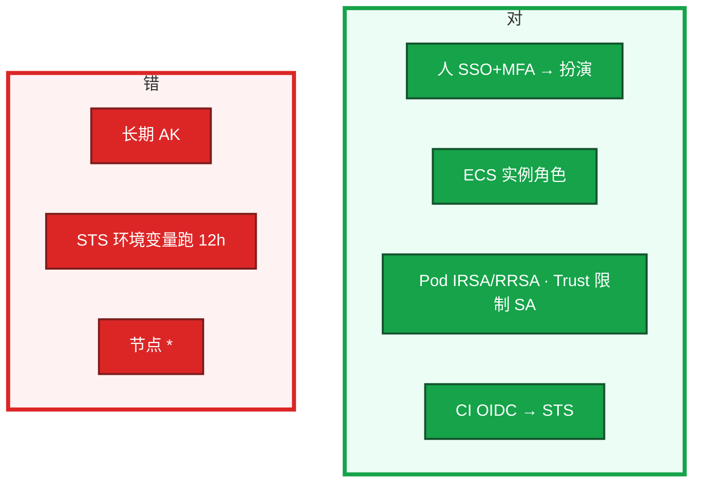
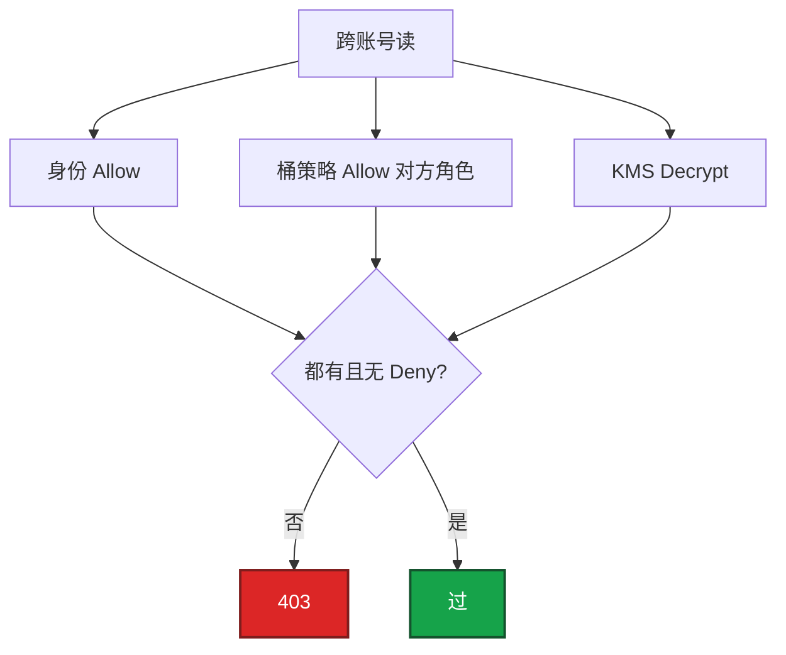
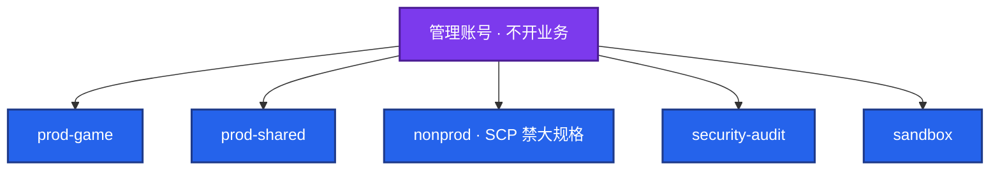
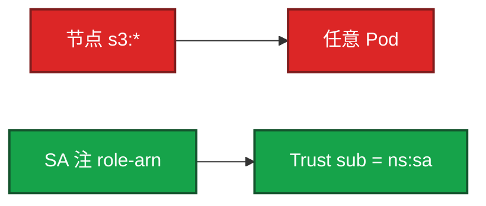

# 07｜IAM与多账号 · 练习题

先对照 [知识点](知识点.md) **本章主线** 自己口述，再对答案。每题标了覆盖范围：

| 标记 | 含义 |
|------|------|
| **核心** | 不懂整章就没建立起来 |
| **必会** | 值班和面试都要能讲 |
| **常用** | 线上会反复碰到 |
| **常考** | 白板和追问的高频口径 |

## 本题目录

- [Q1 程序为什么不用永久 AK](#q1)
- [Q2 泄漏前 15 分钟](#q2)
- [Q3 最小权限落到策略](#q3)
- [Q4 跨账号 403](#q4)
- [Q5 多账号与 SCP](#q5)
- [Q6 节点角色 vs IRSA](#q6)
- [Q7 CI 与办公离职](#q7)
- [Q8 Trail / 破窗 / 锁门](#q8)
- [Q9 发奖角色与临时 *](#q9)
- [合上书](#合上书)

---

## Q1

**★★★★★｜为什么程序不要用永久 AK？该用什么？画人和程序两条路**

**覆盖**：核心 · 必会 · 常考

**对应**：知识点 §3.1

### 场景

开服脚本目录和镜像层里有 AK。Jenkins 也存了一把。有人把 STS 写进环境变量跑了 12 小时。节点角色给了 `AdministratorAccess`。

### 完整解答

**一句话**：程序不用永久 AK，走实例角色 / IRSA / RRSA / CI OIDC；节点角色要瘦。

永久 AK 是口令，进 Git / 镜像 / Jenkins 即全账号风险，且不绑定计算身份。ECS 用实例角色，EKS / ACK 用 IRSA / RRSA，CI 用 OIDC 换 STS，人用 SSO 扮角色 + MFA。节点角色要瘦，应用权限绑 SA。

SDK 默认凭证链自动续期。观测：Trail 主体是 User 还是 Role；90 天未轮换。发现即禁用 AK。镜像层密钥：作废、重建镜像、看是否推过公共仓库。改 `.gitignore` 不够。

### 再追问

钥匙和票差在哪？——钥匙能复制、票不能带走。长期 AK 进仓库等于把门钥匙贴在墙上。

---

## Q2

**★★★★★｜GitHub 上出现了一把生产 AK，你前 15 分钟做什么？**

**覆盖**：核心 · 必会 · 常考

**对应**：知识点 §3.2 · §6.1

### 场景

公开仓库。有人先开会，有人 force-push 删记录，有人只改了登录密码。密钥还可能在客户端热更 json 里。没有 Trail。

### 完整解答

**一句话**：AK 泄漏前 15 分钟：先禁 Key → Trail → 断公网，不要先开会。

先禁用 / 删除这把 Key，根账号按 P0 轮换并开 MFA。然后 Trail 查该 Key 的 API、源 IP、改过的 SG / 用户 / 桶。再断异常公网。不要先开会、不要只删 Git 记录。

无审计：无法证明没搬数据，按最坏轮换并查桶。AK 独立于登录密码。测试密钥同一套流程。GitHub secret scanning 进 oncall。STS 泄漏仍要禁角色并查 Trail；窗口内的调用算数。force-push 不能当应急。

### 再追问

顺序错成先开会再禁 Key，为什么不及格？——作废前每一秒都算数。影响面分析建立在 Key 还有效上，等于给攻击者留窗口。

---

## Q3

**★★★★☆｜最小权限怎么落到一条 OSS/S3 策略，而不是讲原则？**

**覆盖**：必会 · 常用 · 常考

**对应**：知识点 §3.1

### 场景

「我们做了最小权限。」策略是 `*:*`。发奖脚本和逻辑服用同一角色，逻辑服能 `DeleteBucket`。开服夜临时开了 `*`，三个月后还在。oncall 策略写成 `ecs:*` + `vpc:*`。

### 完整解答

**一句话**：最小权限写到 Action + Resource ARN + 条件；临时 * 必须有到期收回。

Action 写需要的那几个，Resource 写桶和前缀 ARN，条件加 MFA / 源 VPC。禁止 `*:*`。逻辑服只能 `GetObject` 指定前缀。发奖独立 + 审计。临时 `*`：工单 + 到期 + 收回确认。

条件键比再拆两个 Action 更有用：`MultiFactorAuthPresent`、源 VPC、禁止没 MFA 的 AssumeRole。生产扮演强制 MFA，CI 走 OIDC。排障不要给整段 VPC 写权限，backend SG 入站只允许 LB 安全组 ID。

权限边界：角色「最多能有」的天花板。开服夜「先放开再收」而没有到期，就是下次泄漏的半径。Trail AccessDenied 精确补，不先放宽。

### 再追问

90 天未用的 AccessKey 怎么办？——告警关闭。不要留着观察。

---

## Q4

**★★★★☆｜跨账号访问桶，IAM 已经 Allow 为什么还 403？**

**覆盖**：必会 · 常用 · 常考

**对应**：知识点 §3.4

### 场景

Policy Simulator 通过。实际 403。桶有 KMS。有人准备加 AdministratorAccess「验证是不是权限问题」。

### 完整解答

**一句话**：跨账号 403 要身份策略和资源策略（含 KMS）都 Allow，模拟器常漏资源策略。

跨账号要身份策略和资源策略（桶策略 / KMS）都允许。显式 Deny 最大（含 SCP Deny）。模拟器常不带资源策略会误导。去 Trail 看失败的 Action 和 Resource。默认拒绝：没有 Allow 就是拒绝。

不要加 `AdministratorAccess` 验证。不要把 AWS JSON 粘到 RAM。RAM + OSS Bucket 同样两边要配。

### 再追问

权限边界和 SCP 差别？——SCP 是组织对账号的天花板；边界是角色自身上限。两层都是防「自己给自己开 *」。SCP 不是权限清单，不授权。

---

## Q5

**★★★★★｜为什么要拆多账号？SCP 最小集 Deny 哪几条？**

**覆盖**：核心 · 必会 · 常考

**对应**：知识点 §3.3

### 场景

「VPC + 安全组已经隔离了。」一把 AK 能打生产和测试。账单和配额搅在一起。有人一次切七个账号，差点把自己锁门外。有人把 SCP 写成 Allow 清单。

### 完整解答

**一句话**：多账号拆 prod / nonprod / audit；SCP 是 Deny 硬顶，不能代替最小权限。

单账号一次 AK 打穿生产 + 测试。组织拆 prod / nonprod / audit / shared。SCP 是「不能做什么」：禁关 Trail、禁根用户创建 AK、禁关公共读闸、非生产禁高防和大规格包年、禁成员离开组织拆天花板。日常仍靠角色最小权限；没有 SCP 会被第一张工单冲掉。

落地顺序：先拆 nonprod 和审计，最后动生产。管理账号紧急角色双人保管。生产库 SG 不放行 nonprod VPC。没有多账号：承认爆炸半径，讲 VPC + 角色先挡着。SCP 在 sandbox 先挂。

### 再追问

SCP 能代替最小权限吗？——不能。SCP 不授权。业务策略写在账号内角色上。

---

## Q6

**★★★★☆｜EKS 节点 Instance Profile 给了 S3 Full Access，为什么仍算没做 IRSA？**

**覆盖**：必会 · 常用 · 常考

**对应**：知识点 §3.1

### 场景

「节点已经能拉桶了。」任意 Pod 都能用节点角色。IRSA 做了但 Trust 不限制 sub。有人让 EBS CSI 和 LB Controller 共用一个角色。

### 完整解答

**一句话**：节点 s3:* 等于任意 Pod 可搬桶；IRSA Trust 必须限制 sub。

任意 Pod 都能用节点角色调 S3，逃逸即搬空桶。IRSA 把权限缩到具体 SA。没限制 Trust `sub` 的 IRSA 等于集群内任意 SA 可扮演。

观测：Trail principal 是节点角色。止血：收节点策略、上 IRSA、限制 Trust。IMDSv2 防 SSRF 偷节点凭证。ACK RRSA 同一模型。CSI 和 LB Controller 各自独立角色，共用只会再放宽。

### 再追问

节点只要哪两个能力？——拉镜像、写日志。逻辑服不能 `oss:DeleteBucket`。

---

## Q7

**★★★★☆｜CI 流水线该拿什么云权限？人从 IdP 走为什么更可靠？**

**覆盖**：必会 · 常用

**对应**：知识点 §3.1

### 场景

Jenkins 永久 AK + AdministratorAccess，「发版省事」。流水线被打穿。云里每人一把 AK，离职清单漏一个账号。

### 完整解答

**一句话**：CI 用 OIDC 短时角色，人用 IdP + MFA；Jenkins 永久 AK + Admin 是 P0 风险。

OIDC 联邦到角色，仅推某个 ECR 或执行有限 API，过期短。不要给 Jenkins 永久 AK + Admin。流水线被打穿等于生产被打穿。发版角色和生产 oncall 角色分开；生产 apply 要人工审 plan。开服脚本同样用角色，打包目录扫 AK。

人从企业 IdP 进云：离职关 IdP 即失去扮演资格。云里每人一把 AK 时，离职清单漏一个账号就留后门。没有 SSO 至少强制 MFA + 角色扮演。

### 再追问

控制台和 API 怎么分工？——控制台 + MFA；API 用角色。`ConsoleSignin` 无 MFA 要告警。根不开日常、不开 API。

---

## Q8

**★★★★☆｜哪些操作必须告警？没有 Trail、没有破窗会怎样？一次切七个账号呢？**

**覆盖**：必会 · 常用 · 常考

**对应**：知识点 §3.3 · §6.4

### 场景

泄漏后发现没开审计。根登录、关 Trail、新建 AK 从来没有告警。日志桶生产角色能删。组织改造 SCP 先上，管理账号没有紧急角色。

### 完整解答

**一句话**：根登录 / 关 Trail / 新建 AK 必须告警；Trail 独立审计账号；破窗双人演练。

必须告警：根登录、关 Trail、新建 AK、策略变 `*`、Bucket 公共、SG `0.0.0.0/0` 的 22 / 3389。Trail 进独立审计账号，生产角色只能写不能删。没有 Trail = 无法证明没被搬数据，按最坏轮换全部长期凭证。开审计是生产门禁。

没有破窗：SCP 误杀、所有人被锁门外，比单账号更容易在事故里瘫痪。破窗双人、密封、每年演练只登录不改资源。演练当天确认密封包能打开、MFA 还能用、紧急角色没被 SCP 误杀。

一次切七个：落地顺序先 nonprod，再审计，最后生产。SCP 是硬顶。管理账号紧急角色双人离线保存。没有 runbook 比「全员 Admin」的单账号更危险。

### 再追问

生产库 SG 能不能放行 nonprod VPC「方便调试」？——不能。调试走堡垒和只读角色，不要把测试 VPC 接到生产 CEN。

---

## Q9

**★★★★☆｜GM / 发奖角色为什么不能和逻辑服共用？**

**覆盖**：必会 · 常用

**对应**：知识点 §3.1

### 场景

逻辑服角色能改 OSS、也能调发奖接口「图省事」。脚本进了热更配置。开服夜临时开 `*` 排障。

### 完整解答

**一句话**：GM / 发奖角色与逻辑服拆开，爆炸半径不能绑在一个身份上。

爆炸半径。逻辑服被打穿不应拿到发奖和删桶。发奖独立角色 + 审计。热更配置里夹带测试 AK 按生产泄漏处理。这和「节点角色万能」是同一类：图省事把几条职责绑在一个身份上，出事无法收口。

临时开 `*`：工单、到期、收回确认。没有到期的临时权限，三个月后还在。

### 再追问

权限变更是不是生产变更？——是。开服夜先放开再收且不写到期，就是下次泄漏的半径。

---

## 合上书

- [ ] 能画出人走 SSO、程序走角色；长期 AK 进 Git 按泄漏处理
- [ ] 能默写泄漏顺序：禁 Key → Trail → 断公网；先开会不及格
- [ ] 能把最小权限写到桶前缀；临时 `*` 有到期；发奖与逻辑服拆开
- [ ] 能讲跨账号双允许 + KMS；模拟器不是真相；不以 Admin 验证
- [ ] 能画出账号树；SCP 最小集 Deny 关审计 / 根 AK / 公共桶 / 非生产大规格
- [ ] 能区分 IRSA Trust sub、破窗演练、一次切七个会锁门
