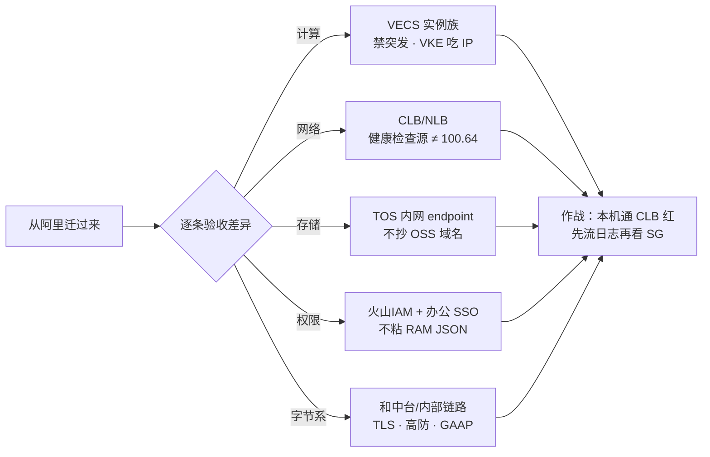
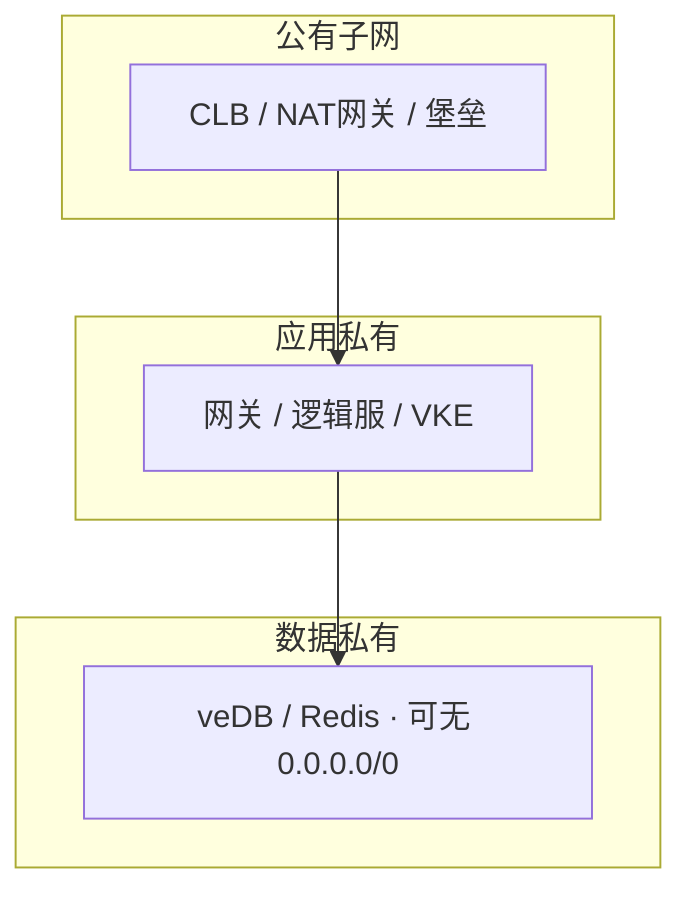
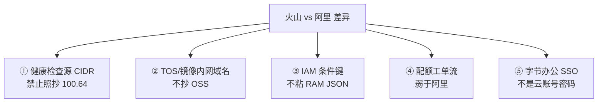
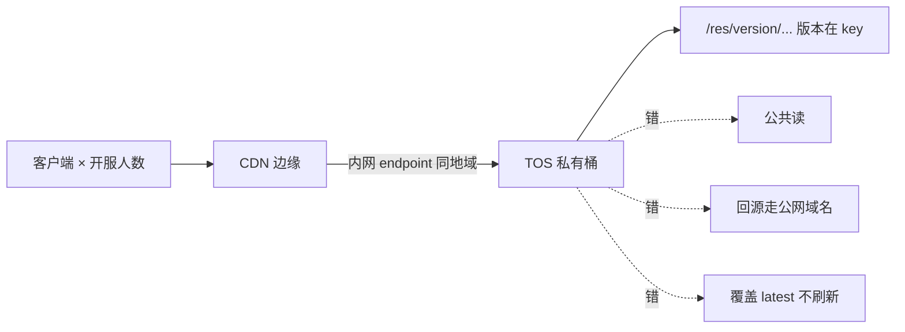
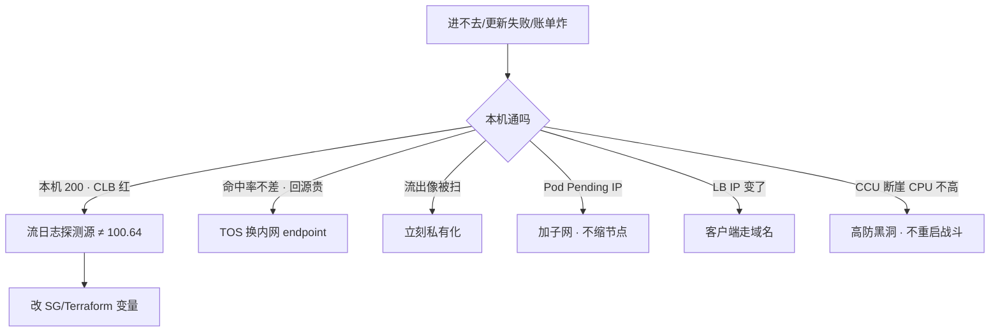

# 火山引擎生产

> 大家好，欢迎来到这次分享。开讲之前，先带大家回到一个现场：
> 从阿里迁过来的 Terraform 模块把探测源写死成 `100.64.0.0/10`，开服前 CLB 全红、本机 curl 全 200。同一天 TOS 回源抄了 OSS 公网域名，命中率还行，回源账单先炸。
> 这一章讲完，你会知道当时「探测源抄 100.64」和「TOS 回源抄 OSS 公网域名」各自错在哪，以及切云第一件事该逐条换哪些默认值。
> **本章回答的问题**：火山和阿里差在哪几条默认值——探测源、内网域名、IAM、字节系内部链路，每条怎么验、不验会怎样。
> **本章不讲**：VPC/SG/NAT 通用路径 → [01](../01-云网络与安全/)；阿里 `100.64`、Terway、OSS 细节 → [06](../06-阿里云生产/)；AWS NLB/IRSA 对照 → [07](../07-AWS生产/)；多云翻译表 → [09](../09-多云对照/)；多 AZ/RPO/云 Redis 上限 → [03](../03-云上存储与数据库/)；包年/流量/闲置 → [05](../05-成本治理/)；泄漏应急/多账号树 → [04](../04-IAM与多账号/)。

**标记**：🎯重点 · 🔥难点 · ⭐常考 · 🔧实操

**怎么听这场分享**：先把第一节「从阿里迁到火山的差异地图」看熟——计算→网络→存储→权限→字节系；第二到第六节逐条验收差异，第七节专门讲开头那个 CLB 全红现场怎么定责。每一节讲完会提示对应练习题，趁热打铁。

---

## 一、一张图：从阿里迁到火山的差异地图

> 🎯 **一句话**：火山和阿里产品模型同构，排障 SOP 可迁移；不能迁移的是探测源 CIDR、TOS 内网域名、IAM 条件键和字节办公身份——切云第一件事就是逐条替换这些默认值。

火山引擎是字节跳动的云。产品模型和阿里同构：VPC、安全组、CLB/ALB、TOS、VKE、TLS、IAM，排障思路可迁移。字节系岗位要的不是再背一张产品表，而是你能在这张网上查 SG、LB、TOS、IAM，并且不把阿里的网段和 JSON 粘过来。沐瞳（及同类字节游戏）生产链路和国内阿里区几乎同一张图，换的是控制台、配额工单、内网域名、办公身份。

为什么单开一章？因为字节系（含沐瞳）把火山 08 当必读——不是因为火山产品更复杂，而是因为"同构"带来一个陷阱：你会把阿里模块原样 apply，然后在探测源、内网域名、IAM 条件键上踩坑。本章只讲火山特有的产品名和默认值差异，不重复 01-05 的通用云概念。选火山通常因为公司是字节系（沐瞳等）或要和字节内网/身份打通——这不是"火山更懂游戏"，是生态绑定。非字节系公司用火山按普通云验收即可，不需要和中台打通。

四个角色不要混：对象存储叫 TOS（不是"就是 OSS"，内网域名不同）；托管 K8s 叫 VKE（对标 ACK，健康检查源和阿里不同）；日志叫 TLS（和云监控/Prom/字节内观测要去重）；身份叫火山IAM + 办公 SSO（不是再造一套云账号密码）。



**读图**：主线是"从阿里迁过来要逐条验收的五条差异"。计算、网络、存储、权限四条是产品层差异；第五条"字节系"是火山独有的生态绑定——和中台打通、内部链路、办公身份。任何一条没验收到位，开服当天就会炸。`OPS` 是排障入口：任何一段卡住都先回到"本机通不通、CLB 红不红"，不是先改业务端口。

五条差异按"迁移时最容易照抄"排序：①健康检查源 CIDR（从阿里 Terraform 模块粘过来）；②TOS/镜像内网域名（从 OSS 文档抄）；③IAM 条件键（从 RAM/AWS JSON 粘过来）；④配额工单流（弱于阿里，需要提前走工单）；⑤字节办公 SSO（不是云账号密码）。迁移第一件事就是替换 ① 和 ②——这两条不验收到位，开服当天直接炸。

> ⚠️ **别混**：火山和阿里"同构"的是产品模型（VPC/SG/LB/对象存储/托管 K8s/IAM 都有对应物），不是"默认值相同"。探测源、内网域名、IAM 条件键、配额工单流——这些默认值全部不同，切云第一件事就是替换它们。同构不等于同配——你搬的是拓扑和 SOP，不是 IP 段和 JSON。

> 📝 **面试**：「火山和阿里同构可迁移，但探测源/TOS 内网域名/办公 IAM 三条不能抄。沐瞳现场主打 TOS 热更、CLB 长连接、VKE 节点池，不是 PaaS 名称。选火山通常因为字节系或要打通内部链路，不是'更懂游戏'。」

没用过火山的诚实说法：「NAT SNAT、SG 探测源、对象存储公共读这三件事我按同一套 SOP 验收；健康检查源我会先查文档和流日志，不搬阿里的网段。」有落地再讲具体故障。不要展开数十个 PaaS 名称。


好，主图装进脑子了。接下来从「计算」开始——VECS 与 VKE。

本节对应练习题 Q1、Q6。

---

## 二、计算：VECS 实例族与 VKE ⭐

> 🎯 **一句话**：火山引擎的 ECS 叫 **VECS（Volcano Engine Cloud Server）**，实例族命名和阿里不同但选型逻辑一样；突发规格战斗服禁用，VKE 吃 VPC IP 和 ACK Terway 同一类坑。

**VECS** 就是火山的弹性计算实例，对标阿里 ECS、AWS EC2。选型逻辑和阿里完全一样：逻辑服/网关选通用型 g 或高主频型 h，Redis/缓存选内存型 r，24 核以上盯网卡 PPS。差异在命名和产品页，不在选型方法论。实例族（instance family）的对应关系以火山控制台为准——不要假设阿里 `ecs.g6.large` 对应火山同名规格，按 vCPU/内存/网络性能对照。网卡 PPS 是 24 核以上实例的隐藏瓶颈——活动期网关先打满网卡再打满 CPU，选型时要看网卡转发性能指标，不要只看 vCPU 和内存。

VECS 实例的 metadata 服务地址和阿里不同，用 `curl` 查规格时地址以火山文档为准，不要抄阿里的 `100.100.100.200`。metadata 服务返回实例的规格、AZ、网络配置等信息——从阿里迁过来的脚本如果写死了阿里的 metadata 地址，会超时或返回错误。火山的 metadata 地址以控制台文档为准，换成火山地址后脚本才能正常工作。

实例规格对照：不要假设阿里 `ecs.g6.large` 对应火山同名规格。火山 VECS 的实例族命名和阿里不同（具体名称以控制台为准），但 vCPU/内存/网络性能的档位是对应的。选型时按 vCPU/内存/网卡 PPS 对照，不按名字对照。通用型对标阿里的通用型，高主频型对标阿里的高主频型，内存型对标阿里的内存型。跨 AZ 的通用规则在 01 讲过，这里只说火山特有的：数据面（veDB/NAT/LB）必须多 AZ；有状态战斗服常故意单 AZ，RTO 按"踢人重建"写进预案。

> 📝 **面试**：「火山的 ECS 叫 VECS，实例族命名和阿里不同但选型逻辑一样：战斗服禁突发规格，24 核以上盯网卡 PPS。没用过火山的话按同一套 SOP 验收，不背产品名。」

### 突发规格与竞价实例 🔧

> 🔍 **现场**：开服前活动期，战斗服 CPU 偶发卡到 100%，但 CCU 不高、网络不大。查监控发现 CPU 周期性冲高然后回落，不是持续打满。

```bash
# 看实例规格是否突发型
curl http://100.96.0.96/latest/meta-data/instance/instance-type  # ← 火山 metadata
# 输出例：ecs.g3i.large → 通用型 ✅
# 输出例：ecs.t3.small  → 突发型 ⚠️ 战斗服不该用
```

突发规格（类似阿里 t 系列、AWS T 系列）有 CPU 积分机制：攒满了短时能 burst，打完后被限到基线。测试环境可以，战斗服和生产入口不用——活动期 burst 打完就是卡顿。你在监控里看到的现象是：CPU 偶发冲到 100% 然后掉下来，CCU 不高、网络不大、磁盘 IO 正常。这不是逻辑服卡，是 burst 积分耗尽后被限到基线性能。

竞价实例同理：只给可中断的构建/Job，不给战斗进程。竞价实例被回收时没有优雅 drain，战斗进程直接被杀，玩家掉线。竞价实例的中断通知时间很短——VECS 竞价实例被回收会给通知但只有几分钟，战斗进程来不及优雅退出。逻辑服、网关选通用 g 或高主频 h；Redis/单机缓存选 r。24 核以上盯网卡 PPS，活动期网关先打满网卡再打满 CPU——这条和阿里/AWS 完全一样。VECS 的竞价实例和按量实例价格模型不同——竞价更便宜但可中断，按量更贵但稳定。生产战斗进程用按量或包年，不用竞价。

突发规格在监控里的信号：CPU 周期性冲高然后回落，不是持续打满。T2 系列的基线性能很低（通常 10-20%），积分攒满后能短时 burst 到 100%，积分用完后限到基线。如果你看到这个模式——CPU 冲高和 CCU 高峰重合但 CCU 不高时也冲高——就是 burst 打完被限了。解法：换成通用型或高主频型，不要用突发型跑战斗服。

> 📝 **面试**：「VECS 实例族命名和阿里不同，但选型逻辑一样。突发规格有 CPU 积分机制——burst 打完限到基线，战斗服和生产入口不用。竞价实例只给可中断的构建/Job。24 核以上盯网卡 PPS，活动期网关先打满网卡再打满 CPU。镜像和快照以火山文档为准，metadata 地址不要抄阿里。」

突发规格的验证方法：除了看监控里的 CPU 模式，还可以用 metadata 接口确认实例规格类型。通用型和高主频型的规格名称通常不含 `t` 前缀；突发型通常含 `t`（如 `ecs.t3.small`）。但命名规则可能变化，最终以控制台实例规格页面标注的"性能模式"为准——控制台会标明是"标准型"还是"突发性能型"。不要只看名字猜，要看控制台的官方标注。

镜像和快照（snapshot）以火山文档为准：生产开自动快照策略，回滚前确认一致性——快照是崩溃一致的，不是应用一致的，数据库回滚前要先停写入。快照回滚不是"按一下按钮"：回滚前先停业务写入、确认快照时间点、回滚后验证数据完整性。镜像仓库落在对象存储体系上——拉镜像走内网 endpoint 不要穿 NAT，和 AWS ECR Endpoint、阿里内网镜像是同一类坑。ECS + Nginx 下包能扛测试，扛不住开服。镜像仓库的 endpoint 域名以火山文档为准，不要从 OSS 或 ECR 文档抄。

实例生命周期管理：VECS 实例的停机、重启、更换规格操作和阿里 ECS 类似，但 API 和控制台路径不同。更换规格需要停机，生产实例维护窗口要提前公告。竞价实例被回收时没有优雅 drain——VECS 竞价实例被回收会给通知但时间很短，战斗进程直接被杀。竞价实例只给可中断的构建/Job，不给战斗进程，这条和阿里/AWS 完全一样。

### VKE：托管 K8s 🔥

VKE（Volcano Engine Kubernetes Engine）对标阿里 ACK、AWS EKS：控制面托管，你管节点池、CNI、插件、升级窗口。ssh 不进 etcd，但停变更仍然是你的业务（见 [03-01](../../03-Kubernetes/01-集群架构/)）。升级不要和开服日重叠——这条和 ACK/EKS 完全一样，但 VKE 的升级窗口和维护策略以控制台为准。

VKE 的节点池管理是你的活：规格白名单（禁突发给战斗服）、系统盘大小（够镜像 + 日志）、节点标签（用于节点亲和性调度）、污点（用于专用节点隔离）。节点池扩容按规格白名单自动选规格，缩容要配合 drain 和 PDB——直接缩容会杀 Pod，有状态战斗服会被踢人。节点池的 ASG（自动伸缩组）配置按峰值 Pod 数 + 缓冲，不要按"平均值大概够"配置——开服峰值会超。

**VPC-CNI** 和阿里 Terway 同构：Pod IP 进 VPC，连 veDB 安全组好写（直接放节点网段或 Pod 网段）；代价是节点池 `/24` 耗尽 `insufficient IP`。按峰值 Pod × 1.5 预留，和 Terway / AWS VPC CNI 同一套账。这个坑在 01 讲过通用原理，这里只说火山特有的：VKE 的 VPC-CNI 配置参数和 Terway 不完全一样，但"按 Pod 占 IP"这个模型是一样的。安全组可以直接放 Pod 网段——VPC-CNI 下 Pod IP 在 VPC 内可路由，veDB 安全组可以放 Pod 网段而不需要像 ENI 模式那样放节点网段。

```text
kubectl describe pod <pending>
# Events:
#   Warning  FailedScheduling  ... insufficient IP    # ← 子网 IP 耗尽，不是节点不够
# ← 止血：加子网/余量，不要先缩节点
```

止血步骤：先 `kubectl get nodes -o wide` 看节点是否 Ready（如果 Ready 但 Pod Pending，大概率是 IP 不够）；再看节点池子网的可用 IP 数；加 secondary CIDR 或新子网。不要现场改已经对等的生产网段——和 01 同一条规则。

节点池管理：VKE 节点池的扩容、缩容、升级是三个独立操作。扩容按节点池规格白名单，缩容要配合 drain 和 PDB——直接缩容会杀 Pod，有状态战斗服会被踢人。升级节点池时滚动替换节点，每个节点 drain + 新节点加入，确保 CLB 摘流快于 Pod 退出。升级窗口不要和开服日重叠——这条和 ACK/EKS 完全一样，但 VKE 的升级策略以控制台为准。

PDB（PodDisruptionBudget）和优雅下线：VKE 的 Pod 退出时序和 ACK 一样——先发 SIGTERM，等 terminationGracePeriodSeconds（默认 30s），然后 SIGKILL。CLB 摘流慢于 Pod 退出会导致新连接打到正在退出的 Pod。解法：PDB 限制并发退出数 + preStop hook 延迟退出 + terminationGracePeriodSeconds 调大。有状态战斗服可以不上 VKE，理由和 ACK 一样：优雅下线、内核参数、固定容量、CLB 摘流时序。

Pod 退出时序详解：①Kubernetes 发 SIGTERM 给 Pod；②Pod 的 preStop hook 执行（通常 sleep 5-10s 等 CLB 摘流）；③Pod 内进程收到 SIGTERM 开始优雅退出（保存状态、断开连接）；④等 terminationGracePeriodSeconds（默认 30s）；⑤如果还没退出，发 SIGKILL 强制杀。CLB 摘流发生在 ②③之间——CLB 发现 Pod 的健康检查失败后才摘流，但健康检查有间隔和阈值，可能 CLB 还没摘流 Pod 就退出了。preStop hook 的 sleep 就是为了等 CLB 摘流完成后才让 Pod 退出。这个时序在 VKE 上和 ACK 完全一样，不是火山特有的。

有状态战斗服不上 VKE 的理由：①优雅下线——战斗进程退出时需要保存状态、通知玩家断线、踢人，不能被 SIGKILL 强杀；②内核参数——战斗服常调 `net.core.somaxconn`、`net.ipv4.tcp_tw_reuse` 等内核参数，VKE 节点的内核参数管理不如直接管 ECS 灵活；③固定容量——战斗服按区服固定容量，不需要弹性扩缩，VKE 的弹性优势用不上；④CLB 摘流时序——VKE 的 CLB 摘流和 Pod 退出时序需要调试，有状态服对时序更敏感。

Serverless/弹性实例：突发 Job 可以；有状态战斗服要稳定节点、内核参数、可预期 drain，不要图弹性。节点池规格白名单禁突发；系统盘够镜像 + 日志；游戏状态不落节点盘。弹性节点池类似 Karpenter，按需扩缩给无状态/构建，不给战斗进程。有状态服弹性不能直接 HPA：状态进 Redis/DB、按区分服、或 VKE StatefulSet + 可预期 drain。合服后释放空服。弹性节点池给无状态 API 和构建 Job 用，不给战斗进程——战斗进程需要固定容量和稳定节点，弹性扩缩对战斗服没有价值还增加风险。

**LB 注解换 IP**：VKE Service `LoadBalancer` 会开 CLB/ALB，注解写错规格、健康检查、付费类型会出现"有外部 IP 但不通"。改注解可能重建 LB，**地址会变**——客户端必须走域名。这个坑和 ACK Service LoadBalancer 注解完全一样，但注解的 key/value 以 VKE 文档为准，不要抄 ACK 的 annotation。LB 注解的常见问题：规格写错（用小规格 CLB 扛不住 PPS）、健康检查端口写错（CLB 检查的端口不是业务端口）、付费类型写错（按量改成包年或反之会触发重建）。改注解前先在测试环境验证——生产环境改注解可能触发 LB 重建，客户端连不上。

滚动时 CLB 摘流慢于 Pod 退出，或健康检查过快把正在 drain 的节点打成 Unhealthy 又打回去，和 ACK 同一类时序问题。要 PDB + 优雅下线。有状态战斗服可以不上 VKE，理由和 ACK 一样：优雅下线、内核参数、固定容量、CLB 摘流时序。VKE 的优势在无状态 API 和弹性 Job，不在有状态战斗服——选不选 VKE 取决于你的服务模型，不是"VKE 比 ECS 先进"。

权限：Pod 扮 IAM 角色访问 TOS/TLS，禁止 AK 进 Secret 挂全部 Namespace。节点角色要瘦，Trust 限制到具体 ServiceAccount，模型同 IRSA/RRSA，JSON 按火山文档，不要粘 AWS。Pod 角色和节点角色拆开：节点角色只管 Kubelet 拉镜像和基础组件，业务 Pod 用单独的 ServiceAccount + IAM 角色。节点角色被攻破后只能拉镜像，不能读 TOS 业务数据；业务 Pod 角色被攻破后只能读指定 TOS 前缀，不能改 IAM 策略。两层角色拆开 = 两道防线。

VKE 升级策略：控制面升级由火山托管，你管节点池升级。节点池升级是滚动替换——先 drain 旧节点，新节点加入，Pod 迁移。升级窗口选在低峰期，不要和开服日重叠。升级前备份 etcd（虽然你 ssh 不进 etcd，但控制台可以触发备份）。升级后验证：所有节点 Ready、所有 Pod Running、CLB 后端 Healthy、业务功能正常。升级回滚策略以控制台为准——不是所有升级都能回滚，确认后再执行。升级前要通知相关方——VKE 升级期间可能有短暂 Pod 迁移，虽然 PDB 保证不全部退出，但部分 Pod 迁移可能影响性能。

VKE 插件管理：VKE 自带一些插件（如 VPC-CNI、CSI 驱动、TLS Agent），插件的版本和 K8s 版本有对应关系。升级 K8s 版本时插件也要同步升级——插件版本不匹配可能导致 Pod 无法调度、存储无法挂载或日志采不到。插件升级也是你的活，不是火山托管的。

> ⚠️ **别混**：VKE 和 ACK 的差异不在功能，在生态——VKE 文档密度低、配额走工单、和字节内监控/日志/IAM 绑得紧。成熟度不是答题重点，能不能按同一套 SOP 验收才是。第一周交付是验收清单（探测源/idle/CIDR/TOS 内网/办公 SSO），不是背 veDB 产品名。


计算讲完。网络：健康检查源 ≠ 100.64——这是切云第一坑。

本节对应练习题 Q2、Q5。

---

## 三、网络：CLB、健康检查源与 VPC-CNI 🔥⭐

🔥 大白话：**探测源 CIDR 是切云默认值，不是产品名对照能带过去的**。抄 `100.64` → CLB 全红、本机 curl 全 200。

> 🎯 **一句话**：火山健康检查源禁止照抄阿里 `100.64.0.0/10`，以控制台/文档为准——这是切云/切厂商最高频事故。

CLB 是火山的四层负载均衡（TCP/UDP），对标阿里 CLB/NLB、AWS NLB。ALB 是七层（HTTP/HTTPS）。游戏长连接走 CLB 四层，不接 ALB；HTTP 登录/支付/GM 走 ALB + WAF。CLB 的关键配置三条必验：会话保持、健康检查、idle timeout。会话保持按源 IP——运营商 NAT 后大量玩家同一出口 IP 会全部打到同一后端，开服时单机 CCU 畸形高，要接入层做连接级调度。健康检查以控制台/文档为准，不抄 100.64。idle timeout 心跳必须 < idle 的 1/3。

SG 按角色分层：`sg-lb` 游戏端口放高防回源段（不是 `0.0.0.0/0` 到逻辑服）；`sg-gateway` 放 `sg-lb`；`sg-logic` 只放网关；`sg-mysql` 3306 只放应用。这套分层和 01 完全一样，不重复。VPC 按环境切 CIDR、子网拆公有/应用私有/数据私有，和 01 完全一样。CIDR 一旦对等/专线就难改——测试和生产不要都 `10.0.0.0/16`，这条通用规则在 01 讲过。火山的 SG 规则和阿里一样有状态——入放则回程自动放，不需要像 NACL 那样入出各写一条。SG 规则的变更通过 Terraform 或控制台，不要手动改——手动改的规则在下次 Terraform apply 时会被覆盖。

### 健康检查源：禁止照抄 100.64 🎯⭐🔥

> 💡 **打个比方**：火山像"同户型的另一栋楼"——VPC/NAT/LB 结构一样，但物业用的巡检 IP 段不同。你把旧楼的巡检白名单粘过来，巡检包被门禁（安全组）丢掉，后端就"不健康"了。

从阿里迁过来的 Terraform 模块把探测源写死成 `100.64.0.0/10`。火山健康检查源不是阿里那条链路本地网段。健康检查包被 SG 丢掉，后端 Unhealthy，玩家进不去，进程还在听。

你眼睛看到的：`ss -lnt` 在听，`curl 127.0.0.1:port` 200；CLB 控制台后端全红。卡住先看哪：控制台/文档「负载均衡探测」，对流日志看真实源 IP，不是 `100.64.0.0/10`。

```bash
ss -lnt                          # ← 进程在听
curl -s -o /dev/null -w '%{http_code}\n' 127.0.0.1:port  # ← 200，本机通
# CLB 控制台后端全红 → 探测源被 SG 丢了
# ← 对流日志看真实源 IP，不要假设 100.64
```

**必须明确**：火山健康检查源禁止照抄阿里 `100.64.0.0/10`，以控制台/文档为准。这是本章最重要的一句话。探测源不能靠猜——从阿里迁过来时，Terraform 模块里写死的 `100.64.0.0/10` 必须替换成火山实际的探测源段。怎么查：控制台「负载均衡 > 健康检查」页面会显示探测源，或文档「负载均衡健康检查源」。查到后写进 SG 规则和 Terraform 变量。

系统里发生了什么：火山的探测源不是阿里那条链路本地网段。LB 发的健康检查包源 IP 不是 `100.64.0.0/10`，被后端 SG 规则丢弃，LB 收不到响应，标记后端 Unhealthy，CLB 控制台显示后端全红。但进程在听、本机 curl 通、堡垒 curl 也通——因为你的 curl 和 LB 探测是两条完全不同的路径。你的 curl 从堡垒出发，堡垒 IP 在 SG 放行规则里；LB 探测从健康检查源 IP 段出发，这个段没写进 SG，包被丢掉。治理：模块里探测 CIDR 按云厂商参数化，禁止写死阿里网段。这是切云最高频事故（01/04）。

验证流程：①本机 `ss -lnt` 确认进程在听；②本机 `curl 127.0.0.1:port` 确认端口通；③CLB 控制台看后端健康状态——如果全红，就是探测源问题；④对流日志看 LB 探测包的真实源 IP；⑤把真实源 IP 段写进 SG；⑥等后端变绿。整个流程不超过 5 分钟，但如果你跳过对流日志直接改业务端口，会浪费 30 分钟在错误方向上。

常见误区：①看到 CLB 全红就重启进程——重启了也没用，进程在听，问题是探测源被 SG 丢；②看到 CLB 全红就改业务端口——端口没监听你本机 curl 不会通，本机 curl 通了说明端口没问题；③看到 CLB 全红就开 `0.0.0.0/0`——虽然能"解决"问题但源站裸奔，等开服后被打到就是整服没。正确做法：对流日志看探测源真实 IP，写进 SG，等变绿。

有状态服检查过严同样会把正在打的玩家踢到另一台——健康检查打到会阻塞的业务线程，瞬时变慢被摘流，正在打的玩家被踢到另一台。检查口要轻、与业务线程隔离，最好用独立健康检查端口。健康检查端口的响应应该是最轻量的——`200 OK` 即可，不要在检查端口里做数据库查询或复杂逻辑。检查频率不要太快——CLB 默认每隔几秒检查一次，如果你的检查会阻塞业务线程，每次检查都让业务卡一下，叠加起来就是周期性卡顿。

健康检查配置三条原则：①检查口要轻——独立端口或最简单的 HTTP 路径，不做重活；②检查频率适中——不要太快（会打满业务线程）也不要太慢（故障发现不及时）；③检查失败阈值合理——连续几次失败才摘流，避免单次抖动就踢人。这三条和阿里/AWS 通用规则一样，不是火山特有的。

> 📝 **面试**：「火山健康检查源禁止照抄阿里 `100.64.0.0/10`，以控制台/文档为准。本机通、CLB 全红，先对流日志看探测源真实 IP，再写进 SG 和 Terraform 变量。不要先改业务端口、不要先重启。」

### CLB vs NLB vs ALB

> ⚠️ **别混**：火山 CLB 是四层（TCP/UDP），对标阿里 CLB/NLB。阿里把 L4 拆成了 CLB（旧）和 NLB（新），火山的产品线划分以控制台为准，不要假设和阿里一一对应。NLB/CLB 开了源 IP 保持：后端可能看到玩家 IP，业务端口规则和健康检查源是两套——SSH 绝不能跟着重开。火山具体是否保留 client IP 以产品为准，不要假设和 AWS NLB 默认值一样。

长连接选型：CLB 四层不解析协议、PPS/延迟合适。心跳 < CLB idle timeout；UDP 会话超时单独测。自定义二进制协议接 ALB 会解析失败或按 HTTP 健康检查——ALB 期望 HTTP 握手起手，你的自定义 TCP 协议不是 HTTP，ALB 解析不了直接放行失败。WebSocket 仅当标准 HTTP 升级时走 ALB，idle 仍要短于心跳。UDP 只有四层。

CLB idle timeout 验证：心跳间隔必须 < CLB idle timeout 的 1/3，否则连接静默超时后被 LB 主动 FIN/RST。开服前必验：CLB 控制台看 idle timeout 默认值（和阿里可能不同），心跳间隔调到 idle 的 1/3 以下。UDP 会话超时单独测——UDP 无连接，LB 用会话超时管理，超时后五元组漂移到别的后端，有状态 UDP 必须会话保持或改客户端重连。不要假设 CLB 的 idle timeout 和阿里 CLB 默认值一样，以控制台为准。

源 IP 保持的验证：如果 CLB 开了源 IP 保持（preserve client IP），后端看到的是玩家 IP 而不是 CLB 的内部 IP。此时 SG 要写两套规则：业务端口放玩家 IP 段（因为业务流量带玩家源 IP），健康检查端口放 LB 网段（因为健康检查流量仍是 LB 内部 IP）。漏放玩家 IP 段 = 玩家进不去；管理端口跟着 `0.0.0.0/0` = 源站裸奔。两套规则都要有，和 01 讲的 preserve client IP 完全一样。火山是否保留 client IP 以产品为准，不要假设和 AWS NLB 默认值一样。

源 IP 保持会被运营商 NAT 打到单机——大量玩家同一出口 IP，会全部打到同一后端，开服时出现单机 CCU 畸形高、其他机器空转。此时要在接入层做连接级调度，不能指望源 IP 哈希。CLB 会话保持、健康检查、idle timeout 三条必验。UDP 监听类型确认产品真支持——不要假设 CLB 的 UDP 实现和阿里 CLB 完全一样，以控制台为准。

### VPC-CNI 与 EIP/NAT网关 🔧

VPC-CNI 吃 IP 和 ACK Terway 同构（见上节 VKE）。**EIP（弹性公网 IP）**和 **NAT网关**的逻辑和阿里一样：逻辑服无 EIP，数据子网可以没有默认出网，NAT网关每 AZ 一个。源站保护：高防后 SG 只放回源段，逻辑服绑 EIP + `0.0.0.0/0` 放业务端口 = DDoS 绕过高防直打，和阿里同一类事故。



**读图**：公有子网放 LB/NAT网关/堡垒，应用私有放网关/逻辑服/VKE，数据私有放 veDB/Redis 且可以没有 `0.0.0.0/0`。3306/6379 只放应用网段。逻辑服、RDS、Redis 永不绑公网 IP。这和 01 的三层子网模型完全一样。

EIP 和 NAT网关的区别：EIP 绑在 ECS/LB 上，是该实例的公网出口；NAT网关绑在子网路由表上，是该子网所有 ECS 的共享出口。逻辑服不绑 EIP——绑了 EIP 就是源站 IP 泄漏，DDoS 绕过高防直打。NAT网关给逻辑服出公网用（调外部 API、拉镜像），不给玩家入站用。源站保护的核心是：入站只走高防 + CLB，出站走 NAT网关，管理走堡垒。三条路径分开，互不交叉。

EIP 闲置、NAT网关空闲、解绑的 EIP 照扫——和 05 同一套成本治理。NAT网关的并发连接数和带宽是两个独立的瓶颈，活动期先打满哪个以控制台监控为准。一个 NAT IP 约 6 万源端口，同 `dstIP:dstPort` 最容易耗尽——这条通用规则在 01 讲过，不重复。

NAT网关的验证：从私有子网 ECS `curl ifconfig.me` 看出口 IP 是不是 NAT 的 EIP。如果出口 IP 不是 NAT EIP，说明路由配错了——可能走了 IGW 而不是 NAT，出公网流量没有 SNAT。私有子网走了 IGW 而不是 NAT = 出网黑洞（超时不是拒绝），和 01 同一条规则。从堡垒或办公网 ping 私有子网 ECS 应该不通——私有子网没有公网 IP，只能从堡垒跳转。

### CEN/TGW 对等

**CEN（云企业网）** 是火山的对等互联产品，对标阿里 CEN、AWS Transit Gateway（TGW）。VPC 间对等、跨账号互联、专线接驳走 CEN/TGW。配置以控制台为准，不要把阿里的 JSON 粘过来——路由条目和传播规则的字段名不同。对等前先确认 CIDR 不重叠，这个通用规则在 01 讲过。CEN/TGW 对等是迟早的事，门牌号从一开始就不能撞。

CEN 的路由传播和阿里 CEN 不完全一样：传播规则的字段名、优先级、默认行为以火山文档为准。跨账号对等需要两边都配置 Allow，和阿里/AWS 的模型一样但操作界面不同。专线接驳到 CEN 后，路由传播的收敛时间以文档为准——不要假设和阿里一样快。CEN 配置后要验证：从 VPC A `traceroute` 到 VPC B 确认走的是 CEN 而不是公网。如果延迟和公网差不多，说明 CEN 路由没生效或配置错误。CEN 的带宽包要按峰值配置——跨 VPC 流量超过带宽包会限速，活动期先打满 CEN 带宽再打满 NAT。

CEN 对等和 VPC peering 的区别：VPC peering 是两个 VPC 之间一对一的对等，CEN 是多 VPC 的网状互联。生产环境跨账号、跨 Region 的多 VPC 互联用 CEN 更方便——加一个 VPC 到 CEN 就自动和 CEN 里其他 VPC 路由互通，不需要两两配 peering。但 CEN 有带宽包费用，按峰值配置。VPC peering 免费但不自动传播路由。选哪个按规模：两个 VPC 用 peering，三个以上用 CEN。

### 收束：火山网络凭什么和阿里不同



**读图**：五条差异按"迁移时最容易照抄"排序。①② 是产品层（探测源、内网域名），③⑤ 是身份层（IAM、办公 SSO），④ 是运维层（配额工单）。迁移第一件事就是替换 ① 和 ②。从阿里迁过来的模块，第一件事就是替换探测 CIDR 和 TOS endpoint。

可背清单：
- 本机通、CLB 红 → 流日志看探测源，不假设 100.64
- TOS 账单炸、命中率不差 → 换内网 endpoint
- Pod Pending → 加子网，不缩节点
- LB 注解改后全服连不上 → 客户端走域名
- CCU 断崖、CPU 不高 → 入口被洗，不重启战斗

> ⚠️ **别混**：这五条差异不保证"火山比阿里差"——同构的是模型，不同的是默认值和文档密度。也不保证"VKE 和 ACK 功能对等"——文档少、配额走工单、字节生态绑得紧才是真差异。共通 SOP 可迁移：NAT SNAT、SG 探测源、对象存储公共读、源站无 EIP、长连接用四层、有状态服慎上弹性。不可迁移的默认值：健康检查源、内网域名、IAM 条件键和文档、办公身份、配额工单。

> 📝 **面试**：记忆分组法——把五条差异分三组背：**产品层**（探测源 + 内网域名）、**身份层**（IAM + 办公 SSO）、**运维层**（配额工单）。再补一句"同构的是模型，不同的是默认值"。


网络讲完。记住口诀：**阿里 100.64 不能原样粘到火山**。下一节 TOS。

本节对应练习题 Q2、Q3、Q13。

---

## 四、存储：TOS 对象存储与 CDN

⭐ 名字像不等于行为像。TOS 内网 endpoint 必须单独验收，回源走公网 = 命中率看着还行、账单先炸。

> 🎯 **一句话**：**TOS（Tinder Object Storage）** 是火山的对象存储，能力同 OSS/S3，但内网 endpoint 域名不同——回源和拉镜像走错就变公网流量。

沐瞳开服/热更真正打到的对象存储是 TOS，不是"再学一个 OSS"。原则与 OSS/S3 相同：Bucket 私有、CDN 回源鉴权、版本号在对象键里。差异在内网域名和权限模型。TOS 还承接：APK/IPA 包体、玩家录像/截图、日志归档（TLS 投递 TOS）、数据库备份。TOS 和 OSS 的功能同构——都有生命周期、版本控制、权限策略、CDN 回源。但内网 endpoint 域名不同、权限模型的条件键不同，从阿里迁过来时不能照抄 OSS 的域名和 JSON。TOS 的 API 兼容度以火山文档为准——不要假设 S3 API 完全兼容，生命周期和权限模型的字段名可能不同。



**读图**：正路是客户端 → CDN → TOS 内网 endpoint。三个错误分支都是开服当天会炸的：公共读是账单炸弹、公网回源是回源费炸、覆盖同名不刷 CDN 是版本不一致。从哪进：客户端从 CDN 边缘进；从哪查：出问题先查 CDN 命中率 → 源站 403 → TOS 流出。

TOS 回源抄了 OSS 公网域名——CDN 命中率还行，回源账单先炸。系统里回源走了公网而不是 TOS 内网 endpoint。你眼睛在账单里看到 TOS/CDN 回源流出，命中率图却不差。卡住先换 TOS 内网 endpoint 域名（不要从 OSS 文档抄），再查访问日志。怎么定位是不是这条：CDN 命中率正常（> 90%）但 TOS 回源费异常高——说明 CDN 缓存命中时不需要回源，但未命中时回源走了公网。公网回源费是内网回源费的数倍。换 endpoint 后回源费应明显下降。公网回源和内网回源的区别不在命中率（CDN 边缘缓存命中时两者一样），在回源流量走公网还是走内网——公网回源按公网流量计费，内网回源走内网免费或低价。开服十万客户端同时请求同一个包体，CDN 缓存未命中的部分会回源到 TOS。如果回源走公网，十万客户端的回源流量按公网流出计费；如果走内网，回源流量走 VPC 内部不计公网费。一个域名的差异，回源费差几倍。

TOS 内网 endpoint 的查找方法：火山文档「对象存储 TOS」页面会列出各 Region 的内网 endpoint 和公网 endpoint。内网 endpoint 通常包含 `internal` 或 `volces-internal` 字样，公网 endpoint 不包含。Terraform 或代码里回源域名要写内网 endpoint，不要从 OSS 文档抄——OSS 的内网 endpoint 域名和 TOS 不同，抄过来会解析到错误的地址或走公网。

生产配置五条 ⭐：

1. Bucket 私有，CDN 回源鉴权；禁止匿名写。私有桶 + CDN 回源鉴权是标准做法——CDN 边缘节点用签名 URL 回源，TOS 验证签名后才返回内容。公共读"省事"是开服当天账单炸弹：十万客户端直接打 TOS 公网出口，按公网流出计费。私有桶 + 回源鉴权不是多此一举——CDN 缓存未命中时回源到 TOS，TOS 验证 CDN 的回源签名后才返回内容，防止有人绕过 CDN 直接刷 TOS。

2. 回源走 TOS **内网 endpoint**，域名按火山文档，不要从 OSS 抄。TOS 的内网 endpoint 域名和 OSS 不同——抄了 OSS 的域名就走了公网回源，回源费翻几倍。内网 endpoint 走 VPC 内部网络，不计公网流量费；公网 endpoint 走公网，按公网流出计费。一个域名的差异，回源费差几倍。怎么验：从 ECS `curl` TOS 内网 endpoint，延迟应该 < 5ms（同 VPC 内网）；如果延迟 > 20ms 或走了公网路由，说明 endpoint 用错了。

3. 生命周期按前缀：热更包热数据不过期；旧版本转低频/归档；日志短保留。不要把 `res/current` 和日志归档放一条规则——日志前缀设了 30 天过期，如果热更包也在同前缀下会被一起删。生命周期是省钱利器但配置要细：热数据（当前版本热更包）放标准存储不过期；旧版本（v1.x）转低频/归档降低成本；日志（TLS 投递）设短保留 7-30 天。前缀划分要和业务版本号对应，不要混在一起。

4. 版本号在对象键里；覆盖同名必须刷新 CDN（有配额和延迟，不是全球瞬时一致）。CDN 刷新有配额限制和传播延迟——强更分两步：先上传新包到新 key，验证可下载，再切版本检查服务。CDN 不是全球瞬时一致——刷新请求提交后，各边缘节点逐个刷新，有传播延迟。配额限制每天刷新的 URL 数量，超了只能等第二天或联系客服提配额。所以版本号在 key 里是正确做法——`/res/v2.1.0/app.apk` 而不是 `/res/latest/app.apk`，切版本改版本检查服务的指向，不覆盖同名。

5. 强更分两步：新包可下载，再切版本检查服务。不要直接覆盖 `latest`——覆盖后 CDN 旧缓存还在，部分客户端拿到旧包、部分拿到新包，版本不一致。两步强更：①上传新包到新 key `/res/v2.1.0/app.apk`，从 CDN 验证可下载；②改版本检查服务指向新版本号。两步之间客户端可以正常游戏——旧包仍在 CDN 缓存里，新包同时可下载，不需要停服。

故障排查顺序：大面积更新失败先看 CDN 命中率（是不是源站被打穿）、源站 403（回源鉴权时间差或权限错误）、TOS 流控（是否触发了限流）。CDN 命中率掉到 0 = CDN 回源被打穿或回源鉴权失败；源站 403 = 回源签名过期或权限策略写错；TOS 流控 = 触发了 TOS 的请求限流，需要联系客服提配额。误删开版本控制——TOS 的版本控制和 S3 类似，开了之后删除只是加删除标记，可以恢复。删除权限单独授并告警——删除是高危操作，权限单独授给指定角色，并在操作审计里告警。ECS + Nginx 下包能扛测试，扛不住开服——和 01 同一条规则。VKE 镜像仓库也落在对象存储上——拉镜像走内网，不要穿 NAT，和 AWS ECR Endpoint、阿里内网镜像是同一类坑。

Block Public Access 必开——这是一层全局开关，即使策略写错了公共读，Block Public Access 也会拦截。公共读在 TOS 和 OSS 都是账单炸弹。开服前验证：从公网 `curl` TOS 桶的公开 URL，应该 403 或 Access Denied。如果能下载，说明 Block Public Access 没开或策略配错了。不要假设 S3 API 完全兼容——生命周期和权限模型按火山文档验收。TOS 的权限模型和 OSS 不完全一样：Bucket Policy 和 RAM Policy 的字段名、条件键不同，不要粘 OSS 的 JSON。

CDN 预热：开服前把热更包推到 CDN 边缘节点，开服时十万客户端不需要回源。预热是主动把内容从 TOS 推到 CDN 缓存——不预热的话，第一个客户端请求会触发回源，CDN 缓存后才命中后续请求。开服十万客户端同时请求同一个包体，如果不预热，第一波请求全部回源到 TOS，可能触发 TOS 流控或回源费暴涨。预热命令以火山 CDN 文档为准，不要从阿里 CDN 或 AWS CloudFront 文档抄。预热的 URL 要覆盖所有开服需要的资源——热更包、配置文件、资源图。预热完成后验证：从不同地区 `curl -I` CDN URL 看是否命中缓存（`X-Cache: HIT`）。

> ⚠️ **别混**：TOS 和 OSS 的差异不在功能（都有生命周期、版本控制、权限策略），在内网域名和权限模型。API 兼容度不必吹成"TOS 就是 S3"——功能同构不代表 API 完全兼容，生命周期和权限模型的字段名不同。


存储讲完。大家想想：TOS 是不是「就是 OSS」？名字像，内网域名不同——回源抄公网会先炸账单。

本节对应练习题 Q4、Q14。

---

## 五、权限：火山IAM 与字节办公 SSO ⭐

大家想想：再造一套云账号密码给同事用——可以吗？字节系要和办公 SSO 打通，条件键别从阿里 JSON 原样粘。

> 🎯 **一句话**：人走字节办公 SSO → 扮演火山IAM 角色 + MFA；程序走实例角色/工作负载角色——不是在云里每人造一套密码，更不是粘 RAM/AWS JSON。

### 火山IAM vs 阿里 RAM

**火山IAM** 对标阿里 RAM、AWS IAM：用户、角色、策略、STS 临时凭证。模型同构——都有用户、角色、策略、临时凭证，都支持 AssumeRole + MFA。差异在条件键、策略语法和文档密度。不要把阿里 RAM 或 AWS IAM 的 JSON 粘进火山——字段名和条件键不同，外网文档密度低于阿里/AWS，以控制台和内部文档为准。

具体差异：条件键的命名空间不同（阿里用 `acs:` 前缀，AWS 用 `aws:` 前缀，火山用自己的前缀），策略的 Resource ARN 格式不同，Action 的命名规则不同。粘过来的 JSON 会报语法错误或静默不生效——静默不生效更危险，你以为给了只读权限实际没给，或者你以为限制了资源实际没限制。验证方法：粘进 JSON 后在控制台策略模拟器里跑一遍，确认效果和预期一致。不要跳过模拟直接 apply 到生产。

策略结构对比：阿里 RAM 的策略用 `Statement` + `Effect` + `Action` + `Resource`，AWS IAM 也用类似结构但 ARN 格式不同，火山IAM 的结构同构但字段值不同。比如 Resource 的 ARN 格式：阿里是 `acs:tos:cn-beijing:uid:bucket-name`，AWS 是 `arn:aws:s3:::bucket-name`，火山是自己的格式。Action 命名也不同：阿里用 `oss:GetObject`，AWS 用 `s3:GetObject`，火山用 `tos:GetObject`（举例，以文档为准）。

### 办公 SSO：离职关办公账号就够

> 💡 **打个比方**：阿里 RAM 是"每栋楼自己发门禁卡"，火山IAM + 字节办公 SSO 是"工牌一刷进所有楼"——离职交了工牌（办公账号），所有楼的门禁自动失效。

人从字节办公 SSO 进火山IAM，不在云里每人造一套密码。离职关办公账号即失去扮演资格，比在云里逐个删用户可靠——因为云里删用户要记得删，办公 SSO 关账号是 HR 流程自动触发的。生产 AssumeRole 强制 MFA（CI 走联邦例外）——人扮演角色时要求输入 MFA 动态码，即使 AK 泄漏了没有 MFA 也用不了。办公 SSO + MFA 是两道防线：办公账号关了 = 扮演资格没了（第一道防线）；AK 泄漏了但没有 MFA = 用不了（第二道防线）。两道防线都需要，缺一不可。

办公 SSO 的验证：登录控制台看当前登录身份是否从办公 SSO 进来的，不是用 AK 登录的。在操作审计里看 AssumeRole 事件——如果有用户直接用 AK 登录而不是 SSO + AssumeRole + MFA，说明有漏配。新员工入职时只授办公账号 + IAM 角色绑定，不给长期 AK。CI/CD 用联邦身份或短时 STS，不存长期 AK。

程序走 ECS 实例角色、VKE 工作负载角色、CI 短时 STS。长期 AK 进 Git/镜像/打包脚本，按 [04](../04-IAM与多账号/) 泄漏流程：先禁 Key，再查操作审计——泄漏的 AK 可能已经被用来下载桶数据或改了策略。STS 写进环境变量跑 12 小时 = 形式上用了角色，实际变长期票；用 SDK 默认链续期，SDK 会在过期前自动刷新 STS，不需要手动管理。

多账号结构：生产/预发/测试分账号，和 04 的多账号树一样。火山IAM 支持跨账号 AssumeRole——生产账号的角色可以 Trust 预发账号的 IAM 实体，但反过来不行（预发不能扮演生产角色）。Trust Policy 限制到具体身份，不要 Trust 整个账号（`*`）。审计日志进独立的安全账号，生产角色对审计桶 WriteOnly。

账号隔离的好处：预发被攻破不影响生产——预发账号的角色不能扮演生产角色，即使预发 AK 泄漏也只能访问预发资源。审计日志进独立账号——生产角色被攻破后不能删审计日志，因为审计日志在另一个账号里，生产角色只有 WriteOnly 权限。多账号树的具体结构和 04 讲的一样，不重复。

### 最小权限与操作审计

最小权限落到前缀：TOS 角色只能 `GetObject` 指定热更前缀（如 `res/prod/*`）；发奖/GM 角色和逻辑服拆开——GM 角色能写数据库但不应该能读 TOS，逻辑服角色能读 TOS 但不应该能写数据库。不要 `*:*`。节点角色不能 TOS Full Access = 逃逸搬桶——节点角色被攻破后可以列出所有 Bucket 并下载全部内容。跨账号桶策略两边都要 Allow，和 OSS/S3 相同。最小权限的验证：粘完策略后在控制台策略模拟器里跑一遍——模拟"这个角色能不能读这个前缀""能不能删这个桶"，确认效果和预期一致。不要跳过模拟直接 apply 到生产。

操作审计打开，日志尽量进独立账号（不是生产账号），生产角色对审计桶 WriteOnly——只能写不能读，防止生产角色被攻破后删审计日志。告警规则：根登录、新建 AK、策略变 `*`、桶公共、SG `0.0.0.0/0:22`——这五条是最高危变更，触发即告警。告警渠道不要只走一个渠道——云监控告警 + 企业 IM 通知 + 邮件，三个渠道同时通知确保不漏。文档和条件键与 RAM/AWS IAM 不同，不要粘 JSON——以火山文档和控制台为准。

STS 生命周期：STS 临时凭证有有效期（通常 15 分钟到 1 小时），过期后 SDK 自动刷新。但 STS 写进环境变量跑 12 小时是常见误用——环境变量不会自动刷新，STS 过期后程序报错。正确做法是用 SDK 的默认凭证链，SDK 会在过期前自动调用 AssumeRole 刷新。CI/CD 场景用短时 STS（15-30 分钟），跑完即过期，即使泄漏也只有短窗口。STS 有效期的选择：人扮演角色给 1 小时（够一轮值班操作），CI/CD 给 15-30 分钟（够一次构建部署）。不要给人 STS 12 小时有效期——那就是长期票了。

> 📝 **面试**：「人走办公 SSO + MFA，程序走实例/工作负载角色；长期 AK 按泄漏处理。不要粘 RAM/AWS JSON，条件键以火山文档为准。」


权限讲完。字节系特有：内部链路、TLS 与出海。

本节对应练习题 Q7、Q8。

---

## 六、字节系特有：内部链路、TLS 与出海

> 🎯 **一句话**：选火山通常因为公司是字节系（沐瞳等）或要和字节内网/身份打通——这不是"火山更懂游戏"，是和中台/内部链路的绑定。

### 和中台/内部链路

字节系公司上火山，核心收益是和中台打通：字节内部中间件、身份系统、监控平台、数据通道可以通过内部链路直连，不走公网。这条内部链路是火山对字节系客户的独有价值，非字节系公司用不到也不需要。和中台打通意味着：内部 RPC 服务可以直接调用、内部监控系统可以直接对接、内部身份系统可以直接复用、数据通道可以直连内部数仓。这些在阿里云或 AWS 上做不到——不是技术做不到，是没有这条内部链路。

和中台打通的坑：内部链路的 ACL/路由和云上 VPC 不在一个控制面，变更时要两边同步——你在 VPC 控制台改了路由，内部链路那边的 ACL 不会自动跟着变，回源走错就穿公网。内部 DNS 和云上 DNS 分属不同解析链，内部服务用内部 DNS 解析，云上服务用云上 DNS 解析，回源走错域名就穿公网。文档和配额工单流弱于阿里，第一周交付是验收清单，不是背 PaaS 名称。

内部链路的验证方法：从内部服务 ping/traceroute 到云上 VPC 确认走的是内部链路而不是公网。如果延迟和公网差不多，或者路由路径经过了公网网关，说明没走内部链路。从云上 VPC 反向 traceroute 到内部服务，确认回程也走内部链路。变更后两端都验——只验一端可能回程穿公网。

内部 DNS 的坑：内部服务用内部 DNS 解析（比如 `service.bytedance.internal`），云上服务用云上 DNS 解析（比如 `tos-cn-beijing.volces.com`）。如果内部服务用云上 DNS 解析，可能解析到公网 endpoint 而不是内网 endpoint，回源走公网。反之，云上服务如果用内部 DNS 解析，可能解析不到正确的内网地址。DNS 配置要分清楚——内部服务走内部 DNS，云上服务走云上 DNS，不要混。变更 DNS 配置后要两端验证。

> ⚠️ **别混**：和中台/内部链路是字节系专属，不是"火山自带"。非字节系公司上火山，这条优势不存在——按普通云验收即可。也不要把内部链路当 VPC 对等来配——不在一个控制面，VPC peering 和内部链路是两套独立的路由和 ACL 体系。

### TLS vs 云监控 vs Prometheus

**TLS（Tinder Log Service）** 对标阿里 SLS：Agent/DaemonSet 采集 → 查询/告警 → 投递 TOS 或 Kafka。免 ES 集群，和 VKE 集成快——DaemonSet 装 TLS Agent 就能采集容器日志，不用自己管 ES 的 Heap/分片/磁盘。账单爆同样是全字段索引 + 高基数玩家 ID + Debug 全量——和 SLS 一样的坑，索引字段越多越贵，玩家 ID 当索引列会爆基数。

TLS Agent 部署：在 VKE 上以 DaemonSet 方式运行，每节点一个 Pod，采集 `/var/log/containers/` 下的容器日志。Agent 配置指定采集路径、解析规则（正则/JSON）、投递目标。Agent 掉了日志会断——监控 Agent 的 `Running` 状态和日志摄入量，不要等业务报障才发现。Agent 的资源 request 要给够（CPU 100m / Mem 200Mi 起步），节点上 Pod 多的时候 Agent 吃资源也会涨。日志量大的节点考虑用单独的日志采集节点或降低采集频率。

对比 SLS：免 ES 集群、和 VKE 集成快。黄金指标用 Prometheus，TLS 管日志——不要用 TLS 做指标监控，那不是它的强项；也不要用 Prometheus 存日志，那是 TLS 的活。日志突然没了：先看摄入是否掉零，再查 Agent/权限——Agent 掉了日志会断，权限不对 Agent 采不到日志。自建 ELK 可以，大规模默认 TLS。归档前缀不要和 `res/current` 一条规则——日志前缀设了短保留，如果热更包也在同前缀下会被一起删。

TLS 账单优化：只索引需要查询的字段，不要全字段索引——全字段索引意味着每条日志的每个字段都建索引，账单按索引量计费。玩家 ID 如果要查就单独建索引列，不要把所有业务字段都设成索引列。Debug 日志在开服后降到 Warning 以上——开服期 Debug 全量可以接受，稳定后调高级别省索引费。日志投递 TOS 归档后，TLS 里只保留近期日志供查询，历史日志从 TOS 恢复查询。这些优化和 SLS 完全一样，不是火山特有的。

TLS 和云监控的分工：云监控看云资源指标（VECS CPU/内存/网络、CLB 健康数/新建连接、NAT 并发/带宽、TOS 流量），业务 CCU 和战斗指标常自建 Prometheus。不要用云监控看业务指标，也不要用 Prometheus 看云资源——各管各的。云监控的告警规则按资源类型配，Prometheus 的告警规则按业务逻辑配。告警渠道统一到一个值班群，不要每个平台各发各的。

```bash
# TLS 日志突然没了
# ← 先看摄入是否掉零 → Agent/权限，不要先改业务
```

**云监控**看云资源指标（CPU、网络、LB 连接数），和阿里云监控同理。业务 CCU 仍常自建 Prometheus——云监控能看到 ECS 的 CPU 和网卡，但看不到业务 CCU 和战斗延迟。字节内部观测平台可能并存——告警要去重，四个渠道（云监控/TLS/Prom/内观测）同时炸群时，先看哪个是真掉了，不要每个渠道各重启一轮。炸群时第一件事是看哪个渠道的告警是真掉了（比如 Prometheus 的 up=0），不是四个渠道各重启一遍。

告警去重的实践：同一个指标（比如"战斗服 CPU > 90%"）可能在云监控、Prometheus、字节内部观测平台都有告警规则。三个渠道同时告警时，值班的第一反应不是各重启一遍，而是看哪个是"真掉了"——Prometheus 的 `up=0` 是 Pod 挂了，云监控的 CPU > 90% 可能只是短暂高峰，内部观测平台的告警可能是延迟。先看 Prometheus 确认 Pod 状态，再看云监控确认资源指标，最后看内部观测平台确认业务指标。三个渠道各看一眼，定位真因，不要各重启一遍。

veDB 仍看硬顶和多 AZ（[03](../03-云上存储与数据库/)）：禁止公网、配置端点、开服夜 Redis < 70%、参数组开服夜不要顺手改。备份成功要告警，删除保护打开。热 key/大 key 控制台有诊断，活动发奖一个 key 担全服是跨云同款事故——Redis 单 key 写入是单线程的，一个 key 担全服发奖会打满单个 CPU 核。veDB 的备份和恢复以火山文档为准——备份策略、恢复时间、一致性级别和阿里 RDS 不完全一样。开服夜不要改参数组——改参数可能触发重启或热加载，在线上有连接时改参数是高风险操作。

### 火山高防与 WAF

**火山高防**对标阿里高防 IP/游戏盾：L3/L4 清洗 + 藏源站。游戏 TCP/UDP 走高防，WAF 只管 HTTP。源站 SG 只放回防回源段——高防回源到源站的流量来自高防的回源 IP 段，SG 只放这个段，不放 `0.0.0.0/0`。超清洗阈值会黑洞，RTO 以换 IP/切高防为准。CCU 断崖、逻辑服 CPU 不高 → 入口被洗，不要先重启战斗进程——重启只会把还在线的玩家踢掉，放大事故面。游戏端口不走 WAF，WAF 解析 HTTP，游戏 TCP/UDP 自定义协议它看不见。

高防和 WAF 的分工：高防防 L3/L4 流量攻击（SYN flood、UDP 反射、大流量 DDoS），WAF 防 L7 应用层攻击（SQL 注入、XSS、CC、盗刷）。游戏的主连接是 TCP/UDP 自定义协议，WAF 看不见也接不上去——把游戏端口接到 WAF 是错误架构。HTTP 登录/支付/GM 页面走 ALB + WAF，战斗 TCP/UDP 走高防。两条路径分开，不要混。

平时是否一直走高防：游戏服不能中断，生产倾向流量一直走高防，或高防 + CDN 组合。被攻击再切 DNS 有 TTL 窗口——DNS 切换不是全球瞬时生效，TTL 5 分钟意味着部分客户端 5 分钟内还连旧 IP。要提前演练：切 CNAME 前先缩短 TTL，等全球 DNS 缓存过期后再切。和阿里游戏盾对照：都是 L3/L4 清洗 + 藏源站。CNAME、回源网段、黑洞阈值按新产品验收，不能"和阿里一样勾一下"——回源网段不同、黑洞阈值不同、CNAME 配置方式不同。

高防回源配置：高防 CNAME 指向高防 IP，高防回源到源站。回源方式两种：回源到 IP 或回源到域名。回源到 IP 简单但源站 IP 泄漏后可被直打；回源到域名可以配合 DNS 隐藏源站 IP，但多一层 DNS 解析。回源端口和业务端口不一定相同——高防可以端口映射，外部 8080 回源到源站 9090。SG 只放高防回源段，不放 `0.0.0.0/0`。

高防黑洞验证：超清洗阈值会黑洞——黑洞是运营商/云平台强制的整段 EIP 流量全丢，不是高防的清洗动作。黑洞期间切高防 CNAME 也没用，因为当前 EIP 被黑洞了。RTO 以换 IP / 切高防为准——黑洞结束后那个 EIP 才恢复，或者换一个新 EIP。预防靠源站 IP 不泄漏——源站 SG 只放高防回源段，DNS 只指向高防 CNAME，不指向源站 IP。CCU 断崖、CPU 不高 → 先查高防是否黑洞，不要先重启战斗进程——重启只会踢掉还在线的玩家。

高防回源段的验证：从高防控制台获取回源 IP 段，写进源站 SG 的入站规则。验证方法：从非回源段的外部 IP `curl` 源站业务端口，应该超时或被拒绝（说明 SG 只放了回源段）；从高防 CNAME `curl` 应该通（说明高防回源到源站成功）。如果非回源段也能通，说明 SG 放了 `0.0.0.0/0`，源站裸奔。定期扫描 SG 规则，确保没有 `0.0.0.0/0` 残留——测试时开的 `0.0.0.0/0` 忘记收是常见事故。

### GAAP 与出海

**GAAP（全球应用加速）**给出海长连接降延迟——就近接入、内部回源，不是玩家流量走专线，也不是跨云会话双活。玩家仍在公网——玩家连的是 GAAP 的就近接入点（比如东南亚玩家连新加坡接入点），GAAP 内部把流量回源到源站。这和专线不同：专线是 IDC 到云的数据面通道，GAAP 是给玩家降低延迟的接入加速。GAAP 的回源走 GAAP 内部网络，不是走 VPC peering 或专线。

GAAP vs 专线 vs CDN：CDN 加速静态内容（包体/录像/截图），GAAP 加速长连接（战斗/聊天）。专线不服务玩家流量，是 IDC 数据面。三者不互斥：出海游戏可以同时用 CDN 下包 + GAAP 加速战斗 + 专线打通 IDC 数据面。不要用 CDN 加速战斗长连接——CDN 不支持 TCP/UDP 长连接加速。也不要用 GAAP 下静态资源——GAAP 按流量计费，CDN 按流量计费但缓存命中不走源站。

GAAP 的配置和验证：在 GAAP 控制台创建加速实例，选择接入点 Region（玩家附近的）和回源 Region（源站所在的）。加速实例会生成一个接入域名，客户端连这个域名而不是直接连源站 IP。验证：从不同地区 `ping` GAAP 接入域名看延迟——东南亚到源站的延迟应该比直连源站低。如果不低，说明 GAAP 路由没生效或配置错误。GAAP 的带宽按峰值配置，活动期先打满 GAAP 带宽再扩容。

GAAP 和专线的区别：专线是 IDC 和云之间的固定线路，给数据面用；GAAP 是玩家到云的公网加速通道，玩家仍在公网上。GAAP 的接入点是火山在全球部署的边缘节点，玩家连最近的接入点，火山内部把流量加速回源到源站 Region。不是玩家走专线——玩家在公网连 GAAP 接入点，GAAP 内部走优化路径回源。专线和 GAAP 是两条独立的通道，不要混为一谈。

出海分市场：国内火山/阿里，海外按延迟和合规选 region。东南亚/港台火山有节点；欧美 AWS 更完整（[03](../03-云上存储与数据库/)/[04](../04-IAM与多账号/)）。静态走 CDN 海外节点。数据驻留分 Region，不要默认一个 Redis 打全球——一个 Redis 打全球意味着跨 Region 延迟和合规风险。国内身份/支付数据不要复制到海外"方便"——合规按当地法规评估，技术能同步不等于能同步，GDPR/PIPL 对数据出境有严格要求。灰度按区服。AWS Region 和合规认证更全。火山优势在国内节点、字节生态、部分区域成本。欧美主场仍常是 AWS Global。不要把中国区 AWS 当阿里，也不要把火山出海当 Global AWS。

出海的架构决策：①静态资源（包体/录像/截图）走 CDN 海外节点，CDN 有全球边缘节点，回源到最近的 TOS/S3；②动态长连接（战斗/聊天）走 GAAP 加速，玩家连就近接入点；③数据面分 Region 部署，东南亚玩家数据在东南亚 Region，欧美玩家数据在欧美 Region；④身份和支付按合规分 Region，不要跨 Region 复制敏感数据。灰度按区服——先开一个区服的灰度，确认无异常后再全量。合规评估要和法务一起做，不要因为"技术能同步"就同步。

出海常见错误：①画一张全球 VPC——跨 Region VPC 不能对等，数据面要分 Region 部署；②身份数据复制到海外"方便"——GDPR/PIPL 对数据出境有严格要求，技术能同步不等于合规能同步；③火山出海当 Global AWS——火山的海外 Region 覆盖和合规认证不如 AWS 完整，欧美主场仍常是 AWS Global；④一个 Redis 打全球——跨 Region 延迟和合规风险，数据驻留分 Region。

成本：包年基线、按量峰值、竞价只给可中断，和 [05](../05-成本治理/) 同一套。流量费盯 CDN 回源、NAT网关、公共读。闲置 NAT网关/LB/解绑 EIP 照扫。开服按峰值签一年同样浪费——活动期峰值过后闲置的包年实例是成本黑洞。火山成本治理和 05 的通用规则一样：包年给基线、按量给峰值、竞价给可中断、闲置照扫。盯 CDN 回源费（公共读/回源走了公网）、NAT网关处理费（私有子网走公网）、EIP 闲置费（解绑的 EIP 不释放会持续计费）。

> 📝 **面试**：「选火山通常因为字节系或要打通内部链路。高防 vs WAF：游戏走高防、HTTP 走 WAF。GAAP 是加速不是专线。出海分市场，不要把火山出海当 Global AWS。」


现在再看群里「Terraform 原样 apply」，你知道该怎么拦住他了。

本节对应练习题 Q9、Q10、Q11。

---

## 七、作战：定责

> 🎯 **一句话**：火山开服夜四条经典故障——突发规格卡顿、CLB 全红但本机通、TOS 公共读账单炸、从阿里复制过来的 SG 模块没改探测源。

国内生产故障三连在火山上同样成立：突发规格卡顿、CLB 全红但本机通、TOS 公共读账单炸。加上第四条：**从阿里复制过来的安全组模块没改探测源**。这四条是火山开服夜最高频事故。前三条和阿里章一样，第四条是火山特有的——因为"同构"会诱导你把阿里模块原样 apply。



**读图**：第一刀永远是"本机通不通"——通就是探测源/SG 问题，不通才是进程/端口问题。CLB 全红先看流日志探测源，TOS 账单先看回源域名，VKE Pending 先加子网，LB IP 变了先确认客户端走域名。决策树从"本机通吗"开始分叉，每条分支指向一个具体的"先做"动作——不是抽象的"查网络"，是"流日志看探测源""换内网 endpoint""加子网"。这个决策树和阿里章的作战决策树同构，只是多了"从阿里复制模块没改探测源"这条火山特有的故障路径。

为什么 60 秒先定"本机通不通"：因为"本机通"排除了进程和端口问题，把排查范围缩到探测源/SG/LB/高防/入口这一层。如果"本机不通"，那是进程没起或端口没监听——问题在应用层，不在云层。两分钟内分清是云层病还是应用层病，是值班的第一刀。不要跳过这一刀直接改 SG——改了半天发现进程根本没起来，浪费的就是开服夜最宝贵的时间。

| 现象 | 先做 | 别做 |
|------|------|------|
| CLB 全红、curl 本机通 | 流日志看探测源 | 改业务端口/重启逻辑服 |
| TOS 回源账单炸、命中率还行 | 换内网 endpoint | 从 OSS 文档抄域名 |
| Pod Pending insufficient IP | 加网段 | 改已对等生产 CIDR |
| 改 LB 注解后全服连不上 | 域名；IP 会变 | 客户端写死 IP |
| CCU 断崖、CPU 不高 | 入口被洗/黑洞 | 先重启战斗进程 |
| TLS 没日志 | 摄入掉零→Agent/权限 | 先改业务 |
| 四渠道同时炸群 | 告警去重 | 每个渠道各重启一轮 |

回滚入口/DNS，不要先重启逻辑服。游戏故事：对流日志才看到探测源不是 `100.64`，改 SG 变绿；TOS 换成内网 endpoint 之后回源费掉下去。沐瞳这类现场，第一周交付就是这两条验收，不是背 veDB 产品名。两个故事同一个根因：从阿里复制过来的默认值没有替换成火山的。

故障分类逻辑：①如果本机通且 CLB 红→探测源问题（改 SG）；②如果本机通且 CLB 绿但玩家进不去→高防/入口问题（查高防是否黑洞）；③如果本机不通→进程/端口问题（查进程和端口）；④如果 TOS 账单炸但命中率不差→回源走了公网（换内网 endpoint）；⑤如果 CCU 断崖但 CPU 不高→入口被洗（查高防，不重启战斗）。先分类再动手，不要跳过分类直接改。

分类的逻辑：每条故障对应的"先做"动作是确定的——不是"查一下看看"，是"流日志看探测源""换内网 endpoint""查高防是否黑洞"等具体动作。分类错了会浪费开服夜最宝贵的时间在错误方向上。典型错误：看到 CLB 全红就重启逻辑服——重启了 10 分钟才发现探测源没放行，CLB 还是红的，白白踢掉了在线玩家。正确做法：先 60 秒剧本分类，再动手。

### 60 秒剧本 🔧

> 🔍 **现场**：接到"进不去/更新失败"报障，60 秒走完这条线再下结论。

```text
① 0-10s  本机通吗？  ss -lnt + curl 127.0.0.1:port → 通 → 不改业务端口
② 10-30s CLB 红吗？  控制台看后端健康 → 红 → 流日志看探测源真实 IP
③ 30-45s 热更/账单？ CDN 命中率 + TOS 流出 → 回源费 → 查内网 endpoint
④ 45-60s 定责+验证  探测源改 SG / TOS 换 endpoint → 等变绿 → 回滚入口/DNS
```

和阿里同构清单之外，开服当天比阿里**多出来的一条**：探测源有没有抄 100.64；TOS/镜像是不是内网域名。活动开始 5 分钟看：CLB 新建连接、Unhealthy 数、NAT网关并发、veDB 连接、CDN 回源 4xx、TOS 流出是否像被扫。从阿里复制模块没改探测源，是火山开服夜第四条经典故障——前三条（突发卡顿/CLB 全红/TOS 账单炸）和阿里章一样，第四条是火山特有的迁移事故。

开服 5 分钟看什么（逐项展开）：

- CLB 新建连接——活动开始后应该快速上升，如果 0 或不涨，入口被堵（高防黑洞或 DNS 没切）
- Unhealthy 数——应该为 0，如果 > 0 就是探测源或后端问题
- NAT网关并发——逻辑服调外部 API 的并发连接，如果贴上限就是 SNAT 端口要耗尽
- veDB 连接——Redis/MySQL 连接数，开服夜 Redis < 70% 是安全线
- CDN 回源 4xx——回源鉴权失败或 TOS 权限错误
- TOS 流出——如果像被扫（公网回源），立刻换内网 endpoint

这六个指标是开服 5 分钟的"生命体征"。任何一个异常都指向一个具体的问题，不要等玩家报障才发现。开服前 5 分钟是最关键窗口期——这六项正常就说明基础设施层没问题，可以转向业务层验证；任何一项异常都要立即处理，不能等"再看一会儿"。

开服 5 分钟之外，前 30 分钟还要看：CPU 是否开始冲高（突发规格 burst 打完）、CLB 新建连接是否持续增长（活动期流量上升）、TOS 流出是否稳定（CDN 命中率稳定后回源应下降）、TLS 摄入是否正常（日志没断）、veDB 连接是否接近上限（Redis < 70% 是安全线）。前 30 分钟全绿，基本可以确认开服成功。


定责剧本齐了。收口把命令、面试口径和数字墙收齐。

本节对应练习题 Q12。

---

## 八、收口

### 命令速查 🔧

```bash
# 本机通 ≠ 探测通
ss -lnt                                # ← 进程在听
curl -s -o /dev/null -w '%{http_code}\n' 127.0.0.1:port  # ← 200 = 本机通
# CLB 全红 → 流日志看探测源，不假设 100.64

# 看实例规格是否突发型
curl http://100.96.0.96/latest/meta-data/instance/instance-type  # ← 火山 metadata
# 输出例：ecs.g3i.large → 通用型 ✅
# 输出例：ecs.t3.small  → 突发型 ⚠️ 战斗服不该用

# VKE：IP 余量、LB 必须是域名
kubectl get nodes -o wide
kubectl get svc -A | grep LoadBalancer
kubectl describe pod <pending>   # Events: insufficient IP  # ← 加子网

# NAT网关出口验证
curl -s ifconfig.me              # ← 看出口 IP 是否 NAT EIP
# 如果出口 IP 不是 NAT EIP → 路由配错（走了 IGW 而不是 NAT）

# CEN 对等验证
traceroute <对端 VPC 内网 IP>    # ← 看是否走 CEN 内部链路
# 延迟 < 5ms = 走了 CEN；延迟 > 20ms = 走了公网

# TLS 日志突然没了
# ← 先看摄入是否掉零 → Agent/权限，不要先改业务

# TOS 内网 endpoint 验证
curl -o /dev/null -s -w '%{time_total}\n' http://tos-internal-endpoint/bucket/key
# 延迟 < 5ms = 内网 ✅；延迟 > 20ms = 公网 endpoint ⚠️
```

### 面试锚点

遮住右列自问自答，卡壳的行回去重读对应小节——能讲出来才算会，看着答案点头不算。

| 问 | 30 秒答 |
|----|---------|
| 火山和阿里差在哪？ | 同构可迁移；探测源/内网域名/IAM 三条不能抄 |
| 健康检查源用什么？ | 以控制台/文档为准，禁止照抄 100.64 |
| VECS 是什么？ | 火山的 ECS，选型逻辑一样，禁突发给战斗服 |
| VKE 和 ACK 差在哪？ | 功能同构；文档少、配额走工单、字节生态绑得紧 |
| TOS 和 OSS 差在哪？ | 功能同构；内网 endpoint 域名不同，不抄 OSS |
| CLB vs ALB？ | CLB 四层 TCP/UDP；ALB 七层 HTTP。自定义协议走 CLB |
| IAM 怎么走？ | 人走办公 SSO + MFA；程序走实例/工作负载角色；不粘 RAM JSON |
| 和中台/内部链路？ | 字节系专属，非字节系用不到 |
| 火山高防 vs WAF？ | 游戏走高防 L3/L4；HTTP 走 WAF |
| GAAP 是什么？ | 全球应用加速，就近接入，不是玩家走专线 |
| 开服 5 分钟多哪条？ | 探测源有没有抄 100.64；TOS/镜像是不是内网域名 |
| 火山快照怎么管？ | 生产开自动快照策略，回滚前确认一致性 |
| NAT网关放哪？ | 公有子网，每 AZ 一个；逻辑服无 EIP |

### 易错一句话对照

- 火山可以 1:1 粘阿里模块 → 探测源/内网域名/IAM 不能抄
- 健康检查源用 100.64 → 以控制台/流日志为准
- 本机 curl 通 = CLB 通 → 探测源可能被 SG 丢
- TOS 回源抄 OSS 公网域名 → 用 TOS 内网 endpoint
- 长连接用 ALB 因为支持 WebSocket → 自定义 TCP/UDP 走 CLB
- 战斗服上 VKE Serverless 更弹性 → 要稳定节点和可预期 drain
- VKE LB 可以写死 IP → 改注解可能换 IP
- 游戏端口接 WAF → WAF 解析 HTTP；游戏走高防
- 被打再切 DNS 就行 → TTL 窗口；生产倾向一直走高防
- GAAP 是玩家走专线 → 就近接入，玩家仍在公网
- 一个 Redis 打全球 → 数据驻留分 Region
- 粘 AWS/RAM IAM JSON 到火山 → 条件键和文档不同
- 第一周交付背 veDB 产品名 → 交探测源/idle/CIDR/IAM 清单
- 和中台/内部链路是火山自带 → 字节系专属，非字节系用不到
- 没用过火山就编全家桶 → 按同一套 SOP 验收探测源
- 托管了就不用懂 etcd 影响面 → ssh 不进，停变更仍是你的业务
- CEN 和阿里 CEN 一样配置 → 路由条目和传播规则字段名不同
- TOS 就是 S3 → 功能同构但 API 不完全兼容

### 数字墙

> 峰值 Pod × **1.5** 预留 IP · 开服夜 Redis **< 70%** · 心跳 < CLB idle · 第一周五件验收：探测源/idle/CIDR/TOS 内网/办公 SSO · 火山开服夜四条故障：突发卡顿/CLB 全红/TOS 账单炸/复制模块没改探测源 · 60 秒剧本四步：本机通→CLB 红→热更/账单→定责验证 · 一个 NAT IP ≈ **6 万** 源端口 · TTL 窗口 **5 分钟** = DNS 切换最短 RTO · 心跳 < idle × **1/3** · STS 有效期 **15-30 分钟** · TLS 日志短保留 **7-30 天** · TOS 内网 endpoint 延迟 **< 5ms** · 五条差异三组：产品层/身份层/运维层

---

## 合上书

学到这里，先别急着翻下一章。合上书，试试下面这几件事能不能做到——能做到，这章才算真的听懂了。卡住的那一条，就回到对应的小节再听一遍：

- [ ] 能说出差异地图：火山和阿里同构在哪、不能抄的五条是哪五条？沐瞳现场主打哪几块？
- [ ] 能说出计算：VECS 是什么、实例族怎么选、突发规格为什么战斗服禁用、VKE 吃 IP 怎么治。
- [ ] 能**默画**健康检查源：本机通、CLB 全红，先查什么？模块里探测 CIDR 怎么写？为什么不能抄 100.64？
- [ ] 能说出 CLB vs NLB vs ALB：长连接为什么走 CLB、自定义协议为什么不接 ALB、源 IP 保持时 SG 怎么写。
- [ ] 能说出 TOS：热更五条配置、回源账单炸但命中率不差是哪条错了、镜像和快照走内网。
- [ ] 能说出 IAM：人怎么从办公身份进来？程序还走不走角色？泄漏顺序还是不是 04 那套？STS 写环境变量跑 12 小时算不算角色？
- [ ] 能说出字节系特有：和中台/内部链路是什么、TLS vs 云监控 vs Prom 怎么分工、高防/WAF/GAAP 各管什么。
- [ ] 能说出出海：分市场怎么选、GAAP 是什么、数据驻留怎么管、国内身份数据能不能复制到海外。
- [ ] 能说出定责：开服夜四条故障各先做什么、别做什么、60 秒剧本怎么走。比阿里多出来的那一条是什么。

全部打勾之后，给自己出一个终极测试：找一位同事，十分钟讲清本章开头那个现场——错在哪、正确第一刀是什么。讲得下来，这章才算过关。
