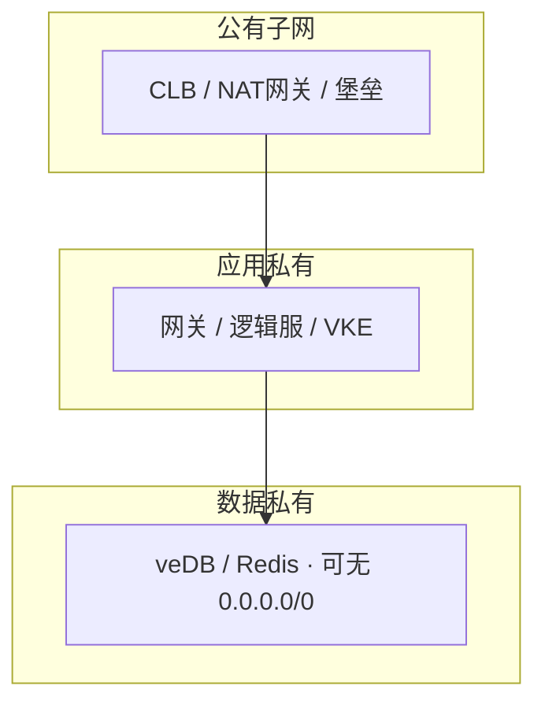
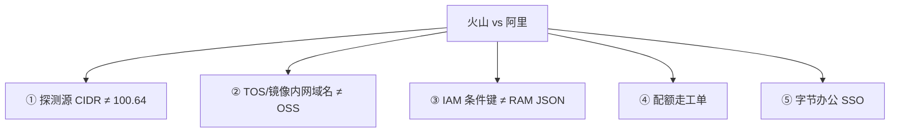

# 火山引擎生产

> Terraform 模块从阿里原样 apply：探测源写死 `100.64.0.0/10`，开服前 CLB 全红、本机 curl 全 200；同一天 TOS 回源抄了 OSS 公网域名，命中率还行，回源账单先炸。群里有人喊「重启逻辑服」「扩 CLB」，另有人说「火山就是阿里换皮」。
> **本章回答**：火山和阿里差在哪几条默认值——探测源、内网域名、IAM、字节系内部链路——每条怎么验、不验会怎样。
> **不讲**：VPC/SG/NAT 通用路径 → [01](../01-云网络与安全/)；阿里 `100.64`、Terway、OSS → [06](../06-阿里云生产/)；AWS 对照 → [07](../07-AWS生产/)；多云翻译表 → [09](../09-多云对照/)；多 AZ/RPO/云 Redis → [03](../03-云上存储与数据库/)；包年/流量 → [05](../05-成本治理/)；泄漏应急/多账号树 → [04](../04-IAM与多账号/)。

**标记**：🎯重点 · 🔥难点 · ⭐常考 · 🔧实操
---

## 一、一张图：从阿里迁到火山的差异地图

> 🎯 **一句话**：产品模型同构、排障 SOP 可迁移；不能迁移的是探测源 CIDR、TOS 内网域名、IAM 条件键和字节办公身份——切云第一件事是逐条换默认值。

火山引擎是字节跳动的云。四个角色别混名：对象存储 **TOS**（内网域名 ≠ OSS）；托管 K8s **VKE**（探测源 ≠ ACK）；日志 **TLS**（和云监控/Prom/内观测要去重）；身份 = 火山IAM + 办公 SSO（不是再造一套云密码）。沐瞳（及同类字节游戏）生产链路和国内阿里区几乎同一张图，换的是控制台、配额工单、内网域名、办公身份——单开一章，正是因为「同构」会诱导你原样 apply。

```mermaid
flowchart LR
    MIG["从阿里迁过来"] --> CHK{"逐条验收差异"}
    CHK -->|计算| VEC["VECS · 禁突发<br/>VKE 吃 IP"]
    CHK -->|网络| NET["CLB/ALB<br/>探测源 ≠ 100.64"]
    CHK -->|存储| TOS["TOS 内网 endpoint<br/>不抄 OSS 域名"]
    CHK -->|权限| IAM["火山IAM + 办公 SSO<br/>不粘 RAM JSON"]
    CHK -->|字节系| BYT["中台链路 · TLS<br/>高防 · GAAP"]
    VEC --> OPS["作战：本机通 CLB 红"]
    NET --> OPS
    TOS --> OPS
    IAM --> OPS
    BYT --> OPS
```

- 📖 **读图**
  - 🛤️ 主线五条差异：计算 → 网络 → 存储 → 权限 → 字节系；任何一条没验，开服当天炸
  - 🔧 `OPS` 是排障入口：先「本机通不通、CLB 红不红」，不是先改业务端口
  - 🎮 计算/网络/存储/权限是产品层；「字节系」是生态绑定——和中台打通、内部链路、办公身份

- 🗺️ **迁移时最容易照抄的五条**（按炸开服概率排）
  - ① 健康检查源 CIDR（Terraform 从阿里粘过来）
  - ② TOS/镜像内网域名（从 OSS 文档抄）
  - ③ IAM 条件键（从 RAM/AWS JSON 粘）
  - ④ 配额工单流（弱于阿里，提前走）
  - ⑤ 字节办公 SSO（不是云账号密码）
  - 🎯 第一件事先换 ①②——这两条不验，开服直接炸

#### ❓ 为什么「同构」还会踩坑？

- ✅ **同构的是模型**：VPC / SG / LB / 对象存储 / 托管 K8s / IAM 都有对应物；SOP（NAT SNAT、SG 分层、公共读禁、源站无 EIP）可搬
- ❌ **不同的是默认值**：探测源、内网域名、条件键、配额工单、办公身份——粘阿里模块 = 把旧楼门禁白名单贴到新楼
- 🎮 选火山通常因为字节系（沐瞳等）或要打通内网/身份——不是「火山更懂游戏」；非字节系按普通云验收即可

> ⚠️ **别混**：同构 ≠ 同配。搬的是拓扑和 SOP，不是 IP 段和 JSON。

> 📝 **面试**：「同构可迁移，探测源 / TOS 内网 / 办公 IAM 三条不能抄。第一周交验收清单，不背 veDB 产品名。没用过火山就说：NAT SNAT、SG 探测源、对象存储公共读按同一套 SOP 验，探测源先查文档和流日志，不搬阿里网段。」⭐（练习题 Q1、Q6）

主图装进脑子了。从计算开始——VECS 与 VKE。

---

## 二、计算：VECS 实例族与 VKE ⭐

> 🎯 **一句话**：VECS 选型逻辑同阿里；突发禁战斗服；VKE 吃 VPC IP，和 Terway 同一类账。

### 🖥️ VECS：命名不同，选型同构 🎯⭐

- **VECS（Volcano Engine Cloud Server）** = 火山弹性计算，对标 ECS / EC2
  - 逻辑服/网关 → 通用 g 或高主频 h；Redis/缓存 → 内存 r；24 核以上盯网卡 PPS（活动期网关常先打满网卡再打满 CPU）
  - ⚠️ 不要假设阿里 `ecs.g6.large` 对应火山同名——按 vCPU / 内存 / 网卡 PPS 对照，不按名字
  - metadata 地址以火山文档为准，脚本别写死阿里 `100.100.100.200`——迁过来的监控/标签脚本写死阿里地址会超时或报错
  - 数据面（veDB/NAT/LB）必须多 AZ；有状态战斗服常故意单 AZ，RTO 按「踢人重建」写预案（通用规则见 [01](../01-云网络与安全/)）
  - 停机/换规格路径和阿里类似但 API/控制台不同；生产维护窗口提前公告

### ⚡ 突发规格与竞价 🔧

> 🔍 **现场**：活动期战斗服 CPU 偶发冲 100% 又回落，CCU 不高、网络不大、磁盘 IO 正常——不是逻辑服卡，是 burst 积分耗尽钉到基线。

```bash
curl http://100.96.0.96/latest/meta-data/instance/instance-type  # ← 火山 metadata
# ecs.g3i.large → 通用型 ✅
# ecs.t3.small  → 突发型 ⚠️ 战斗服不该用
```

- 🔥 **突发型**：CPU 积分攒满能 burst，打完钉到基线 → 监控像「周期性冲高」；最终以控制台「标准型 / 突发性能型」标注为准，别只看名字猜
  - 信号：CCU 不高时也冲高，且和「积分打完」时间重合 → 换通用/高主频，别继续用 t 系
- 竞价实例：只给可中断构建/Job；回收窗口短，战斗进程来不及优雅退出 → 生产战斗用按量或包年
- 镜像/快照
  - 生产开自动快照；快照是**崩溃一致**，不是应用一致——库回滚前先停写、确认时间点、回滚后验完整性
  - 镜像仓库落在对象存储体系上：拉镜像走**内网 endpoint**，别穿 NAT（同 ECR Endpoint / 阿里内网镜像一类坑）；ECS+Nginx 下包能扛测试，扛不住开服

> 📝 **面试**：「VECS 选型同阿里：禁突发、禁竞价给战斗服；24 核以上盯网卡 PPS；metadata 别抄阿里。」⭐（练习题 Q2、Q5）

### ☸️ VKE：托管 K8s 🔥

- **VKE（Volcano Engine Kubernetes Engine）** 对标 ACK / EKS：控制面托管，你管节点池、CNI、插件、升级窗口；ssh 不进 etcd，停变更仍是你的业务（见 [03-01](../../03-Kubernetes/01-集群架构/)）
- 节点池：规格白名单（禁突发给战斗服）、系统盘够镜像+日志、标签/污点、扩容按峰值 Pod+缓冲；缩容配合 drain + PDB
- **VPC-CNI** 和 Terway 同构：Pod IP 进 VPC，veDB SG 可直接放 Pod 网段；代价是节点池 `/24` 耗尽 → `insufficient IP`
  - 按峰值 Pod × **1.5** 预留；止血：加 secondary CIDR / 新子网，**不要先缩节点**，更不要现场改已对等生产网段

```text
kubectl describe pod <pending>
# Warning  FailedScheduling  ... insufficient IP  # ← 子网 IP 耗尽，不是节点不够
```

- 🔑 **LB 注解换 IP**：Service `LoadBalancer` 改注解（规格/健康检查/付费类型）可能重建 CLB → 地址变 → 客户端必须走域名；注解 key 以 VKE 文档为准，别抄 ACK
- 滚动时 CLB 摘流慢于 Pod 退出 → PDB + preStop sleep + `terminationGracePeriodSeconds`；和 ACK 同一类时序
  - 时序：SIGTERM → preStop（常 sleep 等摘流）→ 进程优雅退出 → 超时后 SIGKILL；健康检查有间隔，摘流可能晚于退出
- 权限：Pod 扮 IAM 角色访问 TOS/TLS，禁 AK 进 Secret；节点角色只管拉镜像，业务用单独 SA+角色（模型同 IRSA/RRSA，JSON 按火山文档）
  - 两层拆开 = 两道防线：节点被攻破只能拉镜像；业务角色被攻破只能碰指定 TOS 前缀
- 升级：控制面托管，你管节点池滚动；窗口别和开服日重叠；升级后验节点 Ready、Pod Running、CLB Healthy；插件版本跟 K8s 版本走

#### ❓ 为什么有状态战斗服常不上 VKE？

- 🚪 **优雅下线**：要存状态、踢人，不能被 SIGKILL 掐断
- 🔧 **内核参数**：`somaxconn` / `tcp_tw_reuse` 等，直管 ECS 比节点池灵活
- 📦 **固定容量**：按区服钉死，弹性优势用不上；弹性节点池只给无状态 API / 构建 Job
- ⏱️ **CLB 摘流时序**：有状态服对「摘流慢于退出」更敏感
- ✅ Serverless/弹性：突发 Job 可以；战斗进程要稳定节点和可预期 drain——有状态弹性要么状态进 Redis/DB、要么按区分服，不能直接 HPA 糊上去

> ⚠️ **别混**：VKE vs ACK 差异在生态（文档密度、配额工单、字节内监控/IAM），不在「功能清单」。第一周交付是验收清单（探测源/idle/CIDR/TOS 内网/办公 SSO），不是背 veDB 产品名。

计算讲完。下一刀是切云第一坑：探测源 ≠ `100.64`。

---

## 三、网络：CLB、健康检查源与 VPC-CNI 🔥⭐

> 🎯 **一句话**：火山健康检查源禁止照抄阿里 `100.64.0.0/10`——以控制台/文档/流日志为准；这是切云最高频事故。

- CLB = 四层（TCP/UDP），游戏长连接走 CLB；ALB = 七层，HTTP 登录/支付/GM 走 ALB + WAF
- CLB 三条必验：会话保持、健康检查、idle timeout（心跳 < idle × **1/3**；UDP 会话超时单独测）
- SG 按角色分层（`sg-lb` → `sg-gateway` → `sg-logic` → `sg-mysql`）同 [01](../01-云网络与安全/)；高防回源段放 `sg-lb`，不是 `0.0.0.0/0` 到逻辑服

### 🩺 健康检查源：禁止照抄 100.64 🎯⭐🔥

> 💡 **打个比方**：同户型另一栋楼——巡检 IP 段不同。旧楼白名单粘过来，巡检包被门禁（SG）丢掉，后端就「不健康」。

> 🔍 **现场**：`ss -lnt` 在听，`curl 127.0.0.1:port` 200；CLB 后端全红。

```bash
ss -lnt
curl -s -o /dev/null -w '%{http_code}\n' 127.0.0.1:port  # ← 200，本机通
# CLB 全红 → 对流日志看真实探测源 IP，不要假设 100.64
```

#### ❓ 为什么本机通、CLB 却全红？

- 🛤️ **两条路径**：本机/堡垒 curl 走你放行的 IP；LB 探测走**健康检查源段**——段没写进 SG → 包丢 → Unhealthy，进程其实还在听
- ❌ **别做**：重启进程、改业务端口、开 `0.0.0.0/0`「先通着」（源站裸奔）
- ✅ **先做**：控制台/文档查探测源 → 流日志看真实源 IP → 写进 SG + Terraform 变量 → 等变绿（整段通常 ≤5 分钟）
- 🔧 模块里探测 CIDR **按云厂商参数化**，禁止写死阿里网段——这是切云最高频事故

- 验证六步：① `ss -lnt` ② 本机 curl ③ CLB 后端是否全红 ④ 流日志真实源 IP ⑤ 写进 SG ⑥ 等变绿——跳过流日志直接改端口，常浪费半小时在错误方向
- 检查口要轻（独立端口 / 最简 `200 OK`），失败阈值合理——过严或检查打到会阻塞的业务线程，会把正在打的玩家踢到另一台
  - 三条原则：口要轻、频率适中、连续失败才摘流——和阿里/AWS 通用，不是火山独有

> 📝 **面试**：「火山健康检查源禁止照抄 `100.64.0.0/10`，以控制台/文档/流日志为准。本机通、CLB 全红，先流日志再写 SG，别先改端口、别先重启。」⭐

### 🔀 CLB vs ALB · 源 IP 保持

> ⚠️ **别混**：火山 CLB 对标阿里 CLB/NLB；产品线划分以控制台为准，别假设和阿里一一对应。自定义二进制协议接 ALB 会解析失败。idle 默认值也可能和阿里不同，以控制台为准。火山是否保留 client IP 以产品为准，别假设和 AWS NLB 默认值一样。

- 长连接选型：CLB 四层不解析协议、PPS/延迟合适；心跳 < idle × **1/3**，否则 LB 静默 FIN/RST；UDP 会话超时单独测
- 源 IP 保持开时：业务端口规则（玩家 IP）和健康检查源（LB 网段）是**两套**——SSH 绝不能跟着重开 `0.0.0.0/0`
  - 漏放玩家段 = 玩家进不去；管理端口跟着放开 = 源站裸奔
- 运营商 NAT 后大量玩家同出口 IP → 源 IP 会话保持打到单机 CCU 畸形高 → 接入层做连接级调度，别指望源 IP 哈希
- WebSocket 仅当标准 HTTP 升级时走 ALB，idle 仍要短于心跳；UDP 只有四层

### 🌐 VPC-CNI · EIP/NAT · CEN



- 📖 **读图**
  - 公有放 LB/NAT/堡垒；应用私有放业务；数据私有可无默认出网；3306/6379 只放应用网段
  - 逻辑服/库**永不绑 EIP**——绑了 = 源站泄漏，DDoS 绕过高防直打

- EIP = 实例公网出口；NAT = 子网共享出网。入站只走高防+CLB，出站走 NAT，管理走堡垒——三条路径分开
  - 逻辑服绑 EIP + `0.0.0.0/0` 放业务端口 = DDoS 绕过高防直打（和阿里同一类事故）
  - 私有子网 `curl ifconfig.me` 应是 NAT EIP；不是 → 路由可能走了 IGW（出网黑洞，超时不是拒绝）
  - 一个 NAT IP ≈ **6 万** 源端口，同 `dstIP:dstPort` 最易耗尽（见 [01](../01-云网络与安全/)）；NAT 并发与带宽是两个独立瓶颈
  - EIP 闲置、解绑未释放照扫（[05](../05-成本治理/)）
- **CEN（云企业网）** 对标阿里 CEN / AWS TGW：VPC 间对等、跨账号、专线接驳
  - 对等前 CIDR 不重叠——门牌号从一开始就不能撞
  - 路由字段名/传播优先级别粘阿里 JSON；跨账号两边都要 Allow
  - `traceroute` 对端内网延迟应明显低于公网；带宽包按峰值配，活动期先打满 CEN 再打满 NAT
  - 两 VPC 用 peering 够；三个以上用 CEN 更省两两配置，但有带宽包费用

### 收束：火山网络凭什么和阿里不同



- 📖 **读图**：①② 产品层；③⑤ 身份层；④ 运维层。迁移第一刀换 ①②。

- 📋 **可背清单**
  - 本机通、CLB 红 → 流日志看探测源
  - TOS 账单炸、命中率不差 → 换内网 endpoint
  - Pod Pending IP → 加子网，不缩节点
  - LB 注解改后全服连不上 → 客户端走域名
  - CCU 断崖、CPU 不高 → 入口被洗，不重启战斗

> ⚠️ **别混**：五条差异不保证「火山比阿里差」——同构是模型，不同是默认值与文档密度。共通 SOP 可迁移；不可迁移的是探测源、内网域名、IAM 条件键、办公身份、配额工单。

> 📝 **面试**：五条分三组——**产品层**（探测源+内网域名）、**身份层**（IAM+办公 SSO）、**运维层**（配额工单）。「同构是模型，不同是默认值。」⭐（练习题 Q2、Q3、Q13）

口诀：**阿里 100.64 不能原样粘到火山**。下一节 TOS。

---

## 四、存储：TOS 对象存储与 CDN ⭐

> 🎯 **一句话**：TOS 能力同 OSS/S3，内网 endpoint 域名不同——回源/拉镜像走错就变公网流量。

沐瞳开服/热更真正打到的是 TOS：APK/IPA、录像截图、TLS 归档、库备份。原则同 OSS/S3——Bucket 私有、CDN 回源鉴权、版本号在对象键；差异在内网域名和权限条件键。

```mermaid
flowchart LR
    CLI["客户端 × 开服人数"] --> CDN["CDN 边缘"]
    CDN -->|"内网 endpoint 同地域"| TOS["TOS 私有桶"]
    TOS --> KEY["/res/version/... 版本在 key"]
    TOS -.->|错| BAD1["公共读"]
    TOS -.->|错| BAD2["回源走公网域名"]
    TOS -.->|错| BAD3["覆盖 latest 不刷新"]
```

- 📖 **读图**：正路客户端 → CDN → TOS 内网；三错分支开服当天炸。出问题先查 CDN 命中率 → 源站 403 → TOS 流出。

#### ❓ 为什么命中率不差、回源账单却炸？

- CDN 缓存命中时**两种回源域名表现一样**——命中率图骗不了人
- 未命中时：公网 endpoint = 按公网流出计费；内网 endpoint = VPC 内低价/免费
- 开服十万客户端未命中回源一波，一个域名差几倍账单
- ✅ 换 TOS 内网 endpoint（文档常含 `internal` / 区域内网字样），别从 OSS 抄；同 VPC `curl` 延迟常 **< 5ms**，>20ms 要怀疑走了公网
- 怎么认：CDN 命中率 >90% 但 TOS 回源费异常高 → 未命中那段走了公网；换 endpoint 后回源费应明显下降

- ⭐ **生产五条**
  1. Bucket 私有 + CDN 回源鉴权；Block Public Access 必开——开服前公网 `curl` 桶 URL 应 403；公共读「省事」= 十万客户端直打公网出口
  2. 回源走 TOS **内网 endpoint**（域名按火山文档，含 `internal` 一类字样）
  3. 生命周期按前缀：热更不过期；旧版低频/归档；日志短保留 **7–30 天**——别和 `res/current` 一条规则
  4. 版本号在对象键（`/res/v2.1.0/app.apk`）；覆盖同名必须刷 CDN（有配额和传播延迟，非全球瞬时）
  5. 强更两步：新包可下载 → 再切版本检查服务；别直接覆盖 `latest`——旧缓存还在会导致版本分裂
- 开服前 CDN 预热热更包，避免第一波全回源触发流控；预热后多地 `curl -I` 看 `X-Cache: HIT`
- 大面积更新失败顺序：CDN 命中率（源站被打穿？）→ 源站 403（回源鉴权/权限）→ TOS 流控；误删靠版本控制，删除权限单独授并告警
- VKE 镜像仓库也落在对象存储上——拉镜像走内网，别穿 NAT

> ⚠️ **别混**：TOS ≠「就是 OSS」。功能同构，域名和权限条件键不同；别吹「完全兼容 S3」。Bucket Policy / 条件键别粘 OSS JSON。

存储讲完。想想：TOS 是不是「就是 OSS」？名字像，内网域名不同——回源抄公网会先炸账单。

> 📝 **面试**：「回源账单炸先换内网 endpoint；公共读是账单炸弹；版本在 key 里。」⭐（练习题 Q4、Q14）

---

## 五、权限：火山IAM 与字节办公 SSO ⭐

> 🎯 **一句话**：人走字节办公 SSO → 扮演火山IAM 角色 + MFA；程序走实例/工作负载角色——不在云里每人造密码，不粘 RAM/AWS JSON。

### 🪪 火山IAM vs 阿里 RAM

- **火山IAM** 对标 RAM / AWS IAM：用户、角色、策略、STS；差异在条件键前缀、ARN 格式、Action 命名（外网文档密度低于阿里/AWS，以控制台和内部文档为准）
- 粘过来的 JSON：语法错或**静默不生效**（更危险）→ 策略模拟器跑一遍再 apply

#### ❓ 为什么不给每人造一套云账号密码？

> 💡 **打个比方**：阿里 RAM 像「每栋楼自己发门禁卡」；火山IAM + 办公 SSO 像「工牌一刷进所有楼」——离职交工牌，扮演资格自动没。

- ✅ 人：办公 SSO → AssumeRole + MFA（CI 联邦例外）——办公关账号是 HR 流程，比云里逐个删用户可靠
  - 两道防线：办公账号关了 = 扮演资格没了；AK 泄漏但没有 MFA = 用不了
  - 验：控制台看是否 SSO 进来；操作审计里若有人直接 AK 登录，说明漏配
- ✅ 程序：ECS 实例角色 / VKE 工作负载角色 / CI 短时 STS（**15–30 分钟**）
- ❌ 长期 AK 进 Git/镜像 → 按 [04](../04-IAM与多账号/)：先禁 Key，再查操作审计
- ❌ STS 写进环境变量跑 12 小时 = 形式上角色、实际长期票 → 用 SDK 默认链续期；人扮演给约 1 小时够一轮值班，别给 12 小时

- 最小权限落到前缀：TOS 只 `GetObject` 指定热更前缀（如 `res/prod/*`）；GM 与逻辑服角色拆开；节点角色不能 TOS Full Access（逃逸搬桶）
  - 粘完策略后模拟器跑一遍：「能不能读这个前缀」「能不能删这个桶」——别跳过模拟直接 apply
- 多账号：生产/预发/测试分账号；预发 Trust 不能扮演生产；审计进独立账号，生产角色对审计桶 WriteOnly——生产被攻破也删不掉审计
- 告警：根登录、新建 AK、策略变 `*`、桶公共、SG `0.0.0.0/0:22`——云监控 + 企业 IM + 邮件三渠道，别只靠一个

> 📝 **面试**：「人走办公 SSO + MFA，程序走实例/工作负载角色；不粘 RAM JSON。」⭐（练习题 Q7、Q8）

---

## 六、字节系特有：内部链路、TLS 与出海

> 🎯 **一句话**：选火山常因字节系或要打通中台——不是「更懂游戏」，是生态绑定；非字节系按普通云验收即可。

### 🔗 和中台 / 内部链路

- 内部中间件、身份、监控、数仓可走内部链路直连，不穿公网——这是字节系客户独有价值；非字节系公司用不到也不需要
- 坑：内部 ACL/路由与 VPC **不在同一控制面**——两边变更要同步；你在 VPC 改了路由，内部 ACL 不会自动跟
- DNS：内部服务用内部 DNS，云上服务用云上 DNS——混用会解析到公网 endpoint，回源穿公网
- 验：两端 `traceroute`，延迟若像公网，链路没通或回程穿公网；变更后两端都验，只验一端不够
- 文档和配额工单流弱于阿里——第一周交付仍是验收清单，不是背 PaaS 名称

> ⚠️ **别混**：内部链路是字节系专属，不是「火山自带」；也不是 VPC peering 换皮。

### 📜 TLS vs 云监控 vs Prometheus

- **TLS（Tinder Log Service）** 对标 SLS：Agent/DaemonSet → 查询/告警 → 投递 TOS；免自建 ES，和 VKE 集成快
  - VKE 上 DaemonSet 采 `/var/log/containers/`；Agent 掉了日志会断——盯 `Running` 和摄入量，别等业务报障
  - 账单坑同 SLS：全字段索引 + 高基数玩家 ID + Debug 全量；开服后降到 Warning 以上省索引费
  - 归档前缀别和 `res/current` 一条生命周期——日志短保留会误删热更包
- 分工三角
  - 云监控：VECS CPU/网卡、CLB 健康数/新建连接、NAT 并发/带宽、TOS 流量
  - Prometheus：业务 CCU、战斗延迟——云监控看不见这些
  - 字节内观测可能并存 → **告警去重**：四渠道炸群先看哪个真掉（如 Prom `up=0`），别各重启一轮

```bash
# TLS 日志突然没了
# ← 先看摄入是否掉零 → Agent/权限，不要先改业务
```

- veDB 仍看硬顶和多 AZ（[03](../03-云上存储与数据库/)）：禁公网、开服夜 Redis **< 70%**、参数组开服夜别顺手改；热 key/大 key 同款事故跨云都成立；备份成功要告警、删除保护打开

### 🛡️ 火山高防与 WAF

- **高防**：L3/L4 清洗 + 藏源站；游戏 TCP/UDP 走高防；源站 SG **只放回源段**
- **WAF**：只管 HTTP（登录/支付/GM）；自定义战斗协议接 WAF = 错误架构——WAF 解析不了自定义 TCP/UDP
- CCU 断崖、逻辑服 CPU 不高 → 入口被洗/黑洞；**别先重启战斗**（只会踢在线玩家、放大事故面）
- 超清洗阈值会黑洞（整段 EIP 流量全丢）；RTO 以换 IP / 切高防为准——黑洞未结束时切 CNAME 也没用
- 生产倾向流量一直走高防；被打再切 DNS 有 TTL 窗口（约 **5 分钟**）——先缩短 TTL 再切；CNAME/回源网段/黑洞阈值按新产品验收，不能「和阿里一样勾一下」
- 验回源段：非回源段外部 IP 打源站应拒绝；高防 CNAME 应通；定期扫 SG 残留 `0.0.0.0/0`

#### ❓ GAAP 是不是玩家走专线？

- **GAAP（全球应用加速）**：就近接入、内部回源降延迟——玩家仍在公网连接入点
- ≠ 专线（IDC↔云数据面）；≠ CDN（CDN 加速静态包体，GAAP 加速长连接）
- 三者可并存：CDN 下包 + GAAP 加速战斗 + 专线打通 IDC 数据面
- 出海分市场
  - 静态 CDN 海外节点；长连接 GAAP；数据面按 Region 部署
  - **一个 Redis 打全球**、身份/支付复制海外「方便」都踩合规（GDPR/PIPL）
  - 欧美主场仍常是 AWS Global；火山出海 ≠ Global AWS；中国区 AWS ≠ 阿里
- 成本：包年基线、按量峰值、竞价只给可中断（[05](../05-成本治理/)）；盯 CDN 回源、NAT、公共读、闲置 EIP

> 📝 **面试**：「游戏走高防、HTTP 走 WAF；GAAP 是加速不是专线；出海分市场。」⭐（练习题 Q9、Q10、Q11）

现在再看群里「Terraform 原样 apply」，你知道该怎么拦住他了。

---

## 七、作战：定责

> 🎯 **一句话**：开服夜四条——突发卡顿、CLB 全红本机通、TOS 公共读/公网回源账单炸、从阿里复制的 SG 模块没改探测源。

前三条和阿里章同构；第四条是火山特有——「同构」诱导你把阿里模块原样 apply。

```mermaid
flowchart TB
    A["进不去/更新失败/账单炸"] --> B{"本机通吗"}
    B -->|"本机 200 · CLB 红"| C["流日志探测源 ≠ 100.64"]
    C --> D["改 SG / Terraform 变量"]
    B -->|"命中率不差 · 回源贵"| E["TOS 换内网 endpoint"]
    B -->|"流出像被扫"| F["立刻私有化"]
    B -->|"Pod Pending IP"| G["加子网 · 不缩节点"]
    B -->|"LB IP 变了"| H["客户端走域名"]
    B -->|"CCU 断崖 CPU 不高"| I["高防黑洞 · 不重启战斗"]
```

- 📖 **读图**
  - 第一刀永远「本机通不通」——通 → 探测源/SG/入口层；不通 → 进程/端口
  - 每条分支一个具体动作，不是抽象「查网络」；60 秒内分清云层病还是应用层病
- 分类口诀
  - 本机通 + CLB 红 → 探测源（改 SG）
  - 本机通 + CLB 绿但进不去 → 高防/入口（查黑洞）
  - 本机不通 → 进程/端口
  - 命中率不差 + 账单炸 → 公网回源（换内网 endpoint）
  - CCU 断崖 + CPU 不高 → 入口被洗（查高防，不重启）

| 现象 | 先做 | 别做 |
|------|------|------|
| CLB 全红、curl 本机通 | 流日志看探测源 | 改业务端口/重启逻辑服 |
| TOS 回源账单炸、命中率还行 | 换内网 endpoint | 从 OSS 文档抄域名 |
| Pod Pending insufficient IP | 加网段 | 改已对等生产 CIDR |
| 改 LB 注解后全服连不上 | 域名；IP 会变 | 客户端写死 IP |
| CCU 断崖、CPU 不高 | 入口被洗/黑洞 | 先重启战斗进程 |
| TLS 没日志 | 摄入掉零→Agent/权限 | 先改业务 |
| 四渠道同时炸群 | 告警去重 | 每个渠道各重启一轮 |

### ⏱️ 60 秒剧本 🔧

> 🔍 **现场**：接到「进不去/更新失败」，60 秒走完再下结论。

```text
① 0-10s  本机通吗？  ss -lnt + curl 127.0.0.1:port → 通 → 不改业务端口
② 10-30s CLB 红吗？  控制台后端健康 → 红 → 流日志看探测源真实 IP
③ 30-45s 热更/账单？ CDN 命中率 + TOS 流出 → 查内网 endpoint
④ 45-60s 定责+验证  改 SG / 换 endpoint → 等变绿 → 回滚入口/DNS
```

- 开服 5 分钟生命体征（任一项异常立刻处理，别「再看一会儿」）
  - CLB 新建连接：不涨 → 入口堵（高防黑洞 / DNS 没切）
  - Unhealthy 数：>0 → 探测源或后端
  - NAT 并发：贴上限 → SNAT 端口将尽
  - veDB 连接：开服夜 Redis **< 70%**
  - CDN 回源 4xx：鉴权/权限
  - TOS 流出：像被扫 → 立刻换内网 endpoint / 私有化
- 前 30 分钟再盯：CPU 是否开始冲高（突发 burst 打完）、CLB 新建是否持续涨、TOS 流出是否回落后稳定、TLS 摄入是否正常
- 比阿里**多出来的一条**：探测源有没有抄 `100.64`；TOS/镜像是不是内网域名
- 回滚入口/DNS，不要先重启逻辑服——两个故事同一个根因：从阿里复制的默认值没换成火山的
- 分类错了会浪费开服夜：典型错误是 CLB 全红就重启逻辑服——十分钟后发现探测源没放行，白白踢掉在线玩家

定责剧本齐了。收口把命令、面试口径和数字墙收齐。

本节对应练习题 Q12。

---

## 八、收口

### 命令速查 🔧

```bash
# 本机通 ≠ 探测通
ss -lnt
curl -s -o /dev/null -w '%{http_code}\n' 127.0.0.1:port
# CLB 全红 → 流日志看探测源，不假设 100.64

# 实例是否突发型
curl http://100.96.0.96/latest/meta-data/instance/instance-type

# VKE：IP 余量、LB 必须是域名
kubectl get nodes -o wide
kubectl get svc -A | grep LoadBalancer
kubectl describe pod <pending>   # Events: insufficient IP

# NAT 出口
curl -s ifconfig.me              # ← 是否 NAT EIP

# CEN
traceroute <对端 VPC 内网 IP>    # ← 延迟 <5ms 多半走 CEN

# TOS 内网 endpoint
curl -o /dev/null -s -w '%{time_total}\n' http://tos-internal-endpoint/bucket/key
# <5ms ≈ 内网；>20ms 怀疑公网 endpoint
```

### 面试锚点

遮住右列自问自答；卡壳的行回去重读对应小节。

| 问 | 30 秒答 |
|----|---------|
| 火山和阿里差在哪？ | 同构可迁移；探测源/内网域名/IAM 三条不能抄 |
| 健康检查源用什么？ | 控制台/文档/流日志为准，禁止照抄 100.64 |
| VECS 是什么？ | 火山 ECS；选型同阿里；禁突发给战斗服 |
| VKE 和 ACK？ | 功能同构；文档少、配额走工单、字节生态绑得紧 |
| TOS 和 OSS？ | 功能同构；内网 endpoint 不同，不抄 OSS |
| CLB vs ALB？ | CLB 四层；ALB 七层；自定义协议走 CLB |
| IAM 怎么走？ | 人办公 SSO+MFA；程序实例/工作负载角色；不粘 RAM JSON |
| 和中台/内部链路？ | 字节系专属，非字节系用不到 |
| 高防 vs WAF？ | 游戏走高防 L3/L4；HTTP 走 WAF |
| GAAP 是什么？ | 全球应用加速，就近接入，不是玩家走专线 |
| 开服 5 分钟多哪条？ | 探测源有没有抄 100.64；TOS/镜像是不是内网域名 |
| NAT网关放哪？ | 公有子网，每 AZ 一个；逻辑服无 EIP |
| 火山快照怎么管？ | 生产开自动快照；回滚前确认一致性 |

### 易错一句话对照

- 火山可以 1:1 粘阿里模块 → 探测源/内网域名/IAM 不能抄
- 健康检查源用 100.64 → 以控制台/流日志为准
- 本机 curl 通 = CLB 通 → 探测源可能被 SG 丢
- TOS 回源抄 OSS 公网域名 → 用 TOS 内网 endpoint
- 长连接用 ALB 因为支持 WebSocket → 自定义 TCP/UDP 走 CLB
- 战斗服上 VKE Serverless 更弹性 → 要稳定节点和可预期 drain
- VKE LB 可以写死 IP → 改注解可能换 IP
- 游戏端口接 WAF → WAF 解析 HTTP；游戏走高防
- 被打再切 DNS 就行 → TTL 窗口；生产倾向一直走高防
- GAAP 是玩家走专线 → 就近接入，玩家仍在公网
- 一个 Redis 打全球 → 数据驻留分 Region
- 粘 AWS/RAM JSON 到火山 → 条件键和文档不同
- 第一周交付背 veDB 产品名 → 交探测源/idle/CIDR/IAM 清单
- 和中台是火山自带 → 字节系专属
- 没用过火山就编全家桶 → 按同一套 SOP 验收探测源
- 托管了就不用懂 etcd 影响面 → ssh 不进，停变更仍是你的业务
- CEN 和阿里一样配 → 字段名不同，以火山文档为准
- TOS 就是 S3 → 功能同构，API/条件键不完全兼容

### 数字墙

> 峰值 Pod × **1.5** 预留 IP · 开服夜 Redis **< 70%** · 心跳 < idle × **1/3** · 第一周五件：探测源/idle/CIDR/TOS 内网/办公 SSO · 开服夜四条故障：突发卡顿/CLB 全红/TOS 账单炸/复制模块没改探测源 · 60 秒四步：本机通→CLB 红→热更/账单→定责 · 一个 NAT IP ≈ **6 万** 源端口 · TTL 窗口 ≈ **5 分钟** · STS **15–30 分钟** · TLS 短保留 **7–30 天** · TOS 内网延迟 **< 5ms** · 五条差异三组：产品层/身份层/运维层

---

## 合上书

- [ ] 能说出差异地图：同构在哪、不能抄的五条、沐瞳现场主打哪几块？
- [ ] 能说出计算：VECS 选型、突发为何禁、VKE 吃 IP 怎么治、战斗服为何常不上 VKE。
- [ ] 能**默画**健康检查源事故：本机通、CLB 全红，先查什么？模块里探测 CIDR 怎么写？为何不能抄 `100.64`？
- [ ] 能说出 CLB vs ALB：长连接为何走 CLB、源 IP 保持时 SG 怎么写两套。
- [ ] 能说出 TOS：热更五条、命中率不差账单炸错在哪、镜像走内网。
- [ ] 能说出 IAM：人怎么从办公身份进来？STS 写环境变量跑 12 小时算不算角色？泄漏顺序还是不是 04 那套？
- [ ] 能说出字节系：内部链路是什么、TLS/云监控/Prom 分工、高防/WAF/GAAP 各管什么。
- [ ] 能说出出海：GAAP ≠ 专线、数据驻留分 Region、国内身份数据能不能复制海外。
- [ ] 能说出定责：开服夜四条各先做/别做、60 秒剧本、比阿里多出来的那一条。

全部打勾后：十分钟给同事讲清开头那个现场——错在哪、正确第一刀是什么。讲得下来，这章过关。
