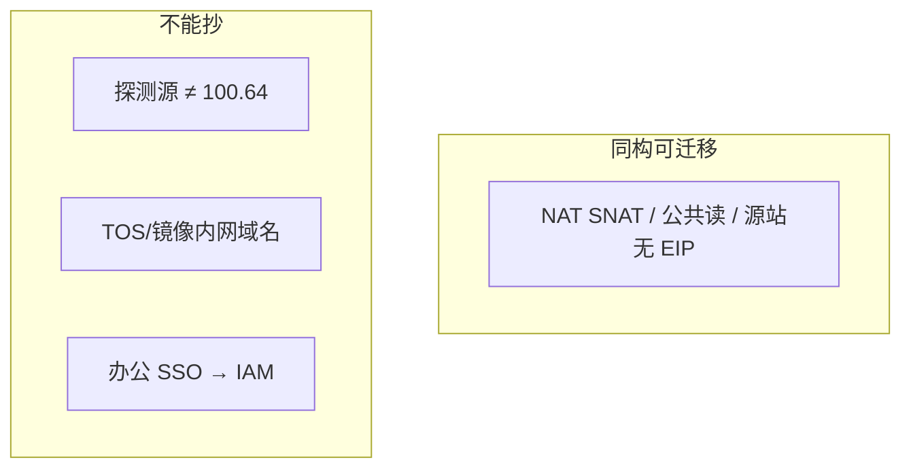
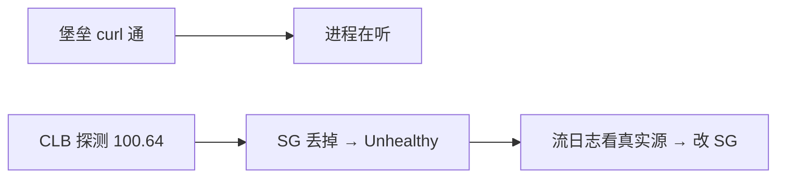
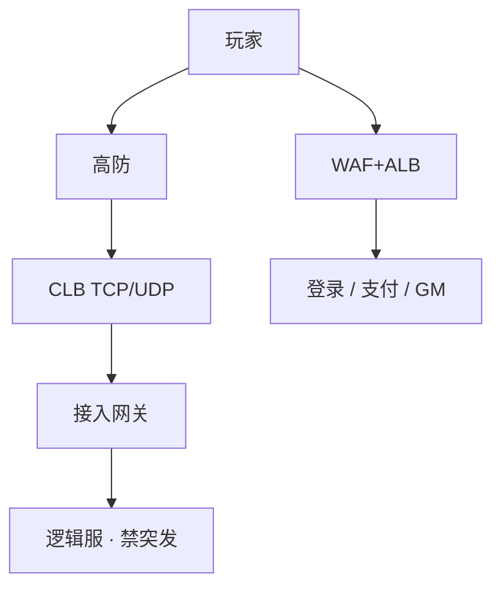
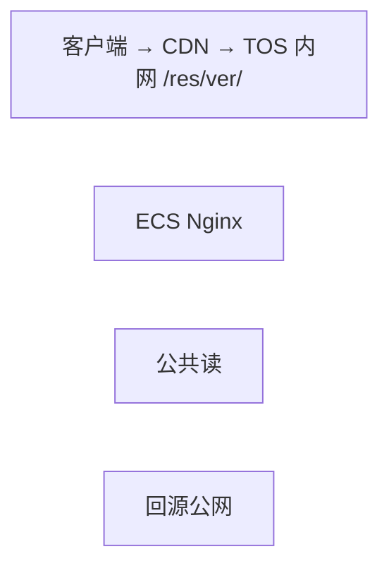
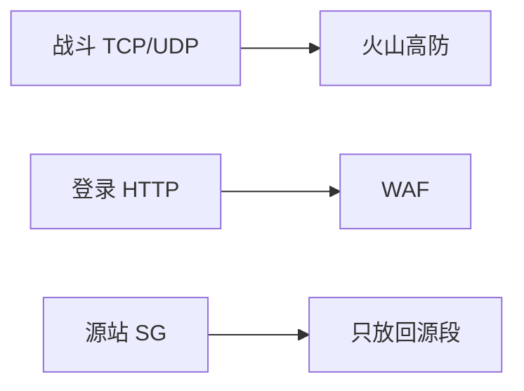
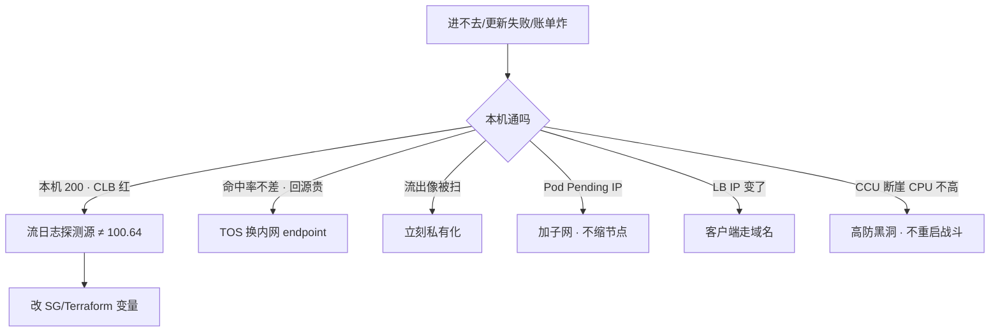

# 08｜火山引擎生产 · 练习题

先合上知识点，对着 **一、一张图：从阿里迁到火山的差异地图** 把五条差异口述一遍（计算→网络→存储→权限→字节系），再来做题。

| 标记 | 含义 |
|------|------|
| **核心** | 不懂整章就没建立起来 |
| **必会** | 值班和面试都要能讲 |
| **常用** | 线上会反复碰到 |
| **常考** | 白板和追问的高频口径 |

## 本题目录

- [Q1 火山和阿里差在哪](#q1)
- [Q2 CLB 全红本机通](#q2)
- [Q3 游戏入口与 CLB](#q3)
- [Q4 TOS 热更](#q4)
- [Q5 VKE IP 与 Serverless](#q5)
- [Q6 VECS 实例族与突发规格](#q6)
- [Q7 办公 IAM](#q7)
- [Q8 TLS 与云监控](#q8)
- [Q9 高防 / WAF / GAAP](#q9)
- [Q10 和中台与内部链路](#q10)
- [Q11 出海与开服 5 分钟](#q11)
- [Q12 排障定责](#q12)
- [Q13 探测源不能抄 100.64](#q13)
- [Q14 TOS 内网 endpoint 验收](#q14)
- [合上书](#合上书)

---

## Q1

**★★★★★｜火山和阿里差在哪？沐瞳游戏运维实际会碰到什么？**

**覆盖**：核心 · 必会 · 常考 ｜ **对应**：知识点 [一、一张图：从阿里迁到火山的差异地图](知识点.md)

### 场景

字节系岗位问"你们火山怎么跑"。有人开始背 veDB 全家桶。另一人把阿里模块原样 apply，健康检查全红。

### 完整解答

> 🎯 **一句话**：火山与阿里同构可迁移，但探测源/TOS 内网域名/办公 IAM 三条不能抄。

产品模型和阿里同构：VPC、安全组、CLB、TOS、VKE、TLS、IAM。排障思路可迁移。差在健康检查源、内网域名、IAM 与办公身份、文档/配额工单。沐瞳现场主打 TOS 热更/包体、CLB 长连接、VPC/SG、VKE 节点池、TLS、高防回源，不是 PaaS 名称。



必须单独验收：探测源 CIDR、TOS/镜像内网 endpoint、IAM 与办公身份、配额工单流。没用过不要编全家桶——说法："探测源我先查文档和流日志，不搬阿里网段。"选火山通常因为字节系或要打通内部链路，不是"更懂游戏"。

> ⚠️ **别混**：同构的是产品模型，不是默认值。探测源、内网域名、IAM 条件键、配额工单流全部不同。

> 📝 **面试**："火山和阿里同构可迁移，但探测源/TOS 内网域名/办公 IAM 三条不能抄。沐瞳现场主打 TOS 热更、CLB 长连接、VKE 节点池，不是 PaaS 名称。"

### 再追问

为什么不单开腾讯云一章？——模型接近阿里，对照走 09。火山因为字节系（含沐瞳）必读才单开。

---

## Q2

**★★★★★｜从阿里复制过来的安全组，CLB 全红、本机 curl 通，先查什么？**

**覆盖**：核心 · 必会 · 常用 ｜ **对应**：知识点 [三、网络：CLB、健康检查源与 VPC-CNI](知识点.md)

### 场景

Terraform 模块从 ACK 环境拷来，探测规则写着 `100.64.0.0/10`。实例运行中，监听全红。办公网能通。有人要改业务端口、重启 ECS。

### 完整解答

> 🎯 **一句话**：CLB 全红、本机通是探测源抄了 100.64，按火山文档/流日志改 SG。

健康检查源不是阿里那条链路本地网段。本机 curl 只证明进程在听。按火山文档/控制台「负载均衡探测」放行真实源，对流日志看源 IP，再写进模块。不要先改业务端口、不要先重启逻辑服。



治理：模块里探测 CIDR 按云厂商参数化，禁止写死阿里网段。这是切云最高频事故。有状态服检查过严会把正在打的玩家踢到另一台，检查口要轻。

> ⚠️ **别混**：本机 curl 通 ≠ CLB 通。探测源被 SG 丢掉，进程在听但后端 Unhealthy。

> 📝 **面试**："火山健康检查源禁止照抄阿里 100.64，以控制台/文档为准。本机通、CLB 全红，先对流日志看探测源真实 IP，再写进 SG 和 Terraform 变量。"

### 再追问

NLB/CLB 开了源 IP 保持，SG 怎么写？——业务端口规则和健康检查源是两套。SSH 绝不能跟着重开。不要假设和 AWS NLB 默认值一样。

---

## Q3

**★★★★★｜画一下游戏服在火山上的入口。长连接为什么不用 ALB？**

**覆盖**：核心 · 必会 · 常考 ｜ **对应**：知识点 [三、网络：CLB、健康检查源与 VPC-CNI](知识点.md)

### 场景

Ingress 默认 ALB 套到战斗端口。自定义二进制协议。有人说 ALB 支持 WebSocket 所以也能接战斗。

### 完整解答

> 🎯 **一句话**：游戏长连接走 CLB 四层 + 高防，ALB 不解析自定义 TCP/UDP。

长连接选 CLB 四层，不解析协议、PPS/延迟合适。ALB 是 HTTP；自定义 TCP/UDP 接上去会解析失败或按 HTTP 健康检查。WebSocket 仅当标准 HTTP 升级时走 ALB，idle 仍要短于心跳。UDP 只有四层。



逻辑服 VECS 高主频/通用，或 VKE 上的无状态 API。跨 AZ：数据面必须；战斗计算面常单 AZ。心跳 < CLB idle。源站无 EIP 裸奔。有状态服不能直接 HPA。弹性节点池给无状态/构建，不给战斗进程。

> ⚠️ **别混**：CLB 四层 vs ALB 七层——阿里把 L4 拆成 CLB（旧）和 NLB（新），火山产品线以控制台为准，不要假设一一对应。

### 再追问

VKE LoadBalancer 改注解 IP 变了会怎样？——客户端写死 IP 会全服连不上。必须用域名。和 ACK 同一坑。

---

## Q4

**★★★★☆｜TOS 热更怎么配才不会开服当天炸？和 OSS 差在哪？**

**覆盖**：必会 · 常用 · 常考 ｜ **对应**：知识点 [四、存储：TOS 对象存储与 CDN](知识点.md)

### 场景

测试用 ECS 下包。开服十万客户端。桶公共读"省事"。回源抄了 OSS 公网域名。覆盖 latest 不刷新。CDN 命中率还行，回源账单先炸。

### 完整解答

> 🎯 **一句话**：TOS 私有 + CDN 内网回源，版本在 key；公共读和公网回源都是账单炸弹。

TOS 拥源、CDN 拥边缘。Bucket 私有，回源走 TOS **内网 endpoint**（域名不要从 OSS 抄）。版本在对象键里，少覆盖同名。刷新有配额和延迟，强更分两步：新包可下载，再切版本检查。



观测：CDN 命中率、源站 403、TOS 流控、流出是否像被扫。生命周期按前缀，不要把 `res/current` 和日志归档一条规则。VKE 拉镜像同样走内网。能力同构；差异在内网域名、权限模型、和 VKE/TLS 集成。不要假设 S3 API 完全兼容。公共读在两家都是账单炸弹。Block Public Access 必开。

> ⚠️ **别混**：TOS 和 OSS 差异不在功能，在内网 endpoint 域名和权限模型。API 兼容度不必吹成"TOS 就是 S3"。

### 再追问

命中率不差但回源费炸，先换什么？——TOS 内网 endpoint，不要从 OSS 文档抄。

---

## Q5

**★★★★☆｜VKE 用 VPC-CNI，节点池 /24 会怎样？战斗服上 Serverless 行不行？**

**覆盖**：必会 · 常用 · 常考 ｜ **对应**：知识点 [二、计算：VECS 实例族与 VKE](知识点.md)

### 场景

加节点后 Pod Pending。veDB 安全组只放了节点网段。有人用 Serverless 跑战斗服"更弹性"。控制面升级排在开服日。

### 完整解答

> 🎯 **一句话**：VKE VPC-CNI 吃 IP，/24 会耗尽；战斗服禁 Serverless，要稳定节点和 drain。

VPC-CNI 让 Pod IP 进 VPC，连库安全组好写，但吃大量 VPC IP，`/24` 会耗尽。止血：加网段/新子网，不要现场改已对等的生产 CIDR。规划按峰值 Pod × 1.5，和 Terway/AWS VPC CNI 同一套账。

```text
kubectl describe pod <pending>
#   Warning  FailedScheduling  ... insufficient IP    # ← 加子网，不缩节点
```

战斗服：稳定节点、内核参数、可预期 drain，不要 ECI/Fargate/Serverless 图弹性。节点池禁突发规格。升级不要和开服日重叠。PDB、优雅下线、CLB 摘流时序和 ACK 同类。Pod 扮 IAM 角色访问 TOS/TLS，节点角色要瘦。

VKE 和 ACK：都是托管 K8s。VKE 文档少、和火山/字节内生态绑得紧。深度放在验收清单，不放在成熟度口号。

> ⚠️ **别混**：VKE 和 ACK 差异不在功能，在生态——文档密度低、配额走工单、字节生态绑得紧。

### 再追问

ssh 不进 etcd，这章能跳过影响面吗？——不能。停变更的仍是你的业务。见 03-01。

---

## Q6

**★★★☆☆｜VECS 实例族怎么选？突发规格能不能给战斗服？**

**覆盖**：必会 · 常用 ｜ **对应**：知识点 [二、计算：VECS 实例族与 VKE](知识点.md)

### 场景

新环境选规格，有人按阿里实例族名直接下单。活动期战斗服 CPU 偶发卡到 100%，CCU 不高、网络不大。

### 完整解答

> 🎯 **一句话**：VECS 选型逻辑和阿里一样，战斗服禁突发规格——burst 打完就限到基线。

**VECS（Volcano Engine Cloud Server）** 是火山的弹性计算实例，对标阿里 ECS、AWS EC2。选型逻辑一样：逻辑服/网关选通用型 g 或高主频型 h，Redis/缓存选内存型 r，24 核以上盯网卡 PPS。差异在命名和产品页，按 vCPU/内存/网络性能对照，不要假设阿里 `ecs.g6.large` 对应火山同名规格。

突发规格有 CPU 积分机制：攒满短时能 burst，打完限到基线。测试可以，战斗服和生产入口不用。竞价实例同理：只给可中断的构建/Job。

```bash
curl http://100.96.0.96/latest/meta-data/instance/instance-type  # ← 火山 metadata
# 输出例：ecs.g3i.large → 通用型 ✅
# 输出例：ecs.t3.small  → 突发型 ⚠️ 战斗服不该用
```

> 📝 **面试**："VECS 是火山的 ECS，选型逻辑一样，禁突发给战斗服。没用过按同一套 SOP 验收，不背产品名。"

### 再追问

镜像和快照呢？——镜像仓库落在对象存储上，拉镜像走内网不要穿 NAT。快照生产开自动策略，回滚前确认一致性。API 以火山文档为准。

---

## Q7

**★★★★☆｜IAM 上人和程序怎么走？办公账号离职够不够？**

**覆盖**：必会 · 常用 · 常考 ｜ **对应**：知识点 [五、权限：火山IAM 与字节办公 SSO](知识点.md)

### 场景

云里每人一把 AK。CI 也是长期密钥。节点角色 TOS Full Access。有人把 AWS IAM JSON 贴进火山。STS 写进环境变量跑 12 小时。

### 完整解答

> 🎯 **一句话**：人走办公 SSO + MFA，程序走实例/工作负载角色；长期 AK 按泄漏处理。

人走字节办公 SSO → 扮演火山 IAM 角色 + MFA。离职关办公账号即失去扮演资格，比在云里删用户可靠。程序走实例角色/VKE 工作负载角色/CI 短时 STS。长期 AK 按 04：先禁 Key，再查操作审计。不要粘 AWS/RAM JSON。TOS 角色落到前缀；GM/发奖与逻辑服拆开。审计打开，生产角色对审计桶 WriteOnly。STS 环境变量 12h = 形式上用了角色，实际变长期票；用 SDK 默认链续期。

> ⚠️ **别混**：火山 IAM 条件键和 RAM/AWS IAM 不同，不要粘 JSON。外网文档密度低，以控制台和内部文档为准。

> 📝 **面试**："人走办公 SSO + MFA，程序走实例/工作负载角色；长期 AK 按泄漏处理。不要粘 RAM/AWS JSON。"

### 再追问

条件键以谁为准？——火山文档和控制台。外网文档密度低于阿里/AWS。

---

## Q8

**★★★★☆｜火山上日志怎么收？账单为什么会爆？四个渠道同时炸群怎么办？**

**覆盖**：必会 · 常用 ｜ **对应**：知识点 [六、字节系特有：内部链路、TLS 与出海](知识点.md)

### 场景

TLS Agent 掉了。开服夜摄入和索引费用跳起来，玩家 ID 当列。云监控、TLS、Prometheus、字节内观测四个渠道同时炸群。

### 完整解答

> 🎯 **一句话**：TLS 管日志、Prom 管黄金指标；账单爆是全字段索引 + 高基数 + Debug 全量。

TLS：Agent/DaemonSet 采集 → 查询/告警 → 投递 TOS 或 Kafka。默认用托管，免 ES 集群。账单爆：全字段索引 + 高基数玩家 ID + Debug 全量。黄金指标用 Prom，TLS 管日志。观测：摄入是否掉零，再查 Agent/权限。告警去重——四个渠道同时炸群时，先看哪个是真掉了，不要每个渠道各重启一轮。自建 ELK 可以，大规模默认 TLS。

veDB 仍看硬顶和多 AZ（03）：禁止公网、配置端点、开服夜 Redis < 70%、参数组开服夜不要顺手改。

> ⚠️ **别混**：云监控看云资源指标，业务 CCU 常自建 Prom。字节内部观测平台可能并存——告警要去重。

### 再追问

不用 TLS 行不行？——行，自己管 ES 的 Heap/分片/磁盘。小规模可以。

---

## Q9

**★★★★☆｜高防怎么接？游戏端口接 WAF 行不行？平时要不要一直走高防？GAAP 是什么？**

**覆盖**：必会 · 常用 · 常考 ｜ **对应**：知识点 [六、字节系特有：内部链路、TLS 与出海](知识点.md)

### 场景

安全要把战斗端口接到 WAF。源站 SG 还是 `0.0.0.0/0`。被打时再切 DNS，TTL 5 分钟。CCU 断崖，逻辑服 CPU 不高。有人说 GAAP 等于玩家走专线。

### 完整解答

> 🎯 **一句话**：战斗 TCP/UDP 走高防，WAF 只解析 HTTP；源站 SG 只放回源段；GAAP 是加速不是专线。

不行。WAF 解析 HTTP。游戏 TCP/UDP 走高防。源站 SG 只放回源。超阈值黑洞。CCU 断崖、CPU 不高 → 入口被洗，不要先重启战斗进程。



游戏服不能中断，生产倾向流量一直走高防，或高防 + CDN。被攻击再切 DNS 有 TTL 窗口，要提前演练。和阿里游戏盾：都是 L3/L4 清洗 + 藏源站，CNAME/回源网段/黑洞阈值按新产品验收，不能"和阿里一样勾一下"。GAAP 给出海长连接加速，玩家仍在公网，不是专线，也不是跨云会话双活。

> ⚠️ **别混**：GAAP 是就近接入 + 内部回源，不是玩家走专线。高防 vs WAF：L3/L4 vs HTTP。

> 📝 **面试**："游戏走高防、HTTP 走 WAF。GAAP 是加速不是专线。被攻击再切 DNS 有 TTL 窗口，生产倾向一直走高防。"

### 再追问

逻辑服绑 EIP + `0.0.0.0/0` 会怎样？——DDoS 绕过高防直打，和阿里同一类事故。

---

## Q10

**★★★☆☆｜和中台/内部链路是什么？非字节系公司需要吗？**

**覆盖**：必会 · 常考 ｜ **对应**：知识点 [六、字节系特有：内部链路、TLS 与出海](知识点.md)

### 场景

面试官问"你们上火山是因为和中台打通吗"。有人开始讲火山全家桶。有人把内部链路当云上 VPC 对等来配。

### 完整解答

> 🎯 **一句话**：和中台/内部链路是字节系专属——字节内部中间件/身份/监控/数据通道走内部链路直连，非字节系用不到。

字节系公司上火山，核心收益是和中台打通：字节内部中间件、身份系统、监控平台、数据通道可以通过内部链路直连，不走公网。这条内部链路是火山对字节系客户的独有价值。坑：内部链路的 ACL/路由和云上 VPC 不在一个控制面，变更时要两边同步；内部 DNS 和云上 DNS 分属不同解析链，回源走错就穿公网。

> ⚠️ **别混**：和中台/内部链路是字节系专属，不是"火山自带"。非字节系公司上火山，这条优势不存在——按普通云验收即可。也不要把内部链路当 VPC 对等来配——不在一个控制面。

### 再追问

选火山不因为字节系还能因为什么？——要和字节内网/身份打通，或部分区域成本/国内节点优势。不是"更懂游戏"这种空话。

---

## Q11

**★★★★☆｜出海用火山还是 AWS？开服当天 5 分钟比阿里多哪一条？**

**覆盖**：必会 · 常用 · 常考 ｜ **对应**：知识点 [六、字节系特有：内部链路、TLS 与出海](知识点.md)

### 场景

国内已在火山。出海东南亚/欧美。有人画一张全球 VPC。身份数据准备复制到海外"做灾备"。活动开始，模块从阿里拷来。

### 完整解答

> 🎯 **一句话**：分市场隔离；开服 5 分钟比阿里多验探测源和 TOS/镜像内网域名。

分市场：国内火山/阿里，海外按延迟和合规选 region。东南亚/港台火山有节点；欧美 AWS 更完整。静态走 CDN 海外节点。数据驻留分 Region，不要一个 Redis 打全球。国内身份/支付数据不要复制到海外。灰度按区服。不要把火山出海当 Global AWS。

开服 5 分钟和阿里同构：规格、入口、心跳、热更、VKE IP/域名、数据、日志去重、无长期 AK。**多出来的一条**：探测源有没有抄 100.64；TOS/镜像是不是内网域名。

看：CLB 新建连接/Unhealthy；高防是否黑洞；NAT 并发、veDB 连接、Redis 带宽；CDN 回源 4xx、TOS 流出；TLS 摄入掉零没有。从阿里复制模块没改探测源，是火山开服夜第四条经典故障。回滚入口/DNS，不要先重启逻辑服。

第一周交付：对照表 + 探测源/idle/CIDR/IAM 验收清单。不是 veDB 产品名。

> ⚠️ **别混**：不要把中国区 AWS 当阿里，也不要把火山出海当 Global AWS。合规按当地法规评估，技术能同步不等于能同步。

### 再追问

成本在火山上还要另学一套吗？——包年基线、按量峰值、竞价只给可中断，和 05 同一套。盯 CDN 回源、NAT、公共读、闲置 EIP。开服按峰值签一年同样浪费。

---

## Q12

**★★★★☆｜开服夜 CLB 全红、TOS 账单炸、Pod Pending——怎么 60 秒定责？**

**覆盖**：必会 · 常用 · 常考 ｜ **对应**：知识点 [七、作战：定责](知识点.md)

### 场景

值班收到"进不去/更新失败/账单炸"。有人第一反应重启逻辑服，有人要抓包，有人开始改业务端口。

### 完整解答

> 🎯 **一句话**：火山开服夜四条故障——突发卡顿/CLB 全红/TOS 账单炸/复制模块没改探测源；60 秒先定"本机通不通"。



```text
① 0-10s  本机通吗？  ss -lnt + curl 127.0.0.1:port → 通 → 不改业务端口
② 10-30s CLB 红吗？  控制台看后端健康 → 红 → 流日志看探测源真实 IP
③ 30-45s 热更/账单？ CDN 命中率 + TOS 流出 → 回源费 → 查内网 endpoint
④ 45-60s 定责+验证  探测源改 SG / TOS 换 endpoint → 等变绿 → 回滚入口/DNS
```

回滚入口/DNS，不要先重启逻辑服。对流日志才看到探测源不是 100.64，改 SG 变绿；TOS 换成内网 endpoint 之后回源费掉下去。沐瞳这类现场，第一周交付就是这两条验收。

> ⚠️ **别混**：本机 curl 通 ≠ CLB 通。探测源被 SG 丢，进程在听但后端 Unhealthy。不要先改业务端口、不要先重启。

> 📝 **面试**："60 秒剧本四步：本机通→CLB 红→热更/账单→定责验证。回滚入口/DNS，不重启逻辑服。"

### 再追问

什么时候才该重启逻辑服？——确认不是探测源/SG/TOS/入口问题后，进程真挂了或端口没监听才重启。不要把重启当第一反应。

---

## Q13

**★★★★★｜从阿里迁火山，CLB 健康检查源能抄 `100.64.0.0/10` 吗？**

**覆盖**：核心 · 必会 · 常考 ｜ **对应**：知识点 [三、网络：CLB、健康检查源与 VPC-CNI](知识点.md)

### 场景

Terraform 从阿里模块复制 `health_check_source_cidr = 100.64.0.0/10`。火山 CLB 全红，本机 curl 200。

### 完整解答

> 🎯 **一句话**：**各家探测源 CIDR 不同**——火山用 **流日志看真实探测源 IP**，写 SG/Terraform 变量，**禁止盲抄阿里 100.64**。

```text
① CLB 控制台 → 健康检查失败原因
② 流日志/抓包看探测源 IP 段
③ SG 放行该 CIDR + 业务端口
④ 模块里 cloud_provider 分支探测源变量
```

> 📝 **面试**：多云对照表第一条就是探测源验收（见 [09-多云对照](../09-多云对照/)）。

### 再追问

**AWS 放 LB SG 就行，火山一样吗？**——行为像不等于 IP 一样，都要实测。

---

## Q14

**★★★★☆｜TOS 热更回源贵，内网 endpoint 怎么验收？**

**覆盖**：必会 · 常用 ｜ **对应**：知识点 [四、存储：TOS 对象存储与 CDN](知识点.md)

### 场景

迁移后 CDN 回源仍用 TOS 公网域名。命中率正常，账单回源费高。

### 完整解答

> 🎯 **一句话**：**同地域 VECS/VKE 用 TOS 内网域名**——`tos-s3-{region}.ivolces.com` 类内网 endpoint；私有桶 + CDN 源站改内网。

```bash
# 节点上
curl -I http://bucket.tos-s3-cn-beijing.ivolces.com/object
# 解析到内网地址、无公网流出

# CDN 控制台核对源站域名
```

```text
验收清单：
□ 桶禁公共读
□ CDN 源站内网
□ 镜像仓库内网拉取
□ 账单 TOS 流出下降
```

> ⚠️ **别混**：玩家仍走 CDN URL；改的是源站与集群拉取路径。

### 再追问

**和阿里 OSS 内网域名能混用吗？**——不能，各云各写一套变量。

---

## 合上书

对齐知识点「合上书」，逐条口述，卡住就回对应节：

- [ ] **口述差异地图**：火山和阿里同构在哪、不能抄的五条是哪五条？沐瞳现场主打哪几块？（Q1）
- [ ] **口述计算**：VECS 是什么、实例族怎么选、突发规格为什么战斗服禁用、VKE 吃 IP 怎么治。（Q5 · Q6）
- [ ] **默画健康检查源**：本机通、CLB 全红，先查什么？模块里探测 CIDR 怎么写？为什么不能抄 100.64？（Q2）
- [ ] **口述 CLB vs NLB vs ALB**：长连接为什么走 CLB、自定义协议为什么不接 ALB、源 IP 保持时 SG 怎么写。（Q3）
- [ ] **口述 TOS**：热更五条配置、回源账单炸但命中率不差是哪条错了、镜像和快照走内网。（Q4）
- [ ] **口述 IAM**：人怎么从办公身份进来？程序还走不走角色？泄漏顺序还是不是 04 那套？STS 写环境变量跑 12 小时算不算角色？（Q7）
- [ ] **口述字节系特有**：和中台/内部链路是什么、TLS vs 云监控 vs Prom 怎么分工、高防/WAF/GAAP 各管什么。（Q8 · Q9 · Q10）
- [ ] **口述出海**：分市场怎么选、GAAP 是什么、数据驻留怎么管、国内身份数据能不能复制到海外。（Q11）
- [ ] **定责**：开服夜四条故障各先做什么、别做什么、60 秒剧本怎么走。比阿里多出来的那一条是什么。（Q12）
